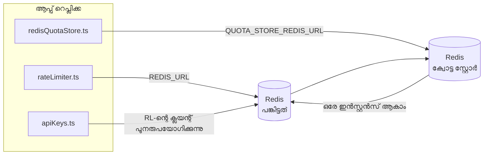

# Redis Production Configuration Guide (മലയാളം)

🌐 **Languages:** 🇺🇸 [English](../../../../ops/REDIS_PRODUCTION_CONFIG.md) · 🇪🇹 [am](../../../am/docs/ops/REDIS_PRODUCTION_CONFIG.md) · 🇸🇦 [ar](../../../ar/docs/ops/REDIS_PRODUCTION_CONFIG.md) · 🇦🇿 [az](../../../az/docs/ops/REDIS_PRODUCTION_CONFIG.md) · 🇧🇬 [bg](../../../bg/docs/ops/REDIS_PRODUCTION_CONFIG.md) · 🇧🇩 [bn](../../../bn/docs/ops/REDIS_PRODUCTION_CONFIG.md) · 🇨🇿 [cs](../../../cs/docs/ops/REDIS_PRODUCTION_CONFIG.md) · 🇩🇰 [da](../../../da/docs/ops/REDIS_PRODUCTION_CONFIG.md) · 🇩🇪 [de](../../../de/docs/ops/REDIS_PRODUCTION_CONFIG.md) · 🇬🇷 [el](../../../el/docs/ops/REDIS_PRODUCTION_CONFIG.md) · 🇪🇸 [es](../../../es/docs/ops/REDIS_PRODUCTION_CONFIG.md) · 🇪🇪 [et](../../../et/docs/ops/REDIS_PRODUCTION_CONFIG.md) · 🇮🇷 [fa](../../../fa/docs/ops/REDIS_PRODUCTION_CONFIG.md) · 🇫🇮 [fi](../../../fi/docs/ops/REDIS_PRODUCTION_CONFIG.md) · 🇫🇷 [fr](../../../fr/docs/ops/REDIS_PRODUCTION_CONFIG.md) · 🇮🇪 [ga](../../../ga/docs/ops/REDIS_PRODUCTION_CONFIG.md) · 🇮🇳 [gu](../../../gu/docs/ops/REDIS_PRODUCTION_CONFIG.md) · 🇳🇬 [ha](../../../ha/docs/ops/REDIS_PRODUCTION_CONFIG.md) · 🇮🇱 [he](../../../he/docs/ops/REDIS_PRODUCTION_CONFIG.md) · 🇮🇳 [hi](../../../hi/docs/ops/REDIS_PRODUCTION_CONFIG.md) · 🇭🇷 [hr](../../../hr/docs/ops/REDIS_PRODUCTION_CONFIG.md) · 🇭🇺 [hu](../../../hu/docs/ops/REDIS_PRODUCTION_CONFIG.md) · 🇦🇲 [hy](../../../hy/docs/ops/REDIS_PRODUCTION_CONFIG.md) · 🇮🇩 [id](../../../id/docs/ops/REDIS_PRODUCTION_CONFIG.md) · 🇳🇬 [ig](../../../ig/docs/ops/REDIS_PRODUCTION_CONFIG.md) · 🇮🇹 [it](../../../it/docs/ops/REDIS_PRODUCTION_CONFIG.md) · 🇯🇵 [ja](../../../ja/docs/ops/REDIS_PRODUCTION_CONFIG.md) · 🇬🇪 [ka](../../../ka/docs/ops/REDIS_PRODUCTION_CONFIG.md) · 🇰🇭 [km](../../../km/docs/ops/REDIS_PRODUCTION_CONFIG.md) · 🇮🇳 [kn](../../../kn/docs/ops/REDIS_PRODUCTION_CONFIG.md) · 🇰🇷 [ko](../../../ko/docs/ops/REDIS_PRODUCTION_CONFIG.md) · 🇱🇹 [lt](../../../lt/docs/ops/REDIS_PRODUCTION_CONFIG.md) · 🇱🇻 [lv](../../../lv/docs/ops/REDIS_PRODUCTION_CONFIG.md) · 🇮🇳 [mr](../../../mr/docs/ops/REDIS_PRODUCTION_CONFIG.md) · 🇲🇾 [ms](../../../ms/docs/ops/REDIS_PRODUCTION_CONFIG.md) · 🇲🇹 [mt](../../../mt/docs/ops/REDIS_PRODUCTION_CONFIG.md) · 🇲🇲 [my](../../../my/docs/ops/REDIS_PRODUCTION_CONFIG.md) · 🇳🇵 [ne](../../../ne/docs/ops/REDIS_PRODUCTION_CONFIG.md) · 🇳🇱 [nl](../../../nl/docs/ops/REDIS_PRODUCTION_CONFIG.md) · 🇳🇴 [no](../../../no/docs/ops/REDIS_PRODUCTION_CONFIG.md) · 🇮🇳 [or](../../../or/docs/ops/REDIS_PRODUCTION_CONFIG.md) · 🇮🇳 [pa](../../../pa/docs/ops/REDIS_PRODUCTION_CONFIG.md) · 🇵🇭 [phi](../../../phi/docs/ops/REDIS_PRODUCTION_CONFIG.md) · 🇵🇱 [pl](../../../pl/docs/ops/REDIS_PRODUCTION_CONFIG.md) · 🇵🇹 [pt](../../../pt/docs/ops/REDIS_PRODUCTION_CONFIG.md) · 🇧🇷 [pt-BR](../../../pt-BR/docs/ops/REDIS_PRODUCTION_CONFIG.md) · 🇷🇴 [ro](../../../ro/docs/ops/REDIS_PRODUCTION_CONFIG.md) · 🇷🇺 [ru](../../../ru/docs/ops/REDIS_PRODUCTION_CONFIG.md) · 🇱🇰 [si](../../../si/docs/ops/REDIS_PRODUCTION_CONFIG.md) · 🇸🇰 [sk](../../../sk/docs/ops/REDIS_PRODUCTION_CONFIG.md) · 🇸🇮 [sl](../../../sl/docs/ops/REDIS_PRODUCTION_CONFIG.md) · 🇷🇸 [sr](../../../sr/docs/ops/REDIS_PRODUCTION_CONFIG.md) · 🇸🇪 [sv](../../../sv/docs/ops/REDIS_PRODUCTION_CONFIG.md) · 🇰🇪 [sw](../../../sw/docs/ops/REDIS_PRODUCTION_CONFIG.md) · 🇮🇳 [ta](../../../ta/docs/ops/REDIS_PRODUCTION_CONFIG.md) · 🇮🇳 [te](../../../te/docs/ops/REDIS_PRODUCTION_CONFIG.md) · 🇹🇭 [th](../../../th/docs/ops/REDIS_PRODUCTION_CONFIG.md) · 🇹🇷 [tr](../../../tr/docs/ops/REDIS_PRODUCTION_CONFIG.md) · 🇺🇦 [uk-UA](../../../uk-UA/docs/ops/REDIS_PRODUCTION_CONFIG.md) · 🇵🇰 [ur](../../../ur/docs/ops/REDIS_PRODUCTION_CONFIG.md) · 🇺🇿 [uz](../../../uz/docs/ops/REDIS_PRODUCTION_CONFIG.md) · 🇻🇳 [vi](../../../vi/docs/ops/REDIS_PRODUCTION_CONFIG.md) · 🇳🇬 [yo](../../../yo/docs/ops/REDIS_PRODUCTION_CONFIG.md) · 🇨🇳 [zh-CN](../../../zh-CN/docs/ops/REDIS_PRODUCTION_CONFIG.md) · 🇹🇼 [zh-TW](../../../zh-TW/docs/ops/REDIS_PRODUCTION_CONFIG.md)

---

## അവലോകനം

OmniRoute-ൽ Redis ഒരു **ഐച്ഛികമായ, സോഫ്റ്റ് ഡിപെൻഡൻസിയാണ്** — Redis ലഭ്യമല്ലാത്തപ്പോൾ ആപ്ലിക്കേഷൻ ക്രമാനുഗതമായി പ്രവർത്തനക്ഷമത കുറയ്ക്കുന്നു (ഇൻ-മെമ്മറി
ഫാൾബാക്കുകൾ). പ്രൊഡക്ഷനിൽ, Redis ട്യൂൺ ചെയ്യുന്നത് വ്യത്യസ്തമായ നാല്
വർക്ക്ലോഡുകളുടെ ലേറ്റൻസി കുറയ്ക്കുന്നു:

| വർക്ക്ലോഡ്                   | ഡ്രൈവർ                        | ക്ലയന്റ് ഫാക്ടറി                                   | കീ പാറ്റേൺ                                              |
| ---------------------------- | ----------------------------- | -------------------------------------------------- | ------------------------------------------------------- |
| റേറ്റ് ലിമിറ്റിംഗ്           | `rateLimiter.ts`              | `getRedisClient()` — ലേസി `ioredis` സിംഗിൾടൺ       | `<prefix>rl:*` Lua‑ആറ്റോമിക് റേറ്റ് ലിമിറ്റ് വിൻഡോകൾ    |
| ഓത്ത് കാഷ്                   | `apiKeys.ts`                  | `rateLimiter`-ന്റെ ക്ലയന്റ് വീണ്ടും ഉപയോഗിക്കുന്നു | TTL സഹിതമുള്ള `<prefix>auth:api_key:<sha256>`           |
| ക്വോട്ട സ്റ്റോർ              | `redisQuotaStore.ts`          | പ്രത്യേക `getRedisClient(url)` സിംഗിൾടൺ            | ഓരോ ഇൻസ്റ്റൻസിനും കോൺഫിഗർ ചെയ്യാവുന്ന `<prefix>quota:*` |
| വാംഅപ്പ് സർക്യൂട്ട് ബ്രേക്കർ | `redisCircuitBreakerStore.ts` | `circuitBreakerFactory.ts`-ലെ പ്രത്യേക ക്ലയന്റ്    | `<prefix>warmup:cb:<connectionId>`                      |

നാല് വർക്ക്ലോഡുകളും ഒരേ നെയിംസ്പേസ് പ്രിഫിക്സ് പങ്കിടുന്നതിനാൽ, ഒരൊറ്റ Redis ഇൻസ്റ്റൻസിൽ
മറ്റ് ആപ്പുകൾക്കൊപ്പം OmniRoute-ന് പ്രവർത്തിക്കാൻ കഴിയും (ഉദാ. `127.0.0.1:6379`). [കീ നെയിംസ്പേസിംഗ്](#key-namespacing) കാണുക.

---

## നിലവിലെ കോൺഫിഗറേഷൻ (കോഡ് ഡിഫോൾട്ടുകൾ)

| ക്രമീകരണം                             | മൂല്യം                                                                  | എവിടെ                                                                                 |
| ------------------------------------- | ----------------------------------------------------------------------- | ------------------------------------------------------------------------------------- |
| `REDIS_URL` എൻവ് വേരിയബിൾ             | `redis://redis:6379` (compose), ഐച്ഛികം                                 | `rateLimiter.ts:5`, `.env.example`                                                    |
| `REDIS_KEY_PREFIX` എൻവ് വേരിയബിൾ      | `omniroute:` (ഡിഫോൾട്ട്)                                                | `rateLimiter.ts`, `redisQuotaStore.ts`, `redisCircuitBreakerStore.ts`, `.env.example` |
| `QUOTA_STORE_REDIS_URL` എൻവ് വേരിയബിൾ | പ്രത്യേകമാണ്, `REDIS_URL`-ൽ നിന്ന് വ്യത്യസ്തമാകാം                       | `quota/storeFactory.ts`                                                               |
| `QUOTA_STORE_DRIVER`                  | `"sqlite"` (ഡിഫോൾട്ട്), `"redis"` ഐച്ഛികം                               | `quota/storeFactory.ts`                                                               |
| ioredis `maxRetriesPerRequest`        | `3`                                                                     | `rateLimiter.ts` ക്ലയന്റ് സൃഷ്ടിക്കൽ                                                  |
| `enableReadyCheck`                    | സജ്ജീകരിച്ചിട്ടില്ല (ioredis ഡിഫോൾട്ട്: `true`)                         | —                                                                                     |
| `lazyConnect`                         | സജ്ജീകരിച്ചിട്ടില്ല (ioredis ഡിഫോൾട്ട്: `false`)                        | —                                                                                     |
| `retryStrategy`                       | സജ്ജീകരിച്ചിട്ടില്ല (ioredis ഡിഫോൾട്ട്: 200ms അടിസ്ഥാനം, എക്സ്പോണൻഷ്യൽ) | —                                                                                     |
| TLS / പാസ്വേഡ് / DB ഇൻഡക്സ്           | **കോൺഫിഗർ ചെയ്തിട്ടില്ല**                                               | —                                                                                     |
| Sentinel / Cluster                    | **കോൺഫിഗർ ചെയ്തിട്ടില്ല** — സ്റ്റാൻഡ്അലോൺ സിംഗിൾ-നോഡ് മാത്രം            | —                                                                                     |

---

## കീ നെയിംസ്പേസിംഗ്

ഹോസ്റ്റിൽ പ്രവർത്തിക്കുന്ന മറ്റെല്ലാ സേവനങ്ങളുമായും OmniRoute ഒരു Redis ഇൻസ്റ്റൻസ് പങ്കിടുന്നു. ഒരു നെയിംസ്പേസ് ഇല്ലെങ്കിൽ,
`auth:api_key:<sha256>` അല്ലെങ്കിൽ `rl:*` പോലുള്ള കീകൾ അതേ Redis ഉപയോഗിക്കുന്ന മറ്റ് ആപ്ലിക്കേഷനുകളുടെ
കീകളുമായി കൂട്ടിയിടിക്കാം (ഈ ഇൻസ്റ്റൻസ് മറ്റ് സേവനങ്ങൾക്കൊപ്പം `127.0.0.1:6379`-ൽ Redis പ്രവർത്തിപ്പിക്കുന്നു).

OmniRoute-ന്റെ **എല്ലാ** കീകൾക്കും പ്രിഫിക്സ് ചേർക്കാൻ `REDIS_KEY_PREFIX` ശൂന്യമല്ലാത്ത ഒരു സ്ട്രിങ്ങായി സജ്ജീകരിക്കുക:

```bash
# .env — എല്ലാ OmniRoute കീകളും omniroute:rl:*, omniroute:auth:*, omniroute:quota:*, omniroute:warmup:cb:* ആയി മാറുന്നു
REDIS_KEY_PREFIX=omniroute:
```

- **ഡിഫോൾട്ട്:** `omniroute:` (`REDIS_KEY_PREFIX` സജ്ജീകരിക്കാത്തപ്പോഴോ ശൂന്യമായിരിക്കുമ്പോഴോ പ്രയോഗിക്കുന്നു).
- **പ്രയോഗിക്കുന്നത്:** റേറ്റ് ലിമിറ്റർ + ഓത്ത് കാഷ് (`keyPrefix` വഴി പങ്കിടുന്ന `ioredis` ക്ലയന്റ്), കൂടാതെ
  ക്വോട്ട സ്റ്റോർ (`KEY_PREFIX = "${REDIS_KEY_PREFIX}quota"`), വാംഅപ്പ് സർക്യൂട്ട് ബ്രേക്കർ
  (`KEY_PREFIX = "${REDIS_KEY_PREFIX}warmup:cb:"`).
- Redis-ൽ കീകൾ ഇതിനകം നിലവിലിരിക്കുമ്പോൾ **പ്രിഫിക്സ് മാറ്റുന്നത്** പഴയ കീകളെ അനാഥമാക്കുന്നു (അവ TTL / LRU വഴി
  കാലഹരണപ്പെടും). മാറ്റുന്നത് സുരക്ഷിതമാണ്; മൈഗ്രേഷൻ ആവശ്യമില്ല. നിരോധിതമായി അടയാളപ്പെടുത്തിയ ഒരു കണക്ഷനുള്ള വാംഅപ്പ്
  സർക്യൂട്ട്-ബ്രേക്കർ കീ മാത്രമാണ് ഇതിന് അപവാദം: അത് TTL ഇല്ലാതെ നിലനിർത്തുന്നതിനാൽ,
  ശേഷിക്കുന്ന കീകൾ `redis-cli --scan --pattern '<old-prefix>warmup:cb:*'` ഉപയോഗിച്ച് ലിസ്റ്റ് ചെയ്ത് ഇല്ലാതാക്കുക.
- **ioredis `keyPrefix`** റൈറ്റുകളിൽ സ്വയമേവ പ്രിഫിക്സ് മുൻചേർക്കുകയും റീഡുകളിൽ അത് നീക്കം ചെയ്യുകയും ചെയ്യുന്നതിനാൽ,
  ആപ്ലിക്കേഷൻ കോഡിൽ പ്രിഫിക്സ് ഒരിക്കലും ദൃശ്യമാകില്ല.

---

## ശുപാർശ ചെയ്യുന്ന പ്രൊഡക്ഷൻ ട്യൂണിങ്

### 1. കണക്ഷൻ പൂൾ / ക്ലയന്റ് ഓപ്ഷനുകൾ (ioredis `Redis` കൺസ്ട്രക്ടർ)

നിലവിലെ കോഡ് ഇഷ്ടാനുസൃത ഓപ്ഷനുകളൊന്നുമില്ലാതെ ഒരൊറ്റ `new Redis(url)` സൃഷ്ടിക്കുന്നു. പ്രൊഡക്ഷൻ
മൾട്ടി-റെപ്ലിക്ക വിന്യാസങ്ങൾക്കായി, കോഡിൽ ഒരു ക്ലയന്റ് ഫാക്ടറി നൽകുക അല്ലെങ്കിൽ `getRedisClient()` റാപ്പ് ചെയ്യുക:

```typescript
const redis = new Redis(REDIS_URL, {
  maxRetriesPerRequest: null, // റീട്രൈ പരിധിയില്ല; retryStrategy തീരുമാനിക്കട്ടെ
  enableReadyCheck: true, // കോളുകൾ സ്വീകരിക്കുന്നതിന് മുമ്പ് സെർവർ തയ്യാറാണെന്ന് സ്ഥിരീകരിക്കുക
  lazyConnect: true, // സൃഷ്ടിക്കുമ്പോൾ കണക്റ്റ് ചെയ്യരുത്; ആദ്യ കോളിനായി കാത്തിരിക്കുക
  retryStrategy: (times) => {
    if (times > 10) return null; // 10 റീട്രൈകൾക്കുശേഷം ഉപേക്ഷിക്കുക → പിന്നീട് വീണ്ടും കണക്റ്റ് ചെയ്യുക
    return Math.min(times * 200, 5000); // 200ms, 400ms, …, പരമാവധി 5s
  },
  enableAutoPipelining: true, // സമാന്തര കമാൻഡുകളെ ഒരൊറ്റ TCP റൈറ്റിലേക്ക് സംയോജിപ്പിക്കുക
  keepAlive: 10000, // ഓരോ 10s-ലും TCP കീപ്പ്-അലൈവ്
});
```

**പ്രധാന വിട്ടുവീഴ്ചകൾ:**

- `maxRetriesPerRequest: null` + `retryStrategy` — താൽക്കാലികമായ
  Redis പുനരാരംഭങ്ങൾ എല്ലാ അഭ്യർത്ഥനകളും ഉടൻ പരാജയപ്പെടുത്താതിരിക്കാൻ പ്രൊഡക്ഷനിൽ അഭികാമ്യം. `checkRateLimit()`-ലെ
  ഇൻ-മെമ്മറി ഫാൾബാക്ക് പരാജയ പാത കൈകാര്യം ചെയ്യുന്നു.
- `lazyConnect: true` — സെർവർ കണക്ഷനുകൾ സ്വീകരിക്കാൻ തുടങ്ങുന്നതിനുമുമ്പ് Redis പ്രവർത്തനക്ഷമമായിരിക്കണമെന്ന
  സ്റ്റാർട്ടപ്പ് ആശ്രിതത്വം ഒഴിവാക്കുന്നു.
- `enableAutoPipelining: true` — സമാന്തര റേറ്റ്-ലിമിറ്റ് പരിശോധനകൾക്കുള്ള റൗണ്ട്-ട്രിപ്പുകൾ കുറയ്ക്കുന്നു;
  ഒരൊറ്റ കണക്ഷനിൽ >50 RPS ഉണ്ടെങ്കിൽ പ്രയോജനകരമാണ്.

### 2. Redis സെർവർ കോൺഫിഗറേഷൻ (`redis.conf`)

```
# മെമ്മറി
maxmemory 80%                        # OS പേജ് കാഷിനായി ഇടം ശേഷിപ്പിക്കുക
maxmemory-policy allkeys-lru         # സമ്മർദ്ദത്തിലാകുമ്പോൾ കാലഹരണപ്പെട്ട auth കാഷ് എൻട്രികൾ നീക്കംചെയ്യുക

# പെർസിസ്റ്റൻസ് (ഐച്ഛികം — ഇതില്ലാതെയും OmniRoute ക്രാഷ്-സുരക്ഷിതമാണ്)
save 300 1                           # ≥1 കീ മാറിയിട്ടുണ്ടെങ്കിൽ കുറഞ്ഞത് ഓരോ 5 മിനിറ്റിലും സ്നാപ്പ്ഷോട്ട് എടുക്കുക
appendonly no                        # AOF ആവശ്യമില്ല; ഡാറ്റ പുനഃസൃഷ്ടിക്കാവുന്നതാണ്
appendfsync no                       # fsync ഓവർഹെഡ് ഇല്ല (RDB മതിയാകും)

# നെറ്റ്വർക്കിങ്
timeout 0                            # നിഷ്ക്രിയ കണക്ഷൻ വിച്ഛേദിക്കരുത്
tcp-keepalive 300                    # 5 മിനിറ്റ് കീപ്പ്-അലൈവ്
tcp-backlog 511                      # പെട്ടെന്നുള്ള ലോഡിനുള്ള കണക്ഷൻ ബാക്ക്ലോഗ്

# പ്രകടനം
hz 10                                # ഡിഫോൾട്ട്; ലേറ്റൻസി-സെൻസിറ്റീവ് ഉപയോഗത്തിന് 100
activedefrag yes                     # ഫ്രാഗ്മെന്റേഷൻ >10% ആകുമ്പോൾ സ്വയമേവ ഡീഫ്രാഗ്മെന്റ് ചെയ്യുക
```

**`maxmemory-policy allkeys-lru`-നുള്ള വിട്ടുവീഴ്ച:** മെമ്മറി
സമ്മർദ്ദത്തിൽ Auth കാഷ് എൻട്രികൾ നീക്കംചെയ്യപ്പെട്ടേക്കാം. ഇത് സുരക്ഷിതമാണ് — കാഷ് മിസ് സംഭവിക്കുമ്പോൾ
`setCachedApiKey` എല്ലായ്പ്പോഴും വീണ്ടും പോപ്പുലേറ്റ് ചെയ്യുന്നു, കൂടാതെ SQLite ഫാൾബാക്കാണ് ആധികാരിക ഉറവിടം.
റേറ്റ്-ലിമിറ്റർ Lua സ്ക്രിപ്റ്റ് രൂപകൽപ്പനപ്രകാരം ഹ്രസ്വായുസ്സുള്ള ചെറിയ കീകൾ സൃഷ്ടിക്കുന്നു.

### 3. Docker Compose ക്രമീകരണങ്ങൾ

പ്രൊഡക്ഷൻ compose (`docker-compose.prod.yml`) `redis:8.6.2-alpine` ഉപയോഗിക്കുന്നു. ഇനിപ്പറയുന്നത് ചേർക്കുക:

```yaml
redis:
  image: redis:8.6.2-alpine
  command:
    [
      "redis-server",
      "--maxmemory",
      "512mb",
      "--maxmemory-policy",
      "allkeys-lru",
      "--activedefrag",
      "yes",
      "--save",
      "300 1",
    ]
  healthcheck:
    test: ["CMD", "redis-cli", "ping"]
    interval: 10s
    timeout: 3s
    retries: 3
    start_period: 5s
```

### 4. മൾട്ടി-ഇൻസ്റ്റൻസ് / സ്കെയിലിങ് പരിഗണനകൾ

**എല്ലാ റെപ്ലിക്കകൾക്കുമായി ഒരൊറ്റ Redis** — റേറ്റ്-ലിമിറ്റർ Lua സ്ക്രിപ്റ്റ് ഒരൊറ്റ
ആധികാരിക കീ സ്പേസിനെ ആശ്രയിക്കുന്നു. റെപ്ലിക്കകൾക്കു പിന്നിലുള്ള ഒന്നിലധികം Redis ഇൻസ്റ്റൻസുകൾ അറ്റോമിസിറ്റി
നഷ്ടപ്പെടുത്തുകയും ബജറ്റ് ഇരട്ടിയാക്കുകയും ചെയ്യും. എല്ലാ ആപ്ലിക്കേഷൻ റെപ്ലിക്കകൾക്കുമായി ഒരൊറ്റ Redis
(അല്ലെങ്കിൽ ഫെയിൽഓവറോടുകൂടിയ Redis Sentinel ക്ലസ്റ്റർ) ഉപയോഗിക്കുക.

**കണക്ഷൻ എണ്ണം:** ഓരോ ആപ്ലിക്കേഷൻ റെപ്ലിക്കയും Redis-ലേക്ക് **2 TCP കണക്ഷനുകൾ** തുറക്കുന്നു
(റേറ്റ് ലിമിറ്റർ ക്ലയന്റ് + ക്വോട്ട സ്റ്റോർ ക്ലയന്റ്). 10 റെപ്ലിക്കകൾ → 20 കണക്ഷനുകൾ; ഇത് ഒരു ഡിഫോൾട്ട്
Redis ഇൻസ്റ്റൻസിന്റെ 10k കണക്ഷൻ പരിധിക്കുള്ളിൽ വളരെ സുരക്ഷിതമാണ്.

### 5. മോണിറ്ററിങ്

ഹെൽത്ത്-ചെക്ക് എൻഡ്പോയിന്റ് വഴി ലഭ്യമാക്കുക:

```typescript
// src/app/api/monitoring/health/route.ts ഇതിനകം rateLimiter ഫങ്ഷനുകൾ കോൾ ചെയ്യുന്നു
// Redis-നിർദ്ദിഷ്ട പരിശോധനകൾ ചേർക്കുക:
//   1. ioredis .ping() വഴിയുള്ള PING ലേറ്റൻസി
//   2. INFO memory വഴിയുള്ള മെമ്മറി ഉപയോഗം
//   3. INFO clients വഴിയുള്ള കണക്ഷൻ എണ്ണം
//   4. maxmemory-policy-യുടെ ഹിറ്റ് നിരക്ക് (evicted_keys / keyspace_hits)
```

നിരീക്ഷിക്കേണ്ട പ്രധാന മെട്രിക്കുകൾ:

- **നീക്കംചെയ്ത കീകൾ / സെക്കൻഡ്** — തുടർച്ചയായി പൂജ്യത്തേക്കാൾ കൂടുതലാണെങ്കിൽ `maxmemory` വർധിപ്പിക്കുക
- **ബ്ലോക്ക് ചെയ്യപ്പെട്ട ക്ലയന്റുകൾ** — പൂജ്യത്തേക്കാൾ കൂടുതലാണെങ്കിൽ വേഗം കുറഞ്ഞ Lua സ്ക്രിപ്റ്റുകളെയോ ഉയർന്ന മത്സരാവസ്ഥയെയോ സൂചിപ്പിക്കുന്നു
- **നിരസിക്കപ്പെട്ട കണക്ഷനുകൾ** — കണക്ഷൻ പരിധിയിലെത്തി; 20 കണക്ഷനുകളിൽ ഇത് അപൂർവമാണ്

---

## ആർക്കിടെക്ചർ ഡയഗ്രം



---

## റഫറൻസുകൾ

| ഫയൽ                                | ഉദ്ദേശ്യം                                                                       |
| ---------------------------------- | ------------------------------------------------------------------------------- |
| `src/shared/utils/rateLimiter.ts`  | പ്രാഥമിക Redis ക്ലയന്റ്, Lua റേറ്റ്-ലിമിറ്റ് സ്ക്രിപ്റ്റ്, ഇൻ-മെമ്മറി ഫാൾബാക്ക് |
| `src/lib/db/apiKeys.ts`            | ഓത്ത് കാഷ് — Redis→SQLite ഫാൾബാക്ക്                                             |
| `src/lib/quota/redisQuotaStore.ts` | ഐച്ഛിക ക്വോട്ട സ്റ്റോറിനായുള്ള പ്രത്യേക Redis ക്ലയന്റ്                          |
| `src/lib/quota/storeFactory.ts`    | `sqlite`, `redis` ക്വോട്ട ഡ്രൈവറുകൾക്കിടയിൽ മാറുന്നു                            |
| `docker-compose.prod.yml`          | പ്രൊഡക്ഷൻ Redis കണ്ടെയ്നർ (`redis:8.6.2-alpine` ഇമേജ്)                          |
| `.env.example`                     | Redis എൻവയോൺമെന്റ് വേരിയബിളുകളുടെ ഡോക്യുമെന്റേഷൻ                                |
| `src/app/api/local/redis/`         | ഡെവലപ്മെന്റ് കണ്ടെയ്നർ ഓർക്കസ്ട്രേഷനുള്ള API റൂട്ടുകൾ                           |
| `bin/cli/commands/redis.mjs`       | ഡെവലപ്മെന്റ് കണ്ടെയ്നർ ഓർക്കസ്ട്രേഷനുള്ള CLI കമാൻഡുകൾ                           |
