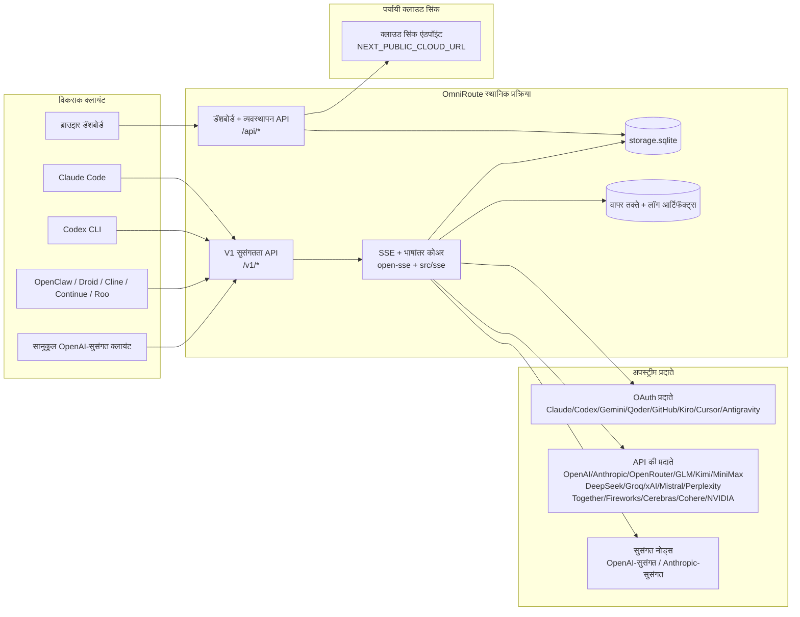
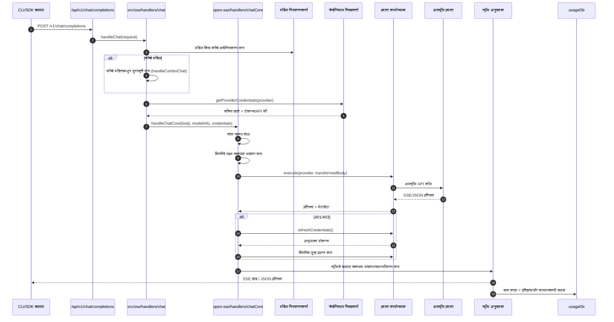
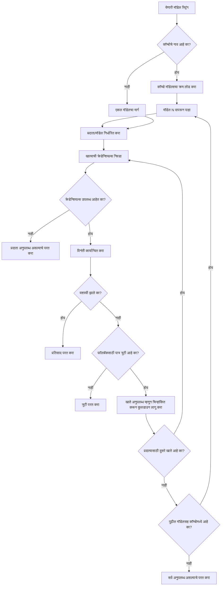
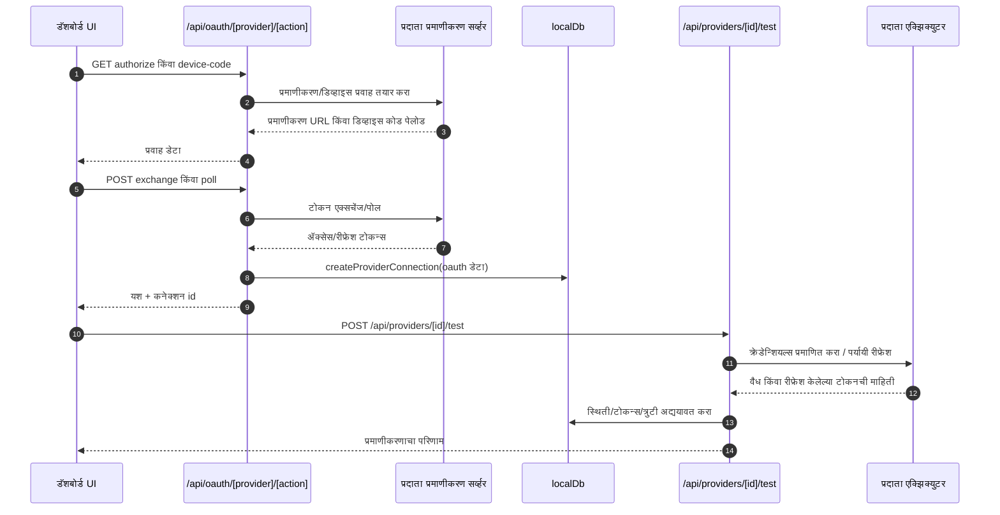
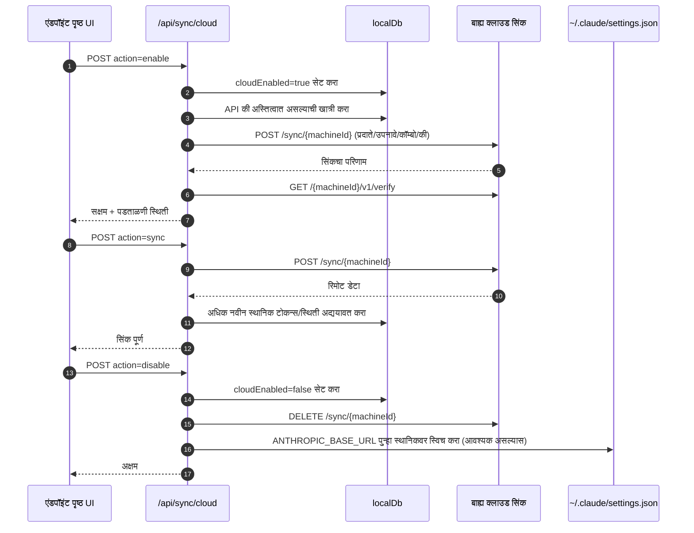
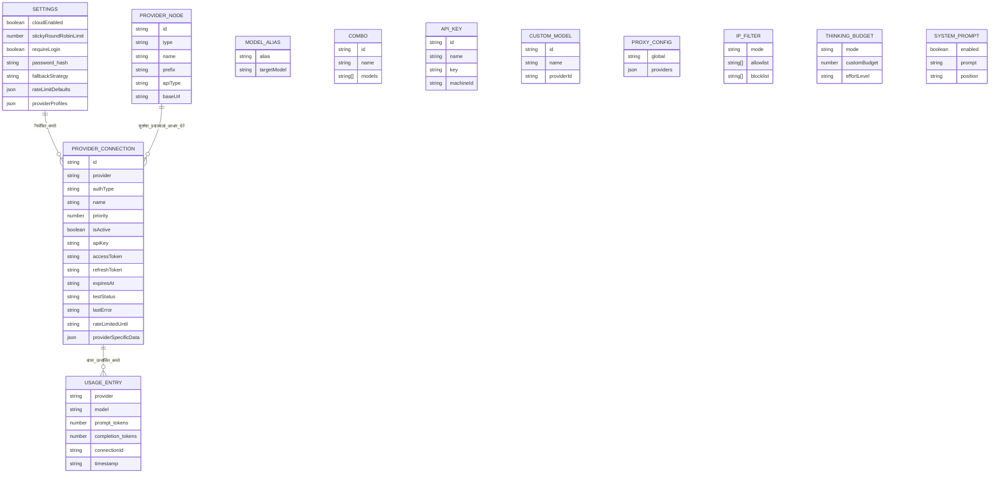
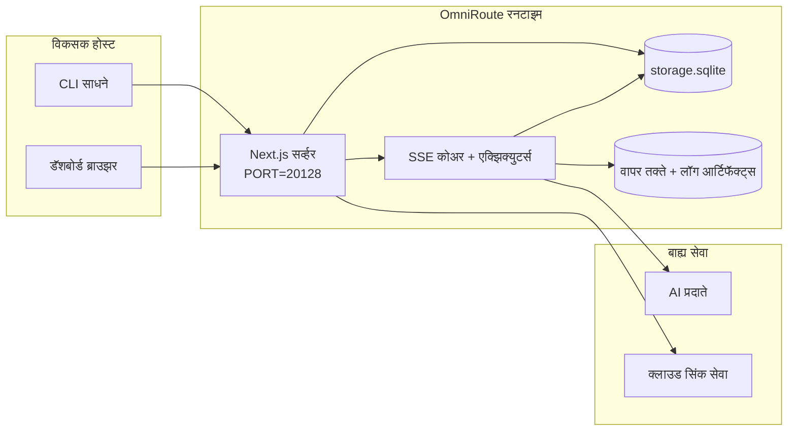

# OmniRoute Architecture (मराठी)

🌐 **Languages:** 🇺🇸 [English](../../../../architecture/ARCHITECTURE.md) · 🇪🇹 [am](../../../am/docs/architecture/ARCHITECTURE.md) · 🇸🇦 [ar](../../../ar/docs/architecture/ARCHITECTURE.md) · 🇦🇿 [az](../../../az/docs/architecture/ARCHITECTURE.md) · 🇧🇬 [bg](../../../bg/docs/architecture/ARCHITECTURE.md) · 🇧🇩 [bn](../../../bn/docs/architecture/ARCHITECTURE.md) · 🇧🇦 [bs](../../../bs/docs/architecture/ARCHITECTURE.md) · 🇨🇿 [cs](../../../cs/docs/architecture/ARCHITECTURE.md) · 🇩🇰 [da](../../../da/docs/architecture/ARCHITECTURE.md) · 🇩🇪 [de](../../../de/docs/architecture/ARCHITECTURE.md) · 🇬🇷 [el](../../../el/docs/architecture/ARCHITECTURE.md) · 🇪🇸 [es](../../../es/docs/architecture/ARCHITECTURE.md) · 🇪🇪 [et](../../../et/docs/architecture/ARCHITECTURE.md) · 🇮🇷 [fa](../../../fa/docs/architecture/ARCHITECTURE.md) · 🇫🇮 [fi](../../../fi/docs/architecture/ARCHITECTURE.md) · 🇫🇷 [fr](../../../fr/docs/architecture/ARCHITECTURE.md) · 🇮🇪 [ga](../../../ga/docs/architecture/ARCHITECTURE.md) · 🇮🇳 [gu](../../../gu/docs/architecture/ARCHITECTURE.md) · 🇳🇬 [ha](../../../ha/docs/architecture/ARCHITECTURE.md) · 🇮🇱 [he](../../../he/docs/architecture/ARCHITECTURE.md) · 🇮🇳 [hi](../../../hi/docs/architecture/ARCHITECTURE.md) · 🇭🇷 [hr](../../../hr/docs/architecture/ARCHITECTURE.md) · 🇭🇺 [hu](../../../hu/docs/architecture/ARCHITECTURE.md) · 🇦🇲 [hy](../../../hy/docs/architecture/ARCHITECTURE.md) · 🇮🇩 [id](../../../id/docs/architecture/ARCHITECTURE.md) · 🇳🇬 [ig](../../../ig/docs/architecture/ARCHITECTURE.md) · 🇮🇹 [it](../../../it/docs/architecture/ARCHITECTURE.md) · 🇯🇵 [ja](../../../ja/docs/architecture/ARCHITECTURE.md) · 🇬🇪 [ka](../../../ka/docs/architecture/ARCHITECTURE.md) · 🇰🇭 [km](../../../km/docs/architecture/ARCHITECTURE.md) · 🇮🇳 [kn](../../../kn/docs/architecture/ARCHITECTURE.md) · 🇰🇷 [ko](../../../ko/docs/architecture/ARCHITECTURE.md) · 🇱🇹 [lt](../../../lt/docs/architecture/ARCHITECTURE.md) · 🇱🇻 [lv](../../../lv/docs/architecture/ARCHITECTURE.md) · 🇮🇳 [ml](../../../ml/docs/architecture/ARCHITECTURE.md) · 🇲🇾 [ms](../../../ms/docs/architecture/ARCHITECTURE.md) · 🇲🇹 [mt](../../../mt/docs/architecture/ARCHITECTURE.md) · 🇲🇲 [my](../../../my/docs/architecture/ARCHITECTURE.md) · 🇳🇵 [ne](../../../ne/docs/architecture/ARCHITECTURE.md) · 🇳🇱 [nl](../../../nl/docs/architecture/ARCHITECTURE.md) · 🇳🇴 [no](../../../no/docs/architecture/ARCHITECTURE.md) · 🇮🇳 [or](../../../or/docs/architecture/ARCHITECTURE.md) · 🇮🇳 [pa](../../../pa/docs/architecture/ARCHITECTURE.md) · 🇵🇭 [phi](../../../phi/docs/architecture/ARCHITECTURE.md) · 🇵🇱 [pl](../../../pl/docs/architecture/ARCHITECTURE.md) · 🇵🇹 [pt](../../../pt/docs/architecture/ARCHITECTURE.md) · 🇧🇷 [pt-BR](../../../pt-BR/docs/architecture/ARCHITECTURE.md) · 🇷🇴 [ro](../../../ro/docs/architecture/ARCHITECTURE.md) · 🇷🇺 [ru](../../../ru/docs/architecture/ARCHITECTURE.md) · 🇱🇰 [si](../../../si/docs/architecture/ARCHITECTURE.md) · 🇸🇰 [sk](../../../sk/docs/architecture/ARCHITECTURE.md) · 🇸🇮 [sl](../../../sl/docs/architecture/ARCHITECTURE.md) · 🇷🇸 [sr](../../../sr/docs/architecture/ARCHITECTURE.md) · 🇸🇪 [sv](../../../sv/docs/architecture/ARCHITECTURE.md) · 🇰🇪 [sw](../../../sw/docs/architecture/ARCHITECTURE.md) · 🇮🇳 [ta](../../../ta/docs/architecture/ARCHITECTURE.md) · 🇮🇳 [te](../../../te/docs/architecture/ARCHITECTURE.md) · 🇹🇭 [th](../../../th/docs/architecture/ARCHITECTURE.md) · 🇹🇷 [tr](../../../tr/docs/architecture/ARCHITECTURE.md) · 🇺🇦 [uk-UA](../../../uk-UA/docs/architecture/ARCHITECTURE.md) · 🇵🇰 [ur](../../../ur/docs/architecture/ARCHITECTURE.md) · 🇺🇿 [uz](../../../uz/docs/architecture/ARCHITECTURE.md) · 🇻🇳 [vi](../../../vi/docs/architecture/ARCHITECTURE.md) · 🇳🇬 [yo](../../../yo/docs/architecture/ARCHITECTURE.md) · 🇨🇳 [zh-CN](../../../zh-CN/docs/architecture/ARCHITECTURE.md) · 🇹🇼 [zh-TW](../../../zh-TW/docs/architecture/ARCHITECTURE.md)

---

🌐 **Languages:** 🇺🇸 [English](../../../../architecture/ARCHITECTURE.md) · 🇪🇹 [am](../../../am/docs/architecture/ARCHITECTURE.md) · 🇸🇦 [ar](../../../ar/docs/architecture/ARCHITECTURE.md) · 🇦🇿 [az](../../../az/docs/architecture/ARCHITECTURE.md) · 🇧🇬 [bg](../../../bg/docs/architecture/ARCHITECTURE.md) · 🇧🇩 [bn](../../../bn/docs/architecture/ARCHITECTURE.md) · 🇧🇦 [bs](../../../bs/docs/architecture/ARCHITECTURE.md) · 🇨🇿 [cs](../../../cs/docs/architecture/ARCHITECTURE.md) · 🇩🇰 [da](../../../da/docs/architecture/ARCHITECTURE.md) · 🇩🇪 [de](../../../de/docs/architecture/ARCHITECTURE.md) · 🇬🇷 [el](../../../el/docs/architecture/ARCHITECTURE.md) · 🇪🇸 [es](../../../es/docs/architecture/ARCHITECTURE.md) · 🇪🇪 [et](../../../et/docs/architecture/ARCHITECTURE.md) · 🇮🇷 [fa](../../../fa/docs/architecture/ARCHITECTURE.md) · 🇫🇮 [fi](../../../fi/docs/architecture/ARCHITECTURE.md) · 🇫🇷 [fr](../../../fr/docs/architecture/ARCHITECTURE.md) · 🇮🇪 [ga](../../../ga/docs/architecture/ARCHITECTURE.md) · 🇮🇳 [gu](../../../gu/docs/architecture/ARCHITECTURE.md) · 🇳🇬 [ha](../../../ha/docs/architecture/ARCHITECTURE.md) · 🇮🇱 [he](../../../he/docs/architecture/ARCHITECTURE.md) · 🇮🇳 [hi](../../../hi/docs/architecture/ARCHITECTURE.md) · 🇭🇷 [hr](../../../hr/docs/architecture/ARCHITECTURE.md) · 🇭🇺 [hu](../../../hu/docs/architecture/ARCHITECTURE.md) · 🇦🇲 [hy](../../../hy/docs/architecture/ARCHITECTURE.md) · 🇮🇩 [id](../../../id/docs/architecture/ARCHITECTURE.md) · 🇳🇬 [ig](../../../ig/docs/architecture/ARCHITECTURE.md) · 🇮🇹 [it](../../../it/docs/architecture/ARCHITECTURE.md) · 🇯🇵 [ja](../../../ja/docs/architecture/ARCHITECTURE.md) · 🇬🇪 [ka](../../../ka/docs/architecture/ARCHITECTURE.md) · 🇰🇭 [km](../../../km/docs/architecture/ARCHITECTURE.md) · 🇮🇳 [kn](../../../kn/docs/architecture/ARCHITECTURE.md) · 🇰🇷 [ko](../../../ko/docs/architecture/ARCHITECTURE.md) · 🇱🇹 [lt](../../../lt/docs/architecture/ARCHITECTURE.md) · 🇱🇻 [lv](../../../lv/docs/architecture/ARCHITECTURE.md) · 🇮🇳 [ml](../../../ml/docs/architecture/ARCHITECTURE.md) · 🇲🇾 [ms](../../../ms/docs/architecture/ARCHITECTURE.md) · 🇲🇹 [mt](../../../mt/docs/architecture/ARCHITECTURE.md) · 🇲🇲 [my](../../../my/docs/architecture/ARCHITECTURE.md) · 🇳🇵 [ne](../../../ne/docs/architecture/ARCHITECTURE.md) · 🇳🇱 [nl](../../../nl/docs/architecture/ARCHITECTURE.md) · 🇳🇴 [no](../../../no/docs/architecture/ARCHITECTURE.md) · 🇮🇳 [or](../../../or/docs/architecture/ARCHITECTURE.md) · 🇮🇳 [pa](../../../pa/docs/architecture/ARCHITECTURE.md) · 🇵🇭 [phi](../../../phi/docs/architecture/ARCHITECTURE.md) · 🇵🇱 [pl](../../../pl/docs/architecture/ARCHITECTURE.md) · 🇵🇹 [pt](../../../pt/docs/architecture/ARCHITECTURE.md) · 🇧🇷 [pt-BR](../../../pt-BR/docs/architecture/ARCHITECTURE.md) · 🇷🇴 [ro](../../../ro/docs/architecture/ARCHITECTURE.md) · 🇷🇺 [ru](../../../ru/docs/architecture/ARCHITECTURE.md) · 🇱🇰 [si](../../../si/docs/architecture/ARCHITECTURE.md) · 🇸🇰 [sk](../../../sk/docs/architecture/ARCHITECTURE.md) · 🇸🇮 [sl](../../../sl/docs/architecture/ARCHITECTURE.md) · 🇷🇸 [sr](../../../sr/docs/architecture/ARCHITECTURE.md) · 🇸🇪 [sv](../../../sv/docs/architecture/ARCHITECTURE.md) · 🇰🇪 [sw](../../../sw/docs/architecture/ARCHITECTURE.md) · 🇮🇳 [ta](../../../ta/docs/architecture/ARCHITECTURE.md) · 🇮🇳 [te](../../../te/docs/architecture/ARCHITECTURE.md) · 🇹🇭 [th](../../../th/docs/architecture/ARCHITECTURE.md) · 🇹🇷 [tr](../../../tr/docs/architecture/ARCHITECTURE.md) · 🇺🇦 [uk-UA](../../../uk-UA/docs/architecture/ARCHITECTURE.md) · 🇵🇰 [ur](../../../ur/docs/architecture/ARCHITECTURE.md) · 🇺🇿 [uz](../../../uz/docs/architecture/ARCHITECTURE.md) · 🇻🇳 [vi](../../../vi/docs/architecture/ARCHITECTURE.md) · 🇳🇬 [yo](../../../yo/docs/architecture/ARCHITECTURE.md) · 🇨🇳 [zh-CN](../../../zh-CN/docs/architecture/ARCHITECTURE.md) · 🇹🇼 [zh-TW](../../../zh-TW/docs/architecture/ARCHITECTURE.md)

_शेवटचे अद्यतन: 2026-06-28_

## कार्यकारी सारांश

OmniRoute हे Next.js वर तयार केलेले स्थानिक AI रूटिंग गेटवे आणि डॅशबोर्ड आहे.
ते एकच OpenAI-सुसंगत एंडपॉइंट (`/v1/*`) प्रदान करते आणि भाषांतर, फॉलबॅक, टोकन रिफ्रेश व वापर ट्रॅकिंगसह अनेक अपस्ट्रीम प्रदात्यांमध्ये ट्रॅफिक रूट करते.

मुख्य क्षमता:

- CLI/साधनांसाठी OpenAI-सुसंगत API पृष्ठभाग (355 प्रदाते, 108 एक्झिक्युटर्स)
- प्रदात्यांच्या फॉरमॅटदरम्यान विनंती/प्रतिसाद भाषांतर
- मॉडेल कॉम्बो फॉलबॅक (बहु-मॉडेल क्रम)
- `compositeTiers` नुसार रनटाइम क्रमासह संरचित कॉम्बो पायऱ्या (`provider + model + connection`)
- खाते-स्तरीय फॉलबॅक (प्रत्येक प्रदात्यासाठी अनेक खाती)
- मुख्य चॅट पथामध्ये कोटा प्रीफ्लाइट आणि कोटा-जागरूक P2C खाते निवड
- OAuth + API-की प्रदाता कनेक्शन व्यवस्थापन (22 OAuth प्रदाता मॉड्यूल्स)
- `/v1/embeddings` द्वारे एम्बेडिंग निर्मिती (18 प्रदाते)
- `/v1/images/generations` द्वारे प्रतिमा निर्मिती (10+ प्रदाते, 20+ मॉडेल्स)
- `/v1/audio/transcriptions` द्वारे ऑडिओ लिप्यंतरण (18 प्रदाते)
- `/v1/audio/speech` द्वारे टेक्स्ट-टू-स्पीच (24 अंगभूत प्रदाते)
- `/v1/videos/generations` द्वारे व्हिडिओ निर्मिती (ComfyUI + SD WebUI)
- `/v1/music/generations` द्वारे संगीत निर्मिती (ComfyUI)
- `/v1/search` द्वारे वेब शोध (20 प्रदाते)
- `/v1/moderations` द्वारे मॉडरेशन
- `/v1/rerank` द्वारे पुनर्क्रमांकन
- रिझनिंग मॉडेल्ससाठी थिंक टॅग पार्सिंग (`<think>...</think>`)
- काटेकोर OpenAI SDK सुसंगततेसाठी प्रतिसाद शुद्धीकरण
- विविध प्रदात्यांमधील सुसंगततेसाठी भूमिका सामान्यीकरण (developer→system, system→user)
- संरचित आउटपुट रूपांतरण (json_schema → Gemini responseSchema)
- प्रदाते, कीज, उपनावे, कॉम्बोज, सेटिंग्ज आणि किंमतींसाठी स्थानिक सातत्यपूर्ण संचयन (122 DB मॉड्यूल्स)
- वापर/खर्च ट्रॅकिंग आणि विनंती लॉगिंग
- अनेक उपकरणे/स्थिती समक्रमणासाठी पर्यायी क्लाउड सिंक
- API प्रवेश नियंत्रणासाठी IP अनुमतीसूची/अवरोधसूची
- थिंकिंग बजेट व्यवस्थापन (पासथ्रू/स्वयंचलित/सानुकूल/अनुकूलनीय)
- जागतिक सिस्टम प्रॉम्प्ट अंतःक्षेपण
- सत्र ट्रॅकिंग आणि फिंगरप्रिंटिंग
- प्रदाता-विशिष्ट प्रोफाइल्ससह प्रत्येक खात्यासाठी वर्धित दर मर्यादा
- प्रदात्याच्या लवचिकतेसाठी सर्किट ब्रेकर पॅटर्न
- म्युटेक्स लॉकिंगसह अँटी-थंडरिंग हर्ड संरक्षण
- स्वाक्षरी-आधारित विनंती डिडुप्लिकेशन कॅशे
- डोमेन स्तर: खर्च नियम, फॉलबॅक धोरण, लॉकआउट धोरण
- कॉन्टेक्स्ट रिले: खाते रोटेशनमधील सातत्यासाठी सत्र हस्तांतरण सारांश
- डोमेन स्थितीचे सातत्यपूर्ण संचयन (फॉलबॅक्स, बजेट्स, लॉकआउट्स आणि सर्किट ब्रेकर्ससाठी SQLite राइट-थ्रू कॅशे)
- केंद्रीकृत विनंती मूल्यमापनासाठी पॉलिसी इंजिन (लॉकआउट → बजेट → फॉलबॅक)
- p50/p95/p99 विलंब एकत्रीकरणासह विनंती टेलिमेट्री
- `combo_execution_key` / `combo_step_id` द्वारे कॉम्बो लक्ष्य टेलिमेट्री आणि कॉम्बो लक्ष्याच्या स्थितीचा इतिहास
- एंड-टू-एंड ट्रेसिंगसाठी सहसंबंध ID (X-Request-Id)
- प्रत्येक API कीसाठी ऑप्ट-आउट पर्यायासह अनुपालन ऑडिट लॉगिंग
- LLM गुणवत्ता हमीसाठी मूल्यमापन फ्रेमवर्क
- रिअल-टाइम प्रदाता सर्किट ब्रेकर स्थितीसह आरोग्य डॅशबोर्ड
- 3 ट्रान्सपोर्ट्ससह MCP Server (110 साधने) (stdio/SSE/Streamable HTTP)
- कौशल्ये आणि कार्य जीवनचक्रासह A2A Server (JSON-RPC 2.0 + SSE)
- मेमरी प्रणाली (निष्कर्षण, अंतःक्षेपण, पुनर्प्राप्ती, सारांशीकरण)
- कौशल्य प्रणाली (रजिस्ट्री, एक्झिक्युटर, सँडबॉक्स, अंगभूत कौशल्ये)
- प्रमाणपत्र व्यवस्थापन आणि DNS हाताळणीसह MITM प्रॉक्सी
- प्रॉम्प्ट इंजेक्शन गार्ड मिडलवेअर
- Caveman, RTK, स्टॅक्ड पाइपलाइन्स, कॉम्प्रेशन कॉम्बोज, भाषा पॅक्स आणि विश्लेषणासह प्रॉम्प्ट कॉम्प्रेशन पाइपलाइन
- ACP (Agent Communication Protocol) रजिस्ट्री
- मॉड्यूलर OAuth प्रदाते (`src/lib/oauth/providers/` अंतर्गत 22 स्वतंत्र मॉड्यूल्स)
- विस्थापन/पूर्ण-विस्थापन स्क्रिप्ट्स
- OAuth पर्यावरण दुरुस्ती कृती
- OpenAI-सुसंगत WS क्लायंट्ससाठी WebSocket ब्रिज (`/v1/ws`)
- सिंक टोकन व्यवस्थापन (जारी करणे/रद्द करणे, ETag-आवृत्तीकृत कॉन्फिग बंडल डाउनलोड)
- प्रथम-श्रेणी प्रदाता प्रीसेट म्हणून GLM Thinking (`glmt`)
- हायब्रिड टोकन मोजणी (अंदाज फॉलबॅकसह प्रदाता-बाजूचे `/messages/count_tokens`)
- मॉडेल उपनाव स्वयंचलित सीडिंग (स्टार्टअपवेळी 30+ क्रॉस-प्रॉक्सी डायलेक्ट सामान्यीकरणे)
- SSRF गार्ड, खाजगी URL अवरोधन आणि कॉन्फिगर करण्यायोग्य पुनर्प्रयत्नासह सुरक्षित आउटबाउंड फेच
- कॉन्फिगर करण्यायोग्य `requestRetry` आणि `maxRetryIntervalSec` सह कूलडाउन-जागरूक चॅट पुनर्प्रयत्न
- स्टार्टअपवेळी Zod सह रनटाइम पर्यावरण प्रमाणीकरण
- पृष्ठांकन, प्रदाता CRUD इव्हेंट्स आणि SSRF-अवरोधित प्रमाणीकरण लॉगिंगसह अनुपालन ऑडिट v2

प्राथमिक रनटाइम मॉडेल:

- `src/app/api/*` अंतर्गत Next.js अॅप रूट्स डॅशबोर्ड API आणि सुसंगतता API दोन्ही कार्यान्वित करतात
- `src/sse/*` + `open-sse/*` मधील सामायिक SSE/रूटिंग कोअर प्रदाता अंमलबजावणी, भाषांतर, स्ट्रीमिंग, फॉलबॅक आणि वापर हाताळतो

## संदर्भ आकृत्या

v3.8.0 प्लॅटफॉर्मसाठीचे अधिकृत, आवृत्ती-नियंत्रित Mermaid स्रोत
[`docs/diagrams/`](../diagrams/README.md) मध्ये आहेत. संदर्भासाठी त्यांपैकी दोन खाली पुन्हा दिले आहेत;
उर्वरित आकृत्यांच्या लिंक त्यांच्या डोमेन-विशिष्ट मार्गदर्शिकांमध्ये दिल्या आहेत.


> स्रोत: [diagrams/request-pipeline.mmd](../diagrams/request-pipeline.mmd)


> स्रोत: [diagrams/resilience-3layers.mmd](../diagrams/resilience-3layers.mmd) — याची लिंक
> [RESILIENCE_GUIDE.md](./RESILIENCE_GUIDE.md) आणि `CLAUDE.md` मधील लवचिकता संदर्भामध्येही दिली आहे.

## व्याप्ती आणि मर्यादा

### व्याप्तीमध्ये

- स्थानिक गेटवे रनटाइम
- डॅशबोर्ड व्यवस्थापन API
- प्रदाता प्रमाणीकरण आणि टोकन रिफ्रेश
- विनंती रूपांतरण आणि SSE स्ट्रीमिंग
- स्थानिक स्थिती + वापराचे सातत्यपूर्ण संचयन
- पर्यायी क्लाउड सिंक ऑर्केस्ट्रेशन

### व्याप्तीबाहेर

- `NEXT_PUBLIC_CLOUD_URL` मागील क्लाउड सेवेची अंमलबजावणी
- स्थानिक प्रक्रियेबाहेरील प्रदाता SLA/कंट्रोल प्लेन
- बाह्य CLI बायनरी स्वतः (Claude CLI, Codex CLI इ.)

## डॅशबोर्ड पृष्ठभाग (सद्यस्थिती)

`src/app/(dashboard)/dashboard/` अंतर्गत मुख्य पृष्ठे:

- `/dashboard` — द्रुत प्रारंभ + प्रदात्यांचा आढावा
- `/dashboard/endpoint` — एंडपॉइंट प्रॉक्सी + MCP + A2A + API एंडपॉइंट टॅब
- `/dashboard/providers` — प्रदाता कनेक्शन आणि क्रेडेन्शियल्स
- `/dashboard/combos` — कॉम्बो धोरणे, टेम्पलेट्स, चरण-आधारित बिल्डर, मॉडेल राउटिंग नियम, हाताने जतन केलेला क्रम
- `/dashboard/auto-combo` — Auto Combo Engine: स्कोअरिंग वजने, मोड पॅक, आभासी फॅक्टरी प्रीसेट्स, टेलिमेट्री
- `/dashboard/costs` — खर्च एकत्रीकरण आणि किंमतींची दृश्यमानता
- `/dashboard/analytics` — वापर विश्लेषण, मूल्यमापने, कॉम्बो लक्ष्यांची स्थिती
- `/dashboard/limits` — कोटा/दर नियंत्रणे
- `/dashboard/cli-tools` — CLI प्रारंभिक मार्गदर्शन, रनटाइम शोध, कॉन्फिगरेशन निर्मिती
- `/dashboard/agents` — शोधलेले ACP एजंट + सानुकूल एजंट नोंदणी
- `/dashboard/cloud-agents` — क्लाउडवर होस्ट केलेली एजंट कार्ये (Codex Cloud, Devin, Jules) आणि कार्य जीवनचक्र
- `/dashboard/skills` — A2A कौशल्य नोंदणी, सँडबॉक्स अंमलबजावणी, अंगभूत कौशल्य सूची
- `/dashboard/memory` — सातत्यपूर्ण संभाषणात्मक मेमरीची तपासणी आणि पुनर्प्राप्ती
- `/dashboard/webhooks` — आउटबाउंड वेबहुक सदस्यत्वे, गुप्त मूल्यांचे रोटेशन, पुनर्प्रयत्न आकडेवारी
- `/dashboard/batch` — बॅच जॉब सादरीकरण आणि प्रगती
- `/dashboard/cache` — रीड-थ्रू आणि रिझनिंग कॅशे आकडेवारी, निष्कासन नियंत्रणे
- `/dashboard/playground` — कॉन्फिगर केलेल्या कोणत्याही कॉम्बो/मॉडेलसाठी परस्परसंवादी चॅट प्लेग्राउंड
- `/dashboard/changelog` — ॲपमधील बदलनोंद दर्शक (`CHANGELOG.md` रेंडर करतो)
- `/dashboard/system` — रनटाइम निदान, आवृत्ती माहिती, पर्यावरण प्रमाणीकरण पृष्ठभाग
- `/dashboard/onboarding` — नवीन इंस्टॉलेशनसाठी प्रथम-वापर सेटअप विझार्ड
- `/dashboard/media` — प्रतिमा/व्हिडिओ/संगीत प्लेग्राउंड
- `/dashboard/search-tools` — शोध प्रदाता चाचणी आणि इतिहास
- `/dashboard/health` — अपटाइम, सर्किट ब्रेकर, दर मर्यादा, कोटा-निरीक्षित सत्रे
- `/dashboard/logs` — विनंती/प्रॉक्सी/ऑडिट/कन्सोल लॉग
- `/dashboard/settings` — प्रणाली सेटिंग्जचे टॅब (सामान्य, राउटिंग, कॉम्बो डीफॉल्ट्स इ.)
- `/dashboard/context/caveman` — Caveman कॉम्प्रेशन नियम, भाषा पॅक, पूर्वावलोकन आणि आउटपुट मोड
- `/dashboard/context/rtk` — RTK कमांड-आउटपुट फिल्टर, पूर्वावलोकन आणि रनटाइम सुरक्षितता सेटिंग्ज
- `/dashboard/context/combos` — राउटिंग कॉम्बोंना नियुक्त केलेल्या नामांकित कॉम्प्रेशन पाइपलाइन
- `/dashboard/translator` — ट्रान्सलेटर तपासणी आणि विनंती स्वरूप रूपांतरणाचे पूर्वावलोकन
- `/dashboard/audit` — पृष्ठांकन आणि संरचित मेटाडेटासह अनुपालन ऑडिट लॉग ब्राउझर
- `/dashboard/usage` — `usage_history` शी जोडलेला प्रत्येक विनंतीनुसार वापर ब्राउझर
- `/dashboard/compression` — कॉम्प्रेशन विश्लेषण, आकडेवारी आणि पाइपलाइन नियुक्ती
- `/dashboard/api-manager` — API की जीवनचक्र आणि मॉडेल परवानग्या

## उच्च-स्तरीय प्रणाली संदर्भ



## मुख्य रनटाइम घटक

## 1) API आणि राउटिंग स्तर (Next.js अॅप रूट्स)

मुख्य डिरेक्टरी:

- सुसंगतता API साठी `src/app/api/v1/*` आणि `src/app/api/v1beta/*`
- व्यवस्थापन/कॉन्फिगरेशन API साठी `src/app/api/*`
- `next.config.mjs` मधील Next रीराइट्स `/v1/*` ला `/api/v1/*` वर मॅप करतात

महत्त्वाचे सुसंगतता रूट्स:

- `src/app/api/v1/chat/completions/route.ts`
- `src/app/api/v1/messages/route.ts`
- `src/app/api/v1/responses/route.ts`
- `src/app/api/v1/models/route.ts` — `custom: true` असलेल्या सानुकूल मॉडेल्सचा समावेश
- `src/app/api/v1/embeddings/route.ts` — एम्बेडिंग निर्मिती (6 प्रदाते)
- `src/app/api/v1/images/generations/route.ts` — प्रतिमा निर्मिती (Antigravity/Nebius सह 4+ प्रदाते)
- `src/app/api/v1/messages/count_tokens/route.ts`
- `src/app/api/v1/providers/[provider]/chat/completions/route.ts` — प्रत्येक प्रदात्यासाठी स्वतंत्र चॅट
- `src/app/api/v1/providers/[provider]/embeddings/route.ts` — प्रत्येक प्रदात्यासाठी स्वतंत्र एम्बेडिंग्ज
- `src/app/api/v1/providers/[provider]/images/generations/route.ts` — प्रत्येक प्रदात्यासाठी स्वतंत्र प्रतिमा
- `src/app/api/v1beta/models/route.ts`
- `src/app/api/v1beta/models/[...path]/route.ts`

व्यवस्थापन डोमेन्स:

- प्रमाणीकरण/सेटिंग्ज: `src/app/api/auth/*`, `src/app/api/settings/*`
- प्रदाते/कनेक्शन्स: `src/app/api/providers*`
- प्रदाता नोड्स: `src/app/api/provider-nodes*`
- सानुकूल मॉडेल्स: `src/app/api/provider-models` (GET/POST/DELETE)
- मॉडेल कॅटलॉग: `src/app/api/models/route.ts` (GET)
- प्रॉक्सी कॉन्फिगरेशन: `src/app/api/settings/proxy` (GET/PUT/DELETE) + `src/app/api/settings/proxy/test` (POST)
- OAuth: `src/app/api/oauth/*`
- की/उपनावे/कॉम्बोज/किंमतनिर्धारण: `src/app/api/keys*`, `src/app/api/models/alias`, `src/app/api/combos*`, `src/app/api/pricing`
- वापर: `src/app/api/usage/*`
- सिंक/क्लाउड: `src/app/api/sync/*`, `src/app/api/cloud/*`
- CLI साधनांसाठी सहाय्यक: `src/app/api/cli-tools/*`
- IP फिल्टर: `src/app/api/settings/ip-filter` (GET/PUT)
- थिंकिंग बजेट: `src/app/api/settings/thinking-budget` (GET/PUT)
- सिस्टम प्रॉम्प्ट: `src/app/api/settings/system-prompt` (GET/PUT)
- कॉम्प्रेशन: `src/app/api/settings/compression`, `src/app/api/compression/*`, आणि
  `src/app/api/context/*`
- सेशन्स: `src/app/api/sessions` (GET)
- दर मर्यादा: `src/app/api/rate-limits` (GET)
- लवचिकता: `src/app/api/resilience` (GET/PATCH) — विनंती रांग, कनेक्शन कूलडाउन, प्रदाता ब्रेकर, कूलडाउनची प्रतीक्षा करण्याचे कॉन्फिगरेशन
- लवचिकता रीसेट: `src/app/api/resilience/reset` (POST) — प्रदाता ब्रेकर्स रीसेट करा
- कॅशे आकडेवारी: `src/app/api/cache/stats` (GET/DELETE)
- टेलिमेट्री: `src/app/api/telemetry/summary` (GET)
- बजेट: `src/app/api/usage/budget` (GET/POST)
- फॉलबॅक साखळ्या: `src/app/api/fallback/chains` (GET/POST/DELETE)
- अनुपालन ऑडिट: `src/app/api/compliance/audit-log` (GET, पृष्ठांकन + संरचित मेटाडेटासह)
- मूल्यमापन: `src/app/api/evals` (GET/POST), `src/app/api/evals/[suiteId]` (GET)
- धोरणे: `src/app/api/policies` (GET/POST)
- सिंक टोकन्स: `src/app/api/sync/tokens` (GET/POST), `src/app/api/sync/tokens/[id]` (GET/DELETE)
- कॉन्फिगरेशन बंडल: `src/app/api/sync/bundle` (GET, सेटिंग्ज/प्रदाते/कॉम्बोज/की यांचा ETag-आवृत्तीकृत स्नॅपशॉट)
- WebSocket: `src/app/api/v1/ws/route.ts` — OpenAI-सुसंगत WS क्लायंटसाठी अपग्रेड हँडलर

## 2) SSE + भाषांतर कोअर

मुख्य प्रवाह मॉड्यूल्स:

- एंट्री: `src/sse/handlers/chat.ts`
- कोअर ऑर्केस्ट्रेशन: `open-sse/handlers/chatCore.ts`
- प्रोव्हायडर एक्झिक्युशन अडॅप्टर्स: `open-sse/executors/*`
- फॉरमॅट शोध/प्रोव्हायडर कॉन्फिगरेशन: `open-sse/services/provider.ts`
- मॉडेल पार्सिंग/रिझोल्यूशन: `src/sse/services/model.ts`, `open-sse/services/model.ts`
- खाते फॉलबॅक लॉजिक: `open-sse/services/accountFallback.ts`
- भाषांतर रजिस्ट्री: `open-sse/translator/index.ts`
- स्ट्रीम रूपांतरे: `open-sse/utils/stream.ts`, `open-sse/utils/streamHandler.ts`
- वापराची माहिती काढणे/प्रमाणीकरण: `open-sse/utils/usageTracking.ts`
- थिंक टॅग पार्सर: `open-sse/utils/thinkTagParser.ts`
- एम्बेडिंग हँडलर: `open-sse/handlers/embeddings.ts`
- एम्बेडिंग प्रोव्हायडर रजिस्ट्री: `open-sse/config/embeddingRegistry.ts`
- प्रतिमा निर्मिती हँडलर: `open-sse/handlers/imageGeneration.ts`
- प्रतिमा प्रोव्हायडर रजिस्ट्री: `open-sse/config/imageRegistry.ts`
- प्रतिसाद शुद्धीकरण: `open-sse/handlers/responseSanitizer.ts`
- भूमिकेचे प्रमाणीकरण: `open-sse/services/roleNormalizer.ts`

सेवा (व्यावसायिक लॉजिक):

- खाते निवड/स्कोअरिंग: `open-sse/services/accountSelector.ts`
- कॉन्टेक्स्ट जीवनचक्र व्यवस्थापन: `open-sse/services/contextManager.ts`
- IP फिल्टर अंमलबजावणी: `open-sse/services/ipFilter.ts`
- सत्र ट्रॅकिंग: `open-sse/services/sessionManager.ts`
- विनंती डीडुप्लिकेशन: `open-sse/services/signatureCache.ts`
- सिस्टम प्रॉम्प्ट इंजेक्शन: `open-sse/services/systemPrompt.ts`
- थिंकिंग बजेट व्यवस्थापन: `open-sse/services/thinkingBudget.ts`
- वाइल्डकार्ड मॉडेल रूटिंग: `open-sse/services/wildcardRouter.ts`
- रेट लिमिट व्यवस्थापन: `open-sse/services/rateLimitManager.ts`
- सर्किट ब्रेकर: `src/shared/utils/circuitBreaker.ts`
- कॉन्टेक्स्ट हँडऑफ: `open-sse/services/contextHandoff.ts` — कॉन्टेक्स्ट-रिले धोरणासाठी हँडऑफ सारांशाची निर्मिती आणि इंजेक्शन
- कॉम्प्रेशन: `open-sse/services/compression/*` — प्रोव्हायडर भाषांतरापूर्वी सक्रिय कॉम्प्रेशन;
  यामध्ये Caveman नियम, RTK फिल्टर्स, स्टॅक्ड पाइपलाइन्स, कॉम्प्रेशन कॉम्बोज, आकडेवारी आणि प्रमाणीकरण समाविष्ट आहे
- Codex कोटा फेचर: `open-sse/services/codexQuotaFetcher.ts` — कॉन्टेक्स्ट-रिले हँडऑफ निर्णयांसाठी Codex कोटा प्राप्त करतो
- कूलडाउन-जागरूक रिट्राय: `src/sse/services/cooldownAwareRetry.ts` — कॉन्फिगर करता येणाऱ्या `requestRetry` / `maxRetryIntervalSec` सह प्रत्येक मॉडेलसाठी कूलडाउन रिट्राय
- सुरक्षित आउटबाउंड फेच: `src/shared/network/safeOutboundFetch.ts` — SSRF संरक्षण, खाजगी-URL ब्लॉकिंग, रिट्राय आणि टाइमआउटसह संरक्षित प्रोव्हायडर/मॉडेल फेच
- आउटबाउंड URL गार्ड: `src/shared/network/outboundUrlGuard.ts` — खाजगी/localhost CIDR श्रेणींशी प्रोव्हायडर URLs चे प्रमाणीकरण करतो
- प्रोव्हायडर विनंती डीफॉल्ट्स: `open-sse/services/providerRequestDefaults.ts` — प्रोव्हायडर-स्तरीय `maxTokens`, `temperature`, `thinkingBudgetTokens` डीफॉल्ट्स
- GLM प्रोव्हायडर कॉन्स्टंट्स: `open-sse/config/glmProvider.ts` — सामायिक GLM मॉडेल्स, कोटा URLs, GLMT टाइमआउट/डीफॉल्ट्स
- Antigravity अपस्ट्रीम: `open-sse/config/antigravityUpstream.ts` — बेस URL आणि डिस्कव्हरी पाथ कॉन्स्टंट्स
- Codex क्लायंट कॉन्स्टंट्स: `open-sse/config/codexClient.ts` — आवृत्तीयुक्त युजर-एजंट आणि क्लायंट-व्हर्जन मूल्ये
- मॉडेल एलियास सीड: `src/lib/modelAliasSeed.ts` — स्टार्टअपवेळी 30+ क्रॉस-प्रॉक्सी डायलेक्ट एलियासेस सीड करतो

डोमेन स्तरावरील मॉड्यूल्स:

- खर्च नियम/बजेट्स: `src/domain/costRules.ts`
- फॉलबॅक धोरण: `src/domain/fallbackPolicy.ts`
- कॉम्बो रिझॉल्वर: `src/domain/comboResolver.ts`
- लॉकआउट धोरण: `src/domain/lockoutPolicy.ts`
- धोरण इंजिन: `src/domain/policyEngine.ts` — केंद्रीकृत लॉकआउट → बजेट → फॉलबॅक मूल्यमापन
- त्रुटी कोड कॅटलॉग: `src/shared/constants/errorCodes.ts`
- विनंती ID: `src/shared/utils/requestId.ts`
- फेच टाइमआउट: `src/shared/utils/fetchTimeout.ts`
- विनंती टेलिमेट्री: `src/shared/utils/requestTelemetry.ts`
- अनुपालन/ऑडिट: `src/lib/compliance/index.ts`
- इव्हॅल रनर: `src/lib/evals/evalRunner.ts`
- डोमेन स्थिती पर्सिस्टन्स: `src/lib/db/domainState.ts` — फॉलबॅक चेन्स, बजेट्स, खर्च इतिहास, लॉकआउट स्थिती आणि सर्किट ब्रेकर्ससाठी SQLite CRUD

OAuth प्रोव्हायडर मॉड्यूल्स (`src/lib/oauth/providers/` अंतर्गत 22 स्वतंत्र फाइल्स):

- रजिस्ट्री इंडेक्स: `src/lib/oauth/providers/index.ts`
- स्वतंत्र प्रोव्हायडर्स: `agy.ts`, `antigravity.ts`, `claude.ts`, `cline.ts`, `codebuddy-cn.ts`, `codex.ts`, `cursor.ts`, `devin-desktop.ts`, `ghe-copilot.ts`, `github.ts`, `gitlab-duo.ts`, `grok-cli-oauth.ts`, `grok-cli.ts`, `kilocode.ts`, `kimi-coding.ts`, `kiro.ts`, `openference.ts`, `qoder.ts`, `trae.ts`, `xai-oauth.ts`, `zed-hosted.ts`, `zed.ts`
- थिन रॅपर: `src/lib/oauth/providers.ts` — स्वतंत्र मॉड्यूल्समधून पुन्हा एक्सपोर्ट करतो

## 5) एम्बेडेड सेवा (v3.8.4)

OmniRoute स्थानिकरीत्या चालणाऱ्या AI साधन प्रक्रियांना स्थापित करू शकते, त्यांचे पर्यवेक्षण करू शकते आणि त्यांच्याकडे विनंत्या रूट करू शकते; या प्रक्रियांना **एम्बेडेड सेवा** म्हटले जाते. पाच सेवा समाविष्ट आहेत: 9Router, CLIProxyAPI, Bifrost, Mux आणि Dario.

आर्किटेक्चरचे स्तर:

- **UI** (`/dashboard/providers/services`) — जीवनचक्र नियंत्रणे, थेट लॉग स्ट्रीमिंग, API की व्यवस्थापन आणि (9Router साठी) अंतर्गत रिव्हर्स प्रॉक्सीद्वारे एम्बेडेड नेटिव्ह UI असलेले दोन-टॅब पृष्ठ.
- **API** (`/api/services/{name}/*`) — 9Router साठी 11 एंडपॉइंट, CLIProxyAPI साठी 10 आणि Bifrost / Mux / Dario प्रत्येकी 8; सर्व **LOCAL_ONLY** म्हणून वर्गीकृत आहेत (कठोर नियम #17). सामायिक `GET /api/services/[name]/logs` SSE एंडपॉइंट दोन्ही सेवांना सेवा पुरवतो.
- **पर्यवेक्षक** (`src/lib/services/`) — सर्वसाधारण `ServiceSupervisor` क्लास `child_process.spawn` भोवती आवरण देतो, SSE लॉग स्ट्रीमिंगसाठी 5 MB रिंग बफर, हेल्थ प्रोब लूप आणि अणुस्तरीय ऑपरेशन लॉक सांभाळतो व SIGTERM→SIGKILL ग्रेसफुल शटडाउन करतो. प्रक्रिया सुरू होताना `bootstrap.ts` सर्व कॉन्फिगर केलेल्या सेवा जोडतो.
- **प्रोव्हायडर/एक्झिक्युटर** (`open-sse/executors/ninerouter.ts`) — 9Router प्रत्यक्ष प्रोव्हायडर म्हणून उपलब्ध केला जातो. मॉडेलना `9router/{sub}/{model}` हा उपसर्ग दिला जातो आणि 9Router च्या `/v1/models` एंडपॉइंटवरून दर 5 मिनिटांनी समक्रमित केले जाते.

सखोल माहिती: `docs/frameworks/EMBEDDED-SERVICES.md`

## प्रमुख उपप्रणाल्या (v3.8.0)

### A. Auto Combo इंजिन

Auto Combo स्थिर कॉम्बो व्याख्येवर अवलंबून राहण्याऐवजी विनंतीच्या वेळी रूटिंग लक्ष्यांचे गतिशीलपणे गुणांकन करून त्यांची निवड करते. हे `auto/*` मॉडेल उपसर्ग कुटुंबाला कार्यान्वित करते.

- इंजिन प्रवेशबिंदू: `open-sse/services/autoCombo/` (`autoComboEngine.ts`,
  `scoringEngine.ts`, `virtualFactory.ts`, `modePacks.ts`)
- रिझॉल्व्हर: `src/domain/comboResolver.ts` (`auto/` उपसर्गाचे स्वयंचलित शोध)
- डॅशबोर्ड: `/dashboard/auto-combo`
- टेलिमेट्री: `auto_combo_decisions` SQLite तक्ता

प्रमुख क्षमता:

- **19 रूटिंग धोरणे** (प्राधान्य, भारित, आधी-भरणे, राउंड-रॉबिन, P2C, यादृच्छिक,
  सर्वांत-कमी-वापरलेले, खर्च-अनुकूलित, रीसेट-जागरूक, रीसेट-विंडो, हेडरूम, कठोर-यादृच्छिक,
  **auto**, lkgp, संदर्भ-अनुकूलित, संदर्भ-रिले, **fusion**, तसेच फॉलबॅक मार्ग) —
  auto ही v3.8.0 मधील प्रमुख भर आहे; `fusion` (पॅनेल फॅन-आउट + निर्णायक संश्लेषण,
  `open-sse/services/fusion.ts`) हे v3.8.36 मध्ये नवीन आहे.
- **16-घटक गुणांकन**: कोटा, आरोग्य, व्यस्त खर्च, व्यस्त विलंब, कार्य अनुरूपता आणि
  आणखी दहा. घटक आणि त्यांच्या डीफॉल्ट वजनांचा प्रमाणित तक्ता
  [`docs/routing/AUTO-COMBO.md`](../routing/AUTO-COMBO.md) मध्ये आहे — तो येथे पुन्हा दिल्यास
  कालबाह्य होऊ शकणारे दुसरे स्थान तयार होईल.
- जुळणारा नामांकित कॉम्बो अस्तित्वात नसताना **व्हर्च्युअल फॅक्टरी** तात्पुरते कॉम्बो तयार करते आणि सक्षम सक्रिय प्रोव्हायडर कनेक्शनमधून उमेदवार घेते.
- **Auto उपसर्ग**: `auto/coding`, `auto/cheap`, `auto/fast`, `auto/offline`,
  `auto/smart`, `auto/lkgp` — प्रत्येकाला अनुकूलित वजन प्रोफाइलचा आधार आहे.
- **6 मोड पॅक**: `ship-fast`, `cost-saver`, `quality-first`, `offline-friendly`,
  `reliability-first` आणि `chaos-mode` — डॅशबोर्डवरून वापरता येणारी पूर्वनिश्चित वजन कॉन्फिगरेशन.
  (वरील `auto/*` उपसर्गांशी यांची गल्लत करू नका; ते विनंतीच्या वेळी वापरले जाणारे प्रकार आहेत.)

अल्गोरिदमच्या संपूर्ण तपशीलांसाठी (घटक सूत्रे, वजन ट्यूनिंग),
[`docs/routing/AUTO-COMBO.md`](../routing/AUTO-COMBO.md) पहा.

### B. क्लाउड एजंट

Cloud Agents तृतीय-पक्षाच्या होस्टेड कोड-एजंट प्लॅटफॉर्मना (Codex Cloud, Devin,
Jules) एकसमान, DB-समर्थित कार्य जीवनचक्रामागे आवरित करते. कार्य निर्मिती/तपासणीच्या सर्व एंडपॉइंटना व्यवस्थापन प्रमाणीकरण आवश्यक आहे.

- मॉड्यूल रूट: `src/lib/cloudAgent/` (`baseAgent.ts`, `registry.ts`, `api.ts`,
  `types.ts`, `db.ts`, तसेच `agents/` अंतर्गत प्रत्येक एजंटसाठी उपनिर्देशिका)
- प्रत्येक एजंटची अंमलबजावणी: `agents/codex/`, `agents/devin/`, `agents/jules/`
- सार्वजनिक एंडपॉइंट: `/api/v1/agents/tasks/*` (सूची/निर्मिती/प्राप्ती/रद्द करणे)
- व्यवस्थापन एंडपॉइंट: `/api/cloud/*` (प्रोव्हिजनिंग, स्थिती, बॅच)
- डॅशबोर्ड: `/dashboard/cloud-agents`
- संचयन: `cloud_agent_tasks` तक्ता

प्रत्येक एजंटच्या प्रोव्हिजनिंग आणि OAuth च्या तपशीलांसाठी,
[`docs/frameworks/CLOUD_AGENT.md`](../frameworks/CLOUD_AGENT.md) पहा.

### C. सुरक्षा मर्यादा

सुरक्षा मर्यादा मॉड्यूल हा हॉट-रीलोड करता येणारा मिडलवेअर स्तर आहे, जो PII, प्रॉम्प्ट इंजेक्शन आणि असुरक्षित व्हिजन सामग्रीसाठी विनंत्या व प्रतिसादांची तपासणी करतो. उल्लंघन झाल्यास विनंती HTTP **503** आणि संरचित त्रुटी कोडसह त्वरित थांबवली जाते, ज्यामुळे डाउनस्ट्रीम कॉलरना पुन्हा प्रयत्न करता येतो किंवा पर्यायी शाखा निवडता येते.

- मॉड्यूल रूट: `src/lib/guardrails/` (`base.ts`, `registry.ts`, `piiMasker.ts`,
  `promptInjection.ts`, `visionBridge.ts`, `visionBridgeHelpers.ts`)
- हॉट रीलोड: रजिस्ट्री कॉन्फिगरेशनमधील बदलांवर लक्ष ठेवते आणि त्याच ठिकाणी साखळी पुन्हा तयार करते
- जोडणी बिंदू: चॅट हँडलर प्रवेश, प्रतिमा निर्मिती हँडलर, प्रतिसाद सॅनिटायझर
- HTTP करार: उल्लंघने `error.code = "GUARDRAIL_VIOLATION"` सह `503` म्हणून दर्शवली जातात

नियमसंच तयार करणे आणि थ्रेशोल्ड ट्यूनिंगसाठी,
[`docs/security/GUARDRAILS.md`](../security/GUARDRAILS.md) पहा.

### D. डोमेन स्तर

`src/domain/` नेमस्पेस धोरणात्मक निर्णय केंद्रीकृत करते, त्यामुळे रूट हँडलरना लॉकआउट/बजेट/फॉलबॅक लॉजिक स्वतः एकत्र करावे लागत नाही.

- धोरण इंजिन: `src/domain/policyEngine.ts` — अंमलबजावणीपूर्व मूल्यमापनासाठी एकमेव प्रवेशबिंदू (लॉकआउट → बजेट → फॉलबॅक क्रम)
- खर्च नियम: `src/domain/costRules.ts`
- फॉलबॅक धोरण: `src/domain/fallbackPolicy.ts`
- लॉकआउट धोरण: `src/domain/lockoutPolicy.ts`
- टॅग-आधारित रूटिंग: `src/domain/tagRouter.ts`
- कॉम्बो रिझॉल्व्हर: `src/domain/comboResolver.ts` — कॉम्बो नावे, auto/\*
  उपसर्ग आणि वाइल्डकार्ड मॉडेल लक्ष्यांचे ठोस अंमलबजावणी योजनांमध्ये निराकरण करतो
- कनेक्शन/मॉडेल नियम जॉइनर: `src/domain/connectionModelRules.ts`
- मॉडेल उपलब्धता स्नॅपशॉट: `src/domain/modelAvailability.ts`
- प्रोव्हायडर कालबाह्यता ट्रॅकिंग: `src/domain/providerExpiration.ts`
- कोटा कॅशे: `src/domain/quotaCache.ts`
- अवनती स्थिती: `src/domain/degradation.ts`
- कॉन्फिगरेशन ऑडिट: `src/domain/configAudit.ts`
- OmniRoute प्रतिसाद मेटाडेटा बिल्डर: `src/domain/omnirouteResponseMeta.ts`
- मूल्यमापन उपप्रणाली: `src/domain/assessment/` — नियतकालिक मूल्यमापन कार्ये

### E. अधिकृतता पाइपलाइन

अधिकृतता पाइपलाइन प्रत्येक येणाऱ्या विनंतीचे वर्गीकरण करते आणि ती पाठवण्यापूर्वी
योग्य धोरण-साखळी लागू करते.

- पाइपलाइन प्रवेशबिंदू: `src/server/authz/pipeline.ts`
- विनंती वर्गीकारक: `src/server/authz/classify.ts` — सार्वजनिक
  सुसंगतता मार्ग आणि व्यवस्थापन मार्ग यांच्यात फरक करतो
- सार्वजनिक मार्गांची सूची: `src/shared/constants/publicApiRoutes.ts`
- धोरणे: `src/server/authz/policies/` — संयोजनीय विधेयके
  (`requireApiKey`, `requireManagement`, `requireFreshAuth`, इ.)
- हेडर उपयुक्तता: `src/server/authz/headers.ts`
- प्रतिपादन सहाय्यक: `src/server/authz/assertAuth.ts`
- विनंती संदर्भ: `src/server/authz/context.ts`

सार्वजनिक आणि व्यवस्थापन मार्गांमध्ये कठोर सीमा आहे: एजंट/कूलडाउन API आणि
प्रदाता बदलांसाठी व्यवस्थापन प्रमाणीकरण आवश्यक आहे (नसल्यास HTTP 401).

मार्ग वर्गीकरणाच्या संपूर्ण नियमांसाठी,
[`docs/architecture/AUTHZ_GUIDE.md`](./AUTHZ_GUIDE.md) पहा.

### F. कार्यप्रवाह FSM आणि कार्य-जागरूक राउटर

शोधलेल्या कार्यप्रवाह टप्प्यावर (नियोजन, अंमलबजावणी,
पुनरावलोकन) आणि पार्श्वभूमी-कार्य संलग्नतेवर आधारित रहदारी निर्देशित करण्यासाठी
कॉम्बो निवडीच्या वर स्तरित केलेला परिमित-स्थिती-यंत्र-चालित राउटर.

- कार्यप्रवाह FSM: `open-sse/services/workflowFSM.ts`
- कार्य-जागरूक राउटर: `open-sse/services/taskAwareRouter.ts`
- पार्श्वभूमी कार्य शोधक: `open-sse/services/backgroundTaskDetector.ts`
- उद्देश वर्गीकारक: `open-sse/services/intentClassifier.ts`

FSM स्थित्यंतरे Auto Combo च्या गुणांकनात समाविष्ट होतात, ज्यामुळे पार्श्वभूमी/स्वयंचलन
कार्यांसाठी कमी खर्चिक मॉडेल्सना आणि परस्परसंवादी नियोजन/पुनरावलोकन टप्प्यांसाठी
अधिक सक्षम मॉडेल्सना प्राधान्य दिले जाते.

### G. प्रदाता-विशिष्ट लवचिकता

अनेक प्रदात्यांसोबत समर्पित लवचिकता आणि गुप्तता मॉड्यूल्स दिली जातात, जी
जागतिक सर्किट ब्रेकर / कनेक्शन कूलडाउन / मॉडेल लॉकआउट स्तरांचा आधार घेतात:

- Antigravity 429 इंजिन: `open-sse/services/antigravity429Engine.ts` (ओळख
  बदलते, प्रतिसाद हेडर्स स्वच्छ करते, आणि `antigravityCredits.ts`,
  `antigravityHeaderScrub.ts`, `antigravityHeaders.ts`,
  `antigravityIdentity.ts`, `antigravityVersion.ts` द्वारे क्रेडिट्स/आवृत्ती ट्रॅकिंग चालवते)
- ModelScope कोटा धोरण: `open-sse/services/modelscopePolicy.ts`
- Claude Code CCH (Compatibility Channel Handshake): `open-sse/services/claudeCodeCCH.ts`,
  तसेच `claudeCodeCompatible.ts`, `claudeCodeConstraints.ts`, `claudeCodeExtraRemap.ts`,
  `claudeCodeToolRemapper.ts`
- Claude Code फिंगरप्रिंट आकारणी: `open-sse/services/claudeCodeFingerprint.ts`
- Claude Code अस्पष्टीकरण: `open-sse/services/claudeCodeObfuscation.ts`

संपूर्ण गुप्तता कार्यपद्धती आणि परिचालन मार्गदर्शनासाठी,
`docs/security/STEALTH_GUIDE.md` पहा (git; `/docs` मध्ये संकलित केलेले नाही).

### H. वेबहुक्स, तर्क कॅश, वाचन कॅश

- **वेबहुक्स** — प्रदाता/खाते/कार्य घटनांसाठी बाह्य पाठवणी.
  - प्रेषक: `src/lib/webhookDispatcher.ts`
  - संचयन: `webhooks` SQLite तक्ता (`src/lib/db/webhooks.ts` द्वारे)
  - डॅशबोर्ड: `/dashboard/webhooks` (सदस्यता, गुपिते, पुनर्प्रयत्न इतिहास)
  - घटना वर्गीकरण आणि पुनर्प्रयत्नाच्या अर्थविषयक तपशीलांसाठी, [`docs/frameworks/WEBHOOKS.md`](../frameworks/WEBHOOKS.md) पहा.
- **तर्क कॅश** — विचार टोकन्स उत्सर्जित करणाऱ्या प्रदात्यांसाठी (Claude, GLMT, इ.)
  पुन्हा वापरता येण्याजोगे तर्क ब्लॉक्स, जेणेकरून सलग टप्प्यांमध्ये पुन्हा विचार करणे टाळता येईल.
  - DB स्तर: `src/lib/db/reasoningCache.ts`
  - सेवा स्तर: `open-sse/services/reasoningCache.ts`
  - पुनर्वापराच्या अर्थविषयक तपशीलांसाठी, [`docs/routing/REASONING_REPLAY.md`](../routing/REASONING_REPLAY.md) पहा.
- **वाचन कॅश** — स्वाक्षरीनुसार कळीबद्ध केलेला आणि बिघडलेल्या अपस्ट्रीम SDK कडून
  येणारे एकसारखे पुनर्प्रयत्न एकत्र करण्यासाठी वापरला जाणारा अल्पकालीन प्रतिसाद कॅश.
  - DB स्तर: `src/lib/db/readCache.ts`
  - आकडेवारी एंडपॉइंट: `GET /api/cache/stats`, डॅशबोर्ड `/dashboard/cache` येथे

## 3) सातत्य स्तर

प्राथमिक स्थिती DB (SQLite):

- मुख्य पायाभूत सुविधा: `src/lib/db/core.ts` (better-sqlite3, स्थलांतरे, WAL)
- DB प्रवेश: विशिष्ट `src/lib/db/*` मॉड्यूल्स थेट आयात करा (जुने `localDb.ts` बॅरल काढून टाकले आहे)
- फाइल: `${DATA_DIR}/storage.sqlite` (`$XDG_CONFIG_HOME` सेट केलेले असल्यास `$XDG_CONFIG_HOME/omniroute/storage.sqlite`, अन्यथा `~/.omniroute/storage.sqlite`)
- घटक (टेबल्स + KV नेमस्पेसेस): providerConnections, providerNodes, modelAliases, combos, apiKeys, settings, pricing, **customModels**, **proxyConfig**, **ipFilter**, **thinkingBudget**, **systemPrompt**

वापर सातत्य:

- दर्शनी स्तर: `src/lib/usageDb.ts` (`src/lib/usage/*` मधील विभाजित मॉड्यूल्स)
- `storage.sqlite` मधील SQLite टेबल्स: `usage_history`, `call_logs`, `proxy_logs`
- सुसंगतता/डीबगिंगसाठी पर्यायी फाइल आर्टिफॅक्ट्स कायम राहतात (`${DATA_DIR}/log.txt`, `${DATA_DIR}/call_logs/`, `<repo>/logs/...`)
- अस्तित्वात असलेल्या जुन्या JSON फाइल्सचे स्टार्टअप स्थलांतरांद्वारे SQLite मध्ये स्थलांतर केले जाते

डोमेन स्थिती DB (SQLite):

- `src/lib/db/domainState.ts` — डोमेन स्थितीसाठी CRUD क्रिया
- टेबल्स (`src/lib/db/core.ts` मध्ये तयार केलेली): `domain_fallback_chains`, `domain_budgets`, `domain_cost_history`, `domain_lockout_state`, `domain_circuit_breakers`
- राइट-थ्रू कॅश पॅटर्न: रनटाइममध्ये इन-मेमरी Maps अधिकृत असतात; बदल SQLite मध्ये समकालिकपणे लिहिले जातात; कोल्ड स्टार्टवेळी DB मधून स्थिती पुनर्संचयित केली जाते

## 4) प्रमाणीकरण + सुरक्षा पृष्ठभाग

- डॅशबोर्ड कुकी प्रमाणीकरण: `src/proxy.ts`, `src/app/api/auth/login/route.ts`
- API की निर्मिती/पडताळणी: `src/shared/utils/apiKey.ts`
- प्रदाता गुपिते `providerConnections` नोंदींमध्ये कायमस्वरूपी साठवली जातात
- `open-sse/utils/proxyFetch.ts` (पर्यावरणीय चल) आणि `open-sse/utils/networkProxy.ts` (प्रति-प्रदाता किंवा जागतिक स्तरावर कॉन्फिगर करण्यायोग्य) द्वारे आउटबाउंड प्रॉक्सी समर्थन
- SSRF / आउटबाउंड URL संरक्षक: `src/shared/network/outboundUrlGuard.ts` — सर्व प्रदाता कॉल्ससाठी खासगी/लूपबॅक/लिंक-लोकल श्रेणी अवरोधित करतो
- रनटाइम पर्यावरण पडताळणी: `src/lib/env/runtimeEnv.ts` — सर्व पर्यावरणीय चलांसाठी Zod स्कीमा, ज्यातील समस्या स्टार्टअप त्रुटी/इशारे म्हणून दर्शवल्या जातात
- सिंक टोकन्स: `src/lib/db/syncTokens.ts` — कॉन्फिगरेशन बंडल डाउनलोड एंडपॉइंट्ससाठी व्याप्तीबद्ध टोकन्स; `sync_tokens` SQLite टेबलद्वारे समर्थित (स्थलांतर `024_create_sync_tokens.sql`)
- WebSocket हँडशेक प्रमाणीकरण: `src/lib/ws/handshake.ts` — API की किंवा सत्र कुकीद्वारे WS अपग्रेड विनंत्यांची पडताळणी करते

## 5) क्लाउड सिंक

- शेड्युलर आरंभीकरण: `src/lib/initCloudSync.ts`, `src/shared/services/initializeCloudSync.ts`, `src/shared/services/modelSyncScheduler.ts`
- नियतकालिक कार्य: `src/shared/services/cloudSyncScheduler.ts`
- नियतकालिक कार्य: `src/shared/services/modelSyncScheduler.ts`
- नियंत्रण रूट: `src/app/api/sync/cloud/route.ts`

## विनंती जीवनचक्र (`/v1/chat/completions`)



## कॉम्बो + खाते फॉलबॅक प्रवाह



फॉलबॅकचे निर्णय स्थिती कोड आणि त्रुटी-संदेश ह्युरिस्टिक्स वापरणाऱ्या `open-sse/services/accountFallback.ts` द्वारे घेतले जातात. कॉम्बो राउटिंगमध्ये एक अतिरिक्त सुरक्षा तपासणी जोडली जाते: अपस्ट्रीम सामग्री-अवरोध आणि भूमिका-प्रमाणीकरण अपयशांसारख्या प्रदाता-व्याप्तीतील 400 त्रुटींना मॉडेल-स्थानिक अपयश मानले जाते, जेणेकरून त्यानंतरची कॉम्बो लक्ष्ये तरीही चालू शकतील.

## OAuth ऑनबोर्डिंग आणि टोकन रीफ्रेश जीवनचक्र



थेट ट्रॅफिकदरम्यान रीफ्रेश `open-sse/handlers/chatCore.ts` मध्ये एक्झिक्युटरच्या `refreshCredentials()` द्वारे कार्यान्वित केला जातो.

## क्लाउड सिंक जीवनचक्र (सक्षम करा / सिंक करा / अक्षम करा)



क्लाउड सक्षम असताना नियतकालिक सिंक `CloudSyncScheduler` द्वारे ट्रिगर केले जाते.

## डेटा मॉडेल आणि स्टोरेज नकाशा



प्रत्यक्ष स्टोरेज फाइल्स:

- प्राथमिक रनटाइम DB: `${DATA_DIR}/storage.sqlite`
- विनंती लॉग ओळी: `${DATA_DIR}/log.txt` (सुसंगतता/डीबग आर्टिफॅक्ट)
- संरचित कॉल पेलोड संग्रह: `${DATA_DIR}/call_logs/`
- पर्यायी ट्रान्सलेटर/विनंती डीबग सत्रे: `<repo>/logs/...`

## डिप्लॉयमेंट टोपोलॉजी



## मॉड्यूल मॅपिंग (निर्णयासाठी महत्त्वाचे)

### रूट आणि API मॉड्यूल्स

- `src/app/api/v1/*`, `src/app/api/v1beta/*`: सुसंगतता APIs
- `src/app/api/v1/providers/[provider]/*`: प्रत्येक प्रदात्यासाठी समर्पित रूट्स (चॅट, एम्बेडिंग्ज, प्रतिमा)
- `src/app/api/providers*`: प्रदाता CRUD, प्रमाणीकरण, चाचणी
- `src/app/api/provider-nodes*`: सानुकूल सुसंगत नोड व्यवस्थापन
- `src/app/api/provider-models`: सानुकूल मॉडेल व्यवस्थापन (CRUD)
- `src/app/api/models/route.ts`: मॉडेल कॅटलॉग API (उपनावे + सानुकूल मॉडेल्स)
- `src/app/api/oauth/*`: OAuth/डिव्हाइस-कोड प्रवाह
- `src/app/api/keys*`: स्थानिक API की जीवनचक्र
- `src/app/api/models/alias`: उपनाव व्यवस्थापन
- `src/app/api/combos*`: फॉलबॅक कॉम्बो व्यवस्थापन
- `src/app/api/pricing`: खर्च गणनेसाठी किंमत ओव्हरराइड्स
- `src/app/api/settings/proxy`: प्रॉक्सी कॉन्फिगरेशन (GET/PUT/DELETE)
- `src/app/api/settings/proxy/test`: आउटबाउंड प्रॉक्सी कनेक्टिव्हिटी चाचणी (POST)
- `src/app/api/usage/*`: वापर आणि लॉग्स APIs
- `src/app/api/sync/*` + `src/app/api/cloud/*`: क्लाउड सिंक आणि क्लाउड-अभिमुख सहाय्यके
- `src/app/api/cli-tools/*`: स्थानिक CLI कॉन्फिगरेशन रायटर्स/चेकर्स
- `src/app/api/settings/ip-filter`: IP अनुमतसूची/अवरोधसूची (GET/PUT)
- `src/app/api/settings/thinking-budget`: थिंकिंग टोकन बजेट कॉन्फिगरेशन (GET/PUT)
- `src/app/api/settings/system-prompt`: जागतिक सिस्टीम प्रॉम्प्ट (GET/PUT)
- `src/app/api/settings/compression`: जागतिक कॉम्प्रेशन सेटिंग्ज (GET/PUT)
- `src/app/api/compression/*`: कॉम्प्रेशन पूर्वावलोकन, नियम मेटाडेटा आणि भाषा पॅक्स
- `src/app/api/context/caveman/config`: Caveman सेटिंग्जचे उपनाव (GET/PUT)
- `src/app/api/context/rtk/*`: RTK कॉन्फिगरेशन, फिल्टर कॅटलॉग, चाचणी एंडपॉइंट आणि कच्चे आउटपुट पुनर्प्राप्ती
- `src/app/api/context/combos*`: कॉम्प्रेशन कॉम्बो CRUD आणि रूटिंग-कॉम्बो असाइनमेंट्स
- `src/app/api/context/analytics`: कॉम्प्रेशन अॅनालिटिक्सचे उपनाव
- `src/app/api/sessions`: सक्रिय सत्रांची सूची (GET)
- `src/app/api/rate-limits`: प्रत्येक खात्याची दरमर्यादा स्थिती (GET)
- `src/app/api/sync/tokens`: सिंक टोकन CRUD (GET/POST)
- `src/app/api/sync/tokens/[id]`: सिंक टोकन मिळवणे/हटवणे (GET/DELETE)
- `src/app/api/sync/bundle`: कॉन्फिगरेशन बंडल डाउनलोड (GET, ETag आवृत्तीकरण)
- `src/app/api/v1/ws`: OpenAI-सुसंगत WS क्लायंट्ससाठी WebSocket अपग्रेड हँडलर

### रूटिंग आणि एक्झिक्युशन कोअर

- `src/sse/handlers/chat.ts`: विनंती पार्सिंग, कॉम्बो हाताळणी, खाते निवड लूप
- `open-sse/handlers/chatCore.ts`: भाषांतर, एक्झिक्युटर डिस्पॅच, पुनःप्रयत्न/रिफ्रेश हाताळणी, स्ट्रीम सेटअप
- `open-sse/executors/*`: प्रदाता-विशिष्ट नेटवर्क आणि स्वरूप वर्तन

### भाषांतर रजिस्ट्री आणि स्वरूप कन्व्हर्टर्स

- `open-sse/translator/index.ts`: ट्रान्सलेटर रजिस्ट्री आणि ऑर्केस्ट्रेशन
- विनंती ट्रान्सलेटर्स: `open-sse/translator/request/*` (9 मॉड्यूल्स — `antigravity-to-openai`, `claude-to-gemini`, `claude-to-openai`, `gemini-to-openai`, `openai-responses`, `openai-to-claude`, `openai-to-cursor`, `openai-to-gemini`, `openai-to-kiro`)
- प्रतिसाद ट्रान्सलेटर्स: `open-sse/translator/response/*` (11 मॉड्यूल्स — `claude-to-openai`, `cursor-to-openai`, `gemini-to-claude`, `gemini-to-openai`, `kiro-to-openai`, `openai-responses`, `openai-to-antigravity`, `openai-to-claude`, `openai-to-gemini`, `openai-to-gemini-sse`, `responsesToolItem`)
- सहाय्यक: `open-sse/translator/helpers/*` (12 मॉड्यूल्स — `claudeHelper`, `geminiHelper`, `geminiToolsSanitizer`, `jsonUtil`, `markdownBoundary`, `maxTokensHelper`, `openaiHelper`, `responsesApiHelper`, `schemaCoercion`, `strictSystemHoist`, `toolCallHelper`, `toolCallShim`)
- स्वरूप स्थिरांक: `open-sse/translator/formats.ts`
- बूटस्ट्रॅप आणि रजिस्ट्री: `open-sse/translator/bootstrap.ts`, `open-sse/translator/registry.ts`
- प्रतिमा-स्वरूप सहाय्यक: `open-sse/translator/image/`

### सातत्यपूर्ण संचयन

- `src/lib/db/*`: SQLite वरील सातत्यपूर्ण कॉन्फिगरेशन/स्थिती आणि डोमेन संचयन
- `src/lib/db/*`: विशिष्ट मॉड्यूल्स थेट इम्पोर्ट करा — बॅरल वापरू नका (जुना `localDb.ts` री-एक्सपोर्ट स्तर काढून टाकला आहे)
- `src/lib/usageDb.ts`: SQLite टेबल्सवर आधारित वापर इतिहास/कॉल लॉग्स फसाड

## प्रोव्हायडर एक्झिक्युटर कव्हरेज (स्ट्रॅटेजी पॅटर्न)

प्रत्येक प्रोव्हायडरसाठी `BaseExecutor` (`open-sse/executors/base.ts` मधील) विस्तारित करणारा एक विशेषीकृत एक्झिक्युटर असतो, जो URL तयार करणे, हेडर तयार करणे, एक्स्पोनेन्शियल बॅकऑफसह पुनर्प्रयत्न, क्रेडेन्शियल रिफ्रेश हुक्स आणि `execute()` ऑर्केस्ट्रेशन पद्धत प्रदान करतो.

| एक्झिक्युटर               | प्रदाता                                                                                                                                                        | विशेष हाताळणी                                                          |
| ------------------------- | -------------------------------------------------------------------------------------------------------------------------------------------------------------- | ---------------------------------------------------------------------- |
| `DefaultExecutor`         | OpenAI, Claude, Gemini, Qwen, OpenRouter, GLM, Kimi, MiniMax, DeepSeek, Groq, xAI, Mistral, Perplexity, Together, Fireworks, Cerebras, Cohere, NVIDIA, इत्यादी | प्रत्येक प्रदात्यानुसार डायनॅमिक URL/हेडर कॉन्फिगरेशन                  |
| `AntigravityExecutor`     | Google Antigravity                                                                                                                                             | कस्टम प्रकल्प/सत्र ID, Retry-After पार्सिंग, 429 अस्पष्टीकरण           |
| `AzureOpenAIExecutor`     | Azure OpenAI                                                                                                                                                   | डिप्लॉयमेंट-आधारित रूटिंग, api-version क्वेरीची सक्ती                  |
| `BlackboxWebExecutor`     | Blackbox AI (वेब-मोड)                                                                                                                                          | TLS फिंगरप्रिंट एम्युलेशनसह वेब-सत्र रिव्हर्स                          |
| `ClaudeIdentityExecutor`  | Claude.ai (CCH मार्ग)                                                                                                                                          | निर्बंध + टूल-रीमॅप पाइपलाइन, फिंगरप्रिंट शेपिंग                       |
| `CliProxyApiExecutor`     | CLIProxyAPI-सुसंगत प्रदाते                                                                                                                                     | कस्टम प्रमाणीकरण आणि प्रोटोकॉल हाताळणी                                 |
| `CloudflareAiExecutor`    | Cloudflare Workers AI                                                                                                                                          | खाते ID इंजेक्शन, Neurons-आधारित वापर ट्रॅकिंग                         |
| `CodexExecutor`           | OpenAI Codex                                                                                                                                                   | सिस्टम सूचना इंजेक्ट करतो, रीझनिंग प्रयत्नांची सक्ती करतो              |
| `ChatGptWebCodexExecutor` | ChatGPT Web (Codex)                                                                                                                                            | थ्रेड/टर्न पिनिंगसह ब्राउझर-सत्र Responses API ब्रिज                   |
| `CommandCodeExecutor`     | Command Code                                                                                                                                                   | OAuth + प्रत्येक सत्रासाठी हेडर रोटेशन                                 |
| `CursorExecutor`          | Cursor IDE                                                                                                                                                     | ConnectRPC प्रोटोकॉल, Protobuf एन्कोडिंग, चेकसमद्वारे विनंती स्वाक्षरी |
| `DevinCliExecutor`        | Devin CLI                                                                                                                                                      | क्लाउड एजंट मॉड्यूलद्वारे Devin कार्य जीवनचक्र ब्रिजिंग                |
| `GithubExecutor`          | GitHub Copilot                                                                                                                                                 | Copilot टोकन रिफ्रेश, VSCode-सदृश हेडर                                 |
| `GitlabExecutor`          | GitLab Duo                                                                                                                                                     | GitLab OAuth + प्रकल्प-व्याप्त रूटिंग                                  |
| `GlmExecutor`             | Z.AI GLM (`glmt` प्रीसेटसह)                                                                                                                                    | थिंकिंग-बजेट-जागरूक, GLMT प्रीसेट स्थिरांक                             |
| `GrokWebExecutor`         | xAI Grok वेब                                                                                                                                                   | वेब-सत्र रिव्हर्स, मोड निवड (विचार/मानक)                               |
| `KieExecutor`             | KIE                                                                                                                                                            | फिरत्या सत्र अँकरसह कस्टम टोकन जारी करणे                               |
| `KiroExecutor`            | AWS CodeWhisperer/Kiro                                                                                                                                         | AWS EventStream बायनरी स्वरूप → SSE रूपांतरण                           |
| `MuseSparkWebExecutor`    | Muse Spark (वेब)                                                                                                                                               | प्रतिमा-संदेश ब्रिजिंगसह वेब-सत्र रिव्हर्स                             |
| `NlpCloudExecutor`        | NLP Cloud                                                                                                                                                      | प्रदाता-विशिष्ट विनंती बॉडीची रचना                                     |
| `OpenCodeExecutor`        | OpenCode                                                                                                                                                       | AI SDK-सुसंगत प्रदाता सेटअप                                            |
| `PerplexityWebExecutor`   | Perplexity वेब                                                                                                                                                 | चॅट पुढे सुरू ठेवण्यासाठी वेब-सत्र रिव्हर्स                            |
| `PetalsExecutor`          | Petals वितरित इन्फरन्स                                                                                                                                         | विकेंद्रीकृत स्वॉर्म रूटिंग                                            |
| `PollinationsExecutor`    | Pollinations AI                                                                                                                                                | API की आवश्यक नाही, दर-मर्यादित विनंत्या                               |
| `QoderExecutor`           | Qoder AI                                                                                                                                                       | PAT आणि OAuth समर्थन, बहु-मॉडेल विनामूल्य स्तर                         |
| `VertexExecutor`          | Google Vertex AI                                                                                                                                               | सेवा खाते प्रमाणीकरण, प्रदेश-आधारित एंडपॉइंट                           |
| `DevinDesktopExecutor`    | Devin Desktop                                                                                                                                                  | आयात केलेली API की + Connect-protobuf चॅट स्ट्रीमिंग                   |

इतर सर्व प्रदाते (`custom compatible nodes`सह) `DefaultExecutor` वापरतात.

## प्रदाता सुसंगतता मॅट्रिक्स

> **टीप:** खालील मॅट्रिक्स हा OmniRoute v3.8.0 मध्ये नोंदणीकृत असलेल्या 351 प्रदात्यांपैकी एक प्रातिनिधिक नमुना आहे.
> अधिकृत आणि सातत्याने अद्ययावत केल्या जाणाऱ्या सूचीसाठी,
> [`docs/reference/PROVIDER_REFERENCE.md`](../reference/PROVIDER_REFERENCE.md) (स्वयं-निर्मित) पहा किंवा
> `src/shared/constants/providers.ts` मधील अधिकृत स्रोत पहा (लोड करताना Zod-द्वारे सत्यापित).

| प्रदाता             | स्वरूप           | प्रमाणीकरण            | स्ट्रीम          | नॉन-स्ट्रीम | टोकन रिफ्रेश | वापर API               |
| ------------------- | ---------------- | --------------------- | ---------------- | ----------- | ------------ | ---------------------- |
| Claude              | claude           | API की / OAuth        | ✅               | ✅          | ✅           | ⚠️ केवळ अॅडमिन         |
| Gemini              | gemini           | API की / OAuth        | ✅               | ✅          | ✅           | ⚠️ Cloud Console       |
| Antigravity         | antigravity      | OAuth                 | ✅               | ✅          | ✅           | ✅ संपूर्ण कोटा API    |
| OpenAI              | openai           | API की                | ✅               | ✅          | ❌           | ❌                     |
| Codex               | openai-responses | OAuth                 | ✅ अनिवार्य      | ❌          | ✅           | ✅ दर मर्यादा          |
| ChatGPT Web (Codex) | openai-responses | ब्राउझर सत्र          | ✅ अनिवार्य      | ❌          | ❌           | ❌                     |
| GitHub Copilot      | openai           | OAuth + Copilot टोकन  | ✅               | ✅          | ✅           | ✅ कोटा स्नॅपशॉट्स     |
| Cursor              | cursor           | कस्टम चेकसम           | ✅               | ✅          | ❌           | ❌                     |
| Kiro                | kiro             | AWS SSO OIDC          | ✅ (EventStream) | ❌          | ✅           | ✅ वापर मर्यादा        |
| Qoder               | openai           | OAuth / PAT           | ✅               | ✅          | ✅           | ⚠️ प्रत्येक विनंतीसाठी |
| Kilo Code           | openai           | OAuth                 | ✅               | ✅          | ✅           | ❌                     |
| Cline               | openai           | OAuth                 | ✅               | ✅          | ✅           | ❌                     |
| Kimi Coding         | openai           | OAuth                 | ✅               | ✅          | ✅           | ❌                     |
| OpenRouter          | openai           | API की                | ✅               | ✅          | ❌           | ❌                     |
| GLM/Kimi/MiniMax    | claude           | API की                | ✅               | ✅          | ❌           | ❌                     |
| DeepSeek            | openai           | API की                | ✅               | ✅          | ❌           | ❌                     |
| Groq                | openai           | API की                | ✅               | ✅          | ❌           | ❌                     |
| xAI (Grok)          | openai           | API की                | ✅               | ✅          | ❌           | ❌                     |
| Mistral             | openai           | API की                | ✅               | ✅          | ❌           | ❌                     |
| Perplexity          | openai           | API की                | ✅               | ✅          | ❌           | ❌                     |
| Together AI         | openai           | API की                | ✅               | ✅          | ❌           | ❌                     |
| Fireworks AI        | openai           | API की                | ✅               | ✅          | ❌           | ❌                     |
| Cerebras            | openai           | API की                | ✅               | ✅          | ❌           | ❌                     |
| Cohere              | openai           | API की                | ✅               | ✅          | ❌           | ❌                     |
| NVIDIA NIM          | openai           | API की                | ✅               | ✅          | ❌           | ❌                     |
| Cloudflare AI       | openai           | API टोकन + खाते ID    | ✅               | ✅          | ❌           | ❌                     |
| Pollinations        | openai           | काहीही नाही (की नाही) | ✅               | ✅          | ❌           | ❌                     |
| Scaleway AI         | openai           | API की                | ✅               | ✅          | ❌           | ❌                     |
| LongCat             | openai           | API की                | ✅               | ✅          | ❌           | ❌                     |
| Ollama Cloud        | openai           | API की (पर्यायी)      | ✅               | ✅          | ❌           | ❌                     |
| HuggingFace         | openai           | API की                | ✅               | ✅          | ❌           | ❌                     |
| Nebius              | openai           | API की                | ✅               | ✅          | ❌           | ❌                     |
| SiliconFlow         | openai           | API की                | ✅               | ✅          | ❌           | ❌                     |
| Hyperbolic          | openai           | API की                | ✅               | ✅          | ❌           | ❌                     |
| Vertex AI           | gemini           | सेवा खाते             | ✅               | ✅          | ✅           | ⚠️ Cloud Console       |
| Command Code        | openai           | OAuth                 | ✅               | ✅          | ✅           | ⚠️ प्रत्येक विनंतीसाठी |
| Z.AI / GLM          | openai           | API की / OAuth        | ✅               | ✅          | ❌           | ❌                     |
| GLMT (प्रीसेट)      | claude           | API की                | ✅               | ✅          | ❌           | ⚠️ प्रत्येक विनंतीसाठी |
| Kimi Coding         | openai           | OAuth / API की        | ✅               | ✅          | ✅           | ❌                     |
| KIE                 | openai           | API की                | ✅               | ✅          | ❌           | ❌                     |
| Devin Desktop       | openai           | इंपोर्ट केलेली API की | ✅ (Connect→SSE) | ✅          | ❌           | ⚠️ प्रत्येक विनंतीसाठी |
| GitLab Duo          | openai           | OAuth (GitLab)        | ✅               | ✅          | ✅           | ❌                     |
| Devin CLI           | openai           | स्थानिक CLI लॉगिन     | ✅               | ✅          | ❌           | ✅ कार्य API           |
| Codex Cloud         | openai-responses | OAuth                 | ✅               | ❌          | ✅           | ✅ दर मर्यादा          |
| Jules               | openai           | OAuth                 | ✅               | ✅          | ✅           | ✅ कार्य API           |
| AgentRouter         | openai           | API की                | ✅               | ✅          | ❌           | ❌                     |
| Grok-Web            | openai           | सत्र कुकी             | ✅               | ✅          | ❌           | ❌                     |
| Perplexity-Web      | openai           | सत्र कुकी             | ✅               | ✅          | ❌           | ❌                     |
| BlackBox-Web        | openai           | सत्र कुकी + TLS       | ✅               | ✅          | ❌           | ❌                     |
| Muse-Spark-Web      | openai           | सत्र कुकी             | ✅               | ✅          | ❌           | ❌                     |
| ModelScope          | openai           | API की                | ✅               | ✅          | ❌           | ⚠️ कोटा धोरण           |
| BazaarLink          | openai           | API की                | ✅               | ✅          | ❌           | ❌                     |
| Petals              | openai           | काहीही नाही           | ✅               | ✅          | ❌           | ❌                     |
| Qoder               | openai           | OAuth / PAT           | ✅               | ✅          | ✅           | ⚠️ प्रत्येक विनंतीसाठी |
| OpenCode (Go/Zen)   | openai           | OAuth                 | ✅               | ✅          | ✅           | ❌                     |
| CLIProxyAPI         | openai           | कस्टम                 | ✅               | ✅          | ❌           | ❌                     |

## स्वरूप भाषांतर व्याप्ती

आढळलेल्या स्रोत स्वरूपांमध्ये पुढील स्वरूपांचा समावेश आहे:

- `openai`
- `openai-responses`
- `claude`
- `gemini`

लक्ष्य स्वरूपांमध्ये पुढील स्वरूपांचा समावेश आहे:

- OpenAI chat/Responses
- Claude
- Gemini/Antigravity envelope
- Kiro
- Cursor

भाषांतरांसाठी **OpenAI हे केंद्रस्थानी असलेले स्वरूप म्हणून वापरले जाते** — सर्व रूपांतरणे OpenAI मधून मध्यस्थ स्वरूप म्हणून जातात:

```
स्रोत स्वरूप → OpenAI (केंद्र) → लक्ष्य स्वरूप
```

स्रोत पेलोडची रचना आणि प्रदात्याचे लक्ष्य स्वरूप यांवर आधारित भाषांतरे गतिशीलपणे निवडली जातात.

भाषांतर पाइपलाइनमधील अतिरिक्त प्रक्रिया स्तर:

- **प्रतिसाद शुद्धीकरण** — SDK चे काटेकोर अनुपालन सुनिश्चित करण्यासाठी OpenAI-स्वरूपातील प्रतिसादांमधून (स्ट्रीमिंग आणि नॉन-स्ट्रीमिंग दोन्ही) गैर-मानक फील्ड काढून टाकते
- **भूमिका सामान्यीकरण** — OpenAI व्यतिरिक्त इतर लक्ष्यांसाठी `developer` → `system` रूपांतरित करते; system भूमिका नाकारणाऱ्या मॉडेल्ससाठी (GLM, ERNIE) `system` → `user` विलीन करते
- **Think टॅग निष्कर्षण** — मजकुरातील `<think>...</think>` ब्लॉक्स पार्स करून ते `reasoning_content` फील्डमध्ये ठेवते
- **संरचित आउटपुट** — OpenAI `response_format.json_schema` चे Gemini च्या `responseMimeType` + `responseSchema` मध्ये रूपांतर करते

## समर्थित API एंडपॉइंट्स

| एंडपॉइंट                                           | स्वरूप                 | हँडलर                                                                       |
| -------------------------------------------------- | ---------------------- | --------------------------------------------------------------------------- |
| `POST /v1/chat/completions`                        | OpenAI Chat            | `src/sse/handlers/chat.ts`                                                  |
| `POST /v1/messages`                                | Claude Messages        | समान हँडलर (स्वयंचलितपणे शोधले जाते)                                        |
| `POST /v1/responses`                               | OpenAI Responses       | `open-sse/handlers/responsesHandler.ts`                                     |
| `POST /v1/embeddings`                              | OpenAI Embeddings      | `open-sse/handlers/embeddings.ts`                                           |
| `GET /v1/embeddings`                               | मॉडेल सूची             | API रूट                                                                     |
| `POST /v1/images/generations`                      | OpenAI Images          | `open-sse/handlers/imageGeneration.ts`                                      |
| `GET /v1/images/generations`                       | मॉडेल सूची             | API रूट                                                                     |
| `POST /v1/providers/{provider}/chat/completions`   | OpenAI Chat            | मॉडेल प्रमाणीकरणासह प्रत्येक प्रदात्यासाठी समर्पित                          |
| `POST /v1/providers/{provider}/embeddings`         | OpenAI Embeddings      | मॉडेल प्रमाणीकरणासह प्रत्येक प्रदात्यासाठी समर्पित                          |
| `POST /v1/providers/{provider}/images/generations` | OpenAI Images          | मॉडेल प्रमाणीकरणासह प्रत्येक प्रदात्यासाठी समर्पित                          |
| `POST /v1/messages/count_tokens`                   | Claude टोकन गणना       | API रूट                                                                     |
| `GET /v1/models`                                   | OpenAI मॉडेल सूची      | API रूट (chat + embedding + image + custom मॉडेल्स)                         |
| `GET /api/models/catalog`                          | कॅटलॉग                 | प्रदाता + प्रकारानुसार गटबद्ध केलेली सर्व मॉडेल्स                           |
| `POST /v1beta/models/*:streamGenerateContent`      | Gemini मूळ स्वरूप      | API रूट                                                                     |
| `GET/PUT/DELETE /api/settings/proxy`               | प्रॉक्सी कॉन्फिगरेशन   | नेटवर्क प्रॉक्सी कॉन्फिगरेशन                                                |
| `POST /api/settings/proxy/test`                    | प्रॉक्सी कनेक्टिव्हिटी | प्रॉक्सी स्थिती/कनेक्टिव्हिटी चाचणी एंडपॉइंट                                |
| `GET/POST/DELETE /api/provider-models`             | प्रदाता मॉडेल्स        | सानुकूल आणि व्यवस्थापित उपलब्ध मॉडेल्सना आधार देणारा प्रदाता मॉडेल मेटाडेटा |

## बायपास हँडलर

बायपास हँडलर (`open-sse/utils/bypassHandler.ts`) Claude CLI कडून येणाऱ्या ज्ञात "तात्पुरत्या" विनंत्या — वॉर्मअप पिंग्स, शीर्षक निष्कर्षणे आणि टोकन मोजणी — इंटरसेप्ट करतो आणि अपस्ट्रीम प्रदात्याची टोकन्स वापरल्याशिवाय **बनावट प्रतिसाद** परत करतो. `User-Agent` मध्ये `claude-cli` असल्यावरच हे ट्रिगर होते.

## विनंती लॉगिंग आणि आर्टिफॅक्ट्स

जुना फाइल-आधारित विनंती लॉगर (`open-sse/utils/requestLogger.ts`) केवळ
लेगसी सुसंगततेसाठी राखून ठेवला आहे. सध्याच्या रनटाइम करारामध्ये पुढील बाबी वापरल्या जातात:

- `<repo>/logs/` अंतर्गत लिहिल्या जाणाऱ्या ॲप्लिकेशन आणि ऑडिट लॉग्ससाठी `APP_LOG_TO_FILE=true`
- `call_logs` मधील SQLite-आधारित कॉल लॉग रेकॉर्ड्स
- कॉल लॉग पाइपलाइन सक्षम असताना `${DATA_DIR}/call_logs/YYYY-MM-DD/...` आर्टिफॅक्ट्स

## बिघाडाचे प्रकार आणि लवचिकता

## 1) खाते/प्रदाता उपलब्धता

- पुन्हा प्रयत्न करता येण्याजोग्या अपस्ट्रीम बिघाडांवर कनेक्शन कूलडाउन
- विनंती अयशस्वी करण्यापूर्वी पर्यायी खाते वापरणे
- सध्याचा मॉडेल/प्रदाता मार्ग संपल्यावर कॉम्बो मॉडेलवर फॉलबॅक

## 2) टोकन कालबाह्यता

- रिफ्रेश करता येणाऱ्या प्रदात्यांसाठी पूर्व-तपासणी आणि पुन्हा प्रयत्नासह रिफ्रेश
- मुख्य मार्गात रिफ्रेश प्रयत्नानंतर 401/403 साठी पुन्हा प्रयत्न

## 3) स्ट्रीम सुरक्षितता

- डिस्कनेक्शनची जाणीव असलेला स्ट्रीम कंट्रोलर
- स्ट्रीम-समाप्ती फ्लश आणि `[DONE]` हाताळणीसह भाषांतर स्ट्रीम
- प्रदात्याचा वापर मेटाडेटा उपलब्ध नसताना वापराच्या अंदाजासाठी फॉलबॅक

## 4) क्लाउड सिंकची अवनती

- सिंक त्रुटी दर्शवल्या जातात, परंतु स्थानिक रनटाइम सुरू राहतो
- शेड्युलरमध्ये पुन्हा प्रयत्न करण्यास सक्षम लॉजिक आहे, परंतु नियतकालिक अंमलबजावणी सध्या डीफॉल्टनुसार एकाच प्रयत्नाचा सिंक कॉल करते

## 5) डेटा अखंडता

- स्टार्टअपवेळी SQLite स्कीमा मायग्रेशन्स आणि स्वयंचलित अपग्रेड हुक्स
- लेगसी JSON → SQLite मायग्रेशनसाठी सुसंगतता मार्ग

## 6) SSRF / आउटबाउंड URL गार्ड

- `src/shared/network/outboundUrlGuard.ts` सर्व खाजगी/लूपबॅक/लिंक-लोकल लक्ष्य URLs प्रदाता एक्झिक्युटर्सपर्यंत पोहोचण्यापूर्वी ब्लॉक करते
- प्रदाता मॉडेल शोध आणि प्रमाणीकरण रूट्स `src/shared/network/safeOutboundFetch.ts` वापरतात, जे प्रत्येक आउटबाउंड विनंतीपूर्वी गार्ड लागू करते
- गार्ड त्रुटी HTTP 422 सह `URL_GUARD_BLOCKED` म्हणून दर्शवल्या जातात आणि `providerAudit.ts` द्वारे अनुपालन ऑडिट ट्रेलमध्ये लॉग केल्या जातात

## निरीक्षणक्षमता आणि कार्यान्वयन संकेत

रनटाइम दृश्यमानतेचे स्रोत:

- `src/sse/utils/logger.ts` मधील कन्सोल लॉग्स
- SQLite (`usage_history`, `call_logs`, `proxy_logs`) मधील प्रत्येक विनंतीचे एकत्रित वापर आकडे
- `settings.detailed_logs_enabled=true` असताना SQLite (`request_detail_logs`) मधील चार-टप्प्यांतील तपशीलवार पेलोड कॅप्चर्स
- `log.txt` मधील मजकूर-आधारित विनंती स्थिती लॉग (पर्यायी/सुसंगतता)
- `APP_LOG_TO_FILE=true` असताना `logs/` अंतर्गत पर्यायी ॲप्लिकेशन लॉग फाइल्स
- कॉल लॉग पाइपलाइन सक्षम असताना `${DATA_DIR}/call_logs/` अंतर्गत पर्यायी विनंती आर्टिफॅक्ट्स
- UI वापरासाठी डॅशबोर्ड वापर एंडपॉइंट्स (`/api/usage/*`)

तपशीलवार विनंती पेलोड कॅप्चर प्रत्येक रूट केलेल्या कॉलसाठी जास्तीत जास्त चार JSON पेलोड टप्पे संग्रहित करते:

- क्लायंटकडून प्राप्त झालेली कच्ची विनंती
- प्रत्यक्षात अपस्ट्रीमकडे पाठवलेली भाषांतरित विनंती
- JSON म्हणून पुनर्रचित केलेला प्रदाता प्रतिसाद; स्ट्रीम केलेले प्रतिसाद अंतिम सारांश आणि स्ट्रीम मेटाडेटामध्ये संक्षिप्त केले जातात
- OmniRoute द्वारे परत केलेला अंतिम क्लायंट प्रतिसाद; स्ट्रीम केलेले प्रतिसाद त्याच संक्षिप्त सारांश स्वरूपात संग्रहित केले जातात

## सुरक्षिततेच्या दृष्टीने संवेदनशील सीमा

- JWT गुपित (`JWT_SECRET`) डॅशबोर्ड सत्र कुकीचे सत्यापन/स्वाक्षरी सुरक्षित करते
- प्रारंभिक पासवर्ड बूटस्ट्रॅप (`INITIAL_PASSWORD`) प्रथम-रन प्रोव्हिजनिंगसाठी स्पष्टपणे कॉन्फिगर केले पाहिजे
- API की HMAC गुपित (`API_KEY_SECRET`) व्युत्पन्न केलेल्या स्थानिक API कीचे स्वरूप सुरक्षित करते
- प्रदाता गुपिते (API की/टोकन) स्थानिक DB मध्ये कायमस्वरूपी साठवली जातात आणि फाइलसिस्टम स्तरावर संरक्षित केली पाहिजेत
- क्लाउड सिंक एंडपॉइंट्स API की प्रमाणीकरण + मशीन आयडी सिमॅन्टिक्सवर अवलंबून असतात

## पर्यावरण आणि रनटाइम मॅट्रिक्स

कोडद्वारे सक्रियपणे वापरले जाणारे पर्यावरण चल:

- अॅप/प्रमाणीकरण: `JWT_SECRET`, `INITIAL_PASSWORD`
- स्टोरेज: `DATA_DIR`
- पर्यायी स्टोरेज बेस ओव्हरराइड (`DATA_DIR` सेट नसताना Linux/macOS वर): `XDG_CONFIG_HOME`
- सुरक्षा हॅशिंग: `API_KEY_SECRET`, `MACHINE_ID_SALT`
- लॉगिंग: `APP_LOG_TO_FILE`, `APP_LOG_RETENTION_DAYS`, `CALL_LOG_RETENTION_DAYS`
- सिंक/क्लाउड URL संरचना: `NEXT_PUBLIC_BASE_URL`, `NEXT_PUBLIC_CLOUD_URL`
- आउटबाउंड प्रॉक्सी: `HTTP_PROXY`, `HTTPS_PROXY`, `ALL_PROXY`, `NO_PROXY` आणि लोअरकेस रूपे
- SOCKS5 वैशिष्ट्य फ्लॅग्स: `ENABLE_SOCKS5_PROXY`, `NEXT_PUBLIC_ENABLE_SOCKS5_PROXY`
- प्लॅटफॉर्म/रनटाइम सहाय्यके (अॅप-विशिष्ट कॉन्फिगरेशन नाही): `APPDATA`, `NODE_ENV`, `PORT`, `HOSTNAME`

## ज्ञात आर्किटेक्चरल नोंदी

1. `usageDb` आणि `localDb` लेगसी फाइल स्थलांतरासह समान बेस डिरेक्टरी धोरण (`DATA_DIR` -> `XDG_CONFIG_HOME/omniroute` -> `~/.omniroute`) सामायिक करतात.
2. अर्थविषयक फरक टाळण्यासाठी `/api/v1/route.ts`, `/api/v1/models` द्वारे वापरल्या जाणाऱ्या त्याच एकीकृत कॅटलॉग बिल्डरकडे (`src/app/api/v1/models/catalog.ts`) काम सोपवते.
3. विनंती लॉगर सक्षम असताना संपूर्ण हेडर्स/बॉडी लिहितो; लॉग डिरेक्टरी संवेदनशील समजा.
4. क्लाउडचे वर्तन योग्य `NEXT_PUBLIC_BASE_URL` आणि क्लाउड एंडपॉइंटच्या पोहोचक्षमतेवर अवलंबून असते.
5. `open-sse/` डिरेक्टरी `@omniroute/open-sse` **npm workspace package** म्हणून प्रकाशित केली जाते. स्रोत कोड ती `@omniroute/open-sse/...` द्वारे आयात करतो (Next.js `transpilePackages` द्वारे रिझॉल्व्ह केले जाते). सुसंगततेसाठी या दस्तऐवजातील फाइल पाथ्समध्ये अजूनही `open-sse/` हे डिरेक्टरी नाव वापरले आहे.
6. डॅशबोर्डमधील चार्ट्स सुलभतेने वापरता येणाऱ्या, परस्परसंवादी विश्लेषणात्मक व्हिज्युअलायझेशन्ससाठी (मॉडेल वापराचे बार चार्ट्स, यशाच्या दरांसह प्रदाता ब्रेकडाउन तक्ते) **Recharts** (SVG-आधारित) वापरतात.
7. E2E चाचण्या **Playwright** (`tests/e2e/`) वापरतात आणि `npm run test:e2e` द्वारे चालवल्या जातात. युनिट चाचण्या **Node.js test runner** (`tests/unit/`) वापरतात आणि `npm run test:unit` द्वारे चालवल्या जातात. `src/` अंतर्गत स्रोत कोड **TypeScript** (`.ts`/`.tsx`) मध्ये आहे; `open-sse/` वर्कस्पेस JavaScript (`.js`) मध्येच राहते.
8. सेटिंग्ज पृष्ठ 7 टॅबमध्ये आयोजित केले आहे: सामान्य, स्वरूप, AI, सुरक्षा, राउटिंग, लवचिकता, प्रगत. लवचिकता पृष्ठ केवळ विनंती रांग, कनेक्शन कूलडाउन, प्रदाता ब्रेकर आणि कूलडाउनची प्रतीक्षा करण्याचे वर्तन कॉन्फिगर करते; ब्रेकरची थेट रनटाइम स्थिती आरोग्य पृष्ठावर दर्शवली जाते.
9. **Context Relay** धोरण (`context-relay`) दोन स्तरांमध्ये विभागले आहे: हँडऑफ व्युत्पन्न करावा की नाही हे `combo.ts` ठरवते, तर खाते रिझॉल्यूशननंतर `chat.ts` हँडऑफ अंतर्भूत करते. हँडऑफ डेटा `context_handoffs` SQLite तक्त्यात असतो. हे विभाजन हेतुपुरस्सर आहे, कारण प्रत्यक्ष खाते बदलले की नाही हे फक्त `chat.ts` ला माहीत असते.
10. **प्रॉक्सी अंमलबजावणी** आता सर्वसमावेशक आहे: `tokenHealthCheck.ts` प्रत्येक कनेक्शनसाठी प्रॉक्सी रिझॉल्व्ह करते, `/api/providers/validate` हे `runWithProxyContext` वापरते आणि Node 22 वर डिस्पॅचर सुसंगतता राखण्यासाठी `proxyFetch.ts` हे `undici.fetch()` वापरते.
11. **Node.js रनटाइम धोरण शोध**: `/api/settings/require-login` हे `nodeVersion` आणि `nodeCompatible` फील्ड्स परत करते. रनटाइम समर्थित सुरक्षित Node.js आवृत्ती-श्रेणींच्या बाहेर असल्यास लॉगिन पृष्ठ चेतावणी बॅनर दर्शवते.

## कार्यान्वयन पडताळणी तपासणीसूची

- स्रोतापासून बिल्ड करा: `npm run build`
- Docker इमेज बिल्ड करा: `docker build -t omniroute .`
- सेवा सुरू करा आणि पडताळणी करा:
- `GET /api/settings`
- `GET /api/v1/models`
- `PORT=20128` असताना CLI चे लक्ष्य बेस URL `http://<host>:20128/v1` असावे
