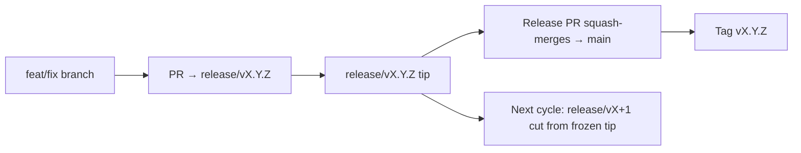

# Branching & Release Model (मराठी)

🌐 **Languages:** 🇺🇸 [English](../../../../ops/BRANCHING_MODEL.md) · 🇪🇹 [am](../../../am/docs/ops/BRANCHING_MODEL.md) · 🇸🇦 [ar](../../../ar/docs/ops/BRANCHING_MODEL.md) · 🇦🇿 [az](../../../az/docs/ops/BRANCHING_MODEL.md) · 🇧🇬 [bg](../../../bg/docs/ops/BRANCHING_MODEL.md) · 🇧🇩 [bn](../../../bn/docs/ops/BRANCHING_MODEL.md) · 🇧🇦 [bs](../../../bs/docs/ops/BRANCHING_MODEL.md) · 🇨🇿 [cs](../../../cs/docs/ops/BRANCHING_MODEL.md) · 🇩🇰 [da](../../../da/docs/ops/BRANCHING_MODEL.md) · 🇩🇪 [de](../../../de/docs/ops/BRANCHING_MODEL.md) · 🇬🇷 [el](../../../el/docs/ops/BRANCHING_MODEL.md) · 🇪🇸 [es](../../../es/docs/ops/BRANCHING_MODEL.md) · 🇪🇪 [et](../../../et/docs/ops/BRANCHING_MODEL.md) · 🇮🇷 [fa](../../../fa/docs/ops/BRANCHING_MODEL.md) · 🇫🇮 [fi](../../../fi/docs/ops/BRANCHING_MODEL.md) · 🇫🇷 [fr](../../../fr/docs/ops/BRANCHING_MODEL.md) · 🇮🇪 [ga](../../../ga/docs/ops/BRANCHING_MODEL.md) · 🇮🇳 [gu](../../../gu/docs/ops/BRANCHING_MODEL.md) · 🇳🇬 [ha](../../../ha/docs/ops/BRANCHING_MODEL.md) · 🇮🇱 [he](../../../he/docs/ops/BRANCHING_MODEL.md) · 🇮🇳 [hi](../../../hi/docs/ops/BRANCHING_MODEL.md) · 🇭🇷 [hr](../../../hr/docs/ops/BRANCHING_MODEL.md) · 🇭🇺 [hu](../../../hu/docs/ops/BRANCHING_MODEL.md) · 🇦🇲 [hy](../../../hy/docs/ops/BRANCHING_MODEL.md) · 🇮🇩 [id](../../../id/docs/ops/BRANCHING_MODEL.md) · 🇳🇬 [ig](../../../ig/docs/ops/BRANCHING_MODEL.md) · 🇮🇹 [it](../../../it/docs/ops/BRANCHING_MODEL.md) · 🇯🇵 [ja](../../../ja/docs/ops/BRANCHING_MODEL.md) · 🇬🇪 [ka](../../../ka/docs/ops/BRANCHING_MODEL.md) · 🇰🇭 [km](../../../km/docs/ops/BRANCHING_MODEL.md) · 🇮🇳 [kn](../../../kn/docs/ops/BRANCHING_MODEL.md) · 🇰🇷 [ko](../../../ko/docs/ops/BRANCHING_MODEL.md) · 🇱🇹 [lt](../../../lt/docs/ops/BRANCHING_MODEL.md) · 🇱🇻 [lv](../../../lv/docs/ops/BRANCHING_MODEL.md) · 🇮🇳 [ml](../../../ml/docs/ops/BRANCHING_MODEL.md) · 🇲🇾 [ms](../../../ms/docs/ops/BRANCHING_MODEL.md) · 🇲🇹 [mt](../../../mt/docs/ops/BRANCHING_MODEL.md) · 🇲🇲 [my](../../../my/docs/ops/BRANCHING_MODEL.md) · 🇳🇵 [ne](../../../ne/docs/ops/BRANCHING_MODEL.md) · 🇳🇱 [nl](../../../nl/docs/ops/BRANCHING_MODEL.md) · 🇳🇴 [no](../../../no/docs/ops/BRANCHING_MODEL.md) · 🇮🇳 [or](../../../or/docs/ops/BRANCHING_MODEL.md) · 🇮🇳 [pa](../../../pa/docs/ops/BRANCHING_MODEL.md) · 🇵🇭 [phi](../../../phi/docs/ops/BRANCHING_MODEL.md) · 🇵🇱 [pl](../../../pl/docs/ops/BRANCHING_MODEL.md) · 🇵🇹 [pt](../../../pt/docs/ops/BRANCHING_MODEL.md) · 🇧🇷 [pt-BR](../../../pt-BR/docs/ops/BRANCHING_MODEL.md) · 🇷🇴 [ro](../../../ro/docs/ops/BRANCHING_MODEL.md) · 🇷🇺 [ru](../../../ru/docs/ops/BRANCHING_MODEL.md) · 🇱🇰 [si](../../../si/docs/ops/BRANCHING_MODEL.md) · 🇸🇰 [sk](../../../sk/docs/ops/BRANCHING_MODEL.md) · 🇸🇮 [sl](../../../sl/docs/ops/BRANCHING_MODEL.md) · 🇷🇸 [sr](../../../sr/docs/ops/BRANCHING_MODEL.md) · 🇸🇪 [sv](../../../sv/docs/ops/BRANCHING_MODEL.md) · 🇰🇪 [sw](../../../sw/docs/ops/BRANCHING_MODEL.md) · 🇮🇳 [ta](../../../ta/docs/ops/BRANCHING_MODEL.md) · 🇮🇳 [te](../../../te/docs/ops/BRANCHING_MODEL.md) · 🇹🇭 [th](../../../th/docs/ops/BRANCHING_MODEL.md) · 🇹🇷 [tr](../../../tr/docs/ops/BRANCHING_MODEL.md) · 🇺🇦 [uk-UA](../../../uk-UA/docs/ops/BRANCHING_MODEL.md) · 🇵🇰 [ur](../../../ur/docs/ops/BRANCHING_MODEL.md) · 🇺🇿 [uz](../../../uz/docs/ops/BRANCHING_MODEL.md) · 🇻🇳 [vi](../../../vi/docs/ops/BRANCHING_MODEL.md) · 🇳🇬 [yo](../../../yo/docs/ops/BRANCHING_MODEL.md) · 🇨🇳 [zh-CN](../../../zh-CN/docs/ops/BRANCHING_MODEL.md) · 🇹🇼 [zh-TW](../../../zh-TW/docs/ops/BRANCHING_MODEL.md)

---

OmniRoute हे **समांतर-चक्र** रिलीज मॉडेल वापरते: सक्रिय चक्रासाठी स्वतंत्र `release/vX.Y.Z`
ब्रँच, प्रकाशित आवृत्ती-रेषेसाठी `main`, आणि ते चक्र रिलीज झाल्यावर अपरिवर्तनीय
`vX.Y.Z` टॅग. कमिट्स `release/*` _आणि_ `main` या दोन्हींवर येताना दिसणे अपेक्षित आहे — हा गोंधळ नाही.

मेंटेनरसाठीचे तपशील `CLAUDE.md` (कठोर नियम #21) आणि
[RELEASE_CHECKLIST.md](./RELEASE_CHECKLIST.md) मध्ये आहेत. हे पृष्ठ सार्वजनिकरित्या
योगदानकर्त्यांसाठी असलेला सारांश आहे.

## एका नजरेत

| संदर्भ           | भूमिका                                                                                 |
| ---------------- | -------------------------------------------------------------------------------------- |
| `release/vX.Y.Z` | **सक्रिय चक्र** — त्या आवृत्तीसाठी दैनंदिन विकास आणि PR मर्ज                           |
| `main`           | **प्रकाशित आवृत्ती-रेषा** — रिलीज प्रकाशित झाल्यावर squash-merge द्वारे चक्र स्वीकारते |
| `vX.Y.Z` (टॅग)   | **रिलीज चिन्हक** — रिलीजच्या वेळी तयार केलेला अपरिवर्तनीय “काय रिलीज झाले” निर्देशांक  |



## माझ्या PR ने कोणत्या ब्रँचला लक्ष्य करावे?

**सक्रिय `release/vX.Y.Z` ब्रँचला लक्ष्य करा — `main` ला नाही.**

1. सर्वाधिक आवृत्तीची खुली `release/v*` ब्रँच शोधा (हे लिहितानाचे उदाहरण:
   `release/v3.8.49`).
2. त्या टिपपासून ब्रँच तयार करा (`git fetch` + checkout / त्यावर rebase).
3. **base = ती `release/vX.Y.Z`** ठेवून PR उघडा.

`main` ही दैनंदिन इंटिग्रेशन ब्रँच नाही. `main` विरुद्ध उघडलेल्या PR चे
मर्जपूर्वी सामान्यतः लक्ष्य बदलावे लागते.

## रिलीज फ्रीझ (समांतर चक्रे)

रिलीजची जुळवणी सुरू असताना, `release-freeze` लेबल असलेली चिन्हक issue
उघडली जाते. त्यामुळे **विकास थांबत नाही**:

- फ्रीझ केलेली `release/vX.Y.Z` त्या रिलीजसाठी रिलीज कॅप्टनच्या ताब्यात असते.
- योगदानकर्त्यांना त्यांचे काम मर्ज करणे सुरू ठेवता यावे म्हणून पुढील चक्राची `release/vX+1` ब्रँच फ्रीझ केलेल्या टिपपासून तयार केली जाते.
- अजूनही फ्रीझ केलेल्या ब्रँचला लक्ष्य करणाऱ्या खुल्या PR चे लक्ष्य सक्रिय (सर्वाधिक आवृत्तीच्या) `release/v*` ब्रँचकडे **बदलले पाहिजे**.

तुम्हाला हवी असलेली ब्रँच मर्ज करण्यायोग्य आहे असे गृहीत धरण्यापूर्वी खुला फ्रीझ आहे का ते तपासा:

```bash
gh issue list --repo diegosouzapw/OmniRoute --label release-freeze --state open
```

मर्जची कार्यपद्धती (मालकाचे `queue` लेबल → Mergify)
[MERGE_TRAIN.md](./MERGE_TRAIN.md) मध्ये दस्तऐवजीकृत केली आहे.

## ब्रँच आणि टॅग दोन्ही कशासाठी?

| आर्टिफॅक्ट       | कालावधी            | उद्देश                                                                        |
| ---------------- | ------------------ | ----------------------------------------------------------------------------- |
| `release/vX.Y.Z` | प्रगतिपथावरील चक्र | परीक्षण केलेले PR संकलित करते, CI यशस्वी ठेवते आणि PR चा base म्हणून काम करते |
| टॅग `vX.Y.Z`     | कायमस्वरूपी        | npm / GitHub Releases वर रिलीज झालेल्या अचूक बिट्सना चिन्हांकित करतो          |

ब्रँच ही कार्यशाळा आहे; टॅग हे सीलबंद पॅकेज आहे. `main` मध्ये squash-merge
केल्यानंतर, आधीचा रिलीज PR पूर्ण होण्याची वाट न पाहता पुढील चक्र `release/vX+1`
वर सुरू राहते.

## संबंधित दस्तऐवज

- [CONTRIBUTING.md](../../CONTRIBUTING.md) — सेटअप, चाचण्या, PR तपासणीसूची
- [RELEASE_CHECKLIST.md](./RELEASE_CHECKLIST.md) — रिलीजपूर्व प्रमाणीकरण
- [MERGE_TRAIN.md](./MERGE_TRAIN.md) — मर्ज रांग आणि पर्यायी मर्ज ट्रेन
- [RELEASE_GREEN.md](./RELEASE_GREEN.md) — रिलीज टिप यशस्वी ठेवणे
