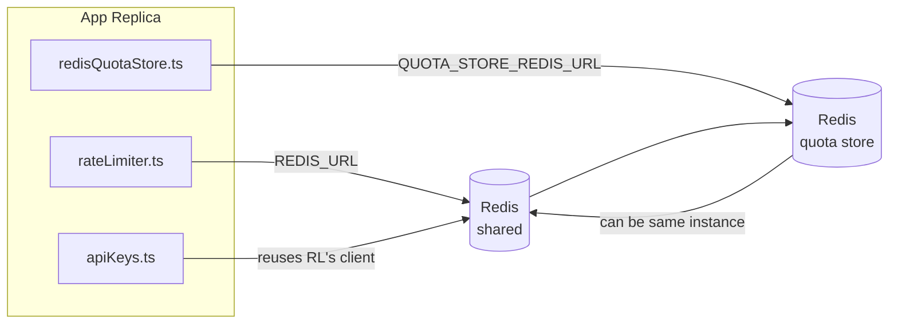

# Redis Production Configuration Guide (मराठी)

🌐 **Languages:** 🇺🇸 [English](../../../../ops/REDIS_PRODUCTION_CONFIG.md) · 🇪🇹 [am](../../../am/docs/ops/REDIS_PRODUCTION_CONFIG.md) · 🇸🇦 [ar](../../../ar/docs/ops/REDIS_PRODUCTION_CONFIG.md) · 🇦🇿 [az](../../../az/docs/ops/REDIS_PRODUCTION_CONFIG.md) · 🇧🇬 [bg](../../../bg/docs/ops/REDIS_PRODUCTION_CONFIG.md) · 🇧🇩 [bn](../../../bn/docs/ops/REDIS_PRODUCTION_CONFIG.md) · 🇧🇦 [bs](../../../bs/docs/ops/REDIS_PRODUCTION_CONFIG.md) · 🇨🇿 [cs](../../../cs/docs/ops/REDIS_PRODUCTION_CONFIG.md) · 🇩🇰 [da](../../../da/docs/ops/REDIS_PRODUCTION_CONFIG.md) · 🇩🇪 [de](../../../de/docs/ops/REDIS_PRODUCTION_CONFIG.md) · 🇬🇷 [el](../../../el/docs/ops/REDIS_PRODUCTION_CONFIG.md) · 🇪🇸 [es](../../../es/docs/ops/REDIS_PRODUCTION_CONFIG.md) · 🇪🇪 [et](../../../et/docs/ops/REDIS_PRODUCTION_CONFIG.md) · 🇮🇷 [fa](../../../fa/docs/ops/REDIS_PRODUCTION_CONFIG.md) · 🇫🇮 [fi](../../../fi/docs/ops/REDIS_PRODUCTION_CONFIG.md) · 🇫🇷 [fr](../../../fr/docs/ops/REDIS_PRODUCTION_CONFIG.md) · 🇮🇪 [ga](../../../ga/docs/ops/REDIS_PRODUCTION_CONFIG.md) · 🇮🇳 [gu](../../../gu/docs/ops/REDIS_PRODUCTION_CONFIG.md) · 🇳🇬 [ha](../../../ha/docs/ops/REDIS_PRODUCTION_CONFIG.md) · 🇮🇱 [he](../../../he/docs/ops/REDIS_PRODUCTION_CONFIG.md) · 🇮🇳 [hi](../../../hi/docs/ops/REDIS_PRODUCTION_CONFIG.md) · 🇭🇷 [hr](../../../hr/docs/ops/REDIS_PRODUCTION_CONFIG.md) · 🇭🇺 [hu](../../../hu/docs/ops/REDIS_PRODUCTION_CONFIG.md) · 🇦🇲 [hy](../../../hy/docs/ops/REDIS_PRODUCTION_CONFIG.md) · 🇮🇩 [id](../../../id/docs/ops/REDIS_PRODUCTION_CONFIG.md) · 🇳🇬 [ig](../../../ig/docs/ops/REDIS_PRODUCTION_CONFIG.md) · 🇮🇹 [it](../../../it/docs/ops/REDIS_PRODUCTION_CONFIG.md) · 🇯🇵 [ja](../../../ja/docs/ops/REDIS_PRODUCTION_CONFIG.md) · 🇬🇪 [ka](../../../ka/docs/ops/REDIS_PRODUCTION_CONFIG.md) · 🇰🇭 [km](../../../km/docs/ops/REDIS_PRODUCTION_CONFIG.md) · 🇮🇳 [kn](../../../kn/docs/ops/REDIS_PRODUCTION_CONFIG.md) · 🇰🇷 [ko](../../../ko/docs/ops/REDIS_PRODUCTION_CONFIG.md) · 🇱🇹 [lt](../../../lt/docs/ops/REDIS_PRODUCTION_CONFIG.md) · 🇱🇻 [lv](../../../lv/docs/ops/REDIS_PRODUCTION_CONFIG.md) · 🇮🇳 [ml](../../../ml/docs/ops/REDIS_PRODUCTION_CONFIG.md) · 🇲🇾 [ms](../../../ms/docs/ops/REDIS_PRODUCTION_CONFIG.md) · 🇲🇹 [mt](../../../mt/docs/ops/REDIS_PRODUCTION_CONFIG.md) · 🇲🇲 [my](../../../my/docs/ops/REDIS_PRODUCTION_CONFIG.md) · 🇳🇵 [ne](../../../ne/docs/ops/REDIS_PRODUCTION_CONFIG.md) · 🇳🇱 [nl](../../../nl/docs/ops/REDIS_PRODUCTION_CONFIG.md) · 🇳🇴 [no](../../../no/docs/ops/REDIS_PRODUCTION_CONFIG.md) · 🇮🇳 [or](../../../or/docs/ops/REDIS_PRODUCTION_CONFIG.md) · 🇮🇳 [pa](../../../pa/docs/ops/REDIS_PRODUCTION_CONFIG.md) · 🇵🇭 [phi](../../../phi/docs/ops/REDIS_PRODUCTION_CONFIG.md) · 🇵🇱 [pl](../../../pl/docs/ops/REDIS_PRODUCTION_CONFIG.md) · 🇵🇹 [pt](../../../pt/docs/ops/REDIS_PRODUCTION_CONFIG.md) · 🇧🇷 [pt-BR](../../../pt-BR/docs/ops/REDIS_PRODUCTION_CONFIG.md) · 🇷🇴 [ro](../../../ro/docs/ops/REDIS_PRODUCTION_CONFIG.md) · 🇷🇺 [ru](../../../ru/docs/ops/REDIS_PRODUCTION_CONFIG.md) · 🇱🇰 [si](../../../si/docs/ops/REDIS_PRODUCTION_CONFIG.md) · 🇸🇰 [sk](../../../sk/docs/ops/REDIS_PRODUCTION_CONFIG.md) · 🇸🇮 [sl](../../../sl/docs/ops/REDIS_PRODUCTION_CONFIG.md) · 🇷🇸 [sr](../../../sr/docs/ops/REDIS_PRODUCTION_CONFIG.md) · 🇸🇪 [sv](../../../sv/docs/ops/REDIS_PRODUCTION_CONFIG.md) · 🇰🇪 [sw](../../../sw/docs/ops/REDIS_PRODUCTION_CONFIG.md) · 🇮🇳 [ta](../../../ta/docs/ops/REDIS_PRODUCTION_CONFIG.md) · 🇮🇳 [te](../../../te/docs/ops/REDIS_PRODUCTION_CONFIG.md) · 🇹🇭 [th](../../../th/docs/ops/REDIS_PRODUCTION_CONFIG.md) · 🇹🇷 [tr](../../../tr/docs/ops/REDIS_PRODUCTION_CONFIG.md) · 🇺🇦 [uk-UA](../../../uk-UA/docs/ops/REDIS_PRODUCTION_CONFIG.md) · 🇵🇰 [ur](../../../ur/docs/ops/REDIS_PRODUCTION_CONFIG.md) · 🇺🇿 [uz](../../../uz/docs/ops/REDIS_PRODUCTION_CONFIG.md) · 🇻🇳 [vi](../../../vi/docs/ops/REDIS_PRODUCTION_CONFIG.md) · 🇳🇬 [yo](../../../yo/docs/ops/REDIS_PRODUCTION_CONFIG.md) · 🇨🇳 [zh-CN](../../../zh-CN/docs/ops/REDIS_PRODUCTION_CONFIG.md) · 🇹🇼 [zh-TW](../../../zh-TW/docs/ops/REDIS_PRODUCTION_CONFIG.md)

---

## आढावा

OmniRoute मध्ये Redis ही **पर्यायी, अनिवार्य नसलेली अवलंबिता** आहे — Redis अनुपलब्ध असताना अनुप्रयोग सुरळीतपणे कमी कार्यक्षमतेच्या स्थितीत (इन-मेमरी
फॉलबॅक्स) कार्य करतो. उत्पादन वातावरणात Redis चे ट्यूनिंग केल्याने चार स्वतंत्र
वर्कलोड्ससाठी विलंब कमी होतो:

| वर्कलोड               | ड्रायव्हर                     | क्लायंट फॅक्टरी                                  | की पॅटर्न                                                      |
| --------------------- | ----------------------------- | ------------------------------------------------ | -------------------------------------------------------------- |
| दर मर्यादा            | `rateLimiter.ts`              | `getRedisClient()` — लेझी `ioredis` सिंगलटन      | `<prefix>rl:*` Lua-अणुस्तरीय दर-मर्यादा विंडोज                 |
| प्रमाणीकरण कॅशे       | `apiKeys.ts`                  | `rateLimiter` चा क्लायंट पुन्हा वापरतो           | TTL सह `<prefix>auth:api_key:<sha256>`                         |
| कोटा स्टोअर           | `redisQuotaStore.ts`          | स्वतंत्र `getRedisClient(url)` सिंगलटन           | `<prefix>quota:*` प्रत्येक इन्स्टन्सनुसार कॉन्फिगर करण्यायोग्य |
| वॉर्मअप सर्किट ब्रेकर | `redisCircuitBreakerStore.ts` | `circuitBreakerFactory.ts` मधील स्वतंत्र क्लायंट | `<prefix>warmup:cb:<connectionId>`                             |

सर्व चार वर्कलोड्स एकच नेमस्पेस प्रीफिक्स सामायिक करतात, जेणेकरून OmniRoute एका
Redis इन्स्टन्सवर (उदा. `127.0.0.1:6379`) इतर अॅप्ससोबत अस्तित्वात राहू शकेल. [की नेमस्पेसिंग](#key-namespacing) पहा.

---

## सध्याचे कॉन्फिगरेशन (कोड डीफॉल्ट्स)

| सेटिंग                          | मूल्य                                                         | ठिकाण                                                                                 |
| ------------------------------- | ------------------------------------------------------------- | ------------------------------------------------------------------------------------- |
| `REDIS_URL` env var             | `redis://redis:6379` (compose), पर्यायी                       | `rateLimiter.ts:5`, `.env.example`                                                    |
| `REDIS_KEY_PREFIX` env var      | `omniroute:` (डीफॉल्ट)                                        | `rateLimiter.ts`, `redisQuotaStore.ts`, `redisCircuitBreakerStore.ts`, `.env.example` |
| `QUOTA_STORE_REDIS_URL` env var | स्वतंत्र, `REDIS_URL` पेक्षा वेगळा असू शकतो                   | `quota/storeFactory.ts`                                                               |
| `QUOTA_STORE_DRIVER`            | `"sqlite"` (डीफॉल्ट), `"redis"` पर्यायी                       | `quota/storeFactory.ts`                                                               |
| ioredis `maxRetriesPerRequest`  | `3`                                                           | `rateLimiter.ts` क्लायंट निर्मिती                                                     |
| `enableReadyCheck`              | सेट केलेले नाही (ioredis डीफॉल्ट: `true`)                     | —                                                                                     |
| `lazyConnect`                   | सेट केलेले नाही (ioredis डीफॉल्ट: `false`)                    | —                                                                                     |
| `retryStrategy`                 | सेट केलेले नाही (ioredis डीफॉल्ट: 200ms बेस, एक्स्पोनेन्शियल) | —                                                                                     |
| TLS / पासवर्ड / DB इंडेक्स      | **कॉन्फिगर केलेले नाही**                                      | —                                                                                     |
| Sentinel / Cluster              | **कॉन्फिगर केलेले नाही** — केवळ स्वतंत्र सिंगल-नोड            | —                                                                                     |

---

## की नेमस्पेसिंग

OmniRoute होस्टवर चालणाऱ्या इतर कोणत्याही सेवांसह Redis इन्स्टन्स सामायिक करतो. नेमस्पेसशिवाय,
`auth:api_key:<sha256>` किंवा `rl:*` सारख्या कीज त्याच Redis चा वापर करणाऱ्या इतर अनुप्रयोगांच्या
कीजशी टकराव करू शकतात (हा इन्स्टन्स इतर सेवांसोबत `127.0.0.1:6379` वर Redis चालवतो).

OmniRoute च्या **प्रत्येक** कीच्या सुरुवातीला प्रीफिक्स जोडण्यासाठी `REDIS_KEY_PREFIX` रिक्त नसलेल्या स्ट्रिंगवर सेट करा:

```bash
# .env — OmniRoute च्या सर्व कीज omniroute:rl:*, omniroute:auth:*, omniroute:quota:*, omniroute:warmup:cb:* होतात
REDIS_KEY_PREFIX=omniroute:
```

- **डीफॉल्ट:** `omniroute:` (`REDIS_KEY_PREFIX` सेट केलेले नसेल किंवा रिक्त असेल तेव्हा लागू होते).
- **यांना लागू होते:** दर मर्यादक + प्रमाणीकरण कॅशे (`keyPrefix` द्वारे सामायिक केलेला `ioredis` क्लायंट), तसेच
  कोटा स्टोअर (`KEY_PREFIX = "${REDIS_KEY_PREFIX}quota"`) आणि वॉर्मअप सर्किट ब्रेकर
  (`KEY_PREFIX = "${REDIS_KEY_PREFIX}warmup:cb:"`).
- Redis मध्ये कीज आधीपासून अस्तित्वात असताना **प्रीफिक्स बदलल्यास**, जुन्या कीज अनाथ होतात (त्या
  TTL / LRU द्वारे कालबाह्य होतात). बदलणे सुरक्षित आहे; स्थलांतराची आवश्यकता नाही. निषिद्ध म्हणून
  चिन्हांकित केलेल्या कनेक्शनसाठी असलेली वॉर्मअप सर्किट-ब्रेकर की हा एकमेव अपवाद आहे: ती TTL शिवाय कायम ठेवली जाते, म्हणून
  उर्वरित कीज `redis-cli --scan --pattern '<old-prefix>warmup:cb:*'` वापरून सूचीबद्ध करा आणि त्या हटवा.
- **ioredis `keyPrefix`** लेखनाच्या वेळी प्रीफिक्स आपोआप जोडतो **आणि** वाचनाच्या वेळी तो काढून टाकतो,
  त्यामुळे अनुप्रयोगाच्या कोडला प्रीफिक्स कधीही दिसत नाही.

---

## उत्पादनासाठी शिफारस केलेले ट्यूनिंग

### 1. कनेक्शन पूल / क्लायंट पर्याय (ioredis `Redis` कन्स्ट्रक्टर)

सध्याचा कोड कोणत्याही सानुकूल पर्यायांशिवाय एकच `new Redis(url)` तयार करतो. उत्पादनातील
मल्टी‑रेप्लिका डिप्लॉयमेंटसाठी, कोडमध्ये क्लायंट फॅक्टरी द्या किंवा `getRedisClient()` रॅप करा:

```typescript
const redis = new Redis(REDIS_URL, {
  maxRetriesPerRequest: null, // पुनर्प्रयत्नांची मर्यादा नाही; retryStrategy ला निर्णय घेऊ द्या
  enableReadyCheck: true, // कॉल स्वीकारण्यापूर्वी सर्व्हर तयार असल्याची खात्री करा
  lazyConnect: true, // तयार करताना कनेक्ट करू नका; पहिल्या कॉलची प्रतीक्षा करा
  retryStrategy: (times) => {
    if (times > 10) return null; // 10 पुनर्प्रयत्नांनंतर थांबा → नंतर पुन्हा कनेक्ट करा
    return Math.min(times * 200, 5000); // 200ms, 400ms, …, कमाल 5s
  },
  enableAutoPipelining: true, // समकालीन कमांड्स एकत्र करून एका TCP राइटमध्ये पाठवा
  keepAlive: 10000, // प्रत्येक 10s ला TCP कनेक्शन सक्रिय ठेवा
});
```

**महत्त्वाचे तडजोडीचे मुद्दे:**

- `maxRetriesPerRequest: null` + `retryStrategy` — उत्पादनासाठी प्राधान्याचा पर्याय, ज्यामुळे तात्पुरत्या
  Redis रीस्टार्टमुळे प्रत्येक विनंती त्वरित अयशस्वी होत नाही. `checkRateLimit()` मधील इन-मेमरी
  फॉलबॅक अपयशाचा मार्ग हाताळतो.
- `lazyConnect: true` — सर्व्हरने कनेक्शन्स स्वीकारण्यास सुरुवात करण्यापूर्वी Redis सुरू असण्यावरील
  स्टार्टअप अवलंबित्व टाळते.
- `enableAutoPipelining: true` — समकालीन रेट-लिमिट तपासण्यांसाठी राउंड-ट्रिप्स कमी करते;
  एकाच कनेक्शनवर >50 RPS असताना फायदेशीर ठरते.

### 2. Redis सर्व्हर कॉन्फिगरेशन (`redis.conf`)

```
# मेमरी
maxmemory 80%                        # OS पेज कॅशेसाठी जागा राखून ठेवा
maxmemory-policy allkeys-lru         # दबावाखाली जुने auth कॅशे एंट्रीज निष्कासित करा

# सातत्यपूर्ण संचयन (पर्यायी — त्याशिवायही OmniRoute क्रॅश‑सेफ आहे)
save 300 1                           # ≥1 की बदलली असल्यास किमान प्रत्येक 5 मिनिटांनी स्नॅपशॉट घ्या
appendonly no                        # AOF आवश्यक नाही; डेटा पुन्हा निर्माण करता येतो
appendfsync no                       # fsync चा अतिरिक्त भार नाही (RDB पुरेसे आहे)

# नेटवर्किंग
timeout 0                            # निष्क्रिय कनेक्शन डिस्कनेक्ट करू नका
tcp-keepalive 300                    # 5 मिनिटांचे keep‑alive
tcp-backlog 511                      # अचानक वाढणाऱ्या लोडसाठी कनेक्शन बॅकलॉग

# कार्यप्रदर्शन
hz 10                                # डीफॉल्ट; लेटन्सी‑संवेदनशील वापरासाठी 100
activedefrag yes                     # फ्रॅगमेंटेशन >10% झाल्यावर आपोआप डीफ्रॅगमेंट करा
```

**`maxmemory-policy allkeys-lru` साठी तडजोड:** मेमरीवरील दबावाखाली Auth कॅशे एंट्रीज
निष्कासित केल्या जाऊ शकतात. हे सुरक्षित आहे — कॅशे मिस झाल्यास `setCachedApiKey` नेहमी पुन्हा
डेटा भरते आणि SQLite फॉलबॅक हा अधिकृत स्रोत आहे. रेट-लिमिटर Lua स्क्रिप्ट हेतुपुरस्सर
अल्पायुषी असलेल्या छोट्या कीज तयार करते.

### 3. Docker Compose सेटिंग्ज

उत्पादनासाठीचे compose (`docker-compose.prod.yml`) `redis:8.6.2-alpine` वापरते. पुढील गोष्टी जोडा:

```yaml
redis:
  image: redis:8.6.2-alpine
  command:
    [
      "redis-server",
      "--maxmemory",
      "512mb",
      "--maxmemory-policy",
      "allkeys-lru",
      "--activedefrag",
      "yes",
      "--save",
      "300 1",
    ]
  healthcheck:
    test: ["CMD", "redis-cli", "ping"]
    interval: 10s
    timeout: 3s
    retries: 3
    start_period: 5s
```

### 4. मल्टी‑इन्स्टन्स / स्केलिंगसंबंधी विचार

**सर्व रेप्लिकांसाठी एकच Redis** — रेट-लिमिटर Lua स्क्रिप्ट एका अधिकृत
की स्पेसवर अवलंबून असते. रेप्लिकांमागील अनेक Redis इन्स्टन्सेसमुळे अॅटॉमिकता नष्ट होईल
आणि बजेट दुप्पट होईल. सर्व अॅप्लिकेशन रेप्लिकांसाठी एकच Redis (किंवा फेलओव्हरसह
Redis Sentinel क्लस्टर) वापरा.

**कनेक्शनची संख्या:** प्रत्येक अॅप्लिकेशन रेप्लिका Redis कडे **2 TCP कनेक्शन्स** उघडते
(रेट लिमिटर क्लायंट + कोटा स्टोअर क्लायंट). 10 रेप्लिका → 20 कनेक्शन्स, जे डीफॉल्ट Redis
इन्स्टन्सच्या 10k कनेक्शन मर्यादेत सहज बसतात.

### 5. मॉनिटरिंग

हेल्थ-चेक एंडपॉइंटद्वारे उपलब्ध करा:

```typescript
// src/app/api/monitoring/health/route.ts आधीपासूनच rateLimiter फंक्शन्स कॉल करते
// Redis-विशिष्ट तपासण्या जोडा:
//   1. ioredis .ping() द्वारे PING लेटन्सी
//   2. INFO memory द्वारे मेमरी वापर
//   3. INFO clients द्वारे कनेक्शनची संख्या
//   4. maxmemory-policy साठी हिट रेट (evicted_keys / keyspace_hits)
```

लक्ष ठेवण्यासारखे महत्त्वाचे मेट्रिक्स:

- **निष्कासित कीज / सेकंद** — हे सातत्याने शून्यापेक्षा अधिक असल्यास `maxmemory` वाढवा
- **ब्लॉक झालेले क्लायंट्स** — शून्यापेक्षा अधिक संख्या संथ Lua स्क्रिप्ट्स किंवा जास्त स्पर्धा दर्शवते
- **नाकारलेली कनेक्शन्स** — कनेक्शन मर्यादा गाठली आहे; 20 कनेक्शन्सवर असे क्वचितच घडते

---

## आर्किटेक्चर आकृती



---

## संदर्भ

| फाइल                               | उद्देश                                                            |
| ---------------------------------- | ----------------------------------------------------------------- |
| `src/shared/utils/rateLimiter.ts`  | प्राथमिक Redis क्लायंट, Lua दर-मर्यादा स्क्रिप्ट, इन-मेमरी फॉलबॅक |
| `src/lib/db/apiKeys.ts`            | प्रमाणीकरण कॅशे — Redis→SQLite फॉलबॅक                             |
| `src/lib/quota/redisQuotaStore.ts` | पर्यायी कोटा स्टोअरसाठी स्वतंत्र Redis क्लायंट                    |
| `src/lib/quota/storeFactory.ts`    | `sqlite` आणि `redis` कोटा ड्रायव्हर्सदरम्यान स्विच करते           |
| `docker-compose.prod.yml`          | उत्पादनासाठी Redis कंटेनर (इमेज `redis:8.6.2-alpine`)             |
| `.env.example`                     | Redis पर्यावरणीय चलांचे दस्तऐवजीकरण                               |
| `src/app/api/local/redis/`         | डेव्हलपमेंट कंटेनर ऑर्केस्ट्रेशनसाठी API मार्ग                    |
| `bin/cli/commands/redis.mjs`       | डेव्हलपमेंट कंटेनर ऑर्केस्ट्रेशनसाठी CLI कमांड्स                  |
