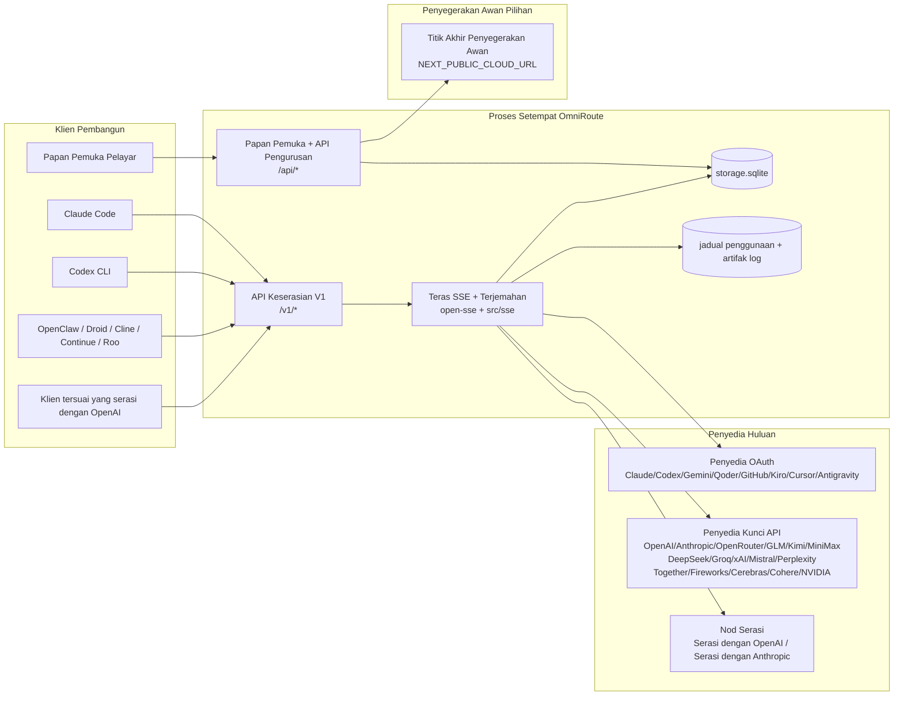
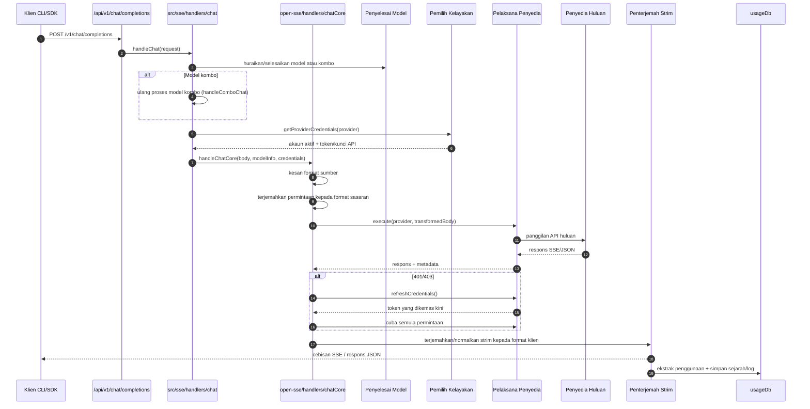
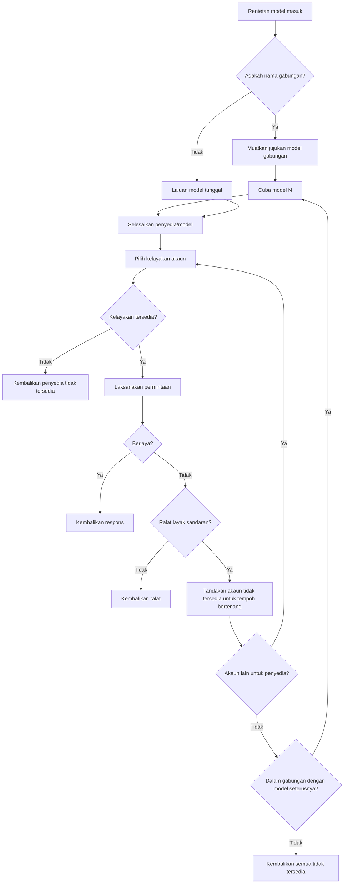
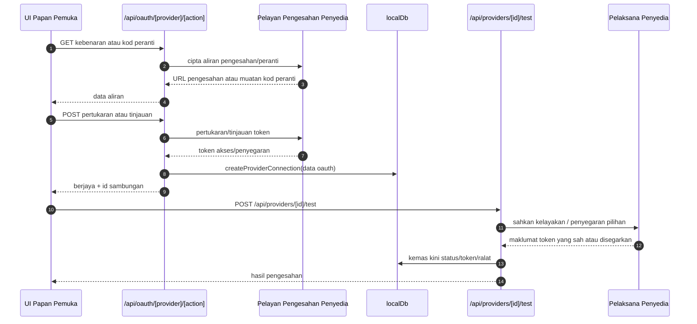
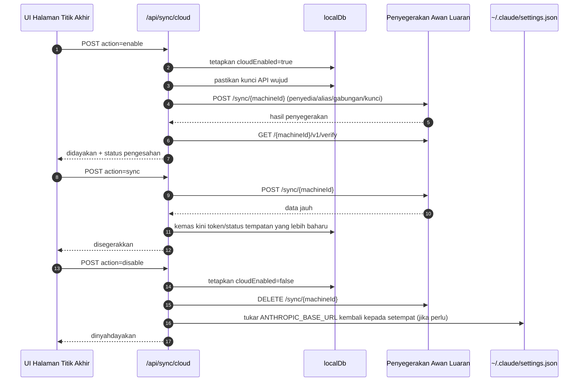
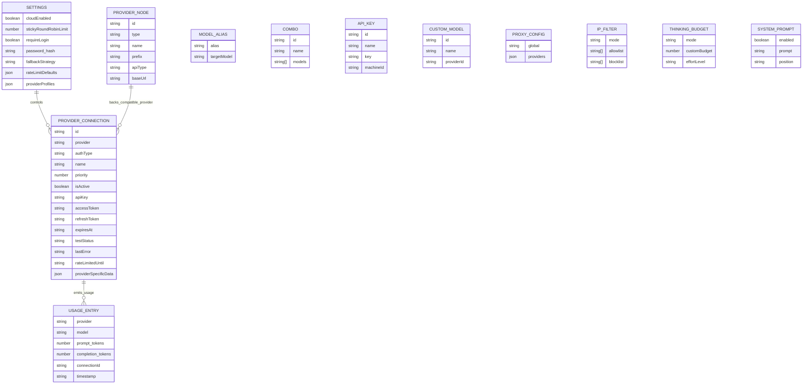
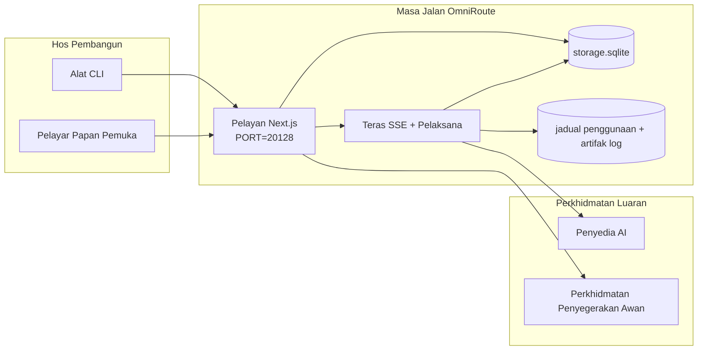

# OmniRoute Architecture (Bahasa Melayu)

🌐 **Languages:** 🇺🇸 [English](../../../../architecture/ARCHITECTURE.md) · 🇪🇹 [am](../../../am/docs/architecture/ARCHITECTURE.md) · 🇸🇦 [ar](../../../ar/docs/architecture/ARCHITECTURE.md) · 🇦🇿 [az](../../../az/docs/architecture/ARCHITECTURE.md) · 🇧🇬 [bg](../../../bg/docs/architecture/ARCHITECTURE.md) · 🇧🇩 [bn](../../../bn/docs/architecture/ARCHITECTURE.md) · 🇨🇿 [cs](../../../cs/docs/architecture/ARCHITECTURE.md) · 🇩🇰 [da](../../../da/docs/architecture/ARCHITECTURE.md) · 🇩🇪 [de](../../../de/docs/architecture/ARCHITECTURE.md) · 🇬🇷 [el](../../../el/docs/architecture/ARCHITECTURE.md) · 🇪🇸 [es](../../../es/docs/architecture/ARCHITECTURE.md) · 🇪🇪 [et](../../../et/docs/architecture/ARCHITECTURE.md) · 🇮🇷 [fa](../../../fa/docs/architecture/ARCHITECTURE.md) · 🇫🇮 [fi](../../../fi/docs/architecture/ARCHITECTURE.md) · 🇫🇷 [fr](../../../fr/docs/architecture/ARCHITECTURE.md) · 🇮🇪 [ga](../../../ga/docs/architecture/ARCHITECTURE.md) · 🇮🇳 [gu](../../../gu/docs/architecture/ARCHITECTURE.md) · 🇳🇬 [ha](../../../ha/docs/architecture/ARCHITECTURE.md) · 🇮🇱 [he](../../../he/docs/architecture/ARCHITECTURE.md) · 🇮🇳 [hi](../../../hi/docs/architecture/ARCHITECTURE.md) · 🇭🇷 [hr](../../../hr/docs/architecture/ARCHITECTURE.md) · 🇭🇺 [hu](../../../hu/docs/architecture/ARCHITECTURE.md) · 🇦🇲 [hy](../../../hy/docs/architecture/ARCHITECTURE.md) · 🇮🇩 [id](../../../id/docs/architecture/ARCHITECTURE.md) · 🇳🇬 [ig](../../../ig/docs/architecture/ARCHITECTURE.md) · 🇮🇹 [it](../../../it/docs/architecture/ARCHITECTURE.md) · 🇯🇵 [ja](../../../ja/docs/architecture/ARCHITECTURE.md) · 🇬🇪 [ka](../../../ka/docs/architecture/ARCHITECTURE.md) · 🇰🇭 [km](../../../km/docs/architecture/ARCHITECTURE.md) · 🇮🇳 [kn](../../../kn/docs/architecture/ARCHITECTURE.md) · 🇰🇷 [ko](../../../ko/docs/architecture/ARCHITECTURE.md) · 🇱🇹 [lt](../../../lt/docs/architecture/ARCHITECTURE.md) · 🇱🇻 [lv](../../../lv/docs/architecture/ARCHITECTURE.md) · 🇮🇳 [ml](../../../ml/docs/architecture/ARCHITECTURE.md) · 🇮🇳 [mr](../../../mr/docs/architecture/ARCHITECTURE.md) · 🇲🇹 [mt](../../../mt/docs/architecture/ARCHITECTURE.md) · 🇲🇲 [my](../../../my/docs/architecture/ARCHITECTURE.md) · 🇳🇵 [ne](../../../ne/docs/architecture/ARCHITECTURE.md) · 🇳🇱 [nl](../../../nl/docs/architecture/ARCHITECTURE.md) · 🇳🇴 [no](../../../no/docs/architecture/ARCHITECTURE.md) · 🇮🇳 [or](../../../or/docs/architecture/ARCHITECTURE.md) · 🇮🇳 [pa](../../../pa/docs/architecture/ARCHITECTURE.md) · 🇵🇭 [phi](../../../phi/docs/architecture/ARCHITECTURE.md) · 🇵🇱 [pl](../../../pl/docs/architecture/ARCHITECTURE.md) · 🇵🇹 [pt](../../../pt/docs/architecture/ARCHITECTURE.md) · 🇧🇷 [pt-BR](../../../pt-BR/docs/architecture/ARCHITECTURE.md) · 🇷🇴 [ro](../../../ro/docs/architecture/ARCHITECTURE.md) · 🇷🇺 [ru](../../../ru/docs/architecture/ARCHITECTURE.md) · 🇱🇰 [si](../../../si/docs/architecture/ARCHITECTURE.md) · 🇸🇰 [sk](../../../sk/docs/architecture/ARCHITECTURE.md) · 🇸🇮 [sl](../../../sl/docs/architecture/ARCHITECTURE.md) · 🇷🇸 [sr](../../../sr/docs/architecture/ARCHITECTURE.md) · 🇸🇪 [sv](../../../sv/docs/architecture/ARCHITECTURE.md) · 🇰🇪 [sw](../../../sw/docs/architecture/ARCHITECTURE.md) · 🇮🇳 [ta](../../../ta/docs/architecture/ARCHITECTURE.md) · 🇮🇳 [te](../../../te/docs/architecture/ARCHITECTURE.md) · 🇹🇭 [th](../../../th/docs/architecture/ARCHITECTURE.md) · 🇹🇷 [tr](../../../tr/docs/architecture/ARCHITECTURE.md) · 🇺🇦 [uk-UA](../../../uk-UA/docs/architecture/ARCHITECTURE.md) · 🇵🇰 [ur](../../../ur/docs/architecture/ARCHITECTURE.md) · 🇺🇿 [uz](../../../uz/docs/architecture/ARCHITECTURE.md) · 🇻🇳 [vi](../../../vi/docs/architecture/ARCHITECTURE.md) · 🇳🇬 [yo](../../../yo/docs/architecture/ARCHITECTURE.md) · 🇨🇳 [zh-CN](../../../zh-CN/docs/architecture/ARCHITECTURE.md) · 🇹🇼 [zh-TW](../../../zh-TW/docs/architecture/ARCHITECTURE.md)

---

🌐 **Languages:** 🇺🇸 [English](../../../../architecture/ARCHITECTURE.md) · 🇪🇹 [am](../../../am/docs/architecture/ARCHITECTURE.md) · 🇸🇦 [ar](../../../ar/docs/architecture/ARCHITECTURE.md) · 🇦🇿 [az](../../../az/docs/architecture/ARCHITECTURE.md) · 🇧🇬 [bg](../../../bg/docs/architecture/ARCHITECTURE.md) · 🇧🇩 [bn](../../../bn/docs/architecture/ARCHITECTURE.md) · 🇨🇿 [cs](../../../cs/docs/architecture/ARCHITECTURE.md) · 🇩🇰 [da](../../../da/docs/architecture/ARCHITECTURE.md) · 🇩🇪 [de](../../../de/docs/architecture/ARCHITECTURE.md) · 🇬🇷 [el](../../../el/docs/architecture/ARCHITECTURE.md) · 🇪🇸 [es](../../../es/docs/architecture/ARCHITECTURE.md) · 🇪🇪 [et](../../../et/docs/architecture/ARCHITECTURE.md) · 🇮🇷 [fa](../../../fa/docs/architecture/ARCHITECTURE.md) · 🇫🇮 [fi](../../../fi/docs/architecture/ARCHITECTURE.md) · 🇫🇷 [fr](../../../fr/docs/architecture/ARCHITECTURE.md) · 🇮🇪 [ga](../../../ga/docs/architecture/ARCHITECTURE.md) · 🇮🇳 [gu](../../../gu/docs/architecture/ARCHITECTURE.md) · 🇳🇬 [ha](../../../ha/docs/architecture/ARCHITECTURE.md) · 🇮🇱 [he](../../../he/docs/architecture/ARCHITECTURE.md) · 🇮🇳 [hi](../../../hi/docs/architecture/ARCHITECTURE.md) · 🇭🇷 [hr](../../../hr/docs/architecture/ARCHITECTURE.md) · 🇭🇺 [hu](../../../hu/docs/architecture/ARCHITECTURE.md) · 🇦🇲 [hy](../../../hy/docs/architecture/ARCHITECTURE.md) · 🇮🇩 [id](../../../id/docs/architecture/ARCHITECTURE.md) · 🇳🇬 [ig](../../../ig/docs/architecture/ARCHITECTURE.md) · 🇮🇹 [it](../../../it/docs/architecture/ARCHITECTURE.md) · 🇯🇵 [ja](../../../ja/docs/architecture/ARCHITECTURE.md) · 🇬🇪 [ka](../../../ka/docs/architecture/ARCHITECTURE.md) · 🇰🇭 [km](../../../km/docs/architecture/ARCHITECTURE.md) · 🇮🇳 [kn](../../../kn/docs/architecture/ARCHITECTURE.md) · 🇰🇷 [ko](../../../ko/docs/architecture/ARCHITECTURE.md) · 🇱🇹 [lt](../../../lt/docs/architecture/ARCHITECTURE.md) · 🇱🇻 [lv](../../../lv/docs/architecture/ARCHITECTURE.md) · 🇮🇳 [ml](../../../ml/docs/architecture/ARCHITECTURE.md) · 🇮🇳 [mr](../../../mr/docs/architecture/ARCHITECTURE.md) · 🇲🇹 [mt](../../../mt/docs/architecture/ARCHITECTURE.md) · 🇲🇲 [my](../../../my/docs/architecture/ARCHITECTURE.md) · 🇳🇵 [ne](../../../ne/docs/architecture/ARCHITECTURE.md) · 🇳🇱 [nl](../../../nl/docs/architecture/ARCHITECTURE.md) · 🇳🇴 [no](../../../no/docs/architecture/ARCHITECTURE.md) · 🇮🇳 [or](../../../or/docs/architecture/ARCHITECTURE.md) · 🇮🇳 [pa](../../../pa/docs/architecture/ARCHITECTURE.md) · 🇵🇭 [phi](../../../phi/docs/architecture/ARCHITECTURE.md) · 🇵🇱 [pl](../../../pl/docs/architecture/ARCHITECTURE.md) · 🇵🇹 [pt](../../../pt/docs/architecture/ARCHITECTURE.md) · 🇧🇷 [pt-BR](../../../pt-BR/docs/architecture/ARCHITECTURE.md) · 🇷🇴 [ro](../../../ro/docs/architecture/ARCHITECTURE.md) · 🇷🇺 [ru](../../../ru/docs/architecture/ARCHITECTURE.md) · 🇱🇰 [si](../../../si/docs/architecture/ARCHITECTURE.md) · 🇸🇰 [sk](../../../sk/docs/architecture/ARCHITECTURE.md) · 🇸🇮 [sl](../../../sl/docs/architecture/ARCHITECTURE.md) · 🇷🇸 [sr](../../../sr/docs/architecture/ARCHITECTURE.md) · 🇸🇪 [sv](../../../sv/docs/architecture/ARCHITECTURE.md) · 🇰🇪 [sw](../../../sw/docs/architecture/ARCHITECTURE.md) · 🇮🇳 [ta](../../../ta/docs/architecture/ARCHITECTURE.md) · 🇮🇳 [te](../../../te/docs/architecture/ARCHITECTURE.md) · 🇹🇭 [th](../../../th/docs/architecture/ARCHITECTURE.md) · 🇹🇷 [tr](../../../tr/docs/architecture/ARCHITECTURE.md) · 🇺🇦 [uk-UA](../../../uk-UA/docs/architecture/ARCHITECTURE.md) · 🇵🇰 [ur](../../../ur/docs/architecture/ARCHITECTURE.md) · 🇺🇿 [uz](../../../uz/docs/architecture/ARCHITECTURE.md) · 🇻🇳 [vi](../../../vi/docs/architecture/ARCHITECTURE.md) · 🇳🇬 [yo](../../../yo/docs/architecture/ARCHITECTURE.md) · 🇨🇳 [zh-CN](../../../zh-CN/docs/architecture/ARCHITECTURE.md) · 🇹🇼 [zh-TW](../../../zh-TW/docs/architecture/ARCHITECTURE.md)

_Kemas kini terakhir: 2026-06-28_

## Ringkasan Eksekutif

OmniRoute ialah gerbang penghalaan AI setempat dan papan pemuka yang dibina berasaskan Next.js.
Ia menyediakan satu titik akhir yang serasi dengan OpenAI (`/v1/*`) dan menghalakan trafik merentasi berbilang penyedia huluan dengan penterjemahan, sandaran, penyegaran token dan penjejakan penggunaan.

Keupayaan teras:

- Permukaan API yang serasi dengan OpenAI untuk CLI/alat (355 penyedia, 108 pelaksana)
- Penterjemahan permintaan/respons merentasi format penyedia
- Sandaran kombo model (jujukan berbilang model)
- Langkah kombo berstruktur (`provider + model + connection`) dengan susunan masa jalan berdasarkan `compositeTiers`
- Sandaran peringkat akaun (berbilang akaun bagi setiap penyedia)
- Prapemeriksaan kuota dan pemilihan akaun P2C berasaskan kuota dalam laluan sembang utama
- Pengurusan sambungan penyedia OAuth + kunci API (22 modul penyedia OAuth)
- Penjanaan pembenaman melalui `/v1/embeddings` (18 penyedia)
- Penjanaan imej melalui `/v1/images/generations` (10+ penyedia, 20+ model)
- Transkripsi audio melalui `/v1/audio/transcriptions` (18 penyedia)
- Teks kepada pertuturan melalui `/v1/audio/speech` (24 penyedia terbina dalam)
- Penjanaan video melalui `/v1/videos/generations` (ComfyUI + SD WebUI)
- Penjanaan muzik melalui `/v1/music/generations` (ComfyUI)
- Carian web melalui `/v1/search` (20 penyedia)
- Penyederhanaan kandungan melalui `/v1/moderations`
- Pengisihan semula melalui `/v1/rerank`
- Penghuraian tag pemikiran (`<think>...</think>`) untuk model penaakulan
- Pensanitasian respons untuk keserasian ketat dengan SDK OpenAI
- Penormalan peranan (developer→system, system→user) untuk keserasian merentas penyedia
- Penukaran output berstruktur (json_schema → Gemini responseSchema)
- Pengekalan setempat untuk penyedia, kunci, alias, kombo, tetapan dan harga (122 modul DB)
- Penjejakan penggunaan/kos dan pengelogan permintaan
- Penyegerakan awan pilihan untuk penyegerakan berbilang peranti/keadaan
- Senarai IP yang dibenarkan/disekat untuk kawalan akses API
- Pengurusan belanjawan pemikiran (laluan terus/automatik/tersuai/adaptif)
- Suntikan gesaan sistem global
- Penjejakan sesi dan pencapjarian
- Pengehadan kadar dipertingkatkan bagi setiap akaun dengan profil khusus penyedia
- Corak pemutus litar untuk daya tahan penyedia
- Perlindungan daripada lonjakan serentak dengan penguncian mutex
- Cache penyahduplikasian permintaan berasaskan tandatangan
- Lapisan domain: peraturan kos, dasar sandaran, dasar penguncian
- Context Relay: ringkasan serahan sesi untuk kesinambungan penggiliran akaun
- Pengekalan keadaan domain (cache tulis terus SQLite untuk sandaran, belanjawan, penguncian dan pemutus litar)
- Enjin dasar untuk penilaian permintaan berpusat (penguncian → belanjawan → sandaran)
- Telemetri permintaan dengan pengagregatan kependaman p50/p95/p99
- Telemetri sasaran kombo dan sejarah kesihatan sasaran kombo melalui `combo_execution_key` / `combo_step_id`
- ID korelasi (X-Request-Id) untuk penjejakan hujung ke hujung
- Pengelogan audit pematuhan dengan pilihan menarik diri bagi setiap kunci API
- Rangka kerja penilaian untuk jaminan kualiti LLM
- Papan pemuka kesihatan dengan status pemutus litar penyedia masa nyata
- Pelayan MCP (110 alat) dengan 3 pengangkutan (stdio/SSE/Streamable HTTP)
- Pelayan A2A (JSON-RPC 2.0 + SSE) dengan kemahiran dan kitaran hayat tugas
- Sistem memori (pengekstrakan, suntikan, pemerolehan semula, peringkasan)
- Sistem kemahiran (daftar, pelaksana, kotak pasir, kemahiran terbina dalam)
- Proksi MITM dengan pengurusan sijil dan pengendalian DNS
- Perisian tengah pengawal suntikan gesaan
- Talian paip pemampatan gesaan dengan Caveman, RTK, talian paip bertindan, kombo pemampatan, pek bahasa dan analitik
- Daftar ACP (Agent Communication Protocol)
- Penyedia OAuth modular (22 modul individu di bawah `src/lib/oauth/providers/`)
- Skrip nyahpasang/nyahpasang penuh
- Tindakan pembaikan persekitaran OAuth
- Jambatan WebSocket untuk klien WS yang serasi dengan OpenAI (`/v1/ws`)
- Pengurusan token penyegerakan (pengeluaran/pembatalan, muat turun berkas konfigurasi berversi ETag)
- GLM Thinking (`glmt`) sebagai pratetap penyedia kelas pertama
- Pengiraan token hibrid (`/messages/count_tokens` pada bahagian penyedia dengan sandaran anggaran)
- Penyemaian automatik alias model (30+ penormalan dialek merentas proksi ketika permulaan)
- Pengambilan keluar yang selamat dengan pengawal SSRF, penyekatan URL persendirian dan percubaan semula boleh dikonfigurasi
- Percubaan semula sembang yang mengambil kira tempoh bertenang dengan `requestRetry` dan `maxRetryIntervalSec` boleh dikonfigurasi
- Pengesahan persekitaran masa jalan dengan Zod ketika permulaan
- Audit pematuhan v2 dengan penomboran halaman, peristiwa CRUD penyedia dan pengelogan pengesahan yang disekat SSRF

Model masa jalan utama:

- Laluan aplikasi Next.js di bawah `src/app/api/*` melaksanakan API papan pemuka dan API keserasian
- Teras SSE/penghalaan dikongsi dalam `src/sse/*` + `open-sse/*` mengendalikan pelaksanaan penyedia, penterjemahan, penstriman, sandaran dan penggunaan

## Rajah Rujukan

Sumber Mermaid kanonik dengan kawalan versi untuk platform v3.8.0 terletak di
[`docs/diagrams/`](../diagrams/README.md). Dua daripadanya diterbitkan semula di bawah sebagai panduan;
selebihnya dipautkan daripada panduan khusus domain masing-masing.


> Sumber: [diagrams/request-pipeline.mmd](../diagrams/request-pipeline.mmd)


> Sumber: [diagrams/resilience-3layers.mmd](../diagrams/resilience-3layers.mmd) — turut dipautkan daripada
> [RESILIENCE_GUIDE.md](./RESILIENCE_GUIDE.md) dan rujukan daya tahan `CLAUDE.md`.

## Skop dan Batasan

### Dalam Skop

- Masa jalan gerbang setempat
- API pengurusan papan pemuka
- Pengesahan penyedia dan penyegaran token
- Penterjemahan permintaan dan penstriman SSE
- Keadaan setempat + pengekalan penggunaan
- Orkestrasi penyegerakan awan pilihan

### Di Luar Skop

- Pelaksanaan perkhidmatan awan di sebalik `NEXT_PUBLIC_CLOUD_URL`
- SLA/satah kawalan penyedia di luar proses setempat
- Binari CLI luaran itu sendiri (Claude CLI, Codex CLI, dll.)

## Permukaan Papan Pemuka (Semasa)

Halaman utama di bawah `src/app/(dashboard)/dashboard/`:

- `/dashboard` — mula pantas + gambaran keseluruhan penyedia
- `/dashboard/endpoint` — proksi titik akhir + MCP + A2A + tab titik akhir API
- `/dashboard/providers` — sambungan dan kelayakan penyedia
- `/dashboard/combos` — strategi kombo, templat, pembina berasaskan langkah, peraturan penghalaan model, susunan manual yang dikekalkan
- `/dashboard/auto-combo` — Enjin Kombo Automatik: pemberat pemarkahan, pek mod, pratetap kilang maya, telemetri
- `/dashboard/costs` — pengagregatan kos dan keterlihatan harga
- `/dashboard/analytics` — analitik penggunaan, penilaian, kesihatan sasaran kombo
- `/dashboard/limits` — kawalan kuota/kadar
- `/dashboard/cli-tools` — pengenalan CLI, pengesanan masa jalan, penjanaan konfigurasi
- `/dashboard/agents` — ejen ACP yang dikesan + pendaftaran ejen tersuai
- `/dashboard/cloud-agents` — tugas ejen yang dihoskan di awan (Codex Cloud, Devin, Jules) dan kitar hayat tugas
- `/dashboard/skills` — daftar kemahiran A2A, pelaksanaan kotak pasir, katalog kemahiran terbina dalam
- `/dashboard/memory` — pemeriksaan dan pemerolehan semula memori perbualan berterusan
- `/dashboard/webhooks` — langganan webhook keluar, putaran rahsia, statistik percubaan semula
- `/dashboard/batch` — penyerahan kerja kelompok dan kemajuan
- `/dashboard/cache` — statistik cache baca-lalu dan penaakulan, kawalan penyingkiran
- `/dashboard/playground` — ruang uji sembang interaktif untuk sebarang kombo/model yang dikonfigurasi
- `/dashboard/changelog` — pemapar log perubahan dalam aplikasi (memaparkan `CHANGELOG.md`)
- `/dashboard/system` — diagnostik masa jalan, maklumat versi, permukaan pengesahan persekitaran
- `/dashboard/onboarding` — bestari persediaan penggunaan kali pertama untuk pemasangan baharu
- `/dashboard/media` — ruang uji imej/video/muzik
- `/dashboard/search-tools` — pengujian dan sejarah penyedia carian
- `/dashboard/health` — masa operasi, pemutus litar, had kadar, sesi yang dipantau kuota
- `/dashboard/logs` — log permintaan/proksi/audit/konsol
- `/dashboard/settings` — tab tetapan sistem (umum, penghalaan, lalai kombo, dll.)
- `/dashboard/context/caveman` — peraturan pemampatan Caveman, pek bahasa, pratonton dan mod output
- `/dashboard/context/rtk` — penapis output perintah RTK, pratonton dan tetapan keselamatan masa jalan
- `/dashboard/context/combos` — saluran paip pemampatan bernama yang diperuntukkan kepada kombo penghalaan
- `/dashboard/translator` — pemeriksaan penterjemah dan pratonton penukaran format permintaan
- `/dashboard/audit` — pelayar log audit pematuhan dengan penomboran halaman dan metadata berstruktur
- `/dashboard/usage` — pelayar penggunaan bagi setiap permintaan yang dipautkan kepada `usage_history`
- `/dashboard/compression` — analitik pemampatan, statistik dan peruntukan saluran paip
- `/dashboard/api-manager` — kitar hayat kunci API dan kebenaran model

## Konteks Sistem Peringkat Tinggi



## Komponen Masa Jalan Teras

## 1) Lapisan API dan Penghalaan (Laluan Aplikasi Next.js)

Direktori utama:

- `src/app/api/v1/*` dan `src/app/api/v1beta/*` untuk API keserasian
- `src/app/api/*` untuk API pengurusan/konfigurasi
- Penulisan semula Next dalam `next.config.mjs` memetakan `/v1/*` kepada `/api/v1/*`

Laluan keserasian penting:

- `src/app/api/v1/chat/completions/route.ts`
- `src/app/api/v1/messages/route.ts`
- `src/app/api/v1/responses/route.ts`
- `src/app/api/v1/models/route.ts` — merangkumi model tersuai dengan `custom: true`
- `src/app/api/v1/embeddings/route.ts` — penjanaan pembenaman (6 penyedia)
- `src/app/api/v1/images/generations/route.ts` — penjanaan imej (4+ penyedia termasuk Antigravity/Nebius)
- `src/app/api/v1/messages/count_tokens/route.ts`
- `src/app/api/v1/providers/[provider]/chat/completions/route.ts` — sembang khusus bagi setiap penyedia
- `src/app/api/v1/providers/[provider]/embeddings/route.ts` — pembenaman khusus bagi setiap penyedia
- `src/app/api/v1/providers/[provider]/images/generations/route.ts` — imej khusus bagi setiap penyedia
- `src/app/api/v1beta/models/route.ts`
- `src/app/api/v1beta/models/[...path]/route.ts`

Domain pengurusan:

- Pengesahan/tetapan: `src/app/api/auth/*`, `src/app/api/settings/*`
- Penyedia/sambungan: `src/app/api/providers*`
- Nod penyedia: `src/app/api/provider-nodes*`
- Model tersuai: `src/app/api/provider-models` (GET/POST/DELETE)
- Katalog model: `src/app/api/models/route.ts` (GET)
- Konfigurasi proksi: `src/app/api/settings/proxy` (GET/PUT/DELETE) + `src/app/api/settings/proxy/test` (POST)
- OAuth: `src/app/api/oauth/*`
- Kunci/alias/gabungan/harga: `src/app/api/keys*`, `src/app/api/models/alias`, `src/app/api/combos*`, `src/app/api/pricing`
- Penggunaan: `src/app/api/usage/*`
- Penyegerakan/awan: `src/app/api/sync/*`, `src/app/api/cloud/*`
- Pembantu peralatan CLI: `src/app/api/cli-tools/*`
- Penapis IP: `src/app/api/settings/ip-filter` (GET/PUT)
- Bajet pemikiran: `src/app/api/settings/thinking-budget` (GET/PUT)
- Prom sistem: `src/app/api/settings/system-prompt` (GET/PUT)
- Pemampatan: `src/app/api/settings/compression`, `src/app/api/compression/*`, dan
  `src/app/api/context/*`
- Sesi: `src/app/api/sessions` (GET)
- Had kadar: `src/app/api/rate-limits` (GET)
- Daya tahan: `src/app/api/resilience` (GET/PATCH) — baris gilir permintaan, tempoh bertenang sambungan, pemutus penyedia, konfigurasi tunggu tempoh bertenang
- Tetapan semula daya tahan: `src/app/api/resilience/reset` (POST) — menetapkan semula pemutus penyedia
- Statistik cache: `src/app/api/cache/stats` (GET/DELETE)
- Telemetri: `src/app/api/telemetry/summary` (GET)
- Bajet: `src/app/api/usage/budget` (GET/POST)
- Rantaian sandaran: `src/app/api/fallback/chains` (GET/POST/DELETE)
- Audit pematuhan: `src/app/api/compliance/audit-log` (GET, dengan penomboran halaman + metadata berstruktur)
- Penilaian: `src/app/api/evals` (GET/POST), `src/app/api/evals/[suiteId]` (GET)
- Dasar: `src/app/api/policies` (GET/POST)
- Token penyegerakan: `src/app/api/sync/tokens` (GET/POST), `src/app/api/sync/tokens/[id]` (GET/DELETE)
- Berkas konfigurasi: `src/app/api/sync/bundle` (GET, petikan tetapan/penyedia/gabungan/kunci yang diversi menggunakan ETag)
- WebSocket: `src/app/api/v1/ws/route.ts` — pengendali Upgrade untuk klien WS yang serasi dengan OpenAI

## 2) SSE + Teras Terjemahan

Modul aliran utama:

- Titik masuk: `src/sse/handlers/chat.ts`
- Orkestrasi teras: `open-sse/handlers/chatCore.ts`
- Penyesuai pelaksanaan penyedia: `open-sse/executors/*`
- Pengesanan format/konfigurasi penyedia: `open-sse/services/provider.ts`
- Penghuraian/penyelesaian model: `src/sse/services/model.ts`, `open-sse/services/model.ts`
- Logik sandaran akaun: `open-sse/services/accountFallback.ts`
- Daftar terjemahan: `open-sse/translator/index.ts`
- Transformasi strim: `open-sse/utils/stream.ts`, `open-sse/utils/streamHandler.ts`
- Pengekstrakan/penormalan penggunaan: `open-sse/utils/usageTracking.ts`
- Penghurai tag pemikiran: `open-sse/utils/thinkTagParser.ts`
- Pengendali pembenaman: `open-sse/handlers/embeddings.ts`
- Daftar penyedia pembenaman: `open-sse/config/embeddingRegistry.ts`
- Pengendali penjanaan imej: `open-sse/handlers/imageGeneration.ts`
- Daftar penyedia imej: `open-sse/config/imageRegistry.ts`
- Pembersihan respons: `open-sse/handlers/responseSanitizer.ts`
- Penormalan peranan: `open-sse/services/roleNormalizer.ts`

Perkhidmatan (logik perniagaan):

- Pemilihan/pemarkahan akaun: `open-sse/services/accountSelector.ts`
- Pengurusan kitar hayat konteks: `open-sse/services/contextManager.ts`
- Penguatkuasaan penapis IP: `open-sse/services/ipFilter.ts`
- Penjejakan sesi: `open-sse/services/sessionManager.ts`
- Penyahduplikasian permintaan: `open-sse/services/signatureCache.ts`
- Penyuntikan gesaan sistem: `open-sse/services/systemPrompt.ts`
- Pengurusan belanjawan pemikiran: `open-sse/services/thinkingBudget.ts`
- Penghalaan model kad bebas: `open-sse/services/wildcardRouter.ts`
- Pengurusan had kadar: `open-sse/services/rateLimitManager.ts`
- Pemutus litar: `src/shared/utils/circuitBreaker.ts`
- Penyerahan konteks: `open-sse/services/contextHandoff.ts` — penjanaan dan penyuntikan ringkasan penyerahan untuk strategi geganti konteks
- Pemampatan: `open-sse/services/compression/*` — pemampatan proaktif sebelum terjemahan penyedia;
  merangkumi peraturan Caveman, penapis RTK, talian paip bertindan, gabungan pemampatan, statistik dan pengesahan
- Pengambil kuota Codex: `open-sse/services/codexQuotaFetcher.ts` — mengambil kuota Codex untuk keputusan penyerahan geganti konteks
- Percubaan semula sedar tempoh bertenang: `src/sse/services/cooldownAwareRetry.ts` — percubaan semula tempoh bertenang bagi setiap model dengan `requestRetry` / `maxRetryIntervalSec` yang boleh dikonfigurasikan
- Pengambilan keluar yang selamat: `src/shared/network/safeOutboundFetch.ts` — pengambilan penyedia/model terkawal dengan perlindungan SSRF, penyekatan URL peribadi, percubaan semula dan tamat masa
- Perlindungan URL keluar: `src/shared/network/outboundUrlGuard.ts` — mengesahkan URL penyedia terhadap julat CIDR peribadi/localhost
- Lalai permintaan penyedia: `open-sse/services/providerRequestDefaults.ts` — nilai lalai `maxTokens`, `temperature`, `thinkingBudgetTokens` pada peringkat penyedia
- Pemalar penyedia GLM: `open-sse/config/glmProvider.ts` — model GLM, URL kuota dan tamat masa/nilai lalai GLMT yang dikongsi
- Huluan Antigravity: `open-sse/config/antigravityUpstream.ts` — URL asas dan pemalar laluan penemuan
- Pemalar klien Codex: `open-sse/config/codexClient.ts` — nilai ejen pengguna dan versi klien yang berversi
- Benih alias model: `src/lib/modelAliasSeed.ts` — menyemai lebih 30 alias dialek rentas proksi semasa permulaan

Modul lapisan domain:

- Peraturan kos/belanjawan: `src/domain/costRules.ts`
- Dasar sandaran: `src/domain/fallbackPolicy.ts`
- Penyelesai gabungan: `src/domain/comboResolver.ts`
- Dasar sekatan: `src/domain/lockoutPolicy.ts`
- Enjin dasar: `src/domain/policyEngine.ts` — penilaian sekatan → belanjawan → sandaran yang berpusat
- Katalog kod ralat: `src/shared/constants/errorCodes.ts`
- ID permintaan: `src/shared/utils/requestId.ts`
- Tamat masa pengambilan: `src/shared/utils/fetchTimeout.ts`
- Telemetri permintaan: `src/shared/utils/requestTelemetry.ts`
- Pematuhan/audit: `src/lib/compliance/index.ts`
- Pelaksana penilaian: `src/lib/evals/evalRunner.ts`
- Pengekalan keadaan domain: `src/lib/db/domainState.ts` — CRUD SQLite untuk rantaian sandaran, belanjawan, sejarah kos, keadaan sekatan dan pemutus litar

Modul penyedia OAuth (22 fail individu di bawah `src/lib/oauth/providers/`):

- Indeks daftar: `src/lib/oauth/providers/index.ts`
- Penyedia individu: `agy.ts`, `antigravity.ts`, `claude.ts`, `cline.ts`, `codebuddy-cn.ts`, `codex.ts`, `cursor.ts`, `devin-desktop.ts`, `ghe-copilot.ts`, `github.ts`, `gitlab-duo.ts`, `grok-cli-oauth.ts`, `grok-cli.ts`, `kilocode.ts`, `kimi-coding.ts`, `kiro.ts`, `openference.ts`, `qoder.ts`, `trae.ts`, `xai-oauth.ts`, `zed-hosted.ts`, `zed.ts`
- Pembalut nipis: `src/lib/oauth/providers.ts` — mengeksport semula daripada modul individu

## 5) Perkhidmatan Terbenam (v3.8.4)

OmniRoute boleh memasang, menyelia dan menghalakan permintaan kepada proses alat AI yang berjalan secara setempat,
yang dipanggil **perkhidmatan terbenam**. Lima perkhidmatan disertakan: 9Router, CLIProxyAPI, Bifrost, Mux dan Dario.

Lapisan seni bina:

- **UI** (`/dashboard/providers/services`) — halaman dua tab dengan kawalan kitar hayat,
  penstriman log langsung, pengurusan kunci API dan (untuk 9Router) UI natif terbenam melalui
  proksi songsang dalaman.
- **API** (`/api/services/{name}/*`) — 11 titik akhir untuk 9Router, 10 untuk CLIProxyAPI, masing-masing 8 untuk Bifrost / Mux / Dario,
  semuanya dikelaskan sebagai **LOCAL_ONLY** (peraturan tegar #17). Titik akhir SSE `GET /api/services/[name]/logs`
  yang dikongsi menyediakan perkhidmatan untuk kedua-duanya.
- **Penyelia** (`src/lib/services/`) — kelas generik `ServiceSupervisor` membalut
  `child_process.spawn`, menyimpan penimbal gelang 5 MB untuk penstriman log SSE, gelung
  pemeriksaan kesihatan, kunci operasi atomik dan penutupan terkawal SIGTERM→SIGKILL.
  `bootstrap.ts` menghubungkan semua perkhidmatan yang dikonfigurasikan semasa proses bermula.
- **Penyedia/pelaksana** (`open-sse/executors/ninerouter.ts`) — 9Router didedahkan sebagai
  penyedia sebenar. Model diawali dengan `9router/{sub}/{model}` dan disegerakkan setiap 5 minit
  daripada titik akhir `/v1/models` milik 9Router.

Huraian mendalam: `docs/frameworks/EMBEDDED-SERVICES.md`

## Subsistem Utama (v3.8.0)

### A. Enjin Auto Combo

Auto Combo memberikan skor dan memilih sasaran penghalaan secara dinamik ketika permintaan dibuat, dan bukannya
bergantung pada takrif kombo statik. Ia menguasakan keluarga awalan model `auto/*`.

- Kemasukan enjin: `open-sse/services/autoCombo/` (`autoComboEngine.ts`,
  `scoringEngine.ts`, `virtualFactory.ts`, `modePacks.ts`)
- Penyelesai: `src/domain/comboResolver.ts` (pengesanan automatik awalan `auto/`)
- Papan pemuka: `/dashboard/auto-combo`
- Telemetri: jadual SQLite `auto_combo_decisions`

Keupayaan utama:

- **19 strategi penghalaan** (keutamaan, berwajaran, isi-dahulu, round-robin, P2C, rawak,
  paling kurang digunakan, dioptimumkan kos, peka tetapan semula, tetingkap tetapan semula, ruang lebihan, rawak ketat,
  **auto**, lkgp, dioptimumkan konteks, geganti konteks, **fusion**, serta laluan sandaran) —
  auto ialah tambahan utama dalam v3.8.0; `fusion` (sebar keluar panel + sintesis pengadil,
  `open-sse/services/fusion.ts`) adalah baharu dalam v3.8.36.
- **Pemarkahan 16 faktor**: kuota, kesihatan, kos songsang, kependaman songsang, kesesuaian tugas dan
  sepuluh lagi. Jadual berkanun bagi faktor dan pemberat lalainya tersedia dalam
  [`docs/routing/AUTO-COMBO.md`](../routing/AUTO-COMBO.md) — menyatakannya semula di sini akan
  mewujudkan lokasi kedua yang boleh menjadi lapuk.
- **Kilang maya** mewujudkan kombo sementara apabila tiada kombo bernama yang sepadan,
  dengan mendapatkan calon daripada sambungan penyedia aktif yang sihat.
- **Awalan auto**: `auto/coding`, `auto/cheap`, `auto/fast`, `auto/offline`,
  `auto/smart`, `auto/lkgp` — setiap satu disokong oleh profil pemberat yang ditala.
- **6 pek mod**: `ship-fast`, `cost-saver`, `quality-first`, `offline-friendly`,
  `reliability-first` dan `chaos-mode` — konfigurasi pemberat praset yang boleh digunakan daripada
  papan pemuka. (Jangan keliru dengan awalan `auto/*` di atas, yang merupakan
  varian semasa permintaan.)

Untuk butiran algoritma sepenuhnya (formula faktor, penalaan pemberat), lihat
[`docs/routing/AUTO-COMBO.md`](../routing/AUTO-COMBO.md).

### B. Ejen Awan

Cloud Agents membalut platform ejen kod dihoskan pihak ketiga (Codex Cloud, Devin,
Jules) di sebalik kitar hayat tugas seragam yang disokong pangkalan data. Semua titik akhir penciptaan/pemeriksaan
tugas memerlukan pengesahan pengurusan.

- Akar modul: `src/lib/cloudAgent/` (`baseAgent.ts`, `registry.ts`, `api.ts`,
  `types.ts`, `db.ts`, serta subdirektori setiap ejen di bawah `agents/`)
- Pelaksanaan setiap ejen: `agents/codex/`, `agents/devin/`, `agents/jules/`
- Titik akhir awam: `/api/v1/agents/tasks/*` (senarai/cipta/dapatkan/batal)
- Titik akhir pengurusan: `/api/cloud/*` (peruntukan, status, kelompok)
- Papan pemuka: `/dashboard/cloud-agents`
- Storan: jadual `cloud_agent_tasks`

Untuk butiran peruntukan dan OAuth bagi setiap ejen, lihat
[`docs/frameworks/CLOUD_AGENT.md`](../frameworks/CLOUD_AGENT.md).

### C. Kekangan Keselamatan

Modul kekangan keselamatan ialah lapisan perisian tengah yang boleh dimuatkan semula secara aktif dan memeriksa permintaan
serta respons untuk PII, suntikan gesaan dan kandungan penglihatan yang tidak selamat. Pelanggaran
menghentikan permintaan serta-merta dengan HTTP **503** bersama kod ralat berstruktur, yang membolehkan
pemanggil hiliran mencuba semula atau beralih cabang.

- Akar modul: `src/lib/guardrails/` (`base.ts`, `registry.ts`, `piiMasker.ts`,
  `promptInjection.ts`, `visionBridge.ts`, `visionBridgeHelpers.ts`)
- Muat semula aktif: pendaftaran memantau perubahan konfigurasi dan membina semula rantaian di tempatnya
- Titik integrasi: kemasukan pengendali sembang, pengendali penjanaan imej, pensanitasi respons
- Kontrak HTTP: pelanggaran dipaparkan sebagai `503` dengan `error.code = "GUARDRAIL_VIOLATION"`

Untuk pengarangan set peraturan dan penalaan ambang, lihat
[`docs/security/GUARDRAILS.md`](../security/GUARDRAILS.md).

### D. Lapisan Domain

Ruang nama `src/domain/` memusatkan keputusan dasar supaya pengendali laluan tidak
perlu menyusun sendiri logik sekatan/belanjawan/sandaran.

- Enjin dasar: `src/domain/policyEngine.ts` — titik masuk tunggal untuk
  penilaian prapelaksanaan (susunan sekatan → belanjawan → sandaran)
- Peraturan kos: `src/domain/costRules.ts`
- Dasar sandaran: `src/domain/fallbackPolicy.ts`
- Dasar sekatan: `src/domain/lockoutPolicy.ts`
- Penghalaan berasaskan tag: `src/domain/tagRouter.ts`
- Penyelesai kombo: `src/domain/comboResolver.ts` — menyelesaikan nama kombo, awalan auto/\*
  dan sasaran model kad bebas kepada pelan pelaksanaan konkrit
- Penggabung peraturan sambungan/model: `src/domain/connectionModelRules.ts`
- Petikan ketersediaan model: `src/domain/modelAvailability.ts`
- Penjejakan tamat tempoh penyedia: `src/domain/providerExpiration.ts`
- Cache kuota: `src/domain/quotaCache.ts`
- Keadaan kemerosotan: `src/domain/degradation.ts`
- Audit konfigurasi: `src/domain/configAudit.ts`
- Pembina metadata respons OmniRoute: `src/domain/omnirouteResponseMeta.ts`
- Subsistem penilaian: `src/domain/assessment/` — tugas penilaian berkala

### E. Saluran Paip Kebenaran

Kelas saluran kebenaran mengelaskan setiap permintaan masuk dan menggunakan
rantaian dasar yang sesuai sebelum menghantarnya.

- Titik masuk saluran: `src/server/authz/pipeline.ts`
- Pengelas permintaan: `src/server/authz/classify.ts` — membezakan laluan
  keserasian awam daripada laluan pengurusan
- Inventori laluan awam: `src/shared/constants/publicApiRoutes.ts`
- Dasar: `src/server/authz/policies/` — predikat yang boleh digabungkan
  (`requireApiKey`, `requireManagement`, `requireFreshAuth`, dan sebagainya)
- Utiliti pengepala: `src/server/authz/headers.ts`
- Pembantu penegasan: `src/server/authz/assertAuth.ts`
- Konteks permintaan: `src/server/authz/context.ts`

Laluan awam berbanding laluan pengurusan merupakan sempadan tegas: API ejen/tempoh bertenang dan
mutasi penyedia memerlukan pengesahan pengurusan (HTTP 401 jika tiada).

Untuk peraturan pengelasan laluan yang lengkap, lihat
[`docs/architecture/AUTHZ_GUIDE.md`](./AUTHZ_GUIDE.md).

### F. FSM Aliran Kerja dan Penghala Peka Tugas

Penghala dipacu mesin keadaan terhingga yang dilapiskan di atas pemilihan kombo untuk mengarahkan
trafik berdasarkan peringkat aliran kerja yang dikesan (perancangan, pelaksanaan,
semakan) dan perkaitan tugas latar belakang.

- FSM aliran kerja: `open-sse/services/workflowFSM.ts`
- Penghala peka tugas: `open-sse/services/taskAwareRouter.ts`
- Pengesan tugas latar belakang: `open-sse/services/backgroundTaskDetector.ts`
- Pengelas niat: `open-sse/services/intentClassifier.ts`

Peralihan FSM disalurkan ke dalam pemarkahan Auto Combo, dengan kecenderungan kepada model yang lebih murah
untuk tugas latar belakang/automasi dan kepada model yang lebih berkuasa untuk giliran
perancangan/semakan interaktif.

### G. Ketahanan Khusus Penyedia

Beberapa penyedia menawarkan modul ketahanan dan penyamaran khusus yang memanfaatkan
lapisan pemutus litar / tempoh bertenang sambungan / sekatan model global:

- Enjin Antigravity 429: `open-sse/services/antigravity429Engine.ts` (menggiliri
  identiti, membersihkan pengepala respons, memacu penjejakan kredit/versi melalui
  `antigravityCredits.ts`, `antigravityHeaderScrub.ts`, `antigravityHeaders.ts`,
  `antigravityIdentity.ts`, `antigravityVersion.ts`)
- Dasar kuota ModelScope: `open-sse/services/modelscopePolicy.ts`
- CCH Claude Code (Jabat Tangan Saluran Keserasian): `open-sse/services/claudeCodeCCH.ts`,
  serta `claudeCodeCompatible.ts`, `claudeCodeConstraints.ts`, `claudeCodeExtraRemap.ts`,
  `claudeCodeToolRemapper.ts`
- Pembentukan cap jari Claude Code: `open-sse/services/claudeCodeFingerprint.ts`
- Pengeliruan Claude Code: `open-sse/services/claudeCodeObfuscation.ts`

Untuk panduan lengkap penyamaran dan pengendalian operasi, lihat
`docs/security/STEALTH_GUIDE.md` (git; tidak dikompilasikan ke dalam `/docs`).

### H. Webhook, Cache Penaakulan, Cache Bacaan

- **Webhook** — penghantaran keluar untuk peristiwa penyedia/akaun/tugas.
  - Penghantar: `src/lib/webhookDispatcher.ts`
  - Storan: jadual SQLite `webhooks` (melalui `src/lib/db/webhooks.ts`)
  - Papan pemuka: `/dashboard/webhooks` (langganan, rahsia, sejarah percubaan semula)
  - Untuk taksonomi peristiwa dan semantik percubaan semula, lihat [`docs/frameworks/WEBHOOKS.md`](../frameworks/WEBHOOKS.md).
- **Cache Penaakulan** — blok penaakulan yang boleh dimainkan semula untuk penyedia yang menghasilkan
  token pemikiran (Claude, GLMT, dan sebagainya) supaya giliran berturut-turut boleh melangkau penaakulan semula.
  - Lapisan DB: `src/lib/db/reasoningCache.ts`
  - Lapisan perkhidmatan: `open-sse/services/reasoningCache.ts`
  - Untuk semantik main semula, lihat [`docs/routing/REASONING_REPLAY.md`](../routing/REASONING_REPLAY.md).
- **Cache Bacaan** — cache respons jangka pendek yang dikunci berdasarkan tandatangan dan digunakan untuk
  menggabungkan percubaan semula yang sama daripada SDK huluan yang rosak.
  - Lapisan DB: `src/lib/db/readCache.ts`
  - Titik akhir statistik: `GET /api/cache/stats`, papan pemuka di `/dashboard/cache`

## 3) Lapisan Kegigihan

DB keadaan utama (SQLite):

- Infrastruktur teras: `src/lib/db/core.ts` (better-sqlite3, migrasi, WAL)
- Akses DB: import modul `src/lib/db/*` tertentu secara langsung (`localDb.ts` lama yang berfungsi sebagai barrel telah dialih keluar)
- fail: `${DATA_DIR}/storage.sqlite` (atau `$XDG_CONFIG_HOME/omniroute/storage.sqlite` apabila ditetapkan, jika tidak `~/.omniroute/storage.sqlite`)
- entiti (jadual + ruang nama KV): providerConnections, providerNodes, modelAliases, combos, apiKeys, settings, pricing, **customModels**, **proxyConfig**, **ipFilter**, **thinkingBudget**, **systemPrompt**

Kegigihan penggunaan:

- fasad: `src/lib/usageDb.ts` (modul yang diuraikan dalam `src/lib/usage/*`)
- Jadual SQLite dalam `storage.sqlite`: `usage_history`, `call_logs`, `proxy_logs`
- artifak fail pilihan dikekalkan untuk keserasian/penyahpepijatan (`${DATA_DIR}/log.txt`, `${DATA_DIR}/call_logs/`, `<repo>/logs/...`)
- fail JSON legasi dimigrasikan ke SQLite melalui migrasi permulaan apabila tersedia

DB Keadaan Domain (SQLite):

- `src/lib/db/domainState.ts` — operasi CRUD untuk keadaan domain
- Jadual (dicipta dalam `src/lib/db/core.ts`): `domain_fallback_chains`, `domain_budgets`, `domain_cost_history`, `domain_lockout_state`, `domain_circuit_breakers`
- Corak cache tulis-terus: Maps dalam memori merupakan sumber berwibawa semasa masa jalan; mutasi ditulis secara segerak ke SQLite; keadaan dipulihkan daripada DB semasa permulaan sejuk

## 4) Permukaan Pengesahan + Keselamatan

- Pengesahan kuki papan pemuka: `src/proxy.ts`, `src/app/api/auth/login/route.ts`
- Penjanaan/pengesahan kunci API: `src/shared/utils/apiKey.ts`
- Rahsia penyedia disimpan dalam entri `providerConnections`
- Sokongan proksi keluar melalui `open-sse/utils/proxyFetch.ts` (pemboleh ubah persekitaran) dan `open-sse/utils/networkProxy.ts` (boleh dikonfigurasikan bagi setiap penyedia atau secara global)
- Perlindungan SSRF / URL keluar: `src/shared/network/outboundUrlGuard.ts` — menyekat julat peribadi/gelung balik/pautan setempat untuk semua panggilan penyedia
- Pengesahan persekitaran masa jalan: `src/lib/env/runtimeEnv.ts` — skema Zod untuk semua pemboleh ubah persekitaran, dipaparkan sebagai ralat/amaran permulaan
- Token penyegerakan: `src/lib/db/syncTokens.ts` — token berskop untuk titik akhir muat turun berkas konfigurasi; disokong oleh jadual SQLite `sync_tokens` (migrasi `024_create_sync_tokens.sql`)
- Pengesahan jabat tangan WebSocket: `src/lib/ws/handshake.ts` — mengesahkan permintaan naik taraf WS melalui kunci API atau kuki sesi

## 5) Penyegerakan Awan

- Pemulaan penjadual: `src/lib/initCloudSync.ts`, `src/shared/services/initializeCloudSync.ts`, `src/shared/services/modelSyncScheduler.ts`
- Tugas berkala: `src/shared/services/cloudSyncScheduler.ts`
- Tugas berkala: `src/shared/services/modelSyncScheduler.ts`
- Laluan kawalan: `src/app/api/sync/cloud/route.ts`

## Kitaran Hayat Permintaan (`/v1/chat/completions`)



## Aliran Gabungan + Sandaran Akaun



Keputusan sandaran ditentukan oleh `open-sse/services/accountFallback.ts` menggunakan kod status dan heuristik mesej ralat. Penghalaan gabungan menambahkan satu kawalan tambahan: ralat 400 yang terbatas kepada penyedia, seperti sekatan kandungan huluan dan kegagalan pengesahan peranan, dianggap sebagai kegagalan setempat model supaya sasaran gabungan berikutnya masih boleh dijalankan.

## Kitar Hayat Penyediaan OAuth dan Penyegaran Token



Penyegaran semasa trafik langsung dilaksanakan dalam `open-sse/handlers/chatCore.ts` melalui `refreshCredentials()` pelaksana.

## Kitar Hayat Penyegerakan Awan (Dayakan / Segerakkan / Nyahdayakan)



Penyegerakan berkala dicetuskan oleh `CloudSyncScheduler` apabila awan didayakan.

## Model Data dan Peta Storan



Fail storan fizikal:

- pangkalan data masa jalan utama: `${DATA_DIR}/storage.sqlite`
- baris log permintaan: `${DATA_DIR}/log.txt` (artifak keserasian/nyahpepijat)
- arkib berstruktur bagi muatan panggilan: `${DATA_DIR}/call_logs/`
- sesi nyahpepijat penterjemah/permintaan pilihan: `<repo>/logs/...`

## Topologi Penggunaan



## Pemetaan Modul (Kritikal untuk Keputusan)

### Modul Laluan dan API

- `src/app/api/v1/*`, `src/app/api/v1beta/*`: API keserasian
- `src/app/api/v1/providers/[provider]/*`: laluan khusus bagi setiap penyedia (sembang, pembenaman, imej)
- `src/app/api/providers*`: CRUD, pengesahan dan pengujian penyedia
- `src/app/api/provider-nodes*`: pengurusan nod serasi tersuai
- `src/app/api/provider-models`: pengurusan model tersuai (CRUD)
- `src/app/api/models/route.ts`: API katalog model (alias + model tersuai)
- `src/app/api/oauth/*`: aliran OAuth/kod peranti
- `src/app/api/keys*`: kitaran hayat kunci API setempat
- `src/app/api/models/alias`: pengurusan alias
- `src/app/api/combos*`: pengurusan kombo sandaran
- `src/app/api/pricing`: penggantian harga bagi pengiraan kos
- `src/app/api/settings/proxy`: konfigurasi proksi (GET/PUT/DELETE)
- `src/app/api/settings/proxy/test`: ujian kesambungan proksi keluar (POST)
- `src/app/api/usage/*`: API penggunaan dan log
- `src/app/api/sync/*` + `src/app/api/cloud/*`: penyegerakan awan dan pembantu yang berhadapan dengan awan
- `src/app/api/cli-tools/*`: penulis/penyemak konfigurasi CLI setempat
- `src/app/api/settings/ip-filter`: senarai dibenarkan/senarai disekat IP (GET/PUT)
- `src/app/api/settings/thinking-budget`: konfigurasi belanjawan token penaakulan (GET/PUT)
- `src/app/api/settings/system-prompt`: gesaan sistem global (GET/PUT)
- `src/app/api/settings/compression`: tetapan pemampatan global (GET/PUT)
- `src/app/api/compression/*`: pratonton pemampatan, metadata peraturan dan pek bahasa
- `src/app/api/context/caveman/config`: alias tetapan Caveman (GET/PUT)
- `src/app/api/context/rtk/*`: konfigurasi RTK, katalog penapis, titik akhir ujian dan pemulihan output mentah
- `src/app/api/context/combos*`: CRUD kombo pemampatan dan penetapan kombo penghalaan
- `src/app/api/context/analytics`: alias analitis pemampatan
- `src/app/api/sessions`: penyenaraian sesi aktif (GET)
- `src/app/api/rate-limits`: status had kadar bagi setiap akaun (GET)
- `src/app/api/sync/tokens`: CRUD token penyegerakan (GET/POST)
- `src/app/api/sync/tokens/[id]`: mendapatkan/memadam token penyegerakan (GET/DELETE)
- `src/app/api/sync/bundle`: muat turun berkas konfigurasi (GET, pemversian ETag)
- `src/app/api/v1/ws`: pengendali naik taraf WebSocket untuk klien WS yang serasi dengan OpenAI

### Teras Penghalaan dan Pelaksanaan

- `src/sse/handlers/chat.ts`: penghuraian permintaan, pengendalian kombo, gelung pemilihan akaun
- `open-sse/handlers/chatCore.ts`: penterjemahan, penghantaran pelaksana, pengendalian cuba semula/muat semula, persediaan strim
- `open-sse/executors/*`: tingkah laku rangkaian dan format khusus penyedia

### Daftar Penterjemahan dan Penukar Format

- `open-sse/translator/index.ts`: registri dan orkestrasi penterjemah
- Penterjemah permintaan: `open-sse/translator/request/*` (9 modul — `antigravity-to-openai`, `claude-to-gemini`, `claude-to-openai`, `gemini-to-openai`, `openai-responses`, `openai-to-claude`, `openai-to-cursor`, `openai-to-gemini`, `openai-to-kiro`)
- Penterjemah respons: `open-sse/translator/response/*` (11 modul — `claude-to-openai`, `cursor-to-openai`, `gemini-to-claude`, `gemini-to-openai`, `kiro-to-openai`, `openai-responses`, `openai-to-antigravity`, `openai-to-claude`, `openai-to-gemini`, `openai-to-gemini-sse`, `responsesToolItem`)
- Pembantu: `open-sse/translator/helpers/*` (12 modul — `claudeHelper`, `geminiHelper`, `geminiToolsSanitizer`, `jsonUtil`, `markdownBoundary`, `maxTokensHelper`, `openaiHelper`, `responsesApiHelper`, `schemaCoercion`, `strictSystemHoist`, `toolCallHelper`, `toolCallShim`)
- Pemalar format: `open-sse/translator/formats.ts`
- Pemula dan registri: `open-sse/translator/bootstrap.ts`, `open-sse/translator/registry.ts`
- Pembantu format imej: `open-sse/translator/image/`

### Kegigihan

- `src/lib/db/*`: konfigurasi/keadaan berterusan dan kegigihan domain pada SQLite
- `src/lib/db/*`: import modul tertentu secara terus — tanpa fail barrel (lapisan eksport semula `localDb.ts` yang lama telah dialih keluar)
- `src/lib/usageDb.ts`: fasad sejarah penggunaan/log panggilan di atas jadual SQLite

## Liputan Pelaksana Penyedia (Corak Strategi)

Setiap penyedia mempunyai pelaksana khusus yang melanjutkan `BaseExecutor` (dalam `open-sse/executors/base.ts`), yang menyediakan pembinaan URL, pembentukan pengepala, percubaan semula dengan sela masa eksponen, cangkuk penyegaran kelayakan, dan kaedah orkestrasi `execute()`.

| Pelaksana                 | Penyedia                                                                                                                                                    | Pengendalian Khas                                                                     |
| ------------------------- | ----------------------------------------------------------------------------------------------------------------------------------------------------------- | ------------------------------------------------------------------------------------- |
| `DefaultExecutor`         | OpenAI, Claude, Gemini, Qwen, OpenRouter, GLM, Kimi, MiniMax, DeepSeek, Groq, xAI, Mistral, Perplexity, Together, Fireworks, Cerebras, Cohere, NVIDIA, dll. | Konfigurasi URL/pengepala dinamik bagi setiap penyedia                                |
| `AntigravityExecutor`     | Google Antigravity                                                                                                                                          | ID projek/sesi tersuai, penghuraian Retry-After, pengeliruan 429                      |
| `AzureOpenAIExecutor`     | Azure OpenAI                                                                                                                                                | Penghalaan berasaskan penggunaan, penguatkuasaan pertanyaan api-version               |
| `BlackboxWebExecutor`     | Blackbox AI (mod web)                                                                                                                                       | Kejuruteraan songsang sesi web dengan emulasi cap jari TLS                            |
| `ClaudeIdentityExecutor`  | Claude.ai (laluan CCH)                                                                                                                                      | Saluran kekangan + pemetaan semula alat, pembentukan cap jari                         |
| `CliProxyApiExecutor`     | Penyedia serasi CLIProxyAPI                                                                                                                                 | Pengendalian pengesahan dan protokol tersuai                                          |
| `CloudflareAiExecutor`    | Cloudflare Workers AI                                                                                                                                       | Penyisipan ID akaun, penjejakan penggunaan berasaskan Neurons                         |
| `CodexExecutor`           | OpenAI Codex                                                                                                                                                | Menyisipkan arahan sistem, memaksa usaha penaakulan                                   |
| `ChatGptWebCodexExecutor` | ChatGPT Web (Codex)                                                                                                                                         | Jambatan Responses API sesi pelayar dengan penyematan urutan/giliran                  |
| `CommandCodeExecutor`     | Command Code                                                                                                                                                | OAuth + penggiliran pengepala bagi setiap sesi                                        |
| `CursorExecutor`          | Cursor IDE                                                                                                                                                  | Protokol ConnectRPC, pengekodan Protobuf, penandatanganan permintaan melalui checksum |
| `DevinCliExecutor`        | Devin CLI                                                                                                                                                   | Perantaraan kitar hayat tugas Devin melalui modul ejen awan                           |
| `GithubExecutor`          | GitHub Copilot                                                                                                                                              | Penyegaran token Copilot, pengepala yang meniru VSCode                                |
| `GitlabExecutor`          | GitLab Duo                                                                                                                                                  | OAuth GitLab + penghalaan berskop projek                                              |
| `GlmExecutor`             | Z.AI GLM (termasuk pratetap `glmt`)                                                                                                                         | Peka terhadap bajet pemikiran, pemalar pratetap GLMT                                  |
| `GrokWebExecutor`         | Web xAI Grok                                                                                                                                                | Kejuruteraan songsang sesi web, pemilihan mod (fikir/standard)                        |
| `KieExecutor`             | KIE                                                                                                                                                         | Pengeluaran token tersuai dengan penambat sesi berputar                               |
| `KiroExecutor`            | AWS CodeWhisperer/Kiro                                                                                                                                      | Format perduaan AWS EventStream → penukaran SSE                                       |
| `MuseSparkWebExecutor`    | Muse Spark (web)                                                                                                                                            | Kejuruteraan songsang sesi web dengan perantaraan mesej imej                          |
| `NlpCloudExecutor`        | NLP Cloud                                                                                                                                                   | Bentuk kandungan permintaan khusus penyedia                                           |
| `OpenCodeExecutor`        | OpenCode                                                                                                                                                    | Persediaan penyedia serasi AI SDK                                                     |
| `PerplexityWebExecutor`   | Web Perplexity                                                                                                                                              | Kejuruteraan songsang sesi web untuk kesinambungan sembang                            |
| `PetalsExecutor`          | Inferens teragih Petals                                                                                                                                     | Penghalaan kawanan terdesentralisasi                                                  |
| `PollinationsExecutor`    | Pollinations AI                                                                                                                                             | Tiada kunci API diperlukan, permintaan dihadkan kadar                                 |
| `QoderExecutor`           | Qoder AI                                                                                                                                                    | Sokongan PAT dan OAuth, peringkat percuma berbilang model                             |
| `VertexExecutor`          | Google Vertex AI                                                                                                                                            | Pengesahan akaun perkhidmatan, titik akhir berasaskan rantau                          |
| `DevinDesktopExecutor`    | Devin Desktop                                                                                                                                               | Kunci API yang diimport + penstriman sembang Connect-protobuf                         |

Semua penyedia lain (termasuk nod serasi tersuai) menggunakan `DefaultExecutor`.

## Matriks Keserasian Penyedia

> **Nota:** Matriks di bawah ialah sampel perwakilan daripada 351 penyedia yang berdaftar dalam
> OmniRoute v3.8.0. Untuk senarai kanonik yang dikemas kini secara berterusan, rujuk
> [`docs/reference/PROVIDER_REFERENCE.md`](../reference/PROVIDER_REFERENCE.md) (dijana secara automatik) atau sumber
> rujukan utama di `src/shared/constants/providers.ts` (disahkan oleh Zod semasa pemuatan).

| Penyedia            | Format           | Pengesahan              | Penstriman       | Tanpa Penstriman | Pembaharuan Token | API Penggunaan        |
| ------------------- | ---------------- | ----------------------- | ---------------- | ---------------- | ----------------- | --------------------- |
| Claude              | claude           | Kunci API / OAuth       | ✅               | ✅               | ✅                | ⚠️ Pentadbir sahaja   |
| Gemini              | gemini           | Kunci API / OAuth       | ✅               | ✅               | ✅                | ⚠️ Cloud Console      |
| Antigravity         | antigravity      | OAuth                   | ✅               | ✅               | ✅                | ✅ API kuota penuh    |
| OpenAI              | openai           | Kunci API               | ✅               | ✅               | ❌                | ❌                    |
| Codex               | openai-responses | OAuth                   | ✅ diwajibkan    | ❌               | ✅                | ✅ Had kadar          |
| ChatGPT Web (Codex) | openai-responses | Sesi pelayar            | ✅ diwajibkan    | ❌               | ❌                | ❌                    |
| GitHub Copilot      | openai           | OAuth + Token Copilot   | ✅               | ✅               | ✅                | ✅ Rekod kuota semasa |
| Cursor              | cursor           | Jumlah semak tersuai    | ✅               | ✅               | ❌                | ❌                    |
| Kiro                | kiro             | AWS SSO OIDC            | ✅ (EventStream) | ❌               | ✅                | ✅ Had penggunaan     |
| Qoder               | openai           | OAuth / PAT             | ✅               | ✅               | ✅                | ⚠️ Setiap permintaan  |
| Kilo Code           | openai           | OAuth                   | ✅               | ✅               | ✅                | ❌                    |
| Cline               | openai           | OAuth                   | ✅               | ✅               | ✅                | ❌                    |
| Kimi Coding         | openai           | OAuth                   | ✅               | ✅               | ✅                | ❌                    |
| OpenRouter          | openai           | Kunci API               | ✅               | ✅               | ❌                | ❌                    |
| GLM/Kimi/MiniMax    | claude           | Kunci API               | ✅               | ✅               | ❌                | ❌                    |
| DeepSeek            | openai           | Kunci API               | ✅               | ✅               | ❌                | ❌                    |
| Groq                | openai           | Kunci API               | ✅               | ✅               | ❌                | ❌                    |
| xAI (Grok)          | openai           | Kunci API               | ✅               | ✅               | ❌                | ❌                    |
| Mistral             | openai           | Kunci API               | ✅               | ✅               | ❌                | ❌                    |
| Perplexity          | openai           | Kunci API               | ✅               | ✅               | ❌                | ❌                    |
| Together AI         | openai           | Kunci API               | ✅               | ✅               | ❌                | ❌                    |
| Fireworks AI        | openai           | Kunci API               | ✅               | ✅               | ❌                | ❌                    |
| Cerebras            | openai           | Kunci API               | ✅               | ✅               | ❌                | ❌                    |
| Cohere              | openai           | Kunci API               | ✅               | ✅               | ❌                | ❌                    |
| NVIDIA NIM          | openai           | Kunci API               | ✅               | ✅               | ❌                | ❌                    |
| Cloudflare AI       | openai           | Token API + ID Akaun    | ✅               | ✅               | ❌                | ❌                    |
| Pollinations        | openai           | Tiada (tanpa kunci)     | ✅               | ✅               | ❌                | ❌                    |
| Scaleway AI         | openai           | Kunci API               | ✅               | ✅               | ❌                | ❌                    |
| LongCat             | openai           | Kunci API               | ✅               | ✅               | ❌                | ❌                    |
| Ollama Cloud        | openai           | Kunci API (pilihan)     | ✅               | ✅               | ❌                | ❌                    |
| HuggingFace         | openai           | Kunci API               | ✅               | ✅               | ❌                | ❌                    |
| Nebius              | openai           | Kunci API               | ✅               | ✅               | ❌                | ❌                    |
| SiliconFlow         | openai           | Kunci API               | ✅               | ✅               | ❌                | ❌                    |
| Hyperbolic          | openai           | Kunci API               | ✅               | ✅               | ❌                | ❌                    |
| Vertex AI           | gemini           | Akaun Perkhidmatan      | ✅               | ✅               | ✅                | ⚠️ Cloud Console      |
| Command Code        | openai           | OAuth                   | ✅               | ✅               | ✅                | ⚠️ Setiap permintaan  |
| Z.AI / GLM          | openai           | Kunci API / OAuth       | ✅               | ✅               | ❌                | ❌                    |
| GLMT (pratetap)     | claude           | Kunci API               | ✅               | ✅               | ❌                | ⚠️ Setiap permintaan  |
| Kimi Coding         | openai           | OAuth / Kunci API       | ✅               | ✅               | ✅                | ❌                    |
| KIE                 | openai           | Kunci API               | ✅               | ✅               | ❌                | ❌                    |
| Devin Desktop       | openai           | Kunci API yang diimport | ✅ (Connect→SSE) | ✅               | ❌                | ⚠️ Setiap permintaan  |
| GitLab Duo          | openai           | OAuth (GitLab)          | ✅               | ✅               | ✅                | ❌                    |
| Devin CLI           | openai           | Log masuk CLI setempat  | ✅               | ✅               | ❌                | ✅ API Tugasan        |
| Codex Cloud         | openai-responses | OAuth                   | ✅               | ❌               | ✅                | ✅ Had kadar          |
| Jules               | openai           | OAuth                   | ✅               | ✅               | ✅                | ✅ API Tugasan        |
| AgentRouter         | openai           | Kunci API               | ✅               | ✅               | ❌                | ❌                    |
| Grok-Web            | openai           | Kuki sesi               | ✅               | ✅               | ❌                | ❌                    |
| Perplexity-Web      | openai           | Kuki sesi               | ✅               | ✅               | ❌                | ❌                    |
| BlackBox-Web        | openai           | Kuki sesi + TLS         | ✅               | ✅               | ❌                | ❌                    |
| Muse-Spark-Web      | openai           | Kuki sesi               | ✅               | ✅               | ❌                | ❌                    |
| ModelScope          | openai           | Kunci API               | ✅               | ✅               | ❌                | ⚠️ Dasar kuota        |
| BazaarLink          | openai           | Kunci API               | ✅               | ✅               | ❌                | ❌                    |
| Petals              | openai           | Tiada                   | ✅               | ✅               | ❌                | ❌                    |
| Qoder               | openai           | OAuth / PAT             | ✅               | ✅               | ✅                | ⚠️ Setiap permintaan  |
| OpenCode (Go/Zen)   | openai           | OAuth                   | ✅               | ✅               | ✅                | ❌                    |
| CLIProxyAPI         | openai           | Tersuai                 | ✅               | ✅               | ❌                | ❌                    |

## Liputan Terjemahan Format

Format sumber yang dikesan termasuk:

- `openai`
- `openai-responses`
- `claude`
- `gemini`

Format sasaran termasuk:

- Sembang/Responses OpenAI
- Claude
- Sampul Gemini/Antigravity
- Kiro
- Cursor

Terjemahan menggunakan **OpenAI sebagai format hab** — semua penukaran melalui OpenAI sebagai perantara:

```
Format Sumber → OpenAI (hab) → Format Sasaran
```

Terjemahan dipilih secara dinamik berdasarkan bentuk muatan sumber dan format sasaran penyedia.

Lapisan pemprosesan tambahan dalam saluran terjemahan:

- **Pembersihan respons** — Membuang medan bukan standard daripada respons berformat OpenAI (penstriman dan bukan penstriman) untuk memastikan pematuhan SDK yang ketat
- **Penormalan peranan** — Menukar `developer` → `system` untuk sasaran bukan OpenAI; menggabungkan `system` → `user` untuk model yang menolak peranan sistem (GLM, ERNIE)
- **Pengekstrakan tag pemikiran** — Menghuraikan blok `<think>...</think>` daripada kandungan ke dalam medan `reasoning_content`
- **Output berstruktur** — Menukar `response_format.json_schema` OpenAI kepada `responseMimeType` + `responseSchema` Gemini

## Titik Akhir API yang Disokong

| Titik Akhir                                        | Format               | Pengendali                                                                     |
| -------------------------------------------------- | -------------------- | ------------------------------------------------------------------------------ |
| `POST /v1/chat/completions`                        | Sembang OpenAI       | `src/sse/handlers/chat.ts`                                                     |
| `POST /v1/messages`                                | Mesej Claude         | Pengendali yang sama (dikesan secara automatik)                                |
| `POST /v1/responses`                               | Responses OpenAI     | `open-sse/handlers/responsesHandler.ts`                                        |
| `POST /v1/embeddings`                              | Embedding OpenAI     | `open-sse/handlers/embeddings.ts`                                              |
| `GET /v1/embeddings`                               | Penyenaraian model   | Laluan API                                                                     |
| `POST /v1/images/generations`                      | Imej OpenAI          | `open-sse/handlers/imageGeneration.ts`                                         |
| `GET /v1/images/generations`                       | Penyenaraian model   | Laluan API                                                                     |
| `POST /v1/providers/{provider}/chat/completions`   | Sembang OpenAI       | Khusus bagi setiap penyedia dengan pengesahan model                            |
| `POST /v1/providers/{provider}/embeddings`         | Embedding OpenAI     | Khusus bagi setiap penyedia dengan pengesahan model                            |
| `POST /v1/providers/{provider}/images/generations` | Imej OpenAI          | Khusus bagi setiap penyedia dengan pengesahan model                            |
| `POST /v1/messages/count_tokens`                   | Kiraan Token Claude  | Laluan API                                                                     |
| `GET /v1/models`                                   | Senarai Model OpenAI | Laluan API (sembang + embedding + imej + model tersuai)                        |
| `GET /api/models/catalog`                          | Katalog              | Semua model dikumpulkan mengikut penyedia + jenis                              |
| `POST /v1beta/models/*:streamGenerateContent`      | Gemini asli          | Laluan API                                                                     |
| `GET/PUT/DELETE /api/settings/proxy`               | Konfigurasi Proksi   | Konfigurasi proksi rangkaian                                                   |
| `POST /api/settings/proxy/test`                    | Kesambungan Proksi   | Titik akhir ujian kesihatan/kesambungan proksi                                 |
| `GET/POST/DELETE /api/provider-models`             | Model Penyedia       | Metadata model penyedia yang menyokong model tersuai dan terurus yang tersedia |

## Pengendali Pintasan

Pengendali pintasan (`open-sse/utils/bypassHandler.ts`) memintas permintaan "sekali guna" yang diketahui daripada Claude CLI — ping pemanasan, pengekstrakan tajuk dan pengiraan token — serta mengembalikan **respons palsu** tanpa menggunakan token penyedia huluan. Ini dicetuskan hanya apabila `User-Agent` mengandungi `claude-cli`.

## Pengelogan Permintaan dan Artifak

Pengelog permintaan berasaskan fail yang lebih lama (`open-sse/utils/requestLogger.ts`) dikekalkan hanya untuk
keserasian legasi. Kontrak masa jalan semasa menggunakan:

- `APP_LOG_TO_FILE=true` untuk log aplikasi dan audit yang ditulis di bawah `<repo>/logs/`
- rekod log panggilan yang disokong SQLite dalam `call_logs`
- artifak `${DATA_DIR}/call_logs/YYYY-MM-DD/...` apabila saluran pemprosesan log panggilan didayakan

## Mod Kegagalan dan Daya Tahan

## 1) Ketersediaan Akaun/Penyedia

- tempoh bertenang sambungan bagi kegagalan huluan yang boleh dicuba semula
- sandaran akaun sebelum permintaan digagalkan
- sandaran model gabungan apabila laluan model/penyedia semasa telah kehabisan pilihan

## 2) Tamat Tempoh Token

- prapemeriksaan dan pembaharuan dengan percubaan semula untuk penyedia yang boleh diperbaharui
- percubaan semula 401/403 selepas cubaan pembaharuan dalam laluan teras

## 3) Keselamatan Strim

- pengawal strim yang peka terhadap pemutusan sambungan
- strim terjemahan dengan pengosongan akhir strim dan pengendalian `[DONE]`
- sandaran anggaran penggunaan apabila metadata penggunaan penyedia tiada

## 4) Kemerosotan Penyegerakan Awan

- ralat penyegerakan dipaparkan tetapi masa jalan setempat diteruskan
- penjadual mempunyai logik yang menyokong percubaan semula, tetapi pelaksanaan berkala kini memanggil penyegerakan satu percubaan secara lalai

## 5) Integriti Data

- migrasi skema SQLite dan cangkuk naik taraf automatik semasa permulaan
- laluan keserasian migrasi JSON legasi → SQLite

## 6) SSRF / Pengawal URL Keluar

- `src/shared/network/outboundUrlGuard.ts` menyekat semua URL sasaran peribadi/gelung balik/pautan setempat sebelum URL tersebut sampai kepada pelaksana penyedia
- Laluan penemuan dan pengesahan model penyedia menggunakan `src/shared/network/safeOutboundFetch.ts` yang menerapkan pengawal sebelum setiap permintaan keluar
- Ralat pengawal dipaparkan sebagai `URL_GUARD_BLOCKED` dengan HTTP 422 dan direkodkan ke dalam jejak audit pematuhan melalui `providerAudit.ts`

## Kebolehcerapan dan Isyarat Operasi

Sumber keterlihatan masa jalan:

- log konsol daripada `src/sse/utils/logger.ts`
- agregat penggunaan bagi setiap permintaan dalam SQLite (`usage_history`, `call_logs`, `proxy_logs`)
- tangkapan muatan terperinci empat peringkat dalam SQLite (`request_detail_logs`) apabila `settings.detailed_logs_enabled=true`
- log status permintaan berbentuk teks dalam `log.txt` (pilihan/keserasian)
- fail log aplikasi pilihan di bawah `logs/` apabila `APP_LOG_TO_FILE=true`
- artifak permintaan pilihan di bawah `${DATA_DIR}/call_logs/` apabila saluran pemprosesan log panggilan didayakan
- titik akhir penggunaan papan pemuka (`/api/usage/*`) untuk kegunaan UI

Tangkapan muatan permintaan terperinci menyimpan sehingga empat peringkat muatan JSON bagi setiap panggilan yang dihalakan:

- permintaan mentah yang diterima daripada klien
- permintaan yang diterjemahkan dan benar-benar dihantar ke huluan
- respons penyedia yang dibina semula sebagai JSON; respons yang distrim dipadatkan kepada ringkasan akhir berserta metadata strim
- respons klien akhir yang dikembalikan oleh OmniRoute; respons yang distrim disimpan dalam bentuk ringkasan padat yang sama

## Sempadan Sensitif Keselamatan

- Rahsia JWT (`JWT_SECRET`) melindungi pengesahan/penandatanganan kuki sesi papan pemuka
- Pemulaan kata laluan awal (`INITIAL_PASSWORD`) hendaklah dikonfigurasikan secara eksplisit untuk peruntukan kali pertama
- Rahsia HMAC kunci API (`API_KEY_SECRET`) melindungi format kunci API tempatan yang dijana
- Rahsia penyedia (kunci API/token) disimpan dalam DB tempatan dan hendaklah dilindungi pada peringkat sistem fail
- Titik akhir penyegerakan awan bergantung pada pengesahan kunci API + semantik ID mesin

## Matriks Persekitaran dan Masa Jalan

Pemboleh ubah persekitaran yang digunakan secara aktif oleh kod:

- Aplikasi/pengesahan: `JWT_SECRET`, `INITIAL_PASSWORD`
- Storan: `DATA_DIR`
- Penggantian asas storan pilihan (Linux/macOS apabila `DATA_DIR` tidak ditetapkan): `XDG_CONFIG_HOME`
- Pencincangan keselamatan: `API_KEY_SECRET`, `MACHINE_ID_SALT`
- Pengelogan: `APP_LOG_TO_FILE`, `APP_LOG_RETENTION_DAYS`, `CALL_LOG_RETENTION_DAYS`
- URL penyegerakan/awan: `NEXT_PUBLIC_BASE_URL`, `NEXT_PUBLIC_CLOUD_URL`
- Proksi keluar: `HTTP_PROXY`, `HTTPS_PROXY`, `ALL_PROXY`, `NO_PROXY` dan varian huruf kecil
- Bendera ciri SOCKS5: `ENABLE_SOCKS5_PROXY`, `NEXT_PUBLIC_ENABLE_SOCKS5_PROXY`
- Pembantu platform/masa jalan (bukan konfigurasi khusus aplikasi): `APPDATA`, `NODE_ENV`, `PORT`, `HOSTNAME`

## Catatan Seni Bina yang Diketahui

1. `usageDb` dan `localDb` berkongsi dasar direktori asas yang sama (`DATA_DIR` -> `XDG_CONFIG_HOME/omniroute` -> `~/.omniroute`) dengan pemindahan fail legasi.
2. `/api/v1/route.ts` mewakilkan kepada pembina katalog bersepadu yang sama seperti yang digunakan oleh `/api/v1/models` (`src/app/api/v1/models/catalog.ts`) untuk mengelakkan penyimpangan semantik.
3. Pengelog permintaan menulis pengepala/badan penuh apabila didayakan; anggap direktori log sebagai sensitif.
4. Tingkah laku awan bergantung pada `NEXT_PUBLIC_BASE_URL` yang betul dan kebolehcapaian titik akhir awan.
5. Direktori `open-sse/` diterbitkan sebagai **pakej ruang kerja npm** `@omniroute/open-sse`. Kod sumber mengimportnya melalui `@omniroute/open-sse/...` (diselesaikan oleh `transpilePackages` Next.js). Laluan fail dalam dokumen ini masih menggunakan nama direktori `open-sse/` demi konsistensi.
6. Carta dalam papan pemuka menggunakan **Recharts** (berasaskan SVG) untuk visualisasi analitik yang boleh dicapai dan interaktif (carta bar penggunaan model, jadual pecahan penyedia dengan kadar kejayaan).
7. Ujian E2E menggunakan **Playwright** (`tests/e2e/`), dijalankan melalui `npm run test:e2e`. Ujian unit menggunakan **pelaksana ujian Node.js** (`tests/unit/`), dijalankan melalui `npm run test:unit`. Kod sumber di bawah `src/` ialah **TypeScript** (`.ts`/`.tsx`); ruang kerja `open-sse/` kekal sebagai JavaScript (`.js`).
8. Halaman tetapan disusun kepada 7 tab: Umum, Penampilan, AI, Keselamatan, Penghalaan, Daya Tahan, Lanjutan. Halaman Daya Tahan hanya mengkonfigurasikan baris gilir permintaan, tempoh bertenang sambungan, pemutus penyedia dan tingkah laku menunggu tempoh bertenang; keadaan masa jalan langsung pemutus ditunjukkan pada halaman Kesihatan.
9. Strategi **Context Relay** (`context-relay`) dibahagikan kepada dua lapisan: `combo.ts` menentukan sama ada penyerahan perlu dijana, manakala `chat.ts` menyuntik penyerahan selepas penyelesaian akaun. Data penyerahan disimpan dalam jadual SQLite `context_handoffs`. Pembahagian ini disengajakan kerana hanya `chat.ts` mengetahui sama ada akaun sebenar telah berubah.
10. **Penguatkuasaan proksi** kini menyeluruh: `tokenHealthCheck.ts` menentukan proksi bagi setiap sambungan, `/api/providers/validate` menggunakan `runWithProxyContext`, dan `proxyFetch.ts` menggunakan `undici.fetch()` untuk mengekalkan keserasian penghantar pada Node 22.
11. **Pengesanan dasar masa jalan Node.js**: `/api/settings/require-login` mengembalikan medan `nodeVersion` dan `nodeCompatible`. Halaman log masuk memaparkan sepanduk amaran apabila masa jalan berada di luar keluaran Node.js selamat yang disokong.

## Senarai Semak Pengesahan Operasi

- Bina daripada sumber: `npm run build`
- Bina imej Docker: `docker build -t omniroute .`
- Mulakan perkhidmatan dan sahkan:
- `GET /api/settings`
- `GET /api/v1/models`
- URL asas sasaran CLI hendaklah `http://<host>:20128/v1` apabila `PORT=20128`
