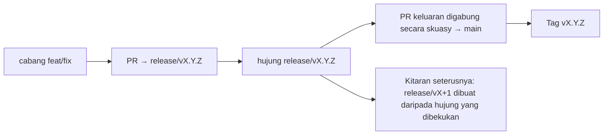

# Branching & Release Model (Bahasa Melayu)

🌐 **Languages:** 🇺🇸 [English](../../../../ops/BRANCHING_MODEL.md) · 🇪🇹 [am](../../../am/docs/ops/BRANCHING_MODEL.md) · 🇸🇦 [ar](../../../ar/docs/ops/BRANCHING_MODEL.md) · 🇦🇿 [az](../../../az/docs/ops/BRANCHING_MODEL.md) · 🇧🇬 [bg](../../../bg/docs/ops/BRANCHING_MODEL.md) · 🇧🇩 [bn](../../../bn/docs/ops/BRANCHING_MODEL.md) · 🇨🇿 [cs](../../../cs/docs/ops/BRANCHING_MODEL.md) · 🇩🇰 [da](../../../da/docs/ops/BRANCHING_MODEL.md) · 🇩🇪 [de](../../../de/docs/ops/BRANCHING_MODEL.md) · 🇬🇷 [el](../../../el/docs/ops/BRANCHING_MODEL.md) · 🇪🇸 [es](../../../es/docs/ops/BRANCHING_MODEL.md) · 🇪🇪 [et](../../../et/docs/ops/BRANCHING_MODEL.md) · 🇮🇷 [fa](../../../fa/docs/ops/BRANCHING_MODEL.md) · 🇫🇮 [fi](../../../fi/docs/ops/BRANCHING_MODEL.md) · 🇫🇷 [fr](../../../fr/docs/ops/BRANCHING_MODEL.md) · 🇮🇪 [ga](../../../ga/docs/ops/BRANCHING_MODEL.md) · 🇮🇳 [gu](../../../gu/docs/ops/BRANCHING_MODEL.md) · 🇳🇬 [ha](../../../ha/docs/ops/BRANCHING_MODEL.md) · 🇮🇱 [he](../../../he/docs/ops/BRANCHING_MODEL.md) · 🇮🇳 [hi](../../../hi/docs/ops/BRANCHING_MODEL.md) · 🇭🇷 [hr](../../../hr/docs/ops/BRANCHING_MODEL.md) · 🇭🇺 [hu](../../../hu/docs/ops/BRANCHING_MODEL.md) · 🇦🇲 [hy](../../../hy/docs/ops/BRANCHING_MODEL.md) · 🇮🇩 [id](../../../id/docs/ops/BRANCHING_MODEL.md) · 🇳🇬 [ig](../../../ig/docs/ops/BRANCHING_MODEL.md) · 🇮🇹 [it](../../../it/docs/ops/BRANCHING_MODEL.md) · 🇯🇵 [ja](../../../ja/docs/ops/BRANCHING_MODEL.md) · 🇬🇪 [ka](../../../ka/docs/ops/BRANCHING_MODEL.md) · 🇰🇭 [km](../../../km/docs/ops/BRANCHING_MODEL.md) · 🇮🇳 [kn](../../../kn/docs/ops/BRANCHING_MODEL.md) · 🇰🇷 [ko](../../../ko/docs/ops/BRANCHING_MODEL.md) · 🇱🇹 [lt](../../../lt/docs/ops/BRANCHING_MODEL.md) · 🇱🇻 [lv](../../../lv/docs/ops/BRANCHING_MODEL.md) · 🇮🇳 [ml](../../../ml/docs/ops/BRANCHING_MODEL.md) · 🇮🇳 [mr](../../../mr/docs/ops/BRANCHING_MODEL.md) · 🇲🇹 [mt](../../../mt/docs/ops/BRANCHING_MODEL.md) · 🇲🇲 [my](../../../my/docs/ops/BRANCHING_MODEL.md) · 🇳🇵 [ne](../../../ne/docs/ops/BRANCHING_MODEL.md) · 🇳🇱 [nl](../../../nl/docs/ops/BRANCHING_MODEL.md) · 🇳🇴 [no](../../../no/docs/ops/BRANCHING_MODEL.md) · 🇮🇳 [or](../../../or/docs/ops/BRANCHING_MODEL.md) · 🇮🇳 [pa](../../../pa/docs/ops/BRANCHING_MODEL.md) · 🇵🇭 [phi](../../../phi/docs/ops/BRANCHING_MODEL.md) · 🇵🇱 [pl](../../../pl/docs/ops/BRANCHING_MODEL.md) · 🇵🇹 [pt](../../../pt/docs/ops/BRANCHING_MODEL.md) · 🇧🇷 [pt-BR](../../../pt-BR/docs/ops/BRANCHING_MODEL.md) · 🇷🇴 [ro](../../../ro/docs/ops/BRANCHING_MODEL.md) · 🇷🇺 [ru](../../../ru/docs/ops/BRANCHING_MODEL.md) · 🇱🇰 [si](../../../si/docs/ops/BRANCHING_MODEL.md) · 🇸🇰 [sk](../../../sk/docs/ops/BRANCHING_MODEL.md) · 🇸🇮 [sl](../../../sl/docs/ops/BRANCHING_MODEL.md) · 🇷🇸 [sr](../../../sr/docs/ops/BRANCHING_MODEL.md) · 🇸🇪 [sv](../../../sv/docs/ops/BRANCHING_MODEL.md) · 🇰🇪 [sw](../../../sw/docs/ops/BRANCHING_MODEL.md) · 🇮🇳 [ta](../../../ta/docs/ops/BRANCHING_MODEL.md) · 🇮🇳 [te](../../../te/docs/ops/BRANCHING_MODEL.md) · 🇹🇭 [th](../../../th/docs/ops/BRANCHING_MODEL.md) · 🇹🇷 [tr](../../../tr/docs/ops/BRANCHING_MODEL.md) · 🇺🇦 [uk-UA](../../../uk-UA/docs/ops/BRANCHING_MODEL.md) · 🇵🇰 [ur](../../../ur/docs/ops/BRANCHING_MODEL.md) · 🇺🇿 [uz](../../../uz/docs/ops/BRANCHING_MODEL.md) · 🇻🇳 [vi](../../../vi/docs/ops/BRANCHING_MODEL.md) · 🇳🇬 [yo](../../../yo/docs/ops/BRANCHING_MODEL.md) · 🇨🇳 [zh-CN](../../../zh-CN/docs/ops/BRANCHING_MODEL.md) · 🇹🇼 [zh-TW](../../../zh-TW/docs/ops/BRANCHING_MODEL.md)

---

OmniRoute menggunakan model keluaran **kitaran selari**: cabang khusus `release/vX.Y.Z`
untuk kitaran aktif, `main` untuk barisan yang telah diterbitkan dan tag kekal
`vX.Y.Z` apabila kitaran tersebut dikeluarkan. Melihat komit dimasukkan ke dalam `release/*` _dan_ ke dalam
`main` adalah dijangka — bukannya suatu kekeliruan.

Butiran untuk penyelenggara tersedia dalam `CLAUDE.md` (Peraturan Tegas #21) dan
[RELEASE_CHECKLIST.md](./RELEASE_CHECKLIST.md). Halaman ini ialah ringkasan umum
untuk penyumbang.

## Sekilas pandang

| Rujukan          | Peranan                                                                                             |
| ---------------- | --------------------------------------------------------------------------------------------------- |
| `release/vX.Y.Z` | **Kitaran aktif** — pembangunan harian dan penggabungan PR untuk versi tersebut                     |
| `main`           | **Barisan diterbitkan** — menerima kitaran melalui penggabungan skuasy apabila keluaran diterbitkan |
| `vX.Y.Z` (tag)   | **Penanda keluaran** — penuding kekal “apa yang dikeluarkan” yang dibuat pada waktu keluaran        |



## Cabang manakah yang harus disasarkan oleh PR saya?

**Sasarkan cabang aktif `release/vX.Y.Z` — bukan `main`.**

1. Cari cabang terbuka `release/v*` yang tertinggi (contoh ketika penulisan:
   `release/v3.8.49`).
2. Cipta cabang daripada hujung tersebut (`git fetch` + daftar keluar / rebase padanya).
3. Buka PR dengan **base = `release/vX.Y.Z` tersebut**.

`main` bukan cabang penyepaduan harian. PR yang dibuka terhadap `main`
biasanya perlu disasarkan semula sebelum digabungkan.

## Pembekuan keluaran (kitaran selari)

Apabila suatu keluaran sedang diselaraskan, isu penanda berlabel `release-freeze`
akan dibuka. Perkara itu **tidak menghentikan pembangunan**:

- `release/vX.Y.Z` yang dibekukan berada di bawah tanggungjawab kapten keluaran untuk penerbitan tersebut.
- `release/vX+1` bagi kitaran seterusnya dibuat daripada hujung yang dibekukan supaya penyumbang boleh terus
  memasukkan kerja.
- PR terbuka yang masih menyasarkan cabang yang dibekukan harus **disasarkan semula** kepada
  cabang `release/v*` yang aktif (tertinggi).

Semak sama ada terdapat pembekuan terbuka sebelum menganggap cabang yang anda inginkan boleh digabungkan:

```bash
gh issue list --repo diegosouzapw/OmniRoute --label release-freeze --state open
```

Mekanisme penggabungan (label `queue` oleh pemilik → Mergify) didokumenkan dalam
[MERGE_TRAIN.md](./MERGE_TRAIN.md).

## Mengapakah cabang dan tag diperlukan?

| Artifak          | Jangka hayat            | Tujuan                                                                 |
| ---------------- | ----------------------- | ---------------------------------------------------------------------- |
| `release/vX.Y.Z` | Kitaran sedang berjalan | Mengumpulkan PR yang telah disemak, kekal lulus CI dan menjadi asas PR |
| Tag `vX.Y.Z`     | Selamanya               | Menandakan bit tepat yang dikeluarkan kepada npm / GitHub Releases     |

Cabang ialah bengkel; tag ialah pakej yang dimeterai. Selepas penggabungan skuasy ke
`main`, kitaran seterusnya diteruskan pada `release/vX+1` tanpa menunggu PR
keluaran sebelumnya selesai.

## Dokumentasi berkaitan

- [CONTRIBUTING.md](../../CONTRIBUTING.md) — persediaan, ujian, senarai semak PR
- [RELEASE_CHECKLIST.md](./RELEASE_CHECKLIST.md) — pengesahan sebelum keluaran
- [MERGE_TRAIN.md](./MERGE_TRAIN.md) — baris gilir penggabungan dan rangkaian sandaran
- [RELEASE_GREEN.md](./RELEASE_GREEN.md) — memastikan hujung keluaran kekal lulus
