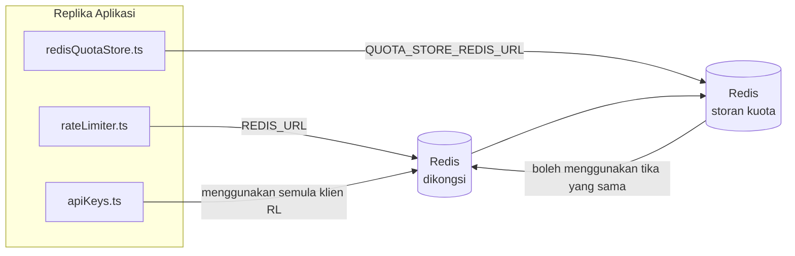

# Redis Production Configuration Guide (Bahasa Melayu)

🌐 **Languages:** 🇺🇸 [English](../../../../ops/REDIS_PRODUCTION_CONFIG.md) · 🇪🇹 [am](../../../am/docs/ops/REDIS_PRODUCTION_CONFIG.md) · 🇸🇦 [ar](../../../ar/docs/ops/REDIS_PRODUCTION_CONFIG.md) · 🇦🇿 [az](../../../az/docs/ops/REDIS_PRODUCTION_CONFIG.md) · 🇧🇬 [bg](../../../bg/docs/ops/REDIS_PRODUCTION_CONFIG.md) · 🇧🇩 [bn](../../../bn/docs/ops/REDIS_PRODUCTION_CONFIG.md) · 🇨🇿 [cs](../../../cs/docs/ops/REDIS_PRODUCTION_CONFIG.md) · 🇩🇰 [da](../../../da/docs/ops/REDIS_PRODUCTION_CONFIG.md) · 🇩🇪 [de](../../../de/docs/ops/REDIS_PRODUCTION_CONFIG.md) · 🇬🇷 [el](../../../el/docs/ops/REDIS_PRODUCTION_CONFIG.md) · 🇪🇸 [es](../../../es/docs/ops/REDIS_PRODUCTION_CONFIG.md) · 🇪🇪 [et](../../../et/docs/ops/REDIS_PRODUCTION_CONFIG.md) · 🇮🇷 [fa](../../../fa/docs/ops/REDIS_PRODUCTION_CONFIG.md) · 🇫🇮 [fi](../../../fi/docs/ops/REDIS_PRODUCTION_CONFIG.md) · 🇫🇷 [fr](../../../fr/docs/ops/REDIS_PRODUCTION_CONFIG.md) · 🇮🇪 [ga](../../../ga/docs/ops/REDIS_PRODUCTION_CONFIG.md) · 🇮🇳 [gu](../../../gu/docs/ops/REDIS_PRODUCTION_CONFIG.md) · 🇳🇬 [ha](../../../ha/docs/ops/REDIS_PRODUCTION_CONFIG.md) · 🇮🇱 [he](../../../he/docs/ops/REDIS_PRODUCTION_CONFIG.md) · 🇮🇳 [hi](../../../hi/docs/ops/REDIS_PRODUCTION_CONFIG.md) · 🇭🇷 [hr](../../../hr/docs/ops/REDIS_PRODUCTION_CONFIG.md) · 🇭🇺 [hu](../../../hu/docs/ops/REDIS_PRODUCTION_CONFIG.md) · 🇦🇲 [hy](../../../hy/docs/ops/REDIS_PRODUCTION_CONFIG.md) · 🇮🇩 [id](../../../id/docs/ops/REDIS_PRODUCTION_CONFIG.md) · 🇳🇬 [ig](../../../ig/docs/ops/REDIS_PRODUCTION_CONFIG.md) · 🇮🇹 [it](../../../it/docs/ops/REDIS_PRODUCTION_CONFIG.md) · 🇯🇵 [ja](../../../ja/docs/ops/REDIS_PRODUCTION_CONFIG.md) · 🇬🇪 [ka](../../../ka/docs/ops/REDIS_PRODUCTION_CONFIG.md) · 🇰🇭 [km](../../../km/docs/ops/REDIS_PRODUCTION_CONFIG.md) · 🇮🇳 [kn](../../../kn/docs/ops/REDIS_PRODUCTION_CONFIG.md) · 🇰🇷 [ko](../../../ko/docs/ops/REDIS_PRODUCTION_CONFIG.md) · 🇱🇹 [lt](../../../lt/docs/ops/REDIS_PRODUCTION_CONFIG.md) · 🇱🇻 [lv](../../../lv/docs/ops/REDIS_PRODUCTION_CONFIG.md) · 🇮🇳 [ml](../../../ml/docs/ops/REDIS_PRODUCTION_CONFIG.md) · 🇮🇳 [mr](../../../mr/docs/ops/REDIS_PRODUCTION_CONFIG.md) · 🇲🇹 [mt](../../../mt/docs/ops/REDIS_PRODUCTION_CONFIG.md) · 🇲🇲 [my](../../../my/docs/ops/REDIS_PRODUCTION_CONFIG.md) · 🇳🇵 [ne](../../../ne/docs/ops/REDIS_PRODUCTION_CONFIG.md) · 🇳🇱 [nl](../../../nl/docs/ops/REDIS_PRODUCTION_CONFIG.md) · 🇳🇴 [no](../../../no/docs/ops/REDIS_PRODUCTION_CONFIG.md) · 🇮🇳 [or](../../../or/docs/ops/REDIS_PRODUCTION_CONFIG.md) · 🇮🇳 [pa](../../../pa/docs/ops/REDIS_PRODUCTION_CONFIG.md) · 🇵🇭 [phi](../../../phi/docs/ops/REDIS_PRODUCTION_CONFIG.md) · 🇵🇱 [pl](../../../pl/docs/ops/REDIS_PRODUCTION_CONFIG.md) · 🇵🇹 [pt](../../../pt/docs/ops/REDIS_PRODUCTION_CONFIG.md) · 🇧🇷 [pt-BR](../../../pt-BR/docs/ops/REDIS_PRODUCTION_CONFIG.md) · 🇷🇴 [ro](../../../ro/docs/ops/REDIS_PRODUCTION_CONFIG.md) · 🇷🇺 [ru](../../../ru/docs/ops/REDIS_PRODUCTION_CONFIG.md) · 🇱🇰 [si](../../../si/docs/ops/REDIS_PRODUCTION_CONFIG.md) · 🇸🇰 [sk](../../../sk/docs/ops/REDIS_PRODUCTION_CONFIG.md) · 🇸🇮 [sl](../../../sl/docs/ops/REDIS_PRODUCTION_CONFIG.md) · 🇷🇸 [sr](../../../sr/docs/ops/REDIS_PRODUCTION_CONFIG.md) · 🇸🇪 [sv](../../../sv/docs/ops/REDIS_PRODUCTION_CONFIG.md) · 🇰🇪 [sw](../../../sw/docs/ops/REDIS_PRODUCTION_CONFIG.md) · 🇮🇳 [ta](../../../ta/docs/ops/REDIS_PRODUCTION_CONFIG.md) · 🇮🇳 [te](../../../te/docs/ops/REDIS_PRODUCTION_CONFIG.md) · 🇹🇭 [th](../../../th/docs/ops/REDIS_PRODUCTION_CONFIG.md) · 🇹🇷 [tr](../../../tr/docs/ops/REDIS_PRODUCTION_CONFIG.md) · 🇺🇦 [uk-UA](../../../uk-UA/docs/ops/REDIS_PRODUCTION_CONFIG.md) · 🇵🇰 [ur](../../../ur/docs/ops/REDIS_PRODUCTION_CONFIG.md) · 🇺🇿 [uz](../../../uz/docs/ops/REDIS_PRODUCTION_CONFIG.md) · 🇻🇳 [vi](../../../vi/docs/ops/REDIS_PRODUCTION_CONFIG.md) · 🇳🇬 [yo](../../../yo/docs/ops/REDIS_PRODUCTION_CONFIG.md) · 🇨🇳 [zh-CN](../../../zh-CN/docs/ops/REDIS_PRODUCTION_CONFIG.md) · 🇹🇼 [zh-TW](../../../zh-TW/docs/ops/REDIS_PRODUCTION_CONFIG.md)

---

## Gambaran Keseluruhan

Redis ialah **kebergantungan lembut pilihan** dalam OmniRoute — aplikasi mengalami degradasi secara terkawal (sandaran dalam memori) apabila Redis tidak tersedia. Dalam pengeluaran, penalaan Redis mengurangkan kependaman untuk empat beban kerja yang berbeza:

| Beban Kerja             | Pemacu                        | Kilang Klien                                      | Corak Kunci                                               |
| ----------------------- | ----------------------------- | ------------------------------------------------- | --------------------------------------------------------- |
| Pengehadan kadar        | `rateLimiter.ts`              | `getRedisClient()` — singleton `ioredis` malas    | Tetingkap had kadar atomik Lua `<prefix>rl:*`             |
| Cache pengesahan        | `apiKeys.ts`                  | Menggunakan semula klien `rateLimiter`            | `<prefix>auth:api_key:<sha256>` dengan TTL                |
| Storan kuota            | `redisQuotaStore.ts`          | Singleton `getRedisClient(url)` yang berasingan   | `<prefix>quota:*` boleh dikonfigurasikan bagi setiap tika |
| Pemutus litar pemanasan | `redisCircuitBreakerStore.ts` | Klien berasingan dalam `circuitBreakerFactory.ts` | `<prefix>warmup:cb:<connectionId>`                        |

Keempat-empat beban kerja berkongsi satu awalan ruang nama supaya OmniRoute boleh wujud bersama aplikasi lain pada satu tika Redis (cth. `127.0.0.1:6379`). Lihat [Penggunaan Ruang Nama Kunci](#key-namespacing).

---

## Konfigurasi Semasa (Lalai Kod)

| Tetapan                                            | Nilai                                                  | Lokasi                                                                                |
| -------------------------------------------------- | ------------------------------------------------------ | ------------------------------------------------------------------------------------- |
| Pemboleh ubah persekitaran `REDIS_URL`             | `redis://redis:6379` (compose), pilihan                | `rateLimiter.ts:5`, `.env.example`                                                    |
| Pemboleh ubah persekitaran `REDIS_KEY_PREFIX`      | `omniroute:` (lalai)                                   | `rateLimiter.ts`, `redisQuotaStore.ts`, `redisCircuitBreakerStore.ts`, `.env.example` |
| Pemboleh ubah persekitaran `QUOTA_STORE_REDIS_URL` | berasingan, boleh berbeza daripada `REDIS_URL`         | `quota/storeFactory.ts`                                                               |
| `QUOTA_STORE_DRIVER`                               | `"sqlite"` (lalai), `"redis"` pilihan                  | `quota/storeFactory.ts`                                                               |
| `maxRetriesPerRequest` ioredis                     | `3`                                                    | penciptaan klien `rateLimiter.ts`                                                     |
| `enableReadyCheck`                                 | tidak ditetapkan (lalai ioredis: `true`)               | —                                                                                     |
| `lazyConnect`                                      | tidak ditetapkan (lalai ioredis: `false`)              | —                                                                                     |
| `retryStrategy`                                    | tidak ditetapkan (lalai ioredis: asas 200ms, eksponen) | —                                                                                     |
| TLS / kata laluan / indeks DB                      | **tidak dikonfigurasikan**                             | —                                                                                     |
| Sentinel / Cluster                                 | **tidak dikonfigurasikan** — hanya nod tunggal kendiri | —                                                                                     |

---

## Penggunaan Ruang Nama Kunci

OmniRoute berkongsi satu tika Redis dengan apa-apa sahaja yang berjalan pada hos. Tanpa ruang nama, kunci seperti `auth:api_key:<sha256>` atau `rl:*` mungkin bertembung dengan kunci daripada aplikasi lain yang menggunakan Redis yang sama (tika ini menjalankan Redis pada `127.0.0.1:6379` bersama perkhidmatan lain).

Tetapkan `REDIS_KEY_PREFIX` kepada rentetan yang tidak kosong untuk mengawalkan **setiap** kunci OmniRoute:

```bash
# .env — semua kunci OmniRoute menjadi omniroute:rl:*, omniroute:auth:*, omniroute:quota:*, omniroute:warmup:cb:*
REDIS_KEY_PREFIX=omniroute:
```

- **Lalai:** `omniroute:` (digunakan apabila `REDIS_KEY_PREFIX` tidak ditetapkan atau kosong).
- **Digunakan pada:** pengehad kadar + cache pengesahan (klien `ioredis` yang dikongsi melalui `keyPrefix`) dan
  storan kuota (`KEY_PREFIX = "${REDIS_KEY_PREFIX}quota"`) serta pemutus litar pemanasan
  (`KEY_PREFIX = "${REDIS_KEY_PREFIX}warmup:cb:"`).
- **Menukar awalan** apabila kunci sudah wujud dalam Redis menyebabkan kunci lama menjadi yatim (kunci tersebut luput
  melalui TTL / LRU). Selamat untuk diubah; tiada migrasi diperlukan. Satu pengecualian ialah kunci pemutus
  litar pemanasan bagi sambungan yang ditandai sebagai dilarang: kunci tersebut disimpan tanpa TTL, jadi
  senaraikan baki kunci dengan `redis-cli --scan --pattern '<old-prefix>warmup:cb:*'` dan padamkannya.
- **`keyPrefix` ioredis** secara automatik menambahkan awalan ketika menulis **dan** membuangnya ketika membaca,
  jadi kod aplikasi tidak pernah melihat awalan tersebut.

---

## Penalaan Produksi yang Disyorkan

### 1. Kumpulan Sambungan / Pilihan Klien (pembina `Redis` ioredis)

Kod semasa mencipta satu `new Redis(url)` tanpa pilihan tersuai. Untuk penggunaan produksi
berbilang replika, hantarkan kilang klien dalam kod atau balut `getRedisClient()`:

```typescript
const redis = new Redis(REDIS_URL, {
  maxRetriesPerRequest: null, // tiada had percubaan semula; biarkan retryStrategy menentukan
  enableReadyCheck: true, // sahkan pelayan sedia sebelum menerima panggilan
  lazyConnect: true, // jangan bersambung semasa pembinaan; tunggu panggilan pertama
  retryStrategy: (times) => {
    if (times > 10) return null; // berhenti selepas 10 percubaan semula → sambung semula kemudian
    return Math.min(times * 200, 5000); // 200ms, 400ms, …, had 5s
  },
  enableAutoPipelining: true, // gabungkan perintah serentak ke dalam satu penulisan TCP
  keepAlive: 10000, // kekalkan sambungan TCP setiap 10s
});
```

**Pertimbangan utama:**

- `maxRetriesPerRequest: null` + `retryStrategy` — lebih sesuai untuk produksi supaya
  mula semula Redis yang bersifat sementara tidak serta-merta menggagalkan setiap permintaan.
  Mekanisme sandaran dalam memori dalam `checkRateLimit()` menyerap laluan kegagalan.
- `lazyConnect: true` — mengelakkan kebergantungan permulaan pada ketersediaan Redis sebelum
  pelayan mula menerima sambungan.
- `enableAutoPipelining: true` — mengurangkan perjalanan pergi balik untuk semakan had kadar
  serentak; bermanfaat pada >50 RPS melalui satu sambungan.

### 2. Konfigurasi Pelayan Redis (`redis.conf`)

```
# Memori
maxmemory 80%                        # tinggalkan ruang untuk cache halaman OS
maxmemory-policy allkeys-lru         # singkirkan entri cache pengesahan yang lapuk apabila tertekan

# Pengekalan (pilihan — OmniRoute selamat daripada ranap tanpanya)
save 300 1                           # ambil petikan sekurang-kurangnya setiap 5 min jika ≥1 kekunci berubah
appendonly no                        # AOF tidak diperlukan; data boleh dijana semula
appendfsync no                       # tiada overhed fsync (RDB sudah mencukupi)

# Rangkaian
timeout 0                            # tiada pemutusan sambungan melahu
tcp-keepalive 300                    # kekalkan sambungan selama 5 min
tcp-backlog 511                      # tunggakan sambungan untuk beban mendadak

# Prestasi
hz 10                                # lalai; 100 untuk penggunaan yang sensitif terhadap kependaman
activedefrag yes                     # nyahserpih secara automatik apabila pemecahan >10%
```

**Pertimbangan untuk `maxmemory-policy allkeys-lru`:** Entri cache pengesahan mungkin
disingkirkan apabila memori tertekan. Ini selamat — `setCachedApiKey` sentiasa mengisi
semula apabila berlaku kegagalan cache, dan mekanisme sandaran SQLite ialah sumber berwibawa.
Skrip Lua pengehad kadar mencipta kekunci kecil yang sememangnya berjangka hayat pendek.

### 3. Tetapan Docker Compose

Compose produksi (`docker-compose.prod.yml`) menggunakan `redis:8.6.2-alpine`. Tambahkan:

```yaml
redis:
  image: redis:8.6.2-alpine
  command:
    [
      "redis-server",
      "--maxmemory",
      "512mb",
      "--maxmemory-policy",
      "allkeys-lru",
      "--activedefrag",
      "yes",
      "--save",
      "300 1",
    ]
  healthcheck:
    test: ["CMD", "redis-cli", "ping"]
    interval: 10s
    timeout: 3s
    retries: 3
    start_period: 5s
```

### 4. Pertimbangan Berbilang Kejadian / Penskalaan

**Satu Redis untuk semua replika** — skrip Lua pengehad kadar bergantung pada satu
ruang kekunci berwibawa. Berbilang kejadian Redis di belakang replika akan menghilangkan
keatoman dan menggandakan belanjawan. Gunakan satu Redis (atau kluster Redis Sentinel
dengan failover) untuk semua replika aplikasi.

**Bilangan sambungan:** Setiap replika aplikasi membuka **2 sambungan TCP** ke Redis
(klien pengehad kadar + klien stor kuota). Dengan 10 replika → 20 sambungan, masih
jauh di bawah had lalai 10k sambungan bagi satu kejadian Redis.

### 5. Pemantauan

Dedahkan melalui titik akhir semakan kesihatan:

```typescript
// src/app/api/monitoring/health/route.ts sudah memanggil fungsi rateLimiter
// Tambahkan semakan khusus Redis:
//   1. Kependaman PING melalui ioredis .ping()
//   2. Penggunaan memori melalui INFO memory
//   3. Bilangan sambungan melalui INFO clients
//   4. Kadar hit untuk maxmemory-policy (evicted_keys / keyspace_hits)
```

Metrik utama untuk dipantau:

- **Kekunci yang disingkirkan / saat** — jika sentiasa bukan sifar, tingkatkan `maxmemory`
- **Klien tersekat** — nilai bukan sifar menunjukkan skrip Lua yang perlahan atau persaingan tinggi
- **Sambungan ditolak** — had sambungan telah dicapai; jarang berlaku dengan 20 sambungan

---

## Rajah Seni Bina



---

## Rujukan

| Fail                               | Tujuan                                                               |
| ---------------------------------- | -------------------------------------------------------------------- |
| `src/shared/utils/rateLimiter.ts`  | Klien Redis utama, skrip pengehadan kadar Lua, sandaran dalam memori |
| `src/lib/db/apiKeys.ts`            | Cache pengesahan — sandaran Redis→SQLite                             |
| `src/lib/quota/redisQuotaStore.ts` | Klien Redis berasingan untuk storan kuota pilihan                    |
| `src/lib/quota/storeFactory.ts`    | Bertukar antara pemacu kuota `sqlite` dan `redis`                    |
| `docker-compose.prod.yml`          | Bekas Redis produksi (imej `redis:8.6.2-alpine`)                     |
| `.env.example`                     | Dokumentasi pemboleh ubah persekitaran Redis                         |
| `src/app/api/local/redis/`         | Laluan API untuk orkestrasi bekas pembangunan                        |
| `bin/cli/commands/redis.mjs`       | Perintah CLI untuk orkestrasi bekas pembangunan                      |
