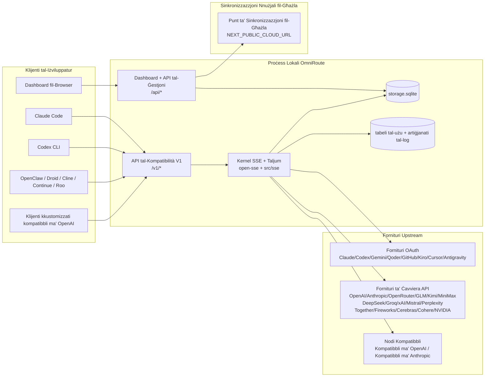
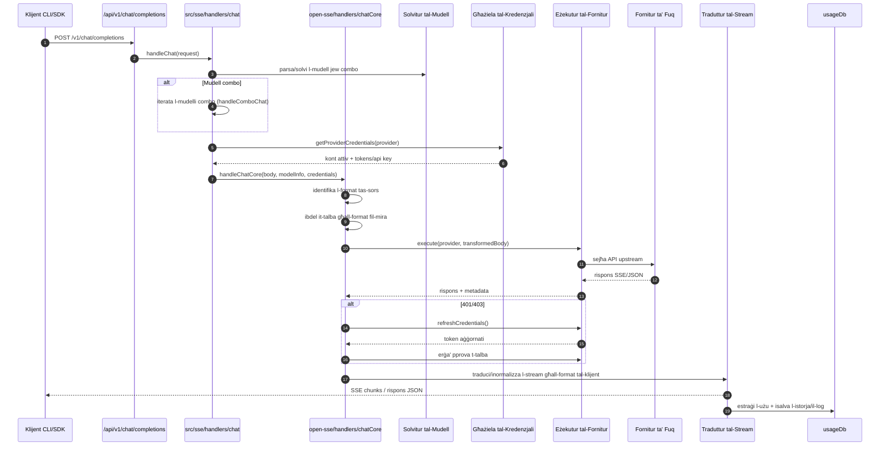
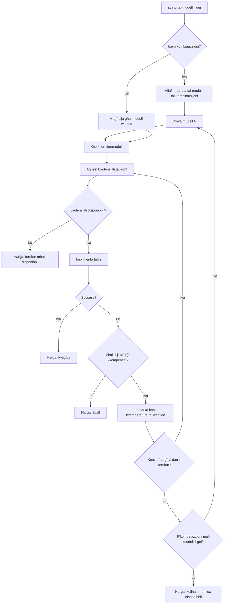
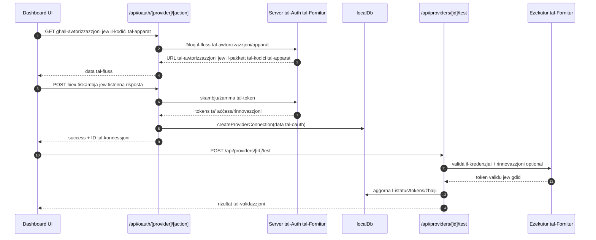
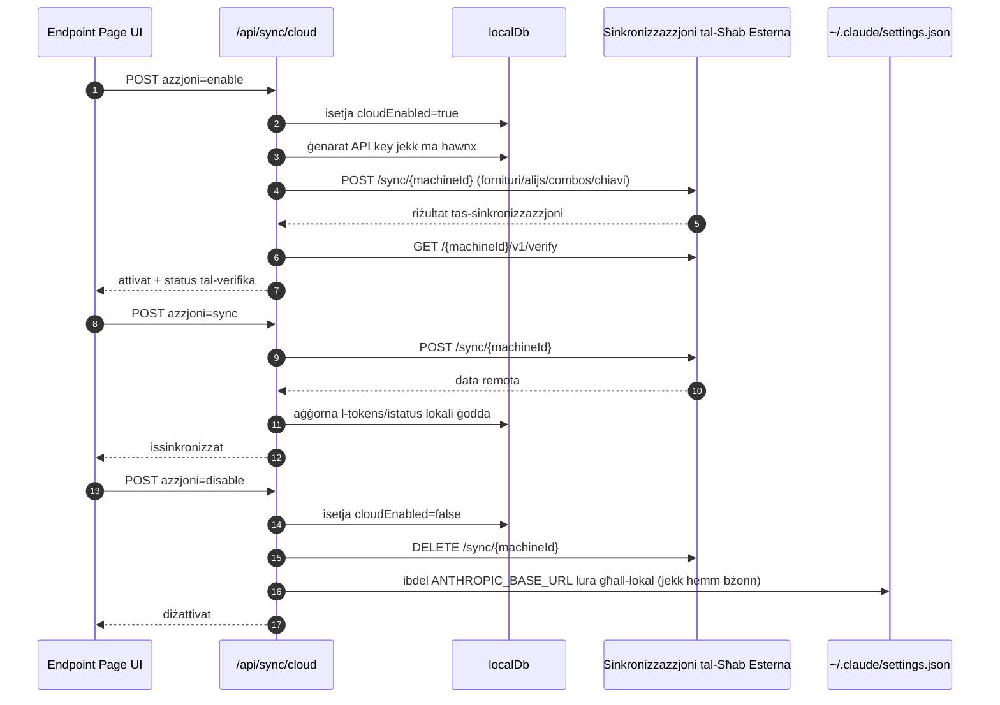
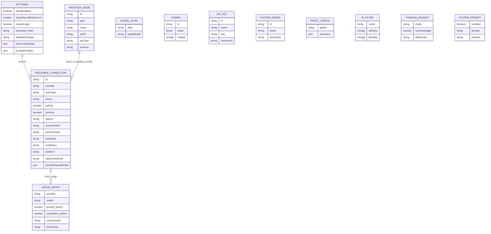
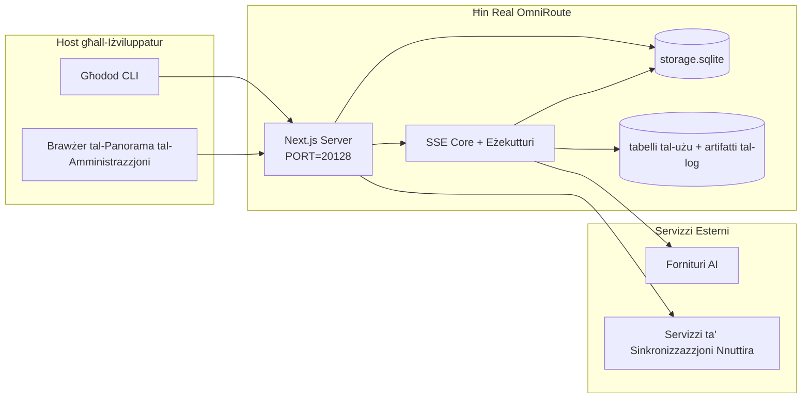

# ARCHITECTURE (Malti)

🌐 **Languages:** 🇺🇸 [English](../../../../architecture/ARCHITECTURE.md) · 🇸🇦 [ar](../../../ar/docs/architecture/ARCHITECTURE.md) · 🇦🇿 [az](../../../az/docs/architecture/ARCHITECTURE.md) · 🇧🇬 [bg](../../../bg/docs/architecture/ARCHITECTURE.md) · 🇧🇩 [bn](../../../bn/docs/architecture/ARCHITECTURE.md) · 🇨🇿 [cs](../../../cs/docs/architecture/ARCHITECTURE.md) · 🇩🇰 [da](../../../da/docs/architecture/ARCHITECTURE.md) · 🇩🇪 [de](../../../de/docs/architecture/ARCHITECTURE.md) · 🇬🇷 [el](../../../el/docs/architecture/ARCHITECTURE.md) · 🇪🇸 [es](../../../es/docs/architecture/ARCHITECTURE.md) · 🇪🇪 [et](../../../et/docs/architecture/ARCHITECTURE.md) · 🇮🇷 [fa](../../../fa/docs/architecture/ARCHITECTURE.md) · 🇫🇮 [fi](../../../fi/docs/architecture/ARCHITECTURE.md) · 🇫🇷 [fr](../../../fr/docs/architecture/ARCHITECTURE.md) · 🇮🇪 [ga](../../../ga/docs/architecture/ARCHITECTURE.md) · 🇮🇳 [gu](../../../gu/docs/architecture/ARCHITECTURE.md) · 🇮🇱 [he](../../../he/docs/architecture/ARCHITECTURE.md) · 🇮🇳 [hi](../../../hi/docs/architecture/ARCHITECTURE.md) · 🇭🇷 [hr](../../../hr/docs/architecture/ARCHITECTURE.md) · 🇭🇺 [hu](../../../hu/docs/architecture/ARCHITECTURE.md) · 🇮🇩 [id](../../../id/docs/architecture/ARCHITECTURE.md) · 🇮🇹 [it](../../../it/docs/architecture/ARCHITECTURE.md) · 🇯🇵 [ja](../../../ja/docs/architecture/ARCHITECTURE.md) · 🇰🇷 [ko](../../../ko/docs/architecture/ARCHITECTURE.md) · 🇱🇹 [lt](../../../lt/docs/architecture/ARCHITECTURE.md) · 🇱🇻 [lv](../../../lv/docs/architecture/ARCHITECTURE.md) · 🇮🇳 [mr](../../../mr/docs/architecture/ARCHITECTURE.md) · 🇲🇾 [ms](../../../ms/docs/architecture/ARCHITECTURE.md) · 🇳🇱 [nl](../../../nl/docs/architecture/ARCHITECTURE.md) · 🇳🇴 [no](../../../no/docs/architecture/ARCHITECTURE.md) · 🇵🇭 [phi](../../../phi/docs/architecture/ARCHITECTURE.md) · 🇵🇱 [pl](../../../pl/docs/architecture/ARCHITECTURE.md) · 🇵🇹 [pt](../../../pt/docs/architecture/ARCHITECTURE.md) · 🇧🇷 [pt-BR](../../../pt-BR/docs/architecture/ARCHITECTURE.md) · 🇷🇴 [ro](../../../ro/docs/architecture/ARCHITECTURE.md) · 🇷🇺 [ru](../../../ru/docs/architecture/ARCHITECTURE.md) · 🇸🇰 [sk](../../../sk/docs/architecture/ARCHITECTURE.md) · 🇸🇮 [sl](../../../sl/docs/architecture/ARCHITECTURE.md) · 🇷🇸 [sr](../../../sr/docs/architecture/ARCHITECTURE.md) · 🇸🇪 [sv](../../../sv/docs/architecture/ARCHITECTURE.md) · 🇰🇪 [sw](../../../sw/docs/architecture/ARCHITECTURE.md) · 🇮🇳 [ta](../../../ta/docs/architecture/ARCHITECTURE.md) · 🇮🇳 [te](../../../te/docs/architecture/ARCHITECTURE.md) · 🇹🇭 [th](../../../th/docs/architecture/ARCHITECTURE.md) · 🇹🇷 [tr](../../../tr/docs/architecture/ARCHITECTURE.md) · 🇺🇦 [uk-UA](../../../uk-UA/docs/architecture/ARCHITECTURE.md) · 🇵🇰 [ur](../../../ur/docs/architecture/ARCHITECTURE.md) · 🇻🇳 [vi](../../../vi/docs/architecture/ARCHITECTURE.md) · 🇨🇳 [zh-CN](../../../zh-CN/docs/architecture/ARCHITECTURE.md) · 🇹🇼 [zh-TW](../../../zh-TW/docs/architecture/ARCHITECTURE.md)

---

---

title: "Arkitettura ta’ OmniRoute"
version: 3.8.40
lastUpdated: 2026-06-28
---

# Arkitettura ta’ OmniRoute

🌐 **Languages:** 🇺🇸 [English](../../../../architecture/ARCHITECTURE.md) · 🇸🇦 [ar](../../../ar/docs/architecture/ARCHITECTURE.md) · 🇦🇿 [az](../../../az/docs/architecture/ARCHITECTURE.md) · 🇧🇬 [bg](../../../bg/docs/architecture/ARCHITECTURE.md) · 🇧🇩 [bn](../../../bn/docs/architecture/ARCHITECTURE.md) · 🇨🇿 [cs](../../../cs/docs/architecture/ARCHITECTURE.md) · 🇩🇰 [da](../../../da/docs/architecture/ARCHITECTURE.md) · 🇩🇪 [de](../../../de/docs/architecture/ARCHITECTURE.md) · 🇬🇷 [el](../../../el/docs/architecture/ARCHITECTURE.md) · 🇪🇸 [es](../../../es/docs/architecture/ARCHITECTURE.md) · 🇪🇪 [et](../../../et/docs/architecture/ARCHITECTURE.md) · 🇮🇷 [fa](../../../fa/docs/architecture/ARCHITECTURE.md) · 🇫🇮 [fi](../../../fi/docs/architecture/ARCHITECTURE.md) · 🇫🇷 [fr](../../../fr/docs/architecture/ARCHITECTURE.md) · 🇮🇪 [ga](../../../ga/docs/architecture/ARCHITECTURE.md) · 🇮🇳 [gu](../../../gu/docs/architecture/ARCHITECTURE.md) · 🇮🇱 [he](../../../he/docs/architecture/ARCHITECTURE.md) · 🇮🇳 [hi](../../../hi/docs/architecture/ARCHITECTURE.md) · 🇭🇷 [hr](../../../hr/docs/architecture/ARCHITECTURE.md) · 🇭🇺 [hu](../../../hu/docs/architecture/ARCHITECTURE.md) · 🇮🇩 [id](../../../id/docs/architecture/ARCHITECTURE.md) · 🇮🇹 [it](../../../it/docs/architecture/ARCHITECTURE.md) · 🇯🇵 [ja](../../../ja/docs/architecture/ARCHITECTURE.md) · 🇰🇷 [ko](../../../ko/docs/architecture/ARCHITECTURE.md) · 🇱🇹 [lt](../../../lt/docs/architecture/ARCHITECTURE.md) · 🇱🇻 [lv](../../../lv/docs/architecture/ARCHITECTURE.md) · 🇮🇳 [mr](../../../mr/docs/architecture/ARCHITECTURE.md) · 🇲🇾 [ms](../../../ms/docs/architecture/ARCHITECTURE.md) · 🇳🇱 [nl](../../../nl/docs/architecture/ARCHITECTURE.md) · 🇳🇴 [no](../../../no/docs/architecture/ARCHITECTURE.md) · 🇵🇭 [phi](../../../phi/docs/architecture/ARCHITECTURE.md) · 🇵🇱 [pl](../../../pl/docs/architecture/ARCHITECTURE.md) · 🇵🇹 [pt](../../../pt/docs/architecture/ARCHITECTURE.md) · 🇧🇷 [pt-BR](../../../pt-BR/docs/architecture/ARCHITECTURE.md) · 🇷🇴 [ro](../../../ro/docs/architecture/ARCHITECTURE.md) · 🇷🇺 [ru](../../../ru/docs/architecture/ARCHITECTURE.md) · 🇸🇰 [sk](../../../sk/docs/architecture/ARCHITECTURE.md) · 🇸🇮 [sl](../../../sl/docs/architecture/ARCHITECTURE.md) · 🇷🇸 [sr](../../../sr/docs/architecture/ARCHITECTURE.md) · 🇸🇪 [sv](../../../sv/docs/architecture/ARCHITECTURE.md) · 🇰🇪 [sw](../../../sw/docs/architecture/ARCHITECTURE.md) · 🇮🇳 [ta](../../../ta/docs/architecture/ARCHITECTURE.md) · 🇮🇳 [te](../../../te/docs/architecture/ARCHITECTURE.md) · 🇹🇭 [th](../../../th/docs/architecture/ARCHITECTURE.md) · 🇹🇷 [tr](../../../tr/docs/architecture/ARCHITECTURE.md) · 🇺🇦 [uk-UA](../../../uk-UA/docs/architecture/ARCHITECTURE.md) · 🇵🇰 [ur](../../../ur/docs/architecture/ARCHITECTURE.md) · 🇻🇳 [vi](../../../vi/docs/architecture/ARCHITECTURE.md) · 🇨🇳 [zh-CN](../../../zh-CN/docs/architecture/ARCHITECTURE.md) · 🇹🇼 [zh-TW](../../../zh-TW/docs/architecture/ARCHITECTURE.md)

_Aġġornat l-aħħar: 2026-06-28_

## Sommarju Eżekuttiv

OmniRoute huwa gateway u dashboard ta' routing AI lokali mibni fuq Next.js.
Jipprovdi endpoint waħda kompatibbli ma' OpenAI (`/v1/*`) u jirrotta t-traffik madwar fornitori multipli upstream b'traduzzjoni, fallback, refresh tat-token, u tracking tal-użu.

Kapacitajiet prinċipali:

- Suprafeċ API kompatibbli ma' OpenAI għal CLI/tools (355 fornitur, 108 esekuturi)
- Traduzzjoni ta' request/response madwar formati ta' fornitori
- Fallback ta' model combo (sequenza multi-model)
- Passi combo strutturati (`provider + model + connection`) b'ordinament runtime b' `compositeTiers`
- Fallback a livell ta' account (multi-account għal kull fornitur)
- Preflight tal-quota u selezzjoni ta' account P2C konsapevoli tal-quota fil-path prinċipali tal-chat
- Ġestjoni ta' konezzjoni OAuth + API-key (22 moduli ta' fornitur OAuth)
- Ġenerazzjoni ta' embedding permezz ta' `/v1/embeddings` (18 fornitur)
- Ġenerazzjoni ta' immaġini permezz ta' `/v1/images/generations` (10+ fornitur, 20+ modelli)
- Traskrizzjoni audio permezz ta' `/v1/audio/transcriptions` (18 fornitur)
- Text-to-speech permezz ta' `/v1/audio/speech` (24 fornitur built-in)
- Ġenerazzjoni ta' video permezz ta' `/v1/videos/generations` (ComfyUI + SD WebUI)
- Ġenerazzjoni ta' muzika permezz ta' `/v1/music/generations` (ComfyUI)
- Web search permezz ta' `/v1/search` (20 fornitur)
- Moderations permezz ta' `/v1/moderations`
- Reranking permezz ta' `/v1/rerank`
- Parsing ta' think tag (``) għal modelli ta' reasoning
- Sanitizzazzjoni ta' response għal kompatibilità strikti ma' OpenAI SDK
- Normalizzazzjoni ta' ruoli (developer→system, system→user) għal kompatibilità cross-provider
- Konverżjoni ta' output strutturat (json_schema → Gemini responseSchema)
- Persistenza lokali għal fornitori, keys, aliases, combos, settings, pricing (122 moduli DB)
- Tracking tal-użu/kost u logging ta' request
- Cloud sync opzjonali għal multi-device/state sync
- IP allowlist/blocklist għal kontroll ta' access API
- Ġestjoni ta' budget ta' thinking (passthrough/auto/custom/adaptive)
- Injezzjoni ta' system prompt globali
- Tracking u fingerprinting ta' session
- Enhanced rate limiting per-account b'profili specifici għal fornitur
- Pattern ta' circuit breaker għal resilience ta' fornitur
- Protezzjoni anti-thundering herd b'mutex locking
- Cache ta' deduplicazzjoni ta' request signature-based
- Domain layer: regoli ta' kost, politika ta' fallback, politika ta' lockout
- Context Relay: summariji ta' handoff ta' session għal kontinuità ta' rotazzjoni ta' account
- Persistenza ta' stati domain (SQLite write-through cache għal fallbacks, budgets, lockouts, circuit breakers)
- Policy engine għal evalwazzjoni ċentralizzata ta' request (lockout → budget → fallback)
- Telemetrija ta' request b'aggregazzjoni ta' latenza p50/p95/p99
- Telemetrija ta' combo target u salute storika ta' combo target permezz ta' `combo_execution_key` / `combo_step_id`
- Correlation ID (X-Request-Id) għal end-to-end tracing
- Audit logging ta' compliance b'opt-out per API key
- Eval framework għal quality assurance LLM
- Health dashboard b'status real-time ta' circuit breaker ta' fornitur
- MCP Server (110 tools) b'3 transports (stdio/SSE/Streamable HTTP)
- A2A Server (JSON-RPC 2.0 + SSE) b'skills u task lifecycle
- Sistema ta' memoria (estrazzjoni, injezzjoni, retrieval, summarizzazzjoni)
- Sistema ta' skills (registry, executor, sandbox, built-in skills)
- MITM proxy b'ġestjoni ta' certificati u handling ta' DNS
- Prompt injection guard middleware
- Pipeline ta' kompressjoni ta' prompt b'Caveman, RTK, stacked pipelines, compression combos, language packs, u analytics
- ACP (Agent Communication Protocol) registry
- Fornitori OAuth modulari (22 moduli individwali taħt `src/lib/oauth/providers/`)
- Scripts ta' uninstall/full-uninstall
- Azzjoni ta' repair ta' environment OAuth
- WebSocket bridge għal klijenti WS kompatibbli ma' OpenAI (`/v1/ws`)
- Ġestjoni ta' sync token (issue/revoke, ETag-versioned config bundle download)
- GLM Thinking (`glmt`) first-class provider preset
- Token counting ibridu (provider-side `/messages/count_tokens` b'estimation fallback)
- Auto-seeding ta' model alias (30+ normalizzazzjonijiet cross-proxy dialect at startup)
- Safe outbound fetch b'SSRF guard, private URL blocking, u configurable retry
- Chat retries cooldown-aware b'configurabbli `requestRetry` u `maxRetryIntervalSec`
- Validazzjoni ta' runtime environment b'Zod at startup
- Compliance audit v2 b'paginazzjoni, provider CRUD events, u SSRF-blocked validation logging

Modell prinċipali ta' runtime:

- Next.js app routes taħt `src/app/api/*` jimplimentaw dak li dashboard APIs u compatibility APIs
- Shared SSE/routing core f'`src/sse/*` + `open-sse/*` jgħaddi provider execution, traduzzjoni, streaming, fallback, u użu

## Diqaġni tal-Referenza

Is-sorsi Mermaid kanoniċi, ikkontrollati bil-verżjoni, għall-pjattaforma v3.8.0 jinsabu f’
[`docs/diagrams/`](../diagrams/README.md). Wieħed minnhom jinġieb hawn taħt għal orjentazzjoni;
l-oħrajn huma marbuta mill-gwidi speċifiċi tad-doma tagħhom.


> Sors: [diagrams/request-pipeline.mmd](../diagrams/request-pipeline.mmd)


> Sors: [diagrams/resilience-3layers.mmd](../diagrams/resilience-3layers.mmd) — ukoll marbut minn
> [RESILIENCE_GUIDE.md](./RESILIENCE_GUIDE.md) u r-referenza tal-resiljenza tal-`CLAUDE.md`.

## Portata u Limiti

### Fil-Portata

- Runtime tal-gateway lokali
- APIs tal-ġestjoni tal-dashboard
- Awtentikazzjoni tal-fornitur u tigdid tat-token
- Traduzzjoni tal-ħtiġijiet u SSE streaming
- Stat lokali + reżistenza tal-użu
- Orkestrazzjoni ta' sinkronizzazzjoni tal-cloud (mhux obbligatorja)

### Barra mill-Portata

- Implementazzjoni tas-servizz tal-cloud wara `NEXT_PUBLIC_CLOUD_URL`
- SLA/kontroll tal-fornitur barra mill-proċess lokali
- Binaries tal-CLI esterni (Claude CLI, Codex CLI, eċċ.)

## Superfiċja tal-Dashboard (Attwali)

Paġni ewlenin taħt `src/app/(dashboard)/dashboard/`:

- `/dashboard` — bidu malajr + ġabra tal-fornitur
- `/dashboard/endpoint` — proxy tal-endpoint + MCP + A2A + tabs tal-endpoint API
- `/dashboard/providers` — konnessjonijiet tal-fornitur u kredenzjali
- `/dashboard/combos` — strateġiji tal-combo, templates, bini bbażat fuq passi, regoli tar-rutting tal-mudell, ordinarja maħżuna manwalment
- `/dashboard/auto-combo` — Magna tal-Auto Combo: piżijiet tal-punteġġ, pakketti tal-modalità, presets tal-fabbrika virtwali, telemetrija
- `/dashboard/costs` — aggregazzjoni tal-ispejċ u viżibbiltà tal-prezzijiet
- `/dashboard/analytics` — analitika tal-użu, evalwazzjonijiet, saħħa tal-mira tal-combo
- `/dashboard/limits` — kontrolli tal-kwota/rata
- `/dashboard/cli-tools` — onboarding tal-CLI, identifikazzjoni tal-runtime, ġenerazzjoni tal-konfigurazzjoni
- `/dashboard/agents` — aġenti ACP identifikati + reġistrazzjoni ta' aġenti custom
- `/dashboard/cloud-agents` — xogħlijiet tal-aġenti ospitati fil-cloud (Codex Cloud, Devin, Jules) u l-ċiklu tal-ħajja tax-xogħol
- `/dashboard/skills` — reġistru tal-ħiliet A2A, twettiq tas-sandbox, katalgu tal-ħiliet integrati
- `/dashboard/memory` — spezzjoni u retrieves tal-memorja konversazzjonali reżistenti
- `/dashboard/webhooks` — abbonamenti tal-webhook outbound, rotazzjoni tal-isigri, statistika tal-ħdid mill-ġdid
- `/dashboard/batch` — sottomissjoni tal-impjiegi tal-batch u progress
- `/dashboard/cache` — statistika tal-cache read-through u r-raġunar, kontrolli tal-evikament
- `/dashboard/playground` — playground interattiv tal-chat kontra kwalunkwe combo/mudell konfigurat
- `/dashboard/changelog` — viżitur tal-changelog fl-app (jirrend `CHANGELOG.md`)
- `/dashboard/system` — dijanjostika tal-runtime, informazzjoni tal-verżjoni, superfiċja tal-validazzjoni tal-ambjent
- `/dashboard/onboarding` — wizzard tal-installazzjoni għal installazzjonijiet ġodda
- `/dashboard/media` — playground tal-vidjow/mużika/immaġini
- `/dashboard/search-tools` — testjar tal-fornitur tat-tiftix u storja
- `/dashboard/health` — uptime, circuit breakers, limiti tal-rata, sessions immonitorjati bil-kwota
- `/dashboard/logs` — logs tal-ħtiġijiet/proxy/awditjar/konsoll
- `/dashboard/settings` — tabs tal-impostazzjonijiet tas-sistema (ġenerali, rutting, defaults tal-combo, eċċ.)
- `/dashboard/context/caveman` — regoli tal-kompressjoni tal-Caveman, pakketti tal-lingwa, preview, u modalità ta' output
- `/dashboard/context/rtk` — filtri RTK tal-kmand-output, preview, u impostazzjonijiet tas-sigurtà tal-runtime
- `/dashboard/context/combos` — xbieki ta' kompressjoni b'isem assenjati għal combo tal-rutting
- `/dashboard/translator` — spezzjoni tal-isifier u preview tal-konverżjoni tal-format tal-ħtiġijiet
- `/dashboard/audit` — browser tal-log tal-awditjar tal-konformità bil-paġinazzjoni u metadata strutturata
- `/dashboard/usage` — browser tal-użu għal kull ħtiġijiet marbut ma' `usage_history`
- `/dashboard/compression` — analitika tal-kompressjoni, statistika, u assenjazzjoni tal-pipeline
- `/dashboard/api-manager` — ċiklu tal-ħajja tal-kw-API u permessi tal-mudell

## Kontest tal-Isistema fil-Livell Għoli



## Komponenti Prinċipali tal-Kiri

## 1) Saff tal-API u t-Trottwal (Rotot tal-App Next.js)

Direttorji ewlenin:

- `src/app/api/v1/*` u `src/app/api/v1beta/*` għal API tal-kompatibilità
- `src/app/api/*` għal API tal-ġestjoni/konfigurazzjoni
- Irtiri ġodda ta' Next.js f'`next.config.mjs` jimappjaw `/v1/*` għal `/api/v1/*`

Rotot importanti tal-kompatibilità:

- `src/app/api/v1/chat/completions/route.ts`
- `src/app/api/v1/messages/route.ts`
- `src/app/api/v1/responses/route.ts`
- `src/app/api/v1/models/route.ts` — jinkludi mudelli personalizzati b'`custom: true`
- `src/app/api/v1/embeddings/route.ts` — ġenerazzjoni tal-embeddings (6 fornituri)
- `src/app/api/v1/images/generations/route.ts` — ġenerazzjoni tal-istampi (4+ fornituri inklużi Antigravity/Nebius)
- `src/app/api/v1/messages/count_tokens/route.ts`
- `src/app/api/v1/providers/[provider]/chat/completions/route.ts` — chat dedikat għal kull fornitur
- `src/app/api/v1/providers/[provider]/embeddings/route.ts` — embeddings dedikati għal kull fornitur
- `src/app/api/v1/providers/[provider]/images/generations/route.ts` — stampi dedikati għal kull fornitur
- `src/app/api/v1beta/models/route.ts`
- `src/app/api/v1beta/models/[...path]/route.ts`

Domini tal-ġestjoni:

- Awtiċitikazzjoni/issettjar: `src/app/api/auth/*`, `src/app/api/settings/*`
- Fornituri/konnessjonijiet: `src/app/api/providers*`
- Nodi tal-fornituri: `src/app/api/provider-nodes*`
- Mudelli personalizzati: `src/app/api/provider-models` (GET/POST/DELETE)
- Katalgu tal-mudelli: `src/app/api/models/route.ts` (GET)
- Konfigurazzjoni prokji: `src/app/api/settings/proxy` (GET/PUT/DELETE) + `src/app/api/settings/proxy/test` (POST)
- OAuth: `src/app/api/oauth/*`
- Ċavvieri/aljasi/kombinazzjonijiet/irqejjiet: `src/app/api/keys*`, `src/app/api/models/alias`, `src/app/api/combos*`, `src/app/api/pricing`
- Użu: `src/app/api/usage/*`
- Sinkronizzazzjoni/sħab: `src/app/api/sync/*`, `src/app/api/cloud/*`
- Għodod CLI: `src/app/api/cli-tools/*`
- Filtru IP: `src/app/api/settings/ip-filter` (GET/PUT)
- Bġit ta' ħsieb: `src/app/api/settings/thinking-budget` (GET/PUT)
- Prompt tas-sistema: `src/app/api/settings/system-prompt` (GET/PUT)
- Kompressjoni: `src/app/api/settings/compression`, `src/app/api/compression/*`, u
  `src/app/api/context/*`
- Sessjonijiet: `src/app/api/sessions` (GET)
- Limiti tar-rata: `src/app/api/rate-limits` (GET)
- Reżiljenza: `src/app/api/resilience` (GET/PATCH) — filma tal-perizzjonijiet, kju ta' konnessjonijiet, kisser tal-fornitur, konfigurazzjoni ta' stennija-għal-ksur
- Triq tar-reżiljenza: `src/app/api/resilience/reset` (POST) — triq il-kissur tal-fornituri
- Statistika tal-cache: `src/app/api/cache/stats` (GET/DELETE)
- Telemetrija: `src/app/api/telemetry/summary` (GET)
- Bġit: `src/app/api/usage/budget` (GET/POST)
- Ħrieġ tal-ħabi: `src/app/api/fallback/chains` (GET/POST/DELETE)
- Reviżjoni tal-konformità: `src/app/api/compliance/audit-log` (GET, b'paginazzjoni + metadata strutturata)
- Evalwazzjonijiet: `src/app/api/evals` (GET/POST), `src/app/api/evals/[suiteId]` (GET)
- Politiki: `src/app/api/policies` (GET/POST)
- Tokeni ta' sinkronizzazzjoni: `src/app/api/sync/tokens` (GET/POST), `src/app/api/sync/tokens/[id]` (GET/DELETE)
- Pacett tal-konfigurazzjoni: `src/app/api/sync/bundle` (GET, stampa versjonata b'ETag tal-issettjiet/fornituri/kombinazzjonijiet/ċavvieri)
- WebSocket: `src/app/api/v1/ws/route.ts` — hander ta' tisħiħ għal klijenti WS kompatibbli ma' OpenAI

## 2) SSE + Kernet tal-Traduzzjoni

Moduli tal-flussi ewlenin:

- Dħul: `src/sse/handlers/chat.ts`
- Orkestrazzjoni ewlenija: `open-sse/handlers/chatCore.ts`
- Adattaturi tal-ezekuzzjoni tal-fornitur: `open-sse/executors/*`
- Ġbir tal-format/konfigurazzjoni tal-fornitur: `open-sse/services/provider.ts`
- Parsjar/soluzzjoni tal-mudell: `src/sse/services/model.ts`, `open-sse/services/model.ts`
- Loġika ta' fallback tal-kont: `open-sse/services/accountFallback.ts`
- Reġistru tal-Traduzzjoni: `open-sse/translator/index.ts`
- Tasti tal-stream: `open-sse/utils/stream.ts`, `open-sse/utils/streamHandler.ts`
- Ġbir/normalizzazzjoni tal-użu: `open-sse/utils/usageTracking.ts`
- Parsjar tat-tikketta think: `open-sse/utils/thinkTagParser.ts`
- Handler tal-embeddings: `open-sse/handlers/embeddings.ts`
- Reġistru tal-fornituri tal-embeddings: `open-sse/config/embeddingRegistry.ts`
- Handler tal-ġenerazzjoni tal-istampi: `open-sse/handlers/imageGeneration.ts`
- Reġistru tal-fornituri tal-istampi: `open-sse/config/imageRegistry.ts`
- Sanitizzazzjoni tar-risposta: `open-sse/handlers/responseSanitizer.ts`
- Normalizzazzjoni tar-rwol: `open-sse/services/roleNormalizer.ts`

Servizzi (loġika tan-negozju):

- Għażla skoring tal-kontijiet: `open-sse/services/accountSelector.ts`
- Ġestjoni tal-ħajja tal-kuntest: `open-sse/services/contextManager.ts`
- Infurzar tal-filtru IP: `open-sse/services/ipFilter.ts`
- Traċċar tal-sessjoni: `open-sse/services/sessionManager.ts`
- Deduplikazzjoni tal-ħarġiet: `open-sse/services/signatureCache.ts`
- Injezzjoni tal-appell ta' sistema: `open-sse/services/systemPrompt.ts`
- Ġestjoni tal-bġit tal-ħsieb: `open-sse/services/thinkingBudget.ts`
  --routing tal-mudelli wildcard: `open-sse/services/wildcardRouter.ts`
- Ġestjoni tal-limiti tar-rata: `open-sse/services/rateLimitManager.ts`
- Circuit breaker: `src/shared/utils/circuitBreaker.ts`
- Trasferiment tal-kuntest: `open-sse/services/contextHandoff.ts` — ġenerazzjoni u injezzjoni ta' sommarju tat-trasferiment għall-istrateġija tal-kuntest-relay
- Kompressjoni: `open-sse/services/compression/*` — kompressjoni proattiva qabel it-traduzzjoni tal-fornitur; tinkludi r-regoli Caveman, filtri RTK, pipelines immastrati, kombinazzjonijiet tal-kompressjoni, statistika, u validazzjoni
- Ħabbar tal-kwantità Codex: `open-sse/services/codexQuotaFetcher.ts` — jġib il-kwantità Codex għal deċiżjonijiet ta' trasferiment tal-kuntest-relay
- Retry b'kuxjenza ta' cooldown: `src/sse/services/cooldownAwareRetry.ts` — retry b'cooldown skond il-mudell b' `requestRetry` / `maxRetryIntervalSec` li jistgħu jiġu kkonfigurati
- Ħabbar outbound sikur: `src/shared/network/safeOutboundFetch.ts` — ħabbar tal-fornitur/mudell b'gwardjana SSRF, tfixkil ta' URLs privati, retry, u timeout
- Gwardjan tal-URLs outbound: `src/shared/network/outboundUrlGuard.ts` — jivvalida URLs tal-fornitur skond ir-ranġijiet CIDR privati/localhost
- Defaults tal-ħarġiet tal-fornitur: `open-sse/services/providerRequestDefaults.ts` — defaults tal-fornitur ta' `maxTokens`, `temperature`, `thinkingBudgetTokens`
- Costanti tal-fornitur GLM: `open-sse/config/glmProvider.ts` — mudelli GLM maqsumin, URLs tal-kwantità, timeout/defaults tal-GLMT
- Wisa' ta' ftehim Antigravity: `open-sse/config/antigravityUpstream.ts` — costanti tal-URL bażi u tal-viżibbiltà tal-skoperta
- Costanti tal-klijent Codex: `open-sse/config/codexClient.ts` — valuri ta' user-agent versionat u tal-verżjoni tal-klijent
- Seeding tal-aljasi tal-mudelli: `src/lib/modelAliasSeed.ts` — jibda aktar minn 30 aljasi ta' dialitt minn prokursors multipli meta jitwaqqaf

Moduli tal-kappa tad-dominju:

- Regoli tal-ispejjeż/bġit: `src/domain/costRules.ts`
- Politika ta' fallback: `src/domain/fallbackPolicy.ts`
- Soluzzjoni tal-kombinazzjonijiet: `src/domain/comboResolver.ts`
- Politika ta' lockout: `src/domain/lockoutPolicy.ts`
- Magna tal-politika: `src/domain/policyEngine.ts` — evalwazzjoni ċentralizzata ta' lockout → bġit → fallback
- Katalgu ta' kodiċi tal-ħtijiet: `src/shared/constants/errorCodes.ts`
- ID tal-ħarġa: `src/shared/utils/requestId.ts`
- Timeout tal-ħabba: `src/shared/utils/fetchTimeout.ts`
- Telemetrijia tal-ħarġa: `src/shared/utils/requestTelemetry.ts`
- Konformità/awdit: `src/lib/compliance/index`
- Runner tal-evalwazzjoni: `src/lib/evals/evalRunner.ts`
- Persistenza tal-istat tad-dominju: `src/lib/db/domainState.ts` — CRUD SQLite għal kateni ta' fallback, bġit, storiku tal-ispejjeż, stat ta' lockout, circuit breakers

Moduli tal-fornitur OAuth (22 fajls individwali taħt `src/lib/oauth/providers/`):

- Reġistru indiċi: `src/lib/oauth/providers/index.ts`
- Fornituri individwali: `agy.ts`, `antigravity.ts`, `claude.ts`, `cline.ts`, `codebuddy-cn.ts`, `codex.ts`, `cursor.ts`, `devin-desktop.ts`, `ghe-copilot.ts`, `github.ts`, `gitlab-duo.ts`, `grok-cli-oauth.ts`, `grok-cli.ts`, `kilocode.ts`, `kimi-coding.ts`, `kiro.ts`, `openference.ts`, `qoder.ts`, `trae.ts`, `xai-oauth.ts`, `zed-hosted.ts`, `zed.ts`
- Wrapper ħafif: `src/lib/oauth/providers.ts` — re-esportazzjonijiet mill-moduli individwali

## 5) Servizzi Embedditi (v3.8.4)

OmniRoute jista' jinstalla, jissorvelja, u jirrotta lejn proċessi ta' għodda AI li qed jigu ejkolluwati lokally, magħrufa bħala **servizzi embedditi**. Huma n슴ell u jaslu mill-fiduċja: 9Router, CLIProxyAPI, Bifrost, u Dario.

Għal ħarsa ħafif ta' l-arkitettura, ara [`docs/ARCHITECTURE.md`](../ARCHITECTURE.md).

Livelli ta' l-arkitettura:

- **UI** (`/dashboard/providers/services`) — faċċata b'żewġ tabs b'kontrolli ta' ħajja,
  streaming ta' logs ħajjin, ġestjoni ta' chiavi API, u (għal 9Router) UI indiġena embeddita permezz ta'
  reverse proxy intern.
- **API** (`/api/services/{name}/*`) — 11 endpounts għal 9Router, 10 għal CLIProxyAPI, 8 kull wieħed għal Bifrost / Dario,
  kollha ikklassifikati **LOCAL_ONLY** (regola beżiegħa #17). Endpount SSE kondiviż `GET /api/services/[name]/logs`
  jigużi iż-żewġ servizzi.
- **Supervisor** (`src/lib/services/`) — klassi ġenerika `ServiceSupervisor` li tittawwal
  `child_process.spawn`, tżomm ring buffer ta' 5 MB għal streaming ta' logs SSE, sondar
  ta' saħħa, lock ta' operazzjoni atomika, u shut down ġentili ta' SIGTERM→SIGKILL.
  `bootstrap.ts` jgħaqqad is-servizzi kollha konfigurati meta jibda l-proċess.
- **Fornitur/attwar** (`open-sse/executors/ninerouter.ts`) — 9Router jigi espost bħala
  fornitur reali. Mudelli huma pprifikati `9router/{sub}/{model}` u ssinkronizzati kull 5 min
  mill-endpount `/v1/models` ta' 9Router.

Għal tagħrif aktar fond: `docs/frameworks/EMBEDDED-SERVICES.md`

## Sotto-Sistema Prinċipali (v3.8.0)

### A. Vettur Kombu Awtomatiku

Il-Vettur Kombu Awtomatiku jiskorja u jagħżel miri tar-rotta b'mod dinamiku meta jintalab, minflok
iddependi minn definizzjoni statika tal-kombu. Jgħaddi il-familja ta' prefissi `auto/*` tal-mudelli.

- Dħul tal-vettur: `open-sse/services/autoCombo/` (`autoComboEngine.ts`,
  `scoringEngine.ts`, `virtualFactory.ts`, `modePacks.ts`)
- Risolitur: `src/domain/comboResolver.ts` (għarfien awtomatiku tal-prefiss `auto/`)
- Dashboard: `/dashboard/auto-combo`
- Telemetria: tabella SQLite `auto_combo_decisions`

Kapaċitajiet ewlenin:

- **19 strateġija ta' rotta** (priorità, b'piż, mimli l-ewwel, round-robin, P2C, aċċidental,
  l-inqas użat, ottimizzat għal-ispejjeż, konxju ta' ir-Riset, ta' l-apparat ir-Riset, rall, aċċidental stretta,
  **auto**, lkgp, ottimizzat għal-kuntest, relay tal-kuntest, **fusion**, flimkien ma' triq ta' wara) —
  l-auto huwa żieda ewlenija fil-v3.8.0; il-`fusion` (panel fan-out + sintiġi tal-ġurija,
  `open-sse/services/fusion.ts`) huwa ġdid fil-v3.8.36.
- **Skorjar b'16 fattur**: kwota, saħħa, ispejjeż inversi, latenti inversi, tajbin għal xogħol u
  għaxar iktar. Il-tabella kanonika tal-fatturi u l-piżijiet tagħhom ttellgħa f'
  [`docs/routing/AUTO-COMBO.md`](../routing/AUTO-COMBO.md) — jekk terġa' titlobha hawnhekk
  tagħtiha post ieħor fejn tista' tiskadi.
- **Vettur virtwali** joħroġ kombi effimeri meta ma hemm l-ebda kombu nomenklatura li jaqbel,
  jagħżel kandidati minn konnessjonijiet attivi b'saħħithom tal-fornituri.
- **Prefissi awtomatiċi**: `auto/coding`, `auto/cheap`, `auto/fast`, `auto/offline`,
  `auto/smart`, `auto/lkgp` — kull wieħed mibni fuqprofil ta' piż aġġustat.
- **6 pakketti tal-modalità**: `ship-fast`, `cost-saver`, `quality-first`, `offline-friendly`,
  `reliability-first` u `chaos-mode` — konfigurazzjonijiet preġustati tal-piż li jistgħu jsejħu minn
  id-dashboard. (M'għandhomx jiġu mwahda mal-prefissi `auto/*` t'hawn fuq, li huma
  varjanti meta jintalab.)

Għal dettalji sħaħ tal-algoritmu (foromuli tal-fatturi, aġġustament tal-piż), ara
[`docs/routing/AUTO-COMBO.md`](../routing/AUTO-COMBO.md).

### B. Aġenti tal-Ħżufla

Aġenti tal-Ħżufla jagħlqu pjattaformi ta' kodiċi hosting ta' terzi (Codex Cloud, Devin,
Jules) wara l-ħajja ta' xogħol b'bażi ta' DB uniformi. L-endpounts kollha tal-ħolqien/tfittxija
ta' xogħol jeħtieġu awtentikazzjoni tal-ġestjoni.

- Għeruq tal-modulu: `src/lib/cloudAgent/` (`baseAgent.ts`, `registry.ts`, `api.ts`,
  `types.ts`, `db.ts`, flimkien ma' sottodirettorji speċifiċi ta' kull aġent taħt `agents/`)
- Implementazzjonijiet speċifiċi għal kull aġent: `agents/codex/`, `agents/devin/`, `agents/jules/`
- Endpounts pubbliċi: `/api/v1/agents/tasks/*` (lista/ħolqien/tfittxija/ħassir)
- Endpounts tal-ġestjoni: `/api/cloud/*` (proviżjoni, status, massi)
- Dashboard: `/dashboard/cloud-agents`
- Ħażna: tabella `cloud_agent_tasks`

Għal proviżjoni speċifika għal kull aġent u dettalji tal-OAuth, ara
[`docs/frameworks/CLOUD_AGENT.md`](../frameworks/CLOUD_AGENT.md).

### C. Direttivi ta' Sigurtà

Il-modulu tal-direttivi ta' sigurtà huwa saff ta' middleware li jista' jitniżżel mill-ġdid, li jispezzjona
it-talbiet u t-tweġibiet għal PII, injekkzjoni ta' prompt, u kontenut ta' ħarsa mhux sigur. Violi
jaqtgħu tat-talb b'HTTP **503** flimkien ma' kodiċi ta' żball strukturati, jippermettu
lill-sejħa tal-isfel jerġa' jipprova jew jaqsam.

- Għeruq tal-modulu: `src/lib/guardrails/` (`base.ts`, `registry.ts`, `piiMasker.ts`,
  `promptInjection.ts`, `visionBridge.ts`, `visionBridgeHelpers.ts`)
- Titniżżil mill-ġdid: ir-reġistru jissorvelja għal bidliet fil-konfigurazzjoni u jibni mill-ġdid il-katina fuq il-post
- Punkti ta' konnessjoni: dħul tal-handlar tal-chat, handlar tal-ġenerazzjoni tal-istampi, sanitizatur tat-tweġib
- Ftehim HTTP: violol jidher bħala `503` b'`error.code = "GUARDRAIL_VIOLATION"`

Għal kif wieħed jikteb sets ta' regoli u aġġustament ta' limiti, ara
[`docs/security/GUARDRAILS.md`](../security/GUARDRAILS.md).

### D. Saff tal-Ġuridizzjoni

L-isem `src/domain/` jċentralizza d-deċiżjonijiet tal-politika biex il-maniġerjarji tal-rotta ma jkollhomx
għalfejn jiġbru loġika ta' blokka/baġit/waraf huma stess.

- Vettur tal-politika: `src/domain/policyEngine.ts` — punt dħul wieħed għal
  evalwazzjoni ta' qabel l-eżekuzzjoni (blokka → baġit → waraf tal-ordni)
- Regoli tal-ispejjeż: `src/domain/costRules.ts`
- Politika ta' waraf: `src/domain/fallbackPolicy.ts`
- Politika ta' blokka: `src/domain/lockoutPolicy.ts`
- Rotta bbażata fuq tag: `src/domain/tagRouter.ts`
- Risolitur tal-kombu: `src/domain/comboResolver.ts` — jirrisolvi ismijiet tal-kombu, prefissi `auto/*`,
  u miri tal-mudelli b'astrik biex jagħti pjanijiet ta' eżekuzzjoni konkreti
- Union ta' regoli tal-konnessjoni/mudell: `src/domain/connectionModelRules.ts`
- Sondi ta' disponibbiltà tal-mudelli: `src/domain/modelAvailability.ts`
- Tfaċċar ta' skadenza tal-fornituri: `src/domain/providerExpiration.ts`
- Ħażna tal-kwota: `src/domain/quotaCache.ts`
- Stat ta' degradazzjoni: `src/domain/degradation.ts`
- Verifika tal-konfigurazzjoni: `src/domain/configAudit.ts`
- Binju tal-metadati tat-tweġib ta' OmniRoute: `src/domain/omnirouteResponseMeta.ts`
- Sotto-sistema tal-ispjegar: `src/domain/assessment/` — ħatriet ta' evalwazzjoni periodiċi

### E. Pipeline tal-Awtorizzazzjoni

Il-pipeline tal-awtorizzazzjoni tikklassifika kull talba li tidħol u tapplika
il-katina tal-politika xierqa qabel l-eżekuzzjoni.

- Dħul tal-pipeline: `src/server/authz/pipeline.ts`
- Klassifikatur tal-talb: `src/server/authz/classify.ts` — jiddistingwi rotot
  tal-kompatibbiltà pubblika minn rotot tal-ġestjoni
- Inventarju rotot pubbliċi: `src/shared/constants/publicApiRoutes.ts`
- Politiki: `src/server/authz/policies/` — predikati komposti
  (`requireApiKey`, `requireManagement`, `requireFreshAuth`, eċċ.)
- utilitajiet tal-intestatura: `src/server/authz/headers.ts`
- Għajnuna ta' asserzjoni: `src/server/authz/assertAuth.ts`
- Kontekst tal-talb: `src/server/authz/context.ts`

Rotot pubbliċi vs. rotot tal-ġestjoni huma limitu strett: APIs ta' aġent/baskettu
u bidliet tal-fornituri jeħtieġu awtorizzazzjoni tal-ġestjoni (HTTP 401 jekk nieqsa).

Għar-regoli sħaħ tal-klassifikazzjoni tar-rotot, ara
[`docs/architecture/AUTHZ_GUIDE.md`](./AUTHZ_GUIDE.md).

### F. FSM tax-Xogħol u Rottatur Konxju tax-Xogħol

Rottatur imexxi minn mashin finit stadi mqabba' fuq il-għażla tal-kombu biex jidderieġi
it-traffiku abbażi tal-stadju tax-xogħol skopert (ippjanar, eżekuzzjoni,
rivedi) u l-appartenenza tax-xogħol fond.

- FSM tax-Xogħol: `open-sse/services/workflowFSM.ts`
- Rottatur konxju tax-xogħol: `open-sse/services/taskAwareRouter.ts`
- Skopritur tax-xogħol fond: `open-sse/services/backgroundTaskDetector.ts`
- Klassifikatur tal-intenzjoni: `open-sse/services/intentClassifier.ts`

Il-passi tal-FSM jidħlu fliskorjar tal-Kombu Awtomatiku, jappartnu lejn mudelli irħas
għal xogħol fond/awtomatizzat u lejn mudelli aktar b'saħħithom għal pjanar interattiv
ir-rivedi.

### G. Reżiljenza Speċifika tal-Fornituri

Diversi fornituri jibagħtu moduli speċifiċi ta' reżiljenza u finanzjarji li jitimgħu
fuq is-saffi globali ta' circuit breaker / saħħa tal-konnessjoni / blokka tal-mudell:

- Vettur 429 Antigravity: `open-sse/services/antigravity429Engine.ts` (jibdel
  identità, jneħħi intestaturi tal-tweġib, imexxi il-iskrivar tal-krediti/verżjoni permezz ta'
  `antigravityCredits.ts`, `antigravityHeaderScrub.ts`, `antigravityHeaders.ts`,
  `antigravityIdentity.ts`, `antigravityVersion.ts`)
- Politika tal-kwota ModelScope: `open-sse/services/modelscopePolicy.ts`
- Claude Code CCH (Kanali tal-Kompatibbiltà): `open-sse/services/claudeCodeCCH.ts`,
  flimkien ma' `claudeCodeCompatible.ts`, `claudeCodeConstraints.ts`, `claudeCodeExtraRemap.ts`,
  `claudeCodeToolRemapper.ts`
- Ħakka tal-marki tal-mudelli Claude Code: `open-sse/services/claudeCodeFingerprint.ts`
- Obsfuka tal-kodiċi Claude Code: `open-sse/services/claudeCodeObfuscation.ts`

Għall-manwal sħiħ tal-finanżarji u l-gwida operazzjonali, ara
[`docs/security/STEALTH_GUIDE.md`](../security/STEALTH_GUIDE.md).

### H. Webhooks, Ħażna tar-Ragunament, Ħażna tal-Qari

- **Webhooks** — tixrid tal-barra għal avvenimenti tal-fornitur/kont/xogħol.
  - Dixpaċċer: `src/lib/webhookDispatcher.ts`
  - Ħażna: tabella SQLite `webhooks` (permezz ta' `src/lib/db/webhooks.ts`)
  - Dashboard: `/dashboard/webhooks` (sottoskrizzjonijiet, sigrieti, storiku tat-tpartit)
  - Għal klassifikazzjoni tal-avvenimenti u semantika tat-tpartit, ara [`docs/frameworks/WEBHOOKS.md`](../frameworks/WEBhooks.md).
- **Ħażna tar-Ragunament** — blokki ta' ragunament li jistgħu jerġgħu jinfetħu għal fornituri li jarmu
  tokens ta' ħsieb (Claude, GLMT, eċċ.) biex vjagġi konsekuttivi jistgħu jaqtgħu mill-ġdid l-ħsieb.
  - Saff DB: `src/lib/db/reasoningCache.ts`
  - Saff tas-servizz: `open-sse/services/reasoningCache.ts`
  - Għal semantika ta' replaj, ara [`docs/routing/REASONING_REPLAY.md`](../routing/REASONING_REPLAY.md).
- **Ħażna tal-Qari** — ħażna ta' tweġibiet f'ħajja qasira miftuħa bil-firma u tintużeq biex
  ttaffi tpartit identiku minn SDKs tal-isfel li huma miksura.
  - Saff DB: `src/lib/db/readCache.ts`
  - Endpount ta' statistika: `GET /api/cache/stats`, dashboard fi `/dashboard/cache`

## 3) Saffa tal-Persistenza

DB prinċipali tal-istat (SQLite):

- Infrastruttura ċentrali: `src/lib/db/core.ts` (better-sqlite3, migrazzjonijiet, WAL)
- Aċċess lejn id-DB: importa moduli speċifiċi ta' `src/lib/db/*` direttament (il-barrel qodim `localDb.ts` ġiet mneħħija)
- Fajl: `${DATA_DIR}/storage.sqlite` (jew `$XDG_CONFIG_HOME/omniroute/storage.sqlite` meta jkun stabbilit, inkella `~/.omniroute/storage.sqlite`)
- Entitajiet (tabelli + namespaces KV): providerConnections, providerNodes, modelAliases, combos, apiKeys, settings, pricing, **customModels**, **proxyConfig**, **ipFilter**, **thinkingBudget**, **systemPrompt**

Persistenza tal-użu:

- Faċata: `src/lib/usageDb.ts` (moduli dekomposti f'`src/lib/usage/*`)
- Tabelli SQLite f'`storage.sqlite`: `usage_history`, `call_logs`, `proxy_logs`
- Fajls residwi fakultattivi għadhom eżistenti għall-kompatibilità/debbug (`${DATA_DIR}/log.txt`, `${DATA_DIR}/call_logs/`, `<repo>/logs/...`)
- Fajls JSON legacy huma migrazzjati lejn SQLite mill-migrazzjonijiet tal-istart meta jkunu preżenti

DB tal-Stat tal-Dominju (SQLite):

- `src/lib/db/domainState.ts` — Operazzjonijiet CRUD għall-stat tal-dominju
- Tabelli (maħluqa f'`src/lib/db/core.ts`): `domain_fallback_chains`, `domain_budgets`, `domain_cost_history`, `domain_lockout_state`, `domain_circuit_breakers`
- Mudell ta' cache write-through: Maps fil-memorja huma awtorettivi waqt il-produzzjoni; il-mudifiki huma miktuba sinchronament lejn SQLite; l-stat jiġi restawrat mid-DB fuq cold start

## 4) Autentikazzjoni + Superfiċi tal-Sigurtà

- Autentikazzjoni permezz tal-cookies tal-Pannell: `src/proxy.ts`, `src/app/api/auth/login/route.ts`
- Ġenerazzjoni/tabella tal-API keys: `src/shared/utils/apiKey.ts`
- Sigrieti tal-fornitur permanenti fl-entitajiet `providerConnections`
- Appoġġ għal proxy tal-barri permezz ta' `open-sse/utils/proxyFetch.ts` (varjabbli env) u `open-sse/utils/networkProxy.ts` (konfigurabbli għal kull fornutur jew globalment)
- Gwardija SSRF / ta' URLs tal-barri: `src/shared/network/outboundUrlGuard.ts` — jimblokka ranġi privati/link-local/loopback għal sejħiet kollha tal-fornituri
- Validazzjoni tal-ambjent runtime: `src/lib/env/runtimeEnv.ts` — skema Zod għal varjabbli ambjentali kollha, murija bħala żbalji/twissijiet tal-istart
- Token ta' sinkronizzazzjoni: `src/lib/db/syncTokens.ts` — token skopati għal punti tal-API tat-tniżżil tal-pakkett tal-konfigurazzjoni; appoġġjati minn tabella SQLite `sync_tokens` (migrazzjoni `024_create_sync_tokens.sql`)
- Autentikazzjoni tal-Handshake WebSocket: `src/lib/ws/handshake.ts` — jivvalida talbiet tal-ġdid WS permezz ta' API key jew session cookie

## 5) Sinkronizzazzjoni tal-Cloud

- Tnedija tal-iskedulatur: `src/lib/initCloudSync.ts`, `src/shared/services/initializeCloudSync.ts`, `src/shared/services/modelSyncScheduler.ts`
- Kompitu perjodiku: `src/shared/services/cloudSyncScheduler.ts`
- Kompitu perjodiku: `src/shared/services/modelSyncScheduler.ts`
- Rotta tal-kontroll: `src/app/api/sync/cloud/route.ts`

## Ċiklu tal-Ħajja tal-Talba (`/v1/chat/completions`)



## Kombinazzjoni + Flow tal-Ħarġa tal-Kont



Id-deċiżjonijiet tal-kompensazzjoni huma mħaddma minn `open-sse/services/accountFallback.ts` juża' l-kodiċijiet tal-istatus u l-ewristiċi tal-messaġġi tal-żbalji. Ir-rotta tal-kombinazzjoni iżżid ġwienaħ ta' ħarsien: żbalji 400 skop tal-fornitur bħal blocked-content tal-kontenut u żbalji tal-validazzjoni tal-kurċif huma trattati bħala żbalji lokali tal-mudell sabiex il-miri tal-kombinazzjoni wara jkunu jistgħu għadhom joperaw.

## Onboarding OAuth u Ċiklu tal-Ġdid tal-Token



Ir-rinnovazzjoni waqt it-traffiku ħaj hija eżegwita ġewwa `open-sse/handlers/chatCore.ts` permezz ta' `refreshCredentials()` tal-eżekutur.

## Ċiklu tal-Sinkronizzazzjoni tal-Sħab (Enable / Sync / Disable)



Is-sinkronizzazzjoni pjonika hija mħabbra minn `CloudSyncScheduler` meta s-sħab huwa attivat.

## Mudell tal-Data u l-Karta tal-Ħżin



Fajls tal-ħżin fiżiku:

- il-DB ewlieni tal-ħin real: `${DATA_DIR}/storage.sqlite`
- linji tal-log tal-ħtiġijiet: `${DATA_DIR}/log.txt` (artifatt għall-kompatibbiltà/debug)
- arċivji strutturati tal-pakketti tal-sejħa: `${DATA_DIR}/call_logs/`
- sessjonijiet optional ta' debug tal-jsarrif/sejħa: `<repo>/logs/...`

## Topoloġija tal-Ħruġ fil-Ħajja



## Tqassim tal-Moduli (Kritiku għad-Deċiżjonijiet)

### Rotot u Moduli API

- `src/app/api/v1/*`, `src/app/api/v1beta/*`: APIs għall-kompatibbiltà
- `src/app/api/v1/providers/[provider]/*`: rotot dedikati għal kull fornitur (chat, embeddings, images)
- `src/app/api/providers*`: CRUD tal-fornituri, validazzjoni, ttestjar
- `src/app/api/provider-nodes*`: ġestjoni ta' nodi kompatibbli personalizzati
- `src/app/api/provider-models`: ġestjoni ta' mudelli personalizzati (CRUD)
- `src/app/api/models/route.ts`: API tal-katalogu tal-mudelli (alias + mudelli personalizzati)
- `src/app/api/oauth/*`: flussi OAuth/device-code
- `src/app/api/keys*`: ħajja tal-API key lokali
- `src/app/api/models/alias`: ġestjoni tal-alias
- `src/app/api/combos*`: ġestjoni tal-kombinazzjonijiet għar-riserv
- `src/app/api/pricing`: prezzijiet għall-kalkolu tal-ispiża
- `src/app/api/settings/proxy`: konfigurazzjoni proxy (GET/PUT/DELETE)
- `src/app/api/settings/proxy/test`: test tal-konnettività proxy ġewwa (POST)
- `src/app/api/usage/*`: APIs tal-użu u logs
- `src/app/api/sync/*` + `src/app/api/cloud/*`: sinkronizzazzjoni n-nuttira u għajnuna għall-wiċċ tal-cloud
- `src/app/api/cli-tools/*`: kittieba/sejjers ta' konfigurazzjoni CLI lokali
- `src/app/api/settings/ip-filter`: allowlist/blocklist tal-IP (GET/PUT)
- `src/app/api/settings/thinking-budget`: konfigurazzjoni tal-budget tal-token għar-riflessjoni (GET/PUT)
- `src/app/api/settings/system-prompt`: prompt tas-sistema globali (GET/PUT)
- `src/app/api/settings/compression`: settings globali tal-kompressjoni (GET/PUT)
- `src/app/api/compression/*`: preview tal-kompressjoni, metadata tar-regoli, u pakketti tal-lingwa
- `src/app/api/context/caveman/config`: alias għal-settings Caveman (GET/PUT)
- `src/app/api/context/rtk/*`: konfigurazzjoni RTK, katalogu tal-filtri, endpoint tat-test, u rkupru tal-output express
- `src/app/api/context/combos*`: CRUD tal-kombinazzjonijiet tal-kompressjoni u tal-qrara tal-kombinazzjonijiet tar-rotot
- `src/app/api/context/analytics`: alias tal-analiżi tal-kompressjoni
- `src/app/api/sessions`: lista ta' sessjonijiet attivi (GET)
- `src/app/api/rate-limits`: statut tal-limitu tal-veloċità għal kull kont (GET)
- `src/app/api/sync/tokens`: CRUD ta' token għas-sinkronizzazzjoni (GET/POST)
- `src/app/api/sync/tokens/[id]`: get/delete ta' token għas-sinkronizzazzjoni (GET/DELETE)
- `src/app/api/sync/bundle`: tniżżil tal-pakkett ta' konfigurazzjoni (GET, tivjarja ETag)
- `src/app/api/v1/ws`: handlier ta' titjib WebSocket għal klijenti WS kompatibbli mal-OpenAI

### Qalb tar-Rotot u l-Eżekuzzjoni

- `src/sse/handlers/chat.ts`: parsjar tal-ħtiġijiet, ġestjoni tal-kombinazzjoni, ċiklu tal-għażla tal-kont
- `open-sse/handlers/chatCore.ts`: traduzzjoni, spedizzjoni tal-eżekuttur, ġestjoni tal-ġdid/tneħħija, twaqqif tat-stream

### Reġistru tal-Traduzzjoni u Konvertituri tal-Format

- `open-sse/translator/index.ts`: reġistru u orkestrazzjoni tal-jsarrif
- Tradutturi tal-ħtiġijiet: `open-sse/translator/request/*` (9 moduli — `antigravity-to-openai`, `claude-to-gemini`, `claude-to-openai`, `gemini-to-openai`, `openai-responses`, `openai-to-claude`, `openai-to-cursor`, `openai-to-gemini`, `openai-to-kiro`)
- Tradutturi tal-wasla: `open-sse/translator/response/*` (11 moduli — `claude-to-openai`, `cursor-to-openai`, `gemini-to-claude`, `gemini-to-openai`, `kiro-to-openai`, `openai-responses`, `openai-to-antigravity`, `openai-to-claude`, `openai-to-gemini`, `openai-to-gemini-sse`, `responsesToolItem`)
- Għajnuna: `open-sse/translator/helpers/*` (12 moduli — `claudeHelper`, `geminiHelper`, `geminiToolsSanitizer`, `jsonUtil`, `markdownBoundary`, `maxTokensHelper`, `openaiHelper`, `responsesApiHelper`, `schemaCoercion`, `strictSystemHoist`, `toolCallHelper`, `toolCallShim`)
- Konstanti tal-format: `open-sse/translator/formats.ts`
- Bootstrap u reġistru: `open-sse/translator/bootstrap.ts`, `open-sse/translator/registry.ts`
- Għajnuna tal-format tal-istampi: `open-sse/translator/image/`

### Perżistenza

- `src/lib/db/*`: perżistenza tal-konfigurazzjoni/l-istat u tal-qasam fuq SQLite
- `src/lib/db/*`: importa moduli speċifiċi direttament — ebda barrel (il-qatgħa tal-esportazzjoni mill-ġdid `localDb.ts` kienet tneħħiet)
- `src/lib/usageDb.js`: fatiċa tal-istorja tal-użu/logs tal-sejħa fuq tabelli SQLite

## Kopertura tal-Ezekutturi tal-Provider (Patern tal-Strateġija")

Kull provider għandu ekzekutarju speċjalizzat li jestendi `BaseExecutor` (f'`open-sse/executors/base.ts`), li jipprovdi tħejjija tal-URL, kostruzzjoni ta' testi, retri bil-għabba esponenzjali, ganci ta' aġġornament tal-kredenzjali, u l-metodu tal-orchestration `execute()`.

| Ezekutarju                | Provider(i)                                                                                                                                                 | Trattament Speċjali                                                                         |
| ------------------------- | ----------------------------------------------------------------------------------------------------------------------------------------------------------- | ------------------------------------------------------------------------------------------- |
| `DefaultExecutor`         | OpenAI, Claude, Gemini, Qwen, OpenRouter, GLM, Kimi, MiniMax, DeepSeek, Groq, xAI, Mistral, Perplexity, Together, Fireworks, Cerebras, Cohere, NVIDIA, eċċ. | Config dinamika tal-URL/testi għal kull provider                                            |
| `AntigravityExecutor`     | Google Antigravity                                                                                                                                          | IDs tal-proġett/sessjoni personalizzati, analiżi Retry-After, obsikuzzjoni 429              |
| `AzureOpenAIExecutor`     | Azure OpenAI                                                                                                                                                | Itir bbażat fuq id-deplojament, infurzar tal-query api-version                              |
| `BlackboxWebExecutor`     | Blackbox AI (modalità web)                                                                                                                                  | _sessjoni web reversa b'emulazzjoni tal-impronta TLS                                        |
| `ClaudeIdentityExecutor`  | Claude.ai (mogħdija CCH)                                                                                                                                    | Pipelines ta' restrizzjoni + remap tal-għodda, tfigħ tas-sistema                            |
| `CliProxyApiExecutor`     | Providers kompatibbli mal-CLIProxyAPI                                                                                                                       | Awtentikazzjoni u ttrattament tal-protokoll personalizzati                                  |
| `CloudflareAiExecutor`    | Cloudflare Workers AI                                                                                                                                       | Injezzjoni tal-ID tal-Kont, traċċar tal-użu bbażat fuq in-Neurons                           |
| `CodexExecutor`           | OpenAI Codex                                                                                                                                                | Injezzjoni ta' struzzjonijiet tas-sistema, imponi spejż tar-rażjoni                         |
| `ChatGptWebCodexExecutor` | ChatGPT Web (Codex)                                                                                                                                         | Pont tal-Responses API tal-sessjoni tal-browser b'inkustering tat-thread/turn               |
| `CommandCodeExecutor`     | Command Code                                                                                                                                                | OAuth + rotazzjoni tal-testi għal kull sessjoni                                             |
| `CursorExecutor`          | Cursor IDE                                                                                                                                                  | Protokoll ConnectRPC, kodiċifikazzjoni Protobuf, ittestjar tal-rikjent permezz ta' checksum |
| `DevinCliExecutor`        | Devin CLI                                                                                                                                                   | Pont tal-ċiklu tal-ħajja tal-kompiti Devin permezz tal-modulu tal-agent tal-cloud           |
| `GithubExecutor`          | GitHub Copilot                                                                                                                                              | Aġġornament tal-token tal-Copilot, testi li jimmitjaw lil VSCode                            |
| `GitlabExecutor`          | GitLab Duo                                                                                                                                                  | OAuth tal-GitLab + itir skont il-proġett                                                    |
| `GlmExecutor`             | Z.AI GLM (inkluż il-preset `glmt`)                                                                                                                          | Konsapevoli tal-bġit ta' ħsieb, costanti tal-preset GLMT                                    |
| `GrokWebExecutor`         | xAI Grok web                                                                                                                                                | Sessjoni web reversa, għażla tal-modalità (ħsieb/standard)                                  |
| `KieExecutor`             | KIE                                                                                                                                                         | Ediċjoni ta' token personalizzata b'ankri tal-sessjoni li jinbidlu                          |
| `KiroExecutor`            | AWS CodeWhisperer/Kiro                                                                                                                                      | Format binarju tal-EventStream tal-AWS → konverżjoni SSE                                    |
| `MuseSparkWebExecutor`    | Muse Spark (web)                                                                                                                                            | Sessjoni web reversa b'pont tal-messaġġi tal-istampa                                        |
| `NlpCloudExecutor`        | NLP Cloud                                                                                                                                                   | Għamla tal-ġisem tal-rikjent speċifika għall-provider                                       |
| `OpenCodeExecutor`        | OpenCode                                                                                                                                                    | Tħejjija tal-provider kompatibbli mal-AI SDK                                                |
| `PerplexityWebExecutor`   | Perplexity web                                                                                                                                              | Sessjoni web reversa għal tkomplija tal-chat                                                |
| `PetalsExecutor`          | Inferenza distribwita tal-Petals                                                                                                                            | Itir ta' swarming deċentralizzat                                                            |
| `PollinationsExecutor`    | Pollinations AI                                                                                                                                             | M'hux meħtieġ API key, rikjesti b'limitu ta' rata                                           |
| `QoderExecutor`           | Qoder AI                                                                                                                                                    | Appoġġ għal PAT u OAuth, free tier b'mudelli multipli                                       |
| `VertexExecutor`          | Google Vertex AI                                                                                                                                            | Awtentikazzjoni ta' servizz,端点 ibbażati ir-reġjun                                         |
| `DevinDesktopExecutor`    | Devin Desktop                                                                                                                                               | API key importata + chat streaming Connect-protobuf                                         |

Il-bqija tal-provajers (inklużi n-nodi kompatibbli personalizzati) jużaw l-`DefaultExecutor`.

## Kompatibilità tal-Fornitur

> **Nota:** It-tabella hawn taħtu hija kampjun rappreżentattiv tal-351 fornitur irreġistrati fi
> OmniRoute v3.8.0. Għal lista kanonika u aġġornata kontinwament, irreferi lejn
> [`docs/reference/PROVIDER_REFERENCE.md`](../reference/PROVIDER_REFERENCE.md) (ġenerat awtomatikament) jew is-sors tal-
> verità f'`src/shared/constants/providers.ts` (validat b'Zod fil-miftuħ).

| Fornitur            | Fomat            | Awtentikazzjoni           | Stream           | Non-Stream | Aġġornament tat-Token | API tal-Ħlas               |
| ------------------- | ---------------- | ------------------------- | ---------------- | ---------- | --------------------- | -------------------------- |
| Claude              | claude           | API Key / OAuth           | ✅               | ✅         | ✅                    | ⚠️ L-amministrazzjoni biss |
| Gemini              | gemini           | API Key / OAuth           | ✅               | ✅         | ✅                    | ⚠️ Konsol tal-Cloud        |
| Antigravity         | antigravity      | OAuth                     | ✅               | ✅         | ✅                    | ✅ API ta' kwota sħiħa     |
| OpenAI              | openai           | API Key                   | ✅               | ✅         | ❌                    | ❌                         |
| Codex               | openai-responses | OAuth                     | ✅ Forzat        | ❌         | ✅                    | ✅ Limiti tar-rata         |
| ChatGPT Web (Codex) | openai-responses | Session tal-Browser       | ✅ Forzat        | ❌         | ❌                    | ❌                         |
| GitHub Copilot      | openai           | OAuth + Token tal-Copilot | ✅               | ✅         | ✅                    | ✅ Snapshots tal-kwota     |
| Cursor              | cursor           | Checksum personalizzat    | ✅               | ✅         | ❌                    | ❌                         |
| Kiro                | kiro             | AWS SSO OIDC              | ✅ (EventStream) | ❌         | ✅                    | ✅ Limiti tal-ħlas         |
| Qoder               | openai           | OAuth / PAT               | ✅               | ✅         | ✅                    | ⚠️ Skont it-talba          |
| Kilo Code           | openai           | OAuth                     | ✅               | ✅         | ✅                    | ❌                         |
| Cline               | openai           | OAuth                     | ✅               | ✅         | ✅                    | ❌                         |
| Kimi Coding         | openai           | OAuth                     | ✅               | ✅         | ✅                    | ❌                         |
| OpenRouter          | openai           | API Key                   | ✅               | ✅         | ❌                    | ❌                         |
| GLM/Kimi/MiniMax    | claude           | API Key                   | ✅               | ✅         | ❌                    | ❌                         |
| DeepSeek            | openai           | API Key                   | ✅               | ✅         | ❌                    | ❌                         |
| Groq                | openai           | API Key                   | ✅               | ✅         | ❌                    | ❌                         |
| xAI (Grok)          | openai           | API Key                   | ✅               | ✅         | ❌                    | ❌                         |
| Mistral             | openai           | API Key                   | ✅               | ✅         | ❌                    | ❌                         |
| Perplexity          | openai           | API Key                   | ✅               | ✅         | ❌                    | ❌                         |
| Together AI         | openai           | API Key                   | ✅               | ✅         | ❌                    | ❌                         |
| Fireworks AI        | openai           | API Key                   | ✅               | ✅         | ❌                    | ❌                         |
| Cerebras            | openai           | API Key                   | ✅               | ✅         | ❌                    | ❌                         |
| Cohere              | openai           | API Key                   | ✅               | ✅         | ❌                    | ❌                         |
| NVIDIA NIM          | openai           | API Key                   | ✅               | ✅         | ❌                    | ❌                         |
| Cloudflare AI       | openai           | API Token + ID tal-Kont   | ✅               | ✅         | ❌                    | ❌                         |
| Pollinations        | openai           | Xejn (ebda chiave)        | ✅               | ✅         | ❌                    | ❌                         |
| Scaleway AI         | openai           | API Key                   | ✅               | ✅         | ❌                    | ❌                         |
| LongCat             | openai           | API Key                   | ✅               | ✅         | ❌                    | ❌                         |
| Ollama Cloud        | openai           | API Key (fakultattiv)     | ✅               | ✅         | ❌                    | ❌                         |
| HuggingFace         | openai           | API Key                   | ✅               | ✅         | ❌                    | ❌                         |
| Nebius              | openai           | API Key                   | ✅               | ✅         | ❌                    | ❌                         |
| SiliconFlow         | openai           | API Key                   | ✅               | ✅         | ❌                    | ❌                         |
| Hyperbolic          | openai           | API Key                   | ✅               | ✅         | ❌                    | ❌                         |
| Vertex AI           | gemini           | Servizz Account           | ✅               | ✅         | ✅                    | ⚠️ Konsol tal-Cloud        |
| Command Code        | openai           | OAuth                     | ✅               | ✅         | ✅                    | ⚠️ Skont it-talba          |
| Z.AI / GLM          | openai           | API Key / OAuth           | ✅               | ✅         | ❌                    | ❌                         |
| GLMT (preset)       | claude           | API Key                   | ✅               | ✅         | ❌                    | ⚠️ Skont it-talba          |
| Kimi Coding         | openai           | OAuth / API Key           | ✅               | ✅         | ✅                    | ❌                         |
| KIE                 | openai           | API Key                   | ✅               | ✅         | ❌                    | ❌                         |
| Devin Desktop       | openai           | API Key导入               | ✅ (Connett→SSE) | ✅         | ❌                    | ⚠️ Skont it-talba          |
| GitLab Duo          | openai           | OAuth (GitLab)            | ✅               | ✅         | ✅                    | ❌                         |
| Devin CLI           | openai           | Login lokali tal-CLI      | ✅               | ✅         | ❌                    | ✅ API tal-ħidma           |
| Codex Cloud         | openai-responses | OAuth                     | ✅               | ❌         | ✅                    | ✅ Limiti tar-rata         |
| Jules               | openai           | OAuth                     | ✅               | ✅         | ✅                    | ✅ API tal-ħidma           |
| AgentRouter         | openai           | API Key                   | ✅               | ✅         | ❌                    | ❌                         |
| Grok-Web            | openai           | Cookie tal-Session        | ✅               | ✅         | ❌                    | ❌                         |
| Perplexity-Web      | openai           | Cookie tal-Session        | ✅               | ✅         | ❌                    | ❌                         |
| BlackBox-Web        | openai           | Cookie tal-Session + TLS  | ✅               | ✅         | ❌                    | ❌                         |
| Muse-Spark-Web      | openai           | Cookie tal-Session        | ✅               | ✅         | ❌                    | ❌                         |
| ModelScope          | openai           | API Key                   | ✅               | ✅         | ❌                    | ⚠️ Politika tal-kwota      |
| BazaarLink          | openai           | API Key                   | ✅               | ✅         | ❌                    | ❌                         |
| Petals              | openai           | Xejn                      | ✅               | ✅         | ❌                    | ❌                         |
| Qoder               | openai           | OAuth / PAT               | ✅               | ✅         | ✅                    | ⚠️ Skont it-talba          |
| OpenCode (Go/Zen)   | openai           | OAuth                     | ✅               | ✅         | ✅                    | ❌                         |
| CLIProxyAPI         | openai           | Personalizzat             | ✅               | ✅         | ❌                    | ❌                         |

## Int Coverage tal-Formati

Il-formati li ġew skoperti jinkludu:

- `openai`
- `openai-responses`
- `claude`
- `gemini`

Il-formati fil-mira jinkludu:

- OpenAI chat/Responses
- Claude
- Gemini/Antigravity envelope
- Kiro
- Cursor

It-tarjonizzjonijiet jużaw **OpenAI bħala l-format ċentrali** — il-konverżjonijiet kollha għadd minn OpenAI bħala intermedjarju:

```
Format ta' Sors → OpenAI (ċentrali) → Fil-Mira
```

It-tarjonizzjonijiet jintgħażlu dinamikament skont is-siġra tal-pakkett tas-sors u l-format fil-mira tal-fornitur.

Oqsma ta' proċessar addizzjonali fil-pipeline tat-tarjonizzjoni:

- **Sanitizzazzjoni tar-rispons** — Neħħi l-oqsma li mhumiex standard minn risponsi f'format OpenAI (tatti u mhux tatti) biex jiżgura konformità stretta mal-SDK
- **Normalizzazzjoni tar-rwol** — Jinkonverti `developer` → `system` għal miri mhux OpenAI; jgħaqqad `system` → `user` għal mudelli li jimlew ir-rwol tas-sistema (GLM, ERNIE)
- **Sfasar tat-tikketta ta' ħsieb** — Jiġbor blokki `...</think>` mill-kontenut fil-qasam `reasoning_content`
- **Rabta strutturata** — Jinkonverti `response_format.json_schema` ta' OpenAI f'responseMimeType' + `responseSchema' ta' Gemini

## Eponti Appoġġjati

| Epontu                                             | Format                | Handler                                                                     |
| -------------------------------------------------- | --------------------- | --------------------------------------------------------------------------- |
| `POST /v1/chat/completions`                        | OpenAI Chat           | `src/sse/handlers/chat.ts`                                                  |
| `POST /v1/messages`                                | Claude Messages       | L-istess handler (skopert awtomatikament)                                   |
| `POST /v1/responses`                               | OpenAI Responses      | `open-sse/handlers/responsesHandler.ts`                                     |
| `POST /v1/embeddings`                              | OpenAI Embeddings     | `open-sse/handlers/embeddings.ts`                                           |
| `GET /v1/embeddings`                               | Listar tal-Mudelli    | Rotta API                                                                   |
| `POST /v1/images/generations`                      | OpenAI Images         | `open-sse/handlers/imageGeneration.ts`                                      |
| `GET /v1/images/generations`                       | Listar tal-Mudelli    | Rotta API                                                                   |
| `POST /v1/providers/{provider}/chat/completions`   | OpenAI Chat           | Ddedikat għal kull fornitur bi tvalidazzjoni tal-mudell                     |
| `POST /v1/providers/{provider}/embeddings`         | OpenAI Embeddings     | Ddedikat għal kull fornitur bi tvalidazzjoni tal-mudell                     |
| `POST /v1/providers/{provider}/images/generations` | OpenAI Images         | Ddedikat għal kull fornitur bi tvalidazzjoni tal-mudell                     |
| `POST /v1/messages/count_tokens`                   | Claude Token Count    | Rotta API                                                                   |
| `GET /v1/models`                                   | Lista Mudelli OpenAI  | Rotta API (chat + embedding + immaġni + mudelli custom)                     |
| `GET /api/models/catalog`                          | Katalgu               | Mudelli kollha skont il-fornitur + tip                                      |
| `POST /v1beta/models/*:streamGenerateContent`      | Nativu Gemini         | Rotta API                                                                   |
| `GET/PUT/DELETE /api/settings/proxy`               | Konfigurazzjoni Proxy | Konfigurazzjoni tan-network proxy                                           |
| `POST /api/settings/proxy/test`                    | Kurrenti Proxy        | Epontu tal-ittestjar tal-kurrenti/saħħa tal-proxy                           |
| `GET/POST/DELETE /api/provider-models`             | Mudelli Fornitur      | Metadata tal-mudelli tal-fornitur li jappoġġja mudelli custom u disponibbli |

## Ħidma tal-Ħruż

Il-ħidma tal-ħruż (`open-sse/utils/bypassHandler.ts`) tinterċetta talbiet magħrufa "tal-ħela" minn Claude CLI — pings ta' ħruġ, tneħħija tal-kunċetti u kontijiet tal-token — u tirritorna **rispons falz** mingħajr ma tikkunsmna tokens tal-fornitur tal-maġenb. Dan jitħeġġeġ biss meta l-`User-Agent` fih `claude-cli`.

## Tniġġis tal-Ħruġ u Artifatti

Il-fajl tal-qadim tal-tniġġis tal-ħruġ (`open-sse/utils/requestLogger.ts`) jinżamm biss għal kompatibilità tal-ħruż. Il-kuntratt attwali tal-ħruġ juża:

- `APP_LOG_TO_FILE=true` għal logs tal-applikazzjoni u tal-audit miktuba taħt `<repo>/logs/`
- Rekords tal-ħruġ tal-ħruġ appoġġjati minn SQLite fil-`call_logs`
- Artifatti `${DATA_DIR}/call_logs/YYYY-MM-DD/...` meta l-pajp tal-ħruġ tal-ħruġ jkun attivat

## Modi tal-Ħruż u Reżiljenza

## 1) Disponibbiltà tal-Kont/Fornitur

- ħruż imnaqqas meta jkun hemm fallimenti tal-maġenb li jistgħu jerġgħu jseħħu
- att li jibdel għal kont ieħor qabel ma jfalli talb
- att li jibdel għal mudell mixħ meta l-mudell/fornitur attwali tkun intuża kollha

## 2) Skadenza tal-Token

- tneħħija ta' tkaxkir u tħarrix bil-ħruġ għal fornituri li jistgħu jiġġeddu
- erġa' pprova wara l-ħruġ tal-401/403 fil-vettra prinċipali

## 3) Is-sigurtà tal-Mistednin

- kontrollur tal-mistednin li jħassar meta jinqata'
- misterednin tat-tħarrix bħala ħruġ tas-suffiss u ħidma tal-`[DONE]`
- estimazzjoni ta' l-użu meta jiġi ffalla meta ma jkunx hemm metadata tal-fornitur

## 4) Qawwa tat-Tħarrix tas-Sinkronizzazzjoni

- għanijiet tas-sinkronizzazzjoni jitwasslu imma l-ħruġ lokali jkompli
- l-iskedulatur għandu ħidma li tista' terġa' ssir, imma l-eżekuzzjoni periodika attwali ssejjaħ sinkronizzazzjoni b'attempt wieħed biss b'mod default

## 5) L-Integrità tad-Data

- tkaxkir ta' skema SQLite u ganci ta' titjieb awtomatiku meta jibda
- kompatibilità tat-tħarrix tal-ħruż antik JSON → SQLite

## 6) Gwardija ta' Ħruġ tal-URL / SSRF

- `src/shared/network/outboundUrlGuard.ts` iwaqqaf kollha URLs tal-mira privati/link-local/qabel ma jaslu għall-eżekuturi tal-fornitur
- l-iskoprija u validazzjoni tar-rotot tal-mudell tal-fornitur juża `src/shared/network/safeOutboundFetch.ts` li japplika l-gwardija qabel kull talba ta' barra
- l-erba' tal-gwardija jitwasslu bħala `URL_GUARD_BLOCKED` b'HTTP 422 u jitniġġesu fil-vettra tal-audit tal-konformità permezz ta' `providerAudit.ts`

## Osservabilità u Sinjali Operazzjonali

Sorsi tal-viżibilità tal-ħruġ:

- logs tal-konsol minn `src/sse/utils/logger.ts`
- aggregati tal-użu għal kull talba fil-`SQLite` (`usage_history`, `call_logs`, `proxy_logs`)
- erba' stadji ta' dettalji tal-pajp fil-`SQLite` (`request_detail_logs`) meta `settings.detailed_logs_enabled=true`
- log tal-istat tat-talba testwali fil-`log.txt` (ottjonal/kompati)
- fajls log tal-applikazzjoni ottjonal taħt `logs/` meta `APP_LOG_TO_FILE=true`
- artifatti tal-talba ottjonal taħt `${DATA_DIR}/call_logs/` meta l-pajp tal-ħruġ tal-ħruġ jkun attivat
- punti tal-użu tal-dashboard (`/api/usage/*`) għal użu tal-ħruġ

Id-dettalji tal-pajp tal-talba jaħżnu sa erba' stadji JSON tal-pajp għal kull talba rrotta:

- talba ħarxa rċevuta mill-klijent
- talba tħarrix attwalment mibgħuta lill-maġenb
- rispons tal-fornitur rikostruwit bħala JSON; risponsi mistednin jidħlu fil-kumpriża fl-aħħar ħarxa flimkien ma' metadata tal-misterednin
- rispons finali tal-klijent ritornata minn OmniRoute; risponsi mistednin jiġu maħżuna fil-forma tal-kumpriża fl-aħħar ħarxa

## Limiti Sensittivi għas-Sigurtà

- Is-sigriet tal-JWT (`JWT_SECRET`) jisigura l-verifika/firma tal-cookie tas-sessjoni tad-dashboard
- Il-password inizjali (`INITIAL_PASSWORD`) għandha tiġi kkonfigurata b'mod esplicitu għall-provvista tal-ewwel ħarba
- Is-sigriet tal-HMAC tal-API key (`API_KEY_SECRET`) jisigura l-format tal-API key lokali ġenerata
- Is-sigriet tal-fornituri (API keys/tokens) huma permanenti fil-DB lokali u għandhom jingħataw protezzjoni fil-livell tal-fajls
- L-endpoints tal-sync tal-cloud jiddependu fuq l-auth tal-API key + is-semantika tal-id tal-magna

## L-Matriċi tal-Ambjent u l-Ambjent tax-Xogħol

Variabli tal-ambjent użati b'mod attiv mill-kodice:

- App/auth: `JWT_SECRET`, `_INITIAL_PASSWORD`
- Storage: `DATA_DIR`
- Override tal-bażi tal-storage fakultattiv (Linux/metaS meta `DATA_DIR` mhux issettjat): `XDG_CONFIG_HOME`
- Tħaris tas-sigurtà: `API_KEY_SECRET`, `MACHINE_ID_SALT`
- Logging: `APP_LOG_TO_FILE`, `APP_LOG_RETENTION_DAYS`, `CALL_LOG_RETENTION_DAYS`
- Sync/cloud URLing: `NEXT_PUBLIC_BASE_URL`, `NEXT_PUBLIC_CLOUD_URL`
- Proxy estern: `HTTP_PROXY`, `HTTPS_PROXY`, `ALL_PROXY`, `NO_PROXY` u varianti b'ittra baxxa
- Flags tal-karatteristika SOCKS5: `ENABLE_SOCKS5_PROXY`, `NEXT_PUBLIC_ENABLE_SOCKS5_PROXY`
- Għajnuna tal-pjattaforma/ambjent tax-xogħol (mhux config speċifika tal-app): `APPDATA`, `NODE_ENV`, `PORT`, `HOSTNAME`

## Noti Arkitettoni Magħrufa

1. `usageDb` u `localDb` jistaqsu l-istess politika tad-direttorija bażi (`DATA_DIR` -> `XDG_CONFIG_HOME/omniroute` -> `~/.omniroute`) bi qiegħed ta' migrazzjoni tal-fajls qodma.
2. `/api/v1/route.ts` jiddelega lill-istess binar tal-katalgu unifikat użat minn `/api/v1/models` (`src/app/api/v1/models/catalog.ts`) biex jevita d-drixxa semantika.
3. Il-logger tal-ħtiġijiet jikteb s-samenti sħiħ/meta jkun attiv; ittratta d-direttorija tal-logs bħala sensittiva.
4. L-imġiba tal-cloud tiddependi minn `NEXT_PUBLIC_BASE_URL` korrett u mill-aċċessibbiltà tal-endpoint tal-cloud.
5. Id-direttorija `open-sse/` hija ppubblikata bħala l-pakkett tal-**workspace npm** `@omniroute/open-sse`. Il-kodice sors jimportaha permezz ta' `@omniroute/open-sse/...` (soluzzjonat minn `transpilePackages` ta' Next.js). L-isħab tal-fajls f'dan id-dokument għadhom jużaw l-isem tad-direttorija `open-sse/` għall-konsistenza.
6. Charts fid-dashboard jużaw **Recharts** (bbażat fuq SVG) għal analiżi interattivi u aċċessibbli (charts tal-użu tal-mudelli, tabelli tal-iskop tal-fornituri b'rati ta' suċċess).
7. Tests E2E jużaw **Playwright** (`tests/e2e/`), imħaddma permezz ta' `npm run test:e2e`. Tests unitarji jużaw it-**test runner ta' Node.js** (`tests/unit/`), imħaddma permezz ta' `npm run test:unit`. Is-sors taħt `src/` huwa **TypeScript** (`.ts`/`.tsx`); il-workspace `open-sse/` jibqa' JavaScript (`.js`).
8. Il-paġna tas-Settings hija organizzata f'7 tabs: Ġenerali, Dehra, AI, Sigurtà, Routing, Reżiljenza, Avvanzata. Il-paġna Reżiljenza tikkonfigura biss il-queue tal-ħtiġijiet, il-cooldown tal-konnessjoni, il-breaker tal-fornitur, u l-imġiba ta' wait-for-cooldown; l-istat live tal-breaker jitwera fil-paġna tal-Health.
9. L-istrateġija ta' **Context Relay** (`context-relay`) hi maqsusa bejn żewġ livelli: `combo.ts` jiddeċiedi jekk handoff għandux jiġiġġenerat, `chat.ts` jinjetta l-handoff wara r-riżoluzzjoni tal-kont. Id-dejta tal-handoff tinsab fil-tabla SQLite `context_handoffs`. Din is-sħiqa hija intenzjonata għax biss `chat.ts` jaf jekk il-kont attiv bidilx.
10. L-**enforcement tal-proxy** huwa kompreħensiv issa: `tokenHealthCheck.ts` jirrisolvi l-proxy għal kull konnessjoni, `/api/providers/validate` juża `runWithProxyContext`, u `proxyFetch.ts` juża `undici.fetch()` biex iżomm il-kompatibilità tal-dispatcher fuq Node 22.
11. L-**iskoperta tal-politika tal-ambjent tax-xogħol Node.js**: `/api/settings/require-login` jirritorna l-qasam `nodeVersion` u `nodeCompatible`. Il-pağna tal-login turi striscuna tal-warn meta l-ambjent tax-xogħol joħroġ minn il-linji ta' Node.js siguri u appoġġjati.

## Il-Kontroll tal-Verifika Operazzjonali

- Bni mill-kodiċi sors: `npm run build`
- Bni stampa ta' Docker: `docker build -t omniroute .`
- Bda s-servizz uivverifika:
- `GET /api/settings`
- `GET /api/v1/models`
- L-URL tal-bażi għall-mira CLI għandu jkun `http://<host>:20128/v1` meta `PORT=20128`
