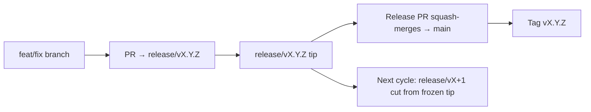

# Branching & Release Model (Malti)

🌐 **Languages:** 🇺🇸 [English](../../../../ops/BRANCHING_MODEL.md) · 🇪🇹 [am](../../../am/docs/ops/BRANCHING_MODEL.md) · 🇸🇦 [ar](../../../ar/docs/ops/BRANCHING_MODEL.md) · 🇦🇿 [az](../../../az/docs/ops/BRANCHING_MODEL.md) · 🇧🇬 [bg](../../../bg/docs/ops/BRANCHING_MODEL.md) · 🇧🇩 [bn](../../../bn/docs/ops/BRANCHING_MODEL.md) · 🇨🇿 [cs](../../../cs/docs/ops/BRANCHING_MODEL.md) · 🇩🇰 [da](../../../da/docs/ops/BRANCHING_MODEL.md) · 🇩🇪 [de](../../../de/docs/ops/BRANCHING_MODEL.md) · 🇬🇷 [el](../../../el/docs/ops/BRANCHING_MODEL.md) · 🇪🇸 [es](../../../es/docs/ops/BRANCHING_MODEL.md) · 🇪🇪 [et](../../../et/docs/ops/BRANCHING_MODEL.md) · 🇮🇷 [fa](../../../fa/docs/ops/BRANCHING_MODEL.md) · 🇫🇮 [fi](../../../fi/docs/ops/BRANCHING_MODEL.md) · 🇫🇷 [fr](../../../fr/docs/ops/BRANCHING_MODEL.md) · 🇮🇪 [ga](../../../ga/docs/ops/BRANCHING_MODEL.md) · 🇮🇳 [gu](../../../gu/docs/ops/BRANCHING_MODEL.md) · 🇳🇬 [ha](../../../ha/docs/ops/BRANCHING_MODEL.md) · 🇮🇱 [he](../../../he/docs/ops/BRANCHING_MODEL.md) · 🇮🇳 [hi](../../../hi/docs/ops/BRANCHING_MODEL.md) · 🇭🇷 [hr](../../../hr/docs/ops/BRANCHING_MODEL.md) · 🇭🇺 [hu](../../../hu/docs/ops/BRANCHING_MODEL.md) · 🇦🇲 [hy](../../../hy/docs/ops/BRANCHING_MODEL.md) · 🇮🇩 [id](../../../id/docs/ops/BRANCHING_MODEL.md) · 🇳🇬 [ig](../../../ig/docs/ops/BRANCHING_MODEL.md) · 🇮🇹 [it](../../../it/docs/ops/BRANCHING_MODEL.md) · 🇯🇵 [ja](../../../ja/docs/ops/BRANCHING_MODEL.md) · 🇬🇪 [ka](../../../ka/docs/ops/BRANCHING_MODEL.md) · 🇰🇭 [km](../../../km/docs/ops/BRANCHING_MODEL.md) · 🇮🇳 [kn](../../../kn/docs/ops/BRANCHING_MODEL.md) · 🇰🇷 [ko](../../../ko/docs/ops/BRANCHING_MODEL.md) · 🇱🇹 [lt](../../../lt/docs/ops/BRANCHING_MODEL.md) · 🇱🇻 [lv](../../../lv/docs/ops/BRANCHING_MODEL.md) · 🇮🇳 [ml](../../../ml/docs/ops/BRANCHING_MODEL.md) · 🇮🇳 [mr](../../../mr/docs/ops/BRANCHING_MODEL.md) · 🇲🇾 [ms](../../../ms/docs/ops/BRANCHING_MODEL.md) · 🇲🇲 [my](../../../my/docs/ops/BRANCHING_MODEL.md) · 🇳🇵 [ne](../../../ne/docs/ops/BRANCHING_MODEL.md) · 🇳🇱 [nl](../../../nl/docs/ops/BRANCHING_MODEL.md) · 🇳🇴 [no](../../../no/docs/ops/BRANCHING_MODEL.md) · 🇮🇳 [or](../../../or/docs/ops/BRANCHING_MODEL.md) · 🇮🇳 [pa](../../../pa/docs/ops/BRANCHING_MODEL.md) · 🇵🇭 [phi](../../../phi/docs/ops/BRANCHING_MODEL.md) · 🇵🇱 [pl](../../../pl/docs/ops/BRANCHING_MODEL.md) · 🇵🇹 [pt](../../../pt/docs/ops/BRANCHING_MODEL.md) · 🇧🇷 [pt-BR](../../../pt-BR/docs/ops/BRANCHING_MODEL.md) · 🇷🇴 [ro](../../../ro/docs/ops/BRANCHING_MODEL.md) · 🇷🇺 [ru](../../../ru/docs/ops/BRANCHING_MODEL.md) · 🇱🇰 [si](../../../si/docs/ops/BRANCHING_MODEL.md) · 🇸🇰 [sk](../../../sk/docs/ops/BRANCHING_MODEL.md) · 🇸🇮 [sl](../../../sl/docs/ops/BRANCHING_MODEL.md) · 🇷🇸 [sr](../../../sr/docs/ops/BRANCHING_MODEL.md) · 🇸🇪 [sv](../../../sv/docs/ops/BRANCHING_MODEL.md) · 🇰🇪 [sw](../../../sw/docs/ops/BRANCHING_MODEL.md) · 🇮🇳 [ta](../../../ta/docs/ops/BRANCHING_MODEL.md) · 🇮🇳 [te](../../../te/docs/ops/BRANCHING_MODEL.md) · 🇹🇭 [th](../../../th/docs/ops/BRANCHING_MODEL.md) · 🇹🇷 [tr](../../../tr/docs/ops/BRANCHING_MODEL.md) · 🇺🇦 [uk-UA](../../../uk-UA/docs/ops/BRANCHING_MODEL.md) · 🇵🇰 [ur](../../../ur/docs/ops/BRANCHING_MODEL.md) · 🇺🇿 [uz](../../../uz/docs/ops/BRANCHING_MODEL.md) · 🇻🇳 [vi](../../../vi/docs/ops/BRANCHING_MODEL.md) · 🇳🇬 [yo](../../../yo/docs/ops/BRANCHING_MODEL.md) · 🇨🇳 [zh-CN](../../../zh-CN/docs/ops/BRANCHING_MODEL.md) · 🇹🇼 [zh-TW](../../../zh-TW/docs/ops/BRANCHING_MODEL.md)

---

OmniRoute juża mudell ta’ rilaxx b’**ċikli paralleli**: fergħa ddedikata `release/vX.Y.Z`
għaċ-ċiklu attiv, `main` għal-linja ppubblikata, u tag immutabbli
`vX.Y.Z` meta dak iċ-ċiklu jiġi rilaxxat. Huwa mistenni li tara commits jidħlu fuq `release/*` _u_ fuq
`main` — din mhijiex konfużjoni.

Id-dettalji għall-mantenituri jinsabu f’`CLAUDE.md` (Regola Stretta #21) u
[RELEASE_CHECKLIST.md](./RELEASE_CHECKLIST.md). Din il-paġna hija s-sommarju pubbliku
għall-kontributuri.

## Ħarsa ġenerali

| Ref              | Rwol                                                                                                |
| ---------------- | --------------------------------------------------------------------------------------------------- |
| `release/vX.Y.Z` | **Ċiklu attiv** — żvilupp ta’ kuljum u merges ta’ PRs għal dik il-verżjoni                          |
| `main`           | **Linja ppubblikata** — tirċievi ċ-ċiklu permezz ta’ squash-merge meta joħroġ ir-rilaxx             |
| `vX.Y.Z` (tag)   | **Markatur tar-rilaxx** — indikatur immutabbli ta’ “dak li ġie rilaxxat”, maħluq fil-ħin tar-rilaxx |



## Lejn fejn għandu jimmira l-PR tiegħi?

**Immira lejn il-fergħa attiva `release/vX.Y.Z` — mhux lejn `main`.**

1. Sib l-ogħla fergħa miftuħa `release/v*` (eżempju fil-ħin tal-kitba:
   `release/v3.8.49`).
2. Oħloq fergħa minn dak it-tip (`git fetch` + checkout / rebase fuqu).
3. Iftaħ il-PR b’**base = dik il-`release/vX.Y.Z`**.

`main` mhijiex il-fergħa ta’ integrazzjoni ta’ kuljum. PRs miftuħa kontra `main`
normalment ikollhom bżonn jiġu mmirati mill-ġdid qabel il-merge.

## Iffriżar tar-rilaxx (ċikli paralleli)

Meta rilaxx ikun qed jiġi rrikonċiljat, tinfetaħ issue markatur bit-tikketta `release-freeze`.
Dan **ma jwaqqafx l-iżvilupp**:

- Il-`release/vX.Y.Z` iffriżata tkun taħt ir-responsabbiltà tal-kaptan tar-rilaxx għal dak ir-rilaxx.
- Il-`release/vX+1` taċ-ċiklu li jmiss tinħoloq mit-tip iffriżat sabiex il-kontributuri jkunu jistgħu jkomplu
  jdaħħlu xogħol.
- PRs miftuħa li għadhom jimmiraw lejn il-fergħa ffriżata għandhom jiġu **mmirati mill-ġdid** lejn il-fergħa
  attiva (l-ogħla) `release/v*`.

Iċċekkja jekk hemmx iffriżar miftuħ qabel tassumi li l-fergħa li trid tista’ tiġi merged:

```bash
gh issue list --repo diegosouzapw/OmniRoute --label release-freeze --state open
```

Il-mekkaniżmi tal-merge (it-tikketta `queue` tas-sid → Mergify) huma dokumentati f’
[MERGE_TRAIN.md](./MERGE_TRAIN.md).

## Għaliex kemm fergħa kif ukoll tag?

| Artifatt         | Tul ta’ ħajja          | Għan                                                              |
| ---------------- | ---------------------- | ----------------------------------------------------------------- |
| `release/vX.Y.Z` | Ċiklu li għadu għaddej | Tiġbor PRs rieżaminati, tibqa’ CI-green, u tkun il-bażi tal-PRs   |
| Tag `vX.Y.Z`     | Għal dejjem            | Timmarka l-bits eżatti li ġew rilaxxati fuq npm / GitHub Releases |

Il-fergħa hija l-ħanut tax-xogħol; it-tag hija l-pakkett issiġillat. Wara squash-merge lejn
`main`, iċ-ċiklu li jmiss ikompli fuq `release/vX+1` mingħajr ma jistenna li l-PR tar-rilaxx
preċedenti jitlesta.

## Dokumentazzjoni relatata

- [CONTRIBUTING.md](../../CONTRIBUTING.md) — konfigurazzjoni, testijiet, lista ta’ kontroll għall-PRs
- [RELEASE_CHECKLIST.md](./RELEASE_CHECKLIST.md) — validazzjoni qabel ir-rilaxx
- [MERGE_TRAIN.md](./MERGE_TRAIN.md) — kju tal-merge u ferrovija alternattiva
- [RELEASE_GREEN.md](./RELEASE_GREEN.md) — kif it-tip tar-rilaxx jinżamm aħdar
