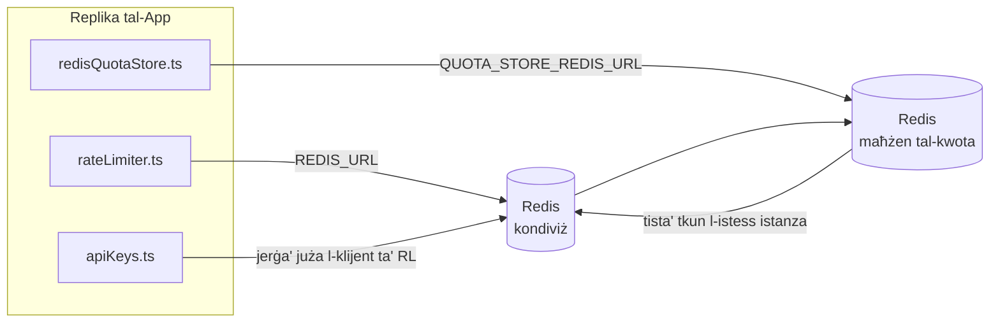

# Redis Production Configuration Guide (Malti)

🌐 **Languages:** 🇺🇸 [English](../../../../ops/REDIS_PRODUCTION_CONFIG.md) · 🇪🇹 [am](../../../am/docs/ops/REDIS_PRODUCTION_CONFIG.md) · 🇸🇦 [ar](../../../ar/docs/ops/REDIS_PRODUCTION_CONFIG.md) · 🇦🇿 [az](../../../az/docs/ops/REDIS_PRODUCTION_CONFIG.md) · 🇧🇬 [bg](../../../bg/docs/ops/REDIS_PRODUCTION_CONFIG.md) · 🇧🇩 [bn](../../../bn/docs/ops/REDIS_PRODUCTION_CONFIG.md) · 🇨🇿 [cs](../../../cs/docs/ops/REDIS_PRODUCTION_CONFIG.md) · 🇩🇰 [da](../../../da/docs/ops/REDIS_PRODUCTION_CONFIG.md) · 🇩🇪 [de](../../../de/docs/ops/REDIS_PRODUCTION_CONFIG.md) · 🇬🇷 [el](../../../el/docs/ops/REDIS_PRODUCTION_CONFIG.md) · 🇪🇸 [es](../../../es/docs/ops/REDIS_PRODUCTION_CONFIG.md) · 🇪🇪 [et](../../../et/docs/ops/REDIS_PRODUCTION_CONFIG.md) · 🇮🇷 [fa](../../../fa/docs/ops/REDIS_PRODUCTION_CONFIG.md) · 🇫🇮 [fi](../../../fi/docs/ops/REDIS_PRODUCTION_CONFIG.md) · 🇫🇷 [fr](../../../fr/docs/ops/REDIS_PRODUCTION_CONFIG.md) · 🇮🇪 [ga](../../../ga/docs/ops/REDIS_PRODUCTION_CONFIG.md) · 🇮🇳 [gu](../../../gu/docs/ops/REDIS_PRODUCTION_CONFIG.md) · 🇳🇬 [ha](../../../ha/docs/ops/REDIS_PRODUCTION_CONFIG.md) · 🇮🇱 [he](../../../he/docs/ops/REDIS_PRODUCTION_CONFIG.md) · 🇮🇳 [hi](../../../hi/docs/ops/REDIS_PRODUCTION_CONFIG.md) · 🇭🇷 [hr](../../../hr/docs/ops/REDIS_PRODUCTION_CONFIG.md) · 🇭🇺 [hu](../../../hu/docs/ops/REDIS_PRODUCTION_CONFIG.md) · 🇦🇲 [hy](../../../hy/docs/ops/REDIS_PRODUCTION_CONFIG.md) · 🇮🇩 [id](../../../id/docs/ops/REDIS_PRODUCTION_CONFIG.md) · 🇳🇬 [ig](../../../ig/docs/ops/REDIS_PRODUCTION_CONFIG.md) · 🇮🇹 [it](../../../it/docs/ops/REDIS_PRODUCTION_CONFIG.md) · 🇯🇵 [ja](../../../ja/docs/ops/REDIS_PRODUCTION_CONFIG.md) · 🇬🇪 [ka](../../../ka/docs/ops/REDIS_PRODUCTION_CONFIG.md) · 🇰🇭 [km](../../../km/docs/ops/REDIS_PRODUCTION_CONFIG.md) · 🇮🇳 [kn](../../../kn/docs/ops/REDIS_PRODUCTION_CONFIG.md) · 🇰🇷 [ko](../../../ko/docs/ops/REDIS_PRODUCTION_CONFIG.md) · 🇱🇹 [lt](../../../lt/docs/ops/REDIS_PRODUCTION_CONFIG.md) · 🇱🇻 [lv](../../../lv/docs/ops/REDIS_PRODUCTION_CONFIG.md) · 🇮🇳 [ml](../../../ml/docs/ops/REDIS_PRODUCTION_CONFIG.md) · 🇮🇳 [mr](../../../mr/docs/ops/REDIS_PRODUCTION_CONFIG.md) · 🇲🇾 [ms](../../../ms/docs/ops/REDIS_PRODUCTION_CONFIG.md) · 🇲🇲 [my](../../../my/docs/ops/REDIS_PRODUCTION_CONFIG.md) · 🇳🇵 [ne](../../../ne/docs/ops/REDIS_PRODUCTION_CONFIG.md) · 🇳🇱 [nl](../../../nl/docs/ops/REDIS_PRODUCTION_CONFIG.md) · 🇳🇴 [no](../../../no/docs/ops/REDIS_PRODUCTION_CONFIG.md) · 🇮🇳 [or](../../../or/docs/ops/REDIS_PRODUCTION_CONFIG.md) · 🇮🇳 [pa](../../../pa/docs/ops/REDIS_PRODUCTION_CONFIG.md) · 🇵🇭 [phi](../../../phi/docs/ops/REDIS_PRODUCTION_CONFIG.md) · 🇵🇱 [pl](../../../pl/docs/ops/REDIS_PRODUCTION_CONFIG.md) · 🇵🇹 [pt](../../../pt/docs/ops/REDIS_PRODUCTION_CONFIG.md) · 🇧🇷 [pt-BR](../../../pt-BR/docs/ops/REDIS_PRODUCTION_CONFIG.md) · 🇷🇴 [ro](../../../ro/docs/ops/REDIS_PRODUCTION_CONFIG.md) · 🇷🇺 [ru](../../../ru/docs/ops/REDIS_PRODUCTION_CONFIG.md) · 🇱🇰 [si](../../../si/docs/ops/REDIS_PRODUCTION_CONFIG.md) · 🇸🇰 [sk](../../../sk/docs/ops/REDIS_PRODUCTION_CONFIG.md) · 🇸🇮 [sl](../../../sl/docs/ops/REDIS_PRODUCTION_CONFIG.md) · 🇷🇸 [sr](../../../sr/docs/ops/REDIS_PRODUCTION_CONFIG.md) · 🇸🇪 [sv](../../../sv/docs/ops/REDIS_PRODUCTION_CONFIG.md) · 🇰🇪 [sw](../../../sw/docs/ops/REDIS_PRODUCTION_CONFIG.md) · 🇮🇳 [ta](../../../ta/docs/ops/REDIS_PRODUCTION_CONFIG.md) · 🇮🇳 [te](../../../te/docs/ops/REDIS_PRODUCTION_CONFIG.md) · 🇹🇭 [th](../../../th/docs/ops/REDIS_PRODUCTION_CONFIG.md) · 🇹🇷 [tr](../../../tr/docs/ops/REDIS_PRODUCTION_CONFIG.md) · 🇺🇦 [uk-UA](../../../uk-UA/docs/ops/REDIS_PRODUCTION_CONFIG.md) · 🇵🇰 [ur](../../../ur/docs/ops/REDIS_PRODUCTION_CONFIG.md) · 🇺🇿 [uz](../../../uz/docs/ops/REDIS_PRODUCTION_CONFIG.md) · 🇻🇳 [vi](../../../vi/docs/ops/REDIS_PRODUCTION_CONFIG.md) · 🇳🇬 [yo](../../../yo/docs/ops/REDIS_PRODUCTION_CONFIG.md) · 🇨🇳 [zh-CN](../../../zh-CN/docs/ops/REDIS_PRODUCTION_CONFIG.md) · 🇹🇼 [zh-TW](../../../zh-TW/docs/ops/REDIS_PRODUCTION_CONFIG.md)

---

## Ħarsa Ġenerali

Redis huwa **dipendenza fakultattiva u mhux essenzjali** f’OmniRoute — l-applikazzjoni tkompli taħdem b’mod degradat iżda kkontrollat (b’alternattivi fil-memorja)
meta Redis ma jkunx disponibbli. Fil-produzzjoni, l-irfinar ta’ Redis inaqqas il-latenza għal erba’
tagħbijiet tax-xogħol distinti:

| Tagħbija tax-xogħol        | Komponent ewlieni             | Fabbrika tal-klijent                                                         | Disinn taċ-ċavetta                                                |
| -------------------------- | ----------------------------- | ---------------------------------------------------------------------------- | ----------------------------------------------------------------- |
| Limitazzjoni tar-rata      | `rateLimiter.ts`              | `getRedisClient()` — istanza singleton `ioredis` inizjalizzata meta meħtieġa | `<prefix>rl:*` twieqi tal-limitu tar-rata atomiċi permezz ta’ Lua |
| Cache tal-awtentikazzjoni  | `apiKeys.ts`                  | Juża mill-ġdid il-klijent ta’ `rateLimiter`                                  | `<prefix>auth:api_key:<sha256>` b’TTL                             |
| Maħżen tal-kwoti           | `redisQuotaStore.ts`          | Singleton separat `getRedisClient(url)`                                      | `<prefix>quota:*` konfigurabbli għal kull istanza                 |
| Circuit breaker tat-tisħin | `redisCircuitBreakerStore.ts` | Klijent separat f’`circuitBreakerFactory.ts`                                 | `<prefix>warmup:cb:<connectionId>`                                |

L-erba’ tagħbijiet tax-xogħol kollha jaqsmu prefiss wieħed tal-ispazju tal-ismijiet sabiex OmniRoute jkun jista’ jikkoeżisti ma’ applikazzjonijiet oħra fuq
istanza waħda ta’ Redis (eż. `127.0.0.1:6379`). Ara [Spazju tal-Ismijiet taċ-Ċwievet](#key-namespacing).

---

## Konfigurazzjoni Attwali (Valuri Predefiniti fil-Kodiċi)

| Konfigurazzjoni                               | Valur                                                                       | Fejn                                                                                  |
| --------------------------------------------- | --------------------------------------------------------------------------- | ------------------------------------------------------------------------------------- |
| Varjabbli tal-ambjent `REDIS_URL`             | `redis://redis:6379` (compose), fakultattiva                                | `rateLimiter.ts:5`, `.env.example`                                                    |
| Varjabbli tal-ambjent `REDIS_KEY_PREFIX`      | `omniroute:` (valur predefinit)                                             | `rateLimiter.ts`, `redisQuotaStore.ts`, `redisCircuitBreakerStore.ts`, `.env.example` |
| Varjabbli tal-ambjent `QUOTA_STORE_REDIS_URL` | separata, tista’ tkun differenti minn `REDIS_URL`                           | `quota/storeFactory.ts`                                                               |
| `QUOTA_STORE_DRIVER`                          | `"sqlite"` (valur predefinit), `"redis"` fakultattiv                        | `quota/storeFactory.ts`                                                               |
| `maxRetriesPerRequest` ta’ ioredis            | `3`                                                                         | ħolqien tal-klijent f’`rateLimiter.ts`                                                |
| `enableReadyCheck`                            | mhux issettjat (valur predefinit ta’ ioredis: `true`)                       | —                                                                                     |
| `lazyConnect`                                 | mhux issettjat (valur predefinit ta’ ioredis: `false`)                      | —                                                                                     |
| `retryStrategy`                               | mhux issettjat (valur predefinit ta’ ioredis: bażi ta’ 200ms, esponenzjali) | —                                                                                     |
| TLS / password / indiċi tad-DB                | **mhux konfigurati**                                                        | —                                                                                     |
| Sentinel / Cluster                            | **mhux konfigurati** — node wieħed indipendenti biss                        | —                                                                                     |

---

## Spazju tal-Ismijiet taċ-Ċwievet

OmniRoute jaqsam istanza ta’ Redis ma’ kwalunkwe servizz ieħor li jaħdem fuq il-host. Mingħajr spazju tal-ismijiet,
ċwievet bħal `auth:api_key:<sha256>` jew `rl:*` jistgħu jikkonfliġġu ma’ ċwievet minn applikazzjonijiet oħra
li jużaw l-istess Redis (din l-istanza tħaddem Redis fuq `127.0.0.1:6379` flimkien ma’ servizzi oħra).

Issettja `REDIS_KEY_PREFIX` għal string mhux vojt sabiex iżżid prefiss ma’ **kull** ċavetta ta’ OmniRoute:

```bash
# .env — iċ-ċwievet kollha ta’ OmniRoute jsiru omniroute:rl:*, omniroute:auth:*, omniroute:quota:*, omniroute:warmup:cb:*
REDIS_KEY_PREFIX=omniroute:
```

- **Valur predefinit:** `omniroute:` (applikat meta `REDIS_KEY_PREFIX` ma jkunx issettjat jew ikun vojt).
- **Applikat għal:** il-limitatur tar-rata + il-cache tal-awtentikazzjoni (klijent `ioredis` kondiviż permezz ta’ `keyPrefix`) u l-
  maħżen tal-kwoti (`KEY_PREFIX = "${REDIS_KEY_PREFIX}quota"`) u ċ-circuit breaker tat-tisħin
  (`KEY_PREFIX = "${REDIS_KEY_PREFIX}warmup:cb:"`).
- **Il-bdil tal-prefiss** meta ċ-ċwievet ikunu diġà jeżistu f’Redis iħalli ċ-ċwievet il-qodma orfni (dawn jiskadu
  permezz ta’ TTL / LRU). Jista’ jinbidel mingħajr periklu; ebda migrazzjoni mhi meħtieġa. L-unika eċċezzjoni hija ċavetta taċ-
  circuit breaker tat-tisħin għal konnessjoni mmarkata bħala pprojbita: din tinħażen mingħajr TTL, għalhekk
  elenka l-fdalijiet b’`redis-cli --scan --pattern '<old-prefix>warmup:cb:*'` u ħassarhom.
- **`keyPrefix` ta’ ioredis** iżid il-prefiss awtomatikament waqt il-kitba **u** jneħħih waqt il-qari,
  għalhekk il-kodiċi tal-applikazzjoni qatt ma jara l-prefiss.

---

## Irfinar Rakkomandat għall-Produzzjoni

### 1. Grupp ta’ Konnessjonijiet / Għażliet tal-Klijent (il-kostruttur `Redis` ta’ ioredis)

Il-kodiċi attwali joħloq `new Redis(url)` wieħed mingħajr għażliet personalizzati. Għal skjeramenti
ta’ produzzjoni b’diversi repliki, għaddi fabbrika tal-klijent fil-kodiċi jew inkapsula `getRedisClient()`:

```typescript
const redis = new Redis(REDIS_URL, {
  maxRetriesPerRequest: null, // l-ebda limitu ta’ tentattivi mill-ġdid; ħalli lil retryStrategy jiddeċiedi
  enableReadyCheck: true, // ivverifika li s-server huwa lest qabel jaċċetta sejħiet
  lazyConnect: true, // tikkonnettjax waqt il-kostruzzjoni; stenna l-ewwel sejħa
  retryStrategy: (times) => {
    if (times > 10) return null; // ċedi wara 10 tentattivi mill-ġdid → erġa’ kkonnettja aktar tard
    return Math.min(times * 200, 5000); // 200ms, 400ms, …, limitu ta’ 5s
  },
  enableAutoPipelining: true, // għaqqad kmandi konkorrenti f’kitba TCP waħda
  keepAlive: 10000, // żomm il-konnessjoni TCP attiva kull 10s
});
```

**Kompromessi ewlenin:**

- `maxRetriesPerRequest: null` + `retryStrategy` — ippreferut għall-produzzjoni sabiex startjar mill-ġdid
  temporanju ta’ Redis ma jfallix immedjatament kull talba. Il-mekkaniżmu alternattiv fil-memorja fi
  `checkRateLimit()` jassorbi l-perkors tal-falliment.
- `lazyConnect: true` — jevita dipendenza waqt l-istartjar fuq li Redis ikun attiv qabel ma s-server
  jibda jaċċetta konnessjonijiet.
- `enableAutoPipelining: true` — inaqqas il-vjaġġi ’l hemm u lura għal kontrolli konkorrenti tal-limitu tar-rata;
  ta’ benefiċċju f’>50 RPS fuq konnessjoni waħda.

### 2. Konfigurazzjoni tas-Server Redis (`redis.conf`)

```
# Memorja
maxmemory 80%                        # ħalli spazju għall-cache tal-paġni tal-OS
maxmemory-policy allkeys-lru         # neħħi entrati qodma tal-cache tal-awtentikazzjoni taħt pressjoni

# Persistenza (mhux obbligatorja — OmniRoute huwa sikur kontra l-kraxxijiet mingħajrha)
save 300 1                           # ħu snapshot mill-inqas kull 5 min jekk inbidlet ≥1 ċavetta
appendonly no                        # AOF mhuwiex meħtieġ; id-data tista’ terġa’ tiġi ġġenerata
appendfsync no                       # l-ebda spiża addizzjonali ta’ fsync (RDB huwa biżżejjed)

# Netwerking
timeout 0                            # l-ebda skonnessjoni meta inattiv
tcp-keepalive 300                    # żomm il-konnessjoni attiva għal 5 min
tcp-backlog 511                      # kju ta’ konnessjonijiet għal tagħbija f’daqqa

# Prestazzjoni
hz 10                                # valur predefinit; 100 għal sistemi sensittivi għal-latenza
activedefrag yes                     # iddeframmenta awtomatikament meta l-frammentazzjoni tkun >10%
```

**Kompromess għal `maxmemory-policy allkeys-lru`:** L-entrati tal-cache tal-awtentikazzjoni jistgħu jitneħħew taħt
pressjoni fuq il-memorja. Dan huwa sikur — `setCachedApiKey` dejjem jimla mill-ġdid meta ma tinstabx entrata, u l-mekkaniżmu
alternattiv SQLite huwa awtorevoli. L-iskript Lua tal-limitatur tar-rata joħloq ċwievet żgħar li huma
mfassla biex ikunu ta’ ħajja qasira.

### 3. Settings ta’ Docker Compose

Il-compose tal-produzzjoni (`docker-compose.prod.yml`) juża `redis:8.6.2-alpine`. Żid:

```yaml
redis:
  image: redis:8.6.2-alpine
  command:
    [
      "redis-server",
      "--maxmemory",
      "512mb",
      "--maxmemory-policy",
      "allkeys-lru",
      "--activedefrag",
      "yes",
      "--save",
      "300 1",
    ]
  healthcheck:
    test: ["CMD", "redis-cli", "ping"]
    interval: 10s
    timeout: 3s
    retries: 3
    start_period: 5s
```

### 4. Kunsiderazzjonijiet għal Diversi Istanzi / Skalar

**Redis wieħed għar-repliki kollha** — l-iskript Lua tal-limitatur tar-rata jiddependi fuq spazju
wieħed u awtorevoli taċ-ċwievet. Diversi istanzi Redis wara r-repliki jitilfu l-atomiċità
u jirduppjaw il-baġit. Uża Redis wieħed (jew cluster Redis Sentinel b’failover) għar-repliki
kollha tal-applikazzjoni.

**Għadd ta’ konnessjonijiet:** Kull replika tal-applikazzjoni tiftaħ **2 konnessjonijiet TCP** ma’ Redis
(klijent tal-limitatur tar-rata + klijent tal-ħażna tal-kwota). B’10 repliki → 20 konnessjoni, sew
fil-limitu predefinit ta’ 10k konnessjoni ta’ istanza Redis.

### 5. Monitoraġġ

Esponi permezz tal-endpoint tal-kontroll tas-saħħa:

```typescript
// src/app/api/monitoring/health/route.ts diġà jsejjaħ funzjonijiet ta’ rateLimiter
// Żid kontrolli speċifiċi għal Redis:
//   1. Latenza ta’ PING permezz ta’ ioredis .ping()
//   2. Użu tal-memorja permezz ta’ INFO memory
//   3. Għadd ta’ konnessjonijiet permezz ta’ INFO clients
//   4. Rata ta’ suċċess għal maxmemory-policy (evicted_keys / keyspace_hits)
```

Metriċi ewlenin li għandhom jiġu mmonitorjati:

- **Ċwievet imneħħija / sek** — jekk ikun konsistentement differenti minn żero, żid `maxmemory`
- **Klijenti bblokkati** — valur differenti minn żero jissuġġerixxi skripts Lua bil-mod jew kontenzjoni għolja
- **Konnessjonijiet rifjutati** — intlaħaq il-limitu tal-konnessjonijiet; rari b’20 konnessjoni

---

## Dijagramma tal-Arkitettura



---

## Referenzi

| Fajl                               | Għan                                                                                    |
| ---------------------------------- | --------------------------------------------------------------------------------------- |
| `src/shared/utils/rateLimiter.ts`  | Klijent Redis primarju, skript Lua għal-limitazzjoni tar-rata, alternattiva fil-memorja |
| `src/lib/db/apiKeys.ts`            | Cache tal-awtentikazzjoni — alternattiva Redis→SQLite                                   |
| `src/lib/quota/redisQuotaStore.ts` | Klijent Redis separat għall-maħżen fakultattiv tal-kwota                                |
| `src/lib/quota/storeFactory.ts`    | Jaqleb bejn id-drivers tal-kwota `sqlite` u `redis`                                     |
| `docker-compose.prod.yml`          | Kontenitur Redis tal-produzzjoni (immaġni `redis:8.6.2-alpine`)                         |
| `.env.example`                     | Dokumentazzjoni tal-varjabbli ambjentali ta' Redis                                      |
| `src/app/api/local/redis/`         | Rotot tal-API għall-orkestrazzjoni tal-kontenitur tal-iżvilupp                          |
| `bin/cli/commands/redis.mjs`       | Kmandi CLI għall-orkestrazzjoni tal-kontenitur tal-iżvilupp                             |
