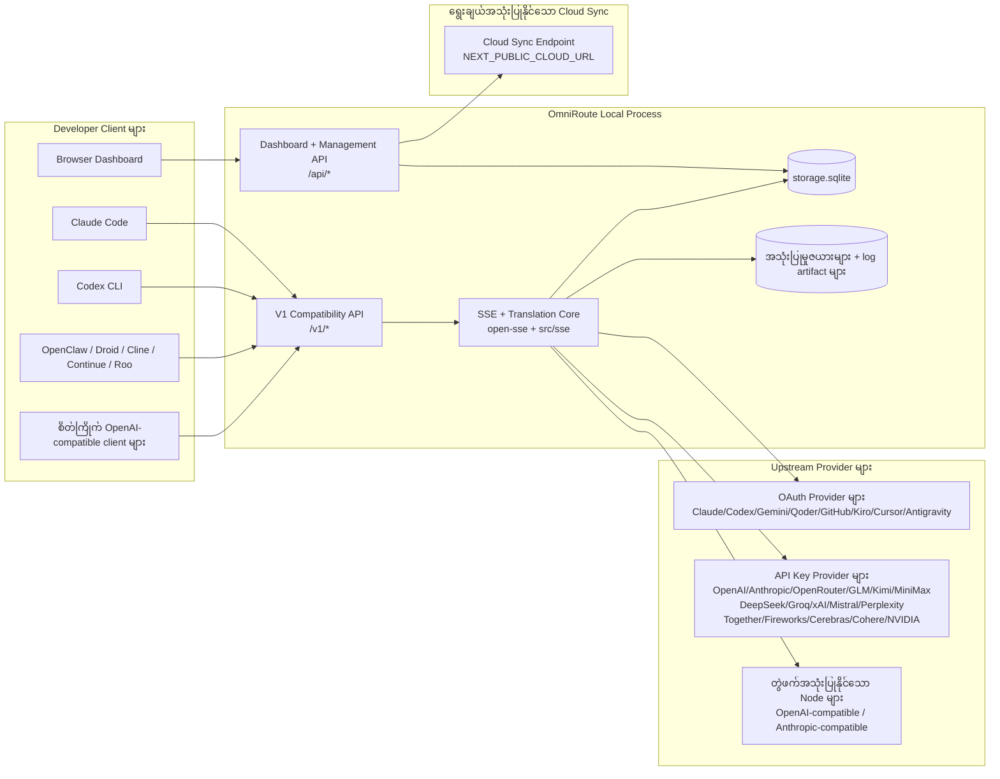
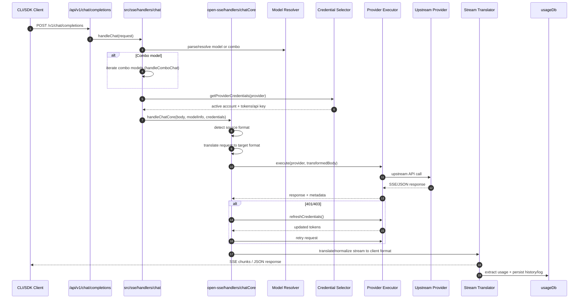
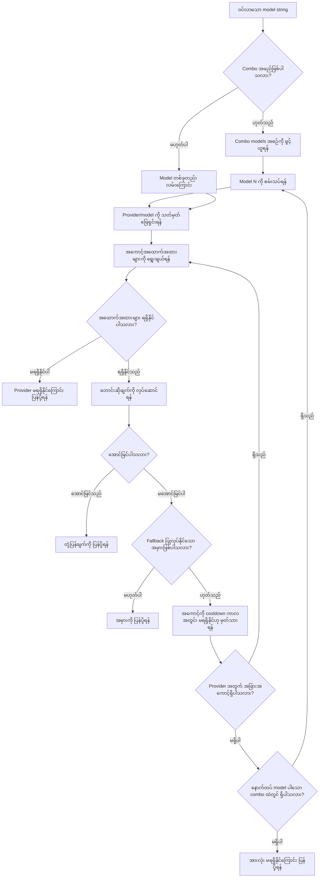
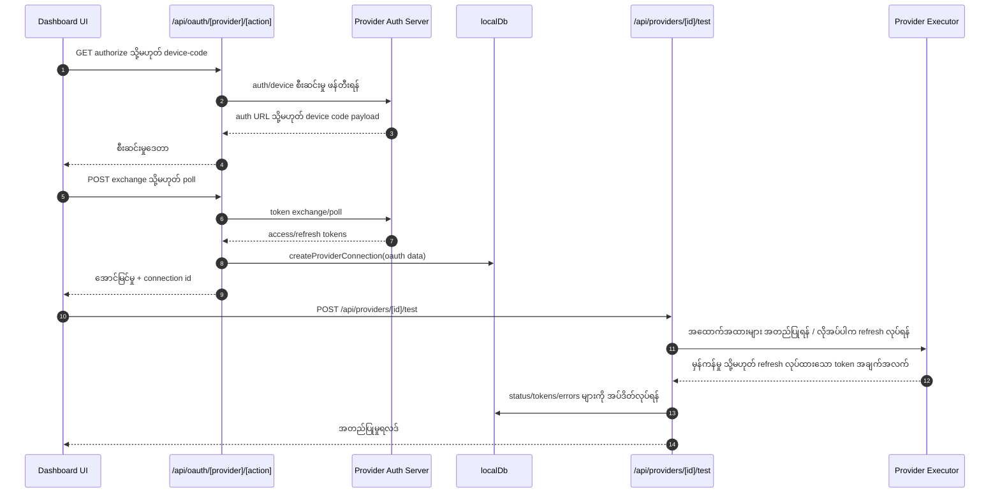
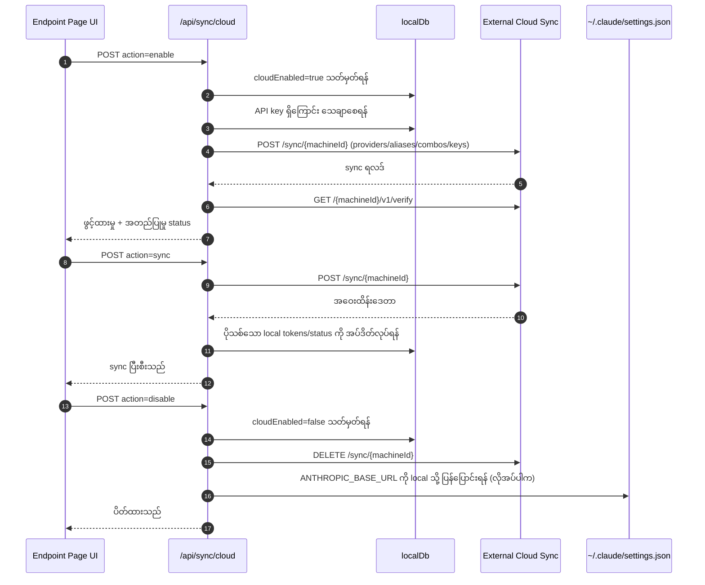
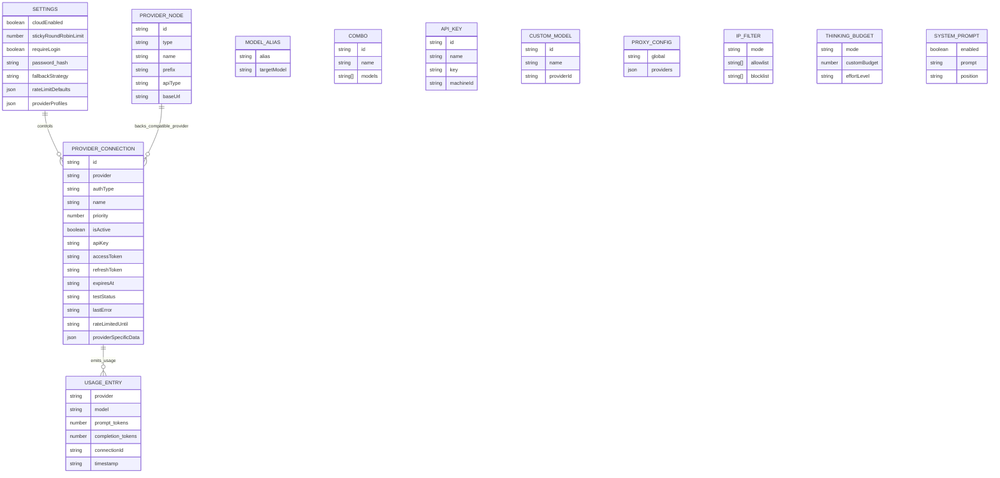
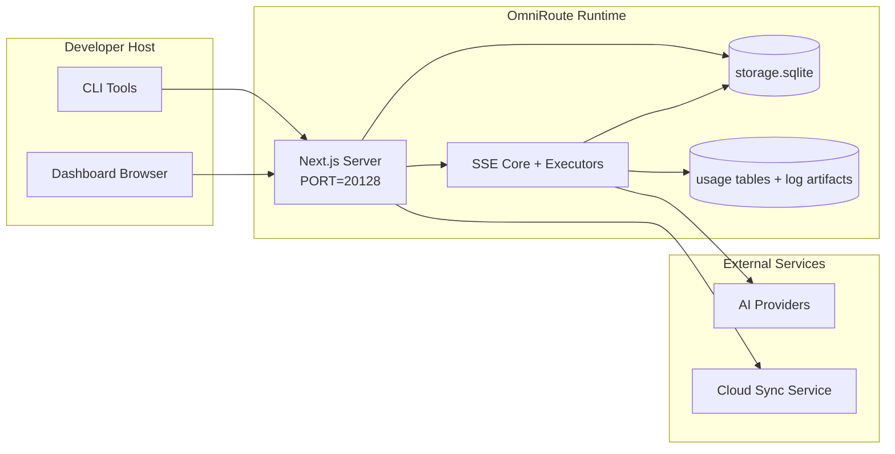

# OmniRoute Architecture (မြန်မာ)

🌐 **Languages:** 🇺🇸 [English](../../../../architecture/ARCHITECTURE.md) · 🇪🇹 [am](../../../am/docs/architecture/ARCHITECTURE.md) · 🇸🇦 [ar](../../../ar/docs/architecture/ARCHITECTURE.md) · 🇦🇿 [az](../../../az/docs/architecture/ARCHITECTURE.md) · 🇧🇬 [bg](../../../bg/docs/architecture/ARCHITECTURE.md) · 🇧🇩 [bn](../../../bn/docs/architecture/ARCHITECTURE.md) · 🇧🇦 [bs](../../../bs/docs/architecture/ARCHITECTURE.md) · 🇨🇿 [cs](../../../cs/docs/architecture/ARCHITECTURE.md) · 🇩🇰 [da](../../../da/docs/architecture/ARCHITECTURE.md) · 🇩🇪 [de](../../../de/docs/architecture/ARCHITECTURE.md) · 🇬🇷 [el](../../../el/docs/architecture/ARCHITECTURE.md) · 🇪🇸 [es](../../../es/docs/architecture/ARCHITECTURE.md) · 🇪🇪 [et](../../../et/docs/architecture/ARCHITECTURE.md) · 🇮🇷 [fa](../../../fa/docs/architecture/ARCHITECTURE.md) · 🇫🇮 [fi](../../../fi/docs/architecture/ARCHITECTURE.md) · 🇫🇷 [fr](../../../fr/docs/architecture/ARCHITECTURE.md) · 🇮🇪 [ga](../../../ga/docs/architecture/ARCHITECTURE.md) · 🇮🇳 [gu](../../../gu/docs/architecture/ARCHITECTURE.md) · 🇳🇬 [ha](../../../ha/docs/architecture/ARCHITECTURE.md) · 🇮🇱 [he](../../../he/docs/architecture/ARCHITECTURE.md) · 🇮🇳 [hi](../../../hi/docs/architecture/ARCHITECTURE.md) · 🇭🇷 [hr](../../../hr/docs/architecture/ARCHITECTURE.md) · 🇭🇺 [hu](../../../hu/docs/architecture/ARCHITECTURE.md) · 🇦🇲 [hy](../../../hy/docs/architecture/ARCHITECTURE.md) · 🇮🇩 [id](../../../id/docs/architecture/ARCHITECTURE.md) · 🇳🇬 [ig](../../../ig/docs/architecture/ARCHITECTURE.md) · 🇮🇹 [it](../../../it/docs/architecture/ARCHITECTURE.md) · 🇯🇵 [ja](../../../ja/docs/architecture/ARCHITECTURE.md) · 🇬🇪 [ka](../../../ka/docs/architecture/ARCHITECTURE.md) · 🇰🇭 [km](../../../km/docs/architecture/ARCHITECTURE.md) · 🇮🇳 [kn](../../../kn/docs/architecture/ARCHITECTURE.md) · 🇰🇷 [ko](../../../ko/docs/architecture/ARCHITECTURE.md) · 🇱🇹 [lt](../../../lt/docs/architecture/ARCHITECTURE.md) · 🇱🇻 [lv](../../../lv/docs/architecture/ARCHITECTURE.md) · 🇮🇳 [ml](../../../ml/docs/architecture/ARCHITECTURE.md) · 🇮🇳 [mr](../../../mr/docs/architecture/ARCHITECTURE.md) · 🇲🇾 [ms](../../../ms/docs/architecture/ARCHITECTURE.md) · 🇲🇹 [mt](../../../mt/docs/architecture/ARCHITECTURE.md) · 🇳🇵 [ne](../../../ne/docs/architecture/ARCHITECTURE.md) · 🇳🇱 [nl](../../../nl/docs/architecture/ARCHITECTURE.md) · 🇳🇴 [no](../../../no/docs/architecture/ARCHITECTURE.md) · 🇮🇳 [or](../../../or/docs/architecture/ARCHITECTURE.md) · 🇮🇳 [pa](../../../pa/docs/architecture/ARCHITECTURE.md) · 🇵🇭 [phi](../../../phi/docs/architecture/ARCHITECTURE.md) · 🇵🇱 [pl](../../../pl/docs/architecture/ARCHITECTURE.md) · 🇵🇹 [pt](../../../pt/docs/architecture/ARCHITECTURE.md) · 🇧🇷 [pt-BR](../../../pt-BR/docs/architecture/ARCHITECTURE.md) · 🇷🇴 [ro](../../../ro/docs/architecture/ARCHITECTURE.md) · 🇷🇺 [ru](../../../ru/docs/architecture/ARCHITECTURE.md) · 🇱🇰 [si](../../../si/docs/architecture/ARCHITECTURE.md) · 🇸🇰 [sk](../../../sk/docs/architecture/ARCHITECTURE.md) · 🇸🇮 [sl](../../../sl/docs/architecture/ARCHITECTURE.md) · 🇷🇸 [sr](../../../sr/docs/architecture/ARCHITECTURE.md) · 🇸🇪 [sv](../../../sv/docs/architecture/ARCHITECTURE.md) · 🇰🇪 [sw](../../../sw/docs/architecture/ARCHITECTURE.md) · 🇮🇳 [ta](../../../ta/docs/architecture/ARCHITECTURE.md) · 🇮🇳 [te](../../../te/docs/architecture/ARCHITECTURE.md) · 🇹🇭 [th](../../../th/docs/architecture/ARCHITECTURE.md) · 🇹🇷 [tr](../../../tr/docs/architecture/ARCHITECTURE.md) · 🇺🇦 [uk-UA](../../../uk-UA/docs/architecture/ARCHITECTURE.md) · 🇵🇰 [ur](../../../ur/docs/architecture/ARCHITECTURE.md) · 🇺🇿 [uz](../../../uz/docs/architecture/ARCHITECTURE.md) · 🇻🇳 [vi](../../../vi/docs/architecture/ARCHITECTURE.md) · 🇳🇬 [yo](../../../yo/docs/architecture/ARCHITECTURE.md) · 🇨🇳 [zh-CN](../../../zh-CN/docs/architecture/ARCHITECTURE.md) · 🇹🇼 [zh-TW](../../../zh-TW/docs/architecture/ARCHITECTURE.md)

---

🌐 **Languages:** 🇺🇸 [English](../../../../architecture/ARCHITECTURE.md) · 🇪🇹 [am](../../../am/docs/architecture/ARCHITECTURE.md) · 🇸🇦 [ar](../../../ar/docs/architecture/ARCHITECTURE.md) · 🇦🇿 [az](../../../az/docs/architecture/ARCHITECTURE.md) · 🇧🇬 [bg](../../../bg/docs/architecture/ARCHITECTURE.md) · 🇧🇩 [bn](../../../bn/docs/architecture/ARCHITECTURE.md) · 🇧🇦 [bs](../../../bs/docs/architecture/ARCHITECTURE.md) · 🇨🇿 [cs](../../../cs/docs/architecture/ARCHITECTURE.md) · 🇩🇰 [da](../../../da/docs/architecture/ARCHITECTURE.md) · 🇩🇪 [de](../../../de/docs/architecture/ARCHITECTURE.md) · 🇬🇷 [el](../../../el/docs/architecture/ARCHITECTURE.md) · 🇪🇸 [es](../../../es/docs/architecture/ARCHITECTURE.md) · 🇪🇪 [et](../../../et/docs/architecture/ARCHITECTURE.md) · 🇮🇷 [fa](../../../fa/docs/architecture/ARCHITECTURE.md) · 🇫🇮 [fi](../../../fi/docs/architecture/ARCHITECTURE.md) · 🇫🇷 [fr](../../../fr/docs/architecture/ARCHITECTURE.md) · 🇮🇪 [ga](../../../ga/docs/architecture/ARCHITECTURE.md) · 🇮🇳 [gu](../../../gu/docs/architecture/ARCHITECTURE.md) · 🇳🇬 [ha](../../../ha/docs/architecture/ARCHITECTURE.md) · 🇮🇱 [he](../../../he/docs/architecture/ARCHITECTURE.md) · 🇮🇳 [hi](../../../hi/docs/architecture/ARCHITECTURE.md) · 🇭🇷 [hr](../../../hr/docs/architecture/ARCHITECTURE.md) · 🇭🇺 [hu](../../../hu/docs/architecture/ARCHITECTURE.md) · 🇦🇲 [hy](../../../hy/docs/architecture/ARCHITECTURE.md) · 🇮🇩 [id](../../../id/docs/architecture/ARCHITECTURE.md) · 🇳🇬 [ig](../../../ig/docs/architecture/ARCHITECTURE.md) · 🇮🇹 [it](../../../it/docs/architecture/ARCHITECTURE.md) · 🇯🇵 [ja](../../../ja/docs/architecture/ARCHITECTURE.md) · 🇬🇪 [ka](../../../ka/docs/architecture/ARCHITECTURE.md) · 🇰🇭 [km](../../../km/docs/architecture/ARCHITECTURE.md) · 🇮🇳 [kn](../../../kn/docs/architecture/ARCHITECTURE.md) · 🇰🇷 [ko](../../../ko/docs/architecture/ARCHITECTURE.md) · 🇱🇹 [lt](../../../lt/docs/architecture/ARCHITECTURE.md) · 🇱🇻 [lv](../../../lv/docs/architecture/ARCHITECTURE.md) · 🇮🇳 [ml](../../../ml/docs/architecture/ARCHITECTURE.md) · 🇮🇳 [mr](../../../mr/docs/architecture/ARCHITECTURE.md) · 🇲🇾 [ms](../../../ms/docs/architecture/ARCHITECTURE.md) · 🇲🇹 [mt](../../../mt/docs/architecture/ARCHITECTURE.md) · 🇳🇵 [ne](../../../ne/docs/architecture/ARCHITECTURE.md) · 🇳🇱 [nl](../../../nl/docs/architecture/ARCHITECTURE.md) · 🇳🇴 [no](../../../no/docs/architecture/ARCHITECTURE.md) · 🇮🇳 [or](../../../or/docs/architecture/ARCHITECTURE.md) · 🇮🇳 [pa](../../../pa/docs/architecture/ARCHITECTURE.md) · 🇵🇭 [phi](../../../phi/docs/architecture/ARCHITECTURE.md) · 🇵🇱 [pl](../../../pl/docs/architecture/ARCHITECTURE.md) · 🇵🇹 [pt](../../../pt/docs/architecture/ARCHITECTURE.md) · 🇧🇷 [pt-BR](../../../pt-BR/docs/architecture/ARCHITECTURE.md) · 🇷🇴 [ro](../../../ro/docs/architecture/ARCHITECTURE.md) · 🇷🇺 [ru](../../../ru/docs/architecture/ARCHITECTURE.md) · 🇱🇰 [si](../../../si/docs/architecture/ARCHITECTURE.md) · 🇸🇰 [sk](../../../sk/docs/architecture/ARCHITECTURE.md) · 🇸🇮 [sl](../../../sl/docs/architecture/ARCHITECTURE.md) · 🇷🇸 [sr](../../../sr/docs/architecture/ARCHITECTURE.md) · 🇸🇪 [sv](../../../sv/docs/architecture/ARCHITECTURE.md) · 🇰🇪 [sw](../../../sw/docs/architecture/ARCHITECTURE.md) · 🇮🇳 [ta](../../../ta/docs/architecture/ARCHITECTURE.md) · 🇮🇳 [te](../../../te/docs/architecture/ARCHITECTURE.md) · 🇹🇭 [th](../../../th/docs/architecture/ARCHITECTURE.md) · 🇹🇷 [tr](../../../tr/docs/architecture/ARCHITECTURE.md) · 🇺🇦 [uk-UA](../../../uk-UA/docs/architecture/ARCHITECTURE.md) · 🇵🇰 [ur](../../../ur/docs/architecture/ARCHITECTURE.md) · 🇺🇿 [uz](../../../uz/docs/architecture/ARCHITECTURE.md) · 🇻🇳 [vi](../../../vi/docs/architecture/ARCHITECTURE.md) · 🇳🇬 [yo](../../../yo/docs/architecture/ARCHITECTURE.md) · 🇨🇳 [zh-CN](../../../zh-CN/docs/architecture/ARCHITECTURE.md) · 🇹🇼 [zh-TW](../../../zh-TW/docs/architecture/ARCHITECTURE.md)

_နောက်ဆုံးအပ်ဒိတ်လုပ်ထားသည့်ရက်: 2026-06-28_

## အနှစ်ချုပ်

OmniRoute သည် Next.js ပေါ်တွင် တည်ဆောက်ထားသော local AI routing gateway နှင့် dashboard ဖြစ်သည်။
၎င်းသည် OpenAI နှင့် တွဲဖက်အသုံးပြုနိုင်သော endpoint တစ်ခုတည်း (`/v1/*`) ကို ပံ့ပိုးပေးပြီး format ပြောင်းလဲခြင်း၊ fallback၊ token refresh နှင့် အသုံးပြုမှုခြေရာခံခြင်းတို့ဖြင့် upstream provider အများအပြားအကြား traffic ကို လမ်းကြောင်းခွဲပေးသည်။

အဓိကစွမ်းဆောင်ရည်များ-

- CLI/tools အတွက် OpenAI နှင့် တွဲဖက်အသုံးပြုနိုင်သော API မျက်နှာပြင် (provider 355 ခု၊ executor 108 ခု)
- Provider format များအကြား request/response ပြောင်းလဲခြင်း
- Model combo fallback (model အများအပြားပါဝင်သော အစဉ်လိုက်လုပ်ဆောင်မှု)
- `compositeTiers` အလိုက် runtime အစီအစဉ်ချထားမှုပါရှိသော ဖွဲ့စည်းပုံတကျ combo အဆင့်များ (`provider + model + connection`)
- Account အဆင့် fallback (provider တစ်ခုလျှင် account အများအပြား)
- အဓိက chat လမ်းကြောင်းတွင် quota ကြိုတင်စစ်ဆေးခြင်းနှင့် quota ကို ထည့်သွင်းစဉ်းစားသည့် P2C account ရွေးချယ်မှု
- OAuth + API-key provider connection စီမံခန့်ခွဲမှု (OAuth provider module 22 ခု)
- `/v1/embeddings` မှတစ်ဆင့် embedding ထုတ်လုပ်ခြင်း (provider 18 ခု)
- `/v1/images/generations` မှတစ်ဆင့် ပုံထုတ်လုပ်ခြင်း (provider 10+ ခု၊ model 20+ ခု)
- `/v1/audio/transcriptions` မှတစ်ဆင့် အသံကို စာသားအဖြစ် ပြောင်းလဲခြင်း (provider 18 ခု)
- `/v1/audio/speech` မှတစ်ဆင့် စာသားမှအသံ ထုတ်လုပ်ခြင်း (အသင့်ပါ provider 24 ခု)
- `/v1/videos/generations` မှတစ်ဆင့် ဗီဒီယိုထုတ်လုပ်ခြင်း (ComfyUI + SD WebUI)
- `/v1/music/generations` မှတစ်ဆင့် တေးဂီတထုတ်လုပ်ခြင်း (ComfyUI)
- `/v1/search` မှတစ်ဆင့် ဝဘ်ရှာဖွေခြင်း (provider 20 ခု)
- `/v1/moderations` မှတစ်ဆင့် အကြောင်းအရာစိစစ်ထိန်းချုပ်ခြင်း
- `/v1/rerank` မှတစ်ဆင့် အဆင့်ပြန်စီခြင်း
- Reasoning model များအတွက် think tag ခွဲခြမ်းစိတ်ဖြာခြင်း (`<think>...</think>`)
- တင်းကျပ်သော OpenAI SDK တွဲဖက်အသုံးပြုနိုင်မှုအတွက် response သန့်စင်ခြင်း
- Provider များအကြား တွဲဖက်အသုံးပြုနိုင်မှုအတွက် role ပုံမှန်သတ်မှတ်ခြင်း (developer→system၊ system→user)
- ဖွဲ့စည်းပုံတကျ output ပြောင်းလဲခြင်း (json_schema → Gemini responseSchema)
- Provider များ၊ key များ၊ alias များ၊ combo များ၊ setting များနှင့် pricing အတွက် local persistence (DB module 122 ခု)
- အသုံးပြုမှု/ကုန်ကျစရိတ် ခြေရာခံခြင်းနှင့် request မှတ်တမ်းတင်ခြင်း
- စက်အများအပြား/state တစ်ပြိုင်တည်းဖြစ်စေရန် ရွေးချယ်အသုံးပြုနိုင်သော cloud sync
- API ဝင်ရောက်အသုံးပြုမှု ထိန်းချုပ်ရန် IP allowlist/blocklist
- Thinking budget စီမံခန့်ခွဲမှု (passthrough/auto/custom/adaptive)
- Global system prompt ထည့်သွင်းခြင်း
- Session ခြေရာခံခြင်းနှင့် fingerprinting
- Provider အလိုက် profile များပါရှိသော account တစ်ခုချင်းစီအတွက် အဆင့်မြှင့် rate limiting
- Provider ခံနိုင်ရည်ရှိမှုအတွက် circuit breaker pattern
- Mutex locking ဖြင့် anti-thundering herd ကာကွယ်မှု
- Signature အခြေခံ request ထပ်တူဖယ်ရှားရေး cache
- Domain layer- ကုန်ကျစရိတ်စည်းမျဉ်းများ၊ fallback မူဝါဒ၊ lockout မူဝါဒ
- Context Relay- account ပြောင်းလဲအသုံးပြုရာတွင် ဆက်လက်ချိတ်ဆက်နိုင်ရန် session လွှဲပြောင်းအနှစ်ချုပ်များ
- Domain state persistence (fallback များ၊ budget များ၊ lockout များနှင့် circuit breaker များအတွက် SQLite write-through cache)
- ဗဟိုချုပ်ကိုင်ထားသော request အကဲဖြတ်မှုအတွက် policy engine (lockout → budget → fallback)
- p50/p95/p99 latency စုစည်းတွက်ချက်မှုပါရှိသော request telemetry
- `combo_execution_key` / `combo_step_id` မှတစ်ဆင့် combo target telemetry နှင့် ယခင် combo target ကျန်းမာရေးအခြေအနေ
- အစမှအဆုံး ခြေရာခံနိုင်ရန် Correlation ID (X-Request-Id)
- API key တစ်ခုချင်းစီအလိုက် မပါဝင်ရန် ရွေးချယ်နိုင်သော compliance audit မှတ်တမ်းတင်ခြင်း
- LLM အရည်အသွေးအာမခံမှုအတွက် eval framework
- Provider circuit breaker အခြေအနေကို အချိန်နှင့်တစ်ပြေးညီပြသသည့် health dashboard
- Transport 3 မျိုး (stdio/SSE/Streamable HTTP) ပါရှိသော MCP Server (tool 110 ခု)
- Skill များနှင့် task lifecycle ပါရှိသော A2A Server (JSON-RPC 2.0 + SSE)
- Memory system (ထုတ်ယူခြင်း၊ ထည့်သွင်းခြင်း၊ ပြန်လည်ရယူခြင်း၊ အနှစ်ချုပ်ခြင်း)
- Skills system (registry၊ executor၊ sandbox၊ အသင့်ပါ skill များ)
- Certificate စီမံခန့်ခွဲမှုနှင့် DNS ကိုင်တွယ်မှုပါရှိသော MITM proxy
- Prompt injection ကာကွယ်ရေး middleware
- Caveman၊ RTK၊ stacked pipeline များ၊ compression combo များ၊ language pack များနှင့် analytics ပါရှိသော prompt compression pipeline
- ACP (Agent Communication Protocol) registry
- Modular OAuth provider များ (`src/lib/oauth/providers/` အောက်ရှိ သီးခြား module 22 ခု)
- Uninstall/full-uninstall script များ
- OAuth environment ပြုပြင်ရေး action
- OpenAI နှင့် တွဲဖက်အသုံးပြုနိုင်သော WS client များအတွက် WebSocket bridge (`/v1/ws`)
- Sync token စီမံခန့်ခွဲမှု (ထုတ်ပေးခြင်း/ရုပ်သိမ်းခြင်း၊ ETag-versioned config bundle download)
- GLM Thinking (`glmt`) ကို ပထမတန်းစား provider preset အဖြစ် ပံ့ပိုးမှု
- Hybrid token ရေတွက်ခြင်း (provider ဘက်ရှိ `/messages/count_tokens` နှင့် estimation fallback)
- Model alias အလိုအလျောက် seed လုပ်ခြင်း (စတင်ချိန်တွင် cross-proxy dialect normalization 30+ ခု)
- SSRF guard၊ private URL ပိတ်ဆို့မှုနှင့် ပြင်ဆင်သတ်မှတ်နိုင်သော retry ပါရှိသည့် လုံခြုံသော outbound fetch
- ပြင်ဆင်သတ်မှတ်နိုင်သော `requestRetry` နှင့် `maxRetryIntervalSec` ပါရှိသည့် cooldown ကို ထည့်သွင်းစဉ်းစားသော chat retry များ
- စတင်ချိန်တွင် Zod ဖြင့် runtime environment validation
- Pagination၊ provider CRUD event များနှင့် SSRF ဖြင့် ပိတ်ဆို့ခံရသော validation မှတ်တမ်းတင်မှုပါရှိသည့် compliance audit v2

အဓိက runtime model-

- `src/app/api/*` အောက်ရှိ Next.js app route များက dashboard API များနှင့် compatibility API များကို အကောင်အထည်ဖော်ပေးသည်
- `src/sse/*` + `open-sse/*` ရှိ မျှဝေသုံးစွဲသော SSE/routing core က provider execution၊ translation၊ streaming၊ fallback နှင့် usage တို့ကို ကိုင်တွယ်သည်

## ကိုးကားပုံကြမ်းများ

v3.8.0 ပလက်ဖောင်းအတွက် စံသတ်မှတ်ထားပြီး ဗားရှင်းထိန်းချုပ်ထားသော Mermaid ရင်းမြစ်များကို
[`docs/diagrams/`](../diagrams/README.md) တွင် ထားရှိပါသည်။ အကြမ်းဖျင်းသိရှိနိုင်ရန် ပုံကြမ်းနှစ်ခုကို အောက်တွင် ပြန်လည်ဖော်ပြထားပြီး၊
ကျန်ပုံကြမ်းများကို ၎င်းတို့နှင့် သက်ဆိုင်ရာ နယ်ပယ်အလိုက် လမ်းညွှန်များမှ လင့်ခ်ချိတ်ထားပါသည်။


> ရင်းမြစ်: [diagrams/request-pipeline.mmd](../diagrams/request-pipeline.mmd)


> ရင်းမြစ်: [diagrams/resilience-3layers.mmd](../diagrams/resilience-3layers.mmd) — ထို့အပြင်
> [RESILIENCE_GUIDE.md](./RESILIENCE_GUIDE.md) နှင့် `CLAUDE.md` ရှိ ခံနိုင်ရည်ဆိုင်ရာ ကိုးကားချက်မှလည်း လင့်ခ်ချိတ်ထားပါသည်။

## အကျုံးဝင်မှုနှင့် နယ်နိမိတ်များ

### အကျုံးဝင်သည့်အရာများ

- စက်တွင်း gateway runtime
- Dashboard စီမံခန့်ခွဲမှု API များ
- Provider စစ်မှန်ကြောင်းအတည်ပြုခြင်းနှင့် token ပြန်လည်သက်တမ်းတိုးခြင်း
- တောင်းဆိုမှု ဘာသာပြန်ပြောင်းလဲခြင်းနှင့် SSE streaming
- စက်တွင်း state + အသုံးပြုမှု အမြဲတမ်းသိမ်းဆည်းခြင်း
- ရွေးချယ်အသုံးပြုနိုင်သော cloud sync စီမံပေါင်းစပ်မှု

### အကျုံးမဝင်သည့်အရာများ

- `NEXT_PUBLIC_CLOUD_URL` နောက်ကွယ်ရှိ cloud ဝန်ဆောင်မှု အကောင်အထည်ဖော်မှု
- စက်တွင်း process ပြင်ပရှိ Provider SLA/control plane
- ပြင်ပ CLI binary များကိုယ်တိုင် (Claude CLI၊ Codex CLI စသည်)

## Dashboard မျက်နှာပြင် (လက်ရှိ)

`src/app/(dashboard)/dashboard/` အောက်ရှိ အဓိကစာမျက်နှာများ:

- `/dashboard` — အမြန်စတင်ခြင်း + provider အနှစ်ချုပ်
- `/dashboard/endpoint` — endpoint proxy + MCP + A2A + API endpoint တက်ဘ်များ
- `/dashboard/providers` — provider ချိတ်ဆက်မှုများနှင့် အထောက်အထားများ
- `/dashboard/combos` — combo နည်းဗျူဟာများ၊ template များ၊ အဆင့်အလိုက် builder၊ model routing စည်းမျဉ်းများနှင့် ကိုယ်တိုင်သတ်မှတ်၍ အမြဲတမ်းသိမ်းဆည်းထားသော အစီအစဉ်
- `/dashboard/auto-combo` — Auto Combo Engine: အမှတ်ပေး အလေးချိန်များ၊ mode pack များ၊ virtual factory ကြိုတင်သတ်မှတ်ချက်များနှင့် telemetry
- `/dashboard/costs` — ကုန်ကျစရိတ် စုစည်းခြင်းနှင့် ဈေးနှုန်းမြင်သာမှု
- `/dashboard/analytics` — အသုံးပြုမှု ခွဲခြမ်းစိတ်ဖြာချက်များ၊ အကဲဖြတ်မှုများနှင့် combo ပစ်မှတ် အခြေအနေ
- `/dashboard/limits` — quota/rate ထိန်းချုပ်မှုများ
- `/dashboard/cli-tools` — CLI စတင်အသုံးပြုမှု၊ runtime ရှာဖွေသတ်မှတ်မှုနှင့် config ထုတ်လုပ်မှု
- `/dashboard/agents` — ရှာဖွေတွေ့ရှိထားသော ACP agent များ + စိတ်ကြိုက် agent မှတ်ပုံတင်ခြင်း
- `/dashboard/cloud-agents` — cloud ပေါ်တွင် လက်ခံထားသော agent လုပ်ငန်းများ (Codex Cloud၊ Devin၊ Jules) နှင့် လုပ်ငန်းသက်တမ်းစက်ဝန်း
- `/dashboard/skills` — A2A skill registry၊ sandbox လုပ်ဆောင်မှုနှင့် ထည့်သွင်းပေးထားသော skill catalog
- `/dashboard/memory` — အမြဲတမ်းသိမ်းဆည်းထားသော စကားဝိုင်းမှတ်ဉာဏ်ကို စစ်ဆေးခြင်းနှင့် ပြန်လည်ရယူခြင်း
- `/dashboard/webhooks` — အပြင်သို့ပို့သည့် webhook စာရင်းသွင်းမှုများ၊ secret လှည့်လည်ပြောင်းလဲခြင်းနှင့် ပြန်လည်ကြိုးစားမှု ကိန်းဂဏန်းများ
- `/dashboard/batch` — batch job တင်သွင်းခြင်းနှင့် တိုးတက်မှု
- `/dashboard/cache` — read-through နှင့် reasoning cache ကိန်းဂဏန်းများ၊ ဖယ်ရှားမှု ထိန်းချုပ်ချက်များ
- `/dashboard/playground` — စီစဉ်သတ်မှတ်ထားသော မည်သည့် combo/model နှင့်မဆို အပြန်အလှန်အသုံးပြုနိုင်သည့် chat playground
- `/dashboard/changelog` — အက်ပ်အတွင်း changelog ကြည့်ရှုကိရိယာ (`CHANGELOG.md` ကို ပုံဖော်ပြသသည်)
- `/dashboard/system` — runtime စစ်ဆေးမှုများ၊ ဗားရှင်းအချက်အလက်နှင့် ပတ်ဝန်းကျင် အတည်ပြုမျက်နှာပြင်
- `/dashboard/onboarding` — အသစ်ထည့်သွင်းမှုများအတွက် ပထမဆုံးအသုံးပြုချိန် စီစဉ်သတ်မှတ်မှု wizard
- `/dashboard/media` — ရုပ်ပုံ/ဗီဒီယို/တေးဂီတ playground
- `/dashboard/search-tools` — ရှာဖွေရေး provider စမ်းသပ်မှုနှင့် မှတ်တမ်း
- `/dashboard/health` — uptime၊ circuit breaker များ၊ rate limit များနှင့် quota စောင့်ကြည့်ထားသော session များ
- `/dashboard/logs` — တောင်းဆိုမှု/proxy/audit/console မှတ်တမ်းများ
- `/dashboard/settings` — စနစ်ဆက်တင် တက်ဘ်များ (အထွေထွေ၊ routing၊ combo မူလသတ်မှတ်ချက်များ စသည်)
- `/dashboard/context/caveman` — Caveman ချုံ့ခြင်းစည်းမျဉ်းများ၊ ဘာသာစကား pack များ၊ အစမ်းကြည့်ရှုမှုနှင့် output mode
- `/dashboard/context/rtk` — RTK command-output filter များ၊ အစမ်းကြည့်ရှုမှုနှင့် runtime ဘေးကင်းရေး ဆက်တင်များ
- `/dashboard/context/combos` — routing combo များသို့ သတ်မှတ်ပေးထားသော အမည်ပါ compression pipeline များ
- `/dashboard/translator` — translator စစ်ဆေးမှုနှင့် တောင်းဆိုမှုပုံစံ ပြောင်းလဲမှု အစမ်းကြည့်ရှုချက်
- `/dashboard/audit` — စာမျက်နှာခွဲခြင်းနှင့် ဖွဲ့စည်းပုံကျ metadata ပါဝင်သည့် လိုက်နာမှု audit log browser
- `/dashboard/usage` — `usage_history` နှင့် ချိတ်ဆက်ထားသော တောင်းဆိုမှုတစ်ခုချင်းစီအလိုက် အသုံးပြုမှု browser
- `/dashboard/compression` — compression ခွဲခြမ်းစိတ်ဖြာချက်များ၊ ကိန်းဂဏန်းများနှင့် pipeline သတ်မှတ်ပေးမှု
- `/dashboard/api-manager` — API key သက်တမ်းစက်ဝန်းနှင့် model ခွင့်ပြုချက်များ

## အဆင့်မြင့် စနစ်ဆိုင်ရာ အကြောင်းအရာ



## အဓိက Runtime Component များ

## 1) API နှင့် Routing Layer (Next.js App Route များ)

အဓိက directory များ:

- Compatibility API များအတွက် `src/app/api/v1/*` နှင့် `src/app/api/v1beta/*`
- စီမံခန့်ခွဲမှု/ပြင်ဆင်သတ်မှတ်မှု API များအတွက် `src/app/api/*`
- `next.config.mjs` ရှိ Next rewrite များသည် `/v1/*` ကို `/api/v1/*` သို့ map လုပ်ပေးသည်

အရေးကြီးသော compatibility route များ:

- `src/app/api/v1/chat/completions/route.ts`
- `src/app/api/v1/messages/route.ts`
- `src/app/api/v1/responses/route.ts`
- `src/app/api/v1/models/route.ts` — `custom: true` ပါဝင်သော စိတ်ကြိုက် model များပါဝင်သည်
- `src/app/api/v1/embeddings/route.ts` — embedding ထုတ်လုပ်ခြင်း (provider 6 ခု)
- `src/app/api/v1/images/generations/route.ts` — ပုံထုတ်လုပ်ခြင်း (Antigravity/Nebius အပါအဝင် provider 4 ခုနှင့်အထက်)
- `src/app/api/v1/messages/count_tokens/route.ts`
- `src/app/api/v1/providers/[provider]/chat/completions/route.ts` — provider တစ်ခုချင်းစီအတွက် သီးခြား chat
- `src/app/api/v1/providers/[provider]/embeddings/route.ts` — provider တစ်ခုချင်းစီအတွက် သီးခြား embedding များ
- `src/app/api/v1/providers/[provider]/images/generations/route.ts` — provider တစ်ခုချင်းစီအတွက် သီးခြားပုံများ
- `src/app/api/v1beta/models/route.ts`
- `src/app/api/v1beta/models/[...path]/route.ts`

စီမံခန့်ခွဲမှု domain များ:

- အထောက်အထားစစ်ဆေးခြင်း/ဆက်တင်များ: `src/app/api/auth/*`, `src/app/api/settings/*`
- Provider များ/ချိတ်ဆက်မှုများ: `src/app/api/providers*`
- Provider node များ: `src/app/api/provider-nodes*`
- စိတ်ကြိုက် model များ: `src/app/api/provider-models` (GET/POST/DELETE)
- Model catalog: `src/app/api/models/route.ts` (GET)
- Proxy ပြင်ဆင်သတ်မှတ်မှု: `src/app/api/settings/proxy` (GET/PUT/DELETE) + `src/app/api/settings/proxy/test` (POST)
- OAuth: `src/app/api/oauth/*`
- Key များ/alias များ/combo များ/ဈေးနှုန်းသတ်မှတ်ခြင်း: `src/app/api/keys*`, `src/app/api/models/alias`, `src/app/api/combos*`, `src/app/api/pricing`
- အသုံးပြုမှု: `src/app/api/usage/*`
- Sync/cloud: `src/app/api/sync/*`, `src/app/api/cloud/*`
- CLI ကိရိယာဆိုင်ရာ အကူအညီပေးစနစ်များ: `src/app/api/cli-tools/*`
- IP filter: `src/app/api/settings/ip-filter` (GET/PUT)
- Thinking budget: `src/app/api/settings/thinking-budget` (GET/PUT)
- System prompt: `src/app/api/settings/system-prompt` (GET/PUT)
- Compression: `src/app/api/settings/compression`, `src/app/api/compression/*` နှင့်
  `src/app/api/context/*`
- Session များ: `src/app/api/sessions` (GET)
- Rate limit များ: `src/app/api/rate-limits` (GET)
- ခံနိုင်ရည်ရှိမှု: `src/app/api/resilience` (GET/PATCH) — request queue၊ connection cooldown၊ provider breaker နှင့် wait-for-cooldown ပြင်ဆင်သတ်မှတ်မှု
- ခံနိုင်ရည်ရှိမှု ပြန်လည်သတ်မှတ်ခြင်း: `src/app/api/resilience/reset` (POST) — provider breaker များကို ပြန်လည်သတ်မှတ်ရန်
- Cache စာရင်းအင်းများ: `src/app/api/cache/stats` (GET/DELETE)
- Telemetry: `src/app/api/telemetry/summary` (GET)
- ဘတ်ဂျက်: `src/app/api/usage/budget` (GET/POST)
- Fallback chain များ: `src/app/api/fallback/chains` (GET/POST/DELETE)
- စည်းမျဉ်းလိုက်နာမှု စစ်ဆေးမှတ်တမ်း: `src/app/api/compliance/audit-log` (GET၊ pagination + ဖွဲ့စည်းပုံသတ်မှတ်ထားသော metadata ပါဝင်သည်)
- အကဲဖြတ်မှုများ: `src/app/api/evals` (GET/POST), `src/app/api/evals/[suiteId]` (GET)
- မူဝါဒများ: `src/app/api/policies` (GET/POST)
- Sync token များ: `src/app/api/sync/tokens` (GET/POST), `src/app/api/sync/tokens/[id]` (GET/DELETE)
- Config bundle: `src/app/api/sync/bundle` (GET၊ ဆက်တင်များ/provider များ/combo များ/key များ၏ ETag-versioned snapshot)
- WebSocket: `src/app/api/v1/ws/route.ts` — OpenAI-compatible WS client များအတွက် Upgrade handler

## 2) SSE + ဘာသာပြန်ဆိုမှု Core

အဓိက flow module များ:

- ဝင်ပေါက်: `src/sse/handlers/chat.ts`
- အဓိက orchestration: `open-sse/handlers/chatCore.ts`
- Provider လုပ်ဆောင်မှု adapter များ: `open-sse/executors/*`
- Format ရှာဖွေသတ်မှတ်ခြင်း/provider configuration: `open-sse/services/provider.ts`
- Model parse/resolve: `src/sse/services/model.ts`, `open-sse/services/model.ts`
- Account fallback logic: `open-sse/services/accountFallback.ts`
- ဘာသာပြန်ဆိုမှု registry: `open-sse/translator/index.ts`
- Stream ပြောင်းလဲမှုများ: `open-sse/utils/stream.ts`, `open-sse/utils/streamHandler.ts`
- Usage ထုတ်ယူခြင်း/စံညှိခြင်း: `open-sse/utils/usageTracking.ts`
- Think tag parser: `open-sse/utils/thinkTagParser.ts`
- Embedding handler: `open-sse/handlers/embeddings.ts`
- Embedding provider registry: `open-sse/config/embeddingRegistry.ts`
- ပုံထုတ်လုပ်မှု handler: `open-sse/handlers/imageGeneration.ts`
- ပုံ provider registry: `open-sse/config/imageRegistry.ts`
- Response သန့်စင်ခြင်း: `open-sse/handlers/responseSanitizer.ts`
- Role စံညှိခြင်း: `open-sse/services/roleNormalizer.ts`

Service များ (လုပ်ငန်း logic):

- Account ရွေးချယ်ခြင်း/အမှတ်ပေးခြင်း: `open-sse/services/accountSelector.ts`
- Context lifecycle စီမံခန့်ခွဲမှု: `open-sse/services/contextManager.ts`
- IP filter ပြဋ္ဌာန်းအသုံးချမှု: `open-sse/services/ipFilter.ts`
- Session ခြေရာခံခြင်း: `open-sse/services/sessionManager.ts`
- Request ထပ်နေမှုဖယ်ရှားခြင်း: `open-sse/services/signatureCache.ts`
- System prompt ထည့်သွင်းခြင်း: `open-sse/services/systemPrompt.ts`
- Thinking budget စီမံခန့်ခွဲမှု: `open-sse/services/thinkingBudget.ts`
- Wildcard model routing: `open-sse/services/wildcardRouter.ts`
- Rate limit စီမံခန့်ခွဲမှု: `open-sse/services/rateLimitManager.ts`
- Circuit breaker: `src/shared/utils/circuitBreaker.ts`
- Context လွှဲပြောင်းခြင်း: `open-sse/services/contextHandoff.ts` — context-relay နည်းဗျူဟာအတွက် လွှဲပြောင်းမှုအနှစ်ချုပ် ထုတ်လုပ်ခြင်းနှင့် ထည့်သွင်းခြင်း
- Compression: `open-sse/services/compression/*` — provider သို့ မပြောင်းလဲမီ ကြိုတင် compression ပြုလုပ်ခြင်း;
  Caveman rule များ၊ RTK filter များ၊ အဆင့်ဆင့် pipeline များ၊ compression combo များ၊ စာရင်းအင်းများနှင့် validation တို့ ပါဝင်သည်
- Codex quota ရယူသည့်စနစ်: `open-sse/services/codexQuotaFetcher.ts` — context-relay လွှဲပြောင်းမှု ဆုံးဖြတ်ချက်များအတွက် Codex quota ကို ရယူသည်
- Cooldown-aware retry: `src/sse/services/cooldownAwareRetry.ts` — ပြင်ဆင်သတ်မှတ်နိုင်သော `requestRetry` / `maxRetryIntervalSec` ဖြင့် model တစ်ခုချင်းစီအလိုက် cooldown retry များ
- လုံခြုံသော outbound fetch: `src/shared/network/safeOutboundFetch.ts` — SSRF ကာကွယ်မှု၊ private URL ပိတ်ဆို့မှု၊ retry နှင့် timeout တို့ပါဝင်သည့် ကာကွယ်ထားသော provider/model fetch
- Outbound URL ကာကွယ်မှု: `src/shared/network/outboundUrlGuard.ts` — provider URL များကို private/localhost CIDR range များနှင့် တိုက်ဆိုင်စစ်ဆေးသည်
- Provider request မူလတန်ဖိုးများ: `open-sse/services/providerRequestDefaults.ts` — provider အဆင့် `maxTokens`, `temperature`, `thinkingBudgetTokens` မူလတန်ဖိုးများ
- GLM provider constant များ: `open-sse/config/glmProvider.ts` — မျှဝေသုံးစွဲသော GLM model များ၊ quota URL များ၊ GLMT timeout/မူလတန်ဖိုးများ
- Antigravity upstream: `open-sse/config/antigravityUpstream.ts` — အခြေခံ URL နှင့် ရှာဖွေဖော်ထုတ်ရေး path constant များ
- Codex client constant များ: `open-sse/config/codexClient.ts` — version သတ်မှတ်ထားသော user-agent နှင့် client-version တန်ဖိုးများ
- Model alias seed: `src/lib/modelAliasSeed.ts` — စတင်ချိန်တွင် proxy အမျိုးမျိုးအကြား အသုံးပြုနိုင်သော dialect alias 30 ကျော်ကို seed လုပ်သည်

Domain layer module များ:

- ကုန်ကျစရိတ် rule များ/budget များ: `src/domain/costRules.ts`
- Fallback policy: `src/domain/fallbackPolicy.ts`
- Combo resolver: `src/domain/comboResolver.ts`
- Lockout policy: `src/domain/lockoutPolicy.ts`
- Policy engine: `src/domain/policyEngine.ts` — lockout → budget → fallback အကဲဖြတ်မှုကို ဗဟိုမှ စီမံသည်
- Error code catalog: `src/shared/constants/errorCodes.ts`
- Request ID: `src/shared/utils/requestId.ts`
- Fetch timeout: `src/shared/utils/fetchTimeout.ts`
- Request telemetry: `src/shared/utils/requestTelemetry.ts`
- စည်းမျဉ်းလိုက်နာမှု/audit: `src/lib/compliance/index.ts`
- Eval runner: `src/lib/evals/evalRunner.ts`
- Domain state persistence: `src/lib/db/domainState.ts` — fallback chain များ၊ budget များ၊ ကုန်ကျစရိတ်မှတ်တမ်း၊ lockout state နှင့် circuit breaker များအတွက် SQLite CRUD

OAuth provider module များ (`src/lib/oauth/providers/` အောက်ရှိ သီးခြားဖိုင် 22 ဖိုင်):

- Registry index: `src/lib/oauth/providers/index.ts`
- သီးခြား provider များ: `agy.ts`, `antigravity.ts`, `claude.ts`, `cline.ts`, `codebuddy-cn.ts`, `codex.ts`, `cursor.ts`, `devin-desktop.ts`, `ghe-copilot.ts`, `github.ts`, `gitlab-duo.ts`, `grok-cli-oauth.ts`, `grok-cli.ts`, `kilocode.ts`, `kimi-coding.ts`, `kiro.ts`, `openference.ts`, `qoder.ts`, `trae.ts`, `xai-oauth.ts`, `zed-hosted.ts`, `zed.ts`
- ပါးလွှာသော wrapper: `src/lib/oauth/providers.ts` — သီးခြား module များမှ ပြန်လည် export လုပ်သည်

## 5) ထည့်သွင်းထားသော ဝန်ဆောင်မှုများ (v3.8.4)

OmniRoute သည် စက်တွင်း၌ လည်ပတ်နေသော AI ကိရိယာ process များကို ထည့်သွင်းခြင်း၊ ကြီးကြပ်ခြင်းနှင့် လမ်းကြောင်းပို့ခြင်းတို့ ပြုလုပ်နိုင်ပြီး ၎င်းတို့ကို **ထည့်သွင်းထားသော ဝန်ဆောင်မှုများ** ဟု ခေါ်သည်။ 9Router၊ CLIProxyAPI၊ Bifrost၊ Mux နှင့် Dario စုစုပေါင်း ငါးခုကို တစ်ပါတည်း ထည့်သွင်းပေးထားသည်။

ဗိသုကာအလွှာများ-

- **UI** (`/dashboard/providers/services`) — lifecycle ထိန်းချုပ်မှုများ၊ တိုက်ရိုက် log streaming၊ API key စီမံခန့်ခွဲမှုနှင့် (9Router အတွက်) အတွင်းပိုင်း reverse proxy မှတစ်ဆင့် ထည့်သွင်းထားသော မူရင်း UI တို့ပါဝင်သည့် tab နှစ်ခုပါ စာမျက်နှာ။
- **API** (`/api/services/{name}/*`) — 9Router အတွက် endpoint 11 ခု၊ CLIProxyAPI အတွက် 10 ခု၊ Bifrost / Mux / Dario တစ်ခုစီအတွက် 8 ခုရှိပြီး အားလုံးကို **LOCAL_ONLY** (မဖြစ်မနေလိုက်နာရသော စည်းမျဉ်း #17) အဖြစ် အမျိုးအစားခွဲထားသည်။ မျှဝေသုံးစွဲသည့် `GET /api/services/[name]/logs` SSE endpoint သည် ဝန်ဆောင်မှုနှစ်ခုလုံးကို ပံ့ပိုးပေးသည်။
- **ကြီးကြပ်ကိရိယာ** (`src/lib/services/`) — ယေဘုယျ `ServiceSupervisor` class သည် `child_process.spawn` ကို wrapper လုပ်ထားပြီး SSE log streaming အတွက် 5 MB ring buffer၊ health probe loop၊ atomic operation lock နှင့် SIGTERM→SIGKILL ဖြင့် အဆင့်ဆင့်ပိတ်သိမ်းမှုတို့ ပါဝင်သည်။ `bootstrap.ts` သည် process စတင်ချိန်တွင် ပြင်ဆင်သတ်မှတ်ထားသော ဝန်ဆောင်မှုအားလုံးကို ချိတ်ဆက်ပေးသည်။
- **Provider/executor** (`open-sse/executors/ninerouter.ts`) — 9Router ကို တကယ့် provider တစ်ခုအဖြစ် ဖော်ထုတ်ပေးထားသည်။ Model များတွင် `9router/{sub}/{model}` prefix တပ်ထားပြီး 9Router ၏ `/v1/models` endpoint မှ 5 မိနစ်တိုင်း ချိန်ကိုက်သည်။

အသေးစိတ်လေ့လာရန်- `docs/frameworks/EMBEDDED-SERVICES.md`

## အဓိက စနစ်ခွဲများ (v3.8.0)

### A. Auto Combo Engine

Auto Combo သည် တည်ငြိမ်သော combo သတ်မှတ်ချက်တစ်ခုကို အားကိုးမည့်အစား request ပြုလုပ်ချိန်တွင် routing target များကို ရမှတ်တွက်ချက်၍ ရွေးချယ်ပေးသည်။ ၎င်းသည် `auto/*` model prefix မိသားစုကို လည်ပတ်စေသည်။

- Engine ဝင်ပေါက်- `open-sse/services/autoCombo/` (`autoComboEngine.ts`,
  `scoringEngine.ts`, `virtualFactory.ts`, `modePacks.ts`)
- Resolver- `src/domain/comboResolver.ts` (`auto/` prefix ကို အလိုအလျောက် ရှာဖွေခြင်း)
- Dashboard- `/dashboard/auto-combo`
- Telemetry- `auto_combo_decisions` SQLite table

အဓိက စွမ်းဆောင်ရည်များ-

- **routing strategy 19 မျိုး** (priority၊ weighted၊ fill-first၊ round-robin၊ P2C၊ random၊
  least-used၊ cost-optimized၊ reset-aware၊ reset-window၊ headroom၊ strict-random၊
  **auto**၊ lkgp၊ context-optimized၊ context-relay၊ **fusion** နှင့် fallback လမ်းကြောင်းတစ်ခု) —
  auto သည် v3.8.0 တွင် အဓိက ထပ်တိုးထားသည့်အရာဖြစ်ပြီး `fusion` (panel fan-out + judge synthesis၊
  `open-sse/services/fusion.ts`) သည် v3.8.36 တွင် အသစ်ထည့်သွင်းထားသည်။
- **အချက် 16 ချက်ဖြင့် ရမှတ်တွက်ချက်ခြင်း**- quota၊ health၊ inverse cost၊ inverse latency၊ task fit နှင့်
  အခြား ဆယ်ချက်။ အချက်များနှင့် ၎င်းတို့၏ မူလ weight များပါဝင်သည့် စံဇယားကို
  [`docs/routing/AUTO-COMBO.md`](../routing/AUTO-COMBO.md) တွင် တွေ့နိုင်သည် — ဤနေရာ၌ ထပ်မံဖော်ပြပါက
  အချက်အလက် ဟောင်းနွမ်းသွားနိုင်သည့် ဒုတိယနေရာတစ်ခု ဖြစ်လာမည်။
- **Virtual factory** သည် ကိုက်ညီသော အမည်ပေးထားသည့် combo မရှိသည့်အခါ ယာယီ combo များကို အကောင်အထည်ဖော်ဖန်တီးပြီး ကောင်းမွန်စွာ လည်ပတ်နေသည့် active provider connection များမှ candidate များကို ရယူသည်။
- **Auto prefix များ**- `auto/coding`၊ `auto/cheap`၊ `auto/fast`၊ `auto/offline`၊
  `auto/smart`၊ `auto/lkgp` — တစ်ခုစီကို ချိန်ညှိထားသော weight profile တစ်ခုဖြင့် ပံ့ပိုးထားသည်။
- **mode pack 6 ခု**- `ship-fast`၊ `cost-saver`၊ `quality-first`၊ `offline-friendly`၊
  `reliability-first` နှင့် `chaos-mode` — dashboard မှ ခေါ်ယူအသုံးပြုနိုင်သော ကြိုတင်သတ်မှတ်ထားသည့် weight configuration များဖြစ်သည်။ (အထက်ပါ `auto/*` prefix များသည် request ပြုလုပ်ချိန် variant များဖြစ်သောကြောင့် ၎င်းတို့နှင့် မရောထွေးသင့်ပါ။)

Algorithm ဆိုင်ရာ အသေးစိတ်အချက်အလက်များ (factor formula များ၊ weight ချိန်ညှိခြင်း) အပြည့်အစုံအတွက်
[`docs/routing/AUTO-COMBO.md`](../routing/AUTO-COMBO.md) ကို ကြည့်ပါ။

### B. Cloud Agents

Cloud Agents သည် ပြင်ပအဖွဲ့အစည်းမှ host လုပ်ထားသော code-agent platform များ (Codex Cloud၊ Devin၊
Jules) ကို တစ်ပြေးညီ DB-backed task lifecycle တစ်ခုနောက်ကွယ်တွင် wrapper လုပ်ထားသည်။ Task ဖန်တီးခြင်း/စစ်ဆေးခြင်း endpoint အားလုံးတွင် management authentication လိုအပ်သည်။

- Module root- `src/lib/cloudAgent/` (`baseAgent.ts`, `registry.ts`, `api.ts`,
  `types.ts`, `db.ts` နှင့် `agents/` အောက်ရှိ agent တစ်ခုချင်းစီ၏ subdirectory များ)
- Agent တစ်ခုချင်းစီ၏ implementation များ- `agents/codex/`, `agents/devin/`, `agents/jules/`
- အများသုံး endpoint များ- `/api/v1/agents/tasks/*` (စာရင်းပြုစုခြင်း/ဖန်တီးခြင်း/ရယူခြင်း/ပယ်ဖျက်ခြင်း)
- Management endpoint များ- `/api/cloud/*` (provisioning၊ အခြေအနေ၊ batch)
- Dashboard- `/dashboard/cloud-agents`
- Storage- `cloud_agent_tasks` table

Agent တစ်ခုချင်းစီ၏ provisioning နှင့် OAuth ဆိုင်ရာ အသေးစိတ်အချက်အလက်များအတွက်
[`docs/frameworks/CLOUD_AGENT.md`](../frameworks/CLOUD_AGENT.md) ကို ကြည့်ပါ။

### C. Guardrails

guardrails module သည် request နှင့် response များတွင် PII၊ prompt injection နှင့် မလုံခြုံသော vision content များ ရှိမရှိ စစ်ဆေးသည့် hot-reload ပြုလုပ်နိုင်သော middleware အလွှာတစ်ခုဖြစ်သည်။ ချိုးဖောက်မှုများ ဖြစ်ပေါ်ပါက request ကို HTTP **503** နှင့် ဖွဲ့စည်းပုံသတ်မှတ်ထားသော error code တစ်ခုဖြင့် ချက်ချင်းရပ်တန့်စေပြီး downstream caller များအား ထပ်မံကြိုးစားခြင်း သို့မဟုတ် အခြားလမ်းကြောင်းခွဲခြင်း ပြုလုပ်နိုင်စေသည်။

- Module root- `src/lib/guardrails/` (`base.ts`, `registry.ts`, `piiMasker.ts`,
  `promptInjection.ts`, `visionBridge.ts`, `visionBridgeHelpers.ts`)
- Hot reload- registry သည် config ပြောင်းလဲမှုများကို စောင့်ကြည့်ပြီး chain ကို မူလနေရာ၌ပင် ပြန်လည်တည်ဆောက်သည်
- ချိတ်ဆက်သည့်နေရာများ- chat handler ဝင်ပေါက်၊ image generation handler၊ response sanitizer
- HTTP contract- ချိုးဖောက်မှုများကို `error.code = "GUARDRAIL_VIOLATION"` ပါဝင်သော `503` အဖြစ် ဖော်ပြသည်

Ruleset ရေးသားခြင်းနှင့် threshold ချိန်ညှိခြင်းအတွက်
[`docs/security/GUARDRAILS.md`](../security/GUARDRAILS.md) ကို ကြည့်ပါ။

### D. Domain Layer

`src/domain/` namespace သည် policy ဆိုင်ရာ ဆုံးဖြတ်ချက်များကို တစ်နေရာတည်းတွင် စုစည်းထားသဖြင့် route handler များက lockout/budget/fallback logic ကို ကိုယ်တိုင် စုစည်းတည်ဆောက်ရန် မလိုအပ်ပါ။

- Policy engine- `src/domain/policyEngine.ts` — execution မပြုလုပ်မီ အကဲဖြတ်မှုအတွက် တစ်ခုတည်းသော ဝင်ပေါက် (lockout → budget → fallback အစီအစဉ်)
- Cost rule များ- `src/domain/costRules.ts`
- Fallback policy- `src/domain/fallbackPolicy.ts`
- Lockout policy- `src/domain/lockoutPolicy.ts`
- Tag အခြေပြု routing- `src/domain/tagRouter.ts`
- Combo resolver- `src/domain/comboResolver.ts` — combo အမည်များ၊ auto/\*
  prefix များနှင့် wildcard model target များကို တိကျသော execution plan များအဖြစ် ဖြေရှင်းပေးသည်
- Connection/model rule joiner- `src/domain/connectionModelRules.ts`
- Model ရရှိနိုင်မှု snapshot များ- `src/domain/modelAvailability.ts`
- Provider သက်တမ်းကုန်ဆုံးမှု ခြေရာခံခြင်း- `src/domain/providerExpiration.ts`
- Quota cache- `src/domain/quotaCache.ts`
- Degradation အခြေအနေ- `src/domain/degradation.ts`
- Configuration audit- `src/domain/configAudit.ts`
- OmniRoute response metadata builder- `src/domain/omnirouteResponseMeta.ts`
- Assessment စနစ်ခွဲ- `src/domain/assessment/` — အချိန်မှန် အကဲဖြတ်သည့် job များ

### E. Authorization Pipeline

ခွင့်ပြုချက်ဆိုင်ရာ pipeline သည် ဝင်လာသည့် request တိုင်းကို အမျိုးအစားခွဲခြားပြီး dispatch မလုပ်မီ
သင့်လျော်သော policy chain ကို အသုံးပြုသည်။

- Pipeline အဝင်နေရာ: `src/server/authz/pipeline.ts`
- Request အမျိုးအစားခွဲစနစ်: `src/server/authz/classify.ts` — အများသုံး
  compatibility route များနှင့် management route များကို ခွဲခြားပေးသည်
- အများသုံး route စာရင်း: `src/shared/constants/publicApiRoutes.ts`
- Policy များ: `src/server/authz/policies/` — ပေါင်းစပ်အသုံးပြုနိုင်သော predicate များ
  (`requireApiKey`, `requireManagement`, `requireFreshAuth` စသည်)
- Header utility များ: `src/server/authz/headers.ts`
- Assertion အကူလုပ်ဆောင်ချက်: `src/server/authz/assertAuth.ts`
- Request context: `src/server/authz/context.ts`

အများသုံး route များနှင့် management route များအကြား ခွဲခြားမှုသည် တင်းကျပ်သော နယ်နိမိတ်တစ်ခုဖြစ်သည်။ agent/cooldown API များနှင့်
provider ပြောင်းလဲမှုများသည် management auth လိုအပ်သည် (မပါရှိပါက HTTP 401)။

Route အမျိုးအစားခွဲခြားခြင်းဆိုင်ရာ စည်းမျဉ်းအပြည့်အစုံကို
[`docs/architecture/AUTHZ_GUIDE.md`](./AUTHZ_GUIDE.md) တွင် ကြည့်ပါ။

### F. Workflow FSM နှင့် Task-Aware Router

တွေ့ရှိထားသော workflow အဆင့် (စီစဉ်ခြင်း၊ လုပ်ဆောင်ခြင်း၊
ပြန်လည်သုံးသပ်ခြင်း) နှင့် နောက်ခံ task ဆက်နွှယ်မှုအပေါ် မူတည်၍ traffic ကို ဦးတည်ပေးရန် combo ရွေးချယ်မှုအပေါ်တွင် အလွှာတစ်ခုအဖြစ်
တည်ဆောက်ထားသော finite-state-machine အခြေပြု router ဖြစ်သည်။

- Workflow FSM: `open-sse/services/workflowFSM.ts`
- Task-aware router: `open-sse/services/taskAwareRouter.ts`
- နောက်ခံ task ရှာဖွေစနစ်: `open-sse/services/backgroundTaskDetector.ts`
- Intent အမျိုးအစားခွဲစနစ်: `open-sse/services/intentClassifier.ts`

FSM transition များသည် Auto Combo ၏ အမှတ်ပေးစနစ်ထဲသို့ ဝင်ရောက်ပြီး နောက်ခံ/အလိုအလျောက်လုပ်ဆောင်မှု task များအတွက်
ကုန်ကျစရိတ်နည်းသော model များကို ဦးစားပေးစေကာ အပြန်အလှန်တုံ့ပြန်သည့်
စီစဉ်ခြင်း/ပြန်လည်သုံးသပ်ခြင်း turn များအတွက် ပိုအားကောင်းသော model များကို ဦးစားပေးစေသည်။

### G. Provider အလိုက် ခံနိုင်ရည်ရှိမှု

Provider အချို့တွင် global circuit breaker / connection cooldown / model lockout အလွှာများအပေါ်
ထပ်ဆင့်အသုံးပြုသည့် သီးခြားခံနိုင်ရည်နှင့် stealth module များ ပါရှိသည်-

- Antigravity 429 engine: `open-sse/services/antigravity429Engine.ts` (identity ကို
  အလှည့်ကျပြောင်းလဲသည်၊ response header များကို ရှင်းလင်းသည်၊ ထို့ပြင်
  `antigravityCredits.ts`, `antigravityHeaderScrub.ts`, `antigravityHeaders.ts`,
  `antigravityIdentity.ts`, `antigravityVersion.ts` တို့မှတစ်ဆင့် credit/version ခြေရာခံမှုကို မောင်းနှင်သည်)
- ModelScope quota policy: `open-sse/services/modelscopePolicy.ts`
- Claude Code CCH (Compatibility Channel Handshake): `open-sse/services/claudeCodeCCH.ts`,
  ထို့အပြင် `claudeCodeCompatible.ts`, `claudeCodeConstraints.ts`, `claudeCodeExtraRemap.ts`,
  `claudeCodeToolRemapper.ts`
- Claude Code fingerprint ပုံဖော်ခြင်း: `open-sse/services/claudeCodeFingerprint.ts`
- Claude Code ဖုံးကွယ်ခြင်း: `open-sse/services/claudeCodeObfuscation.ts`

Stealth playbook အပြည့်အစုံနှင့် လုပ်ငန်းလည်ပတ်မှု လမ်းညွှန်ချက်များအတွက်
[`docs/security/STEALTH_GUIDE.md`](../security/STEALTH_GUIDE.md) ကို ကြည့်ပါ။

### H. Webhook များ၊ Reasoning Cache၊ Read Cache

- **Webhook များ** — provider/account/task event များအတွက် outbound dispatch။
  - Dispatcher: `src/lib/webhookDispatcher.ts`
  - သိုလှောင်မှု: `webhooks` SQLite table (`src/lib/db/webhooks.ts` မှတစ်ဆင့်)
  - Dashboard: `/dashboard/webhooks` (subscription များ၊ secret များ၊ retry မှတ်တမ်း)
  - Event အမျိုးအစားခွဲခြားပုံနှင့် retry သတ်မှတ်ချက်များအတွက် [`docs/frameworks/WEBHOOKS.md`](../frameworks/WEBHOOKS.md) ကို ကြည့်ပါ။
- **Reasoning Cache** — ဆက်တိုက် turn များတွင် ပြန်လည်တွေးခေါ်ခြင်းကို ကျော်နိုင်ရန်
  thinking token များ ထုတ်ပေးသော provider များ (Claude, GLMT စသည်) အတွက် ပြန်လည်ဖွင့်သုံးနိုင်သည့် reasoning block များ။
  - DB အလွှာ: `src/lib/db/reasoningCache.ts`
  - Service အလွှာ: `open-sse/services/reasoningCache.ts`
  - ပြန်လည်ဖွင့်သုံးမှု သတ်မှတ်ချက်များအတွက် [`docs/routing/REASONING_REPLAY.md`](../routing/REASONING_REPLAY.md) ကို ကြည့်ပါ။
- **Read Cache** — signature ဖြင့် key သတ်မှတ်ထားပြီး ချို့ယွင်းနေသော upstream SDK များမှ
  တူညီသည့် retry များကို ပေါင်းစည်းရန် အသုံးပြုသည့် သက်တမ်းတို response cache။
  - DB အလွှာ: `src/lib/db/readCache.ts`
  - စာရင်းအင်း endpoint: `GET /api/cache/stats`၊ dashboard သည် `/dashboard/cache` တွင်ရှိသည်

## 3) တည်မြဲသိုလှောင်မှု အလွှာ

အဓိက အခြေအနေ DB (SQLite):

- အခြေခံ အင်ဖရာ: `src/lib/db/core.ts` (better-sqlite3၊ migrations၊ WAL)
- DB အသုံးပြုခွင့်: သီးခြား `src/lib/db/*` module များကို တိုက်ရိုက် import လုပ်ပါ (`localDb.ts` barrel အဟောင်းကို ဖယ်ရှားပြီးဖြစ်သည်)
- ဖိုင်: `${DATA_DIR}/storage.sqlite` (`$XDG_CONFIG_HOME/omniroute/storage.sqlite` ကို သတ်မှတ်ထားလျှင် ၎င်းကို အသုံးပြုမည်၊ မသတ်မှတ်ထားလျှင် `~/.omniroute/storage.sqlite`)
- entity များ (table များ + KV namespace များ): providerConnections, providerNodes, modelAliases, combos, apiKeys, settings, pricing, **customModels**, **proxyConfig**, **ipFilter**, **thinkingBudget**, **systemPrompt**

အသုံးပြုမှုဒေတာ တည်မြဲသိုလှောင်ခြင်း:

- facade: `src/lib/usageDb.ts` (`src/lib/usage/*` ထဲတွင် ခွဲထားသော module များ)
- `storage.sqlite` ရှိ SQLite table များ: `usage_history`, `call_logs`, `proxy_logs`
- လိုက်ဖက်ညီမှု/အမှားရှာဖွေမှုအတွက် ရွေးချယ်အသုံးပြုနိုင်သော ဖိုင် artifact များကို ဆက်လက်ထိန်းသိမ်းထားသည် (`${DATA_DIR}/log.txt`, `${DATA_DIR}/call_logs/`, `<repo>/logs/...`)
- ယခင် JSON ဖိုင်များ ရှိနေပါက စတင်ချိန် migration များက SQLite သို့ ရွှေ့ပြောင်းပေးသည်

Domain အခြေအနေ DB (SQLite):

- `src/lib/db/domainState.ts` — domain အခြေအနေအတွက် CRUD လုပ်ဆောင်ချက်များ
- Table များ (`src/lib/db/core.ts` တွင် ဖန်တီးသည်): `domain_fallback_chains`, `domain_budgets`, `domain_cost_history`, `domain_lockout_state`, `domain_circuit_breakers`
- Write-through cache ပုံစံ: runtime တွင် in-memory Map များကို အဓိကအမှန်အဖြစ် သတ်မှတ်ထားသည်၊ ပြောင်းလဲမှုများကို SQLite သို့ synchronous နည်းဖြင့် ရေးသားသည်၊ cold start အချိန်တွင် အခြေအနေကို DB မှ ပြန်လည်ရယူသည်

## 4) Auth + လုံခြုံရေး မျက်နှာပြင်များ

- Dashboard cookie auth: `src/proxy.ts`, `src/app/api/auth/login/route.ts`
- API key ထုတ်လုပ်ခြင်း/အတည်ပြုခြင်း: `src/shared/utils/apiKey.ts`
- Provider secret များကို `providerConnections` entry များတွင် တည်မြဲစွာ သိမ်းဆည်းထားသည်
- `open-sse/utils/proxyFetch.ts` (env var များ) နှင့် `open-sse/utils/networkProxy.ts` (provider တစ်ခုချင်းအလိုက် သို့မဟုတ် global အနေဖြင့် စီစဉ်သတ်မှတ်နိုင်သည်) မှတစ်ဆင့် outbound proxy ကို ပံ့ပိုးသည်
- SSRF / outbound URL ကာကွယ်မှု: `src/shared/network/outboundUrlGuard.ts` — provider ခေါ်ဆိုမှုအားလုံးအတွက် private/loopback/link-local range များကို ပိတ်ဆို့သည်
- Runtime env အတည်ပြုခြင်း: `src/lib/env/runtimeEnv.ts` — environment variable အားလုံးအတွက် Zod schema ဖြစ်ပြီး startup error/warning များအဖြစ် ဖော်ပြပေးသည်
- Sync token များ: `src/lib/db/syncTokens.ts` — config bundle download endpoint များအတွက် scope သတ်မှတ်ထားသော token များ၊ `sync_tokens` SQLite table (migration `024_create_sync_tokens.sql`) ဖြင့် ကျောထောက်နောက်ခံပြုထားသည်
- WebSocket handshake auth: `src/lib/ws/handshake.ts` — API key သို့မဟုတ် session cookie ဖြင့် WS upgrade request များကို အတည်ပြုသည်

## 5) Cloud Sync

- Scheduler စတင်ပြင်ဆင်ခြင်း: `src/lib/initCloudSync.ts`, `src/shared/services/initializeCloudSync.ts`, `src/shared/services/modelSyncScheduler.ts`
- အချိန်မှန် လုပ်ဆောင်သည့် task: `src/shared/services/cloudSyncScheduler.ts`
- အချိန်မှန် လုပ်ဆောင်သည့် task: `src/shared/services/modelSyncScheduler.ts`
- ထိန်းချုပ်ရေး route: `src/app/api/sync/cloud/route.ts`

## Request ဘဝစက်ဝန်း (`/v1/chat/completions`)



## Combo + အကောင့် Fallback စီးဆင်းမှု



Fallback ဆုံးဖြတ်ချက်များကို status codes နှင့် error-message heuristics များအသုံးပြုသည့် `open-sse/services/accountFallback.ts` က ထိန်းချုပ်သည်။ Combo routing တွင် နောက်ထပ် အကာအကွယ်တစ်ခု ထည့်သွင်းထားသည်- upstream content-block နှင့် role-validation မအောင်မြင်မှုများကဲ့သို့ provider တစ်ခုနှင့်သာ သက်ဆိုင်သော 400s များကို model တစ်ခုနှင့်သာ သက်ဆိုင်သည့် မအောင်မြင်မှုများအဖြစ် သတ်မှတ်သဖြင့် နောက်ပိုင်း combo targets များကို ဆက်လက်လုပ်ဆောင်နိုင်သည်။

## OAuth စတင်ချိတ်ဆက်ခြင်းနှင့် Token Refresh သက်တမ်းစက်ဝန်း



တိုက်ရိုက် traffic အတွင်း refresh လုပ်ဆောင်မှုကို executor `refreshCredentials()` မှတစ်ဆင့် `open-sse/handlers/chatCore.ts` အတွင်း လုပ်ဆောင်သည်။

## Cloud Sync သက်တမ်းစက်ဝန်း (ဖွင့်ရန် / Sync လုပ်ရန် / ပိတ်ရန်)



Cloud ကို ဖွင့်ထားသည့်အခါ အချိန်ကာလအလိုက် sync လုပ်ဆောင်မှုကို `CloudSyncScheduler` က စတင်ပေးသည်။

## ဒေတာမော်ဒယ်နှင့် သိုလှောင်မှုမြေပုံ



ရုပ်ပိုင်းဆိုင်ရာ သိုလှောင်မှုဖိုင်များ-

- ပင်မ runtime DB: `${DATA_DIR}/storage.sqlite`
- တောင်းဆိုမှုမှတ်တမ်းစာကြောင်းများ- `${DATA_DIR}/log.txt` (လိုက်ဖက်ညီမှု/အမှားရှာဖွေရေးအတွက် ဖန်တီးထားသည့်ဖိုင်)
- စနစ်တကျဖွဲ့စည်းထားသော ခေါ်ဆိုမှု payload မော်ကွန်းများ- `${DATA_DIR}/call_logs/`
- ရွေးချယ်အသုံးပြုနိုင်သော ဘာသာပြန်ကိရိယာ/တောင်းဆိုမှု အမှားရှာဖွေရေး session များ- `<repo>/logs/...`

## ဖြန့်ကျက်တည်ဆောက်ပုံ



## မော်ဂျူးမြေပုံ (ဆုံးဖြတ်ချက်အတွက် အရေးကြီးသည်)

### Route နှင့် API မော်ဂျူးများ

- `src/app/api/v1/*`, `src/app/api/v1beta/*`: လိုက်ဖက်ညီမှု API များ
- `src/app/api/v1/providers/[provider]/*`: provider တစ်ခုချင်းစီအတွက် သီးသန့် route များ (ချတ်၊ embedding များ၊ ပုံများ)
- `src/app/api/providers*`: provider CRUD၊ အတည်ပြုစစ်ဆေးခြင်းနှင့် စမ်းသပ်ခြင်း
- `src/app/api/provider-nodes*`: စိတ်ကြိုက် လိုက်ဖက်ညီသော node စီမံခန့်ခွဲမှု
- `src/app/api/provider-models`: စိတ်ကြိုက်မော်ဒယ် စီမံခန့်ခွဲမှု (CRUD)
- `src/app/api/models/route.ts`: မော်ဒယ်ကတ်တလောက် API (alias များ + စိတ်ကြိုက်မော်ဒယ်များ)
- `src/app/api/oauth/*`: OAuth/device-code လုပ်ငန်းစဉ်များ
- `src/app/api/keys*`: စက်တွင်း API key သက်တမ်းစက်ဝန်း
- `src/app/api/models/alias`: alias စီမံခန့်ခွဲမှု
- `src/app/api/combos*`: fallback combo စီမံခန့်ခွဲမှု
- `src/app/api/pricing`: ကုန်ကျစရိတ်တွက်ချက်မှုအတွက် စျေးနှုန်း override များ
- `src/app/api/settings/proxy`: proxy ဖွဲ့စည်းသတ်မှတ်မှု (GET/PUT/DELETE)
- `src/app/api/settings/proxy/test`: အပြင်ဘက်သို့ထွက်သော proxy ချိတ်ဆက်နိုင်မှု စမ်းသပ်ချက် (POST)
- `src/app/api/usage/*`: အသုံးပြုမှုနှင့် မှတ်တမ်း API များ
- `src/app/api/sync/*` + `src/app/api/cloud/*`: cloud sync နှင့် cloud ဆိုင်ရာ အထောက်အကူပြုကိရိယာများ
- `src/app/api/cli-tools/*`: စက်တွင်း CLI ဖွဲ့စည်းသတ်မှတ်ချက် ရေးသားခြင်း/စစ်ဆေးခြင်း ကိရိယာများ
- `src/app/api/settings/ip-filter`: IP ခွင့်ပြုစာရင်း/ပိတ်ဆို့စာရင်း (GET/PUT)
- `src/app/api/settings/thinking-budget`: စဉ်းစားမှု token ဘတ်ဂျက် ဖွဲ့စည်းသတ်မှတ်ချက် (GET/PUT)
- `src/app/api/settings/system-prompt`: စနစ်တစ်ခုလုံးဆိုင်ရာ system prompt (GET/PUT)
- `src/app/api/settings/compression`: စနစ်တစ်ခုလုံးဆိုင်ရာ compression ဆက်တင်များ (GET/PUT)
- `src/app/api/compression/*`: compression အစမ်းကြည့်ရှုမှု၊ စည်းမျဉ်း metadata နှင့် ဘာသာစကား pack များ
- `src/app/api/context/caveman/config`: Caveman ဆက်တင် alias (GET/PUT)
- `src/app/api/context/rtk/*`: RTK ဖွဲ့စည်းသတ်မှတ်ချက်၊ filter ကတ်တလောက်၊ စမ်းသပ် endpoint နှင့် raw-output ပြန်လည်ရယူမှု
- `src/app/api/context/combos*`: compression combo CRUD နှင့် routing-combo သတ်မှတ်ချိတ်ဆက်မှုများ
- `src/app/api/context/analytics`: compression analytics alias
- `src/app/api/sessions`: လက်ရှိအသုံးပြုနေသော session စာရင်း (GET)
- `src/app/api/rate-limits`: အကောင့်တစ်ခုချင်းအလိုက် rate limit အခြေအနေ (GET)
- `src/app/api/sync/tokens`: sync token CRUD (GET/POST)
- `src/app/api/sync/tokens/[id]`: sync token ရယူခြင်း/ဖျက်ခြင်း (GET/DELETE)
- `src/app/api/sync/bundle`: config bundle ဒေါင်းလုဒ်လုပ်ခြင်း (GET၊ ETag ဗားရှင်းသတ်မှတ်ခြင်း)
- `src/app/api/v1/ws`: OpenAI-compatible WS client များအတွက် WebSocket upgrade handler

### Routing နှင့် လုပ်ဆောင်မှု Core

- `src/sse/handlers/chat.ts`: တောင်းဆိုမှုကို parse လုပ်ခြင်း၊ combo ကို ကိုင်တွယ်ခြင်းနှင့် အကောင့်ရွေးချယ်မှု loop
- `open-sse/handlers/chatCore.ts`: ဘာသာပြန်ခြင်း၊ executor dispatch၊ ထပ်မံကြိုးစားခြင်း/ပြန်လည်ဆန်းသစ်ခြင်းကို ကိုင်တွယ်ခြင်းနှင့် stream ပြင်ဆင်ခြင်း
- `open-sse/executors/*`: provider တစ်ခုချင်းစီအလိုက် ကွန်ရက်နှင့် ဖော်မတ်ဆိုင်ရာ အပြုအမူ

### ဘာသာပြန် Registry နှင့် ဖော်မတ်ပြောင်းလဲပေးသည့် ကိရိယာများ

- `open-sse/translator/index.ts`: ဘာသာပြန်စနစ် registry နှင့် orchestration
- Request ဘာသာပြန်စနစ်များ: `open-sse/translator/request/*` (module 9 ခု — `antigravity-to-openai`, `claude-to-gemini`, `claude-to-openai`, `gemini-to-openai`, `openai-responses`, `openai-to-claude`, `openai-to-cursor`, `openai-to-gemini`, `openai-to-kiro`)
- Response ဘာသာပြန်စနစ်များ: `open-sse/translator/response/*` (module 11 ခု — `claude-to-openai`, `cursor-to-openai`, `gemini-to-claude`, `gemini-to-openai`, `kiro-to-openai`, `openai-responses`, `openai-to-antigravity`, `openai-to-claude`, `openai-to-gemini`, `openai-to-gemini-sse`, `responsesToolItem`)
- အထောက်အကူပြုများ: `open-sse/translator/helpers/*` (module 12 ခု — `claudeHelper`, `geminiHelper`, `geminiToolsSanitizer`, `jsonUtil`, `markdownBoundary`, `maxTokensHelper`, `openaiHelper`, `responsesApiHelper`, `schemaCoercion`, `strictSystemHoist`, `toolCallHelper`, `toolCallShim`)
- Format ကိန်းသေများ: `open-sse/translator/formats.ts`
- Bootstrap နှင့် registry: `open-sse/translator/bootstrap.ts`, `open-sse/translator/registry.ts`
- ပုံ format အထောက်အကူပြုများ: `open-sse/translator/image/`

### အမြဲတမ်းသိမ်းဆည်းမှု

- `src/lib/db/*`: SQLite ပေါ်ရှိ အမြဲတမ်းသိမ်းဆည်းထားသော config/state နှင့် domain ဆိုင်ရာ အချက်အလက်သိမ်းဆည်းမှု
- `src/lib/db/*`: သီးခြား module များကို တိုက်ရိုက် import လုပ်ပါ — barrel မရှိပါ (`localDb.ts` re-export layer အဟောင်းကို ဖယ်ရှားပြီးဖြစ်သည်)
- `src/lib/usageDb.ts`: SQLite table များအပေါ်တွင် တည်ဆောက်ထားသော အသုံးပြုမှုမှတ်တမ်း/call log များအတွက် facade

## Provider Executor လွှမ်းခြုံမှု (Strategy Pattern)

Provider တစ်ခုစီတွင် `BaseExecutor` (`open-sse/executors/base.ts` တွင်ရှိသည်) ကို ဆက်ခံတိုးချဲ့ထားသော အထူးပြု executor တစ်ခုစီရှိပြီး၊ ၎င်းက URL တည်ဆောက်ခြင်း၊ header ဖွဲ့စည်းခြင်း၊ exponential backoff ဖြင့် ပြန်လည်ကြိုးစားခြင်း၊ credential ပြန်လည်ဆန်းသစ်ရန် hooks များနှင့် `execute()` orchestration method ကို ပံ့ပိုးပေးသည်။

| လုပ်ဆောင်ပေးသူ            | ပံ့ပိုးသူ(များ)                                                                                                                                                | အထူးကိုင်တွယ်ဆောင်ရွက်မှု                                                           |
| ------------------------- | -------------------------------------------------------------------------------------------------------------------------------------------------------------- | ----------------------------------------------------------------------------------- |
| `DefaultExecutor`         | OpenAI, Claude, Gemini, Qwen, OpenRouter, GLM, Kimi, MiniMax, DeepSeek, Groq, xAI, Mistral, Perplexity, Together, Fireworks, Cerebras, Cohere, NVIDIA စသည်တို့ | ပံ့ပိုးသူတစ်ဦးချင်းအလိုက် ပြောင်းလဲနိုင်သော URL/header စီစဉ်သတ်မှတ်မှု              |
| `AntigravityExecutor`     | Google Antigravity                                                                                                                                             | စိတ်ကြိုက် project/session ID များ၊ Retry-After ခွဲခြမ်းစိတ်ဖြာမှု၊ 429 ဖုံးကွယ်မှု |
| `AzureOpenAIExecutor`     | Azure OpenAI                                                                                                                                                   | Deployment အခြေပြု လမ်းကြောင်းသတ်မှတ်မှု၊ api-version query မဖြစ်မနေအသုံးပြုစေမှု   |
| `BlackboxWebExecutor`     | Blackbox AI (web-mode)                                                                                                                                         | TLS fingerprint တုပမှုပါဝင်သော ဝဘ် session reverse                                  |
| `ClaudeIdentityExecutor`  | Claude.ai (CCH path)                                                                                                                                           | Constraint + tool-remap pipeline များ၊ fingerprint ပုံဖော်မှု                       |
| `CliProxyApiExecutor`     | CLIProxyAPI နှင့် ကိုက်ညီသော ပံ့ပိုးသူများ                                                                                                                     | စိတ်ကြိုက် အထောက်အထားစိစစ်မှုနှင့် protocol ကိုင်တွယ်မှု                            |
| `CloudflareAiExecutor`    | Cloudflare Workers AI                                                                                                                                          | Account ID ထည့်သွင်းမှု၊ Neurons အခြေပြု အသုံးပြုမှုပမာဏ ခြေရာခံမှု                 |
| `CodexExecutor`           | OpenAI Codex                                                                                                                                                   | System instruction များကို ထည့်သွင်းပြီး reasoning effort ကို မဖြစ်မနေ သတ်မှတ်သည်   |
| `ChatGptWebCodexExecutor` | ChatGPT Web (Codex)                                                                                                                                            | Thread/turn pinning ပါဝင်သော browser-session Responses API ချိတ်ဆက်တံတား            |
| `CommandCodeExecutor`     | Command Code                                                                                                                                                   | OAuth + session တစ်ခုချင်းစီအလိုက် header လှည့်လည်ပြောင်းလဲမှု                      |
| `CursorExecutor`          | Cursor IDE                                                                                                                                                     | ConnectRPC protocol၊ Protobuf encoding၊ checksum မှတစ်ဆင့် request signing          |
| `DevinCliExecutor`        | Devin CLI                                                                                                                                                      | Cloud agent module မှတစ်ဆင့် Devin task lifecycle ချိတ်ဆက်တံတား                     |
| `GithubExecutor`          | GitHub Copilot                                                                                                                                                 | Copilot token အသစ်ပြန်လည်ရယူမှု၊ VSCode ပုံစံတုပ header များ                        |
| `GitlabExecutor`          | GitLab Duo                                                                                                                                                     | GitLab OAuth + project နယ်ပယ်သတ်မှတ်ထားသော လမ်းကြောင်းသတ်မှတ်မှု                    |
| `GlmExecutor`             | Z.AI GLM (`glmt` preset အပါအဝင်)                                                                                                                               | Thinking budget ကို ထည့်သွင်းစဉ်းစားမှု၊ GLMT preset constant များ                  |
| `GrokWebExecutor`         | xAI Grok web                                                                                                                                                   | Web-session reverse၊ mode ရွေးချယ်မှု (think/standard)                              |
| `KieExecutor`             | KIE                                                                                                                                                            | လှည့်လည်ပြောင်းလဲသော session anchor များဖြင့် စိတ်ကြိုက် token ထုတ်ပေးမှု           |
| `KiroExecutor`            | AWS CodeWhisperer/Kiro                                                                                                                                         | AWS EventStream binary format → SSE ပြောင်းလဲမှု                                    |
| `MuseSparkWebExecutor`    | Muse Spark (web)                                                                                                                                               | Image-message ချိတ်ဆက်တံတားပါဝင်သော web-session reverse                             |
| `NlpCloudExecutor`        | NLP Cloud                                                                                                                                                      | ပံ့ပိုးသူအလိုက် သီးသန့် request body ပုံစံ                                          |
| `OpenCodeExecutor`        | OpenCode                                                                                                                                                       | AI SDK နှင့် ကိုက်ညီသော ပံ့ပိုးသူ setup                                             |
| `PerplexityWebExecutor`   | Perplexity web                                                                                                                                                 | Chat ဆက်လက်လုပ်ဆောင်ရန် web-session reverse                                         |
| `PetalsExecutor`          | Petals distributed inference                                                                                                                                   | ဗဟိုချုပ်ကိုင်မှုမရှိသော swarm လမ်းကြောင်းသတ်မှတ်မှု                                |
| `PollinationsExecutor`    | Pollinations AI                                                                                                                                                | API key မလိုအပ်ဘဲ request နှုန်းထားကို ကန့်သတ်ထားသည်                                |
| `QoderExecutor`           | Qoder AI                                                                                                                                                       | PAT နှင့် OAuth ပံ့ပိုးမှု၊ model မျိုးစုံပါဝင်သော အခမဲ့အဆင့်                       |
| `VertexExecutor`          | Google Vertex AI                                                                                                                                               | Service account အထောက်အထားစိစစ်မှု၊ region အခြေပြု endpoint များ                    |
| `DevinDesktopExecutor`    | Devin Desktop                                                                                                                                                  | ထည့်သွင်းတင်သွင်းထားသော API key + Connect-protobuf chat streaming                   |

အခြား provider အားလုံးသည် (စိတ်ကြိုက် compatible node များအပါအဝင်) `DefaultExecutor` ကို အသုံးပြုသည်။

## Provider လိုက်ဖက်ညီမှု မက်ထရစ်

> **မှတ်ချက်:** အောက်ပါမက်ထရစ်သည် OmniRoute v3.8.0 တွင် မှတ်ပုံတင်ထားသော provider 351 ခုအနက် ကိုယ်စားပြုနမူနာတစ်ခု ဖြစ်သည်။
> စံအဖြစ်သတ်မှတ်ထားပြီး စဉ်ဆက်မပြတ် အပ်ဒိတ်လုပ်ထားသော စာရင်းအတွက်
> [`docs/reference/PROVIDER_REFERENCE.md`](../reference/PROVIDER_REFERENCE.md) (အလိုအလျောက် ဖန်တီးထားသည်) သို့မဟုတ်
> `src/shared/constants/providers.ts` ရှိ အရင်းအမြစ်အမှန်ကို ကိုးကားပါ (ဖွင့်တင်စဉ် Zod ဖြင့် အတည်ပြုထားသည်)။

| ပံ့ပိုးသူ                 | ဖော်မတ်          | စစ်မှန်ကြောင်းအတည်ပြုမှု | တိုက်ရိုက်ထုတ်လွှင့်မှု | တိုက်ရိုက်မဟုတ်မှု | Token ပြန်လည်ရယူခြင်း | အသုံးပြုမှု API               |
| ------------------------- | ---------------- | ------------------------ | ----------------------- | ------------------ | --------------------- | ----------------------------- |
| Claude                    | claude           | API Key / OAuth          | ✅                      | ✅                 | ✅                    | ⚠️ Admin အတွက်သာ              |
| Gemini                    | gemini           | API Key / OAuth          | ✅                      | ✅                 | ✅                    | ⚠️ Cloud Console              |
| Antigravity               | antigravity      | OAuth                    | ✅                      | ✅                 | ✅                    | ✅ Quota API အပြည့်အစုံ       |
| OpenAI                    | openai           | API Key                  | ✅                      | ✅                 | ❌                    | ❌                            |
| Codex                     | openai-responses | OAuth                    | ✅ မဖြစ်မနေ             | ❌                 | ✅                    | ✅ နှုန်းကန့်သတ်ချက်များ      |
| ChatGPT Web (Codex)       | openai-responses | Browser session          | ✅ မဖြစ်မနေ             | ❌                 | ❌                    | ❌                            |
| GitHub Copilot            | openai           | OAuth + Copilot Token    | ✅                      | ✅                 | ✅                    | ✅ Quota လက်ငင်းမှတ်တမ်းများ  |
| Cursor                    | cursor           | စိတ်ကြိုက် checksum      | ✅                      | ✅                 | ❌                    | ❌                            |
| Kiro                      | kiro             | AWS SSO OIDC             | ✅ (EventStream)        | ❌                 | ✅                    | ✅ အသုံးပြုမှုကန့်သတ်ချက်များ |
| Qoder                     | openai           | OAuth / PAT              | ✅                      | ✅                 | ✅                    | ⚠️ Request တစ်ခုချင်းစီအလိုက် |
| Kilo Code                 | openai           | OAuth                    | ✅                      | ✅                 | ✅                    | ❌                            |
| Cline                     | openai           | OAuth                    | ✅                      | ✅                 | ✅                    | ❌                            |
| Kimi Coding               | openai           | OAuth                    | ✅                      | ✅                 | ✅                    | ❌                            |
| OpenRouter                | openai           | API Key                  | ✅                      | ✅                 | ❌                    | ❌                            |
| GLM/Kimi/MiniMax          | claude           | API Key                  | ✅                      | ✅                 | ❌                    | ❌                            |
| DeepSeek                  | openai           | API Key                  | ✅                      | ✅                 | ❌                    | ❌                            |
| Groq                      | openai           | API Key                  | ✅                      | ✅                 | ❌                    | ❌                            |
| xAI (Grok)                | openai           | API Key                  | ✅                      | ✅                 | ❌                    | ❌                            |
| Mistral                   | openai           | API Key                  | ✅                      | ✅                 | ❌                    | ❌                            |
| Perplexity                | openai           | API Key                  | ✅                      | ✅                 | ❌                    | ❌                            |
| Together AI               | openai           | API Key                  | ✅                      | ✅                 | ❌                    | ❌                            |
| Fireworks AI              | openai           | API Key                  | ✅                      | ✅                 | ❌                    | ❌                            |
| Cerebras                  | openai           | API Key                  | ✅                      | ✅                 | ❌                    | ❌                            |
| Cohere                    | openai           | API Key                  | ✅                      | ✅                 | ❌                    | ❌                            |
| NVIDIA NIM                | openai           | API Key                  | ✅                      | ✅                 | ❌                    | ❌                            |
| Cloudflare AI             | openai           | API Token + Acct ID      | ✅                      | ✅                 | ❌                    | ❌                            |
| Pollinations              | openai           | မရှိ (key မလို)          | ✅                      | ✅                 | ❌                    | ❌                            |
| Scaleway AI               | openai           | API Key                  | ✅                      | ✅                 | ❌                    | ❌                            |
| LongCat                   | openai           | API Key                  | ✅                      | ✅                 | ❌                    | ❌                            |
| Ollama Cloud              | openai           | API Key (ရွေးချယ်နိုင်)  | ✅                      | ✅                 | ❌                    | ❌                            |
| HuggingFace               | openai           | API Key                  | ✅                      | ✅                 | ❌                    | ❌                            |
| Nebius                    | openai           | API Key                  | ✅                      | ✅                 | ❌                    | ❌                            |
| SiliconFlow               | openai           | API Key                  | ✅                      | ✅                 | ❌                    | ❌                            |
| Hyperbolic                | openai           | API Key                  | ✅                      | ✅                 | ❌                    | ❌                            |
| Vertex AI                 | gemini           | Service Account          | ✅                      | ✅                 | ✅                    | ⚠️ Cloud Console              |
| Command Code              | openai           | OAuth                    | ✅                      | ✅                 | ✅                    | ⚠️ Request တစ်ခုချင်းစီအလိုက် |
| Z.AI / GLM                | openai           | API Key / OAuth          | ✅                      | ✅                 | ❌                    | ❌                            |
| GLMT (ကြိုတင်သတ်မှတ်ချက်) | claude           | API Key                  | ✅                      | ✅                 | ❌                    | ⚠️ Request တစ်ခုချင်းစီအလိုက် |
| Kimi Coding               | openai           | OAuth / API Key          | ✅                      | ✅                 | ✅                    | ❌                            |
| KIE                       | openai           | API Key                  | ✅                      | ✅                 | ❌                    | ❌                            |
| Devin Desktop             | openai           | ထည့်သွင်းထားသော API key  | ✅ (Connect→SSE)        | ✅                 | ❌                    | ⚠️ Request တစ်ခုချင်းစီအလိုက် |
| GitLab Duo                | openai           | OAuth (GitLab)           | ✅                      | ✅                 | ✅                    | ❌                            |
| Devin CLI                 | openai           | Local CLI login          | ✅                      | ✅                 | ❌                    | ✅ Task API                   |
| Codex Cloud               | openai-responses | OAuth                    | ✅                      | ❌                 | ✅                    | ✅ နှုန်းကန့်သတ်ချက်များ      |
| Jules                     | openai           | OAuth                    | ✅                      | ✅                 | ✅                    | ✅ Task API                   |
| AgentRouter               | openai           | API Key                  | ✅                      | ✅                 | ❌                    | ❌                            |
| Grok-Web                  | openai           | Session cookie           | ✅                      | ✅                 | ❌                    | ❌                            |
| Perplexity-Web            | openai           | Session cookie           | ✅                      | ✅                 | ❌                    | ❌                            |
| BlackBox-Web              | openai           | Session cookie + TLS     | ✅                      | ✅                 | ❌                    | ❌                            |
| Muse-Spark-Web            | openai           | Session cookie           | ✅                      | ✅                 | ❌                    | ❌                            |
| ModelScope                | openai           | API Key                  | ✅                      | ✅                 | ❌                    | ⚠️ Quota မူဝါဒ                |
| BazaarLink                | openai           | API Key                  | ✅                      | ✅                 | ❌                    | ❌                            |
| Petals                    | openai           | မရှိ                     | ✅                      | ✅                 | ❌                    | ❌                            |
| Qoder                     | openai           | OAuth / PAT              | ✅                      | ✅                 | ✅                    | ⚠️ Request တစ်ခုချင်းစီအလိုက် |
| OpenCode (Go/Zen)         | openai           | OAuth                    | ✅                      | ✅                 | ✅                    | ❌                            |
| CLIProxyAPI               | openai           | စိတ်ကြိုက်               | ✅                      | ✅                 | ❌                    | ❌                            |

## ဖော်မတ် ဘာသာပြန်ဆိုမှု လွှမ်းခြုံမှု

ရှာဖွေတွေ့ရှိနိုင်သည့် မူရင်းဖော်မတ်များတွင် အောက်ပါတို့ ပါဝင်သည်-

- `openai`
- `openai-responses`
- `claude`
- `gemini`

ပစ်မှတ်ဖော်မတ်များတွင် အောက်ပါတို့ ပါဝင်သည်-

- OpenAI chat/Responses
- Claude
- Gemini/Antigravity envelope
- Kiro
- Cursor

ဘာသာပြန်ဆိုမှုများသည် **OpenAI ကို ဗဟိုဖော်မတ်အဖြစ်** အသုံးပြုသည် — ပြောင်းလဲမှုအားလုံးသည် OpenAI ကို ကြားခံအဖြစ် ဖြတ်သန်းသည်-

```
မူရင်းဖော်မတ် → OpenAI (ဗဟို) → ပစ်မှတ်ဖော်မတ်
```

မူရင်း payload ပုံသဏ္ဌာန်နှင့် provider ပစ်မှတ်ဖော်မတ်တို့ကို အခြေခံ၍ ဘာသာပြန်ဆိုမှုများကို အလိုအလျောက် ရွေးချယ်သည်။

ဘာသာပြန်ဆိုမှု pipeline အတွင်းရှိ ထပ်ဆောင်းလုပ်ဆောင်မှု အလွှာများ-

- **တုံ့ပြန်ချက် သန့်စင်ခြင်း** — SDK စံနှုန်းများကို တိကျစွာ လိုက်နာနိုင်စေရန် OpenAI ဖော်မတ် တုံ့ပြန်ချက်များမှ စံမမီသည့် field များကို ဖယ်ရှားသည် (streaming နှင့် non-streaming နှစ်မျိုးစလုံး)
- **Role စံသတ်မှတ်ခြင်း** — OpenAI မဟုတ်သော ပစ်မှတ်များအတွက် `developer` → `system` သို့ ပြောင်းလဲသည်၊ system role ကို လက်မခံသော model များ (GLM၊ ERNIE) အတွက် `system` → `user` သို့ ပေါင်းစည်းသည်
- **Think tag ထုတ်ယူခြင်း** — Content ထဲရှိ `<think>...</think>` block များကို ခွဲခြမ်းစိတ်ဖြာ၍ `reasoning_content` field အဖြစ် ထုတ်ယူသည်
- **ဖွဲ့စည်းပုံကျ output** — OpenAI `response_format.json_schema` ကို Gemini ၏ `responseMimeType` + `responseSchema` သို့ ပြောင်းလဲသည်

## ပံ့ပိုးထားသော API Endpoint များ

| Endpoint                                           | ဖော်မတ်                | Handler                                                                                               |
| -------------------------------------------------- | ---------------------- | ----------------------------------------------------------------------------------------------------- |
| `POST /v1/chat/completions`                        | OpenAI Chat            | `src/sse/handlers/chat.ts`                                                                            |
| `POST /v1/messages`                                | Claude Messages        | တူညီသော handler (အလိုအလျောက် ရှာဖွေသတ်မှတ်သည်)                                                        |
| `POST /v1/responses`                               | OpenAI Responses       | `open-sse/handlers/responsesHandler.ts`                                                               |
| `POST /v1/embeddings`                              | OpenAI Embeddings      | `open-sse/handlers/embeddings.ts`                                                                     |
| `GET /v1/embeddings`                               | Model စာရင်း           | API route                                                                                             |
| `POST /v1/images/generations`                      | OpenAI Images          | `open-sse/handlers/imageGeneration.ts`                                                                |
| `GET /v1/images/generations`                       | Model စာရင်း           | API route                                                                                             |
| `POST /v1/providers/{provider}/chat/completions`   | OpenAI Chat            | Model စစ်ဆေးအတည်ပြုမှုပါဝင်သော provider တစ်ခုချင်းစီအတွက် သီးသန့် endpoint                            |
| `POST /v1/providers/{provider}/embeddings`         | OpenAI Embeddings      | Model စစ်ဆေးအတည်ပြုမှုပါဝင်သော provider တစ်ခုချင်းစီအတွက် သီးသန့် endpoint                            |
| `POST /v1/providers/{provider}/images/generations` | OpenAI Images          | Model စစ်ဆေးအတည်ပြုမှုပါဝင်သော provider တစ်ခုချင်းစီအတွက် သီးသန့် endpoint                            |
| `POST /v1/messages/count_tokens`                   | Claude Token Count     | API route                                                                                             |
| `GET /v1/models`                                   | OpenAI Models စာရင်း   | API route (chat + embedding + image + custom model များ)                                              |
| `GET /api/models/catalog`                          | Catalog                | Provider + အမျိုးအစားအလိုက် အုပ်စုဖွဲ့ထားသော model အားလုံး                                            |
| `POST /v1beta/models/*:streamGenerateContent`      | Gemini native          | API route                                                                                             |
| `GET/PUT/DELETE /api/settings/proxy`               | Proxy Config           | Network proxy ဖွဲ့စည်းသတ်မှတ်မှု                                                                      |
| `POST /api/settings/proxy/test`                    | Proxy ချိတ်ဆက်နိုင်မှု | Proxy အခြေအနေ/ချိတ်ဆက်နိုင်မှု စမ်းသပ်သည့် endpoint                                                   |
| `GET/POST/DELETE /api/provider-models`             | Provider Models        | Custom နှင့် စီမံခန့်ခွဲထားသော အသုံးပြုနိုင်သည့် model များကို ပံ့ပိုးပေးသည့် provider model metadata |

## Bypass Handler

Bypass handler (`open-sse/utils/bypassHandler.ts`) သည် Claude CLI မှလာသော သိရှိပြီးသား "စွန့်ပစ်နိုင်သည့်" request များဖြစ်သည့် warmup ping များ၊ title ထုတ်ယူမှုများနှင့် token ရေတွက်မှုများကို ကြားဖြတ်ဖမ်းယူပြီး upstream provider token များကို သုံးစွဲခြင်းမရှိဘဲ **တုံ့ပြန်မှုအတု** တစ်ခုကို ပြန်ပေးသည်။ `User-Agent` တွင် `claude-cli` ပါဝင်သည့်အခါမှသာ ၎င်းကို အစပျိုးသည်။

## Request မှတ်တမ်းတင်ခြင်းနှင့် Artifact များ

ယခင် file အခြေပြု request logger (`open-sse/utils/requestLogger.ts`) ကို
စနစ်ဟောင်းနှင့် ကိုက်ညီမှုရှိစေရန်သာ ဆက်လက်ထားရှိထားသည်။ လက်ရှိ runtime contract တွင် အောက်ပါတို့ကို အသုံးပြုသည်-

- `<repo>/logs/` အောက်တွင် ရေးသားသည့် application နှင့် audit log များအတွက် `APP_LOG_TO_FILE=true`
- `call_logs` ရှိ SQLite အခြေပြု call log record များ
- call log pipeline ကို ဖွင့်ထားသည့်အခါ `${DATA_DIR}/call_logs/YYYY-MM-DD/...` artifact များ

## ပျက်ကွက်မှုပုံစံများနှင့် ခံနိုင်ရည်ရှိမှု

## 1) Account/Provider ရရှိနိုင်မှု

- ပြန်လည်ကြိုးစားနိုင်သော upstream ပျက်ကွက်မှုများအတွက် connection cooldown
- request ကို ပျက်ကွက်သည်ဟု သတ်မှတ်မီ account fallback ပြုလုပ်ခြင်း
- လက်ရှိ model/provider လမ်းကြောင်းကို ဆက်လက်အသုံးမပြုနိုင်တော့သည့်အခါ combo model fallback ပြုလုပ်ခြင်း

## 2) Token သက်တမ်းကုန်ဆုံးမှု

- refresh ပြုလုပ်နိုင်သော provider များအတွက် ကြိုတင်စစ်ဆေးပြီး retry ဖြင့် refresh ပြုလုပ်ခြင်း
- core လမ်းကြောင်းတွင် refresh လုပ်ရန် ကြိုးပမ်းပြီးနောက် 401/403 အတွက် ပြန်လည်ကြိုးစားခြင်း

## 3) Stream ဘေးကင်းမှု

- ချိတ်ဆက်မှုပြတ်တောက်မှုကို သိရှိတုံ့ပြန်နိုင်သော stream controller
- end-of-stream flush နှင့် `[DONE]` ကိုင်တွယ်မှုပါဝင်သော translation stream
- provider usage metadata မရှိသည့်အခါ usage ခန့်မှန်းတွက်ချက်သည့် fallback

## 4) Cloud Sync အရည်အသွေးကျဆင်းမှု

- sync error များကို ဖော်ပြပေးသော်လည်း local runtime သည် ဆက်လက်လည်ပတ်သည်
- scheduler တွင် retry ပြုလုပ်နိုင်သော logic ပါဝင်သော်လည်း လက်ရှိတွင် အချိန်မှန်လုပ်ဆောင်မှုသည် ပုံသေအားဖြင့် တစ်ကြိမ်သာ ကြိုးစားသည့် sync ကို ခေါ်ယူသည်

## 5) Data ခိုင်မာမှန်ကန်မှု

- startup တွင် SQLite schema migration များနှင့် အလိုအလျောက် upgrade hook များ
- legacy JSON → SQLite migration နှင့် ကိုက်ညီမှုရှိသော လမ်းကြောင်း

## 6) SSRF / Outbound URL ကာကွယ်မှု

- `src/shared/network/outboundUrlGuard.ts` သည် provider executor များထံ မရောက်ရှိမီ private/loopback/link-local target URL အားလုံးကို ပိတ်ဆို့သည်
- Provider model ရှာဖွေမှုနှင့် validation route များသည် outbound request တစ်ခုစီမတိုင်မီ guard ကို အသုံးပြုသည့် `src/shared/network/safeOutboundFetch.ts` ကို အသုံးပြုသည်
- Guard error များကို HTTP 422 နှင့်အတူ `URL_GUARD_BLOCKED` အဖြစ် ဖော်ပြပေးပြီး `providerAudit.ts` မှတစ်ဆင့် compliance audit trail တွင် မှတ်တမ်းတင်သည်

## စောင့်ကြည့်နိုင်မှုနှင့် လုပ်ငန်းလည်ပတ်ရေး Signal များ

Runtime အခြေအနေကို မြင်နိုင်သည့် အရင်းအမြစ်များ-

- `src/sse/utils/logger.ts` မှ console log များ
- SQLite ရှိ request တစ်ခုချင်းစီအလိုက် usage စုစုပေါင်းများ (`usage_history`, `call_logs`, `proxy_logs`)
- `settings.detailed_logs_enabled=true` ဖြစ်သည့်အခါ SQLite (`request_detail_logs`) ရှိ အဆင့်လေးဆင့်ပါသော အသေးစိတ် payload ဖမ်းယူမှုများ
- `log.txt` ရှိ စာသားအခြေပြု request အခြေအနေ log (ချန်လှပ်နိုင်/ကိုက်ညီမှုအတွက်)
- `APP_LOG_TO_FILE=true` ဖြစ်သည့်အခါ `logs/` အောက်ရှိ ချန်လှပ်အသုံးပြုနိုင်သော application log file များ
- call log pipeline ကို ဖွင့်ထားသည့်အခါ `${DATA_DIR}/call_logs/` အောက်ရှိ ချန်လှပ်အသုံးပြုနိုင်သော request artifact များ
- UI အသုံးပြုမှုအတွက် dashboard usage endpoint များ (`/api/usage/*`)

အသေးစိတ် request payload ဖမ်းယူမှုသည် လမ်းကြောင်းပို့ထားသော call တစ်ခုစီအတွက် JSON payload အဆင့် လေးဆင့်အထိ သိမ်းဆည်းသည်-

- client ထံမှ လက်ခံရရှိသည့် မူရင်း request
- upstream သို့ အမှန်တကယ် ပေးပို့ခဲ့သည့် ဘာသာပြန်ထားသော request
- JSON အဖြစ် ပြန်လည်တည်ဆောက်ထားသည့် provider response; streamed response များကို stream metadata နှင့် နောက်ဆုံး summary အဖြစ် အကျဉ်းချုံ့ထားသည်
- OmniRoute က ပြန်ပေးသည့် နောက်ဆုံး client response; streamed response များကိုလည်း တူညီသော အကျဉ်းချုပ်ပုံစံဖြင့် သိမ်းဆည်းထားသည်

## လုံခြုံရေးအရ အရေးကြီးသော နယ်နိမိတ်များ

- JWT လျှို့ဝှက်တန်ဖိုး (`JWT_SECRET`) သည် dashboard session cookie အတည်ပြုခြင်း/လက်မှတ်ရေးထိုးခြင်းကို လုံခြုံစေသည်
- ကနဦးစကားဝှက် bootstrap (`INITIAL_PASSWORD`) ကို ပထမဆုံးအကြိမ် စတင်အသုံးပြုရန် စီစဉ်ပေးခြင်းအတွက် အတိအလင်း သတ်မှတ်ထားသင့်သည်
- API key HMAC လျှို့ဝှက်တန်ဖိုး (`API_KEY_SECRET`) သည် ထုတ်ပေးထားသော local API key ပုံစံကို လုံခြုံစေသည်
- Provider လျှို့ဝှက်တန်ဖိုးများ (API key/token များ) ကို local DB ထဲတွင် သိမ်းဆည်းထားသောကြောင့် filesystem အဆင့်၌ ကာကွယ်ထားသင့်သည်
- Cloud sync endpoint များသည် API key auth + machine id semantics များအပေါ် မှီခိုသည်

## Environment နှင့် Runtime Matrix

ကုဒ်က လက်ရှိအသုံးပြုနေသော environment variable များ-

- App/auth: `JWT_SECRET`, `INITIAL_PASSWORD`
- Storage: `DATA_DIR`
- ရွေးချယ်နိုင်သော storage base override (`DATA_DIR` မသတ်မှတ်ထားသည့် Linux/macOS တွင်): `XDG_CONFIG_HOME`
- လုံခြုံရေး hashing: `API_KEY_SECRET`, `MACHINE_ID_SALT`
- Logging: `APP_LOG_TO_FILE`, `APP_LOG_RETENTION_DAYS`, `CALL_LOG_RETENTION_DAYS`
- Sync/cloud URL သတ်မှတ်ခြင်း: `NEXT_PUBLIC_BASE_URL`, `NEXT_PUBLIC_CLOUD_URL`
- Outbound proxy: `HTTP_PROXY`, `HTTPS_PROXY`, `ALL_PROXY`, `NO_PROXY` နှင့် စာလုံးအသေး variant များ
- SOCKS5 feature flag များ: `ENABLE_SOCKS5_PROXY`, `NEXT_PUBLIC_ENABLE_SOCKS5_PROXY`
- Platform/runtime အထောက်အကူများ (app အတွက် သီးသန့် config မဟုတ်ပါ): `APPDATA`, `NODE_ENV`, `PORT`, `HOSTNAME`

## သိထားသင့်သော Architecture မှတ်ချက်များ

1. `usageDb` နှင့် `localDb` သည် legacy file migration နှင့်အတူ တူညီသော base directory မူဝါဒ (`DATA_DIR` -> `XDG_CONFIG_HOME/omniroute` -> `~/.omniroute`) ကို မျှဝေအသုံးပြုသည်။
2. `/api/v1/route.ts` သည် semantic ကွဲလွဲမှုကို ရှောင်ရှားရန် `/api/v1/models` က အသုံးပြုသော တစ်စုတစ်စည်းတည်း catalog builder (`src/app/api/v1/models/catalog.ts`) ကိုပင် တာဝန်လွှဲပေးသည်။
3. ဖွင့်ထားသည့်အခါ request logger သည် header/body အပြည့်အစုံကို ရေးသားသည်၊ ထို့ကြောင့် log directory ကို အရေးကြီးသောဒေတာအဖြစ် သတ်မှတ်ကိုင်တွယ်ပါ။
4. Cloud လုပ်ဆောင်ပုံသည် မှန်ကန်သော `NEXT_PUBLIC_BASE_URL` နှင့် cloud endpoint သို့ ရောက်ရှိနိုင်မှုအပေါ် မူတည်သည်။
5. `open-sse/` directory ကို `@omniroute/open-sse` **npm workspace package** အဖြစ် ဖြန့်ချိထားသည်။ Source code သည် ၎င်းကို `@omniroute/open-sse/...` မှတစ်ဆင့် import လုပ်သည် (Next.js `transpilePackages` က resolve လုပ်ပေးသည်)။ ဤစာတမ်းရှိ file path များတွင် တစ်သမတ်တည်းဖြစ်စေရန် directory အမည် `open-sse/` ကို ဆက်လက်အသုံးပြုထားသည်။
6. Dashboard ရှိ chart များသည် အသုံးပြုရလွယ်ကူပြီး အပြန်အလှန်တုံ့ပြန်နိုင်သော analytics visualization များ (model အသုံးပြုမှု bar chart များ၊ အောင်မြင်မှုနှုန်းများပါဝင်သော provider ခွဲခြမ်းဇယားများ) အတွက် **Recharts** (SVG အခြေပြု) ကို အသုံးပြုသည်။
7. E2E test များသည် **Playwright** (`tests/e2e/`) ကို အသုံးပြုပြီး `npm run test:e2e` မှတစ်ဆင့် run သည်။ Unit test များသည် **Node.js test runner** (`tests/unit/`) ကို အသုံးပြုပြီး `npm run test:unit` မှတစ်ဆင့် run သည်။ `src/` အောက်ရှိ source code သည် **TypeScript** (`.ts`/`.tsx`) ဖြစ်ပြီး `open-sse/` workspace သည် JavaScript (`.js`) အဖြစ် ဆက်လက်တည်ရှိသည်။
8. Settings page ကို tab 7 ခုအဖြစ် စီစဉ်ထားသည်- General, Appearance, AI, Security, Routing, Resilience, Advanced။ Resilience page သည် request queue၊ connection cooldown၊ provider breaker နှင့် wait-for-cooldown အပြုအမူတို့ကိုသာ configure လုပ်သည်။ လက်ရှိ breaker runtime state ကို Health page တွင် ပြသသည်။
9. **Context Relay** မဟာဗျူဟာ (`context-relay`) ကို layer နှစ်ခုအဖြစ် ခွဲထားသည်- `combo.ts` က handoff တစ်ခု ထုတ်ပေးသင့်၊ မသင့် ဆုံးဖြတ်ပြီး `chat.ts` က account resolution ပြီးနောက် handoff ကို ထည့်သွင်းသည်။ Handoff data သည် `context_handoffs` SQLite table ထဲတွင် ရှိသည်။ အမှန်တကယ် account ပြောင်းသွားခြင်း ရှိ၊ မရှိကို `chat.ts` သာ သိရှိသောကြောင့် ဤသို့ခွဲထားခြင်းသည် ရည်ရွယ်ချက်ရှိရှိ ပြုလုပ်ထားခြင်းဖြစ်သည်။
10. **Proxy enforcement** သည် ယခုအခါ အပြည့်အဝ အကျုံးဝင်သည်- `tokenHealthCheck.ts` က connection တစ်ခုချင်းစီအတွက် proxy ကို resolve လုပ်သည်၊ `/api/providers/validate` က `runWithProxyContext` ကို အသုံးပြုပြီး `proxyFetch.ts` က Node 22 တွင် dispatcher compatibility ကို ထိန်းသိမ်းရန် `undici.fetch()` ကို အသုံးပြုသည်။
11. **Node.js runtime မူဝါဒ ရှာဖွေသတ်မှတ်ခြင်း**- `/api/settings/require-login` သည် `nodeVersion` နှင့် `nodeCompatible` field များကို ပြန်ပေးသည်။ Runtime သည် ပံ့ပိုးထားသော လုံခြုံသည့် Node.js line များ၏ အပြင်ဘက်သို့ ရောက်နေပါက login page က သတိပေး banner တစ်ခုကို ပြသသည်။

## လုပ်ငန်းလည်ပတ်မှု စစ်ဆေးအတည်ပြုချက် စာရင်း

- အရင်းအမြစ်ကုဒ်မှ build ပြုလုပ်ရန်: `npm run build`
- Docker image တည်ဆောက်ရန်: `docker build -t omniroute .`
- ဝန်ဆောင်မှုကို စတင်ပြီး အတည်ပြုရန်:
- `GET /api/settings`
- `GET /api/v1/models`
- `PORT=20128` ဖြစ်သည့်အခါ CLI ပစ်မှတ်အခြေခံ URL သည် `http://<host>:20128/v1` ဖြစ်သင့်သည်
