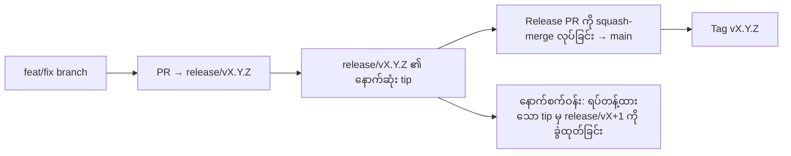

# Branching & Release Model (မြန်မာ)

🌐 **Languages:** 🇺🇸 [English](../../../../ops/BRANCHING_MODEL.md) · 🇪🇹 [am](../../../am/docs/ops/BRANCHING_MODEL.md) · 🇸🇦 [ar](../../../ar/docs/ops/BRANCHING_MODEL.md) · 🇦🇿 [az](../../../az/docs/ops/BRANCHING_MODEL.md) · 🇧🇬 [bg](../../../bg/docs/ops/BRANCHING_MODEL.md) · 🇧🇩 [bn](../../../bn/docs/ops/BRANCHING_MODEL.md) · 🇧🇦 [bs](../../../bs/docs/ops/BRANCHING_MODEL.md) · 🇨🇿 [cs](../../../cs/docs/ops/BRANCHING_MODEL.md) · 🇩🇰 [da](../../../da/docs/ops/BRANCHING_MODEL.md) · 🇩🇪 [de](../../../de/docs/ops/BRANCHING_MODEL.md) · 🇬🇷 [el](../../../el/docs/ops/BRANCHING_MODEL.md) · 🇪🇸 [es](../../../es/docs/ops/BRANCHING_MODEL.md) · 🇪🇪 [et](../../../et/docs/ops/BRANCHING_MODEL.md) · 🇮🇷 [fa](../../../fa/docs/ops/BRANCHING_MODEL.md) · 🇫🇮 [fi](../../../fi/docs/ops/BRANCHING_MODEL.md) · 🇫🇷 [fr](../../../fr/docs/ops/BRANCHING_MODEL.md) · 🇮🇪 [ga](../../../ga/docs/ops/BRANCHING_MODEL.md) · 🇮🇳 [gu](../../../gu/docs/ops/BRANCHING_MODEL.md) · 🇳🇬 [ha](../../../ha/docs/ops/BRANCHING_MODEL.md) · 🇮🇱 [he](../../../he/docs/ops/BRANCHING_MODEL.md) · 🇮🇳 [hi](../../../hi/docs/ops/BRANCHING_MODEL.md) · 🇭🇷 [hr](../../../hr/docs/ops/BRANCHING_MODEL.md) · 🇭🇺 [hu](../../../hu/docs/ops/BRANCHING_MODEL.md) · 🇦🇲 [hy](../../../hy/docs/ops/BRANCHING_MODEL.md) · 🇮🇩 [id](../../../id/docs/ops/BRANCHING_MODEL.md) · 🇳🇬 [ig](../../../ig/docs/ops/BRANCHING_MODEL.md) · 🇮🇹 [it](../../../it/docs/ops/BRANCHING_MODEL.md) · 🇯🇵 [ja](../../../ja/docs/ops/BRANCHING_MODEL.md) · 🇬🇪 [ka](../../../ka/docs/ops/BRANCHING_MODEL.md) · 🇰🇭 [km](../../../km/docs/ops/BRANCHING_MODEL.md) · 🇮🇳 [kn](../../../kn/docs/ops/BRANCHING_MODEL.md) · 🇰🇷 [ko](../../../ko/docs/ops/BRANCHING_MODEL.md) · 🇱🇹 [lt](../../../lt/docs/ops/BRANCHING_MODEL.md) · 🇱🇻 [lv](../../../lv/docs/ops/BRANCHING_MODEL.md) · 🇮🇳 [ml](../../../ml/docs/ops/BRANCHING_MODEL.md) · 🇮🇳 [mr](../../../mr/docs/ops/BRANCHING_MODEL.md) · 🇲🇾 [ms](../../../ms/docs/ops/BRANCHING_MODEL.md) · 🇲🇹 [mt](../../../mt/docs/ops/BRANCHING_MODEL.md) · 🇳🇵 [ne](../../../ne/docs/ops/BRANCHING_MODEL.md) · 🇳🇱 [nl](../../../nl/docs/ops/BRANCHING_MODEL.md) · 🇳🇴 [no](../../../no/docs/ops/BRANCHING_MODEL.md) · 🇮🇳 [or](../../../or/docs/ops/BRANCHING_MODEL.md) · 🇮🇳 [pa](../../../pa/docs/ops/BRANCHING_MODEL.md) · 🇵🇭 [phi](../../../phi/docs/ops/BRANCHING_MODEL.md) · 🇵🇱 [pl](../../../pl/docs/ops/BRANCHING_MODEL.md) · 🇵🇹 [pt](../../../pt/docs/ops/BRANCHING_MODEL.md) · 🇧🇷 [pt-BR](../../../pt-BR/docs/ops/BRANCHING_MODEL.md) · 🇷🇴 [ro](../../../ro/docs/ops/BRANCHING_MODEL.md) · 🇷🇺 [ru](../../../ru/docs/ops/BRANCHING_MODEL.md) · 🇱🇰 [si](../../../si/docs/ops/BRANCHING_MODEL.md) · 🇸🇰 [sk](../../../sk/docs/ops/BRANCHING_MODEL.md) · 🇸🇮 [sl](../../../sl/docs/ops/BRANCHING_MODEL.md) · 🇷🇸 [sr](../../../sr/docs/ops/BRANCHING_MODEL.md) · 🇸🇪 [sv](../../../sv/docs/ops/BRANCHING_MODEL.md) · 🇰🇪 [sw](../../../sw/docs/ops/BRANCHING_MODEL.md) · 🇮🇳 [ta](../../../ta/docs/ops/BRANCHING_MODEL.md) · 🇮🇳 [te](../../../te/docs/ops/BRANCHING_MODEL.md) · 🇹🇭 [th](../../../th/docs/ops/BRANCHING_MODEL.md) · 🇹🇷 [tr](../../../tr/docs/ops/BRANCHING_MODEL.md) · 🇺🇦 [uk-UA](../../../uk-UA/docs/ops/BRANCHING_MODEL.md) · 🇵🇰 [ur](../../../ur/docs/ops/BRANCHING_MODEL.md) · 🇺🇿 [uz](../../../uz/docs/ops/BRANCHING_MODEL.md) · 🇻🇳 [vi](../../../vi/docs/ops/BRANCHING_MODEL.md) · 🇳🇬 [yo](../../../yo/docs/ops/BRANCHING_MODEL.md) · 🇨🇳 [zh-CN](../../../zh-CN/docs/ops/BRANCHING_MODEL.md) · 🇹🇼 [zh-TW](../../../zh-TW/docs/ops/BRANCHING_MODEL.md)

---

OmniRoute သည် **parallel-cycle** ဖြန့်ချိမှုပုံစံကို အသုံးပြုသည်။ လက်ရှိစက်ဝန်းအတွက် သီးသန့် `release/vX.Y.Z`
branch၊ ထုတ်ပြန်ပြီးသောလိုင်းအတွက် `main` နှင့် ထိုစက်ဝန်းကို ဖြန့်ချိချိန်တွင် ပြောင်းလဲ၍မရသော
`vX.Y.Z` tag တို့ကို အသုံးပြုသည်။ Commit များကို `release/*` _နှင့်_ `main`
နှစ်ခုစလုံးတွင် ထည့်သွင်းထားသည်ကို တွေ့ရခြင်းသည် ပုံမှန်ဖြစ်ပြီး ရောထွေးမှားယွင်းမှု မဟုတ်ပါ။

Maintainer များအတွက် အသေးစိတ်အချက်အလက်များကို `CLAUDE.md` (မဖြစ်မနေလိုက်နာရမည့် စည်းမျဉ်း #21) နှင့်
[RELEASE_CHECKLIST.md](./RELEASE_CHECKLIST.md) တွင် ဖော်ပြထားသည်။ ဤစာမျက်နှာသည် အများပြည်သူဖတ်ရှုနိုင်သည့်
contributor များအတွက် အနှစ်ချုပ်ဖြစ်သည်။

## အကျဉ်းချုပ်

| Ref              | အခန်းကဏ္ဍ                                                                                                                |
| ---------------- | ------------------------------------------------------------------------------------------------------------------------ |
| `release/vX.Y.Z` | **လက်ရှိစက်ဝန်း** — ထို version အတွက် နေ့စဉ် development နှင့် PR merge များ                                             |
| `main`           | **ထုတ်ပြန်ပြီးသောလိုင်း** — release ဖြန့်ချိချိန်တွင် စက်ဝန်းကို squash-merge ဖြင့် လက်ခံရရှိသည်                         |
| `vX.Y.Z` (tag)   | **ဖြန့်ချိမှုအမှတ်အသား** — release အချိန်တွင် ဖန်တီးသည့်၊ ပြောင်းလဲ၍မရသော “ဖြန့်ချိလိုက်သည့်အရာ” ကို ညွှန်ပြသည့် pointer |



## ကျွန်ုပ်၏ PR သည် မည်သည့် branch ကို ဦးတည်သင့်သနည်း။

**လက်ရှိ `release/vX.Y.Z` branch ကို ဦးတည်ပါ — `main` ကို မဦးတည်ပါနှင့်။**

1. ဖွင့်ထားသော `release/v*` branch များအနက် အမြင့်ဆုံးကို ရှာပါ (ဤစာကိုရေးသားချိန်မှ ဥပမာ-
   `release/v3.8.49`)။
2. ထို tip မှ branch ခွဲပါ (`git fetch` + checkout / ၎င်းပေါ်သို့ rebase လုပ်ပါ)။
3. **base = ထို `release/vX.Y.Z`** အဖြစ် သတ်မှတ်၍ PR ကို ဖွင့်ပါ။

`main` သည် နေ့စဉ် integration ပြုလုပ်ရာ branch မဟုတ်ပါ။ `main` ကို ဦးတည်၍ ဖွင့်ထားသော PR များသည်
merge မလုပ်မီ ပုံမှန်အားဖြင့် target ပြန်လည်သတ်မှတ်ရန် လိုအပ်သည်။

## Release freeze (အပြိုင်စက်ဝန်းများ)

Release တစ်ခုကို ပြန်လည်စိစစ်ညှိနှိုင်းနေချိန်တွင် `release-freeze` label တပ်ထားသော marker issue တစ်ခုကို
ဖွင့်ထားသည်။ ယင်းသည် **development ကို မရပ်တန့်စေပါ**-

- Freeze လုပ်ထားသော `release/vX.Y.Z` ကို ထို release ဖြန့်ချိမှုအတွက် release captain က စီမံသည်။
- Contributor များ အလုပ်ဆက်လက်ထည့်သွင်းနိုင်ရန် နောက်စက်ဝန်း၏ `release/vX+1` ကို freeze လုပ်ထားသော tip မှ
  ခွဲထုတ်သည်။
- Freeze လုပ်ထားသော branch ကို ဆက်လက်ဦးတည်နေသည့် ဖွင့်ထားသော PR များကို လက်ရှိအသုံးပြုနေသော
  (အမြင့်ဆုံး) `release/v*` branch သို့ **target ပြန်လည်သတ်မှတ်သင့်သည်**။

သင်အသုံးပြုလိုသည့် branch ကို merge လုပ်နိုင်သည်ဟု မယူဆမီ ဖွင့်ထားသော freeze ရှိမရှိ စစ်ဆေးပါ-

```bash
gh issue list --repo diegosouzapw/OmniRoute --label release-freeze --state open
```

Merge လုပ်ဆောင်ပုံများ (owner ၏ `queue` label → Mergify) ကို
[MERGE_TRAIN.md](./MERGE_TRAIN.md) တွင် မှတ်တမ်းတင်ထားသည်။

## Branch နှင့် tag နှစ်မျိုးစလုံး အဘယ်ကြောင့် လိုအပ်သနည်း။

| အစိတ်အပိုင်း     | သက်တမ်း            | ရည်ရွယ်ချက်                                                                                              |
| ---------------- | ------------------ | -------------------------------------------------------------------------------------------------------- |
| `release/vX.Y.Z` | လုပ်ဆောင်ဆဲစက်ဝန်း | Review ပြုလုပ်ပြီးသော PR များကို စုစည်းသည်၊ CI-green အခြေအနေကို ထိန်းသိမ်းသည်၊ PR base အဖြစ် အသုံးပြုသည် |
| Tag `vX.Y.Z`     | အမြဲတမ်း           | npm / GitHub Releases သို့ ဖြန့်ချိခဲ့သော တိကျသည့် bits များကို အမှတ်အသားပြုသည်                          |

Branch သည် အလုပ်ရုံဖြစ်ပြီး tag သည် ချိတ်ပိတ်ထားသော package ဖြစ်သည်။ `main` သို့ squash-merge လုပ်ပြီးနောက်
ယခင် release PR ပြီးဆုံးရန် စောင့်ဆိုင်းစရာမလိုဘဲ နောက်စက်ဝန်းကို `release/vX+1` တွင် ဆက်လက်လုပ်ဆောင်သည်။

## ဆက်စပ် docs များ

- [CONTRIBUTING.md](../../CONTRIBUTING.md) — setup၊ tests နှင့် PR checklist
- [RELEASE_CHECKLIST.md](./RELEASE_CHECKLIST.md) — မဖြန့်ချိမီ အတည်ပြုစစ်ဆေးမှု
- [MERGE_TRAIN.md](./MERGE_TRAIN.md) — merge queue နှင့် အရန် train
- [RELEASE_GREEN.md](./RELEASE_GREEN.md) — release tip ကို green အခြေအနေတွင် ထိန်းသိမ်းခြင်း
