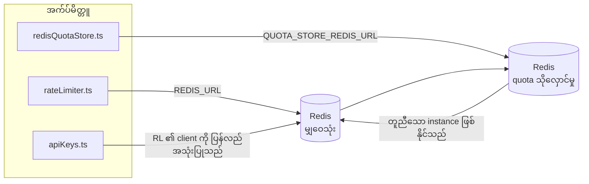

# Redis Production Configuration Guide (မြန်မာ)

🌐 **Languages:** 🇺🇸 [English](../../../../ops/REDIS_PRODUCTION_CONFIG.md) · 🇪🇹 [am](../../../am/docs/ops/REDIS_PRODUCTION_CONFIG.md) · 🇸🇦 [ar](../../../ar/docs/ops/REDIS_PRODUCTION_CONFIG.md) · 🇦🇿 [az](../../../az/docs/ops/REDIS_PRODUCTION_CONFIG.md) · 🇧🇬 [bg](../../../bg/docs/ops/REDIS_PRODUCTION_CONFIG.md) · 🇧🇩 [bn](../../../bn/docs/ops/REDIS_PRODUCTION_CONFIG.md) · 🇧🇦 [bs](../../../bs/docs/ops/REDIS_PRODUCTION_CONFIG.md) · 🇨🇿 [cs](../../../cs/docs/ops/REDIS_PRODUCTION_CONFIG.md) · 🇩🇰 [da](../../../da/docs/ops/REDIS_PRODUCTION_CONFIG.md) · 🇩🇪 [de](../../../de/docs/ops/REDIS_PRODUCTION_CONFIG.md) · 🇬🇷 [el](../../../el/docs/ops/REDIS_PRODUCTION_CONFIG.md) · 🇪🇸 [es](../../../es/docs/ops/REDIS_PRODUCTION_CONFIG.md) · 🇪🇪 [et](../../../et/docs/ops/REDIS_PRODUCTION_CONFIG.md) · 🇮🇷 [fa](../../../fa/docs/ops/REDIS_PRODUCTION_CONFIG.md) · 🇫🇮 [fi](../../../fi/docs/ops/REDIS_PRODUCTION_CONFIG.md) · 🇫🇷 [fr](../../../fr/docs/ops/REDIS_PRODUCTION_CONFIG.md) · 🇮🇪 [ga](../../../ga/docs/ops/REDIS_PRODUCTION_CONFIG.md) · 🇮🇳 [gu](../../../gu/docs/ops/REDIS_PRODUCTION_CONFIG.md) · 🇳🇬 [ha](../../../ha/docs/ops/REDIS_PRODUCTION_CONFIG.md) · 🇮🇱 [he](../../../he/docs/ops/REDIS_PRODUCTION_CONFIG.md) · 🇮🇳 [hi](../../../hi/docs/ops/REDIS_PRODUCTION_CONFIG.md) · 🇭🇷 [hr](../../../hr/docs/ops/REDIS_PRODUCTION_CONFIG.md) · 🇭🇺 [hu](../../../hu/docs/ops/REDIS_PRODUCTION_CONFIG.md) · 🇦🇲 [hy](../../../hy/docs/ops/REDIS_PRODUCTION_CONFIG.md) · 🇮🇩 [id](../../../id/docs/ops/REDIS_PRODUCTION_CONFIG.md) · 🇳🇬 [ig](../../../ig/docs/ops/REDIS_PRODUCTION_CONFIG.md) · 🇮🇹 [it](../../../it/docs/ops/REDIS_PRODUCTION_CONFIG.md) · 🇯🇵 [ja](../../../ja/docs/ops/REDIS_PRODUCTION_CONFIG.md) · 🇬🇪 [ka](../../../ka/docs/ops/REDIS_PRODUCTION_CONFIG.md) · 🇰🇭 [km](../../../km/docs/ops/REDIS_PRODUCTION_CONFIG.md) · 🇮🇳 [kn](../../../kn/docs/ops/REDIS_PRODUCTION_CONFIG.md) · 🇰🇷 [ko](../../../ko/docs/ops/REDIS_PRODUCTION_CONFIG.md) · 🇱🇹 [lt](../../../lt/docs/ops/REDIS_PRODUCTION_CONFIG.md) · 🇱🇻 [lv](../../../lv/docs/ops/REDIS_PRODUCTION_CONFIG.md) · 🇮🇳 [ml](../../../ml/docs/ops/REDIS_PRODUCTION_CONFIG.md) · 🇮🇳 [mr](../../../mr/docs/ops/REDIS_PRODUCTION_CONFIG.md) · 🇲🇾 [ms](../../../ms/docs/ops/REDIS_PRODUCTION_CONFIG.md) · 🇲🇹 [mt](../../../mt/docs/ops/REDIS_PRODUCTION_CONFIG.md) · 🇳🇵 [ne](../../../ne/docs/ops/REDIS_PRODUCTION_CONFIG.md) · 🇳🇱 [nl](../../../nl/docs/ops/REDIS_PRODUCTION_CONFIG.md) · 🇳🇴 [no](../../../no/docs/ops/REDIS_PRODUCTION_CONFIG.md) · 🇮🇳 [or](../../../or/docs/ops/REDIS_PRODUCTION_CONFIG.md) · 🇮🇳 [pa](../../../pa/docs/ops/REDIS_PRODUCTION_CONFIG.md) · 🇵🇭 [phi](../../../phi/docs/ops/REDIS_PRODUCTION_CONFIG.md) · 🇵🇱 [pl](../../../pl/docs/ops/REDIS_PRODUCTION_CONFIG.md) · 🇵🇹 [pt](../../../pt/docs/ops/REDIS_PRODUCTION_CONFIG.md) · 🇧🇷 [pt-BR](../../../pt-BR/docs/ops/REDIS_PRODUCTION_CONFIG.md) · 🇷🇴 [ro](../../../ro/docs/ops/REDIS_PRODUCTION_CONFIG.md) · 🇷🇺 [ru](../../../ru/docs/ops/REDIS_PRODUCTION_CONFIG.md) · 🇱🇰 [si](../../../si/docs/ops/REDIS_PRODUCTION_CONFIG.md) · 🇸🇰 [sk](../../../sk/docs/ops/REDIS_PRODUCTION_CONFIG.md) · 🇸🇮 [sl](../../../sl/docs/ops/REDIS_PRODUCTION_CONFIG.md) · 🇷🇸 [sr](../../../sr/docs/ops/REDIS_PRODUCTION_CONFIG.md) · 🇸🇪 [sv](../../../sv/docs/ops/REDIS_PRODUCTION_CONFIG.md) · 🇰🇪 [sw](../../../sw/docs/ops/REDIS_PRODUCTION_CONFIG.md) · 🇮🇳 [ta](../../../ta/docs/ops/REDIS_PRODUCTION_CONFIG.md) · 🇮🇳 [te](../../../te/docs/ops/REDIS_PRODUCTION_CONFIG.md) · 🇹🇭 [th](../../../th/docs/ops/REDIS_PRODUCTION_CONFIG.md) · 🇹🇷 [tr](../../../tr/docs/ops/REDIS_PRODUCTION_CONFIG.md) · 🇺🇦 [uk-UA](../../../uk-UA/docs/ops/REDIS_PRODUCTION_CONFIG.md) · 🇵🇰 [ur](../../../ur/docs/ops/REDIS_PRODUCTION_CONFIG.md) · 🇺🇿 [uz](../../../uz/docs/ops/REDIS_PRODUCTION_CONFIG.md) · 🇻🇳 [vi](../../../vi/docs/ops/REDIS_PRODUCTION_CONFIG.md) · 🇳🇬 [yo](../../../yo/docs/ops/REDIS_PRODUCTION_CONFIG.md) · 🇨🇳 [zh-CN](../../../zh-CN/docs/ops/REDIS_PRODUCTION_CONFIG.md) · 🇹🇼 [zh-TW](../../../zh-TW/docs/ops/REDIS_PRODUCTION_CONFIG.md)

---

## အနှစ်ချုပ်

Redis သည် OmniRoute တွင် **ရွေးချယ်အသုံးပြုနိုင်သော၊ မဖြစ်မနေမဟုတ်သည့် dependency** တစ်ခုဖြစ်သည် — Redis ကို အသုံးမပြုနိုင်သည့်အခါ application သည် (in-memory
fallback များဖြင့်) လုပ်ဆောင်နိုင်စွမ်းကို အဆင့်ဆင့်ညင်သာစွာ လျှော့ချသည်။ Production တွင် Redis ကို ချိန်ညှိခြင်းက သီးခြား
workload လေးမျိုးအတွက် latency ကို လျှော့ချပေးသည်-

| Workload               | Driver                        | Client Factory                                | Key Pattern                                                           |
| ---------------------- | ----------------------------- | --------------------------------------------- | --------------------------------------------------------------------- |
| Rate limiting          | `rateLimiter.ts`              | `getRedisClient()` — lazy `ioredis` singleton | `<prefix>rl:*` Lua‑atomic rate limit window များ                      |
| Auth cache             | `apiKeys.ts`                  | `rateLimiter` ၏ client ကို ပြန်လည်အသုံးပြုသည် | TTL ပါရှိသည့် `<prefix>auth:api_key:<sha256>`                         |
| Quota store            | `redisQuotaStore.ts`          | သီးခြား `getRedisClient(url)` singleton       | instance တစ်ခုချင်းစီအလိုက် ပြင်ဆင်သတ်မှတ်နိုင်သည့် `<prefix>quota:*` |
| Warmup circuit breaker | `redisCircuitBreakerStore.ts` | `circuitBreakerFactory.ts` ရှိ သီးခြား client | `<prefix>warmup:cb:<connectionId>`                                    |

Workload လေးမျိုးလုံးသည် namespace prefix တစ်ခုတည်းကို မျှဝေသုံးစွဲသောကြောင့် OmniRoute သည်
Redis instance တစ်ခုတည်း (ဥပမာ `127.0.0.1:6379`) ပေါ်ရှိ အခြား app များနှင့် အတူတကွ တည်ရှိနိုင်သည်။ [Key Namespacing](#key-namespacing) ကို ကြည့်ပါ။

---

## လက်ရှိ Configuration (Code Default များ)

| Setting                         | Value                                                        | Where                                                                                 |
| ------------------------------- | ------------------------------------------------------------ | ------------------------------------------------------------------------------------- |
| `REDIS_URL` env var             | `redis://redis:6379` (compose)၊ ရွေးချယ်အသုံးပြုနိုင်သည်     | `rateLimiter.ts:5`, `.env.example`                                                    |
| `REDIS_KEY_PREFIX` env var      | `omniroute:` (default)                                       | `rateLimiter.ts`, `redisQuotaStore.ts`, `redisCircuitBreakerStore.ts`, `.env.example` |
| `QUOTA_STORE_REDIS_URL` env var | သီးခြားဖြစ်ပြီး `REDIS_URL` နှင့် ကွဲပြားနိုင်သည်            | `quota/storeFactory.ts`                                                               |
| `QUOTA_STORE_DRIVER`            | `"sqlite"` (default)၊ `"redis"` ကို ရွေးချယ်အသုံးပြုနိုင်သည် | `quota/storeFactory.ts`                                                               |
| ioredis `maxRetriesPerRequest`  | `3`                                                          | `rateLimiter.ts` client ဖန်တီးမှု                                                     |
| `enableReadyCheck`              | မသတ်မှတ်ထားပါ (ioredis default: `true`)                      | —                                                                                     |
| `lazyConnect`                   | မသတ်မှတ်ထားပါ (ioredis default: `false`)                     | —                                                                                     |
| `retryStrategy`                 | မသတ်မှတ်ထားပါ (ioredis default: 200ms base၊ exponential)     | —                                                                                     |
| TLS / password / DB index       | **မပြင်ဆင်ထားပါ**                                            | —                                                                                     |
| Sentinel / Cluster              | **မပြင်ဆင်ထားပါ** — standalone single-node သာ                | —                                                                                     |

---

## Key Namespacing

OmniRoute သည် host ပေါ်တွင် လည်ပတ်နေသည့် အခြားအရာများနှင့် Redis instance တစ်ခုကို မျှဝေသုံးစွဲသည်။ Namespace မရှိပါက
`auth:api_key:<sha256>` သို့မဟုတ် `rl:*` ကဲ့သို့သော key များသည် Redis တစ်ခုတည်းကို
အသုံးပြုနေသည့် အခြား application များ၏ key များနှင့် ထပ်တူကျနိုင်သည် (ဤ instance သည် အခြား service များနှင့်အတူ `127.0.0.1:6379` ပေါ်တွင် Redis ကို လည်ပတ်စေသည်)။

OmniRoute key **တိုင်း**၏ ရှေ့တွင် prefix ထည့်ရန် `REDIS_KEY_PREFIX` ကို အလွတ်မဟုတ်သော string တစ်ခုအဖြစ် သတ်မှတ်ပါ-

```bash
# .env — OmniRoute key အားလုံးသည် omniroute:rl:*, omniroute:auth:*, omniroute:quota:*, omniroute:warmup:cb:* ဖြစ်လာမည်
REDIS_KEY_PREFIX=omniroute:
```

- **Default:** `omniroute:` (`REDIS_KEY_PREFIX` ကို မသတ်မှတ်ထားသည့်အခါ သို့မဟုတ် အလွတ်ဖြစ်သည့်အခါ အသုံးပြုသည်)။
- **အသုံးချသည့်နေရာများ:** rate limiter + auth cache (`keyPrefix` မှတစ်ဆင့် မျှဝေထားသော `ioredis` client)၊
  quota store (`KEY_PREFIX = "${REDIS_KEY_PREFIX}quota"`) နှင့် warmup circuit breaker
  (`KEY_PREFIX = "${REDIS_KEY_PREFIX}warmup:cb:"`)။
- Redis တွင် key များ ရှိပြီးသားဖြစ်နေချိန်၌ **prefix ကို ပြောင်းလဲခြင်း**သည် key အဟောင်းများကို အသုံးမပြုတော့သည့်အခြေအနေ ဖြစ်စေသည် (၎င်းတို့သည်
  TTL / LRU မှတစ်ဆင့် သက်တမ်းကုန်ဆုံးသည်)။ ပြောင်းလဲရန် ဘေးကင်းပြီး migration မလိုအပ်ပါ။ တစ်ခုတည်းသော ခြွင်းချက်မှာ forbidden အဖြစ် မှတ်သားထားသည့် connection တစ်ခုအတွက် warmup
  circuit-breaker key ဖြစ်သည်။ ၎င်းကို TTL မပါဘဲ အမြဲတမ်းသိမ်းဆည်းထားသောကြောင့်
  `redis-cli --scan --pattern '<old-prefix>warmup:cb:*'` ဖြင့် ကျန်ရှိနေသည့် key များကို စာရင်းပြုစုပြီး ဖျက်ပါ။
- **ioredis `keyPrefix`** သည် write လုပ်သည့်အခါ prefix ကို အလိုအလျောက် ရှေ့တွင် ထည့်ပေးပြီး read လုပ်သည့်အခါတွင်လည်း ၎င်းကို ဖယ်ရှားပေးသည်။
  ထို့ကြောင့် application code သည် prefix ကို မည်သည့်အခါမျှ မမြင်ရပါ။

---

## ထုတ်လုပ်ရေးပတ်ဝန်းကျင်အတွက် အကြံပြု ချိန်ညှိမှုများ

### 1. Connection Pool / Client ရွေးချယ်စရာများ (ioredis `Redis` constructor)

လက်ရှိကုဒ်သည် စိတ်ကြိုက်ရွေးချယ်စရာများမပါဘဲ `new Redis(url)` တစ်ခုတည်းကို ဖန်တီးထားသည်။ ထုတ်လုပ်ရေး
multi‑replica ဖြန့်ကျက်မှုများအတွက် ကုဒ်ထဲတွင် client factory တစ်ခု ထည့်ပေးပါ သို့မဟုတ် `getRedisClient()` ကို wrap လုပ်ပါ-

```typescript
const redis = new Redis(REDIS_URL, {
  maxRetriesPerRequest: null, // ပြန်လည်ကြိုးစားမှု ကန့်သတ်ချက်မထားဘဲ retryStrategy က ဆုံးဖြတ်ပါစေ
  enableReadyCheck: true, // ခေါ်ဆိုမှုများကို လက်မခံမီ server အဆင်သင့်ဖြစ်ကြောင်း စစ်ဆေးပါ
  lazyConnect: true, // တည်ဆောက်ချိန်တွင် မချိတ်ဆက်ဘဲ ပထမဆုံးခေါ်ဆိုမှုအထိ စောင့်ပါ
  retryStrategy: (times) => {
    if (times > 10) return null; // 10 ကြိမ် ပြန်လည်ကြိုးစားပြီးနောက် လက်လျှော့ကာ → နောက်မှ ပြန်ချိတ်ဆက်ပါ
    return Math.min(times * 200, 5000); // 200ms၊ 400ms၊ …၊ အများဆုံး 5s
  },
  enableAutoPipelining: true, // တစ်ပြိုင်နက်ဖြစ်ပေါ်သော command များကို TCP write တစ်ခုတည်းအဖြစ် ပေါင်းစည်းပါ
  keepAlive: 10000, // 10s တိုင်း TCP keep‑alive လုပ်ပါ
});
```

**အဓိက အားသာချက်/အားနည်းချက်များ-**

- `maxRetriesPerRequest: null` + `retryStrategy` — ယာယီဖြစ်ပေါ်သော Redis restart များကြောင့်
  request တိုင်း ချက်ချင်းမအောင်မြင်ခြင်းကို ရှောင်ရှားနိုင်သဖြင့် ထုတ်လုပ်ရေးပတ်ဝန်းကျင်အတွက် ပိုသင့်လျော်သည်။
  `checkRateLimit()` ထဲရှိ in-memory fallback က မအောင်မြင်မှုလမ်းကြောင်းကို ထိန်းပေးသည်။
- `lazyConnect: true` — server က connection များကို စတင်လက်ခံခြင်းမပြုမီ Redis အသင့်ဖြစ်နေရမည့်
  startup dependency ကို ရှောင်ရှားပေးသည်။
- `enableAutoPipelining: true` — တစ်ပြိုင်နက်လုပ်ဆောင်သော rate-limit စစ်ဆေးမှုများအတွက် round-trip များကို လျှော့ချပေးသည်။
  connection တစ်ခုတည်းတွင် >50 RPS ဖြစ်ပါက အကျိုးရှိသည်။

### 2. Redis Server ဖွဲ့စည်းသတ်မှတ်ချက် (`redis.conf`)

```
# Memory
maxmemory 80%                        # OS page cache အတွက် နေရာချန်ထားပါ
maxmemory-policy allkeys-lru         # ဖိအားများလာသောအခါ ဟောင်းနေသည့် auth cache entry များကို ဖယ်ရှားပါ

# Persistence (မဖြစ်မနေမဟုတ်ပါ — OmniRoute သည် ၎င်းမရှိဘဲလည်း crash‑safe ဖြစ်သည်)
save 300 1                           # key ≥1 ခု ပြောင်းလဲပါက အနည်းဆုံး 5 min တိုင်း snapshot ရိုက်ပါ
appendonly no                        # AOF မလိုအပ်ပါ၊ data ကို ပြန်လည်ဖန်တီးနိုင်သည်
appendfsync no                       # fsync overhead မရှိပါ (RDB ဖြင့် လုံလောက်သည်)

# Networking
timeout 0                            # idle connection ကို မဖြုတ်ပါ
tcp-keepalive 300                    # 5 min keep‑alive
tcp-backlog 511                      # ရုတ်တရက်များပြားသော load အတွက် connection backlog

# Performance
hz 10                                # မူလတန်ဖိုး၊ latency‑sensitive ဖြစ်ပါက 100
activedefrag yes                     # fragmentation >10% ဖြစ်သောအခါ အလိုအလျောက် defragment လုပ်ပါ
```

**`maxmemory-policy allkeys-lru` အတွက် အားသာချက်/အားနည်းချက်-** Memory ဖိအားများလာချိန်တွင် auth cache entry များ
ဖယ်ရှားခံရနိုင်သည်။ ၎င်းသည် ဘေးကင်းသည် — `setCachedApiKey` သည် cache miss ဖြစ်တိုင်း အမြဲပြန်ဖြည့်ပေးပြီး
SQLite fallback သည် အတည်ပြုရမည့် အဓိကရင်းမြစ်ဖြစ်သည်။ Rate-limiter Lua script သည် ဒီဇိုင်းအရ
သက်တမ်းတိုပြီး အရွယ်အစားသေးငယ်သော key များကို ဖန်တီးသည်။

### 3. Docker Compose ဆက်တင်များ

ထုတ်လုပ်ရေး compose (`docker-compose.prod.yml`) သည် `redis:8.6.2-alpine` ကို အသုံးပြုထားသည်။ အောက်ပါတို့ကို ထည့်ပါ-

```yaml
redis:
  image: redis:8.6.2-alpine
  command:
    [
      "redis-server",
      "--maxmemory",
      "512mb",
      "--maxmemory-policy",
      "allkeys-lru",
      "--activedefrag",
      "yes",
      "--save",
      "300 1",
    ]
  healthcheck:
    test: ["CMD", "redis-cli", "ping"]
    interval: 10s
    timeout: 3s
    retries: 3
    start_period: 5s
```

### 4. Multi‑Instance / Scaling အတွက် ထည့်သွင်းစဉ်းစားရမည့်အချက်များ

**Replica အားလုံးအတွက် Redis တစ်ခုတည်း** — rate-limiter Lua script သည် authoritative key space
တစ်ခုတည်းအပေါ် မူတည်သည်။ Replica များ၏ နောက်ကွယ်တွင် Redis instance အများအပြားထားပါက atomicity
ဆုံးရှုံးပြီး budget နှစ်ဆဖြစ်သွားမည်။ Application replica အားလုံးအတွက် Redis တစ်ခုတည်း
(သို့မဟုတ် failover ပါသော Redis Sentinel cluster) ကို အသုံးပြုပါ။

**Connection အရေအတွက်-** Application replica တစ်ခုစီသည် Redis သို့ **TCP connection 2 ခု**
(rate limiter client + quota store client) ဖွင့်သည်။ Replica 10 ခုတွင် → connection 20 ခုသာရှိသောကြောင့်
မူလ Redis instance ၏ connection အများဆုံး 10k ကန့်သတ်ချက်အတွင်း အလွယ်တကူရှိနေသည်။

### 5. စောင့်ကြည့်ခြင်း

Health-check endpoint မှတစ်ဆင့် ဖော်ထုတ်ပေးပါ-

```typescript
// src/app/api/monitoring/health/route.ts သည် rateLimiter function များကို ခေါ်ဆိုထားပြီးဖြစ်သည်
// Redis ဆိုင်ရာ စစ်ဆေးမှုများ ထည့်ပါ-
//   1. ioredis .ping() မှတစ်ဆင့် PING latency
//   2. INFO memory မှတစ်ဆင့် memory အသုံးပြုမှု
//   3. INFO clients မှတစ်ဆင့် connection အရေအတွက်
//   4. maxmemory-policy အတွက် hit rate (evicted_keys / keyspace_hits)
```

စောင့်ကြည့်ရမည့် အဓိက metric များ-

- **တစ်စက္ကန့်လျှင် ဖယ်ရှားခံရသော key များ** — ဆက်တိုက် သုညမဟုတ်ပါက `maxmemory` ကို တိုးပါ
- **ပိတ်ဆို့ခံထားရသော client များ** — သုညမဟုတ်ပါက Lua script များ နှေးကွေးခြင်း သို့မဟုတ် contention မြင့်မားခြင်းကို ညွှန်ပြသည်
- **ငြင်းပယ်ခံရသော connection များ** — connection limit ပြည့်သွားခြင်းဖြစ်ပြီး connection 20 ခုတွင် ဖြစ်ခဲသည်

---

## ဗိသုကာပုံကြမ်း



---

## ကိုးကားချက်များ

| ဖိုင်                              | ရည်ရွယ်ချက်                                                        |
| ---------------------------------- | ------------------------------------------------------------------ |
| `src/shared/utils/rateLimiter.ts`  | ပင်မ Redis client၊ Lua rate-limit script နှင့် in-memory fallback  |
| `src/lib/db/apiKeys.ts`            | Auth cache — Redis→SQLite fallback                                 |
| `src/lib/quota/redisQuotaStore.ts` | ရွေးချယ်အသုံးပြုနိုင်သော quota store အတွက် သီးခြား Redis client    |
| `src/lib/quota/storeFactory.ts`    | `sqlite` နှင့် `redis` quota driver များအကြား ပြောင်းလဲအသုံးပြုသည် |
| `docker-compose.prod.yml`          | Production Redis container (`redis:8.6.2-alpine` image)            |
| `.env.example`                     | Redis env var များအတွက် စာရွက်စာတမ်း                               |
| `src/app/api/local/redis/`         | Development container စီမံခန့်ခွဲမှုအတွက် API route များ           |
| `bin/cli/commands/redis.mjs`       | Development container စီမံခန့်ခွဲမှုအတွက် CLI command များ         |
