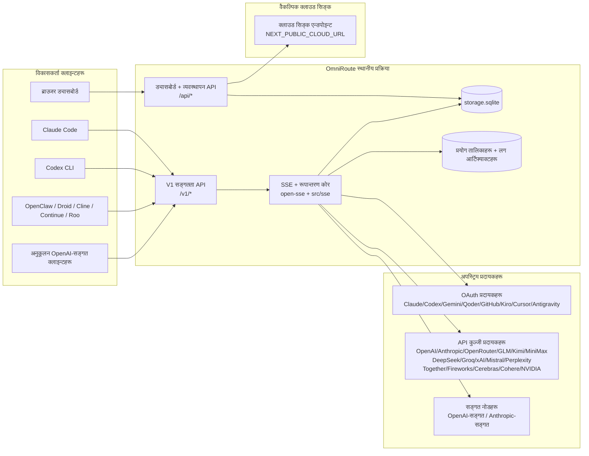
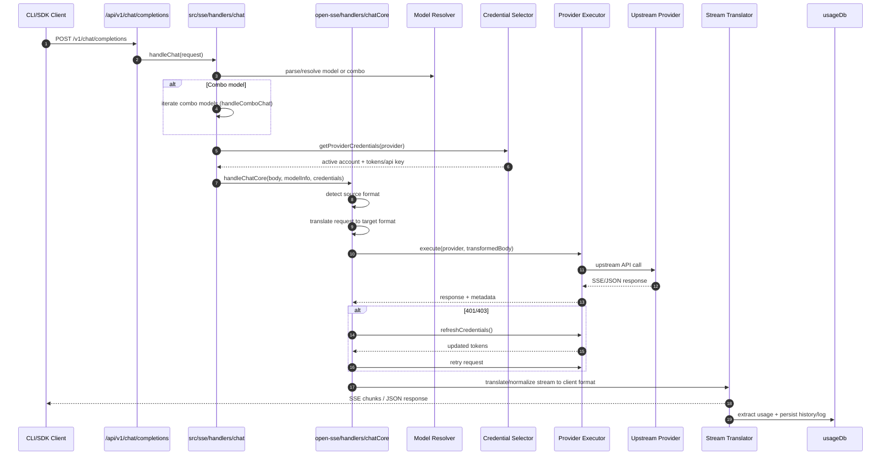
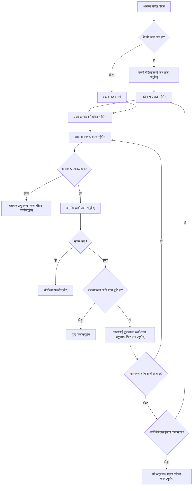
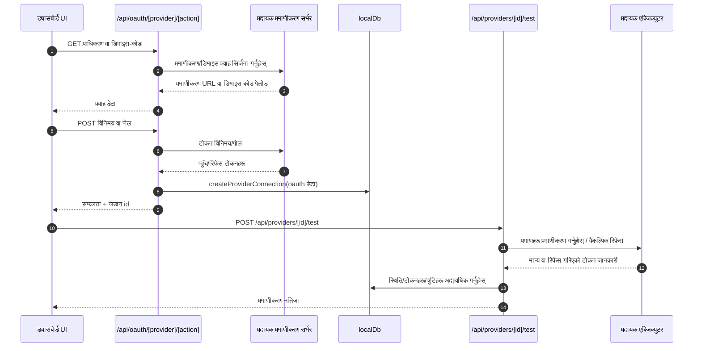
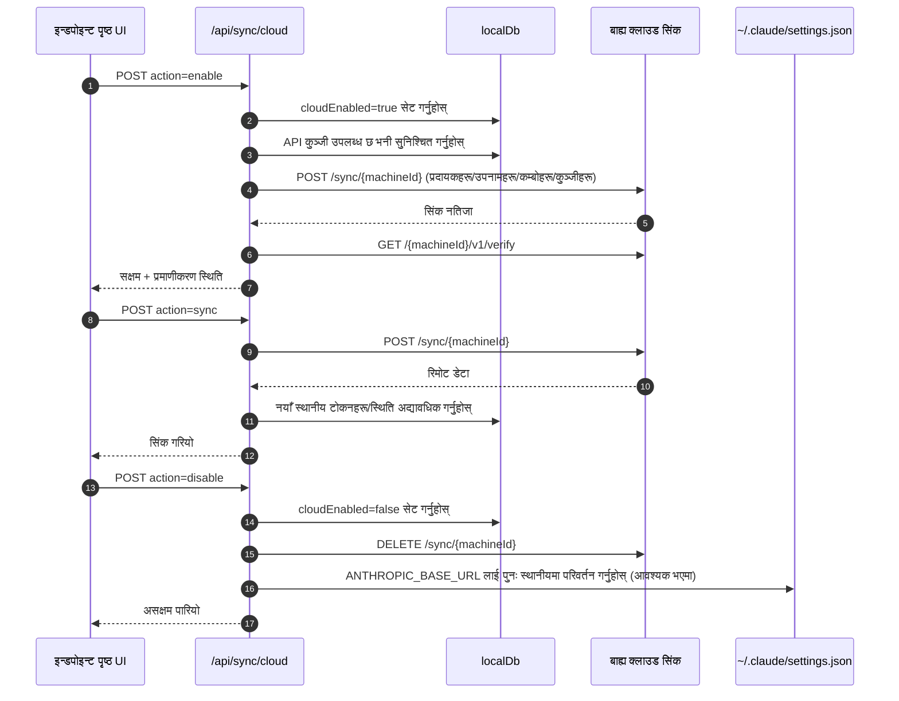
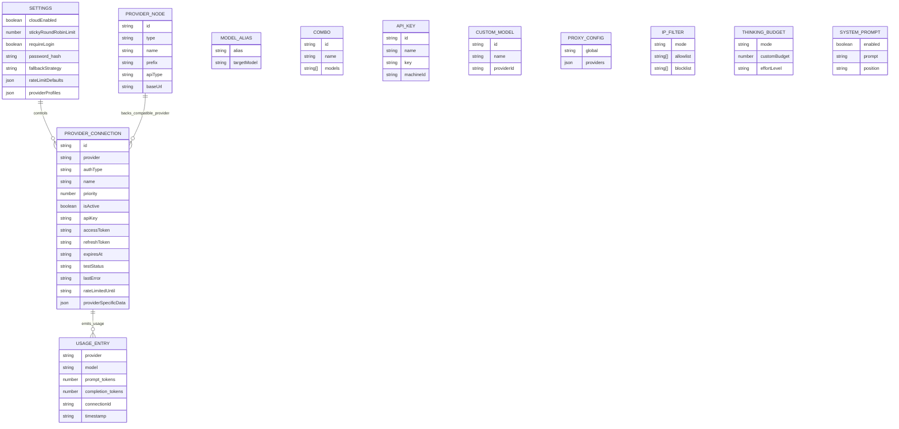
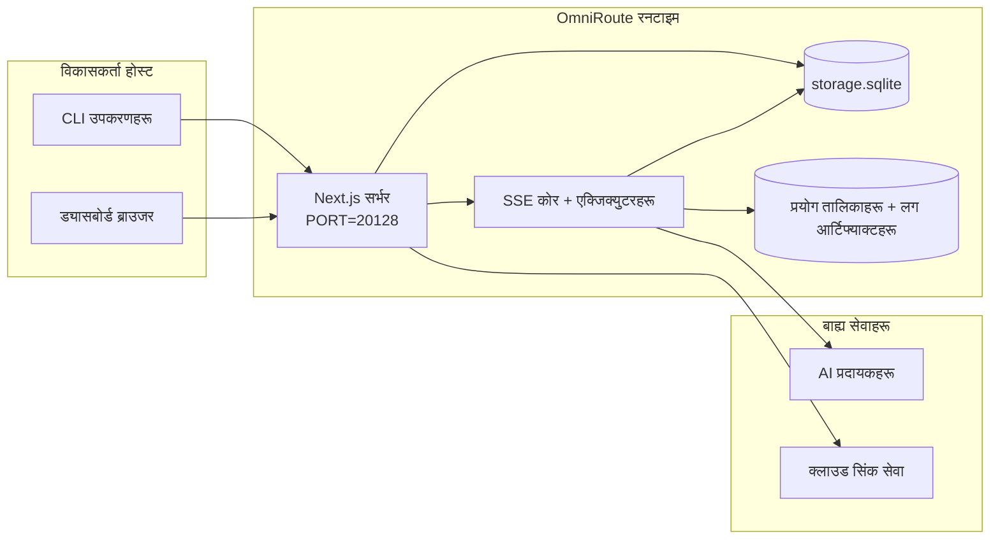

# OmniRoute Architecture (नेपाली)

🌐 **Languages:** 🇺🇸 [English](../../../../architecture/ARCHITECTURE.md) · 🇪🇹 [am](../../../am/docs/architecture/ARCHITECTURE.md) · 🇸🇦 [ar](../../../ar/docs/architecture/ARCHITECTURE.md) · 🇦🇿 [az](../../../az/docs/architecture/ARCHITECTURE.md) · 🇧🇬 [bg](../../../bg/docs/architecture/ARCHITECTURE.md) · 🇧🇩 [bn](../../../bn/docs/architecture/ARCHITECTURE.md) · 🇨🇿 [cs](../../../cs/docs/architecture/ARCHITECTURE.md) · 🇩🇰 [da](../../../da/docs/architecture/ARCHITECTURE.md) · 🇩🇪 [de](../../../de/docs/architecture/ARCHITECTURE.md) · 🇬🇷 [el](../../../el/docs/architecture/ARCHITECTURE.md) · 🇪🇸 [es](../../../es/docs/architecture/ARCHITECTURE.md) · 🇪🇪 [et](../../../et/docs/architecture/ARCHITECTURE.md) · 🇮🇷 [fa](../../../fa/docs/architecture/ARCHITECTURE.md) · 🇫🇮 [fi](../../../fi/docs/architecture/ARCHITECTURE.md) · 🇫🇷 [fr](../../../fr/docs/architecture/ARCHITECTURE.md) · 🇮🇪 [ga](../../../ga/docs/architecture/ARCHITECTURE.md) · 🇮🇳 [gu](../../../gu/docs/architecture/ARCHITECTURE.md) · 🇳🇬 [ha](../../../ha/docs/architecture/ARCHITECTURE.md) · 🇮🇱 [he](../../../he/docs/architecture/ARCHITECTURE.md) · 🇮🇳 [hi](../../../hi/docs/architecture/ARCHITECTURE.md) · 🇭🇷 [hr](../../../hr/docs/architecture/ARCHITECTURE.md) · 🇭🇺 [hu](../../../hu/docs/architecture/ARCHITECTURE.md) · 🇦🇲 [hy](../../../hy/docs/architecture/ARCHITECTURE.md) · 🇮🇩 [id](../../../id/docs/architecture/ARCHITECTURE.md) · 🇳🇬 [ig](../../../ig/docs/architecture/ARCHITECTURE.md) · 🇮🇹 [it](../../../it/docs/architecture/ARCHITECTURE.md) · 🇯🇵 [ja](../../../ja/docs/architecture/ARCHITECTURE.md) · 🇬🇪 [ka](../../../ka/docs/architecture/ARCHITECTURE.md) · 🇰🇭 [km](../../../km/docs/architecture/ARCHITECTURE.md) · 🇮🇳 [kn](../../../kn/docs/architecture/ARCHITECTURE.md) · 🇰🇷 [ko](../../../ko/docs/architecture/ARCHITECTURE.md) · 🇱🇹 [lt](../../../lt/docs/architecture/ARCHITECTURE.md) · 🇱🇻 [lv](../../../lv/docs/architecture/ARCHITECTURE.md) · 🇮🇳 [ml](../../../ml/docs/architecture/ARCHITECTURE.md) · 🇮🇳 [mr](../../../mr/docs/architecture/ARCHITECTURE.md) · 🇲🇾 [ms](../../../ms/docs/architecture/ARCHITECTURE.md) · 🇲🇹 [mt](../../../mt/docs/architecture/ARCHITECTURE.md) · 🇲🇲 [my](../../../my/docs/architecture/ARCHITECTURE.md) · 🇳🇱 [nl](../../../nl/docs/architecture/ARCHITECTURE.md) · 🇳🇴 [no](../../../no/docs/architecture/ARCHITECTURE.md) · 🇮🇳 [or](../../../or/docs/architecture/ARCHITECTURE.md) · 🇮🇳 [pa](../../../pa/docs/architecture/ARCHITECTURE.md) · 🇵🇭 [phi](../../../phi/docs/architecture/ARCHITECTURE.md) · 🇵🇱 [pl](../../../pl/docs/architecture/ARCHITECTURE.md) · 🇵🇹 [pt](../../../pt/docs/architecture/ARCHITECTURE.md) · 🇧🇷 [pt-BR](../../../pt-BR/docs/architecture/ARCHITECTURE.md) · 🇷🇴 [ro](../../../ro/docs/architecture/ARCHITECTURE.md) · 🇷🇺 [ru](../../../ru/docs/architecture/ARCHITECTURE.md) · 🇱🇰 [si](../../../si/docs/architecture/ARCHITECTURE.md) · 🇸🇰 [sk](../../../sk/docs/architecture/ARCHITECTURE.md) · 🇸🇮 [sl](../../../sl/docs/architecture/ARCHITECTURE.md) · 🇷🇸 [sr](../../../sr/docs/architecture/ARCHITECTURE.md) · 🇸🇪 [sv](../../../sv/docs/architecture/ARCHITECTURE.md) · 🇰🇪 [sw](../../../sw/docs/architecture/ARCHITECTURE.md) · 🇮🇳 [ta](../../../ta/docs/architecture/ARCHITECTURE.md) · 🇮🇳 [te](../../../te/docs/architecture/ARCHITECTURE.md) · 🇹🇭 [th](../../../th/docs/architecture/ARCHITECTURE.md) · 🇹🇷 [tr](../../../tr/docs/architecture/ARCHITECTURE.md) · 🇺🇦 [uk-UA](../../../uk-UA/docs/architecture/ARCHITECTURE.md) · 🇵🇰 [ur](../../../ur/docs/architecture/ARCHITECTURE.md) · 🇺🇿 [uz](../../../uz/docs/architecture/ARCHITECTURE.md) · 🇻🇳 [vi](../../../vi/docs/architecture/ARCHITECTURE.md) · 🇳🇬 [yo](../../../yo/docs/architecture/ARCHITECTURE.md) · 🇨🇳 [zh-CN](../../../zh-CN/docs/architecture/ARCHITECTURE.md) · 🇹🇼 [zh-TW](../../../zh-TW/docs/architecture/ARCHITECTURE.md)

---

🌐 **Languages:** 🇺🇸 [English](../../../../architecture/ARCHITECTURE.md) · 🇪🇹 [am](../../../am/docs/architecture/ARCHITECTURE.md) · 🇸🇦 [ar](../../../ar/docs/architecture/ARCHITECTURE.md) · 🇦🇿 [az](../../../az/docs/architecture/ARCHITECTURE.md) · 🇧🇬 [bg](../../../bg/docs/architecture/ARCHITECTURE.md) · 🇧🇩 [bn](../../../bn/docs/architecture/ARCHITECTURE.md) · 🇨🇿 [cs](../../../cs/docs/architecture/ARCHITECTURE.md) · 🇩🇰 [da](../../../da/docs/architecture/ARCHITECTURE.md) · 🇩🇪 [de](../../../de/docs/architecture/ARCHITECTURE.md) · 🇬🇷 [el](../../../el/docs/architecture/ARCHITECTURE.md) · 🇪🇸 [es](../../../es/docs/architecture/ARCHITECTURE.md) · 🇪🇪 [et](../../../et/docs/architecture/ARCHITECTURE.md) · 🇮🇷 [fa](../../../fa/docs/architecture/ARCHITECTURE.md) · 🇫🇮 [fi](../../../fi/docs/architecture/ARCHITECTURE.md) · 🇫🇷 [fr](../../../fr/docs/architecture/ARCHITECTURE.md) · 🇮🇪 [ga](../../../ga/docs/architecture/ARCHITECTURE.md) · 🇮🇳 [gu](../../../gu/docs/architecture/ARCHITECTURE.md) · 🇳🇬 [ha](../../../ha/docs/architecture/ARCHITECTURE.md) · 🇮🇱 [he](../../../he/docs/architecture/ARCHITECTURE.md) · 🇮🇳 [hi](../../../hi/docs/architecture/ARCHITECTURE.md) · 🇭🇷 [hr](../../../hr/docs/architecture/ARCHITECTURE.md) · 🇭🇺 [hu](../../../hu/docs/architecture/ARCHITECTURE.md) · 🇦🇲 [hy](../../../hy/docs/architecture/ARCHITECTURE.md) · 🇮🇩 [id](../../../id/docs/architecture/ARCHITECTURE.md) · 🇳🇬 [ig](../../../ig/docs/architecture/ARCHITECTURE.md) · 🇮🇹 [it](../../../it/docs/architecture/ARCHITECTURE.md) · 🇯🇵 [ja](../../../ja/docs/architecture/ARCHITECTURE.md) · 🇬🇪 [ka](../../../ka/docs/architecture/ARCHITECTURE.md) · 🇰🇭 [km](../../../km/docs/architecture/ARCHITECTURE.md) · 🇮🇳 [kn](../../../kn/docs/architecture/ARCHITECTURE.md) · 🇰🇷 [ko](../../../ko/docs/architecture/ARCHITECTURE.md) · 🇱🇹 [lt](../../../lt/docs/architecture/ARCHITECTURE.md) · 🇱🇻 [lv](../../../lv/docs/architecture/ARCHITECTURE.md) · 🇮🇳 [ml](../../../ml/docs/architecture/ARCHITECTURE.md) · 🇮🇳 [mr](../../../mr/docs/architecture/ARCHITECTURE.md) · 🇲🇾 [ms](../../../ms/docs/architecture/ARCHITECTURE.md) · 🇲🇹 [mt](../../../mt/docs/architecture/ARCHITECTURE.md) · 🇲🇲 [my](../../../my/docs/architecture/ARCHITECTURE.md) · 🇳🇱 [nl](../../../nl/docs/architecture/ARCHITECTURE.md) · 🇳🇴 [no](../../../no/docs/architecture/ARCHITECTURE.md) · 🇮🇳 [or](../../../or/docs/architecture/ARCHITECTURE.md) · 🇮🇳 [pa](../../../pa/docs/architecture/ARCHITECTURE.md) · 🇵🇭 [phi](../../../phi/docs/architecture/ARCHITECTURE.md) · 🇵🇱 [pl](../../../pl/docs/architecture/ARCHITECTURE.md) · 🇵🇹 [pt](../../../pt/docs/architecture/ARCHITECTURE.md) · 🇧🇷 [pt-BR](../../../pt-BR/docs/architecture/ARCHITECTURE.md) · 🇷🇴 [ro](../../../ro/docs/architecture/ARCHITECTURE.md) · 🇷🇺 [ru](../../../ru/docs/architecture/ARCHITECTURE.md) · 🇱🇰 [si](../../../si/docs/architecture/ARCHITECTURE.md) · 🇸🇰 [sk](../../../sk/docs/architecture/ARCHITECTURE.md) · 🇸🇮 [sl](../../../sl/docs/architecture/ARCHITECTURE.md) · 🇷🇸 [sr](../../../sr/docs/architecture/ARCHITECTURE.md) · 🇸🇪 [sv](../../../sv/docs/architecture/ARCHITECTURE.md) · 🇰🇪 [sw](../../../sw/docs/architecture/ARCHITECTURE.md) · 🇮🇳 [ta](../../../ta/docs/architecture/ARCHITECTURE.md) · 🇮🇳 [te](../../../te/docs/architecture/ARCHITECTURE.md) · 🇹🇭 [th](../../../th/docs/architecture/ARCHITECTURE.md) · 🇹🇷 [tr](../../../tr/docs/architecture/ARCHITECTURE.md) · 🇺🇦 [uk-UA](../../../uk-UA/docs/architecture/ARCHITECTURE.md) · 🇵🇰 [ur](../../../ur/docs/architecture/ARCHITECTURE.md) · 🇺🇿 [uz](../../../uz/docs/architecture/ARCHITECTURE.md) · 🇻🇳 [vi](../../../vi/docs/architecture/ARCHITECTURE.md) · 🇳🇬 [yo](../../../yo/docs/architecture/ARCHITECTURE.md) · 🇨🇳 [zh-CN](../../../zh-CN/docs/architecture/ARCHITECTURE.md) · 🇹🇼 [zh-TW](../../../zh-TW/docs/architecture/ARCHITECTURE.md)

_पछिल्लो अद्यावधिक: 2026-06-28_

## कार्यकारी सारांश

OmniRoute Next.js मा निर्मित स्थानीय AI राउटिङ गेटवे र ड्यासबोर्ड हो।
यसले एउटै OpenAI-संगत एन्डपोइन्ट (`/v1/*`) उपलब्ध गराउँछ र अनुवाद, फलब्याक, टोकन रिफ्रेस तथा प्रयोग ट्र्याकिङसहित धेरै अपस्ट्रिम प्रदायकहरूमा ट्राफिक रुट गर्छ।

मुख्य क्षमताहरू:

- CLI/उपकरणहरूका लागि OpenAI-संगत API सतह (355 प्रदायक, 108 एक्जिक्युटर)
- प्रदायकका ढाँचाहरूबीच अनुरोध/प्रतिक्रिया अनुवाद
- मोडेल कम्बो फलब्याक (बहु-मोडेल अनुक्रम)
- `compositeTiers` अनुसार रनटाइम क्रम निर्धारणसहित संरचित कम्बो चरणहरू (`provider + model + connection`)
- खाता-स्तरीय फलब्याक (प्रति प्रदायक बहु-खाता)
- मुख्य च्याट पथमा कोटा पूर्व-जाँच र कोटा-सचेत P2C खाता चयन
- OAuth + API-key प्रदायक जडान व्यवस्थापन (22 OAuth प्रदायक मोड्युल)
- `/v1/embeddings` मार्फत एम्बेडिङ सिर्जना (18 प्रदायक)
- `/v1/images/generations` मार्फत छवि सिर्जना (10+ प्रदायक, 20+ मोडेल)
- `/v1/audio/transcriptions` मार्फत अडियो ट्रान्सक्रिप्सन (18 प्रदायक)
- `/v1/audio/speech` मार्फत पाठ-देखि-वाणी रूपान्तरण (24 बिल्ट-इन प्रदायक)
- `/v1/videos/generations` मार्फत भिडियो सिर्जना (ComfyUI + SD WebUI)
- `/v1/music/generations` मार्फत सङ्गीत सिर्जना (ComfyUI)
- `/v1/search` मार्फत वेब खोज (20 प्रदायक)
- `/v1/moderations` मार्फत मोडरेसन
- `/v1/rerank` मार्फत पुनःक्रमाङ्कन
- रिजनिङ मोडेलहरूका लागि Think ट्याग पार्सिङ (`<think>...</think>`)
- कडा OpenAI SDK अनुकूलताका लागि प्रतिक्रिया स्यानिटाइजेसन
- विभिन्न प्रदायकबीचको अनुकूलताका लागि भूमिका सामान्यीकरण (developer→system, system→user)
- संरचित आउटपुट रूपान्तरण (json_schema → Gemini responseSchema)
- प्रदायक, कुञ्जी, एलियास, कम्बो, सेटिङ र मूल्य निर्धारणका लागि स्थानीय पर्सिस्टेन्स (122 DB मोड्युल)
- प्रयोग/लागत ट्र्याकिङ र अनुरोध लगिङ
- बहु-उपकरण/स्टेट समक्रमणका लागि वैकल्पिक क्लाउड सिंक
- API पहुँच नियन्त्रणका लागि IP अनुमति-सूची/ब्लक-सूची
- Thinking बजेट व्यवस्थापन (passthrough/auto/custom/adaptive)
- ग्लोबल सिस्टम प्रम्प्ट इन्जेक्सन
- सेसन ट्र्याकिङ र फिङ्गरप्रिन्टिङ
- प्रदायक-विशिष्ट प्रोफाइलसहित प्रति-खाता परिष्कृत दर सीमितता
- प्रदायकको लचिलोपनका लागि सर्किट ब्रेकर ढाँचा
- म्युटेक्स लकिङसहित एन्टी-थन्डरिङ हर्ड सुरक्षा
- सिग्नेचर-आधारित अनुरोध डिडुप्लिकेसन क्यास
- डोमेन तह: लागत नियम, फलब्याक नीति, लकआउट नीति
- Context Relay: खाता रोटेसनको निरन्तरताका लागि सेसन हस्तान्तरण सारांश
- डोमेन स्टेट पर्सिस्टेन्स (फलब्याक, बजेट, लकआउट र सर्किट ब्रेकरहरूका लागि SQLite write-through क्यास)
- केन्द्रीकृत अनुरोध मूल्याङ्कनका लागि नीति इन्जिन (lockout → budget → fallback)
- p50/p95/p99 विलम्बता एग्रिगेसनसहित अनुरोध टेलिमेट्री
- `combo_execution_key` / `combo_step_id` मार्फत कम्बो टार्गेट टेलिमेट्री र ऐतिहासिक कम्बो टार्गेट स्वास्थ्य
- अन्त्यदेखि अन्त्यसम्म ट्रेसिङका लागि सहसम्बन्ध ID (X-Request-Id)
- प्रति API कुञ्जी अप्ट-आउटसहित अनुपालन अडिट लगिङ
- LLM गुणस्तर सुनिश्चितताका लागि Eval फ्रेमवर्क
- प्रदायकको रियल-टाइम सर्किट ब्रेकर स्थितिसहित स्वास्थ्य ड्यासबोर्ड
- 3 ट्रान्सपोर्ट (stdio/SSE/Streamable HTTP) सहित MCP Server (110 उपकरण)
- सीप र कार्य जीवनचक्रसहित A2A Server (JSON-RPC 2.0 + SSE)
- मेमोरी प्रणाली (निष्कर्षण, इन्जेक्सन, पुनर्प्राप्ति, सारांशीकरण)
- सीप प्रणाली (रजिस्ट्री, एक्जिक्युटर, स्यान्डबक्स, बिल्ट-इन सीपहरू)
- प्रमाणपत्र व्यवस्थापन र DNS ह्यान्डलिङसहित MITM प्रोक्सी
- प्रम्प्ट इन्जेक्सन गार्ड मिडलवेयर
- Caveman, RTK, स्ट्याक गरिएका पाइपलाइन, कम्प्रेसन कम्बो, भाषा प्याक र एनालिटिक्ससहित प्रम्प्ट कम्प्रेसन पाइपलाइन
- ACP (Agent Communication Protocol) रजिस्ट्री
- मोड्युलर OAuth प्रदायकहरू (`src/lib/oauth/providers/` अन्तर्गत 22 व्यक्तिगत मोड्युल)
- अनइन्स्टल/पूर्ण-अनइन्स्टल स्क्रिप्टहरू
- OAuth वातावरण मर्मत कार्य
- OpenAI-संगत WS क्लाइन्टहरूका लागि WebSocket ब्रिज (`/v1/ws`)
- सिंक टोकन व्यवस्थापन (जारी/खारेज, ETag-संस्करणयुक्त कन्फिग बन्डल डाउनलोड)
- GLM Thinking (`glmt`) प्रथम-श्रेणी प्रदायक प्रिसेट
- हाइब्रिड टोकन गणना (अनुमान फलब्याकसहित प्रदायक-पक्षीय `/messages/count_tokens`)
- मोडेल एलियास स्वतः-सिडिङ (स्टार्टअपमा 30+ क्रस-प्रोक्सी डायलेक्ट सामान्यीकरण)
- SSRF गार्ड, निजी URL ब्लकिङ र कन्फिगर गर्न मिल्ने पुनःप्रयाससहित सुरक्षित आउटबाउन्ड फेच
- कन्फिगर गर्न मिल्ने `requestRetry` र `maxRetryIntervalSec` सहित कुलडाउन-सचेत च्याट पुनःप्रयास
- स्टार्टअपमा Zod सहित रनटाइम वातावरण प्रमाणीकरण
- पृष्ठाङ्कन, प्रदायक CRUD घटना र SSRF-अवरुद्ध प्रमाणीकरण लगिङसहित अनुपालन अडिट v2

प्राथमिक रनटाइम मोडेल:

- `src/app/api/*` अन्तर्गतका Next.js एप रुटहरूले ड्यासबोर्ड API र अनुकूलता API दुवै कार्यान्वयन गर्छन्
- `src/sse/*` + `open-sse/*` मा रहेको साझा SSE/राउटिङ कोरले प्रदायक कार्यान्वयन, अनुवाद, स्ट्रिमिङ, फलब्याक र प्रयोग व्यवस्थापन गर्छ

## सन्दर्भ आरेखहरू

v3.8.0 प्लेटफर्मका प्रमाणिक, संस्करण-नियन्त्रित Mermaid स्रोतहरू
[`docs/diagrams/`](../diagrams/README.md) मा उपलब्ध छन्। अभिमुखीकरणका लागि तीमध्ये दुईवटा तल पुनः प्रस्तुत गरिएका छन्;
बाँकी आरेखहरू तिनका डोमेन-विशिष्ट मार्गदर्शिकाहरूबाट लिङ्क गरिएका छन्।


> स्रोत: [diagrams/request-pipeline.mmd](../diagrams/request-pipeline.mmd)


> स्रोत: [diagrams/resilience-3layers.mmd](../diagrams/resilience-3layers.mmd) — यसलाई
> [RESILIENCE_GUIDE.md](./RESILIENCE_GUIDE.md) र `CLAUDE.md` को लचिलोपन सन्दर्भबाट पनि लिङ्क गरिएको छ।

## दायरा र सीमाहरू

### दायराभित्र

- स्थानीय गेटवे रनटाइम
- ड्यासबोर्ड व्यवस्थापन API हरू
- प्रदायक प्रमाणीकरण र टोकन रिफ्रेस
- अनुरोध रूपान्तरण र SSE स्ट्रिमिङ
- स्थानीय अवस्था + प्रयोगसम्बन्धी स्थायी भण्डारण
- वैकल्पिक क्लाउड सिंक अर्केस्ट्रेसन

### दायराबाहिर

- `NEXT_PUBLIC_CLOUD_URL` पछाडिको क्लाउड सेवा कार्यान्वयन
- स्थानीय प्रक्रियाभन्दा बाहिरको प्रदायक SLA/कन्ट्रोल प्लेन
- बाह्य CLI बाइनरीहरू स्वयं (Claude CLI, Codex CLI, आदि)

## ड्यासबोर्ड सतह (हालको)

`src/app/(dashboard)/dashboard/` अन्तर्गतका मुख्य पृष्ठहरू:

- `/dashboard` — द्रुत सुरुवात + प्रदायक अवलोकन
- `/dashboard/endpoint` — एन्डपोइन्ट प्रोक्सी + MCP + A2A + API एन्डपोइन्ट ट्याबहरू
- `/dashboard/providers` — प्रदायक जडानहरू र क्रेडेन्सियलहरू
- `/dashboard/combos` — कम्बो रणनीतिहरू, टेम्प्लेटहरू, चरण-आधारित बिल्डर, मोडेल राउटिङ नियमहरू, म्यानुअल रूपमा स्थायी गरिएको क्रम
- `/dashboard/auto-combo` — Auto Combo Engine: स्कोरिङ भारहरू, मोड प्याकहरू, भर्चुअल फ्याक्ट्री प्रिसेटहरू, टेलिमेट्री
- `/dashboard/costs` — लागत एकत्रीकरण र मूल्य निर्धारण दृश्यता
- `/dashboard/analytics` — प्रयोग विश्लेषण, मूल्याङ्कनहरू, कम्बो लक्ष्यको स्वास्थ्य
- `/dashboard/limits` — कोटा/दर नियन्त्रणहरू
- `/dashboard/cli-tools` — CLI अनबोर्डिङ, रनटाइम पहिचान, कन्फिगरेसन उत्पादन
- `/dashboard/agents` — पहिचान गरिएका ACP एजेन्टहरू + अनुकूलन एजेन्ट दर्ता
- `/dashboard/cloud-agents` — क्लाउड-होस्ट गरिएका एजेन्ट कार्यहरू (Codex Cloud, Devin, Jules) र कार्य जीवनचक्र
- `/dashboard/skills` — A2A सीप रजिस्ट्री, स्यान्डबक्स कार्यान्वयन, अन्तर्निर्मित सीप क्याटलग
- `/dashboard/memory` — स्थायी संवादात्मक मेमोरी निरीक्षण र पुनर्प्राप्ति
- `/dashboard/webhooks` — आउटबाउन्ड वेबहुक सदस्यताहरू, गोप्य कुञ्जी रोटेसन, पुनःप्रयास तथ्याङ्क
- `/dashboard/batch` — ब्याच कार्य पेस गर्ने र प्रगति
- `/dashboard/cache` — रिड-थ्रु र रिजनिङ क्यासका तथ्याङ्कहरू, निष्कासन नियन्त्रणहरू
- `/dashboard/playground` — कन्फिगर गरिएको कुनै पनि कम्बो/मोडेलविरुद्धको अन्तरक्रियात्मक च्याट प्लेग्राउन्ड
- `/dashboard/changelog` — एपभित्रको परिवर्तन-सूची दर्शक (`CHANGELOG.md` रेन्डर गर्छ)
- `/dashboard/system` — रनटाइम निदान, संस्करण जानकारी, वातावरण प्रमाणीकरण सतह
- `/dashboard/onboarding` — नयाँ स्थापनाहरूका लागि पहिलो-पटक सेटअप विजार्ड
- `/dashboard/media` — छवि/भिडियो/सङ्गीत प्लेग्राउन्ड
- `/dashboard/search-tools` — खोज प्रदायक परीक्षण र इतिहास
- `/dashboard/health` — अपटाइम, सर्किट ब्रेकरहरू, दर सीमाहरू, कोटा-अनुगमन गरिएका सत्रहरू
- `/dashboard/logs` — अनुरोध/प्रोक्सी/अडिट/कन्सोल लगहरू
- `/dashboard/settings` — प्रणाली सेटिङ ट्याबहरू (सामान्य, राउटिङ, कम्बो पूर्वनिर्धारितहरू, आदि)
- `/dashboard/context/caveman` — Caveman कम्प्रेसन नियमहरू, भाषा प्याकहरू, पूर्वावलोकन र आउटपुट मोड
- `/dashboard/context/rtk` — RTK कमान्ड-आउटपुट फिल्टरहरू, पूर्वावलोकन र रनटाइम सुरक्षा सेटिङहरू
- `/dashboard/context/combos` — राउटिङ कम्बोहरूलाई तोकिएका नामयुक्त कम्प्रेसन पाइपलाइनहरू
- `/dashboard/translator` — अनुवादक निरीक्षण र अनुरोध ढाँचा रूपान्तरणको पूर्वावलोकन
- `/dashboard/audit` — पृष्ठाङ्कन र संरचित मेटाडेटासहितको अनुपालन अडिट लग ब्राउजर
- `/dashboard/usage` — `usage_history` सँग सम्बद्ध प्रति-अनुरोध प्रयोग ब्राउजर
- `/dashboard/compression` — कम्प्रेसन विश्लेषण, तथ्याङ्क र पाइपलाइन निर्दिष्टीकरण
- `/dashboard/api-manager` — API कुञ्जी जीवनचक्र र मोडेल अनुमतिहरू

## उच्च-स्तरीय प्रणाली सन्दर्भ



## मुख्य रनटाइम कम्पोनेन्टहरू

## 1) API र राउटिङ तह (Next.js एप रुटहरू)

मुख्य डाइरेक्टरीहरू:

- सङ्गतता API हरूका लागि `src/app/api/v1/*` र `src/app/api/v1beta/*`
- व्यवस्थापन/कन्फिगरेसन API हरूका लागि `src/app/api/*`
- `next.config.mjs` मा भएका Next पुनर्लेखनहरूले `/v1/*` लाई `/api/v1/*` मा म्याप गर्छन्

महत्त्वपूर्ण सङ्गतता रुटहरू:

- `src/app/api/v1/chat/completions/route.ts`
- `src/app/api/v1/messages/route.ts`
- `src/app/api/v1/responses/route.ts`
- `src/app/api/v1/models/route.ts` — `custom: true` भएका अनुकूलन मोडेलहरू समावेश गर्छ
- `src/app/api/v1/embeddings/route.ts` — एम्बेडिङ उत्पादन (6 प्रदायक)
- `src/app/api/v1/images/generations/route.ts` — छवि उत्पादन (Antigravity/Nebius सहित 4+ प्रदायक)
- `src/app/api/v1/messages/count_tokens/route.ts`
- `src/app/api/v1/providers/[provider]/chat/completions/route.ts` — प्रत्येक प्रदायकका लागि समर्पित च्याट
- `src/app/api/v1/providers/[provider]/embeddings/route.ts` — प्रत्येक प्रदायकका लागि समर्पित एम्बेडिङहरू
- `src/app/api/v1/providers/[provider]/images/generations/route.ts` — प्रत्येक प्रदायकका लागि समर्पित छविहरू
- `src/app/api/v1beta/models/route.ts`
- `src/app/api/v1beta/models/[...path]/route.ts`

व्यवस्थापन डोमेनहरू:

- प्रमाणीकरण/सेटिङहरू: `src/app/api/auth/*`, `src/app/api/settings/*`
- प्रदायकहरू/जडानहरू: `src/app/api/providers*`
- प्रदायक नोडहरू: `src/app/api/provider-nodes*`
- अनुकूलन मोडेलहरू: `src/app/api/provider-models` (GET/POST/DELETE)
- मोडेल क्याटलग: `src/app/api/models/route.ts` (GET)
- प्रोक्सी कन्फिगरेसन: `src/app/api/settings/proxy` (GET/PUT/DELETE) + `src/app/api/settings/proxy/test` (POST)
- OAuth: `src/app/api/oauth/*`
- कुञ्जीहरू/उपनामहरू/कम्बोहरू/मूल्य निर्धारण: `src/app/api/keys*`, `src/app/api/models/alias`, `src/app/api/combos*`, `src/app/api/pricing`
- प्रयोग: `src/app/api/usage/*`
- सिङ्क/क्लाउड: `src/app/api/sync/*`, `src/app/api/cloud/*`
- CLI टुलिङ सहायकहरू: `src/app/api/cli-tools/*`
- IP फिल्टर: `src/app/api/settings/ip-filter` (GET/PUT)
- सोच बजेट: `src/app/api/settings/thinking-budget` (GET/PUT)
- प्रणाली प्रम्प्ट: `src/app/api/settings/system-prompt` (GET/PUT)
- कम्प्रेसन: `src/app/api/settings/compression`, `src/app/api/compression/*`, र
  `src/app/api/context/*`
- सत्रहरू: `src/app/api/sessions` (GET)
- दर सीमाहरू: `src/app/api/rate-limits` (GET)
- पुनःस्थापनशीलता: `src/app/api/resilience` (GET/PATCH) — अनुरोध पङ्क्ति, जडान कूलडाउन, प्रदायक ब्रेकर, कूलडाउन पर्खाइ कन्फिगरेसन
- पुनःस्थापनशीलता रिसेट: `src/app/api/resilience/reset` (POST) — प्रदायक ब्रेकरहरू रिसेट गर्छ
- क्यास तथ्याङ्क: `src/app/api/cache/stats` (GET/DELETE)
- टेलिमेट्री: `src/app/api/telemetry/summary` (GET)
- बजेट: `src/app/api/usage/budget` (GET/POST)
- फलब्याक शृङ्खलाहरू: `src/app/api/fallback/chains` (GET/POST/DELETE)
- अनुपालन अडिट: `src/app/api/compliance/audit-log` (GET, पृष्ठाङ्कन + संरचित मेटाडेटासहित)
- मूल्याङ्कनहरू: `src/app/api/evals` (GET/POST), `src/app/api/evals/[suiteId]` (GET)
- नीतिहरू: `src/app/api/policies` (GET/POST)
- सिङ्क टोकनहरू: `src/app/api/sync/tokens` (GET/POST), `src/app/api/sync/tokens/[id]` (GET/DELETE)
- कन्फिगरेसन बन्डल: `src/app/api/sync/bundle` (GET, सेटिङहरू/प्रदायकहरू/कम्बोहरू/कुञ्जीहरूको ETag-संस्करणयुक्त स्न्यापसट)
- WebSocket: `src/app/api/v1/ws/route.ts` — OpenAI-सङ्गत WS क्लाइन्टहरूका लागि Upgrade ह्यान्डलर

## 2) SSE + अनुवाद कोर

मुख्य प्रवाह मोड्युलहरू:

- प्रवेश: `src/sse/handlers/chat.ts`
- कोर समन्वय: `open-sse/handlers/chatCore.ts`
- प्रदायक कार्यान्वयन एडाप्टरहरू: `open-sse/executors/*`
- ढाँचा पहिचान/प्रदायक कन्फिगरेसन: `open-sse/services/provider.ts`
- मोडेल पार्स/रिजोल्भ: `src/sse/services/model.ts`, `open-sse/services/model.ts`
- खाता फलब्याक तर्क: `open-sse/services/accountFallback.ts`
- अनुवाद रजिस्ट्री: `open-sse/translator/index.ts`
- स्ट्रिम रूपान्तरणहरू: `open-sse/utils/stream.ts`, `open-sse/utils/streamHandler.ts`
- उपयोग निष्कर्षण/सामान्यीकरण: `open-sse/utils/usageTracking.ts`
- थिङ्क ट्याग पार्सर: `open-sse/utils/thinkTagParser.ts`
- एम्बेडिङ ह्यान्डलर: `open-sse/handlers/embeddings.ts`
- एम्बेडिङ प्रदायक रजिस्ट्री: `open-sse/config/embeddingRegistry.ts`
- छवि उत्पादन ह्यान्डलर: `open-sse/handlers/imageGeneration.ts`
- छवि प्रदायक रजिस्ट्री: `open-sse/config/imageRegistry.ts`
- प्रतिक्रिया शुद्धीकरण: `open-sse/handlers/responseSanitizer.ts`
- भूमिका सामान्यीकरण: `open-sse/services/roleNormalizer.ts`

सेवाहरू (व्यावसायिक तर्क):

- खाता चयन/स्कोरिङ: `open-sse/services/accountSelector.ts`
- कन्टेक्स्ट जीवनचक्र व्यवस्थापन: `open-sse/services/contextManager.ts`
- IP फिल्टर कार्यान्वयन: `open-sse/services/ipFilter.ts`
- सेसन ट्र्याकिङ: `open-sse/services/sessionManager.ts`
- अनुरोध डिडुप्लिकेसन: `open-sse/services/signatureCache.ts`
- सिस्टम प्रम्प्ट इन्जेक्सन: `open-sse/services/systemPrompt.ts`
- थिङ्किङ बजेट व्यवस्थापन: `open-sse/services/thinkingBudget.ts`
- वाइल्डकार्ड मोडेल राउटिङ: `open-sse/services/wildcardRouter.ts`
- दर सीमा व्यवस्थापन: `open-sse/services/rateLimitManager.ts`
- सर्किट ब्रेकर: `src/shared/utils/circuitBreaker.ts`
- कन्टेक्स्ट ह्यान्डअफ: `open-sse/services/contextHandoff.ts` — कन्टेक्स्ट-रिले रणनीतिका लागि ह्यान्डअफ सारांश उत्पादन र इन्जेक्सन
- कम्प्रेसन: `open-sse/services/compression/*` — प्रदायक अनुवादअघि सक्रिय कम्प्रेसन;
  यसमा Caveman नियमहरू, RTK फिल्टरहरू, स्ट्याक गरिएका पाइपलाइनहरू, कम्प्रेसन संयोजनहरू, तथ्याङ्क र प्रमाणीकरण समावेश छन्
- Codex कोटा फेचर: `open-sse/services/codexQuotaFetcher.ts` — कन्टेक्स्ट-रिले ह्यान्डअफ निर्णयहरूका लागि Codex कोटा प्राप्त गर्छ
- कुलडाउन-सचेत पुनःप्रयास: `src/sse/services/cooldownAwareRetry.ts` — कन्फिगर गर्न मिल्ने `requestRetry` / `maxRetryIntervalSec` सहित प्रति-मोडेल कुलडाउन पुनःप्रयासहरू
- सुरक्षित आउटबाउन्ड फेच: `src/shared/network/safeOutboundFetch.ts` — SSRF सुरक्षा, निजी-URL अवरोध, पुनःप्रयास र टाइमआउटसहित सुरक्षित गरिएको प्रदायक/मोडेल फेच
- आउटबाउन्ड URL सुरक्षा: `src/shared/network/outboundUrlGuard.ts` — निजी/localhost CIDR दायराहरूविरुद्ध प्रदायक URL हरू प्रमाणीकरण गर्छ
- प्रदायक अनुरोध पूर्वनिर्धारितहरू: `open-sse/services/providerRequestDefaults.ts` — प्रदायक-स्तरीय `maxTokens`, `temperature`, `thinkingBudgetTokens` पूर्वनिर्धारितहरू
- GLM प्रदायक स्थिराङ्कहरू: `open-sse/config/glmProvider.ts` — साझा GLM मोडेलहरू, कोटा URL हरू, GLMT टाइमआउट/पूर्वनिर्धारितहरू
- Antigravity अपस्ट्रिम: `open-sse/config/antigravityUpstream.ts` — आधार URL र डिस्कभरी पाथ स्थिराङ्कहरू
- Codex क्लाइन्ट स्थिराङ्कहरू: `open-sse/config/codexClient.ts` — संस्करणयुक्त युजर-एजेन्ट र क्लाइन्ट-संस्करण मानहरू
- मोडेल एलियास सिड: `src/lib/modelAliasSeed.ts` — स्टार्टअपमा 30+ क्रस-प्रोक्सी डायलेक्ट एलियासहरू सिड गर्छ

डोमेन तहका मोड्युलहरू:

- लागत नियमहरू/बजेटहरू: `src/domain/costRules.ts`
- फलब्याक नीति: `src/domain/fallbackPolicy.ts`
- कम्बो रिजोल्भर: `src/domain/comboResolver.ts`
- लकआउट नीति: `src/domain/lockoutPolicy.ts`
- नीति इन्जिन: `src/domain/policyEngine.ts` — केन्द्रीकृत लकआउट → बजेट → फलब्याक मूल्याङ्कन
- त्रुटि कोड क्याटलग: `src/shared/constants/errorCodes.ts`
- अनुरोध ID: `src/shared/utils/requestId.ts`
- फेच टाइमआउट: `src/shared/utils/fetchTimeout.ts`
- अनुरोध टेलिमेट्री: `src/shared/utils/requestTelemetry.ts`
- अनुपालन/अडिट: `src/lib/compliance/index.ts`
- इभ्याल रनर: `src/lib/evals/evalRunner.ts`
- डोमेन अवस्था पर्सिस्टेन्स: `src/lib/db/domainState.ts` — फलब्याक चेनहरू, बजेटहरू, लागत इतिहास, लकआउट अवस्था र सर्किट ब्रेकरहरूका लागि SQLite CRUD

OAuth प्रदायक मोड्युलहरू (`src/lib/oauth/providers/` अन्तर्गतका 22 वटा अलग-अलग फाइलहरू):

- रजिस्ट्री इन्डेक्स: `src/lib/oauth/providers/index.ts`
- अलग-अलग प्रदायकहरू: `agy.ts`, `antigravity.ts`, `claude.ts`, `cline.ts`, `codebuddy-cn.ts`, `codex.ts`, `cursor.ts`, `devin-desktop.ts`, `ghe-copilot.ts`, `github.ts`, `gitlab-duo.ts`, `grok-cli-oauth.ts`, `grok-cli.ts`, `kilocode.ts`, `kimi-coding.ts`, `kiro.ts`, `openference.ts`, `qoder.ts`, `trae.ts`, `xai-oauth.ts`, `zed-hosted.ts`, `zed.ts`
- पातलो र्यापर: `src/lib/oauth/providers.ts` — अलग-अलग मोड्युलहरूबाट पुनःनिर्यात गर्छ

## 5) एम्बेडेड सेवाहरू (v3.8.4)

OmniRoute ले स्थानीय रूपमा चलिरहेका AI उपकरण प्रक्रियाहरूलाई स्थापना गर्न, निगरानी गर्न र तिनमा रुट गर्न सक्छ,
जसलाई **एम्बेडेड सेवाहरू** भनिन्छ। पाँचवटा समावेश छन्: 9Router, CLIProxyAPI, Bifrost, Mux र Dario।

आर्किटेक्चरका तहहरू:

- **UI** (`/dashboard/providers/services`) — जीवनचक्र नियन्त्रणहरू,
  प्रत्यक्ष लग स्ट्रिमिङ, API कुञ्जी व्यवस्थापन र (9Router का लागि) आन्तरिक रिभर्स प्रोक्सीमार्फत
  एम्बेडेड नेटिभ UI भएको दुई-ट्याबको पृष्ठ।
- **API** (`/api/services/{name}/*`) — 9Router का लागि 11, CLIProxyAPI का लागि 10, र Bifrost / Mux / Dario प्रत्येकका लागि 8 वटा एन्डपोइन्ट,
  सबैलाई **LOCAL_ONLY** (कडा नियम #17) का रूपमा वर्गीकृत गरिएको छ। साझा `GET /api/services/[name]/logs`
  SSE एन्डपोइन्टले दुवै सेवालाई सेवा दिन्छ।
- **सुपरभाइजर** (`src/lib/services/`) — जेनेरिक `ServiceSupervisor` क्लासले
  `child_process.spawn` लाई र्याप गर्छ, SSE लग स्ट्रिमिङका लागि 5 MB को रिङ बफर, स्वास्थ्य
  जाँच लुप, एटोमिक अपरेसन लक र SIGTERM→SIGKILL मार्फत सहज शटडाउन कायम राख्छ।
  `bootstrap.ts` ले प्रक्रिया सुरु हुँदा कन्फिगर गरिएका सबै सेवाहरूलाई जोड्छ।
- **प्रदायक/एक्जिक्युटर** (`open-sse/executors/ninerouter.ts`) — 9Router लाई
  वास्तविक प्रदायकका रूपमा उपलब्ध गराइएको छ। मोडेलहरूमा `9router/{sub}/{model}` प्रिफिक्स लगाइन्छ र 9Router को
  `/v1/models` एन्डपोइन्टबाट प्रत्येक 5 मिनेटमा सिंक गरिन्छ।

विस्तृत अध्ययन: `docs/frameworks/EMBEDDED-SERVICES.md`

## प्रमुख उपप्रणालीहरू (v3.8.0)

### A. Auto Combo इन्जिन

Auto Combo ले स्थिर कम्बो परिभाषामा निर्भर हुनुको सट्टा अनुरोधको समयमा
रुटिङ लक्ष्यहरूको गतिशील रूपमा स्कोरिङ र छनोट गर्छ। यसले `auto/*` मोडेल प्रिफिक्स परिवारलाई सञ्चालन गर्छ।

- इन्जिन प्रवेशबिन्दु: `open-sse/services/autoCombo/` (`autoComboEngine.ts`,
  `scoringEngine.ts`, `virtualFactory.ts`, `modePacks.ts`)
- रिजल्भर: `src/domain/comboResolver.ts` (`auto/` प्रिफिक्सको स्वतः पहिचान)
- ड्यासबोर्ड: `/dashboard/auto-combo`
- टेलिमेट्री: `auto_combo_decisions` SQLite तालिका

मुख्य क्षमताहरू:

- **19 रुटिङ रणनीतिहरू** (प्राथमिकता, भारित, पहिले-भर्ने, राउन्ड-रोबिन, P2C, अनियमित,
  सबैभन्दा-कम-प्रयोग, लागत-अनुकूलित, रिसेट-सचेत, रिसेट-विन्डो, हेडरुम, कडा-अनियमित,
  **auto**, lkgp, सन्दर्भ-अनुकूलित, सन्दर्भ-रिले, **fusion**, साथै फल्ब्याक मार्ग) —
  auto v3.8.0 को प्रमुख थप हो; `fusion` (प्यानल फ्यान-आउट + निर्णायक संश्लेषण,
  `open-sse/services/fusion.ts`) v3.8.36 मा नयाँ हो।
- **16-कारक स्कोरिङ**: कोटा, स्वास्थ्य, व्युत्क्रम लागत, व्युत्क्रम विलम्बता, कार्य अनुकूलता र
  थप दसवटा। कारकहरू र तिनका पूर्वनिर्धारित भारहरूको आधिकारिक तालिका
  [`docs/routing/AUTO-COMBO.md`](../routing/AUTO-COMBO.md) मा छ — यसलाई यहाँ पुनः उल्लेख गर्दा
  पुरानो हुन सक्ने अर्को स्थान सिर्जना हुन्छ।
- **भर्चुअल फ्याक्ट्री** ले कुनै मिल्दो नामयुक्त कम्बो नभएमा अस्थायी कम्बोहरू
  तयार गर्छ, जसका लागि स्वस्थ सक्रिय प्रदायक जडानहरूबाट उम्मेदवारहरू लिइन्छ।
- **Auto प्रिफिक्सहरू**: `auto/coding`, `auto/cheap`, `auto/fast`, `auto/offline`,
  `auto/smart`, `auto/lkgp` — प्रत्येकलाई ट्युन गरिएको भार प्रोफाइलले समर्थन गर्छ।
- **6 मोड प्याकहरू**: `ship-fast`, `cost-saver`, `quality-first`, `offline-friendly`,
  `reliability-first` र `chaos-mode` — ड्यासबोर्डबाट प्रयोग गर्न सकिने पूर्वनिर्धारित भार कन्फिगरेसनहरू।
  (माथिका `auto/*` प्रिफिक्सहरूसँग भ्रमित नहुनुहोस्, ती अनुरोध-समयका भेरियन्टहरू हुन्।)

पूर्ण एल्गोरिदमिक विवरण (कारक सूत्रहरू, भार ट्युनिङ) का लागि,
[`docs/routing/AUTO-COMBO.md`](../routing/AUTO-COMBO.md) हेर्नुहोस्।

### B. Cloud Agents

Cloud Agents ले तेस्रो-पक्षद्वारा होस्ट गरिएका कोड-एजेन्ट प्लेटफर्महरू (Codex Cloud, Devin,
Jules) लाई एकरूप DB-समर्थित कार्य जीवनचक्रमार्फत र्याप गर्छ। सबै कार्य सिर्जना/निरीक्षण
एन्डपोइन्टहरूलाई व्यवस्थापन प्रमाणीकरण आवश्यक हुन्छ।

- मोड्युल रुट: `src/lib/cloudAgent/` (`baseAgent.ts`, `registry.ts`, `api.ts`,
  `types.ts`, `db.ts`, साथै `agents/` अन्तर्गत प्रत्येक एजेन्टका उपडाइरेक्टरीहरू)
- प्रत्येक एजेन्टका कार्यान्वयनहरू: `agents/codex/`, `agents/devin/`, `agents/jules/`
- सार्वजनिक एन्डपोइन्टहरू: `/api/v1/agents/tasks/*` (सूची/सिर्जना/प्राप्ति/रद्द)
- व्यवस्थापन एन्डपोइन्टहरू: `/api/cloud/*` (प्रोभिजनिङ, स्थिति, ब्याच)
- ड्यासबोर्ड: `/dashboard/cloud-agents`
- भण्डारण: `cloud_agent_tasks` तालिका

प्रत्येक एजेन्टको प्रोभिजनिङ र OAuth का विशिष्ट विवरणहरूका लागि,
[`docs/frameworks/CLOUD_AGENT.md`](../frameworks/CLOUD_AGENT.md) हेर्नुहोस्।

### C. गार्डरेलहरू

गार्डरेल मोड्युल एउटा हट-रिलोड गर्न मिल्ने मिडलवेयर तह हो, जसले PII, प्रम्प्ट इन्जेक्सन
र असुरक्षित भिजन सामग्रीका लागि अनुरोध र प्रतिक्रियाहरू निरीक्षण गर्छ। उल्लङ्घनहरूले
संरचित त्रुटि कोडसहित HTTP **503** दिएर अनुरोधलाई तुरुन्त अन्त्य गर्छन्, जसले
डाउनस्ट्रिम कलरहरूलाई पुनः प्रयास गर्न वा वैकल्पिक शाखा लिन सक्षम बनाउँछ।

- मोड्युल रुट: `src/lib/guardrails/` (`base.ts`, `registry.ts`, `piiMasker.ts`,
  `promptInjection.ts`, `visionBridge.ts`, `visionBridgeHelpers.ts`)
- हट रिलोड: रजिस्ट्रीले कन्फिग परिवर्तनहरू निगरानी गर्छ र सोही स्थानमा चेन पुनर्निर्माण गर्छ
- जडान बिन्दुहरू: च्याट ह्यान्डलर प्रवेश, छवि उत्पादन ह्यान्डलर, प्रतिक्रिया स्यानिटाइजर
- HTTP सम्झौता: उल्लङ्घनहरू `error.code = "GUARDRAIL_VIOLATION"` सहित `503` का रूपमा देखा पर्छन्

नियमसमूह लेखन र थ्रेसहोल्ड ट्युनिङका लागि,
[`docs/security/GUARDRAILS.md`](../security/GUARDRAILS.md) हेर्नुहोस्।

### D. डोमेन तह

`src/domain/` नेमस्पेसले नीतिगत निर्णयहरूलाई केन्द्रीकृत गर्छ, जसले गर्दा रुट ह्यान्डलरहरूले
लकआउट/बजेट/फल्ब्याक तर्क आफैं संयोजन गर्नु पर्दैन।

- नीति इन्जिन: `src/domain/policyEngine.ts` — कार्यान्वयनपूर्व
  मूल्याङ्कनका लागि एकल प्रवेशबिन्दु (लकआउट → बजेट → फल्ब्याक क्रम)
- लागत नियमहरू: `src/domain/costRules.ts`
- फल्ब्याक नीति: `src/domain/fallbackPolicy.ts`
- लकआउट नीति: `src/domain/lockoutPolicy.ts`
- ट्याग-आधारित रुटिङ: `src/domain/tagRouter.ts`
- कम्बो रिजल्भर: `src/domain/comboResolver.ts` — कम्बो नामहरू, auto/\*
  प्रिफिक्सहरू र वाइल्डकार्ड मोडेल लक्ष्यहरूलाई ठोस कार्यान्वयन योजनाहरूमा रिजल्भ गर्छ
- जडान/मोडेल नियम संयोजक: `src/domain/connectionModelRules.ts`
- मोडेल उपलब्धता स्न्यापसटहरू: `src/domain/modelAvailability.ts`
- प्रदायक म्याद समाप्ति ट्र्याकिङ: `src/domain/providerExpiration.ts`
- कोटा क्यास: `src/domain/quotaCache.ts`
- क्षयीकरण स्थिति: `src/domain/degradation.ts`
- कन्फिगरेसन अडिट: `src/domain/configAudit.ts`
- OmniRoute प्रतिक्रिया मेटाडेटा बिल्डर: `src/domain/omnirouteResponseMeta.ts`
- मूल्याङ्कन उपप्रणाली: `src/domain/assessment/` — आवधिक मूल्याङ्कन कार्यहरू

### E. प्राधिकरण पाइपलाइन

प्राधिकरण पाइपलाइनले प्रत्येक आगमन अनुरोधलाई वर्गीकृत गर्छ र डिस्प्याच गर्नुअघि
उपयुक्त नीति शृङ्खला लागू गर्छ।

- पाइपलाइन प्रवेशबिन्दु: `src/server/authz/pipeline.ts`
- अनुरोध वर्गीकारक: `src/server/authz/classify.ts` — सार्वजनिक अनुकूलता
  रुटहरूलाई व्यवस्थापन रुटहरूबाट छुट्याउँछ
- सार्वजनिक रुट सूची: `src/shared/constants/publicApiRoutes.ts`
- नीतिहरू: `src/server/authz/policies/` — संयोजनयोग्य प्रेडिकेटहरू
  (`requireApiKey`, `requireManagement`, `requireFreshAuth`, आदि)
- हेडर उपयोगिताहरू: `src/server/authz/headers.ts`
- अभिकथन सहायक: `src/server/authz/assertAuth.ts`
- अनुरोध सन्दर्भ: `src/server/authz/context.ts`

सार्वजनिक र व्यवस्थापन रुटहरूबीच कडा सीमा छ: एजेन्ट/कुलडाउन API हरू र
प्रदायक म्युटेसनहरूका लागि व्यवस्थापन प्रमाणीकरण आवश्यक हुन्छ (नभएमा HTTP 401)।

रुट वर्गीकरणका पूर्ण नियमहरूका लागि,
[`docs/architecture/AUTHZ_GUIDE.md`](./AUTHZ_GUIDE.md) हेर्नुहोस्।

### F. कार्यप्रवाह FSM र कार्य-सचेत राउटर

पत्ता लगाइएको कार्यप्रवाह चरण (योजना, कार्यान्वयन,
समीक्षा) र पृष्ठभूमि-कार्य सामीप्यका आधारमा ट्राफिक निर्देशित गर्न कम्बो चयनमाथि तहबद्ध गरिएको सीमित-अवस्था-मेसिनद्वारा सञ्चालित राउटर।

- कार्यप्रवाह FSM: `open-sse/services/workflowFSM.ts`
- कार्य-सचेत राउटर: `open-sse/services/taskAwareRouter.ts`
- पृष्ठभूमि कार्य पहिचानकर्ता: `open-sse/services/backgroundTaskDetector.ts`
- अभिप्राय वर्गीकारक: `open-sse/services/intentClassifier.ts`

FSM ट्रान्जिसनहरू Auto Combo को स्कोरिङमा प्रवाहित हुन्छन्, जसले पृष्ठभूमि/स्वचालन कार्यहरूका लागि
सस्ता मोडेलहरूतर्फ र अन्तरक्रियात्मक योजना/समीक्षा चरणहरूका लागि अझ शक्तिशाली मोडेलहरूतर्फ
झुकाव दिन्छ।

### G. प्रदायक-विशिष्ट प्रत्यास्थता

धेरै प्रदायकहरूले विश्वव्यापी सर्किट ब्रेकर / जडान कुलडाउन / मोडेल लकआउट तहहरूमाथि
आश्रित समर्पित प्रत्यास्थता र गोपनीयता मोड्युलहरू उपलब्ध गराउँछन्:

- Antigravity 429 इन्जिन: `open-sse/services/antigravity429Engine.ts` (पहिचान
  घुमाउँछ, प्रतिक्रिया हेडरहरू सफा गर्छ, र `antigravityCredits.ts`,
  `antigravityHeaderScrub.ts`, `antigravityHeaders.ts`,
  `antigravityIdentity.ts`, `antigravityVersion.ts` मार्फत क्रेडिट/संस्करण ट्र्याकिङ सञ्चालन गर्छ)
- ModelScope कोटा नीति: `open-sse/services/modelscopePolicy.ts`
- Claude Code CCH (अनुकूलता च्यानल ह्यान्डसेक): `open-sse/services/claudeCodeCCH.ts`,
  साथै `claudeCodeCompatible.ts`, `claudeCodeConstraints.ts`, `claudeCodeExtraRemap.ts`,
  `claudeCodeToolRemapper.ts`
- Claude Code फिङ्गरप्रिन्ट संरचना: `open-sse/services/claudeCodeFingerprint.ts`
- Claude Code अस्पष्टीकरण: `open-sse/services/claudeCodeObfuscation.ts`

पूर्ण गोपनीयता कार्ययोजना र सञ्चालनसम्बन्धी मार्गदर्शनका लागि,
[`docs/security/STEALTH_GUIDE.md`](../security/STEALTH_GUIDE.md) हेर्नुहोस्।

### H. वेबहुकहरू, तर्क क्यास, पठन क्यास

- **वेबहुकहरू** — प्रदायक/खाता/कार्य घटनाहरूका लागि बाह्य डिस्प्याच।
  - डिस्प्याचर: `src/lib/webhookDispatcher.ts`
  - भण्डारण: `webhooks` SQLite तालिका (`src/lib/db/webhooks.ts` मार्फत)
  - ड्यासबोर्ड: `/dashboard/webhooks` (सदस्यताहरू, गोप्य मानहरू, पुनःप्रयास इतिहास)
  - घटना वर्गीकरण र पुनःप्रयास सिम्यान्टिक्सका लागि, [`docs/frameworks/WEBHOOKS.md`](../frameworks/WEBHOOKS.md) हेर्नुहोस्।
- **तर्क क्यास** — सोच टोकनहरू उत्सर्जन गर्ने प्रदायकहरूका लागि
  पुनःचलाउन मिल्ने तर्क ब्लकहरू (Claude, GLMT, आदि), जसले लगातार चरणहरूमा पुनः सोच्नुपर्ने आवश्यकता हटाउँछ।
  - DB तह: `src/lib/db/reasoningCache.ts`
  - सेवा तह: `open-sse/services/reasoningCache.ts`
  - पुनःचालन सिम्यान्टिक्सका लागि, [`docs/routing/REASONING_REPLAY.md`](../routing/REASONING_REPLAY.md) हेर्नुहोस्।
- **पठन क्यास** — हस्ताक्षरद्वारा कुञ्जीकृत र बिग्रिएका अपस्ट्रिम SDK हरूबाट आउने
  उस्तै पुनःप्रयासहरूलाई एकीकृत गर्न प्रयोग गरिने छोटो-अवधिको प्रतिक्रिया क्यास।
  - DB तह: `src/lib/db/readCache.ts`
  - तथ्याङ्क एन्डपोइन्ट: `GET /api/cache/stats`, ड्यासबोर्ड `/dashboard/cache` मा

## 3) स्थायित्व तह

प्राथमिक अवस्था DB (SQLite):

- मुख्य पूर्वाधार: `src/lib/db/core.ts` (better-sqlite3, माइग्रेसनहरू, WAL)
- DB पहुँच: निर्दिष्ट `src/lib/db/*` मोड्युलहरू सिधै आयात गर्नुहोस् (पुरानो `localDb.ts` ब्यारेल हटाइएको थियो)
- फाइल: `${DATA_DIR}/storage.sqlite` (`$XDG_CONFIG_HOME/omniroute/storage.sqlite` सेट गरिएको अवस्थामा, अन्यथा `~/.omniroute/storage.sqlite`)
- निकायहरू (तालिकाहरू + KV नेमस्पेसहरू): providerConnections, providerNodes, modelAliases, combos, apiKeys, settings, pricing, **customModels**, **proxyConfig**, **ipFilter**, **thinkingBudget**, **systemPrompt**

प्रयोग स्थायित्व:

- फसाड: `src/lib/usageDb.ts` (`src/lib/usage/*` मा विघटित मोड्युलहरू)
- `storage.sqlite` का SQLite तालिकाहरू: `usage_history`, `call_logs`, `proxy_logs`
- वैकल्पिक फाइल आर्टिफ्याक्टहरू अनुकूलता/डिबगका लागि कायम रहन्छन् (`${DATA_DIR}/log.txt`, `${DATA_DIR}/call_logs/`, `<repo>/logs/...`)
- पुराना JSON फाइलहरू उपस्थित हुँदा स्टार्टअप माइग्रेसनहरूद्वारा SQLite मा माइग्रेट गरिन्छन्

डोमेन अवस्था DB (SQLite):

- `src/lib/db/domainState.ts` — डोमेन अवस्थाका लागि CRUD सञ्चालनहरू
- तालिकाहरू (`src/lib/db/core.ts` मा सिर्जना गरिएका): `domain_fallback_chains`, `domain_budgets`, `domain_cost_history`, `domain_lockout_state`, `domain_circuit_breakers`
- राइट-थ्रु क्यास ढाँचा: रनटाइममा इन-मेमोरी Maps आधिकारिक हुन्छन्; परिवर्तनहरू SQLite मा सिंक्रोनस रूपमा लेखिन्छन्; कोल्ड स्टार्टमा अवस्था DB बाट पुनर्स्थापित गरिन्छ

## 4) प्रमाणीकरण + सुरक्षा सतहहरू

- ड्यासबोर्ड कुकी प्रमाणीकरण: `src/proxy.ts`, `src/app/api/auth/login/route.ts`
- API कुञ्जी सिर्जना/प्रमाणीकरण: `src/shared/utils/apiKey.ts`
- प्रदायक गोप्य जानकारीहरू `providerConnections` प्रविष्टिहरूमा स्थायी रूपमा भण्डारण गरिन्छन्
- `open-sse/utils/proxyFetch.ts` (env vars) र `open-sse/utils/networkProxy.ts` (प्रति-प्रदायक वा विश्वव्यापी रूपमा कन्फिगर गर्न मिल्ने) मार्फत आउटबाउन्ड प्रोक्सी समर्थन
- SSRF / आउटबाउन्ड URL सुरक्षा: `src/shared/network/outboundUrlGuard.ts` — सबै प्रदायक कलहरूका लागि निजी/लुपब्याक/लिङ्क-लोकल दायराहरू रोक्छ
- रनटाइम env प्रमाणीकरण: `src/lib/env/runtimeEnv.ts` — सबै वातावरणीय चरहरूका लागि Zod स्किमा, जसलाई स्टार्टअप त्रुटि/चेतावनीका रूपमा देखाइन्छ
- सिंक टोकनहरू: `src/lib/db/syncTokens.ts` — कन्फिग बन्डल डाउनलोड एन्डपोइन्टहरूका लागि स्कोप गरिएका टोकनहरू; `sync_tokens` SQLite तालिकाद्वारा समर्थित (माइग्रेसन `024_create_sync_tokens.sql`)
- WebSocket ह्यान्डशेक प्रमाणीकरण: `src/lib/ws/handshake.ts` — API कुञ्जी वा सेसन कुकीमार्फत WS अपग्रेड अनुरोधहरू प्रमाणीकरण गर्छ

## 5) क्लाउड सिंक

- शेड्युलर प्रारम्भ: `src/lib/initCloudSync.ts`, `src/shared/services/initializeCloudSync.ts`, `src/shared/services/modelSyncScheduler.ts`
- आवधिक कार्य: `src/shared/services/cloudSyncScheduler.ts`
- आवधिक कार्य: `src/shared/services/modelSyncScheduler.ts`
- नियन्त्रण रुट: `src/app/api/sync/cloud/route.ts`

## अनुरोध जीवनचक्र (`/v1/chat/completions`)



## कम्बो + खाता फलब्याक प्रवाह



फलब्याकसम्बन्धी निर्णयहरू `open-sse/services/accountFallback.ts` द्वारा स्थिति कोड र त्रुटि-सन्देशसम्बन्धी अनुमानका आधारमा सञ्चालित हुन्छन्। कम्बो राउटिङले एउटा अतिरिक्त सुरक्षा सर्त थप्छ: अपस्ट्रिम सामग्री अवरोध र भूमिका-प्रमाणीकरण विफलताजस्ता प्रदायक-स्कोप गरिएका 400 त्रुटिहरूलाई मोडेल-स्थानीय विफलताका रूपमा व्यवहार गरिन्छ, ताकि पछिल्ला कम्बो लक्ष्यहरू अझै पनि चल्न सकून्।

## OAuth प्रारम्भिक सेटअप र टोकन रिफ्रेस जीवनचक्र



लाइभ ट्राफिकको समयमा रिफ्रेस `open-sse/handlers/chatCore.ts` भित्र एक्जिक्युटर `refreshCredentials()` मार्फत कार्यान्वयन गरिन्छ।

## क्लाउड सिंक जीवनचक्र (सक्षम पार्नुहोस् / सिंक गर्नुहोस् / असक्षम पार्नुहोस्)



क्लाउड सक्षम हुँदा आवधिक सिंक `CloudSyncScheduler` द्वारा ट्रिगर गरिन्छ।

## डेटा मोडेल र भण्डारण नक्सा



भौतिक भण्डारण फाइलहरू:

- प्राथमिक रनटाइम DB: `${DATA_DIR}/storage.sqlite`
- अनुरोध लग लाइनहरू: `${DATA_DIR}/log.txt` (अनुकूलता/डिबग आर्टिफ्याक्ट)
- संरचित कल पेलोड अभिलेखहरू: `${DATA_DIR}/call_logs/`
- वैकल्पिक अनुवादक/अनुरोध डिबग सत्रहरू: `<repo>/logs/...`

## डिप्लोयमेन्ट टोपोलोजी



## मोड्युल म्यापिङ (निर्णयका लागि महत्त्वपूर्ण)

### रुट र API मोड्युलहरू

- `src/app/api/v1/*`, `src/app/api/v1beta/*`: अनुकूलता API हरू
- `src/app/api/v1/providers/[provider]/*`: प्रत्येक प्रदायकका लागि समर्पित रुटहरू (च्याट, एम्बेडिङहरू, तस्बिरहरू)
- `src/app/api/providers*`: प्रदायक CRUD, प्रमाणीकरण, परीक्षण
- `src/app/api/provider-nodes*`: अनुकूल कस्टम नोड व्यवस्थापन
- `src/app/api/provider-models`: कस्टम मोडेल व्यवस्थापन (CRUD)
- `src/app/api/models/route.ts`: मोडेल क्याटलग API (उपनामहरू + कस्टम मोडेलहरू)
- `src/app/api/oauth/*`: OAuth/डिभाइस-कोड प्रवाहहरू
- `src/app/api/keys*`: स्थानीय API कुञ्जीको जीवनचक्र
- `src/app/api/models/alias`: उपनाम व्यवस्थापन
- `src/app/api/combos*`: फलब्याक कम्बो व्यवस्थापन
- `src/app/api/pricing`: लागत गणनाका लागि मूल्य निर्धारण ओभरराइडहरू
- `src/app/api/settings/proxy`: प्रोक्सी कन्फिगरेसन (GET/PUT/DELETE)
- `src/app/api/settings/proxy/test`: आउटबाउन्ड प्रोक्सी कनेक्टिभिटी परीक्षण (POST)
- `src/app/api/usage/*`: प्रयोग र लग API हरू
- `src/app/api/sync/*` + `src/app/api/cloud/*`: क्लाउड सिंक र क्लाउड-उन्मुख सहायकहरू
- `src/app/api/cli-tools/*`: स्थानीय CLI कन्फिग लेखन/जाँच उपकरणहरू
- `src/app/api/settings/ip-filter`: IP अनुमति सूची/रोक सूची (GET/PUT)
- `src/app/api/settings/thinking-budget`: सोचाइ टोकन बजेट कन्फिग (GET/PUT)
- `src/app/api/settings/system-prompt`: ग्लोबल प्रणाली प्रम्प्ट (GET/PUT)
- `src/app/api/settings/compression`: ग्लोबल कम्प्रेसन सेटिङहरू (GET/PUT)
- `src/app/api/compression/*`: कम्प्रेसन पूर्वावलोकन, नियम मेटाडेटा, र भाषा प्याकहरू
- `src/app/api/context/caveman/config`: Caveman सेटिङ उपनाम (GET/PUT)
- `src/app/api/context/rtk/*`: RTK कन्फिग, फिल्टर क्याटलग, परीक्षण एन्डपोइन्ट, र कच्चा आउटपुट पुनःप्राप्ति
- `src/app/api/context/combos*`: कम्प्रेसन कम्बो CRUD र राउटिङ-कम्बो असाइनमेन्टहरू
- `src/app/api/context/analytics`: कम्प्रेसन एनालिटिक्स उपनाम
- `src/app/api/sessions`: सक्रिय सत्रहरूको सूची (GET)
- `src/app/api/rate-limits`: प्रत्येक खाताको दर सीमा स्थिति (GET)
- `src/app/api/sync/tokens`: सिंक टोकन CRUD (GET/POST)
- `src/app/api/sync/tokens/[id]`: सिंक टोकन प्राप्त गर्ने/मेटाउने (GET/DELETE)
- `src/app/api/sync/bundle`: कन्फिग बन्डल डाउनलोड (GET, ETag संस्करणकरण)
- `src/app/api/v1/ws`: OpenAI-संगत WS क्लाइन्टहरूका लागि WebSocket अपग्रेड ह्यान्डलर

### राउटिङ र कार्यान्वयन कोर

- `src/sse/handlers/chat.ts`: अनुरोध पार्सिङ, कम्बो ह्यान्डलिङ, खाता छनोट लुप
- `open-sse/handlers/chatCore.ts`: अनुवाद, एक्जिक्युटर डिस्प्याच, पुनःप्रयास/रिफ्रेस ह्यान्डलिङ, स्ट्रिम सेटअप
- `open-sse/executors/*`: प्रदायक-विशिष्ट नेटवर्क र ढाँचा व्यवहार

### अनुवाद रजिस्ट्री र ढाँचा रूपान्तरणकर्ताहरू

- `open-sse/translator/index.ts`: अनुवादक रजिस्ट्री र समन्वय
- अनुरोध अनुवादकहरू: `open-sse/translator/request/*` (9 मोड्युलहरू — `antigravity-to-openai`, `claude-to-gemini`, `claude-to-openai`, `gemini-to-openai`, `openai-responses`, `openai-to-claude`, `openai-to-cursor`, `openai-to-gemini`, `openai-to-kiro`)
- प्रतिक्रिया अनुवादकहरू: `open-sse/translator/response/*` (11 मोड्युलहरू — `claude-to-openai`, `cursor-to-openai`, `gemini-to-claude`, `gemini-to-openai`, `kiro-to-openai`, `openai-responses`, `openai-to-antigravity`, `openai-to-claude`, `openai-to-gemini`, `openai-to-gemini-sse`, `responsesToolItem`)
- सहायकहरू: `open-sse/translator/helpers/*` (12 मोड्युलहरू — `claudeHelper`, `geminiHelper`, `geminiToolsSanitizer`, `jsonUtil`, `markdownBoundary`, `maxTokensHelper`, `openaiHelper`, `responsesApiHelper`, `schemaCoercion`, `strictSystemHoist`, `toolCallHelper`, `toolCallShim`)
- ढाँचा स्थिराङ्कहरू: `open-sse/translator/formats.ts`
- बुटस्ट्र्याप र रजिस्ट्री: `open-sse/translator/bootstrap.ts`, `open-sse/translator/registry.ts`
- छवि-ढाँचा सहायकहरू: `open-sse/translator/image/`

### स्थायी भण्डारण

- `src/lib/db/*`: SQLite मा स्थायी कन्फिगरेसन/स्थिति र डोमेन भण्डारण
- `src/lib/db/*`: विशिष्ट मोड्युलहरू सिधै आयात गर्नुहोस् — ब्यारेल प्रयोग नगर्नुहोस् (पुरानो `localDb.ts` पुनः-निर्यात तह हटाइएको छ)
- `src/lib/usageDb.ts`: SQLite तालिकाहरूमाथि प्रयोग इतिहास/कल लगहरूको फसाड

## प्रदायक एक्जिक्युटर कभरेज (रणनीति ढाँचा)

प्रत्येक प्रदायकसँग `BaseExecutor` (`open-sse/executors/base.ts` मा) विस्तार गर्ने विशेषीकृत एक्जिक्युटर हुन्छ, जसले URL निर्माण, हेडर निर्माण, एक्स्पोनेन्सियल ब्याकअफसहित पुनःप्रयास, क्रेडेन्सियल रिफ्रेस हुकहरू, र `execute()` अर्केस्ट्रेसन विधि प्रदान गर्छ।

| कार्यान्वयनकर्ता          | प्रदायक(हरू)                                                                                                                                                | विशेष व्यवस्थापन                                                      |
| ------------------------- | ----------------------------------------------------------------------------------------------------------------------------------------------------------- | --------------------------------------------------------------------- |
| `DefaultExecutor`         | OpenAI, Claude, Gemini, Qwen, OpenRouter, GLM, Kimi, MiniMax, DeepSeek, Groq, xAI, Mistral, Perplexity, Together, Fireworks, Cerebras, Cohere, NVIDIA, आदि। | प्रत्येक प्रदायकअनुसार गतिशील URL/हेडर कन्फिगरेसन                     |
| `AntigravityExecutor`     | Google Antigravity                                                                                                                                          | अनुकूलित परियोजना/सत्र ID, Retry-After पार्सिङ, 429 अस्पष्टीकरण       |
| `AzureOpenAIExecutor`     | Azure OpenAI                                                                                                                                                | डिप्लोयमेन्ट-आधारित राउटिङ, api-version क्वेरीको अनिवार्य कार्यान्वयन |
| `BlackboxWebExecutor`     | Blackbox AI (वेब-मोड)                                                                                                                                       | TLS फिङ्गरप्रिन्ट अनुकरणसहित वेब-सत्र रिभर्स                          |
| `ClaudeIdentityExecutor`  | Claude.ai (CCH पथ)                                                                                                                                          | अवरोध + उपकरण-पुनःम्यापिङ पाइपलाइनहरू, फिङ्गरप्रिन्ट आकार निर्धारण    |
| `CliProxyApiExecutor`     | CLIProxyAPI-सङ्गत प्रदायकहरू                                                                                                                                | अनुकूलित प्रमाणीकरण र प्रोटोकल व्यवस्थापन                             |
| `CloudflareAiExecutor`    | Cloudflare Workers AI                                                                                                                                       | खाता ID समावेश, Neurons-आधारित प्रयोग ट्र्याकिङ                       |
| `CodexExecutor`           | OpenAI Codex                                                                                                                                                | प्रणाली निर्देशनहरू समावेश गर्छ, तर्क प्रयासलाई अनिवार्य बनाउँछ       |
| `ChatGptWebCodexExecutor` | ChatGPT Web (Codex)                                                                                                                                         | थ्रेड/टर्न पिनिङसहित ब्राउजर-सत्र Responses API ब्रिज                 |
| `CommandCodeExecutor`     | Command Code                                                                                                                                                | OAuth + प्रति-सत्र हेडर रोटेसन                                        |
| `CursorExecutor`          | Cursor IDE                                                                                                                                                  | ConnectRPC प्रोटोकल, Protobuf इन्कोडिङ, चेकसममार्फत अनुरोध हस्ताक्षर  |
| `DevinCliExecutor`        | Devin CLI                                                                                                                                                   | क्लाउड एजेन्ट मोड्युलमार्फत Devin कार्य जीवनचक्र ब्रिजिङ              |
| `GithubExecutor`          | GitHub Copilot                                                                                                                                              | Copilot टोकन रिफ्रेस, VSCode-अनुकरण गर्ने हेडरहरू                     |
| `GitlabExecutor`          | GitLab Duo                                                                                                                                                  | GitLab OAuth + परियोजना-स्कोपयुक्त राउटिङ                             |
| `GlmExecutor`             | Z.AI GLM (`glmt` प्रिसेटसहित)                                                                                                                               | सोच-बजेटप्रति सचेत, GLMT प्रिसेट स्थिराङ्कहरू                         |
| `GrokWebExecutor`         | xAI Grok वेब                                                                                                                                                | वेब-सत्र रिभर्स, मोड चयन (सोच/मानक)                                   |
| `KieExecutor`             | KIE                                                                                                                                                         | घुम्ती सत्र एङ्करसहित अनुकूलित टोकन जारी गर्ने व्यवस्था               |
| `KiroExecutor`            | AWS CodeWhisperer/Kiro                                                                                                                                      | AWS EventStream बाइनरी ढाँचा → SSE रूपान्तरण                          |
| `MuseSparkWebExecutor`    | Muse Spark (वेब)                                                                                                                                            | छवि-सन्देश ब्रिजिङसहित वेब-सत्र रिभर्स                                |
| `NlpCloudExecutor`        | NLP Cloud                                                                                                                                                   | प्रदायक-विशिष्ट अनुरोध बडी संरचना                                     |
| `OpenCodeExecutor`        | OpenCode                                                                                                                                                    | AI SDK-सङ्गत प्रदायक सेटअप                                            |
| `PerplexityWebExecutor`   | Perplexity वेब                                                                                                                                              | च्याट निरन्तरताका लागि वेब-सत्र रिभर्स                                |
| `PetalsExecutor`          | Petals वितरित इन्फरेन्स                                                                                                                                     | विकेन्द्रीकृत स्वार्म राउटिङ                                          |
| `PollinationsExecutor`    | Pollinations AI                                                                                                                                             | API कुञ्जी आवश्यक छैन, दर-सीमित अनुरोधहरू                             |
| `QoderExecutor`           | Qoder AI                                                                                                                                                    | PAT र OAuth समर्थन, बहु-मोडेल निःशुल्क तह                             |
| `VertexExecutor`          | Google Vertex AI                                                                                                                                            | सेवा खाता प्रमाणीकरण, क्षेत्र-आधारित एन्डपोइन्टहरू                    |
| `DevinDesktopExecutor`    | Devin Desktop                                                                                                                                               | आयात गरिएको API कुञ्जी + Connect-protobuf च्याट स्ट्रिमिङ             |

अन्य सबै प्रदायकहरू (कस्टम अनुकूल नोडहरूसहित) ले `DefaultExecutor` प्रयोग गर्छन्।

## प्रदायक अनुकूलता म्याट्रिक्स

> **नोट:** तलको म्याट्रिक्स OmniRoute v3.8.0 मा दर्ता भएका 351 प्रदायकहरूको प्रतिनिधिमूलक नमुना हो।
> आधिकारिक र निरन्तर अद्यावधिक हुने सूचीका लागि
> [`docs/reference/PROVIDER_REFERENCE.md`](../reference/PROVIDER_REFERENCE.md) (स्वतः उत्पन्न गरिएको) वा
> लोड हुँदा Zod द्वारा प्रमाणीकरण गरिने आधिकारिक स्रोत `src/shared/constants/providers.ts` हेर्नुहोस्।

| प्रदायक               | ढाँचा            | प्रमाणीकरण                   | स्ट्रिम          | गैर-स्ट्रिम | टोकन नवीकरण | प्रयोग API              |
| --------------------- | ---------------- | ---------------------------- | ---------------- | ----------- | ----------- | ----------------------- |
| Claude                | claude           | API कुञ्जी / OAuth           | ✅               | ✅          | ✅          | ⚠️ प्रशासकका लागि मात्र |
| Gemini                | gemini           | API कुञ्जी / OAuth           | ✅               | ✅          | ✅          | ⚠️ Cloud Console        |
| Antigravity           | antigravity      | OAuth                        | ✅               | ✅          | ✅          | ✅ पूर्ण कोटा API       |
| OpenAI                | openai           | API कुञ्जी                   | ✅               | ✅          | ❌          | ❌                      |
| Codex                 | openai-responses | OAuth                        | ✅ अनिवार्य      | ❌          | ✅          | ✅ दर सीमाहरू           |
| ChatGPT Web (Codex)   | openai-responses | ब्राउजर सत्र                 | ✅ अनिवार्य      | ❌          | ❌          | ❌                      |
| GitHub Copilot        | openai           | OAuth + Copilot टोकन         | ✅               | ✅          | ✅          | ✅ कोटा स्न्यापसटहरू    |
| Cursor                | cursor           | अनुकूलित चेकसम               | ✅               | ✅          | ❌          | ❌                      |
| Kiro                  | kiro             | AWS SSO OIDC                 | ✅ (EventStream) | ❌          | ✅          | ✅ प्रयोग सीमाहरू       |
| Qoder                 | openai           | OAuth / PAT                  | ✅               | ✅          | ✅          | ⚠️ प्रति अनुरोध         |
| Kilo Code             | openai           | OAuth                        | ✅               | ✅          | ✅          | ❌                      |
| Cline                 | openai           | OAuth                        | ✅               | ✅          | ✅          | ❌                      |
| Kimi Coding           | openai           | OAuth                        | ✅               | ✅          | ✅          | ❌                      |
| OpenRouter            | openai           | API कुञ्जी                   | ✅               | ✅          | ❌          | ❌                      |
| GLM/Kimi/MiniMax      | claude           | API कुञ्जी                   | ✅               | ✅          | ❌          | ❌                      |
| DeepSeek              | openai           | API कुञ्जी                   | ✅               | ✅          | ❌          | ❌                      |
| Groq                  | openai           | API कुञ्जी                   | ✅               | ✅          | ❌          | ❌                      |
| xAI (Grok)            | openai           | API कुञ्जी                   | ✅               | ✅          | ❌          | ❌                      |
| Mistral               | openai           | API कुञ्जी                   | ✅               | ✅          | ❌          | ❌                      |
| Perplexity            | openai           | API कुञ्जी                   | ✅               | ✅          | ❌          | ❌                      |
| Together AI           | openai           | API कुञ्जी                   | ✅               | ✅          | ❌          | ❌                      |
| Fireworks AI          | openai           | API कुञ्जी                   | ✅               | ✅          | ❌          | ❌                      |
| Cerebras              | openai           | API कुञ्जी                   | ✅               | ✅          | ❌          | ❌                      |
| Cohere                | openai           | API कुञ्जी                   | ✅               | ✅          | ❌          | ❌                      |
| NVIDIA NIM            | openai           | API कुञ्जी                   | ✅               | ✅          | ❌          | ❌                      |
| Cloudflare AI         | openai           | API टोकन + खाता ID           | ✅               | ✅          | ❌          | ❌                      |
| Pollinations          | openai           | कुनै छैन (कुञ्जी आवश्यक छैन) | ✅               | ✅          | ❌          | ❌                      |
| Scaleway AI           | openai           | API कुञ्जी                   | ✅               | ✅          | ❌          | ❌                      |
| LongCat               | openai           | API कुञ्जी                   | ✅               | ✅          | ❌          | ❌                      |
| Ollama Cloud          | openai           | API कुञ्जी (वैकल्पिक)        | ✅               | ✅          | ❌          | ❌                      |
| HuggingFace           | openai           | API कुञ्जी                   | ✅               | ✅          | ❌          | ❌                      |
| Nebius                | openai           | API कुञ्जी                   | ✅               | ✅          | ❌          | ❌                      |
| SiliconFlow           | openai           | API कुञ्जी                   | ✅               | ✅          | ❌          | ❌                      |
| Hyperbolic            | openai           | API कुञ्जी                   | ✅               | ✅          | ❌          | ❌                      |
| Vertex AI             | gemini           | सेवा खाता                    | ✅               | ✅          | ✅          | ⚠️ Cloud Console        |
| Command Code          | openai           | OAuth                        | ✅               | ✅          | ✅          | ⚠️ प्रति अनुरोध         |
| Z.AI / GLM            | openai           | API कुञ्जी / OAuth           | ✅               | ✅          | ❌          | ❌                      |
| GLMT (पूर्वनिर्धारित) | claude           | API कुञ्जी                   | ✅               | ✅          | ❌          | ⚠️ प्रति अनुरोध         |
| Kimi Coding           | openai           | OAuth / API कुञ्जी           | ✅               | ✅          | ✅          | ❌                      |
| KIE                   | openai           | API कुञ्जी                   | ✅               | ✅          | ❌          | ❌                      |
| Devin Desktop         | openai           | आयात गरिएको API कुञ्जी       | ✅ (Connect→SSE) | ✅          | ❌          | ⚠️ प्रति अनुरोध         |
| GitLab Duo            | openai           | OAuth (GitLab)               | ✅               | ✅          | ✅          | ❌                      |
| Devin CLI             | openai           | स्थानीय CLI लगइन             | ✅               | ✅          | ❌          | ✅ कार्य API            |
| Codex Cloud           | openai-responses | OAuth                        | ✅               | ❌          | ✅          | ✅ दर सीमाहरू           |
| Jules                 | openai           | OAuth                        | ✅               | ✅          | ✅          | ✅ कार्य API            |
| AgentRouter           | openai           | API कुञ्जी                   | ✅               | ✅          | ❌          | ❌                      |
| Grok-Web              | openai           | सत्र कुकी                    | ✅               | ✅          | ❌          | ❌                      |
| Perplexity-Web        | openai           | सत्र कुकी                    | ✅               | ✅          | ❌          | ❌                      |
| BlackBox-Web          | openai           | सत्र कुकी + TLS              | ✅               | ✅          | ❌          | ❌                      |
| Muse-Spark-Web        | openai           | सत्र कुकी                    | ✅               | ✅          | ❌          | ❌                      |
| ModelScope            | openai           | API कुञ्जी                   | ✅               | ✅          | ❌          | ⚠️ कोटा नीति            |
| BazaarLink            | openai           | API कुञ्जी                   | ✅               | ✅          | ❌          | ❌                      |
| Petals                | openai           | कुनै छैन                     | ✅               | ✅          | ❌          | ❌                      |
| Qoder                 | openai           | OAuth / PAT                  | ✅               | ✅          | ✅          | ⚠️ प्रति अनुरोध         |
| OpenCode (Go/Zen)     | openai           | OAuth                        | ✅               | ✅          | ✅          | ❌                      |
| CLIProxyAPI           | openai           | अनुकूलित                     | ✅               | ✅          | ❌          | ❌                      |

## ढाँचा अनुवादको कभरेज

पत्ता लगाइएका स्रोत ढाँचाहरूमा निम्न समावेश छन्:

- `openai`
- `openai-responses`
- `claude`
- `gemini`

लक्षित ढाँचाहरूमा निम्न समावेश छन्:

- OpenAI chat/Responses
- Claude
- Gemini/Antigravity envelope
- Kiro
- Cursor

अनुवादहरूले **OpenAI लाई हब ढाँचाको रूपमा** प्रयोग गर्छन् — सबै रूपान्तरणहरू मध्यवर्ती ढाँचाको रूपमा OpenAI हुँदै जान्छन्:

```
स्रोत ढाँचा → OpenAI (हब) → लक्षित ढाँचा
```

स्रोत पेलोडको संरचना र प्रदायकको लक्षित ढाँचाका आधारमा अनुवादहरू गतिशील रूपमा चयन गरिन्छन्।

अनुवाद पाइपलाइनमा रहेका थप प्रशोधन तहहरू:

- **प्रतिक्रिया शुद्धीकरण** — कडा SDK अनुपालन सुनिश्चित गर्न OpenAI-ढाँचाका प्रतिक्रियाहरूबाट (स्ट्रिमिङ र गैर-स्ट्रिमिङ दुवै) गैर-मानक फिल्डहरू हटाउँछ
- **भूमिका सामान्यीकरण** — गैर-OpenAI लक्ष्यहरूका लागि `developer` → `system` मा रूपान्तरण गर्छ; system भूमिका अस्वीकार गर्ने मोडेलहरू (GLM, ERNIE) का लागि `system` → `user` मा मर्ज गर्छ
- **Think ट्याग निष्कर्षण** — सामग्रीबाट `<think>...</think>` ब्लकहरू पार्स गरेर `reasoning_content` फिल्डमा राख्छ
- **संरचित आउटपुट** — OpenAI `response_format.json_schema` लाई Gemini को `responseMimeType` + `responseSchema` मा रूपान्तरण गर्छ

## समर्थित API एन्डपोइन्टहरू

| एन्डपोइन्ट                                         | ढाँचा                | ह्यान्डलर                                                                  |
| -------------------------------------------------- | -------------------- | -------------------------------------------------------------------------- |
| `POST /v1/chat/completions`                        | OpenAI Chat          | `src/sse/handlers/chat.ts`                                                 |
| `POST /v1/messages`                                | Claude Messages      | उही ह्यान्डलर (स्वतः पत्ता लगाइएको)                                        |
| `POST /v1/responses`                               | OpenAI Responses     | `open-sse/handlers/responsesHandler.ts`                                    |
| `POST /v1/embeddings`                              | OpenAI Embeddings    | `open-sse/handlers/embeddings.ts`                                          |
| `GET /v1/embeddings`                               | मोडेल सूचीकरण        | API रुट                                                                    |
| `POST /v1/images/generations`                      | OpenAI Images        | `open-sse/handlers/imageGeneration.ts`                                     |
| `GET /v1/images/generations`                       | मोडेल सूचीकरण        | API रुट                                                                    |
| `POST /v1/providers/{provider}/chat/completions`   | OpenAI Chat          | मोडेल प्रमाणीकरणसहित प्रत्येक प्रदायकका लागि समर्पित                       |
| `POST /v1/providers/{provider}/embeddings`         | OpenAI Embeddings    | मोडेल प्रमाणीकरणसहित प्रत्येक प्रदायकका लागि समर्पित                       |
| `POST /v1/providers/{provider}/images/generations` | OpenAI Images        | मोडेल प्रमाणीकरणसहित प्रत्येक प्रदायकका लागि समर्पित                       |
| `POST /v1/messages/count_tokens`                   | Claude टोकन गणना     | API रुट                                                                    |
| `GET /v1/models`                                   | OpenAI मोडेल सूची    | API रुट (chat + embedding + image + अनुकूलन मोडेलहरू)                      |
| `GET /api/models/catalog`                          | क्याटलग              | प्रदायक + प्रकारअनुसार समूहबद्ध सबै मोडेलहरू                               |
| `POST /v1beta/models/*:streamGenerateContent`      | Gemini नेटिभ         | API रुट                                                                    |
| `GET/PUT/DELETE /api/settings/proxy`               | प्रोक्सी कन्फिगरेसन  | नेटवर्क प्रोक्सी कन्फिगरेसन                                                |
| `POST /api/settings/proxy/test`                    | प्रोक्सी कनेक्टिभिटी | प्रोक्सीको स्वास्थ्य/कनेक्टिभिटी परीक्षण एन्डपोइन्ट                        |
| `GET/POST/DELETE /api/provider-models`             | प्रदायक मोडेलहरू     | अनुकूलन र व्यवस्थित उपलब्ध मोडेलहरूलाई समर्थन गर्ने प्रदायक मोडेल मेटाडेटा |

## बाइपास ह्यान्डलर

बाइपास ह्यान्डलर (`open-sse/utils/bypassHandler.ts`) ले Claude CLI बाट आउने ज्ञात "फाल्न मिल्ने" अनुरोधहरू — वार्मअप पिङहरू, शीर्षक निष्कर्षणहरू, र टोकन गणनाहरू — लाई अवरोध गर्छ र अपस्ट्रिम प्रदायकका टोकनहरू खपत नगरी **नक्कली प्रतिक्रिया** फर्काउँछ। यो `User-Agent` मा `claude-cli` समावेश हुँदा मात्र ट्रिगर हुन्छ।

## अनुरोध लगिङ र आर्टिफ्याक्टहरू

पुरानो फाइल-आधारित अनुरोध लगर (`open-sse/utils/requestLogger.ts`) केवल
लिगेसी अनुकूलताका लागि राखिएको छ। हालको रनटाइम कन्ट्र्याक्टले निम्न प्रयोग गर्छ:

- `<repo>/logs/` अन्तर्गत लेखिने एप्लिकेसन र अडिट लगहरूका लागि `APP_LOG_TO_FILE=true`
- `call_logs` मा SQLite-समर्थित कल लग रेकर्डहरू
- कल लग पाइपलाइन सक्षम हुँदा `${DATA_DIR}/call_logs/YYYY-MM-DD/...` आर्टिफ्याक्टहरू

## विफलताका अवस्थाहरू र लचिलोपन

## 1) खाता/प्रदायक उपलब्धता

- पुनः प्रयास गर्न मिल्ने अपस्ट्रिम विफलताहरूमा जडान कुलडाउन
- अनुरोध विफल बनाउनुअघि खाता फलब्याक
- हालको मोडेल/प्रदायक मार्ग सकिएपछि कम्बो मोडेल फलब्याक

## 2) टोकनको म्याद समाप्ति

- रिफ्रेस गर्न मिल्ने प्रदायकहरूका लागि पुनः प्रयाससहित पूर्व-जाँच र रिफ्रेस
- कोर मार्गमा रिफ्रेस प्रयासपछि 401/403 पुनः प्रयास

## 3) स्ट्रिम सुरक्षा

- डिस्कनेक्टबारे सचेत स्ट्रिम कन्ट्रोलर
- स्ट्रिमको अन्त्यमा फ्लस र `[DONE]` ह्यान्डलिङसहितको अनुवाद स्ट्रिम
- प्रदायकको प्रयोगसम्बन्धी मेटाडेटा उपलब्ध नभएमा प्रयोग अनुमान फलब्याक

## 4) क्लाउड सिङ्कको कार्यक्षमता ह्रास

- सिङ्क त्रुटिहरू देखाइन्छन्, तर स्थानीय रनटाइम जारी रहन्छ
- सेड्युलरमा पुनः प्रयास गर्न सक्ने तर्क छ, तर आवधिक कार्यान्वयनले हाल पूर्वनिर्धारित रूपमा एकल-प्रयास सिङ्क आह्वान गर्छ

## 5) डेटा अखण्डता

- स्टार्टअपमा SQLite स्किमा माइग्रेसनहरू र स्वतः-अपग्रेड हुकहरू
- लिगेसी JSON → SQLite माइग्रेसन अनुकूलता मार्ग

## 6) SSRF / आउटबाउन्ड URL गार्ड

- `src/shared/network/outboundUrlGuard.ts` ले प्रदायक एक्जिक्युटरहरूसम्म पुग्नुअघि सबै निजी/लुपब्याक/लिङ्क-लोकल लक्षित URL हरू रोक्छ
- प्रदायक मोडेल खोज र प्रमाणीकरण रुटहरूले `src/shared/network/safeOutboundFetch.ts` प्रयोग गर्छन्, जसले प्रत्येक आउटबाउन्ड अनुरोधअघि गार्ड लागू गर्छ
- गार्ड त्रुटिहरू HTTP 422 सहित `URL_GUARD_BLOCKED` का रूपमा देखिन्छन् र `providerAudit.ts` मार्फत अनुपालन अडिट ट्रेलमा लग गरिन्छन्

## अवलोकनयोग्यता र सञ्चालन सङ्केतहरू

रनटाइम दृश्यताका स्रोतहरू:

- `src/sse/utils/logger.ts` बाट कन्सोल लगहरू
- SQLite (`usage_history`, `call_logs`, `proxy_logs`) मा प्रति-अनुरोध प्रयोग समुच्चयहरू
- `settings.detailed_logs_enabled=true` हुँदा SQLite (`request_detail_logs`) मा चार-चरणका विस्तृत पेलोड क्याप्चरहरू
- `log.txt` मा पाठ्य अनुरोध स्थिति लग (वैकल्पिक/अनुकूलता)
- `APP_LOG_TO_FILE=true` हुँदा `logs/` अन्तर्गत वैकल्पिक एप्लिकेसन लग फाइलहरू
- कल लग पाइपलाइन सक्षम हुँदा `${DATA_DIR}/call_logs/` अन्तर्गत वैकल्पिक अनुरोध आर्टिफ्याक्टहरू
- UI प्रयोगका लागि ड्यासबोर्ड प्रयोग एन्डपोइन्टहरू (`/api/usage/*`)

विस्तृत अनुरोध पेलोड क्याप्चरले प्रत्येक रुट गरिएको कलका लागि बढीमा चार JSON पेलोड चरणहरू भण्डारण गर्छ:

- क्लाइन्टबाट प्राप्त अपरिवर्तित अनुरोध
- वास्तवमै अपस्ट्रिममा पठाइएको अनुवादित अनुरोध
- JSON का रूपमा पुनर्निर्माण गरिएको प्रदायक प्रतिक्रिया; स्ट्रिम गरिएका प्रतिक्रियाहरूलाई स्ट्रिम मेटाडेटासहितको अन्तिम सारांशमा सङ्कुचित गरिन्छ
- OmniRoute द्वारा फर्काइएको अन्तिम क्लाइन्ट प्रतिक्रिया; स्ट्रिम गरिएका प्रतिक्रियाहरूलाई उही सङ्कुचित सारांश ढाँचामा भण्डारण गरिन्छ

## सुरक्षा-संवेदनशील सीमाहरू

- JWT गोप्य मान (`JWT_SECRET`) ले ड्यासबोर्ड सत्र कुकीको प्रमाणीकरण/हस्ताक्षरलाई सुरक्षित गर्छ
- प्रारम्भिक पासवर्ड बुटस्ट्र्याप (`INITIAL_PASSWORD`) पहिलो पटकको प्रोभिजनिङका लागि स्पष्ट रूपमा कन्फिगर गरिनुपर्छ
- API कुञ्जी HMAC गोप्य मान (`API_KEY_SECRET`) ले उत्पन्न गरिएको स्थानीय API कुञ्जीको ढाँचालाई सुरक्षित गर्छ
- प्रदायकका गोप्य मानहरू (API कुञ्जीहरू/टोकनहरू) स्थानीय DB मा भण्डारण हुन्छन् र फाइल प्रणालीको तहमा सुरक्षित गरिनुपर्छ
- क्लाउड सिङ्क एन्डपोइन्टहरू API कुञ्जी प्रमाणीकरण + मेसिन id को अर्थगत व्यवहारमा निर्भर हुन्छन्

## वातावरण र रनटाइम म्याट्रिक्स

कोडद्वारा सक्रिय रूपमा प्रयोग गरिने वातावरण चरहरू:

- एप/प्रमाणीकरण: `JWT_SECRET`, `INITIAL_PASSWORD`
- भण्डारण: `DATA_DIR`
- वैकल्पिक भण्डारण आधार ओभरराइड (`DATA_DIR` सेट नगरिएको अवस्थामा Linux/macOS मा): `XDG_CONFIG_HOME`
- सुरक्षा ह्यासिङ: `API_KEY_SECRET`, `MACHINE_ID_SALT`
- लगिङ: `APP_LOG_TO_FILE`, `APP_LOG_RETENTION_DAYS`, `CALL_LOG_RETENTION_DAYS`
- सिङ्क/क्लाउड URL निर्धारण: `NEXT_PUBLIC_BASE_URL`, `NEXT_PUBLIC_CLOUD_URL`
- आउटबाउन्ड प्रोक्सी: `HTTP_PROXY`, `HTTPS_PROXY`, `ALL_PROXY`, `NO_PROXY` र तिनका साना अक्षरका भेरियन्टहरू
- SOCKS5 सुविधा फ्ल्यागहरू: `ENABLE_SOCKS5_PROXY`, `NEXT_PUBLIC_ENABLE_SOCKS5_PROXY`
- प्लेटफर्म/रनटाइम सहायकहरू (एप-विशिष्ट कन्फिगरेसन होइनन्): `APPDATA`, `NODE_ENV`, `PORT`, `HOSTNAME`

## ज्ञात आर्किटेक्चरल टिप्पणीहरू

1. `usageDb` र `localDb` ले लिगेसी फाइल माइग्रेसनसहित एउटै आधार डाइरेक्टरी नीति (`DATA_DIR` -> `XDG_CONFIG_HOME/omniroute` -> `~/.omniroute`) साझा गर्छन्।
2. अर्थगत भिन्नता हुन नदिन `/api/v1/route.ts` ले `/api/v1/models` (`src/app/api/v1/models/catalog.ts`) द्वारा प्रयोग गरिने उही एकीकृत क्याटलग बिल्डरलाई जिम्मेवारी सुम्पन्छ।
3. अनुरोध लगर सक्षम हुँदा यसले पूर्ण हेडर/बडी लेख्छ; लग डाइरेक्टरीलाई संवेदनशील मान्नुहोस्।
4. क्लाउडको व्यवहार सही `NEXT_PUBLIC_BASE_URL` र क्लाउड एन्डपोइन्टको पहुँचयोग्यतामा निर्भर हुन्छ।
5. `open-sse/` डाइरेक्टरीलाई `@omniroute/open-sse` **npm workspace package** का रूपमा प्रकाशित गरिन्छ। स्रोत कोडले यसलाई `@omniroute/open-sse/...` मार्फत आयात गर्छ (Next.js `transpilePackages` द्वारा रिजल्भ गरिन्छ)। एकरूपताका लागि यस कागजातका फाइल पथहरूले अझै पनि `open-sse/` डाइरेक्टरी नाम प्रयोग गर्छन्।
6. ड्यासबोर्डका चार्टहरूले पहुँचयोग्य, अन्तरक्रियात्मक एनालिटिक्स दृश्याङ्कनहरू (मोडेल प्रयोगका बार चार्टहरू, सफलता दरसहितका प्रदायक विभाजन तालिकाहरू) का लागि **Recharts** (SVG-आधारित) प्रयोग गर्छन्।
7. E2E परीक्षणहरूले **Playwright** (`tests/e2e/`) प्रयोग गर्छन् र `npm run test:e2e` मार्फत चलाइन्छन्। एकाइ परीक्षणहरूले **Node.js test runner** (`tests/unit/`) प्रयोग गर्छन् र `npm run test:unit` मार्फत चलाइन्छन्। `src/` अन्तर्गतको स्रोत कोड **TypeScript** (`.ts`/`.tsx`) मा छ; `open-sse/` workspace भने JavaScript (`.js`) मै रहन्छ।
8. सेटिङ पृष्ठलाई 7 वटा ट्याबमा व्यवस्थित गरिएको छ: सामान्य, रूपरङ, AI, सुरक्षा, राउटिङ, लचिलोपन, उन्नत। लचिलोपन पृष्ठले अनुरोध पङ्क्ति, जडान कुलडाउन, प्रदायक ब्रेकर र कुलडाउनका लागि प्रतीक्षा गर्ने व्यवहार मात्र कन्फिगर गर्छ; लाइभ ब्रेकर रनटाइम अवस्था स्वास्थ्य पृष्ठमा देखाइन्छ।
9. **Context Relay** रणनीति (`context-relay`) दुई तहमा विभाजित छ: `combo.ts` ले ह्यान्डअफ उत्पन्न गर्नुपर्छ कि पर्दैन भन्ने निर्णय गर्छ, `chat.ts` ले खाता रिजल्भ भएपछि ह्यान्डअफ इन्जेक्ट गर्छ। ह्यान्डअफ डेटा `context_handoffs` SQLite तालिकामा रहन्छ। यो विभाजन जानाजानी गरिएको हो, किनभने वास्तविक खाता परिवर्तन भयो कि भएन भन्ने जानकारी `chat.ts` लाई मात्र हुन्छ।
10. **प्रोक्सी कार्यान्वयन** अब व्यापक छ: `tokenHealthCheck.ts` ले प्रत्येक जडानका लागि प्रोक्सी रिजल्भ गर्छ, `/api/providers/validate` ले `runWithProxyContext` प्रयोग गर्छ, र `proxyFetch.ts` ले Node 22 मा डिस्प्याचर अनुकूलता कायम राख्न `undici.fetch()` प्रयोग गर्छ।
11. **Node.js रनटाइम नीति पहिचान**: `/api/settings/require-login` ले `nodeVersion` र `nodeCompatible` फिल्डहरू फर्काउँछ। रनटाइम समर्थित सुरक्षित Node.js लाइनहरूभन्दा बाहिर हुँदा लगइन पृष्ठले चेतावनी ब्यानर देखाउँछ।

## सञ्चालन प्रमाणीकरण जाँचसूची

- स्रोतबाट बिल्ड गर्नुहोस्: `npm run build`
- Docker इमेज बिल्ड गर्नुहोस्: `docker build -t omniroute .`
- सेवा सुरु गर्नुहोस् र प्रमाणीकरण गर्नुहोस्:
- `GET /api/settings`
- `GET /api/v1/models`
- `PORT=20128` हुँदा CLI को लक्षित आधार URL `http://<host>:20128/v1` हुनुपर्छ
