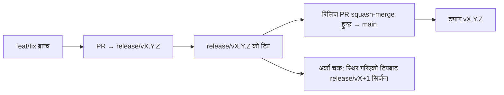

# Branching & Release Model (नेपाली)

🌐 **Languages:** 🇺🇸 [English](../../../../ops/BRANCHING_MODEL.md) · 🇪🇹 [am](../../../am/docs/ops/BRANCHING_MODEL.md) · 🇸🇦 [ar](../../../ar/docs/ops/BRANCHING_MODEL.md) · 🇦🇿 [az](../../../az/docs/ops/BRANCHING_MODEL.md) · 🇧🇬 [bg](../../../bg/docs/ops/BRANCHING_MODEL.md) · 🇧🇩 [bn](../../../bn/docs/ops/BRANCHING_MODEL.md) · 🇨🇿 [cs](../../../cs/docs/ops/BRANCHING_MODEL.md) · 🇩🇰 [da](../../../da/docs/ops/BRANCHING_MODEL.md) · 🇩🇪 [de](../../../de/docs/ops/BRANCHING_MODEL.md) · 🇬🇷 [el](../../../el/docs/ops/BRANCHING_MODEL.md) · 🇪🇸 [es](../../../es/docs/ops/BRANCHING_MODEL.md) · 🇪🇪 [et](../../../et/docs/ops/BRANCHING_MODEL.md) · 🇮🇷 [fa](../../../fa/docs/ops/BRANCHING_MODEL.md) · 🇫🇮 [fi](../../../fi/docs/ops/BRANCHING_MODEL.md) · 🇫🇷 [fr](../../../fr/docs/ops/BRANCHING_MODEL.md) · 🇮🇪 [ga](../../../ga/docs/ops/BRANCHING_MODEL.md) · 🇮🇳 [gu](../../../gu/docs/ops/BRANCHING_MODEL.md) · 🇳🇬 [ha](../../../ha/docs/ops/BRANCHING_MODEL.md) · 🇮🇱 [he](../../../he/docs/ops/BRANCHING_MODEL.md) · 🇮🇳 [hi](../../../hi/docs/ops/BRANCHING_MODEL.md) · 🇭🇷 [hr](../../../hr/docs/ops/BRANCHING_MODEL.md) · 🇭🇺 [hu](../../../hu/docs/ops/BRANCHING_MODEL.md) · 🇦🇲 [hy](../../../hy/docs/ops/BRANCHING_MODEL.md) · 🇮🇩 [id](../../../id/docs/ops/BRANCHING_MODEL.md) · 🇳🇬 [ig](../../../ig/docs/ops/BRANCHING_MODEL.md) · 🇮🇹 [it](../../../it/docs/ops/BRANCHING_MODEL.md) · 🇯🇵 [ja](../../../ja/docs/ops/BRANCHING_MODEL.md) · 🇬🇪 [ka](../../../ka/docs/ops/BRANCHING_MODEL.md) · 🇰🇭 [km](../../../km/docs/ops/BRANCHING_MODEL.md) · 🇮🇳 [kn](../../../kn/docs/ops/BRANCHING_MODEL.md) · 🇰🇷 [ko](../../../ko/docs/ops/BRANCHING_MODEL.md) · 🇱🇹 [lt](../../../lt/docs/ops/BRANCHING_MODEL.md) · 🇱🇻 [lv](../../../lv/docs/ops/BRANCHING_MODEL.md) · 🇮🇳 [ml](../../../ml/docs/ops/BRANCHING_MODEL.md) · 🇮🇳 [mr](../../../mr/docs/ops/BRANCHING_MODEL.md) · 🇲🇾 [ms](../../../ms/docs/ops/BRANCHING_MODEL.md) · 🇲🇹 [mt](../../../mt/docs/ops/BRANCHING_MODEL.md) · 🇲🇲 [my](../../../my/docs/ops/BRANCHING_MODEL.md) · 🇳🇱 [nl](../../../nl/docs/ops/BRANCHING_MODEL.md) · 🇳🇴 [no](../../../no/docs/ops/BRANCHING_MODEL.md) · 🇮🇳 [or](../../../or/docs/ops/BRANCHING_MODEL.md) · 🇮🇳 [pa](../../../pa/docs/ops/BRANCHING_MODEL.md) · 🇵🇭 [phi](../../../phi/docs/ops/BRANCHING_MODEL.md) · 🇵🇱 [pl](../../../pl/docs/ops/BRANCHING_MODEL.md) · 🇵🇹 [pt](../../../pt/docs/ops/BRANCHING_MODEL.md) · 🇧🇷 [pt-BR](../../../pt-BR/docs/ops/BRANCHING_MODEL.md) · 🇷🇴 [ro](../../../ro/docs/ops/BRANCHING_MODEL.md) · 🇷🇺 [ru](../../../ru/docs/ops/BRANCHING_MODEL.md) · 🇱🇰 [si](../../../si/docs/ops/BRANCHING_MODEL.md) · 🇸🇰 [sk](../../../sk/docs/ops/BRANCHING_MODEL.md) · 🇸🇮 [sl](../../../sl/docs/ops/BRANCHING_MODEL.md) · 🇷🇸 [sr](../../../sr/docs/ops/BRANCHING_MODEL.md) · 🇸🇪 [sv](../../../sv/docs/ops/BRANCHING_MODEL.md) · 🇰🇪 [sw](../../../sw/docs/ops/BRANCHING_MODEL.md) · 🇮🇳 [ta](../../../ta/docs/ops/BRANCHING_MODEL.md) · 🇮🇳 [te](../../../te/docs/ops/BRANCHING_MODEL.md) · 🇹🇭 [th](../../../th/docs/ops/BRANCHING_MODEL.md) · 🇹🇷 [tr](../../../tr/docs/ops/BRANCHING_MODEL.md) · 🇺🇦 [uk-UA](../../../uk-UA/docs/ops/BRANCHING_MODEL.md) · 🇵🇰 [ur](../../../ur/docs/ops/BRANCHING_MODEL.md) · 🇺🇿 [uz](../../../uz/docs/ops/BRANCHING_MODEL.md) · 🇻🇳 [vi](../../../vi/docs/ops/BRANCHING_MODEL.md) · 🇳🇬 [yo](../../../yo/docs/ops/BRANCHING_MODEL.md) · 🇨🇳 [zh-CN](../../../zh-CN/docs/ops/BRANCHING_MODEL.md) · 🇹🇼 [zh-TW](../../../zh-TW/docs/ops/BRANCHING_MODEL.md)

---

OmniRoute ले **समानान्तर-चक्र** रिलिज मोडेल प्रयोग गर्छ: सक्रिय चक्रका लागि समर्पित `release/vX.Y.Z`
ब्रान्च, प्रकाशित शृङ्खलाका लागि `main`, र त्यो चक्र रिलिज हुँदा अपरिवर्तनीय
`vX.Y.Z` ट्याग। कमिटहरू `release/*` _र_ `main` दुवैमा आएको देखिनु अपेक्षित हो — यो कुनै अलमल होइन।

मेन्टेनरसम्बन्धी विस्तृत जानकारी `CLAUDE.md` (कडा नियम #21) र
[RELEASE_CHECKLIST.md](./RELEASE_CHECKLIST.md) मा छ। यो पृष्ठ सार्वजनिक रूपमा
योगदानकर्ताहरूका लागि तयार गरिएको सारांश हो।

## एक नजरमा

| Ref              | भूमिका                                                                       |
| ---------------- | ---------------------------------------------------------------------------- |
| `release/vX.Y.Z` | **सक्रिय चक्र** — उक्त संस्करणका लागि दैनिक विकास र PR मर्जहरू               |
| `main`           | **प्रकाशित शृङ्खला** — रिलिज हुँदा squash-merge मार्फत चक्र प्राप्त गर्छ     |
| `vX.Y.Z` (ट्याग) | **रिलिज सूचक** — रिलिजको समयमा सिर्जना गरिने अपरिवर्तनीय “के रिलिज भयो” सूचक |



## मेरो PR ले कुन ब्रान्चलाई लक्षित गर्नुपर्छ?

**सक्रिय `release/vX.Y.Z` ब्रान्चलाई लक्षित गर्नुहोस् — `main` लाई होइन।**

1. सबैभन्दा उच्च संस्करण भएको खुला `release/v*` ब्रान्च पत्ता लगाउनुहोस् (यो लेख्दाको उदाहरण:
   `release/v3.8.49`)।
2. त्यसको टिपबाट ब्रान्च बनाउनुहोस् (`git fetch` + checkout / त्यसमाथि rebase)।
3. **base = उक्त `release/vX.Y.Z`** राखेर PR खोल्नुहोस्।

`main` दैनिक एकीकरण गरिने ब्रान्च होइन। `main` लाई लक्षित गरेर खोलिएका PR हरूलाई
सामान्यतया मर्ज गर्नुअघि पुनः लक्षित गर्नुपर्छ।

## रिलिज फ्रिज (समानान्तर चक्रहरू)

कुनै रिलिजलाई मिलान गरिँदै गर्दा, `release-freeze` लेबल भएको सूचक issue
खोलिन्छ। त्यसले **विकास रोक्दैन**:

- फ्रिज गरिएको `release/vX.Y.Z` उक्त रिलिजका लागि रिलिज क्याप्टेनको जिम्मामा हुन्छ।
- योगदानकर्ताहरूले काम मर्ज गरिरहन सकून् भनेर अर्को चक्रको `release/vX+1` फ्रिज गरिएको टिपबाट सिर्जना गरिन्छ।
- अझै पनि फ्रिज गरिएको ब्रान्चलाई लक्षित गर्ने खुला PR हरूलाई सक्रिय (सबैभन्दा उच्च)
  `release/v*` ब्रान्चतर्फ **पुनः लक्षित** गर्नुपर्छ।

आफूले चाहेको ब्रान्च मर्ज गर्न मिल्छ भनी मान्नुअघि कुनै खुला फ्रिज छ कि छैन जाँच्नुहोस्:

```bash
gh issue list --repo diegosouzapw/OmniRoute --label release-freeze --state open
```

मर्ज गर्ने प्रक्रिया (मालिकको `queue` लेबल → Mergify) को दस्तावेज
[MERGE_TRAIN.md](./MERGE_TRAIN.md) मा उपलब्ध छ।

## ब्रान्च र ट्याग दुवै किन?

| आर्टिफ्याक्ट     | जीवनकाल             | उद्देश्य                                                                       |
| ---------------- | ------------------- | ------------------------------------------------------------------------------ |
| `release/vX.Y.Z` | प्रगतिमा रहेको चक्र | समीक्षा गरिएका PR हरू सङ्कलन गर्छ, CI लाई सफल अवस्थामा राख्छ र PR को आधार बन्छ |
| ट्याग `vX.Y.Z`   | सधैँका लागि         | npm / GitHub Releases मा रिलिज भएका ठ्याक्कै बिटहरूलाई चिन्ह लगाउँछ            |

ब्रान्च कार्यशाला हो; ट्याग सिल गरिएको प्याकेज हो। `main` मा squash-merge गरिसकेपछि,
अघिल्लो रिलिज PR पूरा हुन नपर्खीकन अर्को चक्र `release/vX+1` मा जारी रहन्छ।

## सम्बन्धित दस्तावेजहरू

- [CONTRIBUTING.md](../../CONTRIBUTING.md) — सेटअप, परीक्षणहरू, PR जाँचसूची
- [RELEASE_CHECKLIST.md](./RELEASE_CHECKLIST.md) — रिलिजपूर्व प्रमाणीकरण
- [MERGE_TRAIN.md](./MERGE_TRAIN.md) — मर्ज क्यु र वैकल्पिक ट्रेन
- [RELEASE_GREEN.md](./RELEASE_GREEN.md) — रिलिज टिपलाई सफल अवस्थामा राख्ने तरिका
