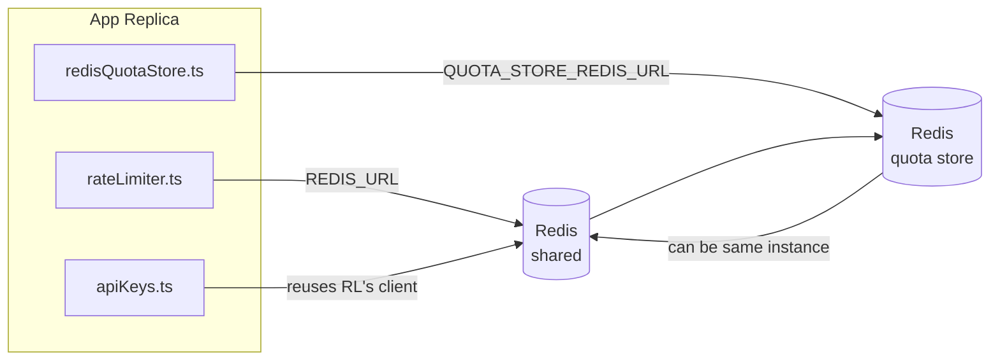

# Redis Production Configuration Guide (नेपाली)

🌐 **Languages:** 🇺🇸 [English](../../../../ops/REDIS_PRODUCTION_CONFIG.md) · 🇪🇹 [am](../../../am/docs/ops/REDIS_PRODUCTION_CONFIG.md) · 🇸🇦 [ar](../../../ar/docs/ops/REDIS_PRODUCTION_CONFIG.md) · 🇦🇿 [az](../../../az/docs/ops/REDIS_PRODUCTION_CONFIG.md) · 🇧🇬 [bg](../../../bg/docs/ops/REDIS_PRODUCTION_CONFIG.md) · 🇧🇩 [bn](../../../bn/docs/ops/REDIS_PRODUCTION_CONFIG.md) · 🇨🇿 [cs](../../../cs/docs/ops/REDIS_PRODUCTION_CONFIG.md) · 🇩🇰 [da](../../../da/docs/ops/REDIS_PRODUCTION_CONFIG.md) · 🇩🇪 [de](../../../de/docs/ops/REDIS_PRODUCTION_CONFIG.md) · 🇬🇷 [el](../../../el/docs/ops/REDIS_PRODUCTION_CONFIG.md) · 🇪🇸 [es](../../../es/docs/ops/REDIS_PRODUCTION_CONFIG.md) · 🇪🇪 [et](../../../et/docs/ops/REDIS_PRODUCTION_CONFIG.md) · 🇮🇷 [fa](../../../fa/docs/ops/REDIS_PRODUCTION_CONFIG.md) · 🇫🇮 [fi](../../../fi/docs/ops/REDIS_PRODUCTION_CONFIG.md) · 🇫🇷 [fr](../../../fr/docs/ops/REDIS_PRODUCTION_CONFIG.md) · 🇮🇪 [ga](../../../ga/docs/ops/REDIS_PRODUCTION_CONFIG.md) · 🇮🇳 [gu](../../../gu/docs/ops/REDIS_PRODUCTION_CONFIG.md) · 🇳🇬 [ha](../../../ha/docs/ops/REDIS_PRODUCTION_CONFIG.md) · 🇮🇱 [he](../../../he/docs/ops/REDIS_PRODUCTION_CONFIG.md) · 🇮🇳 [hi](../../../hi/docs/ops/REDIS_PRODUCTION_CONFIG.md) · 🇭🇷 [hr](../../../hr/docs/ops/REDIS_PRODUCTION_CONFIG.md) · 🇭🇺 [hu](../../../hu/docs/ops/REDIS_PRODUCTION_CONFIG.md) · 🇦🇲 [hy](../../../hy/docs/ops/REDIS_PRODUCTION_CONFIG.md) · 🇮🇩 [id](../../../id/docs/ops/REDIS_PRODUCTION_CONFIG.md) · 🇳🇬 [ig](../../../ig/docs/ops/REDIS_PRODUCTION_CONFIG.md) · 🇮🇹 [it](../../../it/docs/ops/REDIS_PRODUCTION_CONFIG.md) · 🇯🇵 [ja](../../../ja/docs/ops/REDIS_PRODUCTION_CONFIG.md) · 🇬🇪 [ka](../../../ka/docs/ops/REDIS_PRODUCTION_CONFIG.md) · 🇰🇭 [km](../../../km/docs/ops/REDIS_PRODUCTION_CONFIG.md) · 🇮🇳 [kn](../../../kn/docs/ops/REDIS_PRODUCTION_CONFIG.md) · 🇰🇷 [ko](../../../ko/docs/ops/REDIS_PRODUCTION_CONFIG.md) · 🇱🇹 [lt](../../../lt/docs/ops/REDIS_PRODUCTION_CONFIG.md) · 🇱🇻 [lv](../../../lv/docs/ops/REDIS_PRODUCTION_CONFIG.md) · 🇮🇳 [ml](../../../ml/docs/ops/REDIS_PRODUCTION_CONFIG.md) · 🇮🇳 [mr](../../../mr/docs/ops/REDIS_PRODUCTION_CONFIG.md) · 🇲🇾 [ms](../../../ms/docs/ops/REDIS_PRODUCTION_CONFIG.md) · 🇲🇹 [mt](../../../mt/docs/ops/REDIS_PRODUCTION_CONFIG.md) · 🇲🇲 [my](../../../my/docs/ops/REDIS_PRODUCTION_CONFIG.md) · 🇳🇱 [nl](../../../nl/docs/ops/REDIS_PRODUCTION_CONFIG.md) · 🇳🇴 [no](../../../no/docs/ops/REDIS_PRODUCTION_CONFIG.md) · 🇮🇳 [or](../../../or/docs/ops/REDIS_PRODUCTION_CONFIG.md) · 🇮🇳 [pa](../../../pa/docs/ops/REDIS_PRODUCTION_CONFIG.md) · 🇵🇭 [phi](../../../phi/docs/ops/REDIS_PRODUCTION_CONFIG.md) · 🇵🇱 [pl](../../../pl/docs/ops/REDIS_PRODUCTION_CONFIG.md) · 🇵🇹 [pt](../../../pt/docs/ops/REDIS_PRODUCTION_CONFIG.md) · 🇧🇷 [pt-BR](../../../pt-BR/docs/ops/REDIS_PRODUCTION_CONFIG.md) · 🇷🇴 [ro](../../../ro/docs/ops/REDIS_PRODUCTION_CONFIG.md) · 🇷🇺 [ru](../../../ru/docs/ops/REDIS_PRODUCTION_CONFIG.md) · 🇱🇰 [si](../../../si/docs/ops/REDIS_PRODUCTION_CONFIG.md) · 🇸🇰 [sk](../../../sk/docs/ops/REDIS_PRODUCTION_CONFIG.md) · 🇸🇮 [sl](../../../sl/docs/ops/REDIS_PRODUCTION_CONFIG.md) · 🇷🇸 [sr](../../../sr/docs/ops/REDIS_PRODUCTION_CONFIG.md) · 🇸🇪 [sv](../../../sv/docs/ops/REDIS_PRODUCTION_CONFIG.md) · 🇰🇪 [sw](../../../sw/docs/ops/REDIS_PRODUCTION_CONFIG.md) · 🇮🇳 [ta](../../../ta/docs/ops/REDIS_PRODUCTION_CONFIG.md) · 🇮🇳 [te](../../../te/docs/ops/REDIS_PRODUCTION_CONFIG.md) · 🇹🇭 [th](../../../th/docs/ops/REDIS_PRODUCTION_CONFIG.md) · 🇹🇷 [tr](../../../tr/docs/ops/REDIS_PRODUCTION_CONFIG.md) · 🇺🇦 [uk-UA](../../../uk-UA/docs/ops/REDIS_PRODUCTION_CONFIG.md) · 🇵🇰 [ur](../../../ur/docs/ops/REDIS_PRODUCTION_CONFIG.md) · 🇺🇿 [uz](../../../uz/docs/ops/REDIS_PRODUCTION_CONFIG.md) · 🇻🇳 [vi](../../../vi/docs/ops/REDIS_PRODUCTION_CONFIG.md) · 🇳🇬 [yo](../../../yo/docs/ops/REDIS_PRODUCTION_CONFIG.md) · 🇨🇳 [zh-CN](../../../zh-CN/docs/ops/REDIS_PRODUCTION_CONFIG.md) · 🇹🇼 [zh-TW](../../../zh-TW/docs/ops/REDIS_PRODUCTION_CONFIG.md)

---

## सिंहावलोकन

Redis OmniRoute मा एउटा **वैकल्पिक, कमजोर निर्भरता** हो — Redis उपलब्ध नभएको अवस्थामा अनुप्रयोगले सहज रूपमा कार्यक्षमता घटाउँछ (इन-मेमोरी
फल्ब्याकहरू)। उत्पादन वातावरणमा Redis ट्युन गर्दा चारवटा अलग-अलग
कार्यभारका लागि विलम्बता घट्छ:

| कार्यभार              | ड्राइभर                       | क्लाइन्ट फ्याक्ट्री                           | कुञ्जी ढाँचा                                                      |
| --------------------- | ----------------------------- | --------------------------------------------- | ----------------------------------------------------------------- |
| दर सीमित गर्ने        | `rateLimiter.ts`              | `getRedisClient()` — लेजी `ioredis` सिङ्गलटन  | `<prefix>rl:*` Lua‑एटोमिक दर सीमा विन्डोहरू                       |
| प्रमाणीकरण क्यास      | `apiKeys.ts`                  | `rateLimiter` को क्लाइन्ट पुनः प्रयोग गर्छ    | TTL सहितको `<prefix>auth:api_key:<sha256>`                        |
| कोटा स्टोर            | `redisQuotaStore.ts`          | छुट्टै `getRedisClient(url)` सिङ्गलटन         | प्रत्येक इन्स्ट्यान्सअनुसार कन्फिगर गर्न मिल्ने `<prefix>quota:*` |
| वार्मअप सर्किट ब्रेकर | `redisCircuitBreakerStore.ts` | `circuitBreakerFactory.ts` मा छुट्टै क्लाइन्ट | `<prefix>warmup:cb:<connectionId>`                                |

सबै चार कार्यभारले एउटै नेमस्पेस प्रिफिक्स साझा गर्छन्, जसले गर्दा OmniRoute अन्य एपहरूसँग एउटै
Redis इन्स्ट्यान्समा (उदाहरणका लागि `127.0.0.1:6379`) सह-अस्तित्वमा रहन सक्छ। [कुञ्जी नेमस्पेसिङ](#key-namespacing) हेर्नुहोस्।

---

## हालको कन्फिगरेसन (कोडका पूर्वनिर्धारित मानहरू)

| सेटिङ                                | मान                                                                  | स्थान                                                                                 |
| ------------------------------------ | -------------------------------------------------------------------- | ------------------------------------------------------------------------------------- |
| `REDIS_URL` वातावरणीय चर             | `redis://redis:6379` (compose), वैकल्पिक                             | `rateLimiter.ts:5`, `.env.example`                                                    |
| `REDIS_KEY_PREFIX` वातावरणीय चर      | `omniroute:` (पूर्वनिर्धारित)                                        | `rateLimiter.ts`, `redisQuotaStore.ts`, `redisCircuitBreakerStore.ts`, `.env.example` |
| `QUOTA_STORE_REDIS_URL` वातावरणीय चर | छुट्टै, `REDIS_URL` भन्दा फरक हुन सक्छ                               | `quota/storeFactory.ts`                                                               |
| `QUOTA_STORE_DRIVER`                 | `"sqlite"` (पूर्वनिर्धारित), `"redis"` वैकल्पिक                      | `quota/storeFactory.ts`                                                               |
| ioredis `maxRetriesPerRequest`       | `3`                                                                  | `rateLimiter.ts` क्लाइन्ट सिर्जना                                                     |
| `enableReadyCheck`                   | सेट नगरिएको (ioredis को पूर्वनिर्धारित: `true`)                      | —                                                                                     |
| `lazyConnect`                        | सेट नगरिएको (ioredis को पूर्वनिर्धारित: `false`)                     | —                                                                                     |
| `retryStrategy`                      | सेट नगरिएको (ioredis को पूर्वनिर्धारित: 200ms आधार, एक्स्पोनेन्सियल) | —                                                                                     |
| TLS / पासवर्ड / DB इन्डेक्स          | **कन्फिगर नगरिएको**                                                  | —                                                                                     |
| Sentinel / Cluster                   | **कन्फिगर नगरिएको** — स्ट्यान्डअलोन एकल-नोड मात्र                    | —                                                                                     |

---

## कुञ्जी नेमस्पेसिङ

OmniRoute ले होस्टमा चलिरहेका अन्य सेवाहरूसँग Redis इन्स्ट्यान्स साझा गर्छ। नेमस्पेसबिना,
`auth:api_key:<sha256>` वा `rl:*` जस्ता कुञ्जीहरू उही Redis प्रयोग गर्ने अन्य अनुप्रयोगका
कुञ्जीहरूसँग ठोक्किन सक्छन् (यो इन्स्ट्यान्स अन्य सेवाहरूसँगै `127.0.0.1:6379` मा Redis चलाउँछ)।

OmniRoute को **प्रत्येक** कुञ्जीमा प्रिफिक्स थप्न `REDIS_KEY_PREFIX` लाई कुनै खाली नभएको स्ट्रिङमा सेट गर्नुहोस्:

```bash
# .env — OmniRoute का सबै कुञ्जीहरू omniroute:rl:*, omniroute:auth:*, omniroute:quota:*, omniroute:warmup:cb:* बन्छन्
REDIS_KEY_PREFIX=omniroute:
```

- **पूर्वनिर्धारित:** `omniroute:` (`REDIS_KEY_PREFIX` सेट नगरिएको वा खाली हुँदा लागू हुन्छ)।
- **यसमा लागू हुन्छ:** दर लिमिटर + प्रमाणीकरण क्यास (`keyPrefix` मार्फत साझा गरिएको `ioredis` क्लाइन्ट) र
  कोटा स्टोर (`KEY_PREFIX = "${REDIS_KEY_PREFIX}quota"`) तथा वार्मअप सर्किट ब्रेकर
  (`KEY_PREFIX = "${REDIS_KEY_PREFIX}warmup:cb:"`)।
- Redis मा कुञ्जीहरू पहिल्यै अवस्थित हुँदा **प्रिफिक्स परिवर्तन गरेमा** पुराना कुञ्जीहरू छुटेर रहन्छन् (ती
  TTL / LRU मार्फत समाप्त हुन्छन्)। परिवर्तन गर्न सुरक्षित छ; माइग्रेसन आवश्यक पर्दैन। यसको एउटा अपवाद भनेको निषेधित भनी चिनो लगाइएको कनेक्सनको वार्मअप
  सर्किट-ब्रेकर कुञ्जी हो: यो TTL बिना स्थायी रूपमा भण्डारण हुन्छ, त्यसैले बाँकी रहेका कुञ्जीहरूलाई `redis-cli --scan --pattern '<old-prefix>warmup:cb:*'` प्रयोग गरेर सूचीबद्ध गरी मेटाउनुहोस्।
- **ioredis `keyPrefix`** ले लेख्दा स्वचालित रूपमा प्रिफिक्स अगाडि थप्छ **र** पढ्दा त्यसलाई हटाउँछ,
  त्यसैले अनुप्रयोग कोडले प्रिफिक्स कहिल्यै देख्दैन।

---

## उत्पादनका लागि सिफारिस गरिएका ट्युनिङहरू

### 1. कनेक्सन पूल / क्लाइन्ट विकल्पहरू (ioredis `Redis` constructor)

हालको कोडले कुनै अनुकूलित विकल्पबिना एउटा मात्र `new Redis(url)` सिर्जना गर्छ। उत्पादनमा
बहु‑रेप्लिका डिप्लोयमेन्टका लागि, कोडमा क्लाइन्ट फ्याक्ट्री पास गर्नुहोस् वा `getRedisClient()` लाई र्याप गर्नुहोस्:

```typescript
const redis = new Redis(REDIS_URL, {
  maxRetriesPerRequest: null, // पुनःप्रयासको सीमा छैन; retryStrategy लाई निर्णय गर्न दिनुहोस्
  enableReadyCheck: true, // कलहरू स्वीकार गर्नुअघि सर्भर तयार छ भनी प्रमाणित गर्नुहोस्
  lazyConnect: true, // निर्माण गर्दा जडान नगर्नुहोस्; पहिलो कलसम्म पर्खनुहोस्
  retryStrategy: (times) => {
    if (times > 10) return null; // 10 पुनःप्रयासपछि त्याग्नुहोस् → पछि पुनः जडान गर्नुहोस्
    return Math.min(times * 200, 5000); // 200ms, 400ms, …, अधिकतम 5s
  },
  enableAutoPipelining: true, // समवर्ती कमान्डहरूलाई एउटै TCP लेखाइमा संयोजन गर्नुहोस्
  keepAlive: 10000, // प्रत्येक 10s मा TCP keep‑alive
});
```

**मुख्य लाभ-हानिहरू:**

- `maxRetriesPerRequest: null` + `retryStrategy` — उत्पादनका लागि उपयुक्त, जसले गर्दा अस्थायी
  Redis पुनःसुरु हुँदा प्रत्येक अनुरोध तुरुन्तै असफल हुँदैन। `checkRateLimit()` मा भएको इन-मेमोरी फलब्याकले
  विफलता मार्गलाई सम्हाल्छ।
- `lazyConnect: true` — सर्भरले कनेक्सनहरू स्वीकार गर्न सुरु गर्नुअघि Redis सञ्चालनमा हुनुपर्ने
  स्टार्टअप निर्भरता हटाउँछ।
- `enableAutoPipelining: true` — समवर्ती रेट-लिमिट जाँचहरूका लागि राउन्ड-ट्रिप घटाउँछ;
  एउटै कनेक्सनमा >50 RPS हुँदा लाभदायक हुन्छ।

### 2. Redis सर्भर कन्फिगरेसन (`redis.conf`)

```
# मेमोरी
maxmemory 80%                        # OS पेज क्यासका लागि ठाउँ छोड्नुहोस्
maxmemory-policy allkeys-lru         # दबाबमा पुराना auth क्यास प्रविष्टिहरू हटाउनुहोस्

# स्थायित्व (वैकल्पिक — OmniRoute यसबिना पनि क्र्यास‑सुरक्षित छ)
save 300 1                           # ≥1 कुञ्जी परिवर्तन भएको छ भने कम्तीमा प्रत्येक 5 min मा स्न्यापसट लिनुहोस्
appendonly no                        # AOF आवश्यक छैन; डेटा पुनः सिर्जना गर्न सकिन्छ
appendfsync no                       # fsync को अतिरिक्त भार छैन (RDB पर्याप्त छ)

# नेटवर्किङ
timeout 0                            # निष्क्रिय कनेक्सन विच्छेद नगर्नुहोस्
tcp-keepalive 300                    # 5 min keep‑alive
tcp-backlog 511                      # अचानक बढ्ने लोडका लागि कनेक्सन ब्याकलग

# कार्यसम्पादन
hz 10                                # पूर्वनिर्धारित; विलम्बता‑संवेदनशील अवस्थाका लागि 100
activedefrag yes                     # फ्र्याग्मेन्टेसन >10% हुँदा स्वतः डिफ्र्याग्मेन्ट गर्नुहोस्
```

**`maxmemory-policy allkeys-lru` को लाभ-हानि:** मेमोरी
दबाबमा auth क्यास प्रविष्टिहरू हट्न सक्छन्। यो सुरक्षित छ — क्यास मिस हुँदा `setCachedApiKey` ले सधैँ पुनः भर्छ, र
SQLite फलब्याक आधिकारिक हुन्छ। रेट-लिमिटर Lua स्क्रिप्टले डिजाइनअनुसार छोटो समय टिक्ने
साना कुञ्जीहरू सिर्जना गर्छ।

### 3. Docker Compose सेटिङहरू

उत्पादन compose (`docker-compose.prod.yml`) ले `redis:8.6.2-alpine` प्रयोग गर्छ। निम्न थप्नुहोस्:

```yaml
redis:
  image: redis:8.6.2-alpine
  command:
    [
      "redis-server",
      "--maxmemory",
      "512mb",
      "--maxmemory-policy",
      "allkeys-lru",
      "--activedefrag",
      "yes",
      "--save",
      "300 1",
    ]
  healthcheck:
    test: ["CMD", "redis-cli", "ping"]
    interval: 10s
    timeout: 3s
    retries: 3
    start_period: 5s
```

### 4. बहु‑इन्स्टेन्स / स्केलिङसम्बन्धी विचारहरू

**सबै रेप्लिकाका लागि एउटै Redis** — रेट-लिमिटर Lua स्क्रिप्ट एउटै
आधिकारिक कुञ्जी स्पेसमा निर्भर हुन्छ। रेप्लिकाहरू पछाडि धेरै Redis इन्स्टेन्स प्रयोग गर्दा एटोमिकता
हराउँछ र बजेट दोब्बर हुन्छ। सबै एप्लिकेसन रेप्लिकाका लागि एउटै Redis (वा फेलओभरसहितको Redis Sentinel क्लस्टर)
प्रयोग गर्नुहोस्।

**कनेक्सन सङ्ख्या:** प्रत्येक एप्लिकेसन रेप्लिकाले Redis मा **2 TCP कनेक्सनहरू** खोल्छ
(रेट लिमिटर क्लाइन्ट + कोटा स्टोर क्लाइन्ट)। 10 रेप्लिकामा → 20 कनेक्सन हुन्छन्, जुन
पूर्वनिर्धारित Redis इन्स्टेन्सको 10k कनेक्सन सीमाभन्दा निकै कम हो।

### 5. अनुगमन

हेल्थ-चेक एन्डपोइन्टमार्फत उपलब्ध गराउनुहोस्:

```typescript
// src/app/api/monitoring/health/route.ts ले पहिल्यै rateLimiter फङ्सनहरू कल गर्छ
// Redis-विशिष्ट जाँचहरू थप्नुहोस्:
//   1. ioredis .ping() मार्फत PING विलम्बता
//   2. INFO memory मार्फत मेमोरी प्रयोग
//   3. INFO clients मार्फत कनेक्सन सङ्ख्या
//   4. maxmemory-policy को हिट दर (evicted_keys / keyspace_hits)
```

निगरानी गर्नुपर्ने मुख्य मेट्रिक्स:

- **हटाइएका कुञ्जीहरू / sec** — निरन्तर शून्यभन्दा बढी भएमा `maxmemory` बढाउनुहोस्
- **ब्लक गरिएका क्लाइन्टहरू** — शून्यभन्दा बढी हुनुले सुस्त Lua स्क्रिप्ट वा उच्च प्रतिस्पर्धा सङ्केत गर्छ
- **अस्वीकृत कनेक्सनहरू** — कनेक्सन सीमा पुगेको; 20 कनेक्सनमा विरलै हुन्छ

---

## आर्किटेक्चर रेखाचित्र



---

## सन्दर्भहरू

| फाइल                               | उद्देश्य                                                          |
| ---------------------------------- | ----------------------------------------------------------------- |
| `src/shared/utils/rateLimiter.ts`  | प्राथमिक Redis क्लाइन्ट, Lua दर-सीमा स्क्रिप्ट, इन-मेमोरी फलब्याक |
| `src/lib/db/apiKeys.ts`            | प्रमाणीकरण क्यास — Redis→SQLite फलब्याक                           |
| `src/lib/quota/redisQuotaStore.ts` | वैकल्पिक कोटा स्टोरका लागि छुट्टै Redis क्लाइन्ट                  |
| `src/lib/quota/storeFactory.ts`    | `sqlite` र `redis` कोटा ड्राइभरहरूबीच स्विच गर्छ                  |
| `docker-compose.prod.yml`          | उत्पादन Redis कन्टेनर (`redis:8.6.2-alpine` इमेज)                 |
| `.env.example`                     | Redis वातावरण चरहरूको दस्तावेजीकरण                                |
| `src/app/api/local/redis/`         | विकास कन्टेनर सञ्चालन व्यवस्थापनका लागि API रुटहरू                |
| `bin/cli/commands/redis.mjs`       | विकास कन्टेनर सञ्चालन व्यवस्थापनका लागि CLI कमाण्डहरू             |
