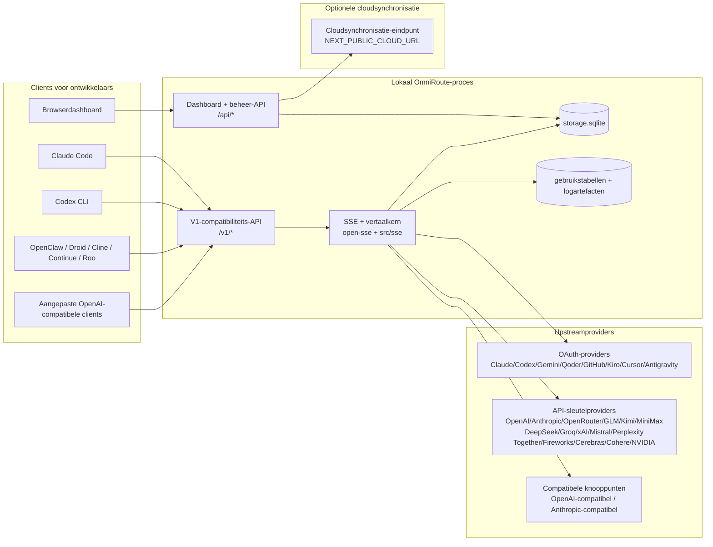
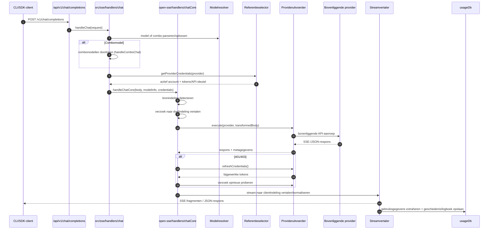
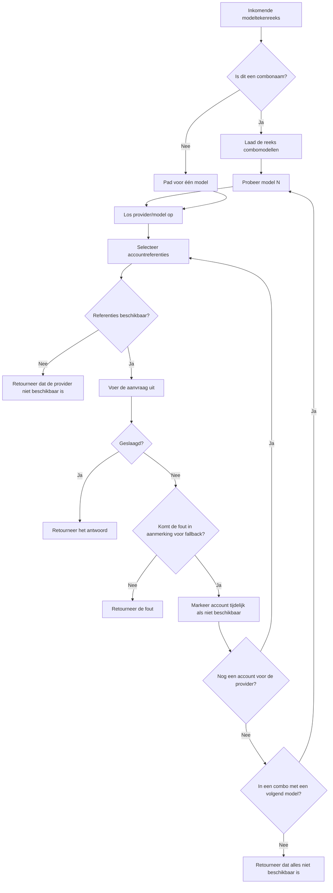
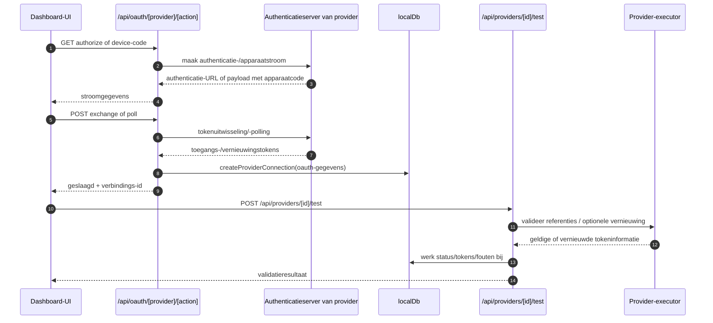
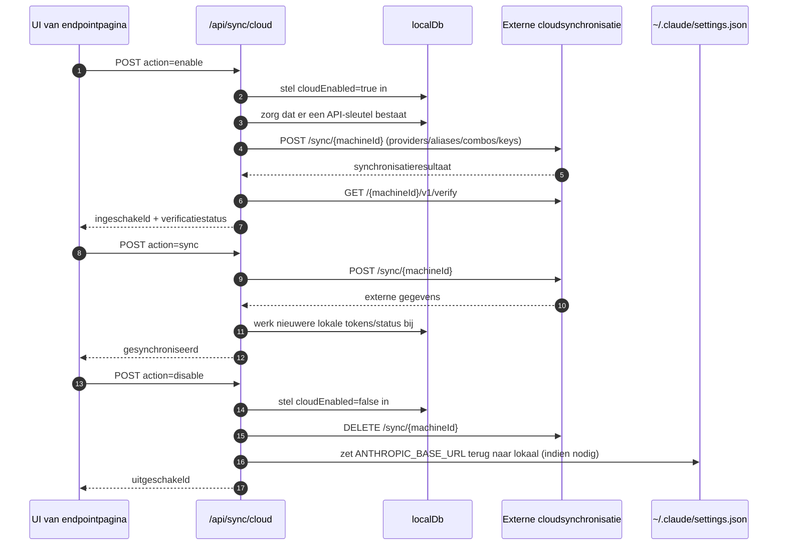
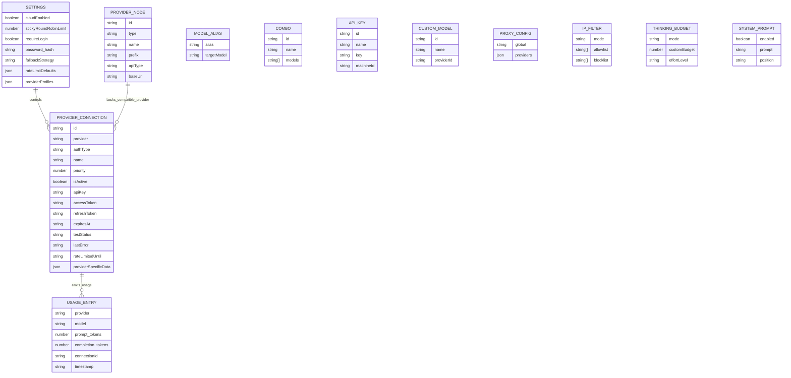
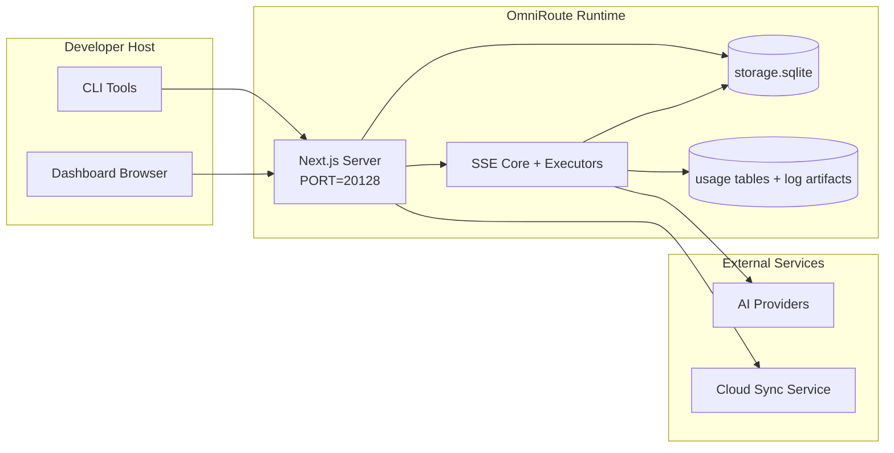

# OmniRoute Architecture (Nederlands)

🌐 **Languages:** 🇺🇸 [English](../../../../architecture/ARCHITECTURE.md) · 🇪🇹 [am](../../../am/docs/architecture/ARCHITECTURE.md) · 🇸🇦 [ar](../../../ar/docs/architecture/ARCHITECTURE.md) · 🇦🇿 [az](../../../az/docs/architecture/ARCHITECTURE.md) · 🇧🇬 [bg](../../../bg/docs/architecture/ARCHITECTURE.md) · 🇧🇩 [bn](../../../bn/docs/architecture/ARCHITECTURE.md) · 🇧🇦 [bs](../../../bs/docs/architecture/ARCHITECTURE.md) · 🇨🇿 [cs](../../../cs/docs/architecture/ARCHITECTURE.md) · 🇩🇰 [da](../../../da/docs/architecture/ARCHITECTURE.md) · 🇩🇪 [de](../../../de/docs/architecture/ARCHITECTURE.md) · 🇬🇷 [el](../../../el/docs/architecture/ARCHITECTURE.md) · 🇪🇸 [es](../../../es/docs/architecture/ARCHITECTURE.md) · 🇪🇪 [et](../../../et/docs/architecture/ARCHITECTURE.md) · 🇮🇷 [fa](../../../fa/docs/architecture/ARCHITECTURE.md) · 🇫🇮 [fi](../../../fi/docs/architecture/ARCHITECTURE.md) · 🇫🇷 [fr](../../../fr/docs/architecture/ARCHITECTURE.md) · 🇮🇪 [ga](../../../ga/docs/architecture/ARCHITECTURE.md) · 🇮🇳 [gu](../../../gu/docs/architecture/ARCHITECTURE.md) · 🇳🇬 [ha](../../../ha/docs/architecture/ARCHITECTURE.md) · 🇮🇱 [he](../../../he/docs/architecture/ARCHITECTURE.md) · 🇮🇳 [hi](../../../hi/docs/architecture/ARCHITECTURE.md) · 🇭🇷 [hr](../../../hr/docs/architecture/ARCHITECTURE.md) · 🇭🇺 [hu](../../../hu/docs/architecture/ARCHITECTURE.md) · 🇦🇲 [hy](../../../hy/docs/architecture/ARCHITECTURE.md) · 🇮🇩 [id](../../../id/docs/architecture/ARCHITECTURE.md) · 🇳🇬 [ig](../../../ig/docs/architecture/ARCHITECTURE.md) · 🇮🇹 [it](../../../it/docs/architecture/ARCHITECTURE.md) · 🇯🇵 [ja](../../../ja/docs/architecture/ARCHITECTURE.md) · 🇬🇪 [ka](../../../ka/docs/architecture/ARCHITECTURE.md) · 🇰🇭 [km](../../../km/docs/architecture/ARCHITECTURE.md) · 🇮🇳 [kn](../../../kn/docs/architecture/ARCHITECTURE.md) · 🇰🇷 [ko](../../../ko/docs/architecture/ARCHITECTURE.md) · 🇱🇹 [lt](../../../lt/docs/architecture/ARCHITECTURE.md) · 🇱🇻 [lv](../../../lv/docs/architecture/ARCHITECTURE.md) · 🇮🇳 [ml](../../../ml/docs/architecture/ARCHITECTURE.md) · 🇮🇳 [mr](../../../mr/docs/architecture/ARCHITECTURE.md) · 🇲🇾 [ms](../../../ms/docs/architecture/ARCHITECTURE.md) · 🇲🇹 [mt](../../../mt/docs/architecture/ARCHITECTURE.md) · 🇲🇲 [my](../../../my/docs/architecture/ARCHITECTURE.md) · 🇳🇵 [ne](../../../ne/docs/architecture/ARCHITECTURE.md) · 🇳🇴 [no](../../../no/docs/architecture/ARCHITECTURE.md) · 🇮🇳 [or](../../../or/docs/architecture/ARCHITECTURE.md) · 🇮🇳 [pa](../../../pa/docs/architecture/ARCHITECTURE.md) · 🇵🇭 [phi](../../../phi/docs/architecture/ARCHITECTURE.md) · 🇵🇱 [pl](../../../pl/docs/architecture/ARCHITECTURE.md) · 🇵🇹 [pt](../../../pt/docs/architecture/ARCHITECTURE.md) · 🇧🇷 [pt-BR](../../../pt-BR/docs/architecture/ARCHITECTURE.md) · 🇷🇴 [ro](../../../ro/docs/architecture/ARCHITECTURE.md) · 🇷🇺 [ru](../../../ru/docs/architecture/ARCHITECTURE.md) · 🇱🇰 [si](../../../si/docs/architecture/ARCHITECTURE.md) · 🇸🇰 [sk](../../../sk/docs/architecture/ARCHITECTURE.md) · 🇸🇮 [sl](../../../sl/docs/architecture/ARCHITECTURE.md) · 🇷🇸 [sr](../../../sr/docs/architecture/ARCHITECTURE.md) · 🇸🇪 [sv](../../../sv/docs/architecture/ARCHITECTURE.md) · 🇰🇪 [sw](../../../sw/docs/architecture/ARCHITECTURE.md) · 🇮🇳 [ta](../../../ta/docs/architecture/ARCHITECTURE.md) · 🇮🇳 [te](../../../te/docs/architecture/ARCHITECTURE.md) · 🇹🇭 [th](../../../th/docs/architecture/ARCHITECTURE.md) · 🇹🇷 [tr](../../../tr/docs/architecture/ARCHITECTURE.md) · 🇺🇦 [uk-UA](../../../uk-UA/docs/architecture/ARCHITECTURE.md) · 🇵🇰 [ur](../../../ur/docs/architecture/ARCHITECTURE.md) · 🇺🇿 [uz](../../../uz/docs/architecture/ARCHITECTURE.md) · 🇻🇳 [vi](../../../vi/docs/architecture/ARCHITECTURE.md) · 🇳🇬 [yo](../../../yo/docs/architecture/ARCHITECTURE.md) · 🇨🇳 [zh-CN](../../../zh-CN/docs/architecture/ARCHITECTURE.md) · 🇹🇼 [zh-TW](../../../zh-TW/docs/architecture/ARCHITECTURE.md)

---

🌐 **Languages:** 🇺🇸 [English](../../../../architecture/ARCHITECTURE.md) · 🇪🇹 [am](../../../am/docs/architecture/ARCHITECTURE.md) · 🇸🇦 [ar](../../../ar/docs/architecture/ARCHITECTURE.md) · 🇦🇿 [az](../../../az/docs/architecture/ARCHITECTURE.md) · 🇧🇬 [bg](../../../bg/docs/architecture/ARCHITECTURE.md) · 🇧🇩 [bn](../../../bn/docs/architecture/ARCHITECTURE.md) · 🇧🇦 [bs](../../../bs/docs/architecture/ARCHITECTURE.md) · 🇨🇿 [cs](../../../cs/docs/architecture/ARCHITECTURE.md) · 🇩🇰 [da](../../../da/docs/architecture/ARCHITECTURE.md) · 🇩🇪 [de](../../../de/docs/architecture/ARCHITECTURE.md) · 🇬🇷 [el](../../../el/docs/architecture/ARCHITECTURE.md) · 🇪🇸 [es](../../../es/docs/architecture/ARCHITECTURE.md) · 🇪🇪 [et](../../../et/docs/architecture/ARCHITECTURE.md) · 🇮🇷 [fa](../../../fa/docs/architecture/ARCHITECTURE.md) · 🇫🇮 [fi](../../../fi/docs/architecture/ARCHITECTURE.md) · 🇫🇷 [fr](../../../fr/docs/architecture/ARCHITECTURE.md) · 🇮🇪 [ga](../../../ga/docs/architecture/ARCHITECTURE.md) · 🇮🇳 [gu](../../../gu/docs/architecture/ARCHITECTURE.md) · 🇳🇬 [ha](../../../ha/docs/architecture/ARCHITECTURE.md) · 🇮🇱 [he](../../../he/docs/architecture/ARCHITECTURE.md) · 🇮🇳 [hi](../../../hi/docs/architecture/ARCHITECTURE.md) · 🇭🇷 [hr](../../../hr/docs/architecture/ARCHITECTURE.md) · 🇭🇺 [hu](../../../hu/docs/architecture/ARCHITECTURE.md) · 🇦🇲 [hy](../../../hy/docs/architecture/ARCHITECTURE.md) · 🇮🇩 [id](../../../id/docs/architecture/ARCHITECTURE.md) · 🇳🇬 [ig](../../../ig/docs/architecture/ARCHITECTURE.md) · 🇮🇹 [it](../../../it/docs/architecture/ARCHITECTURE.md) · 🇯🇵 [ja](../../../ja/docs/architecture/ARCHITECTURE.md) · 🇬🇪 [ka](../../../ka/docs/architecture/ARCHITECTURE.md) · 🇰🇭 [km](../../../km/docs/architecture/ARCHITECTURE.md) · 🇮🇳 [kn](../../../kn/docs/architecture/ARCHITECTURE.md) · 🇰🇷 [ko](../../../ko/docs/architecture/ARCHITECTURE.md) · 🇱🇹 [lt](../../../lt/docs/architecture/ARCHITECTURE.md) · 🇱🇻 [lv](../../../lv/docs/architecture/ARCHITECTURE.md) · 🇮🇳 [ml](../../../ml/docs/architecture/ARCHITECTURE.md) · 🇮🇳 [mr](../../../mr/docs/architecture/ARCHITECTURE.md) · 🇲🇾 [ms](../../../ms/docs/architecture/ARCHITECTURE.md) · 🇲🇹 [mt](../../../mt/docs/architecture/ARCHITECTURE.md) · 🇲🇲 [my](../../../my/docs/architecture/ARCHITECTURE.md) · 🇳🇵 [ne](../../../ne/docs/architecture/ARCHITECTURE.md) · 🇳🇴 [no](../../../no/docs/architecture/ARCHITECTURE.md) · 🇮🇳 [or](../../../or/docs/architecture/ARCHITECTURE.md) · 🇮🇳 [pa](../../../pa/docs/architecture/ARCHITECTURE.md) · 🇵🇭 [phi](../../../phi/docs/architecture/ARCHITECTURE.md) · 🇵🇱 [pl](../../../pl/docs/architecture/ARCHITECTURE.md) · 🇵🇹 [pt](../../../pt/docs/architecture/ARCHITECTURE.md) · 🇧🇷 [pt-BR](../../../pt-BR/docs/architecture/ARCHITECTURE.md) · 🇷🇴 [ro](../../../ro/docs/architecture/ARCHITECTURE.md) · 🇷🇺 [ru](../../../ru/docs/architecture/ARCHITECTURE.md) · 🇱🇰 [si](../../../si/docs/architecture/ARCHITECTURE.md) · 🇸🇰 [sk](../../../sk/docs/architecture/ARCHITECTURE.md) · 🇸🇮 [sl](../../../sl/docs/architecture/ARCHITECTURE.md) · 🇷🇸 [sr](../../../sr/docs/architecture/ARCHITECTURE.md) · 🇸🇪 [sv](../../../sv/docs/architecture/ARCHITECTURE.md) · 🇰🇪 [sw](../../../sw/docs/architecture/ARCHITECTURE.md) · 🇮🇳 [ta](../../../ta/docs/architecture/ARCHITECTURE.md) · 🇮🇳 [te](../../../te/docs/architecture/ARCHITECTURE.md) · 🇹🇭 [th](../../../th/docs/architecture/ARCHITECTURE.md) · 🇹🇷 [tr](../../../tr/docs/architecture/ARCHITECTURE.md) · 🇺🇦 [uk-UA](../../../uk-UA/docs/architecture/ARCHITECTURE.md) · 🇵🇰 [ur](../../../ur/docs/architecture/ARCHITECTURE.md) · 🇺🇿 [uz](../../../uz/docs/architecture/ARCHITECTURE.md) · 🇻🇳 [vi](../../../vi/docs/architecture/ARCHITECTURE.md) · 🇳🇬 [yo](../../../yo/docs/architecture/ARCHITECTURE.md) · 🇨🇳 [zh-CN](../../../zh-CN/docs/architecture/ARCHITECTURE.md) · 🇹🇼 [zh-TW](../../../zh-TW/docs/architecture/ARCHITECTURE.md)

_Laatst bijgewerkt: 2026-06-28_

## Samenvatting

OmniRoute is een lokale AI-routeringsgateway en een dashboard, gebouwd met Next.js.
Het biedt één OpenAI-compatibel endpoint (`/v1/*`) en routeert verkeer over meerdere upstreamproviders met vertaling, fallback, tokenvernieuwing en gebruiksregistratie.

Kernfunctionaliteiten:

- OpenAI-compatibel API-oppervlak voor CLI/tools (355 providers, 108 executors)
- Vertaling van requests/responses tussen providerformaten
- Modelcombo-fallback (reeks van meerdere modellen)
- Gestructureerde combostappen (`provider + model + connection`) met runtimevolgorde op basis van `compositeTiers`
- Fallback op accountniveau (meerdere accounts per provider)
- Quotumcontrole vooraf en quotumbewuste P2C-accountselectie in het hoofdpad voor chats
- Beheer van providerverbindingen via OAuth en API-sleutels (22 OAuth-providermodules)
- Genereren van embeddings via `/v1/embeddings` (18 providers)
- Genereren van afbeeldingen via `/v1/images/generations` (10+ providers, 20+ modellen)
- Audiotranscriptie via `/v1/audio/transcriptions` (18 providers)
- Tekst-naar-spraak via `/v1/audio/speech` (24 ingebouwde providers)
- Genereren van video's via `/v1/videos/generations` (ComfyUI + SD WebUI)
- Genereren van muziek via `/v1/music/generations` (ComfyUI)
- Zoeken op het web via `/v1/search` (20 providers)
- Moderatie via `/v1/moderations`
- Herrangschikking via `/v1/rerank`
- Parseren van think-tags (`<think>...</think>`) voor redeneermodellen
- Opschonen van responses voor strikte compatibiliteit met de OpenAI SDK
- Normalisatie van rollen (developer→system, system→user) voor compatibiliteit tussen providers
- Conversie van gestructureerde uitvoer (json_schema → Gemini responseSchema)
- Lokale persistentie voor providers, sleutels, aliassen, combo's, instellingen en prijzen (122 DB-modules)
- Registratie van gebruik/kosten en logging van requests
- Optionele cloudsynchronisatie voor synchronisatie tussen meerdere apparaten en van status
- IP-allowlist/blocklist voor API-toegangsbeheer
- Beheer van denkbudgetten (passthrough/automatisch/aangepast/adaptief)
- Globale injectie van systeemprompts
- Sessietracking en fingerprinting
- Verbeterde snelheidsbeperking per account met providerspecifieke profielen
- Circuit-breakerpatroon voor robuustheid van providers
- Bescherming tegen thundering herd met mutexvergrendeling
- Deduplicatiecache voor requests op basis van handtekeningen
- Domeinlaag: kostenregels, fallbackbeleid, uitsluitingsbeleid
- Context Relay: samenvattingen voor sessieoverdracht ten behoeve van continuïteit bij accountrotatie
- Persistentie van domeinstatus (SQLite-write-throughcache voor fallbacks, budgetten, uitsluitingen en circuit breakers)
- Beleidsengine voor gecentraliseerde evaluatie van requests (uitsluiting → budget → fallback)
- Requesttelemetrie met aggregatie van p50/p95/p99-latentie
- Telemetrie voor combodoelen en historische status van combodoelen via `combo_execution_key` / `combo_step_id`
- Correlatie-ID (X-Request-Id) voor end-to-endtracering
- Logging voor compliance-audits met opt-out per API-sleutel
- Evaluatieframework voor kwaliteitsborging van LLM's
- Statusdashboard met realtime circuit-breakerstatus van providers
- MCP-server (110 tools) met 3 transporten (stdio/SSE/Streamable HTTP)
- A2A-server (JSON-RPC 2.0 + SSE) met vaardigheden en taaklevenscyclus
- Geheugensysteem (extractie, injectie, ophalen, samenvatten)
- Vaardighedensysteem (register, executor, sandbox, ingebouwde vaardigheden)
- MITM-proxy met certificaatbeheer en DNS-afhandeling
- Middleware ter bescherming tegen promptinjectie
- Pipeline voor promptcompressie met Caveman, RTK, gestapelde pipelines, compressiecombo's, taalpakketten en analyses
- ACP-register (Agent Communication Protocol)
- Modulaire OAuth-providers (22 afzonderlijke modules onder `src/lib/oauth/providers/`)
- Scripts voor verwijderen/volledig verwijderen
- Actie voor herstel van de OAuth-omgeving
- WebSocket-bridge voor OpenAI-compatibele WS-clients (`/v1/ws`)
- Beheer van synchronisatietokens (uitgeven/intrekken, downloaden van ETag-geversioneerde configuratiebundels)
- GLM Thinking (`glmt`) als volwaardige providerpreset
- Hybride tokentelling (`/messages/count_tokens` aan providerzijde met geschatte telling als fallback)
- Automatisch vooraf vullen van modelaliassen (30+ normalisaties van dialecten tussen proxy's bij het opstarten)
- Veilig uitgaand ophalen met SSRF-beveiliging, blokkering van privé-URL's en configureerbare nieuwe pogingen
- Cooldownbewuste nieuwe chatpogingen met configureerbare `requestRetry` en `maxRetryIntervalSec`
- Validatie van de runtimeomgeving met Zod bij het opstarten
- Compliance-audit v2 met paginering, CRUD-events voor providers en validatielogging voor door SSRF geblokkeerde requests

Primair runtimemodel:

- Next.js-app-routes onder `src/app/api/*` implementeren zowel dashboard-API's als compatibiliteits-API's
- Een gedeelde SSE-/routeringskern in `src/sse/*` + `open-sse/*` verwerkt provideruitvoering, vertaling, streaming, fallback en gebruik

## Referentiediagrammen

De canonieke, versiebeheerde Mermaid-bronbestanden voor het v3.8.0-platform bevinden zich in
[`docs/diagrams/`](../diagrams/README.md). Ter oriëntatie worden hieronder twee diagrammen weergegeven;
de overige zijn gekoppeld vanuit hun domeinspecifieke handleidingen.


> Bron: [diagrams/request-pipeline.mmd](../diagrams/request-pipeline.mmd)


> Bron: [diagrams/resilience-3layers.mmd](../diagrams/resilience-3layers.mmd) — ook gekoppeld vanuit
> [RESILIENCE_GUIDE.md](./RESILIENCE_GUIDE.md) en de weerbaarheidsreferentie in `CLAUDE.md`.

## Reikwijdte en grenzen

### Binnen de reikwijdte

- Lokale gatewayruntime
- Beheer-API's van het dashboard
- Providerauthenticatie en tokenvernieuwing
- Aanvraagvertaling en SSE-streaming
- Lokale status- en gebruikspersistentie
- Optionele orchestratie van cloudsynchronisatie

### Buiten de reikwijdte

- Implementatie van de cloudservice achter `NEXT_PUBLIC_CLOUD_URL`
- SLA/control plane van de provider buiten het lokale proces
- De externe CLI-binaire bestanden zelf (Claude CLI, Codex CLI, enz.)

## Dashboardonderdelen (huidig)

Hoofdpagina's onder `src/app/(dashboard)/dashboard/`:

- `/dashboard` — snelstart + provideroverzicht
- `/dashboard/endpoint` — endpointproxy + MCP + A2A + API-endpointtabbladen
- `/dashboard/providers` — providerverbindingen en referenties
- `/dashboard/combos` — combostrategieën, sjablonen, stapsgewijze builder, modelrouteringsregels, handmatig opgeslagen volgorde
- `/dashboard/auto-combo` — Auto Combo Engine: scoringsgewichten, moduspakketten, voorinstellingen voor virtuele fabrieken, telemetrie
- `/dashboard/costs` — kostenaggregatie en inzicht in prijzen
- `/dashboard/analytics` — gebruiksanalyses, evaluaties, status van combodoelen
- `/dashboard/limits` — quota- en frequentiebeheer
- `/dashboard/cli-tools` — CLI-onboarding, runtimedetectie, configuratiegeneratie
- `/dashboard/agents` — gedetecteerde ACP-agents + registratie van aangepaste agents
- `/dashboard/cloud-agents` — in de cloud gehoste agenttaken (Codex Cloud, Devin, Jules) en taaklevenscyclus
- `/dashboard/skills` — A2A-vaardighedenregister, uitvoering in sandbox, ingebouwde vaardighedencatalogus
- `/dashboard/memory` — inspectie en ophalen van persistent gespreksgeheugen
- `/dashboard/webhooks` — uitgaande webhookabonnementen, rotatie van geheimen, statistieken voor nieuwe pogingen
- `/dashboard/batch` — indienen van batchtaken en voortgang
- `/dashboard/cache` — statistieken voor read-through- en redeneercache, beheer voor verwijdering
- `/dashboard/playground` — interactieve chatomgeving voor elke geconfigureerde combo of elk geconfigureerd model
- `/dashboard/changelog` — changelogviewer in de app (geeft `CHANGELOG.md` weer)
- `/dashboard/system` — runtimediagnostiek, versie-informatie, interface voor omgevingsvalidatie
- `/dashboard/onboarding` — wizard voor de eerste configuratie van nieuwe installaties
- `/dashboard/media` — experimenteeromgeving voor afbeeldingen, video en muziek
- `/dashboard/search-tools` — testen van zoekproviders en zoekgeschiedenis
- `/dashboard/health` — uptime, circuitbreakers, frequentielimieten, sessies met quotabewaking
- `/dashboard/logs` — aanvraag-, proxy-, audit- en consolelogboeken
- `/dashboard/settings` — tabbladen voor systeeminstellingen (algemeen, routering, standaardwaarden voor combo's, enz.)
- `/dashboard/context/caveman` — Caveman-compressieregels, taalpakketten, voorbeeldweergave en uitvoermodus
- `/dashboard/context/rtk` — RTK-filters voor opdrachtuitvoer, voorbeeldweergave en instellingen voor runtimeveiligheid
- `/dashboard/context/combos` — benoemde compressiepijplijnen die aan routeringscombo's zijn toegewezen
- `/dashboard/translator` — inspectie van de vertaler en voorbeeldweergave van conversie van aanvraagindelingen
- `/dashboard/audit` — browser voor compliance-auditlogboeken met paginering en gestructureerde metadata
- `/dashboard/usage` — gebruiksbrowser per aanvraag, gekoppeld aan `usage_history`
- `/dashboard/compression` — compressieanalyses, statistieken en pijplijntoewijzing
- `/dashboard/api-manager` — levenscyclus van API-sleutels en modelmachtigingen

## Systeemcontext op hoog niveau



## Kerncomponenten van de runtime

## 1) API- en routeringslaag (Next.js App Routes)

Belangrijkste mappen:

- `src/app/api/v1/*` en `src/app/api/v1beta/*` voor compatibiliteits-API's
- `src/app/api/*` voor beheer- en configuratie-API's
- Next-rewrites in `next.config.mjs` wijzen `/v1/*` toe aan `/api/v1/*`

Belangrijke compatibiliteitsroutes:

- `src/app/api/v1/chat/completions/route.ts`
- `src/app/api/v1/messages/route.ts`
- `src/app/api/v1/responses/route.ts`
- `src/app/api/v1/models/route.ts` — bevat aangepaste modellen met `custom: true`
- `src/app/api/v1/embeddings/route.ts` — genereren van embeddings (6 providers)
- `src/app/api/v1/images/generations/route.ts` — genereren van afbeeldingen (4+ providers, incl. Antigravity/Nebius)
- `src/app/api/v1/messages/count_tokens/route.ts`
- `src/app/api/v1/providers/[provider]/chat/completions/route.ts` — speciale chatroute per provider
- `src/app/api/v1/providers/[provider]/embeddings/route.ts` — speciale embeddingsroute per provider
- `src/app/api/v1/providers/[provider]/images/generations/route.ts` — speciale afbeeldingsroute per provider
- `src/app/api/v1beta/models/route.ts`
- `src/app/api/v1beta/models/[...path]/route.ts`

Beheerdomeinen:

- Authenticatie/instellingen: `src/app/api/auth/*`, `src/app/api/settings/*`
- Providers/verbindingen: `src/app/api/providers*`
- Providerknooppunten: `src/app/api/provider-nodes*`
- Aangepaste modellen: `src/app/api/provider-models` (GET/POST/DELETE)
- Modelcatalogus: `src/app/api/models/route.ts` (GET)
- Proxyconfiguratie: `src/app/api/settings/proxy` (GET/PUT/DELETE) + `src/app/api/settings/proxy/test` (POST)
- OAuth: `src/app/api/oauth/*`
- Sleutels/aliassen/combinaties/prijzen: `src/app/api/keys*`, `src/app/api/models/alias`, `src/app/api/combos*`, `src/app/api/pricing`
- Gebruik: `src/app/api/usage/*`
- Synchronisatie/cloud: `src/app/api/sync/*`, `src/app/api/cloud/*`
- Hulpprogramma's voor CLI-tooling: `src/app/api/cli-tools/*`
- IP-filter: `src/app/api/settings/ip-filter` (GET/PUT)
- Denkbudget: `src/app/api/settings/thinking-budget` (GET/PUT)
- Systeemprompt: `src/app/api/settings/system-prompt` (GET/PUT)
- Compressie: `src/app/api/settings/compression`, `src/app/api/compression/*` en
  `src/app/api/context/*`
- Sessies: `src/app/api/sessions` (GET)
- Snelheidslimieten: `src/app/api/rate-limits` (GET)
- Veerkracht: `src/app/api/resilience` (GET/PATCH) — aanvraagwachtrij, afkoelperiode voor verbindingen, provideronderbreker, configuratie voor wachten op de afkoelperiode
- Veerkracht opnieuw instellen: `src/app/api/resilience/reset` (POST) — provideronderbrekers opnieuw instellen
- Cachestatistieken: `src/app/api/cache/stats` (GET/DELETE)
- Telemetrie: `src/app/api/telemetry/summary` (GET)
- Budget: `src/app/api/usage/budget` (GET/POST)
- Terugvalketens: `src/app/api/fallback/chains` (GET/POST/DELETE)
- Compliance-audit: `src/app/api/compliance/audit-log` (GET, met paginering + gestructureerde metadata)
- Evaluaties: `src/app/api/evals` (GET/POST), `src/app/api/evals/[suiteId]` (GET)
- Beleidsregels: `src/app/api/policies` (GET/POST)
- Synchronisatietokens: `src/app/api/sync/tokens` (GET/POST), `src/app/api/sync/tokens/[id]` (GET/DELETE)
- Configuratiebundel: `src/app/api/sync/bundle` (GET, met ETag geversioneerde momentopname van instellingen/providers/combinaties/sleutels)
- WebSocket: `src/app/api/v1/ws/route.ts` — Upgrade-handler voor OpenAI-compatibele WS-clients

## 2) SSE + vertaalkern

Hoofdstroommodules:

- Ingang: `src/sse/handlers/chat.ts`
- Kernorkestratie: `open-sse/handlers/chatCore.ts`
- Uitvoeringsadapters voor providers: `open-sse/executors/*`
- Formaatdetectie/providerconfiguratie: `open-sse/services/provider.ts`
- Modelparsering/-resolutie: `src/sse/services/model.ts`, `open-sse/services/model.ts`
- Logica voor accountfallback: `open-sse/services/accountFallback.ts`
- Vertaalregister: `open-sse/translator/index.ts`
- Streamtransformaties: `open-sse/utils/stream.ts`, `open-sse/utils/streamHandler.ts`
- Extractie/normalisatie van gebruiksgegevens: `open-sse/utils/usageTracking.ts`
- Parser voor denktags: `open-sse/utils/thinkTagParser.ts`
- Handler voor embeddings: `open-sse/handlers/embeddings.ts`
- Providerregister voor embeddings: `open-sse/config/embeddingRegistry.ts`
- Handler voor het genereren van afbeeldingen: `open-sse/handlers/imageGeneration.ts`
- Providerregister voor afbeeldingen: `open-sse/config/imageRegistry.ts`
- Opschoning van responsen: `open-sse/handlers/responseSanitizer.ts`
- Rolnormalisatie: `open-sse/services/roleNormalizer.ts`

Services (bedrijfslogica):

- Accountselectie/-scoring: `open-sse/services/accountSelector.ts`
- Beheer van de contextlevenscyclus: `open-sse/services/contextManager.ts`
- Handhaving van IP-filters: `open-sse/services/ipFilter.ts`
- Sessietracking: `open-sse/services/sessionManager.ts`
- Ontdubbeling van aanvragen: `open-sse/services/signatureCache.ts`
- Injectie van systeemprompts: `open-sse/services/systemPrompt.ts`
- Beheer van denkbudgetten: `open-sse/services/thinkingBudget.ts`
- Modelroutering met jokertekens: `open-sse/services/wildcardRouter.ts`
- Beheer van snelheidslimieten: `open-sse/services/rateLimitManager.ts`
- Circuitonderbreker: `src/shared/utils/circuitBreaker.ts`
- Contextoverdracht: `open-sse/services/contextHandoff.ts` — genereren en injecteren van overdrachtssamenvattingen voor de contextdoorgiftestrategie
- Compressie: `open-sse/services/compression/*` — proactieve compressie vóór vertaling door de provider;
  omvat Caveman-regels, RTK-filters, gestapelde pijplijnen, compressiecombinaties, statistieken en validatie
- Codex-quotumophaler: `open-sse/services/codexQuotaFetcher.ts` — haalt het Codex-quotum op voor beslissingen over contextdoorgifte
- Afkoelingsbewuste nieuwe poging: `src/sse/services/cooldownAwareRetry.ts` — nieuwe pogingen per model na een afkoelingsperiode, met configureerbare `requestRetry` / `maxRetryIntervalSec`
- Veilig uitgaand ophalen: `src/shared/network/safeOutboundFetch.ts` — beveiligde provider-/modelophaling met SSRF-beveiliging, blokkering van privé-URL's, nieuwe pogingen en time-out
- Bewaking van uitgaande URL's: `src/shared/network/outboundUrlGuard.ts` — valideert provider-URL's aan de hand van privé-/localhost-CIDR-bereiken
- Standaardwaarden voor provideraanvragen: `open-sse/services/providerRequestDefaults.ts` — standaardwaarden op providerniveau voor `maxTokens`, `temperature`, `thinkingBudgetTokens`
- GLM-providerconstanten: `open-sse/config/glmProvider.ts` — gedeelde GLM-modellen, quotum-URL's en GLMT-time-out/-standaardwaarden
- Antigravity-upstream: `open-sse/config/antigravityUpstream.ts` — constanten voor de basis-URL en het detectiepad
- Codex-clientconstanten: `open-sse/config/codexClient.ts` — geversioneerde waarden voor user-agent en clientversie
- Initiële modelaliassen: `src/lib/modelAliasSeed.ts` — initialiseert bij het opstarten meer dan 30 dialectaliassen voor verschillende proxy's

Domeinlaagmodules:

- Kostenregels/-budgetten: `src/domain/costRules.ts`
- Fallbackbeleid: `src/domain/fallbackPolicy.ts`
- Combinatieresolver: `src/domain/comboResolver.ts`
- Uitsluitingsbeleid: `src/domain/lockoutPolicy.ts`
- Beleidsengine: `src/domain/policyEngine.ts` — gecentraliseerde evaluatie van uitsluiting → budget → fallback
- Catalogus met foutcodes: `src/shared/constants/errorCodes.ts`
- Aanvraag-ID: `src/shared/utils/requestId.ts`
- Ophaaltime-out: `src/shared/utils/fetchTimeout.ts`
- Aanvraagtelemetrie: `src/shared/utils/requestTelemetry.ts`
- Compliance/audit: `src/lib/compliance/index.ts`
- Evaluatierunner: `src/lib/evals/evalRunner.ts`
- Persistentie van domeinstatus: `src/lib/db/domainState.ts` — SQLite-CRUD voor fallbackketens, budgetten, kostengeschiedenis, uitsluitingsstatus en circuitonderbrekers

OAuth-providermodules (22 afzonderlijke bestanden onder `src/lib/oauth/providers/`):

- Registerindex: `src/lib/oauth/providers/index.ts`
- Afzonderlijke providers: `agy.ts`, `antigravity.ts`, `claude.ts`, `cline.ts`, `codebuddy-cn.ts`, `codex.ts`, `cursor.ts`, `devin-desktop.ts`, `ghe-copilot.ts`, `github.ts`, `gitlab-duo.ts`, `grok-cli-oauth.ts`, `grok-cli.ts`, `kilocode.ts`, `kimi-coding.ts`, `kiro.ts`, `openference.ts`, `qoder.ts`, `trae.ts`, `xai-oauth.ts`, `zed-hosted.ts`, `zed.ts`
- Dunne wrapper: `src/lib/oauth/providers.ts` — exporteert opnieuw vanuit afzonderlijke modules

## 5) Ingebedde services (v3.8.4)

OmniRoute kan lokaal uitgevoerde AI-toolprocessen, **ingebedde services** genoemd, installeren, bewaken en er verzoeken naartoe routeren. Er worden er vijf meegeleverd: 9Router, CLIProxyAPI, Bifrost, Mux en Dario.

Architectuurlagen:

- **UI** (`/dashboard/providers/services`) — pagina met twee tabbladen, levenscyclusbesturing, live logstreaming, beheer van API-sleutels en (voor 9Router) een ingebedde native UI via een interne reverse proxy.
- **API** (`/api/services/{name}/*`) — 11 endpoints voor 9Router, 10 voor CLIProxyAPI en elk 8 voor Bifrost / Mux / Dario, allemaal geclassificeerd als **LOCAL_ONLY** (harde regel #17). Een gedeeld SSE-endpoint `GET /api/services/[name]/logs` bedient beide services.
- **Supervisor** (`src/lib/services/`) — de generieke klasse `ServiceSupervisor` omhult `child_process.spawn`, beheert een ringbuffer van 5 MB voor SSE-logstreaming, een lus voor statuscontroles, een atomair bewerkingsslot en een gecontroleerde afsluiting via SIGTERM→SIGKILL. `bootstrap.ts` koppelt alle geconfigureerde services bij het starten van het proces.
- **Provider/executor** (`open-sse/executors/ninerouter.ts`) — 9Router wordt beschikbaar gesteld als een echte provider. Modellen krijgen het voorvoegsel `9router/{sub}/{model}` en worden elke 5 minuten gesynchroniseerd vanuit het endpoint `/v1/models` van 9Router.

Verdieping: `docs/frameworks/EMBEDDED-SERVICES.md`

## Belangrijke subsystemen (v3.8.0)

### A. Auto Combo-engine

Auto Combo scoort en selecteert routeringsdoelen dynamisch op het moment van een verzoek, in plaats van op een statische combo-definitie te vertrouwen. Het vormt de basis voor de familie modelvoorvoegsels `auto/*`.

- Engine-ingang: `open-sse/services/autoCombo/` (`autoComboEngine.ts`,
  `scoringEngine.ts`, `virtualFactory.ts`, `modePacks.ts`)
- Resolver: `src/domain/comboResolver.ts` (automatische detectie van het voorvoegsel `auto/`)
- Dashboard: `/dashboard/auto-combo`
- Telemetrie: SQLite-tabel `auto_combo_decisions`

Belangrijkste mogelijkheden:

- **19 routeringsstrategieën** (prioriteit, gewogen, eerst vullen, round-robin, P2C, willekeurig, minst gebruikt, kostengeoptimaliseerd, resetbewust, resetvenster, vrije capaciteit, strikt willekeurig, **auto**, lkgp, contextgeoptimaliseerd, contextdoorgifte, **fusion**, plus een fallbackpad) — auto is de belangrijkste toevoeging in v3.8.0; `fusion` (uitwaaiering naar een panel + synthese door een beoordelaar, `open-sse/services/fusion.ts`) is nieuw in v3.8.36.
- **Scoring op basis van 16 factoren**: quotum, status, omgekeerde kosten, omgekeerde latentie, taakgeschiktheid en nog tien andere. De canonieke tabel met factoren en hun standaardgewichten staat in [`docs/routing/AUTO-COMBO.md`](../routing/AUTO-COMBO.md) — deze hier herhalen zou een tweede plek creëren waar de informatie verouderd kan raken.
- **Virtuele factory** materialiseert tijdelijke combo's wanneer er geen overeenkomende benoemde combo bestaat, waarbij kandidaten uit gezonde, actieve providerverbindingen worden gehaald.
- **Auto-voorvoegsels**: `auto/coding`, `auto/cheap`, `auto/fast`, `auto/offline`,
  `auto/smart`, `auto/lkgp` — elk ondersteund door een afgestemd gewichtsprofiel.
- **6 moduspakketten**: `ship-fast`, `cost-saver`, `quality-first`, `offline-friendly`,
  `reliability-first` en `chaos-mode` — vooraf ingestelde gewichtsconfiguraties die vanuit het dashboard kunnen worden aangeroepen. (Niet te verwarren met de bovenstaande `auto/*`-voorvoegsels, die varianten tijdens de verwerking van verzoeken zijn.)

Zie voor alle algoritmische details (factorformules, afstemming van gewichten)
[`docs/routing/AUTO-COMBO.md`](../routing/AUTO-COMBO.md).

### B. Cloud Agents

Cloud Agents plaatst door derden gehoste codeagentplatforms (Codex Cloud, Devin, Jules) achter een uniforme, databasegestuurde taaklevenscyclus. Alle endpoints voor het aanmaken en inspecteren van taken vereisen beheerauthenticatie.

- Moduledirectory: `src/lib/cloudAgent/` (`baseAgent.ts`, `registry.ts`, `api.ts`,
  `types.ts`, `db.ts`, plus agentspecifieke subdirectory's onder `agents/`)
- Agentspecifieke implementaties: `agents/codex/`, `agents/devin/`, `agents/jules/`
- Openbare endpoints: `/api/v1/agents/tasks/*` (weergeven/aanmaken/ophalen/annuleren)
- Beheerendpoints: `/api/cloud/*` (provisioning, status, batchverwerking)
- Dashboard: `/dashboard/cloud-agents`
- Opslag: tabel `cloud_agent_tasks`

Zie voor agentspecifieke provisioning en OAuth-details
[`docs/frameworks/CLOUD_AGENT.md`](../frameworks/CLOUD_AGENT.md).

### C. Guardrails

De guardrails-module is een hot-reloadbare middlewarelaag die verzoeken en antwoorden inspecteert op persoonsgegevens, promptinjectie en onveilige visuele inhoud. Bij overtredingen wordt het verzoek onmiddellijk afgebroken met HTTP **503** plus een gestructureerde foutcode, zodat aanroepende systemen verderop in de keten het opnieuw kunnen proberen of een andere tak kunnen volgen.

- Moduledirectory: `src/lib/guardrails/` (`base.ts`, `registry.ts`, `piiMasker.ts`,
  `promptInjection.ts`, `visionBridge.ts`, `visionBridgeHelpers.ts`)
- Hot reload: het register let op configuratiewijzigingen en bouwt de keten ter plaatse opnieuw op
- Integratiepunten: ingang van de chathandler, handler voor afbeeldingsgeneratie, antwoordopschoning
- HTTP-contract: overtredingen worden weergegeven als `503` met `error.code = "GUARDRAIL_VIOLATION"`

Zie voor het opstellen van regelsets en het afstemmen van drempelwaarden
[`docs/security/GUARDRAILS.md`](../security/GUARDRAILS.md).

### D. Domeinlaag

De namespace `src/domain/` centraliseert beleidsbeslissingen, zodat routehandlers de logica voor blokkering/budget/fallback niet zelf hoeven samen te stellen.

- Beleidsengine: `src/domain/policyEngine.ts` — één ingangspunt voor evaluatie vóór uitvoering (volgorde: blokkering → budget → fallback)
- Kostenregels: `src/domain/costRules.ts`
- Fallbackbeleid: `src/domain/fallbackPolicy.ts`
- Blokkeringsbeleid: `src/domain/lockoutPolicy.ts`
- Taggebaseerde routering: `src/domain/tagRouter.ts`
- Combo-resolver: `src/domain/comboResolver.ts` — zet combenamen, auto/\*-voorvoegsels en modeldoelen met jokertekens om in concrete uitvoeringsplannen
- Koppeling van verbindings- en modelregels: `src/domain/connectionModelRules.ts`
- Momentopnamen van modelbeschikbaarheid: `src/domain/modelAvailability.ts`
- Bijhouden van providerverloop: `src/domain/providerExpiration.ts`
- Quotumcache: `src/domain/quotaCache.ts`
- Degradatiestatus: `src/domain/degradation.ts`
- Configuratie-audit: `src/domain/configAudit.ts`
- Builder voor OmniRoute-antwoordmetadata: `src/domain/omnirouteResponseMeta.ts`
- Beoordelingssubsysteem: `src/domain/assessment/` — periodieke evaluatietaken

### E. Autorisatiepipeline

De autorisatiepijplijn classificeert elk binnenkomend verzoek en past de
juiste beleidsketen toe voordat het verzoek wordt doorgestuurd.

- Beginpunt van de pijplijn: `src/server/authz/pipeline.ts`
- Verzoekclassificatie: `src/server/authz/classify.ts` — onderscheidt openbare
  compatibiliteitsroutes van beheerroutes
- Inventaris van openbare routes: `src/shared/constants/publicApiRoutes.ts`
- Beleidsregels: `src/server/authz/policies/` — combineerbare predicaten
  (`requireApiKey`, `requireManagement`, `requireFreshAuth`, enz.)
- Hulpprogramma's voor headers: `src/server/authz/headers.ts`
- Hulpfunctie voor assertions: `src/server/authz/assertAuth.ts`
- Verzoekcontext: `src/server/authz/context.ts`

Openbare routes en beheerroutes worden strikt van elkaar gescheiden: API's voor
agents/cooldowns en providerwijzigingen vereisen beheerauthenticatie (HTTP 401
indien deze ontbreekt).

Zie voor de volledige regels voor routeclassificatie
[`docs/architecture/AUTHZ_GUIDE.md`](./AUTHZ_GUIDE.md).

### F. Workflow-FSM en taakbewuste router

Een door een eindigetoestandsmachine aangestuurde router die boven op de
comboselectie is opgebouwd om verkeer te routeren op basis van de gedetecteerde
workflowfase (planning, uitvoering, beoordeling) en affiniteit met achtergrondtaken.

- Workflow-FSM: `open-sse/services/workflowFSM.ts`
- Taakbewuste router: `open-sse/services/taskAwareRouter.ts`
- Detector voor achtergrondtaken: `open-sse/services/backgroundTaskDetector.ts`
- Intentieclassificatie: `open-sse/services/intentClassifier.ts`

De FSM-overgangen worden meegenomen in de scoreberekening van Auto Combo,
waarbij goedkopere modellen de voorkeur krijgen voor achtergrond- en
automatiseringstaken en krachtigere modellen voor interactieve plannings- en
beoordelingsbeurten.

### G. Providerspecifieke veerkracht

Verschillende providers leveren speciale modules voor veerkracht en verhulling
die voortbouwen op de globale lagen voor circuitonderbreking, verbindingscooldown
en modelvergrendeling:

- Antigravity 429-engine: `open-sse/services/antigravity429Engine.ts` (roteert
  de identiteit, schoont responsheaders op en beheert het bijhouden van credits en
  versies via `antigravityCredits.ts`, `antigravityHeaderScrub.ts`, `antigravityHeaders.ts`,
  `antigravityIdentity.ts`, `antigravityVersion.ts`)
- ModelScope-quotabeleid: `open-sse/services/modelscopePolicy.ts`
- Claude Code CCH (compatibiliteitskanaal-handshake): `open-sse/services/claudeCodeCCH.ts`,
  plus `claudeCodeCompatible.ts`, `claudeCodeConstraints.ts`, `claudeCodeExtraRemap.ts`,
  `claudeCodeToolRemapper.ts`
- Vormgeving van Claude Code-vingerafdrukken: `open-sse/services/claudeCodeFingerprint.ts`
- Verhulling van Claude Code: `open-sse/services/claudeCodeObfuscation.ts`

Zie voor het volledige draaiboek voor verhulling en de operationele richtlijnen
`docs/security/STEALTH_GUIDE.md` (git; niet gecompileerd in `/docs`).

### H. Webhooks, redeneercache, leescache

- **Webhooks** — uitgaande verzending voor provider-, account- en taakgebeurtenissen.
  - Dispatcher: `src/lib/webhookDispatcher.ts`
  - Opslag: SQLite-tabel `webhooks` (via `src/lib/db/webhooks.ts`)
  - Dashboard: `/dashboard/webhooks` (abonnementen, geheimen, geschiedenis van nieuwe pogingen)
  - Zie voor de gebeurtenistaxonomie en semantiek van nieuwe pogingen [`docs/frameworks/WEBHOOKS.md`](../frameworks/WEBHOOKS.md).
- **Redeneercache** — opnieuw afspeelbare redeneerblokken voor providers die
  denktokens genereren (Claude, GLMT, enz.), zodat opeenvolgende beurten het opnieuw redeneren kunnen overslaan.
  - Databaselaag: `src/lib/db/reasoningCache.ts`
  - Servicelaag: `open-sse/services/reasoningCache.ts`
  - Zie voor de semantiek van opnieuw afspelen [`docs/routing/REASONING_REPLAY.md`](../routing/REASONING_REPLAY.md).
- **Leescache** — kortstondige responscache die op handtekening is gebaseerd en
  wordt gebruikt om identieke nieuwe pogingen van defecte upstream-SDK's samen te voegen.
  - Databaselaag: `src/lib/db/readCache.ts`
  - Statistiekenendpoint: `GET /api/cache/stats`, dashboard op `/dashboard/cache`

## 3) Persistentielaag

Primaire statusdatabase (SQLite):

- Kerninfrastructuur: `src/lib/db/core.ts` (better-sqlite3, migraties, WAL)
- Databasetoegang: importeer specifieke `src/lib/db/*`-modules rechtstreeks (het oude `localDb.ts`-barrelbestand is verwijderd)
- bestand: `${DATA_DIR}/storage.sqlite` (of `$XDG_CONFIG_HOME/omniroute/storage.sqlite` wanneer ingesteld, anders `~/.omniroute/storage.sqlite`)
- entiteiten (tabellen + KV-naamruimten): providerConnections, providerNodes, modelAliases, combos, apiKeys, settings, pricing, **customModels**, **proxyConfig**, **ipFilter**, **thinkingBudget**, **systemPrompt**

Persistentie van gebruiksgegevens:

- façade: `src/lib/usageDb.ts` (opgesplitste modules in `src/lib/usage/*`)
- SQLite-tabellen in `storage.sqlite`: `usage_history`, `call_logs`, `proxy_logs`
- optionele bestandsartefacten blijven behouden voor compatibiliteit/foutopsporing (`${DATA_DIR}/log.txt`, `${DATA_DIR}/call_logs/`, `<repo>/logs/...`)
- verouderde JSON-bestanden worden, indien aanwezig, tijdens het opstarten via migraties naar SQLite gemigreerd

Domeinstatusdatabase (SQLite):

- `src/lib/db/domainState.ts` — CRUD-bewerkingen voor domeinstatus
- Tabellen (aangemaakt in `src/lib/db/core.ts`): `domain_fallback_chains`, `domain_budgets`, `domain_cost_history`, `domain_lockout_state`, `domain_circuit_breakers`
- Write-through-cachepatroon: Maps in het geheugen zijn tijdens runtime leidend; wijzigingen worden synchroon naar SQLite geschreven; de status wordt bij een koude start vanuit de database hersteld

## 4) Authenticatie- en beveiligingsoppervlakken

- Dashboardauthenticatie via cookies: `src/proxy.ts`, `src/app/api/auth/login/route.ts`
- Generatie/verificatie van API-sleutels: `src/shared/utils/apiKey.ts`
- Providergeheimen worden opgeslagen in `providerConnections`-vermeldingen
- Ondersteuning voor uitgaande proxy's via `open-sse/utils/proxyFetch.ts` (omgevingsvariabelen) en `open-sse/utils/networkProxy.ts` (configureerbaar per provider of globaal)
- SSRF-/uitgaande-URL-beveiliging: `src/shared/network/outboundUrlGuard.ts` — blokkeert privé-, loopback- en link-local-bereiken voor alle provideraanroepen
- Validatie van de runtime-omgeving: `src/lib/env/runtimeEnv.ts` — Zod-schema voor alle omgevingsvariabelen, weergegeven als opstartfouten/-waarschuwingen
- Synchronisatietokens: `src/lib/db/syncTokens.ts` — tokens met een beperkt bereik voor eindpunten voor het downloaden van configuratiebundels; ondersteund door de SQLite-tabel `sync_tokens` (migratie `024_create_sync_tokens.sql`)
- Authenticatie bij de WebSocket-handshake: `src/lib/ws/handshake.ts` — valideert WS-upgradeverzoeken via een API-sleutel of sessiecookie

## 5) Cloudsynchronisatie

- Initialisatie van de scheduler: `src/lib/initCloudSync.ts`, `src/shared/services/initializeCloudSync.ts`, `src/shared/services/modelSyncScheduler.ts`
- Periodieke taak: `src/shared/services/cloudSyncScheduler.ts`
- Periodieke taak: `src/shared/services/modelSyncScheduler.ts`
- Beheerroute: `src/app/api/sync/cloud/route.ts`

## Levenscyclus van een verzoek (`/v1/chat/completions`)



## Combo- en accountfallbackflow



Fallbackbeslissingen worden aangestuurd door `open-sse/services/accountFallback.ts` op basis van statuscodes en heuristieken voor foutmeldingen. Comboroutering voegt één extra beveiliging toe: providerspecifieke 400-fouten, zoals blokkering van inhoud door de upstreamprovider en fouten bij rolvalidatie, worden behandeld als modelspecifieke fouten, zodat latere combodoelen nog steeds kunnen worden uitgevoerd.

## Levenscyclus van OAuth-onboarding en tokenvernieuwing



Vernieuwing tijdens liveverkeer wordt binnen `open-sse/handlers/chatCore.ts` uitgevoerd via `refreshCredentials()` van de executor.

## Levenscyclus van cloudsynchronisatie (inschakelen / synchroniseren / uitschakelen)



Periodieke synchronisatie wordt door `CloudSyncScheduler` geactiveerd wanneer de cloud is ingeschakeld.

## Gegevensmodel en opslagoverzicht



Fysieke opslagbestanden:

- primaire runtime-database: `${DATA_DIR}/storage.sqlite`
- regels met aanvraaglogboeken: `${DATA_DIR}/log.txt` (compatibiliteits-/debugartefact)
- archieven met gestructureerde aanroeppayloads: `${DATA_DIR}/call_logs/`
- optionele debug-sessies voor vertalers/aanvragen: `<repo>/logs/...`

## Implementatietopologie



## Moduletoewijzing (beslissingskritiek)

### Route- en API-modules

- `src/app/api/v1/*`, `src/app/api/v1beta/*`: compatibiliteits-API's
- `src/app/api/v1/providers/[provider]/*`: specifieke routes per provider (chat, embeddings, afbeeldingen)
- `src/app/api/providers*`: CRUD, validatie en testen van providers
- `src/app/api/provider-nodes*`: beheer van aangepaste compatibele nodes
- `src/app/api/provider-models`: beheer van aangepaste modellen (CRUD)
- `src/app/api/models/route.ts`: modelcatalogus-API (aliassen + aangepaste modellen)
- `src/app/api/oauth/*`: OAuth-/apparaatcodestromen
- `src/app/api/keys*`: levenscyclus van lokale API-sleutels
- `src/app/api/models/alias`: aliasbeheer
- `src/app/api/combos*`: beheer van fallback-combinaties
- `src/app/api/pricing`: prijsoverschrijvingen voor kostenberekening
- `src/app/api/settings/proxy`: proxyconfiguratie (GET/PUT/DELETE)
- `src/app/api/settings/proxy/test`: connectiviteitstest voor uitgaand proxyverkeer (POST)
- `src/app/api/usage/*`: API's voor gebruik en logboeken
- `src/app/api/sync/*` + `src/app/api/cloud/*`: cloudsynchronisatie en cloudgerichte hulpfuncties
- `src/app/api/cli-tools/*`: schrijvers/controlefuncties voor lokale CLI-configuratie
- `src/app/api/settings/ip-filter`: IP-toestaanlijst/blokkeerlijst (GET/PUT)
- `src/app/api/settings/thinking-budget`: configuratie van het budget voor thinking-tokens (GET/PUT)
- `src/app/api/settings/system-prompt`: globale systeemprompt (GET/PUT)
- `src/app/api/settings/compression`: globale compressie-instellingen (GET/PUT)
- `src/app/api/compression/*`: compressievoorbeeld, regelmetadata en taalpakketten
- `src/app/api/context/caveman/config`: alias voor Caveman-instellingen (GET/PUT)
- `src/app/api/context/rtk/*`: RTK-configuratie, filtercatalogus, testeindpunt en herstel van onbewerkte uitvoer
- `src/app/api/context/combos*`: CRUD voor compressiecombinaties en toewijzingen van routeringscombinaties
- `src/app/api/context/analytics`: alias voor compressieanalyses
- `src/app/api/sessions`: lijst met actieve sessies (GET)
- `src/app/api/rate-limits`: status van frequentielimieten per account (GET)
- `src/app/api/sync/tokens`: CRUD voor synchronisatietokens (GET/POST)
- `src/app/api/sync/tokens/[id]`: synchronisatietoken ophalen/verwijderen (GET/DELETE)
- `src/app/api/sync/bundle`: configuratiebundel downloaden (GET, ETag-versiebeheer)
- `src/app/api/v1/ws`: WebSocket-upgradehandler voor OpenAI-compatibele WS-clients

### Routerings- en uitvoeringskern

- `src/sse/handlers/chat.ts`: aanvraag parseren, combinaties verwerken, lus voor accountselectie
- `open-sse/handlers/chatCore.ts`: vertaling, executor-dispatch, verwerking van nieuwe pogingen/vernieuwing, streamconfiguratie
- `open-sse/executors/*`: providerspecifiek netwerk- en formaatgedrag

### Vertaalregister en formaatconverters

- `open-sse/translator/index.ts`: translatorregister en -orkestratie
- Requesttranslators: `open-sse/translator/request/*` (9 modules — `antigravity-to-openai`, `claude-to-gemini`, `claude-to-openai`, `gemini-to-openai`, `openai-responses`, `openai-to-claude`, `openai-to-cursor`, `openai-to-gemini`, `openai-to-kiro`)
- Responsetranslators: `open-sse/translator/response/*` (11 modules — `claude-to-openai`, `cursor-to-openai`, `gemini-to-claude`, `gemini-to-openai`, `kiro-to-openai`, `openai-responses`, `openai-to-antigravity`, `openai-to-claude`, `openai-to-gemini`, `openai-to-gemini-sse`, `responsesToolItem`)
- Hulpfuncties: `open-sse/translator/helpers/*` (12 modules — `claudeHelper`, `geminiHelper`, `geminiToolsSanitizer`, `jsonUtil`, `markdownBoundary`, `maxTokensHelper`, `openaiHelper`, `responsesApiHelper`, `schemaCoercion`, `strictSystemHoist`, `toolCallHelper`, `toolCallShim`)
- Formaatconstanten: `open-sse/translator/formats.ts`
- Initialisatie en register: `open-sse/translator/bootstrap.ts`, `open-sse/translator/registry.ts`
- Hulpfuncties voor afbeeldingsindelingen: `open-sse/translator/image/`

### Persistentie

- `src/lib/db/*`: persistente configuratie/status en domeinpersistentie in SQLite
- `src/lib/db/*`: importeer specifieke modules rechtstreeks — geen barrel (de oude herexportlaag `localDb.ts` is verwijderd)
- `src/lib/usageDb.ts`: façade voor gebruiksgeschiedenis en aanroeplogboeken boven op SQLite-tabellen

## Dekking van provider-executors (Strategy-patroon)

Elke provider heeft een gespecialiseerde executor die `BaseExecutor` uitbreidt (in `open-sse/executors/base.ts`), die URL-opbouw, headerconstructie, nieuwe pogingen met exponentiële back-off, hooks voor het vernieuwen van referenties en de orchestratiemethode `execute()` biedt.

| Executor                  | Provider(s)                                                                                                                                                 | Speciale afhandeling                                                                   |
| ------------------------- | ----------------------------------------------------------------------------------------------------------------------------------------------------------- | -------------------------------------------------------------------------------------- |
| `DefaultExecutor`         | OpenAI, Claude, Gemini, Qwen, OpenRouter, GLM, Kimi, MiniMax, DeepSeek, Groq, xAI, Mistral, Perplexity, Together, Fireworks, Cerebras, Cohere, NVIDIA, enz. | Dynamische URL-/headerconfiguratie per provider                                        |
| `AntigravityExecutor`     | Google Antigravity                                                                                                                                          | Aangepaste project-/sessie-ID's, verwerking van Retry-After, verhulling van 429-fouten |
| `AzureOpenAIExecutor`     | Azure OpenAI                                                                                                                                                | Routering op basis van implementaties, afdwingen van api-version-queryparameter        |
| `BlackboxWebExecutor`     | Blackbox AI (webmodus)                                                                                                                                      | Reverse-engineering van websessies met emulatie van TLS-vingerafdrukken                |
| `ClaudeIdentityExecutor`  | Claude.ai (CCH-pad)                                                                                                                                         | Pijplijnen voor beperkingen en hertoewijzing van tools, vormgeving van vingerafdrukken |
| `CliProxyApiExecutor`     | CLIProxyAPI-compatibele providers                                                                                                                           | Aangepaste authenticatie en protocolafhandeling                                        |
| `CloudflareAiExecutor`    | Cloudflare Workers AI                                                                                                                                       | Injectie van account-ID, op Neurons gebaseerde gebruiksregistratie                     |
| `CodexExecutor`           | OpenAI Codex                                                                                                                                                | Injecteert systeeminstructies, dwingt redeneerinspanning af                            |
| `ChatGptWebCodexExecutor` | ChatGPT Web (Codex)                                                                                                                                         | Responses API-brug voor browsersessies met vastzetten van thread/beurt                 |
| `CommandCodeExecutor`     | Command Code                                                                                                                                                | OAuth + headerrotatie per sessie                                                       |
| `CursorExecutor`          | Cursor IDE                                                                                                                                                  | ConnectRPC-protocol, Protobuf-codering, ondertekening van verzoeken via checksum       |
| `DevinCliExecutor`        | Devin CLI                                                                                                                                                   | Koppeling van de levenscyclus van Devin-taken via een cloudagentmodule                 |
| `GithubExecutor`          | GitHub Copilot                                                                                                                                              | Vernieuwing van Copilot-token, headers die VSCode nabootsen                            |
| `GitlabExecutor`          | GitLab Duo                                                                                                                                                  | GitLab OAuth + projectgebonden routering                                               |
| `GlmExecutor`             | Z.AI GLM (incl. `glmt`-preset)                                                                                                                              | Houdt rekening met denkbudget, constanten voor GLMT-preset                             |
| `GrokWebExecutor`         | xAI Grok-web                                                                                                                                                | Reverse-engineering van websessies, modusselectie (denken/standaard)                   |
| `KieExecutor`             | KIE                                                                                                                                                         | Aangepaste tokenuitgifte met roterende sessieankers                                    |
| `KiroExecutor`            | AWS CodeWhisperer/Kiro                                                                                                                                      | Binair AWS EventStream-formaat → SSE-conversie                                         |
| `MuseSparkWebExecutor`    | Muse Spark (web)                                                                                                                                            | Reverse-engineering van websessies met koppeling voor afbeeldingsberichten             |
| `NlpCloudExecutor`        | NLP Cloud                                                                                                                                                   | Providerspecifieke structuur van verzoekbody                                           |
| `OpenCodeExecutor`        | OpenCode                                                                                                                                                    | AI SDK-compatibele providerconfiguratie                                                |
| `PerplexityWebExecutor`   | Perplexity-web                                                                                                                                              | Reverse-engineering van websessies voor het voortzetten van chats                      |
| `PetalsExecutor`          | Gedistribueerde inferentie van Petals                                                                                                                       | Gedecentraliseerde zwermroutering                                                      |
| `PollinationsExecutor`    | Pollinations AI                                                                                                                                             | Geen API-sleutel vereist, verzoeken met snelheidsbeperking                             |
| `QoderExecutor`           | Qoder AI                                                                                                                                                    | Ondersteuning voor PAT en OAuth, gratis niveau met meerdere modellen                   |
| `VertexExecutor`          | Google Vertex AI                                                                                                                                            | Authenticatie met serviceaccount, regiogebonden eindpunten                             |
| `DevinDesktopExecutor`    | Devin Desktop                                                                                                                                               | Geïmporteerde API-sleutel + chatstreaming via Connect-protobuf                         |

Alle andere providers (inclusief aangepaste compatibele nodes) gebruiken de `DefaultExecutor`.

## Compatibiliteitsmatrix voor providers

> **Opmerking:** De onderstaande matrix is een representatieve steekproef van de 351 geregistreerde providers in
> OmniRoute v3.8.0. Raadpleeg voor de canonieke en continu bijgewerkte lijst
> [`docs/reference/PROVIDER_REFERENCE.md`](../reference/PROVIDER_REFERENCE.md) (automatisch gegenereerd) of de
> gezaghebbende bron in `src/shared/constants/providers.ts` (bij het laden gevalideerd met Zod).

| Provider              | Indeling         | Authenticatie             | Streaming        | Zonder streaming | Tokenvernieuwing | Gebruiks-API              |
| --------------------- | ---------------- | ------------------------- | ---------------- | ---------------- | ---------------- | ------------------------- |
| Claude                | claude           | API-sleutel / OAuth       | ✅               | ✅               | ✅               | ⚠️ Alleen voor beheerders |
| Gemini                | gemini           | API-sleutel / OAuth       | ✅               | ✅               | ✅               | ⚠️ Cloud Console          |
| Antigravity           | antigravity      | OAuth                     | ✅               | ✅               | ✅               | ✅ Volledige quota-API    |
| OpenAI                | openai           | API-sleutel               | ✅               | ✅               | ❌               | ❌                        |
| Codex                 | openai-responses | OAuth                     | ✅ verplicht     | ❌               | ✅               | ✅ Limieten               |
| ChatGPT Web (Codex)   | openai-responses | Browsersessie             | ✅ verplicht     | ❌               | ❌               | ❌                        |
| GitHub Copilot        | openai           | OAuth + Copilot-token     | ✅               | ✅               | ✅               | ✅ Quota-overzichten      |
| Cursor                | cursor           | Aangepaste controlesom    | ✅               | ✅               | ❌               | ❌                        |
| Kiro                  | kiro             | AWS SSO OIDC              | ✅ (EventStream) | ❌               | ✅               | ✅ Gebruikslimieten       |
| Qoder                 | openai           | OAuth / PAT               | ✅               | ✅               | ✅               | ⚠️ Per aanvraag           |
| Kilo Code             | openai           | OAuth                     | ✅               | ✅               | ✅               | ❌                        |
| Cline                 | openai           | OAuth                     | ✅               | ✅               | ✅               | ❌                        |
| Kimi Coding           | openai           | OAuth                     | ✅               | ✅               | ✅               | ❌                        |
| OpenRouter            | openai           | API-sleutel               | ✅               | ✅               | ❌               | ❌                        |
| GLM/Kimi/MiniMax      | claude           | API-sleutel               | ✅               | ✅               | ❌               | ❌                        |
| DeepSeek              | openai           | API-sleutel               | ✅               | ✅               | ❌               | ❌                        |
| Groq                  | openai           | API-sleutel               | ✅               | ✅               | ❌               | ❌                        |
| xAI (Grok)            | openai           | API-sleutel               | ✅               | ✅               | ❌               | ❌                        |
| Mistral               | openai           | API-sleutel               | ✅               | ✅               | ❌               | ❌                        |
| Perplexity            | openai           | API-sleutel               | ✅               | ✅               | ❌               | ❌                        |
| Together AI           | openai           | API-sleutel               | ✅               | ✅               | ❌               | ❌                        |
| Fireworks AI          | openai           | API-sleutel               | ✅               | ✅               | ❌               | ❌                        |
| Cerebras              | openai           | API-sleutel               | ✅               | ✅               | ❌               | ❌                        |
| Cohere                | openai           | API-sleutel               | ✅               | ✅               | ❌               | ❌                        |
| NVIDIA NIM            | openai           | API-sleutel               | ✅               | ✅               | ❌               | ❌                        |
| Cloudflare AI         | openai           | API-token + account-ID    | ✅               | ✅               | ❌               | ❌                        |
| Pollinations          | openai           | Geen (geen sleutel)       | ✅               | ✅               | ❌               | ❌                        |
| Scaleway AI           | openai           | API-sleutel               | ✅               | ✅               | ❌               | ❌                        |
| LongCat               | openai           | API-sleutel               | ✅               | ✅               | ❌               | ❌                        |
| Ollama Cloud          | openai           | API-sleutel (optioneel)   | ✅               | ✅               | ❌               | ❌                        |
| HuggingFace           | openai           | API-sleutel               | ✅               | ✅               | ❌               | ❌                        |
| Nebius                | openai           | API-sleutel               | ✅               | ✅               | ❌               | ❌                        |
| SiliconFlow           | openai           | API-sleutel               | ✅               | ✅               | ❌               | ❌                        |
| Hyperbolic            | openai           | API-sleutel               | ✅               | ✅               | ❌               | ❌                        |
| Vertex AI             | gemini           | Serviceaccount            | ✅               | ✅               | ✅               | ⚠️ Cloud Console          |
| Command Code          | openai           | OAuth                     | ✅               | ✅               | ✅               | ⚠️ Per aanvraag           |
| Z.AI / GLM            | openai           | API-sleutel / OAuth       | ✅               | ✅               | ❌               | ❌                        |
| GLMT (voorinstelling) | claude           | API-sleutel               | ✅               | ✅               | ❌               | ⚠️ Per aanvraag           |
| Kimi Coding           | openai           | OAuth / API-sleutel       | ✅               | ✅               | ✅               | ❌                        |
| KIE                   | openai           | API-sleutel               | ✅               | ✅               | ❌               | ❌                        |
| Devin Desktop         | openai           | Geïmporteerde API-sleutel | ✅ (Connect→SSE) | ✅               | ❌               | ⚠️ Per aanvraag           |
| GitLab Duo            | openai           | OAuth (GitLab)            | ✅               | ✅               | ✅               | ❌                        |
| Devin CLI             | openai           | Lokale CLI-aanmelding     | ✅               | ✅               | ❌               | ✅ Taak-API               |
| Codex Cloud           | openai-responses | OAuth                     | ✅               | ❌               | ✅               | ✅ Limieten               |
| Jules                 | openai           | OAuth                     | ✅               | ✅               | ✅               | ✅ Taak-API               |
| AgentRouter           | openai           | API-sleutel               | ✅               | ✅               | ❌               | ❌                        |
| Grok-Web              | openai           | Sessiecookie              | ✅               | ✅               | ❌               | ❌                        |
| Perplexity-Web        | openai           | Sessiecookie              | ✅               | ✅               | ❌               | ❌                        |
| BlackBox-Web          | openai           | Sessiecookie + TLS        | ✅               | ✅               | ❌               | ❌                        |
| Muse-Spark-Web        | openai           | Sessiecookie              | ✅               | ✅               | ❌               | ❌                        |
| ModelScope            | openai           | API-sleutel               | ✅               | ✅               | ❌               | ⚠️ Quotabeleid            |
| BazaarLink            | openai           | API-sleutel               | ✅               | ✅               | ❌               | ❌                        |
| Petals                | openai           | Geen                      | ✅               | ✅               | ❌               | ❌                        |
| Qoder                 | openai           | OAuth / PAT               | ✅               | ✅               | ✅               | ⚠️ Per aanvraag           |
| OpenCode (Go/Zen)     | openai           | OAuth                     | ✅               | ✅               | ✅               | ❌                        |
| CLIProxyAPI           | openai           | Aangepast                 | ✅               | ✅               | ❌               | ❌                        |

## Dekking van formaatvertalingen

Gedetecteerde bronformaten zijn onder andere:

- `openai`
- `openai-responses`
- `claude`
- `gemini`

Doelformaten zijn onder andere:

- OpenAI-chat/Responses
- Claude
- Gemini/Antigravity-envelope
- Kiro
- Cursor

Vertalingen gebruiken **OpenAI als hubformaat** — alle conversies verlopen via OpenAI als tussenformaat:

```
Bronformaat → OpenAI (hub) → Doelformaat
```

Vertalingen worden dynamisch geselecteerd op basis van de structuur van de bronpayload en het doelformaat van de provider.

Aanvullende verwerkingslagen in de vertaalpipeline:

- **Opschoning van antwoorden** — Verwijdert niet-standaardvelden uit antwoorden in OpenAI-formaat (zowel streaming als niet-streaming) om strikte SDK-compatibiliteit te garanderen
- **Normalisatie van rollen** — Converteert `developer` → `system` voor niet-OpenAI-doelen; voegt `system` → `user` samen voor modellen die de systeemrol weigeren (GLM, ERNIE)
- **Extractie van think-tags** — Parseert `<think>...</think>`-blokken uit de inhoud naar het veld `reasoning_content`
- **Gestructureerde uitvoer** — Converteert OpenAI `response_format.json_schema` naar Gemini's `responseMimeType` + `responseSchema`

## Ondersteunde API-eindpunten

| Eindpunt                                           | Formaat              | Handler                                                                |
| -------------------------------------------------- | -------------------- | ---------------------------------------------------------------------- |
| `POST /v1/chat/completions`                        | OpenAI-chat          | `src/sse/handlers/chat.ts`                                             |
| `POST /v1/messages`                                | Claude Messages      | Dezelfde handler (automatisch gedetecteerd)                            |
| `POST /v1/responses`                               | OpenAI Responses     | `open-sse/handlers/responsesHandler.ts`                                |
| `POST /v1/embeddings`                              | OpenAI Embeddings    | `open-sse/handlers/embeddings.ts`                                      |
| `GET /v1/embeddings`                               | Modellenlijst        | API-route                                                              |
| `POST /v1/images/generations`                      | OpenAI Images        | `open-sse/handlers/imageGeneration.ts`                                 |
| `GET /v1/images/generations`                       | Modellenlijst        | API-route                                                              |
| `POST /v1/providers/{provider}/chat/completions`   | OpenAI-chat          | Specifiek per provider, met modelvalidatie                             |
| `POST /v1/providers/{provider}/embeddings`         | OpenAI Embeddings    | Specifiek per provider, met modelvalidatie                             |
| `POST /v1/providers/{provider}/images/generations` | OpenAI Images        | Specifiek per provider, met modelvalidatie                             |
| `POST /v1/messages/count_tokens`                   | Claude-tokentelling  | API-route                                                              |
| `GET /v1/models`                                   | OpenAI-modellenlijst | API-route (chat-, embedding-, afbeeldings- en aangepaste modellen)     |
| `GET /api/models/catalog`                          | Catalogus            | Alle modellen gegroepeerd op provider + type                           |
| `POST /v1beta/models/*:streamGenerateContent`      | Systeemeigen Gemini  | API-route                                                              |
| `GET/PUT/DELETE /api/settings/proxy`               | Proxyconfiguratie    | Netwerkproxyconfiguratie                                               |
| `POST /api/settings/proxy/test`                    | Proxyconnectiviteit  | Eindpunt voor status- en connectiviteitstests van de proxy             |
| `GET/POST/DELETE /api/provider-models`             | Providermodellen     | Providermodelmetadata voor aangepaste en beheerde beschikbare modellen |

## Bypass-handler

De bypass-handler (`open-sse/utils/bypassHandler.ts`) onderschept bekende 'wegwerpverzoeken' van de Claude CLI — warm-up-pings, titelextracties en tokenaantallen — en retourneert een **neprespons** zonder tokens van de upstreamprovider te verbruiken. Dit wordt alleen geactiveerd wanneer `User-Agent` `claude-cli` bevat.

## Verzoekregistratie en artefacten

De oudere bestandsgebaseerde verzoeklogger (`open-sse/utils/requestLogger.ts`) wordt uitsluitend behouden voor compatibiliteit met oudere versies. Het huidige runtimecontract gebruikt:

- `APP_LOG_TO_FILE=true` voor applicatie- en auditlogs die onder `<repo>/logs/` worden opgeslagen
- SQLite-ondersteunde records van aanroeplogs in `call_logs`
- artefacten in `${DATA_DIR}/call_logs/YYYY-MM-DD/...` wanneer de pijplijn voor aanroeplogs is ingeschakeld

## Foutmodi en veerkracht

## 1) Beschikbaarheid van accounts/providers

- afkoelperiode voor verbindingen bij opnieuw te proberen upstreamfouten
- terugval naar een ander account voordat het verzoek mislukt
- terugval naar een combinatiemodel wanneer het huidige model-/providerpad is uitgeput

## 2) Verlopen tokens

- voorafgaande controle en vernieuwing met nieuwe poging voor providers die vernieuwing ondersteunen
- nieuwe poging bij 401/403 na een vernieuwingspoging in het kernpad

## 3) Streamveiligheid

- streamcontroller die rekening houdt met verbroken verbindingen
- vertaalstream met flushing aan het einde van de stream en verwerking van `[DONE]`
- terugval op gebruiksschatting wanneer gebruiksmetadata van de provider ontbreekt

## 4) Verminderde cloudsynchronisatie

- synchronisatiefouten worden zichtbaar gemaakt, maar de lokale runtime blijft actief
- de planner bevat logica die nieuwe pogingen ondersteunt, maar periodieke uitvoering roept momenteel standaard synchronisatie met één poging aan

## 5) Gegevensintegriteit

- SQLite-schemamigraties en hooks voor automatische upgrades bij het opstarten
- compatibiliteitspad voor migratie van verouderde JSON → SQLite

## 6) SSRF-/uitgaande-URL-beveiliging

- `src/shared/network/outboundUrlGuard.ts` blokkeert alle privé-, loopback- en link-local-doel-URL's voordat ze providerexecutors bereiken
- Routes voor detectie en validatie van providermodellen gebruiken `src/shared/network/safeOutboundFetch.ts`, dat de beveiliging vóór elk uitgaand verzoek toepast
- Beveiligingsfouten worden weergegeven als `URL_GUARD_BLOCKED` met HTTP 422 en via `providerAudit.ts` vastgelegd in het compliance-auditspoor

## Observeerbaarheid en operationele signalen

Bronnen voor inzicht in de runtime:

- consolelogs van `src/sse/utils/logger.ts`
- gebruiksaggregaten per verzoek in SQLite (`usage_history`, `call_logs`, `proxy_logs`)
- gedetailleerde payloadregistraties in vier fasen in SQLite (`request_detail_logs`) wanneer `settings.detailed_logs_enabled=true`
- tekstueel verzoekstatuslog in `log.txt` (optioneel/compatibiliteit)
- optionele applicatielogbestanden onder `logs/` wanneer `APP_LOG_TO_FILE=true`
- optionele verzoekartefacten onder `${DATA_DIR}/call_logs/` wanneer de pijplijn voor aanroeplogs is ingeschakeld
- eindpunten voor dashboardgebruik (`/api/usage/*`) voor gebruik door de UI

Bij gedetailleerde registratie van verzoekpayloads worden maximaal vier JSON-payloadfasen per gerouteerde aanroep opgeslagen:

- het onbewerkte verzoek dat van de client is ontvangen
- het vertaalde verzoek dat daadwerkelijk upstream is verzonden
- de providerrespons, gereconstrueerd als JSON; gestreamde responsen worden teruggebracht tot de definitieve samenvatting plus streammetadata
- de definitieve clientrespons die door OmniRoute is geretourneerd; gestreamde responsen worden in dezelfde compacte samenvattingsvorm opgeslagen

## Beveiligingsgevoelige grenzen

- Het JWT-geheim (`JWT_SECRET`) beveiligt de verificatie/ondertekening van de dashboardsessiecookie
- Het initiële bootstrapwachtwoord (`INITIAL_PASSWORD`) moet expliciet worden geconfigureerd voor de inrichting bij de eerste uitvoering
- Het HMAC-geheim voor API-sleutels (`API_KEY_SECRET`) beveiligt de indeling van gegenereerde lokale API-sleutels
- Providergeheimen (API-sleutels/tokens) worden opgeslagen in de lokale database en moeten op bestandssysteemniveau worden beschermd
- Cloudsynchronisatie-eindpunten zijn afhankelijk van API-sleutelauthenticatie en machine-id-semantiek

## Omgevings- en runtimematrix

Omgevingsvariabelen die actief door de code worden gebruikt:

- App/authenticatie: `JWT_SECRET`, `INITIAL_PASSWORD`
- Opslag: `DATA_DIR`
- Optionele overschrijving van de opslagbasis (Linux/macOS wanneer `DATA_DIR` niet is ingesteld): `XDG_CONFIG_HOME`
- Beveiligingshashing: `API_KEY_SECRET`, `MACHINE_ID_SALT`
- Logboekregistratie: `APP_LOG_TO_FILE`, `APP_LOG_RETENTION_DAYS`, `CALL_LOG_RETENTION_DAYS`
- Synchronisatie-/cloud-URL's: `NEXT_PUBLIC_BASE_URL`, `NEXT_PUBLIC_CLOUD_URL`
- Uitgaande proxy: `HTTP_PROXY`, `HTTPS_PROXY`, `ALL_PROXY`, `NO_PROXY` en varianten in kleine letters
- SOCKS5-functievlaggen: `ENABLE_SOCKS5_PROXY`, `NEXT_PUBLIC_ENABLE_SOCKS5_PROXY`
- Platform-/runtimehulpmiddelen (geen appspecifieke configuratie): `APPDATA`, `NODE_ENV`, `PORT`, `HOSTNAME`

## Bekende architectuurnotities

1. `usageDb` en `localDb` hanteren hetzelfde beleid voor de basismap (`DATA_DIR` -> `XDG_CONFIG_HOME/omniroute` -> `~/.omniroute`), inclusief migratie van verouderde bestanden.
2. `/api/v1/route.ts` delegeert naar dezelfde uniforme catalogusbouwer die door `/api/v1/models` (`src/app/api/v1/models/catalog.ts`) wordt gebruikt om semantische afwijking te voorkomen.
3. De verzoeklogger schrijft volledige headers en bodies weg wanneer deze is ingeschakeld; behandel de logboekmap als gevoelig.
4. Cloudgedrag is afhankelijk van een correcte `NEXT_PUBLIC_BASE_URL` en de bereikbaarheid van het cloudeindpunt.
5. De map `open-sse/` wordt gepubliceerd als het **npm-werkruimtepakket** `@omniroute/open-sse`. De broncode importeert dit via `@omniroute/open-sse/...` (opgelost door `transpilePackages` van Next.js). Bestandspaden in dit document gebruiken voor consistentie nog steeds de mapnaam `open-sse/`.
6. Grafieken in het dashboard gebruiken **Recharts** (gebaseerd op SVG) voor toegankelijke, interactieve analytische visualisaties (staafdiagrammen voor modelgebruik en uitsplitsingstabellen per provider met slagingspercentages).
7. E2E-tests gebruiken **Playwright** (`tests/e2e/`) en worden uitgevoerd via `npm run test:e2e`. Unittests gebruiken de **Node.js-test-runner** (`tests/unit/`) en worden uitgevoerd via `npm run test:unit`. Broncode onder `src/` is **TypeScript** (`.ts`/`.tsx`); de werkruimte `open-sse/` blijft JavaScript (`.js`).
8. De instellingenpagina is ingedeeld in 7 tabbladen: Algemeen, Uiterlijk, AI, Beveiliging, Routering, Veerkracht en Geavanceerd. De pagina Veerkracht configureert alleen de verzoekwachtrij, de afkoelperiode voor verbindingen, de provideronderbreker en het gedrag voor wachten op de afkoelperiode; de actuele runtimestatus van de onderbreker wordt op de pagina Status weergegeven.
9. De strategie **Context Relay** (`context-relay`) is verdeeld over twee lagen: `combo.ts` bepaalt of een overdracht moet worden gegenereerd, waarna `chat.ts` de overdracht invoegt nadat het account is bepaald. Overdrachtsgegevens bevinden zich in de SQLite-tabel `context_handoffs`. Deze opsplitsing is opzettelijk, omdat alleen `chat.ts` weet of het daadwerkelijke account is gewijzigd.
10. **Proxyhandhaving** is nu allesomvattend: `tokenHealthCheck.ts` bepaalt de proxy per verbinding, `/api/providers/validate` gebruikt `runWithProxyContext` en `proxyFetch.ts` gebruikt `undici.fetch()` om de dispatchercompatibiliteit in Node 22 te behouden.
11. **Detectie van het Node.js-runtimebeleid**: `/api/settings/require-login` retourneert de velden `nodeVersion` en `nodeCompatible`. De aanmeldpagina toont een waarschuwingsbanner wanneer de runtime buiten de ondersteunde veilige Node.js-versielijnen valt.

## Checklist voor operationele verificatie

- Bouwen vanuit de broncode: `npm run build`
- Docker-image bouwen: `docker build -t omniroute .`
- Service starten en verifiëren:
- `GET /api/settings`
- `GET /api/v1/models`
- De basis-URL voor het CLI-doel moet `http://<host>:20128/v1` zijn wanneer `PORT=20128`
