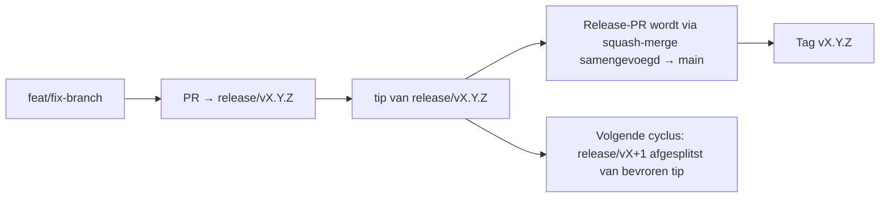

# Branching & Release Model (Nederlands)

🌐 **Languages:** 🇺🇸 [English](../../../../ops/BRANCHING_MODEL.md) · 🇪🇹 [am](../../../am/docs/ops/BRANCHING_MODEL.md) · 🇸🇦 [ar](../../../ar/docs/ops/BRANCHING_MODEL.md) · 🇦🇿 [az](../../../az/docs/ops/BRANCHING_MODEL.md) · 🇧🇬 [bg](../../../bg/docs/ops/BRANCHING_MODEL.md) · 🇧🇩 [bn](../../../bn/docs/ops/BRANCHING_MODEL.md) · 🇧🇦 [bs](../../../bs/docs/ops/BRANCHING_MODEL.md) · 🇨🇿 [cs](../../../cs/docs/ops/BRANCHING_MODEL.md) · 🇩🇰 [da](../../../da/docs/ops/BRANCHING_MODEL.md) · 🇩🇪 [de](../../../de/docs/ops/BRANCHING_MODEL.md) · 🇬🇷 [el](../../../el/docs/ops/BRANCHING_MODEL.md) · 🇪🇸 [es](../../../es/docs/ops/BRANCHING_MODEL.md) · 🇪🇪 [et](../../../et/docs/ops/BRANCHING_MODEL.md) · 🇮🇷 [fa](../../../fa/docs/ops/BRANCHING_MODEL.md) · 🇫🇮 [fi](../../../fi/docs/ops/BRANCHING_MODEL.md) · 🇫🇷 [fr](../../../fr/docs/ops/BRANCHING_MODEL.md) · 🇮🇪 [ga](../../../ga/docs/ops/BRANCHING_MODEL.md) · 🇮🇳 [gu](../../../gu/docs/ops/BRANCHING_MODEL.md) · 🇳🇬 [ha](../../../ha/docs/ops/BRANCHING_MODEL.md) · 🇮🇱 [he](../../../he/docs/ops/BRANCHING_MODEL.md) · 🇮🇳 [hi](../../../hi/docs/ops/BRANCHING_MODEL.md) · 🇭🇷 [hr](../../../hr/docs/ops/BRANCHING_MODEL.md) · 🇭🇺 [hu](../../../hu/docs/ops/BRANCHING_MODEL.md) · 🇦🇲 [hy](../../../hy/docs/ops/BRANCHING_MODEL.md) · 🇮🇩 [id](../../../id/docs/ops/BRANCHING_MODEL.md) · 🇳🇬 [ig](../../../ig/docs/ops/BRANCHING_MODEL.md) · 🇮🇹 [it](../../../it/docs/ops/BRANCHING_MODEL.md) · 🇯🇵 [ja](../../../ja/docs/ops/BRANCHING_MODEL.md) · 🇬🇪 [ka](../../../ka/docs/ops/BRANCHING_MODEL.md) · 🇰🇭 [km](../../../km/docs/ops/BRANCHING_MODEL.md) · 🇮🇳 [kn](../../../kn/docs/ops/BRANCHING_MODEL.md) · 🇰🇷 [ko](../../../ko/docs/ops/BRANCHING_MODEL.md) · 🇱🇹 [lt](../../../lt/docs/ops/BRANCHING_MODEL.md) · 🇱🇻 [lv](../../../lv/docs/ops/BRANCHING_MODEL.md) · 🇮🇳 [ml](../../../ml/docs/ops/BRANCHING_MODEL.md) · 🇮🇳 [mr](../../../mr/docs/ops/BRANCHING_MODEL.md) · 🇲🇾 [ms](../../../ms/docs/ops/BRANCHING_MODEL.md) · 🇲🇹 [mt](../../../mt/docs/ops/BRANCHING_MODEL.md) · 🇲🇲 [my](../../../my/docs/ops/BRANCHING_MODEL.md) · 🇳🇵 [ne](../../../ne/docs/ops/BRANCHING_MODEL.md) · 🇳🇴 [no](../../../no/docs/ops/BRANCHING_MODEL.md) · 🇮🇳 [or](../../../or/docs/ops/BRANCHING_MODEL.md) · 🇮🇳 [pa](../../../pa/docs/ops/BRANCHING_MODEL.md) · 🇵🇭 [phi](../../../phi/docs/ops/BRANCHING_MODEL.md) · 🇵🇱 [pl](../../../pl/docs/ops/BRANCHING_MODEL.md) · 🇵🇹 [pt](../../../pt/docs/ops/BRANCHING_MODEL.md) · 🇧🇷 [pt-BR](../../../pt-BR/docs/ops/BRANCHING_MODEL.md) · 🇷🇴 [ro](../../../ro/docs/ops/BRANCHING_MODEL.md) · 🇷🇺 [ru](../../../ru/docs/ops/BRANCHING_MODEL.md) · 🇱🇰 [si](../../../si/docs/ops/BRANCHING_MODEL.md) · 🇸🇰 [sk](../../../sk/docs/ops/BRANCHING_MODEL.md) · 🇸🇮 [sl](../../../sl/docs/ops/BRANCHING_MODEL.md) · 🇷🇸 [sr](../../../sr/docs/ops/BRANCHING_MODEL.md) · 🇸🇪 [sv](../../../sv/docs/ops/BRANCHING_MODEL.md) · 🇰🇪 [sw](../../../sw/docs/ops/BRANCHING_MODEL.md) · 🇮🇳 [ta](../../../ta/docs/ops/BRANCHING_MODEL.md) · 🇮🇳 [te](../../../te/docs/ops/BRANCHING_MODEL.md) · 🇹🇭 [th](../../../th/docs/ops/BRANCHING_MODEL.md) · 🇹🇷 [tr](../../../tr/docs/ops/BRANCHING_MODEL.md) · 🇺🇦 [uk-UA](../../../uk-UA/docs/ops/BRANCHING_MODEL.md) · 🇵🇰 [ur](../../../ur/docs/ops/BRANCHING_MODEL.md) · 🇺🇿 [uz](../../../uz/docs/ops/BRANCHING_MODEL.md) · 🇻🇳 [vi](../../../vi/docs/ops/BRANCHING_MODEL.md) · 🇳🇬 [yo](../../../yo/docs/ops/BRANCHING_MODEL.md) · 🇨🇳 [zh-CN](../../../zh-CN/docs/ops/BRANCHING_MODEL.md) · 🇹🇼 [zh-TW](../../../zh-TW/docs/ops/BRANCHING_MODEL.md)

---

OmniRoute gebruikt een **parallel-cyclus**-releasemodel: een speciale `release/vX.Y.Z`-branch
voor de actieve cyclus, `main` voor de gepubliceerde lijn en een onveranderlijke
`vX.Y.Z`-tag wanneer die cyclus wordt uitgebracht. Het is normaal dat commits zowel op `release/*` _als_ op
`main` terechtkomen — dit is geen vergissing.

Details voor beheerders staan in `CLAUDE.md` (Harde regel #21) en
[RELEASE_CHECKLIST.md](./RELEASE_CHECKLIST.md). Deze pagina is de openbare
samenvatting voor bijdragers.

## In één oogopslag

| Ref              | Rol                                                                                                               |
| ---------------- | ----------------------------------------------------------------------------------------------------------------- |
| `release/vX.Y.Z` | **Actieve cyclus** — dagelijkse ontwikkeling en PR-merges voor die versie                                         |
| `main`           | **Gepubliceerde lijn** — ontvangt de cyclus via een squash-merge wanneer de release wordt uitgebracht             |
| `vX.Y.Z` (tag)   | **Uitgavemarkering** — onveranderlijke verwijzing naar “wat is uitgebracht”, aangemaakt op het moment van release |



## Op welke branch moet mijn PR worden gericht?

**Richt de PR op de actieve `release/vX.Y.Z`-branch — niet op `main`.**

1. Zoek de hoogste open `release/v*`-branch (voorbeeld op het moment van schrijven:
   `release/v3.8.49`).
2. Maak vanaf die tip een branch (`git fetch` + checkout / rebase erop).
3. Open de PR met **base = die `release/vX.Y.Z`**.

`main` is niet de dagelijkse integratiebranch. PR's die tegen `main` worden geopend,
moeten meestal op een andere branch worden gericht voordat ze kunnen worden samengevoegd.

## Releasefreeze (parallelle cycli)

Wanneer een release wordt gereconcilieerd, wordt een markeringsissue met het label `release-freeze`
geopend. Dat **stopt de ontwikkeling niet**:

- De bevroren `release/vX.Y.Z` valt voor die uitgave onder de verantwoordelijkheid van de releasecaptain.
- De `release/vX+1` van de volgende cyclus wordt afgesplitst van de bevroren tip, zodat bijdragers
  werk kunnen blijven toevoegen.
- Open PR's die nog steeds op de bevroren branch zijn gericht, moeten op de
  actieve (hoogste) `release/v*`-branch worden **gericht**.

Controleer of er een open freeze is voordat je ervan uitgaat dat de gewenste branch kan worden samengevoegd:

```bash
gh issue list --repo diegosouzapw/OmniRoute --label release-freeze --state open
```

Het mergemechanisme (`queue`-label van de eigenaar → Mergify) wordt beschreven in
[MERGE_TRAIN.md](./MERGE_TRAIN.md).

## Waarom zowel een branch als een tag?

| Artefact         | Levensduur     | Doel                                                              |
| ---------------- | -------------- | ----------------------------------------------------------------- |
| `release/vX.Y.Z` | Lopende cyclus | Verzamelt beoordeelde PR's, blijft CI-groen en dient als PR-basis |
| Tag `vX.Y.Z`     | Voor altijd    | Markeert exact wat naar npm / GitHub Releases is uitgebracht      |

De branch is de werkplaats; de tag is het verzegelde pakket. Na de squash-merge naar
`main` gaat de volgende cyclus verder op `release/vX+1`, zonder te wachten tot de
release-PR van de vorige cyclus is afgerond.

## Gerelateerde documentatie

- [CONTRIBUTING.md](../../CONTRIBUTING.md) — installatie, tests, PR-checklist
- [RELEASE_CHECKLIST.md](./RELEASE_CHECKLIST.md) — validatie vóór uitgave
- [MERGE_TRAIN.md](./MERGE_TRAIN.md) — mergequeue en reservetrein
- [RELEASE_GREEN.md](./RELEASE_GREEN.md) — de releasetip groen houden
