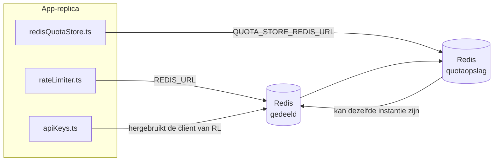

# Redis Production Configuration Guide (Nederlands)

🌐 **Languages:** 🇺🇸 [English](../../../../ops/REDIS_PRODUCTION_CONFIG.md) · 🇪🇹 [am](../../../am/docs/ops/REDIS_PRODUCTION_CONFIG.md) · 🇸🇦 [ar](../../../ar/docs/ops/REDIS_PRODUCTION_CONFIG.md) · 🇦🇿 [az](../../../az/docs/ops/REDIS_PRODUCTION_CONFIG.md) · 🇧🇬 [bg](../../../bg/docs/ops/REDIS_PRODUCTION_CONFIG.md) · 🇧🇩 [bn](../../../bn/docs/ops/REDIS_PRODUCTION_CONFIG.md) · 🇧🇦 [bs](../../../bs/docs/ops/REDIS_PRODUCTION_CONFIG.md) · 🇨🇿 [cs](../../../cs/docs/ops/REDIS_PRODUCTION_CONFIG.md) · 🇩🇰 [da](../../../da/docs/ops/REDIS_PRODUCTION_CONFIG.md) · 🇩🇪 [de](../../../de/docs/ops/REDIS_PRODUCTION_CONFIG.md) · 🇬🇷 [el](../../../el/docs/ops/REDIS_PRODUCTION_CONFIG.md) · 🇪🇸 [es](../../../es/docs/ops/REDIS_PRODUCTION_CONFIG.md) · 🇪🇪 [et](../../../et/docs/ops/REDIS_PRODUCTION_CONFIG.md) · 🇮🇷 [fa](../../../fa/docs/ops/REDIS_PRODUCTION_CONFIG.md) · 🇫🇮 [fi](../../../fi/docs/ops/REDIS_PRODUCTION_CONFIG.md) · 🇫🇷 [fr](../../../fr/docs/ops/REDIS_PRODUCTION_CONFIG.md) · 🇮🇪 [ga](../../../ga/docs/ops/REDIS_PRODUCTION_CONFIG.md) · 🇮🇳 [gu](../../../gu/docs/ops/REDIS_PRODUCTION_CONFIG.md) · 🇳🇬 [ha](../../../ha/docs/ops/REDIS_PRODUCTION_CONFIG.md) · 🇮🇱 [he](../../../he/docs/ops/REDIS_PRODUCTION_CONFIG.md) · 🇮🇳 [hi](../../../hi/docs/ops/REDIS_PRODUCTION_CONFIG.md) · 🇭🇷 [hr](../../../hr/docs/ops/REDIS_PRODUCTION_CONFIG.md) · 🇭🇺 [hu](../../../hu/docs/ops/REDIS_PRODUCTION_CONFIG.md) · 🇦🇲 [hy](../../../hy/docs/ops/REDIS_PRODUCTION_CONFIG.md) · 🇮🇩 [id](../../../id/docs/ops/REDIS_PRODUCTION_CONFIG.md) · 🇳🇬 [ig](../../../ig/docs/ops/REDIS_PRODUCTION_CONFIG.md) · 🇮🇹 [it](../../../it/docs/ops/REDIS_PRODUCTION_CONFIG.md) · 🇯🇵 [ja](../../../ja/docs/ops/REDIS_PRODUCTION_CONFIG.md) · 🇬🇪 [ka](../../../ka/docs/ops/REDIS_PRODUCTION_CONFIG.md) · 🇰🇭 [km](../../../km/docs/ops/REDIS_PRODUCTION_CONFIG.md) · 🇮🇳 [kn](../../../kn/docs/ops/REDIS_PRODUCTION_CONFIG.md) · 🇰🇷 [ko](../../../ko/docs/ops/REDIS_PRODUCTION_CONFIG.md) · 🇱🇹 [lt](../../../lt/docs/ops/REDIS_PRODUCTION_CONFIG.md) · 🇱🇻 [lv](../../../lv/docs/ops/REDIS_PRODUCTION_CONFIG.md) · 🇮🇳 [ml](../../../ml/docs/ops/REDIS_PRODUCTION_CONFIG.md) · 🇮🇳 [mr](../../../mr/docs/ops/REDIS_PRODUCTION_CONFIG.md) · 🇲🇾 [ms](../../../ms/docs/ops/REDIS_PRODUCTION_CONFIG.md) · 🇲🇹 [mt](../../../mt/docs/ops/REDIS_PRODUCTION_CONFIG.md) · 🇲🇲 [my](../../../my/docs/ops/REDIS_PRODUCTION_CONFIG.md) · 🇳🇵 [ne](../../../ne/docs/ops/REDIS_PRODUCTION_CONFIG.md) · 🇳🇴 [no](../../../no/docs/ops/REDIS_PRODUCTION_CONFIG.md) · 🇮🇳 [or](../../../or/docs/ops/REDIS_PRODUCTION_CONFIG.md) · 🇮🇳 [pa](../../../pa/docs/ops/REDIS_PRODUCTION_CONFIG.md) · 🇵🇭 [phi](../../../phi/docs/ops/REDIS_PRODUCTION_CONFIG.md) · 🇵🇱 [pl](../../../pl/docs/ops/REDIS_PRODUCTION_CONFIG.md) · 🇵🇹 [pt](../../../pt/docs/ops/REDIS_PRODUCTION_CONFIG.md) · 🇧🇷 [pt-BR](../../../pt-BR/docs/ops/REDIS_PRODUCTION_CONFIG.md) · 🇷🇴 [ro](../../../ro/docs/ops/REDIS_PRODUCTION_CONFIG.md) · 🇷🇺 [ru](../../../ru/docs/ops/REDIS_PRODUCTION_CONFIG.md) · 🇱🇰 [si](../../../si/docs/ops/REDIS_PRODUCTION_CONFIG.md) · 🇸🇰 [sk](../../../sk/docs/ops/REDIS_PRODUCTION_CONFIG.md) · 🇸🇮 [sl](../../../sl/docs/ops/REDIS_PRODUCTION_CONFIG.md) · 🇷🇸 [sr](../../../sr/docs/ops/REDIS_PRODUCTION_CONFIG.md) · 🇸🇪 [sv](../../../sv/docs/ops/REDIS_PRODUCTION_CONFIG.md) · 🇰🇪 [sw](../../../sw/docs/ops/REDIS_PRODUCTION_CONFIG.md) · 🇮🇳 [ta](../../../ta/docs/ops/REDIS_PRODUCTION_CONFIG.md) · 🇮🇳 [te](../../../te/docs/ops/REDIS_PRODUCTION_CONFIG.md) · 🇹🇭 [th](../../../th/docs/ops/REDIS_PRODUCTION_CONFIG.md) · 🇹🇷 [tr](../../../tr/docs/ops/REDIS_PRODUCTION_CONFIG.md) · 🇺🇦 [uk-UA](../../../uk-UA/docs/ops/REDIS_PRODUCTION_CONFIG.md) · 🇵🇰 [ur](../../../ur/docs/ops/REDIS_PRODUCTION_CONFIG.md) · 🇺🇿 [uz](../../../uz/docs/ops/REDIS_PRODUCTION_CONFIG.md) · 🇻🇳 [vi](../../../vi/docs/ops/REDIS_PRODUCTION_CONFIG.md) · 🇳🇬 [yo](../../../yo/docs/ops/REDIS_PRODUCTION_CONFIG.md) · 🇨🇳 [zh-CN](../../../zh-CN/docs/ops/REDIS_PRODUCTION_CONFIG.md) · 🇹🇼 [zh-TW](../../../zh-TW/docs/ops/REDIS_PRODUCTION_CONFIG.md)

---

## Overzicht

Redis is een **optionele, niet-verplichte afhankelijkheid** in OmniRoute — de applicatie schakelt bij onbeschikbaarheid van Redis zonder problemen over op alternatieven in het geheugen. In productie verlaagt het afstemmen van Redis de latentie voor vier afzonderlijke workloads:

| Workload                      | Aansturing                    | Clientfactory                                      | Sleutelpatroon                                               |
| ----------------------------- | ----------------------------- | -------------------------------------------------- | ------------------------------------------------------------ |
| Snelheidsbeperking            | `rateLimiter.ts`              | `getRedisClient()` — luie `ioredis`-singleton      | `<prefix>rl:*` Lua-atomaire vensters voor snelheidsbeperking |
| Authenticatiecache            | `apiKeys.ts`                  | Hergebruikt de client van `rateLimiter`            | `<prefix>auth:api_key:<sha256>` met TTL                      |
| Quotaopslag                   | `redisQuotaStore.ts`          | Afzonderlijke `getRedisClient(url)`-singleton      | `<prefix>quota:*` configureerbaar per instantie              |
| Circuitbreaker voor opwarming | `redisCircuitBreakerStore.ts` | Afzonderlijke client in `circuitBreakerFactory.ts` | `<prefix>warmup:cb:<connectionId>`                           |

Alle vier workloads delen één namespacevoorvoegsel, zodat OmniRoute naast andere apps op één Redis-instantie kan bestaan (bijv. `127.0.0.1:6379`). Zie [Sleutelnamespacing](#key-namespacing).

---

## Huidige configuratie (standaardwaarden in de code)

| Instelling                                 | Waarde                                                                       | Locatie                                                                               |
| ------------------------------------------ | ---------------------------------------------------------------------------- | ------------------------------------------------------------------------------------- |
| Omgevingsvariabele `REDIS_URL`             | `redis://redis:6379` (compose), optioneel                                    | `rateLimiter.ts:5`, `.env.example`                                                    |
| Omgevingsvariabele `REDIS_KEY_PREFIX`      | `omniroute:` (standaard)                                                     | `rateLimiter.ts`, `redisQuotaStore.ts`, `redisCircuitBreakerStore.ts`, `.env.example` |
| Omgevingsvariabele `QUOTA_STORE_REDIS_URL` | afzonderlijk, kan afwijken van `REDIS_URL`                                   | `quota/storeFactory.ts`                                                               |
| `QUOTA_STORE_DRIVER`                       | `"sqlite"` (standaard), `"redis"` optioneel                                  | `quota/storeFactory.ts`                                                               |
| ioredis `maxRetriesPerRequest`             | `3`                                                                          | clientaanmaak in `rateLimiter.ts`                                                     |
| `enableReadyCheck`                         | niet ingesteld (standaardwaarde van ioredis: `true`)                         | —                                                                                     |
| `lazyConnect`                              | niet ingesteld (standaardwaarde van ioredis: `false`)                        | —                                                                                     |
| `retryStrategy`                            | niet ingesteld (standaardwaarde van ioredis: basis van 200 ms, exponentieel) | —                                                                                     |
| TLS / wachtwoord / database-index          | **niet geconfigureerd**                                                      | —                                                                                     |
| Sentinel / Cluster                         | **niet geconfigureerd** — alleen zelfstandige single-node                    | —                                                                                     |

---

## Sleutelnamespacing

OmniRoute deelt een Redis-instantie met alle andere toepassingen die op de host worden uitgevoerd. Zonder een namespace kunnen sleutels zoals `auth:api_key:<sha256>` of `rl:*` conflicteren met sleutels van andere applicaties die dezelfde Redis gebruiken (op deze instantie draait Redis op `127.0.0.1:6379` naast andere services).

Stel `REDIS_KEY_PREFIX` in op een niet-lege tekenreeks om **elke** OmniRoute-sleutel van een voorvoegsel te voorzien:

```bash
# .env — alle OmniRoute-sleutels worden omniroute:rl:*, omniroute:auth:*, omniroute:quota:*, omniroute:warmup:cb:*
REDIS_KEY_PREFIX=omniroute:
```

- **Standaard:** `omniroute:` (toegepast wanneer `REDIS_KEY_PREFIX` niet is ingesteld of leeg is).
- **Toegepast op:** snelheidsbeperking + authenticatiecache (gedeelde `ioredis`-client via `keyPrefix`), de quotaopslag (`KEY_PREFIX = "${REDIS_KEY_PREFIX}quota"`) en de circuitbreaker voor opwarming (`KEY_PREFIX = "${REDIS_KEY_PREFIX}warmup:cb:"`).
- **Het voorvoegsel wijzigen** wanneer er al sleutels in Redis bestaan, maakt de oude sleutels verweesd (ze verlopen via TTL / LRU). Dit kan veilig worden gewijzigd; er is geen migratie nodig. De enige uitzondering is een circuitbreakersleutel voor opwarming van een verbinding die als verboden is gemarkeerd: deze wordt zonder TTL opgeslagen. Toon daarom achtergebleven sleutels met `redis-cli --scan --pattern '<old-prefix>warmup:cb:*'` en verwijder ze.
- **ioredis `keyPrefix`** voegt het voorvoegsel automatisch toe bij schrijfbewerkingen **en** verwijdert het bij leesbewerkingen, zodat de applicatiecode het voorvoegsel nooit ziet.

---

## Aanbevolen productieoptimalisaties

### 1. Verbindingspool-/clientopties (ioredis `Redis`-constructor)

De huidige code maakt één `new Redis(url)` zonder aangepaste opties. Geef voor productie-implementaties met meerdere replica's een clientfactory door in de code of maak een wrapper rond `getRedisClient()`:

```typescript
const redis = new Redis(REDIS_URL, {
  maxRetriesPerRequest: null, // geen limiet voor nieuwe pogingen; laat retryStrategy beslissen
  enableReadyCheck: true, // controleer of de server gereed is voordat aanroepen worden geaccepteerd
  lazyConnect: true, // maak geen verbinding bij constructie; wacht op de eerste aanroep
  retryStrategy: (times) => {
    if (times > 10) return null; // geef het na 10 pogingen op → maak later opnieuw verbinding
    return Math.min(times * 200, 5000); // 200 ms, 400 ms, …, maximaal 5 s
  },
  enableAutoPipelining: true, // voeg gelijktijdige opdrachten samen in één TCP-schrijfactie
  keepAlive: 10000, // TCP-keepalive elke 10 s
});
```

**Belangrijkste afwegingen:**

- `maxRetriesPerRequest: null` + `retryStrategy` — aanbevolen voor productie, zodat tijdelijke
  herstarts van Redis niet direct elke aanvraag laten mislukken. De fallback in het geheugen in
  `checkRateLimit()` vangt het foutpad op.
- `lazyConnect: true` — voorkomt dat het opstarten afhankelijk is van de beschikbaarheid van Redis voordat de server
  verbindingen begint te accepteren.
- `enableAutoPipelining: true` — vermindert het aantal retourreizen voor gelijktijdige controles van snelheidslimieten;
  nuttig bij >50 RPS via één verbinding.

### 2. Redis-serverconfiguratie (`redis.conf`)

```
# Geheugen
maxmemory 80%                        # laat ruimte over voor de paginacache van het besturingssysteem
maxmemory-policy allkeys-lru         # verwijder verouderde auth-cachevermeldingen bij geheugendruk

# Persistentie (optioneel — OmniRoute is ook zonder persistentie crashbestendig)
save 300 1                           # maak ten minste elke 5 min. een momentopname als ≥1 sleutel is gewijzigd
appendonly no                        # AOF is niet nodig; gegevens kunnen opnieuw worden gegenereerd
appendfsync no                       # geen fsync-overhead (RDB is voldoende)

# Netwerk
timeout 0                            # verbreek inactieve verbindingen niet
tcp-keepalive 300                    # keepalive van 5 min.
tcp-backlog 511                      # verbindingswachtrij voor piekbelasting

# Prestaties
hz 10                                # standaard; 100 voor latentiegevoelige toepassingen
activedefrag yes                     # automatisch defragmenteren wanneer fragmentatie >10% is
```

**Afweging voor `maxmemory-policy allkeys-lru`:** Auth-cachevermeldingen kunnen bij
geheugendruk worden verwijderd. Dit is veilig — `setCachedApiKey` vult de cache altijd opnieuw bij een cachemisser en de
SQLite-fallback is leidend. Het Lua-script voor de snelheidsbegrenzer maakt kleine sleutels die
bewust een korte levensduur hebben.

### 3. Docker Compose-instellingen

De productie-Compose-configuratie (`docker-compose.prod.yml`) gebruikt `redis:8.6.2-alpine`. Voeg het volgende toe:

```yaml
redis:
  image: redis:8.6.2-alpine
  command:
    [
      "redis-server",
      "--maxmemory",
      "512mb",
      "--maxmemory-policy",
      "allkeys-lru",
      "--activedefrag",
      "yes",
      "--save",
      "300 1",
    ]
  healthcheck:
    test: ["CMD", "redis-cli", "ping"]
    interval: 10s
    timeout: 3s
    retries: 3
    start_period: 5s
```

### 4. Overwegingen voor meerdere instanties/schaalbaarheid

**Eén Redis voor alle replica's** — het Lua-script voor de snelheidsbegrenzer is afhankelijk van één
leidende sleutelruimte. Meerdere Redis-instanties achter replica's zouden de atomiciteit
verliezen en het budget verdubbelen. Gebruik één Redis (of een Redis Sentinel-cluster met failover) voor
alle applicatiereplica's.

**Aantal verbindingen:** Elke applicatiereplica opent **2 TCP-verbindingen** met Redis
(client voor de snelheidsbegrenzer + client voor de quotaopslag). Bij 10 replica's → 20 verbindingen, ruim
binnen de standaardlimiet van 10.000 verbindingen voor een Redis-instantie.

### 5. Monitoring

Maak het volgende beschikbaar via het statuscontrole-eindpunt:

```typescript
// src/app/api/monitoring/health/route.ts roept al functies van rateLimiter aan
// Voeg Redis-specifieke controles toe:
//   1. PING-latentie via ioredis .ping()
//   2. Geheugengebruik via INFO memory
//   3. Aantal verbindingen via INFO clients
//   4. Trefferpercentage voor maxmemory-policy (evicted_keys / keyspace_hits)
```

Belangrijke metrische gegevens om te bewaken:

- **Verwijderde sleutels/sec.** — verhoog `maxmemory` als dit aanhoudend hoger is dan nul
- **Geblokkeerde clients** — een waarde hoger dan nul duidt op trage Lua-scripts of veel concurrentie
- **Geweigerde verbindingen** — de verbindingslimiet is bereikt; onwaarschijnlijk bij 20 verbindingen

---

## Architectuurdiagram



---

## Referenties

| Bestand                            | Doel                                                                                      |
| ---------------------------------- | ----------------------------------------------------------------------------------------- |
| `src/shared/utils/rateLimiter.ts`  | Primaire Redis-client, Lua-script voor frequentiebeperking, terugvaloptie in het geheugen |
| `src/lib/db/apiKeys.ts`            | Authenticatiecache — terugval van Redis naar SQLite                                       |
| `src/lib/quota/redisQuotaStore.ts` | Afzonderlijke Redis-client voor optionele quotaopslag                                     |
| `src/lib/quota/storeFactory.ts`    | Schakelt tussen de quota-stuurprogramma's `sqlite` en `redis`                             |
| `docker-compose.prod.yml`          | Redis-container voor productie (image `redis:8.6.2-alpine`)                               |
| `.env.example`                     | Documentatie voor Redis-omgevingsvariabelen                                               |
| `src/app/api/local/redis/`         | API-routes voor het orkestreren van ontwikkelcontainers                                   |
| `bin/cli/commands/redis.mjs`       | CLI-opdrachten voor het orkestreren van ontwikkelcontainers                               |
