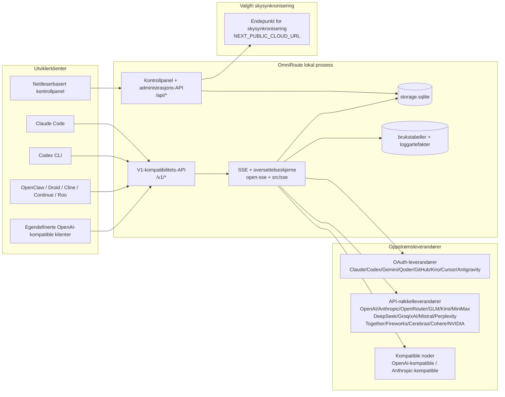
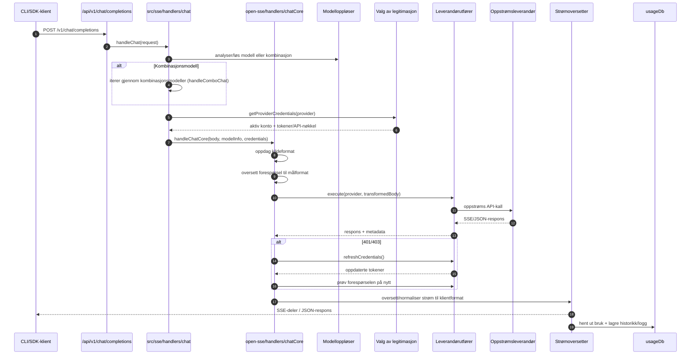
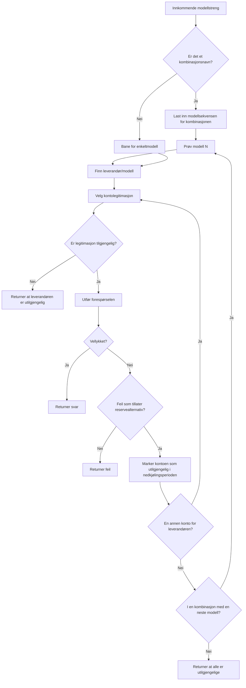
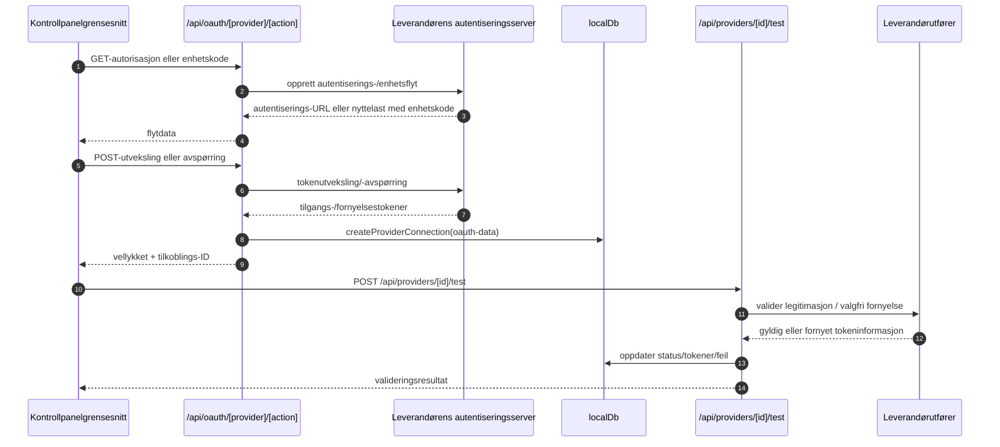
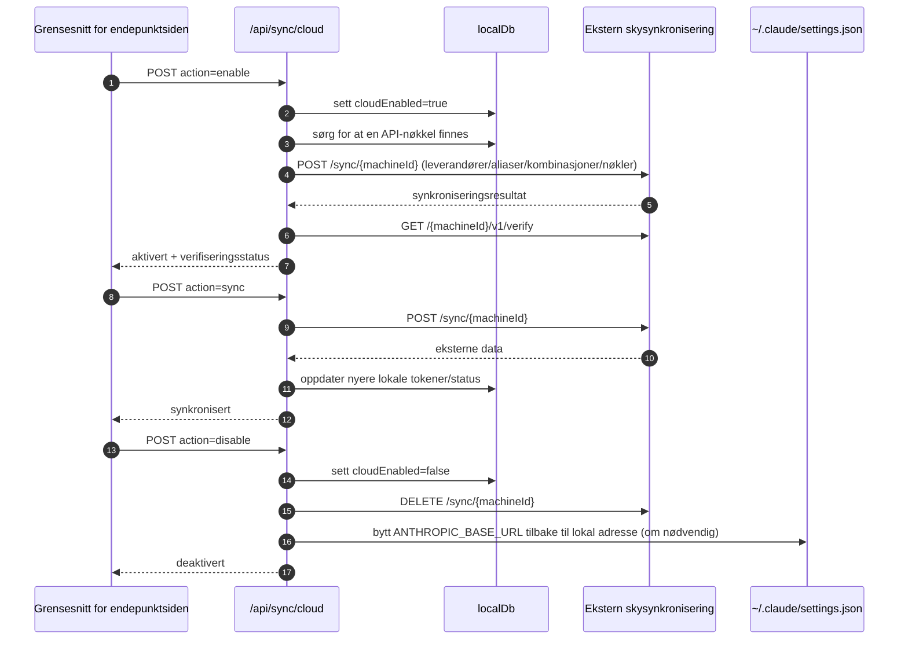
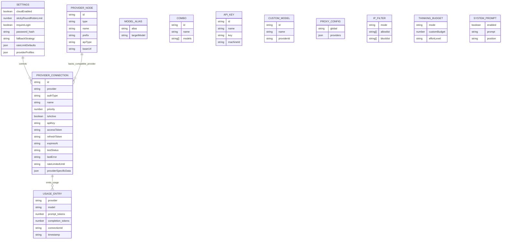
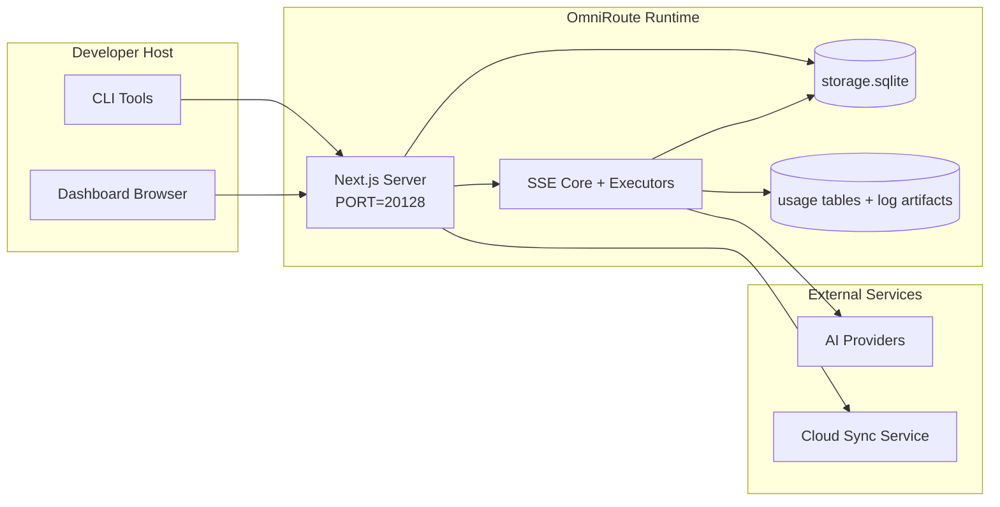

# OmniRoute Architecture (Norsk)

🌐 **Languages:** 🇺🇸 [English](../../../../architecture/ARCHITECTURE.md) · 🇪🇹 [am](../../../am/docs/architecture/ARCHITECTURE.md) · 🇸🇦 [ar](../../../ar/docs/architecture/ARCHITECTURE.md) · 🇦🇿 [az](../../../az/docs/architecture/ARCHITECTURE.md) · 🇧🇬 [bg](../../../bg/docs/architecture/ARCHITECTURE.md) · 🇧🇩 [bn](../../../bn/docs/architecture/ARCHITECTURE.md) · 🇧🇦 [bs](../../../bs/docs/architecture/ARCHITECTURE.md) · 🇨🇿 [cs](../../../cs/docs/architecture/ARCHITECTURE.md) · 🇩🇰 [da](../../../da/docs/architecture/ARCHITECTURE.md) · 🇩🇪 [de](../../../de/docs/architecture/ARCHITECTURE.md) · 🇬🇷 [el](../../../el/docs/architecture/ARCHITECTURE.md) · 🇪🇸 [es](../../../es/docs/architecture/ARCHITECTURE.md) · 🇪🇪 [et](../../../et/docs/architecture/ARCHITECTURE.md) · 🇮🇷 [fa](../../../fa/docs/architecture/ARCHITECTURE.md) · 🇫🇮 [fi](../../../fi/docs/architecture/ARCHITECTURE.md) · 🇫🇷 [fr](../../../fr/docs/architecture/ARCHITECTURE.md) · 🇮🇪 [ga](../../../ga/docs/architecture/ARCHITECTURE.md) · 🇮🇳 [gu](../../../gu/docs/architecture/ARCHITECTURE.md) · 🇳🇬 [ha](../../../ha/docs/architecture/ARCHITECTURE.md) · 🇮🇱 [he](../../../he/docs/architecture/ARCHITECTURE.md) · 🇮🇳 [hi](../../../hi/docs/architecture/ARCHITECTURE.md) · 🇭🇷 [hr](../../../hr/docs/architecture/ARCHITECTURE.md) · 🇭🇺 [hu](../../../hu/docs/architecture/ARCHITECTURE.md) · 🇦🇲 [hy](../../../hy/docs/architecture/ARCHITECTURE.md) · 🇮🇩 [id](../../../id/docs/architecture/ARCHITECTURE.md) · 🇳🇬 [ig](../../../ig/docs/architecture/ARCHITECTURE.md) · 🇮🇹 [it](../../../it/docs/architecture/ARCHITECTURE.md) · 🇯🇵 [ja](../../../ja/docs/architecture/ARCHITECTURE.md) · 🇬🇪 [ka](../../../ka/docs/architecture/ARCHITECTURE.md) · 🇰🇭 [km](../../../km/docs/architecture/ARCHITECTURE.md) · 🇮🇳 [kn](../../../kn/docs/architecture/ARCHITECTURE.md) · 🇰🇷 [ko](../../../ko/docs/architecture/ARCHITECTURE.md) · 🇱🇹 [lt](../../../lt/docs/architecture/ARCHITECTURE.md) · 🇱🇻 [lv](../../../lv/docs/architecture/ARCHITECTURE.md) · 🇮🇳 [ml](../../../ml/docs/architecture/ARCHITECTURE.md) · 🇮🇳 [mr](../../../mr/docs/architecture/ARCHITECTURE.md) · 🇲🇾 [ms](../../../ms/docs/architecture/ARCHITECTURE.md) · 🇲🇹 [mt](../../../mt/docs/architecture/ARCHITECTURE.md) · 🇲🇲 [my](../../../my/docs/architecture/ARCHITECTURE.md) · 🇳🇵 [ne](../../../ne/docs/architecture/ARCHITECTURE.md) · 🇳🇱 [nl](../../../nl/docs/architecture/ARCHITECTURE.md) · 🇮🇳 [or](../../../or/docs/architecture/ARCHITECTURE.md) · 🇮🇳 [pa](../../../pa/docs/architecture/ARCHITECTURE.md) · 🇵🇭 [phi](../../../phi/docs/architecture/ARCHITECTURE.md) · 🇵🇱 [pl](../../../pl/docs/architecture/ARCHITECTURE.md) · 🇵🇹 [pt](../../../pt/docs/architecture/ARCHITECTURE.md) · 🇧🇷 [pt-BR](../../../pt-BR/docs/architecture/ARCHITECTURE.md) · 🇷🇴 [ro](../../../ro/docs/architecture/ARCHITECTURE.md) · 🇷🇺 [ru](../../../ru/docs/architecture/ARCHITECTURE.md) · 🇱🇰 [si](../../../si/docs/architecture/ARCHITECTURE.md) · 🇸🇰 [sk](../../../sk/docs/architecture/ARCHITECTURE.md) · 🇸🇮 [sl](../../../sl/docs/architecture/ARCHITECTURE.md) · 🇷🇸 [sr](../../../sr/docs/architecture/ARCHITECTURE.md) · 🇸🇪 [sv](../../../sv/docs/architecture/ARCHITECTURE.md) · 🇰🇪 [sw](../../../sw/docs/architecture/ARCHITECTURE.md) · 🇮🇳 [ta](../../../ta/docs/architecture/ARCHITECTURE.md) · 🇮🇳 [te](../../../te/docs/architecture/ARCHITECTURE.md) · 🇹🇭 [th](../../../th/docs/architecture/ARCHITECTURE.md) · 🇹🇷 [tr](../../../tr/docs/architecture/ARCHITECTURE.md) · 🇺🇦 [uk-UA](../../../uk-UA/docs/architecture/ARCHITECTURE.md) · 🇵🇰 [ur](../../../ur/docs/architecture/ARCHITECTURE.md) · 🇺🇿 [uz](../../../uz/docs/architecture/ARCHITECTURE.md) · 🇻🇳 [vi](../../../vi/docs/architecture/ARCHITECTURE.md) · 🇳🇬 [yo](../../../yo/docs/architecture/ARCHITECTURE.md) · 🇨🇳 [zh-CN](../../../zh-CN/docs/architecture/ARCHITECTURE.md) · 🇹🇼 [zh-TW](../../../zh-TW/docs/architecture/ARCHITECTURE.md)

---

🌐 **Languages:** 🇺🇸 [English](../../../../architecture/ARCHITECTURE.md) · 🇪🇹 [am](../../../am/docs/architecture/ARCHITECTURE.md) · 🇸🇦 [ar](../../../ar/docs/architecture/ARCHITECTURE.md) · 🇦🇿 [az](../../../az/docs/architecture/ARCHITECTURE.md) · 🇧🇬 [bg](../../../bg/docs/architecture/ARCHITECTURE.md) · 🇧🇩 [bn](../../../bn/docs/architecture/ARCHITECTURE.md) · 🇧🇦 [bs](../../../bs/docs/architecture/ARCHITECTURE.md) · 🇨🇿 [cs](../../../cs/docs/architecture/ARCHITECTURE.md) · 🇩🇰 [da](../../../da/docs/architecture/ARCHITECTURE.md) · 🇩🇪 [de](../../../de/docs/architecture/ARCHITECTURE.md) · 🇬🇷 [el](../../../el/docs/architecture/ARCHITECTURE.md) · 🇪🇸 [es](../../../es/docs/architecture/ARCHITECTURE.md) · 🇪🇪 [et](../../../et/docs/architecture/ARCHITECTURE.md) · 🇮🇷 [fa](../../../fa/docs/architecture/ARCHITECTURE.md) · 🇫🇮 [fi](../../../fi/docs/architecture/ARCHITECTURE.md) · 🇫🇷 [fr](../../../fr/docs/architecture/ARCHITECTURE.md) · 🇮🇪 [ga](../../../ga/docs/architecture/ARCHITECTURE.md) · 🇮🇳 [gu](../../../gu/docs/architecture/ARCHITECTURE.md) · 🇳🇬 [ha](../../../ha/docs/architecture/ARCHITECTURE.md) · 🇮🇱 [he](../../../he/docs/architecture/ARCHITECTURE.md) · 🇮🇳 [hi](../../../hi/docs/architecture/ARCHITECTURE.md) · 🇭🇷 [hr](../../../hr/docs/architecture/ARCHITECTURE.md) · 🇭🇺 [hu](../../../hu/docs/architecture/ARCHITECTURE.md) · 🇦🇲 [hy](../../../hy/docs/architecture/ARCHITECTURE.md) · 🇮🇩 [id](../../../id/docs/architecture/ARCHITECTURE.md) · 🇳🇬 [ig](../../../ig/docs/architecture/ARCHITECTURE.md) · 🇮🇹 [it](../../../it/docs/architecture/ARCHITECTURE.md) · 🇯🇵 [ja](../../../ja/docs/architecture/ARCHITECTURE.md) · 🇬🇪 [ka](../../../ka/docs/architecture/ARCHITECTURE.md) · 🇰🇭 [km](../../../km/docs/architecture/ARCHITECTURE.md) · 🇮🇳 [kn](../../../kn/docs/architecture/ARCHITECTURE.md) · 🇰🇷 [ko](../../../ko/docs/architecture/ARCHITECTURE.md) · 🇱🇹 [lt](../../../lt/docs/architecture/ARCHITECTURE.md) · 🇱🇻 [lv](../../../lv/docs/architecture/ARCHITECTURE.md) · 🇮🇳 [ml](../../../ml/docs/architecture/ARCHITECTURE.md) · 🇮🇳 [mr](../../../mr/docs/architecture/ARCHITECTURE.md) · 🇲🇾 [ms](../../../ms/docs/architecture/ARCHITECTURE.md) · 🇲🇹 [mt](../../../mt/docs/architecture/ARCHITECTURE.md) · 🇲🇲 [my](../../../my/docs/architecture/ARCHITECTURE.md) · 🇳🇵 [ne](../../../ne/docs/architecture/ARCHITECTURE.md) · 🇳🇱 [nl](../../../nl/docs/architecture/ARCHITECTURE.md) · 🇮🇳 [or](../../../or/docs/architecture/ARCHITECTURE.md) · 🇮🇳 [pa](../../../pa/docs/architecture/ARCHITECTURE.md) · 🇵🇭 [phi](../../../phi/docs/architecture/ARCHITECTURE.md) · 🇵🇱 [pl](../../../pl/docs/architecture/ARCHITECTURE.md) · 🇵🇹 [pt](../../../pt/docs/architecture/ARCHITECTURE.md) · 🇧🇷 [pt-BR](../../../pt-BR/docs/architecture/ARCHITECTURE.md) · 🇷🇴 [ro](../../../ro/docs/architecture/ARCHITECTURE.md) · 🇷🇺 [ru](../../../ru/docs/architecture/ARCHITECTURE.md) · 🇱🇰 [si](../../../si/docs/architecture/ARCHITECTURE.md) · 🇸🇰 [sk](../../../sk/docs/architecture/ARCHITECTURE.md) · 🇸🇮 [sl](../../../sl/docs/architecture/ARCHITECTURE.md) · 🇷🇸 [sr](../../../sr/docs/architecture/ARCHITECTURE.md) · 🇸🇪 [sv](../../../sv/docs/architecture/ARCHITECTURE.md) · 🇰🇪 [sw](../../../sw/docs/architecture/ARCHITECTURE.md) · 🇮🇳 [ta](../../../ta/docs/architecture/ARCHITECTURE.md) · 🇮🇳 [te](../../../te/docs/architecture/ARCHITECTURE.md) · 🇹🇭 [th](../../../th/docs/architecture/ARCHITECTURE.md) · 🇹🇷 [tr](../../../tr/docs/architecture/ARCHITECTURE.md) · 🇺🇦 [uk-UA](../../../uk-UA/docs/architecture/ARCHITECTURE.md) · 🇵🇰 [ur](../../../ur/docs/architecture/ARCHITECTURE.md) · 🇺🇿 [uz](../../../uz/docs/architecture/ARCHITECTURE.md) · 🇻🇳 [vi](../../../vi/docs/architecture/ARCHITECTURE.md) · 🇳🇬 [yo](../../../yo/docs/architecture/ARCHITECTURE.md) · 🇨🇳 [zh-CN](../../../zh-CN/docs/architecture/ARCHITECTURE.md) · 🇹🇼 [zh-TW](../../../zh-TW/docs/architecture/ARCHITECTURE.md)

_Sist oppdatert: 2026-06-28_

## Sammendrag

OmniRoute er en lokal AI-rutingsgateway og et kontrollpanel bygget på Next.js.
Den tilbyr ett enkelt OpenAI-kompatibelt endepunkt (`/v1/*`) og ruter trafikk på tvers av flere oppstrømsleverandører med oversettelse, reservehåndtering, tokenfornyelse og bruksregistrering.

Kjernefunksjoner:

- OpenAI-kompatibelt API-grensesnitt for CLI/verktøy (355 leverandører, 108 utførere)
- Oversettelse av forespørsler/svar mellom leverandørformater
- Modellkombinasjon med reservehåndtering (sekvens med flere modeller)
- Strukturerte kombinasjonstrinn (`leverandør + modell + tilkobling`) med kjøretidsrekkefølge basert på `compositeTiers`
- Reservehåndtering på kontonivå (flere kontoer per leverandør)
- Forhåndskontroll av kvoter og kvotebevisst P2C-kontovalg i hovedflyten for chat
- Administrasjon av leverandørtilkoblinger med OAuth og API-nøkler (22 OAuth-leverandørmoduler)
- Generering av innebygginger via `/v1/embeddings` (18 leverandører)
- Bildegenerering via `/v1/images/generations` (10+ leverandører, 20+ modeller)
- Lydtranskripsjon via `/v1/audio/transcriptions` (18 leverandører)
- Tekst-til-tale via `/v1/audio/speech` (24 innebygde leverandører)
- Videogenerering via `/v1/videos/generations` (ComfyUI + SD WebUI)
- Musikkgenerering via `/v1/music/generations` (ComfyUI)
- Nettsøk via `/v1/search` (20 leverandører)
- Moderering via `/v1/moderations`
- Omrangering via `/v1/rerank`
- Tolking av tenketagger (`<think>...</think>`) for resonneringsmodeller
- Rensing av svar for streng kompatibilitet med OpenAI SDK
- Rollenormalisering (developer→system, system→user) for kompatibilitet på tvers av leverandører
- Konvertering av strukturerte utdata (json_schema → Gemini responseSchema)
- Lokal persistens for leverandører, nøkler, aliaser, kombinasjoner, innstillinger og prising (122 DB-moduler)
- Sporing av bruk/kostnader og logging av forespørsler
- Valgfri skysynkronisering for synkronisering av tilstand mellom flere enheter
- Tillatelsesliste/blokkeringsliste for IP-adresser for tilgangskontroll til API-et
- Administrasjon av tenkebudsjett (direktevideresending/automatisk/egendefinert/adaptivt)
- Global innsetting av systeminstruks
- Øktsporing og fingeravtrykksregistrering
- Forbedret hastighetsbegrensning per konto med leverandørspesifikke profiler
- Sikringsbrytermønster for robusthet hos leverandører
- Beskyttelse mot samtidige forespørselsstormer med mutex-låsing
- Signaturbasert hurtigbuffer for deduplisering av forespørsler
- Domenelag: kostnadsregler, reservepolicy, utestengingspolicy
- Context Relay: sammendrag for øktoverlevering som sikrer kontinuitet ved kontorotasjon
- Persistens av domenetilstand (SQLite-hurtigbuffer med direkte gjennomskriving for reserver, budsjetter, utestenginger og sikringsbrytere)
- Policymotor for sentralisert evaluering av forespørsler (utestenging → budsjett → reserve)
- Forespørselstelemetri med aggregering av p50/p95/p99-ventetid
- Telemetri for kombinasjonsmål og historisk tilstand for kombinasjonsmål via `combo_execution_key` / `combo_step_id`
- Korrelasjons-ID (X-Request-Id) for ende-til-ende-sporing
- Revisjonslogging for etterlevelse med mulighet for reservasjon per API-nøkkel
- Evalueringsrammeverk for kvalitetssikring av LLM-er
- Tilstandskontrollpanel med sanntidsstatus for leverandørenes sikringsbrytere
- MCP-server (110 verktøy) med 3 transporter (stdio/SSE/strømmbar HTTP)
- A2A-server (JSON-RPC 2.0 + SSE) med ferdigheter og oppgavelivssyklus
- Minnesystem (uttrekking, innsetting, gjenfinning, oppsummering)
- Ferdighetssystem (register, utfører, sandkasse, innebygde ferdigheter)
- MITM-proxy med sertifikatadministrasjon og DNS-håndtering
- Mellomvare for beskyttelse mot promptinjeksjon
- Pipeline for promptkomprimering med Caveman, RTK, stablede pipelines, komprimeringskombinasjoner, språkpakker og analyse
- ACP-register (Agent Communication Protocol)
- Modulære OAuth-leverandører (22 individuelle moduler under `src/lib/oauth/providers/`)
- Skript for avinstallering/fullstendig avinstallering
- Handling for reparasjon av OAuth-miljø
- WebSocket-bro for OpenAI-kompatible WS-klienter (`/v1/ws`)
- Administrasjon av synkroniseringstokener (utstedelse/tilbakekalling, nedlasting av ETag-versjonert konfigurasjonspakke)
- GLM Thinking (`glmt`) som en fullverdig forhåndsinnstilling for leverandør
- Hybrid tokenopptelling (leverandørbasert `/messages/count_tokens` med estimering som reserve)
- Automatisk oppretting av modellaliaser (30+ normaliseringer mellom proxy-dialekter ved oppstart)
- Sikker utgående henting med SSRF-beskyttelse, blokkering av private URL-er og konfigurerbare nye forsøk
- Nedkjølingsbevisste nye chatforsøk med konfigurerbare `requestRetry` og `maxRetryIntervalSec`
- Validering av kjøretidsmiljø med Zod ved oppstart
- Etterlevelsesrevisjon v2 med paginering, CRUD-hendelser for leverandører og logging av SSRF-blokkert validering

Primær kjøretidsmodell:

- Next.js-appruter under `src/app/api/*` implementerer både kontrollpanel-API-er og kompatibilitets-API-er
- En delt SSE-/rutingskjerne i `src/sse/*` + `open-sse/*` håndterer leverandørkjøring, oversettelse, strømming, reservehåndtering og bruk

## Referansediagrammer

De kanoniske, versjonskontrollerte Mermaid-kildene for v3.8.0-plattformen finnes i
[`docs/diagrams/`](../diagrams/README.md). To av dem er gjengitt nedenfor for oversiktens skyld;
resten er lenket fra de domenespesifikke veiledningene.


> Kilde: [diagrams/request-pipeline.mmd](../diagrams/request-pipeline.mmd)


> Kilde: [diagrams/resilience-3layers.mmd](../diagrams/resilience-3layers.mmd) — også lenket fra
> [RESILIENCE_GUIDE.md](./RESILIENCE_GUIDE.md) og robusthetsreferansen i `CLAUDE.md`.

## Omfang og avgrensninger

### Innenfor omfanget

- Lokal gateway-kjøretid
- Administrasjons-API-er for kontrollpanelet
- Leverandørautentisering og tokenfornyelse
- Forespørselsoversettelse og SSE-strømming
- Lokal tilstand og lagring av bruksdata
- Valgfri orkestrering av skysynkronisering

### Utenfor omfanget

- Implementering av skytjenesten bak `NEXT_PUBLIC_CLOUD_URL`
- Leverandørens SLA/kontrollplan utenfor den lokale prosessen
- Selve de eksterne CLI-binærfilene (Claude CLI, Codex CLI osv.)

## Kontrollpaneloversikt (gjeldende)

Hovedsider under `src/app/(dashboard)/dashboard/`:

- `/dashboard` — hurtigstart og leverandøroversikt
- `/dashboard/endpoint` — endepunkt-proxy samt faner for MCP, A2A og API-endepunkter
- `/dashboard/providers` — leverandørtilkoblinger og påloggingsinformasjon
- `/dashboard/combos` — kombinasjonsstrategier, maler, trinnbasert bygger, regler for modellruting og manuelt lagret rekkefølge
- `/dashboard/auto-combo` — Auto Combo Engine: poengvekter, moduspakker, forhåndsinnstillinger for virtuelle fabrikker og telemetri
- `/dashboard/costs` — kostnadsaggregering og prisoversikt
- `/dashboard/analytics` — bruksanalyse, evalueringer og målhelse for kombinasjoner
- `/dashboard/limits` — kvote- og hastighetskontroller
- `/dashboard/cli-tools` — CLI-oppsett, kjøretidsdeteksjon og konfigurasjonsgenerering
- `/dashboard/agents` — oppdagede ACP-agenter og registrering av egendefinerte agenter
- `/dashboard/cloud-agents` — oppgaver for skybaserte agenter (Codex Cloud, Devin, Jules) og oppgavenes livssyklus
- `/dashboard/skills` — A2A-ferdighetsregister, sandkassekjøring og innebygd ferdighetskatalog
- `/dashboard/memory` — inspeksjon og henting av varig samtaleminne
- `/dashboard/webhooks` — utgående webhook-abonnementer, rotering av hemmeligheter og statistikk for nye forsøk
- `/dashboard/batch` — innsending av jobbgrupper og fremdrift
- `/dashboard/cache` — statistikk for gjennomlesings- og resonneringsbuffer samt tømmekontroller
- `/dashboard/playground` — interaktivt chatmiljø mot enhver konfigurert kombinasjon/modell
- `/dashboard/changelog` — endringsloggvisning i appen (gjengir `CHANGELOG.md`)
- `/dashboard/system` — kjøretidsdiagnostikk, versjonsinformasjon og grensesnitt for miljøvalidering
- `/dashboard/onboarding` — veiviser for førstegangsoppsett av nye installasjoner
- `/dashboard/media` — testmiljø for bilder, video og musikk
- `/dashboard/search-tools` — testing av søkeleverandører og historikk
- `/dashboard/health` — oppetid, effektbrytere, hastighetsgrenser og kvoteovervåkede økter
- `/dashboard/logs` — forespørsels-, proxy-, revisjons- og konsolllogger
- `/dashboard/settings` — faner for systeminnstillinger (generelt, ruting, standardverdier for kombinasjoner osv.)
- `/dashboard/context/caveman` — Caveman-komprimeringsregler, språkpakker, forhåndsvisning og utdatamodus
- `/dashboard/context/rtk` — RTK-filtre for kommandoutdata, forhåndsvisning og sikkerhetsinnstillinger for kjøretid
- `/dashboard/context/combos` — navngitte komprimeringsflyter tilordnet rutingskombinasjoner
- `/dashboard/translator` — oversetterinspeksjon og forhåndsvisning av konvertering av forespørselsformater
- `/dashboard/audit` — nettleser for samsvarsrevisjonslogger med paginering og strukturerte metadata
- `/dashboard/usage` — visning av bruk per forespørsel knyttet til `usage_history`
- `/dashboard/compression` — komprimeringsanalyse, statistikk og tilordning av behandlingsflyter
- `/dashboard/api-manager` — livssyklus for API-nøkler og modelltillatelser

## Systemkontekst på høyt nivå



## Sentrale kjøretidskomponenter

## 1) API- og rutingslag (Next.js App-ruter)

Hovedkataloger:

- `src/app/api/v1/*` og `src/app/api/v1beta/*` for kompatibilitets-API-er
- `src/app/api/*` for API-er for administrasjon/konfigurasjon
- Next-omskrivinger i `next.config.mjs` tilordner `/v1/*` til `/api/v1/*`

Viktige kompatibilitetsruter:

- `src/app/api/v1/chat/completions/route.ts`
- `src/app/api/v1/messages/route.ts`
- `src/app/api/v1/responses/route.ts`
- `src/app/api/v1/models/route.ts` — inkluderer egendefinerte modeller med `custom: true`
- `src/app/api/v1/embeddings/route.ts` — generering av innebygginger (6 leverandører)
- `src/app/api/v1/images/generations/route.ts` — bildegenerering (4+ leverandører, inkl. Antigravity/Nebius)
- `src/app/api/v1/messages/count_tokens/route.ts`
- `src/app/api/v1/providers/[provider]/chat/completions/route.ts` — dedikert chat per leverandør
- `src/app/api/v1/providers/[provider]/embeddings/route.ts` — dedikerte innebygginger per leverandør
- `src/app/api/v1/providers/[provider]/images/generations/route.ts` — dedikerte bilder per leverandør
- `src/app/api/v1beta/models/route.ts`
- `src/app/api/v1beta/models/[...path]/route.ts`

Administrasjonsområder:

- Autentisering/innstillinger: `src/app/api/auth/*`, `src/app/api/settings/*`
- Leverandører/tilkoblinger: `src/app/api/providers*`
- Leverandørnoder: `src/app/api/provider-nodes*`
- Egendefinerte modeller: `src/app/api/provider-models` (GET/POST/DELETE)
- Modellkatalog: `src/app/api/models/route.ts` (GET)
- Proxy-konfigurasjon: `src/app/api/settings/proxy` (GET/PUT/DELETE) + `src/app/api/settings/proxy/test` (POST)
- OAuth: `src/app/api/oauth/*`
- Nøkler/aliaser/kombinasjoner/priser: `src/app/api/keys*`, `src/app/api/models/alias`, `src/app/api/combos*`, `src/app/api/pricing`
- Bruk: `src/app/api/usage/*`
- Synkronisering/sky: `src/app/api/sync/*`, `src/app/api/cloud/*`
- Hjelpeverktøy for CLI-verktøy: `src/app/api/cli-tools/*`
- IP-filter: `src/app/api/settings/ip-filter` (GET/PUT)
- Tenkebudsjett: `src/app/api/settings/thinking-budget` (GET/PUT)
- Systemledetekst: `src/app/api/settings/system-prompt` (GET/PUT)
- Komprimering: `src/app/api/settings/compression`, `src/app/api/compression/*` og
  `src/app/api/context/*`
- Økter: `src/app/api/sessions` (GET)
- Hastighetsgrenser: `src/app/api/rate-limits` (GET)
- Robusthet: `src/app/api/resilience` (GET/PATCH) — forespørselskø, nedkjøling av tilkoblinger, leverandørbryter, konfigurasjon for venting på nedkjøling
- Tilbakestilling av robusthet: `src/app/api/resilience/reset` (POST) — tilbakestill leverandørbrytere
- Hurtigbufferstatistikk: `src/app/api/cache/stats` (GET/DELETE)
- Telemetri: `src/app/api/telemetry/summary` (GET)
- Budsjett: `src/app/api/usage/budget` (GET/POST)
- Reservekjeder: `src/app/api/fallback/chains` (GET/POST/DELETE)
- Samsvarsrevisjon: `src/app/api/compliance/audit-log` (GET, med paginering + strukturerte metadata)
- Evalueringer: `src/app/api/evals` (GET/POST), `src/app/api/evals/[suiteId]` (GET)
- Retningslinjer: `src/app/api/policies` (GET/POST)
- Synkroniseringstokener: `src/app/api/sync/tokens` (GET/POST), `src/app/api/sync/tokens/[id]` (GET/DELETE)
- Konfigurasjonspakke: `src/app/api/sync/bundle` (GET, ETag-versjonert øyeblikksbilde av innstillinger/leverandører/kombinasjoner/nøkler)
- WebSocket: `src/app/api/v1/ws/route.ts` — Upgrade-håndterer for OpenAI-kompatible WS-klienter

## 2) SSE + oversettelseskjerne

Moduler for hovedflyten:

- Inngangspunkt: `src/sse/handlers/chat.ts`
- Kjerneorkestrering: `open-sse/handlers/chatCore.ts`
- Kjøreadaptere for leverandører: `open-sse/executors/*`
- Formatdeteksjon/leverandørkonfigurasjon: `open-sse/services/provider.ts`
- Tolkning/oppløsning av modeller: `src/sse/services/model.ts`, `open-sse/services/model.ts`
- Logikk for reservemekanismer for kontoer: `open-sse/services/accountFallback.ts`
- Oversettelsesregister: `open-sse/translator/index.ts`
- Strømtransformasjoner: `open-sse/utils/stream.ts`, `open-sse/utils/streamHandler.ts`
- Uttrekking/normalisering av bruk: `open-sse/utils/usageTracking.ts`
- Parser for think-tagger: `open-sse/utils/thinkTagParser.ts`
- Håndtering av innebygginger: `open-sse/handlers/embeddings.ts`
- Leverandørregister for innebygginger: `open-sse/config/embeddingRegistry.ts`
- Håndtering av bildegenerering: `open-sse/handlers/imageGeneration.ts`
- Leverandørregister for bilder: `open-sse/config/imageRegistry.ts`
- Rensing av svar: `open-sse/handlers/responseSanitizer.ts`
- Rollenormalisering: `open-sse/services/roleNormalizer.ts`

Tjenester (forretningslogikk):

- Valg/poengberegning av kontoer: `open-sse/services/accountSelector.ts`
- Administrasjon av kontekstlivssyklus: `open-sse/services/contextManager.ts`
- Håndheving av IP-filter: `open-sse/services/ipFilter.ts`
- Øktsporing: `open-sse/services/sessionManager.ts`
- Deduplisering av forespørsler: `open-sse/services/signatureCache.ts`
- Injisering av systeminstruks: `open-sse/services/systemPrompt.ts`
- Administrasjon av tenkebudsjett: `open-sse/services/thinkingBudget.ts`
- Modellruting med jokertegn: `open-sse/services/wildcardRouter.ts`
- Administrasjon av hastighetsbegrensning: `open-sse/services/rateLimitManager.ts`
- Sikringsmekanisme: `src/shared/utils/circuitBreaker.ts`
- Kontekstoverlevering: `open-sse/services/contextHandoff.ts` — generering og injisering av overleveringssammendrag for kontekstvideresendingsstrategien
- Komprimering: `open-sse/services/compression/*` — proaktiv komprimering før leverandøroversettelse;
  inkluderer Caveman-regler, RTK-filtre, stablede behandlingskjeder, komprimeringskombinasjoner, statistikk og validering
- Henting av Codex-kvote: `open-sse/services/codexQuotaFetcher.ts` — henter Codex-kvote for beslutninger om kontekstvideresending
- Nytt forsøk med hensyn til nedkjøling: `src/sse/services/cooldownAwareRetry.ts` — nye forsøk per modell etter nedkjøling, med konfigurerbare `requestRetry` / `maxRetryIntervalSec`
- Sikker utgående henting: `src/shared/network/safeOutboundFetch.ts` — beskyttet leverandør-/modellhenting med SSRF-beskyttelse, blokkering av private URL-er, nye forsøk og tidsavbrudd
- Beskyttelse for utgående URL-er: `src/shared/network/outboundUrlGuard.ts` — validerer leverandør-URL-er mot private/lokale CIDR-områder
- Standardverdier for leverandørforespørsler: `open-sse/services/providerRequestDefaults.ts` — standardverdier på leverandørnivå for `maxTokens`, `temperature`, `thinkingBudgetTokens`
- GLM-leverandørkonstanter: `open-sse/config/glmProvider.ts` — delte GLM-modeller, kvote-URL-er, tidsavbrudd/standardverdier for GLMT
- Antigravity-oppstrøm: `open-sse/config/antigravityUpstream.ts` — konstanter for basis-URL og oppdagelsessti
- Codex-klientkonstanter: `open-sse/config/codexClient.ts` — versjonerte verdier for brukeragent og klientversjon
- Startdata for modellaliaser: `src/lib/modelAliasSeed.ts` — oppretter 30+ dialektaliaser på tvers av proxyer ved oppstart

Moduler i domenelaget:

- Kostnadsregler/-budsjetter: `src/domain/costRules.ts`
- Reservepolicy: `src/domain/fallbackPolicy.ts`
- Kombinasjonsløser: `src/domain/comboResolver.ts`
- Utestengingspolicy: `src/domain/lockoutPolicy.ts`
- Policymotor: `src/domain/policyEngine.ts` — sentralisert evaluering av utestenging → budsjett → reserve
- Katalog over feilkoder: `src/shared/constants/errorCodes.ts`
- Forespørsels-ID: `src/shared/utils/requestId.ts`
- Tidsavbrudd for henting: `src/shared/utils/fetchTimeout.ts`
- Telemetri for forespørsler: `src/shared/utils/requestTelemetry.ts`
- Samsvar/revisjon: `src/lib/compliance/index.ts`
- Evalueringskjører: `src/lib/evals/evalRunner.ts`
- Vedvarende lagring av domenetilstand: `src/lib/db/domainState.ts` — SQLite CRUD for reservekjeder, budsjetter, kostnadshistorikk, utestengingstilstand og sikringsmekanismer

OAuth-leverandørmoduler (22 individuelle filer under `src/lib/oauth/providers/`):

- Registerindeks: `src/lib/oauth/providers/index.ts`
- Individuelle leverandører: `agy.ts`, `antigravity.ts`, `claude.ts`, `cline.ts`, `codebuddy-cn.ts`, `codex.ts`, `cursor.ts`, `devin-desktop.ts`, `ghe-copilot.ts`, `github.ts`, `gitlab-duo.ts`, `grok-cli-oauth.ts`, `grok-cli.ts`, `kilocode.ts`, `kimi-coding.ts`, `kiro.ts`, `openference.ts`, `qoder.ts`, `trae.ts`, `xai-oauth.ts`, `zed-hosted.ts`, `zed.ts`
- Tynn innpakning: `src/lib/oauth/providers.ts` — reeksporterer fra individuelle moduler

## 5) Innebygde tjenester (v3.8.4)

OmniRoute kan installere, overvåke og rute til lokalt kjørende AI-verktøyprosesser
kalt **innebygde tjenester**. Fem følger med: 9Router, CLIProxyAPI, Bifrost, Mux og Dario.

Arkitekturlag:

- **Brukergrensesnitt** (`/dashboard/providers/services`) — side med to faner, livssykluskontroller,
  direktestrømming av logger, administrasjon av API-nøkler og (for 9Router) innebygd integrert brukergrensesnitt via
  en intern omvendt proxy.
- **API** (`/api/services/{name}/*`) — 11 endepunkter for 9Router, 10 for CLIProxyAPI, 8 hver for Bifrost / Mux / Dario,
  alle klassifisert som **LOCAL_ONLY** (ufravikelig regel #17). Et delt `GET /api/services/[name]/logs`
  SSE-endepunkt betjener begge tjenestene.
- **Prosessovervåker** (`src/lib/services/`) — den generiske klassen `ServiceSupervisor` omslutter
  `child_process.spawn`, har en ringbuffer på 5 MB for SSE-strømming av logger, en løkke
  for tilstandskontroller, en atomisk operasjonslås og en kontrollert nedstenging med SIGTERM→SIGKILL.
  `bootstrap.ts` kobler opp alle konfigurerte tjenester ved prosessoppstart.
- **Leverandør/utfører** (`open-sse/executors/ninerouter.ts`) — 9Router eksponeres som
  en reell leverandør. Modeller får prefikset `9router/{sub}/{model}` og synkroniseres hvert 5. minutt
  fra 9Routers `/v1/models`-endepunkt.

Fordypning: `docs/frameworks/EMBEDDED-SERVICES.md`

## Viktige delsystemer (v3.8.0)

### A. Auto Combo-motor

Auto Combo poengsetter og velger rutemål dynamisk på forespørselstidspunktet, i stedet for
å basere seg på en statisk kombinasjonsdefinisjon. Den driver modellprefiksfamilien `auto/*`.

- Motorens inngangspunkt: `open-sse/services/autoCombo/` (`autoComboEngine.ts`,
  `scoringEngine.ts`, `virtualFactory.ts`, `modePacks.ts`)
- Løser: `src/domain/comboResolver.ts` (automatisk oppdagelse av `auto/`-prefikset)
- Kontrollpanel: `/dashboard/auto-combo`
- Telemetri: SQLite-tabellen `auto_combo_decisions`

Viktige funksjoner:

- **19 rutestrategier** (prioritet, vektet, fyll-først, round-robin, P2C, tilfeldig,
  minst brukt, kostnadsoptimalisert, tilbakestillingsbevisst, tilbakestillingsvindu, reservekapasitet, strengt tilfeldig,
  **auto**, lkgp, kontekstoptimalisert, kontekstvideresending, **fusion**, samt en reservebane) —
  auto er hovedtillegget i v3.8.0; `fusion` (utsending til panel + dommersyntese,
  `open-sse/services/fusion.ts`) er nytt i v3.8.36.
- **Poengsetting med 16 faktorer**: kvote, tilstand, invers kostnad, invers ventetid, oppgavetilpasning og
  ti til. Den autoritative tabellen over faktorer og standardvektene deres finnes i
  [`docs/routing/AUTO-COMBO.md`](../routing/AUTO-COMBO.md) — å gjenta den her ville
  gitt den enda et sted hvor den kan bli utdatert.
- **Virtuell fabrikk** materialiserer midlertidige kombinasjoner når ingen samsvarende navngitt kombinasjon
  finnes, med kandidater hentet fra friske, aktive leverandørtilkoblinger.
- **Auto-prefikser**: `auto/coding`, `auto/cheap`, `auto/fast`, `auto/offline`,
  `auto/smart`, `auto/lkgp` — hvert støttet av en finjustert vektprofil.
- **6 moduspakker**: `ship-fast`, `cost-saver`, `quality-first`, `offline-friendly`,
  `reliability-first` og `chaos-mode` — forhåndsinnstilte vektkonfigurasjoner som kan aktiveres fra
  kontrollpanelet. (Må ikke forveksles med `auto/*`-prefiksene ovenfor, som er
  varianter på forespørselstidspunktet.)

For fullstendige algoritmiske detaljer (faktorformler, finjustering av vekter), se
[`docs/routing/AUTO-COMBO.md`](../routing/AUTO-COMBO.md).

### B. Skyagenter

Skyagenter omslutter tredjeparts vertsbaserte kodeagentplattformer (Codex Cloud, Devin,
Jules) bak en enhetlig, databasestøttet livssyklus for oppgaver. Alle endepunkter for opprettelse/inspeksjon
av oppgaver krever administrasjonsautentisering.

- Modulrot: `src/lib/cloudAgent/` (`baseAgent.ts`, `registry.ts`, `api.ts`,
  `types.ts`, `db.ts`, samt undermapper per agent under `agents/`)
- Implementasjoner per agent: `agents/codex/`, `agents/devin/`, `agents/jules/`
- Offentlige endepunkter: `/api/v1/agents/tasks/*` (list opp/opprett/hent/avbryt)
- Administrasjonsendepunkter: `/api/cloud/*` (klargjøring, status, satsvis behandling)
- Kontrollpanel: `/dashboard/cloud-agents`
- Lagring: tabellen `cloud_agent_tasks`

For klargjøring per agent og detaljer om OAuth, se
[`docs/frameworks/CLOUD_AGENT.md`](../frameworks/CLOUD_AGENT.md).

### C. Sikkerhetsmekanismer

Sikkerhetsmekanismemodulen er et mellomvarelag med støtte for umiddelbar omlasting som inspiserer forespørsler
og svar for personopplysninger, promptinjeksjon og utrygt visuelt innhold. Brudd
avbryter forespørselen med HTTP **503** samt en strukturert feilkode, slik at
nedstrømskallere kan prøve på nytt eller velge en annen gren.

- Modulrot: `src/lib/guardrails/` (`base.ts`, `registry.ts`, `piiMasker.ts`,
  `promptInjection.ts`, `visionBridge.ts`, `visionBridgeHelpers.ts`)
- Umiddelbar omlasting: registeret overvåker konfigurasjonsendringer og bygger kjeden på nytt på stedet
- Integrasjonspunkter: inngangen til chattebehandleren, bildegenereringsbehandleren, svarrenseren
- HTTP-kontrakt: brudd vises som `503` med `error.code = "GUARDRAIL_VIOLATION"`

For oppretting av regelsett og finjustering av terskler, se
[`docs/security/GUARDRAILS.md`](../security/GUARDRAILS.md).

### D. Domenelag

Navneområdet `src/domain/` sentraliserer policyavgjørelser, slik at rutebehandlere ikke
må sette sammen logikk for sperring/budsjett/reserveløsning selv.

- Policymotor: `src/domain/policyEngine.ts` — ett enkelt inngangspunkt for
  evaluering før kjøring (rekkefølge: sperring → budsjett → reserveløsning)
- Kostnadsregler: `src/domain/costRules.ts`
- Reservepolicy: `src/domain/fallbackPolicy.ts`
- Sperrepolicy: `src/domain/lockoutPolicy.ts`
- Taggbasert ruting: `src/domain/tagRouter.ts`
- Kombinasjonsløser: `src/domain/comboResolver.ts` — løser kombinasjonsnavn, auto/\*
  -prefikser og modellmål med jokertegn til konkrete kjøreplaner
- Kobler for tilkoblings-/modellregler: `src/domain/connectionModelRules.ts`
- Øyeblikksbilder av modelltilgjengelighet: `src/domain/modelAvailability.ts`
- Sporing av leverandørutløp: `src/domain/providerExpiration.ts`
- Kvotehurtigbuffer: `src/domain/quotaCache.ts`
- Degraderingstilstand: `src/domain/degradation.ts`
- Konfigurasjonsrevisjon: `src/domain/configAudit.ts`
- Bygger for OmniRoute-svarmetadata: `src/domain/omnirouteResponseMeta.ts`
- Vurderingsdelsystem: `src/domain/assessment/` — periodiske evalueringsjobber

### E. Autorisasjonsprosess

Autorisasjonskjeden klassifiserer hver innkommende forespørsel og bruker den
riktige policykjeden før videresending.

- Inngangspunkt for kjeden: `src/server/authz/pipeline.ts`
- Forespørselsklassifikator: `src/server/authz/classify.ts` — skiller offentlige
  kompatibilitetsruter fra administrasjonsruter
- Oversikt over offentlige ruter: `src/shared/constants/publicApiRoutes.ts`
- Policyer: `src/server/authz/policies/` — komponerbare predikater
  (`requireApiKey`, `requireManagement`, `requireFreshAuth` osv.)
- Verktøy for headere: `src/server/authz/headers.ts`
- Hjelpefunksjon for validering: `src/server/authz/assertAuth.ts`
- Forespørselskontekst: `src/server/authz/context.ts`

Offentlige ruter og administrasjonsruter er strengt adskilt: API-er for agenter/nedkjøling og
endringer hos leverandører krever administrasjonsautentisering (HTTP 401 hvis den mangler).

Du finner de fullstendige reglene for ruteklassifisering i
[`docs/architecture/AUTHZ_GUIDE.md`](./AUTHZ_GUIDE.md).

### F. Arbeidsflyt-FSM og oppgavebevisst ruter

En ruter drevet av en endelig tilstandsmaskin, lagt over kombinasjonsvalget for å styre
trafikk basert på det registrerte arbeidsflytstadiet (planlegging, utførelse,
gjennomgang) og tilknytning til bakgrunnsoppgaver.

- Arbeidsflyt-FSM: `open-sse/services/workflowFSM.ts`
- Oppgavebevisst ruter: `open-sse/services/taskAwareRouter.ts`
- Detektor for bakgrunnsoppgaver: `open-sse/services/backgroundTaskDetector.ts`
- Intensjonsklassifikator: `open-sse/services/intentClassifier.ts`

FSM-overgangene inngår i poengberegningen til Auto Combo og favoriserer rimeligere modeller
for bakgrunns-/automatiseringsoppgaver og kraftigere modeller for interaktive
planleggings-/gjennomgangstrinn.

### G. Leverandørspesifikk robusthet

Flere leverandører har egne moduler for robusthet og tilsløring som bygger videre på
de globale lagene for kretsbryter / nedkjøling av tilkoblinger / modellsperring:

- Antigravity 429-motor: `open-sse/services/antigravity429Engine.ts` (roterer
  identitet, renser responsheadere og styrer sporing av kreditter/versjon via
  `antigravityCredits.ts`, `antigravityHeaderScrub.ts`, `antigravityHeaders.ts`,
  `antigravityIdentity.ts`, `antigravityVersion.ts`)
- ModelScope-kvotepolicy: `open-sse/services/modelscopePolicy.ts`
- Claude Code CCH (håndtrykk for kompatibilitetskanal): `open-sse/services/claudeCodeCCH.ts`,
  samt `claudeCodeCompatible.ts`, `claudeCodeConstraints.ts`, `claudeCodeExtraRemap.ts`,
  `claudeCodeToolRemapper.ts`
- Utforming av Claude Code-fingeravtrykk: `open-sse/services/claudeCodeFingerprint.ts`
- Tilsløring av Claude Code: `open-sse/services/claudeCodeObfuscation.ts`

Du finner den fullstendige veiledningen for tilsløring og operasjonelle råd i
`docs/security/STEALTH_GUIDE.md` (git; kompileres ikke inn i `/docs`).

### H. Webhooks, resonneringsbuffer og lesebuffer

- **Webhooks** — utgående distribusjon av leverandør-, konto- og oppgavehendelser.
  - Distribusjonskomponent: `src/lib/webhookDispatcher.ts`
  - Lagring: SQLite-tabellen `webhooks` (via `src/lib/db/webhooks.ts`)
  - Kontrollpanel: `/dashboard/webhooks` (abonnementer, hemmeligheter, historikk over nye forsøk)
  - Du finner hendelsestaksonomi og semantikk for nye forsøk i [`docs/frameworks/WEBHOOKS.md`](../frameworks/WEBHOOKS.md).
- **Resonneringsbuffer** — gjenbrukbare resonneringsblokker for leverandører som genererer
  tenkningstokens (Claude, GLMT osv.), slik at påfølgende trinn kan unngå ny resonnering.
  - Databaselag: `src/lib/db/reasoningCache.ts`
  - Tjenestelag: `open-sse/services/reasoningCache.ts`
  - Du finner semantikken for gjenbruk i [`docs/routing/REASONING_REPLAY.md`](../routing/REASONING_REPLAY.md).
- **Lesebuffer** — kortvarig responsbuffer som indekseres etter signatur og brukes til å
  slå sammen identiske nye forsøk fra defekte oppstrøms-SDK-er.
  - Databaselag: `src/lib/db/readCache.ts`
  - Endepunkt for statistikk: `GET /api/cache/stats`, kontrollpanel på `/dashboard/cache`

## 3) Persistenslag

Primær tilstandsdatabase (SQLite):

- Kjerneinfrastruktur: `src/lib/db/core.ts` (better-sqlite3, migreringer, WAL)
- Databasetilgang: importer bestemte `src/lib/db/*`-moduler direkte (den gamle samlemodulen `localDb.ts` ble fjernet)
- fil: `${DATA_DIR}/storage.sqlite` (eller `$XDG_CONFIG_HOME/omniroute/storage.sqlite` når den er angitt, ellers `~/.omniroute/storage.sqlite`)
- entiteter (tabeller + KV-navnerom): providerConnections, providerNodes, modelAliases, combos, apiKeys, settings, pricing, **customModels**, **proxyConfig**, **ipFilter**, **thinkingBudget**, **systemPrompt**

Persistens for bruk:

- fasade: `src/lib/usageDb.ts` (dekomponerte moduler i `src/lib/usage/*`)
- SQLite-tabeller i `storage.sqlite`: `usage_history`, `call_logs`, `proxy_logs`
- valgfrie filartefakter beholdes for kompatibilitet/feilsøking (`${DATA_DIR}/log.txt`, `${DATA_DIR}/call_logs/`, `<repo>/logs/...`)
- eldre JSON-filer migreres til SQLite av oppstartsmigreringer når de finnes

Domenetilstandsdatabase (SQLite):

- `src/lib/db/domainState.ts` — CRUD-operasjoner for domenetilstand
- Tabeller (opprettet i `src/lib/db/core.ts`): `domain_fallback_chains`, `domain_budgets`, `domain_cost_history`, `domain_lockout_state`, `domain_circuit_breakers`
- Gjennomskrivingsmønster for hurtigbuffer: `Map`-objekter i minnet er autoritative under kjøring; endringer skrives synkront til SQLite; tilstanden gjenopprettes fra databasen ved kaldstart

## 4) Autentisering + sikkerhetsflater

- Informasjonskapselautentisering for kontrollpanelet: `src/proxy.ts`, `src/app/api/auth/login/route.ts`
- Generering/verifisering av API-nøkler: `src/shared/utils/apiKey.ts`
- Leverandørhemmeligheter lagres i `providerConnections`-oppføringer
- Støtte for utgående proxy via `open-sse/utils/proxyFetch.ts` (miljøvariabler) og `open-sse/utils/networkProxy.ts` (konfigurerbar per leverandør eller globalt)
- SSRF-/URL-beskyttelse for utgående trafikk: `src/shared/network/outboundUrlGuard.ts` — blokkerer private områder, tilbakekoblingsområder og lokale koblingsområder for alle leverandørkall
- Validering av kjøretidsmiljø: `src/lib/env/runtimeEnv.ts` — Zod-skjema for alle miljøvariabler, vist som feil/advarsler ved oppstart
- Synkroniseringstokener: `src/lib/db/syncTokens.ts` — avgrensede tokener for endepunkter som laster ned konfigurasjonspakker; støttet av SQLite-tabellen `sync_tokens` (migrering `024_create_sync_tokens.sql`)
- Autentisering ved WebSocket-håndtrykk: `src/lib/ws/handshake.ts` — validerer WS-oppgraderingsforespørsler via API-nøkkel eller øktinformasjonskapsel

## 5) Skysynkronisering

- Initialisering av planlegger: `src/lib/initCloudSync.ts`, `src/shared/services/initializeCloudSync.ts`, `src/shared/services/modelSyncScheduler.ts`
- Periodisk oppgave: `src/shared/services/cloudSyncScheduler.ts`
- Periodisk oppgave: `src/shared/services/modelSyncScheduler.ts`
- Kontrollrute: `src/app/api/sync/cloud/route.ts`

## Forespørselens livssyklus (`/v1/chat/completions`)



## Flyt for kombinasjon + reservekonto



Avgjørelser om reservealternativer styres av `open-sse/services/accountFallback.ts` ved hjelp av statuskoder og heuristikk for feilmeldinger. Kombinasjonsruting legger til én ekstra kontroll: leverandøravgrensede 400-feil, for eksempel blokkering av innhold hos oppstrømsleverandøren og feil ved rollevalidering, behandles som modellokale feil slik at senere mål i kombinasjonen fortsatt kan kjøres.

## Livssyklus for OAuth-oppsett og tokenfornyelse



Fornyelse under aktiv trafikk utføres i `open-sse/handlers/chatCore.ts` via utførerens `refreshCredentials()`.

## Livssyklus for skysynkronisering (aktiver / synkroniser / deaktiver)



Periodisk synkronisering utløses av `CloudSyncScheduler` når skyen er aktivert.

## Datamodell og lagringskart



Fysiske lagringsfiler:

- primær kjøretidsdatabase: `${DATA_DIR}/storage.sqlite`
- forespørselslogglinjer: `${DATA_DIR}/log.txt` (kompatibilitets-/feilsøkingsartefakt)
- strukturerte arkiver for kallnyttelaster: `${DATA_DIR}/call_logs/`
- valgfrie feilsøkingsøkter for oversetter/forespørsler: `<repo>/logs/...`

## Distribusjonstopologi



## Modulkartlegging (avgjørende for beslutninger)

### Rute- og API-moduler

- `src/app/api/v1/*`, `src/app/api/v1beta/*`: kompatibilitets-API-er
- `src/app/api/v1/providers/[provider]/*`: dedikerte ruter per leverandør (chat, innebygginger, bilder)
- `src/app/api/providers*`: oppretting, lesing, oppdatering og sletting av leverandører, validering og testing
- `src/app/api/provider-nodes*`: administrasjon av egendefinerte kompatible noder
- `src/app/api/provider-models`: administrasjon av egendefinerte modeller (oppretting, lesing, oppdatering og sletting)
- `src/app/api/models/route.ts`: API for modellkatalog (aliaser + egendefinerte modeller)
- `src/app/api/oauth/*`: OAuth-/enhetskodeflyter
- `src/app/api/keys*`: livssyklus for lokale API-nøkler
- `src/app/api/models/alias`: administrasjon av aliaser
- `src/app/api/combos*`: administrasjon av reservekombinasjoner
- `src/app/api/pricing`: prisoverstyringer for kostnadsberegning
- `src/app/api/settings/proxy`: proxy-konfigurasjon (GET/PUT/DELETE)
- `src/app/api/settings/proxy/test`: tilkoblingstest for utgående proxy (POST)
- `src/app/api/usage/*`: API-er for bruk og logger
- `src/app/api/sync/*` + `src/app/api/cloud/*`: skysynkronisering og skyrettede hjelpefunksjoner
- `src/app/api/cli-tools/*`: lokale skrivere/kontrollører for CLI-konfigurasjon
- `src/app/api/settings/ip-filter`: IP-tillatelsesliste/-blokkeringsliste (GET/PUT)
- `src/app/api/settings/thinking-budget`: konfigurasjon av tokenbudsjett for tenkning (GET/PUT)
- `src/app/api/settings/system-prompt`: global systeminstruks (GET/PUT)
- `src/app/api/settings/compression`: globale komprimeringsinnstillinger (GET/PUT)
- `src/app/api/compression/*`: forhåndsvisning av komprimering, regelmetadata og språkpakker
- `src/app/api/context/caveman/config`: alias for Caveman-innstillinger (GET/PUT)
- `src/app/api/context/rtk/*`: RTK-konfigurasjon, filterkatalog, testendepunkt og gjenoppretting av råutdata
- `src/app/api/context/combos*`: oppretting, lesing, oppdatering og sletting av komprimeringskombinasjoner samt tilordninger av rutingskombinasjoner
- `src/app/api/context/analytics`: alias for komprimeringsanalyse
- `src/app/api/sessions`: liste over aktive økter (GET)
- `src/app/api/rate-limits`: status for hastighetsbegrensning per konto (GET)
- `src/app/api/sync/tokens`: oppretting, lesing, oppdatering og sletting av synkroniseringstokener (GET/POST)
- `src/app/api/sync/tokens/[id]`: hent/slett synkroniseringstoken (GET/DELETE)
- `src/app/api/sync/bundle`: nedlasting av konfigurasjonspakke (GET, ETag-versjonering)
- `src/app/api/v1/ws`: WebSocket-oppgraderingshåndterer for OpenAI-kompatible WS-klienter

### Kjerne for ruting og kjøring

- `src/sse/handlers/chat.ts`: tolking av forespørsler, kombinasjonshåndtering og løkke for kontovalg
- `open-sse/handlers/chatCore.ts`: oversettelse, videresending til kjørere, håndtering av nye forsøk/oppfriskning og oppsett av strøm
- `open-sse/executors/*`: leverandørspesifikk nettverks- og formatatferd

### Oversettelsesregister og formatkonverterere

- `open-sse/translator/index.ts`: oversetterregister og orkestrering
- Forespørselsoversettere: `open-sse/translator/request/*` (9 moduler — `antigravity-to-openai`, `claude-to-gemini`, `claude-to-openai`, `gemini-to-openai`, `openai-responses`, `openai-to-claude`, `openai-to-cursor`, `openai-to-gemini`, `openai-to-kiro`)
- Svaroversettere: `open-sse/translator/response/*` (11 moduler — `claude-to-openai`, `cursor-to-openai`, `gemini-to-claude`, `gemini-to-openai`, `kiro-to-openai`, `openai-responses`, `openai-to-antigravity`, `openai-to-claude`, `openai-to-gemini`, `openai-to-gemini-sse`, `responsesToolItem`)
- Hjelpefunksjoner: `open-sse/translator/helpers/*` (12 moduler — `claudeHelper`, `geminiHelper`, `geminiToolsSanitizer`, `jsonUtil`, `markdownBoundary`, `maxTokensHelper`, `openaiHelper`, `responsesApiHelper`, `schemaCoercion`, `strictSystemHoist`, `toolCallHelper`, `toolCallShim`)
- Formatkonstanter: `open-sse/translator/formats.ts`
- Oppstart og register: `open-sse/translator/bootstrap.ts`, `open-sse/translator/registry.ts`
- Hjelpefunksjoner for bildeformater: `open-sse/translator/image/`

### Persistens

- `src/lib/db/*`: varig konfigurasjon/tilstand og domenepersistens i SQLite
- `src/lib/db/*`: importer spesifikke moduler direkte — ingen samlemodul (det gamle reeksportlaget `localDb.ts` ble fjernet)
- `src/lib/usageDb.ts`: fasade for brukshistorikk/anropslogger oppå SQLite-tabeller

## Dekning for leverandøreksekutorer (strategimønster)

Hver leverandør har en spesialisert eksekutor som utvider `BaseExecutor` (i `open-sse/executors/base.ts`), som tilbyr URL-bygging, konstruksjon av headere, nye forsøk med eksponentiell tilbakekobling, hooks for fornyelse av legitimasjon og orkestreringsmetoden `execute()`.

| Eksekverer                | Leverandør(er)                                                                                                                                             | Spesiell håndtering                                                          |
| ------------------------- | ---------------------------------------------------------------------------------------------------------------------------------------------------------- | ---------------------------------------------------------------------------- |
| `DefaultExecutor`         | OpenAI, Claude, Gemini, Qwen, OpenRouter, GLM, Kimi, MiniMax, DeepSeek, Groq, xAI, Mistral, Perplexity, Together, Fireworks, Cerebras, Cohere, NVIDIA osv. | Dynamisk URL-/headerkonfigurasjon per leverandør                             |
| `AntigravityExecutor`     | Google Antigravity                                                                                                                                         | Egendefinerte prosjekt-/økt-ID-er, tolking av Retry-After, maskering av 429  |
| `AzureOpenAIExecutor`     | Azure OpenAI                                                                                                                                               | Distribusjonsbasert ruting, håndheving av api-version-spørring               |
| `BlackboxWebExecutor`     | Blackbox AI (nettmodus)                                                                                                                                    | Reversering av nettøkt med emulering av TLS-fingeravtrykk                    |
| `ClaudeIdentityExecutor`  | Claude.ai (CCH-bane)                                                                                                                                       | Begrensnings- og verktøyomtilordningskjeder, tilpassing av fingeravtrykk     |
| `CliProxyApiExecutor`     | CLIProxyAPI-kompatible leverandører                                                                                                                        | Egendefinert autentisering og protokollhåndtering                            |
| `CloudflareAiExecutor`    | Cloudflare Workers AI                                                                                                                                      | Innsetting av konto-ID, Neurons-basert brukssporing                          |
| `CodexExecutor`           | OpenAI Codex                                                                                                                                               | Setter inn systeminstruksjoner, fremtvinger resonneringsinnsats              |
| `ChatGptWebCodexExecutor` | ChatGPT Web (Codex)                                                                                                                                        | Nettleserøktbro til Responses API med låsing av tråd/sekvens                 |
| `CommandCodeExecutor`     | Command Code                                                                                                                                               | OAuth + headerrotasjon per økt                                               |
| `CursorExecutor`          | Cursor IDE                                                                                                                                                 | ConnectRPC-protokoll, Protobuf-koding, forespørselssignering via kontrollsum |
| `DevinCliExecutor`        | Devin CLI                                                                                                                                                  | Brokobling av Devin-oppgavens livssyklus via skyagentmodul                   |
| `GithubExecutor`          | GitHub Copilot                                                                                                                                             | Oppdatering av Copilot-token, headere som etterligner VSCode                 |
| `GitlabExecutor`          | GitLab Duo                                                                                                                                                 | GitLab OAuth + prosjektavgrenset ruting                                      |
| `GlmExecutor`             | Z.AI GLM (inkl. forhåndsinnstillingen `glmt`)                                                                                                              | Bevissthet om resonneringsbudsjett, GLMT-forhåndsinnstillingskonstanter      |
| `GrokWebExecutor`         | xAI Grok web                                                                                                                                               | Reversering av nettøkt, modusvalg (tenkning/standard)                        |
| `KieExecutor`             | KIE                                                                                                                                                        | Egendefinert tokenutstedelse med roterende øktankre                          |
| `KiroExecutor`            | AWS CodeWhisperer/Kiro                                                                                                                                     | Binært AWS EventStream-format → SSE-konvertering                             |
| `MuseSparkWebExecutor`    | Muse Spark (nett)                                                                                                                                          | Reversering av nettøkt med brokobling av bildemeldinger                      |
| `NlpCloudExecutor`        | NLP Cloud                                                                                                                                                  | Leverandørspesifikk struktur for forespørselskropp                           |
| `OpenCodeExecutor`        | OpenCode                                                                                                                                                   | AI SDK-kompatibelt leverandøroppsett                                         |
| `PerplexityWebExecutor`   | Perplexity web                                                                                                                                             | Reversering av nettøkt for videreføring av chat                              |
| `PetalsExecutor`          | Petals-distribuert inferens                                                                                                                                | Desentralisert svermruting                                                   |
| `PollinationsExecutor`    | Pollinations AI                                                                                                                                            | Ingen API-nøkkel kreves, hastighetsbegrensede forespørsler                   |
| `QoderExecutor`           | Qoder AI                                                                                                                                                   | PAT- og OAuth-støtte, gratisnivå med flere modeller                          |
| `VertexExecutor`          | Google Vertex AI                                                                                                                                           | Tjenestekontoautentisering, regionbaserte endepunkter                        |
| `DevinDesktopExecutor`    | Devin Desktop                                                                                                                                              | Importert API-nøkkel + Connect-protobuf-strømming av chat                    |

Alle andre leverandører (inkludert egendefinerte kompatible noder) bruker `DefaultExecutor`.

## Kompatibilitetsmatrise for leverandører

> **Merk:** Matrisen nedenfor er et representativt utvalg av de 351 registrerte leverandørene i
> OmniRoute v3.8.0. Du finner den autoritative og kontinuerlig oppdaterte listen i
> [`docs/reference/PROVIDER_REFERENCE.md`](../reference/PROVIDER_REFERENCE.md) (automatisk generert), eller se den definitive
> kilden i `src/shared/constants/providers.ts` (Zod-validert ved innlasting).

| Leverandør                 | Format           | Autentisering               | Strømming        | Uten strømming | Tokenfornyelse | Bruks-API               |
| -------------------------- | ---------------- | --------------------------- | ---------------- | -------------- | -------------- | ----------------------- |
| Claude                     | claude           | API-nøkkel / OAuth          | ✅               | ✅             | ✅             | ⚠️ Kun administrator    |
| Gemini                     | gemini           | API-nøkkel / OAuth          | ✅               | ✅             | ✅             | ⚠️ Cloud Console        |
| Antigravity                | antigravity      | OAuth                       | ✅               | ✅             | ✅             | ✅ Full kvote-API       |
| OpenAI                     | openai           | API-nøkkel                  | ✅               | ✅             | ❌             | ❌                      |
| Codex                      | openai-responses | OAuth                       | ✅ tvunget       | ❌             | ✅             | ✅ Hastighetsgrenser    |
| ChatGPT Web (Codex)        | openai-responses | Nettleserøkt                | ✅ tvunget       | ❌             | ❌             | ❌                      |
| GitHub Copilot             | openai           | OAuth + Copilot-token       | ✅               | ✅             | ✅             | ✅ Kvoteøyeblikksbilder |
| Cursor                     | cursor           | Egendefinert kontrollsum    | ✅               | ✅             | ❌             | ❌                      |
| Kiro                       | kiro             | AWS SSO OIDC                | ✅ (EventStream) | ❌             | ✅             | ✅ Bruksgrenser         |
| Qoder                      | openai           | OAuth / PAT                 | ✅               | ✅             | ✅             | ⚠️ Per forespørsel      |
| Kilo Code                  | openai           | OAuth                       | ✅               | ✅             | ✅             | ❌                      |
| Cline                      | openai           | OAuth                       | ✅               | ✅             | ✅             | ❌                      |
| Kimi Coding                | openai           | OAuth                       | ✅               | ✅             | ✅             | ❌                      |
| OpenRouter                 | openai           | API-nøkkel                  | ✅               | ✅             | ❌             | ❌                      |
| GLM/Kimi/MiniMax           | claude           | API-nøkkel                  | ✅               | ✅             | ❌             | ❌                      |
| DeepSeek                   | openai           | API-nøkkel                  | ✅               | ✅             | ❌             | ❌                      |
| Groq                       | openai           | API-nøkkel                  | ✅               | ✅             | ❌             | ❌                      |
| xAI (Grok)                 | openai           | API-nøkkel                  | ✅               | ✅             | ❌             | ❌                      |
| Mistral                    | openai           | API-nøkkel                  | ✅               | ✅             | ❌             | ❌                      |
| Perplexity                 | openai           | API-nøkkel                  | ✅               | ✅             | ❌             | ❌                      |
| Together AI                | openai           | API-nøkkel                  | ✅               | ✅             | ❌             | ❌                      |
| Fireworks AI               | openai           | API-nøkkel                  | ✅               | ✅             | ❌             | ❌                      |
| Cerebras                   | openai           | API-nøkkel                  | ✅               | ✅             | ❌             | ❌                      |
| Cohere                     | openai           | API-nøkkel                  | ✅               | ✅             | ❌             | ❌                      |
| NVIDIA NIM                 | openai           | API-nøkkel                  | ✅               | ✅             | ❌             | ❌                      |
| Cloudflare AI              | openai           | API-token + konto-ID        | ✅               | ✅             | ❌             | ❌                      |
| Pollinations               | openai           | Ingen (ingen nøkkel)        | ✅               | ✅             | ❌             | ❌                      |
| Scaleway AI                | openai           | API-nøkkel                  | ✅               | ✅             | ❌             | ❌                      |
| LongCat                    | openai           | API-nøkkel                  | ✅               | ✅             | ❌             | ❌                      |
| Ollama Cloud               | openai           | API-nøkkel (valgfri)        | ✅               | ✅             | ❌             | ❌                      |
| HuggingFace                | openai           | API-nøkkel                  | ✅               | ✅             | ❌             | ❌                      |
| Nebius                     | openai           | API-nøkkel                  | ✅               | ✅             | ❌             | ❌                      |
| SiliconFlow                | openai           | API-nøkkel                  | ✅               | ✅             | ❌             | ❌                      |
| Hyperbolic                 | openai           | API-nøkkel                  | ✅               | ✅             | ❌             | ❌                      |
| Vertex AI                  | gemini           | Tjenestekonto               | ✅               | ✅             | ✅             | ⚠️ Cloud Console        |
| Command Code               | openai           | OAuth                       | ✅               | ✅             | ✅             | ⚠️ Per forespørsel      |
| Z.AI / GLM                 | openai           | API-nøkkel / OAuth          | ✅               | ✅             | ❌             | ❌                      |
| GLMT (forhåndsinnstilling) | claude           | API-nøkkel                  | ✅               | ✅             | ❌             | ⚠️ Per forespørsel      |
| Kimi Coding                | openai           | OAuth / API-nøkkel          | ✅               | ✅             | ✅             | ❌                      |
| KIE                        | openai           | API-nøkkel                  | ✅               | ✅             | ❌             | ❌                      |
| Devin Desktop              | openai           | Importert API-nøkkel        | ✅ (Connect→SSE) | ✅             | ❌             | ⚠️ Per forespørsel      |
| GitLab Duo                 | openai           | OAuth (GitLab)              | ✅               | ✅             | ✅             | ❌                      |
| Devin CLI                  | openai           | Lokal CLI-pålogging         | ✅               | ✅             | ❌             | ✅ Oppgave-API          |
| Codex Cloud                | openai-responses | OAuth                       | ✅               | ❌             | ✅             | ✅ Hastighetsgrenser    |
| Jules                      | openai           | OAuth                       | ✅               | ✅             | ✅             | ✅ Oppgave-API          |
| AgentRouter                | openai           | API-nøkkel                  | ✅               | ✅             | ❌             | ❌                      |
| Grok-Web                   | openai           | Øktinformasjonskapsel       | ✅               | ✅             | ❌             | ❌                      |
| Perplexity-Web             | openai           | Øktinformasjonskapsel       | ✅               | ✅             | ❌             | ❌                      |
| BlackBox-Web               | openai           | Øktinformasjonskapsel + TLS | ✅               | ✅             | ❌             | ❌                      |
| Muse-Spark-Web             | openai           | Øktinformasjonskapsel       | ✅               | ✅             | ❌             | ❌                      |
| ModelScope                 | openai           | API-nøkkel                  | ✅               | ✅             | ❌             | ⚠️ Kvotepraksis         |
| BazaarLink                 | openai           | API-nøkkel                  | ✅               | ✅             | ❌             | ❌                      |
| Petals                     | openai           | Ingen                       | ✅               | ✅             | ❌             | ❌                      |
| Qoder                      | openai           | OAuth / PAT                 | ✅               | ✅             | ✅             | ⚠️ Per forespørsel      |
| OpenCode (Go/Zen)          | openai           | OAuth                       | ✅               | ✅             | ✅             | ❌                      |
| CLIProxyAPI                | openai           | Egendefinert                | ✅               | ✅             | ❌             | ❌                      |

## Dekning av formatoversettelse

Oppdagede kildeformater inkluderer:

- `openai`
- `openai-responses`
- `claude`
- `gemini`

Målformater inkluderer:

- OpenAI chat/Responses
- Claude
- Gemini/Antigravity-konvolutt
- Kiro
- Cursor

Oversettelser bruker **OpenAI som navformat** – alle konverteringer går via OpenAI som mellomformat:

```
Kildeformat → OpenAI (nav) → Målformat
```

Oversettelser velges dynamisk basert på strukturen til kildepayloaden og målformatet til leverandøren.

Ytterligere behandlingslag i oversettelsespipelinen:

- **Rensing av responser** – Fjerner felt som ikke er standard, fra responser i OpenAI-format (både strømmende og ikke-strømmende) for å sikre streng SDK-kompatibilitet
- **Rollenormalisering** – Konverterer `developer` → `system` for mål som ikke er OpenAI; slår sammen `system` → `user` for modeller som avviser systemrollen (GLM, ERNIE)
- **Uthenting av think-tagger** – Tolker `<think>...</think>`-blokker fra innholdet og plasserer dem i feltet `reasoning_content`
- **Strukturert utdata** – Konverterer OpenAI `response_format.json_schema` til Geminis `responseMimeType` + `responseSchema`

## Støttede API-endepunkter

| Endepunkt                                          | Format              | Behandler                                                                    |
| -------------------------------------------------- | ------------------- | ---------------------------------------------------------------------------- |
| `POST /v1/chat/completions`                        | OpenAI Chat         | `src/sse/handlers/chat.ts`                                                   |
| `POST /v1/messages`                                | Claude Messages     | Samme behandler (oppdages automatisk)                                        |
| `POST /v1/responses`                               | OpenAI Responses    | `open-sse/handlers/responsesHandler.ts`                                      |
| `POST /v1/embeddings`                              | OpenAI Embeddings   | `open-sse/handlers/embeddings.ts`                                            |
| `GET /v1/embeddings`                               | Modelliste          | API-rute                                                                     |
| `POST /v1/images/generations`                      | OpenAI Images       | `open-sse/handlers/imageGeneration.ts`                                       |
| `GET /v1/images/generations`                       | Modelliste          | API-rute                                                                     |
| `POST /v1/providers/{provider}/chat/completions`   | OpenAI Chat         | Dedikert per leverandør med modellvalidering                                 |
| `POST /v1/providers/{provider}/embeddings`         | OpenAI Embeddings   | Dedikert per leverandør med modellvalidering                                 |
| `POST /v1/providers/{provider}/images/generations` | OpenAI Images       | Dedikert per leverandør med modellvalidering                                 |
| `POST /v1/messages/count_tokens`                   | Claude-tokenantall  | API-rute                                                                     |
| `GET /v1/models`                                   | OpenAI-modelliste   | API-rute (chat + embedding + bilde + egendefinerte modeller)                 |
| `GET /api/models/catalog`                          | Katalog             | Alle modeller gruppert etter leverandør + type                               |
| `POST /v1beta/models/*:streamGenerateContent`      | Opprinnelig Gemini  | API-rute                                                                     |
| `GET/PUT/DELETE /api/settings/proxy`               | Proxy-konfigurasjon | Konfigurasjon av nettverksproxy                                              |
| `POST /api/settings/proxy/test`                    | Proxy-tilkobling    | Endepunkt for testing av proxyens tilstand/tilkobling                        |
| `GET/POST/DELETE /api/provider-models`             | Leverandørmodeller  | Leverandørmodellmetadata som støtter egendefinerte og administrerte modeller |

## Omgåelseshåndtering

Omgåelseshåndtereren (`open-sse/utils/bypassHandler.ts`) fanger opp kjente «engangsforespørsler» fra Claude CLI — oppvarmingsping, titteluttrekk og tokenantall — og returnerer et **falskt svar** uten å forbruke tokener hos den oppstrøms leverandøren. Dette utløses bare når `User-Agent` inneholder `claude-cli`.

## Forespørselslogging og artefakter

Den eldre filbaserte forespørselsloggeren (`open-sse/utils/requestLogger.ts`) beholdes kun for
bakoverkompatibilitet. Den gjeldende kjøretidskontrakten bruker:

- `APP_LOG_TO_FILE=true` for applikasjons- og revisjonslogger som skrives under `<repo>/logs/`
- SQLite-baserte anropsloggoppføringer i `call_logs`
- `${DATA_DIR}/call_logs/YYYY-MM-DD/...`-artefakter når anropsloggpipelinen er aktivert

## Feilmoduser og robusthet

## 1) Konto-/leverandørtilgjengelighet

- nedkjølingsperiode for tilkoblinger ved oppstrømsfeil som kan forsøkes på nytt
- reservekonto før forespørselen avvises
- reservemodell for kombinasjoner når gjeldende modell-/leverandørbane er uttømt

## 2) Tokenutløp

- forhåndskontroll og oppdatering med nye forsøk for leverandører som støtter oppdatering
- nytt forsøk ved 401/403 etter et oppdateringsforsøk i kjernebanen

## 3) Strømmesikkerhet

- frakoblingsbevisst strømmekontroller
- oversettelsesstrøm med tømming ved slutten av strømmen og håndtering av `[DONE]`
- reserveestimering av bruk når metadata om bruk fra leverandøren mangler

## 4) Redusert skysynkronisering

- synkroniseringsfeil synliggjøres, men den lokale kjøretiden fortsetter
- planleggeren har logikk som støtter nye forsøk, men periodisk kjøring utfører for øyeblikket synkronisering med ett enkelt forsøk som standard

## 5) Dataintegritet

- SQLite-skjemamigreringer og kroker for automatisk oppgradering ved oppstart
- kompatibilitetsbane for migrering fra eldre JSON → SQLite

## 6) SSRF-/utgående URL-beskyttelse

- `src/shared/network/outboundUrlGuard.ts` blokkerer alle private mål-URL-er, tilbakekoblings-URL-er og lokale koblings-URL-er før de når leverandørutførerne
- Ruter for oppdagelse og validering av leverandørmodeller bruker `src/shared/network/safeOutboundFetch.ts`, som anvender beskyttelsen før hver utgående forespørsel
- Beskyttelsesfeil vises som `URL_GUARD_BLOCKED` med HTTP 422 og logges i revisjonssporet for samsvar via `providerAudit.ts`

## Observerbarhet og driftssignaler

Kilder til innsyn i kjøretiden:

- konsollogger fra `src/sse/utils/logger.ts`
- bruksaggregater per forespørsel i SQLite (`usage_history`, `call_logs`, `proxy_logs`)
- detaljerte nyttelastregistreringer i fire trinn i SQLite (`request_detail_logs`) når `settings.detailed_logs_enabled=true`
- tekstbasert statuslogg for forespørsler i `log.txt` (valgfritt/kompatibilitet)
- valgfrie applikasjonsloggfiler under `logs/` når `APP_LOG_TO_FILE=true`
- valgfrie forespørselsartefakter under `${DATA_DIR}/call_logs/` når anropsloggpipelinen er aktivert
- endepunkter for bruk i kontrollpanelet (`/api/usage/*`) for bruk i brukergrensesnittet

Detaljert registrering av forespørselsnyttelast lagrer opptil fire JSON-nyttelasttrinn per rutede anrop:

- råforespørselen som mottas fra klienten
- den oversatte forespørselen som faktisk sendes oppstrøms
- leverandørsvaret rekonstruert som JSON; strømmede svar komprimeres til det endelige sammendraget pluss strømmetadata
- det endelige klientsvaret som returneres av OmniRoute; strømmede svar lagres i samme komprimerte sammendragsformat

## Sikkerhetskritiske grenser

- JWT-hemmeligheten (`JWT_SECRET`) sikrer verifisering/signering av øktinformasjonskapselen for kontrollpanelet
- Førstegangsoppsett av passord (`INITIAL_PASSWORD`) bør konfigureres eksplisitt for klargjøring ved første kjøring
- HMAC-hemmeligheten for API-nøkler (`API_KEY_SECRET`) sikrer formatet til genererte lokale API-nøkler
- Leverandørhemmeligheter (API-nøkler/tokener) lagres i den lokale databasen og bør beskyttes på filsystemnivå
- Endepunkter for skysynkronisering er avhengige av autentisering med API-nøkkel og semantikk for maskin-ID

## Miljø- og kjøretidsmatrise

Miljøvariabler som brukes aktivt av koden:

- App/autentisering: `JWT_SECRET`, `INITIAL_PASSWORD`
- Lagring: `DATA_DIR`
- Valgfri overstyring av lagringsbase (Linux/macOS når `DATA_DIR` ikke er angitt): `XDG_CONFIG_HOME`
- Sikkerhetshashing: `API_KEY_SECRET`, `MACHINE_ID_SALT`
- Logging: `APP_LOG_TO_FILE`, `APP_LOG_RETENTION_DAYS`, `CALL_LOG_RETENTION_DAYS`
- URL-er for synkronisering/sky: `NEXT_PUBLIC_BASE_URL`, `NEXT_PUBLIC_CLOUD_URL`
- Utgående proxy: `HTTP_PROXY`, `HTTPS_PROXY`, `ALL_PROXY`, `NO_PROXY` og varianter med små bokstaver
- Funksjonsflagg for SOCKS5: `ENABLE_SOCKS5_PROXY`, `NEXT_PUBLIC_ENABLE_SOCKS5_PROXY`
- Plattform-/kjøretidshjelpere (ikke appspesifikk konfigurasjon): `APPDATA`, `NODE_ENV`, `PORT`, `HOSTNAME`

## Kjente arkitekturmerknader

1. `usageDb` og `localDb` deler den samme policyen for basiskatalog (`DATA_DIR` -> `XDG_CONFIG_HOME/omniroute` -> `~/.omniroute`) med migrering av eldre filer.
2. `/api/v1/route.ts` delegerer til den samme enhetlige katalogbyggeren som brukes av `/api/v1/models` (`src/app/api/v1/models/catalog.ts`), for å unngå semantisk avvik.
3. Forespørselsloggeren skriver fullstendige headere og hele innholdet når den er aktivert; behandle loggkatalogen som sensitiv.
4. Skyfunksjonaliteten avhenger av riktig `NEXT_PUBLIC_BASE_URL` og at skyendepunktet er tilgjengelig.
5. Katalogen `open-sse/` publiseres som **npm workspace-pakken** `@omniroute/open-sse`. Kildekoden importerer den via `@omniroute/open-sse/...` (løst av Next.js `transpilePackages`). Filstier i dette dokumentet bruker fortsatt katalognavnet `open-sse/` for konsekvens.
6. Diagrammer i kontrollpanelet bruker **Recharts** (SVG-basert) for tilgjengelige, interaktive analysevisualiseringer (søylediagrammer for modellbruk, tabeller over leverandørfordeling med suksessrater).
7. E2E-tester bruker **Playwright** (`tests/e2e/`) og kjøres via `npm run test:e2e`. Enhetstester bruker **Node.js test runner** (`tests/unit/`) og kjøres via `npm run test:unit`. Kildekode under `src/` er **TypeScript** (`.ts`/`.tsx`); `open-sse/`-arbeidsområdet forblir JavaScript (`.js`).
8. Innstillingssiden er organisert i 7 faner: Generelt, Utseende, KI, Sikkerhet, Ruting, Robusthet, Avansert. Robusthet-siden konfigurerer bare forespørselskø, nedkjøling av tilkoblinger, leverandørbryter og venting på at nedkjølingen skal fullføres; bryterens aktive kjøretidstilstand vises på Helsesiden.
9. **Context Relay**-strategien (`context-relay`) er delt i to lag: `combo.ts` avgjør om en overlevering skal genereres, mens `chat.ts` setter inn overleveringen etter at kontoen er identifisert. Overleveringsdata lagres i SQLite-tabellen `context_handoffs`. Denne delingen er tilsiktet fordi bare `chat.ts` vet om den faktiske kontoen ble endret.
10. **Håndheving av proxy** er nå omfattende: `tokenHealthCheck.ts` finner proxy per tilkobling, `/api/providers/validate` bruker `runWithProxyContext`, og `proxyFetch.ts` bruker `undici.fetch()` for å opprettholde kompatibilitet med dispatchere på Node 22.
11. **Deteksjon av kjøretidspolicy for Node.js**: `/api/settings/require-login` returnerer feltene `nodeVersion` og `nodeCompatible`. Innloggingssiden viser et advarselsbanner når kjøretiden er utenfor de støttede, sikre Node.js-linjene.

## Sjekkliste for driftsverifisering

- Bygg fra kildekode: `npm run build`
- Bygg Docker-image: `docker build -t omniroute .`
- Start tjenesten og verifiser:
- `GET /api/settings`
- `GET /api/v1/models`
- CLI-målets basis-URL skal være `http://<host>:20128/v1` når `PORT=20128`
