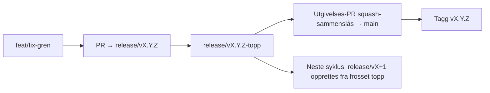

# Branching & Release Model (Norsk)

🌐 **Languages:** 🇺🇸 [English](../../../../ops/BRANCHING_MODEL.md) · 🇪🇹 [am](../../../am/docs/ops/BRANCHING_MODEL.md) · 🇸🇦 [ar](../../../ar/docs/ops/BRANCHING_MODEL.md) · 🇦🇿 [az](../../../az/docs/ops/BRANCHING_MODEL.md) · 🇧🇬 [bg](../../../bg/docs/ops/BRANCHING_MODEL.md) · 🇧🇩 [bn](../../../bn/docs/ops/BRANCHING_MODEL.md) · 🇧🇦 [bs](../../../bs/docs/ops/BRANCHING_MODEL.md) · 🇨🇿 [cs](../../../cs/docs/ops/BRANCHING_MODEL.md) · 🇩🇰 [da](../../../da/docs/ops/BRANCHING_MODEL.md) · 🇩🇪 [de](../../../de/docs/ops/BRANCHING_MODEL.md) · 🇬🇷 [el](../../../el/docs/ops/BRANCHING_MODEL.md) · 🇪🇸 [es](../../../es/docs/ops/BRANCHING_MODEL.md) · 🇪🇪 [et](../../../et/docs/ops/BRANCHING_MODEL.md) · 🇮🇷 [fa](../../../fa/docs/ops/BRANCHING_MODEL.md) · 🇫🇮 [fi](../../../fi/docs/ops/BRANCHING_MODEL.md) · 🇫🇷 [fr](../../../fr/docs/ops/BRANCHING_MODEL.md) · 🇮🇪 [ga](../../../ga/docs/ops/BRANCHING_MODEL.md) · 🇮🇳 [gu](../../../gu/docs/ops/BRANCHING_MODEL.md) · 🇳🇬 [ha](../../../ha/docs/ops/BRANCHING_MODEL.md) · 🇮🇱 [he](../../../he/docs/ops/BRANCHING_MODEL.md) · 🇮🇳 [hi](../../../hi/docs/ops/BRANCHING_MODEL.md) · 🇭🇷 [hr](../../../hr/docs/ops/BRANCHING_MODEL.md) · 🇭🇺 [hu](../../../hu/docs/ops/BRANCHING_MODEL.md) · 🇦🇲 [hy](../../../hy/docs/ops/BRANCHING_MODEL.md) · 🇮🇩 [id](../../../id/docs/ops/BRANCHING_MODEL.md) · 🇳🇬 [ig](../../../ig/docs/ops/BRANCHING_MODEL.md) · 🇮🇹 [it](../../../it/docs/ops/BRANCHING_MODEL.md) · 🇯🇵 [ja](../../../ja/docs/ops/BRANCHING_MODEL.md) · 🇬🇪 [ka](../../../ka/docs/ops/BRANCHING_MODEL.md) · 🇰🇭 [km](../../../km/docs/ops/BRANCHING_MODEL.md) · 🇮🇳 [kn](../../../kn/docs/ops/BRANCHING_MODEL.md) · 🇰🇷 [ko](../../../ko/docs/ops/BRANCHING_MODEL.md) · 🇱🇹 [lt](../../../lt/docs/ops/BRANCHING_MODEL.md) · 🇱🇻 [lv](../../../lv/docs/ops/BRANCHING_MODEL.md) · 🇮🇳 [ml](../../../ml/docs/ops/BRANCHING_MODEL.md) · 🇮🇳 [mr](../../../mr/docs/ops/BRANCHING_MODEL.md) · 🇲🇾 [ms](../../../ms/docs/ops/BRANCHING_MODEL.md) · 🇲🇹 [mt](../../../mt/docs/ops/BRANCHING_MODEL.md) · 🇲🇲 [my](../../../my/docs/ops/BRANCHING_MODEL.md) · 🇳🇵 [ne](../../../ne/docs/ops/BRANCHING_MODEL.md) · 🇳🇱 [nl](../../../nl/docs/ops/BRANCHING_MODEL.md) · 🇮🇳 [or](../../../or/docs/ops/BRANCHING_MODEL.md) · 🇮🇳 [pa](../../../pa/docs/ops/BRANCHING_MODEL.md) · 🇵🇭 [phi](../../../phi/docs/ops/BRANCHING_MODEL.md) · 🇵🇱 [pl](../../../pl/docs/ops/BRANCHING_MODEL.md) · 🇵🇹 [pt](../../../pt/docs/ops/BRANCHING_MODEL.md) · 🇧🇷 [pt-BR](../../../pt-BR/docs/ops/BRANCHING_MODEL.md) · 🇷🇴 [ro](../../../ro/docs/ops/BRANCHING_MODEL.md) · 🇷🇺 [ru](../../../ru/docs/ops/BRANCHING_MODEL.md) · 🇱🇰 [si](../../../si/docs/ops/BRANCHING_MODEL.md) · 🇸🇰 [sk](../../../sk/docs/ops/BRANCHING_MODEL.md) · 🇸🇮 [sl](../../../sl/docs/ops/BRANCHING_MODEL.md) · 🇷🇸 [sr](../../../sr/docs/ops/BRANCHING_MODEL.md) · 🇸🇪 [sv](../../../sv/docs/ops/BRANCHING_MODEL.md) · 🇰🇪 [sw](../../../sw/docs/ops/BRANCHING_MODEL.md) · 🇮🇳 [ta](../../../ta/docs/ops/BRANCHING_MODEL.md) · 🇮🇳 [te](../../../te/docs/ops/BRANCHING_MODEL.md) · 🇹🇭 [th](../../../th/docs/ops/BRANCHING_MODEL.md) · 🇹🇷 [tr](../../../tr/docs/ops/BRANCHING_MODEL.md) · 🇺🇦 [uk-UA](../../../uk-UA/docs/ops/BRANCHING_MODEL.md) · 🇵🇰 [ur](../../../ur/docs/ops/BRANCHING_MODEL.md) · 🇺🇿 [uz](../../../uz/docs/ops/BRANCHING_MODEL.md) · 🇻🇳 [vi](../../../vi/docs/ops/BRANCHING_MODEL.md) · 🇳🇬 [yo](../../../yo/docs/ops/BRANCHING_MODEL.md) · 🇨🇳 [zh-CN](../../../zh-CN/docs/ops/BRANCHING_MODEL.md) · 🇹🇼 [zh-TW](../../../zh-TW/docs/ops/BRANCHING_MODEL.md)

---

OmniRoute bruker en **parallellsyklusmodell** for utgivelser: en dedikert `release/vX.Y.Z`-gren
for den aktive syklusen, `main` for den publiserte linjen og en uforanderlig
`vX.Y.Z`-tagg når syklusen lanseres. Det er forventet at commits legges til både på `release/*` _og_ på
`main` — det er ikke en forveksling.

Detaljer for vedlikeholdere finnes i `CLAUDE.md` (ufravikelig regel nr. 21) og
[RELEASE_CHECKLIST.md](./RELEASE_CHECKLIST.md). Denne siden er det offentlige
sammendraget rettet mot bidragsytere.

## Kort oversikt

| Referanse        | Rolle                                                                                         |
| ---------------- | --------------------------------------------------------------------------------------------- |
| `release/vX.Y.Z` | **Aktiv syklus** — daglig utvikling og sammenslåing av PR-er for denne versjonen              |
| `main`           | **Publisert linje** — mottar syklusen via squash-sammenslåing når utgivelsen lanseres         |
| `vX.Y.Z` (tagg)  | **Lanseringsmarkør** — uforanderlig peker til «det som ble lansert», opprettet ved utgivelsen |



## Hvilken gren skal PR-en min bruke som mål?

**Bruk den aktive `release/vX.Y.Z`-grenen som mål — ikke `main`.**

1. Finn den høyeste åpne `release/v*`-grenen (eksempel i skrivende stund:
   `release/v3.8.49`).
2. Opprett en gren fra den nyeste commiten der (`git fetch` + checkout / rebase mot den).
3. Åpne PR-en med **base = den aktuelle `release/vX.Y.Z`**.

`main` er ikke integrasjonsgrenen for det daglige arbeidet. PR-er som åpnes mot `main`,
må vanligvis få endret målgren før sammenslåing.

## Utgivelsesfrys (parallelle sykluser)

Når en utgivelse avstemmes, åpnes en markørsak med etiketten `release-freeze`.
Dette **stopper ikke utviklingen**:

- Den frosne `release/vX.Y.Z` tilhører utgivelsesansvarlig for denne lanseringen.
- Neste syklus’ `release/vX+1` opprettes fra den frosne toppen, slik at bidragsytere kan fortsette
  å få arbeid innlemmet.
- Åpne PR-er som fortsatt retter seg mot den frosne grenen, bør **få endret målgren** til den
  aktive (høyeste) `release/v*`-grenen.

Se etter en åpen utgivelsesfrys før du antar at grenen du ønsker, kan sammenslås:

```bash
gh issue list --repo diegosouzapw/OmniRoute --label release-freeze --state open
```

Mekanismen for sammenslåing (eierens `queue`-etikett → Mergify) er dokumentert i
[MERGE_TRAIN.md](./MERGE_TRAIN.md).

## Hvorfor både en gren og en tagg?

| Artefakt         | Levetid         | Formål                                                             |
| ---------------- | --------------- | ------------------------------------------------------------------ |
| `release/vX.Y.Z` | Pågående syklus | Samler gjennomgåtte PR-er, holdes grønn i CI og er PR-enes målgren |
| Taggen `vX.Y.Z`  | For alltid      | Markerer nøyaktig det som ble lansert på npm / GitHub Releases     |

Grenen er verkstedet; taggen er den forseglede pakken. Etter squash-sammenslåing til
`main` fortsetter neste syklus på `release/vX+1` uten å vente på at den forrige
utgivelses-PR-en skal fullføres.

## Relatert dokumentasjon

- [CONTRIBUTING.md](../../CONTRIBUTING.md) — oppsett, tester og PR-sjekkliste
- [RELEASE_CHECKLIST.md](./RELEASE_CHECKLIST.md) — validering før lansering
- [MERGE_TRAIN.md](./MERGE_TRAIN.md) — sammenslåingskø og reservetog
- [RELEASE_GREEN.md](./RELEASE_GREEN.md) — slik holdes utgivelsestoppen grønn
