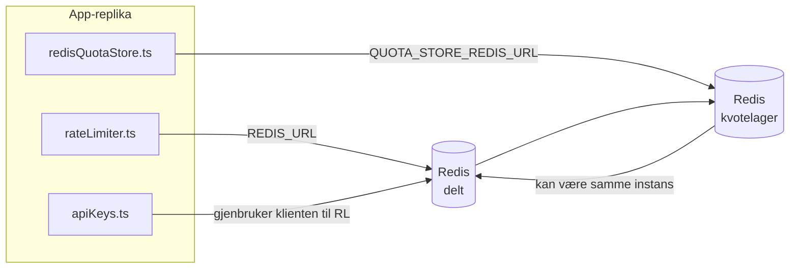

# Redis Production Configuration Guide (Norsk)

🌐 **Languages:** 🇺🇸 [English](../../../../ops/REDIS_PRODUCTION_CONFIG.md) · 🇪🇹 [am](../../../am/docs/ops/REDIS_PRODUCTION_CONFIG.md) · 🇸🇦 [ar](../../../ar/docs/ops/REDIS_PRODUCTION_CONFIG.md) · 🇦🇿 [az](../../../az/docs/ops/REDIS_PRODUCTION_CONFIG.md) · 🇧🇬 [bg](../../../bg/docs/ops/REDIS_PRODUCTION_CONFIG.md) · 🇧🇩 [bn](../../../bn/docs/ops/REDIS_PRODUCTION_CONFIG.md) · 🇨🇿 [cs](../../../cs/docs/ops/REDIS_PRODUCTION_CONFIG.md) · 🇩🇰 [da](../../../da/docs/ops/REDIS_PRODUCTION_CONFIG.md) · 🇩🇪 [de](../../../de/docs/ops/REDIS_PRODUCTION_CONFIG.md) · 🇬🇷 [el](../../../el/docs/ops/REDIS_PRODUCTION_CONFIG.md) · 🇪🇸 [es](../../../es/docs/ops/REDIS_PRODUCTION_CONFIG.md) · 🇪🇪 [et](../../../et/docs/ops/REDIS_PRODUCTION_CONFIG.md) · 🇮🇷 [fa](../../../fa/docs/ops/REDIS_PRODUCTION_CONFIG.md) · 🇫🇮 [fi](../../../fi/docs/ops/REDIS_PRODUCTION_CONFIG.md) · 🇫🇷 [fr](../../../fr/docs/ops/REDIS_PRODUCTION_CONFIG.md) · 🇮🇪 [ga](../../../ga/docs/ops/REDIS_PRODUCTION_CONFIG.md) · 🇮🇳 [gu](../../../gu/docs/ops/REDIS_PRODUCTION_CONFIG.md) · 🇳🇬 [ha](../../../ha/docs/ops/REDIS_PRODUCTION_CONFIG.md) · 🇮🇱 [he](../../../he/docs/ops/REDIS_PRODUCTION_CONFIG.md) · 🇮🇳 [hi](../../../hi/docs/ops/REDIS_PRODUCTION_CONFIG.md) · 🇭🇷 [hr](../../../hr/docs/ops/REDIS_PRODUCTION_CONFIG.md) · 🇭🇺 [hu](../../../hu/docs/ops/REDIS_PRODUCTION_CONFIG.md) · 🇦🇲 [hy](../../../hy/docs/ops/REDIS_PRODUCTION_CONFIG.md) · 🇮🇩 [id](../../../id/docs/ops/REDIS_PRODUCTION_CONFIG.md) · 🇳🇬 [ig](../../../ig/docs/ops/REDIS_PRODUCTION_CONFIG.md) · 🇮🇹 [it](../../../it/docs/ops/REDIS_PRODUCTION_CONFIG.md) · 🇯🇵 [ja](../../../ja/docs/ops/REDIS_PRODUCTION_CONFIG.md) · 🇬🇪 [ka](../../../ka/docs/ops/REDIS_PRODUCTION_CONFIG.md) · 🇰🇭 [km](../../../km/docs/ops/REDIS_PRODUCTION_CONFIG.md) · 🇮🇳 [kn](../../../kn/docs/ops/REDIS_PRODUCTION_CONFIG.md) · 🇰🇷 [ko](../../../ko/docs/ops/REDIS_PRODUCTION_CONFIG.md) · 🇱🇹 [lt](../../../lt/docs/ops/REDIS_PRODUCTION_CONFIG.md) · 🇱🇻 [lv](../../../lv/docs/ops/REDIS_PRODUCTION_CONFIG.md) · 🇮🇳 [ml](../../../ml/docs/ops/REDIS_PRODUCTION_CONFIG.md) · 🇮🇳 [mr](../../../mr/docs/ops/REDIS_PRODUCTION_CONFIG.md) · 🇲🇾 [ms](../../../ms/docs/ops/REDIS_PRODUCTION_CONFIG.md) · 🇲🇹 [mt](../../../mt/docs/ops/REDIS_PRODUCTION_CONFIG.md) · 🇲🇲 [my](../../../my/docs/ops/REDIS_PRODUCTION_CONFIG.md) · 🇳🇵 [ne](../../../ne/docs/ops/REDIS_PRODUCTION_CONFIG.md) · 🇳🇱 [nl](../../../nl/docs/ops/REDIS_PRODUCTION_CONFIG.md) · 🇮🇳 [or](../../../or/docs/ops/REDIS_PRODUCTION_CONFIG.md) · 🇮🇳 [pa](../../../pa/docs/ops/REDIS_PRODUCTION_CONFIG.md) · 🇵🇭 [phi](../../../phi/docs/ops/REDIS_PRODUCTION_CONFIG.md) · 🇵🇱 [pl](../../../pl/docs/ops/REDIS_PRODUCTION_CONFIG.md) · 🇵🇹 [pt](../../../pt/docs/ops/REDIS_PRODUCTION_CONFIG.md) · 🇧🇷 [pt-BR](../../../pt-BR/docs/ops/REDIS_PRODUCTION_CONFIG.md) · 🇷🇴 [ro](../../../ro/docs/ops/REDIS_PRODUCTION_CONFIG.md) · 🇷🇺 [ru](../../../ru/docs/ops/REDIS_PRODUCTION_CONFIG.md) · 🇱🇰 [si](../../../si/docs/ops/REDIS_PRODUCTION_CONFIG.md) · 🇸🇰 [sk](../../../sk/docs/ops/REDIS_PRODUCTION_CONFIG.md) · 🇸🇮 [sl](../../../sl/docs/ops/REDIS_PRODUCTION_CONFIG.md) · 🇷🇸 [sr](../../../sr/docs/ops/REDIS_PRODUCTION_CONFIG.md) · 🇸🇪 [sv](../../../sv/docs/ops/REDIS_PRODUCTION_CONFIG.md) · 🇰🇪 [sw](../../../sw/docs/ops/REDIS_PRODUCTION_CONFIG.md) · 🇮🇳 [ta](../../../ta/docs/ops/REDIS_PRODUCTION_CONFIG.md) · 🇮🇳 [te](../../../te/docs/ops/REDIS_PRODUCTION_CONFIG.md) · 🇹🇭 [th](../../../th/docs/ops/REDIS_PRODUCTION_CONFIG.md) · 🇹🇷 [tr](../../../tr/docs/ops/REDIS_PRODUCTION_CONFIG.md) · 🇺🇦 [uk-UA](../../../uk-UA/docs/ops/REDIS_PRODUCTION_CONFIG.md) · 🇵🇰 [ur](../../../ur/docs/ops/REDIS_PRODUCTION_CONFIG.md) · 🇺🇿 [uz](../../../uz/docs/ops/REDIS_PRODUCTION_CONFIG.md) · 🇻🇳 [vi](../../../vi/docs/ops/REDIS_PRODUCTION_CONFIG.md) · 🇳🇬 [yo](../../../yo/docs/ops/REDIS_PRODUCTION_CONFIG.md) · 🇨🇳 [zh-CN](../../../zh-CN/docs/ops/REDIS_PRODUCTION_CONFIG.md) · 🇹🇼 [zh-TW](../../../zh-TW/docs/ops/REDIS_PRODUCTION_CONFIG.md)

---

## Oversikt

Redis er en **valgfri, løs avhengighet** i OmniRoute — applikasjonen reduserer funksjonaliteten på en kontrollert måte (tilbakefall
til minnebaserte løsninger) når Redis er utilgjengelig. I produksjon reduserer optimalisering av Redis ventetiden for fire forskjellige
arbeidsbelastninger:

| Arbeidsbelastning          | Driver                        | Klientfabrikk                                             | Nøkkelmønster                                                 |
| -------------------------- | ----------------------------- | --------------------------------------------------------- | ------------------------------------------------------------- |
| Hastighetsbegrensning      | `rateLimiter.ts`              | `getRedisClient()` — lat initialisert `ioredis`-singleton | `<prefix>rl:*` Lua-atomiske vinduer for hastighetsbegrensning |
| Autentiseringsbuffer       | `apiKeys.ts`                  | Gjenbruker klienten til `rateLimiter`                     | `<prefix>auth:api_key:<sha256>` med TTL                       |
| Kvotelager                 | `redisQuotaStore.ts`          | Separat `getRedisClient(url)`-singleton                   | `<prefix>quota:*` konfigurerbart per instans                  |
| Kretsbryter for oppvarming | `redisCircuitBreakerStore.ts` | Separat klient i `circuitBreakerFactory.ts`               | `<prefix>warmup:cb:<connectionId>`                            |

Alle fire arbeidsbelastningene deler ett navneromprefiks, slik at OmniRoute kan eksistere side om side med andre apper på en
enkelt Redis-instans (f.eks. `127.0.0.1:6379`). Se [Navnerom for nøkler](#key-namespacing).

---

## Gjeldende konfigurasjon (standardverdier i koden)

| Innstilling                             | Verdi                                                                | Hvor                                                                                  |
| --------------------------------------- | -------------------------------------------------------------------- | ------------------------------------------------------------------------------------- |
| Miljøvariabelen `REDIS_URL`             | `redis://redis:6379` (compose), valgfri                              | `rateLimiter.ts:5`, `.env.example`                                                    |
| Miljøvariabelen `REDIS_KEY_PREFIX`      | `omniroute:` (standard)                                              | `rateLimiter.ts`, `redisQuotaStore.ts`, `redisCircuitBreakerStore.ts`, `.env.example` |
| Miljøvariabelen `QUOTA_STORE_REDIS_URL` | separat, kan avvike fra `REDIS_URL`                                  | `quota/storeFactory.ts`                                                               |
| `QUOTA_STORE_DRIVER`                    | `"sqlite"` (standard), `"redis"` valgfritt                           | `quota/storeFactory.ts`                                                               |
| ioredis `maxRetriesPerRequest`          | `3`                                                                  | opprettelse av klient i `rateLimiter.ts`                                              |
| `enableReadyCheck`                      | ikke angitt (standard for ioredis: `true`)                           | —                                                                                     |
| `lazyConnect`                           | ikke angitt (standard for ioredis: `false`)                          | —                                                                                     |
| `retryStrategy`                         | ikke angitt (standard for ioredis: 200 ms grunnverdi, eksponentiell) | —                                                                                     |
| TLS / passord / databaseindeks          | **ikke konfigurert**                                                 | —                                                                                     |
| Sentinel / Cluster                      | **ikke konfigurert** — kun frittstående enkeltnode                   | —                                                                                     |

---

## Navnerom for nøkler

OmniRoute deler en Redis-instans med alt annet som kjører på verten. Uten et navnerom
kan nøkler som `auth:api_key:<sha256>` eller `rl:*` kollidere med nøkler fra andre applikasjoner
som bruker samme Redis (denne instansen kjører Redis på `127.0.0.1:6379` sammen med andre tjenester).

Sett `REDIS_KEY_PREFIX` til en ikke-tom streng for å gi **alle** OmniRoute-nøkler et prefiks:

```bash
# .env — alle OmniRoute-nøkler blir omniroute:rl:*, omniroute:auth:*, omniroute:quota:*, omniroute:warmup:cb:*
REDIS_KEY_PREFIX=omniroute:
```

- **Standard:** `omniroute:` (brukes når `REDIS_KEY_PREFIX` ikke er angitt eller er tom).
- **Brukes på:** hastighetsbegrenseren + autentiseringsbufferen (delt `ioredis`-klient via `keyPrefix`) og
  kvotelageret (`KEY_PREFIX = "${REDIS_KEY_PREFIX}quota"`) samt kretsbryteren for oppvarming
  (`KEY_PREFIX = "${REDIS_KEY_PREFIX}warmup:cb:"`).
- **Endring av prefikset** når nøkler allerede finnes i Redis, etterlater de gamle nøklene uten tilknytning (de utløper
  via TTL / LRU). Det er trygt å endre prefikset; ingen migrering er nødvendig. Det eneste unntaket er en nøkkel for
  kretsbryteren for oppvarming til en tilkobling som er merket som forbudt: Den lagres uten TTL, så
  vis gjenværende nøkler med `redis-cli --scan --pattern '<old-prefix>warmup:cb:*'` og slett dem.
- **ioredis `keyPrefix`** legger automatisk til prefikset ved skriving **og** fjerner det ved lesing,
  slik at applikasjonskoden aldri ser prefikset.

---

## Anbefalt produksjonsoptimalisering

### 1. Tilkoblingspool / klientalternativer (ioredis-`Redis`-konstruktør)

Den nåværende koden oppretter én enkelt `new Redis(url)` uten egendefinerte alternativer. For produksjonsdistribusjoner
med flere replikaer bør du angi en klientfabrikk i koden eller pakke inn `getRedisClient()`:

```typescript
const redis = new Redis(REDIS_URL, {
  maxRetriesPerRequest: null, // ingen grense for nye forsøk; la retryStrategy bestemme
  enableReadyCheck: true, // kontroller at serveren er klar før kall godtas
  lazyConnect: true, // ikke koble til ved opprettelse; vent på første kall
  retryStrategy: (times) => {
    if (times > 10) return null; // gi opp etter 10 forsøk → koble til på nytt senere
    return Math.min(times * 200, 5000); // 200 ms, 400 ms, …, maks. 5 s
  },
  enableAutoPipelining: true, // slå sammen samtidige kommandoer til én TCP-skriving
  keepAlive: 10000, // TCP keep-alive hvert 10. sekund
});
```

**Viktige avveininger:**

- `maxRetriesPerRequest: null` + `retryStrategy` — foretrukket i produksjon, slik at midlertidige
  omstarter av Redis ikke umiddelbart fører til at alle forespørsler mislykkes. Reserveløsningen i minnet i
  `checkRateLimit()` håndterer feilforløpet.
- `lazyConnect: true` — unngår at oppstarten avhenger av at Redis er tilgjengelig før serveren
  begynner å godta tilkoblinger.
- `enableAutoPipelining: true` — reduserer tur-retur-tiden for samtidige hastighetsbegrensningskontroller;
  fordelaktig ved >50 forespørsler per sekund på én enkelt tilkobling.

### 2. Redis-serverkonfigurasjon (`redis.conf`)

```
# Minne
maxmemory 80%                        # la det være plass til operativsystemets sidebuffer
maxmemory-policy allkeys-lru         # fjern gamle oppføringer fra autentiseringsbufferen under belastning

# Persistens (valgfritt — OmniRoute er krasjsikker uten dette)
save 300 1                           # opprett øyeblikksbilde minst hvert 5. minutt hvis ≥1 nøkkel er endret
appendonly no                        # AOF er ikke nødvendig; dataene kan genereres på nytt
appendfsync no                       # ingen fsync-belastning (RDB er tilstrekkelig)

# Nettverk
timeout 0                            # ingen frakobling ved inaktivitet
tcp-keepalive 300                    # keep-alive hvert 5. minutt
tcp-backlog 511                      # tilkoblingskø for belastningstopper

# Ytelse
hz 10                                # standardverdi; 100 for latensfølsomme systemer
activedefrag yes                     # defragmenter automatisk når fragmenteringen er >10 %
```

**Avveining for `maxmemory-policy allkeys-lru`:** Oppføringer i autentiseringsbufferen kan bli fjernet ved
minnepress. Dette er trygt — `setCachedApiKey` fyller alltid inn data på nytt ved manglende treff, og
SQLite-reserveløsningen er autoritativ. Lua-skriptet for hastighetsbegrensning oppretter små nøkler som
med hensikt har kort levetid.

### 3. Docker Compose-innstillinger

Compose-filen for produksjon (`docker-compose.prod.yml`) bruker `redis:8.6.2-alpine`. Legg til:

```yaml
redis:
  image: redis:8.6.2-alpine
  command:
    [
      "redis-server",
      "--maxmemory",
      "512mb",
      "--maxmemory-policy",
      "allkeys-lru",
      "--activedefrag",
      "yes",
      "--save",
      "300 1",
    ]
  healthcheck:
    test: ["CMD", "redis-cli", "ping"]
    interval: 10s
    timeout: 3s
    retries: 3
    start_period: 5s
```

### 4. Hensyn ved flere instanser / skalering

**Én Redis for alle replikaer** — Lua-skriptet for hastighetsbegrensning er avhengig av ett enkelt
autoritativt nøkkelområde. Flere Redis-instanser bak replikaene ville medført tapt atomisitet
og doblet budsjettet. Bruk én enkelt Redis (eller en Redis Sentinel-klynge med failover) for
alle applikasjonsreplikaer.

**Antall tilkoblinger:** Hver applikasjonsreplika åpner **2 TCP-tilkoblinger** til Redis
(klient for hastighetsbegrensning + klient for kvotelagring). Ved 10 replikaer → 20 tilkoblinger, godt
innenfor standardgrensen på 10 000 tilkoblinger for en Redis-instans.

### 5. Overvåking

Eksponer via endepunktet for tilstandskontroll:

```typescript
// src/app/api/monitoring/health/route.ts kaller allerede funksjoner for hastighetsbegrensning
// Legg til Redis-spesifikke kontroller:
//   1. PING-latens via ioredis .ping()
//   2. Minnebruk via INFO memory
//   3. Antall tilkoblinger via INFO clients
//   4. Treffrate for maxmemory-policy (evicted_keys / keyspace_hits)
```

Viktige måleverdier å overvåke:

- **Fjernede nøkler / sek** — hvis verdien vedvarende er ulik null, øk `maxmemory`
- **Blokkerte klienter** — en verdi ulik null tyder på langsomme Lua-skript eller høy konkurranse om ressurser
- **Avviste tilkoblinger** — tilkoblingsgrensen er nådd; sjelden ved 20 tilkoblinger

---

## Arkitekturdiagram



---

## Referanser

| Fil                                | Formål                                                                      |
| ---------------------------------- | --------------------------------------------------------------------------- |
| `src/shared/utils/rateLimiter.ts`  | Primær Redis-klient, Lua-skript for hastighetsbegrensning, reserve i minnet |
| `src/lib/db/apiKeys.ts`            | Autentiseringsbuffer — Redis→SQLite-reserve                                 |
| `src/lib/quota/redisQuotaStore.ts` | Separat Redis-klient for valgfritt kvotelager                               |
| `src/lib/quota/storeFactory.ts`    | Bytter mellom kvotedriverne `sqlite` og `redis`                             |
| `docker-compose.prod.yml`          | Redis-container for produksjon (image `redis:8.6.2-alpine`)                 |
| `.env.example`                     | Dokumentasjon for Redis-miljøvariabler                                      |
| `src/app/api/local/redis/`         | API-ruter for orkestrering av utviklingscontainer                           |
| `bin/cli/commands/redis.mjs`       | CLI-kommandoer for orkestrering av utviklingscontainer                      |
