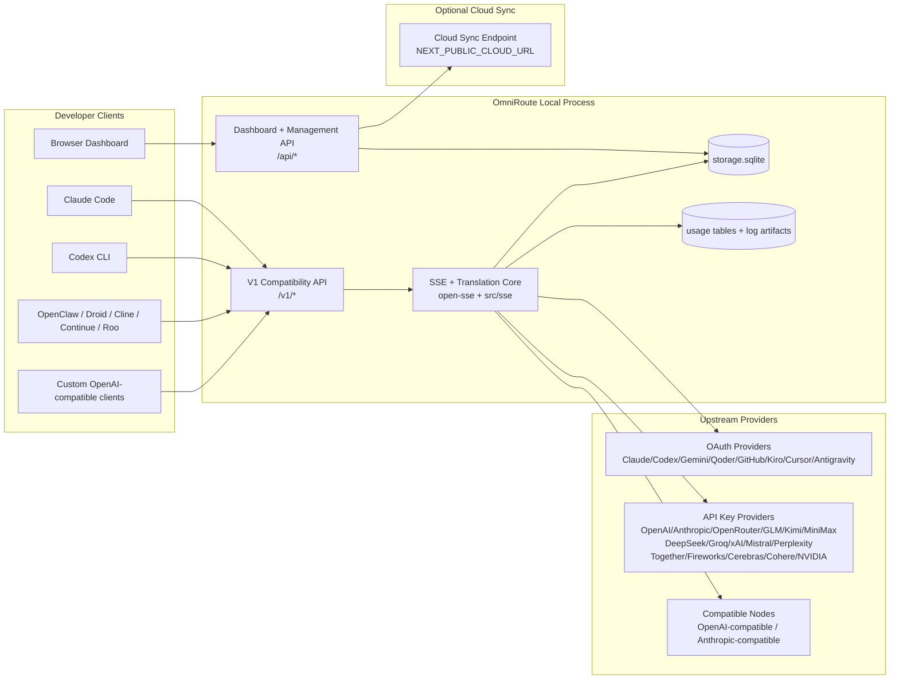
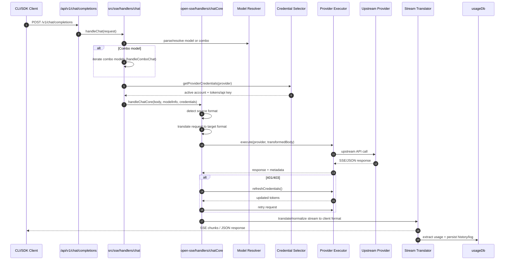
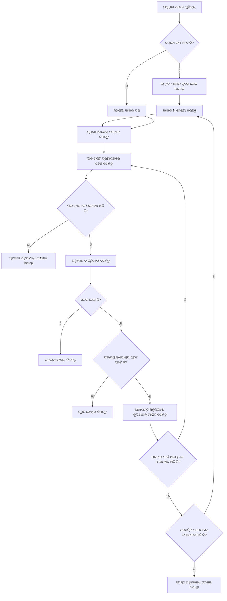
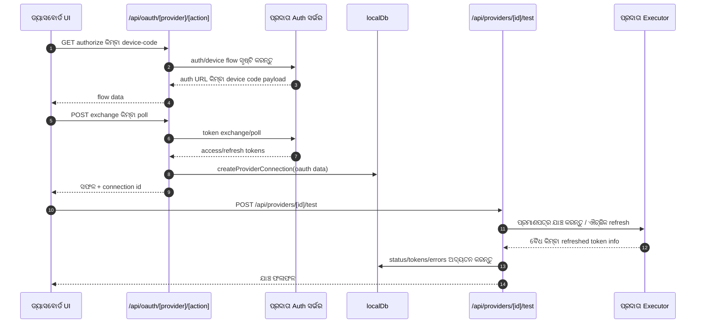
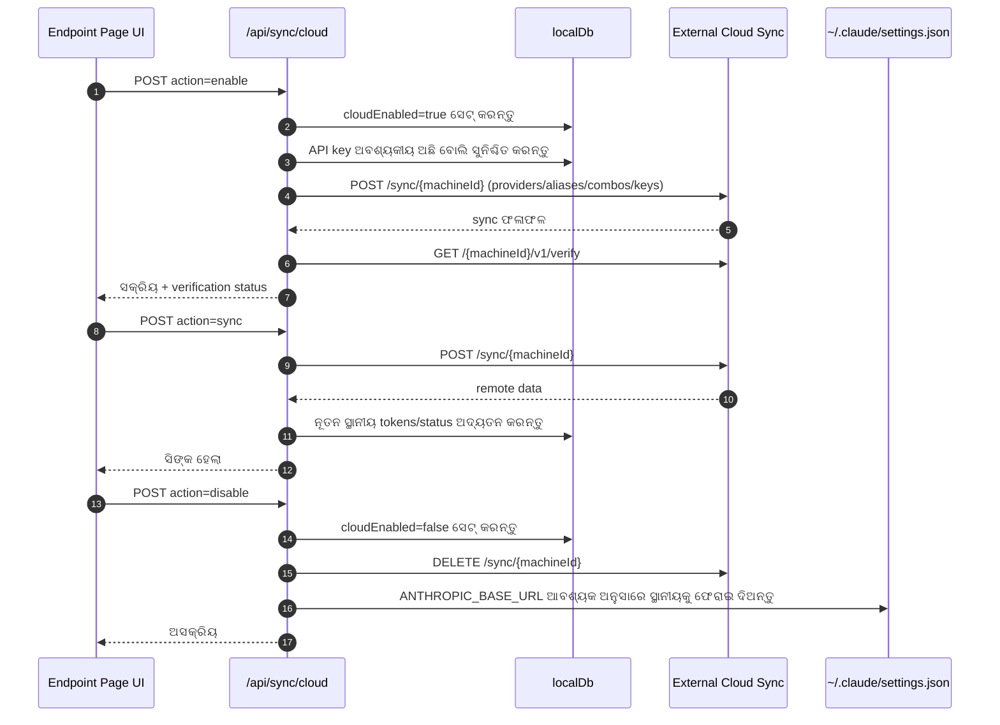
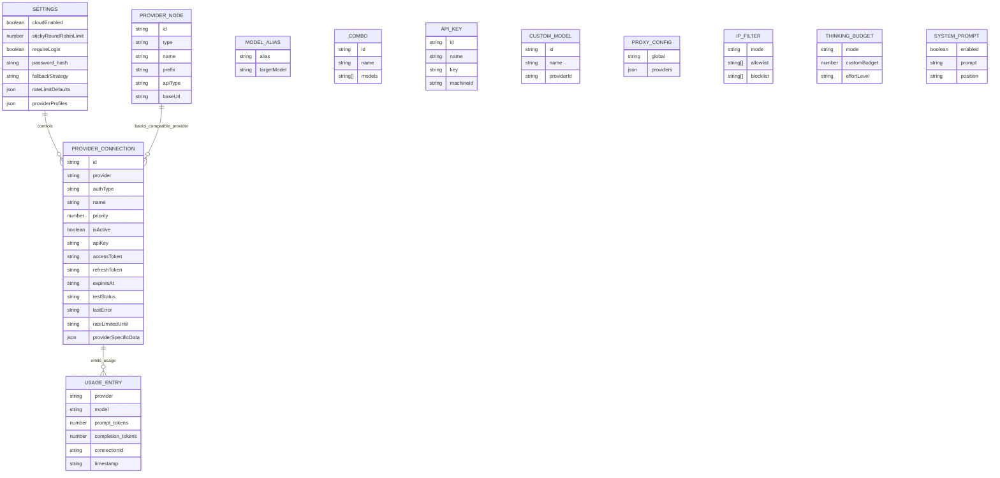
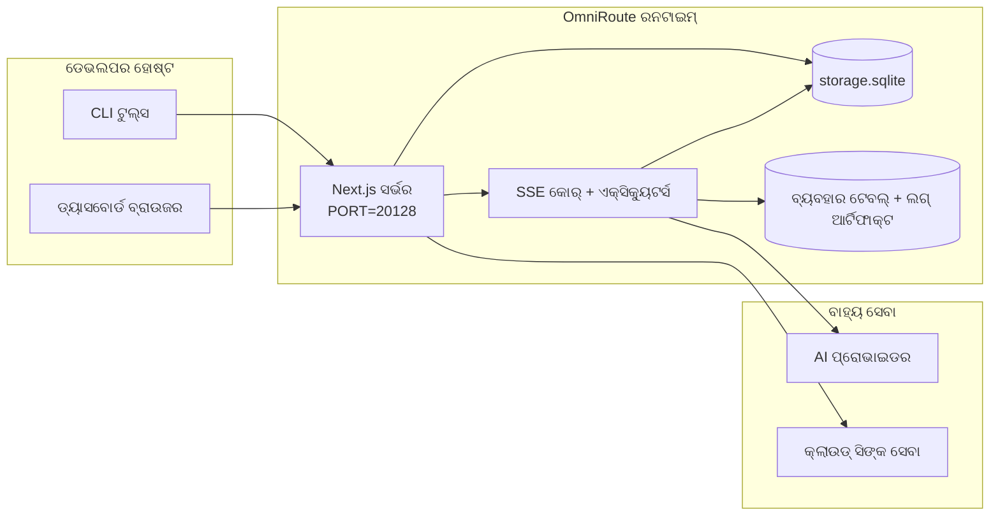

# OmniRoute Architecture (ଓଡ଼ିଆ)

🌐 **Languages:** 🇺🇸 [English](../../../../architecture/ARCHITECTURE.md) · 🇪🇹 [am](../../../am/docs/architecture/ARCHITECTURE.md) · 🇸🇦 [ar](../../../ar/docs/architecture/ARCHITECTURE.md) · 🇦🇿 [az](../../../az/docs/architecture/ARCHITECTURE.md) · 🇧🇬 [bg](../../../bg/docs/architecture/ARCHITECTURE.md) · 🇧🇩 [bn](../../../bn/docs/architecture/ARCHITECTURE.md) · 🇧🇦 [bs](../../../bs/docs/architecture/ARCHITECTURE.md) · 🇨🇿 [cs](../../../cs/docs/architecture/ARCHITECTURE.md) · 🇩🇰 [da](../../../da/docs/architecture/ARCHITECTURE.md) · 🇩🇪 [de](../../../de/docs/architecture/ARCHITECTURE.md) · 🇬🇷 [el](../../../el/docs/architecture/ARCHITECTURE.md) · 🇪🇸 [es](../../../es/docs/architecture/ARCHITECTURE.md) · 🇪🇪 [et](../../../et/docs/architecture/ARCHITECTURE.md) · 🇮🇷 [fa](../../../fa/docs/architecture/ARCHITECTURE.md) · 🇫🇮 [fi](../../../fi/docs/architecture/ARCHITECTURE.md) · 🇫🇷 [fr](../../../fr/docs/architecture/ARCHITECTURE.md) · 🇮🇪 [ga](../../../ga/docs/architecture/ARCHITECTURE.md) · 🇮🇳 [gu](../../../gu/docs/architecture/ARCHITECTURE.md) · 🇳🇬 [ha](../../../ha/docs/architecture/ARCHITECTURE.md) · 🇮🇱 [he](../../../he/docs/architecture/ARCHITECTURE.md) · 🇮🇳 [hi](../../../hi/docs/architecture/ARCHITECTURE.md) · 🇭🇷 [hr](../../../hr/docs/architecture/ARCHITECTURE.md) · 🇭🇺 [hu](../../../hu/docs/architecture/ARCHITECTURE.md) · 🇦🇲 [hy](../../../hy/docs/architecture/ARCHITECTURE.md) · 🇮🇩 [id](../../../id/docs/architecture/ARCHITECTURE.md) · 🇳🇬 [ig](../../../ig/docs/architecture/ARCHITECTURE.md) · 🇮🇹 [it](../../../it/docs/architecture/ARCHITECTURE.md) · 🇯🇵 [ja](../../../ja/docs/architecture/ARCHITECTURE.md) · 🇬🇪 [ka](../../../ka/docs/architecture/ARCHITECTURE.md) · 🇰🇭 [km](../../../km/docs/architecture/ARCHITECTURE.md) · 🇮🇳 [kn](../../../kn/docs/architecture/ARCHITECTURE.md) · 🇰🇷 [ko](../../../ko/docs/architecture/ARCHITECTURE.md) · 🇱🇹 [lt](../../../lt/docs/architecture/ARCHITECTURE.md) · 🇱🇻 [lv](../../../lv/docs/architecture/ARCHITECTURE.md) · 🇮🇳 [ml](../../../ml/docs/architecture/ARCHITECTURE.md) · 🇮🇳 [mr](../../../mr/docs/architecture/ARCHITECTURE.md) · 🇲🇾 [ms](../../../ms/docs/architecture/ARCHITECTURE.md) · 🇲🇹 [mt](../../../mt/docs/architecture/ARCHITECTURE.md) · 🇲🇲 [my](../../../my/docs/architecture/ARCHITECTURE.md) · 🇳🇵 [ne](../../../ne/docs/architecture/ARCHITECTURE.md) · 🇳🇱 [nl](../../../nl/docs/architecture/ARCHITECTURE.md) · 🇳🇴 [no](../../../no/docs/architecture/ARCHITECTURE.md) · 🇮🇳 [pa](../../../pa/docs/architecture/ARCHITECTURE.md) · 🇵🇭 [phi](../../../phi/docs/architecture/ARCHITECTURE.md) · 🇵🇱 [pl](../../../pl/docs/architecture/ARCHITECTURE.md) · 🇵🇹 [pt](../../../pt/docs/architecture/ARCHITECTURE.md) · 🇧🇷 [pt-BR](../../../pt-BR/docs/architecture/ARCHITECTURE.md) · 🇷🇴 [ro](../../../ro/docs/architecture/ARCHITECTURE.md) · 🇷🇺 [ru](../../../ru/docs/architecture/ARCHITECTURE.md) · 🇱🇰 [si](../../../si/docs/architecture/ARCHITECTURE.md) · 🇸🇰 [sk](../../../sk/docs/architecture/ARCHITECTURE.md) · 🇸🇮 [sl](../../../sl/docs/architecture/ARCHITECTURE.md) · 🇷🇸 [sr](../../../sr/docs/architecture/ARCHITECTURE.md) · 🇸🇪 [sv](../../../sv/docs/architecture/ARCHITECTURE.md) · 🇰🇪 [sw](../../../sw/docs/architecture/ARCHITECTURE.md) · 🇮🇳 [ta](../../../ta/docs/architecture/ARCHITECTURE.md) · 🇮🇳 [te](../../../te/docs/architecture/ARCHITECTURE.md) · 🇹🇭 [th](../../../th/docs/architecture/ARCHITECTURE.md) · 🇹🇷 [tr](../../../tr/docs/architecture/ARCHITECTURE.md) · 🇺🇦 [uk-UA](../../../uk-UA/docs/architecture/ARCHITECTURE.md) · 🇵🇰 [ur](../../../ur/docs/architecture/ARCHITECTURE.md) · 🇺🇿 [uz](../../../uz/docs/architecture/ARCHITECTURE.md) · 🇻🇳 [vi](../../../vi/docs/architecture/ARCHITECTURE.md) · 🇳🇬 [yo](../../../yo/docs/architecture/ARCHITECTURE.md) · 🇨🇳 [zh-CN](../../../zh-CN/docs/architecture/ARCHITECTURE.md) · 🇹🇼 [zh-TW](../../../zh-TW/docs/architecture/ARCHITECTURE.md)

---

🌐 **Languages:** 🇺🇸 [English](../../../../architecture/ARCHITECTURE.md) · 🇪🇹 [am](../../../am/docs/architecture/ARCHITECTURE.md) · 🇸🇦 [ar](../../../ar/docs/architecture/ARCHITECTURE.md) · 🇦🇿 [az](../../../az/docs/architecture/ARCHITECTURE.md) · 🇧🇬 [bg](../../../bg/docs/architecture/ARCHITECTURE.md) · 🇧🇩 [bn](../../../bn/docs/architecture/ARCHITECTURE.md) · 🇧🇦 [bs](../../../bs/docs/architecture/ARCHITECTURE.md) · 🇨🇿 [cs](../../../cs/docs/architecture/ARCHITECTURE.md) · 🇩🇰 [da](../../../da/docs/architecture/ARCHITECTURE.md) · 🇩🇪 [de](../../../de/docs/architecture/ARCHITECTURE.md) · 🇬🇷 [el](../../../el/docs/architecture/ARCHITECTURE.md) · 🇪🇸 [es](../../../es/docs/architecture/ARCHITECTURE.md) · 🇪🇪 [et](../../../et/docs/architecture/ARCHITECTURE.md) · 🇮🇷 [fa](../../../fa/docs/architecture/ARCHITECTURE.md) · 🇫🇮 [fi](../../../fi/docs/architecture/ARCHITECTURE.md) · 🇫🇷 [fr](../../../fr/docs/architecture/ARCHITECTURE.md) · 🇮🇪 [ga](../../../ga/docs/architecture/ARCHITECTURE.md) · 🇮🇳 [gu](../../../gu/docs/architecture/ARCHITECTURE.md) · 🇳🇬 [ha](../../../ha/docs/architecture/ARCHITECTURE.md) · 🇮🇱 [he](../../../he/docs/architecture/ARCHITECTURE.md) · 🇮🇳 [hi](../../../hi/docs/architecture/ARCHITECTURE.md) · 🇭🇷 [hr](../../../hr/docs/architecture/ARCHITECTURE.md) · 🇭🇺 [hu](../../../hu/docs/architecture/ARCHITECTURE.md) · 🇦🇲 [hy](../../../hy/docs/architecture/ARCHITECTURE.md) · 🇮🇩 [id](../../../id/docs/architecture/ARCHITECTURE.md) · 🇳🇬 [ig](../../../ig/docs/architecture/ARCHITECTURE.md) · 🇮🇹 [it](../../../it/docs/architecture/ARCHITECTURE.md) · 🇯🇵 [ja](../../../ja/docs/architecture/ARCHITECTURE.md) · 🇬🇪 [ka](../../../ka/docs/architecture/ARCHITECTURE.md) · 🇰🇭 [km](../../../km/docs/architecture/ARCHITECTURE.md) · 🇮🇳 [kn](../../../kn/docs/architecture/ARCHITECTURE.md) · 🇰🇷 [ko](../../../ko/docs/architecture/ARCHITECTURE.md) · 🇱🇹 [lt](../../../lt/docs/architecture/ARCHITECTURE.md) · 🇱🇻 [lv](../../../lv/docs/architecture/ARCHITECTURE.md) · 🇮🇳 [ml](../../../ml/docs/architecture/ARCHITECTURE.md) · 🇮🇳 [mr](../../../mr/docs/architecture/ARCHITECTURE.md) · 🇲🇾 [ms](../../../ms/docs/architecture/ARCHITECTURE.md) · 🇲🇹 [mt](../../../mt/docs/architecture/ARCHITECTURE.md) · 🇲🇲 [my](../../../my/docs/architecture/ARCHITECTURE.md) · 🇳🇵 [ne](../../../ne/docs/architecture/ARCHITECTURE.md) · 🇳🇱 [nl](../../../nl/docs/architecture/ARCHITECTURE.md) · 🇳🇴 [no](../../../no/docs/architecture/ARCHITECTURE.md) · 🇮🇳 [pa](../../../pa/docs/architecture/ARCHITECTURE.md) · 🇵🇭 [phi](../../../phi/docs/architecture/ARCHITECTURE.md) · 🇵🇱 [pl](../../../pl/docs/architecture/ARCHITECTURE.md) · 🇵🇹 [pt](../../../pt/docs/architecture/ARCHITECTURE.md) · 🇧🇷 [pt-BR](../../../pt-BR/docs/architecture/ARCHITECTURE.md) · 🇷🇴 [ro](../../../ro/docs/architecture/ARCHITECTURE.md) · 🇷🇺 [ru](../../../ru/docs/architecture/ARCHITECTURE.md) · 🇱🇰 [si](../../../si/docs/architecture/ARCHITECTURE.md) · 🇸🇰 [sk](../../../sk/docs/architecture/ARCHITECTURE.md) · 🇸🇮 [sl](../../../sl/docs/architecture/ARCHITECTURE.md) · 🇷🇸 [sr](../../../sr/docs/architecture/ARCHITECTURE.md) · 🇸🇪 [sv](../../../sv/docs/architecture/ARCHITECTURE.md) · 🇰🇪 [sw](../../../sw/docs/architecture/ARCHITECTURE.md) · 🇮🇳 [ta](../../../ta/docs/architecture/ARCHITECTURE.md) · 🇮🇳 [te](../../../te/docs/architecture/ARCHITECTURE.md) · 🇹🇭 [th](../../../th/docs/architecture/ARCHITECTURE.md) · 🇹🇷 [tr](../../../tr/docs/architecture/ARCHITECTURE.md) · 🇺🇦 [uk-UA](../../../uk-UA/docs/architecture/ARCHITECTURE.md) · 🇵🇰 [ur](../../../ur/docs/architecture/ARCHITECTURE.md) · 🇺🇿 [uz](../../../uz/docs/architecture/ARCHITECTURE.md) · 🇻🇳 [vi](../../../vi/docs/architecture/ARCHITECTURE.md) · 🇳🇬 [yo](../../../yo/docs/architecture/ARCHITECTURE.md) · 🇨🇳 [zh-CN](../../../zh-CN/docs/architecture/ARCHITECTURE.md) · 🇹🇼 [zh-TW](../../../zh-TW/docs/architecture/ARCHITECTURE.md)

_ଶେଷ ଅଦ୍ୟତନ: 2026-06-28_

## କାର୍ଯ୍ୟନିର୍ବାହୀ ସାରାଂଶ

OmniRoute ହେଉଛି Next.js ଉପରେ ନିର୍ମିତ ଏକ ସ୍ଥାନୀୟ AI ରାଉଟିଂ ଗେଟୱେ ଏବଂ ଡ୍ୟାସବୋର୍ଡ।
ଏହା ଏକକ OpenAI-ସୁସଙ୍ଗତ ଏଣ୍ଡପଏଣ୍ଟ (`/v1/*`) ପ୍ରଦାନ କରେ ଏବଂ ଅନୁବାଦ, ଫଲବ୍ୟାକ୍, ଟୋକେନ୍ ରିଫ୍ରେଶ୍ ଓ ବ୍ୟବହାର ଟ୍ରାକିଂ ସହିତ ଏକାଧିକ ଅପ୍ଷ୍ଟ୍ରିମ୍ ପ୍ରଦାତା ମଧ୍ୟରେ ଟ୍ରାଫିକ୍ ରାଉଟ୍ କରେ।

ମୁଖ୍ୟ କ୍ଷମତାଗୁଡ଼ିକ:

- CLI/ଟୁଲ୍ ପାଇଁ OpenAI-ସୁସଙ୍ଗତ API ପୃଷ୍ଠଭାଗ (355 ପ୍ରଦାତା, 108 ନିର୍ବାହକ)
- ପ୍ରଦାତା ଫର୍ମାଟ୍ଗୁଡ଼ିକ ମଧ୍ୟରେ ଅନୁରୋଧ/ପ୍ରତିକ୍ରିୟା ଅନୁବାଦ
- ମଡେଲ୍ କମ୍ବୋ ଫଲବ୍ୟାକ୍ (ଏକାଧିକ ମଡେଲ୍ର କ୍ରମ)
- `compositeTiers` ଅନୁଯାୟୀ ରନ୍ଟାଇମ୍ କ୍ରମ ସହିତ ସଂରଚିତ କମ୍ବୋ ପଦକ୍ଷେପ (`provider + model + connection`)
- ଆକାଉଣ୍ଟ-ସ୍ତରୀୟ ଫଲବ୍ୟାକ୍ (ପ୍ରତି ପ୍ରଦାତା ପାଇଁ ଏକାଧିକ ଆକାଉଣ୍ଟ)
- ମୁଖ୍ୟ ଚାଟ୍ ପଥରେ କୋଟା ପ୍ରିଫ୍ଲାଇଟ୍ ଏବଂ କୋଟା-ସଚେତନ P2C ଆକାଉଣ୍ଟ ଚୟନ
- OAuth + API-କୀ ପ୍ରଦାତା ସଂଯୋଗ ପରିଚାଳନା (22 OAuth ପ୍ରଦାତା ମଡ୍ୟୁଲ୍)
- `/v1/embeddings` ମାଧ୍ୟମରେ ଏମ୍ବେଡିଂ ସୃଷ୍ଟି (18 ପ୍ରଦାତା)
- `/v1/images/generations` ମାଧ୍ୟମରେ ପ୍ରତିଛବି ସୃଷ୍ଟି (10+ ପ୍ରଦାତା, 20+ ମଡେଲ୍)
- `/v1/audio/transcriptions` ମାଧ୍ୟମରେ ଅଡିଓ ଟ୍ରାନ୍ସକ୍ରିପ୍ସନ୍ (18 ପ୍ରଦାତା)
- `/v1/audio/speech` ମାଧ୍ୟମରେ ଟେକ୍ସଟ୍ରୁ-ସ୍ପିଚ୍ (24 ଅନ୍ତର୍ନିର୍ମିତ ପ୍ରଦାତା)
- `/v1/videos/generations` ମାଧ୍ୟମରେ ଭିଡିଓ ସୃଷ୍ଟି (ComfyUI + SD WebUI)
- `/v1/music/generations` ମାଧ୍ୟମରେ ସଙ୍ଗୀତ ସୃଷ୍ଟି (ComfyUI)
- `/v1/search` ମାଧ୍ୟମରେ ୱେବ୍ ସନ୍ଧାନ (20 ପ୍ରଦାତା)
- `/v1/moderations` ମାଧ୍ୟମରେ ବିଷୟବସ୍ତୁ ନିୟନ୍ତ୍ରଣ
- `/v1/rerank` ମାଧ୍ୟମରେ ପୁନଃ-ର୍ୟାଙ୍କିଂ
- ରିଜନିଂ ମଡେଲ୍ଗୁଡ଼ିକ ପାଇଁ ଥିଙ୍କ୍ ଟ୍ୟାଗ୍ ପାର୍ସିଂ (`<think>...</think>`)
- କଠୋର OpenAI SDK ସୁସଙ୍ଗତତା ପାଇଁ ପ୍ରତିକ୍ରିୟା ପରିଶୋଧନ
- ପ୍ରଦାତାଗୁଡ଼ିକ ମଧ୍ୟରେ ସୁସଙ୍ଗତତା ପାଇଁ ଭୂମିକା ସ୍ୱାଭାବିକୀକରଣ (developer→system, system→user)
- ସଂରଚିତ ଆଉଟପୁଟ୍ ରୂପାନ୍ତରଣ (json_schema → Gemini responseSchema)
- ପ୍ରଦାତା, କୀ, ଉପନାମ, କମ୍ବୋ, ସେଟିଂ ଏବଂ ମୂଲ୍ୟ ନିର୍ଦ୍ଧାରଣ ପାଇଁ ସ୍ଥାନୀୟ ସ୍ଥାୟୀ ସଂରକ୍ଷଣ (122 DB ମଡ୍ୟୁଲ୍)
- ବ୍ୟବହାର/ଖର୍ଚ୍ଚ ଟ୍ରାକିଂ ଏବଂ ଅନୁରୋଧ ଲଗିଂ
- ଏକାଧିକ ଡିଭାଇସ୍/ସ୍ଥିତି ସିଙ୍କ୍ ପାଇଁ ଇଚ୍ଛାଧୀନ କ୍ଲାଉଡ୍ ସିଙ୍କ୍
- API ପ୍ରବେଶ ନିୟନ୍ତ୍ରଣ ପାଇଁ IP ଅନୁମତି-ତାଲିକା/ଅବରୋଧ-ତାଲିକା
- ଥିଙ୍କିଂ ବଜେଟ୍ ପରିଚାଳନା (ପାସ୍ଥ୍ରୁ/ସ୍ୱୟଂଚାଳିତ/କଷ୍ଟମ୍/ଅନୁକୂଳନଶୀଳ)
- ବିଶ୍ୱବ୍ୟାପୀ ସିଷ୍ଟମ୍ ପ୍ରମ୍ପ୍ଟ ଇଞ୍ଜେକ୍ସନ୍
- ସେସନ୍ ଟ୍ରାକିଂ ଏବଂ ଫିଙ୍ଗରପ୍ରିଣ୍ଟିଂ
- ପ୍ରଦାତା-ନିର୍ଦ୍ଦିଷ୍ଟ ପ୍ରୋଫାଇଲ୍ ସହିତ ପ୍ରତି-ଆକାଉଣ୍ଟ ଉନ୍ନତ ରେଟ୍ ଲିମିଟିଂ
- ପ୍ରଦାତା ସ୍ଥିତିସ୍ଥାପକତା ପାଇଁ ସର୍କିଟ୍ ବ୍ରେକର୍ ପ୍ୟାଟର୍ନ
- ମ୍ୟୁଟେକ୍ସ ଲକିଂ ସହିତ ଆଣ୍ଟି-ଥଣ୍ଡରିଂ ହର୍ଡ ସୁରକ୍ଷା
- ସ୍ୱାକ୍ଷର-ଆଧାରିତ ଅନୁରୋଧ ଡିଡୁପ୍ଲିକେସନ୍ କ୍ୟାଶ୍
- ଡୋମେନ୍ ସ୍ତର: ଖର୍ଚ୍ଚ ନିୟମ, ଫଲବ୍ୟାକ୍ ନୀତି, ଲକ୍ଆଉଟ୍ ନୀତି
- Context Relay: ଆକାଉଣ୍ଟ ରୋଟେସନ୍ର ନିରନ୍ତରତା ପାଇଁ ସେସନ୍ ହସ୍ତାନ୍ତର ସାରାଂଶ
- ଡୋମେନ୍ ସ୍ଥିତିର ସ୍ଥାୟୀ ସଂରକ୍ଷଣ (ଫଲବ୍ୟାକ୍, ବଜେଟ୍, ଲକ୍ଆଉଟ୍ ଏବଂ ସର୍କିଟ୍ ବ୍ରେକର୍ ପାଇଁ SQLite ରାଇଟ୍-ଥ୍ରୁ କ୍ୟାଶ୍)
- କେନ୍ଦ୍ରୀଭୂତ ଅନୁରୋଧ ମୂଲ୍ୟାୟନ ପାଇଁ ନୀତି ଇଞ୍ଜିନ୍ (ଲକ୍ଆଉଟ୍ → ବଜେଟ୍ → ଫଲବ୍ୟାକ୍)
- p50/p95/p99 ବିଳମ୍ବ ସମାହାର ସହିତ ଅନୁରୋଧ ଟେଲିମେଟ୍ରି
- `combo_execution_key` / `combo_step_id` ମାଧ୍ୟମରେ କମ୍ବୋ ଲକ୍ଷ୍ୟ ଟେଲିମେଟ୍ରି ଏବଂ ଐତିହାସିକ କମ୍ବୋ ଲକ୍ଷ୍ୟ ସ୍ୱାସ୍ଥ୍ୟ
- ଏଣ୍ଡ୍-ଟୁ-ଏଣ୍ଡ୍ ଟ୍ରେସିଂ ପାଇଁ କୋରିଲେସନ୍ ID (X-Request-Id)
- ପ୍ରତି API କୀ ପାଇଁ ଅପ୍ଟ-ଆଉଟ୍ ସହିତ ଅନୁପାଳନ ଅଡିଟ୍ ଲଗିଂ
- LLM ଗୁଣବତ୍ତା ନିଶ୍ଚିତକରଣ ପାଇଁ ମୂଲ୍ୟାୟନ ଫ୍ରେମ୍ୱର୍କ
- ରିଅଲ୍-ଟାଇମ୍ ପ୍ରଦାତା ସର୍କିଟ୍ ବ୍ରେକର୍ ସ୍ଥିତି ସହିତ ସ୍ୱାସ୍ଥ୍ୟ ଡ୍ୟାସବୋର୍ଡ
- 3ଟି ପରିବହନ (stdio/SSE/Streamable HTTP) ସହିତ MCP Server (110 ଟୁଲ୍)
- କୌଶଳ ଏବଂ କାର୍ଯ୍ୟ ଜୀବନଚକ୍ର ସହିତ A2A Server (JSON-RPC 2.0 + SSE)
- ସ୍ମୃତି ପ୍ରଣାଳୀ (ନିଷ୍କାସନ, ଇଞ୍ଜେକ୍ସନ୍, ପୁନରୁଦ୍ଧାର, ସାରାଂଶକରଣ)
- କୌଶଳ ପ୍ରଣାଳୀ (ରେଜିଷ୍ଟ୍ରି, ନିର୍ବାହକ, ସ୍ୟାଣ୍ଡବକ୍ସ, ଅନ୍ତର୍ନିର୍ମିତ କୌଶଳ)
- ସାର୍ଟିଫିକେଟ୍ ପରିଚାଳନା ଏବଂ DNS ପରିଚାଳନା ସହିତ MITM ପ୍ରକ୍ସି
- ପ୍ରମ୍ପ୍ଟ ଇଞ୍ଜେକ୍ସନ୍ ଗାର୍ଡ ମିଡଲୱେର୍
- Caveman, RTK, ସ୍ତରୀକୃତ ପାଇପଲାଇନ୍, କମ୍ପ୍ରେସନ୍ କମ୍ବୋ, ଭାଷା ପ୍ୟାକ୍ ଏବଂ ଆନାଲିଟିକ୍ସ ସହିତ ପ୍ରମ୍ପ୍ଟ କମ୍ପ୍ରେସନ୍ ପାଇପଲାଇନ୍
- ACP (Agent Communication Protocol) ରେଜିଷ୍ଟ୍ରି
- ମଡ୍ୟୁଲାର୍ OAuth ପ୍ରଦାତା (`src/lib/oauth/providers/` ଅଧୀନରେ 22ଟି ବ୍ୟକ୍ତିଗତ ମଡ୍ୟୁଲ୍)
- ଅନଇନ୍ଷ୍ଟଲ୍/ସମ୍ପୂର୍ଣ୍ଣ-ଅନଇନ୍ଷ୍ଟଲ୍ ସ୍କ୍ରିପ୍ଟ
- OAuth ପରିବେଶ ମରାମତି କାର୍ଯ୍ୟ
- OpenAI-ସୁସଙ୍ଗତ WS କ୍ଲାଏଣ୍ଟ୍ଗୁଡ଼ିକ ପାଇଁ WebSocket ବ୍ରିଜ୍ (`/v1/ws`)
- ସିଙ୍କ୍ ଟୋକେନ୍ ପରିଚାଳନା (ଜାରି/ପ୍ରତ୍ୟାହାର, ETag-ସଂସ୍କରଣଯୁକ୍ତ କନଫିଗ୍ ବଣ୍ଡଲ୍ ଡାଉନଲୋଡ୍)
- GLM Thinking (`glmt`) ପ୍ରଥମ-ଶ୍ରେଣୀ ପ୍ରଦାତା ପ୍ରିସେଟ୍
- ହାଇବ୍ରିଡ୍ ଟୋକେନ୍ ଗଣନା (ଆକଳନ ଫଲବ୍ୟାକ୍ ସହିତ ପ୍ରଦାତା-ପାର୍ଶ୍ୱ `/messages/count_tokens`)
- ମଡେଲ୍ ଉପନାମ ସ୍ୱୟଂଚାଳିତ ସିଡିଂ (ଷ୍ଟାର୍ଟଅପ୍ ସମୟରେ 30+ କ୍ରସ୍-ପ୍ରକ୍ସି ଡାଇଲେକ୍ଟ ସ୍ୱାଭାବିକୀକରଣ)
- SSRF ଗାର୍ଡ, ବ୍ୟକ୍ତିଗତ URL ଅବରୋଧ ଏବଂ କନଫିଗର୍ଯୋଗ୍ୟ ପୁନଃପ୍ରୟାସ ସହିତ ସୁରକ୍ଷିତ ଆଉଟ୍ବାଉଣ୍ଡ ଫେଚ୍
- କନଫିଗର୍ଯୋଗ୍ୟ `requestRetry` ଏବଂ `maxRetryIntervalSec` ସହିତ କୁଲ୍ଡାଉନ୍-ସଚେତନ ଚାଟ୍ ପୁନଃପ୍ରୟାସ
- ଷ୍ଟାର୍ଟଅପ୍ ସମୟରେ Zod ସହିତ ରନ୍ଟାଇମ୍ ପରିବେଶ ବୈଧତା ଯାଞ୍ଚ
- ପୃଷ୍ଠାଙ୍କନ, ପ୍ରଦାତା CRUD ଇଭେଣ୍ଟ ଏବଂ SSRF-ଅବରୋଧିତ ବୈଧତା ଲଗିଂ ସହିତ ଅନୁପାଳନ ଅଡିଟ୍ v2

ପ୍ରାଥମିକ ରନ୍ଟାଇମ୍ ମଡେଲ୍:

- `src/app/api/*` ଅଧୀନରେ ଥିବା Next.js ଆପ୍ ରୁଟ୍ଗୁଡ଼ିକ ଡ୍ୟାସବୋର୍ଡ API ଏବଂ ସୁସଙ୍ଗତତା API ଉଭୟକୁ କାର୍ଯ୍ୟକାରୀ କରନ୍ତି
- `src/sse/*` + `open-sse/*` ରେ ଥିବା ଏକ ସହଭାଗୀ SSE/ରାଉଟିଂ କୋର୍ ପ୍ରଦାତା ନିର୍ବାହ, ଅନୁବାଦ, ଷ୍ଟ୍ରିମିଂ, ଫଲବ୍ୟାକ୍ ଏବଂ ବ୍ୟବହାର ପରିଚାଳନା କରେ

## ସନ୍ଦର୍ଭ ଚିତ୍ରଗୁଡ଼ିକ

v3.8.0 ପ୍ଲାଟଫର୍ମ ପାଇଁ ପ୍ରାମାଣିକ, ସଂସ୍କରଣ-ନିୟନ୍ତ୍ରିତ Mermaid ଉତ୍ସଗୁଡ଼ିକ
[`docs/diagrams/`](../diagrams/README.md)ରେ ରହିଛି। ଦିଗ୍ଦର୍ଶନ ପାଇଁ ତଳେ ଦୁଇଟି ପୁନଃପ୍ରଦର୍ଶିତ ହୋଇଛି;
ଅନ୍ୟଗୁଡ଼ିକୁ ସେମାନଙ୍କ ଡୋମେନ୍-ନିର୍ଦ୍ଦିଷ୍ଟ ମାର୍ଗଦର୍ଶିକାରୁ ଲିଙ୍କ୍ କରାଯାଇଛି।


> ଉତ୍ସ: [diagrams/request-pipeline.mmd](../diagrams/request-pipeline.mmd)


> ଉତ୍ସ: [diagrams/resilience-3layers.mmd](../diagrams/resilience-3layers.mmd) — ଏହାକୁ
> [RESILIENCE_GUIDE.md](./RESILIENCE_GUIDE.md) ଏବଂ `CLAUDE.md` ସ୍ଥିତିସ୍ଥାପକତା ସନ୍ଦର୍ଭରୁ ମଧ୍ୟ ଲିଙ୍କ୍ କରାଯାଇଛି।

## ପରିସର ଏବଂ ସୀମା

### ପରିସର ଅନ୍ତର୍ଭୁକ୍ତ

- ସ୍ଥାନୀୟ ଗେଟୱେ ରନ୍ଟାଇମ୍
- ଡ୍ୟାସ୍ବୋର୍ଡ ପରିଚାଳନା APIଗୁଡ଼ିକ
- ପ୍ରଦାତା ପ୍ରମାଣୀକରଣ ଏବଂ ଟୋକନ୍ ସତେଜୀକରଣ
- ଅନୁରୋଧ ରୂପାନ୍ତରଣ ଏବଂ SSE ଷ୍ଟ୍ରିମିଂ
- ସ୍ଥାନୀୟ ଅବସ୍ଥା + ବ୍ୟବହାର ସ୍ଥାୟୀ ସଂରକ୍ଷଣ
- ଇଚ୍ଛାଧୀନ କ୍ଲାଉଡ୍ ସିଙ୍କ୍ ସମନ୍ୱୟ

### ପରିସର ବହିର୍ଭୁକ୍ତ

- `NEXT_PUBLIC_CLOUD_URL` ପଛରେ ଥିବା କ୍ଲାଉଡ୍ ସେବାର କାର୍ଯ୍ୟାନ୍ୱୟନ
- ସ୍ଥାନୀୟ ପ୍ରକ୍ରିୟା ବାହାରେ ଥିବା ପ୍ରଦାତା SLA/ନିୟନ୍ତ୍ରଣ ପ୍ଲେନ୍
- ବାହ୍ୟ CLI ବାଇନାରିଗୁଡ଼ିକ ସ୍ୱୟଂ (Claude CLI, Codex CLI, ଇତ୍ୟାଦି)

## ଡ୍ୟାସ୍ବୋର୍ଡ ପୃଷ୍ଠତଳ (ବର୍ତ୍ତମାନ)

`src/app/(dashboard)/dashboard/` ଅଧୀନରେ ଥିବା ମୁଖ୍ୟ ପୃଷ୍ଠାଗୁଡ଼ିକ:

- `/dashboard` — ଦ୍ରୁତ ଆରମ୍ଭ + ପ୍ରଦାତା ସମୀକ୍ଷା
- `/dashboard/endpoint` — ଏଣ୍ଡପଏଣ୍ଟ ପ୍ରକ୍ସି + MCP + A2A + API ଏଣ୍ଡପଏଣ୍ଟ ଟ୍ୟାବ୍ଗୁଡ଼ିକ
- `/dashboard/providers` — ପ୍ରଦାତା ସଂଯୋଗ ଏବଂ ପରିଚୟପତ୍ର
- `/dashboard/combos` — କମ୍ବୋ କୌଶଳ, ଟେମ୍ପଲେଟ୍, ପଦକ୍ଷେପ-ଆଧାରିତ ବିଲ୍ଡର୍, ମଡେଲ୍ ରାଉଟିଂ ନିୟମ ଏବଂ ହସ୍ତଚାଳିତ ସ୍ଥାୟୀ କ୍ରମ
- `/dashboard/auto-combo` — ସ୍ୱୟଂଚାଳିତ କମ୍ବୋ ଇଞ୍ଜିନ୍: ସ୍କୋରିଂ ଓଜନ, ମୋଡ୍ ପ୍ୟାକ୍, ଭର୍ଚୁଆଲ୍ ଫ୍ୟାକ୍ଟରି ପ୍ରିସେଟ୍, ଟେଲିମେଟ୍ରି
- `/dashboard/costs` — ଖର୍ଚ୍ଚ ସମାହାର ଏବଂ ମୂଲ୍ୟ ଦୃଶ୍ୟମାନତା
- `/dashboard/analytics` — ବ୍ୟବହାର ବିଶ୍ଳେଷଣ, ମୂଲ୍ୟାୟନ, କମ୍ବୋ ଲକ୍ଷ୍ୟର ସ୍ୱାସ୍ଥ୍ୟ
- `/dashboard/limits` — କୋଟା/ହାର ନିୟନ୍ତ୍ରଣ
- `/dashboard/cli-tools` — CLI ଅନ୍ବୋର୍ଡିଂ, ରନ୍ଟାଇମ୍ ଚିହ୍ନଟ, କନ୍ଫିଗରେସନ୍ ସୃଷ୍ଟି
- `/dashboard/agents` — ଚିହ୍ନଟ ହୋଇଥିବା ACP ଏଜେଣ୍ଟ + କଷ୍ଟମ୍ ଏଜେଣ୍ଟ ପଞ୍ଜୀକରଣ
- `/dashboard/cloud-agents` — କ୍ଲାଉଡ୍ରେ ହୋଷ୍ଟ ହୋଇଥିବା ଏଜେଣ୍ଟ କାର୍ଯ୍ୟଗୁଡ଼ିକ (Codex Cloud, Devin, Jules) ଏବଂ କାର୍ଯ୍ୟ ଜୀବନଚକ୍ର
- `/dashboard/skills` — A2A ଦକ୍ଷତା ରେଜିଷ୍ଟ୍ରି, ସ୍ୟାଣ୍ଡବକ୍ସ ନିଷ୍ପାଦନ, ଅନ୍ତର୍ନିର୍ମିତ ଦକ୍ଷତା କ୍ୟାଟାଲଗ୍
- `/dashboard/memory` — ସ୍ଥାୟୀ ବାର୍ତ୍ତାଳାପ ସ୍ମୃତି ପରୀକ୍ଷଣ ଏବଂ ପୁନରୁଦ୍ଧାର
- `/dashboard/webhooks` — ବାହ୍ୟମୁଖୀ ୱେବ୍ହୁକ୍ ସଦସ୍ୟତା, ଗୁପ୍ତ ତଥ୍ୟ ରୋଟେସନ୍, ପୁନଃପ୍ରୟାସ ପରିସଂଖ୍ୟାନ
- `/dashboard/batch` — ବ୍ୟାଚ୍ କାର୍ଯ୍ୟ ଦାଖଲ ଏବଂ ପ୍ରଗତି
- `/dashboard/cache` — ରିଡ୍-ଥ୍ରୁ ଏବଂ ତର୍କ କ୍ୟାଶ୍ ପରିସଂଖ୍ୟାନ, ଇଭିକ୍ସନ୍ ନିୟନ୍ତ୍ରଣ
- `/dashboard/playground` — କନ୍ଫିଗର୍ ହୋଇଥିବା ଯେକୌଣସି କମ୍ବୋ/ମଡେଲ୍ ବିରୁଦ୍ଧରେ ଇଣ୍ଟରାକ୍ଟିଭ୍ ଚାଟ୍ ପ୍ଲେଗ୍ରାଉଣ୍ଡ
- `/dashboard/changelog` — ଆପ୍-ମଧ୍ୟସ୍ଥ ଚେଞ୍ଜଲଗ୍ ଦର୍ଶକ (`CHANGELOG.md`କୁ ରେଣ୍ଡର୍ କରେ)
- `/dashboard/system` — ରନ୍ଟାଇମ୍ ନିଦାନ, ସଂସ୍କରଣ ସୂଚନା, ପରିବେଶ ବୈଧୀକରଣ ପୃଷ୍ଠତଳ
- `/dashboard/onboarding` — ନୂତନ ଇନ୍ଷ୍ଟଲେସନ୍ ପାଇଁ ପ୍ରଥମ-ଚାଳନ ସେଟ୍ଅପ୍ ୱିଜାର୍ଡ
- `/dashboard/media` — ଚିତ୍ର/ଭିଡିଓ/ସଙ୍ଗୀତ ପ୍ଲେଗ୍ରାଉଣ୍ଡ
- `/dashboard/search-tools` — ସନ୍ଧାନ ପ୍ରଦାତା ପରୀକ୍ଷଣ ଏବଂ ଇତିହାସ
- `/dashboard/health` — ଅପ୍ଟାଇମ୍, ସର୍କିଟ୍ ବ୍ରେକର୍, ହାର ସୀମା, କୋଟା-ନିରୀକ୍ଷିତ ସେସନ୍
- `/dashboard/logs` — ଅନୁରୋଧ/ପ୍ରକ୍ସି/ଅଡିଟ୍/କନ୍ସୋଲ୍ ଲଗ୍ଗୁଡ଼ିକ
- `/dashboard/settings` — ସିଷ୍ଟମ୍ ସେଟିଂସ୍ ଟ୍ୟାବ୍ଗୁଡ଼ିକ (ସାଧାରଣ, ରାଉଟିଂ, କମ୍ବୋ ଡିଫଲ୍ଟ, ଇତ୍ୟାଦି)
- `/dashboard/context/caveman` — Caveman ସଙ୍କୋଚନ ନିୟମ, ଭାଷା ପ୍ୟାକ୍, ପୂର୍ବାବଲୋକନ ଏବଂ ଆଉଟ୍ପୁଟ୍ ମୋଡ୍
- `/dashboard/context/rtk` — RTK କମାଣ୍ଡ-ଆଉଟ୍ପୁଟ୍ ଫିଲ୍ଟର୍, ପୂର୍ବାବଲୋକନ ଏବଂ ରନ୍ଟାଇମ୍ ସୁରକ୍ଷା ସେଟିଂସ୍
- `/dashboard/context/combos` — ରାଉଟିଂ କମ୍ବୋଗୁଡ଼ିକୁ ନ୍ୟସ୍ତ ନାମିତ ସଙ୍କୋଚନ ପାଇପ୍ଲାଇନ୍
- `/dashboard/translator` — ଅନୁବାଦକ ପରୀକ୍ଷଣ ଏବଂ ଅନୁରୋଧ ଫର୍ମାଟ୍ ରୂପାନ୍ତରଣ ପୂର୍ବାବଲୋକନ
- `/dashboard/audit` — ପୃଷ୍ଠାଙ୍କନ ଏବଂ ସଂରଚିତ ମେଟାଡାଟା ସହିତ ଅନୁପାଳନ ଅଡିଟ୍ ଲଗ୍ ବ୍ରାଉଜର୍
- `/dashboard/usage` — `usage_history` ସହିତ ସଂଯୁକ୍ତ ପ୍ରତି-ଅନୁରୋଧ ବ୍ୟବହାର ବ୍ରାଉଜର୍
- `/dashboard/compression` — ସଙ୍କୋଚନ ବିଶ୍ଳେଷଣ, ପରିସଂଖ୍ୟାନ ଏବଂ ପାଇପ୍ଲାଇନ୍ ନ୍ୟସ୍ତକରଣ
- `/dashboard/api-manager` — API କୀ ଜୀବନଚକ୍ର ଏବଂ ମଡେଲ୍ ଅନୁମତିଗୁଡ଼ିକ

## ଉଚ୍ଚ-ସ୍ତରୀୟ ସିଷ୍ଟମ୍ ପରିପ୍ରେକ୍ଷ୍ୟ



## ମୂଳ ରନ୍ଟାଇମ୍ ଉପାଦାନଗୁଡ଼ିକ

## 1) API ଏବଂ ରାଉଟିଂ ସ୍ତର (Next.js ଆପ୍ ରୁଟ୍ଗୁଡ଼ିକ)

ମୁଖ୍ୟ ଡିରେକ୍ଟୋରୀଗୁଡ଼ିକ:

- ସୁସଙ୍ଗତତା API ପାଇଁ `src/app/api/v1/*` ଏବଂ `src/app/api/v1beta/*`
- ପରିଚାଳନା/ବିନ୍ୟାସ API ପାଇଁ `src/app/api/*`
- `next.config.mjs` ରେ ଥିବା Next ପୁନର୍ଲିଖନଗୁଡ଼ିକ `/v1/*`କୁ `/api/v1/*` ସହିତ ମ୍ୟାପ୍ କରେ

ଗୁରୁତ୍ୱପୂର୍ଣ୍ଣ ସୁସଙ୍ଗତତା ରୁଟ୍ଗୁଡ଼ିକ:

- `src/app/api/v1/chat/completions/route.ts`
- `src/app/api/v1/messages/route.ts`
- `src/app/api/v1/responses/route.ts`
- `src/app/api/v1/models/route.ts` — `custom: true` ସହିତ କଷ୍ଟମ୍ ମଡେଲ୍ଗୁଡ଼ିକୁ ସାମିଲ କରେ
- `src/app/api/v1/embeddings/route.ts` — ଏମ୍ବେଡିଂ ସୃଷ୍ଟି (6ଟି ପ୍ରଦାନକାରୀ)
- `src/app/api/v1/images/generations/route.ts` — ପ୍ରତିଛବି ସୃଷ୍ଟି (Antigravity/Nebius ସମେତ 4+ ପ୍ରଦାନକାରୀ)
- `src/app/api/v1/messages/count_tokens/route.ts`
- `src/app/api/v1/providers/[provider]/chat/completions/route.ts` — ପ୍ରତ୍ୟେକ ପ୍ରଦାନକାରୀ ପାଇଁ ସ୍ୱତନ୍ତ୍ର ଚାଟ୍
- `src/app/api/v1/providers/[provider]/embeddings/route.ts` — ପ୍ରତ୍ୟେକ ପ୍ରଦାନକାରୀ ପାଇଁ ସ୍ୱତନ୍ତ୍ର ଏମ୍ବେଡିଂ
- `src/app/api/v1/providers/[provider]/images/generations/route.ts` — ପ୍ରତ୍ୟେକ ପ୍ରଦାନକାରୀ ପାଇଁ ସ୍ୱତନ୍ତ୍ର ପ୍ରତିଛବି
- `src/app/api/v1beta/models/route.ts`
- `src/app/api/v1beta/models/[...path]/route.ts`

ପରିଚାଳନା ଡୋମେନ୍ଗୁଡ଼ିକ:

- ପ୍ରମାଣୀକରଣ/ସେଟିଂସ୍: `src/app/api/auth/*`, `src/app/api/settings/*`
- ପ୍ରଦାନକାରୀ/ସଂଯୋଗଗୁଡ଼ିକ: `src/app/api/providers*`
- ପ୍ରଦାନକାରୀ ନୋଡ୍ଗୁଡ଼ିକ: `src/app/api/provider-nodes*`
- କଷ୍ଟମ୍ ମଡେଲ୍ଗୁଡ଼ିକ: `src/app/api/provider-models` (GET/POST/DELETE)
- ମଡେଲ୍ କ୍ୟାଟାଲଗ୍: `src/app/api/models/route.ts` (GET)
- ପ୍ରକ୍ସି ବିନ୍ୟାସ: `src/app/api/settings/proxy` (GET/PUT/DELETE) + `src/app/api/settings/proxy/test` (POST)
- OAuth: `src/app/api/oauth/*`
- କୀ/ଉପନାମ/ସଂଯୋଜନ/ମୂଲ୍ୟ ନିର୍ଦ୍ଧାରଣ: `src/app/api/keys*`, `src/app/api/models/alias`, `src/app/api/combos*`, `src/app/api/pricing`
- ବ୍ୟବହାର: `src/app/api/usage/*`
- ସିଙ୍କ୍/କ୍ଲାଉଡ୍: `src/app/api/sync/*`, `src/app/api/cloud/*`
- CLI ଟୁଲିଂ ସହାୟକଗୁଡ଼ିକ: `src/app/api/cli-tools/*`
- IP ଫିଲ୍ଟର୍: `src/app/api/settings/ip-filter` (GET/PUT)
- ଚିନ୍ତନ ବଜେଟ୍: `src/app/api/settings/thinking-budget` (GET/PUT)
- ସିଷ୍ଟମ୍ ପ୍ରମ୍ପ୍ଟ: `src/app/api/settings/system-prompt` (GET/PUT)
- ସଙ୍କୋଚନ: `src/app/api/settings/compression`, `src/app/api/compression/*`, ଏବଂ
  `src/app/api/context/*`
- ସେସନ୍ଗୁଡ଼ିକ: `src/app/api/sessions` (GET)
- ହାର ସୀମାଗୁଡ଼ିକ: `src/app/api/rate-limits` (GET)
- ସ୍ଥିତିସ୍ଥାପକତା: `src/app/api/resilience` (GET/PATCH) — ଅନୁରୋଧ କ୍ୟୁ, ସଂଯୋଗ କୁଲ୍ଡାଉନ୍, ପ୍ରଦାନକାରୀ ବ୍ରେକର୍ ଏବଂ କୁଲ୍ଡାଉନ୍ ପାଇଁ ଅପେକ୍ଷା ବିନ୍ୟାସ
- ସ୍ଥିତିସ୍ଥାପକତା ରିସେଟ୍: `src/app/api/resilience/reset` (POST) — ପ୍ରଦାନକାରୀ ବ୍ରେକର୍ଗୁଡ଼ିକୁ ରିସେଟ୍ କରେ
- କ୍ୟାଶ୍ ପରିସଂଖ୍ୟାନ: `src/app/api/cache/stats` (GET/DELETE)
- ଟେଲିମେଟ୍ରି: `src/app/api/telemetry/summary` (GET)
- ବଜେଟ୍: `src/app/api/usage/budget` (GET/POST)
- ଫଲ୍ବ୍ୟାକ୍ ଶୃଙ୍ଖଳଗୁଡ଼ିକ: `src/app/api/fallback/chains` (GET/POST/DELETE)
- ଅନୁପାଳନ ଅଡିଟ୍: `src/app/api/compliance/audit-log` (GET, ପୃଷ୍ଠାଙ୍କନ + ସଂରଚିତ ମେଟାଡାଟା ସହିତ)
- ମୂଲ୍ୟାୟନଗୁଡ଼ିକ: `src/app/api/evals` (GET/POST), `src/app/api/evals/[suiteId]` (GET)
- ନୀତିଗୁଡ଼ିକ: `src/app/api/policies` (GET/POST)
- ସିଙ୍କ୍ ଟୋକନ୍ଗୁଡ଼ିକ: `src/app/api/sync/tokens` (GET/POST), `src/app/api/sync/tokens/[id]` (GET/DELETE)
- ବିନ୍ୟାସ ବଣ୍ଡଲ୍: `src/app/api/sync/bundle` (GET, ସେଟିଂସ୍/ପ୍ରଦାନକାରୀ/ସଂଯୋଜନ/କୀଗୁଡ଼ିକର ETag-ସଂସ୍କରଣଯୁକ୍ତ ସ୍ନାପ୍ଶଟ୍)
- WebSocket: `src/app/api/v1/ws/route.ts` — OpenAI-ସୁସଙ୍ଗତ WS କ୍ଲାଏଣ୍ଟଗୁଡ଼ିକ ପାଇଁ Upgrade ହ୍ୟାଣ୍ଡଲର୍

## ୨) ଏସ୍ଏସ୍ଇ + ଅନୁବାଦ ମୂଳ

ମୁଖ୍ୟ ପ୍ରବାହ ମଡ୍ୟୁଲ:

- ପ୍ରବେଶ: `src/sse/handlers/chat.ts`
- ମୂଳ ଅର୍କେଷ୍ଟ୍ରେସନ: `open-sse/handlers/chatCore.ts`
- ପ୍ରଦାତା ନିଷ୍ପାଦନ ଅଡାପ୍ଟର: `open-sse/executors/*`
- ଫର୍ମାଟ୍ ଚିହ୍ନଟ/ପ୍ରଦାତା କନ୍ଫିଗ: `open-sse/services/provider.ts`
- ମଡେଲ୍ ବିଶ୍ଳେଷଣ/ସମାଧାନ: `src/sse/services/model.ts`, `open-sse/services/model.ts`
- ଖାତା ଫଲବ୍ୟାକ୍ ଯୁକ୍ତି: `open-sse/services/accountFallback.ts`
- ଅନୁବାଦ ରେଜିଷ୍ଟ୍ରି: `open-sse/translator/index.ts`
- ଷ୍ଟ୍ରିମ୍ ରୂପାନ୍ତର: `open-sse/utils/stream.ts`, `open-sse/utils/streamHandler.ts`
- ବ୍ୟବହାର ଏକ୍ସଟ୍ରାକ୍ସନ/ସାମାନ୍ୟୀକରଣ: `open-sse/utils/usageTracking.ts`
- ଥିଙ୍କ୍ ଟ୍ୟାଗ୍ ପାର୍ସର: `open-sse/utils/thinkTagParser.ts`
- ଏମ୍ବେଡିଙ୍ଗ୍ ହ୍ୟାଣ୍ଡଲର: `open-sse/handlers/embeddings.ts`
- ଏମ୍ବେଡିଙ୍ଗ୍ ପ୍ରଦାତା ରେଜିଷ୍ଟ୍ରି: `open-sse/config/embeddingRegistry.ts`
- ଛବି ଜେନେରେସନ୍ ହ୍ୟାଣ୍ଡଲର: `open-sse/handlers/imageGeneration.ts`
- ଛବି ପ୍ରଦାତା ରେଜିଷ୍ଟ୍ରି: `open-sse/config/imageRegistry.ts`
- ପ୍ରତିକ୍ରିୟା ସାନିଟାଇଜେସନ୍: `open-sse/handlers/responseSanitizer.ts`
- ଭୂମିକା ସାମାନ୍ୟୀକରଣ: `open-sse/services/roleNormalizer.ts`

ସେବା (ବ୍ୟବସାୟ ଯୁକ୍ତି):

- ଖାତା ଚୟନ/ସ୍କୋରିଂ: `open-sse/services/accountSelector.ts`
- ପ୍ରସଙ୍ଗ ଜୀବନଚକ୍ର ପରିଚାଳନା: `open-sse/services/contextManager.ts`
- IP ଫିଲ୍ଟର୍ ପ୍ରୟୋଗ: `open-sse/services/ipFilter.ts`
- ସେସନ୍ ଟ୍ରାକିଂ: `open-sse/services/sessionManager.ts`
- ଅନୁରୋଧ ଡିଡୁପ୍ଲିକେସନ୍: `open-sse/services/signatureCache.ts`
- ସିଷ୍ଟମ୍ ପ୍ରମ୍ପଟ୍ ଇଞ୍ଜେକ୍ସନ୍: `open-sse/services/systemPrompt.ts`
- ଥିଙ୍କିଂ ବଜେଟ୍ ପରିଚାଳନା: `open-sse/services/thinkingBudget.ts`
- ୱାଇଲ୍ଡକାର୍ଡ୍ ମଡେଲ୍ ରୁଟିଂ: `open-sse/services/wildcardRouter.ts`
- ହାର ସୀମା ପରିଚାଳନା: `open-sse/services/rateLimitManager.ts`
- ସର୍କିଟ୍ ବ୍ରେକର: `src/shared/utils/circuitBreaker.ts`
- ପ୍ରସଙ୍ଗ ହ୍ୟାଣ୍ଡଅଫ୍: `open-sse/services/contextHandoff.ts` — ପ୍ରସଙ୍ଗ-ରିଲେ ରଣନୀତି ପାଇଁ ହ୍ୟାଣ୍ଡଅଫ୍ ସାରାଂଶ ଜେନେରେସନ୍ ଏବଂ ଇଞ୍ଜେକ୍ସନ୍
- ସଂକୋଚନ: `open-sse/services/compression/*` — ପ୍ରଦାତା ଅନୁବାଦ ପୂର୍ବରୁ ସକ୍ରିୟ ସଂକୋଚନ;
  କାଭମ୍ୟାନ୍ ନିୟମ, RTK ଫିଲ୍ଟର୍, ସ୍ଟ୍ୟାକ୍ ପାଇପ୍ଲାଇନ୍, ସଂକୋଚନ କମ୍ବୋ, ପରିସଂଖ୍ୟାନ, ଏବଂ ଯାଞ୍ଚ ଅନ୍ତର୍ଭୁକ୍ତ
- କୋଡେକ୍ସ୍ କୋଟା ଫେଚର: `open-sse/services/codexQuotaFetcher.ts` — ପ୍ରସଙ୍ଗ-ରିଲେ ହ୍ୟାଣ୍ଡଅଫ୍ ନିର୍ଣ୍ଣୟ ପାଇଁ କୋଡେକ୍ସ୍ କୋଟା ଆଣେ
- କୁଲଡାଉନ୍-ସଚେତନ ପୁନର୍ଚେଷ୍ଟା: `src/sse/services/cooldownAwareRetry.ts` — କନ୍ଫିଗର୍ ଯୋଗ୍ୟ `requestRetry` / `maxRetryIntervalSec` ସହ ମଡେଲ୍-ସ୍ପେସିଫିକ୍ କୁଲଡାଉନ୍ ପୁନର୍ଚେଷ୍ଟା
- ସୁରକ୍ଷିତ ଆଉଟବାଉଣ୍ଡ୍ ଫେଚ୍: `src/shared/network/safeOutboundFetch.ts` — SSRF ଗାର୍ଡ, ପ୍ରାଇଭେଟ୍ URL ବ୍ଲକିଂ, ପୁନର୍ଚେଷ୍ଟା, ଏବଂ ଟାଇମ୍ଆଉଟ୍ ସହ ରକ୍ଷିତ ପ୍ରଦାତା/ମଡେଲ୍ ଫେଚ୍
- ଆଉଟବାଉଣ୍ଡ୍ URL ଗାର୍ଡ: `src/shared/network/outboundUrlGuard.ts` — ପ୍ରାଇଭେଟ୍/ଲୋକାଲହୋଷ୍ଟ CIDR ପରିସର ବିରୁଦ୍ଧରେ ପ୍ରଦାତା URLs ଯାଞ୍ଚ କରେ
- ପ୍ରଦାତା ଅନୁରୋଧ ଡିଫଲ୍ଟ: `open-sse/services/providerRequestDefaults.ts` — ପ୍ରଦାତା-ସ୍ତର `maxTokens`, `temperature`, `thinkingBudgetTokens` ଡିଫଲ୍ଟ
- GLM ପ୍ରଦାତା ଧାରା: `open-sse/config/glmProvider.ts` — ସାଝା GLM ମଡେଲ, କୋଟା URLs, GLMT ଟାଇମ୍ଆଉଟ୍/ଡିଫଲ୍ଟ
- ଆଣ୍ଟିଗ୍ରାଭିଟି ଅପ୍ଷ୍ଟ୍ରିମ: `open-sse/config/antigravityUpstream.ts` — ମୂଳ URL ଏବଂ ଆବିଷ୍କାର ପାଥ୍ ଧାରା
- କୋଡେକ୍ସ୍ କ୍ଲାଏଣ୍ଟ୍ ଧାରା: `open-sse/config/codexClient.ts` — ସଂସ୍କରଣଯୁକ୍ତ ୟୁଜର୍-ଏଜେଣ୍ଟ୍ ଏବଂ କ୍ଲାଏଣ୍ଟ୍-ଭର୍ସନ୍ ମୂଲ୍ୟ
- ମଡେଲ୍ ଉପନାମ ବୀଜ: `src/lib/modelAliasSeed.ts` — ଷ୍ଟାର୍ଟଅପ୍ରେ ୩୦+ କ୍ରସ୍-ପ୍ରକ୍ସି ଡାଏଲେକ୍ଟ୍ ଉପନାମ ବୁଣାଯାଏ

ଡୋମେନ୍ ସ୍ତର ମଡ୍ୟୁଲ:

- ଖର୍ଚ୍ଚ ନିୟମ/ବଜେଟ୍: `src/domain/costRules.ts`
- ଫଲବ୍ୟାକ୍ ନୀତି: `src/domain/fallbackPolicy.ts`
- କମ୍ବୋ ରିଜୋଲଭର: `src/domain/comboResolver.ts`
- ଲକ୍ଆଉଟ୍ ନୀତି: `src/domain/lockoutPolicy.ts`
- ନୀତି ଇଞ୍ଜିନ୍: `src/domain/policyEngine.ts` — କେନ୍ଦ୍ରୀକୃତ ଲକ୍ଆଉଟ୍ → ବଜେଟ୍ → ଫଲବ୍ୟାକ୍ ମୂଲ୍ୟାୟନ
- ତ୍ରୁଟି କୋଡ୍ ସୂଚୀ: `src/shared/constants/errorCodes.ts`
- ଅନୁରୋଧ ID: `src/shared/utils/requestId.ts`
- ଫେଚ୍ ଟାଇମ୍ଆଉଟ୍: `src/shared/utils/fetchTimeout.ts`
- ଅନୁରୋଧ ଟେଲିମେଟ୍ରି: `src/shared/utils/requestTelemetry.ts`
- ଅନୁପାଳନ/ଅଡିଟ୍: `src/lib/compliance/index.ts`
- ମୂଲ୍ୟାୟନ ରନର: `src/lib/evals/evalRunner.ts`
- ଡୋମେନ୍ ସ୍ଥିତି ସ୍ଥାୟୀକରଣ: `src/lib/db/domainState.ts` — ଫଲବ୍ୟାକ୍ ଚେନ୍, ବଜେଟ୍, ଖର୍ଚ୍ଚ ଇତିହାସ, ଲକ୍ଆଉଟ୍ ସ୍ଥିତି, ସର୍କିଟ୍ ବ୍ରେକର୍ ପାଇଁ SQLite CRUD

OAuth ପ୍ରଦାତା ମଡ୍ୟୁଲ (`src/lib/oauth/providers/` ଅଧୀନ ୨୨ ଟି ପୃଥକ ଫାଇଲ):

- ରେଜିଷ୍ଟ୍ରି ସୂଚୀ: `src/lib/oauth/providers/index.ts`
- ପୃଥକ ପ୍ରଦାତା: `agy.ts`, `antigravity.ts`, `claude.ts`, `cline.ts`, `codebuddy-cn.ts`, `codex.ts`, `cursor.ts`, `devin-desktop.ts`, `ghe-copilot.ts`, `github.ts`, `gitlab-duo.ts`, `grok-cli-oauth.ts`, `grok-cli.ts`, `kilocode.ts`, `kimi-coding.ts`, `kiro.ts`, `openference.ts`, `qoder.ts`, "trae.ts", "xai-oauth.ts", "zed-hosted.ts", "zed.ts"
- ସୂକ୍ଷ୍ମ ୱ୍ରାପର: `src/lib/oauth/providers.ts` — ପୃଥକ ମଡ୍ୟୁଲରୁ ପୁନଃ-ରପ୍ତାନ୍ତର

## �) ଏମ୍ବେଡେଡ୍ ସର୍ଭିସ୍ଗୁଡ଼ିକ (v3.8.4)

OmniRoute କାର୍ଯ୍ୟ କରୁଥିବା ସ୍ଥାନୀୟ AI ଟୁଲ୍ ପ୍ରକ୍ରିୟାଗୁଡ଼ିକୁ **ଏମ୍ବେଡେଡ୍ ସର୍ଭିସ୍** କୁହାଯାଏ, ସେଗୁଡ଼ିକୁ ସ୍ଥାପନ, ତଦାରିବା ଏବଂ ରୁଟିଂ କରିପାରେ। ପାଞ୍ଚଟି ପଠାଯାଇଛି: 9Router, CLIProxyAPI, Bifrost, Mux ଏବଂ Dario।

ଆର୍କିଟେକ୍ଚର ସ୍ତର:

- **UI** (`/dashboard/providers/services`) — ଦୁଇଟି ଟ୍ୟାବ୍ ଥିବା ପୃଷ୍ଠା, ଯାହାରେ ଲାଇଫସାଇକଲ୍ କଣ୍ଟ୍ରୋଲ୍, ଲାଇଭ୍ ଲଗ୍ ଷ୍ଟ୍ରିମିଂ, API କି ପରିଚାଳନା ଏବଂ (9Router ପାଇଁ) ଏକ ଆନ୍ତଃଗତ ରିଭର୍ସ ପ୍ରକ୍ସି ମାଧ୍ୟମରେ ଏମ୍ବେଡେଡ୍ ନେଟିଭ୍ UI ଅଛି।
- **API** (`/api/services/{name}/*`) — 9Router ପାଇଁ 11ଟି ଏଣ୍ଡପଏଣ୍ଟ, CLIProxyAPI ପାଇଁ 10ଟି, Bifrost / Mux / Dario ପ୍ରତ୍ୟେକ ପାଇଁ 8ଟି, ସମସ୍ତେ **LOCAL_ONLY** (ନିୟମ #17) ଭାବରେ ବର୍ଗୀକୃତ। ଏକ ସାଝା `GET /api/services/[name]/logs` SSE ଏଣ୍ଡପଏଣ୍ଟ ଦୁଇଟି ସର୍ଭିସ୍କୁ ସେବା ଯୋଗାଏ।
- **ପର୍ଯ୍ୟବେକ୍ଷକ** (`src/lib/services/`) — ସାଧାରଣ `ServiceSupervisor` ଶ୍ରେଣୀ `child_process.spawn` କୁ ଓ୍ଵାପ୍ କରେ, SSE ଲଗ୍ ଷ୍ଟ୍ରିମିଂ ପାଇଁ 5 MB ରିଙ୍ଗ୍ ବଫର୍, ଏକ ସ୍ୱାସ୍ଥ୍ୟ ସନ୍ଧାନ ଲୁପ୍, ଏକ ପରମାଣୁ ଅପରେଶନ୍ ଲକ୍ ଏବଂ SIGTERM→SIGKILL ସୁସ୍ଥ ଶଟଡାଉନ୍ ଧାରଣ କରେ। `bootstrap.ts` ପ୍ରକ୍ରିୟା ଆରମ୍ଭ ସମୟରେ ସମସ୍ତ କନଫିଗର୍ କରାଯାଇଥିବା ସର୍ଭିସ୍ଗୁଡ଼ିକୁ ୱାୟାର୍ କରେ।
- **ପ୍ରଦାନକର୍ତ୍ତା/ଏକ୍ଜିକ୍ୟୁଟର** (`open-sse/executors/ninerouter.ts`) — 9Router କୁ ଏକ ପ୍ରକୃତ ପ୍ରଦାନକର୍ତ୍ତା ଭାବରେ ଉପସ୍ଥାପନ କରାଯାଇଛି। ମଡେଲ୍ଗୁଡ଼ିକ `9router/{sub}/{model}` ପ୍ରିଫିକ୍ସ୍ ସହିତ ଥାଏ ଏବଂ 9Router ର `/v1/models` ଏଣ୍ଡପଏଣ୍ଟରୁ ପ୍ରତି 5 ମିନିଟ୍ ସିଙ୍କ ହୁଏ।

ବିସ୍ତୃତ ଅଧ୍ୟୟନ: `docs/frameworks/EMBEDDED-SERVICES.md`

## ପ୍ରମୁଖ ଉପ-ବ୍ୟବସ୍ଥା (v3.8.0)

### A. ଅଟୋ କମ୍ବୋ ଇଞ୍ଜିନ୍

ଅଟୋ କମ୍ବୋ ଅନୁରୋଧ ସମୟରେ ଗତିଶୀଳ ଭାବରେ ସ୍କୋରିଂ କରେ ଏବଂ ରୁଟିଂ ଲକ୍ଷ୍ୟଗୁଡ଼ିକୁ ବାଛେ, ଏକ ସ୍ଥିର କମ୍ବୋ ସଂଜ୍ଞା ଉପରେ ନିର୍ଭର ନ କରି। ଏହା `auto/*` ମଡେଲ୍ ପ୍ରିଫିକ୍ସ୍ ପରିବାରକୁ ଶକ୍ତି ଯୋଗାଏ।

- ଇଞ୍ଜିନ୍ ପ୍ରବେଶ: `open-sse/services/autoCombo/` (`autoComboEngine.ts`, `scoringEngine.ts`, `virtualFactory.ts`, `modePacks.ts`)
- ରିଜୋଲ୍ଭର: `src/domain/comboResolver.ts` (`auto/` ପ୍ରିଫିକ୍ସ୍ର ସ୍ୱୟଂ-ସନ୍ଧାନ)
- ଡ୍ୟାସବୋର୍ଡ: `/dashboard/auto-combo`
- ଟେଲିମେଟ୍ରୀ: `auto_combo_decisions` SQLite ଟେବୁଲ୍

ମୁଖ୍ୟ କ୍ଷମତା:

- **19ଟି ରୁଟିଂ ରଣନୀତି** (ପ୍ରାଥମିକତା, ଓଜିତ, ପୂରଣ-ପ୍ରଥମେ, ରାଉଣ୍ଡ୍-ରବିନ୍, P2C, ଯାଦୃଚ୍ଛିକ, ସର୍ବନିମ୍ନ-ବ୍ୟବହୃତ, ଖର୍ଚ୍ଚ-ଅପ୍ଟିମାଇଜ୍, ରିସେଟ୍-ଅବଗତ, ରିସେଟ୍-ୱିଣ୍ଡୋ, ହେଡ୍ରୁମ୍, ସ୍ଟ୍ରିକ୍ଟ-ଯାଦୃଚ୍ଛିକ, **ଅଟୋ**, lkgp, କନ୍ଟେକ୍ସ୍ଟ-ଅପ୍ଟିମାଇଜ୍, କନ୍ଟେକ୍ସ୍ଟ-ରିଲେ, **ଫ୍ୟୁଜନ୍**, ଏବଂ ଏକ ଫଲବ୍ୟାକ୍ ପଥ) — ଅଟୋ v3.8.0 ରେ ମୁଖ୍ୟ ଯୋଗଦାନ; `ଫ୍ୟୁଜନ୍` (ପ୍ୟାନେଲ୍ ଫ୍ୟାନ୍-ଆଉଟ୍ + ଜଜ୍ ସଂଶ୍ଳେଷଣ, `open-sse/services/fusion.ts`) v3.8.36 ରେ ନୂଆ।
- **16-ଫ୍ୟାକ୍ଟର୍ ସ୍କୋରିଂ**: କୋଟା, ସ୍ୱାସ୍ଥ୍ୟ, ବିପରୀତ ଖର୍ଚ୍ଚ, ବିପରୀତ ବିଳମ୍ବ, କାର୍ଯ୍ୟ ଫିଟ୍ ଏବଂ ଦଶଟି ଅଧିକ। ଫ୍ୟାକ୍ଟର୍ ଏବଂ ସେଗୁଡ଼ିଙ୍କର ଡିଫଲ୍ଟ୍ ଓଜନ ର ଆଦର୍ଶ ଟେବୁଲ୍ [`docs/routing/AUTO-COMBO.md`](../routing/AUTO-COMBO.md) ରେ ଅବସ୍ଥିତ — ଏଠାରେ ପୁଣି ଥରେ ଏହାକୁ ଉଲ୍ଲେଖ କଲେ ଏହାକୁ ପୁଣି ଥରେ ପୁରାଣ କରିବାର ସ୍ଥାନ ଦେବ।
- **ଭର୍ଚୁଆଲ୍ ଫ୍ୟାକ୍ଟର୍** ନାମିତ କମ୍ବୋ ସହ ମେଳ ଖାଉନଥିବା ସମୟରେ କ୍ଷଣସ୍ଥାୟୀ କମ୍ବୋ ସୃଷ୍ଟି କରେ, ସୁସ୍ଥ ସକ୍ରିୟ ପ୍ରଦାନକର୍ତ୍ତା ସଂଯୋଗଗୁଡ଼ିକରୁ ପ୍ରାର୍ଥୀ ସୋର୍ସ କରେ।
- **ଅଟୋ ପ୍ରିଫିକ୍ସ୍**: `auto/coding`, `auto/cheap`, `auto/fast`, `auto/offline`, `auto/smart`, `auto/lkgp` — ପ୍ରତ୍ୟେକ ଏକ ଟ୍ୟୁନ୍ କରାଯାଇଥିବା ଓଜନ ପ୍ରୋଫାଇଲ୍ ଦ୍ୱାରା ସମର୍ଥିତ।
- **6ଟି ମୋଡ୍ ପ୍ୟାକ୍**: `ship-fast`, `cost-saver`, `quality-first`, `offline-friendly`, `reliability-first` ଏବଂ `chaos-mode` — ଡ୍ୟାସବୋର୍ଡରୁ ଡାକି ହୋଇପାରୁଥିବା ପ୍ରିସେଟ୍ ଓଜନ କନଫିଗରେସନ୍। (ଉପରେ `auto/*` ପ୍ରିଫିକ୍ସ୍ ସହ ବିଭ୍ରାନ୍ତ କରିବା ଉଚିତ୍ ନୁହେଁ, ଯାହା ଅନୁରୋଧ-ସମୟ ଭିନ୍ନତା।)

ସମ୍ପୂର୍ଣ୍ଣ ଆଲଗୋରିଦମ୍ ବିବରଣୀ (ଫ୍ୟାକ୍ଟର୍ ସୂତ୍ର, ଓଜନ ଟ୍ୟୁନିଂ) ପାଇଁ, [`docs/routing/AUTO-COMBO.md`](../routing/AUTO-COMBO.md) ଦେଖନ୍ତୁ।

### B. କ୍ଲାଉଡ୍ ଏଜେଣ୍ଟ

କ୍ଲାଉଡ୍ ଏଜେଣ୍ଟ ତୃତୀୟ-ପକ୍ଷ ହୋଷ୍ଟ କରାଯାଇଥିବା କୋଡ୍-ଏଜେଣ୍ଟ ପ୍ଲାଟଫର୍ମ (Codex Cloud, Devin, Jules) କୁ ଏକ ସ୍ୱାଧୀନ DB-ଆଧାରିତ କାର୍ଯ୍ୟ ଜୀବନଚକ୍ର ପଛରେ ରଖିଛି। ସମସ୍ତ କାର୍ଯ୍ୟ ସୃଷ୍ଟି/ନିରୀକ୍ଷଣ ଏଣ୍ଡପଏଣ୍ଟଗୁଡ଼ିକୁ ପରିଚାଳନା ପ୍ରମାଣୀକରଣ ଆବଶ୍ୟକ।

- ମୋଡ୍ୟୁଲ୍ ମୂଳ: `src/lib/cloudAgent/` (`baseAgent.ts`, `registry.ts`, `api.ts`, `types.ts`, `db.ts`, ଏବଂ `agents/` ଅଧୀନରେ ପ୍ରତ୍ୟେକ ଏଜେଣ୍ଟ ସବଡାଇରେକ୍ଟରୀ)
- ପ୍ରତ୍ୟେକ ଏଜେଣ୍ଟ ବାସ୍ତବାୟନ: `agents/codex/`, `agents/devin/`, `agents/jules/`
- ସାର୍ବଜନୀନ ଏଣ୍ଡପଏଣ୍ଟ: `/api/v1/agents/tasks/*` (ତାଲିକା/ସୃଷ୍ଟି/ଗ୍ରହଣ/ବାତିଲ)
- ପରିଚାଳନା ଏଣ୍ଡପଏଣ୍ଟ: `/api/cloud/*` (ପ୍ରାବିଜନିଂ, ସ୍ଥିତି, ବ୍ୟାଚ୍)
- ଡ୍ୟାସବୋର୍ଡ: `/dashboard/cloud-agents`
- ସଂରକ୍ଷଣ: `cloud_agent_tasks` ଟେବୁଲ୍

ପ୍ରତ୍ୟେକ ଏଜେଣ୍ଟ ପ୍ରାବିଜନିଂ ଏବଂ OAuth ବିଶେଷତା ପାଇଁ, [`docs/frameworks/CLOUD_AGENT.md`](../frameworks/CLOUD_AGENT.md) ଦେଖନ୍ତୁ।

### C. ଗାର୍ଡରେଲ୍ସ

ଗାର୍ଡରେଲ୍ସ ମୋଡ୍ୟୁଲ୍ ଏକ ହଟ୍-ରିଲୋଡେବଲ୍ ମିଡଲୱେୟାର୍ ସ୍ତର ଯାହା ଅନୁରୋଧ ଏବଂ ପ୍ରତିକ୍ରିୟାକୁ PII, ପ୍ରମ୍ପ୍ଟ ଇଞ୍ଜେକ୍ସନ୍ ଏବଂ ଅସୁରକ୍ଷିତ ଭିଜୁଆଲ୍ ସାମଗ୍ରୀ ପାଇଁ ନିରୀକ୍ଷଣ କରେ। ଉଲ୍ଲଂଘନଗୁଡ଼ିକ HTTP **503** ସହ ଏକ ସ୍ପଷ୍ଟୀକୃତ ତ୍ରୁଟି କୋଡ୍ ସହ ଅନୁରୋଧକୁ ସଂକ୍ଷିପ୍ତ କରେ, ଡାଉନ୍ଷ୍ଟ୍ରିମ୍ କଲରମାନଙ୍କୁ ପୁନଃ ଚେଷ୍ଟା କିମ୍ବା ଶାଖା କରିବାକୁ ଅନୁମତି ଦେଇଥାଏ।

- ମୋଡ୍ୟୁଲ୍ ମୂଳ: `src/lib/guardrails/` (`base.ts`, `registry.ts`, `piiMasker.ts`, `promptInjection.ts`, `visionBridge.ts`, `visionBridgeHelpers.ts`)
- ହଟ୍ ରିଲୋଡ: ରେଜିଷ୍ଟ୍ରୀ କନଫିଗ୍ ପରିବର୍ତ୍ତନ ପାଇଁ ଦେଖେ ଏବଂ ଚେନ୍କୁ ସ୍ଥାନରେ ପୁନର୍ନିର୍ମାଣ କରେ
- ୱାୟାର୍-ଇନ୍ ପଏଣ୍ଟ: ଚାଟ୍ ହ୍ୟାଣ୍ଡଲର୍ ପ୍ରବେଶ, ଛବି ସୃଷ୍ଟି ହ୍ୟାଣ୍ଡଲର୍, ପ୍ରତିକ୍ରିୟା ସାନିଟାଇଜର୍
- HTTP ଚୁକ୍ତି: ଉଲ୍ଲଂଘନଗୁଡ଼ିକ `error.code = "GUARDRAIL_VIOLATION"` ସହ `503` ଭାବରେ ପୃଷ୍ଠପୃଷ୍ଠରେ ଆସିଥାଏ

ରୁଲ୍ସେଟ୍ ଲେଖିବା ଏବଂ ଥ୍ରେସ୍ହୋଲ୍ଡ୍ ଟ୍ୟୁନିଂ ପାଇଁ, [`docs/security/GUARDRAILS.md`](../security/GUARDRAILS.md) ଦେଖନ୍ତୁ।

### D. ଡୋମେନ୍ ସ୍ତର

`src/domain/` ନେମସ୍ପେସ୍ ନୀତି ନିର୍ଣ୍ଣୟକୁ କେନ୍ଦ୍ରୀକୃତ କରେ ଯାହା ଦ୍ୱାରା ରୁଟ୍ ହ୍ୟାଣ୍ଡଲରମାନଙ୍କୁ ଲକ୍ଆଉଟ୍/ବଜେଟ୍/ଫଲବ୍ୟାକ୍ ଯୁକ୍ତି ନିଜେ ସମ୍ବଳନ ନ କରିବାକୁ ହେବ।

- ନୀତି ଇଞ୍ଜିନ୍: `src/domain/policyEngine.ts` — ପ୍ରି-ଏକ୍ଜିକ୍ୟୁସନ୍ ମୂଲ୍ୟାୟନ (ଲକ୍ଆଉଟ୍ → ବଜେଟ୍ → ଫଲବ୍ୟାକ୍ ଅର୍ଡରିଂ) ପାଇଁ ଏକ ପ୍ରବେଶ ପଏଣ୍ଟ
- ଖର୍ଚ୍ଚ ନିୟମ: `src/domain/costRules.ts`
- ଫଲବ୍ୟାକ୍ ନୀତି: `src/domain/fallbackPolicy.ts`
- ଲକ୍ଆଉଟ୍ ନୀତି: `src/domain/lockoutPolicy.ts`
- ଟ୍ୟାଗ୍-ଆଧାରିତ ରୁଟିଂ: `src/domain/tagRouter.ts`
- କମ୍ବୋ ରିଜୋଲ୍ଭର: `src/domain/comboResolver.ts` — କମ୍ବୋ ନାମ, auto/* ପ୍ରିଫିକ୍ସ୍ ଏବଂ ୱାଇଲ୍ଡକାର୍ଡ୍ ମଡେଲ୍ ଲକ୍ଷ୍ୟଗୁଡ଼ିକୁ ନିର୍ଦ୍ଦିଷ୍ଟ ଏକ୍ଜିକ୍ୟୁସନ୍ ଯୋଜନାରେ ସମାଧାନ କରେ
- ସଂଯୋଗ/ମଡେଲ୍ ନିୟମ ଯୋଡ଼ି: `src/domain/connectionModelRules.ts`
- ମଡେଲ୍ ଉପଲବ୍ଧତା ସ୍ନାପଶଟ୍: `src/domain/modelAvailability.ts`
- ପ୍ରଦାନକର୍ତ୍ତା ସମୟ-ସୀମା ଟ୍ରାକିଂ: `src/domain/providerExpiration.ts`
- କୋଟା କ୍ୟାଶେ: `src/domain/quotaCache.ts`
- ଡିଗ୍ରେଡେସନ୍ ଅବସ୍ଥା: `src/domain/degradation.ts`
- କନଫିଗ୍ ଅଡିଟ୍: `src/domain/configAudit.ts`
- OmniRoute ପ୍ରତିକ୍ରିୟା ମେଟାଡାଟା ବିଲଡର୍: `src/domain/omnirouteResponseMeta.ts`
- ମୂଲ୍ୟାୟନ ଉପ-ବ୍ୟବସ୍ଥା: `src/domain/assessment/` — ପର୍ଯ୍ୟାୟିକ ମୂଲ୍ୟାୟନ କାର୍ଯ୍ୟ

### E. ଅଧିକାର ପାଇପଲାଇନ୍

ଅଧିକାର ପାଇପଲାଇନ୍ ଆସୁଥିବା ପ୍ରତ୍ୟେକ ଅନୁରୋଧକୁ ବର୍ଗୀକୃତ କରେ ଏବଂ ପ୍ରେରଣ ପୂର୍ବରୁ ଉପଯୁକ୍ତ ନୀତି ଚେନ୍ ପ୍ରୟୋଗ କରେ।

- ପାଇପଲାଇନ୍ ପ୍ରବେଶ: `src/server/authz/pipeline.ts`
- ଅନୁରୋଧ ଶ୍ରେଣୀବିଭାଗକାରୀ: `src/server/authz/classify.ts` — ସାର୍ବଜନୀନ ସୁସଙ୍ଗତତା ରୁଟ୍ ଏବଂ ପରିଚାଳନା ରୁଟ୍ ମଧ୍ୟରେ ପାର୍ଥକ୍ୟ କରେ
- ସାର୍ବଜନୀନ ରୁଟ୍ ଇନ୍ଭେଣ୍ଟରୀ: `src/shared/constants/publicApiRoutes.ts`
- ନୀତି: `src/server/authz/policies/` — ସଂଯୋଜନଯୋଗ୍ୟ ପ୍ରିଡିକେଟ୍ (`requireApiKey`, `requireManagement`, `requireFreshAuth`, ଇତ୍ୟାଦି)
- ହେଡର୍ ଉପଯୋଗିତା: `src/server/authz/headers.ts`
- ଦାବୀ ସହାୟକ: `src/server/authz/assertAuth.ts`
- ଅନୁରୋଧ ସନ୍ଦର୍ଭ: `src/server/authz/context.ts`

ସାର୍ବଜନୀନ ବନାମ ପରିଚାଳନା ରୁଟ୍ ଏକ ଦୃଢ ସୀମା: ଏଜେଣ୍ଟ/କୁଲଡାଉନ୍ API ଏବଂ ପ୍ରଦାନକର୍ତ୍ତା ପରିବର୍ତ୍ତନଗୁଡ଼ିକୁ ପରିଚାଳନା ପ୍ରମାଣୀକରଣ ଆବଶ୍ୟକ (ଅନୁପସ୍ଥିତ ହେଲେ HTTP 401)।

ସମ୍ପୂର୍ଣ୍ଣ ରୁଟ୍ ଶ୍ରେଣୀବିଭାଗ ନିୟମ ପାଇଁ, [`docs/architecture/AUTHZ_GUIDE.md`](./AUTHZ_GUIDE.md) ଦେଖନ୍ତୁ।

### F. ୱାର୍କଫ୍ଲୋ FSM ଏବଂ ଟାସ୍କ୍-ସଚେତନ ରୁଟର୍

ଏକ ସୀମିତ-ରାଜ୍ୟ-ମେସିନ୍ ଚାଳିତ ରୁଟର୍ ଯାହା କମ୍ବୋ ଚୟନ ଉପରେ ସ୍ତରଯୁକ୍ତ ଥାଏ ଯାହା ସନ୍ଧାନ କରାଯାଇଥିବା ୱାର୍କଫ୍ଲୋ ପର୍ଯ୍ୟାୟ (ଯୋଜନା, ଏକ୍ଜିକ୍ୟୁସନ୍, ସମୀକ୍ଷା) ଏବଂ ପୃଷ୍ଠଭୂମି-ଟାସ୍କ୍ ଆଦର୍ଶ ଉପରେ ଆଧାରିତ ଟ୍ରାଫିକ୍ ନିର୍ଦ୍ଦେଶ କରେ।

- ୱାର୍କଫ୍ଲୋ FSM: `open-sse/services/workflowFSM.ts`
- ଟାସ୍କ୍-ସଚେତନ ରୁଟର୍: `open-sse/services/taskAwareRouter.ts`
- ପୃଷ୍ଠଭୂମି ଟାସ୍କ୍ ଡିଟେକ୍ଟର୍: `open-sse/services/backgroundTaskDetector.ts`
- ଅଭିପ୍ରାୟ ଶ୍ରେଣୀବିଭାଗକାରୀ: `open-sse/services/intentClassifier.ts`

FSM ସଂକ୍ରମଣ ଅଟୋ କମ୍ବୋ ର ସ୍କୋରିଂରେ ଖାଦ୍ୟ ଯୋଗାଏ, ପୃଷ୍ଠଭୂମି/ସ୍ୱୟଂଚାଳିତ କାର୍ଯ୍ୟ ପାଇଁ ସସ୍ତା ମଡେଲ୍ ଏବଂ ଇଣ୍ଟରାକ୍ଟିଭ୍ ଯୋଜନା/ସମୀକ୍ଷା ପର୍ଯ୍ୟାୟ ପାଇଁ ଶକ୍ତିଶାଳୀ ମଡେଲ୍ ଆଡକୁ ପ୍ରାଧାନ୍ୟ ଦେଇଥାଏ।

### G. ପ୍ରଦାନକର୍ତ୍ତା-ନିର୍ଦ୍ଦିଷ୍ଟ ପ୍ରତିରୋଧକାରୀ

ଅନେକ ପ୍ରଦାନକର୍ତ୍ତା ସମର୍ପିତ ପ୍ରତିରୋଧକାରୀ ଏବଂ ଷ୍ଟିଲ୍ଥ ମୋଡ୍ୟୁଲ୍ ପଠାନ୍ତି ଯାହା ଗ୍ଲୋବାଲ୍ ସର୍କିଟ୍ ବ୍ରେକର୍ / ସଂଯୋଗ କୁଲଡାଉନ୍ / ମଡେଲ୍ ଲକ୍ଆଉଟ୍ ସ୍ତର ଉପରେ ସାଇଲୋ କରେ:

- Antigravity 429 ଇଞ୍ଜିନ୍: `open-sse/services/antigravity429Engine.ts` (ପରିଚୟ ଘୂର୍ଣ୍ଣନ, ପ୍ରତିକ୍ରିୟା ହେଡର୍ ସ୍କ୍ରବ୍ କରେ, `antigravityCredits.ts`, `antigravityHeaderScrub.ts`, `antigravityHeaders.ts`, `antigravityIdentity.ts`, `antigravityVersion.ts` ମାଧ୍ୟମରେ କ୍ରେଡିଟ୍/ସଂସ୍କରଣ ଟ୍ରାକିଂ ଚଳାଏ)
- ModelScope କୋଟା ନୀତି: `open-sse/services/modelscopePolicy.ts`
- Claude Code CCH (ସୁସଙ୍ଗତତା ଚ୍ୟାନେଲ୍ ହ୍ୟାଣ୍ଡଶେକ): `open-sse/services/claudeCodeCCH.ts`, ଏବଂ `claudeCodeCompatible.ts`, `claudeCodeConstraints.ts`, `claudeCodeExtraRemap.ts`, `claudeCodeToolRemapper.ts`
- Claude Code ଫିଙ୍ଗରପ୍ରିଣ୍ଟ୍ ସେପିଙ୍ଗ: `open-sse/services/claudeCodeFingerprint.ts`
- Claude Code ଅସ୍ପଷ୍ଟତା: `open-sse/services/claudeCodeObfuscation.ts`

ସମ୍ପୂର୍ଣ୍ଣ ଷ୍ଟିଲ୍ଥ ପ୍ଲେବୁକ୍ ଏବଂ ଅପରେସନାଲ୍ ନିର୍ଦ୍ଦେଶନା ପାଇଁ, [`docs/security/STEALTH_GUIDE.md`](../security/STEALTH_GUIDE.md) ଦେଖନ୍ତୁ।

### H. ୱେବହୁକ୍, ଯୁକ୍ତି କ୍ୟାଶେ, ରିଡ୍ କ୍ୟାଶେ

- **ୱେବହୁକ୍** — ପ୍ରଦାନକର୍ତ୍ତା/ଖାତା/ଟାସ୍କ୍ ଘଟଣା ପାଇଁ ବାହାରଗତ ପ୍ରେରଣ।
  - ବିତରକ: `src/lib/webhookDispatcher.ts`
  - ସଂରକ୍ଷଣ: `webhooks` SQLite ଟେବୁଲ୍ (`src/lib/db/webhooks.ts` ମାଧ୍ୟମରେ)
  - ଡ୍ୟାସବୋର୍ଡ: `/dashboard/webhooks` (ସଦସ୍ୟତା, ସିକ୍ରେଟ୍, ପୁନଃଚେଷ୍ଟା ଇତିହାସ)
  - ଘଟଣା ଶ୍ରେଣୀବିଭାଗ ଏବଂ ପୁନଃଚେଷ୍ଟା ଅର୍ଥ ପାଇଁ, [`docs/frameworks/WEBHOOKS.md`](../frameworks/WEBHOOKS.md) ଦେଖନ୍ତୁ।
- **ଯୁକ୍ତି କ୍ୟାଶେ** — ଚିନ୍ତନ ଟୋକେନ୍ ଉତ୍ପାଦନ କରୁଥିବା ପ୍ରଦାନକର୍ତ୍ତା (Claude, GLMT, ଇତ୍ୟାଦି) ପାଇଁ ପୁନରାବୃତ୍ତିଯୋଗ୍ୟ ଯୁକ୍ତି ବ୍ଲକ୍ ଯାହା ଦ୍ୱାରା ଧାରାବାହିକ ପର୍ଯ୍ୟାୟ ପୁଣି ଚିନ୍ତନ ଛାଡ଼ିପାରିବ।
  - DB ସ୍ତର: `src/lib/db/reasoningCache.ts`
  - ସର୍ଭିସ୍ ସ୍ତର: `open-sse/services/reasoningCache.ts`
  - ପୁନରାବୃତ୍ତି ଅର୍ଥ ପାଇଁ, [`docs/routing/REASONING_REPLAY.md`](../routing/REASONING_REPLAY.md) ଦେଖନ୍ତୁ।
- **ରିଡ୍ କ୍ୟାଶେ** — ସିଗ୍ନେଚର୍ ଦ୍ୱାରା କୀ କରାଯାଇଥିବା ଅଳ୍ପ-ସ୍ଥାୟୀ ପ୍ରତିକ୍ରିୟା କ୍ୟାଶେ ଯାହା ଭଗା ଯାଇଥିବା ଅପ୍ଷ୍ଟ୍ରିମ୍ SDK ରୁ ସମାନ ପୁନଃଚେଷ୍ଟାଗୁଡ଼ିକୁ ଭାଙ୍ଗିବା ପାଇଁ ବ୍ୟବହୃତ।
  - DB ସ୍ତର: `src/lib/db/readCache.ts`
  - ପରିସଂଖ୍ୟାନ ଏଣ୍ଡପଏଣ୍ଟ: `GET /api/cache/stats`, ଡ୍ୟାସବୋର୍ଡ `/dashboard/cache` ରେ

## ୩) ଡାଟା ସଂରକ୍ଷଣ ସ୍ତର

ପ୍ରାଥମିକ ଅବସ୍ଥା DB (SQLite):

- ମୂଳ ଅବକାଠାମୋ: `src/lib/db/core.ts` (better-sqlite3, ସ୍ଥାନାନ୍ତରଣ, WAL)
- DB ପ୍ରବେଶ: ସିଧାସଳଖ ନିର୍ଦ୍ଦିଷ୍ଟ `src/lib/db/*` ମୋଡ୍ୟୁଲ ଆମଦାନୀ କରନ୍ତୁ (ପୁରୁଣା `localDb.ts` ବ୍ୟାରେଲ ହଟାଯାଇଛି)
- ଫାଇଲ: `${DATA_DIR}/storage.sqlite` (କିମ୍ବା ସେଟ୍ ଥିବା ସମୟରେ `$XDG_CONFIG_HOME/omniroute/storage.sqlite`, ନଚେତ୍ `~/.omniroute/storage.sqlite`)
- ସଂସ୍ଥା (ଟେବୁଲ୍ + KV ନାମକରଣ): providerConnections, providerNodes, modelAliases, combos, apiKeys, settings, pricing, **customModels**, **proxyConfig**, **ipFilter**, **thinkingBudget**, **systemPrompt**

ବ୍ୟବହାର ସଂରକ୍ଷଣ:

- ମୁଖୌଟା: `src/lib/usageDb.ts` (`src/lib/usage/*` ରେ ବିଭାଜିତ ମୋଡ୍ୟୁଲ)
- `storage.sqlite` ରେ SQLite ଟେବୁଲ୍: `usage_history`, `call_logs`, `proxy_logs`
- ସୁସଙ୍ଗତତା/ଡିବଗ୍ ପାଇଁ ବିକଳ୍ପ ଫାଇଲ ଶିଳ୍ପକଳା ରହିଥାଏ (`${DATA_DIR}/log.txt`, `${DATA_DIR}/call_logs/`, `<repo>/logs/...`)
- ପ୍ରାଚୀନ JSON ଫାଇଲ୍ ଉପସ୍ଥିତ ଥିଲେ ଆରମ୍ଭିକ ସ୍ଥାନାନ୍ତରଣ ଦ୍ୱାରା SQLite କୁ ସ୍ଥାନାନ୍ତରିତ ହୁଏ

କ୍ଷେତ୍ର ଅବସ୍ଥା DB (SQLite):

- `src/lib/db/domainState.ts` — କ୍ଷେତ୍ର ଅବସ୍ଥା ପାଇଁ CRUD କାର୍ଯ୍ୟ
- ଟେବୁଲ୍ (`src/lib/db/core.ts` ରେ ସୃଷ୍ଟି): `domain_fallback_chains`, `domain_budgets`, `domain_cost_history`, `domain_lockout_state`, `domain_circuit_breakers`
- ଲେଖନ-ଥ୍ରୁ କ୍ୟାଶେ ପ୍ରକାର: ରନଟାଇମ୍ ରେ ଇନ୍-ମେମୋରୀ Maps ଅଧିକାରୀ; ପରିବର୍ତ୍ତନଗୁଡିକ SQLite କୁ ସମକାଳୀନ ଭାବରେ ଲେଖାଯାଏ; କୋଲ୍ଡ ଷ୍ଟାର୍ଟ୍ ସମୟରେ DB ରୁ ଅବସ୍ଥା ପୁନରୁଦ୍ଧାର କରାଯାଏ

## ୪) ପ୍ରମାଣୀକରଣ + ସୁରକ୍ଷା ପୃଷ୍ଠ

- ଡ୍ୟାସବୋର୍ଡ କୁକି ପ୍ରମାଣୀକରଣ: `src/proxy.ts`, `src/app/api/auth/login/route.ts`
- API କୀ ସୃଷ୍ଟି/ଯାଞ୍ଚ: `src/shared/utils/apiKey.ts`
- ପ୍ରଦାନକାରୀ ସିକ୍ରେଟ୍ `providerConnections` ଏଣ୍ଟ୍ରିରେ ସଂରକ୍ଷିତ
- `open-sse/utils/proxyFetch.ts` (ଏନ୍ଭିର୍ ଭେରିଏବଲ) ଏବଂ `open-sse/utils/networkProxy.ts` (ପ୍ରତି ପ୍ରଦାନକାରୀ କିମ୍ବା ବୈଶ୍ୱିକ କନ୍ଫିଗର ଯୋଗ୍ୟ) ମାଧ୍ୟମରେ ଆଉଟବାଉଣ୍ଡ ପ୍ରକ୍ସି ସମର୍ଥନ
- SSRF / ଆଉଟବାଉଣ୍ଡ URL ଗାର୍ଡ: `src/shared/network/outboundUrlGuard.ts` — ସମସ୍ତ ପ୍ରଦାନକାରୀ କଲ୍ ପାଇଁ ବ୍ୟକ୍ତିଗତ/ଲୁପବ୍ୟାକ/ଲିଙ୍କ-ଲୋକାଲ ପରିସର ଅବରୋଧ କରେ
- ରନଟାଇମ୍ ଏନ୍ଭିର୍ ଯାଞ୍ଚ: `src/lib/env/runtimeEnv.ts` — ସମସ୍ତ ପରିବେଶ ଭେରିଏବଲ ପାଇଁ Zod ସ୍କିମା, ଆରମ୍ଭିକ ତ୍ରୁଟି/ଚେତାବନୀ ଭାବରେ ଉପସ୍ଥାପିତ
- ସିଙ୍କ୍ ଟୋକେନ: `src/lib/db/syncTokens.ts` — କନ୍ଫିଗ୍ ବଣ୍ଡଲ ଡାଉନଲୋଡ୍ ଏଣ୍ଡପଏଣ୍ଟ ପାଇଁ ପରିସର ଟୋକେନ; `sync_tokens` SQLite ଟେବୁଲ୍ (ସ୍ଥାନାନ୍ତରଣ `024_create_sync_tokens.sql`) ଦ୍ୱାରା ସମର୍ଥିତ
- WebSocket ହ୍ୟାଣ୍ଡସେକ୍ ପ୍ରମାଣୀକରଣ: `src/lib/ws/handshake.ts` — API କୀ କିମ୍ବା ସେସନ୍ କୁକି ମାଧ୍ୟମରେ WS ଅପଗ୍ରେଡ୍ ଅନୁରୋଧ ଯାଞ୍ଚ କରେ

## ୫) କ୍ଲାଉଡ୍ ସିଙ୍କ୍

- ସମୟ-ସୂଚକ ଆରମ୍ଭ: `src/lib/initCloudSync.ts`, `src/shared/services/initializeCloudSync.ts`, `src/shared/services/modelSyncScheduler.ts`
- ପର୍ଯ୍ୟାୟିକ କାର୍ଯ୍ୟ: `src/shared/services/cloudSyncScheduler.ts`
- ପର୍ଯ୍ୟାୟିକ କାର୍ଯ୍ୟ: `src/shared/services/modelSyncScheduler.ts`
- ନିୟନ୍ତ୍ରଣ ରୁଟ: `src/app/api/sync/cloud/route.ts`

## ଅନୁରୋଧ ଜୀବନଚକ୍ର (`/v1/chat/completions`)



## କମ୍ବୋ + ଆକାଉଣ୍ଟ ଫଲ୍ବ୍ୟାକ୍ ଫ୍ଲୋ



ଫଲ୍ବ୍ୟାକ୍ ନିଷ୍ପତ୍ତିଗୁଡ଼ିକ `open-sse/services/accountFallback.ts` ଦ୍ୱାରା ସ୍ଥିତି ସଂକେତ ଏବଂ ତ୍ରୁଟି-ବାର୍ତ୍ତା ହ୍ୟୁରିଷ୍ଟିକ୍ସ ବ୍ୟବହାର କରି ଚାଳିତ ହୁଏ। କମ୍ବୋ ରୁଟିଂ ଏକ ଅତିରିକ୍ତ ଗାର୍ଡ ଯୋଗ କରେ: ଅପ୍ଷ୍ଟ୍ରିମ୍ ସାମଗ୍ରୀ-ବ୍ଲକ୍ ଏବଂ ଭୂମିକା-ଯାଞ୍ଚ ବିଫଳତା ପରି ପ୍ରଦାତା-ପରିସୀମିତ 400 ତ୍ରୁଟିଗୁଡ଼ିକୁ ମଡେଲ-ସ୍ଥାନୀୟ ବିଫଳତା ଭାବରେ ବିବେଚନା କରାଯାଏ, ଯାହା ଦ୍ୱାରା ପରବର୍ତ୍ତୀ କମ୍ବୋ ଲକ୍ଷ୍ୟଗୁଡ଼ିକ ଏପର୍ଯ୍ୟନ୍ତ ଚଳାଇ ହେବ।

## OAuth ଅନବୋର୍ଡିଂ ଏବଂ ଟୋକେନ୍ ରିଫ୍ରେସ୍ ଜୀବନଚକ୍ର



ଲାଇଭ୍ ଟ୍ରାଫିକ୍ ସମୟରେ ରିଫ୍ରେସ୍ executor `refreshCredentials()` ମାଧ୍ୟମରେ `open-sse/handlers/chatCore.ts` ଭିତରେ କାର୍ଯ୍ୟକାରୀ ହୁଏ।

## କ୍ଲାଉଡ୍ ସିଙ୍କ ଜୀବନଚକ୍ର (ସକ୍ରିୟ / ସିଙ୍କ / ଅସକ୍ରିୟ)



ପର୍ଯ୍ୟାୟିକ ସିଙ୍କ cloud ସକ୍ରିୟ ଥିବା ସମୟରେ `CloudSyncScheduler` ଦ୍ୱାରା ଟ୍ରିଗର ହୁଏ।

## ଡାଟା ମଡେଲ ଏବଂ ଷ୍ଟୋରେଜ୍ ମ୍ୟାପ୍



ଭୌତିକ ଷ୍ଟୋରେଜ୍ ଫାଇଲ୍ଗୁଡ଼ିକ:

- ମୁଖ୍ୟ ରନଟାଇମ୍ ଡିବି: `${DATA_DIR}/storage.sqlite`
- ଅନୁରୋଧ ଲଗ୍ ଲାଇନ୍: `${DATA_DIR}/log.txt` (କମ୍ପାଟିବିଲିଟି/ଡିବଗ୍ ଆର୍ଟିଫାକ୍ଟ)
- ଷ୍ଟ୍ରକ୍ଚର୍ଡ କଲ୍ ପେଲୋଡ୍ ଆର୍କାଇଭ୍: `${DATA_DIR}/call_logs/`
- ବିକଳ୍ପ ଅନୁବାଦକ/ଅନୁରୋଧ ଡିବଗ୍ ସେସନ୍: `<repo>/logs/...`

## ଡିପ୍ଲଏମେଣ୍ଟ ଟୋପୋଲୋଜି



## ମଡ୍ୟୁଲ୍ ମ୍ୟାପିଙ୍ଗ୍ (ନିର୍ଣ୍ଣୟ-ଗୁରୁତ୍ୱପୂର୍ଣ୍ଣ)

### ରୁଟ୍ ଏବଂ API ମଡ୍ୟୁଲ୍

- `src/app/api/v1/*`, `src/app/api/v1beta/*`: କମ୍ପାଟିବିଲିଟି APIs
- `src/app/api/v1/providers/[provider]/*`: ସମର୍ପିତ ପ୍ରତ୍ୟେକ ପ୍ରୋଭାଇଡର ରୁଟ୍ (ଚ୍ୟାଟ, ଏମ୍ବେଡିଙ୍ଗସ୍, ଇମେଜ୍)
- `src/app/api/providers*`: ପ୍ରୋଭାଇଡର CRUD, ଯାଚାଇବା, ପରୀକ୍ଷା କରିବା
- `src/app/api/provider-nodes*`: କଷ୍ଟମ୍ କମ୍ପାଟିବଲ୍ ନୋଡ୍ ପ୍ରବନ୍ଧନ
- `src/app/api/provider-models`: କଷ୍ଟମ୍ ମଡେଲ୍ ପ୍ରବନ୍ଧନ (CRUD)
- `src/app/api/models/route.ts`: ମଡେଲ୍ କ୍ୟାଟାଲଗ୍ API (ଉପନାମ + କଷ୍ଟମ୍ ମଡେଲ୍)
- `src/app/api/oauth/*`: OAuth/ଡିଭାଇସ୍-କୋଡ୍ ଫ୍ଲୋ
- `src/app/api/keys*`: ସ୍ଥାନୀୟ API କୀ ଲାଇଫସାଇକଲ୍
- `src/app/api/models/alias`: ଉପନାମ ପ୍ରବନ୍ଧନ
- `src/app/api/combos*`: ଫଲବ୍ୟାକ୍ କମ୍ବୋ ପ୍ରବନ୍ଧନ
- `src/app/api/pricing`: ଖର୍ଚ୍ଚ ଗଣନା ପାଇଁ ମୂଲ୍ୟ ଅଭାବ
- `src/app/api/settings/proxy`: ପ୍ରକ୍ସି କନଫିଗରେସନ୍ (GET/PUT/DELETE)
- `src/app/api/settings/proxy/test`: ଆଉଟବାଉଣ୍ଡ ପ୍ରକ୍ସି ସଂଯୋଗଯୋଗ୍ୟତା ପରୀକ୍ଷା (POST)
- `src/app/api/usage/*`: ବ୍ୟବହାର ଏବଂ ଲଗ୍ APIs
- `src/app/api/sync/*` + `src/app/api/cloud/*`: କ୍ଲାଉଡ୍ ସିଙ୍କ୍ ଏବଂ କ୍ଲାଉଡ୍-ମୁଖ୍ୟ ସାହାଯ୍ୟକାରୀ
- `src/app/api/cli-tools/*`: ସ୍ଥାନୀୟ CLI କନଫିଗ୍ ଲେଖକ/ପରୀକ୍ଷକ
- `src/app/api/settings/ip-filter`: IP ଅନୁମୋଦନ/ଅବରୋଧ ତାଲିକା (GET/PUT)
- `src/app/api/settings/thinking-budget`: ଚିନ୍ତନ ଟୋକେନ୍ ବଜେଟ୍ କନଫିଗରେସନ୍ (GET/PUT)
- `src/app/api/settings/system-prompt`: ଗ୍ଲୋବାଲ୍ ସିଷ୍ଟମ୍ ପ୍ରମ୍ପ୍ଟ (GET/PUT)
- `src/app/api/settings/compression`: ଗ୍ଲୋବାଲ୍ କମ୍ପ୍ରେସନ୍ ସେଟିଙ୍ଗ୍ସ (GET/PUT)
- `src/app/api/compression/*`: କମ୍ପ୍ରେସନ୍ ପ୍ରିଭିଉ, ନିୟମ ମେଟାଡାଟା, ଏବଂ ଭାଷା ପ୍ୟାକ୍
- `src/app/api/context/caveman/config`: କେଭମ୍ୟାନ୍ ସେଟିଙ୍ଗ୍ସ ଉପନାମ (GET/PUT)
- `src/app/api/context/rtk/*`: RTK କନଫିଗ୍, ଫିଲଟର୍ କ୍ୟାଟାଲଗ୍, ପରୀକ୍ଷା ସମାପ୍ତି, ଏବଂ କଞ୍ଚା-ଆଉଟପୁଟ୍ ରିକଭରି
- `src/app/api/context/combos*`: କମ୍ପ୍ରେସନ୍ କମ୍ବୋ CRUD ଏବଂ ରୁଟିଙ୍ଗ୍-କମ୍ବୋ ନିୟୁକ୍ତି
- `src/app/api/context/analytics`: କମ୍ପ୍ରେସନ୍ ଆନାଲିଟିକ୍ସ ଉପନାମ
- `src/app/api/sessions`: ସକ୍ରିୟ ସେସନ୍ ତାଲିକା (GET)
- `src/app/api/rate-limits`: ପ୍ରତ୍ୟେକ ଆକାଉଣ୍ଟ୍ ରେଟ୍ ଲିମିଟ୍ ସ୍ଥିତି (GET)
- `src/app/api/sync/tokens`: ସିଙ୍କ୍ ଟୋକେନ୍ CRUD (GET/POST)
- `src/app/api/sync/tokens/[id]`: ସିଙ୍କ୍ ଟୋକେନ୍ ପାଇବା/ବିଲୋପ କରିବା (GET/DELETE)
- `src/app/api/sync/bundle`: କନଫିଗ୍ ବଣ୍ଡଲ୍ ଡାଉନଲୋଡ୍ (GET, ETag ସଂସ୍କରଣ)
- `src/app/api/v1/ws`: OpenAI କମ୍ପାଟିବଲ୍ WS କ୍ଲାଏଣ୍ଟ୍ ପାଇଁ WebSocket ଅପଗ୍ରେଡ୍ ହ୍ୟାଣ୍ଡଲର

### ରୁଟିଙ୍ଗ୍ ଏବଂ ନିଷ୍ପାଦନ କୋର୍

- `src/sse/handlers/chat.ts`: ଅନୁରୋଧ ବିଶ୍ଳେଷଣ, କମ୍ବୋ ପ୍ରକ୍ରିୟାକରଣ, ଆକାଉଣ୍ଟ୍ ଚୟନ ଲୁପ୍
- `open-sse/handlers/chatCore.ts`: ଅନୁବାଦ, ଏକ୍ସିକ୍ୟୁଟର୍ ପ୍ରେରଣ, ରିଟ୍ରାଇ/ରିଫ୍ରେସ୍ ପ୍ରକ୍ରିୟାକରଣ, ଷ୍ଟ୍ରିମ୍ ସେଟଅପ୍
- `open-sse/executors/*`: ପ୍ରୋଭାଇଡର-ନିର୍ଦ୍ଦିଷ୍ଟ ନେଟୱର୍କ ଏବଂ ଫର୍ମାଟ୍ ବ୍ୟବହାର

### ଅନୁବାଦକ ରଜିଷ୍ଟ୍ରି ଏବଂ ଫର୍ମାଟ୍ ରୂପାନ୍ତରକାରୀ

- `open-sse/translator/index.ts`: ଅନୁବାଦକ ରଜିଷ୍ଟ୍ରି ଏବଂ ସମନ୍ୱୟ
- ଅନୁରୋଧ ଅନୁବାଦକ: `open-sse/translator/request/*` (9 ମଡ୍ୟୁଲ୍ — `antigravity-to-openai`, `claude-to-gemini`, `claude-to-openai`, `gemini-to-openai`, `openai-responses`, `openai-to-claude`, `openai-to-cursor`, `openai-to-gemini`, `openai-to-kiro`)
- ଉତ୍ତର ଅନୁବାଦକ: `open-sse/translator/response/*` (11 ମଡ୍ୟୁଲ୍ — `claude-to-openai`, `cursor-to-openai`, `gemini-to-claude`, `gemini-to-openai`, `kiro-to-openai`, `openai-responses`, `openai-to-antigravity`, `openai-to-claude`, `openai-to-gemini`, `openai-to-gemini-sse`, `responsesToolItem`)
- ସାହାଯ୍ୟକାରୀ: `open-sse/translator/helpers/*` (12 ମଡ୍ୟୁଲ୍ — `claudeHelper`, `geminiHelper`, `geminiToolsSanitizer`, `jsonUtil`, `markdownBoundary`, `maxTokensHelper`, `openaiHelper`, `responsesApiHelper`, `schemaCoercion`, `strictSystemHoist`, `toolCallHelper`, `toolCallShim`)
- ଫର୍ମାଟ୍ ଧ୍ରୁବକ: `open-sse/translator/formats.ts`
- ବୁଟ୍ଷ୍ଟ୍ରାପ୍ ଏବଂ ରଜିଷ୍ଟ୍ରି: `open-sse/translator/bootstrap.ts`, `open-sse/translator/registry.ts`
- ଇମେଜ୍-ଫର୍ମାଟ୍ ସାହାଯ୍ୟକାରୀ: `open-sse/translator/image/`

### ପର୍ସିଷ୍ଟେନ୍ସ

- `src/lib/db/*`: SQLite ଉପରେ ନିରନ୍ତର କନଫିଗ୍/ଅବସ୍ଥା ଏବଂ ଡୋମେନ୍ ପର୍ସିଷ୍ଟେନ୍ସ
- `src/lib/db/*`: ନିର୍ଦ୍ଦିଷ୍ଟ ମଡ୍ୟୁଲ୍ ସିଧାସଳଖ ଆମଦାନି କରନ୍ତୁ — ବ୍ୟାରେଲ୍ ନାହିଁ (ପୁରାତନ `localDb.ts` ରି-ଏକ୍ସପୋର୍ଟ୍ ସ୍ତର ଅପସାରଣ ହୋଇଛି)
- `src/lib/usageDb.ts`: SQLite ଟେବଲ୍ ଉପରେ ବ୍ୟବହାର ଇତିହାସ/କଲ୍ ଲଗ୍ ଫେସାଡ୍

## ପ୍ରଦାତା ଏକ୍జିକ୍ୟୁଟର କଭରେଜ (ଷ୍ଟ୍ରାଟେଜି ପ୍ୟାଟର୍ଣ୍ଣ)

ପ୍ରତ୍ୟେକ ପ୍ରଦାତାର ଏକ ବିଶେଷ ଏକ୍ଜିକ୍ୟୁଟର ଅଛି ଯାହା `BaseExecutor` (ଫାଇଲ `open-sse/executors/base.ts` ରେ) ରୁ ବିସ୍ତାରିତ ହୋଇଛି, ଯାହା URL ନିର୍ମାଣ, ହେଡର ନିର୍ମାଣ, ଏକ୍ସପୋନେନ୍ସିଆଲ ବ୍ୟାକଅଫ ସହ ପୁନର୍ଚେଷ୍ଟା, କ୍ରେଡେନ୍ସିଆଲ୍ ରିଫ୍ରେଶ ହୁକ୍ସ, ଏବଂ `execute()` ଅର୍କେଷ୍ଟ୍ରେସନ୍ ପଦ୍ଧତି ପ୍ରଦାନ କରେ।

| ଏକ୍ଜିକ୍ୟୁଟର               | ପ୍ରଦାତା(ଗୁଡ଼ିକ)                                                                                                                                                 | ବିଶେଷ ହ୍ୟାଣ୍ଡଲିଂଗ                                                       |
| ------------------------- | --------------------------------------------------------------------------------------------------------------------------------------------------------------- | ----------------------------------------------------------------------- |
| `DefaultExecutor`         | OpenAI, Claude, Gemini, Qwen, OpenRouter, GLM, Kimi, MiniMax, DeepSeek, Groq, xAI, Mistral, Perplexity, Together, Fireworks, Cerebras, Cohere, NVIDIA, ଇତ୍ୟାଦି। | ପ୍ରଦାତା ଅନୁସାରେ ଗତିଶୀଳ URL/ହେଡର କନଫିଗରେସନ୍                              |
| `AntigravityExecutor`     | Google Antigravity                                                                                                                                              | କଷ୍ଟମ ପ୍ରୋଜେକ୍ଟ/ସେସନ୍ ଆଇଡି, Retry-After ପାର୍ସିଂ, 429 ଅବ୍ସକାରାସନ୍        |
| `AzureOpenAIExecutor`     | Azure OpenAI                                                                                                                                                    | ଡିପ୍ଲୟମେଣ୍ଟ-ଆଧାରିତ ରାଉଟିଂ, api-version କ୍ୱେରୀ ପ୍ରୟୋଗ ବାଧ୍ୟତାମୂଳକ        |
| `BlackboxWebExecutor`     | Blackbox AI (web-mode)                                                                                                                                          | ୱେବ-ସେସନ୍ ରିଭର୍ସ TLS ଫିଙ୍ଗରପ୍ରିଣ୍ଟ ଏମୁଲେସନ୍ ସହ                          |
| `ClaudeIdentityExecutor`  | Claude.ai (CCH path)                                                                                                                                            | କନ୍ଷ୍ଟ୍ରେଣ୍ଟ + ଟୁଲ୍-ରିମ୍ୟାପ୍ ପାଇପଲାଇନ୍, ଫିଙ୍ଗରପ୍ରିଣ୍ଟ ସେପିଂଗ୍           |
| `CliProxyApiExecutor`     | CLIProxyAPI-ସୁସଙ୍ଗତ ପ୍ରଦାତା                                                                                                                                     | କଷ୍ଟମ ଅଧିକାର ଏବଂ ପ୍ରୋଟୋକଲ୍ ହ୍ୟାଣ୍ଡଲିଂଗ                                  |
| `CloudflareAiExecutor`    | Cloudflare Workers AI                                                                                                                                           | ଆକାଉଣ୍ଟ୍ ଆଇଡି ଇଞ୍ଜେକ୍ସନ୍, ନ୍ୟୁରୋନ୍ସ-ଆଧାରିତ ବ୍ୟବହାର ଟ୍ର୍ୟାକିଂ            |
| `CodexExecutor`           | OpenAI Codex                                                                                                                                                    | ସିଷ୍ଟମ ନିର୍ଦ୍ଦେଶ ଇଞ୍ଜେକ୍ଟ କରେ, ଯୁକ୍ତି ପ୍ରୟାସ ବାଧ୍ୟ କରେ                  |
| `ChatGptWebCodexExecutor` | ChatGPT Web (Codex)                                                                                                                                             | ଥ୍ରେଡ/ଟର୍ଣ୍ଣ ପିନିଂ ସହ ବ୍ରାଉଜର୍-ସେସନ୍ Responses API ବ୍ରିଜ୍               |
| `CommandCodeExecutor`     | Command Code                                                                                                                                                    | OAuth + ପ୍ରତ୍ୟେକ-ସେସନ୍ ହେଡର ଘୂର୍ଣ୍ଣନ                                    |
| `CursorExecutor`          | Cursor IDE                                                                                                                                                      | ConnectRPC ପ୍ରୋଟୋକଲ୍, Protobuf ଏନକୋଡିଂ, ଚେକସମ୍ ମାଧ୍ୟମରେ ଅନୁରୋଧ ସ୍ୱାକ୍ଷର |
| `DevinCliExecutor`        | Devin CLI                                                                                                                                                       | କ୍ଲାଉଡ୍ ଏଜେଣ୍ଟ ମଡ୍ୟୁଲ ମାଧ୍ୟମରେ Devin କାର୍ଯ୍ୟ ଜୀବନଚକ୍ର ବ୍ରିଜିଂ           |
| `GithubExecutor`          | GitHub Copilot                                                                                                                                                  | Copilot ଟୋକେନ୍ ରିଫ୍ରେଶ, VSCode-ଅନୁକରଣ ହେଡରସ                             |
| `GitlabExecutor`          | GitLab Duo                                                                                                                                                      | GitLab OAuth + ପ୍ରୋଜେକ୍ଟ-ସ୍କୋପ୍ ରାଉଟିଂ                                  |
| `GlmExecutor`             | Z.AI GLM (incl. `glmt` preset)                                                                                                                                  | ଚିନ୍ତା-ବଜେଟ୍ ସଚେତନ, GLMT ପ୍ରିସେଟ୍ ଧ୍ରୁବକାଙ୍କ                            |
| `GrokWebExecutor`         | xAI Grok web                                                                                                                                                    | ୱେବ-ସେସନ୍ ରିଭର୍ସ, ମୋଡ୍ ବାଛିବା (ଚିନ୍ତା/ଷ୍ଟାଣ୍ଡାର୍ଡ)                      |
| `KieExecutor`             | KIE                                                                                                                                                             | ଘୂର୍ଣ୍ଣନ ସେସନ୍ ଏଙ୍କର ସହ କଷ୍ଟମ ଟୋକେନ୍ ଇସ୍ୟୁଏସନ୍                          |
| `KiroExecutor`            | AWS CodeWhisperer/Kiro                                                                                                                                          | AWS EventStream ବାଇନାରୀ ଫର୍ମାଟ୍ → SSE ରୂପାନ୍ତର                          |
| `MuseSparkWebExecutor`    | Muse Spark (web)                                                                                                                                                | ଇମେଜ୍-ବାର୍ତ୍ତା ବ୍ରିଜିଂ ସହ ୱେବ-ସେସନ୍ ରିଭର୍ସ                              |
| `NlpCloudExecutor`        | NLP Cloud                                                                                                                                                       | ପ୍ରଦାତା-ନିର୍ଦ୍ଦିଷ୍ଟ ଅନୁରୋଧ ବଡ଼ି ଆକାର                                    |
| `OpenCodeExecutor`        | OpenCode                                                                                                                                                        | AI SDK ସୁସଙ୍ଗତ ପ୍ରଦାତା ସେଟଅପ୍                                           |
| `PerplexityWebExecutor`   | Perplexity web                                                                                                                                                  | ଚାଟ୍ ଧାରାବାହିକତା ପାଇଁ ୱେବ-ସେସନ୍ ରିଭର୍ସ                                  |
| `PetalsExecutor`          | Petals distributed inference                                                                                                                                    | ଡିସେଣ୍ଟ୍ରାଲାଇଜ୍ଡ ସ୍ୱାର୍ମ ରାଉଟିଂ                                         |
| `PollinationsExecutor`    | Pollinations AI                                                                                                                                                 | API କୀ ଆବଶ୍ୟକ ନାହିଁ, ରେଟ୍-ଲିମିଟେଡ୍ ଅନୁରୋଧ                               |
| `QoderExecutor`           | Qoder AI                                                                                                                                                        | PAT ଏବଂ OAuth ସମର୍ଥନ, ମଲ୍ଟି-ମଡେଲ ଫ୍ରି ଟିଅର                              |
| `VertexExecutor`          | Google Vertex AI                                                                                                                                                | ସର୍ଭିସ୍ ଆକାଉଣ୍ଟ୍ ଅଧିକାର, ରିଜିଅନ୍-ଆଧାରିତ ଏଣ୍ଡପଏଣ୍ଟସ                      |
| `DevinDesktopExecutor`    | Devin Desktop                                                                                                                                                   | ଇମ୍ପୋର୍ଟେଡ୍ API କୀ + Connect-protobuf ଚାଟ୍ ଷ୍ଟ୍ରିମିଂ                    |

ଅନ୍ୟ ସମସ୍ତ ପ୍ରଦାତା (କଷ୍ଟମ ସୁସଙ୍ଗତ ନୋଡ୍ ସହିତ) `DefaultExecutor` ବ୍ୟବହାର କରନ୍ତି।

## ପ୍ରଦାତା ସୁସଙ୍ଗତତା ମ୍ୟାଟ୍ରିକ୍ସ

> **ଟିପ୍ପଣୀ:** ନିମ୍ନଲିଖିତ ମ୍ୟାଟ୍ରିକ୍ସ ହେଉଛି OmniRoute v3.8.0 ର 351 ଟି ପଞ୍ଜୀକୃତ ପ୍ରଦାତାମାନଙ୍କ ମଧ୍ୟରୁ ଏକ ନିରୂପକ ନମୁନା। କ୍ୟାନୋନିକାଲ ଏବଂ ଧାରାବାହିକ ଭାବରେ ଅଦ୍ୟତିତ ତାଲିକା ପାଇଁ,
> [`docs/reference/PROVIDER_REFERENCE.md`](../reference/PROVIDER_REFERENCE.md) (ସ୍ୱୟଂଚାଳିତ) ବା ମୂଳ ସ୍ରୋତ
> `src/shared/constants/providers.ts` (ଲୋଡ ସମୟରେ Zod-ଦ୍ୱାରା ଯାଞ୍ଚିତ) କୁ ଦେଖନ୍ତୁ।

| ପ୍ରଦାତା             | ଫର୍ମାଟ୍          | ପ୍ରମାଣୀକରଣ                | ଷ୍ଟ୍ରିମ୍         | ନନ୍-ଷ୍ଟ୍ରିମ୍ | ଟୋକେନ ରିଫ୍ରେସ୍ | ବ୍ୟବହାର API            |
| ------------------- | ---------------- | ------------------------- | ---------------- | ------------ | -------------- | ---------------------- |
| Claude              | claude           | API Key / OAuth           | ✅               | ✅           | ✅             | ⚠️ କେବଳ ପ୍ରଶାସକ        |
| Gemini              | gemini           | API Key / OAuth           | ✅               | ✅           | ✅             | ⚠️ କ୍ଲାଉଡ୍ କନସୋଲ୍      |
| Antigravity         | antigravity      | OAuth                     | ✅               | ✅           | ✅             | ✅ ସମ୍ପୂର୍ଣ୍ଣ କୋଟା API |
| OpenAI              | openai           | API Key                   | ✅               | ✅           | ❌             | ❌                     |
| Codex               | openai-responses | OAuth                     | ✅ ବାଧ୍ୟତାମୂଳକ   | ❌           | ✅             | ✅ ହାର ସୀମା            |
| ChatGPT Web (Codex) | openai-responses | ବ୍ରାଉଜର ସେସନ              | ✅ ବାଧ୍ୟତାମୂଳକ   | ❌           | ❌             | ❌                     |
| GitHub Copilot      | openai           | OAuth + Copilot Token     | ✅               | ✅           | ✅             | ✅ କୋଟା ସ୍ନାପଶଟ୍       |
| Cursor              | cursor           | କ୍ରମନିର୍ଦ୍ଧାରିତ ଚେକସମ୍    | ✅               | ✅           | ❌             | ❌                     |
| Kiro                | kiro             | AWS SSO OIDC              | ✅ (EventStream) | ❌           | ✅             | ✅ ବ୍ୟବହାର ସୀମା        |
| Qoder               | openai           | OAuth / PAT               | ✅               | ✅           | ✅             | ⚠️ ପ୍ରତି ଅନୁରୋଧ        |
| Kilo Code           | openai           | OAuth                     | ✅               | ✅           | ✅             | ❌                     |
| Cline               | openai           | OAuth                     | ✅               | ✅           | ✅             | ❌                     |
| Kimi Coding         | openai           | OAuth                     | ✅               | ✅           | ✅             | ❌                     |
| OpenRouter          | openai           | API Key                   | ✅               | ✅           | ❌             | ❌                     |
| GLM/Kimi/MiniMax    | claude           | API Key                   | ✅               | ✅           | ❌             | ❌                     |
| DeepSeek            | openai           | API Key                   | ✅               | ✅           | ❌             | ❌                     |
| Groq                | openai           | API Key                   | ✅               | ✅           | ❌             | ❌                     |
| xAI (Grok)          | openai           | API Key                   | ✅               | ✅           | ❌             | ❌                     |
| Mistral             | openai           | API Key                   | ✅               | ✅           | ❌             | ❌                     |
| Perplexity          | openai           | API Key                   | ✅               | ✅           | ❌             | ❌                     |
| Together AI         | openai           | API Key                   | ✅               | ✅           | ❌             | ❌                     |
| Fireworks AI        | openai           | API Key                   | ✅               | ✅           | ❌             | ❌                     |
| Cerebras            | openai           | API Key                   | ✅               | ✅           | ❌             | ❌                     |
| Cohere              | openai           | API Key                   | ✅               | ✅           | ❌             | ❌                     |
| NVIDIA NIM          | openai           | API Key                   | ✅               | ✅           | ❌             | ❌                     |
| Cloudflare AI       | openai           | API Token + Acct ID       | ✅               | ✅           | ❌             | ❌                     |
| Pollinations        | openai           | ନାହିଁ (କୌଣସି key ନାହିଁ)   | ✅               | ✅           | ❌             | ❌                     |
| Scaleway AI         | openai           | API Key                   | ✅               | ✅           | ❌             | ❌                     |
| LongCat             | openai           | API Key                   | ✅               | ✅           | ❌             | ❌                     |
| Ollama Cloud        | openai           | API Key (ବିକଳ୍ପ)          | ✅               | ✅           | ❌             | ❌                     |
| HuggingFace         | openai           | API Key                   | ✅               | ✅           | ❌             | ❌                     |
| Nebius              | openai           | API Key                   | ✅               | ✅           | ❌             | ❌                     |
| SiliconFlow         | openai           | API Key                   | ✅               | ✅           | ❌             | ❌                     |
| Hyperbolic          | openai           | API Key                   | ✅               | ✅           | ❌             | ❌                     |
| Vertex AI           | gemini           | ସେବା ଖାତା                 | ✅               | ✅           | ✅             | ⚠️ କ୍ଲାଉଡ୍ କନସୋଲ୍      |
| Command Code        | openai           | OAuth                     | ✅               | ✅           | ✅             | ⚠️ ପ୍ରତି ଅନୁରୋଧ        |
| Z.AI / GLM          | openai           | API Key / OAuth           | ✅               | ✅           | ❌             | ❌                     |
| GLMT (preset)       | claude           | API Key                   | ✅               | ✅           | ❌             | ⚠️ ପ୍ରତି ଅନୁରୋଧ        |
| Kimi Coding         | openai           | OAuth / API Key           | ✅               | ✅           | ✅             | ❌                     |
| KIE                 | openai           | API Key                   | ✅               | ✅           | ❌             | ❌                     |
| Devin Desktop       | openai           | ଆମଦାନୀ କରାଯାଇଥିବା API key | ✅ (Connect→SSE) | ✅           | ❌             | ⚠️ ପ୍ରତି ଅନୁରୋଧ        |
| GitLab Duo          | openai           | OAuth (GitLab)            | ✅               | ✅           | ✅             | ❌                     |
| Devin CLI           | openai           | ସ୍ଥାନୀୟ CLI login         | ✅               | ✅           | ❌             | ✅ କାର୍ଯ୍ୟ API         |
| Codex Cloud         | openai-responses | OAuth                     | ✅               | ❌           | ✅             | ✅ ହାର ସୀମା            |
| Jules               | openai           | OAuth                     | ✅               | ✅           | ✅             | ✅ କାର୍ଯ୍ୟ API         |
| AgentRouter         | openai           | API Key                   | ✅               | ✅           | ❌             | ❌                     |
| Grok-Web            | openai           | ସେସନ୍ କୁକି                | ✅               | ✅           | ❌             | ❌                     |
| Perplexity-Web      | openai           | ସେସନ୍ କୁକି                | ✅               | ✅           | ❌             | ❌                     |
| BlackBox-Web        | openai           | ସେସନ୍ କୁକି + TLS          | ✅               | ✅           | ❌             | ❌                     |
| Muse-Spark-Web      | openai           | ସେସନ୍ କୁକି                | ✅               | ✅           | ❌             | ❌                     |
| ModelScope          | openai           | API Key                   | ✅               | ✅           | ❌             | ⚠️ କୋଟା ନୀତି           |
| BazaarLink          | openai           | API Key                   | ✅               | ✅           | ❌             | ❌                     |
| Petals              | openai           | ନାହିଁ                     | ✅               | ✅           | ❌             | ❌                     |
| Qoder               | openai           | OAuth / PAT               | ✅               | ✅           | ✅             | ⚠️ ପ୍ରତି ଅନୁରୋଧ        |
| OpenCode (Go/Zen)   | openai           | OAuth                     | ✅               | ✅           | ✅             | ❌                     |
| CLIProxyAPI         | openai           | କ୍ରମନିର୍ଦ୍ଧାରିତ           | ✅               | ✅           | ❌             | ❌                     |

## ଫର୍ମାଟ୍ ଅନୁବାଦ କଭରେଜ୍

ଚିହ୍ନଟ ସ୍ରୋତ ଫର୍ମାଟ୍ଗୁଡ଼ିକ ଅନ୍ତର୍ଭୁକ୍ତ:

- `openai`
- `openai-responses`
- `claude`
- `gemini`

ଲକ୍ଷ୍ୟ ଫର୍ମାଟ୍ଗୁଡ଼ିକ ଅନ୍ତର୍ଭୁକ୍ତ:

- OpenAI ଚାଟ୍/ରସ୍ପନ୍ସେସ୍
- Claude
- Gemini/Antigravity ଏନଭେଲପ୍
- Kiro
- Cursor

ଅନୁବାଦଗୁଡ଼ିକ **OpenAI କୁ କେନ୍ଦ୍ର ଫର୍ମାଟ୍ ଭାବରେ ବ୍ୟବହାର କରେ** — ସମସ୍ତ ରୂପାନ୍ତରଣ OpenAI ମଧ୍ୟବର୍ତ୍ତୀ ଭାବରେ ଯାଏ:

```
ସ୍ରୋତ ଫର୍ମାଟ୍ → OpenAI (କେନ୍ଦ୍ର) → ଲକ୍ଷ୍ୟ ଫର୍ମାଟ୍
```

ଅନୁବାଦଗୁଡ଼ିକ ସ୍ରୋତ ପେଲୋଡ୍ ଆକାର ଏବଂ ପ୍ରଦାତା ଲକ୍ଷ୍ୟ ଫର୍ମାଟ୍ ଉପରେ ଗତିଶୀଳ ଭାବରେ ବାଛା ଯାଏ।

ଅନୁବାଦ ପାଇପ୍ଲାଇନ୍ରେ ଅତିରିକ୍ତ ପ୍ରକ୍ରିୟାକରଣ ସ୍ତର:

- **ରସ୍ପନ୍ସ ସାନିଟାଇଜେସନ୍** — OpenAI-ଫର୍ମାଟ୍ ରସ୍ପନ୍ସଗୁଡ଼ିକ ଠାରୁ ମାନକ-ବାହ୍ର କ୍ଷେତ୍ରଗୁଡ଼ିକୁ କାଢ଼େ (ଷ୍ଟ୍ରିମିଂ ଏବଂ ନନ୍-ଷ୍ଟ୍ରିମିଂ ଦୁଇଟି), କଡା କଡା SDK ଅନୁଗତା ସୁନିଶ୍ଚିତ କରିବା ପାଇଁ
- **ଭୂମିକା ନର୍ମାଲାଇଜେସନ୍** — ଅନ୍ୟାନ୍ୟ OpenAI ଲକ୍ଷ୍ୟଗୁଡ଼ିକ ପାଇଁ `developer` → `system` ରେ ରୂପାନ୍ତରଣ କରେ; ସିଷ୍ଟମ୍ ଭୂମିକା ପ୍ରତ୍ୟାଖ୍ୟାନ କରୁଥିବା ମଡେଲ୍ (GLM, ERNIE) ପାଇଁ `system` → `user` ରେ ମିଶ୍ରଣ କରେ
- **ଥିଙ୍କ୍ ଟ୍ୟାଗ୍ ଏକ୍ସଟ୍ରାକସନ୍** — ସାମଗ୍ରୀରୁ `...</think>` ବ୍ଲକ୍ଗୁଡ଼ିକୁ `reasoning_content` କ୍ଷେତ୍ରକୁ ପାର୍ସ କରେ
- **ସଂରଚିତ ଆଉଟପୁଟ୍** — OpenAI `response_format.json_schema` କୁ Gemini ର `responseMimeType` + `responseSchema` ରେ ରୂପାନ୍ତରଣ କରେ

## ସମର୍ଥିତ API ଏଣ୍ଡପଏଣ୍ଟ

| ଏଣ୍ଡପଏଣ୍ଟ                                          | ଫର୍ମାଟ୍              | ହ୍ୟାଣ୍ଡଲର                                                     |
| -------------------------------------------------- | -------------------- | ------------------------------------------------------------- |
| `POST /v1/chat/completions`                        | OpenAI ଚାଟ୍          | `src/sse/handlers/chat.ts`                                    |
| `POST /v1/messages`                                | Claude ମେସେଜ୍        | ସମାନ ହ୍ୟାଣ୍ଡଲର (ସ୍ୱୟଂଚାଳିତ ଚିହ୍ନଟ)                            |
| `POST /v1/responses`                               | OpenAI ରସ୍ପନ୍ସେସ୍    | `open-sse/handlers/responsesHandler.ts`                       |
| `POST /v1/embeddings`                              | OpenAI ଏମ୍ବେଡିଂସ୍    | `open-sse/handlers/embeddings.ts`                             |
| `GET /v1/embeddings`                               | ମଡେଲ୍ ତାଲିକା         | API ରୁଟ୍                                                      |
| `POST /v1/images/generations`                      | OpenAI ଚିତ୍ର         | `open-sse/handlers/imageGeneration.ts`                        |
| `GET /v1/images/generations`                       | ମଡେଲ୍ ତାଲିକା         | API ରୁଟ୍                                                      |
| `POST /v1/providers/{provider}/chat/completions`   | OpenAI ଚାଟ୍          | ମଡେଲ୍ ଯାଚାଇବା ସହ ସମର୍ପିତ ପ୍ରତି-ପ୍ରଦାତା                        |
| `POST /v1/providers/{provider}/embeddings`         | OpenAI ଏମ୍ବେଡିଂସ୍    | ମଡେଲ୍ ଯାଚାଇବା ସହ ସମର୍ପିତ ପ୍ରତି-ପ୍ରଦାତା                        |
| `POST /v1/providers/{provider}/images/generations` | OpenAI ଚିତ୍ର         | ମଡେଲ୍ ଯାଚାଇବା ସହ ସମର୍ପିତ ପ୍ରତି-ପ୍ରଦାତା                        |
| `POST /v1/messages/count_tokens`                   | Claude ଟୋକେନ୍ ଗଣନା   | API ରୁଟ୍                                                      |
| `GET /v1/models`                                   | OpenAI ମଡେଲ୍ ତାଲିକା  | API ରୁଟ୍ (ଚାଟ୍ + ଏମ୍ବେଡିଂ + ଚିତ୍ର + କଷ୍ଟମ୍ ମଡେଲ୍)             |
| `GET /api/models/catalog`                          | କ୍ୟାଟାଲଗ୍            | ସମସ୍ତ ମଡେଲ୍ ପ୍ରଦାତା + ପ୍ରକାର ଅନୁଯାୟୀ ଗୋଷ୍ଠୀଭୁକ୍ତ              |
| `POST /v1beta/models/*:streamGenerateContent`      | Gemini ସ୍ଵଦେଶୀ       | API ରୁଟ୍                                                      |
| `GET/PUT/DELETE /api/settings/proxy`               | ପ୍ରକ୍ସି କନ୍ଫିଗ୍      | ନେଟୱର୍କ ପ୍ରକ୍ସି କନ୍ଫିଗରେସନ୍                                   |
| `POST /api/settings/proxy/test`                    | ପ୍ରକ୍ସି ସଂଯୋଗାତ୍ମକତା | ପ୍ରକ୍ସି ସ୍ୱାସ୍ଥ୍ୟ/ସଂଯୋଗାତ୍ମକତା ପରୀକ୍ଷା ଏଣ୍ଡପଏଣ୍ଟ              |
| `GET/POST/DELETE /api/provider-models`             | ପ୍ରଦାତା ମଡେଲ୍        | ପ୍ରଦାତା ମଡେଲ୍ ମେଟାଡାଟା କଷ୍ଟମ୍ ଏବଂ ପରିଚାଳିତ ଉପଲବ୍ଧ ମଡେଲ୍ ପଛପଟେ |

## ବାଇପାସ୍ ହ୍ୟାଣ୍ଡଲର

ବାଇପାସ୍ ହ୍ୟାଣ୍ଡଲର (`open-sse/utils/bypassHandler.ts`) କ୍ଲାଉଡ଼ ସିଏଲଆଇ ଦ୍ୱାରା ଜଣାଶୁଣା "ଫେଙ୍କୋ" ଅନୁରୋଧଗୁଡ଼ିକୁ ଅନ୍ତର୍ହିତ କରେ - ୱାର୍ମଅପ୍ ପିଙ୍ଗ୍, ଶୀର୍ଷକ ନିଷ୍କାସନ, ଏବଂ ଟୋକନ ଗଣନା - ଏବଂ ଉପରମୁଖୀ ପ୍ରଦାତା ଟୋକନ ଖର୍ଚ୍ଚ ନ କରି ଏକ **ନକଲି ପ୍ରତିକ୍ରିୟା** ଫେରାଇଥାଏ। ଏହା କେବଳ ସେତେବେଳେ ଟ୍ରିଗର ହୁଏ ଯେତେବେଳେ `User-Agent` ରେ `claude-cli` ଥାଏ।

## ଅନୁରୋଧ ଲଗିଂ ଏବଂ ଆର୍ଟିଫାକ୍ଟ

ପୁରୁଣା ଫାଇଲ୍-ଆଧାରିତ ଅନୁରୋଧ ଲଗର (`open-sse/utils/requestLogger.ts`) କେବଳ ପୁରାତନ ସୁସଙ୍ଗତତା ପାଇଁ ରଖାଯାଇଛି। ବର୍ତ୍ତମାନର ରନଟାଇମ୍ ଚୁକ୍ତି ବ୍ୟବହାର କରେ:

- `<repo>/logs/` ଅଧୀନରେ ଲେଖାଯାଇଥିବା ଆପ୍ଲିକେସନ୍ ଏବଂ ଅଡିଟ୍ ଲଗ୍ ପାଇଁ `APP_LOG_TO_FILE=true`
- `call_logs` ରେ SQLite-ଆଧାରିତ କଲ୍ ଲଗ୍ ରେକର୍ଡ
- କଲ୍ ଲଗ୍ ପାଇପ୍ଲାଇନ୍ ସକ୍ରିୟ ଥିବା ସମୟରେ `${DATA_DIR}/call_logs/YYYY-MM-DD/...` ଆର୍ଟିଫାକ୍ଟ

## ବିଫଳତା ମୋଡ୍ ଏବଂ ସ୍ଥିତିଶୀଳତା

## 1) ଆକାଉଣ୍ଟ୍/ପ୍ରଦାତା ଉପଲବ୍ଧତା

- ରିଟ୍ରାଏବୁଲ୍ ଉପରମୁଖୀ ବିଫଳତା ଉପରେ ସଂଯୋଜନ କୁଳିଂ
- ଅନୁରୋଧ ବିଫଳ ହେବା ପୂର୍ବରୁ ଆକାଉଣ୍ଟ୍ ଫଲବ୍ୟାକ
- ବର୍ତ୍ତମାନର ମୋଡେଲ୍/ପ୍ରଦାତା ପାଥ ସମାପ୍ତ ହୋଇଗଲେ କମ୍ବୋ ମୋଡେଲ୍ ଫଲବ୍ୟାକ

## 2) ଟୋକନ୍ ସମୟ ସୀମା

- ରିଫ୍ରେସ୍ ଯୋଗ୍ୟ ପ୍ରଦାତା ପାଇଁ ପ୍ରି-ଚେକ୍ ଏବଂ ପୁନର୍ବାର ପ୍ରୟାସ ସହ ରିଫ୍ରେସ୍
- ମୂଳ ପାଥରେ ରିଫ୍ରେସ୍ ପ୍ରୟାସ ପରେ 401/403 ପୁନର୍ବାର ପ୍ରୟାସ

## 3) ଷ୍ଟ୍ରିମ୍ ସୁରକ୍ଷା

- ବିଚ୍ଛିନ୍ନ-ସଚେତନ ଷ୍ଟ୍ରିମ୍ ନିୟନ୍ତ୍ରକ
- ଷ୍ଟ୍ରିମ୍ ଶେଷରେ ଫ୍ଲାଶ୍ ଏବଂ `[DONE]` ହ୍ୟାଣ୍ଡଲିଂ ସହ ଅନୁବାଦ ଷ୍ଟ୍ରିମ୍
- ପ୍ରଦାତା ବ୍ୟବହାର ମେଟାଡାଟା ଅନୁପସ୍ଥିତ ଥିବା ସମୟରେ ବ୍ୟବହାର ଅନୁମାନ ଫଲବ୍ୟାକ

## 4) କ୍ଲାଉଡ୍ ସିଙ୍କ କ୍ଷୀଣତା

- ସିଙ୍କ୍ ତ୍ରୁଟି ଦୃଶ୍ୟମାନ ହୁଏ କିନ୍ତୁ ସ୍ଥାନୀୟ ରନଟାଇମ୍ ଚାଲୁ ରହେ
- ସ୍କେଡ୍ୟୁଲରରେ ପୁନର୍ବାର ପ୍ରୟାସ ଯୋଗ୍ୟ ଯୁକ୍ତି ଅଛି, କିନ୍ତୁ ପର୍ଯ୍ୟାୟିକ ନିଷ୍ପାଦନ ବର୍ତ୍ତମାନ ଡିଫଲ୍ଟ ଭାବରେ ଏକ-ପ୍ରୟାସ ସିଙ୍କ କଲ କରେ

## 5) ତଥ୍ୟ ସତାର୍ଥତା

- SQLite ସ୍କିମା ମାଇଗ୍ରେସନ୍ ଏବଂ ଆରମ୍ଭରେ ସ୍ୱୟଂ-ଅପଗ୍ରେଡ୍ ହୁକ୍
- ପୁରାତନ JSON → SQLite ମାଇଗ୍ରେସନ୍ ସୁସଙ୍ଗତ ପାଥ

## 6) SSRF / ଆଉଟବାଉଣ୍ଡ୍ URL ଗାର୍ଡ

- `src/shared/network/outboundUrlGuard.ts` ସେଗୁଡ଼ିକ ପ୍ରଦାତା ଏକ୍ସିକ୍ୟୁଟରଙ୍କ ନିକଟରେ ପହଞ୍ଚିବା ପୂର୍ବରୁ ସମସ୍ତ ପ୍ରାଇଭେଟ୍/ଲୁପବ୍ୟାକ୍/ଲିଙ୍କ୍-ଲୋକାଲ୍ ଲକ୍ଷ୍ୟ URL ଗୁଡ଼ିକୁ ଅବରୋଧ କରେ
- ପ୍ରଦାତା ମୋଡେଲ୍ ଆବିଷ୍କାର ଏବଂ ବୈଧତା ରୁଟ୍ `src/shared/network/safeOutboundFetch.ts` ବ୍ୟବହାର କରେ ଯାହା ପ୍ରତ୍ୟେକ ଆଉଟବାଉଣ୍ଡ୍ ଅନୁରୋଧ ପୂର୍ବରୁ ଗାର୍ଡ ପ୍ରୟୋଗ କରେ
- ଗାର୍ଡ ତ୍ରୁଟି `URL_GUARD_BLOCKED` ଭାବରେ ଦୃଶ୍ୟମାନ ହୁଏ HTTP 422 ସହ ଏବଂ `providerAudit.ts` ମାଧ୍ୟମରେ ଅନୁପାଲନ ଅଡିଟ୍ ଟ୍ରେଲରେ ଲଗ୍ ହୁଏ

## ପର୍ଯ୍ୟବେକ୍ଷଣଯୋଗ୍ୟତା ଏବଂ ଅପରେସନାଲ୍ ସଙ୍କେତ

ରନଟାଇମ୍ ଦୃଶ୍ୟମାନତା ଉତ୍ସ:

- `src/sse/utils/logger.ts` ରୁ କନ୍ସୋଲ୍ ଲଗ୍
- SQLite ରେ ପ୍ରତି-ଅନୁରୋଧ ବ୍ୟବହାର ଆଗ୍ରିଗେସନ୍ (`usage_history`, `call_logs`, `proxy_logs`)
- `settings.detailed_logs_enabled=true` ସମୟରେ SQLite ରେ ଚାରି-ଷ୍ଟେଜ୍ ବିସ୍ତୃତ ପେଲୋଡ୍ କ୍ୟାପ୍ଚର (`request_detail_logs`)
- `log.txt` ରେ ପାଠ୍ୟ ଅନୁରୋଧ ସ୍ଥିତି ଲଗ୍ (ବୈକଳ୍ପିକ/ସୁସଙ୍ଗତ)
- `APP_LOG_TO_FILE=true` ସମୟରେ `logs/` ଅଧୀନରେ ବୈକଳ୍ପିକ ଆପ୍ଲିକେସନ୍ ଲଗ୍ ଫାଇଲ୍
- କଲ୍ ଲଗ୍ ପାଇପ୍ଲାଇନ୍ ସକ୍ରିୟ ଥିବା ସମୟରେ `${DATA_DIR}/call_logs/` ଅଧୀନରେ ବୈକଳ୍ପିକ ଅନୁରୋଧ ଆର୍ଟିଫାକ୍ଟ
- UI ବ୍ୟବହାର ପାଇଁ ଡ୍ୟାସବୋର୍ଡ୍ ବ୍ୟବହାର ଏଣ୍ଡପଏଣ୍ଟ୍ (`/api/usage/*`)

ବିସ୍ତୃତ ଅନୁରୋଧ ପେଲୋଡ୍ କ୍ୟାପ୍ଚର ପ୍ରତ୍ୟେକ ରୁଟ୍ କଲ୍ ପ୍ରତି ଚାରିଟି JSON ପେଲୋଡ୍ ସ୍ତର ସଂରକ୍ଷଣ କରେ:

- କ୍ଲାଏଣ୍ଟଙ୍କଠାରୁ ପ୍ରାପ୍ତ ଅଶୋଧିତ ଅନୁରୋଧ
- ଉପରମୁଖୀ ପ୍ରେରିତ ପ୍ରକୃତ ଅନୁବାଦ ଅନୁରୋଧ
- JSON ଭାବରେ ପୁନର୍ଗଠିତ ପ୍ରଦାତା ପ୍ରତିକ୍ରିୟା; ଷ୍ଟ୍ରିମ୍ ପ୍ରତିକ୍ରିୟା ଚୂଡ଼ାନ୍ତ ସାରାଂଶ ସହ ଷ୍ଟ୍ରିମ୍ ମେଟାଡାଟା ସୁସଙ୍ଗତ କରାଯାଏ
- OmniRoute ଦ୍ୱାରା ଫେରାଯାଇଥିବା ଚୂଡ଼ାନ୍ତ କ୍ଲାଏଣ୍ଟ ପ୍ରତିକ୍ରିୟା; ଷ୍ଟ୍ରିମ୍ ପ୍ରତିକ୍ରିୟା ସମାନ ସୁସଙ୍ଗତ ସାରାଂଶ ରୂପରେ ସଂରକ୍ଷିତ ହୁଏ

## ସୁରକ୍ଷା-ସମ୍ବେଦନଶୀଳ ସୀମାନ୍ତ

- JWT ସିକ୍ରେଟ (`JWT_SECRET`) ଡ୍ୟାସବୋର୍ଡ ସେସନ କୁକି ଯାଞ୍ଚ/ସ୍ୱାକ୍ଷରକରଣକୁ ସୁରକ୍ଷିତ କରେ
- ପ୍ରାରମ୍ଭିକ ପାସୱାର୍ଡ ବୁଟସ୍ଟ୍ରାପ (`INITIAL_PASSWORD`) ପ୍ରଥମ-ରନ୍ଧ୍ର ପ୍ରାବିଜନ ପାଇଁ ସ୍ପଷ୍ଟ ଭାବରେ କନ୍ଫିଗର କରାଯିବା ଉଚିତ
- API କି HMAC ସିକ୍ରେଟ (`API_KEY_SECRET`) ସୃଷ୍ଟି ହୋଇଥିବା ସ୍ଥାନୀୟ API କି ଫର୍ମାଟକୁ ସୁରକ୍ଷିତ କରେ
- ପ୍ରଦାତା ସିକ୍ରେଟ୍ସ (API କି/ଟୋକେନ୍ସ) ସ୍ଥାନୀୟ DB ରେ ସଂରକ୍ଷିତ ହୋଇଥାଏ ଏବଂ ଫାଇଲସିଷ୍ଟମ ସ୍ତରରେ ସୁରକ୍ଷିତ ରଖାଯିବା ଉଚିତ
- କ୍ଲାଉଡ ସିଙ୍କ ଏଣ୍ଡପଏଣ୍ଟ API କି ପ୍ରମାଣୀକରଣ + ମେସିନ୍ ଆଇଡି ସେମାଣ୍ଟିକ୍ସ ଉପରେ ନିର୍ଭର କରେ

## ପରିବେଶ ଏବଂ ରନଟାଇମ୍ ମ୍ୟାଟ୍ରିକ୍ସ

କୋଡ୍ ଦ୍ୱାରା ସକ୍ରିୟ ଭାବରେ ବ୍ୟବହୃତ ପରିବେଶ ଭେରିଆବଲ୍ସ:

- ଆପ୍/ପ୍ରମାଣୀକରଣ: `JWT_SECRET`, `INITIAL_PASSWORD`
- ସ୍ଟୋରେଜ୍: `DATA_DIR`
- ଐଚ୍ଛିକ ସ୍ଟୋରେଜ୍ ବେସ୍ ଓଭରାଇଡ୍ (Linux/macOS when `DATA_DIR` unset): `XDG_CONFIG_HOME`
- ସୁରକ୍ଷା ହାସିଂ: `API_KEY_SECRET`, `MACHINE_ID_SALT`
- ଲଗିଙ୍ଗ୍: `APP_LOG_TO_FILE`, `APP_LOG_RETENTION_DAYS`, `CALL_LOG_RETENTION_DAYS`
- ସିଙ୍କ/କ୍ଲାଉଡ URLing: `NEXT_PUBLIC_BASE_URL`, `ଆଉଟବାଉଣ୍ଡ ପ୍ରକ୍ସୀ`: `HTTP_PROXY`, `HTTPS_PROXY`, `ALL_PROXY`, `NO_PROXY` ଏବଂ ଲୋକରେଜ୍ ଭେରିଆଣ୍ଟ
- SOCKS5 ଫିଚର ଫ୍ଲାଗ୍ସ: `ENABLE_SOCKS5_PROXY`, `NEXT_PUBLIC_ENABLE_SOCKS5_PROXY`
- ପ୍ଲାଟଫର୍ମ/ରନଟାଇମ୍ ସାହାଯ୍ୟକାରୀ (ଆପ୍ ସ୍ପେସିଫିକ୍ କନ୍ଫିଗ ନୁହେଁ): `APPDATA`, `NODE_ENV`, `PORT`, `HOSTNAME`

## ଜ୍ଞାତ ସ୍ଥାପତ୍ୟ ନୋଟ

1. `usageDb` ଏବଂ `localDb` ସମାନ ବେସ୍ ଡାଇରେକ୍ଟୋରୀ ନୀତି ସେୟାର କରେ (`DATA_DIR` -> `XDG_CONFIG_HOME/omniroute` -> `~/.omniroute`) ଲେଗାସୀ ଫାଇଲ୍ ମାଇଗ୍ରେସନ୍ ସହିତ।
2. `/api/v1/route.ts` `/api/v1/models` ଦ୍ୱାରା ବ୍ୟବହୃତ ସମାନ ୟୁନିଫାଏଡ୍ କ୍ୟାଟାଲଗ୍ ବିଲ୍ଡରକୁ ଡେଲିଗେଟ୍ କରେ (`src/app/api/v1/models/catalog.ts`) ସେମାଣ୍ଟିକ୍ ଡ୍ରିଫ୍ଟ୍ ଏଡ଼ାଇବା ପାଇଁ।
3. ରିକ୍ୱେଷ୍ଟ ଲଗର ସକ୍ଷମ ଥିବାବେଳେ ସମ୍ପୂର୍ଣ୍ଣ ହେଡର୍ସ/ବଡି ଲେଖେ; ଲଗ୍ ଡାଇରେକ୍ଟୋରୀକୁ ସମ୍ବେଦନଶୀଳ ଭାବରେ ବିବେଚନା କରନ୍ତୁ।
4. କ୍ଲାଉଡ ବ୍ୟବହାର ସଠିକ୍ `NEXT_PUBLIC_BASE_URL` ଏବଂ କ୍ଲାଉଡ ଏଣ୍ଡପଏଣ୍ଟ ପହଞ୍ଚଯୋଗ୍ୟତା ଉପରେ ନିର୍ଭର କରେ।
5. `open-sse/` ଡାଇରେକ୍ଟୋରୀ **npm ୱାର୍କସ୍ପେସ୍ ପ୍ୟାକେଜ୍** `@omniroute/open-sse` ଭାବରେ ପ୍ରକାଶିତ। ସୋସ୍ କୋଡ୍ ଏହାକୁ `@omniroute/open-sse/...` ମାଧ୍ୟମରେ ଇମ୍ପୋର୍ଟ କରେ (Next.js `transpilePackages` ଦ୍ୱାରା ସମାଧାନ)। ଏହି ଡକୁମେଣ୍ଟରେ ଫାଇଲ୍ ପାଥ୍ସ ସୁସଙ୍ଗତତା ପାଇଁ ଏବେ ବି ଡାଇରେକ୍ଟୋରୀ ନାମ `open-s-s/` ବ୍ୟବହାର କରେ।
6. ଡ୍ୟାସବୋର୍ଡରେ ଚାର୍ଟସ୍ ଆକ୍ସେସିବଲ୍, ଇଣ୍ଟର୍ଯାକ୍ଟିଭ୍ ଆନାଲିଟିକ୍ସ୍ ଭିଜୁଆଲାଇଜେସନ୍ସ (ମଡେଲ୍ ବ୍ୟବହାର ବାର୍ ଚାର୍ଟସ୍, ସଫଳତା ହାର ସହିତ ପ୍ରଦାତା ବ୍ରେକଡାଉନ୍ ଟେବୁଲ୍ସ) ପାଇଁ **Recharts** (SVG-ଆଧାରିତ) ବ୍ୟବହାର କରେ।
7. E2E ପରୀକ୍ଷଣ **Playwright** (`tests/e2e/`) ବ୍ୟବହାର କରେ, `npm run test:e2e` ଦ୍ୱାରା ଚଳାଯାଏ। ୟୁନିଟ୍ ପରୀକ୍ଷଣ **Node.js test runner** (`tests/unit/`) ବ୍ୟବହାର କରେ, `npm run test:unit` ଦ୍ୱାରା ଚଳାଯାଏ। `src/` ଅଧୀନରେ ସୋସ୍ କୋଡ୍ **TypeScript** (`.ts`/`.tsx`) ଅଟେ; `open-sse/` ୱାର୍କସ୍ପେସ୍ ଜାଭାସ୍କ୍ରିପ୍ଟ (`.js`) ରେ ରହିଥାଏ।
8. ସେଟିଙ୍ଗସ୍ ପୃଷ୍ଠା 7 ଟ୍ୟାବରେ ସଂଗଠିତ: ସାଧାରଣ, ଦୃଶ୍ୟ, AI, ସୁରକ୍ଷା, ରୁଟିଙ୍ଗ୍, ରେଜିଲିଏନ୍ସ, ଉନ୍ନତ। ରେଜିଲିଏନ୍ସ ପୃଷ୍ଠା କେବଳ ଅନୁରୋଧ କ୍ୱେଉ, ସଂଯୋଗ କୁଲଡାଉନ୍, ପ୍ରଦାତା ବ୍ରେକର୍, ଏବଂ ୱେଟ୍-ଫର୍-କୁଲଡାଉନ୍ ବ୍ୟବହାର କନ୍ଫିଗର କରେ; ଲାଇଭ୍ ବ୍ରେକର୍ ରନଟାଇମ୍ ଷ୍ଟେଟ୍ ହେଲ୍ଥ ପୃଷ୍ଠାରେ ଦେଖାଯାଏ।
9. **କନ୍ଟେକ୍ସ୍ଟ ରିଲେ** ଷ୍ଟ୍ରାଟେଜି (`context-relay`) ଦୁଇ ସ୍ତରରେ ବିଭକ୍ତ: `combo.ts` ନିର୍ଧାରଣ କରେ ଯଦି ହ୍ୟାଣ୍ଡଅଫ୍ ସୃଷ୍ଟି ହେବା ଉଚିତ, `chat.ts` ଆକାଉଣ୍ଟ ସମାଧାନ ପରେ ହ୍ୟାଣ୍ଡଅଫ୍ ଇଞ୍ଜେକ୍ଟ କରେ। ହ୍ୟାଣ୍ଡଅଫ୍ ଡାଟା `context_handoffs` SQLite ଟେବୁଲରେ ଥାଏ। ଏହି ବିଭାଜନ ଇଚ୍ଛାକୃତ କାରଣ କେବଳ `chat.ts` ଜାଣେ ଯେ ପ୍ରକୃତ ଆକାଉଣ୍ଟ ପରିବର୍ତ୍ତନ ହୋଇଛି କି ନାହିଁ।
10. **ପ୍ରକ୍ସୀ ପ୍ରଣାଳୀ** ଏବେ ସମ୍ପୂର୍ଣ୍ଣ: `tokenHealthCheck.ts` ସଂଯୋଗ ଅନୁସାରେ ପ୍ରକ୍ସୀ ସମାଧାନ କରେ, `/api/providers/validate` `runWithProxyContext` ବ୍ୟବହାର କରେ, ଏବଂ `proxyFetch.ts` Node 22 ରେ ଡିସ୍ପାଚର୍ ସୁସଙ୍ଗତତା ବଜାୟ ରଖିବା ପାଇଁ `undici.fetch()` ବ୍ୟବହାର କରେ।
11. **Node.js ରନଟାଇମ୍ ନୀତି ସନ୍ଧାନ**: `/api/settings/require-login` `nodeVersion` ଏବଂ `nodeCompatible` ଫିଲ୍ଡ୍ସ ଫେରାଏ। ଲଗିନ୍ ପୃଷ୍ଠା ସମର୍ଥିତ ସୁରକ୍ଷିତ Node.js ଲାଇନରୁ ବାହାରେ ଥିବା ରନଟାଇମ୍ ସମୟରେ ଏକ ସତର୍କତା ବ୍ୟାନର ଦେଖାଏ।

## ପରିଚାଳନା ଯାଞ୍ଚ ତାଲିକା

- ସୋର୍ସରୁ ନିର୍ମାଣ କରନ୍ତୁ: `npm run build`
- Docker ଇମେଜ ନିର୍ମାଣ କରନ୍ତୁ: `docker build -t omniroute .`
- ସେବା ଆରମ୍ଭ କରନ୍ତୁ ଏବଂ ଯାଞ୍ଚ କରନ୍ତୁ:
- `GET /api/settings`
- `GET /api/v1/models`
- CLI ଟାର୍ଗେଟ୍ ବେସ୍ URL `http://<host>:20128/v1` ହେବା ଉଚିତ୍ ଯେତେବେଳେ `PORT=20128` ଅଛି
