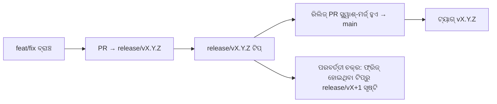

# Branching & Release Model (ଓଡ଼ିଆ)

🌐 **Languages:** 🇺🇸 [English](../../../../ops/BRANCHING_MODEL.md) · 🇪🇹 [am](../../../am/docs/ops/BRANCHING_MODEL.md) · 🇸🇦 [ar](../../../ar/docs/ops/BRANCHING_MODEL.md) · 🇦🇿 [az](../../../az/docs/ops/BRANCHING_MODEL.md) · 🇧🇬 [bg](../../../bg/docs/ops/BRANCHING_MODEL.md) · 🇧🇩 [bn](../../../bn/docs/ops/BRANCHING_MODEL.md) · 🇧🇦 [bs](../../../bs/docs/ops/BRANCHING_MODEL.md) · 🇨🇿 [cs](../../../cs/docs/ops/BRANCHING_MODEL.md) · 🇩🇰 [da](../../../da/docs/ops/BRANCHING_MODEL.md) · 🇩🇪 [de](../../../de/docs/ops/BRANCHING_MODEL.md) · 🇬🇷 [el](../../../el/docs/ops/BRANCHING_MODEL.md) · 🇪🇸 [es](../../../es/docs/ops/BRANCHING_MODEL.md) · 🇪🇪 [et](../../../et/docs/ops/BRANCHING_MODEL.md) · 🇮🇷 [fa](../../../fa/docs/ops/BRANCHING_MODEL.md) · 🇫🇮 [fi](../../../fi/docs/ops/BRANCHING_MODEL.md) · 🇫🇷 [fr](../../../fr/docs/ops/BRANCHING_MODEL.md) · 🇮🇪 [ga](../../../ga/docs/ops/BRANCHING_MODEL.md) · 🇮🇳 [gu](../../../gu/docs/ops/BRANCHING_MODEL.md) · 🇳🇬 [ha](../../../ha/docs/ops/BRANCHING_MODEL.md) · 🇮🇱 [he](../../../he/docs/ops/BRANCHING_MODEL.md) · 🇮🇳 [hi](../../../hi/docs/ops/BRANCHING_MODEL.md) · 🇭🇷 [hr](../../../hr/docs/ops/BRANCHING_MODEL.md) · 🇭🇺 [hu](../../../hu/docs/ops/BRANCHING_MODEL.md) · 🇦🇲 [hy](../../../hy/docs/ops/BRANCHING_MODEL.md) · 🇮🇩 [id](../../../id/docs/ops/BRANCHING_MODEL.md) · 🇳🇬 [ig](../../../ig/docs/ops/BRANCHING_MODEL.md) · 🇮🇹 [it](../../../it/docs/ops/BRANCHING_MODEL.md) · 🇯🇵 [ja](../../../ja/docs/ops/BRANCHING_MODEL.md) · 🇬🇪 [ka](../../../ka/docs/ops/BRANCHING_MODEL.md) · 🇰🇭 [km](../../../km/docs/ops/BRANCHING_MODEL.md) · 🇮🇳 [kn](../../../kn/docs/ops/BRANCHING_MODEL.md) · 🇰🇷 [ko](../../../ko/docs/ops/BRANCHING_MODEL.md) · 🇱🇹 [lt](../../../lt/docs/ops/BRANCHING_MODEL.md) · 🇱🇻 [lv](../../../lv/docs/ops/BRANCHING_MODEL.md) · 🇮🇳 [ml](../../../ml/docs/ops/BRANCHING_MODEL.md) · 🇮🇳 [mr](../../../mr/docs/ops/BRANCHING_MODEL.md) · 🇲🇾 [ms](../../../ms/docs/ops/BRANCHING_MODEL.md) · 🇲🇹 [mt](../../../mt/docs/ops/BRANCHING_MODEL.md) · 🇲🇲 [my](../../../my/docs/ops/BRANCHING_MODEL.md) · 🇳🇵 [ne](../../../ne/docs/ops/BRANCHING_MODEL.md) · 🇳🇱 [nl](../../../nl/docs/ops/BRANCHING_MODEL.md) · 🇳🇴 [no](../../../no/docs/ops/BRANCHING_MODEL.md) · 🇮🇳 [pa](../../../pa/docs/ops/BRANCHING_MODEL.md) · 🇵🇭 [phi](../../../phi/docs/ops/BRANCHING_MODEL.md) · 🇵🇱 [pl](../../../pl/docs/ops/BRANCHING_MODEL.md) · 🇵🇹 [pt](../../../pt/docs/ops/BRANCHING_MODEL.md) · 🇧🇷 [pt-BR](../../../pt-BR/docs/ops/BRANCHING_MODEL.md) · 🇷🇴 [ro](../../../ro/docs/ops/BRANCHING_MODEL.md) · 🇷🇺 [ru](../../../ru/docs/ops/BRANCHING_MODEL.md) · 🇱🇰 [si](../../../si/docs/ops/BRANCHING_MODEL.md) · 🇸🇰 [sk](../../../sk/docs/ops/BRANCHING_MODEL.md) · 🇸🇮 [sl](../../../sl/docs/ops/BRANCHING_MODEL.md) · 🇷🇸 [sr](../../../sr/docs/ops/BRANCHING_MODEL.md) · 🇸🇪 [sv](../../../sv/docs/ops/BRANCHING_MODEL.md) · 🇰🇪 [sw](../../../sw/docs/ops/BRANCHING_MODEL.md) · 🇮🇳 [ta](../../../ta/docs/ops/BRANCHING_MODEL.md) · 🇮🇳 [te](../../../te/docs/ops/BRANCHING_MODEL.md) · 🇹🇭 [th](../../../th/docs/ops/BRANCHING_MODEL.md) · 🇹🇷 [tr](../../../tr/docs/ops/BRANCHING_MODEL.md) · 🇺🇦 [uk-UA](../../../uk-UA/docs/ops/BRANCHING_MODEL.md) · 🇵🇰 [ur](../../../ur/docs/ops/BRANCHING_MODEL.md) · 🇺🇿 [uz](../../../uz/docs/ops/BRANCHING_MODEL.md) · 🇻🇳 [vi](../../../vi/docs/ops/BRANCHING_MODEL.md) · 🇳🇬 [yo](../../../yo/docs/ops/BRANCHING_MODEL.md) · 🇨🇳 [zh-CN](../../../zh-CN/docs/ops/BRANCHING_MODEL.md) · 🇹🇼 [zh-TW](../../../zh-TW/docs/ops/BRANCHING_MODEL.md)

---

OmniRoute ଏକ **ସମାନ୍ତରାଳ-ଚକ୍ର** ରିଲିଜ୍ ମଡେଲ୍ ବ୍ୟବହାର କରେ: ସକ୍ରିୟ ଚକ୍ର ପାଇଁ ଏକ ଉତ୍ସର୍ଗୀକୃତ `release/vX.Y.Z`
ବ୍ରାଞ୍ଚ, ପ୍ରକାଶିତ ଧାରା ପାଇଁ `main`, ଏବଂ ସେହି ଚକ୍ର ରିଲିଜ୍ ହେବାବେଳେ ଏକ ଅପରିବର୍ତ୍ତନୀୟ
`vX.Y.Z` ଟ୍ୟାଗ୍। କମିଟ୍ଗୁଡ଼ିକ `release/*` _ଏବଂ_ `main` ଉଭୟରେ ପହଞ୍ଚୁଥିବା ଦେଖିବା ଆଶାକରାଯାଏ — ଏହା କୌଣସି ଭୁଲ୍ ନୁହେଁ।

ମେଣ୍ଟେନର୍ଙ୍କ ପାଇଁ ବିବରଣୀ `CLAUDE.md` (କଠୋର ନିୟମ #21) ଏବଂ
[RELEASE_CHECKLIST.md](./RELEASE_CHECKLIST.md)ରେ ଅଛି। ଏହି ପୃଷ୍ଠାଟି ସାର୍ବଜନୀନ ଭାବରେ
ଅବଦାନକାରୀଙ୍କ ପାଇଁ ଉଦ୍ଦିଷ୍ଟ ସାରାଂଶ।

## ଏକ ନଜରରେ

| ରେଫ୍              | ଭୂମିକା                                                                                      |
| ----------------- | ------------------------------------------------------------------------------------------- |
| `release/vX.Y.Z`  | **ସକ୍ରିୟ ଚକ୍ର** — ସେହି ସଂସ୍କରଣ ପାଇଁ ଦୈନନ୍ଦିନ ବିକାଶ ଏବଂ PR ମର୍ଜ୍                             |
| `main`            | **ପ୍ରକାଶିତ ଧାରା** — ରିଲିଜ୍ ପ୍ରକାଶିତ ହେବାବେଳେ ସ୍କ୍ୱାଶ୍-ମର୍ଜ୍ ମାଧ୍ୟମରେ ଚକ୍ରଟିକୁ ଗ୍ରହଣ କରେ     |
| `vX.Y.Z` (ଟ୍ୟାଗ୍) | **ପ୍ରକାଶନ ଚିହ୍ନକ** — ରିଲିଜ୍ ସମୟରେ ସୃଷ୍ଟି ହୋଇଥିବା, ଅପରିବର୍ତ୍ତନୀୟ “କ’ଣ ପ୍ରକାଶିତ ହେଲା” ପଏଣ୍ଟର୍ |



## ମୋ PR କେଉଁଠାକୁ ଲକ୍ଷ୍ୟ କରିବା ଉଚିତ?

**ସକ୍ରିୟ `release/vX.Y.Z` ବ୍ରାଞ୍ଚକୁ ଲକ୍ଷ୍ୟ କରନ୍ତୁ — `main`କୁ ନୁହେଁ।**

1. ସର୍ବୋଚ୍ଚ ଖୋଲା `release/v*` ବ୍ରାଞ୍ଚଟି ଖୋଜନ୍ତୁ (ଲେଖିବା ସମୟର ଉଦାହରଣ:
   `release/v3.8.49`)।
2. ସେହି ଟିପ୍ରୁ ବ୍ରାଞ୍ଚ କରନ୍ତୁ (`git fetch` + checkout / ତାହା ଉପରେ rebase)।
3. **base = ସେହି `release/vX.Y.Z`** ସହିତ PR ଖୋଲନ୍ତୁ।

`main` ଦୈନନ୍ଦିନ ଇଣ୍ଟିଗ୍ରେସନ୍ ବ୍ରାଞ୍ଚ ନୁହେଁ। `main` ବିରୁଦ୍ଧରେ ଖୋଲାଯାଇଥିବା PRଗୁଡ଼ିକୁ
ସାଧାରଣତଃ ମର୍ଜ୍ ପୂର୍ବରୁ ପୁନଃଲକ୍ଷ୍ୟ କରିବାକୁ ପଡ଼େ।

## ରିଲିଜ୍ ଫ୍ରିଜ୍ (ସମାନ୍ତରାଳ ଚକ୍ର)

ଏକ ରିଲିଜ୍ର ସମନ୍ୱୟ କରାଯାଉଥିବାବେଳେ, `release-freeze` ଲେବଲ୍ ଥିବା ଏକ ମାର୍କର୍ ଇସ୍ୟୁ
ଖୋଲାଯାଏ। ଏହା **ବିକାଶକୁ ବନ୍ଦ କରେ ନାହିଁ**:

- ଫ୍ରିଜ୍ ହୋଇଥିବା `release/vX.Y.Z` ସେହି ରିଲିଜ୍ ପାଇଁ ରିଲିଜ୍ କ୍ୟାପ୍ଟେନ୍ଙ୍କ ଅଧୀନରେ ରହେ।
- ପରବର୍ତ୍ତୀ ଚକ୍ରର `release/vX+1` ଫ୍ରିଜ୍ ହୋଇଥିବା ଟିପ୍ରୁ ସୃଷ୍ଟି କରାଯାଏ, ଯାହାଦ୍ୱାରା ଅବଦାନକାରୀମାନେ
  କାମ ମର୍ଜ୍ କରିବା ଜାରି ରଖିପାରନ୍ତି।
- ଫ୍ରିଜ୍ ହୋଇଥିବା ବ୍ରାଞ୍ଚକୁ ଏବେ ବି ଲକ୍ଷ୍ୟ କରୁଥିବା ଖୋଲା PRଗୁଡ଼ିକୁ ସକ୍ରିୟ
  (ସର୍ବୋଚ୍ଚ) `release/v*` ବ୍ରାଞ୍ଚକୁ **ପୁନଃଲକ୍ଷ୍ୟ** କରିବା ଉଚିତ।

ଆପଣ ଚାହୁଁଥିବା ବ୍ରାଞ୍ଚଟି ମର୍ଜ୍ଯୋଗ୍ୟ ବୋଲି ଧରିନେବା ପୂର୍ବରୁ କୌଣସି ଖୋଲା ଫ୍ରିଜ୍ ଅଛି କି ନାହିଁ ଯାଞ୍ଚ କରନ୍ତୁ:

```bash
gh issue list --repo diegosouzapw/OmniRoute --label release-freeze --state open
```

ମର୍ଜ୍ ପ୍ରକ୍ରିୟା (ମାଲିକଙ୍କ `queue` ଲେବଲ୍ → Mergify) ବିଷୟରେ
[MERGE_TRAIN.md](./MERGE_TRAIN.md)ରେ ଡକ୍ୟୁମେଣ୍ଟ କରାଯାଇଛି।

## ଏକ ବ୍ରାଞ୍ଚ ଏବଂ ଏକ ଟ୍ୟାଗ୍ ଉଭୟ କାହିଁକି?

| ଆର୍ଟିଫ୍ୟାକ୍ଟ     | ଜୀବନକାଳ           | ଉଦ୍ଦେଶ୍ୟ                                                                     |
| ---------------- | ----------------- | ---------------------------------------------------------------------------- |
| `release/vX.Y.Z` | ପ୍ରକ୍ରିୟାଧୀନ ଚକ୍ର | ସମୀକ୍ଷା ହୋଇଥିବା PRଗୁଡ଼ିକୁ ସଂଗ୍ରହ କରେ, CIକୁ ସବୁଜ ରଖେ ଏବଂ PR ବେସ୍ ଭାବେ କାମ କରେ |
| ଟ୍ୟାଗ୍ `vX.Y.Z`  | ସବୁଦିନ ପାଇଁ       | npm / GitHub Releasesକୁ ପ୍ରକାଶିତ ହୋଇଥିବା ସଠିକ୍ ବିଟ୍ଗୁଡ଼ିକୁ ଚିହ୍ନିତ କରେ       |

ବ୍ରାଞ୍ଚଟି ହେଉଛି କର୍ମଶାଳା; ଟ୍ୟାଗ୍ଟି ହେଉଛି ସିଲ୍ କରାଯାଇଥିବା ପ୍ୟାକେଜ୍। `main`କୁ ସ୍କ୍ୱାଶ୍-ମର୍ଜ୍ କରିବା ପରେ,
ପୂର୍ବ ରିଲିଜ୍ PR ସମାପ୍ତ ହେବା ପାଇଁ ଅପେକ୍ଷା ନକରି ପରବର୍ତ୍ତୀ ଚକ୍ର `release/vX+1`ରେ ଜାରି ରହେ।

## ସମ୍ପର୍କିତ ଡକ୍ୟୁମେଣ୍ଟ

- [CONTRIBUTING.md](../../CONTRIBUTING.md) — ସେଟଅପ୍, ପରୀକ୍ଷା, PR ଯାଞ୍ଚତାଲିକା
- [RELEASE_CHECKLIST.md](./RELEASE_CHECKLIST.md) — ପ୍ରକାଶନ-ପୂର୍ବ ବୈଧତା ଯାଞ୍ଚ
- [MERGE_TRAIN.md](./MERGE_TRAIN.md) — ମର୍ଜ୍ କ୍ୟୁ ଏବଂ ଫଲ୍ବ୍ୟାକ୍ ଟ୍ରେନ୍
- [RELEASE_GREEN.md](./RELEASE_GREEN.md) — ରିଲିଜ୍ ଟିପ୍କୁ ସବୁଜ ରଖିବା
