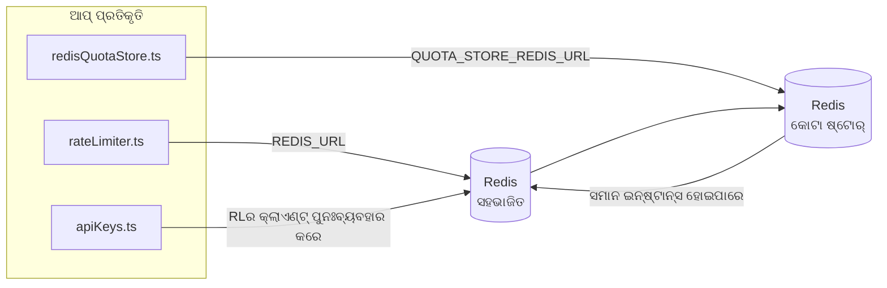

# Redis Production Configuration Guide (ଓଡ଼ିଆ)

🌐 **Languages:** 🇺🇸 [English](../../../../ops/REDIS_PRODUCTION_CONFIG.md) · 🇪🇹 [am](../../../am/docs/ops/REDIS_PRODUCTION_CONFIG.md) · 🇸🇦 [ar](../../../ar/docs/ops/REDIS_PRODUCTION_CONFIG.md) · 🇦🇿 [az](../../../az/docs/ops/REDIS_PRODUCTION_CONFIG.md) · 🇧🇬 [bg](../../../bg/docs/ops/REDIS_PRODUCTION_CONFIG.md) · 🇧🇩 [bn](../../../bn/docs/ops/REDIS_PRODUCTION_CONFIG.md) · 🇨🇿 [cs](../../../cs/docs/ops/REDIS_PRODUCTION_CONFIG.md) · 🇩🇰 [da](../../../da/docs/ops/REDIS_PRODUCTION_CONFIG.md) · 🇩🇪 [de](../../../de/docs/ops/REDIS_PRODUCTION_CONFIG.md) · 🇬🇷 [el](../../../el/docs/ops/REDIS_PRODUCTION_CONFIG.md) · 🇪🇸 [es](../../../es/docs/ops/REDIS_PRODUCTION_CONFIG.md) · 🇪🇪 [et](../../../et/docs/ops/REDIS_PRODUCTION_CONFIG.md) · 🇮🇷 [fa](../../../fa/docs/ops/REDIS_PRODUCTION_CONFIG.md) · 🇫🇮 [fi](../../../fi/docs/ops/REDIS_PRODUCTION_CONFIG.md) · 🇫🇷 [fr](../../../fr/docs/ops/REDIS_PRODUCTION_CONFIG.md) · 🇮🇪 [ga](../../../ga/docs/ops/REDIS_PRODUCTION_CONFIG.md) · 🇮🇳 [gu](../../../gu/docs/ops/REDIS_PRODUCTION_CONFIG.md) · 🇳🇬 [ha](../../../ha/docs/ops/REDIS_PRODUCTION_CONFIG.md) · 🇮🇱 [he](../../../he/docs/ops/REDIS_PRODUCTION_CONFIG.md) · 🇮🇳 [hi](../../../hi/docs/ops/REDIS_PRODUCTION_CONFIG.md) · 🇭🇷 [hr](../../../hr/docs/ops/REDIS_PRODUCTION_CONFIG.md) · 🇭🇺 [hu](../../../hu/docs/ops/REDIS_PRODUCTION_CONFIG.md) · 🇦🇲 [hy](../../../hy/docs/ops/REDIS_PRODUCTION_CONFIG.md) · 🇮🇩 [id](../../../id/docs/ops/REDIS_PRODUCTION_CONFIG.md) · 🇳🇬 [ig](../../../ig/docs/ops/REDIS_PRODUCTION_CONFIG.md) · 🇮🇹 [it](../../../it/docs/ops/REDIS_PRODUCTION_CONFIG.md) · 🇯🇵 [ja](../../../ja/docs/ops/REDIS_PRODUCTION_CONFIG.md) · 🇬🇪 [ka](../../../ka/docs/ops/REDIS_PRODUCTION_CONFIG.md) · 🇰🇭 [km](../../../km/docs/ops/REDIS_PRODUCTION_CONFIG.md) · 🇮🇳 [kn](../../../kn/docs/ops/REDIS_PRODUCTION_CONFIG.md) · 🇰🇷 [ko](../../../ko/docs/ops/REDIS_PRODUCTION_CONFIG.md) · 🇱🇹 [lt](../../../lt/docs/ops/REDIS_PRODUCTION_CONFIG.md) · 🇱🇻 [lv](../../../lv/docs/ops/REDIS_PRODUCTION_CONFIG.md) · 🇮🇳 [ml](../../../ml/docs/ops/REDIS_PRODUCTION_CONFIG.md) · 🇮🇳 [mr](../../../mr/docs/ops/REDIS_PRODUCTION_CONFIG.md) · 🇲🇾 [ms](../../../ms/docs/ops/REDIS_PRODUCTION_CONFIG.md) · 🇲🇹 [mt](../../../mt/docs/ops/REDIS_PRODUCTION_CONFIG.md) · 🇲🇲 [my](../../../my/docs/ops/REDIS_PRODUCTION_CONFIG.md) · 🇳🇵 [ne](../../../ne/docs/ops/REDIS_PRODUCTION_CONFIG.md) · 🇳🇱 [nl](../../../nl/docs/ops/REDIS_PRODUCTION_CONFIG.md) · 🇳🇴 [no](../../../no/docs/ops/REDIS_PRODUCTION_CONFIG.md) · 🇮🇳 [pa](../../../pa/docs/ops/REDIS_PRODUCTION_CONFIG.md) · 🇵🇭 [phi](../../../phi/docs/ops/REDIS_PRODUCTION_CONFIG.md) · 🇵🇱 [pl](../../../pl/docs/ops/REDIS_PRODUCTION_CONFIG.md) · 🇵🇹 [pt](../../../pt/docs/ops/REDIS_PRODUCTION_CONFIG.md) · 🇧🇷 [pt-BR](../../../pt-BR/docs/ops/REDIS_PRODUCTION_CONFIG.md) · 🇷🇴 [ro](../../../ro/docs/ops/REDIS_PRODUCTION_CONFIG.md) · 🇷🇺 [ru](../../../ru/docs/ops/REDIS_PRODUCTION_CONFIG.md) · 🇱🇰 [si](../../../si/docs/ops/REDIS_PRODUCTION_CONFIG.md) · 🇸🇰 [sk](../../../sk/docs/ops/REDIS_PRODUCTION_CONFIG.md) · 🇸🇮 [sl](../../../sl/docs/ops/REDIS_PRODUCTION_CONFIG.md) · 🇷🇸 [sr](../../../sr/docs/ops/REDIS_PRODUCTION_CONFIG.md) · 🇸🇪 [sv](../../../sv/docs/ops/REDIS_PRODUCTION_CONFIG.md) · 🇰🇪 [sw](../../../sw/docs/ops/REDIS_PRODUCTION_CONFIG.md) · 🇮🇳 [ta](../../../ta/docs/ops/REDIS_PRODUCTION_CONFIG.md) · 🇮🇳 [te](../../../te/docs/ops/REDIS_PRODUCTION_CONFIG.md) · 🇹🇭 [th](../../../th/docs/ops/REDIS_PRODUCTION_CONFIG.md) · 🇹🇷 [tr](../../../tr/docs/ops/REDIS_PRODUCTION_CONFIG.md) · 🇺🇦 [uk-UA](../../../uk-UA/docs/ops/REDIS_PRODUCTION_CONFIG.md) · 🇵🇰 [ur](../../../ur/docs/ops/REDIS_PRODUCTION_CONFIG.md) · 🇺🇿 [uz](../../../uz/docs/ops/REDIS_PRODUCTION_CONFIG.md) · 🇻🇳 [vi](../../../vi/docs/ops/REDIS_PRODUCTION_CONFIG.md) · 🇳🇬 [yo](../../../yo/docs/ops/REDIS_PRODUCTION_CONFIG.md) · 🇨🇳 [zh-CN](../../../zh-CN/docs/ops/REDIS_PRODUCTION_CONFIG.md) · 🇹🇼 [zh-TW](../../../zh-TW/docs/ops/REDIS_PRODUCTION_CONFIG.md)

---

## ସାରାଂଶ

Redis ହେଉଛି OmniRouteରେ ଏକ **ଇଚ୍ଛାଧୀନ, ଅନାବଶ୍ୟକ ନିର୍ଭରଶୀଳତା** — Redis ଉପଲବ୍ଧ ନଥିବାବେଳେ ଆପ୍ଲିକେସନ୍ ସୁଚାରୁ ଭାବେ କ୍ଷମତା ହ୍ରାସ କରେ (ଇନ୍-ମେମୋରି
ଫଲ୍ବ୍ୟାକ୍)। ପ୍ରଡକ୍ସନ୍ରେ Redisକୁ ଟ୍ୟୁନ୍ କରିବା ଦ୍ୱାରା ଚାରୋଟି ସ୍ୱତନ୍ତ୍ର
କାର୍ଯ୍ୟଭାର ପାଇଁ ବିଳମ୍ବତା ହ୍ରାସ ପାଏ:

| କାର୍ଯ୍ୟଭାର               | ଡ୍ରାଇଭର୍                      | କ୍ଲାଏଣ୍ଟ ଫ୍ୟାକ୍ଟରୀ                            | କି ପ୍ୟାଟର୍ନ                                          |
| ------------------------ | ----------------------------- | --------------------------------------------- | ---------------------------------------------------- |
| ରେଟ୍ ସୀମିତକରଣ            | `rateLimiter.ts`              | `getRedisClient()` — ଲେଜି `ioredis` ସିଙ୍ଗଲଟନ୍ | `<prefix>rl:*` Lua‑ଆଟମିକ୍ ରେଟ୍ ସୀମା ୱିଣ୍ଡୋ           |
| ପ୍ରମାଣୀକରଣ କ୍ୟାଶ୍        | `apiKeys.ts`                  | `rateLimiter`ର କ୍ଲାଏଣ୍ଟକୁ ପୁନଃବ୍ୟବହାର କରେ     | TTL ସହିତ `<prefix>auth:api_key:<sha256>`             |
| କୋଟା ଷ୍ଟୋର୍              | `redisQuotaStore.ts`          | ପୃଥକ `getRedisClient(url)` ସିଙ୍ଗଲଟନ୍          | ପ୍ରତି ଇନ୍ଷ୍ଟାନ୍ସ ପାଇଁ ବିନ୍ୟାସଯୋଗ୍ୟ `<prefix>quota:*` |
| ୱାର୍ମଅପ୍ ସର୍କିଟ୍ ବ୍ରେକର୍ | `redisCircuitBreakerStore.ts` | `circuitBreakerFactory.ts`ରେ ପୃଥକ କ୍ଲାଏଣ୍ଟ    | `<prefix>warmup:cb:<connectionId>`                   |

ସମସ୍ତ ଚାରୋଟି କାର୍ଯ୍ୟଭାର ଗୋଟିଏ ନେମସ୍ପେସ୍ ପ୍ରିଫିକ୍ସ ସହଭାଗ କରନ୍ତି, ଯାହାଦ୍ୱାରା OmniRoute ଗୋଟିଏ
Redis ଇନ୍ଷ୍ଟାନ୍ସରେ ଅନ୍ୟ ଆପ୍ଗୁଡ଼ିକ ସହିତ ସହାବସ୍ଥାନ କରିପାରିବ (ଯଥା `127.0.0.1:6379`)। [କି ନେମସ୍ପେସିଂ](#key-namespacing) ଦେଖନ୍ତୁ।

---

## ବର୍ତ୍ତମାନର ବିନ୍ୟାସ (କୋଡ୍ ଡିଫଲ୍ଟ)

| ସେଟିଂ                                   | ମୂଲ୍ୟ                                                          | ସ୍ଥାନ                                                                                 |
| --------------------------------------- | -------------------------------------------------------------- | ------------------------------------------------------------------------------------- |
| `REDIS_URL` ପରିବେଶ ଭେରିଏବଲ୍             | `redis://redis:6379` (compose), ଇଚ୍ଛାଧୀନ                       | `rateLimiter.ts:5`, `.env.example`                                                    |
| `REDIS_KEY_PREFIX` ପରିବେଶ ଭେରିଏବଲ୍      | `omniroute:` (ଡିଫଲ୍ଟ)                                          | `rateLimiter.ts`, `redisQuotaStore.ts`, `redisCircuitBreakerStore.ts`, `.env.example` |
| `QUOTA_STORE_REDIS_URL` ପରିବେଶ ଭେରିଏବଲ୍ | ପୃଥକ, `REDIS_URL`ଠାରୁ ଭିନ୍ନ ହୋଇପାରେ                            | `quota/storeFactory.ts`                                                               |
| `QUOTA_STORE_DRIVER`                    | `"sqlite"` (ଡିଫଲ୍ଟ), `"redis"` ଇଚ୍ଛାଧୀନ                        | `quota/storeFactory.ts`                                                               |
| ioredis `maxRetriesPerRequest`          | `3`                                                            | `rateLimiter.ts` କ୍ଲାଏଣ୍ଟ ସୃଷ୍ଟି                                                      |
| `enableReadyCheck`                      | ସେଟ୍ କରାଯାଇନାହିଁ (ioredis ଡିଫଲ୍ଟ: `true`)                      | —                                                                                     |
| `lazyConnect`                           | ସେଟ୍ କରାଯାଇନାହିଁ (ioredis ଡିଫଲ୍ଟ: `false`)                     | —                                                                                     |
| `retryStrategy`                         | ସେଟ୍ କରାଯାଇନାହିଁ (ioredis ଡିଫଲ୍ଟ: 200ms ଆଧାର, ଏକ୍ସପୋନେନ୍ସିଆଲ୍) | —                                                                                     |
| TLS / ପାସ୍ୱାର୍ଡ / DB ଇଣ୍ଡେକ୍ସ           | **ବିନ୍ୟାସ କରାଯାଇନାହିଁ**                                        | —                                                                                     |
| Sentinel / Cluster                      | **ବିନ୍ୟାସ କରାଯାଇନାହିଁ** — କେବଳ ସ୍ୱତନ୍ତ୍ର ସିଙ୍ଗଲ୍-ନୋଡ୍          | —                                                                                     |

---

## କି ନେମସ୍ପେସିଂ

OmniRoute ହୋଷ୍ଟରେ ଚାଲୁଥିବା ଅନ୍ୟ ସମସ୍ତ ସେବା ସହିତ ଏକ Redis ଇନ୍ଷ୍ଟାନ୍ସ ସହଭାଗ କରେ। ଏକ ନେମସ୍ପେସ୍ ବିନା,
`auth:api_key:<sha256>` କିମ୍ବା `rl:*` ପରି କିଗୁଡ଼ିକ ସେହି Redis ବ୍ୟବହାର କରୁଥିବା ଅନ୍ୟ ଆପ୍ଲିକେସନ୍ର
କିଗୁଡ଼ିକ ସହିତ ସଂଘର୍ଷ କରିପାରେ (ଏହି ଇନ୍ଷ୍ଟାନ୍ସଟି ଅନ୍ୟ ସେବାଗୁଡ଼ିକ ସହିତ `127.0.0.1:6379`ରେ Redis ଚଲାଏ)।

**ପ୍ରତ୍ୟେକ** OmniRoute କିରେ ପ୍ରିଫିକ୍ସ ଯୋଡ଼ିବାକୁ `REDIS_KEY_PREFIX`କୁ ଏକ ଅଣ-ଖାଲି ଷ୍ଟ୍ରିଙ୍ଗ୍ରେ ସେଟ୍ କରନ୍ତୁ:

```bash
# .env — ସମସ୍ତ OmniRoute କି omniroute:rl:*, omniroute:auth:*, omniroute:quota:*, omniroute:warmup:cb:* ହୋଇଯାଏ
REDIS_KEY_PREFIX=omniroute:
```

- **ଡିଫଲ୍ଟ:** `omniroute:` (`REDIS_KEY_PREFIX` ସେଟ୍ ହୋଇନଥିଲେ କିମ୍ବା ଖାଲି ଥିଲେ ପ୍ରୟୋଗ କରାଯାଏ)।
- **ଏଗୁଡ଼ିକରେ ପ୍ରୟୋଗ ହୁଏ:** ରେଟ୍ ଲିମିଟର୍ + ପ୍ରମାଣୀକରଣ କ୍ୟାଶ୍ (`keyPrefix` ମାଧ୍ୟମରେ ସହଭାଗୀ `ioredis` କ୍ଲାଏଣ୍ଟ) ଏବଂ
  କୋଟା ଷ୍ଟୋର୍ (`KEY_PREFIX = "${REDIS_KEY_PREFIX}quota"`) ଓ ୱାର୍ମଅପ୍ ସର୍କିଟ୍ ବ୍ରେକର୍
  (`KEY_PREFIX = "${REDIS_KEY_PREFIX}warmup:cb:"`)।
- Redisରେ କିଗୁଡ଼ିକ ପୂର୍ବରୁ ଥିବାବେଳେ **ପ୍ରିଫିକ୍ସ ପରିବର୍ତ୍ତନ କଲେ** ପୁରୁଣା କିଗୁଡ଼ିକ ଅନାଥ ହୋଇଯାଏ (ସେଗୁଡ଼ିକ
  TTL / LRU ମାଧ୍ୟମରେ ମିଆଦ ସମାପ୍ତ ହୁଏ)। ପରିବର୍ତ୍ତନ କରିବା ସୁରକ୍ଷିତ; କୌଣସି ମାଇଗ୍ରେସନ୍ ଆବଶ୍ୟକ ନାହିଁ। ଏକମାତ୍ର ବ୍ୟତିକ୍ରମ ହେଉଛି ନିଷିଦ୍ଧ ଭାବେ ଚିହ୍ନିତ ଏକ କନେକ୍ସନ୍ର
  ୱାର୍ମଅପ୍ ସର୍କିଟ୍-ବ୍ରେକର୍ କି: ଏହା TTL ବିନା ସ୍ଥାୟୀ ଭାବେ ସଂରକ୍ଷିତ ହୁଏ, ତେଣୁ
  `redis-cli --scan --pattern '<old-prefix>warmup:cb:*'` ସହିତ ଅବଶିଷ୍ଟ କିଗୁଡ଼ିକୁ ତାଲିକାଭୁକ୍ତ କରି ସେଗୁଡ଼ିକୁ ଡିଲିଟ୍ କରନ୍ତୁ।
- **ioredis `keyPrefix`** ଲେଖିବା ସମୟରେ ସ୍ୱୟଂଚାଳିତ ଭାବେ ପ୍ରିଫିକ୍ସ ଯୋଡ଼େ **ଏବଂ** ପଢ଼ିବା ସମୟରେ ଏହାକୁ ହଟାଇଦିଏ,
  ତେଣୁ ଆପ୍ଲିକେସନ୍ କୋଡ୍ କେବେବି ପ୍ରିଫିକ୍ସ ଦେଖେନାହିଁ।

---

## ପ୍ରଡକ୍ସନ୍ ପାଇଁ ସୁପାରିସକୃତ ଟ୍ୟୁନିଂ

### 1. କନେକ୍ସନ୍ ପୁଲ୍ / କ୍ଲାଏଣ୍ଟ ବିକଳ୍ପଗୁଡ଼ିକ (ioredis `Redis` କନ୍ଷ୍ଟ୍ରକ୍ଟର୍)

ବର୍ତ୍ତମାନର କୋଡ୍ କୌଣସି କଷ୍ଟମ୍ ବିକଳ୍ପ ବିନା ଗୋଟିଏ `new Redis(url)` ସୃଷ୍ଟି କରେ। ପ୍ରଡକ୍ସନ୍
ମଲ୍ଟି-ରେପ୍ଲିକା ଡିପ୍ଲୟମେଣ୍ଟ ପାଇଁ, କୋଡ୍ରେ ଏକ କ୍ଲାଏଣ୍ଟ ଫ୍ୟାକ୍ଟରୀ ପାସ୍ କରନ୍ତୁ କିମ୍ବା `getRedisClient()`କୁ ରାପ୍ କରନ୍ତୁ:

```typescript
const redis = new Redis(REDIS_URL, {
  maxRetriesPerRequest: null, // କୌଣସି ପୁନଃଚେଷ୍ଟା ସୀମା ନାହିଁ; retryStrategyକୁ ନିଷ୍ପତ୍ତି ନେବାକୁ ଦିଅନ୍ତୁ
  enableReadyCheck: true, // କଲ୍ ଗ୍ରହଣ କରିବା ପୂର୍ବରୁ ସର୍ଭର୍ ପ୍ରସ୍ତୁତ ଥିବା ଯାଞ୍ଚ କରନ୍ତୁ
  lazyConnect: true, // ନିର୍ମାଣ ସମୟରେ ସଂଯୋଗ କରନ୍ତୁ ନାହିଁ; ପ୍ରଥମ କଲ୍ ପର୍ଯ୍ୟନ୍ତ ଅପେକ୍ଷା କରନ୍ତୁ
  retryStrategy: (times) => {
    if (times > 10) return null; // 10ଟି ପୁନଃଚେଷ୍ଟା ପରେ ଛାଡ଼ିଦିଅନ୍ତୁ → ପରେ ପୁନଃସଂଯୋଗ କରନ୍ତୁ
    return Math.min(times * 200, 5000); // 200ms, 400ms, …, ସର୍ବାଧିକ 5s
  },
  enableAutoPipelining: true, // ସମକାଳୀନ କମାଣ୍ଡଗୁଡ଼ିକୁ ଗୋଟିଏ TCP ରାଇଟ୍ରେ ଏକତ୍ର କରନ୍ତୁ
  keepAlive: 10000, // ପ୍ରତି 10sରେ TCP କିପ୍-ଆଲାଇଭ୍
});
```

**ମୁଖ୍ୟ ସମନ୍ୱୟଗୁଡ଼ିକ:**

- `maxRetriesPerRequest: null` + `retryStrategy` — ପ୍ରଡକ୍ସନ୍ ପାଇଁ ପସନ୍ଦଯୋଗ୍ୟ, ଯାହାଦ୍ୱାରା ଅସ୍ଥାୟୀ
  Redis ପୁନଃପ୍ରାରମ୍ଭ ପ୍ରତ୍ୟେକ ଅନୁରୋଧକୁ ତୁରନ୍ତ ବିଫଳ କରିବ ନାହିଁ। `checkRateLimit()`ରେ ଥିବା ଇନ୍-ମେମୋରି ଫଲ୍ବ୍ୟାକ୍
  ବିଫଳତା ପଥକୁ ସମ୍ଭାଳେ।
- `lazyConnect: true` — ସର୍ଭର୍ ସଂଯୋଗ ଗ୍ରହଣ କରିବା ଆରମ୍ଭ କରିବା ପୂର୍ବରୁ Redis ଚାଲୁ ରହିବା ଉପରେ
  ଷ୍ଟାର୍ଟଅପ୍ ନିର୍ଭରଶୀଳତାକୁ ଏଡ଼ାଏ।
- `enableAutoPipelining: true` — ସମକାଳୀନ ରେଟ୍-ଲିମିଟ୍ ଯାଞ୍ଚ ପାଇଁ ରାଉଣ୍ଡ-ଟ୍ରିପ୍ ହ୍ରାସ କରେ;
  ଗୋଟିଏ ସଂଯୋଗରେ >50 RPS ହେଲେ ଲାଭଦାୟକ।

### 2. Redis ସର୍ଭର୍ କନଫିଗରେସନ୍ (`redis.conf`)

```
# ମେମୋରି
maxmemory 80%                        # OS ପେଜ୍ କ୍ୟାଶ୍ ପାଇଁ ସ୍ଥାନ ଛାଡ଼ନ୍ତୁ
maxmemory-policy allkeys-lru         # ଚାପ ସମୟରେ ପୁରୁଣା auth କ୍ୟାଶ୍ ଏଣ୍ଟ୍ରିଗୁଡ଼ିକୁ ବହିଷ୍କାର କରନ୍ତୁ

# ସ୍ଥାୟିତ୍ୱ (ଇଚ୍ଛାଧୀନ — ଏହା ବିନା ମଧ୍ୟ OmniRoute କ୍ରାଶ୍-ସୁରକ୍ଷିତ)
save 300 1                           # ≥1ଟି କୀ ପରିବର୍ତ୍ତିତ ହୋଇଥିଲେ ଅତି କମରେ ପ୍ରତି 5 minରେ ସ୍ନାପ୍ଶଟ୍ ନିଅନ୍ତୁ
appendonly no                        # AOF ଆବଶ୍ୟକ ନୁହେଁ; ଡାଟା ପୁନଃସୃଷ୍ଟି କରାଯାଇପାରେ
appendfsync no                       # କୌଣସି fsync ଓଭରହେଡ୍ ନାହିଁ (RDB ଯଥେଷ୍ଟ)

# ନେଟୱର୍କିଂ
timeout 0                            # ନିଷ୍କ୍ରିୟ ସଂଯୋଗ ବିଚ୍ଛିନ୍ନ କରନ୍ତୁ ନାହିଁ
tcp-keepalive 300                    # 5 min କିପ୍-ଆଲାଇଭ୍
tcp-backlog 511                      # ହଠାତ୍ ବଢ଼ୁଥିବା ଲୋଡ୍ ପାଇଁ ସଂଯୋଗ ବ୍ୟାକ୍ଲଗ୍

# କାର୍ଯ୍ୟଦକ୍ଷତା
hz 10                                # ଡିଫଲ୍ଟ; ବିଳମ୍ବତା-ସମ୍ବେଦନଶୀଳ ବ୍ୟବହାର ପାଇଁ 100
activedefrag yes                     # ଫ୍ରାଗ୍ମେଣ୍ଟେସନ୍ >10% ହେଲେ ସ୍ୱୟଂଚାଳିତ ଭାବେ ଡିଫ୍ରାଗ୍ମେଣ୍ଟ କରନ୍ତୁ
```

**`maxmemory-policy allkeys-lru` ପାଇଁ ସମନ୍ୱୟ:** ମେମୋରି ଚାପ ସମୟରେ Auth କ୍ୟାଶ୍ ଏଣ୍ଟ୍ରିଗୁଡ଼ିକ
ବହିଷ୍କୃତ ହୋଇପାରେ। ଏହା ସୁରକ୍ଷିତ — ମିସ୍ ହେଲେ `setCachedApiKey` ସର୍ବଦା ପୁନଃପୂରଣ କରେ, ଏବଂ
SQLite ଫଲ୍ବ୍ୟାକ୍ ହେଉଛି ପ୍ରାମାଣିକ ଉତ୍ସ। ରେଟ୍-ଲିମିଟର୍ Lua ସ୍କ୍ରିପ୍ଟ ଡିଜାଇନ୍ ଅନୁଯାୟୀ
ସ୍ୱଳ୍ପକାଳୀନ ଛୋଟ କୀଗୁଡ଼ିକ ସୃଷ୍ଟି କରେ।

### 3. Docker Compose ସେଟିଂସ୍

ପ୍ରଡକ୍ସନ୍ compose (`docker-compose.prod.yml`) `redis:8.6.2-alpine` ବ୍ୟବହାର କରେ। ଏହା ଯୋଡ଼ନ୍ତୁ:

```yaml
redis:
  image: redis:8.6.2-alpine
  command:
    [
      "redis-server",
      "--maxmemory",
      "512mb",
      "--maxmemory-policy",
      "allkeys-lru",
      "--activedefrag",
      "yes",
      "--save",
      "300 1",
    ]
  healthcheck:
    test: ["CMD", "redis-cli", "ping"]
    interval: 10s
    timeout: 3s
    retries: 3
    start_period: 5s
```

### 4. ମଲ୍ଟି-ଇନ୍ଷ୍ଟାନ୍ସ / ସ୍କେଲିଂ ବିଚାରଗୁଡ଼ିକ

**ସମସ୍ତ ରେପ୍ଲିକା ପାଇଁ ଗୋଟିଏ Redis** — ରେଟ୍-ଲିମିଟର୍ Lua ସ୍କ୍ରିପ୍ଟ ଗୋଟିଏ
ପ୍ରାମାଣିକ କୀ ସ୍ପେସ୍ ଉପରେ ନିର୍ଭର କରେ। ରେପ୍ଲିକାଗୁଡ଼ିକ ପଛରେ ଏକାଧିକ Redis ଇନ୍ଷ୍ଟାନ୍ସ ବ୍ୟବହାର କଲେ ପରମାଣବିକତା
ହରାଇବ ଏବଂ ବଜେଟ୍ ଦ୍ୱିଗୁଣିତ ହେବ। ସମସ୍ତ ଆପ୍ଲିକେସନ୍ ରେପ୍ଲିକା ପାଇଁ ଗୋଟିଏ Redis (କିମ୍ବା ଫେଲ୍ଓଭର୍ ସହିତ Redis Sentinel କ୍ଲଷ୍ଟର୍)
ବ୍ୟବହାର କରନ୍ତୁ।

**ସଂଯୋଗ ସଂଖ୍ୟା:** ପ୍ରତ୍ୟେକ ଆପ୍ଲିକେସନ୍ ରେପ୍ଲିକା Redis ସହିତ **2ଟି TCP ସଂଯୋଗ** ଖୋଲେ
(ରେଟ୍ ଲିମିଟର୍ କ୍ଲାଏଣ୍ଟ + କ୍ୱୋଟା ଷ୍ଟୋର୍ କ୍ଲାଏଣ୍ଟ)। 10ଟି ରେପ୍ଲିକାରେ → 20ଟି ସଂଯୋଗ, ଯାହା
ଏକ ଡିଫଲ୍ଟ Redis ଇନ୍ଷ୍ଟାନ୍ସର 10k ସଂଯୋଗ ସୀମା ମଧ୍ୟରେ ସହଜରେ ରହେ।

### 5. ମନିଟରିଂ

ହେଲ୍ଥ-ଚେକ୍ ଏଣ୍ଡପଏଣ୍ଟ ମାଧ୍ୟମରେ ପ୍ରକାଶ କରନ୍ତୁ:

```typescript
// src/app/api/monitoring/health/route.ts ପୂର୍ବରୁ rateLimiter ଫଙ୍କସନ୍ଗୁଡ଼ିକୁ କଲ୍ କରେ
// Redis-ନିର୍ଦ୍ଦିଷ୍ଟ ଯାଞ୍ଚଗୁଡ଼ିକ ଯୋଡ଼ନ୍ତୁ:
//   1. ioredis .ping() ମାଧ୍ୟମରେ PING ବିଳମ୍ବତା
//   2. INFO memory ମାଧ୍ୟମରେ ମେମୋରି ବ୍ୟବହାର
//   3. INFO clients ମାଧ୍ୟମରେ ସଂଯୋଗ ସଂଖ୍ୟା
//   4. maxmemory-policy ପାଇଁ ହିଟ୍ ରେଟ୍ (evicted_keys / keyspace_hits)
```

ନଜର ରଖିବାକୁ ମୁଖ୍ୟ ମେଟ୍ରିକ୍ସ:

- **ପ୍ରତି ସେକେଣ୍ଡରେ ବହିଷ୍କୃତ କୀଗୁଡ଼ିକ** — ଯଦି ଲଗାତାର ଶୂନ୍ୟ ନୁହେଁ, `maxmemory` ବଢ଼ାନ୍ତୁ
- **ବ୍ଲକ୍ ହୋଇଥିବା କ୍ଲାଏଣ୍ଟଗୁଡ଼ିକ** — ଶୂନ୍ୟ ନ ହେବା ଧୀର Lua ସ୍କ୍ରିପ୍ଟ କିମ୍ବା ଉଚ୍ଚ ପ୍ରତିଦ୍ୱନ୍ଦ୍ୱିତାକୁ ସୂଚାଏ
- **ପ୍ରତ୍ୟାଖ୍ୟାନ ହୋଇଥିବା ସଂଯୋଗଗୁଡ଼ିକ** — ସଂଯୋଗ ସୀମା ପୂରଣ ହୋଇଛି; 20ଟି ସଂଯୋଗରେ ଏହା ବିରଳ

---

## ଆର୍କିଟେକ୍ଚର୍ ଡାୟାଗ୍ରାମ୍



---

## ସନ୍ଦର୍ଭଗୁଡ଼ିକ

| ଫାଇଲ୍                              | ଉଦ୍ଦେଶ୍ୟ                                                                   |
| ---------------------------------- | -------------------------------------------------------------------------- |
| `src/shared/utils/rateLimiter.ts`  | ପ୍ରାଥମିକ Redis କ୍ଲାଏଣ୍ଟ୍, Lua ରେଟ୍-ଲିମିଟ୍ ସ୍କ୍ରିପ୍ଟ୍, ଇନ୍-ମେମୋରି ଫଲ୍ବ୍ୟାକ୍ |
| `src/lib/db/apiKeys.ts`            | ପ୍ରମାଣୀକରଣ କ୍ୟାଶ୍ — Redis→SQLite ଫଲ୍ବ୍ୟାକ୍                                 |
| `src/lib/quota/redisQuotaStore.ts` | ଇଚ୍ଛାଧୀନ କୋଟା ଷ୍ଟୋର୍ ପାଇଁ ପୃଥକ Redis କ୍ଲାଏଣ୍ଟ୍                             |
| `src/lib/quota/storeFactory.ts`    | `sqlite` ଏବଂ `redis` କୋଟା ଡ୍ରାଇଭର୍ଗୁଡ଼ିକ ମଧ୍ୟରେ ସୁଇଚ୍ କରେ                  |
| `docker-compose.prod.yml`          | ପ୍ରଡକ୍ସନ୍ Redis କଣ୍ଟେନର୍ (ଇମେଜ୍ `redis:8.6.2-alpine`)                      |
| `.env.example`                     | Redis ପରିବେଶ ଭେରିଏବଲ୍ଗୁଡ଼ିକର ଡକ୍ୟୁମେଣ୍ଟେସନ୍                                |
| `src/app/api/local/redis/`         | ଡେଭଲପମେଣ୍ଟ କଣ୍ଟେନର୍ ଅର୍କେଷ୍ଟ୍ରେସନ୍ ପାଇଁ API ରୁଟ୍ଗୁଡ଼ିକ                     |
| `bin/cli/commands/redis.mjs`       | ଡେଭଲପମେଣ୍ଟ କଣ୍ଟେନର୍ ଅର୍କେଷ୍ଟ୍ରେସନ୍ ପାଇଁ CLI କମାଣ୍ଡ୍ଗୁଡ଼ିକ                  |
