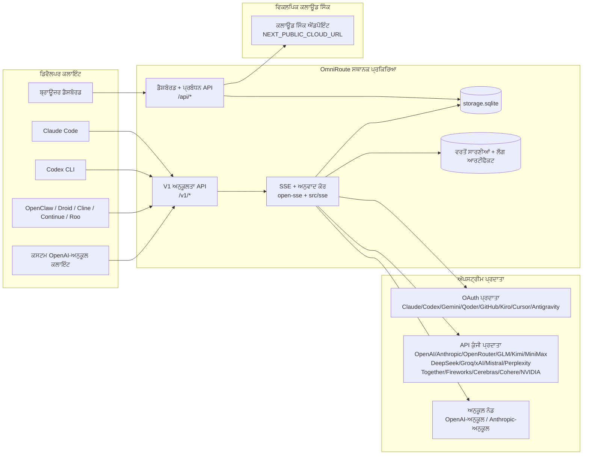
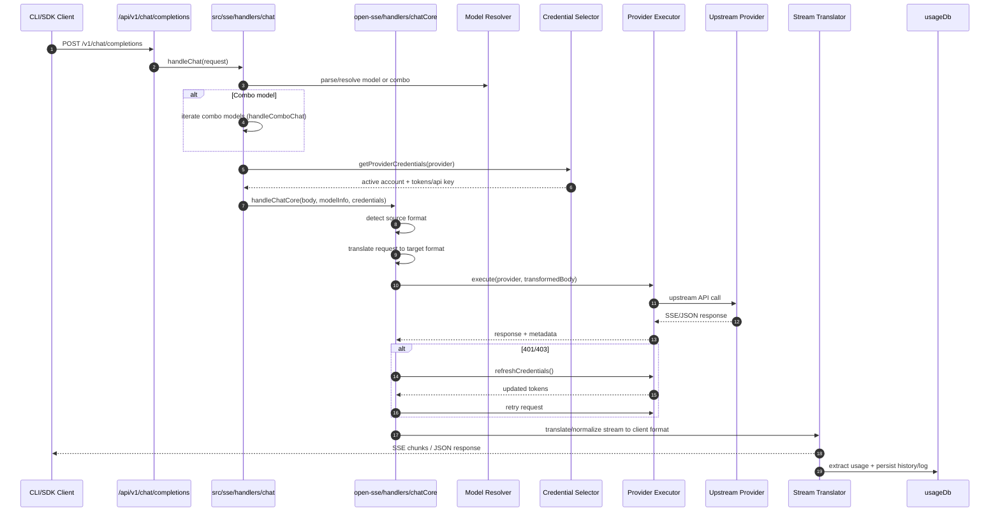
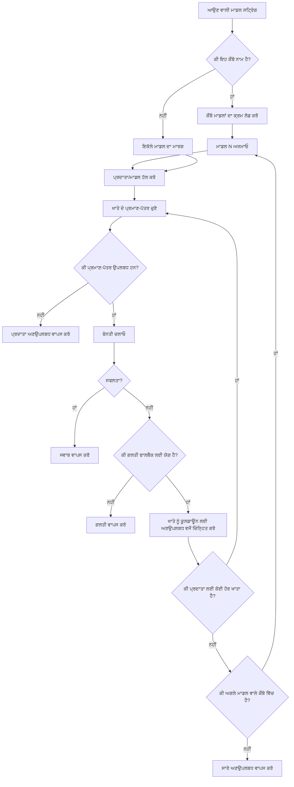
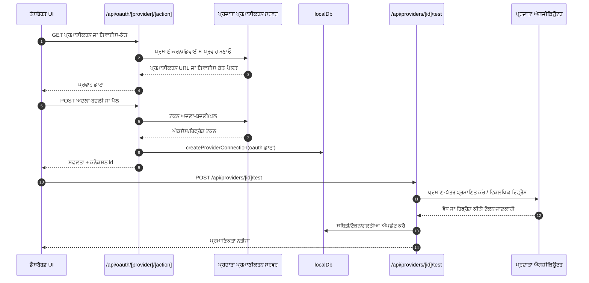
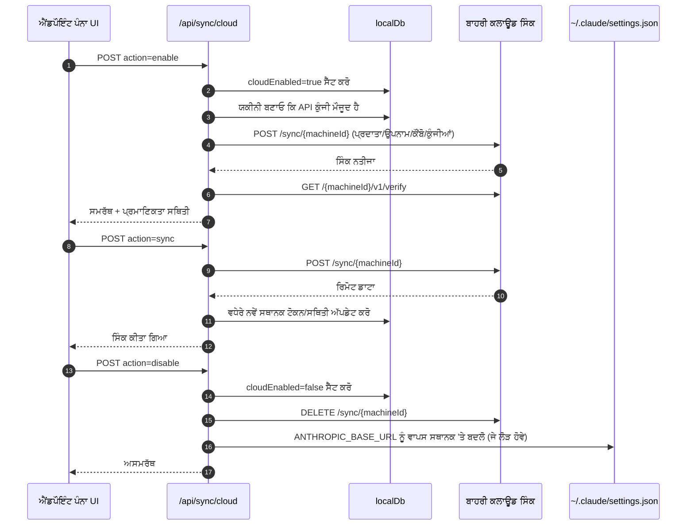
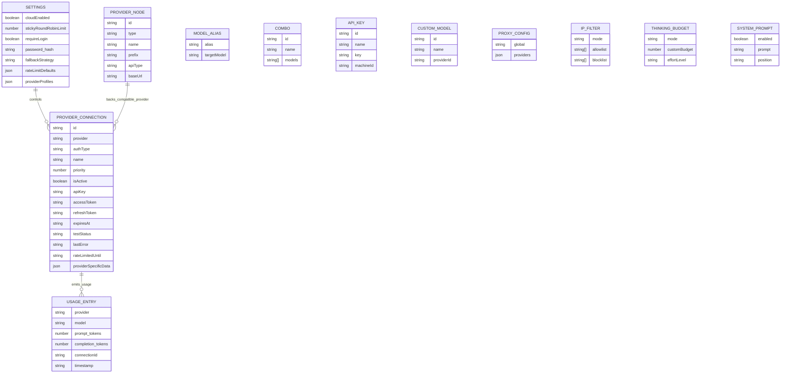
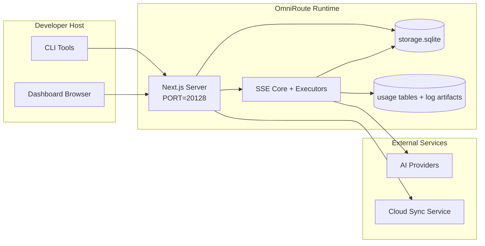

# OmniRoute Architecture (ਪੰਜਾਬੀ)

🌐 **Languages:** 🇺🇸 [English](../../../../architecture/ARCHITECTURE.md) · 🇪🇹 [am](../../../am/docs/architecture/ARCHITECTURE.md) · 🇸🇦 [ar](../../../ar/docs/architecture/ARCHITECTURE.md) · 🇦🇿 [az](../../../az/docs/architecture/ARCHITECTURE.md) · 🇧🇬 [bg](../../../bg/docs/architecture/ARCHITECTURE.md) · 🇧🇩 [bn](../../../bn/docs/architecture/ARCHITECTURE.md) · 🇨🇿 [cs](../../../cs/docs/architecture/ARCHITECTURE.md) · 🇩🇰 [da](../../../da/docs/architecture/ARCHITECTURE.md) · 🇩🇪 [de](../../../de/docs/architecture/ARCHITECTURE.md) · 🇬🇷 [el](../../../el/docs/architecture/ARCHITECTURE.md) · 🇪🇸 [es](../../../es/docs/architecture/ARCHITECTURE.md) · 🇪🇪 [et](../../../et/docs/architecture/ARCHITECTURE.md) · 🇮🇷 [fa](../../../fa/docs/architecture/ARCHITECTURE.md) · 🇫🇮 [fi](../../../fi/docs/architecture/ARCHITECTURE.md) · 🇫🇷 [fr](../../../fr/docs/architecture/ARCHITECTURE.md) · 🇮🇪 [ga](../../../ga/docs/architecture/ARCHITECTURE.md) · 🇮🇳 [gu](../../../gu/docs/architecture/ARCHITECTURE.md) · 🇳🇬 [ha](../../../ha/docs/architecture/ARCHITECTURE.md) · 🇮🇱 [he](../../../he/docs/architecture/ARCHITECTURE.md) · 🇮🇳 [hi](../../../hi/docs/architecture/ARCHITECTURE.md) · 🇭🇷 [hr](../../../hr/docs/architecture/ARCHITECTURE.md) · 🇭🇺 [hu](../../../hu/docs/architecture/ARCHITECTURE.md) · 🇦🇲 [hy](../../../hy/docs/architecture/ARCHITECTURE.md) · 🇮🇩 [id](../../../id/docs/architecture/ARCHITECTURE.md) · 🇳🇬 [ig](../../../ig/docs/architecture/ARCHITECTURE.md) · 🇮🇹 [it](../../../it/docs/architecture/ARCHITECTURE.md) · 🇯🇵 [ja](../../../ja/docs/architecture/ARCHITECTURE.md) · 🇬🇪 [ka](../../../ka/docs/architecture/ARCHITECTURE.md) · 🇰🇭 [km](../../../km/docs/architecture/ARCHITECTURE.md) · 🇮🇳 [kn](../../../kn/docs/architecture/ARCHITECTURE.md) · 🇰🇷 [ko](../../../ko/docs/architecture/ARCHITECTURE.md) · 🇱🇹 [lt](../../../lt/docs/architecture/ARCHITECTURE.md) · 🇱🇻 [lv](../../../lv/docs/architecture/ARCHITECTURE.md) · 🇮🇳 [ml](../../../ml/docs/architecture/ARCHITECTURE.md) · 🇮🇳 [mr](../../../mr/docs/architecture/ARCHITECTURE.md) · 🇲🇾 [ms](../../../ms/docs/architecture/ARCHITECTURE.md) · 🇲🇹 [mt](../../../mt/docs/architecture/ARCHITECTURE.md) · 🇲🇲 [my](../../../my/docs/architecture/ARCHITECTURE.md) · 🇳🇵 [ne](../../../ne/docs/architecture/ARCHITECTURE.md) · 🇳🇱 [nl](../../../nl/docs/architecture/ARCHITECTURE.md) · 🇳🇴 [no](../../../no/docs/architecture/ARCHITECTURE.md) · 🇮🇳 [or](../../../or/docs/architecture/ARCHITECTURE.md) · 🇵🇭 [phi](../../../phi/docs/architecture/ARCHITECTURE.md) · 🇵🇱 [pl](../../../pl/docs/architecture/ARCHITECTURE.md) · 🇵🇹 [pt](../../../pt/docs/architecture/ARCHITECTURE.md) · 🇧🇷 [pt-BR](../../../pt-BR/docs/architecture/ARCHITECTURE.md) · 🇷🇴 [ro](../../../ro/docs/architecture/ARCHITECTURE.md) · 🇷🇺 [ru](../../../ru/docs/architecture/ARCHITECTURE.md) · 🇱🇰 [si](../../../si/docs/architecture/ARCHITECTURE.md) · 🇸🇰 [sk](../../../sk/docs/architecture/ARCHITECTURE.md) · 🇸🇮 [sl](../../../sl/docs/architecture/ARCHITECTURE.md) · 🇷🇸 [sr](../../../sr/docs/architecture/ARCHITECTURE.md) · 🇸🇪 [sv](../../../sv/docs/architecture/ARCHITECTURE.md) · 🇰🇪 [sw](../../../sw/docs/architecture/ARCHITECTURE.md) · 🇮🇳 [ta](../../../ta/docs/architecture/ARCHITECTURE.md) · 🇮🇳 [te](../../../te/docs/architecture/ARCHITECTURE.md) · 🇹🇭 [th](../../../th/docs/architecture/ARCHITECTURE.md) · 🇹🇷 [tr](../../../tr/docs/architecture/ARCHITECTURE.md) · 🇺🇦 [uk-UA](../../../uk-UA/docs/architecture/ARCHITECTURE.md) · 🇵🇰 [ur](../../../ur/docs/architecture/ARCHITECTURE.md) · 🇺🇿 [uz](../../../uz/docs/architecture/ARCHITECTURE.md) · 🇻🇳 [vi](../../../vi/docs/architecture/ARCHITECTURE.md) · 🇳🇬 [yo](../../../yo/docs/architecture/ARCHITECTURE.md) · 🇨🇳 [zh-CN](../../../zh-CN/docs/architecture/ARCHITECTURE.md) · 🇹🇼 [zh-TW](../../../zh-TW/docs/architecture/ARCHITECTURE.md)

---

🌐 **Languages:** 🇺🇸 [English](../../../../architecture/ARCHITECTURE.md) · 🇪🇹 [am](../../../am/docs/architecture/ARCHITECTURE.md) · 🇸🇦 [ar](../../../ar/docs/architecture/ARCHITECTURE.md) · 🇦🇿 [az](../../../az/docs/architecture/ARCHITECTURE.md) · 🇧🇬 [bg](../../../bg/docs/architecture/ARCHITECTURE.md) · 🇧🇩 [bn](../../../bn/docs/architecture/ARCHITECTURE.md) · 🇨🇿 [cs](../../../cs/docs/architecture/ARCHITECTURE.md) · 🇩🇰 [da](../../../da/docs/architecture/ARCHITECTURE.md) · 🇩🇪 [de](../../../de/docs/architecture/ARCHITECTURE.md) · 🇬🇷 [el](../../../el/docs/architecture/ARCHITECTURE.md) · 🇪🇸 [es](../../../es/docs/architecture/ARCHITECTURE.md) · 🇪🇪 [et](../../../et/docs/architecture/ARCHITECTURE.md) · 🇮🇷 [fa](../../../fa/docs/architecture/ARCHITECTURE.md) · 🇫🇮 [fi](../../../fi/docs/architecture/ARCHITECTURE.md) · 🇫🇷 [fr](../../../fr/docs/architecture/ARCHITECTURE.md) · 🇮🇪 [ga](../../../ga/docs/architecture/ARCHITECTURE.md) · 🇮🇳 [gu](../../../gu/docs/architecture/ARCHITECTURE.md) · 🇳🇬 [ha](../../../ha/docs/architecture/ARCHITECTURE.md) · 🇮🇱 [he](../../../he/docs/architecture/ARCHITECTURE.md) · 🇮🇳 [hi](../../../hi/docs/architecture/ARCHITECTURE.md) · 🇭🇷 [hr](../../../hr/docs/architecture/ARCHITECTURE.md) · 🇭🇺 [hu](../../../hu/docs/architecture/ARCHITECTURE.md) · 🇦🇲 [hy](../../../hy/docs/architecture/ARCHITECTURE.md) · 🇮🇩 [id](../../../id/docs/architecture/ARCHITECTURE.md) · 🇳🇬 [ig](../../../ig/docs/architecture/ARCHITECTURE.md) · 🇮🇹 [it](../../../it/docs/architecture/ARCHITECTURE.md) · 🇯🇵 [ja](../../../ja/docs/architecture/ARCHITECTURE.md) · 🇬🇪 [ka](../../../ka/docs/architecture/ARCHITECTURE.md) · 🇰🇭 [km](../../../km/docs/architecture/ARCHITECTURE.md) · 🇮🇳 [kn](../../../kn/docs/architecture/ARCHITECTURE.md) · 🇰🇷 [ko](../../../ko/docs/architecture/ARCHITECTURE.md) · 🇱🇹 [lt](../../../lt/docs/architecture/ARCHITECTURE.md) · 🇱🇻 [lv](../../../lv/docs/architecture/ARCHITECTURE.md) · 🇮🇳 [ml](../../../ml/docs/architecture/ARCHITECTURE.md) · 🇮🇳 [mr](../../../mr/docs/architecture/ARCHITECTURE.md) · 🇲🇾 [ms](../../../ms/docs/architecture/ARCHITECTURE.md) · 🇲🇹 [mt](../../../mt/docs/architecture/ARCHITECTURE.md) · 🇲🇲 [my](../../../my/docs/architecture/ARCHITECTURE.md) · 🇳🇵 [ne](../../../ne/docs/architecture/ARCHITECTURE.md) · 🇳🇱 [nl](../../../nl/docs/architecture/ARCHITECTURE.md) · 🇳🇴 [no](../../../no/docs/architecture/ARCHITECTURE.md) · 🇮🇳 [or](../../../or/docs/architecture/ARCHITECTURE.md) · 🇵🇭 [phi](../../../phi/docs/architecture/ARCHITECTURE.md) · 🇵🇱 [pl](../../../pl/docs/architecture/ARCHITECTURE.md) · 🇵🇹 [pt](../../../pt/docs/architecture/ARCHITECTURE.md) · 🇧🇷 [pt-BR](../../../pt-BR/docs/architecture/ARCHITECTURE.md) · 🇷🇴 [ro](../../../ro/docs/architecture/ARCHITECTURE.md) · 🇷🇺 [ru](../../../ru/docs/architecture/ARCHITECTURE.md) · 🇱🇰 [si](../../../si/docs/architecture/ARCHITECTURE.md) · 🇸🇰 [sk](../../../sk/docs/architecture/ARCHITECTURE.md) · 🇸🇮 [sl](../../../sl/docs/architecture/ARCHITECTURE.md) · 🇷🇸 [sr](../../../sr/docs/architecture/ARCHITECTURE.md) · 🇸🇪 [sv](../../../sv/docs/architecture/ARCHITECTURE.md) · 🇰🇪 [sw](../../../sw/docs/architecture/ARCHITECTURE.md) · 🇮🇳 [ta](../../../ta/docs/architecture/ARCHITECTURE.md) · 🇮🇳 [te](../../../te/docs/architecture/ARCHITECTURE.md) · 🇹🇭 [th](../../../th/docs/architecture/ARCHITECTURE.md) · 🇹🇷 [tr](../../../tr/docs/architecture/ARCHITECTURE.md) · 🇺🇦 [uk-UA](../../../uk-UA/docs/architecture/ARCHITECTURE.md) · 🇵🇰 [ur](../../../ur/docs/architecture/ARCHITECTURE.md) · 🇺🇿 [uz](../../../uz/docs/architecture/ARCHITECTURE.md) · 🇻🇳 [vi](../../../vi/docs/architecture/ARCHITECTURE.md) · 🇳🇬 [yo](../../../yo/docs/architecture/ARCHITECTURE.md) · 🇨🇳 [zh-CN](../../../zh-CN/docs/architecture/ARCHITECTURE.md) · 🇹🇼 [zh-TW](../../../zh-TW/docs/architecture/ARCHITECTURE.md)

_ਆਖਰੀ ਵਾਰ ਅੱਪਡੇਟ ਕੀਤਾ ਗਿਆ: 2026-06-28_

## ਕਾਰਜਕਾਰੀ ਸਾਰ

OmniRoute, Next.js ਉੱਤੇ ਬਣਿਆ ਇੱਕ ਸਥਾਨਕ AI ਰਾਊਟਿੰਗ ਗੇਟਵੇ ਅਤੇ ਡੈਸ਼ਬੋਰਡ ਹੈ।
ਇਹ ਇੱਕੋ OpenAI-ਅਨੁਕੂਲ ਐਂਡਪੌਇੰਟ (`/v1/*`) ਪ੍ਰਦਾਨ ਕਰਦਾ ਹੈ ਅਤੇ ਅਨੁਵਾਦ, ਫਾਲਬੈਕ, ਟੋਕਨ ਰਿਫ੍ਰੈਸ਼ ਅਤੇ ਵਰਤੋਂ ਦੀ ਟ੍ਰੈਕਿੰਗ ਸਮੇਤ ਕਈ ਅੱਪਸਟ੍ਰੀਮ ਪ੍ਰਦਾਤਾਵਾਂ ਵਿੱਚ ਟ੍ਰੈਫਿਕ ਨੂੰ ਰੂਟ ਕਰਦਾ ਹੈ।

ਮੁੱਖ ਸਮਰੱਥਾਵਾਂ:

- CLI/ਟੂਲਾਂ ਲਈ OpenAI-ਅਨੁਕੂਲ API ਸਤਹ (355 ਪ੍ਰਦਾਤਾ, 108 ਐਗਜ਼ੀਕਿਊਟਰ)
- ਪ੍ਰਦਾਤਾ ਫਾਰਮੈਟਾਂ ਵਿਚਕਾਰ ਬੇਨਤੀ/ਜਵਾਬ ਅਨੁਵਾਦ
- ਮਾਡਲ ਕੌਂਬੋ ਫਾਲਬੈਕ (ਬਹੁ-ਮਾਡਲ ਕ੍ਰਮ)
- `compositeTiers` ਦੁਆਰਾ ਰਨਟਾਈਮ ਕ੍ਰਮਬੱਧਤਾ ਵਾਲੇ ਸੰਰਚਿਤ ਕੌਂਬੋ ਪੜਾਅ (`provider + model + connection`)
- ਖਾਤਾ-ਪੱਧਰੀ ਫਾਲਬੈਕ (ਹਰੇਕ ਪ੍ਰਦਾਤਾ ਲਈ ਕਈ ਖਾਤੇ)
- ਮੁੱਖ ਚੈਟ ਪਾਥ ਵਿੱਚ ਕੋਟਾ ਪ੍ਰੀਫਲਾਈਟ ਅਤੇ ਕੋਟਾ-ਜਾਗਰੂਕ P2C ਖਾਤਾ ਚੋਣ
- OAuth + API-key ਪ੍ਰਦਾਤਾ ਕਨੈਕਸ਼ਨ ਪ੍ਰਬੰਧਨ (22 OAuth ਪ੍ਰਦਾਤਾ ਮੋਡੀਊਲ)
- `/v1/embeddings` ਰਾਹੀਂ ਐਮਬੈਡਿੰਗ ਤਿਆਰ ਕਰਨਾ (18 ਪ੍ਰਦਾਤਾ)
- `/v1/images/generations` ਰਾਹੀਂ ਚਿੱਤਰ ਤਿਆਰ ਕਰਨਾ (10+ ਪ੍ਰਦਾਤਾ, 20+ ਮਾਡਲ)
- `/v1/audio/transcriptions` ਰਾਹੀਂ ਆਡੀਓ ਟ੍ਰਾਂਸਕ੍ਰਿਪਸ਼ਨ (18 ਪ੍ਰਦਾਤਾ)
- `/v1/audio/speech` ਰਾਹੀਂ ਟੈਕਸਟ-ਟੂ-ਸਪੀਚ (24 ਬਿਲਟ-ਇਨ ਪ੍ਰਦਾਤਾ)
- `/v1/videos/generations` ਰਾਹੀਂ ਵੀਡੀਓ ਤਿਆਰ ਕਰਨਾ (ComfyUI + SD WebUI)
- `/v1/music/generations` ਰਾਹੀਂ ਸੰਗੀਤ ਤਿਆਰ ਕਰਨਾ (ComfyUI)
- `/v1/search` ਰਾਹੀਂ ਵੈੱਬ ਖੋਜ (20 ਪ੍ਰਦਾਤਾ)
- `/v1/moderations` ਰਾਹੀਂ ਮੋਡਰੇਸ਼ਨ
- `/v1/rerank` ਰਾਹੀਂ ਮੁੜ-ਰੈਂਕਿੰਗ
- ਤਰਕਸ਼ੀਲ ਮਾਡਲਾਂ ਲਈ ਥਿੰਕ ਟੈਗ ਪਾਰਸਿੰਗ (`<think>...</think>`)
- ਸਖ਼ਤ OpenAI SDK ਅਨੁਕੂਲਤਾ ਲਈ ਜਵਾਬ ਸੈਨੀਟਾਈਜ਼ੇਸ਼ਨ
- ਅੰਤਰ-ਪ੍ਰਦਾਤਾ ਅਨੁਕੂਲਤਾ ਲਈ ਭੂਮਿਕਾ ਸਧਾਰਨਕਰਨ (developer→system, system→user)
- ਸੰਰਚਿਤ ਆਉਟਪੁੱਟ ਰੂਪਾਂਤਰਨ (json_schema → Gemini responseSchema)
- ਪ੍ਰਦਾਤਾਵਾਂ, ਕੁੰਜੀਆਂ, ਉਪਨਾਮਾਂ, ਕੌਂਬੋਜ਼, ਸੈਟਿੰਗਾਂ ਅਤੇ ਕੀਮਤਾਂ ਲਈ ਸਥਾਨਕ ਸਥਾਇਤਾ (122 DB ਮੋਡੀਊਲ)
- ਵਰਤੋਂ/ਲਾਗਤ ਦੀ ਟ੍ਰੈਕਿੰਗ ਅਤੇ ਬੇਨਤੀ ਲੌਗਿੰਗ
- ਬਹੁ-ਡਿਵਾਈਸ/ਸਟੇਟ ਸਿੰਕ ਲਈ ਵਿਕਲਪਿਕ ਕਲਾਉਡ ਸਿੰਕ
- API ਪਹੁੰਚ ਨਿਯੰਤਰਣ ਲਈ IP ਮਨਜ਼ੂਰ-ਸੂਚੀ/ਬਲਾਕ-ਸੂਚੀ
- ਥਿੰਕਿੰਗ ਬਜਟ ਪ੍ਰਬੰਧਨ (ਪਾਸਥਰੂ/ਆਟੋ/ਕਸਟਮ/ਅਡੈਪਟਿਵ)
- ਗਲੋਬਲ ਸਿਸਟਮ ਪ੍ਰੌਮਪਟ ਇੰਜੈਕਸ਼ਨ
- ਸੈਸ਼ਨ ਟ੍ਰੈਕਿੰਗ ਅਤੇ ਫਿੰਗਰਪ੍ਰਿੰਟਿੰਗ
- ਪ੍ਰਦਾਤਾ-ਵਿਸ਼ੇਸ਼ ਪ੍ਰੋਫਾਈਲਾਂ ਸਮੇਤ ਪ੍ਰਤੀ-ਖਾਤਾ ਉੱਨਤ ਰੇਟ ਲਿਮਿਟਿੰਗ
- ਪ੍ਰਦਾਤਾ ਲਚਕੀਲੇਪਣ ਲਈ ਸਰਕਿਟ ਬ੍ਰੇਕਰ ਪੈਟਰਨ
- ਮਿਊਟੈਕਸ ਲੌਕਿੰਗ ਨਾਲ ਐਂਟੀ-ਥੰਡਰਿੰਗ ਹਰਡ ਸੁਰੱਖਿਆ
- ਸਿਗਨੇਚਰ-ਆਧਾਰਿਤ ਬੇਨਤੀ ਡੀਡੁਪਲੀਕੇਸ਼ਨ ਕੈਸ਼
- ਡੋਮੇਨ ਪਰਤ: ਲਾਗਤ ਨਿਯਮ, ਫਾਲਬੈਕ ਨੀਤੀ, ਲੌਕਆਉਟ ਨੀਤੀ
- Context Relay: ਖਾਤਾ ਰੋਟੇਸ਼ਨ ਦੀ ਨਿਰੰਤਰਤਾ ਲਈ ਸੈਸ਼ਨ ਹੈਂਡਆਫ਼ ਸਾਰ
- ਡੋਮੇਨ ਸਟੇਟ ਸਥਾਇਤਾ (ਫਾਲਬੈਕਾਂ, ਬਜਟਾਂ, ਲੌਕਆਉਟਾਂ ਅਤੇ ਸਰਕਿਟ ਬ੍ਰੇਕਰਾਂ ਲਈ SQLite ਰਾਈਟ-ਥਰੂ ਕੈਸ਼)
- ਕੇਂਦਰੀਕ੍ਰਿਤ ਬੇਨਤੀ ਮੁਲਾਂਕਣ ਲਈ ਨੀਤੀ ਇੰਜਣ (ਲੌਕਆਉਟ → ਬਜਟ → ਫਾਲਬੈਕ)
- p50/p95/p99 ਲੇਟੈਂਸੀ ਏਗ੍ਰਿਗੇਸ਼ਨ ਸਮੇਤ ਬੇਨਤੀ ਟੈਲੀਮੈਟਰੀ
- `combo_execution_key` / `combo_step_id` ਰਾਹੀਂ ਕੌਂਬੋ ਟਾਰਗੇਟ ਟੈਲੀਮੈਟਰੀ ਅਤੇ ਇਤਿਹਾਸਕ ਕੌਂਬੋ ਟਾਰਗੇਟ ਸਿਹਤ
- ਐਂਡ-ਟੂ-ਐਂਡ ਟ੍ਰੇਸਿੰਗ ਲਈ ਕੋਰਿਲੇਸ਼ਨ ID (X-Request-Id)
- ਪ੍ਰਤੀ API key ਔਪਟ-ਆਉਟ ਸਮੇਤ ਅਨੁਪਾਲਨਾ ਆਡਿਟ ਲੌਗਿੰਗ
- LLM ਗੁਣਵੱਤਾ ਭਰੋਸੇ ਲਈ ਮੁਲਾਂਕਣ ਫ੍ਰੇਮਵਰਕ
- ਰੀਅਲ-ਟਾਈਮ ਪ੍ਰਦਾਤਾ ਸਰਕਿਟ ਬ੍ਰੇਕਰ ਸਥਿਤੀ ਵਾਲਾ ਸਿਹਤ ਡੈਸ਼ਬੋਰਡ
- 3 ਟ੍ਰਾਂਸਪੋਰਟਾਂ (stdio/SSE/Streamable HTTP) ਵਾਲਾ MCP Server (110 ਟੂਲ)
- ਹੁਨਰਾਂ ਅਤੇ ਟਾਸਕ ਜੀਵਨ-ਚੱਕਰ ਵਾਲਾ A2A Server (JSON-RPC 2.0 + SSE)
- ਮੈਮੋਰੀ ਸਿਸਟਮ (ਐਕਸਟ੍ਰੈਕਸ਼ਨ, ਇੰਜੈਕਸ਼ਨ, ਰਿਟਰੀਵਲ, ਸੰਖੇਪਣ)
- ਹੁਨਰ ਸਿਸਟਮ (ਰਜਿਸਟਰੀ, ਐਗਜ਼ੀਕਿਊਟਰ, ਸੈਂਡਬਾਕਸ, ਬਿਲਟ-ਇਨ ਹੁਨਰ)
- ਸਰਟੀਫਿਕੇਟ ਪ੍ਰਬੰਧਨ ਅਤੇ DNS ਹੈਂਡਲਿੰਗ ਵਾਲਾ MITM ਪ੍ਰੌਕਸੀ
- ਪ੍ਰੌਮਪਟ ਇੰਜੈਕਸ਼ਨ ਗਾਰਡ ਮਿਡਲਵੇਅਰ
- Caveman, RTK, ਸਟੈਕਡ ਪਾਈਪਲਾਈਨਾਂ, ਕੰਪ੍ਰੈਸ਼ਨ ਕੌਂਬੋਜ਼, ਭਾਸ਼ਾ ਪੈਕਾਂ ਅਤੇ ਐਨਾਲਿਟਿਕਸ ਵਾਲੀ ਪ੍ਰੌਮਪਟ ਕੰਪ੍ਰੈਸ਼ਨ ਪਾਈਪਲਾਈਨ
- ACP (Agent Communication Protocol) ਰਜਿਸਟਰੀ
- ਮੋਡੀਊਲਰ OAuth ਪ੍ਰਦਾਤਾ (`src/lib/oauth/providers/` ਅਧੀਨ 22 ਵੱਖਰੇ ਮੋਡੀਊਲ)
- ਅਣਇੰਸਟਾਲ/ਪੂਰੀ ਤਰ੍ਹਾਂ ਅਣਇੰਸਟਾਲ ਕਰਨ ਵਾਲੀਆਂ ਸਕ੍ਰਿਪਟਾਂ
- OAuth ਵਾਤਾਵਰਨ ਮੁਰੰਮਤ ਕਾਰਵਾਈ
- OpenAI-ਅਨੁਕੂਲ WS ਕਲਾਇੰਟਾਂ ਲਈ WebSocket ਬ੍ਰਿਜ (`/v1/ws`)
- ਸਿੰਕ ਟੋਕਨ ਪ੍ਰਬੰਧਨ (ਜਾਰੀ ਕਰਨਾ/ਰੱਦ ਕਰਨਾ, ETag-ਵਰਜਨ ਵਾਲਾ ਸੰਰਚਨਾ ਬੰਡਲ ਡਾਊਨਲੋਡ)
- GLM Thinking (`glmt`) ਪਹਿਲੀ-ਸ਼੍ਰੇਣੀ ਦਾ ਪ੍ਰਦਾਤਾ ਪ੍ਰੀਸੈੱਟ
- ਹਾਈਬ੍ਰਿਡ ਟੋਕਨ ਗਿਣਤੀ (ਅਨੁਮਾਨ ਫਾਲਬੈਕ ਸਮੇਤ ਪ੍ਰਦਾਤਾ-ਪਾਸੇ `/messages/count_tokens`)
- ਮਾਡਲ ਉਪਨਾਮ ਆਟੋ-ਸੀਡਿੰਗ (ਸਟਾਰਟਅੱਪ ਉੱਤੇ 30+ ਅੰਤਰ-ਪ੍ਰੌਕਸੀ ਡਾਇਲੈਕਟ ਸਧਾਰਨਕਰਨ)
- SSRF ਗਾਰਡ, ਨਿੱਜੀ URL ਬਲਾਕਿੰਗ ਅਤੇ ਸੰਰਚਨਾਯੋਗ ਮੁੜ-ਕੋਸ਼ਿਸ਼ ਸਮੇਤ ਸੁਰੱਖਿਅਤ ਆਉਟਬਾਊਂਡ ਫੈਚ
- ਸੰਰਚਨਾਯੋਗ `requestRetry` ਅਤੇ `maxRetryIntervalSec` ਸਮੇਤ ਕੂਲਡਾਊਨ-ਜਾਗਰੂਕ ਚੈਟ ਮੁੜ-ਕੋਸ਼ਿਸ਼ਾਂ
- ਸਟਾਰਟਅੱਪ ਉੱਤੇ Zod ਨਾਲ ਰਨਟਾਈਮ ਵਾਤਾਵਰਨ ਪ੍ਰਮਾਣਿਕਤਾ
- ਪੇਜੀਨੇਸ਼ਨ, ਪ੍ਰਦਾਤਾ CRUD ਇਵੈਂਟਾਂ ਅਤੇ SSRF-ਬਲਾਕ ਕੀਤੀ ਪ੍ਰਮਾਣਿਕਤਾ ਲੌਗਿੰਗ ਸਮੇਤ ਅਨੁਪਾਲਨਾ ਆਡਿਟ v2

ਮੁੱਖ ਰਨਟਾਈਮ ਮਾਡਲ:

- `src/app/api/*` ਅਧੀਨ Next.js ਐਪ ਰੂਟ, ਡੈਸ਼ਬੋਰਡ API ਅਤੇ ਅਨੁਕੂਲਤਾ API ਦੋਵੇਂ ਲਾਗੂ ਕਰਦੇ ਹਨ
- `src/sse/*` + `open-sse/*` ਵਿੱਚ ਇੱਕ ਸਾਂਝਾ SSE/ਰਾਊਟਿੰਗ ਕੋਰ ਪ੍ਰਦਾਤਾ ਐਗਜ਼ੀਕਿਊਸ਼ਨ, ਅਨੁਵਾਦ, ਸਟ੍ਰੀਮਿੰਗ, ਫਾਲਬੈਕ ਅਤੇ ਵਰਤੋਂ ਨੂੰ ਸੰਭਾਲਦਾ ਹੈ

## ਹਵਾਲਾ ਡਾਇਗ੍ਰਾਮ

v3.8.0 ਪਲੇਟਫਾਰਮ ਲਈ ਮਿਆਰੀ, ਵਰਜਨ-ਨਿਯੰਤਰਿਤ Mermaid ਸਰੋਤ
[`docs/diagrams/`](../diagrams/README.md) ਵਿੱਚ ਮੌਜੂਦ ਹਨ। ਦਿਸ਼ਾ-ਨਿਰਦੇਸ਼ ਲਈ ਹੇਠਾਂ ਦੋ ਮੁੜ ਦਿੱਤੇ ਗਏ ਹਨ;
ਬਾਕੀ ਉਨ੍ਹਾਂ ਦੀ ਡੋਮੇਨ-ਵਿਸ਼ੇਸ਼ ਗਾਈਡਾਂ ਤੋਂ ਲਿੰਕ ਕੀਤੇ ਗਏ ਹਨ।


> ਸਰੋਤ: [diagrams/request-pipeline.mmd](../diagrams/request-pipeline.mmd)


> ਸਰੋਤ: [diagrams/resilience-3layers.mmd](../diagrams/resilience-3layers.mmd) — ਇਸਨੂੰ
> [RESILIENCE_GUIDE.md](./RESILIENCE_GUIDE.md) ਅਤੇ `CLAUDE.md` ਦੇ ਲਚਕੀਲਾਪਣ ਹਵਾਲੇ ਤੋਂ ਵੀ ਲਿੰਕ ਕੀਤਾ ਗਿਆ ਹੈ।

## ਦਾਇਰਾ ਅਤੇ ਸੀਮਾਵਾਂ

### ਦਾਇਰੇ ਵਿੱਚ

- ਲੋਕਲ ਗੇਟਵੇ ਰਨਟਾਈਮ
- ਡੈਸ਼ਬੋਰਡ ਪ੍ਰਬੰਧਨ APIs
- ਪ੍ਰਦਾਤਾ ਪ੍ਰਮਾਣਿਕਤਾ ਅਤੇ ਟੋਕਨ ਰਿਫ੍ਰੈਸ਼
- ਬੇਨਤੀ ਅਨੁਵਾਦ ਅਤੇ SSE ਸਟ੍ਰੀਮਿੰਗ
- ਲੋਕਲ ਸਟੇਟ + ਵਰਤੋਂ ਦੀ ਸਥਾਈ ਸਟੋਰੇਜ
- ਵਿਕਲਪਿਕ ਕਲਾਉਡ ਸਿੰਕ ਆਰਕੈਸਟ੍ਰੇਸ਼ਨ

### ਦਾਇਰੇ ਤੋਂ ਬਾਹਰ

- `NEXT_PUBLIC_CLOUD_URL` ਦੇ ਪਿੱਛੇ ਕਲਾਉਡ ਸੇਵਾ ਦੀ ਇੰਪਲੀਮੈਂਟੇਸ਼ਨ
- ਲੋਕਲ ਪ੍ਰਕਿਰਿਆ ਤੋਂ ਬਾਹਰ ਪ੍ਰਦਾਤਾ SLA/ਕੰਟਰੋਲ ਪਲੇਨ
- ਖੁਦ ਬਾਹਰੀ CLI ਬਾਈਨਰੀਆਂ (Claude CLI, Codex CLI, ਆਦਿ)

## ਡੈਸ਼ਬੋਰਡ ਸਤਹ (ਮੌਜੂਦਾ)

`src/app/(dashboard)/dashboard/` ਹੇਠ ਮੁੱਖ ਪੰਨੇ:

- `/dashboard` — ਤੁਰੰਤ ਸ਼ੁਰੂਆਤ + ਪ੍ਰਦਾਤਾਵਾਂ ਦੀ ਸੰਖੇਪ ਜਾਣਕਾਰੀ
- `/dashboard/endpoint` — ਐਂਡਪੁਆਇੰਟ ਪ੍ਰੌਕਸੀ + MCP + A2A + API ਐਂਡਪੁਆਇੰਟ ਟੈਬਾਂ
- `/dashboard/providers` — ਪ੍ਰਦਾਤਾ ਕਨੈਕਸ਼ਨ ਅਤੇ ਕ੍ਰੈਡੈਂਸ਼ਲ
- `/dashboard/combos` — ਕੰਬੋ ਰਣਨੀਤੀਆਂ, ਟੈਂਪਲੇਟ, ਕਦਮ-ਅਧਾਰਿਤ ਬਿਲਡਰ, ਮਾਡਲ ਰਾਊਟਿੰਗ ਨਿਯਮ, ਹੱਥੀਂ ਸਥਾਈ ਬਣਾਇਆ ਕ੍ਰਮ
- `/dashboard/auto-combo` — Auto Combo Engine: ਸਕੋਰਿੰਗ ਭਾਰ, ਮੋਡ ਪੈਕ, ਵਰਚੁਅਲ ਫੈਕਟਰੀ ਪ੍ਰੀਸੈੱਟ, ਟੈਲੀਮੈਟਰੀ
- `/dashboard/costs` — ਲਾਗਤ ਇਕੱਤਰੀਕਰਨ ਅਤੇ ਕੀਮਤਾਂ ਦੀ ਦਿੱਖ
- `/dashboard/analytics` — ਵਰਤੋਂ ਵਿਸ਼ਲੇਸ਼ਣ, ਮੁਲਾਂਕਣ, ਕੰਬੋ ਟਾਰਗੇਟ ਦੀ ਸਿਹਤ
- `/dashboard/limits` — ਕੋਟਾ/ਦਰ ਨਿਯੰਤਰਣ
- `/dashboard/cli-tools` — CLI ਆਨਬੋਰਡਿੰਗ, ਰਨਟਾਈਮ ਖੋਜ, ਕੌਂਫਿਗਰੇਸ਼ਨ ਤਿਆਰ ਕਰਨਾ
- `/dashboard/agents` — ਖੋਜੇ ਗਏ ACP ਏਜੰਟ + ਕਸਟਮ ਏਜੰਟ ਰਜਿਸਟ੍ਰੇਸ਼ਨ
- `/dashboard/cloud-agents` — ਕਲਾਉਡ-ਹੋਸਟ ਕੀਤੇ ਏਜੰਟ ਟਾਸਕ (Codex Cloud, Devin, Jules) ਅਤੇ ਟਾਸਕ ਜੀਵਨ-ਚੱਕਰ
- `/dashboard/skills` — A2A ਹੁਨਰ ਰਜਿਸਟਰੀ, ਸੈਂਡਬਾਕਸ ਐਗਜ਼ੀਕਿਊਸ਼ਨ, ਬਿਲਟ-ਇਨ ਹੁਨਰ ਕੈਟਾਲੌਗ
- `/dashboard/memory` — ਸਥਾਈ ਗੱਲਬਾਤੀ ਮੈਮੋਰੀ ਦੀ ਜਾਂਚ ਅਤੇ ਪ੍ਰਾਪਤੀ
- `/dashboard/webhooks` — ਆਊਟਬਾਊਂਡ ਵੈੱਬਹੁੱਕ ਸਬਸਕ੍ਰਿਪਸ਼ਨ, ਸੀਕ੍ਰੇਟ ਰੋਟੇਸ਼ਨ, ਮੁੜ-ਕੋਸ਼ਿਸ਼ ਅੰਕੜੇ
- `/dashboard/batch` — ਬੈਚ ਜੌਬ ਸਬਮਿਸ਼ਨ ਅਤੇ ਪ੍ਰਗਤੀ
- `/dashboard/cache` — ਰੀਡ-ਥਰੂ ਅਤੇ ਰੀਜ਼ਨਿੰਗ ਕੈਸ਼ ਅੰਕੜੇ, ਹਟਾਉਣ ਦੇ ਨਿਯੰਤਰਣ
- `/dashboard/playground` — ਕਿਸੇ ਵੀ ਕੌਂਫਿਗਰ ਕੀਤੇ ਕੰਬੋ/ਮਾਡਲ ਨਾਲ ਇੰਟਰਐਕਟਿਵ ਚੈਟ ਪਲੇਗ੍ਰਾਊਂਡ
- `/dashboard/changelog` — ਐਪ-ਅੰਦਰ ਚੇਂਜਲੌਗ ਦਰਸ਼ਕ (`CHANGELOG.md` ਨੂੰ ਰੈਂਡਰ ਕਰਦਾ ਹੈ)
- `/dashboard/system` — ਰਨਟਾਈਮ ਡਾਇਗਨੌਸਟਿਕਸ, ਵਰਜਨ ਜਾਣਕਾਰੀ, ਵਾਤਾਵਰਨ ਪ੍ਰਮਾਣਿਕਤਾ ਸਤਹ
- `/dashboard/onboarding` — ਨਵੀਆਂ ਇੰਸਟਾਲੇਸ਼ਨਾਂ ਲਈ ਪਹਿਲੀ ਵਾਰ ਸੈੱਟਅੱਪ ਵਿਜ਼ਾਰਡ
- `/dashboard/media` — ਚਿੱਤਰ/ਵੀਡੀਓ/ਸੰਗੀਤ ਪਲੇਗ੍ਰਾਊਂਡ
- `/dashboard/search-tools` — ਖੋਜ ਪ੍ਰਦਾਤਾ ਟੈਸਟਿੰਗ ਅਤੇ ਇਤਿਹਾਸ
- `/dashboard/health` — ਅਪਟਾਈਮ, ਸਰਕਿਟ ਬ੍ਰੇਕਰ, ਦਰ ਸੀਮਾਵਾਂ, ਕੋਟਾ-ਨਿਗਰਾਨੀ ਵਾਲੇ ਸੈਸ਼ਨ
- `/dashboard/logs` — ਬੇਨਤੀ/ਪ੍ਰੌਕਸੀ/ਆਡਿਟ/ਕੰਸੋਲ ਲੌਗ
- `/dashboard/settings` — ਸਿਸਟਮ ਸੈਟਿੰਗਾਂ ਦੀਆਂ ਟੈਬਾਂ (ਆਮ, ਰਾਊਟਿੰਗ, ਕੰਬੋ ਡਿਫੌਲਟ, ਆਦਿ)
- `/dashboard/context/caveman` — Caveman ਕੰਪ੍ਰੈਸ਼ਨ ਨਿਯਮ, ਭਾਸ਼ਾ ਪੈਕ, ਪੂਰਵਦਰਸ਼ਨ ਅਤੇ ਆਉਟਪੁੱਟ ਮੋਡ
- `/dashboard/context/rtk` — RTK ਕਮਾਂਡ-ਆਉਟਪੁੱਟ ਫਿਲਟਰ, ਪੂਰਵਦਰਸ਼ਨ ਅਤੇ ਰਨਟਾਈਮ ਸੁਰੱਖਿਆ ਸੈਟਿੰਗਾਂ
- `/dashboard/context/combos` — ਰਾਊਟਿੰਗ ਕੰਬੋਜ਼ ਨੂੰ ਨਿਰਧਾਰਤ ਕੀਤੀਆਂ ਨਾਮਿਤ ਕੰਪ੍ਰੈਸ਼ਨ ਪਾਈਪਲਾਈਨਾਂ
- `/dashboard/translator` — ਅਨੁਵਾਦਕ ਦੀ ਜਾਂਚ ਅਤੇ ਬੇਨਤੀ ਫਾਰਮੈਟ ਰੂਪਾਂਤਰਨ ਦਾ ਪੂਰਵਦਰਸ਼ਨ
- `/dashboard/audit` — ਪੰਨੇਬੰਦੀ ਅਤੇ ਸੰਰਚਿਤ ਮੈਟਾਡੇਟਾ ਵਾਲਾ ਅਨੁਪਾਲਨਾ ਆਡਿਟ ਲੌਗ ਬ੍ਰਾਊਜ਼ਰ
- `/dashboard/usage` — `usage_history` ਨਾਲ ਜੁੜਿਆ ਪ੍ਰਤੀ-ਬੇਨਤੀ ਵਰਤੋਂ ਬ੍ਰਾਊਜ਼ਰ
- `/dashboard/compression` — ਕੰਪ੍ਰੈਸ਼ਨ ਵਿਸ਼ਲੇਸ਼ਣ, ਅੰਕੜੇ ਅਤੇ ਪਾਈਪਲਾਈਨ ਨਿਰਧਾਰਨ
- `/dashboard/api-manager` — API ਕੁੰਜੀ ਜੀਵਨ-ਚੱਕਰ ਅਤੇ ਮਾਡਲ ਅਨੁਮਤੀਆਂ

## ਉੱਚ-ਪੱਧਰੀ ਸਿਸਟਮ ਸੰਦਰਭ



## ਮੁੱਖ ਰਨਟਾਈਮ ਕੰਪੋਨੈਂਟ

## 1) API ਅਤੇ ਰੂਟਿੰਗ ਪਰਤ (Next.js ਐਪ ਰੂਟ)

ਮੁੱਖ ਡਾਇਰੈਕਟਰੀਆਂ:

- ਅਨੁਕੂਲਤਾ APIs ਲਈ `src/app/api/v1/*` ਅਤੇ `src/app/api/v1beta/*`
- ਪ੍ਰਬੰਧਨ/ਕੌਂਫਿਗਰੇਸ਼ਨ APIs ਲਈ `src/app/api/*`
- `next.config.mjs` ਵਿੱਚ Next ਰੀਰਾਈਟਸ `/v1/*` ਨੂੰ `/api/v1/*` ਨਾਲ ਮੈਪ ਕਰਦੇ ਹਨ

ਮਹੱਤਵਪੂਰਨ ਅਨੁਕੂਲਤਾ ਰੂਟ:

- `src/app/api/v1/chat/completions/route.ts`
- `src/app/api/v1/messages/route.ts`
- `src/app/api/v1/responses/route.ts`
- `src/app/api/v1/models/route.ts` — `custom: true` ਵਾਲੇ ਕਸਟਮ ਮਾਡਲ ਸ਼ਾਮਲ ਕਰਦਾ ਹੈ
- `src/app/api/v1/embeddings/route.ts` — ਐਮਬੈਡਿੰਗ ਜਨਰੇਸ਼ਨ (6 ਪ੍ਰਦਾਤਾ)
- `src/app/api/v1/images/generations/route.ts` — ਚਿੱਤਰ ਜਨਰੇਸ਼ਨ (Antigravity/Nebius ਸਮੇਤ 4+ ਪ੍ਰਦਾਤਾ)
- `src/app/api/v1/messages/count_tokens/route.ts`
- `src/app/api/v1/providers/[provider]/chat/completions/route.ts` — ਹਰੇਕ ਪ੍ਰਦਾਤਾ ਲਈ ਸਮਰਪਿਤ ਚੈਟ
- `src/app/api/v1/providers/[provider]/embeddings/route.ts` — ਹਰੇਕ ਪ੍ਰਦਾਤਾ ਲਈ ਸਮਰਪਿਤ ਐਮਬੈਡਿੰਗ
- `src/app/api/v1/providers/[provider]/images/generations/route.ts` — ਹਰੇਕ ਪ੍ਰਦਾਤਾ ਲਈ ਸਮਰਪਿਤ ਚਿੱਤਰ
- `src/app/api/v1beta/models/route.ts`
- `src/app/api/v1beta/models/[...path]/route.ts`

ਪ੍ਰਬੰਧਨ ਡੋਮੇਨ:

- ਪ੍ਰਮਾਣੀਕਰਨ/ਸੈਟਿੰਗਾਂ: `src/app/api/auth/*`, `src/app/api/settings/*`
- ਪ੍ਰਦਾਤਾ/ਕਨੈਕਸ਼ਨ: `src/app/api/providers*`
- ਪ੍ਰਦਾਤਾ ਨੋਡ: `src/app/api/provider-nodes*`
- ਕਸਟਮ ਮਾਡਲ: `src/app/api/provider-models` (GET/POST/DELETE)
- ਮਾਡਲ ਕੈਟਾਲੌਗ: `src/app/api/models/route.ts` (GET)
- ਪ੍ਰੌਕਸੀ ਕੌਂਫਿਗਰੇਸ਼ਨ: `src/app/api/settings/proxy` (GET/PUT/DELETE) + `src/app/api/settings/proxy/test` (POST)
- OAuth: `src/app/api/oauth/*`
- ਕੁੰਜੀਆਂ/ਉਪਨਾਮ/ਕੌਂਬੋ/ਕੀਮਤ-ਨਿਰਧਾਰਨ: `src/app/api/keys*`, `src/app/api/models/alias`, `src/app/api/combos*`, `src/app/api/pricing`
- ਵਰਤੋਂ: `src/app/api/usage/*`
- ਸਿੰਕ/ਕਲਾਊਡ: `src/app/api/sync/*`, `src/app/api/cloud/*`
- CLI ਟੂਲਿੰਗ ਸਹਾਇਕ: `src/app/api/cli-tools/*`
- IP ਫਿਲਟਰ: `src/app/api/settings/ip-filter` (GET/PUT)
- ਵਿਚਾਰ ਬਜਟ: `src/app/api/settings/thinking-budget` (GET/PUT)
- ਸਿਸਟਮ ਪ੍ਰੌਮਪਟ: `src/app/api/settings/system-prompt` (GET/PUT)
- ਕੰਪ੍ਰੈਸ਼ਨ: `src/app/api/settings/compression`, `src/app/api/compression/*`, ਅਤੇ
  `src/app/api/context/*`
- ਸੈਸ਼ਨ: `src/app/api/sessions` (GET)
- ਦਰ ਸੀਮਾਵਾਂ: `src/app/api/rate-limits` (GET)
- ਲਚਕਤਾ: `src/app/api/resilience` (GET/PATCH) — ਬੇਨਤੀ ਕਤਾਰ, ਕਨੈਕਸ਼ਨ ਕੂਲਡਾਊਨ, ਪ੍ਰਦਾਤਾ ਬ੍ਰੇਕਰ, ਕੂਲਡਾਊਨ ਦੀ ਉਡੀਕ ਲਈ ਕੌਂਫਿਗਰੇਸ਼ਨ
- ਲਚਕਤਾ ਰੀਸੈੱਟ: `src/app/api/resilience/reset` (POST) — ਪ੍ਰਦਾਤਾ ਬ੍ਰੇਕਰਾਂ ਨੂੰ ਰੀਸੈੱਟ ਕਰੋ
- ਕੈਸ਼ ਅੰਕੜੇ: `src/app/api/cache/stats` (GET/DELETE)
- ਟੈਲੀਮੀਟਰੀ: `src/app/api/telemetry/summary` (GET)
- ਬਜਟ: `src/app/api/usage/budget` (GET/POST)
- ਫਾਲਬੈਕ ਚੇਨਾਂ: `src/app/api/fallback/chains` (GET/POST/DELETE)
- ਅਨੁਪਾਲਨ ਆਡਿਟ: `src/app/api/compliance/audit-log` (GET, ਪੇਜੀਨੇਸ਼ਨ + ਸੰਰਚਿਤ ਮੈਟਾਡੇਟਾ ਨਾਲ)
- ਮੁਲਾਂਕਣ: `src/app/api/evals` (GET/POST), `src/app/api/evals/[suiteId]` (GET)
- ਨੀਤੀਆਂ: `src/app/api/policies` (GET/POST)
- ਸਿੰਕ ਟੋਕਨ: `src/app/api/sync/tokens` (GET/POST), `src/app/api/sync/tokens/[id]` (GET/DELETE)
- ਕੌਂਫਿਗਰੇਸ਼ਨ ਬੰਡਲ: `src/app/api/sync/bundle` (GET, ਸੈਟਿੰਗਾਂ/ਪ੍ਰਦਾਤਾਵਾਂ/ਕੌਂਬੋ/ਕੁੰਜੀਆਂ ਦਾ ETag-ਵਰਜ਼ਨ ਵਾਲਾ ਸਨੈਪਸ਼ਾਟ)
- WebSocket: `src/app/api/v1/ws/route.ts` — OpenAI-ਅਨੁਕੂਲ WS ਕਲਾਇੰਟਾਂ ਲਈ Upgrade ਹੈਂਡਲਰ

## 2) SSE + ਅਨੁਵਾਦ ਕੋਰ

ਮੁੱਖ ਪ੍ਰਵਾਹ ਮੋਡੀਊਲ:

- ਐਂਟਰੀ: `src/sse/handlers/chat.ts`
- ਕੋਰ ਆਰਕੈਸਟ੍ਰੇਸ਼ਨ: `open-sse/handlers/chatCore.ts`
- ਪ੍ਰੋਵਾਈਡਰ ਐਗਜ਼ੀਕਿਊਸ਼ਨ ਅਡੈਪਟਰ: `open-sse/executors/*`
- ਫਾਰਮੈਟ ਪਛਾਣ/ਪ੍ਰੋਵਾਈਡਰ ਸੰਰਚਨਾ: `open-sse/services/provider.ts`
- ਮਾਡਲ ਪਾਰਸ/ਰਿਜ਼ਾਲਵ: `src/sse/services/model.ts`, `open-sse/services/model.ts`
- ਖਾਤਾ ਫਾਲਬੈਕ ਤਰਕ: `open-sse/services/accountFallback.ts`
- ਅਨੁਵਾਦ ਰਜਿਸਟਰੀ: `open-sse/translator/index.ts`
- ਸਟ੍ਰੀਮ ਰੂਪਾਂਤਰਨ: `open-sse/utils/stream.ts`, `open-sse/utils/streamHandler.ts`
- ਵਰਤੋਂ ਐਕਸਟ੍ਰੈਕਸ਼ਨ/ਨਾਰਮਲਾਈਜ਼ੇਸ਼ਨ: `open-sse/utils/usageTracking.ts`
- ਥਿੰਕ ਟੈਗ ਪਾਰਸਰ: `open-sse/utils/thinkTagParser.ts`
- ਐਮਬੈਡਿੰਗ ਹੈਂਡਲਰ: `open-sse/handlers/embeddings.ts`
- ਐਮਬੈਡਿੰਗ ਪ੍ਰੋਵਾਈਡਰ ਰਜਿਸਟਰੀ: `open-sse/config/embeddingRegistry.ts`
- ਚਿੱਤਰ ਜਨਰੇਸ਼ਨ ਹੈਂਡਲਰ: `open-sse/handlers/imageGeneration.ts`
- ਚਿੱਤਰ ਪ੍ਰੋਵਾਈਡਰ ਰਜਿਸਟਰੀ: `open-sse/config/imageRegistry.ts`
- ਜਵਾਬ ਸੈਨਿਟਾਈਜ਼ੇਸ਼ਨ: `open-sse/handlers/responseSanitizer.ts`
- ਭੂਮਿਕਾ ਨਾਰਮਲਾਈਜ਼ੇਸ਼ਨ: `open-sse/services/roleNormalizer.ts`

ਸੇਵਾਵਾਂ (ਕਾਰੋਬਾਰੀ ਤਰਕ):

- ਖਾਤਾ ਚੋਣ/ਸਕੋਰਿੰਗ: `open-sse/services/accountSelector.ts`
- ਕਾਂਟੈਕਸਟ ਜੀਵਨ-ਚੱਕਰ ਪ੍ਰਬੰਧਨ: `open-sse/services/contextManager.ts`
- IP ਫਿਲਟਰ ਲਾਗੂਕਰਨ: `open-sse/services/ipFilter.ts`
- ਸੈਸ਼ਨ ਟ੍ਰੈਕਿੰਗ: `open-sse/services/sessionManager.ts`
- ਬੇਨਤੀ ਡੀਡੁਪਲੀਕੇਸ਼ਨ: `open-sse/services/signatureCache.ts`
- ਸਿਸਟਮ ਪ੍ਰੌਂਪਟ ਇੰਜੈਕਸ਼ਨ: `open-sse/services/systemPrompt.ts`
- ਥਿੰਕਿੰਗ ਬਜਟ ਪ੍ਰਬੰਧਨ: `open-sse/services/thinkingBudget.ts`
- ਵਾਈਲਡਕਾਰਡ ਮਾਡਲ ਰਾਊਟਿੰਗ: `open-sse/services/wildcardRouter.ts`
- ਰੇਟ ਸੀਮਾ ਪ੍ਰਬੰਧਨ: `open-sse/services/rateLimitManager.ts`
- ਸਰਕਿਟ ਬ੍ਰੇਕਰ: `src/shared/utils/circuitBreaker.ts`
- ਕਾਂਟੈਕਸਟ ਹੈਂਡਆਫ਼: `open-sse/services/contextHandoff.ts` — ਕਾਂਟੈਕਸਟ-ਰਿਲੇ ਰਣਨੀਤੀ ਲਈ ਹੈਂਡਆਫ਼ ਸੰਖੇਪ ਜਨਰੇਸ਼ਨ ਅਤੇ ਇੰਜੈਕਸ਼ਨ
- ਕੰਪਰੈਸ਼ਨ: `open-sse/services/compression/*` — ਪ੍ਰੋਵਾਈਡਰ ਅਨੁਵਾਦ ਤੋਂ ਪਹਿਲਾਂ ਸਰਗਰਮ ਕੰਪਰੈਸ਼ਨ;
  ਇਸ ਵਿੱਚ Caveman ਨਿਯਮ, RTK ਫਿਲਟਰ, ਸਟੈਕਡ ਪਾਈਪਲਾਈਨਾਂ, ਕੰਪਰੈਸ਼ਨ ਕੌਂਬੋ, ਅੰਕੜੇ ਅਤੇ ਪ੍ਰਮਾਣਿਕਤਾ ਸ਼ਾਮਲ ਹਨ
- Codex ਕੋਟਾ ਫੈਚਰ: `open-sse/services/codexQuotaFetcher.ts` — ਕਾਂਟੈਕਸਟ-ਰਿਲੇ ਹੈਂਡਆਫ਼ ਫ਼ੈਸਲਿਆਂ ਲਈ Codex ਕੋਟਾ ਪ੍ਰਾਪਤ ਕਰਦਾ ਹੈ
- ਕੂਲਡਾਊਨ-ਅਵੇਅਰ ਰੀਟ੍ਰਾਈ: `src/sse/services/cooldownAwareRetry.ts` — ਸੰਰਚਨਾਯੋਗ `requestRetry` / `maxRetryIntervalSec` ਨਾਲ ਪ੍ਰਤੀ-ਮਾਡਲ ਕੂਲਡਾਊਨ ਰੀਟ੍ਰਾਈ
- ਸੁਰੱਖਿਅਤ ਆਊਟਬਾਊਂਡ ਫੈਚ: `src/shared/network/safeOutboundFetch.ts` — SSRF ਗਾਰਡ, ਨਿੱਜੀ-URL ਬਲੌਕਿੰਗ, ਰੀਟ੍ਰਾਈ ਅਤੇ ਟਾਈਮਆਊਟ ਨਾਲ ਸੁਰੱਖਿਅਤ ਪ੍ਰੋਵਾਈਡਰ/ਮਾਡਲ ਫੈਚ
- ਆਊਟਬਾਊਂਡ URL ਗਾਰਡ: `src/shared/network/outboundUrlGuard.ts` — ਨਿੱਜੀ/localhost CIDR ਰੇਂਜਾਂ ਦੇ ਮੁਕਾਬਲੇ ਪ੍ਰੋਵਾਈਡਰ URL ਦੀ ਪ੍ਰਮਾਣਿਕਤਾ ਜਾਂਚਦਾ ਹੈ
- ਪ੍ਰੋਵਾਈਡਰ ਬੇਨਤੀ ਡਿਫਾਲਟ: `open-sse/services/providerRequestDefaults.ts` — ਪ੍ਰੋਵਾਈਡਰ-ਪੱਧਰੀ `maxTokens`, `temperature`, `thinkingBudgetTokens` ਡਿਫਾਲਟ
- GLM ਪ੍ਰੋਵਾਈਡਰ ਕਾਂਸਟੈਂਟ: `open-sse/config/glmProvider.ts` — ਸਾਂਝੇ GLM ਮਾਡਲ, ਕੋਟਾ URL, GLMT ਟਾਈਮਆਊਟ/ਡਿਫਾਲਟ
- Antigravity ਅੱਪਸਟ੍ਰੀਮ: `open-sse/config/antigravityUpstream.ts` — ਬੇਸ URL ਅਤੇ ਡਿਸਕਵਰੀ ਪਾਥ ਕਾਂਸਟੈਂਟ
- Codex ਕਲਾਇੰਟ ਕਾਂਸਟੈਂਟ: `open-sse/config/codexClient.ts` — ਵਰਜ਼ਨ ਵਾਲੀਆਂ ਯੂਜ਼ਰ-ਏਜੰਟ ਅਤੇ ਕਲਾਇੰਟ-ਵਰਜ਼ਨ ਵੈਲਿਊਆਂ
- ਮਾਡਲ ਐਲਿਆਸ ਸੀਡ: `src/lib/modelAliasSeed.ts` — ਸਟਾਰਟਅੱਪ ਵੇਲੇ 30+ ਕ੍ਰਾਸ-ਪ੍ਰੌਕਸੀ ਡਾਇਲੈਕਟ ਐਲਿਆਸ ਸੀਡ ਕਰਦਾ ਹੈ

ਡੋਮੇਨ ਲੇਅਰ ਮੋਡੀਊਲ:

- ਲਾਗਤ ਨਿਯਮ/ਬਜਟ: `src/domain/costRules.ts`
- ਫਾਲਬੈਕ ਨੀਤੀ: `src/domain/fallbackPolicy.ts`
- ਕੌਂਬੋ ਰਿਜ਼ਾਲਵਰ: `src/domain/comboResolver.ts`
- ਲੌਕਆਊਟ ਨੀਤੀ: `src/domain/lockoutPolicy.ts`
- ਨੀਤੀ ਇੰਜਣ: `src/domain/policyEngine.ts` — ਕੇਂਦਰੀਕ੍ਰਿਤ ਲੌਕਆਊਟ → ਬਜਟ → ਫਾਲਬੈਕ ਮੁਲਾਂਕਣ
- ਗਲਤੀ ਕੋਡ ਕੈਟਾਲੌਗ: `src/shared/constants/errorCodes.ts`
- ਬੇਨਤੀ ID: `src/shared/utils/requestId.ts`
- ਫੈਚ ਟਾਈਮਆਊਟ: `src/shared/utils/fetchTimeout.ts`
- ਬੇਨਤੀ ਟੈਲੀਮੀਟਰੀ: `src/shared/utils/requestTelemetry.ts`
- ਅਨੁਕੂਲਤਾ/ਆਡਿਟ: `src/lib/compliance/index.ts`
- ਮੁਲਾਂਕਣ ਰਨਰ: `src/lib/evals/evalRunner.ts`
- ਡੋਮੇਨ ਸਟੇਟ ਪਰਸਿਸਟੈਂਸ: `src/lib/db/domainState.ts` — ਫਾਲਬੈਕ ਚੇਨਾਂ, ਬਜਟਾਂ, ਲਾਗਤ ਇਤਿਹਾਸ, ਲੌਕਆਊਟ ਸਟੇਟ ਅਤੇ ਸਰਕਿਟ ਬ੍ਰੇਕਰਾਂ ਲਈ SQLite CRUD

OAuth ਪ੍ਰੋਵਾਈਡਰ ਮੋਡੀਊਲ (`src/lib/oauth/providers/` ਦੇ ਅਧੀਨ 22 ਵਿਅਕਤੀਗਤ ਫ਼ਾਈਲਾਂ):

- ਰਜਿਸਟਰੀ ਇੰਡੈਕਸ: `src/lib/oauth/providers/index.ts`
- ਵਿਅਕਤੀਗਤ ਪ੍ਰੋਵਾਈਡਰ: `agy.ts`, `antigravity.ts`, `claude.ts`, `cline.ts`, `codebuddy-cn.ts`, `codex.ts`, `cursor.ts`, `devin-desktop.ts`, `ghe-copilot.ts`, `github.ts`, `gitlab-duo.ts`, `grok-cli-oauth.ts`, `grok-cli.ts`, `kilocode.ts`, `kimi-coding.ts`, `kiro.ts`, `openference.ts`, `qoder.ts`, `trae.ts`, `xai-oauth.ts`, `zed-hosted.ts`, `zed.ts`
- ਪਤਲਾ ਰੈਪਰ: `src/lib/oauth/providers.ts` — ਵਿਅਕਤੀਗਤ ਮੋਡੀਊਲਾਂ ਤੋਂ ਮੁੜ ਐਕਸਪੋਰਟ ਕਰਦਾ ਹੈ

## 5) ਐਂਬੈਡਿਡ ਸੇਵਾਵਾਂ (v3.8.4)

OmniRoute ਸਥਾਨਕ ਤੌਰ 'ਤੇ ਚੱਲ ਰਹੀਆਂ AI ਟੂਲ ਪ੍ਰਕਿਰਿਆਵਾਂ ਨੂੰ ਇੰਸਟਾਲ ਕਰ ਸਕਦਾ ਹੈ, ਉਨ੍ਹਾਂ ਦੀ ਨਿਗਰਾਨੀ ਕਰ ਸਕਦਾ ਹੈ ਅਤੇ ਉਨ੍ਹਾਂ ਵੱਲ ਰੂਟ ਕਰ ਸਕਦਾ ਹੈ, ਜਿਨ੍ਹਾਂ ਨੂੰ **ਐਂਬੈਡਿਡ ਸੇਵਾਵਾਂ** ਕਿਹਾ ਜਾਂਦਾ ਹੈ। ਪੰਜ ਸੇਵਾਵਾਂ ਨਾਲ ਹੀ ਦਿੱਤੀਆਂ ਜਾਂਦੀਆਂ ਹਨ: 9Router, CLIProxyAPI, Bifrost, Mux ਅਤੇ Dario।

ਆਰਕੀਟੈਕਚਰ ਪਰਤਾਂ:

- **UI** (`/dashboard/providers/services`) — ਜੀਵਨ-ਚੱਕਰ ਨਿਯੰਤਰਣਾਂ,
  ਲਾਈਵ ਲੌਗ ਸਟ੍ਰੀਮਿੰਗ, API ਕੁੰਜੀ ਪ੍ਰਬੰਧਨ ਅਤੇ (9Router ਲਈ) ਇੱਕ ਅੰਦਰੂਨੀ ਰਿਵਰਸ ਪ੍ਰੌਕਸੀ ਰਾਹੀਂ
  ਐਂਬੈਡਿਡ ਨੇਟਿਵ UI ਵਾਲਾ ਦੋ-ਟੈਬ ਪੰਨਾ।
- **API** (`/api/services/{name}/*`) — 9Router ਲਈ 11 ਐਂਡਪੌਇੰਟ, CLIProxyAPI ਲਈ 10, ਅਤੇ Bifrost / Mux / Dario ਹਰੇਕ ਲਈ 8,
  ਸਾਰੇ **LOCAL_ONLY** ਵਜੋਂ ਵਰਗੀਕ੍ਰਿਤ ਹਨ (ਸਖ਼ਤ ਨਿਯਮ #17)। ਇੱਕ ਸਾਂਝਾ `GET /api/services/[name]/logs`
  SSE ਐਂਡਪੌਇੰਟ ਦੋਵਾਂ ਸੇਵਾਵਾਂ ਲਈ ਉਪਲਬਧ ਹੈ।
- **ਸੁਪਰਵਾਈਜ਼ਰ** (`src/lib/services/`) — ਜਨਰਿਕ `ServiceSupervisor` ਕਲਾਸ
  `child_process.spawn` ਨੂੰ ਰੈਪ ਕਰਦੀ ਹੈ, SSE ਲੌਗ ਸਟ੍ਰੀਮਿੰਗ ਲਈ 5 MB ਦਾ ਰਿੰਗ ਬਫ਼ਰ, ਇੱਕ ਹੈਲਥ
  ਪ੍ਰੋਬ ਲੂਪ, ਇੱਕ ਐਟਾਮਿਕ ਓਪਰੇਸ਼ਨ ਲੌਕ ਅਤੇ ਇੱਕ SIGTERM→SIGKILL ਸੁਚਾਰੂ ਸ਼ਟਡਾਊਨ ਸੰਭਾਲਦੀ ਹੈ।
  `bootstrap.ts` ਪ੍ਰਕਿਰਿਆ ਸ਼ੁਰੂ ਹੋਣ ਸਮੇਂ ਸਾਰੀਆਂ ਕੌਂਫਿਗਰ ਕੀਤੀਆਂ ਸੇਵਾਵਾਂ ਨੂੰ ਜੋੜਦੀ ਹੈ।
- **ਪ੍ਰੋਵਾਈਡਰ/ਐਗਜ਼ੀਕਿਊਟਰ** (`open-sse/executors/ninerouter.ts`) — 9Router ਨੂੰ ਇੱਕ
  ਅਸਲ ਪ੍ਰੋਵਾਈਡਰ ਵਜੋਂ ਉਪਲਬਧ ਕਰਵਾਇਆ ਜਾਂਦਾ ਹੈ। ਮਾਡਲਾਂ ਅੱਗੇ `9router/{sub}/{model}` ਪ੍ਰੀਫਿਕਸ ਲਗਾਇਆ ਜਾਂਦਾ ਹੈ ਅਤੇ
  9Router ਦੇ `/v1/models` ਐਂਡਪੌਇੰਟ ਤੋਂ ਹਰ 5 ਮਿੰਟ ਬਾਅਦ ਸਿੰਕ ਕੀਤਾ ਜਾਂਦਾ ਹੈ।

ਡੂੰਘੀ ਜਾਣਕਾਰੀ: `docs/frameworks/EMBEDDED-SERVICES.md`

## ਮੁੱਖ ਉਪ-ਸਿਸਟਮ (v3.8.0)

### A. ਆਟੋ ਕੌਂਬੋ ਇੰਜਣ

ਆਟੋ ਕੌਂਬੋ ਇੱਕ ਸਥਿਰ ਕੌਂਬੋ ਪਰਿਭਾਸ਼ਾ 'ਤੇ ਨਿਰਭਰ ਰਹਿਣ ਦੀ ਬਜਾਏ, ਬੇਨਤੀ ਦੇ ਸਮੇਂ ਰੂਟਿੰਗ ਟਾਰਗੇਟਾਂ ਨੂੰ ਗਤੀਸ਼ੀਲ ਤੌਰ 'ਤੇ ਸਕੋਰ ਕਰਦਾ ਅਤੇ ਚੁਣਦਾ ਹੈ। ਇਹ `auto/*` ਮਾਡਲ ਪ੍ਰੀਫਿਕਸ ਪਰਿਵਾਰ ਨੂੰ ਸੰਚਾਲਿਤ ਕਰਦਾ ਹੈ।

- ਇੰਜਣ ਐਂਟਰੀ: `open-sse/services/autoCombo/` (`autoComboEngine.ts`,
  `scoringEngine.ts`, `virtualFactory.ts`, `modePacks.ts`)
- ਰਿਜ਼ੌਲਵਰ: `src/domain/comboResolver.ts` (`auto/` ਪ੍ਰੀਫਿਕਸ ਦੀ ਸਵੈਚਲਿਤ ਪਛਾਣ)
- ਡੈਸ਼ਬੋਰਡ: `/dashboard/auto-combo`
- ਟੈਲੀਮੈਟਰੀ: `auto_combo_decisions` SQLite ਟੇਬਲ

ਮੁੱਖ ਸਮਰੱਥਾਵਾਂ:

- **19 ਰੂਟਿੰਗ ਰਣਨੀਤੀਆਂ** (ਤਰਜੀਹ, ਭਾਰਿਤ, ਪਹਿਲਾਂ-ਭਰੋ, ਰਾਊਂਡ-ਰੌਬਿਨ, P2C, ਬੇਤਰਤੀਬ,
  ਸਭ ਤੋਂ-ਘੱਟ-ਵਰਤਿਆ, ਲਾਗਤ-ਅਨੁਕੂਲਿਤ, ਰੀਸੈੱਟ-ਜਾਗਰੂਕ, ਰੀਸੈੱਟ-ਵਿੰਡੋ, ਹੈੱਡਰੂਮ, ਸਖ਼ਤ-ਬੇਤਰਤੀਬ,
  **auto**, lkgp, ਸੰਦਰਭ-ਅਨੁਕੂਲਿਤ, ਸੰਦਰਭ-ਰੀਲੇ, **fusion**, ਅਤੇ ਇੱਕ ਫਾਲਬੈਕ ਪਾਥ) —
  auto v3.8.0 ਵਿੱਚ ਪ੍ਰਮੁੱਖ ਨਵਾਂ ਵਾਧਾ ਹੈ; `fusion` (ਪੈਨਲ ਫੈਨ-ਆਊਟ + ਜੱਜ ਸੰਸਲੇਸ਼ਣ,
  `open-sse/services/fusion.ts`) v3.8.36 ਵਿੱਚ ਨਵਾਂ ਹੈ।
- **16-ਕਾਰਕ ਸਕੋਰਿੰਗ**: ਕੋਟਾ, ਸਿਹਤ, ਉਲਟੀ ਲਾਗਤ, ਉਲਟੀ ਲੇਟੈਂਸੀ, ਕੰਮ ਅਨੁਕੂਲਤਾ ਅਤੇ
  ਦਸ ਹੋਰ। ਕਾਰਕਾਂ ਅਤੇ ਉਨ੍ਹਾਂ ਦੇ ਡਿਫੌਲਟ ਭਾਰਾਂ ਦੀ ਪ੍ਰਮਾਣਿਕ ਟੇਬਲ
  [`docs/routing/AUTO-COMBO.md`](../routing/AUTO-COMBO.md) ਵਿੱਚ ਹੈ — ਇਸਨੂੰ ਇੱਥੇ ਮੁੜ ਦਰਸਾਉਣ ਨਾਲ
  ਇਸਦੇ ਪੁਰਾਣਾ ਹੋ ਜਾਣ ਲਈ ਇੱਕ ਹੋਰ ਥਾਂ ਬਣ ਜਾਵੇਗੀ।
- **ਵਰਚੁਅਲ ਫੈਕਟਰੀ** ਜਦੋਂ ਕੋਈ ਮੇਲ ਖਾਂਦਾ ਨਾਮਿਤ ਕੌਂਬੋ ਮੌਜੂਦ ਨਹੀਂ ਹੁੰਦਾ, ਤਾਂ ਸਿਹਤਮੰਦ ਸਰਗਰਮ ਪ੍ਰੋਵਾਈਡਰ ਕਨੈਕਸ਼ਨਾਂ ਤੋਂ ਉਮੀਦਵਾਰ ਲੈ ਕੇ
  ਅਸਥਾਈ ਕੌਂਬੋ ਬਣਾਉਂਦੀ ਹੈ।
- **ਆਟੋ ਪ੍ਰੀਫਿਕਸ**: `auto/coding`, `auto/cheap`, `auto/fast`, `auto/offline`,
  `auto/smart`, `auto/lkgp` — ਹਰੇਕ ਇੱਕ ਟਿਊਨ ਕੀਤੇ ਭਾਰ ਪ੍ਰੋਫਾਈਲ ਦੁਆਰਾ ਸਮਰਥਿਤ ਹੈ।
- **6 ਮੋਡ ਪੈਕ**: `ship-fast`, `cost-saver`, `quality-first`, `offline-friendly`,
  `reliability-first` ਅਤੇ `chaos-mode` — ਡੈਸ਼ਬੋਰਡ ਤੋਂ ਕਾਲ ਕੀਤੀਆਂ ਜਾ ਸਕਣ ਵਾਲੀਆਂ
  ਪਹਿਲਾਂ ਤੋਂ ਸੈੱਟ ਭਾਰ ਕੌਂਫਿਗਰੇਸ਼ਨਾਂ। (ਇਨ੍ਹਾਂ ਨੂੰ ਉਪਰੋਕਤ `auto/*` ਪ੍ਰੀਫਿਕਸਾਂ ਨਾਲ ਨਾ ਉਲਝਾਓ, ਜੋ
  ਬੇਨਤੀ-ਸਮੇਂ ਦੇ ਵੇਰੀਐਂਟ ਹਨ।)

ਪੂਰੇ ਐਲਗੋਰਿਦਮਿਕ ਵੇਰਵੇ (ਕਾਰਕ ਫਾਰਮੂਲੇ, ਭਾਰ ਟਿਊਨਿੰਗ) ਲਈ,
[`docs/routing/AUTO-COMBO.md`](../routing/AUTO-COMBO.md) ਵੇਖੋ।

### B. ਕਲਾਊਡ ਏਜੰਟ

ਕਲਾਊਡ ਏਜੰਟ ਤੀਜੀ-ਧਿਰ ਦੇ ਹੋਸਟ ਕੀਤੇ ਕੋਡ-ਏਜੰਟ ਪਲੇਟਫਾਰਮਾਂ (Codex Cloud, Devin,
Jules) ਨੂੰ ਇੱਕਸਾਰ DB-ਸਮਰਥਿਤ ਟਾਸਕ ਜੀਵਨ-ਚੱਕਰ ਦੇ ਪਿੱਛੇ ਰੈਪ ਕਰਦਾ ਹੈ। ਸਾਰੇ ਟਾਸਕ ਬਣਾਉਣ/ਜਾਂਚਣ ਵਾਲੇ
ਐਂਡਪੌਇੰਟਾਂ ਲਈ ਪ੍ਰਬੰਧਨ ਪ੍ਰਮਾਣੀਕਰਨ ਲਾਜ਼ਮੀ ਹੈ।

- ਮੋਡੀਊਲ ਰੂਟ: `src/lib/cloudAgent/` (`baseAgent.ts`, `registry.ts`, `api.ts`,
  `types.ts`, `db.ts`, ਨਾਲ ਹੀ `agents/` ਅਧੀਨ ਪ੍ਰਤੀ-ਏਜੰਟ ਸਬ-ਡਾਇਰੈਕਟਰੀਆਂ)
- ਪ੍ਰਤੀ-ਏਜੰਟ ਲਾਗੂਕਰਨ: `agents/codex/`, `agents/devin/`, `agents/jules/`
- ਜਨਤਕ ਐਂਡਪੌਇੰਟ: `/api/v1/agents/tasks/*` (ਸੂਚੀ/ਬਣਾਓ/ਪ੍ਰਾਪਤ ਕਰੋ/ਰੱਦ ਕਰੋ)
- ਪ੍ਰਬੰਧਨ ਐਂਡਪੌਇੰਟ: `/api/cloud/*` (ਪ੍ਰੋਵਿਜ਼ਨਿੰਗ, ਸਥਿਤੀ, ਬੈਚ)
- ਡੈਸ਼ਬੋਰਡ: `/dashboard/cloud-agents`
- ਸਟੋਰੇਜ: `cloud_agent_tasks` ਟੇਬਲ

ਪ੍ਰਤੀ-ਏਜੰਟ ਪ੍ਰੋਵਿਜ਼ਨਿੰਗ ਅਤੇ OAuth ਦੇ ਖ਼ਾਸ ਵੇਰਵਿਆਂ ਲਈ,
[`docs/frameworks/CLOUD_AGENT.md`](../frameworks/CLOUD_AGENT.md) ਵੇਖੋ।

### C. ਗਾਰਡਰੇਲ

ਗਾਰਡਰੇਲ ਮੋਡੀਊਲ ਇੱਕ ਹੌਟ-ਰੀਲੋਡ ਹੋਣ ਯੋਗ ਮਿਡਲਵੇਅਰ ਪਰਤ ਹੈ ਜੋ PII, ਪ੍ਰੌਂਪਟ ਇੰਜੈਕਸ਼ਨ ਅਤੇ ਅਸੁਰੱਖਿਅਤ ਵਿਜ਼ਨ ਸਮੱਗਰੀ ਲਈ ਬੇਨਤੀਆਂ
ਅਤੇ ਜਵਾਬਾਂ ਦੀ ਜਾਂਚ ਕਰਦੀ ਹੈ। ਉਲੰਘਣਾਵਾਂ HTTP **503** ਅਤੇ ਇੱਕ ਸੰਰਚਿਤ ਗਲਤੀ ਕੋਡ ਨਾਲ
ਬੇਨਤੀ ਨੂੰ ਤੁਰੰਤ ਰੋਕ ਦਿੰਦੀਆਂ ਹਨ, ਜਿਸ ਨਾਲ ਡਾਊਨਸਟ੍ਰੀਮ ਕਾਲਰ ਮੁੜ ਕੋਸ਼ਿਸ਼ ਜਾਂ ਬ੍ਰਾਂਚ ਕਰ ਸਕਦੇ ਹਨ।

- ਮੋਡੀਊਲ ਰੂਟ: `src/lib/guardrails/` (`base.ts`, `registry.ts`, `piiMasker.ts`,
  `promptInjection.ts`, `visionBridge.ts`, `visionBridgeHelpers.ts`)
- ਹੌਟ ਰੀਲੋਡ: ਰਜਿਸਟਰੀ ਕੌਂਫਿਗ ਤਬਦੀਲੀਆਂ 'ਤੇ ਨਜ਼ਰ ਰੱਖਦੀ ਹੈ ਅਤੇ ਚੇਨ ਨੂੰ ਉਸੇ ਥਾਂ ਮੁੜ ਬਣਾਉਂਦੀ ਹੈ
- ਵਾਇਰ-ਇਨ ਬਿੰਦੂ: ਚੈਟ ਹੈਂਡਲਰ ਐਂਟਰੀ, ਚਿੱਤਰ ਜਨਰੇਸ਼ਨ ਹੈਂਡਲਰ, ਜਵਾਬ ਸੈਨਿਟਾਈਜ਼ਰ
- HTTP ਕਰਾਰ: ਉਲੰਘਣਾਵਾਂ `error.code = "GUARDRAIL_VIOLATION"` ਨਾਲ `503` ਵਜੋਂ ਸਾਹਮਣੇ ਆਉਂਦੀਆਂ ਹਨ

ਨਿਯਮ-ਸੈੱਟ ਲਿਖਣ ਅਤੇ ਥ੍ਰੈਸ਼ਹੋਲਡ ਟਿਊਨਿੰਗ ਲਈ,
[`docs/security/GUARDRAILS.md`](../security/GUARDRAILS.md) ਵੇਖੋ।

### D. ਡੋਮੇਨ ਪਰਤ

`src/domain/` ਨੇਮਸਪੇਸ ਨੀਤੀ ਸੰਬੰਧੀ ਫ਼ੈਸਲਿਆਂ ਨੂੰ ਕੇਂਦਰੀਕ੍ਰਿਤ ਕਰਦਾ ਹੈ, ਤਾਂ ਜੋ ਰੂਟ ਹੈਂਡਲਰਾਂ ਨੂੰ
ਲੌਕਆਊਟ/ਬਜਟ/ਫਾਲਬੈਕ ਤਰਕ ਖੁਦ ਇਕੱਠਾ ਨਾ ਕਰਨਾ ਪਵੇ।

- ਨੀਤੀ ਇੰਜਣ: `src/domain/policyEngine.ts` — ਐਗਜ਼ੀਕਿਊਸ਼ਨ ਤੋਂ ਪਹਿਲਾਂ ਦੇ
  ਮੁਲਾਂਕਣ ਲਈ ਇੱਕੋ ਐਂਟਰੀ ਬਿੰਦੂ (ਲੌਕਆਊਟ → ਬਜਟ → ਫਾਲਬੈਕ ਕ੍ਰਮ)
- ਲਾਗਤ ਨਿਯਮ: `src/domain/costRules.ts`
- ਫਾਲਬੈਕ ਨੀਤੀ: `src/domain/fallbackPolicy.ts`
- ਲੌਕਆਊਟ ਨੀਤੀ: `src/domain/lockoutPolicy.ts`
- ਟੈਗ-ਅਧਾਰਿਤ ਰੂਟਿੰਗ: `src/domain/tagRouter.ts`
- ਕੌਂਬੋ ਰਿਜ਼ੌਲਵਰ: `src/domain/comboResolver.ts` — ਕੌਂਬੋ ਨਾਮਾਂ, auto/\*
  ਪ੍ਰੀਫਿਕਸਾਂ ਅਤੇ ਵਾਇਲਡਕਾਰਡ ਮਾਡਲ ਟਾਰਗੇਟਾਂ ਨੂੰ ਠੋਸ ਐਗਜ਼ੀਕਿਊਸ਼ਨ ਯੋਜਨਾਵਾਂ ਵਿੱਚ ਰਿਜ਼ੌਲਵ ਕਰਦਾ ਹੈ
- ਕਨੈਕਸ਼ਨ/ਮਾਡਲ ਨਿਯਮ ਜੋਇਨਰ: `src/domain/connectionModelRules.ts`
- ਮਾਡਲ ਉਪਲਬਧਤਾ ਸਨੈਪਸ਼ਾਟ: `src/domain/modelAvailability.ts`
- ਪ੍ਰੋਵਾਈਡਰ ਮਿਆਦ ਟ੍ਰੈਕਿੰਗ: `src/domain/providerExpiration.ts`
- ਕੋਟਾ ਕੈਸ਼: `src/domain/quotaCache.ts`
- ਡਿਗਰੇਡੇਸ਼ਨ ਸਥਿਤੀ: `src/domain/degradation.ts`
- ਕੌਂਫਿਗਰੇਸ਼ਨ ਆਡਿਟ: `src/domain/configAudit.ts`
- OmniRoute ਜਵਾਬ ਮੈਟਾਡਾਟਾ ਬਿਲਡਰ: `src/domain/omnirouteResponseMeta.ts`
- ਮੁਲਾਂਕਣ ਉਪ-ਸਿਸਟਮ: `src/domain/assessment/` — ਆਵਰਤੀ ਮੁਲਾਂਕਣ ਜੌਬਾਂ

### E. ਅਧਿਕਾਰ-ਪ੍ਰਦਾਨ ਪਾਈਪਲਾਈਨ

ਅਧਿਕਾਰਤਾ ਪਾਈਪਲਾਈਨ ਹਰ ਆਉਣ ਵਾਲੀ ਬੇਨਤੀ ਦਾ ਵਰਗੀਕਰਨ ਕਰਦੀ ਹੈ ਅਤੇ ਡਿਸਪੈਚ ਕਰਨ ਤੋਂ ਪਹਿਲਾਂ
ਉਚਿਤ ਨੀਤੀ-ਲੜੀ ਲਾਗੂ ਕਰਦੀ ਹੈ।

- ਪਾਈਪਲਾਈਨ ਪ੍ਰਵੇਸ਼: `src/server/authz/pipeline.ts`
- ਬੇਨਤੀ ਵਰਗੀਕਰਤਾ: `src/server/authz/classify.ts` — ਜਨਤਕ
  ਅਨੁਕੂਲਤਾ ਰੂਟਾਂ ਨੂੰ ਪ੍ਰਬੰਧਨ ਰੂਟਾਂ ਤੋਂ ਵੱਖ ਕਰਦਾ ਹੈ
- ਜਨਤਕ ਰੂਟ ਸੂਚੀ: `src/shared/constants/publicApiRoutes.ts`
- ਨੀਤੀਆਂ: `src/server/authz/policies/` — ਸੰਯੋਜਨਯੋਗ ਪ੍ਰੈਡੀਕੇਟ
  (`requireApiKey`, `requireManagement`, `requireFreshAuth`, ਆਦਿ)
- ਹੈਡਰ ਸਹੂਲਤਾਂ: `src/server/authz/headers.ts`
- ਅਸਰਸ਼ਨ ਸਹਾਇਕ: `src/server/authz/assertAuth.ts`
- ਬੇਨਤੀ ਸੰਦਰਭ: `src/server/authz/context.ts`

ਜਨਤਕ ਅਤੇ ਪ੍ਰਬੰਧਨ ਰੂਟਾਂ ਵਿਚਕਾਰ ਇੱਕ ਸਖ਼ਤ ਸੀਮਾ ਹੈ: ਏਜੰਟ/ਕੂਲਡਾਊਨ APIs ਅਤੇ
ਪ੍ਰੋਵਾਈਡਰ ਮਿਊਟੇਸ਼ਨਾਂ ਲਈ ਪ੍ਰਬੰਧਨ ਪ੍ਰਮਾਣੀਕਰਨ ਲੋੜੀਂਦਾ ਹੈ (ਨਾ ਹੋਣ 'ਤੇ HTTP 401)।

ਰੂਟ ਵਰਗੀਕਰਨ ਦੇ ਪੂਰੇ ਨਿਯਮਾਂ ਲਈ,
[`docs/architecture/AUTHZ_GUIDE.md`](./AUTHZ_GUIDE.md) ਵੇਖੋ।

### F. ਵਰਕਫ਼ਲੋ FSM ਅਤੇ ਟਾਸਕ-ਅਵੇਅਰ ਰਾਊਟਰ

ਕੰਬੋ ਚੋਣ ਦੇ ਉੱਪਰ ਪਰਤਬੱਧ ਇੱਕ ਫਾਈਨਾਈਟ-ਸਟੇਟ-ਮਸ਼ੀਨ-ਚਾਲਿਤ ਰਾਊਟਰ, ਜੋ ਪਛਾਣੇ ਗਏ
ਵਰਕਫ਼ਲੋ ਪੜਾਅ (ਯੋਜਨਾ, ਨਿਭਾਉਣਾ, ਸਮੀਖਿਆ) ਅਤੇ ਬੈਕਗ੍ਰਾਊਂਡ-ਟਾਸਕ ਸੰਬੰਧਤਾ ਦੇ ਆਧਾਰ 'ਤੇ
ਟ੍ਰੈਫਿਕ ਨੂੰ ਨਿਰਦੇਸ਼ਿਤ ਕਰਦਾ ਹੈ।

- ਵਰਕਫ਼ਲੋ FSM: `open-sse/services/workflowFSM.ts`
- ਟਾਸਕ-ਅਵੇਅਰ ਰਾਊਟਰ: `open-sse/services/taskAwareRouter.ts`
- ਬੈਕਗ੍ਰਾਊਂਡ ਟਾਸਕ ਡਿਟੈਕਟਰ: `open-sse/services/backgroundTaskDetector.ts`
- ਇਰਾਦਾ ਵਰਗੀਕਰਤਾ: `open-sse/services/intentClassifier.ts`

FSM ਟ੍ਰਾਂਜ਼ਿਸ਼ਨ Auto Combo ਦੀ ਸਕੋਰਿੰਗ ਵਿੱਚ ਸ਼ਾਮਲ ਹੁੰਦੇ ਹਨ, ਜਿਸ ਨਾਲ ਬੈਕਗ੍ਰਾਊਂਡ/ਆਟੋਮੇਸ਼ਨ
ਟਾਸਕਾਂ ਲਈ ਸਸਤੇ ਮਾਡਲਾਂ ਅਤੇ ਇੰਟਰਐਕਟਿਵ ਯੋਜਨਾ/ਸਮੀਖਿਆ ਵਾਰੀ ਲਈ ਵਧੇਰੇ ਸਮਰੱਥ ਮਾਡਲਾਂ
ਵੱਲ ਝੁਕਾਅ ਹੁੰਦਾ ਹੈ।

### G. ਪ੍ਰੋਵਾਈਡਰ-ਵਿਸ਼ੇਸ਼ ਲਚਕੀਲਾਪਣ

ਕਈ ਪ੍ਰੋਵਾਈਡਰ ਸਮਰਪਿਤ ਲਚਕੀਲਾਪਣ ਅਤੇ ਸਟੀਲਥ ਮੋਡੀਊਲ ਮੁਹੱਈਆ ਕਰਦੇ ਹਨ, ਜੋ ਗਲੋਬਲ
ਸਰਕਟ ਬ੍ਰੇਕਰ / ਕਨੈਕਸ਼ਨ ਕੂਲਡਾਊਨ / ਮਾਡਲ ਲਾਕਆਊਟ ਪਰਤਾਂ ਉੱਤੇ ਨਿਰਭਰ ਕਰਦੇ ਹਨ:

- Antigravity 429 ਇੰਜਣ: `open-sse/services/antigravity429Engine.ts` (ਪਛਾਣ ਨੂੰ
  ਰੋਟੇਟ ਕਰਦਾ ਹੈ, ਜਵਾਬ ਹੈਡਰ ਸਾਫ਼ ਕਰਦਾ ਹੈ, ਅਤੇ
  `antigravityCredits.ts`, `antigravityHeaderScrub.ts`, `antigravityHeaders.ts`,
  `antigravityIdentity.ts`, `antigravityVersion.ts` ਰਾਹੀਂ ਕ੍ਰੈਡਿਟ/ਵਰਜ਼ਨ ਟ੍ਰੈਕਿੰਗ ਚਲਾਉਂਦਾ ਹੈ)
- ModelScope ਕੋਟਾ ਨੀਤੀ: `open-sse/services/modelscopePolicy.ts`
- Claude Code CCH (ਅਨੁਕੂਲਤਾ ਚੈਨਲ ਹੈਂਡਸ਼ੇਕ): `open-sse/services/claudeCodeCCH.ts`,
  ਨਾਲ ਹੀ `claudeCodeCompatible.ts`, `claudeCodeConstraints.ts`, `claudeCodeExtraRemap.ts`,
  `claudeCodeToolRemapper.ts`
- Claude Code ਫਿੰਗਰਪ੍ਰਿੰਟ ਸ਼ੇਪਿੰਗ: `open-sse/services/claudeCodeFingerprint.ts`
- Claude Code ਓਬਫਸਕੇਸ਼ਨ: `open-sse/services/claudeCodeObfuscation.ts`

ਪੂਰੀ ਸਟੀਲਥ ਪਲੇਬੁੱਕ ਅਤੇ ਸੰਚਾਲਨ ਮਾਰਗਦਰਸ਼ਨ ਲਈ,
[`docs/security/STEALTH_GUIDE.md`](../security/STEALTH_GUIDE.md) ਵੇਖੋ।

### H. ਵੈੱਬਹੁੱਕ, ਰੀਜ਼ਨਿੰਗ ਕੈਸ਼, ਰੀਡ ਕੈਸ਼

- **ਵੈੱਬਹੁੱਕ** — ਪ੍ਰੋਵਾਈਡਰ/ਖਾਤਾ/ਟਾਸਕ ਇਵੈਂਟਾਂ ਲਈ ਆਊਟਬਾਊਂਡ ਡਿਸਪੈਚ।
  - ਡਿਸਪੈਚਰ: `src/lib/webhookDispatcher.ts`
  - ਸਟੋਰੇਜ: `webhooks` SQLite ਟੇਬਲ (`src/lib/db/webhooks.ts` ਰਾਹੀਂ)
  - ਡੈਸ਼ਬੋਰਡ: `/dashboard/webhooks` (ਸਬਸਕ੍ਰਿਪਸ਼ਨ, ਸੀਕ੍ਰੇਟ, ਮੁੜ-ਕੋਸ਼ਿਸ਼ ਇਤਿਹਾਸ)
  - ਇਵੈਂਟ ਵਰਗੀਕਰਨ ਅਤੇ ਮੁੜ-ਕੋਸ਼ਿਸ਼ ਸੈਮੈਂਟਿਕਸ ਲਈ, [`docs/frameworks/WEBHOOKS.md`](../frameworks/WEBHOOKS.md) ਵੇਖੋ।
- **ਰੀਜ਼ਨਿੰਗ ਕੈਸ਼** — ਉਹਨਾਂ ਪ੍ਰੋਵਾਈਡਰਾਂ ਲਈ ਮੁੜ-ਚਲਾਏ ਜਾ ਸਕਣ ਵਾਲੇ ਰੀਜ਼ਨਿੰਗ ਬਲਾਕ, ਜੋ
  ਥਿੰਕਿੰਗ ਟੋਕਨ ਉਤਪੰਨ ਕਰਦੇ ਹਨ (Claude, GLMT, ਆਦਿ), ਤਾਂ ਜੋ ਲਗਾਤਾਰ ਵਾਰੀਆਂ ਵਿੱਚ ਮੁੜ ਸੋਚਣ ਦੀ ਲੋੜ ਨਾ ਪਵੇ।
  - DB ਪਰਤ: `src/lib/db/reasoningCache.ts`
  - ਸਰਵਿਸ ਪਰਤ: `open-sse/services/reasoningCache.ts`
  - ਰੀਪਲੇ ਸੈਮੈਂਟਿਕਸ ਲਈ, [`docs/routing/REASONING_REPLAY.md`](../routing/REASONING_REPLAY.md) ਵੇਖੋ।
- **ਰੀਡ ਕੈਸ਼** — ਸਿਗਨੇਚਰ ਨਾਲ ਕੀ ਕੀਤਾ ਥੋੜ੍ਹੇ ਸਮੇਂ ਲਈ ਰਹਿਣ ਵਾਲਾ ਜਵਾਬ ਕੈਸ਼, ਜਿਸਦੀ ਵਰਤੋਂ
  ਖਰਾਬ ਅੱਪਸਟ੍ਰੀਮ SDKs ਵੱਲੋਂ ਇੱਕੋ ਜਿਹੀਆਂ ਮੁੜ-ਕੋਸ਼ਿਸ਼ਾਂ ਨੂੰ ਇਕੱਠਾ ਕਰਨ ਲਈ ਕੀਤੀ ਜਾਂਦੀ ਹੈ।
  - DB ਪਰਤ: `src/lib/db/readCache.ts`
  - ਅੰਕੜੇ ਐਂਡਪੌਇੰਟ: `GET /api/cache/stats`, ਡੈਸ਼ਬੋਰਡ `/dashboard/cache` 'ਤੇ

## 3) ਸਥਿਰਤਾ ਪਰਤ

ਮੁੱਖ ਸਥਿਤੀ DB (SQLite):

- ਮੁੱਖ ਇਨਫ੍ਰਾ: `src/lib/db/core.ts` (better-sqlite3, ਮਾਈਗ੍ਰੇਸ਼ਨਾਂ, WAL)
- DB ਪਹੁੰਚ: ਖਾਸ `src/lib/db/*` ਮੋਡੀਊਲਾਂ ਨੂੰ ਸਿੱਧੇ ਇੰਪੋਰਟ ਕਰੋ (ਪੁਰਾਣਾ `localDb.ts` ਬੈਰਲ ਹਟਾ ਦਿੱਤਾ ਗਿਆ ਸੀ)
- ਫ਼ਾਈਲ: `${DATA_DIR}/storage.sqlite` (ਜਾਂ ਜਦੋਂ `$XDG_CONFIG_HOME/omniroute/storage.sqlite` ਸੈੱਟ ਹੋਵੇ, ਨਹੀਂ ਤਾਂ `~/.omniroute/storage.sqlite`)
- ਇਕਾਈਆਂ (ਟੇਬਲਾਂ + KV ਨੇਮਸਪੇਸ): providerConnections, providerNodes, modelAliases, combos, apiKeys, settings, pricing, **customModels**, **proxyConfig**, **ipFilter**, **thinkingBudget**, **systemPrompt**

ਵਰਤੋਂ ਦੀ ਸਥਿਰਤਾ:

- ਫਸਾਡ: `src/lib/usageDb.ts` (`src/lib/usage/*` ਵਿੱਚ ਵੱਖਰੇ ਕੀਤੇ ਮੋਡੀਊਲ)
- `storage.sqlite` ਵਿੱਚ SQLite ਟੇਬਲਾਂ: `usage_history`, `call_logs`, `proxy_logs`
- ਅਨੁਕੂਲਤਾ/ਡੀਬੱਗ ਲਈ ਵਿਕਲਪਿਕ ਫ਼ਾਈਲ ਆਰਟੀਫੈਕਟ ਬਰਕਰਾਰ ਰਹਿੰਦੇ ਹਨ (`${DATA_DIR}/log.txt`, `${DATA_DIR}/call_logs/`, `<repo>/logs/...`)
- ਮੌਜੂਦ ਹੋਣ 'ਤੇ ਪੁਰਾਣੀਆਂ JSON ਫ਼ਾਈਲਾਂ ਨੂੰ ਸਟਾਰਟਅੱਪ ਮਾਈਗ੍ਰੇਸ਼ਨਾਂ ਰਾਹੀਂ SQLite ਵਿੱਚ ਮਾਈਗ੍ਰੇਟ ਕੀਤਾ ਜਾਂਦਾ ਹੈ

ਡੋਮੇਨ ਸਥਿਤੀ DB (SQLite):

- `src/lib/db/domainState.ts` — ਡੋਮੇਨ ਸਥਿਤੀ ਲਈ CRUD ਕਾਰਵਾਈਆਂ
- ਟੇਬਲਾਂ (`src/lib/db/core.ts` ਵਿੱਚ ਬਣਾਈਆਂ ਗਈਆਂ): `domain_fallback_chains`, `domain_budgets`, `domain_cost_history`, `domain_lockout_state`, `domain_circuit_breakers`
- ਰਾਈਟ-ਥਰੂ ਕੈਸ਼ ਪੈਟਰਨ: ਰਨਟਾਈਮ ਦੌਰਾਨ ਇਨ-ਮੈਮੋਰੀ Maps ਅਧਿਕਾਰਤ ਹੁੰਦੇ ਹਨ; ਤਬਦੀਲੀਆਂ SQLite ਵਿੱਚ ਸਮਕਾਲੀ ਢੰਗ ਨਾਲ ਲਿਖੀਆਂ ਜਾਂਦੀਆਂ ਹਨ; ਕੋਲਡ ਸਟਾਰਟ 'ਤੇ ਸਥਿਤੀ ਨੂੰ DB ਤੋਂ ਮੁੜ-ਬਹਾਲ ਕੀਤਾ ਜਾਂਦਾ ਹੈ

## 4) ਪ੍ਰਮਾਣੀਕਰਨ + ਸੁਰੱਖਿਆ ਸਤਹਾਂ

- ਡੈਸ਼ਬੋਰਡ ਕੁਕੀ ਪ੍ਰਮਾਣੀਕਰਨ: `src/proxy.ts`, `src/app/api/auth/login/route.ts`
- API ਕੁੰਜੀ ਜਨਰੇਸ਼ਨ/ਪੁਸ਼ਟੀਕਰਨ: `src/shared/utils/apiKey.ts`
- ਪ੍ਰਦਾਤਾ ਸੀਕ੍ਰੇਟ `providerConnections` ਐਂਟਰੀਆਂ ਵਿੱਚ ਸਥਾਈ ਤੌਰ 'ਤੇ ਸੰਭਾਲੇ ਜਾਂਦੇ ਹਨ
- `open-sse/utils/proxyFetch.ts` (env vars) ਅਤੇ `open-sse/utils/networkProxy.ts` (ਹਰੇਕ ਪ੍ਰਦਾਤਾ ਲਈ ਜਾਂ ਗਲੋਬਲ ਤੌਰ 'ਤੇ ਸੰਰਚਨਾਯੋਗ) ਰਾਹੀਂ ਆਊਟਬਾਊਂਡ ਪ੍ਰੌਕਸੀ ਸਹਿਯੋਗ
- SSRF / ਆਊਟਬਾਊਂਡ URL ਗਾਰਡ: `src/shared/network/outboundUrlGuard.ts` — ਸਾਰੀਆਂ ਪ੍ਰਦਾਤਾ ਕਾਲਾਂ ਲਈ ਪ੍ਰਾਈਵੇਟ/ਲੂਪਬੈਕ/ਲਿੰਕ-ਲੋਕਲ ਰੇਂਜਾਂ ਨੂੰ ਬਲੌਕ ਕਰਦਾ ਹੈ
- ਰਨਟਾਈਮ env ਪੁਸ਼ਟੀਕਰਨ: `src/lib/env/runtimeEnv.ts` — ਸਾਰੇ ਵਾਤਾਵਰਣ ਵੇਰੀਏਬਲਾਂ ਲਈ Zod ਸਕੀਮਾ, ਜੋ ਸਟਾਰਟਅੱਪ ਗਲਤੀਆਂ/ਚੇਤਾਵਨੀਆਂ ਵਜੋਂ ਪ੍ਰਦਰਸ਼ਿਤ ਹੁੰਦਾ ਹੈ
- ਸਿੰਕ ਟੋਕਨ: `src/lib/db/syncTokens.ts` — ਕਾਨਫ਼ਿਗ ਬੰਡਲ ਡਾਊਨਲੋਡ ਐਂਡਪੌਇੰਟਾਂ ਲਈ ਸਕੋਪ ਕੀਤੇ ਟੋਕਨ; `sync_tokens` SQLite ਟੇਬਲ ਦੁਆਰਾ ਸਮਰਥਿਤ (ਮਾਈਗ੍ਰੇਸ਼ਨ `024_create_sync_tokens.sql`)
- WebSocket ਹੈਂਡਸ਼ੇਕ ਪ੍ਰਮਾਣੀਕਰਨ: `src/lib/ws/handshake.ts` — API ਕੁੰਜੀ ਜਾਂ ਸੈਸ਼ਨ ਕੁਕੀ ਰਾਹੀਂ WS ਅੱਪਗ੍ਰੇਡ ਬੇਨਤੀਆਂ ਦੀ ਪੁਸ਼ਟੀ ਕਰਦਾ ਹੈ

## 5) ਕਲਾਉਡ ਸਿੰਕ

- ਸ਼ਡਿਊਲਰ ਸ਼ੁਰੂਆਤ: `src/lib/initCloudSync.ts`, `src/shared/services/initializeCloudSync.ts`, `src/shared/services/modelSyncScheduler.ts`
- ਆਵਰਤੀ ਕਾਰਜ: `src/shared/services/cloudSyncScheduler.ts`
- ਆਵਰਤੀ ਕਾਰਜ: `src/shared/services/modelSyncScheduler.ts`
- ਕੰਟਰੋਲ ਰੂਟ: `src/app/api/sync/cloud/route.ts`

## ਬੇਨਤੀ ਜੀਵਨ-ਚੱਕਰ (`/v1/chat/completions`)



## ਕੌਂਬੋ + ਖਾਤਾ ਫਾਲਬੈਕ ਪ੍ਰਵਾਹ



ਫਾਲਬੈਕ ਫ਼ੈਸਲੇ `open-sse/services/accountFallback.ts` ਦੁਆਰਾ ਸਥਿਤੀ ਕੋਡਾਂ ਅਤੇ ਗਲਤੀ-ਸੁਨੇਹਾ ਅਨੁਮਾਨਾਂ ਦੀ ਵਰਤੋਂ ਕਰਕੇ ਲਏ ਜਾਂਦੇ ਹਨ। ਕੌਂਬੋ ਰਾਊਟਿੰਗ ਇੱਕ ਵਾਧੂ ਸੁਰੱਖਿਆ ਸ਼ਰਤ ਜੋੜਦੀ ਹੈ: ਪ੍ਰਦਾਤਾ-ਸਕੋਪ ਵਾਲੀਆਂ 400 ਗਲਤੀਆਂ, ਜਿਵੇਂ ਕਿ ਅੱਪਸਟ੍ਰੀਮ ਸਮੱਗਰੀ-ਬਲਾਕ ਅਤੇ ਭੂਮਿਕਾ-ਪ੍ਰਮਾਣਿਕਤਾ ਅਸਫਲਤਾਵਾਂ, ਨੂੰ ਮਾਡਲ-ਸਥਾਨਕ ਅਸਫਲਤਾਵਾਂ ਵਜੋਂ ਮੰਨਿਆ ਜਾਂਦਾ ਹੈ ਤਾਂ ਜੋ ਬਾਅਦ ਵਾਲੇ ਕੌਂਬੋ ਟਾਰਗੇਟ ਫਿਰ ਵੀ ਚੱਲ ਸਕਣ।

## OAuth ਆਨਬੋਰਡਿੰਗ ਅਤੇ ਟੋਕਨ ਰਿਫ੍ਰੈਸ਼ ਜੀਵਨ-ਚੱਕਰ



ਲਾਈਵ ਟ੍ਰੈਫਿਕ ਦੌਰਾਨ ਰਿਫ੍ਰੈਸ਼ ਨੂੰ `open-sse/handlers/chatCore.ts` ਦੇ ਅੰਦਰ ਐਗਜ਼ੀਕਿਊਟਰ `refreshCredentials()` ਰਾਹੀਂ ਚਲਾਇਆ ਜਾਂਦਾ ਹੈ।

## ਕਲਾਊਡ ਸਿੰਕ ਜੀਵਨ-ਚੱਕਰ (ਸਮਰੱਥ ਕਰੋ / ਸਿੰਕ ਕਰੋ / ਅਸਮਰੱਥ ਕਰੋ)



ਜਦੋਂ ਕਲਾਊਡ ਸਮਰੱਥ ਹੁੰਦਾ ਹੈ, ਤਾਂ ਆਵਰਤੀ ਸਿੰਕ `CloudSyncScheduler` ਦੁਆਰਾ ਟ੍ਰਿਗਰ ਕੀਤਾ ਜਾਂਦਾ ਹੈ।

## ਡਾਟਾ ਮਾਡਲ ਅਤੇ ਸਟੋਰੇਜ ਮੈਪ



ਭੌਤਿਕ ਸਟੋਰੇਜ ਫ਼ਾਈਲਾਂ:

- ਮੁੱਖ ਰਨਟਾਈਮ DB: `${DATA_DIR}/storage.sqlite`
- ਬੇਨਤੀ ਲੌਗ ਲਾਈਨਾਂ: `${DATA_DIR}/log.txt` (ਅਨੁਕੂਲਤਾ/ਡੀਬੱਗ ਆਰਟੀਫੈਕਟ)
- ਸੰਰਚਿਤ ਕਾਲ ਪੇਲੋਡ ਆਰਕਾਈਵ: `${DATA_DIR}/call_logs/`
- ਵਿਕਲਪਿਕ ਅਨੁਵਾਦਕ/ਬੇਨਤੀ ਡੀਬੱਗ ਸੈਸ਼ਨ: `<repo>/logs/...`

## ਡਿਪਲੌਇਮੈਂਟ ਟੋਪੋਲੋਜੀ



## ਮੋਡੀਊਲ ਮੈਪਿੰਗ (ਫ਼ੈਸਲੇ ਲਈ ਮਹੱਤਵਪੂਰਨ)

### ਰੂਟ ਅਤੇ API ਮੋਡੀਊਲ

- `src/app/api/v1/*`, `src/app/api/v1beta/*`: ਅਨੁਕੂਲਤਾ API
- `src/app/api/v1/providers/[provider]/*`: ਹਰ ਪ੍ਰਦਾਤਾ ਲਈ ਸਮਰਪਿਤ ਰੂਟ (ਚੈਟ, ਐਮਬੈਡਿੰਗਾਂ, ਚਿੱਤਰ)
- `src/app/api/providers*`: ਪ੍ਰਦਾਤਾ CRUD, ਪ੍ਰਮਾਣਿਕਤਾ ਅਤੇ ਟੈਸਟਿੰਗ
- `src/app/api/provider-nodes*`: ਕਸਟਮ ਅਨੁਕੂਲ ਨੋਡ ਪ੍ਰਬੰਧਨ
- `src/app/api/provider-models`: ਕਸਟਮ ਮਾਡਲ ਪ੍ਰਬੰਧਨ (CRUD)
- `src/app/api/models/route.ts`: ਮਾਡਲ ਕੈਟਾਲੌਗ API (ਉਪਨਾਮ + ਕਸਟਮ ਮਾਡਲ)
- `src/app/api/oauth/*`: OAuth/ਡਿਵਾਈਸ-ਕੋਡ ਫ਼ਲੋ
- `src/app/api/keys*`: ਸਥਾਨਕ API ਕੁੰਜੀ ਜੀਵਨ-ਚੱਕਰ
- `src/app/api/models/alias`: ਉਪਨਾਮ ਪ੍ਰਬੰਧਨ
- `src/app/api/combos*`: ਫ਼ਾਲਬੈਕ ਕੌਂਬੋ ਪ੍ਰਬੰਧਨ
- `src/app/api/pricing`: ਲਾਗਤ ਦੀ ਗਣਨਾ ਲਈ ਕੀਮਤ ਓਵਰਰਾਈਡ
- `src/app/api/settings/proxy`: ਪ੍ਰੌਕਸੀ ਸੰਰਚਨਾ (GET/PUT/DELETE)
- `src/app/api/settings/proxy/test`: ਆਊਟਬਾਊਂਡ ਪ੍ਰੌਕਸੀ ਕਨੈਕਟੀਵਿਟੀ ਟੈਸਟ (POST)
- `src/app/api/usage/*`: ਵਰਤੋਂ ਅਤੇ ਲੌਗ API
- `src/app/api/sync/*` + `src/app/api/cloud/*`: ਕਲਾਉਡ ਸਿੰਕ ਅਤੇ ਕਲਾਉਡ-ਸੰਬੰਧੀ ਸਹਾਇਕ
- `src/app/api/cli-tools/*`: ਸਥਾਨਕ CLI ਸੰਰਚਨਾ ਰਾਈਟਰ/ਚੈਕਰ
- `src/app/api/settings/ip-filter`: IP ਅਲਾਉਲਿਸਟ/ਬਲੌਕਲਿਸਟ (GET/PUT)
- `src/app/api/settings/thinking-budget`: ਸੋਚਣ ਵਾਲੇ ਟੋਕਨ ਬਜਟ ਦੀ ਸੰਰਚਨਾ (GET/PUT)
- `src/app/api/settings/system-prompt`: ਗਲੋਬਲ ਸਿਸਟਮ ਪ੍ਰੌਮਪਟ (GET/PUT)
- `src/app/api/settings/compression`: ਗਲੋਬਲ ਕੰਪ੍ਰੈਸ਼ਨ ਸੈਟਿੰਗਾਂ (GET/PUT)
- `src/app/api/compression/*`: ਕੰਪ੍ਰੈਸ਼ਨ ਪੂਰਵਦਰਸ਼ਨ, ਨਿਯਮ ਮੈਟਾਡਾਟਾ ਅਤੇ ਭਾਸ਼ਾ ਪੈਕ
- `src/app/api/context/caveman/config`: Caveman ਸੈਟਿੰਗਾਂ ਦਾ ਉਪਨਾਮ (GET/PUT)
- `src/app/api/context/rtk/*`: RTK ਸੰਰਚਨਾ, ਫ਼ਿਲਟਰ ਕੈਟਾਲੌਗ, ਟੈਸਟ ਐਂਡਪੌਇੰਟ ਅਤੇ ਕੱਚੇ ਆਉਟਪੁੱਟ ਦੀ ਰਿਕਵਰੀ
- `src/app/api/context/combos*`: ਕੰਪ੍ਰੈਸ਼ਨ ਕੌਂਬੋ CRUD ਅਤੇ ਰਾਊਟਿੰਗ-ਕੌਂਬੋ ਅਸਾਈਨਮੈਂਟ
- `src/app/api/context/analytics`: ਕੰਪ੍ਰੈਸ਼ਨ ਵਿਸ਼ਲੇਸ਼ਣ ਉਪਨਾਮ
- `src/app/api/sessions`: ਸਰਗਰਮ ਸੈਸ਼ਨਾਂ ਦੀ ਸੂਚੀ (GET)
- `src/app/api/rate-limits`: ਪ੍ਰਤੀ-ਖਾਤਾ ਦਰ ਸੀਮਾ ਸਥਿਤੀ (GET)
- `src/app/api/sync/tokens`: ਸਿੰਕ ਟੋਕਨ CRUD (GET/POST)
- `src/app/api/sync/tokens/[id]`: ਸਿੰਕ ਟੋਕਨ ਪ੍ਰਾਪਤ ਕਰਨਾ/ਮਿਟਾਉਣਾ (GET/DELETE)
- `src/app/api/sync/bundle`: ਸੰਰਚਨਾ ਬੰਡਲ ਡਾਊਨਲੋਡ (GET, ETag ਵਰਜ਼ਨਿੰਗ)
- `src/app/api/v1/ws`: OpenAI-ਅਨੁਕੂਲ WS ਕਲਾਇੰਟਾਂ ਲਈ WebSocket ਅੱਪਗ੍ਰੇਡ ਹੈਂਡਲਰ

### ਰਾਊਟਿੰਗ ਅਤੇ ਐਗਜ਼ੀਕਿਊਸ਼ਨ ਕੋਰ

- `src/sse/handlers/chat.ts`: ਬੇਨਤੀ ਪਾਰਸਿੰਗ, ਕੌਂਬੋ ਹੈਂਡਲਿੰਗ ਅਤੇ ਖਾਤਾ ਚੋਣ ਲੂਪ
- `open-sse/handlers/chatCore.ts`: ਅਨੁਵਾਦ, ਐਗਜ਼ੀਕਿਊਟਰ ਡਿਸਪੈਚ, ਮੁੜ-ਕੋਸ਼ਿਸ਼/ਰਿਫ੍ਰੈਸ਼ ਹੈਂਡਲਿੰਗ ਅਤੇ ਸਟ੍ਰੀਮ ਸੈਟਅੱਪ
- `open-sse/executors/*`: ਪ੍ਰਦਾਤਾ-ਵਿਸ਼ੇਸ਼ ਨੈੱਟਵਰਕ ਅਤੇ ਫਾਰਮੈਟ ਵਿਹਾਰ

### ਅਨੁਵਾਦ ਰਜਿਸਟਰੀ ਅਤੇ ਫਾਰਮੈਟ ਕਨਵਰਟਰ

- `open-sse/translator/index.ts`: ਟ੍ਰਾਂਸਲੇਟਰ ਰਜਿਸਟਰੀ ਅਤੇ ਔਰਕੇਸਟ੍ਰੇਸ਼ਨ
- ਬੇਨਤੀ ਟ੍ਰਾਂਸਲੇਟਰ: `open-sse/translator/request/*` (9 ਮੋਡੀਊਲ — `antigravity-to-openai`, `claude-to-gemini`, `claude-to-openai`, `gemini-to-openai`, `openai-responses`, `openai-to-claude`, `openai-to-cursor`, `openai-to-gemini`, `openai-to-kiro`)
- ਜਵਾਬ ਟ੍ਰਾਂਸਲੇਟਰ: `open-sse/translator/response/*` (11 ਮੋਡੀਊਲ — `claude-to-openai`, `cursor-to-openai`, `gemini-to-claude`, `gemini-to-openai`, `kiro-to-openai`, `openai-responses`, `openai-to-antigravity`, `openai-to-claude`, `openai-to-gemini`, `openai-to-gemini-sse`, `responsesToolItem`)
- ਸਹਾਇਕ: `open-sse/translator/helpers/*` (12 ਮੋਡੀਊਲ — `claudeHelper`, `geminiHelper`, `geminiToolsSanitizer`, `jsonUtil`, `markdownBoundary`, `maxTokensHelper`, `openaiHelper`, `responsesApiHelper`, `schemaCoercion`, `strictSystemHoist`, `toolCallHelper`, `toolCallShim`)
- ਫਾਰਮੈਟ ਸਥਿਰਾਂਕ: `open-sse/translator/formats.ts`
- ਬੂਟਸਟਰੈਪ ਅਤੇ ਰਜਿਸਟਰੀ: `open-sse/translator/bootstrap.ts`, `open-sse/translator/registry.ts`
- ਚਿੱਤਰ-ਫਾਰਮੈਟ ਸਹਾਇਕ: `open-sse/translator/image/`

### ਸਥਾਈ ਸਟੋਰੇਜ

- `src/lib/db/*`: SQLite ਉੱਤੇ ਸਥਾਈ ਸੰਰਚਨਾ/ਸਥਿਤੀ ਅਤੇ ਡੋਮੇਨ ਡਾਟਾ ਸਟੋਰੇਜ
- `src/lib/db/*`: ਖਾਸ ਮੋਡੀਊਲ ਸਿੱਧੇ ਇੰਪੋਰਟ ਕਰੋ — ਕੋਈ ਬੈਰਲ ਨਹੀਂ (ਪੁਰਾਣੀ `localDb.ts` ਰੀ-ਐਕਸਪੋਰਟ ਪਰਤ ਹਟਾ ਦਿੱਤੀ ਗਈ ਸੀ)
- `src/lib/usageDb.ts`: SQLite ਟੇਬਲਾਂ ਦੇ ਉੱਪਰ ਵਰਤੋਂ ਇਤਿਹਾਸ/ਕਾਲ ਲੌਗਾਂ ਲਈ ਫਸਾਡ

## ਪ੍ਰੋਵਾਈਡਰ ਐਗਜ਼ਿਕਿਊਟਰ ਕਵਰੇਜ (ਸਟ੍ਰੈਟੇਜੀ ਪੈਟਰਨ)

ਹਰੇਕ ਪ੍ਰੋਵਾਈਡਰ ਕੋਲ `BaseExecutor` (`open-sse/executors/base.ts` ਵਿੱਚ) ਨੂੰ ਐਕਸਟੈਂਡ ਕਰਨ ਵਾਲਾ ਇੱਕ ਵਿਸ਼ੇਸ਼ ਐਗਜ਼ਿਕਿਊਟਰ ਹੁੰਦਾ ਹੈ, ਜੋ URL ਬਣਾਉਣ, ਹੈਡਰ ਤਿਆਰ ਕਰਨ, ਐਕਸਪੋਨੇਨਸ਼ੀਅਲ ਬੈਕਆਫ਼ ਨਾਲ ਮੁੜ ਕੋਸ਼ਿਸ਼, ਕ੍ਰੈਡੈਂਸ਼ੀਅਲ ਰਿਫ੍ਰੈਸ਼ ਹੁੱਕਸ, ਅਤੇ `execute()` ਔਰਕੈਸਟ੍ਰੇਸ਼ਨ ਵਿਧੀ ਪ੍ਰਦਾਨ ਕਰਦਾ ਹੈ।

| ਐਗਜ਼ੀਕਿਊਟਰ                | ਪ੍ਰਦਾਤਾ                                                                                                                                                    | ਵਿਸ਼ੇਸ਼ ਪ੍ਰਬੰਧਨ                                                    |
| ------------------------- | ---------------------------------------------------------------------------------------------------------------------------------------------------------- | ------------------------------------------------------------------ |
| `DefaultExecutor`         | OpenAI, Claude, Gemini, Qwen, OpenRouter, GLM, Kimi, MiniMax, DeepSeek, Groq, xAI, Mistral, Perplexity, Together, Fireworks, Cerebras, Cohere, NVIDIA, ਆਦਿ | ਹਰੇਕ ਪ੍ਰਦਾਤਾ ਲਈ ਡਾਇਨਾਮਿਕ URL/ਹੈਡਰ ਸੰਰਚਨਾ                           |
| `AntigravityExecutor`     | Google Antigravity                                                                                                                                         | ਕਸਟਮ ਪ੍ਰੋਜੈਕਟ/ਸੈਸ਼ਨ ID, Retry-After ਪਾਰਸਿੰਗ, 429 ਅਸਪਸ਼ਟੀਕਰਨ        |
| `AzureOpenAIExecutor`     | Azure OpenAI                                                                                                                                               | ਡਿਪਲੌਇਮੈਂਟ-ਅਧਾਰਿਤ ਰਾਊਟਿੰਗ, api-version ਕਵੇਰੀ ਲਾਗੂ ਕਰਨਾ             |
| `BlackboxWebExecutor`     | Blackbox AI (ਵੈੱਬ-ਮੋਡ)                                                                                                                                     | TLS ਫਿੰਗਰਪ੍ਰਿੰਟ ਅਨੁਕਰਣ ਨਾਲ ਵੈੱਬ-ਸੈਸ਼ਨ ਰਿਵਰਸ                        |
| `ClaudeIdentityExecutor`  | Claude.ai (CCH ਪਾਥ)                                                                                                                                        | ਕੰਸਟ੍ਰੇਇੰਟ + ਟੂਲ-ਰੀਮੈਪ ਪਾਈਪਲਾਈਨਾਂ, ਫਿੰਗਰਪ੍ਰਿੰਟ ਸ਼ੇਪਿੰਗ             |
| `CliProxyApiExecutor`     | CLIProxyAPI-ਅਨੁਕੂਲ ਪ੍ਰਦਾਤਾ                                                                                                                                 | ਕਸਟਮ ਪ੍ਰਮਾਣੀਕਰਨ ਅਤੇ ਪ੍ਰੋਟੋਕੋਲ ਪ੍ਰਬੰਧਨ                              |
| `CloudflareAiExecutor`    | Cloudflare Workers AI                                                                                                                                      | ਖਾਤਾ ID ਇੰਜੈਕਸ਼ਨ, Neurons-ਅਧਾਰਿਤ ਵਰਤੋਂ ਟਰੈਕਿੰਗ                     |
| `CodexExecutor`           | OpenAI Codex                                                                                                                                               | ਸਿਸਟਮ ਹਦਾਇਤਾਂ ਇੰਜੈਕਟ ਕਰਦਾ ਹੈ, ਤਰਕ ਯਤਨ ਨੂੰ ਲਾਜ਼ਮੀ ਬਣਾਉਂਦਾ ਹੈ        |
| `ChatGptWebCodexExecutor` | ChatGPT Web (Codex)                                                                                                                                        | ਥ੍ਰੈੱਡ/ਟਰਨ ਪਿੰਨਿੰਗ ਵਾਲਾ ਬ੍ਰਾਊਜ਼ਰ-ਸੈਸ਼ਨ Responses API ਬ੍ਰਿਜ         |
| `CommandCodeExecutor`     | Command Code                                                                                                                                               | OAuth + ਪ੍ਰਤੀ-ਸੈਸ਼ਨ ਹੈਡਰ ਰੋਟੇਸ਼ਨ                                   |
| `CursorExecutor`          | Cursor IDE                                                                                                                                                 | ConnectRPC ਪ੍ਰੋਟੋਕੋਲ, Protobuf ਐਨਕੋਡਿੰਗ, ਚੈਕਸਮ ਰਾਹੀਂ ਬੇਨਤੀ ਸਾਈਨਿੰਗ |
| `DevinCliExecutor`        | Devin CLI                                                                                                                                                  | ਕਲਾਉਡ ਏਜੰਟ ਮੋਡੀਊਲ ਰਾਹੀਂ Devin ਟਾਸਕ ਲਾਈਫਸਾਈਕਲ ਬ੍ਰਿਜਿੰਗ              |
| `GithubExecutor`          | GitHub Copilot                                                                                                                                             | Copilot ਟੋਕਨ ਰਿਫ੍ਰੈਸ਼, VSCode ਦੀ ਨਕਲ ਕਰਨ ਵਾਲੇ ਹੈਡਰ                 |
| `GitlabExecutor`          | GitLab Duo                                                                                                                                                 | GitLab OAuth + ਪ੍ਰੋਜੈਕਟ-ਸਕੋਪਡ ਰਾਊਟਿੰਗ                              |
| `GlmExecutor`             | Z.AI GLM (`glmt` ਪ੍ਰੀਸੈੱਟ ਸਮੇਤ)                                                                                                                            | ਸੋਚ-ਬਜਟ ਪ੍ਰਤੀ ਜਾਗਰੂਕ, GLMT ਪ੍ਰੀਸੈੱਟ ਕਾਂਸਟੈਂਟ                       |
| `GrokWebExecutor`         | xAI Grok ਵੈੱਬ                                                                                                                                              | ਵੈੱਬ-ਸੈਸ਼ਨ ਰਿਵਰਸ, ਮੋਡ ਚੋਣ (ਸੋਚ/ਮਿਆਰੀ)                              |
| `KieExecutor`             | KIE                                                                                                                                                        | ਘੁੰਮਦੇ ਸੈਸ਼ਨ ਐਂਕਰਾਂ ਨਾਲ ਕਸਟਮ ਟੋਕਨ ਜਾਰੀ ਕਰਨਾ                        |
| `KiroExecutor`            | AWS CodeWhisperer/Kiro                                                                                                                                     | AWS EventStream ਬਾਈਨਰੀ ਫਾਰਮੈਟ → SSE ਰੂਪਾਂਤਰਨ                       |
| `MuseSparkWebExecutor`    | Muse Spark (ਵੈੱਬ)                                                                                                                                          | ਚਿੱਤਰ-ਸੁਨੇਹਾ ਬ੍ਰਿਜਿੰਗ ਨਾਲ ਵੈੱਬ-ਸੈਸ਼ਨ ਰਿਵਰਸ                         |
| `NlpCloudExecutor`        | NLP Cloud                                                                                                                                                  | ਪ੍ਰਦਾਤਾ-ਵਿਸ਼ੇਸ਼ ਬੇਨਤੀ ਬਾਡੀ ਦਾ ਆਕਾਰ                                 |
| `OpenCodeExecutor`        | OpenCode                                                                                                                                                   | AI SDK-ਅਨੁਕੂਲ ਪ੍ਰਦਾਤਾ ਸੈੱਟਅੱਪ                                      |
| `PerplexityWebExecutor`   | Perplexity ਵੈੱਬ                                                                                                                                            | ਚੈਟ ਜਾਰੀ ਰੱਖਣ ਲਈ ਵੈੱਬ-ਸੈਸ਼ਨ ਰਿਵਰਸ                                  |
| `PetalsExecutor`          | Petals ਡਿਸਟ੍ਰਿਬਿਊਟਡ ਇਨਫਰੈਂਸ                                                                                                                                | ਵਿਕੇਂਦਰੀਕ੍ਰਿਤ ਸਵਾਰਮ ਰਾਊਟਿੰਗ                                        |
| `PollinationsExecutor`    | Pollinations AI                                                                                                                                            | ਕਿਸੇ API ਕੁੰਜੀ ਦੀ ਲੋੜ ਨਹੀਂ, ਦਰ-ਸੀਮਿਤ ਬੇਨਤੀਆਂ                       |
| `QoderExecutor`           | Qoder AI                                                                                                                                                   | PAT ਅਤੇ OAuth ਸਹਾਇਤਾ, ਬਹੁ-ਮਾਡਲ ਮੁਫ਼ਤ ਟੀਅਰ                          |
| `VertexExecutor`          | Google Vertex AI                                                                                                                                           | ਸਰਵਿਸ ਅਕਾਊਂਟ ਪ੍ਰਮਾਣੀਕਰਨ, ਖੇਤਰ-ਅਧਾਰਿਤ ਐਂਡਪੌਇੰਟ                      |
| `DevinDesktopExecutor`    | Devin Desktop                                                                                                                                              | ਇੰਪੋਰਟ ਕੀਤੀ API ਕੁੰਜੀ + Connect-protobuf ਚੈਟ ਸਟ੍ਰੀਮਿੰਗ             |

ਹੋਰ ਸਾਰੇ ਪ੍ਰੋਵਾਈਡਰ (ਕਸਟਮ ਅਨੁਕੂਲ ਨੋਡਾਂ ਸਮੇਤ) `DefaultExecutor` ਦੀ ਵਰਤੋਂ ਕਰਦੇ ਹਨ।

## ਪ੍ਰੋਵਾਈਡਰ ਅਨੁਕੂਲਤਾ ਮੈਟ੍ਰਿਕਸ

> **ਨੋਟ:** ਹੇਠਾਂ ਦਿੱਤਾ ਮੈਟ੍ਰਿਕਸ OmniRoute v3.8.0 ਵਿੱਚ ਰਜਿਸਟਰ ਕੀਤੇ 351 ਪ੍ਰੋਵਾਈਡਰਾਂ ਦਾ ਇੱਕ ਪ੍ਰਤੀਨਿਧੀ ਨਮੂਨਾ ਹੈ।
> ਪ੍ਰਮਾਣਿਕ ਅਤੇ ਲਗਾਤਾਰ ਅੱਪਡੇਟ ਕੀਤੀ ਜਾਣ ਵਾਲੀ ਸੂਚੀ ਲਈ,
> [`docs/reference/PROVIDER_REFERENCE.md`](../reference/PROVIDER_REFERENCE.md) (ਆਪਣੇ-ਆਪ ਤਿਆਰ ਕੀਤੀ) ਵੇਖੋ ਜਾਂ
> `src/shared/constants/providers.ts` ਵਿੱਚ ਮੌਜੂਦ ਪ੍ਰਮਾਣਿਕ ਸਰੋਤ ਵੇਖੋ (ਲੋਡ ਕਰਨ ਵੇਲੇ Zod ਦੁਆਰਾ ਪ੍ਰਮਾਣਿਤ)।

| ਪ੍ਰਦਾਤਾ             | ਫਾਰਮੈਟ           | ਪ੍ਰਮਾਣੀਕਰਨ                   | ਸਟ੍ਰੀਮ           | ਗੈਰ-ਸਟ੍ਰੀਮ | ਟੋਕਨ ਰਿਫ੍ਰੈਸ਼ | ਵਰਤੋਂ API           |
| ------------------- | ---------------- | ---------------------------- | ---------------- | ---------- | ------------- | ------------------- |
| Claude              | claude           | API ਕੁੰਜੀ / OAuth            | ✅               | ✅         | ✅            | ⚠️ ਸਿਰਫ਼ ਐਡਮਿਨ      |
| Gemini              | gemini           | API ਕੁੰਜੀ / OAuth            | ✅               | ✅         | ✅            | ⚠️ ਕਲਾਉਡ ਕੰਸੋਲ      |
| Antigravity         | antigravity      | OAuth                        | ✅               | ✅         | ✅            | ✅ ਪੂਰਾ ਕੋਟਾ API    |
| OpenAI              | openai           | API ਕੁੰਜੀ                    | ✅               | ✅         | ❌            | ❌                  |
| Codex               | openai-responses | OAuth                        | ✅ ਲਾਜ਼ਮੀ        | ❌         | ✅            | ✅ ਦਰ ਸੀਮਾਵਾਂ       |
| ChatGPT Web (Codex) | openai-responses | ਬ੍ਰਾਊਜ਼ਰ ਸੈਸ਼ਨ               | ✅ ਲਾਜ਼ਮੀ        | ❌         | ❌            | ❌                  |
| GitHub Copilot      | openai           | OAuth + Copilot ਟੋਕਨ         | ✅               | ✅         | ✅            | ✅ ਕੋਟੇ ਦੇ ਸਨੈਪਸ਼ਾਟ |
| Cursor              | cursor           | ਕਸਟਮ ਚੈਕਸਮ                   | ✅               | ✅         | ❌            | ❌                  |
| Kiro                | kiro             | AWS SSO OIDC                 | ✅ (EventStream) | ❌         | ✅            | ✅ ਵਰਤੋਂ ਸੀਮਾਵਾਂ    |
| Qoder               | openai           | OAuth / PAT                  | ✅               | ✅         | ✅            | ⚠️ ਪ੍ਰਤੀ ਬੇਨਤੀ      |
| Kilo Code           | openai           | OAuth                        | ✅               | ✅         | ✅            | ❌                  |
| Cline               | openai           | OAuth                        | ✅               | ✅         | ✅            | ❌                  |
| Kimi Coding         | openai           | OAuth                        | ✅               | ✅         | ✅            | ❌                  |
| OpenRouter          | openai           | API ਕੁੰਜੀ                    | ✅               | ✅         | ❌            | ❌                  |
| GLM/Kimi/MiniMax    | claude           | API ਕੁੰਜੀ                    | ✅               | ✅         | ❌            | ❌                  |
| DeepSeek            | openai           | API ਕੁੰਜੀ                    | ✅               | ✅         | ❌            | ❌                  |
| Groq                | openai           | API ਕੁੰਜੀ                    | ✅               | ✅         | ❌            | ❌                  |
| xAI (Grok)          | openai           | API ਕੁੰਜੀ                    | ✅               | ✅         | ❌            | ❌                  |
| Mistral             | openai           | API ਕੁੰਜੀ                    | ✅               | ✅         | ❌            | ❌                  |
| Perplexity          | openai           | API ਕੁੰਜੀ                    | ✅               | ✅         | ❌            | ❌                  |
| Together AI         | openai           | API ਕੁੰਜੀ                    | ✅               | ✅         | ❌            | ❌                  |
| Fireworks AI        | openai           | API ਕੁੰਜੀ                    | ✅               | ✅         | ❌            | ❌                  |
| Cerebras            | openai           | API ਕੁੰਜੀ                    | ✅               | ✅         | ❌            | ❌                  |
| Cohere              | openai           | API ਕੁੰਜੀ                    | ✅               | ✅         | ❌            | ❌                  |
| NVIDIA NIM          | openai           | API ਕੁੰਜੀ                    | ✅               | ✅         | ❌            | ❌                  |
| Cloudflare AI       | openai           | API ਟੋਕਨ + ਖਾਤਾ ID           | ✅               | ✅         | ❌            | ❌                  |
| Pollinations        | openai           | ਕੋਈ ਨਹੀਂ (ਕੁੰਜੀ ਦੀ ਲੋੜ ਨਹੀਂ) | ✅               | ✅         | ❌            | ❌                  |
| Scaleway AI         | openai           | API ਕੁੰਜੀ                    | ✅               | ✅         | ❌            | ❌                  |
| LongCat             | openai           | API ਕੁੰਜੀ                    | ✅               | ✅         | ❌            | ❌                  |
| Ollama Cloud        | openai           | API ਕੁੰਜੀ (ਵਿਕਲਪਿਕ)          | ✅               | ✅         | ❌            | ❌                  |
| HuggingFace         | openai           | API ਕੁੰਜੀ                    | ✅               | ✅         | ❌            | ❌                  |
| Nebius              | openai           | API ਕੁੰਜੀ                    | ✅               | ✅         | ❌            | ❌                  |
| SiliconFlow         | openai           | API ਕੁੰਜੀ                    | ✅               | ✅         | ❌            | ❌                  |
| Hyperbolic          | openai           | API ਕੁੰਜੀ                    | ✅               | ✅         | ❌            | ❌                  |
| Vertex AI           | gemini           | ਸੇਵਾ ਖਾਤਾ                    | ✅               | ✅         | ✅            | ⚠️ ਕਲਾਉਡ ਕੰਸੋਲ      |
| Command Code        | openai           | OAuth                        | ✅               | ✅         | ✅            | ⚠️ ਪ੍ਰਤੀ ਬੇਨਤੀ      |
| Z.AI / GLM          | openai           | API ਕੁੰਜੀ / OAuth            | ✅               | ✅         | ❌            | ❌                  |
| GLMT (ਪ੍ਰੀਸੈੱਟ)     | claude           | API ਕੁੰਜੀ                    | ✅               | ✅         | ❌            | ⚠️ ਪ੍ਰਤੀ ਬੇਨਤੀ      |
| Kimi Coding         | openai           | OAuth / API ਕੁੰਜੀ            | ✅               | ✅         | ✅            | ❌                  |
| KIE                 | openai           | API ਕੁੰਜੀ                    | ✅               | ✅         | ❌            | ❌                  |
| Devin Desktop       | openai           | ਆਯਾਤ ਕੀਤੀ API ਕੁੰਜੀ          | ✅ (Connect→SSE) | ✅         | ❌            | ⚠️ ਪ੍ਰਤੀ ਬੇਨਤੀ      |
| GitLab Duo          | openai           | OAuth (GitLab)               | ✅               | ✅         | ✅            | ❌                  |
| Devin CLI           | openai           | ਸਥਾਨਕ CLI ਲੌਗਇਨ              | ✅               | ✅         | ❌            | ✅ ਕਾਰਜ API         |
| Codex Cloud         | openai-responses | OAuth                        | ✅               | ❌         | ✅            | ✅ ਦਰ ਸੀਮਾਵਾਂ       |
| Jules               | openai           | OAuth                        | ✅               | ✅         | ✅            | ✅ ਕਾਰਜ API         |
| AgentRouter         | openai           | API ਕੁੰਜੀ                    | ✅               | ✅         | ❌            | ❌                  |
| Grok-Web            | openai           | ਸੈਸ਼ਨ ਕੂਕੀ                   | ✅               | ✅         | ❌            | ❌                  |
| Perplexity-Web      | openai           | ਸੈਸ਼ਨ ਕੂਕੀ                   | ✅               | ✅         | ❌            | ❌                  |
| BlackBox-Web        | openai           | ਸੈਸ਼ਨ ਕੂਕੀ + TLS             | ✅               | ✅         | ❌            | ❌                  |
| Muse-Spark-Web      | openai           | ਸੈਸ਼ਨ ਕੂਕੀ                   | ✅               | ✅         | ❌            | ❌                  |
| ModelScope          | openai           | API ਕੁੰਜੀ                    | ✅               | ✅         | ❌            | ⚠️ ਕੋਟਾ ਨੀਤੀ        |
| BazaarLink          | openai           | API ਕੁੰਜੀ                    | ✅               | ✅         | ❌            | ❌                  |
| Petals              | openai           | ਕੋਈ ਨਹੀਂ                     | ✅               | ✅         | ❌            | ❌                  |
| Qoder               | openai           | OAuth / PAT                  | ✅               | ✅         | ✅            | ⚠️ ਪ੍ਰਤੀ ਬੇਨਤੀ      |
| OpenCode (Go/Zen)   | openai           | OAuth                        | ✅               | ✅         | ✅            | ❌                  |
| CLIProxyAPI         | openai           | ਕਸਟਮ                         | ✅               | ✅         | ❌            | ❌                  |

## ਫਾਰਮੈਟ ਅਨੁਵਾਦ ਕਵਰੇਜ

ਖੋਜੇ ਗਏ ਸਰੋਤ ਫਾਰਮੈਟਾਂ ਵਿੱਚ ਸ਼ਾਮਲ ਹਨ:

- `openai`
- `openai-responses`
- `claude`
- `gemini`

ਟੀਚਾ ਫਾਰਮੈਟਾਂ ਵਿੱਚ ਸ਼ਾਮਲ ਹਨ:

- OpenAI ਚੈਟ/Responses
- Claude
- Gemini/Antigravity ਐਨਵਲਪ
- Kiro
- Cursor

ਅਨੁਵਾਦ **OpenAI ਨੂੰ ਹੱਬ ਫਾਰਮੈਟ ਵਜੋਂ** ਵਰਤਦੇ ਹਨ — ਸਾਰੇ ਰੂਪਾਂਤਰਨ ਵਿਚਕਾਰਲੇ ਫਾਰਮੈਟ ਵਜੋਂ OpenAI ਰਾਹੀਂ ਹੁੰਦੇ ਹਨ:

```
ਸਰੋਤ ਫਾਰਮੈਟ → OpenAI (ਹੱਬ) → ਟੀਚਾ ਫਾਰਮੈਟ
```

ਅਨੁਵਾਦ ਸਰੋਤ ਪੇਲੋਡ ਦੀ ਬਣਤਰ ਅਤੇ ਪ੍ਰਦਾਤਾ ਦੇ ਟੀਚਾ ਫਾਰਮੈਟ ਦੇ ਆਧਾਰ 'ਤੇ ਡਾਇਨਾਮਿਕ ਢੰਗ ਨਾਲ ਚੁਣੇ ਜਾਂਦੇ ਹਨ।

ਅਨੁਵਾਦ ਪਾਈਪਲਾਈਨ ਵਿੱਚ ਵਾਧੂ ਪ੍ਰੋਸੈਸਿੰਗ ਪਰਤਾਂ:

- **ਜਵਾਬ ਸੈਨਿਟਾਈਜ਼ੇਸ਼ਨ** — ਸਖ਼ਤ SDK ਅਨੁਕੂਲਤਾ ਯਕੀਨੀ ਬਣਾਉਣ ਲਈ OpenAI-ਫਾਰਮੈਟ ਜਵਾਬਾਂ (ਸਟ੍ਰੀਮਿੰਗ ਅਤੇ ਗੈਰ-ਸਟ੍ਰੀਮਿੰਗ ਦੋਵੇਂ) ਵਿੱਚੋਂ ਗੈਰ-ਮਿਆਰੀ ਫੀਲਡ ਹਟਾਉਂਦੀ ਹੈ
- **ਰੋਲ ਨਾਰਮਲਾਈਜ਼ੇਸ਼ਨ** — ਗੈਰ-OpenAI ਟੀਚਿਆਂ ਲਈ `developer` → `system` ਵਿੱਚ ਬਦਲਦੀ ਹੈ; ਸਿਸਟਮ ਰੋਲ ਨੂੰ ਅਸਵੀਕਾਰ ਕਰਨ ਵਾਲੇ ਮਾਡਲਾਂ (GLM, ERNIE) ਲਈ `system` → `user` ਵਿੱਚ ਮਿਲਾਉਂਦੀ ਹੈ
- **ਥਿੰਕ ਟੈਗ ਐਕਸਟ੍ਰੈਕਸ਼ਨ** — ਸਮੱਗਰੀ ਵਿੱਚੋਂ `<think>...</think>` ਬਲਾਕਾਂ ਨੂੰ ਪਾਰਸ ਕਰਕੇ `reasoning_content` ਫੀਲਡ ਵਿੱਚ ਰੱਖਦੀ ਹੈ
- **ਸੰਰਚਿਤ ਆਉਟਪੁੱਟ** — OpenAI ਦੇ `response_format.json_schema` ਨੂੰ Gemini ਦੇ `responseMimeType` + `responseSchema` ਵਿੱਚ ਬਦਲਦੀ ਹੈ

## ਸਮਰਥਿਤ API ਐਂਡਪੌਇੰਟ

| ਐਂਡਪੌਇੰਟ                                           | ਫਾਰਮੈਟ             | ਹੈਂਡਲਰ                                                                  |
| -------------------------------------------------- | ------------------ | ----------------------------------------------------------------------- |
| `POST /v1/chat/completions`                        | OpenAI ਚੈਟ         | `src/sse/handlers/chat.ts`                                              |
| `POST /v1/messages`                                | Claude ਸੁਨੇਹੇ      | ਉਹੀ ਹੈਂਡਲਰ (ਆਪਣੇ ਆਪ ਖੋਜਿਆ ਜਾਂਦਾ ਹੈ)                                     |
| `POST /v1/responses`                               | OpenAI Responses   | `open-sse/handlers/responsesHandler.ts`                                 |
| `POST /v1/embeddings`                              | OpenAI Embeddings  | `open-sse/handlers/embeddings.ts`                                       |
| `GET /v1/embeddings`                               | ਮਾਡਲ ਸੂਚੀ          | API ਰੂਟ                                                                 |
| `POST /v1/images/generations`                      | OpenAI Images      | `open-sse/handlers/imageGeneration.ts`                                  |
| `GET /v1/images/generations`                       | ਮਾਡਲ ਸੂਚੀ          | API ਰੂਟ                                                                 |
| `POST /v1/providers/{provider}/chat/completions`   | OpenAI ਚੈਟ         | ਮਾਡਲ ਪ੍ਰਮਾਣਿਕਤਾ ਸਮੇਤ ਸਮਰਪਿਤ ਪ੍ਰਤੀ-ਪ੍ਰਦਾਤਾ ਐਂਡਪੌਇੰਟ                      |
| `POST /v1/providers/{provider}/embeddings`         | OpenAI Embeddings  | ਮਾਡਲ ਪ੍ਰਮਾਣਿਕਤਾ ਸਮੇਤ ਸਮਰਪਿਤ ਪ੍ਰਤੀ-ਪ੍ਰਦਾਤਾ ਐਂਡਪੌਇੰਟ                      |
| `POST /v1/providers/{provider}/images/generations` | OpenAI Images      | ਮਾਡਲ ਪ੍ਰਮਾਣਿਕਤਾ ਸਮੇਤ ਸਮਰਪਿਤ ਪ੍ਰਤੀ-ਪ੍ਰਦਾਤਾ ਐਂਡਪੌਇੰਟ                      |
| `POST /v1/messages/count_tokens`                   | Claude ਟੋਕਨ ਗਿਣਤੀ  | API ਰੂਟ                                                                 |
| `GET /v1/models`                                   | OpenAI ਮਾਡਲ ਸੂਚੀ   | API ਰੂਟ (ਚੈਟ + ਐਂਬੈਡਿੰਗ + ਚਿੱਤਰ + ਕਸਟਮ ਮਾਡਲ)                            |
| `GET /api/models/catalog`                          | ਕੈਟਾਲੌਗ            | ਪ੍ਰਦਾਤਾ + ਕਿਸਮ ਮੁਤਾਬਕ ਸਮੂਹਬੱਧ ਸਾਰੇ ਮਾਡਲ                                 |
| `POST /v1beta/models/*:streamGenerateContent`      | Gemini ਨੇਟਿਵ       | API ਰੂਟ                                                                 |
| `GET/PUT/DELETE /api/settings/proxy`               | ਪ੍ਰੌਕਸੀ ਸੰਰਚਨਾ     | ਨੈੱਟਵਰਕ ਪ੍ਰੌਕਸੀ ਸੰਰਚਨਾ                                                  |
| `POST /api/settings/proxy/test`                    | ਪ੍ਰੌਕਸੀ ਕਨੈਕਟੀਵਿਟੀ | ਪ੍ਰੌਕਸੀ ਸਿਹਤ/ਕਨੈਕਟੀਵਿਟੀ ਟੈਸਟ ਐਂਡਪੌਇੰਟ                                   |
| `GET/POST/DELETE /api/provider-models`             | ਪ੍ਰਦਾਤਾ ਮਾਡਲ       | ਕਸਟਮ ਅਤੇ ਪ੍ਰਬੰਧਿਤ ਉਪਲਬਧ ਮਾਡਲਾਂ ਨੂੰ ਸਮਰਥਨ ਦੇਣ ਵਾਲਾ ਪ੍ਰਦਾਤਾ ਮਾਡਲ ਮੈਟਾਡਾਟਾ |

## ਬਾਈਪਾਸ ਹੈਂਡਲਰ

ਬਾਈਪਾਸ ਹੈਂਡਲਰ (`open-sse/utils/bypassHandler.ts`) Claude CLI ਵੱਲੋਂ ਆਉਣ ਵਾਲੀਆਂ ਜਾਣੀਆਂ-ਪਛਾਣੀਆਂ "ਅਸਥਾਈ" ਬੇਨਤੀਆਂ — ਵਾਰਮਅੱਪ ਪਿੰਗਾਂ, ਸਿਰਲੇਖ ਐਕਸਟ੍ਰੈਕਸ਼ਨ ਅਤੇ ਟੋਕਨ ਗਿਣਤੀਆਂ — ਨੂੰ ਇੰਟਰਸੈਪਟ ਕਰਦਾ ਹੈ ਅਤੇ ਅੱਪਸਟ੍ਰੀਮ ਪ੍ਰਦਾਤਾ ਦੇ ਟੋਕਨ ਵਰਤੇ ਬਿਨਾਂ ਇੱਕ **ਨਕਲੀ ਜਵਾਬ** ਵਾਪਸ ਕਰਦਾ ਹੈ। ਇਹ ਸਿਰਫ਼ ਉਦੋਂ ਟ੍ਰਿਗਰ ਹੁੰਦਾ ਹੈ ਜਦੋਂ `User-Agent` ਵਿੱਚ `claude-cli` ਸ਼ਾਮਲ ਹੋਵੇ।

## ਬੇਨਤੀ ਲੌਗਿੰਗ ਅਤੇ ਆਰਟੀਫੈਕਟ

ਪੁਰਾਣਾ ਫ਼ਾਈਲ-ਅਧਾਰਿਤ ਬੇਨਤੀ ਲੌਗਰ (`open-sse/utils/requestLogger.ts`) ਸਿਰਫ਼
ਪੁਰਾਤਨ ਅਨੁਕੂਲਤਾ ਲਈ ਬਰਕਰਾਰ ਰੱਖਿਆ ਗਿਆ ਹੈ। ਮੌਜੂਦਾ ਰਨਟਾਈਮ ਕਾਂਟ੍ਰੈਕਟ ਇਹ ਵਰਤਦਾ ਹੈ:

- `<repo>/logs/` ਦੇ ਅਧੀਨ ਲਿਖੇ ਜਾਣ ਵਾਲੇ ਐਪਲੀਕੇਸ਼ਨ ਅਤੇ ਆਡਿਟ ਲੌਗਾਂ ਲਈ `APP_LOG_TO_FILE=true`
- `call_logs` ਵਿੱਚ SQLite-ਸਮਰਥਿਤ ਕਾਲ ਲੌਗ ਰਿਕਾਰਡ
- ਜਦੋਂ ਕਾਲ ਲੌਗ ਪਾਈਪਲਾਈਨ ਸਮਰੱਥ ਹੋਵੇ ਤਾਂ `${DATA_DIR}/call_logs/YYYY-MM-DD/...` ਆਰਟੀਫੈਕਟ

## ਅਸਫਲਤਾ ਮੋਡ ਅਤੇ ਲਚੀਲਾਪਣ

## 1) ਖਾਤੇ/ਪ੍ਰਦਾਤਾ ਦੀ ਉਪਲਬਧਤਾ

- ਮੁੜ-ਕੋਸ਼ਿਸ਼ ਯੋਗ ਅੱਪਸਟ੍ਰੀਮ ਅਸਫਲਤਾਵਾਂ ਉੱਤੇ ਕਨੈਕਸ਼ਨ ਕੂਲਡਾਊਨ
- ਬੇਨਤੀ ਨੂੰ ਅਸਫਲ ਕਰਨ ਤੋਂ ਪਹਿਲਾਂ ਖਾਤਾ ਫ਼ਾਲਬੈਕ
- ਮੌਜੂਦਾ ਮਾਡਲ/ਪ੍ਰਦਾਤਾ ਪਾਥ ਖ਼ਤਮ ਹੋਣ ਉੱਤੇ ਕੰਬੋ ਮਾਡਲ ਫ਼ਾਲਬੈਕ

## 2) ਟੋਕਨ ਦੀ ਮਿਆਦ ਸਮਾਪਤੀ

- ਰਿਫ੍ਰੈਸ਼ ਯੋਗ ਪ੍ਰਦਾਤਾਵਾਂ ਲਈ ਮੁੜ-ਕੋਸ਼ਿਸ਼ ਸਮੇਤ ਪਹਿਲਾਂ ਤੋਂ ਜਾਂਚ ਅਤੇ ਰਿਫ੍ਰੈਸ਼
- ਕੋਰ ਪਾਥ ਵਿੱਚ ਰਿਫ੍ਰੈਸ਼ ਦੀ ਕੋਸ਼ਿਸ਼ ਤੋਂ ਬਾਅਦ 401/403 ਮੁੜ-ਕੋਸ਼ਿਸ਼

## 3) ਸਟ੍ਰੀਮ ਸੁਰੱਖਿਆ

- ਡਿਸਕਨੈਕਸ਼ਨ ਤੋਂ ਜਾਣੂ ਸਟ੍ਰੀਮ ਕੰਟਰੋਲਰ
- ਸਟ੍ਰੀਮ ਦੇ ਅੰਤ ਉੱਤੇ ਫ਼ਲਸ਼ ਅਤੇ `[DONE]` ਹੈਂਡਲਿੰਗ ਵਾਲੀ ਅਨੁਵਾਦ ਸਟ੍ਰੀਮ
- ਜਦੋਂ ਪ੍ਰਦਾਤਾ ਵਰਤੋਂ ਮੈਟਾਡਾਟਾ ਉਪਲਬਧ ਨਾ ਹੋਵੇ ਤਾਂ ਵਰਤੋਂ ਅਨੁਮਾਨ ਫ਼ਾਲਬੈਕ

## 4) ਕਲਾਉਡ ਸਿੰਕ ਦੀ ਗਿਰਾਵਟ

- ਸਿੰਕ ਗਲਤੀਆਂ ਪ੍ਰਗਟ ਕੀਤੀਆਂ ਜਾਂਦੀਆਂ ਹਨ, ਪਰ ਸਥਾਨਕ ਰਨਟਾਈਮ ਜਾਰੀ ਰਹਿੰਦਾ ਹੈ
- ਸ਼ੈਡਿਊਲਰ ਵਿੱਚ ਮੁੜ-ਕੋਸ਼ਿਸ਼ ਸਮਰੱਥ ਤਰਕ ਹੈ, ਪਰ ਆਵਰਤੀ ਐਗਜ਼ੀਕਿਊਸ਼ਨ ਇਸ ਵੇਲੇ ਮੂਲ ਰੂਪ ਵਿੱਚ ਇਕਹਿਰੀ-ਕੋਸ਼ਿਸ਼ ਸਿੰਕ ਨੂੰ ਕਾਲ ਕਰਦਾ ਹੈ

## 5) ਡਾਟਾ ਅਖੰਡਤਾ

- ਸਟਾਰਟਅੱਪ ਵੇਲੇ SQLite ਸਕੀਮਾ ਮਾਈਗ੍ਰੇਸ਼ਨ ਅਤੇ ਆਟੋ-ਅੱਪਗ੍ਰੇਡ ਹੁੱਕ
- ਪੁਰਾਤਨ JSON → SQLite ਮਾਈਗ੍ਰੇਸ਼ਨ ਅਨੁਕੂਲਤਾ ਪਾਥ

## 6) SSRF / ਆਉਟਬਾਊਂਡ URL ਗਾਰਡ

- `src/shared/network/outboundUrlGuard.ts` ਸਾਰੇ ਨਿੱਜੀ/ਲੂਪਬੈਕ/ਲਿੰਕ-ਲੋਕਲ ਟਾਰਗੇਟ URL ਨੂੰ ਪ੍ਰਦਾਤਾ ਐਗਜ਼ੀਕਿਊਟਰਾਂ ਤੱਕ ਪਹੁੰਚਣ ਤੋਂ ਪਹਿਲਾਂ ਬਲੌਕ ਕਰਦਾ ਹੈ
- ਪ੍ਰਦਾਤਾ ਮਾਡਲ ਖੋਜ ਅਤੇ ਪ੍ਰਮਾਣੀਕਰਨ ਰੂਟ `src/shared/network/safeOutboundFetch.ts` ਦੀ ਵਰਤੋਂ ਕਰਦੇ ਹਨ, ਜੋ ਹਰ ਆਉਟਬਾਊਂਡ ਬੇਨਤੀ ਤੋਂ ਪਹਿਲਾਂ ਗਾਰਡ ਲਾਗੂ ਕਰਦਾ ਹੈ
- ਗਾਰਡ ਗਲਤੀਆਂ HTTP 422 ਸਮੇਤ `URL_GUARD_BLOCKED` ਵਜੋਂ ਪ੍ਰਗਟ ਹੁੰਦੀਆਂ ਹਨ ਅਤੇ `providerAudit.ts` ਰਾਹੀਂ ਪਾਲਣਾ ਆਡਿਟ ਟ੍ਰੇਲ ਵਿੱਚ ਲੌਗ ਕੀਤੀਆਂ ਜਾਂਦੀਆਂ ਹਨ

## ਨਿਰੀਖਣਯੋਗਤਾ ਅਤੇ ਸੰਚਾਲਕੀ ਸੰਕੇਤ

ਰਨਟਾਈਮ ਦਿੱਖ ਦੇ ਸਰੋਤ:

- `src/sse/utils/logger.ts` ਤੋਂ ਕੰਸੋਲ ਲੌਗ
- SQLite (`usage_history`, `call_logs`, `proxy_logs`) ਵਿੱਚ ਪ੍ਰਤੀ-ਬੇਨਤੀ ਵਰਤੋਂ ਸਮੂਹ
- ਜਦੋਂ `settings.detailed_logs_enabled=true` ਹੋਵੇ ਤਾਂ SQLite (`request_detail_logs`) ਵਿੱਚ ਚਾਰ-ਪੜਾਅ ਵਾਲੀਆਂ ਵਿਸਤ੍ਰਿਤ ਪੇਲੋਡ ਕੈਪਚਰਾਂ
- `log.txt` ਵਿੱਚ ਪਾਠ-ਰੂਪੀ ਬੇਨਤੀ ਸਥਿਤੀ ਲੌਗ (ਵਿਕਲਪਿਕ/ਅਨੁਕੂਲਤਾ)
- ਜਦੋਂ `APP_LOG_TO_FILE=true` ਹੋਵੇ ਤਾਂ `logs/` ਦੇ ਅਧੀਨ ਵਿਕਲਪਿਕ ਐਪਲੀਕੇਸ਼ਨ ਲੌਗ ਫ਼ਾਈਲਾਂ
- ਜਦੋਂ ਕਾਲ ਲੌਗ ਪਾਈਪਲਾਈਨ ਸਮਰੱਥ ਹੋਵੇ ਤਾਂ `${DATA_DIR}/call_logs/` ਦੇ ਅਧੀਨ ਵਿਕਲਪਿਕ ਬੇਨਤੀ ਆਰਟੀਫੈਕਟ
- UI ਵਰਤੋਂ ਲਈ ਡੈਸ਼ਬੋਰਡ ਵਰਤੋਂ ਐਂਡਪੌਇੰਟ (`/api/usage/*`)

ਵਿਸਤ੍ਰਿਤ ਬੇਨਤੀ ਪੇਲੋਡ ਕੈਪਚਰ ਹਰ ਰੂਟ ਕੀਤੀ ਕਾਲ ਲਈ ਵੱਧ ਤੋਂ ਵੱਧ ਚਾਰ JSON ਪੇਲੋਡ ਪੜਾਅ ਸਟੋਰ ਕਰਦੀ ਹੈ:

- ਕਲਾਇੰਟ ਤੋਂ ਪ੍ਰਾਪਤ ਹੋਈ ਕੱਚੀ ਬੇਨਤੀ
- ਅਸਲ ਵਿੱਚ ਅੱਪਸਟ੍ਰੀਮ ਭੇਜੀ ਗਈ ਅਨੁਵਾਦਿਤ ਬੇਨਤੀ
- JSON ਵਜੋਂ ਮੁੜ-ਨਿਰਮਿਤ ਪ੍ਰਦਾਤਾ ਜਵਾਬ; ਸਟ੍ਰੀਮ ਕੀਤੇ ਜਵਾਬਾਂ ਨੂੰ ਅੰਤਿਮ ਸਾਰ ਅਤੇ ਸਟ੍ਰੀਮ ਮੈਟਾਡਾਟਾ ਤੱਕ ਸੰਖੇਪ ਕੀਤਾ ਜਾਂਦਾ ਹੈ
- OmniRoute ਵੱਲੋਂ ਵਾਪਸ ਕੀਤਾ ਗਿਆ ਅੰਤਿਮ ਕਲਾਇੰਟ ਜਵਾਬ; ਸਟ੍ਰੀਮ ਕੀਤੇ ਜਵਾਬ ਉਸੇ ਸੰਖੇਪ ਸਾਰ ਰੂਪ ਵਿੱਚ ਸਟੋਰ ਕੀਤੇ ਜਾਂਦੇ ਹਨ

## ਸੁਰੱਖਿਆ-ਸੰਵੇਦਨਸ਼ੀਲ ਸੀਮਾਵਾਂ

- JWT ਗੁਪਤ ਕੁੰਜੀ (`JWT_SECRET`) ਡੈਸ਼ਬੋਰਡ ਸੈਸ਼ਨ ਕੁਕੀ ਦੀ ਤਸਦੀਕ/ਦਸਤਖਤ ਨੂੰ ਸੁਰੱਖਿਅਤ ਕਰਦੀ ਹੈ
- ਸ਼ੁਰੂਆਤੀ ਪਾਸਵਰਡ ਬੂਟਸਟ੍ਰੈਪ (`INITIAL_PASSWORD`) ਨੂੰ ਪਹਿਲੀ ਵਾਰ ਪ੍ਰੋਵਿਜ਼ਨਿੰਗ ਲਈ ਸਪਸ਼ਟ ਤੌਰ 'ਤੇ ਸੰਰਚਿਤ ਕੀਤਾ ਜਾਣਾ ਚਾਹੀਦਾ ਹੈ
- API ਕੁੰਜੀ HMAC ਗੁਪਤ ਕੁੰਜੀ (`API_KEY_SECRET`) ਤਿਆਰ ਕੀਤੀ ਸਥਾਨਕ API ਕੁੰਜੀ ਦੇ ਫਾਰਮੈਟ ਨੂੰ ਸੁਰੱਖਿਅਤ ਕਰਦੀ ਹੈ
- ਪ੍ਰਦਾਤਾ ਗੁਪਤ ਜਾਣਕਾਰੀਆਂ (API ਕੁੰਜੀਆਂ/ਟੋਕਨ) ਸਥਾਨਕ DB ਵਿੱਚ ਸਥਾਈ ਤੌਰ 'ਤੇ ਸੰਭਾਲੀਆਂ ਜਾਂਦੀਆਂ ਹਨ ਅਤੇ ਉਨ੍ਹਾਂ ਨੂੰ ਫਾਇਲ-ਸਿਸਟਮ ਪੱਧਰ 'ਤੇ ਸੁਰੱਖਿਅਤ ਕੀਤਾ ਜਾਣਾ ਚਾਹੀਦਾ ਹੈ
- ਕਲਾਉਡ ਸਿੰਕ ਐਂਡਪੌਇੰਟ API ਕੁੰਜੀ ਪ੍ਰਮਾਣੀਕਰਨ + ਮਸ਼ੀਨ ਆਈਡੀ ਦੇ ਅਰਥ-ਵਿਹਾਰ 'ਤੇ ਨਿਰਭਰ ਕਰਦੇ ਹਨ

## ਵਾਤਾਵਰਨ ਅਤੇ ਰਨਟਾਈਮ ਮੈਟ੍ਰਿਕਸ

ਕੋਡ ਵੱਲੋਂ ਸਰਗਰਮੀ ਨਾਲ ਵਰਤੇ ਜਾਂਦੇ ਵਾਤਾਵਰਨ ਵੇਰੀਏਬਲ:

- ਐਪ/ਪ੍ਰਮਾਣੀਕਰਨ: `JWT_SECRET`, `INITIAL_PASSWORD`
- ਸਟੋਰੇਜ: `DATA_DIR`
- ਵਿਕਲਪਿਕ ਸਟੋਰੇਜ ਬੇਸ ਓਵਰਰਾਈਡ (Linux/macOS ਉੱਤੇ ਜਦੋਂ `DATA_DIR` ਸੈੱਟ ਨਾ ਹੋਵੇ): `XDG_CONFIG_HOME`
- ਸੁਰੱਖਿਆ ਹੈਸ਼ਿੰਗ: `API_KEY_SECRET`, `MACHINE_ID_SALT`
- ਲੌਗਿੰਗ: `APP_LOG_TO_FILE`, `APP_LOG_RETENTION_DAYS`, `CALL_LOG_RETENTION_DAYS`
- ਸਿੰਕ/ਕਲਾਉਡ URL ਸੰਰਚਨਾ: `NEXT_PUBLIC_BASE_URL`, `NEXT_PUBLIC_CLOUD_URL`
- ਆਊਟਬਾਊਂਡ ਪ੍ਰੌਕਸੀ: `HTTP_PROXY`, `HTTPS_PROXY`, `ALL_PROXY`, `NO_PROXY` ਅਤੇ ਛੋਟੇ ਅੱਖਰਾਂ ਵਾਲੇ ਰੂਪ
- SOCKS5 ਫੀਚਰ ਫਲੈਗ: `ENABLE_SOCKS5_PROXY`, `NEXT_PUBLIC_ENABLE_SOCKS5_PROXY`
- ਪਲੇਟਫਾਰਮ/ਰਨਟਾਈਮ ਸਹਾਇਕ (ਐਪ-ਵਿਸ਼ੇਸ਼ ਸੰਰਚਨਾ ਨਹੀਂ): `APPDATA`, `NODE_ENV`, `PORT`, `HOSTNAME`

## ਜਾਣੇ-ਪਛਾਣੇ ਆਰਕੀਟੈਕਚਰਲ ਨੋਟ

1. `usageDb` ਅਤੇ `localDb` ਪੁਰਾਣੀਆਂ ਫਾਇਲਾਂ ਦੀ ਮਾਈਗ੍ਰੇਸ਼ਨ ਸਮੇਤ ਇੱਕੋ ਬੇਸ ਡਾਇਰੈਕਟਰੀ ਨੀਤੀ (`DATA_DIR` -> `XDG_CONFIG_HOME/omniroute` -> `~/.omniroute`) ਸਾਂਝੀ ਕਰਦੇ ਹਨ।
2. ਅਰਥਕ ਅੰਤਰ ਤੋਂ ਬਚਣ ਲਈ `/api/v1/route.ts`, `/api/v1/models` (`src/app/api/v1/models/catalog.ts`) ਵੱਲੋਂ ਵਰਤੇ ਜਾਂਦੇ ਉਸੇ ਏਕੀਕ੍ਰਿਤ ਕੈਟਾਲਾਗ ਬਿਲਡਰ ਨੂੰ ਕੰਮ ਸੌਂਪਦਾ ਹੈ।
3. ਸਮਰੱਥ ਹੋਣ 'ਤੇ ਬੇਨਤੀ ਲੌਗਰ ਪੂਰੇ ਹੈਡਰ/ਬਾਡੀ ਲਿਖਦਾ ਹੈ; ਲੌਗ ਡਾਇਰੈਕਟਰੀ ਨੂੰ ਸੰਵੇਦਨਸ਼ੀਲ ਮੰਨੋ।
4. ਕਲਾਉਡ ਦਾ ਵਿਹਾਰ ਸਹੀ `NEXT_PUBLIC_BASE_URL` ਅਤੇ ਕਲਾਉਡ ਐਂਡਪੌਇੰਟ ਦੀ ਪਹੁੰਚਯੋਗਤਾ 'ਤੇ ਨਿਰਭਰ ਕਰਦਾ ਹੈ।
5. `open-sse/` ਡਾਇਰੈਕਟਰੀ ਨੂੰ `@omniroute/open-sse` **npm ਵਰਕਸਪੇਸ ਪੈਕੇਜ** ਵਜੋਂ ਪ੍ਰਕਾਸ਼ਿਤ ਕੀਤਾ ਜਾਂਦਾ ਹੈ। ਸੋਰਸ ਕੋਡ ਇਸ ਨੂੰ `@omniroute/open-sse/...` ਰਾਹੀਂ ਇੰਪੋਰਟ ਕਰਦਾ ਹੈ (Next.js `transpilePackages` ਵੱਲੋਂ ਰਿਜ਼ਾਲਵ ਕੀਤਾ ਜਾਂਦਾ ਹੈ)। ਇਕਸਾਰਤਾ ਲਈ ਇਸ ਦਸਤਾਵੇਜ਼ ਵਿੱਚ ਫਾਇਲ ਪਾਥ ਅਜੇ ਵੀ ਡਾਇਰੈਕਟਰੀ ਨਾਮ `open-sse/` ਦੀ ਵਰਤੋਂ ਕਰਦੇ ਹਨ।
6. ਡੈਸ਼ਬੋਰਡ ਵਿੱਚ ਚਾਰਟ ਪਹੁੰਚਯੋਗ, ਇੰਟਰਐਕਟਿਵ ਵਿਸ਼ਲੇਸ਼ਣਾਤਮਕ ਵਿਜੁਅਲਾਈਜ਼ੇਸ਼ਨਾਂ (ਮਾਡਲ ਵਰਤੋਂ ਬਾਰ ਚਾਰਟ, ਸਫਲਤਾ ਦਰਾਂ ਵਾਲੀਆਂ ਪ੍ਰਦਾਤਾ ਵੰਡ ਟੇਬਲਾਂ) ਲਈ **Recharts** (SVG-ਅਧਾਰਿਤ) ਦੀ ਵਰਤੋਂ ਕਰਦੇ ਹਨ।
7. E2E ਟੈਸਟ **Playwright** (`tests/e2e/`) ਦੀ ਵਰਤੋਂ ਕਰਦੇ ਹਨ ਅਤੇ `npm run test:e2e` ਰਾਹੀਂ ਚਲਾਏ ਜਾਂਦੇ ਹਨ। ਯੂਨਿਟ ਟੈਸਟ **Node.js test runner** (`tests/unit/`) ਦੀ ਵਰਤੋਂ ਕਰਦੇ ਹਨ ਅਤੇ `npm run test:unit` ਰਾਹੀਂ ਚਲਾਏ ਜਾਂਦੇ ਹਨ। `src/` ਅਧੀਨ ਸੋਰਸ ਕੋਡ **TypeScript** (`.ts`/`.tsx`) ਹੈ; `open-sse/` ਵਰਕਸਪੇਸ JavaScript (`.js`) ਹੀ ਰਹਿੰਦਾ ਹੈ।
8. ਸੈਟਿੰਗਾਂ ਪੰਨਾ 7 ਟੈਬਾਂ ਵਿੱਚ ਵਿਵਸਥਿਤ ਹੈ: ਆਮ, ਦਿੱਖ, AI, ਸੁਰੱਖਿਆ, ਰਾਊਟਿੰਗ, ਲਚਕੀਲਾਪਣ, ਉੱਨਤ। ਲਚਕੀਲਾਪਣ ਪੰਨਾ ਸਿਰਫ਼ ਬੇਨਤੀ ਕਤਾਰ, ਕਨੈਕਸ਼ਨ ਕੂਲਡਾਊਨ, ਪ੍ਰਦਾਤਾ ਬ੍ਰੇਕਰ ਅਤੇ ਕੂਲਡਾਊਨ ਦੀ ਉਡੀਕ ਵਾਲੇ ਵਿਹਾਰ ਨੂੰ ਸੰਰਚਿਤ ਕਰਦਾ ਹੈ; ਬ੍ਰੇਕਰ ਦੀ ਲਾਈਵ ਰਨਟਾਈਮ ਸਥਿਤੀ ਸਿਹਤ ਪੰਨੇ 'ਤੇ ਦਿਖਾਈ ਜਾਂਦੀ ਹੈ।
9. **ਕਾਂਟੈਕਸਟ ਰੀਲੇ** ਰਣਨੀਤੀ (`context-relay`) ਦੋ ਪਰਤਾਂ ਵਿੱਚ ਵੰਡੀ ਹੋਈ ਹੈ: `combo.ts` ਇਹ ਫੈਸਲਾ ਕਰਦਾ ਹੈ ਕਿ ਹੈਂਡਆਫ਼ ਤਿਆਰ ਕੀਤਾ ਜਾਣਾ ਚਾਹੀਦਾ ਹੈ ਜਾਂ ਨਹੀਂ, ਜਦਕਿ `chat.ts` ਖਾਤਾ ਰਿਜ਼ਾਲਵ ਹੋਣ ਤੋਂ ਬਾਅਦ ਹੈਂਡਆਫ਼ ਸ਼ਾਮਲ ਕਰਦਾ ਹੈ। ਹੈਂਡਆਫ਼ ਡਾਟਾ `context_handoffs` SQLite ਟੇਬਲ ਵਿੱਚ ਰਹਿੰਦਾ ਹੈ। ਇਹ ਵੰਡ ਜਾਣਬੁੱਝ ਕੇ ਕੀਤੀ ਗਈ ਹੈ ਕਿਉਂਕਿ ਸਿਰਫ਼ `chat.ts` ਨੂੰ ਪਤਾ ਹੁੰਦਾ ਹੈ ਕਿ ਅਸਲ ਖਾਤਾ ਬਦਲਿਆ ਹੈ ਜਾਂ ਨਹੀਂ।
10. **ਪ੍ਰੌਕਸੀ ਲਾਗੂਕਰਨ** ਹੁਣ ਵਿਆਪਕ ਹੈ: `tokenHealthCheck.ts` ਹਰ ਕਨੈਕਸ਼ਨ ਲਈ ਪ੍ਰੌਕਸੀ ਰਿਜ਼ਾਲਵ ਕਰਦਾ ਹੈ, `/api/providers/validate` `runWithProxyContext` ਦੀ ਵਰਤੋਂ ਕਰਦਾ ਹੈ, ਅਤੇ `proxyFetch.ts` Node 22 ਉੱਤੇ ਡਿਸਪੈਚਰ ਅਨੁਕੂਲਤਾ ਬਣਾਈ ਰੱਖਣ ਲਈ `undici.fetch()` ਦੀ ਵਰਤੋਂ ਕਰਦਾ ਹੈ।
11. **Node.js ਰਨਟਾਈਮ ਨੀਤੀ ਖੋਜ**: `/api/settings/require-login` `nodeVersion` ਅਤੇ `nodeCompatible` ਫੀਲਡ ਵਾਪਸ ਕਰਦਾ ਹੈ। ਜਦੋਂ ਰਨਟਾਈਮ ਸਮਰਥਿਤ ਸੁਰੱਖਿਅਤ Node.js ਲਾਈਨਾਂ ਤੋਂ ਬਾਹਰ ਹੁੰਦਾ ਹੈ, ਤਾਂ ਲੌਗਇਨ ਪੰਨਾ ਇੱਕ ਚੇਤਾਵਨੀ ਬੈਨਰ ਦਿਖਾਉਂਦਾ ਹੈ।

## ਕਾਰਜਾਤਮਕ ਤਸਦੀਕ ਚੈੱਕਲਿਸਟ

- ਸਰੋਤ ਤੋਂ ਬਿਲਡ ਕਰੋ: `npm run build`
- Docker ਇਮੇਜ ਬਿਲਡ ਕਰੋ: `docker build -t omniroute .`
- ਸੇਵਾ ਸ਼ੁਰੂ ਕਰੋ ਅਤੇ ਤਸਦੀਕ ਕਰੋ:
- `GET /api/settings`
- `GET /api/v1/models`
- ਜਦੋਂ `PORT=20128` ਹੋਵੇ, ਤਾਂ CLI ਦਾ ਟਾਰਗੇਟ ਬੇਸ URL `http://<host>:20128/v1` ਹੋਣਾ ਚਾਹੀਦਾ ਹੈ
