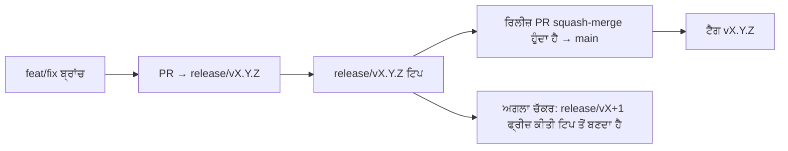

# Branching & Release Model (ਪੰਜਾਬੀ)

🌐 **Languages:** 🇺🇸 [English](../../../../ops/BRANCHING_MODEL.md) · 🇪🇹 [am](../../../am/docs/ops/BRANCHING_MODEL.md) · 🇸🇦 [ar](../../../ar/docs/ops/BRANCHING_MODEL.md) · 🇦🇿 [az](../../../az/docs/ops/BRANCHING_MODEL.md) · 🇧🇬 [bg](../../../bg/docs/ops/BRANCHING_MODEL.md) · 🇧🇩 [bn](../../../bn/docs/ops/BRANCHING_MODEL.md) · 🇨🇿 [cs](../../../cs/docs/ops/BRANCHING_MODEL.md) · 🇩🇰 [da](../../../da/docs/ops/BRANCHING_MODEL.md) · 🇩🇪 [de](../../../de/docs/ops/BRANCHING_MODEL.md) · 🇬🇷 [el](../../../el/docs/ops/BRANCHING_MODEL.md) · 🇪🇸 [es](../../../es/docs/ops/BRANCHING_MODEL.md) · 🇪🇪 [et](../../../et/docs/ops/BRANCHING_MODEL.md) · 🇮🇷 [fa](../../../fa/docs/ops/BRANCHING_MODEL.md) · 🇫🇮 [fi](../../../fi/docs/ops/BRANCHING_MODEL.md) · 🇫🇷 [fr](../../../fr/docs/ops/BRANCHING_MODEL.md) · 🇮🇪 [ga](../../../ga/docs/ops/BRANCHING_MODEL.md) · 🇮🇳 [gu](../../../gu/docs/ops/BRANCHING_MODEL.md) · 🇳🇬 [ha](../../../ha/docs/ops/BRANCHING_MODEL.md) · 🇮🇱 [he](../../../he/docs/ops/BRANCHING_MODEL.md) · 🇮🇳 [hi](../../../hi/docs/ops/BRANCHING_MODEL.md) · 🇭🇷 [hr](../../../hr/docs/ops/BRANCHING_MODEL.md) · 🇭🇺 [hu](../../../hu/docs/ops/BRANCHING_MODEL.md) · 🇦🇲 [hy](../../../hy/docs/ops/BRANCHING_MODEL.md) · 🇮🇩 [id](../../../id/docs/ops/BRANCHING_MODEL.md) · 🇳🇬 [ig](../../../ig/docs/ops/BRANCHING_MODEL.md) · 🇮🇹 [it](../../../it/docs/ops/BRANCHING_MODEL.md) · 🇯🇵 [ja](../../../ja/docs/ops/BRANCHING_MODEL.md) · 🇬🇪 [ka](../../../ka/docs/ops/BRANCHING_MODEL.md) · 🇰🇭 [km](../../../km/docs/ops/BRANCHING_MODEL.md) · 🇮🇳 [kn](../../../kn/docs/ops/BRANCHING_MODEL.md) · 🇰🇷 [ko](../../../ko/docs/ops/BRANCHING_MODEL.md) · 🇱🇹 [lt](../../../lt/docs/ops/BRANCHING_MODEL.md) · 🇱🇻 [lv](../../../lv/docs/ops/BRANCHING_MODEL.md) · 🇮🇳 [ml](../../../ml/docs/ops/BRANCHING_MODEL.md) · 🇮🇳 [mr](../../../mr/docs/ops/BRANCHING_MODEL.md) · 🇲🇾 [ms](../../../ms/docs/ops/BRANCHING_MODEL.md) · 🇲🇹 [mt](../../../mt/docs/ops/BRANCHING_MODEL.md) · 🇲🇲 [my](../../../my/docs/ops/BRANCHING_MODEL.md) · 🇳🇵 [ne](../../../ne/docs/ops/BRANCHING_MODEL.md) · 🇳🇱 [nl](../../../nl/docs/ops/BRANCHING_MODEL.md) · 🇳🇴 [no](../../../no/docs/ops/BRANCHING_MODEL.md) · 🇮🇳 [or](../../../or/docs/ops/BRANCHING_MODEL.md) · 🇵🇭 [phi](../../../phi/docs/ops/BRANCHING_MODEL.md) · 🇵🇱 [pl](../../../pl/docs/ops/BRANCHING_MODEL.md) · 🇵🇹 [pt](../../../pt/docs/ops/BRANCHING_MODEL.md) · 🇧🇷 [pt-BR](../../../pt-BR/docs/ops/BRANCHING_MODEL.md) · 🇷🇴 [ro](../../../ro/docs/ops/BRANCHING_MODEL.md) · 🇷🇺 [ru](../../../ru/docs/ops/BRANCHING_MODEL.md) · 🇱🇰 [si](../../../si/docs/ops/BRANCHING_MODEL.md) · 🇸🇰 [sk](../../../sk/docs/ops/BRANCHING_MODEL.md) · 🇸🇮 [sl](../../../sl/docs/ops/BRANCHING_MODEL.md) · 🇷🇸 [sr](../../../sr/docs/ops/BRANCHING_MODEL.md) · 🇸🇪 [sv](../../../sv/docs/ops/BRANCHING_MODEL.md) · 🇰🇪 [sw](../../../sw/docs/ops/BRANCHING_MODEL.md) · 🇮🇳 [ta](../../../ta/docs/ops/BRANCHING_MODEL.md) · 🇮🇳 [te](../../../te/docs/ops/BRANCHING_MODEL.md) · 🇹🇭 [th](../../../th/docs/ops/BRANCHING_MODEL.md) · 🇹🇷 [tr](../../../tr/docs/ops/BRANCHING_MODEL.md) · 🇺🇦 [uk-UA](../../../uk-UA/docs/ops/BRANCHING_MODEL.md) · 🇵🇰 [ur](../../../ur/docs/ops/BRANCHING_MODEL.md) · 🇺🇿 [uz](../../../uz/docs/ops/BRANCHING_MODEL.md) · 🇻🇳 [vi](../../../vi/docs/ops/BRANCHING_MODEL.md) · 🇳🇬 [yo](../../../yo/docs/ops/BRANCHING_MODEL.md) · 🇨🇳 [zh-CN](../../../zh-CN/docs/ops/BRANCHING_MODEL.md) · 🇹🇼 [zh-TW](../../../zh-TW/docs/ops/BRANCHING_MODEL.md)

---

OmniRoute ਇੱਕ **ਸਮਾਂਤਰ-ਚੱਕਰ** ਰਿਲੀਜ਼ ਮਾਡਲ ਵਰਤਦਾ ਹੈ: ਸਰਗਰਮ ਚੱਕਰ ਲਈ ਇੱਕ ਸਮਰਪਿਤ `release/vX.Y.Z`
ਬ੍ਰਾਂਚ, ਪ੍ਰਕਾਸ਼ਿਤ ਲਾਈਨ ਲਈ `main`, ਅਤੇ ਉਸ ਚੱਕਰ ਦੇ ਰਿਲੀਜ਼ ਹੋਣ ਵੇਲੇ ਇੱਕ ਅਪਰਿਵਰਤਨਸ਼ੀਲ
`vX.Y.Z` ਟੈਗ। ਕਮਿਟਾਂ ਦਾ `release/*` _ਅਤੇ_ `main` ਦੋਵਾਂ ਉੱਤੇ ਆਉਣਾ ਉਮੀਦ ਅਨੁਸਾਰ ਹੈ — ਇਹ ਕੋਈ ਗੜਬੜ ਨਹੀਂ ਹੈ।

ਮੇਨਟੇਨਰ ਲਈ ਵੇਰਵੇ `CLAUDE.md` (ਸਖ਼ਤ ਨਿਯਮ #21) ਅਤੇ
[RELEASE_CHECKLIST.md](./RELEASE_CHECKLIST.md) ਵਿੱਚ ਹਨ। ਇਹ ਸਫ਼ਾ ਯੋਗਦਾਨਕਾਰਾਂ ਲਈ ਜਨਤਕ
ਸੰਖੇਪ ਹੈ।

## ਇੱਕ ਨਜ਼ਰ ਵਿੱਚ

| ਰੈਫ਼             | ਭੂਮਿਕਾ                                                                               |
| ---------------- | ------------------------------------------------------------------------------------ |
| `release/vX.Y.Z` | **ਸਰਗਰਮ ਚੱਕਰ** — ਉਸ ਵਰਜਨ ਲਈ ਰੋਜ਼ਾਨਾ ਡਿਵੈਲਪਮੈਂਟ ਅਤੇ PR ਮਰਜ                            |
| `main`           | **ਪ੍ਰਕਾਸ਼ਿਤ ਲਾਈਨ** — ਰਿਲੀਜ਼ ਭੇਜੇ ਜਾਣ ਵੇਲੇ ਚੱਕਰ ਨੂੰ squash-merge ਰਾਹੀਂ ਪ੍ਰਾਪਤ ਕਰਦੀ ਹੈ |
| `vX.Y.Z` (ਟੈਗ)   | **ਰਿਲੀਜ਼ ਚਿੰਨ੍ਹ** — ਰਿਲੀਜ਼ ਸਮੇਂ ਬਣਾਇਆ ਗਿਆ ਅਪਰਿਵਰਤਨਸ਼ੀਲ “ਕੀ ਰਿਲੀਜ਼ ਹੋਇਆ” ਪੁਆਇੰਟਰ      |



## ਮੇਰੇ PR ਦਾ ਟਾਰਗੇਟ ਕੀ ਹੋਣਾ ਚਾਹੀਦਾ ਹੈ?

**ਸਰਗਰਮ `release/vX.Y.Z` ਬ੍ਰਾਂਚ ਨੂੰ ਟਾਰਗੇਟ ਕਰੋ — `main` ਨੂੰ ਨਹੀਂ।**

1. ਸਭ ਤੋਂ ਉੱਚੀ ਖੁੱਲ੍ਹੀ `release/v*` ਬ੍ਰਾਂਚ ਲੱਭੋ (ਲਿਖਣ ਵੇਲੇ ਉਦਾਹਰਨ:
   `release/v3.8.49`)।
2. ਉਸ ਟਿਪ ਤੋਂ ਬ੍ਰਾਂਚ ਬਣਾਓ (`git fetch` + checkout / ਉਸ ਉੱਤੇ rebase)।
3. **base = ਉਹ `release/vX.Y.Z`** ਰੱਖ ਕੇ PR ਖੋਲ੍ਹੋ।

`main` ਰੋਜ਼ਾਨਾ ਇੰਟੀਗ੍ਰੇਸ਼ਨ ਬ੍ਰਾਂਚ ਨਹੀਂ ਹੈ। `main` ਦੇ ਵਿਰੁੱਧ ਖੋਲ੍ਹੇ ਗਏ PRਾਂ ਨੂੰ
ਆਮ ਤੌਰ ਉੱਤੇ ਮਰਜ ਤੋਂ ਪਹਿਲਾਂ ਦੁਬਾਰਾ ਟਾਰਗੇਟ ਕਰਨ ਦੀ ਲੋੜ ਹੁੰਦੀ ਹੈ।

## ਰਿਲੀਜ਼ ਫ੍ਰੀਜ਼ (ਸਮਾਂਤਰ ਚੱਕਰ)

ਜਦੋਂ ਕਿਸੇ ਰਿਲੀਜ਼ ਦਾ ਮਿਲਾਨ ਕੀਤਾ ਜਾ ਰਿਹਾ ਹੁੰਦਾ ਹੈ, ਤਾਂ `release-freeze` ਲੇਬਲ ਵਾਲਾ ਇੱਕ
ਮਾਰਕਰ ਇਸ਼ੂ ਖੋਲ੍ਹਿਆ ਜਾਂਦਾ ਹੈ। ਇਹ **ਡਿਵੈਲਪਮੈਂਟ ਨੂੰ ਨਹੀਂ ਰੋਕਦਾ**:

- ਫ੍ਰੀਜ਼ ਕੀਤੀ `release/vX.Y.Z` ਉਸ ਰਿਲੀਜ਼ ਲਈ ਰਿਲੀਜ਼ ਕੈਪਟਨ ਦੀ ਹੁੰਦੀ ਹੈ।
- ਅਗਲੇ ਚੱਕਰ ਦੀ `release/vX+1` ਫ੍ਰੀਜ਼ ਕੀਤੀ ਟਿਪ ਤੋਂ ਬਣਾਈ ਜਾਂਦੀ ਹੈ, ਤਾਂ ਜੋ ਯੋਗਦਾਨਕਾਰ
  ਕੰਮ ਮਰਜ ਕਰਨਾ ਜਾਰੀ ਰੱਖ ਸਕਣ।
- ਅਜੇ ਵੀ ਫ੍ਰੀਜ਼ ਕੀਤੀ ਬ੍ਰਾਂਚ ਨੂੰ ਟਾਰਗੇਟ ਕਰਨ ਵਾਲੇ ਖੁੱਲ੍ਹੇ PRਾਂ ਨੂੰ ਸਰਗਰਮ (ਸਭ ਤੋਂ ਉੱਚੀ)
  `release/v*` ਬ੍ਰਾਂਚ ਵੱਲ **ਦੁਬਾਰਾ ਟਾਰਗੇਟ** ਕੀਤਾ ਜਾਣਾ ਚਾਹੀਦਾ ਹੈ।

ਇਹ ਮੰਨਣ ਤੋਂ ਪਹਿਲਾਂ ਕਿ ਤੁਹਾਡੀ ਚਾਹੀਦੀ ਬ੍ਰਾਂਚ ਮਰਜ ਕੀਤੀ ਜਾ ਸਕਦੀ ਹੈ, ਕਿਸੇ ਖੁੱਲ੍ਹੇ ਫ੍ਰੀਜ਼ ਦੀ ਜਾਂਚ ਕਰੋ:

```bash
gh issue list --repo diegosouzapw/OmniRoute --label release-freeze --state open
```

ਮਰਜ ਦੀ ਕਾਰਜ-ਵਿਧੀ (ਮਾਲਕ ਦਾ `queue` ਲੇਬਲ → Mergify)
[MERGE_TRAIN.md](./MERGE_TRAIN.md) ਵਿੱਚ ਦਰਜ ਹੈ।

## ਬ੍ਰਾਂਚ ਅਤੇ ਟੈਗ ਦੋਵੇਂ ਕਿਉਂ?

| ਆਰਟੀਫੈਕਟ         | ਮਿਆਦ             | ਉਦੇਸ਼                                                                       |
| ---------------- | ---------------- | --------------------------------------------------------------------------- |
| `release/vX.Y.Z` | ਪ੍ਰਗਤੀ ਅਧੀਨ ਚੱਕਰ | ਸਮੀਖਿਆ ਕੀਤੇ PR ਇਕੱਠੇ ਕਰਦੀ ਹੈ, CI-ਗ੍ਰੀਨ ਰਹਿੰਦੀ ਹੈ ਅਤੇ PR ਦਾ base ਹੁੰਦੀ ਹੈ    |
| ਟੈਗ `vX.Y.Z`     | ਹਮੇਸ਼ਾ ਲਈ        | npm / GitHub Releases ਉੱਤੇ ਰਿਲੀਜ਼ ਹੋਏ ਬਿਲਕੁਲ ਸਹੀ ਬਿਟਾਂ ਨੂੰ ਚਿੰਨ੍ਹਿਤ ਕਰਦਾ ਹੈ |

ਬ੍ਰਾਂਚ ਵਰਕਸ਼ਾਪ ਹੈ; ਟੈਗ ਸੀਲ ਕੀਤਾ ਪੈਕੇਜ ਹੈ। `main` ਵਿੱਚ squash-merge ਤੋਂ ਬਾਅਦ,
ਅਗਲਾ ਚੱਕਰ ਪਿਛਲੇ ਰਿਲੀਜ਼ PR ਦੇ ਪੂਰਾ ਹੋਣ ਦੀ ਉਡੀਕ ਕੀਤੇ ਬਿਨਾਂ `release/vX+1` ਉੱਤੇ ਜਾਰੀ ਰਹਿੰਦਾ ਹੈ।

## ਸੰਬੰਧਿਤ ਦਸਤਾਵੇਜ਼

- [CONTRIBUTING.md](../../CONTRIBUTING.md) — ਸੈੱਟਅੱਪ, ਟੈਸਟ, PR ਚੈੱਕਲਿਸਟ
- [RELEASE_CHECKLIST.md](./RELEASE_CHECKLIST.md) — ਰਿਲੀਜ਼-ਪੂਰਵ ਪ੍ਰਮਾਣੀਕਰਨ
- [MERGE_TRAIN.md](./MERGE_TRAIN.md) — ਮਰਜ ਕਤਾਰ ਅਤੇ ਫਾਲਬੈਕ ਟ੍ਰੇਨ
- [RELEASE_GREEN.md](./RELEASE_GREEN.md) — ਰਿਲੀਜ਼ ਟਿਪ ਨੂੰ ਗ੍ਰੀਨ ਰੱਖਣਾ
