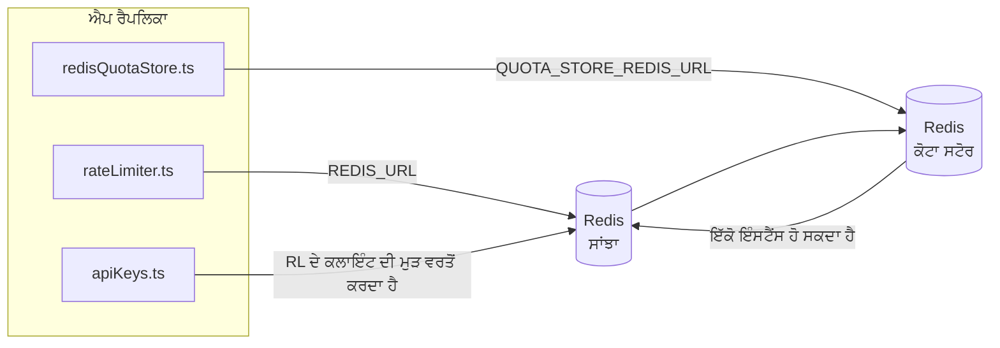

# Redis Production Configuration Guide (ਪੰਜਾਬੀ)

🌐 **Languages:** 🇺🇸 [English](../../../../ops/REDIS_PRODUCTION_CONFIG.md) · 🇪🇹 [am](../../../am/docs/ops/REDIS_PRODUCTION_CONFIG.md) · 🇸🇦 [ar](../../../ar/docs/ops/REDIS_PRODUCTION_CONFIG.md) · 🇦🇿 [az](../../../az/docs/ops/REDIS_PRODUCTION_CONFIG.md) · 🇧🇬 [bg](../../../bg/docs/ops/REDIS_PRODUCTION_CONFIG.md) · 🇧🇩 [bn](../../../bn/docs/ops/REDIS_PRODUCTION_CONFIG.md) · 🇨🇿 [cs](../../../cs/docs/ops/REDIS_PRODUCTION_CONFIG.md) · 🇩🇰 [da](../../../da/docs/ops/REDIS_PRODUCTION_CONFIG.md) · 🇩🇪 [de](../../../de/docs/ops/REDIS_PRODUCTION_CONFIG.md) · 🇬🇷 [el](../../../el/docs/ops/REDIS_PRODUCTION_CONFIG.md) · 🇪🇸 [es](../../../es/docs/ops/REDIS_PRODUCTION_CONFIG.md) · 🇪🇪 [et](../../../et/docs/ops/REDIS_PRODUCTION_CONFIG.md) · 🇮🇷 [fa](../../../fa/docs/ops/REDIS_PRODUCTION_CONFIG.md) · 🇫🇮 [fi](../../../fi/docs/ops/REDIS_PRODUCTION_CONFIG.md) · 🇫🇷 [fr](../../../fr/docs/ops/REDIS_PRODUCTION_CONFIG.md) · 🇮🇪 [ga](../../../ga/docs/ops/REDIS_PRODUCTION_CONFIG.md) · 🇮🇳 [gu](../../../gu/docs/ops/REDIS_PRODUCTION_CONFIG.md) · 🇳🇬 [ha](../../../ha/docs/ops/REDIS_PRODUCTION_CONFIG.md) · 🇮🇱 [he](../../../he/docs/ops/REDIS_PRODUCTION_CONFIG.md) · 🇮🇳 [hi](../../../hi/docs/ops/REDIS_PRODUCTION_CONFIG.md) · 🇭🇷 [hr](../../../hr/docs/ops/REDIS_PRODUCTION_CONFIG.md) · 🇭🇺 [hu](../../../hu/docs/ops/REDIS_PRODUCTION_CONFIG.md) · 🇦🇲 [hy](../../../hy/docs/ops/REDIS_PRODUCTION_CONFIG.md) · 🇮🇩 [id](../../../id/docs/ops/REDIS_PRODUCTION_CONFIG.md) · 🇳🇬 [ig](../../../ig/docs/ops/REDIS_PRODUCTION_CONFIG.md) · 🇮🇹 [it](../../../it/docs/ops/REDIS_PRODUCTION_CONFIG.md) · 🇯🇵 [ja](../../../ja/docs/ops/REDIS_PRODUCTION_CONFIG.md) · 🇬🇪 [ka](../../../ka/docs/ops/REDIS_PRODUCTION_CONFIG.md) · 🇰🇭 [km](../../../km/docs/ops/REDIS_PRODUCTION_CONFIG.md) · 🇮🇳 [kn](../../../kn/docs/ops/REDIS_PRODUCTION_CONFIG.md) · 🇰🇷 [ko](../../../ko/docs/ops/REDIS_PRODUCTION_CONFIG.md) · 🇱🇹 [lt](../../../lt/docs/ops/REDIS_PRODUCTION_CONFIG.md) · 🇱🇻 [lv](../../../lv/docs/ops/REDIS_PRODUCTION_CONFIG.md) · 🇮🇳 [ml](../../../ml/docs/ops/REDIS_PRODUCTION_CONFIG.md) · 🇮🇳 [mr](../../../mr/docs/ops/REDIS_PRODUCTION_CONFIG.md) · 🇲🇾 [ms](../../../ms/docs/ops/REDIS_PRODUCTION_CONFIG.md) · 🇲🇹 [mt](../../../mt/docs/ops/REDIS_PRODUCTION_CONFIG.md) · 🇲🇲 [my](../../../my/docs/ops/REDIS_PRODUCTION_CONFIG.md) · 🇳🇵 [ne](../../../ne/docs/ops/REDIS_PRODUCTION_CONFIG.md) · 🇳🇱 [nl](../../../nl/docs/ops/REDIS_PRODUCTION_CONFIG.md) · 🇳🇴 [no](../../../no/docs/ops/REDIS_PRODUCTION_CONFIG.md) · 🇮🇳 [or](../../../or/docs/ops/REDIS_PRODUCTION_CONFIG.md) · 🇵🇭 [phi](../../../phi/docs/ops/REDIS_PRODUCTION_CONFIG.md) · 🇵🇱 [pl](../../../pl/docs/ops/REDIS_PRODUCTION_CONFIG.md) · 🇵🇹 [pt](../../../pt/docs/ops/REDIS_PRODUCTION_CONFIG.md) · 🇧🇷 [pt-BR](../../../pt-BR/docs/ops/REDIS_PRODUCTION_CONFIG.md) · 🇷🇴 [ro](../../../ro/docs/ops/REDIS_PRODUCTION_CONFIG.md) · 🇷🇺 [ru](../../../ru/docs/ops/REDIS_PRODUCTION_CONFIG.md) · 🇱🇰 [si](../../../si/docs/ops/REDIS_PRODUCTION_CONFIG.md) · 🇸🇰 [sk](../../../sk/docs/ops/REDIS_PRODUCTION_CONFIG.md) · 🇸🇮 [sl](../../../sl/docs/ops/REDIS_PRODUCTION_CONFIG.md) · 🇷🇸 [sr](../../../sr/docs/ops/REDIS_PRODUCTION_CONFIG.md) · 🇸🇪 [sv](../../../sv/docs/ops/REDIS_PRODUCTION_CONFIG.md) · 🇰🇪 [sw](../../../sw/docs/ops/REDIS_PRODUCTION_CONFIG.md) · 🇮🇳 [ta](../../../ta/docs/ops/REDIS_PRODUCTION_CONFIG.md) · 🇮🇳 [te](../../../te/docs/ops/REDIS_PRODUCTION_CONFIG.md) · 🇹🇭 [th](../../../th/docs/ops/REDIS_PRODUCTION_CONFIG.md) · 🇹🇷 [tr](../../../tr/docs/ops/REDIS_PRODUCTION_CONFIG.md) · 🇺🇦 [uk-UA](../../../uk-UA/docs/ops/REDIS_PRODUCTION_CONFIG.md) · 🇵🇰 [ur](../../../ur/docs/ops/REDIS_PRODUCTION_CONFIG.md) · 🇺🇿 [uz](../../../uz/docs/ops/REDIS_PRODUCTION_CONFIG.md) · 🇻🇳 [vi](../../../vi/docs/ops/REDIS_PRODUCTION_CONFIG.md) · 🇳🇬 [yo](../../../yo/docs/ops/REDIS_PRODUCTION_CONFIG.md) · 🇨🇳 [zh-CN](../../../zh-CN/docs/ops/REDIS_PRODUCTION_CONFIG.md) · 🇹🇼 [zh-TW](../../../zh-TW/docs/ops/REDIS_PRODUCTION_CONFIG.md)

---

## ਸੰਖੇਪ ਜਾਣਕਾਰੀ

Redis OmniRoute ਵਿੱਚ ਇੱਕ **ਵਿਕਲਪਿਕ, ਗੈਰ-ਲਾਜ਼ਮੀ ਨਿਰਭਰਤਾ** ਹੈ — Redis ਉਪਲਬਧ ਨਾ ਹੋਣ 'ਤੇ ਐਪਲੀਕੇਸ਼ਨ ਸੁਚਾਰੂ ਢੰਗ ਨਾਲ ਘੱਟ ਸਮਰੱਥਾ ਵਾਲੇ ਮੋਡ ਵਿੱਚ ਚਲੀ ਜਾਂਦੀ ਹੈ (ਇਨ-ਮੈਮੋਰੀ
ਫਾਲਬੈਕ)। ਪ੍ਰੋਡਕਸ਼ਨ ਵਿੱਚ, Redis ਨੂੰ ਟਿਊਨ ਕਰਨ ਨਾਲ ਚਾਰ ਵੱਖ-ਵੱਖ
ਵਰਕਲੋਡਾਂ ਲਈ ਲੇਟੈਂਸੀ ਘਟਦੀ ਹੈ:

| ਵਰਕਲੋਡ               | ਡਰਾਈਵਰ                        | ਕਲਾਇੰਟ ਫੈਕਟਰੀ                                | ਕੁੰਜੀ ਪੈਟਰਨ                                |
| -------------------- | ----------------------------- | -------------------------------------------- | ------------------------------------------ |
| ਦਰ ਸੀਮਾਬੰਦੀ          | `rateLimiter.ts`              | `getRedisClient()` — ਲੇਜ਼ੀ `ioredis` ਸਿੰਗਲਟਨ | `<prefix>rl:*` Lua‑ਐਟਾਮਿਕ ਦਰ ਸੀਮਾ ਵਿੰਡੋਜ਼  |
| ਪ੍ਰਮਾਣੀਕਰਨ ਕੈਸ਼      | `apiKeys.ts`                  | `rateLimiter` ਦੇ ਕਲਾਇੰਟ ਦੀ ਮੁੜ ਵਰਤੋਂ ਕਰਦਾ ਹੈ | TTL ਨਾਲ `<prefix>auth:api_key:<sha256>`    |
| ਕੋਟਾ ਸਟੋਰ            | `redisQuotaStore.ts`          | ਵੱਖਰਾ `getRedisClient(url)` ਸਿੰਗਲਟਨ          | `<prefix>quota:*` ਪ੍ਰਤੀ-ਇੰਸਟੈਂਸ ਸੰਰਚਨਾ ਯੋਗ |
| ਵਾਰਮਅੱਪ ਸਰਕਿਟ ਬ੍ਰੇਕਰ | `redisCircuitBreakerStore.ts` | `circuitBreakerFactory.ts` ਵਿੱਚ ਵੱਖਰਾ ਕਲਾਇੰਟ | `<prefix>warmup:cb:<connectionId>`         |

ਸਾਰੇ ਚਾਰ ਵਰਕਲੋਡ ਇੱਕੋ ਨੇਮਸਪੇਸ ਪ੍ਰੀਫਿਕਸ ਸਾਂਝਾ ਕਰਦੇ ਹਨ, ਤਾਂ ਜੋ OmniRoute ਇੱਕੋ
Redis ਇੰਸਟੈਂਸ (ਉਦਾਹਰਨ ਲਈ `127.0.0.1:6379`) ਉੱਤੇ ਹੋਰ ਐਪਾਂ ਦੇ ਨਾਲ ਮੌਜੂਦ ਰਹਿ ਸਕੇ। [ਕੁੰਜੀ ਨੇਮਸਪੇਸਿੰਗ](#key-namespacing) ਵੇਖੋ।

---

## ਮੌਜੂਦਾ ਸੰਰਚਨਾ (ਕੋਡ ਡਿਫਾਲਟ)

| ਸੈਟਿੰਗ                                  | ਮੁੱਲ                                                          | ਸਥਾਨ                                                                                  |
| --------------------------------------- | ------------------------------------------------------------- | ------------------------------------------------------------------------------------- |
| `REDIS_URL` ਵਾਤਾਵਰਨ ਵੇਰੀਏਬਲ             | `redis://redis:6379` (compose), ਵਿਕਲਪਿਕ                       | `rateLimiter.ts:5`, `.env.example`                                                    |
| `REDIS_KEY_PREFIX` ਵਾਤਾਵਰਨ ਵੇਰੀਏਬਲ      | `omniroute:` (ਡਿਫਾਲਟ)                                         | `rateLimiter.ts`, `redisQuotaStore.ts`, `redisCircuitBreakerStore.ts`, `.env.example` |
| `QUOTA_STORE_REDIS_URL` ਵਾਤਾਵਰਨ ਵੇਰੀਏਬਲ | ਵੱਖਰਾ, `REDIS_URL` ਤੋਂ ਭਿੰਨ ਹੋ ਸਕਦਾ ਹੈ                        | `quota/storeFactory.ts`                                                               |
| `QUOTA_STORE_DRIVER`                    | `"sqlite"` (ਡਿਫਾਲਟ), `"redis"` ਵਿਕਲਪਿਕ                        | `quota/storeFactory.ts`                                                               |
| ioredis `maxRetriesPerRequest`          | `3`                                                           | `rateLimiter.ts` ਕਲਾਇੰਟ ਬਣਾਉਣਾ                                                        |
| `enableReadyCheck`                      | ਸੈੱਟ ਨਹੀਂ ਕੀਤਾ ਗਿਆ (ioredis ਡਿਫਾਲਟ: `true`)                   | —                                                                                     |
| `lazyConnect`                           | ਸੈੱਟ ਨਹੀਂ ਕੀਤਾ ਗਿਆ (ioredis ਡਿਫਾਲਟ: `false`)                  | —                                                                                     |
| `retryStrategy`                         | ਸੈੱਟ ਨਹੀਂ ਕੀਤਾ ਗਿਆ (ioredis ਡਿਫਾਲਟ: 200ms ਬੇਸ, ਐਕਸਪੋਨੇਨਸ਼ੀਅਲ) | —                                                                                     |
| TLS / ਪਾਸਵਰਡ / DB ਇੰਡੈਕਸ                | **ਸੰਰਚਿਤ ਨਹੀਂ**                                               | —                                                                                     |
| Sentinel / Cluster                      | **ਸੰਰਚਿਤ ਨਹੀਂ** — ਸਿਰਫ਼ ਸਟੈਂਡਅਲੋਨ ਸਿੰਗਲ-ਨੋਡ                   | —                                                                                     |

---

## ਕੁੰਜੀ ਨੇਮਸਪੇਸਿੰਗ

OmniRoute ਇੱਕ Redis ਇੰਸਟੈਂਸ ਨੂੰ ਹੋਸਟ ਉੱਤੇ ਚੱਲ ਰਹੀ ਕਿਸੇ ਵੀ ਹੋਰ ਚੀਜ਼ ਨਾਲ ਸਾਂਝਾ ਕਰਦਾ ਹੈ। ਨੇਮਸਪੇਸ ਤੋਂ ਬਿਨਾਂ,
`auth:api_key:<sha256>` ਜਾਂ `rl:*` ਵਰਗੀਆਂ ਕੁੰਜੀਆਂ ਉਸੇ Redis ਦੀ ਵਰਤੋਂ ਕਰਨ ਵਾਲੀਆਂ ਹੋਰ ਐਪਲੀਕੇਸ਼ਨਾਂ ਦੀਆਂ
ਕੁੰਜੀਆਂ ਨਾਲ ਟਕਰਾ ਸਕਦੀਆਂ ਹਨ (ਇਹ ਇੰਸਟੈਂਸ ਹੋਰ ਸੇਵਾਵਾਂ ਦੇ ਨਾਲ `127.0.0.1:6379` ਉੱਤੇ Redis ਚਲਾਉਂਦਾ ਹੈ)।

**ਹਰ** OmniRoute ਕੁੰਜੀ ਅੱਗੇ ਪ੍ਰੀਫਿਕਸ ਲਗਾਉਣ ਲਈ `REDIS_KEY_PREFIX` ਨੂੰ ਇੱਕ ਗੈਰ-ਖਾਲੀ ਸਟ੍ਰਿੰਗ 'ਤੇ ਸੈੱਟ ਕਰੋ:

```bash
# .env — ਸਾਰੀਆਂ OmniRoute ਕੁੰਜੀਆਂ omniroute:rl:*, omniroute:auth:*, omniroute:quota:*, omniroute:warmup:cb:* ਬਣ ਜਾਂਦੀਆਂ ਹਨ
REDIS_KEY_PREFIX=omniroute:
```

- **ਡਿਫਾਲਟ:** `omniroute:` (`REDIS_KEY_PREFIX` ਅਣਸੈੱਟ ਜਾਂ ਖਾਲੀ ਹੋਣ 'ਤੇ ਲਾਗੂ ਹੁੰਦਾ ਹੈ)।
- **ਇਨ੍ਹਾਂ 'ਤੇ ਲਾਗੂ:** ਦਰ ਸੀਮਾਕਾਰ + ਪ੍ਰਮਾਣੀਕਰਨ ਕੈਸ਼ (`keyPrefix` ਰਾਹੀਂ ਸਾਂਝਾ `ioredis` ਕਲਾਇੰਟ), ਅਤੇ
  ਕੋਟਾ ਸਟੋਰ (`KEY_PREFIX = "${REDIS_KEY_PREFIX}quota"`), ਅਤੇ ਵਾਰਮਅੱਪ ਸਰਕਿਟ ਬ੍ਰੇਕਰ
  (`KEY_PREFIX = "${REDIS_KEY_PREFIX}warmup:cb:"`)।
- ਜਦੋਂ Redis ਵਿੱਚ ਕੁੰਜੀਆਂ ਪਹਿਲਾਂ ਹੀ ਮੌਜੂਦ ਹੋਣ, ਤਾਂ **ਪ੍ਰੀਫਿਕਸ ਬਦਲਣ ਨਾਲ** ਪੁਰਾਣੀਆਂ ਕੁੰਜੀਆਂ ਅਨਾਥ ਹੋ ਜਾਂਦੀਆਂ ਹਨ (ਉਹ TTL / LRU
  ਰਾਹੀਂ ਮਿਆਦ ਪੁੱਗਣ 'ਤੇ ਹਟ ਜਾਂਦੀਆਂ ਹਨ)। ਇਸਨੂੰ ਬਦਲਣਾ ਸੁਰੱਖਿਅਤ ਹੈ; ਕਿਸੇ ਮਾਈਗ੍ਰੇਸ਼ਨ ਦੀ ਲੋੜ ਨਹੀਂ। ਇੱਕੋ ਅਪਵਾਦ ਉਸ ਕਨੈਕਸ਼ਨ ਲਈ ਵਾਰਮਅੱਪ
  ਸਰਕਿਟ-ਬ੍ਰੇਕਰ ਕੁੰਜੀ ਹੈ ਜਿਸਨੂੰ ਮਨਾਹੀਸ਼ੁਦਾ ਵਜੋਂ ਚਿੰਨ੍ਹਿਤ ਕੀਤਾ ਗਿਆ ਹੋਵੇ: ਇਹ TTL ਤੋਂ ਬਿਨਾਂ ਸਥਾਈ ਤੌਰ 'ਤੇ ਸੰਭਾਲੀ ਜਾਂਦੀ ਹੈ, ਇਸ ਲਈ
  ਬਚੀਆਂ ਹੋਈਆਂ ਕੁੰਜੀਆਂ ਨੂੰ `redis-cli --scan --pattern '<old-prefix>warmup:cb:*'` ਨਾਲ ਸੂਚੀਬੱਧ ਕਰੋ ਅਤੇ ਮਿਟਾ ਦਿਓ।
- **ioredis `keyPrefix`** ਲਿਖਣ ਵੇਲੇ ਪ੍ਰੀਫਿਕਸ ਨੂੰ ਆਪਣੇ ਆਪ ਅੱਗੇ ਜੋੜਦਾ ਹੈ **ਅਤੇ** ਪੜ੍ਹਨ ਵੇਲੇ ਇਸਨੂੰ ਹਟਾ ਦਿੰਦਾ ਹੈ,
  ਇਸ ਲਈ ਐਪਲੀਕੇਸ਼ਨ ਕੋਡ ਨੂੰ ਪ੍ਰੀਫਿਕਸ ਕਦੇ ਦਿਖਾਈ ਨਹੀਂ ਦਿੰਦਾ।

---

## ਉਤਪਾਦਨ ਲਈ ਸਿਫ਼ਾਰਸ਼ੀ ਟਿਊਨਿੰਗ

### 1. ਕਨੈਕਸ਼ਨ ਪੂਲ / ਕਲਾਇੰਟ ਵਿਕਲਪ (ioredis `Redis` ਕੰਸਟਰਕਟਰ)

ਮੌਜੂਦਾ ਕੋਡ ਬਿਨਾਂ ਕਿਸੇ ਕਸਟਮ ਵਿਕਲਪ ਦੇ ਇੱਕੋ `new Redis(url)` ਬਣਾਉਂਦਾ ਹੈ। ਉਤਪਾਦਨ
ਵਿੱਚ ਮਲਟੀ-ਰੈਪਲਿਕਾ ਡਿਪਲੌਇਮੈਂਟਾਂ ਲਈ, ਕੋਡ ਵਿੱਚ ਕਲਾਇੰਟ ਫੈਕਟਰੀ ਪਾਸ ਕਰੋ ਜਾਂ `getRedisClient()` ਨੂੰ ਰੈਪ ਕਰੋ:

```typescript
const redis = new Redis(REDIS_URL, {
  maxRetriesPerRequest: null, // ਮੁੜ-ਕੋਸ਼ਿਸ਼ ਦੀ ਕੋਈ ਸੀਮਾ ਨਹੀਂ; retryStrategy ਨੂੰ ਫ਼ੈਸਲਾ ਕਰਨ ਦਿਓ
  enableReadyCheck: true, // ਕਾਲਾਂ ਸਵੀਕਾਰ ਕਰਨ ਤੋਂ ਪਹਿਲਾਂ ਪੁਸ਼ਟੀ ਕਰੋ ਕਿ ਸਰਵਰ ਤਿਆਰ ਹੈ
  lazyConnect: true, // ਬਣਾਉਣ ਸਮੇਂ ਕਨੈਕਟ ਨਾ ਕਰੋ; ਪਹਿਲੀ ਕਾਲ ਦੀ ਉਡੀਕ ਕਰੋ
  retryStrategy: (times) => {
    if (times > 10) return null; // 10 ਮੁੜ-ਕੋਸ਼ਿਸ਼ਾਂ ਤੋਂ ਬਾਅਦ ਛੱਡ ਦਿਓ → ਬਾਅਦ ਵਿੱਚ ਮੁੜ ਕਨੈਕਟ ਕਰੋ
    return Math.min(times * 200, 5000); // 200ms, 400ms, …, ਵੱਧ ਤੋਂ ਵੱਧ 5s
  },
  enableAutoPipelining: true, // ਸਮਕਾਲੀ ਕਮਾਂਡਾਂ ਨੂੰ ਇੱਕ TCP ਰਾਈਟ ਵਿੱਚ ਇਕੱਠਾ ਕਰੋ
  keepAlive: 10000, // ਹਰ 10s ਬਾਅਦ TCP keep-alive
});
```

**ਮੁੱਖ ਸਮਝੌਤੇ:**

- `maxRetriesPerRequest: null` + `retryStrategy` — ਉਤਪਾਦਨ ਲਈ ਤਰਜੀਹੀ ਹੈ ਤਾਂ ਜੋ ਅਸਥਾਈ
  Redis ਰੀਸਟਾਰਟ ਹਰ ਬੇਨਤੀ ਨੂੰ ਤੁਰੰਤ ਅਸਫਲ ਨਾ ਕਰਨ। `checkRateLimit()` ਵਿੱਚ ਇਨ-ਮੈਮੋਰੀ ਫਾਲਬੈਕ
  ਅਸਫਲਤਾ ਮਾਰਗ ਨੂੰ ਸੰਭਾਲਦਾ ਹੈ।
- `lazyConnect: true` — ਸਰਵਰ ਵੱਲੋਂ ਕਨੈਕਸ਼ਨ ਸਵੀਕਾਰ ਕਰਨੇ ਸ਼ੁਰੂ ਕਰਨ ਤੋਂ ਪਹਿਲਾਂ Redis ਦੇ ਚਾਲੂ ਹੋਣ ਉੱਤੇ
  ਸਟਾਰਟਅੱਪ ਨਿਰਭਰਤਾ ਤੋਂ ਬਚਾਉਂਦਾ ਹੈ।
- `enableAutoPipelining: true` — ਸਮਕਾਲੀ ਰੇਟ-ਲਿਮਿਟ ਜਾਂਚਾਂ ਲਈ ਰਾਊਂਡ-ਟ੍ਰਿਪ ਘਟਾਉਂਦਾ ਹੈ;
  ਇੱਕ ਕਨੈਕਸ਼ਨ ਉੱਤੇ >50 RPS ਲਈ ਲਾਭਦਾਇਕ ਹੈ।

### 2. Redis ਸਰਵਰ ਸੰਰਚਨਾ (`redis.conf`)

```
# ਮੈਮੋਰੀ
maxmemory 80%                        # OS ਪੇਜ ਕੈਸ਼ ਲਈ ਥਾਂ ਛੱਡੋ
maxmemory-policy allkeys-lru         # ਦਬਾਅ ਹੇਠ ਪੁਰਾਣੀਆਂ auth ਕੈਸ਼ ਐਂਟਰੀਆਂ ਹਟਾਓ

# ਸਥਿਰ ਸਟੋਰੇਜ (ਵਿਕਲਪਿਕ — OmniRoute ਇਸ ਤੋਂ ਬਿਨਾਂ ਵੀ ਕਰੈਸ਼-ਸੁਰੱਖਿਅਤ ਹੈ)
save 300 1                           # ਜੇ ≥1 ਕੁੰਜੀ ਬਦਲੀ ਹੋਵੇ ਤਾਂ ਘੱਟੋ-ਘੱਟ ਹਰ 5 ਮਿੰਟ ਬਾਅਦ ਸਨੈਪਸ਼ਾਟ ਲਓ
appendonly no                        # AOF ਦੀ ਲੋੜ ਨਹੀਂ; ਡੇਟਾ ਮੁੜ ਤਿਆਰ ਕੀਤਾ ਜਾ ਸਕਦਾ ਹੈ
appendfsync no                       # ਕੋਈ fsync ਓਵਰਹੈੱਡ ਨਹੀਂ (RDB ਕਾਫ਼ੀ ਹੈ)

# ਨੈੱਟਵਰਕਿੰਗ
timeout 0                            # ਨਿਸ਼ਕਿਰਿਆ ਕਨੈਕਸ਼ਨ ਡਿਸਕਨੈਕਟ ਨਾ ਕਰੋ
tcp-keepalive 300                    # 5 ਮਿੰਟ ਦਾ keep-alive
tcp-backlog 511                      # ਅਚਾਨਕ ਵਧਦੇ ਲੋਡ ਲਈ ਕਨੈਕਸ਼ਨ ਬੈਕਲੌਗ

# ਪ੍ਰਦਰਸ਼ਨ
hz 10                                # ਡਿਫਾਲਟ; ਲੇਟੈਂਸੀ-ਸੰਵੇਦਨਸ਼ੀਲ ਵਰਤੋਂ ਲਈ 100
activedefrag yes                     # ਫ੍ਰੈਗਮੈਂਟੇਸ਼ਨ >10% ਹੋਣ ਉੱਤੇ ਆਪਣੇ-ਆਪ ਡੀਫ੍ਰੈਗਮੈਂਟ ਕਰੋ
```

**`maxmemory-policy allkeys-lru` ਲਈ ਸਮਝੌਤਾ:** ਮੈਮੋਰੀ ਦਬਾਅ ਹੇਠ Auth ਕੈਸ਼ ਐਂਟਰੀਆਂ
ਹਟਾਈਆਂ ਜਾ ਸਕਦੀਆਂ ਹਨ। ਇਹ ਸੁਰੱਖਿਅਤ ਹੈ — `setCachedApiKey` ਕੈਸ਼ ਮਿਸ ਹੋਣ ਉੱਤੇ ਹਮੇਸ਼ਾ ਮੁੜ ਭਰਦਾ ਹੈ, ਅਤੇ
SQLite ਫਾਲਬੈਕ ਅਧਿਕਾਰਤ ਸਰੋਤ ਹੈ। ਰੇਟ-ਲਿਮਿਟਰ Lua ਸਕ੍ਰਿਪਟ ਛੋਟੀਆਂ ਕੁੰਜੀਆਂ ਬਣਾਉਂਦੀ ਹੈ ਜੋ
ਡਿਜ਼ਾਈਨ ਅਨੁਸਾਰ ਥੋੜ੍ਹੇ ਸਮੇਂ ਲਈ ਰਹਿੰਦੀਆਂ ਹਨ।

### 3. Docker Compose ਸੈਟਿੰਗਾਂ

ਉਤਪਾਦਨ compose (`docker-compose.prod.yml`) `redis:8.6.2-alpine` ਵਰਤਦਾ ਹੈ। ਇਹ ਸ਼ਾਮਲ ਕਰੋ:

```yaml
redis:
  image: redis:8.6.2-alpine
  command:
    [
      "redis-server",
      "--maxmemory",
      "512mb",
      "--maxmemory-policy",
      "allkeys-lru",
      "--activedefrag",
      "yes",
      "--save",
      "300 1",
    ]
  healthcheck:
    test: ["CMD", "redis-cli", "ping"]
    interval: 10s
    timeout: 3s
    retries: 3
    start_period: 5s
```

### 4. ਮਲਟੀ-ਇੰਸਟੈਂਸ / ਸਕੇਲਿੰਗ ਸੰਬੰਧੀ ਵਿਚਾਰ

**ਸਾਰੀਆਂ ਰੈਪਲਿਕਾਵਾਂ ਲਈ ਇੱਕੋ Redis** — ਰੇਟ-ਲਿਮਿਟਰ Lua ਸਕ੍ਰਿਪਟ ਇੱਕੋ
ਅਧਿਕਾਰਤ ਕੁੰਜੀ-ਸਪੇਸ ਉੱਤੇ ਨਿਰਭਰ ਕਰਦੀ ਹੈ। ਰੈਪਲਿਕਾਵਾਂ ਦੇ ਪਿੱਛੇ ਕਈ Redis ਇੰਸਟੈਂਸ ਵਰਤਣ ਨਾਲ ਐਟੋਮਿਸਿਟੀ
ਖਤਮ ਹੋ ਜਾਵੇਗੀ ਅਤੇ ਬਜਟ ਦੁੱਗਣਾ ਹੋ ਜਾਵੇਗਾ। ਸਾਰੀਆਂ ਐਪਲੀਕੇਸ਼ਨ ਰੈਪਲਿਕਾਵਾਂ ਲਈ ਇੱਕੋ Redis
(ਜਾਂ ਫੇਲਓਵਰ ਵਾਲਾ Redis Sentinel ਕਲੱਸਟਰ) ਵਰਤੋ।

**ਕਨੈਕਸ਼ਨਾਂ ਦੀ ਗਿਣਤੀ:** ਹਰ ਐਪਲੀਕੇਸ਼ਨ ਰੈਪਲਿਕਾ Redis ਲਈ **2 TCP ਕਨੈਕਸ਼ਨ** ਖੋਲ੍ਹਦੀ ਹੈ
(ਰੇਟ-ਲਿਮਿਟਰ ਕਲਾਇੰਟ + ਕੋਟਾ ਸਟੋਰ ਕਲਾਇੰਟ)। 10 ਰੈਪਲਿਕਾਵਾਂ ਉੱਤੇ → 20 ਕਨੈਕਸ਼ਨ, ਜੋ
ਇੱਕ ਡਿਫਾਲਟ Redis ਇੰਸਟੈਂਸ ਦੀ 10k ਕਨੈਕਸ਼ਨ ਸੀਮਾ ਦੇ ਅੰਦਰ ਹਨ।

### 5. ਨਿਗਰਾਨੀ

ਹੈਲਥ-ਚੈੱਕ ਐਂਡਪੌਇੰਟ ਰਾਹੀਂ ਉਪਲਬਧ ਕਰਵਾਓ:

```typescript
// src/app/api/monitoring/health/route.ts ਪਹਿਲਾਂ ਹੀ rateLimiter ਫੰਕਸ਼ਨਾਂ ਨੂੰ ਕਾਲ ਕਰਦੀ ਹੈ
// Redis-ਵਿਸ਼ੇਸ਼ ਜਾਂਚਾਂ ਸ਼ਾਮਲ ਕਰੋ:
//   1. ioredis .ping() ਰਾਹੀਂ PING ਲੇਟੈਂਸੀ
//   2. INFO memory ਰਾਹੀਂ ਮੈਮੋਰੀ ਵਰਤੋਂ
//   3. INFO clients ਰਾਹੀਂ ਕਨੈਕਸ਼ਨਾਂ ਦੀ ਗਿਣਤੀ
//   4. maxmemory-policy ਲਈ ਹਿੱਟ ਦਰ (evicted_keys / keyspace_hits)
```

ਨਿਗਰਾਨੀ ਲਈ ਮੁੱਖ ਮੈਟ੍ਰਿਕਸ:

- **ਹਟਾਈਆਂ ਗਈਆਂ ਕੁੰਜੀਆਂ / ਸਕਿੰਟ** — ਜੇ ਲਗਾਤਾਰ ਗੈਰ-ਸਿਫ਼ਰ ਰਹੇ, ਤਾਂ `maxmemory` ਵਧਾਓ
- **ਬਲੌਕ ਕੀਤੇ ਕਲਾਇੰਟ** — ਗੈਰ-ਸਿਫ਼ਰ ਹੋਣਾ ਹੌਲੀਆਂ Lua ਸਕ੍ਰਿਪਟਾਂ ਜਾਂ ਵੱਧ ਮੁਕਾਬਲੇ ਨੂੰ ਦਰਸਾਉਂਦਾ ਹੈ
- **ਰੱਦ ਕੀਤੇ ਕਨੈਕਸ਼ਨ** — ਕਨੈਕਸ਼ਨ ਸੀਮਾ ਪੂਰੀ ਹੋ ਗਈ; 20 ਕਨੈਕਸ਼ਨਾਂ ਉੱਤੇ ਅਜਿਹਾ ਵਿਰਲੇ ਹੀ ਹੁੰਦਾ ਹੈ

---

## ਆਰਕੀਟੈਕਚਰ ਡਾਇਗ੍ਰਾਮ



---

## ਹਵਾਲੇ

| ਫ਼ਾਈਲ                              | ਉਦੇਸ਼                                                      |
| ---------------------------------- | ---------------------------------------------------------- |
| `src/shared/utils/rateLimiter.ts`  | ਮੁੱਖ Redis ਕਲਾਇੰਟ, Lua ਰੇਟ-ਲਿਮਿਟ ਸਕ੍ਰਿਪਟ, ਇਨ-ਮੈਮੋਰੀ ਫਾਲਬੈਕ |
| `src/lib/db/apiKeys.ts`            | ਪ੍ਰਮਾਣੀਕਰਨ ਕੈਸ਼ — Redis→SQLite ਫਾਲਬੈਕ                      |
| `src/lib/quota/redisQuotaStore.ts` | ਵਿਕਲਪਿਕ ਕੋਟਾ ਸਟੋਰ ਲਈ ਵੱਖਰਾ Redis ਕਲਾਇੰਟ                    |
| `src/lib/quota/storeFactory.ts`    | `sqlite` ਅਤੇ `redis` ਕੋਟਾ ਡਰਾਈਵਰਾਂ ਵਿਚਕਾਰ ਸਵਿੱਚ ਕਰਦਾ ਹੈ    |
| `docker-compose.prod.yml`          | ਪ੍ਰੋਡਕਸ਼ਨ Redis ਕੰਟੇਨਰ (ਇਮੇਜ `redis:8.6.2-alpine`)         |
| `.env.example`                     | Redis env vars ਦਾ ਦਸਤਾਵੇਜ਼ੀਕਰਨ                             |
| `src/app/api/local/redis/`         | ਡਿਵੈਲਪਮੈਂਟ ਕੰਟੇਨਰ ਔਰਕੈਸਟ੍ਰੇਸ਼ਨ ਲਈ API ਰੂਟ                  |
| `bin/cli/commands/redis.mjs`       | ਡਿਵੈਲਪਮੈਂਟ ਕੰਟੇਨਰ ਔਰਕੈਸਟ੍ਰੇਸ਼ਨ ਲਈ CLI ਕਮਾਂਡਾਂ              |
