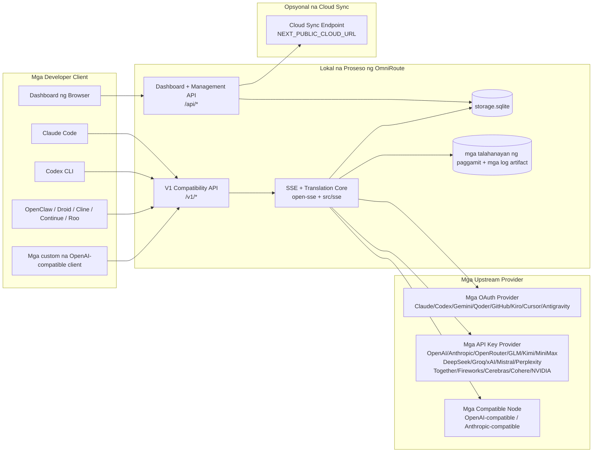
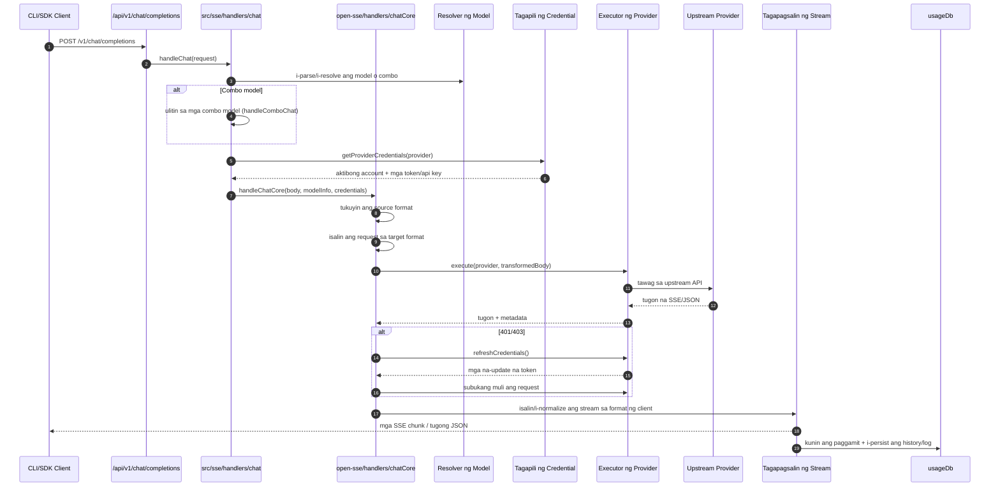
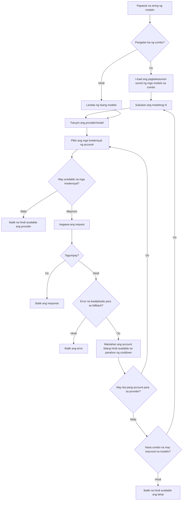
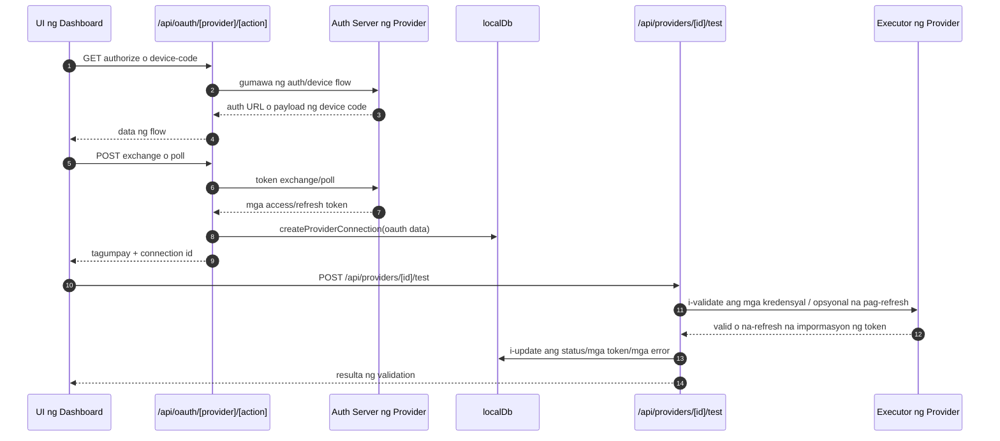
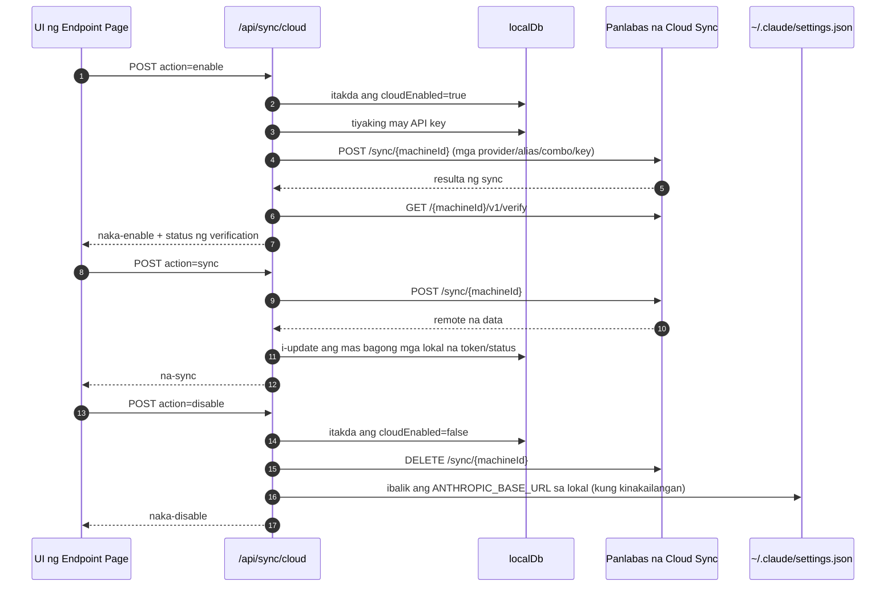
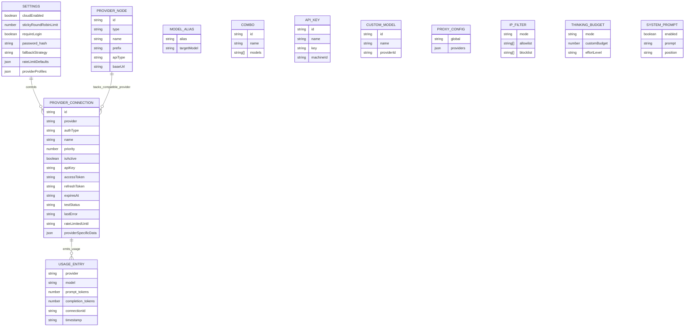
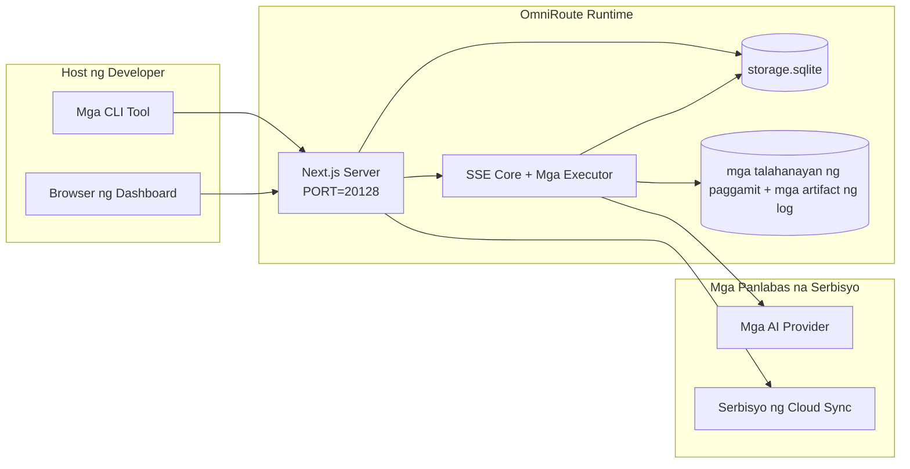

# OmniRoute Architecture (Filipino)

🌐 **Languages:** 🇺🇸 [English](../../../../architecture/ARCHITECTURE.md) · 🇪🇹 [am](../../../am/docs/architecture/ARCHITECTURE.md) · 🇸🇦 [ar](../../../ar/docs/architecture/ARCHITECTURE.md) · 🇦🇿 [az](../../../az/docs/architecture/ARCHITECTURE.md) · 🇧🇬 [bg](../../../bg/docs/architecture/ARCHITECTURE.md) · 🇧🇩 [bn](../../../bn/docs/architecture/ARCHITECTURE.md) · 🇧🇦 [bs](../../../bs/docs/architecture/ARCHITECTURE.md) · 🇨🇿 [cs](../../../cs/docs/architecture/ARCHITECTURE.md) · 🇩🇰 [da](../../../da/docs/architecture/ARCHITECTURE.md) · 🇩🇪 [de](../../../de/docs/architecture/ARCHITECTURE.md) · 🇬🇷 [el](../../../el/docs/architecture/ARCHITECTURE.md) · 🇪🇸 [es](../../../es/docs/architecture/ARCHITECTURE.md) · 🇪🇪 [et](../../../et/docs/architecture/ARCHITECTURE.md) · 🇮🇷 [fa](../../../fa/docs/architecture/ARCHITECTURE.md) · 🇫🇮 [fi](../../../fi/docs/architecture/ARCHITECTURE.md) · 🇫🇷 [fr](../../../fr/docs/architecture/ARCHITECTURE.md) · 🇮🇪 [ga](../../../ga/docs/architecture/ARCHITECTURE.md) · 🇮🇳 [gu](../../../gu/docs/architecture/ARCHITECTURE.md) · 🇳🇬 [ha](../../../ha/docs/architecture/ARCHITECTURE.md) · 🇮🇱 [he](../../../he/docs/architecture/ARCHITECTURE.md) · 🇮🇳 [hi](../../../hi/docs/architecture/ARCHITECTURE.md) · 🇭🇷 [hr](../../../hr/docs/architecture/ARCHITECTURE.md) · 🇭🇺 [hu](../../../hu/docs/architecture/ARCHITECTURE.md) · 🇦🇲 [hy](../../../hy/docs/architecture/ARCHITECTURE.md) · 🇮🇩 [id](../../../id/docs/architecture/ARCHITECTURE.md) · 🇳🇬 [ig](../../../ig/docs/architecture/ARCHITECTURE.md) · 🇮🇹 [it](../../../it/docs/architecture/ARCHITECTURE.md) · 🇯🇵 [ja](../../../ja/docs/architecture/ARCHITECTURE.md) · 🇬🇪 [ka](../../../ka/docs/architecture/ARCHITECTURE.md) · 🇰🇭 [km](../../../km/docs/architecture/ARCHITECTURE.md) · 🇮🇳 [kn](../../../kn/docs/architecture/ARCHITECTURE.md) · 🇰🇷 [ko](../../../ko/docs/architecture/ARCHITECTURE.md) · 🇱🇹 [lt](../../../lt/docs/architecture/ARCHITECTURE.md) · 🇱🇻 [lv](../../../lv/docs/architecture/ARCHITECTURE.md) · 🇮🇳 [ml](../../../ml/docs/architecture/ARCHITECTURE.md) · 🇮🇳 [mr](../../../mr/docs/architecture/ARCHITECTURE.md) · 🇲🇾 [ms](../../../ms/docs/architecture/ARCHITECTURE.md) · 🇲🇹 [mt](../../../mt/docs/architecture/ARCHITECTURE.md) · 🇲🇲 [my](../../../my/docs/architecture/ARCHITECTURE.md) · 🇳🇵 [ne](../../../ne/docs/architecture/ARCHITECTURE.md) · 🇳🇱 [nl](../../../nl/docs/architecture/ARCHITECTURE.md) · 🇳🇴 [no](../../../no/docs/architecture/ARCHITECTURE.md) · 🇮🇳 [or](../../../or/docs/architecture/ARCHITECTURE.md) · 🇮🇳 [pa](../../../pa/docs/architecture/ARCHITECTURE.md) · 🇵🇱 [pl](../../../pl/docs/architecture/ARCHITECTURE.md) · 🇵🇹 [pt](../../../pt/docs/architecture/ARCHITECTURE.md) · 🇧🇷 [pt-BR](../../../pt-BR/docs/architecture/ARCHITECTURE.md) · 🇷🇴 [ro](../../../ro/docs/architecture/ARCHITECTURE.md) · 🇷🇺 [ru](../../../ru/docs/architecture/ARCHITECTURE.md) · 🇱🇰 [si](../../../si/docs/architecture/ARCHITECTURE.md) · 🇸🇰 [sk](../../../sk/docs/architecture/ARCHITECTURE.md) · 🇸🇮 [sl](../../../sl/docs/architecture/ARCHITECTURE.md) · 🇷🇸 [sr](../../../sr/docs/architecture/ARCHITECTURE.md) · 🇸🇪 [sv](../../../sv/docs/architecture/ARCHITECTURE.md) · 🇰🇪 [sw](../../../sw/docs/architecture/ARCHITECTURE.md) · 🇮🇳 [ta](../../../ta/docs/architecture/ARCHITECTURE.md) · 🇮🇳 [te](../../../te/docs/architecture/ARCHITECTURE.md) · 🇹🇭 [th](../../../th/docs/architecture/ARCHITECTURE.md) · 🇹🇷 [tr](../../../tr/docs/architecture/ARCHITECTURE.md) · 🇺🇦 [uk-UA](../../../uk-UA/docs/architecture/ARCHITECTURE.md) · 🇵🇰 [ur](../../../ur/docs/architecture/ARCHITECTURE.md) · 🇺🇿 [uz](../../../uz/docs/architecture/ARCHITECTURE.md) · 🇻🇳 [vi](../../../vi/docs/architecture/ARCHITECTURE.md) · 🇳🇬 [yo](../../../yo/docs/architecture/ARCHITECTURE.md) · 🇨🇳 [zh-CN](../../../zh-CN/docs/architecture/ARCHITECTURE.md) · 🇹🇼 [zh-TW](../../../zh-TW/docs/architecture/ARCHITECTURE.md)

---

🌐 **Languages:** 🇺🇸 [English](../../../../architecture/ARCHITECTURE.md) · 🇪🇹 [am](../../../am/docs/architecture/ARCHITECTURE.md) · 🇸🇦 [ar](../../../ar/docs/architecture/ARCHITECTURE.md) · 🇦🇿 [az](../../../az/docs/architecture/ARCHITECTURE.md) · 🇧🇬 [bg](../../../bg/docs/architecture/ARCHITECTURE.md) · 🇧🇩 [bn](../../../bn/docs/architecture/ARCHITECTURE.md) · 🇧🇦 [bs](../../../bs/docs/architecture/ARCHITECTURE.md) · 🇨🇿 [cs](../../../cs/docs/architecture/ARCHITECTURE.md) · 🇩🇰 [da](../../../da/docs/architecture/ARCHITECTURE.md) · 🇩🇪 [de](../../../de/docs/architecture/ARCHITECTURE.md) · 🇬🇷 [el](../../../el/docs/architecture/ARCHITECTURE.md) · 🇪🇸 [es](../../../es/docs/architecture/ARCHITECTURE.md) · 🇪🇪 [et](../../../et/docs/architecture/ARCHITECTURE.md) · 🇮🇷 [fa](../../../fa/docs/architecture/ARCHITECTURE.md) · 🇫🇮 [fi](../../../fi/docs/architecture/ARCHITECTURE.md) · 🇫🇷 [fr](../../../fr/docs/architecture/ARCHITECTURE.md) · 🇮🇪 [ga](../../../ga/docs/architecture/ARCHITECTURE.md) · 🇮🇳 [gu](../../../gu/docs/architecture/ARCHITECTURE.md) · 🇳🇬 [ha](../../../ha/docs/architecture/ARCHITECTURE.md) · 🇮🇱 [he](../../../he/docs/architecture/ARCHITECTURE.md) · 🇮🇳 [hi](../../../hi/docs/architecture/ARCHITECTURE.md) · 🇭🇷 [hr](../../../hr/docs/architecture/ARCHITECTURE.md) · 🇭🇺 [hu](../../../hu/docs/architecture/ARCHITECTURE.md) · 🇦🇲 [hy](../../../hy/docs/architecture/ARCHITECTURE.md) · 🇮🇩 [id](../../../id/docs/architecture/ARCHITECTURE.md) · 🇳🇬 [ig](../../../ig/docs/architecture/ARCHITECTURE.md) · 🇮🇹 [it](../../../it/docs/architecture/ARCHITECTURE.md) · 🇯🇵 [ja](../../../ja/docs/architecture/ARCHITECTURE.md) · 🇬🇪 [ka](../../../ka/docs/architecture/ARCHITECTURE.md) · 🇰🇭 [km](../../../km/docs/architecture/ARCHITECTURE.md) · 🇮🇳 [kn](../../../kn/docs/architecture/ARCHITECTURE.md) · 🇰🇷 [ko](../../../ko/docs/architecture/ARCHITECTURE.md) · 🇱🇹 [lt](../../../lt/docs/architecture/ARCHITECTURE.md) · 🇱🇻 [lv](../../../lv/docs/architecture/ARCHITECTURE.md) · 🇮🇳 [ml](../../../ml/docs/architecture/ARCHITECTURE.md) · 🇮🇳 [mr](../../../mr/docs/architecture/ARCHITECTURE.md) · 🇲🇾 [ms](../../../ms/docs/architecture/ARCHITECTURE.md) · 🇲🇹 [mt](../../../mt/docs/architecture/ARCHITECTURE.md) · 🇲🇲 [my](../../../my/docs/architecture/ARCHITECTURE.md) · 🇳🇵 [ne](../../../ne/docs/architecture/ARCHITECTURE.md) · 🇳🇱 [nl](../../../nl/docs/architecture/ARCHITECTURE.md) · 🇳🇴 [no](../../../no/docs/architecture/ARCHITECTURE.md) · 🇮🇳 [or](../../../or/docs/architecture/ARCHITECTURE.md) · 🇮🇳 [pa](../../../pa/docs/architecture/ARCHITECTURE.md) · 🇵🇱 [pl](../../../pl/docs/architecture/ARCHITECTURE.md) · 🇵🇹 [pt](../../../pt/docs/architecture/ARCHITECTURE.md) · 🇧🇷 [pt-BR](../../../pt-BR/docs/architecture/ARCHITECTURE.md) · 🇷🇴 [ro](../../../ro/docs/architecture/ARCHITECTURE.md) · 🇷🇺 [ru](../../../ru/docs/architecture/ARCHITECTURE.md) · 🇱🇰 [si](../../../si/docs/architecture/ARCHITECTURE.md) · 🇸🇰 [sk](../../../sk/docs/architecture/ARCHITECTURE.md) · 🇸🇮 [sl](../../../sl/docs/architecture/ARCHITECTURE.md) · 🇷🇸 [sr](../../../sr/docs/architecture/ARCHITECTURE.md) · 🇸🇪 [sv](../../../sv/docs/architecture/ARCHITECTURE.md) · 🇰🇪 [sw](../../../sw/docs/architecture/ARCHITECTURE.md) · 🇮🇳 [ta](../../../ta/docs/architecture/ARCHITECTURE.md) · 🇮🇳 [te](../../../te/docs/architecture/ARCHITECTURE.md) · 🇹🇭 [th](../../../th/docs/architecture/ARCHITECTURE.md) · 🇹🇷 [tr](../../../tr/docs/architecture/ARCHITECTURE.md) · 🇺🇦 [uk-UA](../../../uk-UA/docs/architecture/ARCHITECTURE.md) · 🇵🇰 [ur](../../../ur/docs/architecture/ARCHITECTURE.md) · 🇺🇿 [uz](../../../uz/docs/architecture/ARCHITECTURE.md) · 🇻🇳 [vi](../../../vi/docs/architecture/ARCHITECTURE.md) · 🇳🇬 [yo](../../../yo/docs/architecture/ARCHITECTURE.md) · 🇨🇳 [zh-CN](../../../zh-CN/docs/architecture/ARCHITECTURE.md) · 🇹🇼 [zh-TW](../../../zh-TW/docs/architecture/ARCHITECTURE.md)

_Huling na-update: 2026-06-28_

## Ehekutibong Buod

Ang OmniRoute ay isang lokal na AI routing gateway at dashboard na binuo gamit ang Next.js.
Nagbibigay ito ng iisang endpoint na compatible sa OpenAI (`/v1/*`) at nagruruta ng trapiko sa maraming upstream provider gamit ang pagsasalin, fallback, pag-refresh ng token, at pagsubaybay sa paggamit.

Mga pangunahing kakayahan:

- API surface na compatible sa OpenAI para sa CLI/mga tool (355 provider, 108 executor)
- Pagsasalin ng request/response sa iba't ibang format ng provider
- Fallback ng kumbinasyon ng modelo (pagkakasunod-sunod ng maraming modelo)
- Mga structured na hakbang ng combo (`provider + model + connection`) na may runtime ordering ayon sa `compositeTiers`
- Fallback sa antas ng account (maraming account bawat provider)
- Paunang pagsusuri ng quota at pagpili ng P2C account na isinasaalang-alang ang quota sa pangunahing chat path
- Pamamahala ng koneksyon sa provider gamit ang OAuth + API key (22 OAuth provider module)
- Pagbuo ng embedding sa pamamagitan ng `/v1/embeddings` (18 provider)
- Pagbuo ng larawan sa pamamagitan ng `/v1/images/generations` (10+ provider, 20+ modelo)
- Transkripsiyon ng audio sa pamamagitan ng `/v1/audio/transcriptions` (18 provider)
- Text-to-speech sa pamamagitan ng `/v1/audio/speech` (24 built-in na provider)
- Pagbuo ng video sa pamamagitan ng `/v1/videos/generations` (ComfyUI + SD WebUI)
- Pagbuo ng musika sa pamamagitan ng `/v1/music/generations` (ComfyUI)
- Paghahanap sa web sa pamamagitan ng `/v1/search` (20 provider)
- Mga moderation sa pamamagitan ng `/v1/moderations`
- Muling pagraranggo sa pamamagitan ng `/v1/rerank`
- Pag-parse ng think tag (`<think>...</think>`) para sa mga reasoning model
- Paglilinis ng response para sa mahigpit na compatibility sa OpenAI SDK
- Normalisasyon ng role (developer→system, system→user) para sa compatibility sa iba't ibang provider
- Conversion ng structured output (json_schema → Gemini responseSchema)
- Lokal na persistence para sa mga provider, key, alias, combo, setting, at pagpepresyo (122 DB module)
- Pagsubaybay sa paggamit/gastos at pag-log ng request
- Opsyonal na cloud sync para sa pag-sync ng maraming device/state
- IP allowlist/blocklist para sa kontrol ng access sa API
- Pamamahala ng thinking budget (passthrough/auto/custom/adaptive)
- Pangkalahatang pag-inject ng system prompt
- Pagsubaybay sa session at fingerprinting
- Pinahusay na rate limiting bawat account na may mga profile na partikular sa provider
- Circuit breaker pattern para sa katatagan ng provider
- Proteksiyon laban sa thundering herd gamit ang mutex locking
- Cache para sa deduplication ng request batay sa signature
- Domain layer: mga panuntunan sa gastos, patakaran sa fallback, patakaran sa lockout
- Context Relay: mga buod ng paglilipat ng session para sa pagpapanatili ng continuity sa pag-ikot ng account
- Persistence ng domain state (SQLite write-through cache para sa mga fallback, budget, lockout, at circuit breaker)
- Policy engine para sa sentralisadong pagsusuri ng request (lockout → budget → fallback)
- Telemetry ng request na may pinagsama-samang latency na p50/p95/p99
- Telemetry ng combo target at makasaysayang kalagayan ng combo target sa pamamagitan ng `combo_execution_key` / `combo_step_id`
- Correlation ID (X-Request-Id) para sa end-to-end na tracing
- Pag-log ng compliance audit na may opsyong mag-opt out bawat API key
- Eval framework para sa pagtiyak ng kalidad ng LLM
- Health dashboard na may real-time na status ng circuit breaker ng provider
- MCP Server (110 tool) na may 3 transport (stdio/SSE/Streamable HTTP)
- A2A Server (JSON-RPC 2.0 + SSE) na may mga skill at lifecycle ng task
- Memory system (extraction, injection, retrieval, summarization)
- Skills system (registry, executor, sandbox, mga built-in na skill)
- MITM proxy na may pamamahala ng certificate at paghawak sa DNS
- Middleware na panangga laban sa prompt injection
- Pipeline ng prompt compression na may Caveman, RTK, mga stacked pipeline, compression combo, language pack, at analytics
- Registry ng ACP (Agent Communication Protocol)
- Mga modular na OAuth provider (22 indibidwal na module sa ilalim ng `src/lib/oauth/providers/`)
- Mga script para sa pag-uninstall/ganap na pag-uninstall
- Aksiyon sa pagkukumpuni ng OAuth environment
- WebSocket bridge para sa mga WS client na compatible sa OpenAI (`/v1/ws`)
- Pamamahala ng sync token (pag-isyu/pagbawi, pag-download ng config bundle na may bersiyon sa pamamagitan ng ETag)
- GLM Thinking (`glmt`) bilang first-class na preset ng provider
- Hybrid na pagbibilang ng token (`/messages/count_tokens` sa panig ng provider na may estimation fallback)
- Awtomatikong pag-seed ng model alias (30+ normalisasyon ng cross-proxy dialect sa pagsisimula)
- Ligtas na outbound fetch na may SSRF guard, pag-block ng pribadong URL, at nako-configure na retry
- Mga chat retry na isinasaalang-alang ang cooldown, gamit ang nako-configure na `requestRetry` at `maxRetryIntervalSec`
- Pag-validate ng runtime environment gamit ang Zod sa pagsisimula
- Compliance audit v2 na may pagination, mga CRUD event ng provider, at pag-log ng validation na hinarang ng SSRF

Pangunahing runtime model:

- Ipinapatupad ng mga Next.js app route sa ilalim ng `src/app/api/*` ang mga dashboard API at compatibility API
- Isang pinagsasaluhang SSE/routing core sa `src/sse/*` + `open-sse/*` ang namamahala sa pagpapatupad ng provider, pagsasalin, streaming, fallback, at paggamit

## Mga Reference Diagram

Ang mga kanonikal at kinokontrol ng bersyon na Mermaid source para sa platform na v3.8.0 ay nasa
[`docs/diagrams/`](../diagrams/README.md). Dalawa ang muling ipinapakita sa ibaba bilang gabay;
ang iba pa ay naka-link mula sa mga gabay na partikular sa kani-kanilang domain.


> Source: [diagrams/request-pipeline.mmd](../diagrams/request-pipeline.mmd)


> Source: [diagrams/resilience-3layers.mmd](../diagrams/resilience-3layers.mmd) — naka-link din mula sa
> [RESILIENCE_GUIDE.md](./RESILIENCE_GUIDE.md) at sa reference ng resilience sa `CLAUDE.md`.

## Saklaw at mga Hangganan

### Kasama sa Saklaw

- Lokal na runtime ng gateway
- Mga API sa pamamahala ng dashboard
- Authentication ng provider at pag-refresh ng token
- Pagsasalin ng request at SSE streaming
- Lokal na state + persistence ng paggamit
- Opsyonal na orchestration ng cloud sync

### Hindi Kasama sa Saklaw

- Implementasyon ng cloud service sa likod ng `NEXT_PUBLIC_CLOUD_URL`
- SLA/control plane ng provider sa labas ng lokal na proseso
- Ang mismong mga external CLI binary (Claude CLI, Codex CLI, atbp.)

## Saklaw ng Dashboard (Kasalukuyan)

Mga pangunahing page sa ilalim ng `src/app/(dashboard)/dashboard/`:

- `/dashboard` — mabilisang pagsisimula + pangkalahatang-ideya ng provider
- `/dashboard/endpoint` — endpoint proxy + MCP + A2A + mga tab ng API endpoint
- `/dashboard/providers` — mga koneksyon at credential ng provider
- `/dashboard/combos` — mga combo strategy, template, step-based builder, panuntunan sa pag-route ng modelo, manu-manong naka-persist na pagkakasunod-sunod
- `/dashboard/auto-combo` — Auto Combo Engine: mga timbang sa pagmamarka, mode pack, virtual factory preset, telemetry
- `/dashboard/costs` — pagsasama-sama ng gastos at visibility ng pagpepresyo
- `/dashboard/analytics` — analytics ng paggamit, mga ebalwasyon, kalagayan ng combo target
- `/dashboard/limits` — mga kontrol sa quota/rate
- `/dashboard/cli-tools` — onboarding sa CLI, pagtukoy sa runtime, pagbuo ng config
- `/dashboard/agents` — mga natukoy na ACP agent + pagpaparehistro ng custom agent
- `/dashboard/cloud-agents` — mga task ng agent na naka-host sa cloud (Codex Cloud, Devin, Jules) at lifecycle ng task
- `/dashboard/skills` — registry ng A2A skill, sandbox execution, built-in na catalog ng skill
- `/dashboard/memory` — inspeksyon at retrieval ng persistent na memorya ng pag-uusap
- `/dashboard/webhooks` — mga outbound webhook subscription, pag-rotate ng secret, mga istatistika ng retry
- `/dashboard/batch` — pagsusumite ng batch job at progreso
- `/dashboard/cache` — mga istatistika ng read-through at reasoning cache, mga kontrol sa eviction
- `/dashboard/playground` — interactive na chat playground para sa anumang naka-configure na combo/modelo
- `/dashboard/changelog` — viewer ng changelog sa loob ng app (nire-render ang `CHANGELOG.md`)
- `/dashboard/system` — mga diagnostic ng runtime, impormasyon ng bersyon, surface para sa validation ng environment
- `/dashboard/onboarding` — wizard para sa unang setup ng mga bagong installation
- `/dashboard/media` — playground para sa image/video/music
- `/dashboard/search-tools` — pagsubok sa search provider at history
- `/dashboard/health` — uptime, mga circuit breaker, rate limit, mga session na mino-monitor ang quota
- `/dashboard/logs` — mga log ng request/proxy/audit/console
- `/dashboard/settings` — mga tab ng system setting (pangkalahatan, routing, mga default ng combo, atbp.)
- `/dashboard/context/caveman` — mga panuntunan sa Caveman compression, language pack, preview, at output mode
- `/dashboard/context/rtk` — mga filter ng output ng RTK command, preview, at mga setting sa kaligtasan ng runtime
- `/dashboard/context/combos` — mga pinangalanang compression pipeline na nakatalaga sa mga routing combo
- `/dashboard/translator` — inspeksyon ng translator at preview ng conversion ng format ng request
- `/dashboard/audit` — browser ng compliance audit log na may pagination at structured metadata
- `/dashboard/usage` — browser ng paggamit sa bawat request na nakaugnay sa `usage_history`
- `/dashboard/compression` — analytics ng compression, mga istatistika, at pagtatalaga ng pipeline
- `/dashboard/api-manager` — lifecycle ng API key at mga pahintulot sa modelo

## Mataas na Antas na Konteksto ng System



## Mga Pangunahing Runtime Component

## 1) Layer ng API at Routing (Mga App Route ng Next.js)

Mga pangunahing directory:

- `src/app/api/v1/*` at `src/app/api/v1beta/*` para sa mga compatibility API
- `src/app/api/*` para sa mga API ng pamamahala/configuration
- Ang mga Next rewrite sa `next.config.mjs` ay nagmamapa ng `/v1/*` sa `/api/v1/*`

Mahahalagang compatibility route:

- `src/app/api/v1/chat/completions/route.ts`
- `src/app/api/v1/messages/route.ts`
- `src/app/api/v1/responses/route.ts`
- `src/app/api/v1/models/route.ts` — kabilang ang mga custom model na may `custom: true`
- `src/app/api/v1/embeddings/route.ts` — pagbuo ng embedding (6 na provider)
- `src/app/api/v1/images/generations/route.ts` — pagbuo ng larawan (4+ na provider, kabilang ang Antigravity/Nebius)
- `src/app/api/v1/messages/count_tokens/route.ts`
- `src/app/api/v1/providers/[provider]/chat/completions/route.ts` — nakalaang chat para sa bawat provider
- `src/app/api/v1/providers/[provider]/embeddings/route.ts` — mga nakalaang embedding para sa bawat provider
- `src/app/api/v1/providers/[provider]/images/generations/route.ts` — mga nakalaang larawan para sa bawat provider
- `src/app/api/v1beta/models/route.ts`
- `src/app/api/v1beta/models/[...path]/route.ts`

Mga domain ng pamamahala:

- Auth/mga setting: `src/app/api/auth/*`, `src/app/api/settings/*`
- Mga provider/koneksyon: `src/app/api/providers*`
- Mga provider node: `src/app/api/provider-nodes*`
- Mga custom model: `src/app/api/provider-models` (GET/POST/DELETE)
- Catalog ng model: `src/app/api/models/route.ts` (GET)
- Config ng proxy: `src/app/api/settings/proxy` (GET/PUT/DELETE) + `src/app/api/settings/proxy/test` (POST)
- OAuth: `src/app/api/oauth/*`
- Mga key/alias/combo/presyo: `src/app/api/keys*`, `src/app/api/models/alias`, `src/app/api/combos*`, `src/app/api/pricing`
- Paggamit: `src/app/api/usage/*`
- Sync/cloud: `src/app/api/sync/*`, `src/app/api/cloud/*`
- Mga helper ng CLI tooling: `src/app/api/cli-tools/*`
- Filter ng IP: `src/app/api/settings/ip-filter` (GET/PUT)
- Badyet sa pag-iisip: `src/app/api/settings/thinking-budget` (GET/PUT)
- System prompt: `src/app/api/settings/system-prompt` (GET/PUT)
- Compression: `src/app/api/settings/compression`, `src/app/api/compression/*`, at
  `src/app/api/context/*`
- Mga session: `src/app/api/sessions` (GET)
- Mga limitasyon sa rate: `src/app/api/rate-limits` (GET)
- Resilience: `src/app/api/resilience` (GET/PATCH) — pila ng request, cooldown ng koneksyon, breaker ng provider, config ng paghihintay sa cooldown
- Pag-reset ng resilience: `src/app/api/resilience/reset` (POST) — i-reset ang mga breaker ng provider
- Mga estadistika ng cache: `src/app/api/cache/stats` (GET/DELETE)
- Telemetry: `src/app/api/telemetry/summary` (GET)
- Badyet: `src/app/api/usage/budget` (GET/POST)
- Mga fallback chain: `src/app/api/fallback/chains` (GET/POST/DELETE)
- Audit ng compliance: `src/app/api/compliance/audit-log` (GET, may pagination + structured metadata)
- Mga eval: `src/app/api/evals` (GET/POST), `src/app/api/evals/[suiteId]` (GET)
- Mga patakaran: `src/app/api/policies` (GET/POST)
- Mga sync token: `src/app/api/sync/tokens` (GET/POST), `src/app/api/sync/tokens/[id]` (GET/DELETE)
- Config bundle: `src/app/api/sync/bundle` (GET, snapshot ng mga setting/provider/combo/key na may bersyon gamit ang ETag)
- WebSocket: `src/app/api/v1/ws/route.ts` — Upgrade handler para sa mga OpenAI-compatible WS client

## 2) SSE + Core ng Pagsasalin

Mga module ng pangunahing daloy:

- Entry point: `src/sse/handlers/chat.ts`
- Pangunahing orkestrasyon: `open-sse/handlers/chatCore.ts`
- Mga adapter sa pagpapatupad ng provider: `open-sse/executors/*`
- Pagtukoy ng format/config ng provider: `open-sse/services/provider.ts`
- Pag-parse/paglutas ng modelo: `src/sse/services/model.ts`, `open-sse/services/model.ts`
- Lohika ng fallback ng account: `open-sse/services/accountFallback.ts`
- Registry ng pagsasalin: `open-sse/translator/index.ts`
- Mga transformasyon ng stream: `open-sse/utils/stream.ts`, `open-sse/utils/streamHandler.ts`
- Pagkuha/normalisasyon ng usage: `open-sse/utils/usageTracking.ts`
- Parser ng think tag: `open-sse/utils/thinkTagParser.ts`
- Handler ng embedding: `open-sse/handlers/embeddings.ts`
- Registry ng provider ng embedding: `open-sse/config/embeddingRegistry.ts`
- Handler ng pagbuo ng larawan: `open-sse/handlers/imageGeneration.ts`
- Registry ng provider ng larawan: `open-sse/config/imageRegistry.ts`
- Paglilinis ng response: `open-sse/handlers/responseSanitizer.ts`
- Normalisasyon ng role: `open-sse/services/roleNormalizer.ts`

Mga serbisyo (lohika ng negosyo):

- Pagpili/pagmamarka ng account: `open-sse/services/accountSelector.ts`
- Pamamahala sa lifecycle ng context: `open-sse/services/contextManager.ts`
- Pagpapatupad ng IP filter: `open-sse/services/ipFilter.ts`
- Pagsubaybay sa session: `open-sse/services/sessionManager.ts`
- Pag-aalis ng mga dobleng request: `open-sse/services/signatureCache.ts`
- Pag-inject ng system prompt: `open-sse/services/systemPrompt.ts`
- Pamamahala sa thinking budget: `open-sse/services/thinkingBudget.ts`
- Pagruruta ng wildcard model: `open-sse/services/wildcardRouter.ts`
- Pamamahala sa rate limit: `open-sse/services/rateLimitManager.ts`
- Circuit breaker: `src/shared/utils/circuitBreaker.ts`
- Handoff ng context: `open-sse/services/contextHandoff.ts` — pagbuo at pag-inject ng buod ng handoff para sa estratehiyang context-relay
- Compression: `open-sse/services/compression/*` — maagap na compression bago ang pagsasalin ng provider;
  kabilang ang mga panuntunan ng Caveman, mga filter ng RTK, mga naka-stack na pipeline, mga kumbinasyon ng compression, mga estadistika, at validation
- Tagakuha ng quota ng Codex: `open-sse/services/codexQuotaFetcher.ts` — kinukuha ang quota ng Codex para sa mga desisyon sa context-relay handoff
- Retry na isinasaalang-alang ang cooldown: `src/sse/services/cooldownAwareRetry.ts` — mga retry ng cooldown bawat modelo na may nako-configure na `requestRetry` / `maxRetryIntervalSec`
- Ligtas na outbound fetch: `src/shared/network/safeOutboundFetch.ts` — protektadong pag-fetch ng provider/model na may SSRF guard, pag-block ng pribadong URL, retry, at timeout
- Guard ng outbound URL: `src/shared/network/outboundUrlGuard.ts` — vina-validate ang mga URL ng provider laban sa mga saklaw ng CIDR ng private/localhost
- Mga default ng request ng provider: `open-sse/services/providerRequestDefaults.ts` — mga default na `maxTokens`, `temperature`, `thinkingBudgetTokens` sa antas ng provider
- Mga constant ng GLM provider: `open-sse/config/glmProvider.ts` — mga pinagsasaluhang modelo ng GLM, mga URL ng quota, at timeout/mga default ng GLMT
- Antigravity upstream: `open-sse/config/antigravityUpstream.ts` — base URL at mga constant ng discovery path
- Mga constant ng Codex client: `open-sse/config/codexClient.ts` — mga value ng user-agent at client-version na may bersyon
- Seed ng alias ng modelo: `src/lib/modelAliasSeed.ts` — nagse-seed ng 30+ alias ng cross-proxy dialect sa startup

Mga module ng domain layer:

- Mga panuntunan sa gastos/badyet: `src/domain/costRules.ts`
- Patakaran sa fallback: `src/domain/fallbackPolicy.ts`
- Resolver ng combo: `src/domain/comboResolver.ts`
- Patakaran sa lockout: `src/domain/lockoutPolicy.ts`
- Policy engine: `src/domain/policyEngine.ts` — sentralisadong pagsusuri ng lockout → badyet → fallback
- Catalog ng mga error code: `src/shared/constants/errorCodes.ts`
- Request ID: `src/shared/utils/requestId.ts`
- Timeout ng fetch: `src/shared/utils/fetchTimeout.ts`
- Telemetry ng request: `src/shared/utils/requestTelemetry.ts`
- Compliance/audit: `src/lib/compliance/index.ts`
- Runner ng eval: `src/lib/evals/evalRunner.ts`
- Persistence ng estado ng domain: `src/lib/db/domainState.ts` — SQLite CRUD para sa mga fallback chain, badyet, kasaysayan ng gastos, estado ng lockout, at mga circuit breaker

Mga module ng OAuth provider (22 indibidwal na file sa ilalim ng `src/lib/oauth/providers/`):

- Index ng registry: `src/lib/oauth/providers/index.ts`
- Mga indibidwal na provider: `agy.ts`, `antigravity.ts`, `claude.ts`, `cline.ts`, `codebuddy-cn.ts`, `codex.ts`, `cursor.ts`, `devin-desktop.ts`, `ghe-copilot.ts`, `github.ts`, `gitlab-duo.ts`, `grok-cli-oauth.ts`, `grok-cli.ts`, `kilocode.ts`, `kimi-coding.ts`, `kiro.ts`, `openference.ts`, `qoder.ts`, `trae.ts`, `xai-oauth.ts`, `zed-hosted.ts`, `zed.ts`
- Manipis na wrapper: `src/lib/oauth/providers.ts` — muling nag-e-export mula sa mga indibidwal na module

## 5) Mga Naka-embed na Serbisyo (v3.8.4)

Maaaring mag-install, mangasiwa, at magruta ang OmniRoute patungo sa mga lokal na tumatakbong proseso ng AI tool
na tinatawag na **mga naka-embed na serbisyo**. Limang serbisyo ang kasama: 9Router, CLIProxyAPI, Bifrost, Mux at Dario.

Mga layer ng arkitektura:

- **UI** (`/dashboard/providers/services`) — pahinang may dalawang tab na may mga kontrol sa lifecycle,
  live na pag-stream ng log, pamamahala ng API key, at (para sa 9Router) naka-embed na native UI sa pamamagitan
  ng isang internal na reverse proxy.
- **API** (`/api/services/{name}/*`) — 11 endpoint para sa 9Router, 10 para sa CLIProxyAPI, tig-8 para sa Bifrost / Mux / Dario,
  lahat ay nauuri bilang **LOCAL_ONLY** (mahigpit na panuntunan #17). Isang pinagsasaluhang `GET /api/services/[name]/logs`
  SSE endpoint ang nagsisilbi sa parehong serbisyo.
- **Supervisor** (`src/lib/services/`) — binabalot ng generic na `ServiceSupervisor` class ang
  `child_process.spawn`, nagpapanatili ng 5 MB ring buffer para sa SSE log streaming, isang health
  probe loop, isang atomic operation lock, at maayos na pag-shutdown na SIGTERM→SIGKILL.
  Ikinokonekta ng `bootstrap.ts` ang lahat ng naka-configure na serbisyo sa pagsisimula ng proseso.
- **Provider/executor** (`open-sse/executors/ninerouter.ts`) — inilalantad ang 9Router bilang
  isang tunay na provider. Nilalagyan ang mga modelo ng prefix na `9router/{sub}/{model}` at sini-sync bawat 5 min
  mula sa `/v1/models` endpoint ng 9Router.

Masusing talakayan: `docs/frameworks/EMBEDDED-SERVICES.md`

## Mga Pangunahing Subsystem (v3.8.0)

### A. Auto Combo Engine

Dinamikong binibigyan ng score at pinipili ng Auto Combo ang mga target ng pagruruta sa oras ng kahilingan, sa halip na
umasa sa isang static na depinisyon ng combo. Pinapagana nito ang pamilya ng prefix ng modelong `auto/*`.

- Entry ng engine: `open-sse/services/autoCombo/` (`autoComboEngine.ts`,
  `scoringEngine.ts`, `virtualFactory.ts`, `modePacks.ts`)
- Resolver: `src/domain/comboResolver.ts` (awtomatikong pagtukoy sa prefix na `auto/`)
- Dashboard: `/dashboard/auto-combo`
- Telemetry: SQLite table na `auto_combo_decisions`

Mga pangunahing kakayahan:

- **19 na estratehiya sa pagruruta** (priyoridad, weighted, fill-first, round-robin, P2C, random,
  least-used, cost-optimized, reset-aware, reset-window, headroom, strict-random,
  **auto**, lkgp, context-optimized, context-relay, **fusion**, kasama ang isang fallback path) —
  auto ang pangunahing karagdagan sa v3.8.0; bago sa v3.8.36 ang `fusion` (panel fan-out + judge synthesis,
  `open-sse/services/fusion.ts`).
- **16-factor scoring**: quota, kalagayan, inverse cost, inverse latency, pagiging angkop sa gawain at
  sampu pa. Ang kanonikal na talahanayan ng mga factor at ng mga default na weight ng mga ito ay nasa
  [`docs/routing/AUTO-COMBO.md`](../routing/AUTO-COMBO.md) — ang muling paglalahad nito rito ay
  magbibigay rito ng pangalawang lugar kung saan maaari itong maluma.
- **Virtual factory** na lumilikha ng mga ephemeral combo kapag walang umiiral na tumutugmang pinangalanang combo,
  na kumukuha ng mga kandidato mula sa malulusog at aktibong koneksyon ng provider.
- **Mga auto prefix**: `auto/coding`, `auto/cheap`, `auto/fast`, `auto/offline`,
  `auto/smart`, `auto/lkgp` — bawat isa ay sinusuportahan ng isang iniangkop na profile ng weight.
- **6 na mode pack**: `ship-fast`, `cost-saver`, `quality-first`, `offline-friendly`,
  `reliability-first` at `chaos-mode` — mga preset na configuration ng weight na maaaring tawagin mula
  sa dashboard. (Huwag ipagkamali sa mga prefix na `auto/*` sa itaas, na mga variant
  sa oras ng kahilingan.)

Para sa kumpletong detalye ng algorithm (mga formula ng factor, pag-tune ng weight), tingnan ang
[`docs/routing/AUTO-COMBO.md`](../routing/AUTO-COMBO.md).

### B. Mga Cloud Agent

Binabalot ng Cloud Agents ang mga third-party na hosted code-agent platform (Codex Cloud, Devin,
Jules) sa likod ng isang pare-parehong lifecycle ng gawain na sinusuportahan ng DB. Nangangailangan ang lahat ng endpoint para sa paggawa/pagsisiyasat
ng gawain ng authentication sa pamamahala.

- Root ng module: `src/lib/cloudAgent/` (`baseAgent.ts`, `registry.ts`, `api.ts`,
  `types.ts`, `db.ts`, kasama ang mga subdirectory para sa bawat agent sa ilalim ng `agents/`)
- Mga implementation para sa bawat agent: `agents/codex/`, `agents/devin/`, `agents/jules/`
- Mga pampublikong endpoint: `/api/v1/agents/tasks/*` (paglilista/paggawa/pagkuha/pagkansela)
- Mga endpoint sa pamamahala: `/api/cloud/*` (provisioning, status, batch)
- Dashboard: `/dashboard/cloud-agents`
- Storage: table na `cloud_agent_tasks`

Para sa provisioning at mga detalye ng OAuth para sa bawat agent, tingnan ang
[`docs/frameworks/CLOUD_AGENT.md`](../frameworks/CLOUD_AGENT.md).

### C. Mga Guardrail

Ang module ng mga guardrail ay isang hot-reloadable na middleware layer na sumusuri sa mga kahilingan
at tugon para sa PII, prompt injection, at hindi ligtas na nilalamang biswal. Agad na itinitigil ng mga paglabag
ang kahilingan gamit ang HTTP **503** kasama ang isang structured na error code, na nagbibigay-daan
sa mga downstream caller na muling sumubok o magsanga.

- Root ng module: `src/lib/guardrails/` (`base.ts`, `registry.ts`, `piiMasker.ts`,
  `promptInjection.ts`, `visionBridge.ts`, `visionBridgeHelpers.ts`)
- Hot reload: sinusubaybayan ng registry ang mga pagbabago sa config at muling binubuo ang chain sa mismong kinalalagyan nito
- Mga punto ng pagkakabit: entry ng chat handler, image generation handler, response sanitizer
- Kontrata ng HTTP: lumilitaw ang mga paglabag bilang `503` na may `error.code = "GUARDRAIL_VIOLATION"`

Para sa paggawa ng ruleset at pag-tune ng threshold, tingnan ang
[`docs/security/GUARDRAILS.md`](../security/GUARDRAILS.md).

### D. Domain Layer

Isinasentralisa ng namespace na `src/domain/` ang mga pagpapasya sa patakaran upang hindi na kailangang
buoin mismo ng mga route handler ang lockout/budget/fallback logic.

- Policy engine: `src/domain/policyEngine.ts` — nag-iisang entry point para sa
  pagsusuri bago ang execution (pagkakasunod-sunod na lockout → budget → fallback)
- Mga panuntunan sa gastos: `src/domain/costRules.ts`
- Patakaran sa fallback: `src/domain/fallbackPolicy.ts`
- Patakaran sa lockout: `src/domain/lockoutPolicy.ts`
- Pagrurutang batay sa tag: `src/domain/tagRouter.ts`
- Combo resolver: `src/domain/comboResolver.ts` — nire-resolve ang mga pangalan ng combo, mga prefix na auto/\*,
  at mga wildcard na target ng modelo tungo sa mga konkretong execution plan
- Tagapag-ugnay ng panuntunan ng koneksyon/modelo: `src/domain/connectionModelRules.ts`
- Mga snapshot ng availability ng modelo: `src/domain/modelAvailability.ts`
- Pagsubaybay sa expiration ng provider: `src/domain/providerExpiration.ts`
- Quota cache: `src/domain/quotaCache.ts`
- Estado ng degradation: `src/domain/degradation.ts`
- Audit ng configuration: `src/domain/configAudit.ts`
- Tagabuo ng metadata ng tugon ng OmniRoute: `src/domain/omnirouteResponseMeta.ts`
- Subsystem ng assessment: `src/domain/assessment/` — mga pana-panahong trabaho sa pagsusuri

### E. Pipeline ng Awtorisasyon

Inuuri ng pipeline ng awtorisasyon ang bawat papasok na kahilingan at inilalapat ang
naaangkop na chain ng patakaran bago ito ipadala.

- Entry ng pipeline: `src/server/authz/pipeline.ts`
- Classifier ng kahilingan: `src/server/authz/classify.ts` — tinutukoy ang pagkakaiba ng mga pampublikong
  compatibility route at mga management route
- Imbentaryo ng mga pampublikong route: `src/shared/constants/publicApiRoutes.ts`
- Mga patakaran: `src/server/authz/policies/` — mga predicate na maaaring pagsama-samahin
  (`requireApiKey`, `requireManagement`, `requireFreshAuth`, atbp.)
- Mga utility ng header: `src/server/authz/headers.ts`
- Helper para sa assertion: `src/server/authz/assertAuth.ts`
- Konteksto ng kahilingan: `src/server/authz/context.ts`

Mahigpit ang hangganan sa pagitan ng mga pampubliko at management route: ang mga agent/cooldown API at
pagbabago sa provider ay nangangailangan ng management auth (HTTP 401 kung wala).

Para sa kumpletong mga panuntunan sa pag-uuri ng route, tingnan ang
[`docs/architecture/AUTHZ_GUIDE.md`](./AUTHZ_GUIDE.md).

### F. Workflow FSM at Task-Aware Router

Isang router na pinapatakbo ng finite-state machine at nakapatong sa pagpili ng combo upang idirekta ang
trapiko batay sa natukoy na yugto ng workflow (pagpaplano, pagpapatupad,
pagsusuri) at affinity sa background task.

- Workflow FSM: `open-sse/services/workflowFSM.ts`
- Task-aware router: `open-sse/services/taskAwareRouter.ts`
- Detector ng background task: `open-sse/services/backgroundTaskDetector.ts`
- Classifier ng layunin: `open-sse/services/intentClassifier.ts`

Ang mga transition ng FSM ay ipinapasok sa scoring ng Auto Combo, na nagbibigay ng pagkiling sa mas murang mga modelo
para sa mga background/automation task at sa mas mahuhusay na modelo para sa mga interactive na
turn ng pagpaplano/pagsusuri.

### G. Resilience na Partikular sa Provider

May ilang provider na may mga dedikadong module para sa resilience at stealth na nakasakay sa
mga pandaigdigang layer ng circuit breaker / connection cooldown / model lockout:

- Antigravity 429 engine: `open-sse/services/antigravity429Engine.ts` (nagpapalit-palit ng
  identity, naglilinis ng mga response header, at namamahala sa pagsubaybay ng credits/version sa pamamagitan ng
  `antigravityCredits.ts`, `antigravityHeaderScrub.ts`, `antigravityHeaders.ts`,
  `antigravityIdentity.ts`, `antigravityVersion.ts`)
- Patakaran sa quota ng ModelScope: `open-sse/services/modelscopePolicy.ts`
- Claude Code CCH (Compatibility Channel Handshake): `open-sse/services/claudeCodeCCH.ts`,
  kasama ang `claudeCodeCompatible.ts`, `claudeCodeConstraints.ts`, `claudeCodeExtraRemap.ts`,
  `claudeCodeToolRemapper.ts`
- Paghubog ng fingerprint ng Claude Code: `open-sse/services/claudeCodeFingerprint.ts`
- Obfuscation ng Claude Code: `open-sse/services/claudeCodeObfuscation.ts`

Para sa kumpletong stealth playbook at gabay sa operasyon, tingnan ang
`docs/security/STEALTH_GUIDE.md` (git; hindi kino-compile sa `/docs`).

### H. Mga Webhook, Reasoning Cache, Read Cache

- **Mga Webhook** — outbound dispatch para sa mga event ng provider/account/task.
  - Dispatcher: `src/lib/webhookDispatcher.ts`
  - Imbakan: SQLite table na `webhooks` (sa pamamagitan ng `src/lib/db/webhooks.ts`)
  - Dashboard: `/dashboard/webhooks` (mga subscription, secret, kasaysayan ng retry)
  - Para sa taxonomy ng event at semantics ng retry, tingnan ang [`docs/frameworks/WEBHOOKS.md`](../frameworks/WEBHOOKS.md).
- **Reasoning Cache** — mga reasoning block na maaaring i-replay para sa mga provider na naglalabas ng
  thinking token (Claude, GLMT, atbp.) upang hindi na kailangang ulitin ng magkakasunod na turn ang pag-iisip.
  - DB layer: `src/lib/db/reasoningCache.ts`
  - Service layer: `open-sse/services/reasoningCache.ts`
  - Para sa semantics ng replay, tingnan ang [`docs/routing/REASONING_REPLAY.md`](../routing/REASONING_REPLAY.md).
- **Read Cache** — panandaliang response cache na naka-key ayon sa signature at ginagamit upang
  pagsamahin ang magkakaparehong retry mula sa mga sirang upstream SDK.
  - DB layer: `src/lib/db/readCache.ts`
  - Stats endpoint: `GET /api/cache/stats`, dashboard sa `/dashboard/cache`

## 3) Layer ng Persistence

Pangunahing state DB (SQLite):

- Pangunahing imprastraktura: `src/lib/db/core.ts` (better-sqlite3, mga migration, WAL)
- Pag-access sa DB: direktang i-import ang mga partikular na module ng `src/lib/db/*` (inalis na ang lumang `localDb.ts` barrel)
- file: `${DATA_DIR}/storage.sqlite` (o `$XDG_CONFIG_HOME/omniroute/storage.sqlite` kapag nakatakda, kung hindi ay `~/.omniroute/storage.sqlite`)
- mga entity (mga table + KV namespace): providerConnections, providerNodes, modelAliases, combos, apiKeys, settings, pricing, **customModels**, **proxyConfig**, **ipFilter**, **thinkingBudget**, **systemPrompt**

Persistence ng paggamit:

- facade: `src/lib/usageDb.ts` (mga hinating module sa `src/lib/usage/*`)
- Mga SQLite table sa `storage.sqlite`: `usage_history`, `call_logs`, `proxy_logs`
- nananatili ang mga opsyonal na file artifact para sa compatibility/debugging (`${DATA_DIR}/log.txt`, `${DATA_DIR}/call_logs/`, `<repo>/logs/...`)
- inililipat sa SQLite ng mga startup migration ang mga legacy JSON file kapag naroon ang mga ito

Domain State DB (SQLite):

- `src/lib/db/domainState.ts` — mga operasyong CRUD para sa domain state
- Mga table (ginagawa sa `src/lib/db/core.ts`): `domain_fallback_chains`, `domain_budgets`, `domain_cost_history`, `domain_lockout_state`, `domain_circuit_breakers`
- Pattern ng write-through cache: ang mga in-memory Map ang awtoritatibo habang runtime; sabayang isinusulat sa SQLite ang mga pagbabago; ibinabalik mula sa DB ang state sa cold start

## 4) Mga Surface ng Auth + Seguridad

- Auth ng dashboard cookie: `src/proxy.ts`, `src/app/api/auth/login/route.ts`
- Pagbuo/pag-verify ng API key: `src/shared/utils/apiKey.ts`
- Naka-persist ang mga provider secret sa mga entry ng `providerConnections`
- Suporta sa outbound proxy sa pamamagitan ng `open-sse/utils/proxyFetch.ts` (mga env var) at `open-sse/utils/networkProxy.ts` (maaaring i-configure kada provider o sa pangkalahatan)
- Guard para sa SSRF / outbound URL: `src/shared/network/outboundUrlGuard.ts` — bina-block ang mga private/loopback/link-local range para sa lahat ng tawag sa provider
- Runtime na validation ng env: `src/lib/env/runtimeEnv.ts` — Zod schema para sa lahat ng environment variable, na inilalantad bilang mga error/babala sa startup
- Mga sync token: `src/lib/db/syncTokens.ts` — mga scoped token para sa mga endpoint sa pag-download ng config bundle; sinusuportahan ng SQLite table na `sync_tokens` (migration na `024_create_sync_tokens.sql`)
- Auth para sa WebSocket handshake: `src/lib/ws/handshake.ts` — vina-validate ang mga kahilingan sa pag-upgrade ng WS sa pamamagitan ng API key o session cookie

## 5) Cloud Sync

- Pagsisimula ng scheduler: `src/lib/initCloudSync.ts`, `src/shared/services/initializeCloudSync.ts`, `src/shared/services/modelSyncScheduler.ts`
- Pana-panahong task: `src/shared/services/cloudSyncScheduler.ts`
- Pana-panahong task: `src/shared/services/modelSyncScheduler.ts`
- Route ng kontrol: `src/app/api/sync/cloud/route.ts`

## Lifecycle ng Request (`/v1/chat/completions`)



## Daloy ng Combo + Fallback ng Account



Ang mga desisyon sa fallback ay pinapatakbo ng `open-sse/services/accountFallback.ts` gamit ang mga status code at heuristic ng mensahe ng error. Nagdaragdag ang pagruruta ng combo ng isang karagdagang guard: ang mga 400 na nakasaklaw sa provider, gaya ng mga pagkabigo sa pag-block ng content at pag-validate ng role mula sa upstream, ay itinuturing na mga pagkabigong lokal sa modelo upang maaari pa ring tumakbo ang mga susunod na target ng combo.

## Lifecycle ng OAuth Onboarding at Pag-refresh ng Token



Ang pag-refresh habang may live traffic ay isinasagawa sa loob ng `open-sse/handlers/chatCore.ts` sa pamamagitan ng executor na `refreshCredentials()`.

## Lifecycle ng Cloud Sync (Pag-enable / Pag-sync / Pag-disable)



Ang pana-panahong sync ay tini-trigger ng `CloudSyncScheduler` kapag naka-enable ang cloud.

## Modelo ng Data at Mapa ng Storage



Mga pisikal na file ng storage:

- pangunahing runtime DB: `${DATA_DIR}/storage.sqlite`
- mga linya ng log ng kahilingan: `${DATA_DIR}/log.txt` (artifact para sa compatibility/debugging)
- mga archive ng nakaayos na payload ng tawag: `${DATA_DIR}/call_logs/`
- mga opsyonal na session ng pag-debug para sa translator/kahilingan: `<repo>/logs/...`

## Topolohiya ng Deployment



## Pagmamapa ng Module (Kritikal sa Pagpapasya)

### Mga Module ng Route at API

- `src/app/api/v1/*`, `src/app/api/v1beta/*`: mga compatibility API
- `src/app/api/v1/providers/[provider]/*`: mga nakalaang route para sa bawat provider (chat, embeddings, mga image)
- `src/app/api/providers*`: CRUD, pagpapatunay, at pagsubok ng provider
- `src/app/api/provider-nodes*`: pamamahala ng mga custom na compatible node
- `src/app/api/provider-models`: pamamahala ng custom na modelo (CRUD)
- `src/app/api/models/route.ts`: API ng katalogo ng modelo (mga alias + custom na modelo)
- `src/app/api/oauth/*`: mga daloy ng OAuth/device-code
- `src/app/api/keys*`: lifecycle ng lokal na API key
- `src/app/api/models/alias`: pamamahala ng alias
- `src/app/api/combos*`: pamamahala ng fallback combo
- `src/app/api/pricing`: mga override sa pagpepresyo para sa pagkalkula ng gastos
- `src/app/api/settings/proxy`: configuration ng proxy (GET/PUT/DELETE)
- `src/app/api/settings/proxy/test`: pagsubok sa outbound na pagkakakonekta ng proxy (POST)
- `src/app/api/usage/*`: mga API ng paggamit at log
- `src/app/api/sync/*` + `src/app/api/cloud/*`: cloud sync at mga helper na nakaharap sa cloud
- `src/app/api/cli-tools/*`: mga lokal na tagasulat/tagasuri ng configuration ng CLI
- `src/app/api/settings/ip-filter`: IP allowlist/blocklist (GET/PUT)
- `src/app/api/settings/thinking-budget`: configuration ng badyet ng thinking token (GET/PUT)
- `src/app/api/settings/system-prompt`: pandaigdigang system prompt (GET/PUT)
- `src/app/api/settings/compression`: mga pandaigdigang setting ng compression (GET/PUT)
- `src/app/api/compression/*`: preview ng compression, metadata ng panuntunan, at mga language pack
- `src/app/api/context/caveman/config`: alias ng mga setting ng Caveman (GET/PUT)
- `src/app/api/context/rtk/*`: configuration ng RTK, katalogo ng filter, endpoint ng pagsubok, at pagbawi ng raw na output
- `src/app/api/context/combos*`: CRUD ng compression combo at mga pagtatalaga ng routing-combo
- `src/app/api/context/analytics`: alias ng analytics ng compression
- `src/app/api/sessions`: listahan ng mga aktibong session (GET)
- `src/app/api/rate-limits`: status ng rate limit sa bawat account (GET)
- `src/app/api/sync/tokens`: CRUD ng sync token (GET/POST)
- `src/app/api/sync/tokens/[id]`: pagkuha/pagtanggal ng sync token (GET/DELETE)
- `src/app/api/sync/bundle`: pag-download ng bundle ng configuration (GET, ETag versioning)
- `src/app/api/v1/ws`: handler ng WebSocket upgrade para sa mga OpenAI-compatible na WS client

### Core ng Routing at Pagpapatupad

- `src/sse/handlers/chat.ts`: pag-parse ng kahilingan, paghawak sa combo, loop ng pagpili ng account
- `open-sse/handlers/chatCore.ts`: pagsasalin, pag-dispatch sa executor, paghawak sa retry/refresh, pag-set up ng stream
- `open-sse/executors/*`: pag-uugali sa network at format na partikular sa provider

### Registry ng Pagsasalin at Mga Converter ng Format

- `open-sse/translator/index.ts`: registry at orkestrasyon ng translator
- Mga translator ng request: `open-sse/translator/request/*` (9 na module — `antigravity-to-openai`, `claude-to-gemini`, `claude-to-openai`, `gemini-to-openai`, `openai-responses`, `openai-to-claude`, `openai-to-cursor`, `openai-to-gemini`, `openai-to-kiro`)
- Mga translator ng response: `open-sse/translator/response/*` (11 na module — `claude-to-openai`, `cursor-to-openai`, `gemini-to-claude`, `gemini-to-openai`, `kiro-to-openai`, `openai-responses`, `openai-to-antigravity`, `openai-to-claude`, `openai-to-gemini`, `openai-to-gemini-sse`, `responsesToolItem`)
- Mga helper: `open-sse/translator/helpers/*` (12 module — `claudeHelper`, `geminiHelper`, `geminiToolsSanitizer`, `jsonUtil`, `markdownBoundary`, `maxTokensHelper`, `openaiHelper`, `responsesApiHelper`, `schemaCoercion`, `strictSystemHoist`, `toolCallHelper`, `toolCallShim`)
- Mga constant ng format: `open-sse/translator/formats.ts`
- Bootstrap at registry: `open-sse/translator/bootstrap.ts`, `open-sse/translator/registry.ts`
- Mga helper ng format ng larawan: `open-sse/translator/image/`

### Persistensiya

- `src/lib/db/*`: persistent na config/state at persistensiya ng domain sa SQLite
- `src/lib/db/*`: direktang i-import ang mga partikular na module — walang barrel (inalis na ang lumang re-export layer na `localDb.ts`)
- `src/lib/usageDb.ts`: facade ng history ng paggamit/mga log ng call sa ibabaw ng mga table ng SQLite

## Saklaw ng Provider Executor (Strategy Pattern)

Ang bawat provider ay may espesyalisadong executor na nag-e-extend sa `BaseExecutor` (sa `open-sse/executors/base.ts`), na nagbibigay ng pagbuo ng URL, paggawa ng header, muling pagsubok gamit ang exponential backoff, mga hook para sa pag-refresh ng credential, at ang orchestration method na `execute()`.

| Executor                  | (Mga) Provider                                                                                                                                               | Espesyal na Pangangasiwa                                                               |
| ------------------------- | ------------------------------------------------------------------------------------------------------------------------------------------------------------ | -------------------------------------------------------------------------------------- |
| `DefaultExecutor`         | OpenAI, Claude, Gemini, Qwen, OpenRouter, GLM, Kimi, MiniMax, DeepSeek, Groq, xAI, Mistral, Perplexity, Together, Fireworks, Cerebras, Cohere, NVIDIA, atbp. | Dinamikong configuration ng URL/header para sa bawat provider                          |
| `AntigravityExecutor`     | Google Antigravity                                                                                                                                           | Mga custom na project/session ID, pag-parse ng Retry-After, pagtatago ng 429           |
| `AzureOpenAIExecutor`     | Azure OpenAI                                                                                                                                                 | Routing batay sa deployment, pagpapatupad ng query na api-version                      |
| `BlackboxWebExecutor`     | Blackbox AI (web-mode)                                                                                                                                       | Pag-reverse ng web session na may emulation ng TLS fingerprint                         |
| `ClaudeIdentityExecutor`  | Claude.ai (CCH path)                                                                                                                                         | Mga pipeline ng constraint + tool remap, paghubog ng fingerprint                       |
| `CliProxyApiExecutor`     | Mga provider na compatible sa CLIProxyAPI                                                                                                                    | Custom na authentication at pangangasiwa ng protocol                                   |
| `CloudflareAiExecutor`    | Cloudflare Workers AI                                                                                                                                        | Pag-inject ng account ID, pagsubaybay sa paggamit batay sa Neurons                     |
| `CodexExecutor`           | OpenAI Codex                                                                                                                                                 | Nag-i-inject ng mga tagubilin ng system, ipinipilit ang antas ng reasoning             |
| `ChatGptWebCodexExecutor` | ChatGPT Web (Codex)                                                                                                                                          | Bridge ng Responses API para sa browser session na may pag-pin ng thread/turn          |
| `CommandCodeExecutor`     | Command Code                                                                                                                                                 | OAuth + pag-rotate ng header sa bawat session                                          |
| `CursorExecutor`          | Cursor IDE                                                                                                                                                   | ConnectRPC protocol, Protobuf encoding, pag-sign ng request sa pamamagitan ng checksum |
| `DevinCliExecutor`        | Devin CLI                                                                                                                                                    | Pag-bridge ng lifecycle ng Devin task sa pamamagitan ng cloud agent module             |
| `GithubExecutor`          | GitHub Copilot                                                                                                                                               | Pag-refresh ng Copilot token, mga header na gumagaya sa VSCode                         |
| `GitlabExecutor`          | GitLab Duo                                                                                                                                                   | GitLab OAuth + routing na nakasaklaw sa proyekto                                       |
| `GlmExecutor`             | Z.AI GLM (kasama ang `glmt` preset)                                                                                                                          | Isinasaalang-alang ang thinking budget, mga constant ng GLMT preset                    |
| `GrokWebExecutor`         | xAI Grok web                                                                                                                                                 | Pag-reverse ng web session, pagpili ng mode (think/standard)                           |
| `KieExecutor`             | KIE                                                                                                                                                          | Custom na pag-isyu ng token na may mga umiikot na session anchor                       |
| `KiroExecutor`            | AWS CodeWhisperer/Kiro                                                                                                                                       | AWS EventStream binary format → conversion sa SSE                                      |
| `MuseSparkWebExecutor`    | Muse Spark (web)                                                                                                                                             | Pag-reverse ng web session na may pag-bridge ng image message                          |
| `NlpCloudExecutor`        | NLP Cloud                                                                                                                                                    | Hugis ng request body na partikular sa provider                                        |
| `OpenCodeExecutor`        | OpenCode                                                                                                                                                     | Setup ng provider na compatible sa AI SDK                                              |
| `PerplexityWebExecutor`   | Perplexity web                                                                                                                                               | Pag-reverse ng web session para sa pagpapatuloy ng chat                                |
| `PetalsExecutor`          | Petals distributed inference                                                                                                                                 | Desentralisadong swarm routing                                                         |
| `PollinationsExecutor`    | Pollinations AI                                                                                                                                              | Hindi kailangan ng API key, mga request na may limitasyon sa rate                      |
| `QoderExecutor`           | Qoder AI                                                                                                                                                     | Suporta sa PAT at OAuth, libreng tier na may maraming modelo                           |
| `VertexExecutor`          | Google Vertex AI                                                                                                                                             | Authentication gamit ang service account, mga endpoint batay sa rehiyon                |
| `DevinDesktopExecutor`    | Devin Desktop                                                                                                                                                | Na-import na API key + Connect-protobuf chat streaming                                 |

Ginagamit ng lahat ng iba pang provider (kabilang ang mga custom na compatible na node) ang `DefaultExecutor`.

## Matrix ng Compatibility ng Provider

> **Tandaan:** Ang matrix sa ibaba ay isang kumakatawang sample ng 351 nakarehistrong provider sa
> OmniRoute v3.8.0. Para sa opisyal at patuloy na ina-update na listahan, sumangguni sa
> [`docs/reference/PROVIDER_REFERENCE.md`](../reference/PROVIDER_REFERENCE.md) (awtomatikong binuo) o sa pinagmumulan ng
> katotohanan sa `src/shared/constants/providers.ts` (bine-validate ng Zod sa pag-load).

| Provider            | Format           | Auth                    | Stream           | Hindi Stream | Pag-refresh ng Token | API ng Paggamit               |
| ------------------- | ---------------- | ----------------------- | ---------------- | ------------ | -------------------- | ----------------------------- |
| Claude              | claude           | API Key / OAuth         | ✅               | ✅           | ✅                   | ⚠️ Admin lamang               |
| Gemini              | gemini           | API Key / OAuth         | ✅               | ✅           | ✅                   | ⚠️ Cloud Console              |
| Antigravity         | antigravity      | OAuth                   | ✅               | ✅           | ✅                   | ✅ Buong quota API            |
| OpenAI              | openai           | API Key                 | ✅               | ✅           | ❌                   | ❌                            |
| Codex               | openai-responses | OAuth                   | ✅ sapilitan     | ❌           | ✅                   | ✅ Mga limitasyon sa rate     |
| ChatGPT Web (Codex) | openai-responses | Session ng browser      | ✅ sapilitan     | ❌           | ❌                   | ❌                            |
| GitHub Copilot      | openai           | OAuth + Copilot Token   | ✅               | ✅           | ✅                   | ✅ Mga snapshot ng quota      |
| Cursor              | cursor           | Custom na checksum      | ✅               | ✅           | ❌                   | ❌                            |
| Kiro                | kiro             | AWS SSO OIDC            | ✅ (EventStream) | ❌           | ✅                   | ✅ Mga limitasyon sa paggamit |
| Qoder               | openai           | OAuth / PAT             | ✅               | ✅           | ✅                   | ⚠️ Bawat request              |
| Kilo Code           | openai           | OAuth                   | ✅               | ✅           | ✅                   | ❌                            |
| Cline               | openai           | OAuth                   | ✅               | ✅           | ✅                   | ❌                            |
| Kimi Coding         | openai           | OAuth                   | ✅               | ✅           | ✅                   | ❌                            |
| OpenRouter          | openai           | API Key                 | ✅               | ✅           | ❌                   | ❌                            |
| GLM/Kimi/MiniMax    | claude           | API Key                 | ✅               | ✅           | ❌                   | ❌                            |
| DeepSeek            | openai           | API Key                 | ✅               | ✅           | ❌                   | ❌                            |
| Groq                | openai           | API Key                 | ✅               | ✅           | ❌                   | ❌                            |
| xAI (Grok)          | openai           | API Key                 | ✅               | ✅           | ❌                   | ❌                            |
| Mistral             | openai           | API Key                 | ✅               | ✅           | ❌                   | ❌                            |
| Perplexity          | openai           | API Key                 | ✅               | ✅           | ❌                   | ❌                            |
| Together AI         | openai           | API Key                 | ✅               | ✅           | ❌                   | ❌                            |
| Fireworks AI        | openai           | API Key                 | ✅               | ✅           | ❌                   | ❌                            |
| Cerebras            | openai           | API Key                 | ✅               | ✅           | ❌                   | ❌                            |
| Cohere              | openai           | API Key                 | ✅               | ✅           | ❌                   | ❌                            |
| NVIDIA NIM          | openai           | API Key                 | ✅               | ✅           | ❌                   | ❌                            |
| Cloudflare AI       | openai           | API Token + Acct ID     | ✅               | ✅           | ❌                   | ❌                            |
| Pollinations        | openai           | Wala (walang key)       | ✅               | ✅           | ❌                   | ❌                            |
| Scaleway AI         | openai           | API Key                 | ✅               | ✅           | ❌                   | ❌                            |
| LongCat             | openai           | API Key                 | ✅               | ✅           | ❌                   | ❌                            |
| Ollama Cloud        | openai           | API Key (opsyonal)      | ✅               | ✅           | ❌                   | ❌                            |
| HuggingFace         | openai           | API Key                 | ✅               | ✅           | ❌                   | ❌                            |
| Nebius              | openai           | API Key                 | ✅               | ✅           | ❌                   | ❌                            |
| SiliconFlow         | openai           | API Key                 | ✅               | ✅           | ❌                   | ❌                            |
| Hyperbolic          | openai           | API Key                 | ✅               | ✅           | ❌                   | ❌                            |
| Vertex AI           | gemini           | Service Account         | ✅               | ✅           | ✅                   | ⚠️ Cloud Console              |
| Command Code        | openai           | OAuth                   | ✅               | ✅           | ✅                   | ⚠️ Bawat request              |
| Z.AI / GLM          | openai           | API Key / OAuth         | ✅               | ✅           | ❌                   | ❌                            |
| GLMT (preset)       | claude           | API Key                 | ✅               | ✅           | ❌                   | ⚠️ Bawat request              |
| Kimi Coding         | openai           | OAuth / API Key         | ✅               | ✅           | ✅                   | ❌                            |
| KIE                 | openai           | API Key                 | ✅               | ✅           | ❌                   | ❌                            |
| Devin Desktop       | openai           | Na-import na API key    | ✅ (Connect→SSE) | ✅           | ❌                   | ⚠️ Bawat request              |
| GitLab Duo          | openai           | OAuth (GitLab)          | ✅               | ✅           | ✅                   | ❌                            |
| Devin CLI           | openai           | Lokal na CLI login      | ✅               | ✅           | ❌                   | ✅ Task API                   |
| Codex Cloud         | openai-responses | OAuth                   | ✅               | ❌           | ✅                   | ✅ Mga limitasyon sa rate     |
| Jules               | openai           | OAuth                   | ✅               | ✅           | ✅                   | ✅ Task API                   |
| AgentRouter         | openai           | API Key                 | ✅               | ✅           | ❌                   | ❌                            |
| Grok-Web            | openai           | Cookie ng session       | ✅               | ✅           | ❌                   | ❌                            |
| Perplexity-Web      | openai           | Cookie ng session       | ✅               | ✅           | ❌                   | ❌                            |
| BlackBox-Web        | openai           | Cookie ng session + TLS | ✅               | ✅           | ❌                   | ❌                            |
| Muse-Spark-Web      | openai           | Cookie ng session       | ✅               | ✅           | ❌                   | ❌                            |
| ModelScope          | openai           | API Key                 | ✅               | ✅           | ❌                   | ⚠️ Patakaran sa quota         |
| BazaarLink          | openai           | API Key                 | ✅               | ✅           | ❌                   | ❌                            |
| Petals              | openai           | Wala                    | ✅               | ✅           | ❌                   | ❌                            |
| Qoder               | openai           | OAuth / PAT             | ✅               | ✅           | ✅                   | ⚠️ Bawat request              |
| OpenCode (Go/Zen)   | openai           | OAuth                   | ✅               | ✅           | ✅                   | ❌                            |
| CLIProxyAPI         | openai           | Custom                  | ✅               | ✅           | ❌                   | ❌                            |

## Saklaw ng Pagsasalin ng Format

Kabilang sa mga natukoy na source format ang:

- `openai`
- `openai-responses`
- `claude`
- `gemini`

Kabilang sa mga target format ang:

- OpenAI chat/Responses
- Claude
- Gemini/Antigravity envelope
- Kiro
- Cursor

Ginagamit ng mga pagsasalin ang **OpenAI bilang hub format** — dumaraan sa OpenAI bilang intermediate ang lahat ng conversion:

```
Source Format → OpenAI (hub) → Target Format
```

Dinamikong pinipili ang mga pagsasalin batay sa hugis ng source payload at target format ng provider.

Mga karagdagang layer ng pagproseso sa pipeline ng pagsasalin:

- **Paglilinis ng tugon** — Tinatanggal ang mga hindi karaniwang field mula sa mga tugon na nasa OpenAI format (streaming at non-streaming) upang matiyak ang mahigpit na pagsunod sa SDK
- **Normalisasyon ng role** — Kino-convert ang `developer` → `system` para sa mga target na hindi OpenAI; pinagsasama ang `system` → `user` para sa mga model na hindi tumatanggap sa system role (GLM, ERNIE)
- **Pagkuha ng think tag** — Pina-parse ang mga block na `<think>...</think>` mula sa content papunta sa field na `reasoning_content`
- **Structured output** — Kino-convert ang OpenAI `response_format.json_schema` sa `responseMimeType` + `responseSchema` ng Gemini

## Mga Sinusuportahang API Endpoint

| Endpoint                                           | Format                          | Handler                                                                                     |
| -------------------------------------------------- | ------------------------------- | ------------------------------------------------------------------------------------------- |
| `POST /v1/chat/completions`                        | OpenAI Chat                     | `src/sse/handlers/chat.ts`                                                                  |
| `POST /v1/messages`                                | Claude Messages                 | Parehong handler (awtomatikong natutukoy)                                                   |
| `POST /v1/responses`                               | OpenAI Responses                | `open-sse/handlers/responsesHandler.ts`                                                     |
| `POST /v1/embeddings`                              | OpenAI Embeddings               | `open-sse/handlers/embeddings.ts`                                                           |
| `GET /v1/embeddings`                               | Listahan ng model               | API route                                                                                   |
| `POST /v1/images/generations`                      | OpenAI Images                   | `open-sse/handlers/imageGeneration.ts`                                                      |
| `GET /v1/images/generations`                       | Listahan ng model               | API route                                                                                   |
| `POST /v1/providers/{provider}/chat/completions`   | OpenAI Chat                     | Nakalaan sa bawat provider na may pagpapatunay ng model                                     |
| `POST /v1/providers/{provider}/embeddings`         | OpenAI Embeddings               | Nakalaan sa bawat provider na may pagpapatunay ng model                                     |
| `POST /v1/providers/{provider}/images/generations` | OpenAI Images                   | Nakalaan sa bawat provider na may pagpapatunay ng model                                     |
| `POST /v1/messages/count_tokens`                   | Bilang ng Token ng Claude       | API route                                                                                   |
| `GET /v1/models`                                   | Listahan ng mga Model ng OpenAI | API route (chat + embedding + image + mga custom na model)                                  |
| `GET /api/models/catalog`                          | Catalog                         | Lahat ng model na pinangkat ayon sa provider + uri                                          |
| `POST /v1beta/models/*:streamGenerateContent`      | Native na Gemini                | API route                                                                                   |
| `GET/PUT/DELETE /api/settings/proxy`               | Configuration ng Proxy          | Configuration ng network proxy                                                              |
| `POST /api/settings/proxy/test`                    | Connectivity ng Proxy           | Endpoint para sa pagsusuri ng kalagayan/connectivity ng proxy                               |
| `GET/POST/DELETE /api/provider-models`             | Mga Model ng Provider           | Metadata ng model ng provider na sumusuporta sa mga available na custom at managed na model |

## Handler ng Pag-bypass

Sinasalo ng handler ng pag-bypass (`open-sse/utils/bypassHandler.ts`) ang mga kilalang "throwaway" na kahilingan mula sa Claude CLI — mga warmup ping, pagkuha ng pamagat, at pagbibilang ng token — at nagbabalik ng **pekeng tugon** nang hindi kumokonsumo ng mga token ng upstream provider. Nati-trigger lamang ito kapag naglalaman ang `User-Agent` ng `claude-cli`.

## Pag-log ng Kahilingan at Mga Artifact

Pinananatili lamang ang mas lumang file-based na logger ng kahilingan (`open-sse/utils/requestLogger.ts`) para sa
compatibility sa mga legacy na sistema. Ginagamit ng kasalukuyang runtime contract ang:

- `APP_LOG_TO_FILE=true` para sa mga application at audit log na isinusulat sa ilalim ng `<repo>/logs/`
- Mga record ng call log na naka-back sa SQLite sa `call_logs`
- Mga artifact sa `${DATA_DIR}/call_logs/YYYY-MM-DD/...` kapag naka-enable ang pipeline ng call log

## Mga Mode ng Pagkabigo at Katatagan

## 1) Availability ng Account/Provider

- cooldown ng koneksyon sa mga retryable na upstream failure
- fallback ng account bago ibagsak ang kahilingan
- fallback ng combo model kapag naubos na ang kasalukuyang path ng modelo/provider

## 2) Pag-expire ng Token

- paunang pagsusuri at pag-refresh na may retry para sa mga provider na maaaring i-refresh
- retry sa 401/403 pagkatapos ng pagtatangkang mag-refresh sa core path

## 3) Kaligtasan ng Stream

- stream controller na may kamalayan sa pagkakadiskonekta
- translation stream na may flush sa dulo ng stream at pangangasiwa sa `[DONE]`
- fallback sa pagtatantiya ng usage kapag nawawala ang metadata ng usage mula sa provider

## 4) Pagbaba ng Serbisyo ng Cloud Sync

- Inilalantad ang mga error sa sync ngunit nagpapatuloy ang lokal na runtime
- May logic ang scheduler na may kakayahang mag-retry, ngunit kasalukuyang tumatawag ang pana-panahong execution sa single-attempt sync bilang default

## 5) Integridad ng Data

- Mga migration ng SQLite schema at mga hook para sa awtomatikong pag-upgrade sa startup
- Compatibility path para sa migration mula sa legacy JSON → SQLite

## 6) SSRF / Guard ng Outbound URL

- Hinaharang ng `src/shared/network/outboundUrlGuard.ts` ang lahat ng pribado/loopback/link-local na target URL bago makarating ang mga ito sa mga provider executor
- Gumagamit ang mga route para sa pagtuklas at validation ng provider model ng `src/shared/network/safeOutboundFetch.ts`, na inilalapat ang guard bago ang bawat outbound na kahilingan
- Lumalabas ang mga error ng guard bilang `URL_GUARD_BLOCKED` na may HTTP 422 at nilo-log sa compliance audit trail sa pamamagitan ng `providerAudit.ts`

## Observability at Mga Signal sa Operasyon

Mga pinagmumulan ng visibility ng runtime:

- mga console log mula sa `src/sse/utils/logger.ts`
- mga aggregate ng usage kada kahilingan sa SQLite (`usage_history`, `call_logs`, `proxy_logs`)
- detalyadong pagkuha ng payload sa apat na yugto sa SQLite (`request_detail_logs`) kapag `settings.detailed_logs_enabled=true`
- tekstuwal na log ng status ng kahilingan sa `log.txt` (opsyonal/compat)
- mga opsyonal na application log file sa ilalim ng `logs/` kapag `APP_LOG_TO_FILE=true`
- mga opsyonal na artifact ng kahilingan sa ilalim ng `${DATA_DIR}/call_logs/` kapag naka-enable ang pipeline ng call log
- mga endpoint ng usage sa dashboard (`/api/usage/*`) para sa paggamit ng UI

Nag-iimbak ang detalyadong pagkuha ng payload ng kahilingan ng hanggang apat na yugto ng JSON payload sa bawat na-route na call:

- hilaw na kahilingang natanggap mula sa client
- isinaling kahilingan na aktuwal na ipinadala upstream
- tugon ng provider na muling binuo bilang JSON; ang mga naka-stream na tugon ay kino-compact sa panghuling buod kasama ang metadata ng stream
- panghuling tugon sa client na ibinalik ng OmniRoute; iniimbak ang mga naka-stream na tugon sa parehong compact na anyo ng buod

## Mga Hangganang Sensitibo sa Seguridad

- Pinoprotektahan ng JWT secret (`JWT_SECRET`) ang pag-verify/pag-sign ng cookie ng session ng dashboard
- Dapat tahasang i-configure ang paunang bootstrap ng password (`INITIAL_PASSWORD`) para sa provisioning sa unang pagpapatakbo
- Pinoprotektahan ng API key HMAC secret (`API_KEY_SECRET`) ang format ng nabuong lokal na API key
- Ang mga lihim ng provider (mga API key/token) ay pinapanatili sa lokal na DB at dapat protektahan sa antas ng filesystem
- Umaasa ang mga endpoint ng cloud sync sa API key auth + mga semantika ng machine id

## Matrix ng Environment at Runtime

Mga environment variable na aktibong ginagamit ng code:

- App/auth: `JWT_SECRET`, `INITIAL_PASSWORD`
- Storage: `DATA_DIR`
- Opsyonal na pag-override sa base ng storage (Linux/macOS kapag hindi nakatakda ang `DATA_DIR`): `XDG_CONFIG_HOME`
- Security hashing: `API_KEY_SECRET`, `MACHINE_ID_SALT`
- Logging: `APP_LOG_TO_FILE`, `APP_LOG_RETENTION_DAYS`, `CALL_LOG_RETENTION_DAYS`
- Pagbuo ng URL para sa sync/cloud: `NEXT_PUBLIC_BASE_URL`, `NEXT_PUBLIC_CLOUD_URL`
- Outbound proxy: `HTTP_PROXY`, `HTTPS_PROXY`, `ALL_PROXY`, `NO_PROXY` at mga variant na lowercase
- Mga feature flag ng SOCKS5: `ENABLE_SOCKS5_PROXY`, `NEXT_PUBLIC_ENABLE_SOCKS5_PROXY`
- Mga helper ng platform/runtime (hindi config na partikular sa app): `APPDATA`, `NODE_ENV`, `PORT`, `HOSTNAME`

## Mga Kilalang Tala sa Arkitektura

1. Magkapareho ang patakaran sa base directory ng `usageDb` at `localDb` (`DATA_DIR` -> `XDG_CONFIG_HOME/omniroute` -> `~/.omniroute`) kasama ang migration ng mga legacy file.
2. Nagde-delegate ang `/api/v1/route.ts` sa parehong pinag-isang tagabuo ng catalog na ginagamit ng `/api/v1/models` (`src/app/api/v1/models/catalog.ts`) upang maiwasan ang paglihis ng semantika.
3. Isinusulat ng request logger ang buong mga header/body kapag naka-enable; ituring na sensitibo ang direktoryo ng log.
4. Nakasalalay ang gawi ng cloud sa tamang `NEXT_PUBLIC_BASE_URL` at pagiging naaabot ng cloud endpoint.
5. Pino-publish ang direktoryong `open-sse/` bilang **npm workspace package** na `@omniroute/open-sse`. Ini-import ito ng source code sa pamamagitan ng `@omniroute/open-sse/...` (nire-resolve ng Next.js `transpilePackages`). Ginagamit pa rin ng mga file path sa dokumentong ito ang pangalan ng direktoryong `open-sse/` para sa pagkakapare-pareho.
6. Gumagamit ang mga chart sa dashboard ng **Recharts** (batay sa SVG) para sa naa-access at interaktibong mga visualization ng analytics (mga bar chart ng paggamit ng modelo, mga talahanayan ng breakdown ng provider na may mga success rate).
7. Gumagamit ang mga E2E test ng **Playwright** (`tests/e2e/`), na pinapatakbo sa pamamagitan ng `npm run test:e2e`. Gumagamit ang mga unit test ng **Node.js test runner** (`tests/unit/`), na pinapatakbo sa pamamagitan ng `npm run test:unit`. Ang source code sa ilalim ng `src/` ay **TypeScript** (`.ts`/`.tsx`); nananatiling JavaScript (`.js`) ang workspace na `open-sse/`.
8. Nakaayos ang pahina ng mga setting sa 7 tab: General, Appearance, AI, Security, Routing, Resilience, Advanced. Kino-configure lamang ng pahinang Resilience ang request queue, connection cooldown, provider breaker, at gawi ng wait-for-cooldown; ipinapakita sa pahinang Health ang live na runtime state ng breaker.
9. Nahahati sa dalawang layer ang estratehiyang **Context Relay** (`context-relay`): nagpapasya ang `combo.ts` kung dapat bumuo ng handoff, at ini-inject ng `chat.ts` ang handoff pagkatapos ng paglutas ng account. Nasa SQLite table na `context_handoffs` ang data ng handoff. Sinadya ang paghahating ito dahil ang `chat.ts` lamang ang nakaaalam kung nagbago ang aktuwal na account.
10. Komprehensibo na ngayon ang **pagpapatupad ng proxy**: nire-resolve ng `tokenHealthCheck.ts` ang proxy para sa bawat koneksyon, ginagamit ng `/api/providers/validate` ang `runWithProxyContext`, at ginagamit ng `proxyFetch.ts` ang `undici.fetch()` upang mapanatili ang compatibility ng dispatcher sa Node 22.
11. **Pagtukoy sa patakaran ng Node.js runtime**: ibinabalik ng `/api/settings/require-login` ang mga field na `nodeVersion` at `nodeCompatible`. Nagre-render ang pahina ng pag-login ng warning banner kapag nasa labas ng mga sinusuportahang secure na linya ng Node.js ang runtime.

## Checklist ng Beripikasyon sa Operasyon

- Bumuo mula sa source: `npm run build`
- Bumuo ng Docker image: `docker build -t omniroute .`
- Simulan ang serbisyo at beripikahin:
- `GET /api/settings`
- `GET /api/v1/models`
- Ang base URL na target ng CLI ay dapat `http://<host>:20128/v1` kapag `PORT=20128`
