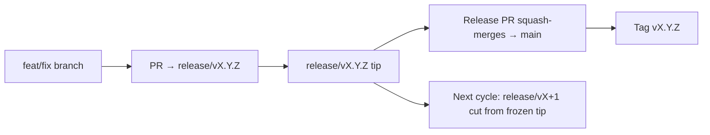

# Branching & Release Model (Filipino)

🌐 **Languages:** 🇺🇸 [English](../../../../ops/BRANCHING_MODEL.md) · 🇪🇹 [am](../../../am/docs/ops/BRANCHING_MODEL.md) · 🇸🇦 [ar](../../../ar/docs/ops/BRANCHING_MODEL.md) · 🇦🇿 [az](../../../az/docs/ops/BRANCHING_MODEL.md) · 🇧🇬 [bg](../../../bg/docs/ops/BRANCHING_MODEL.md) · 🇧🇩 [bn](../../../bn/docs/ops/BRANCHING_MODEL.md) · 🇧🇦 [bs](../../../bs/docs/ops/BRANCHING_MODEL.md) · 🇨🇿 [cs](../../../cs/docs/ops/BRANCHING_MODEL.md) · 🇩🇰 [da](../../../da/docs/ops/BRANCHING_MODEL.md) · 🇩🇪 [de](../../../de/docs/ops/BRANCHING_MODEL.md) · 🇬🇷 [el](../../../el/docs/ops/BRANCHING_MODEL.md) · 🇪🇸 [es](../../../es/docs/ops/BRANCHING_MODEL.md) · 🇪🇪 [et](../../../et/docs/ops/BRANCHING_MODEL.md) · 🇮🇷 [fa](../../../fa/docs/ops/BRANCHING_MODEL.md) · 🇫🇮 [fi](../../../fi/docs/ops/BRANCHING_MODEL.md) · 🇫🇷 [fr](../../../fr/docs/ops/BRANCHING_MODEL.md) · 🇮🇪 [ga](../../../ga/docs/ops/BRANCHING_MODEL.md) · 🇮🇳 [gu](../../../gu/docs/ops/BRANCHING_MODEL.md) · 🇳🇬 [ha](../../../ha/docs/ops/BRANCHING_MODEL.md) · 🇮🇱 [he](../../../he/docs/ops/BRANCHING_MODEL.md) · 🇮🇳 [hi](../../../hi/docs/ops/BRANCHING_MODEL.md) · 🇭🇷 [hr](../../../hr/docs/ops/BRANCHING_MODEL.md) · 🇭🇺 [hu](../../../hu/docs/ops/BRANCHING_MODEL.md) · 🇦🇲 [hy](../../../hy/docs/ops/BRANCHING_MODEL.md) · 🇮🇩 [id](../../../id/docs/ops/BRANCHING_MODEL.md) · 🇳🇬 [ig](../../../ig/docs/ops/BRANCHING_MODEL.md) · 🇮🇹 [it](../../../it/docs/ops/BRANCHING_MODEL.md) · 🇯🇵 [ja](../../../ja/docs/ops/BRANCHING_MODEL.md) · 🇬🇪 [ka](../../../ka/docs/ops/BRANCHING_MODEL.md) · 🇰🇭 [km](../../../km/docs/ops/BRANCHING_MODEL.md) · 🇮🇳 [kn](../../../kn/docs/ops/BRANCHING_MODEL.md) · 🇰🇷 [ko](../../../ko/docs/ops/BRANCHING_MODEL.md) · 🇱🇹 [lt](../../../lt/docs/ops/BRANCHING_MODEL.md) · 🇱🇻 [lv](../../../lv/docs/ops/BRANCHING_MODEL.md) · 🇮🇳 [ml](../../../ml/docs/ops/BRANCHING_MODEL.md) · 🇮🇳 [mr](../../../mr/docs/ops/BRANCHING_MODEL.md) · 🇲🇾 [ms](../../../ms/docs/ops/BRANCHING_MODEL.md) · 🇲🇹 [mt](../../../mt/docs/ops/BRANCHING_MODEL.md) · 🇲🇲 [my](../../../my/docs/ops/BRANCHING_MODEL.md) · 🇳🇵 [ne](../../../ne/docs/ops/BRANCHING_MODEL.md) · 🇳🇱 [nl](../../../nl/docs/ops/BRANCHING_MODEL.md) · 🇳🇴 [no](../../../no/docs/ops/BRANCHING_MODEL.md) · 🇮🇳 [or](../../../or/docs/ops/BRANCHING_MODEL.md) · 🇮🇳 [pa](../../../pa/docs/ops/BRANCHING_MODEL.md) · 🇵🇱 [pl](../../../pl/docs/ops/BRANCHING_MODEL.md) · 🇵🇹 [pt](../../../pt/docs/ops/BRANCHING_MODEL.md) · 🇧🇷 [pt-BR](../../../pt-BR/docs/ops/BRANCHING_MODEL.md) · 🇷🇴 [ro](../../../ro/docs/ops/BRANCHING_MODEL.md) · 🇷🇺 [ru](../../../ru/docs/ops/BRANCHING_MODEL.md) · 🇱🇰 [si](../../../si/docs/ops/BRANCHING_MODEL.md) · 🇸🇰 [sk](../../../sk/docs/ops/BRANCHING_MODEL.md) · 🇸🇮 [sl](../../../sl/docs/ops/BRANCHING_MODEL.md) · 🇷🇸 [sr](../../../sr/docs/ops/BRANCHING_MODEL.md) · 🇸🇪 [sv](../../../sv/docs/ops/BRANCHING_MODEL.md) · 🇰🇪 [sw](../../../sw/docs/ops/BRANCHING_MODEL.md) · 🇮🇳 [ta](../../../ta/docs/ops/BRANCHING_MODEL.md) · 🇮🇳 [te](../../../te/docs/ops/BRANCHING_MODEL.md) · 🇹🇭 [th](../../../th/docs/ops/BRANCHING_MODEL.md) · 🇹🇷 [tr](../../../tr/docs/ops/BRANCHING_MODEL.md) · 🇺🇦 [uk-UA](../../../uk-UA/docs/ops/BRANCHING_MODEL.md) · 🇵🇰 [ur](../../../ur/docs/ops/BRANCHING_MODEL.md) · 🇺🇿 [uz](../../../uz/docs/ops/BRANCHING_MODEL.md) · 🇻🇳 [vi](../../../vi/docs/ops/BRANCHING_MODEL.md) · 🇳🇬 [yo](../../../yo/docs/ops/BRANCHING_MODEL.md) · 🇨🇳 [zh-CN](../../../zh-CN/docs/ops/BRANCHING_MODEL.md) · 🇹🇼 [zh-TW](../../../zh-TW/docs/ops/BRANCHING_MODEL.md)

---

Gumagamit ang OmniRoute ng **parallel-cycle** na modelo ng release: isang nakalaang `release/vX.Y.Z`
na branch para sa aktibong cycle, `main` para sa nailathalang linya, at isang hindi nababagong
`vX.Y.Z` na tag kapag inilabas ang cycle na iyon. Inaasahang may mga commit na napupunta sa `release/*` _at_ sa
`main` — hindi ito pagkakamali.

Makikita ang mga detalye para sa maintainer sa `CLAUDE.md` (Hard Rule #21) at
[RELEASE_CHECKLIST.md](./RELEASE_CHECKLIST.md). Ang pahinang ito ang pampublikong
buod para sa mga contributor.

## Sa isang tingin

| Ref              | Tungkulin                                                                                                      |
| ---------------- | -------------------------------------------------------------------------------------------------------------- |
| `release/vX.Y.Z` | **Aktibong cycle** — pang-araw-araw na development at mga PR merge para sa bersyong iyon                       |
| `main`           | **Nailathalang linya** — tinatanggap ang cycle sa pamamagitan ng squash-merge kapag inilabas ang release       |
| `vX.Y.Z` (tag)   | **Pananda ng paglalabas** — hindi nababagong pointer sa “kung ano ang inilabas” na ginagawa sa oras ng release |



## Aling branch ang dapat i-target ng aking PR?

**I-target ang aktibong `release/vX.Y.Z` na branch — hindi ang `main`.**

1. Hanapin ang pinakamataas na bukas na `release/v*` branch (halimbawa sa oras ng pagsulat:
   `release/v3.8.49`).
2. Gumawa ng branch mula sa tip na iyon (`git fetch` + checkout / rebase dito).
3. Buksan ang PR na may **base = ang `release/vX.Y.Z` na iyon**.

Ang `main` ay hindi ang pang-araw-araw na integration branch. Ang mga PR na binubuksan laban sa `main`
ay karaniwang kailangang muling i-target bago i-merge.

## Release freeze (magkakasabay na mga cycle)

Kapag nire-reconcile ang isang release, nagbubukas ng marker issue na may label na `release-freeze`.
**Hindi nito pinatitigil ang development**:

- Ang naka-freeze na `release/vX.Y.Z` ay nasa pamamahala ng release captain para sa paglalabas na iyon.
- Ginagawa ang `release/vX+1` ng susunod na cycle mula sa naka-freeze na tip upang patuloy na
  makapag-merge ng trabaho ang mga contributor.
- Ang mga bukas na PR na naka-target pa rin sa naka-freeze na branch ay dapat **muling i-target** sa
  aktibong (pinakamataas na) `release/v*` branch.

Suriin kung may bukas na freeze bago ipagpalagay na maaaring i-merge ang branch na gusto mo:

```bash
gh issue list --repo diegosouzapw/OmniRoute --label release-freeze --state open
```

Ang mga mekanismo ng merge (`queue` label ng may-ari → Mergify) ay nakadokumento sa
[MERGE_TRAIN.md](./MERGE_TRAIN.md).

## Bakit may branch at tag?

| Artifact         | Tagal              | Layunin                                                                                    |
| ---------------- | ------------------ | ------------------------------------------------------------------------------------------ |
| `release/vX.Y.Z` | Kasalukuyang cycle | Kinokolekta ang mga nasuring PR, pinananatiling pumapasa sa CI, at nagsisilbing base ng PR |
| Tag `vX.Y.Z`     | Magpakailanman     | Minamarkahan ang eksaktong mga bit na inilabas sa npm / GitHub Releases                    |

Ang branch ang pagawaan; ang tag ang selyadong package. Pagkatapos ng squash-merge sa
`main`, magpapatuloy ang susunod na cycle sa `release/vX+1` nang hindi hinihintay na matapos ang naunang
release PR.

## Mga kaugnay na dokumento

- [CONTRIBUTING.md](../../CONTRIBUTING.md) — setup, mga test, checklist ng PR
- [RELEASE_CHECKLIST.md](./RELEASE_CHECKLIST.md) — pagpapatunay bago ang paglalabas
- [MERGE_TRAIN.md](./MERGE_TRAIN.md) — merge queue at fallback train
- [RELEASE_GREEN.md](./RELEASE_GREEN.md) — pagpapanatiling pumapasa ang release tip
