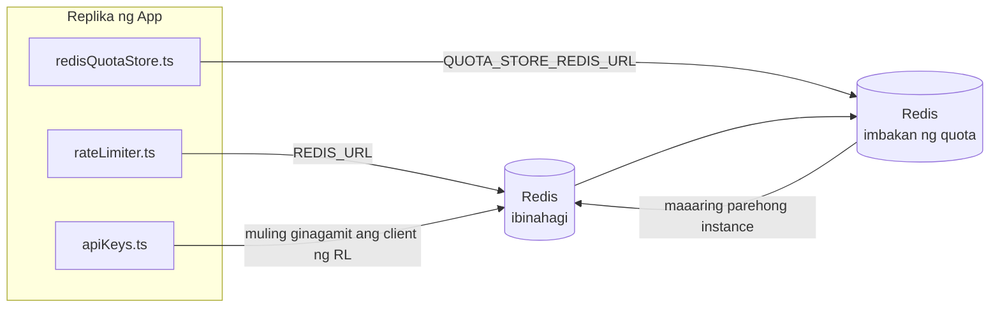

# Redis Production Configuration Guide (Filipino)

🌐 **Languages:** 🇺🇸 [English](../../../../ops/REDIS_PRODUCTION_CONFIG.md) · 🇪🇹 [am](../../../am/docs/ops/REDIS_PRODUCTION_CONFIG.md) · 🇸🇦 [ar](../../../ar/docs/ops/REDIS_PRODUCTION_CONFIG.md) · 🇦🇿 [az](../../../az/docs/ops/REDIS_PRODUCTION_CONFIG.md) · 🇧🇬 [bg](../../../bg/docs/ops/REDIS_PRODUCTION_CONFIG.md) · 🇧🇩 [bn](../../../bn/docs/ops/REDIS_PRODUCTION_CONFIG.md) · 🇧🇦 [bs](../../../bs/docs/ops/REDIS_PRODUCTION_CONFIG.md) · 🇨🇿 [cs](../../../cs/docs/ops/REDIS_PRODUCTION_CONFIG.md) · 🇩🇰 [da](../../../da/docs/ops/REDIS_PRODUCTION_CONFIG.md) · 🇩🇪 [de](../../../de/docs/ops/REDIS_PRODUCTION_CONFIG.md) · 🇬🇷 [el](../../../el/docs/ops/REDIS_PRODUCTION_CONFIG.md) · 🇪🇸 [es](../../../es/docs/ops/REDIS_PRODUCTION_CONFIG.md) · 🇪🇪 [et](../../../et/docs/ops/REDIS_PRODUCTION_CONFIG.md) · 🇮🇷 [fa](../../../fa/docs/ops/REDIS_PRODUCTION_CONFIG.md) · 🇫🇮 [fi](../../../fi/docs/ops/REDIS_PRODUCTION_CONFIG.md) · 🇫🇷 [fr](../../../fr/docs/ops/REDIS_PRODUCTION_CONFIG.md) · 🇮🇪 [ga](../../../ga/docs/ops/REDIS_PRODUCTION_CONFIG.md) · 🇮🇳 [gu](../../../gu/docs/ops/REDIS_PRODUCTION_CONFIG.md) · 🇳🇬 [ha](../../../ha/docs/ops/REDIS_PRODUCTION_CONFIG.md) · 🇮🇱 [he](../../../he/docs/ops/REDIS_PRODUCTION_CONFIG.md) · 🇮🇳 [hi](../../../hi/docs/ops/REDIS_PRODUCTION_CONFIG.md) · 🇭🇷 [hr](../../../hr/docs/ops/REDIS_PRODUCTION_CONFIG.md) · 🇭🇺 [hu](../../../hu/docs/ops/REDIS_PRODUCTION_CONFIG.md) · 🇦🇲 [hy](../../../hy/docs/ops/REDIS_PRODUCTION_CONFIG.md) · 🇮🇩 [id](../../../id/docs/ops/REDIS_PRODUCTION_CONFIG.md) · 🇳🇬 [ig](../../../ig/docs/ops/REDIS_PRODUCTION_CONFIG.md) · 🇮🇹 [it](../../../it/docs/ops/REDIS_PRODUCTION_CONFIG.md) · 🇯🇵 [ja](../../../ja/docs/ops/REDIS_PRODUCTION_CONFIG.md) · 🇬🇪 [ka](../../../ka/docs/ops/REDIS_PRODUCTION_CONFIG.md) · 🇰🇭 [km](../../../km/docs/ops/REDIS_PRODUCTION_CONFIG.md) · 🇮🇳 [kn](../../../kn/docs/ops/REDIS_PRODUCTION_CONFIG.md) · 🇰🇷 [ko](../../../ko/docs/ops/REDIS_PRODUCTION_CONFIG.md) · 🇱🇹 [lt](../../../lt/docs/ops/REDIS_PRODUCTION_CONFIG.md) · 🇱🇻 [lv](../../../lv/docs/ops/REDIS_PRODUCTION_CONFIG.md) · 🇮🇳 [ml](../../../ml/docs/ops/REDIS_PRODUCTION_CONFIG.md) · 🇮🇳 [mr](../../../mr/docs/ops/REDIS_PRODUCTION_CONFIG.md) · 🇲🇾 [ms](../../../ms/docs/ops/REDIS_PRODUCTION_CONFIG.md) · 🇲🇹 [mt](../../../mt/docs/ops/REDIS_PRODUCTION_CONFIG.md) · 🇲🇲 [my](../../../my/docs/ops/REDIS_PRODUCTION_CONFIG.md) · 🇳🇵 [ne](../../../ne/docs/ops/REDIS_PRODUCTION_CONFIG.md) · 🇳🇱 [nl](../../../nl/docs/ops/REDIS_PRODUCTION_CONFIG.md) · 🇳🇴 [no](../../../no/docs/ops/REDIS_PRODUCTION_CONFIG.md) · 🇮🇳 [or](../../../or/docs/ops/REDIS_PRODUCTION_CONFIG.md) · 🇮🇳 [pa](../../../pa/docs/ops/REDIS_PRODUCTION_CONFIG.md) · 🇵🇱 [pl](../../../pl/docs/ops/REDIS_PRODUCTION_CONFIG.md) · 🇵🇹 [pt](../../../pt/docs/ops/REDIS_PRODUCTION_CONFIG.md) · 🇧🇷 [pt-BR](../../../pt-BR/docs/ops/REDIS_PRODUCTION_CONFIG.md) · 🇷🇴 [ro](../../../ro/docs/ops/REDIS_PRODUCTION_CONFIG.md) · 🇷🇺 [ru](../../../ru/docs/ops/REDIS_PRODUCTION_CONFIG.md) · 🇱🇰 [si](../../../si/docs/ops/REDIS_PRODUCTION_CONFIG.md) · 🇸🇰 [sk](../../../sk/docs/ops/REDIS_PRODUCTION_CONFIG.md) · 🇸🇮 [sl](../../../sl/docs/ops/REDIS_PRODUCTION_CONFIG.md) · 🇷🇸 [sr](../../../sr/docs/ops/REDIS_PRODUCTION_CONFIG.md) · 🇸🇪 [sv](../../../sv/docs/ops/REDIS_PRODUCTION_CONFIG.md) · 🇰🇪 [sw](../../../sw/docs/ops/REDIS_PRODUCTION_CONFIG.md) · 🇮🇳 [ta](../../../ta/docs/ops/REDIS_PRODUCTION_CONFIG.md) · 🇮🇳 [te](../../../te/docs/ops/REDIS_PRODUCTION_CONFIG.md) · 🇹🇭 [th](../../../th/docs/ops/REDIS_PRODUCTION_CONFIG.md) · 🇹🇷 [tr](../../../tr/docs/ops/REDIS_PRODUCTION_CONFIG.md) · 🇺🇦 [uk-UA](../../../uk-UA/docs/ops/REDIS_PRODUCTION_CONFIG.md) · 🇵🇰 [ur](../../../ur/docs/ops/REDIS_PRODUCTION_CONFIG.md) · 🇺🇿 [uz](../../../uz/docs/ops/REDIS_PRODUCTION_CONFIG.md) · 🇻🇳 [vi](../../../vi/docs/ops/REDIS_PRODUCTION_CONFIG.md) · 🇳🇬 [yo](../../../yo/docs/ops/REDIS_PRODUCTION_CONFIG.md) · 🇨🇳 [zh-CN](../../../zh-CN/docs/ops/REDIS_PRODUCTION_CONFIG.md) · 🇹🇼 [zh-TW](../../../zh-TW/docs/ops/REDIS_PRODUCTION_CONFIG.md)

---

## Pangkalahatang-ideya

Ang Redis ay isang **opsyonal at hindi mahigpit na dependency** sa OmniRoute — maayos na bumababa ang kakayahan ng application (gumagamit ng mga in-memory na fallback) kapag hindi available ang Redis. Sa production, ang pag-tune sa Redis ay nagpapababa ng latency para sa apat na magkakaibang workload:

| Workload                  | Driver                        | Client Factory                                   | Pattern ng Key                                        |
| ------------------------- | ----------------------------- | ------------------------------------------------ | ----------------------------------------------------- |
| Paglilimita ng rate       | `rateLimiter.ts`              | `getRedisClient()` — lazy na `ioredis` singleton | `<prefix>rl:*` mga Lua-atomic na window ng rate limit |
| Cache ng auth             | `apiKeys.ts`                  | Muling ginagamit ang client ng `rateLimiter`     | `<prefix>auth:api_key:<sha256>` na may TTL            |
| Imbakan ng quota          | `redisQuotaStore.ts`          | Hiwalay na `getRedisClient(url)` singleton       | `<prefix>quota:*` na nako-configure sa bawat instance |
| Circuit breaker ng warmup | `redisCircuitBreakerStore.ts` | Hiwalay na client sa `circuitBreakerFactory.ts`  | `<prefix>warmup:cb:<connectionId>`                    |

Iisang namespace prefix ang ginagamit ng lahat ng apat na workload upang makapagpatakbo ang OmniRoute kasama ng iba pang app sa iisang Redis instance (hal. `127.0.0.1:6379`). Tingnan ang [Paglalagay sa Namespace ng mga Key](#key-namespacing).

---

## Kasalukuyang Configuration (Mga Default sa Code)

| Setting                         | Value                                                         | Lokasyon                                                                              |
| ------------------------------- | ------------------------------------------------------------- | ------------------------------------------------------------------------------------- |
| `REDIS_URL` env var             | `redis://redis:6379` (compose), opsyonal                      | `rateLimiter.ts:5`, `.env.example`                                                    |
| `REDIS_KEY_PREFIX` env var      | `omniroute:` (default)                                        | `rateLimiter.ts`, `redisQuotaStore.ts`, `redisCircuitBreakerStore.ts`, `.env.example` |
| `QUOTA_STORE_REDIS_URL` env var | hiwalay, maaaring iba sa `REDIS_URL`                          | `quota/storeFactory.ts`                                                               |
| `QUOTA_STORE_DRIVER`            | `"sqlite"` (default), opsyonal ang `"redis"`                  | `quota/storeFactory.ts`                                                               |
| ioredis `maxRetriesPerRequest`  | `3`                                                           | paggawa ng client sa `rateLimiter.ts`                                                 |
| `enableReadyCheck`              | hindi nakatakda (default ng ioredis: `true`)                  | —                                                                                     |
| `lazyConnect`                   | hindi nakatakda (default ng ioredis: `false`)                 | —                                                                                     |
| `retryStrategy`                 | hindi nakatakda (default ng ioredis: 200ms base, exponential) | —                                                                                     |
| TLS / password / DB index       | **hindi naka-configure**                                      | —                                                                                     |
| Sentinel / Cluster              | **hindi naka-configure** — standalone na single-node lamang   | —                                                                                     |

---

## Paglalagay sa Namespace ng mga Key

Nakikibahagi ang OmniRoute sa isang Redis instance kasama ng anumang iba pang tumatakbo sa host. Kung walang namespace, maaaring magbanggaan ang mga key tulad ng `auth:api_key:<sha256>` o `rl:*` at ang mga key mula sa iba pang application na gumagamit ng parehong Redis (nagpapatakbo ang instance na ito ng Redis sa `127.0.0.1:6379` kasama ng iba pang serbisyo).

Itakda ang `REDIS_KEY_PREFIX` sa isang string na hindi walang laman upang lagyan ng prefix ang **bawat** key ng OmniRoute:

```bash
# .env — magiging omniroute:rl:*, omniroute:auth:*, omniroute:quota:*, omniroute:warmup:cb:* ang lahat ng key ng OmniRoute
REDIS_KEY_PREFIX=omniroute:
```

- **Default:** `omniroute:` (inilalapat kapag hindi nakatakda o blangko ang `REDIS_KEY_PREFIX`).
- **Inilalapat sa:** rate limiter + auth cache (nakabahaging `ioredis` client sa pamamagitan ng `keyPrefix`) at sa quota store (`KEY_PREFIX = "${REDIS_KEY_PREFIX}quota"`) at sa warmup circuit breaker (`KEY_PREFIX = "${REDIS_KEY_PREFIX}warmup:cb:"`).
- Kapag **binago ang prefix** habang mayroon nang mga key sa Redis, maiiwang hindi naa-access ang mga lumang key (mag-e-expire ang mga ito sa pamamagitan ng TTL / LRU). Ligtas itong baguhin; walang kinakailangang migration. Ang tanging exception ay ang warmup circuit-breaker key para sa isang connection na minarkahang forbidden: sine-save ito nang walang TTL, kaya ilista ang mga natira gamit ang `redis-cli --scan --pattern '<old-prefix>warmup:cb:*'` at i-delete ang mga ito.
- Awtomatikong inilalagay ng **ioredis `keyPrefix`** ang prefix sa unahan kapag nagsusulat **at** inaalis ito kapag nagbabasa, kaya hindi kailanman nakikita ng application code ang prefix.

---

## Inirerekomendang Pag-tune para sa Produksyon

### 1. Mga Opsyon sa Connection Pool / Client (ioredis `Redis` constructor)

Gumagawa ang kasalukuyang code ng iisang `new Redis(url)` nang walang mga custom na opsyon. Para sa mga production deployment na may maraming replica, magpasa ng client factory sa code o i-wrap ang `getRedisClient()`:

```typescript
const redis = new Redis(REDIS_URL, {
  maxRetriesPerRequest: null, // walang limitasyon sa retry; hayaan ang retryStrategy na magpasya
  enableReadyCheck: true, // tiyaking handa ang server bago tumanggap ng mga tawag
  lazyConnect: true, // huwag kumonekta sa paggawa; hintayin ang unang tawag
  retryStrategy: (times) => {
    if (times > 10) return null; // sumuko pagkatapos ng 10 retry → muling kumonekta sa ibang pagkakataon
    return Math.min(times * 200, 5000); // 200ms, 400ms, …, hanggang 5s
  },
  enableAutoPipelining: true, // pagsama-samahin ang magkakasabay na command sa iisang TCP write
  keepAlive: 10000, // TCP keep-alive bawat 10s
});
```

**Mahahalagang trade-off:**

- `maxRetriesPerRequest: null` + `retryStrategy` — mas mainam para sa produksyon upang hindi agad mabigo ang bawat request kapag pansamantalang nag-restart ang Redis. Sinasalo ng in-memory fallback sa `checkRateLimit()` ang failure path.
- `lazyConnect: true` — iniiwasang maging startup dependency ang pagiging aktibo ng Redis bago magsimulang tumanggap ng mga koneksyon ang server.
- `enableAutoPipelining: true` — binabawasan ang mga round-trip para sa magkakasabay na pagsusuri ng rate limit; kapaki-pakinabang sa >50 RPS sa iisang koneksyon.

### 2. Configuration ng Redis Server (`redis.conf`)

```
# Memory
maxmemory 80%                        # maglaan ng espasyo para sa OS page cache
maxmemory-policy allkeys-lru         # alisin ang mga lipas na auth cache entry kapag kapos sa memory

# Persistence (opsyonal — crash-safe ang OmniRoute kahit wala nito)
save 300 1                           # gumawa ng snapshot kahit bawat 5 min kung ≥1 key ang nagbago
appendonly no                        # hindi kailangan ang AOF; maaaring buuing muli ang data
appendfsync no                       # walang fsync overhead (sapat na ang RDB)

# Networking
timeout 0                            # walang idle disconnect
tcp-keepalive 300                    # 5 min keep-alive
tcp-backlog 511                      # backlog ng koneksyon para sa pabugso-bugsong load

# Performance
hz 10                                # default; 100 para sa latency-sensitive
activedefrag yes                     # awtomatikong mag-defragment kapag >10% ang fragmentation
```

**Trade-off para sa `maxmemory-policy allkeys-lru`:** Maaaring alisin ang mga auth cache entry kapag kapos sa memory. Ligtas ito — palaging muling naglalagay ang `setCachedApiKey` kapag may miss, at ang SQLite fallback ang awtoritatibong pinagmulan. Gumagawa ang rate-limiter Lua script ng maliliit na key na sadyang panandalian lamang.

### 3. Mga Setting ng Docker Compose

Gumagamit ang prod compose (`docker-compose.prod.yml`) ng `redis:8.6.2-alpine`. Idagdag ang:

```yaml
redis:
  image: redis:8.6.2-alpine
  command:
    [
      "redis-server",
      "--maxmemory",
      "512mb",
      "--maxmemory-policy",
      "allkeys-lru",
      "--activedefrag",
      "yes",
      "--save",
      "300 1",
    ]
  healthcheck:
    test: ["CMD", "redis-cli", "ping"]
    interval: 10s
    timeout: 3s
    retries: 3
    start_period: 5s
```

### 4. Mga Pagsasaalang-alang para sa Maraming Instance / Scaling

**Iisang Redis para sa lahat ng replica** — umaasa ang rate-limiter Lua script sa iisang awtoritatibong key space. Mawawala ang atomicity at madodoble ang budget kapag maraming Redis instance ang nasa likod ng mga replica. Gumamit ng iisang Redis (o Redis Sentinel cluster na may failover) para sa lahat ng application replica.

**Bilang ng koneksyon:** Nagbubukas ang bawat application replica ng **2 TCP connection** sa Redis (rate limiter client + quota store client). Sa 10 replica → 20 koneksyon, na pasok na pasok sa default na limitasyong 10k koneksyon ng isang Redis instance.

### 5. Monitoring

I-expose sa pamamagitan ng health-check endpoint:

```typescript
// Tumatawag na ang src/app/api/monitoring/health/route.ts sa mga function ng rateLimiter
// Magdagdag ng mga pagsusuring partikular sa Redis:
//   1. PING latency sa pamamagitan ng ioredis .ping()
//   2. Paggamit ng memory sa pamamagitan ng INFO memory
//   3. Bilang ng koneksyon sa pamamagitan ng INFO clients
//   4. Hit rate para sa maxmemory-policy (evicted_keys / keyspace_hits)
```

Mga pangunahing metric na dapat bantayan:

- **Mga inalis na key / sec** — kung palagi itong hindi zero, dagdagan ang `maxmemory`
- **Mga naka-block na client** — nagpapahiwatig ang hindi zero ng mababagal na Lua script o mataas na contention
- **Mga tinanggihang koneksyon** — naabot ang limitasyon sa koneksyon; bihira sa 20 koneksyon

---

## Diagram ng Arkitektura



---

## Mga Sanggunian

| File                               | Layunin                                                                |
| ---------------------------------- | ---------------------------------------------------------------------- |
| `src/shared/utils/rateLimiter.ts`  | Pangunahing Redis client, Lua rate-limit script, at in-memory fallback |
| `src/lib/db/apiKeys.ts`            | Auth cache — Redis→SQLite fallback                                     |
| `src/lib/quota/redisQuotaStore.ts` | Hiwalay na Redis client para sa opsyonal na imbakan ng quota           |
| `src/lib/quota/storeFactory.ts`    | Nagpapalit sa pagitan ng `sqlite` at `redis` na mga quota driver       |
| `docker-compose.prod.yml`          | Redis container para sa production (image na `redis:8.6.2-alpine`)     |
| `.env.example`                     | Dokumentasyon ng mga Redis env var                                     |
| `src/app/api/local/redis/`         | Mga API route para sa orkestrasyon ng dev container                    |
| `bin/cli/commands/redis.mjs`       | Mga CLI command para sa orkestrasyon ng dev container                  |
