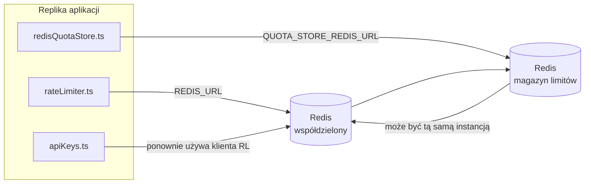

# Redis Production Configuration Guide (Polski)

🌐 **Languages:** 🇺🇸 [English](../../../../ops/REDIS_PRODUCTION_CONFIG.md) · 🇪🇹 [am](../../../am/docs/ops/REDIS_PRODUCTION_CONFIG.md) · 🇸🇦 [ar](../../../ar/docs/ops/REDIS_PRODUCTION_CONFIG.md) · 🇦🇿 [az](../../../az/docs/ops/REDIS_PRODUCTION_CONFIG.md) · 🇧🇬 [bg](../../../bg/docs/ops/REDIS_PRODUCTION_CONFIG.md) · 🇧🇩 [bn](../../../bn/docs/ops/REDIS_PRODUCTION_CONFIG.md) · 🇨🇿 [cs](../../../cs/docs/ops/REDIS_PRODUCTION_CONFIG.md) · 🇩🇰 [da](../../../da/docs/ops/REDIS_PRODUCTION_CONFIG.md) · 🇩🇪 [de](../../../de/docs/ops/REDIS_PRODUCTION_CONFIG.md) · 🇬🇷 [el](../../../el/docs/ops/REDIS_PRODUCTION_CONFIG.md) · 🇪🇸 [es](../../../es/docs/ops/REDIS_PRODUCTION_CONFIG.md) · 🇪🇪 [et](../../../et/docs/ops/REDIS_PRODUCTION_CONFIG.md) · 🇮🇷 [fa](../../../fa/docs/ops/REDIS_PRODUCTION_CONFIG.md) · 🇫🇮 [fi](../../../fi/docs/ops/REDIS_PRODUCTION_CONFIG.md) · 🇫🇷 [fr](../../../fr/docs/ops/REDIS_PRODUCTION_CONFIG.md) · 🇮🇪 [ga](../../../ga/docs/ops/REDIS_PRODUCTION_CONFIG.md) · 🇮🇳 [gu](../../../gu/docs/ops/REDIS_PRODUCTION_CONFIG.md) · 🇳🇬 [ha](../../../ha/docs/ops/REDIS_PRODUCTION_CONFIG.md) · 🇮🇱 [he](../../../he/docs/ops/REDIS_PRODUCTION_CONFIG.md) · 🇮🇳 [hi](../../../hi/docs/ops/REDIS_PRODUCTION_CONFIG.md) · 🇭🇷 [hr](../../../hr/docs/ops/REDIS_PRODUCTION_CONFIG.md) · 🇭🇺 [hu](../../../hu/docs/ops/REDIS_PRODUCTION_CONFIG.md) · 🇦🇲 [hy](../../../hy/docs/ops/REDIS_PRODUCTION_CONFIG.md) · 🇮🇩 [id](../../../id/docs/ops/REDIS_PRODUCTION_CONFIG.md) · 🇳🇬 [ig](../../../ig/docs/ops/REDIS_PRODUCTION_CONFIG.md) · 🇮🇹 [it](../../../it/docs/ops/REDIS_PRODUCTION_CONFIG.md) · 🇯🇵 [ja](../../../ja/docs/ops/REDIS_PRODUCTION_CONFIG.md) · 🇬🇪 [ka](../../../ka/docs/ops/REDIS_PRODUCTION_CONFIG.md) · 🇰🇭 [km](../../../km/docs/ops/REDIS_PRODUCTION_CONFIG.md) · 🇮🇳 [kn](../../../kn/docs/ops/REDIS_PRODUCTION_CONFIG.md) · 🇰🇷 [ko](../../../ko/docs/ops/REDIS_PRODUCTION_CONFIG.md) · 🇱🇹 [lt](../../../lt/docs/ops/REDIS_PRODUCTION_CONFIG.md) · 🇱🇻 [lv](../../../lv/docs/ops/REDIS_PRODUCTION_CONFIG.md) · 🇮🇳 [ml](../../../ml/docs/ops/REDIS_PRODUCTION_CONFIG.md) · 🇮🇳 [mr](../../../mr/docs/ops/REDIS_PRODUCTION_CONFIG.md) · 🇲🇾 [ms](../../../ms/docs/ops/REDIS_PRODUCTION_CONFIG.md) · 🇲🇹 [mt](../../../mt/docs/ops/REDIS_PRODUCTION_CONFIG.md) · 🇲🇲 [my](../../../my/docs/ops/REDIS_PRODUCTION_CONFIG.md) · 🇳🇵 [ne](../../../ne/docs/ops/REDIS_PRODUCTION_CONFIG.md) · 🇳🇱 [nl](../../../nl/docs/ops/REDIS_PRODUCTION_CONFIG.md) · 🇳🇴 [no](../../../no/docs/ops/REDIS_PRODUCTION_CONFIG.md) · 🇮🇳 [or](../../../or/docs/ops/REDIS_PRODUCTION_CONFIG.md) · 🇮🇳 [pa](../../../pa/docs/ops/REDIS_PRODUCTION_CONFIG.md) · 🇵🇭 [phi](../../../phi/docs/ops/REDIS_PRODUCTION_CONFIG.md) · 🇵🇹 [pt](../../../pt/docs/ops/REDIS_PRODUCTION_CONFIG.md) · 🇧🇷 [pt-BR](../../../pt-BR/docs/ops/REDIS_PRODUCTION_CONFIG.md) · 🇷🇴 [ro](../../../ro/docs/ops/REDIS_PRODUCTION_CONFIG.md) · 🇷🇺 [ru](../../../ru/docs/ops/REDIS_PRODUCTION_CONFIG.md) · 🇱🇰 [si](../../../si/docs/ops/REDIS_PRODUCTION_CONFIG.md) · 🇸🇰 [sk](../../../sk/docs/ops/REDIS_PRODUCTION_CONFIG.md) · 🇸🇮 [sl](../../../sl/docs/ops/REDIS_PRODUCTION_CONFIG.md) · 🇷🇸 [sr](../../../sr/docs/ops/REDIS_PRODUCTION_CONFIG.md) · 🇸🇪 [sv](../../../sv/docs/ops/REDIS_PRODUCTION_CONFIG.md) · 🇰🇪 [sw](../../../sw/docs/ops/REDIS_PRODUCTION_CONFIG.md) · 🇮🇳 [ta](../../../ta/docs/ops/REDIS_PRODUCTION_CONFIG.md) · 🇮🇳 [te](../../../te/docs/ops/REDIS_PRODUCTION_CONFIG.md) · 🇹🇭 [th](../../../th/docs/ops/REDIS_PRODUCTION_CONFIG.md) · 🇹🇷 [tr](../../../tr/docs/ops/REDIS_PRODUCTION_CONFIG.md) · 🇺🇦 [uk-UA](../../../uk-UA/docs/ops/REDIS_PRODUCTION_CONFIG.md) · 🇵🇰 [ur](../../../ur/docs/ops/REDIS_PRODUCTION_CONFIG.md) · 🇺🇿 [uz](../../../uz/docs/ops/REDIS_PRODUCTION_CONFIG.md) · 🇻🇳 [vi](../../../vi/docs/ops/REDIS_PRODUCTION_CONFIG.md) · 🇳🇬 [yo](../../../yo/docs/ops/REDIS_PRODUCTION_CONFIG.md) · 🇨🇳 [zh-CN](../../../zh-CN/docs/ops/REDIS_PRODUCTION_CONFIG.md) · 🇹🇼 [zh-TW](../../../zh-TW/docs/ops/REDIS_PRODUCTION_CONFIG.md)

---

## Omówienie

Redis jest **opcjonalną, miękką zależnością** w OmniRoute — gdy Redis jest niedostępny, aplikacja
łagodnie przełącza się na rozwiązania zastępcze w pamięci. W środowisku produkcyjnym dostrojenie Redis zmniejsza opóźnienia dla czterech odrębnych
obciążeń:

| Obciążenie                          | Moduł obsługujący             | Fabryka klienta                                    | Wzorzec klucza                                        |
| ----------------------------------- | ----------------------------- | -------------------------------------------------- | ----------------------------------------------------- |
| Ograniczanie częstotliwości żądań   | `rateLimiter.ts`              | `getRedisClient()` — leniwy singleton `ioredis`    | `<prefix>rl:*` atomowe okna limitów oparte na Lua     |
| Pamięć podręczna uwierzytelniania   | `apiKeys.ts`                  | Ponownie wykorzystuje klienta modułu `rateLimiter` | `<prefix>auth:api_key:<sha256>` z TTL                 |
| Magazyn limitów                     | `redisQuotaStore.ts`          | Osobny singleton `getRedisClient(url)`             | `<prefix>quota:*` konfigurowalny dla każdej instancji |
| Wyłącznik automatyczny rozgrzewania | `redisCircuitBreakerStore.ts` | Osobny klient w `circuitBreakerFactory.ts`         | `<prefix>warmup:cb:<connectionId>`                    |

Wszystkie cztery obciążenia korzystają ze wspólnego prefiksu przestrzeni nazw, dzięki czemu OmniRoute może współistnieć z innymi aplikacjami w
pojedynczej instancji Redis (np. `127.0.0.1:6379`). Zobacz [Przestrzeń nazw kluczy](#key-namespacing).

---

## Bieżąca konfiguracja (wartości domyślne w kodzie)

| Ustawienie                                   | Wartość                                                                          | Lokalizacja                                                                           |
| -------------------------------------------- | -------------------------------------------------------------------------------- | ------------------------------------------------------------------------------------- |
| Zmienna środowiskowa `REDIS_URL`             | `redis://redis:6379` (compose), opcjonalna                                       | `rateLimiter.ts:5`, `.env.example`                                                    |
| Zmienna środowiskowa `REDIS_KEY_PREFIX`      | `omniroute:` (domyślnie)                                                         | `rateLimiter.ts`, `redisQuotaStore.ts`, `redisCircuitBreakerStore.ts`, `.env.example` |
| Zmienna środowiskowa `QUOTA_STORE_REDIS_URL` | osobna, może różnić się od `REDIS_URL`                                           | `quota/storeFactory.ts`                                                               |
| `QUOTA_STORE_DRIVER`                         | `"sqlite"` (domyślnie), opcjonalnie `"redis"`                                    | `quota/storeFactory.ts`                                                               |
| `maxRetriesPerRequest` biblioteki ioredis    | `3`                                                                              | tworzenie klienta w `rateLimiter.ts`                                                  |
| `enableReadyCheck`                           | nie ustawiono (wartość domyślna ioredis: `true`)                                 | —                                                                                     |
| `lazyConnect`                                | nie ustawiono (wartość domyślna ioredis: `false`)                                | —                                                                                     |
| `retryStrategy`                              | nie ustawiono (wartość domyślna ioredis: baza 200 ms, wzrost wykładniczy)        | —                                                                                     |
| TLS / hasło / indeks bazy danych             | **nie skonfigurowano**                                                           | —                                                                                     |
| Sentinel / Cluster                           | **nie skonfigurowano** — obsługiwany jest wyłącznie samodzielny pojedynczy węzeł | —                                                                                     |

---

## Przestrzeń nazw kluczy

OmniRoute współdzieli instancję Redis ze wszystkimi innymi usługami działającymi na hoście. Bez przestrzeni nazw
klucze takie jak `auth:api_key:<sha256>` lub `rl:*` mogłyby kolidować z kluczami innych aplikacji
korzystających z tego samego Redis (ta instancja uruchamia Redis pod adresem `127.0.0.1:6379` razem z innymi usługami).

Ustaw `REDIS_KEY_PREFIX` na niepusty ciąg znaków, aby dodać prefiks do **każdego** klucza OmniRoute:

```bash
# .env — wszystkie klucze OmniRoute przyjmują postać omniroute:rl:*, omniroute:auth:*, omniroute:quota:*, omniroute:warmup:cb:*
REDIS_KEY_PREFIX=omniroute:
```

- **Wartość domyślna:** `omniroute:` (stosowana, gdy `REDIS_KEY_PREFIX` jest nieustawiony lub pusty).
- **Zastosowanie:** ogranicznik częstotliwości żądań + pamięć podręczna uwierzytelniania (współdzielony klient `ioredis` za pośrednictwem `keyPrefix`) oraz
  magazyn limitów (`KEY_PREFIX = "${REDIS_KEY_PREFIX}quota"`) i wyłącznik automatyczny rozgrzewania
  (`KEY_PREFIX = "${REDIS_KEY_PREFIX}warmup:cb:"`).
- **Zmiana prefiksu**, gdy klucze już istnieją w Redis, pozostawia stare klucze osierocone (wygasają one
  zgodnie z TTL / LRU). Zmiana jest bezpieczna i nie wymaga migracji. Jedynym wyjątkiem jest klucz wyłącznika
  automatycznego rozgrzewania dla połączenia oznaczonego jako zabronione: jest on utrwalany bez TTL, dlatego
  wyświetl pozostałości za pomocą `redis-cli --scan --pattern '<old-prefix>warmup:cb:*'` i je usuń.
- **`keyPrefix` biblioteki ioredis** automatycznie dodaje prefiks podczas zapisu **oraz** usuwa go podczas odczytu,
  dzięki czemu kod aplikacji nigdy nie widzi prefiksu.

---

## Zalecane dostrajanie środowiska produkcyjnego

### 1. Pula połączeń / opcje klienta (konstruktor `Redis` z ioredis)

Obecny kod tworzy pojedynczy obiekt `new Redis(url)` bez niestandardowych opcji. W przypadku produkcyjnych
wdrożeń z wieloma replikami przekaż fabrykę klienta w kodzie lub utwórz opakowanie dla `getRedisClient()`:

```typescript
const redis = new Redis(REDIS_URL, {
  maxRetriesPerRequest: null, // bez limitu ponowień; decyzję pozostaw retryStrategy
  enableReadyCheck: true, // sprawdź gotowość serwera przed przyjmowaniem wywołań
  lazyConnect: true, // nie łącz podczas tworzenia; poczekaj na pierwsze wywołanie
  retryStrategy: (times) => {
    if (times > 10) return null; // zrezygnuj po 10 próbach → połącz się ponownie później
    return Math.min(times * 200, 5000); // 200 ms, 400 ms, …, maksymalnie 5 s
  },
  enableAutoPipelining: true, // łącz równoczesne polecenia w pojedynczy zapis TCP
  keepAlive: 10000, // TCP keep-alive co 10 s
});
```

**Najważniejsze kompromisy:**

- `maxRetriesPerRequest: null` + `retryStrategy` — rozwiązanie preferowane w środowisku produkcyjnym, aby przejściowe
  ponowne uruchomienia Redis nie powodowały natychmiastowego niepowodzenia każdego żądania. Mechanizm awaryjny w pamięci
  w `checkRateLimit()` obsługuje ścieżkę błędu.
- `lazyConnect: true` — eliminuje przy uruchamianiu zależność od dostępności Redis, zanim serwer
  zacznie przyjmować połączenia.
- `enableAutoPipelining: true` — zmniejsza liczbę cykli komunikacji dla równoczesnych kontroli limitu żądań;
  korzystne przy >50 RPS na pojedynczym połączeniu.

### 2. Konfiguracja serwera Redis (`redis.conf`)

```
# Pamięć
maxmemory 80%                        # pozostaw miejsce na pamięć podręczną stron systemu operacyjnego
maxmemory-policy allkeys-lru         # usuwaj nieaktualne wpisy pamięci podręcznej uwierzytelniania przy dużym obciążeniu pamięci

# Trwałość (opcjonalna — OmniRoute jest odporny na awarie bez niej)
save 300 1                           # twórz migawkę co najmniej co 5 min, jeśli zmienił się ≥1 klucz
appendonly no                        # AOF nie jest potrzebny; dane można odtworzyć
appendfsync no                       # brak narzutu fsync (RDB jest wystarczające)

# Sieć
timeout 0                            # bez rozłączania z powodu bezczynności
tcp-keepalive 300                    # keep-alive co 5 min
tcp-backlog 511                      # kolejka połączeń dla skokowego obciążenia

# Wydajność
hz 10                                # wartość domyślna; 100 dla zastosowań wrażliwych na opóźnienia
activedefrag yes                     # automatycznie defragmentuj, gdy fragmentacja >10%
```

**Kompromis związany z `maxmemory-policy allkeys-lru`:** Wpisy pamięci podręcznej uwierzytelniania mogą zostać usunięte przy
dużym obciążeniu pamięci. Jest to bezpieczne — `setCachedApiKey` zawsze ponownie zapisuje dane w przypadku braku wpisu, a
mechanizm awaryjny SQLite jest źródłem nadrzędnym. Skrypt Lua ogranicznika żądań tworzy niewielkie klucze, które z założenia
mają krótki czas życia.

### 3. Ustawienia Docker Compose

Produkcyjna konfiguracja Compose (`docker-compose.prod.yml`) używa `redis:8.6.2-alpine`. Dodaj:

```yaml
redis:
  image: redis:8.6.2-alpine
  command:
    [
      "redis-server",
      "--maxmemory",
      "512mb",
      "--maxmemory-policy",
      "allkeys-lru",
      "--activedefrag",
      "yes",
      "--save",
      "300 1",
    ]
  healthcheck:
    test: ["CMD", "redis-cli", "ping"]
    interval: 10s
    timeout: 3s
    retries: 3
    start_period: 5s
```

### 4. Kwestie dotyczące wielu instancji / skalowania

**Jeden Redis dla wszystkich replik** — skrypt Lua ogranicznika żądań zależy od jednej
nadrzędnej przestrzeni kluczy. Wiele instancji Redis przypisanych do poszczególnych replik spowodowałoby utratę niepodzielności
i podwojenie budżetu. Dla wszystkich replik aplikacji używaj jednej instancji Redis (lub klastra Redis Sentinel z przełączaniem awaryjnym).

**Liczba połączeń:** Każda replika aplikacji otwiera **2 połączenia TCP** z Redis
(klient ogranicznika żądań + klient magazynu limitów). Przy 10 replikach → 20 połączeń, czyli znacznie
poniżej domyślnego limitu 10 tys. połączeń instancji Redis.

### 5. Monitorowanie

Udostępnij za pośrednictwem punktu końcowego kontroli kondycji:

```typescript
// src/app/api/monitoring/health/route.ts już wywołuje funkcje rateLimiter
// Dodaj kontrole specyficzne dla Redis:
//   1. Opóźnienie PING za pomocą ioredis .ping()
//   2. Użycie pamięci za pomocą INFO memory
//   3. Liczba połączeń za pomocą INFO clients
//   4. Współczynnik trafień dla maxmemory-policy (evicted_keys / keyspace_hits)
```

Kluczowe metryki do monitorowania:

- **Usunięte klucze / s** — jeśli wartość stale jest różna od zera, zwiększ `maxmemory`
- **Zablokowani klienci** — wartość różna od zera wskazuje na powolne skrypty Lua lub dużą rywalizację o zasoby
- **Odrzucone połączenia** — osiągnięto limit połączeń; rzadkie przy 20 połączeniach

---

## Diagram architektury



---

## Materiały referencyjne

| Plik                               | Przeznaczenie                                                                                     |
| ---------------------------------- | ------------------------------------------------------------------------------------------------- |
| `src/shared/utils/rateLimiter.ts`  | Główny klient Redis, skrypt Lua ograniczający częstotliwość żądań, rozwiązanie zapasowe w pamięci |
| `src/lib/db/apiKeys.ts`            | Pamięć podręczna uwierzytelniania — Redis→SQLite jako rozwiązanie zapasowe                        |
| `src/lib/quota/redisQuotaStore.ts` | Oddzielny klient Redis dla opcjonalnego magazynu limitów                                          |
| `src/lib/quota/storeFactory.ts`    | Przełącza między sterownikami magazynu limitów `sqlite` i `redis`                                 |
| `docker-compose.prod.yml`          | Kontener Redis dla środowiska produkcyjnego (obraz `redis:8.6.2-alpine`)                          |
| `.env.example`                     | Dokumentacja zmiennych środowiskowych Redis                                                       |
| `src/app/api/local/redis/`         | Trasy API do orkiestracji kontenera deweloperskiego                                               |
| `bin/cli/commands/redis.mjs`       | Polecenia CLI do orkiestracji kontenera deweloperskiego                                           |
