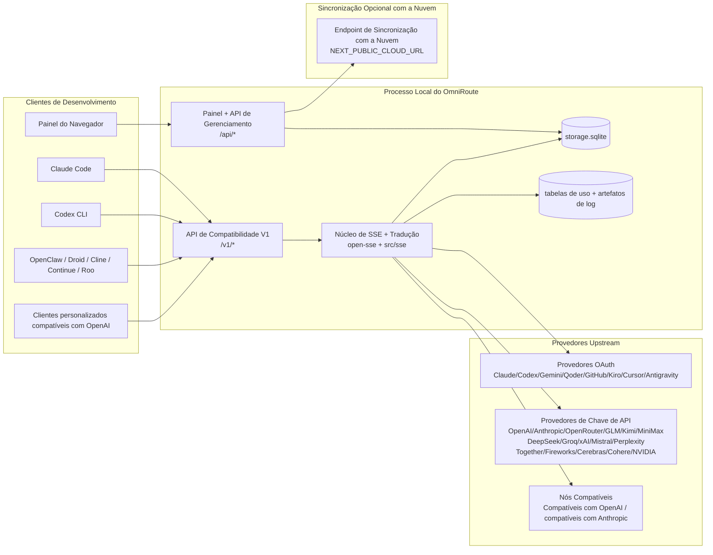
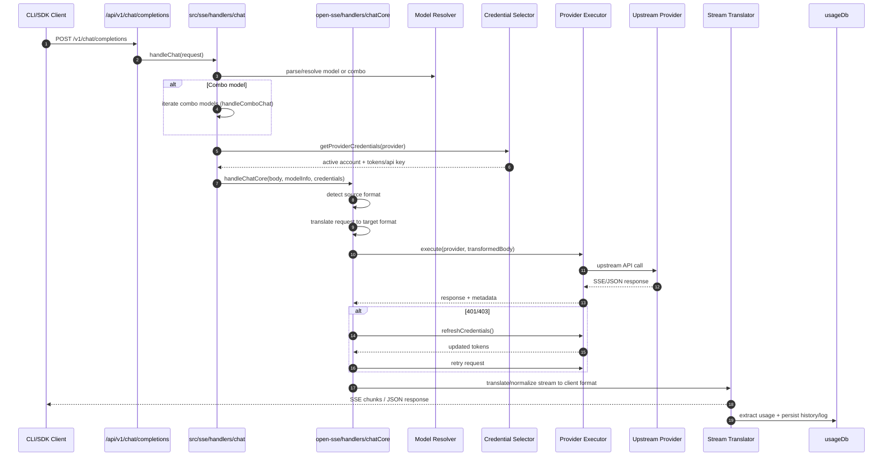
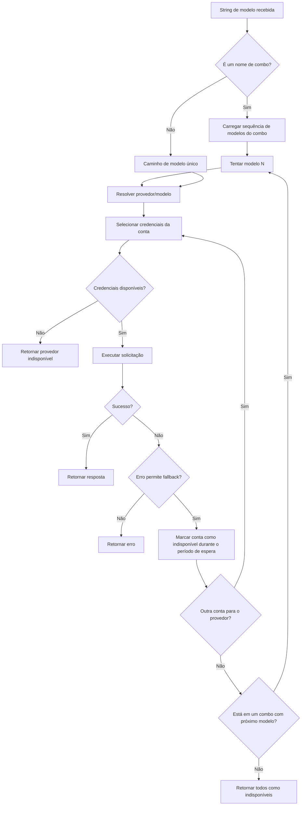
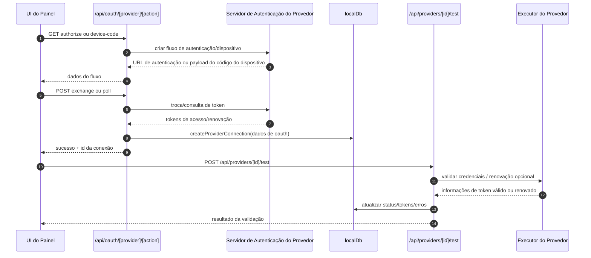
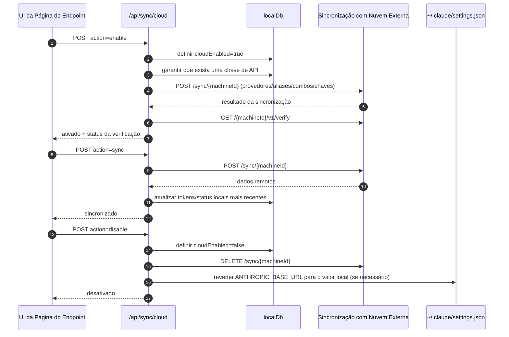
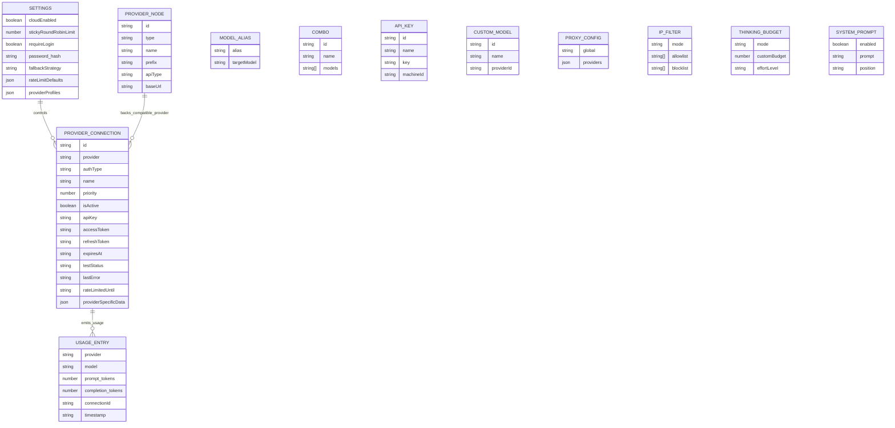
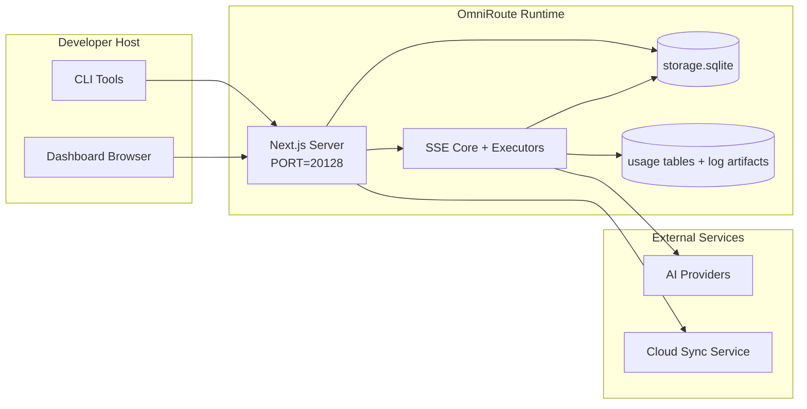

# OmniRoute Architecture (Português (Brasil))

🌐 **Languages:** 🇺🇸 [English](../../../../architecture/ARCHITECTURE.md) · 🇪🇹 [am](../../../am/docs/architecture/ARCHITECTURE.md) · 🇸🇦 [ar](../../../ar/docs/architecture/ARCHITECTURE.md) · 🇦🇿 [az](../../../az/docs/architecture/ARCHITECTURE.md) · 🇧🇬 [bg](../../../bg/docs/architecture/ARCHITECTURE.md) · 🇧🇩 [bn](../../../bn/docs/architecture/ARCHITECTURE.md) · 🇧🇦 [bs](../../../bs/docs/architecture/ARCHITECTURE.md) · 🇨🇿 [cs](../../../cs/docs/architecture/ARCHITECTURE.md) · 🇩🇰 [da](../../../da/docs/architecture/ARCHITECTURE.md) · 🇩🇪 [de](../../../de/docs/architecture/ARCHITECTURE.md) · 🇬🇷 [el](../../../el/docs/architecture/ARCHITECTURE.md) · 🇪🇸 [es](../../../es/docs/architecture/ARCHITECTURE.md) · 🇪🇪 [et](../../../et/docs/architecture/ARCHITECTURE.md) · 🇮🇷 [fa](../../../fa/docs/architecture/ARCHITECTURE.md) · 🇫🇮 [fi](../../../fi/docs/architecture/ARCHITECTURE.md) · 🇫🇷 [fr](../../../fr/docs/architecture/ARCHITECTURE.md) · 🇮🇪 [ga](../../../ga/docs/architecture/ARCHITECTURE.md) · 🇮🇳 [gu](../../../gu/docs/architecture/ARCHITECTURE.md) · 🇳🇬 [ha](../../../ha/docs/architecture/ARCHITECTURE.md) · 🇮🇱 [he](../../../he/docs/architecture/ARCHITECTURE.md) · 🇮🇳 [hi](../../../hi/docs/architecture/ARCHITECTURE.md) · 🇭🇷 [hr](../../../hr/docs/architecture/ARCHITECTURE.md) · 🇭🇺 [hu](../../../hu/docs/architecture/ARCHITECTURE.md) · 🇦🇲 [hy](../../../hy/docs/architecture/ARCHITECTURE.md) · 🇮🇩 [id](../../../id/docs/architecture/ARCHITECTURE.md) · 🇳🇬 [ig](../../../ig/docs/architecture/ARCHITECTURE.md) · 🇮🇹 [it](../../../it/docs/architecture/ARCHITECTURE.md) · 🇯🇵 [ja](../../../ja/docs/architecture/ARCHITECTURE.md) · 🇬🇪 [ka](../../../ka/docs/architecture/ARCHITECTURE.md) · 🇰🇭 [km](../../../km/docs/architecture/ARCHITECTURE.md) · 🇮🇳 [kn](../../../kn/docs/architecture/ARCHITECTURE.md) · 🇰🇷 [ko](../../../ko/docs/architecture/ARCHITECTURE.md) · 🇱🇹 [lt](../../../lt/docs/architecture/ARCHITECTURE.md) · 🇱🇻 [lv](../../../lv/docs/architecture/ARCHITECTURE.md) · 🇮🇳 [ml](../../../ml/docs/architecture/ARCHITECTURE.md) · 🇮🇳 [mr](../../../mr/docs/architecture/ARCHITECTURE.md) · 🇲🇾 [ms](../../../ms/docs/architecture/ARCHITECTURE.md) · 🇲🇹 [mt](../../../mt/docs/architecture/ARCHITECTURE.md) · 🇲🇲 [my](../../../my/docs/architecture/ARCHITECTURE.md) · 🇳🇵 [ne](../../../ne/docs/architecture/ARCHITECTURE.md) · 🇳🇱 [nl](../../../nl/docs/architecture/ARCHITECTURE.md) · 🇳🇴 [no](../../../no/docs/architecture/ARCHITECTURE.md) · 🇮🇳 [or](../../../or/docs/architecture/ARCHITECTURE.md) · 🇮🇳 [pa](../../../pa/docs/architecture/ARCHITECTURE.md) · 🇵🇭 [phi](../../../phi/docs/architecture/ARCHITECTURE.md) · 🇵🇱 [pl](../../../pl/docs/architecture/ARCHITECTURE.md) · 🇵🇹 [pt](../../../pt/docs/architecture/ARCHITECTURE.md) · 🇷🇴 [ro](../../../ro/docs/architecture/ARCHITECTURE.md) · 🇷🇺 [ru](../../../ru/docs/architecture/ARCHITECTURE.md) · 🇱🇰 [si](../../../si/docs/architecture/ARCHITECTURE.md) · 🇸🇰 [sk](../../../sk/docs/architecture/ARCHITECTURE.md) · 🇸🇮 [sl](../../../sl/docs/architecture/ARCHITECTURE.md) · 🇷🇸 [sr](../../../sr/docs/architecture/ARCHITECTURE.md) · 🇸🇪 [sv](../../../sv/docs/architecture/ARCHITECTURE.md) · 🇰🇪 [sw](../../../sw/docs/architecture/ARCHITECTURE.md) · 🇮🇳 [ta](../../../ta/docs/architecture/ARCHITECTURE.md) · 🇮🇳 [te](../../../te/docs/architecture/ARCHITECTURE.md) · 🇹🇭 [th](../../../th/docs/architecture/ARCHITECTURE.md) · 🇹🇷 [tr](../../../tr/docs/architecture/ARCHITECTURE.md) · 🇺🇦 [uk-UA](../../../uk-UA/docs/architecture/ARCHITECTURE.md) · 🇵🇰 [ur](../../../ur/docs/architecture/ARCHITECTURE.md) · 🇺🇿 [uz](../../../uz/docs/architecture/ARCHITECTURE.md) · 🇻🇳 [vi](../../../vi/docs/architecture/ARCHITECTURE.md) · 🇳🇬 [yo](../../../yo/docs/architecture/ARCHITECTURE.md) · 🇨🇳 [zh-CN](../../../zh-CN/docs/architecture/ARCHITECTURE.md) · 🇹🇼 [zh-TW](../../../zh-TW/docs/architecture/ARCHITECTURE.md)

---

🌐 **Languages:** 🇺🇸 [English](../../../../architecture/ARCHITECTURE.md) · 🇪🇹 [am](../../../am/docs/architecture/ARCHITECTURE.md) · 🇸🇦 [ar](../../../ar/docs/architecture/ARCHITECTURE.md) · 🇦🇿 [az](../../../az/docs/architecture/ARCHITECTURE.md) · 🇧🇬 [bg](../../../bg/docs/architecture/ARCHITECTURE.md) · 🇧🇩 [bn](../../../bn/docs/architecture/ARCHITECTURE.md) · 🇧🇦 [bs](../../../bs/docs/architecture/ARCHITECTURE.md) · 🇨🇿 [cs](../../../cs/docs/architecture/ARCHITECTURE.md) · 🇩🇰 [da](../../../da/docs/architecture/ARCHITECTURE.md) · 🇩🇪 [de](../../../de/docs/architecture/ARCHITECTURE.md) · 🇬🇷 [el](../../../el/docs/architecture/ARCHITECTURE.md) · 🇪🇸 [es](../../../es/docs/architecture/ARCHITECTURE.md) · 🇪🇪 [et](../../../et/docs/architecture/ARCHITECTURE.md) · 🇮🇷 [fa](../../../fa/docs/architecture/ARCHITECTURE.md) · 🇫🇮 [fi](../../../fi/docs/architecture/ARCHITECTURE.md) · 🇫🇷 [fr](../../../fr/docs/architecture/ARCHITECTURE.md) · 🇮🇪 [ga](../../../ga/docs/architecture/ARCHITECTURE.md) · 🇮🇳 [gu](../../../gu/docs/architecture/ARCHITECTURE.md) · 🇳🇬 [ha](../../../ha/docs/architecture/ARCHITECTURE.md) · 🇮🇱 [he](../../../he/docs/architecture/ARCHITECTURE.md) · 🇮🇳 [hi](../../../hi/docs/architecture/ARCHITECTURE.md) · 🇭🇷 [hr](../../../hr/docs/architecture/ARCHITECTURE.md) · 🇭🇺 [hu](../../../hu/docs/architecture/ARCHITECTURE.md) · 🇦🇲 [hy](../../../hy/docs/architecture/ARCHITECTURE.md) · 🇮🇩 [id](../../../id/docs/architecture/ARCHITECTURE.md) · 🇳🇬 [ig](../../../ig/docs/architecture/ARCHITECTURE.md) · 🇮🇹 [it](../../../it/docs/architecture/ARCHITECTURE.md) · 🇯🇵 [ja](../../../ja/docs/architecture/ARCHITECTURE.md) · 🇬🇪 [ka](../../../ka/docs/architecture/ARCHITECTURE.md) · 🇰🇭 [km](../../../km/docs/architecture/ARCHITECTURE.md) · 🇮🇳 [kn](../../../kn/docs/architecture/ARCHITECTURE.md) · 🇰🇷 [ko](../../../ko/docs/architecture/ARCHITECTURE.md) · 🇱🇹 [lt](../../../lt/docs/architecture/ARCHITECTURE.md) · 🇱🇻 [lv](../../../lv/docs/architecture/ARCHITECTURE.md) · 🇮🇳 [ml](../../../ml/docs/architecture/ARCHITECTURE.md) · 🇮🇳 [mr](../../../mr/docs/architecture/ARCHITECTURE.md) · 🇲🇾 [ms](../../../ms/docs/architecture/ARCHITECTURE.md) · 🇲🇹 [mt](../../../mt/docs/architecture/ARCHITECTURE.md) · 🇲🇲 [my](../../../my/docs/architecture/ARCHITECTURE.md) · 🇳🇵 [ne](../../../ne/docs/architecture/ARCHITECTURE.md) · 🇳🇱 [nl](../../../nl/docs/architecture/ARCHITECTURE.md) · 🇳🇴 [no](../../../no/docs/architecture/ARCHITECTURE.md) · 🇮🇳 [or](../../../or/docs/architecture/ARCHITECTURE.md) · 🇮🇳 [pa](../../../pa/docs/architecture/ARCHITECTURE.md) · 🇵🇭 [phi](../../../phi/docs/architecture/ARCHITECTURE.md) · 🇵🇱 [pl](../../../pl/docs/architecture/ARCHITECTURE.md) · 🇵🇹 [pt](../../../pt/docs/architecture/ARCHITECTURE.md) · 🇷🇴 [ro](../../../ro/docs/architecture/ARCHITECTURE.md) · 🇷🇺 [ru](../../../ru/docs/architecture/ARCHITECTURE.md) · 🇱🇰 [si](../../../si/docs/architecture/ARCHITECTURE.md) · 🇸🇰 [sk](../../../sk/docs/architecture/ARCHITECTURE.md) · 🇸🇮 [sl](../../../sl/docs/architecture/ARCHITECTURE.md) · 🇷🇸 [sr](../../../sr/docs/architecture/ARCHITECTURE.md) · 🇸🇪 [sv](../../../sv/docs/architecture/ARCHITECTURE.md) · 🇰🇪 [sw](../../../sw/docs/architecture/ARCHITECTURE.md) · 🇮🇳 [ta](../../../ta/docs/architecture/ARCHITECTURE.md) · 🇮🇳 [te](../../../te/docs/architecture/ARCHITECTURE.md) · 🇹🇭 [th](../../../th/docs/architecture/ARCHITECTURE.md) · 🇹🇷 [tr](../../../tr/docs/architecture/ARCHITECTURE.md) · 🇺🇦 [uk-UA](../../../uk-UA/docs/architecture/ARCHITECTURE.md) · 🇵🇰 [ur](../../../ur/docs/architecture/ARCHITECTURE.md) · 🇺🇿 [uz](../../../uz/docs/architecture/ARCHITECTURE.md) · 🇻🇳 [vi](../../../vi/docs/architecture/ARCHITECTURE.md) · 🇳🇬 [yo](../../../yo/docs/architecture/ARCHITECTURE.md) · 🇨🇳 [zh-CN](../../../zh-CN/docs/architecture/ARCHITECTURE.md) · 🇹🇼 [zh-TW](../../../zh-TW/docs/architecture/ARCHITECTURE.md)

_Última atualização: 2026-06-28_

## Resumo Executivo

O OmniRoute é um gateway local de roteamento de IA e um painel desenvolvido com Next.js.
Ele fornece um único endpoint compatível com a OpenAI (`/v1/*`) e roteia o tráfego entre vários provedores upstream, com tradução, fallback, renovação de tokens e acompanhamento de uso.

Principais recursos:

- Superfície de API compatível com a OpenAI para CLI/ferramentas (355 provedores, 108 executores)
- Tradução de solicitações/respostas entre formatos de provedores
- Fallback de combinação de modelos (sequência de vários modelos)
- Etapas estruturadas de combinação (`provider + model + connection`) com ordenação em tempo de execução por `compositeTiers`
- Fallback em nível de conta (várias contas por provedor)
- Verificação prévia de cota e seleção de conta P2C baseada em cota no fluxo principal de chat
- Gerenciamento de conexões de provedores via OAuth + chave de API (22 módulos de provedores OAuth)
- Geração de embeddings via `/v1/embeddings` (18 provedores)
- Geração de imagens via `/v1/images/generations` (mais de 10 provedores, mais de 20 modelos)
- Transcrição de áudio via `/v1/audio/transcriptions` (18 provedores)
- Conversão de texto em fala via `/v1/audio/speech` (24 provedores integrados)
- Geração de vídeo via `/v1/videos/generations` (ComfyUI + SD WebUI)
- Geração de música via `/v1/music/generations` (ComfyUI)
- Pesquisa na web via `/v1/search` (20 provedores)
- Moderações via `/v1/moderations`
- Reclassificação via `/v1/rerank`
- Análise de tags de pensamento (`<think>...</think>`) para modelos de raciocínio
- Sanitização de respostas para compatibilidade estrita com o SDK da OpenAI
- Normalização de funções (developer→system, system→user) para compatibilidade entre provedores
- Conversão de saída estruturada (json_schema → Gemini responseSchema)
- Persistência local de provedores, chaves, aliases, combinações, configurações e preços (122 módulos de banco de dados)
- Acompanhamento de uso/custos e registro de solicitações
- Sincronização opcional na nuvem para sincronizar estados entre vários dispositivos
- Lista de permissões/bloqueios de IPs para controle de acesso à API
- Gerenciamento de orçamento de pensamento (passthrough/auto/custom/adaptive)
- Injeção global de prompt do sistema
- Rastreamento e identificação por impressão digital de sessões
- Limitação de taxa aprimorada por conta, com perfis específicos de cada provedor
- Padrão de disjuntor para resiliência dos provedores
- Proteção contra efeito manada com bloqueio por mutex
- Cache de desduplicação de solicitações baseado em assinatura
- Camada de domínio: regras de custo, política de fallback e política de bloqueio
- Context Relay: resumos de transferência de sessão para manter a continuidade durante a rotação de contas
- Persistência do estado do domínio (cache SQLite com gravação imediata para fallbacks, orçamentos, bloqueios e disjuntores)
- Mecanismo de políticas para avaliação centralizada de solicitações (bloqueio → orçamento → fallback)
- Telemetria de solicitações com agregação de latência p50/p95/p99
- Telemetria de destinos de combinação e integridade histórica dos destinos via `combo_execution_key` / `combo_step_id`
- ID de correlação (X-Request-Id) para rastreamento de ponta a ponta
- Registro de auditoria de conformidade com opção de desativação por chave de API
- Framework de avaliação para garantia da qualidade de LLMs
- Painel de integridade com status em tempo real dos disjuntores dos provedores
- Servidor MCP (110 ferramentas) com 3 transportes (stdio/SSE/Streamable HTTP)
- Servidor A2A (JSON-RPC 2.0 + SSE) com habilidades e ciclo de vida de tarefas
- Sistema de memória (extração, injeção, recuperação e sumarização)
- Sistema de habilidades (registro, executor, sandbox e habilidades integradas)
- Proxy MITM com gerenciamento de certificados e tratamento de DNS
- Middleware de proteção contra injeção de prompts
- Pipeline de compactação de prompts com Caveman, RTK, pipelines empilhados, combinações de compactação, pacotes de idiomas e análises
- Registro ACP (Agent Communication Protocol)
- Provedores OAuth modulares (22 módulos individuais em `src/lib/oauth/providers/`)
- Scripts de desinstalação/desinstalação completa
- Ação de reparo do ambiente OAuth
- Ponte WebSocket para clientes WS compatíveis com a OpenAI (`/v1/ws`)
- Gerenciamento de tokens de sincronização (emissão/revogação e download de pacote de configuração versionado por ETag)
- GLM Thinking (`glmt`) como predefinição de provedor de primeira classe
- Contagem híbrida de tokens (`/messages/count_tokens` no lado do provedor, com fallback para estimativa)
- Preenchimento automático de aliases de modelos (mais de 30 normalizações entre dialetos de proxies durante a inicialização)
- Fetch de saída seguro, com proteção contra SSRF, bloqueio de URLs privadas e novas tentativas configuráveis
- Novas tentativas de chat cientes do período de espera, com `requestRetry` e `maxRetryIntervalSec` configuráveis
- Validação do ambiente de execução com Zod durante a inicialização
- Auditoria de conformidade v2 com paginação, eventos CRUD de provedores e registro de validações bloqueadas por SSRF

Modelo principal de execução:

- As rotas de aplicativo Next.js em `src/app/api/*` implementam tanto as APIs do painel quanto as APIs de compatibilidade
- Um núcleo compartilhado de SSE/roteamento em `src/sse/*` + `open-sse/*` gerencia a execução dos provedores, tradução, streaming, fallback e uso

## Diagramas de Referência

As fontes Mermaid canônicas e controladas por versão da plataforma v3.8.0 estão em
[`docs/diagrams/`](../diagrams/README.md). Duas delas são reproduzidas abaixo para orientação;
as demais estão vinculadas em seus guias específicos de domínio.


> Fonte: [diagrams/request-pipeline.mmd](../diagrams/request-pipeline.mmd)


> Fonte: [diagrams/resilience-3layers.mmd](../diagrams/resilience-3layers.mmd) — também vinculado a partir de
> [RESILIENCE_GUIDE.md](./RESILIENCE_GUIDE.md) e da referência de resiliência `CLAUDE.md`.

## Escopo e Limites

### Dentro do Escopo

- Runtime do gateway local
- APIs de gerenciamento do dashboard
- Autenticação de provedores e renovação de tokens
- Tradução de requisições e streaming SSE
- Estado local + persistência de uso
- Orquestração opcional de sincronização com a nuvem

### Fora do Escopo

- Implementação do serviço de nuvem por trás de `NEXT_PUBLIC_CLOUD_URL`
- SLA/plano de controle do provedor fora do processo local
- Os próprios binários de CLI externos (Claude CLI, Codex CLI etc.)

## Superfície do Dashboard (Atual)

Páginas principais em `src/app/(dashboard)/dashboard/`:

- `/dashboard` — início rápido + visão geral dos provedores
- `/dashboard/endpoint` — proxy de endpoint + MCP + A2A + abas de endpoints de API
- `/dashboard/providers` — conexões e credenciais de provedores
- `/dashboard/combos` — estratégias de combos, modelos, construtor baseado em etapas, regras de roteamento de modelos e ordenação manual persistida
- `/dashboard/auto-combo` — Auto Combo Engine: pesos de pontuação, pacotes de modos, predefinições de fábrica virtual e telemetria
- `/dashboard/costs` — agregação de custos e visibilidade de preços
- `/dashboard/analytics` — análise de uso, avaliações e integridade dos destinos de combos
- `/dashboard/limits` — controles de cota/taxa
- `/dashboard/cli-tools` — integração inicial da CLI, detecção de runtime e geração de configuração
- `/dashboard/agents` — agentes ACP detectados + registro de agentes personalizados
- `/dashboard/cloud-agents` — tarefas de agentes hospedados na nuvem (Codex Cloud, Devin, Jules) e ciclo de vida das tarefas
- `/dashboard/skills` — registro de habilidades A2A, execução em sandbox e catálogo de habilidades integradas
- `/dashboard/memory` — inspeção e recuperação de memória conversacional persistente
- `/dashboard/webhooks` — assinaturas de webhooks de saída, rotação de segredos e estatísticas de novas tentativas
- `/dashboard/batch` — envio de trabalhos em lote e progresso
- `/dashboard/cache` — estatísticas de cache de leitura e raciocínio, controles de remoção
- `/dashboard/playground` — playground de chat interativo com qualquer combo/modelo configurado
- `/dashboard/changelog` — visualizador de changelog no aplicativo (renderiza `CHANGELOG.md`)
- `/dashboard/system` — diagnósticos de runtime, informações de versão e interface de validação do ambiente
- `/dashboard/onboarding` — assistente de configuração de primeira execução para novas instalações
- `/dashboard/media` — playground de imagem/vídeo/música
- `/dashboard/search-tools` — testes de provedores de busca e histórico
- `/dashboard/health` — tempo de atividade, circuit breakers, limites de taxa e sessões com monitoramento de cota
- `/dashboard/logs` — logs de requisições/proxy/auditoria/console
- `/dashboard/settings` — abas de configurações do sistema (gerais, roteamento, padrões de combos etc.)
- `/dashboard/context/caveman` — regras de compressão Caveman, pacotes de idiomas, pré-visualização e modo de saída
- `/dashboard/context/rtk` — filtros de saída de comandos RTK, pré-visualização e configurações de segurança de runtime
- `/dashboard/context/combos` — pipelines de compressão nomeados atribuídos a combos de roteamento
- `/dashboard/translator` — inspeção do tradutor e pré-visualização da conversão do formato de requisições
- `/dashboard/audit` — navegador de logs de auditoria de conformidade com paginação e metadados estruturados
- `/dashboard/usage` — navegador de uso por requisição vinculado a `usage_history`
- `/dashboard/compression` — análise de compressão, estatísticas e atribuição de pipelines
- `/dashboard/api-manager` — ciclo de vida de chaves de API e permissões de modelos

## Contexto de Alto Nível do Sistema



## Componentes Principais de Runtime

## 1) Camada de API e Roteamento (Rotas de Aplicativo do Next.js)

Diretórios principais:

- `src/app/api/v1/*` e `src/app/api/v1beta/*` para APIs de compatibilidade
- `src/app/api/*` para APIs de gerenciamento/configuração
- As reescritas do Next em `next.config.mjs` mapeiam `/v1/*` para `/api/v1/*`

Rotas de compatibilidade importantes:

- `src/app/api/v1/chat/completions/route.ts`
- `src/app/api/v1/messages/route.ts`
- `src/app/api/v1/responses/route.ts`
- `src/app/api/v1/models/route.ts` — inclui modelos personalizados com `custom: true`
- `src/app/api/v1/embeddings/route.ts` — geração de embeddings (6 provedores)
- `src/app/api/v1/images/generations/route.ts` — geração de imagens (mais de 4 provedores, incluindo Antigravity/Nebius)
- `src/app/api/v1/messages/count_tokens/route.ts`
- `src/app/api/v1/providers/[provider]/chat/completions/route.ts` — chat dedicado por provedor
- `src/app/api/v1/providers/[provider]/embeddings/route.ts` — embeddings dedicados por provedor
- `src/app/api/v1/providers/[provider]/images/generations/route.ts` — imagens dedicadas por provedor
- `src/app/api/v1beta/models/route.ts`
- `src/app/api/v1beta/models/[...path]/route.ts`

Domínios de gerenciamento:

- Autenticação/configurações: `src/app/api/auth/*`, `src/app/api/settings/*`
- Provedores/conexões: `src/app/api/providers*`
- Nós de provedores: `src/app/api/provider-nodes*`
- Modelos personalizados: `src/app/api/provider-models` (GET/POST/DELETE)
- Catálogo de modelos: `src/app/api/models/route.ts` (GET)
- Configuração de proxy: `src/app/api/settings/proxy` (GET/PUT/DELETE) + `src/app/api/settings/proxy/test` (POST)
- OAuth: `src/app/api/oauth/*`
- Chaves/aliases/combos/preços: `src/app/api/keys*`, `src/app/api/models/alias`, `src/app/api/combos*`, `src/app/api/pricing`
- Uso: `src/app/api/usage/*`
- Sincronização/nuvem: `src/app/api/sync/*`, `src/app/api/cloud/*`
- Auxiliares de ferramentas de CLI: `src/app/api/cli-tools/*`
- Filtro de IP: `src/app/api/settings/ip-filter` (GET/PUT)
- Orçamento de raciocínio: `src/app/api/settings/thinking-budget` (GET/PUT)
- Prompt do sistema: `src/app/api/settings/system-prompt` (GET/PUT)
- Compressão: `src/app/api/settings/compression`, `src/app/api/compression/*` e
  `src/app/api/context/*`
- Sessões: `src/app/api/sessions` (GET)
- Limites de taxa: `src/app/api/rate-limits` (GET)
- Resiliência: `src/app/api/resilience` (GET/PATCH) — configuração da fila de solicitações, período de espera de conexão, disjuntor de provedor e espera pelo período de recuperação
- Redefinição de resiliência: `src/app/api/resilience/reset` (POST) — redefine os disjuntores dos provedores
- Estatísticas de cache: `src/app/api/cache/stats` (GET/DELETE)
- Telemetria: `src/app/api/telemetry/summary` (GET)
- Orçamento: `src/app/api/usage/budget` (GET/POST)
- Cadeias de fallback: `src/app/api/fallback/chains` (GET/POST/DELETE)
- Auditoria de conformidade: `src/app/api/compliance/audit-log` (GET, com paginação + metadados estruturados)
- Avaliações: `src/app/api/evals` (GET/POST), `src/app/api/evals/[suiteId]` (GET)
- Políticas: `src/app/api/policies` (GET/POST)
- Tokens de sincronização: `src/app/api/sync/tokens` (GET/POST), `src/app/api/sync/tokens/[id]` (GET/DELETE)
- Pacote de configuração: `src/app/api/sync/bundle` (GET, snapshot de configurações/provedores/combos/chaves versionado por ETag)
- WebSocket: `src/app/api/v1/ws/route.ts` — manipulador de Upgrade para clientes WS compatíveis com OpenAI

## 2) SSE + Núcleo de Tradução

Módulos do fluxo principal:

- Entrada: `src/sse/handlers/chat.ts`
- Orquestração principal: `open-sse/handlers/chatCore.ts`
- Adaptadores de execução de provedores: `open-sse/executors/*`
- Detecção de formato/configuração de provedores: `open-sse/services/provider.ts`
- Análise/resolução de modelos: `src/sse/services/model.ts`, `open-sse/services/model.ts`
- Lógica de fallback de contas: `open-sse/services/accountFallback.ts`
- Registro de tradução: `open-sse/translator/index.ts`
- Transformações de stream: `open-sse/utils/stream.ts`, `open-sse/utils/streamHandler.ts`
- Extração/normalização de uso: `open-sse/utils/usageTracking.ts`
- Analisador de tags de raciocínio: `open-sse/utils/thinkTagParser.ts`
- Manipulador de embeddings: `open-sse/handlers/embeddings.ts`
- Registro de provedores de embeddings: `open-sse/config/embeddingRegistry.ts`
- Manipulador de geração de imagens: `open-sse/handlers/imageGeneration.ts`
- Registro de provedores de imagens: `open-sse/config/imageRegistry.ts`
- Sanitização de respostas: `open-sse/handlers/responseSanitizer.ts`
- Normalização de papéis: `open-sse/services/roleNormalizer.ts`

Serviços (lógica de negócios):

- Seleção/pontuação de contas: `open-sse/services/accountSelector.ts`
- Gerenciamento do ciclo de vida do contexto: `open-sse/services/contextManager.ts`
- Aplicação de filtros de IP: `open-sse/services/ipFilter.ts`
- Rastreamento de sessões: `open-sse/services/sessionManager.ts`
- Desduplicação de requisições: `open-sse/services/signatureCache.ts`
- Injeção de prompt de sistema: `open-sse/services/systemPrompt.ts`
- Gerenciamento do orçamento de raciocínio: `open-sse/services/thinkingBudget.ts`
- Roteamento de modelos com curingas: `open-sse/services/wildcardRouter.ts`
- Gerenciamento de limites de taxa: `open-sse/services/rateLimitManager.ts`
- Disjuntor: `src/shared/utils/circuitBreaker.ts`
- Transferência de contexto: `open-sse/services/contextHandoff.ts` — geração e injeção de resumo de transferência para a estratégia de retransmissão de contexto
- Compressão: `open-sse/services/compression/*` — compressão proativa antes da tradução para o provedor;
  inclui regras Caveman, filtros RTK, pipelines empilhados, combinações de compressão, estatísticas e validação
- Buscador de cota do Codex: `open-sse/services/codexQuotaFetcher.ts` — busca a cota do Codex para decisões de transferência por retransmissão de contexto
- Nova tentativa com reconhecimento de período de espera: `src/sse/services/cooldownAwareRetry.ts` — novas tentativas por modelo durante o período de espera, com `requestRetry` / `maxRetryIntervalSec` configuráveis
- Busca externa segura: `src/shared/network/safeOutboundFetch.ts` — busca protegida de provedores/modelos com proteção contra SSRF, bloqueio de URLs privadas, novas tentativas e tempo limite
- Proteção de URLs externas: `src/shared/network/outboundUrlGuard.ts` — valida URLs de provedores em relação a intervalos CIDR privados/localhost
- Padrões de requisição de provedores: `open-sse/services/providerRequestDefaults.ts` — valores padrão de `maxTokens`, `temperature` e `thinkingBudgetTokens` por provedor
- Constantes do provedor GLM: `open-sse/config/glmProvider.ts` — modelos GLM, URLs de cota e valores padrão/tempo limite do GLMT compartilhados
- Upstream do Antigravity: `open-sse/config/antigravityUpstream.ts` — constantes da URL base e do caminho de descoberta
- Constantes do cliente Codex: `open-sse/config/codexClient.ts` — valores versionados de agente do usuário e versão do cliente
- Semente de aliases de modelos: `src/lib/modelAliasSeed.ts` — inicializa mais de 30 aliases de dialetos entre proxies na inicialização

Módulos da camada de domínio:

- Regras de custo/orçamentos: `src/domain/costRules.ts`
- Política de fallback: `src/domain/fallbackPolicy.ts`
- Resolvedor de combinações: `src/domain/comboResolver.ts`
- Política de bloqueio: `src/domain/lockoutPolicy.ts`
- Mecanismo de políticas: `src/domain/policyEngine.ts` — avaliação centralizada de bloqueio → orçamento → fallback
- Catálogo de códigos de erro: `src/shared/constants/errorCodes.ts`
- ID da requisição: `src/shared/utils/requestId.ts`
- Tempo limite de busca: `src/shared/utils/fetchTimeout.ts`
- Telemetria de requisições: `src/shared/utils/requestTelemetry.ts`
- Conformidade/auditoria: `src/lib/compliance/index.ts`
- Executor de avaliações: `src/lib/evals/evalRunner.ts`
- Persistência do estado do domínio: `src/lib/db/domainState.ts` — CRUD em SQLite para cadeias de fallback, orçamentos, histórico de custos, estado de bloqueio e disjuntores

Módulos de provedores OAuth (22 arquivos individuais em `src/lib/oauth/providers/`):

- Índice do registro: `src/lib/oauth/providers/index.ts`
- Provedores individuais: `agy.ts`, `antigravity.ts`, `claude.ts`, `cline.ts`, `codebuddy-cn.ts`, `codex.ts`, `cursor.ts`, `devin-desktop.ts`, `ghe-copilot.ts`, `github.ts`, `gitlab-duo.ts`, `grok-cli-oauth.ts`, `grok-cli.ts`, `kilocode.ts`, `kimi-coding.ts`, `kiro.ts`, `openference.ts`, `qoder.ts`, `trae.ts`, `xai-oauth.ts`, `zed-hosted.ts`, `zed.ts`
- Wrapper fino: `src/lib/oauth/providers.ts` — reexporta a partir dos módulos individuais

## 5) Serviços Incorporados (v3.8.4)

O OmniRoute pode instalar, supervisionar e rotear para processos de ferramentas de IA executados localmente,
chamados de **serviços incorporados**. Cinco são fornecidos: 9Router, CLIProxyAPI, Bifrost, Mux e Dario.

Camadas da arquitetura:

- **UI** (`/dashboard/providers/services`) — página com duas abas, controles de ciclo de vida,
  streaming de logs em tempo real, gerenciamento de chaves de API e (para o 9Router) uma UI nativa incorporada por meio
  de um proxy reverso interno.
- **API** (`/api/services/{name}/*`) — 11 endpoints para o 9Router, 10 para o CLIProxyAPI, 8 para cada um de Bifrost / Mux / Dario,
  todos classificados como **LOCAL_ONLY** (regra rígida nº 17). Um endpoint SSE compartilhado `GET /api/services/[name]/logs`
  atende a ambos os serviços.
- **Supervisor** (`src/lib/services/`) — a classe genérica `ServiceSupervisor` encapsula
  `child_process.spawn`, mantém um buffer circular de 5 MB para streaming de logs via SSE, um loop de
  sondagem de integridade, um bloqueio atômico de operações e um encerramento gradual SIGTERM→SIGKILL.
  `bootstrap.ts` conecta todos os serviços configurados na inicialização do processo.
- **Provedor/executor** (`open-sse/executors/ninerouter.ts`) — o 9Router é exposto como
  um provedor real. Os modelos recebem o prefixo `9router/{sub}/{model}` e são sincronizados a cada 5 min
  pelo endpoint `/v1/models` do 9Router.

Análise detalhada: `docs/frameworks/EMBEDDED-SERVICES.md`

## Principais Subsistemas (v3.8.0)

### A. Mecanismo Auto Combo

O Auto Combo pontua e seleciona dinamicamente os destinos de roteamento no momento da solicitação, em vez de
depender de uma definição estática de combo. Ele é responsável pela família de prefixos de modelo `auto/*`.

- Entrada do mecanismo: `open-sse/services/autoCombo/` (`autoComboEngine.ts`,
  `scoringEngine.ts`, `virtualFactory.ts`, `modePacks.ts`)
- Resolvedor: `src/domain/comboResolver.ts` (detecção automática do prefixo `auto/`)
- Painel: `/dashboard/auto-combo`
- Telemetria: tabela SQLite `auto_combo_decisions`

Principais recursos:

- **19 estratégias de roteamento** (prioridade, ponderado, preencher primeiro, round-robin, P2C, aleatório,
  menos usado, otimizado por custo, ciente de redefinição, janela de redefinição, margem disponível, aleatório estrito,
  **auto**, lkgp, otimizado por contexto, retransmissão de contexto, **fusion**, além de um caminho de fallback) —
  auto é a principal adição na v3.8.0; `fusion` (distribuição para painel + síntese por juiz,
  `open-sse/services/fusion.ts`) é novidade na v3.8.36.
- **Pontuação com 16 fatores**: cota, integridade, custo inverso, latência inversa, adequação à tarefa e
  mais dez. A tabela canônica de fatores e seus pesos padrão está em
  [`docs/routing/AUTO-COMBO.md`](../routing/AUTO-COMBO.md) — repeti-la aqui
  criaria um segundo lugar onde ela poderia ficar desatualizada.
- **Fábrica virtual** materializa combos efêmeros quando não existe um combo nomeado correspondente,
  obtendo candidatos de conexões de provedores ativas e íntegras.
- **Prefixos automáticos**: `auto/coding`, `auto/cheap`, `auto/fast`, `auto/offline`,
  `auto/smart`, `auto/lkgp` — cada um baseado em um perfil de pesos ajustado.
- **6 pacotes de modos**: `ship-fast`, `cost-saver`, `quality-first`, `offline-friendly`,
  `reliability-first` e `chaos-mode` — configurações predefinidas de pesos acionáveis pelo
  painel. (Não devem ser confundidos com os prefixos `auto/*` acima, que são
  variantes aplicadas no momento da solicitação.)

Para obter detalhes completos do algoritmo (fórmulas dos fatores, ajuste de pesos), consulte
[`docs/routing/AUTO-COMBO.md`](../routing/AUTO-COMBO.md).

### B. Agentes de Nuvem

O Cloud Agents encapsula plataformas hospedadas de agentes de código de terceiros (Codex Cloud, Devin,
Jules) por trás de um ciclo de vida uniforme de tarefas apoiado por banco de dados. Todos os endpoints de criação/inspeção
de tarefas exigem autenticação de gerenciamento.

- Raiz do módulo: `src/lib/cloudAgent/` (`baseAgent.ts`, `registry.ts`, `api.ts`,
  `types.ts`, `db.ts`, além de subdiretórios específicos de cada agente em `agents/`)
- Implementações específicas de cada agente: `agents/codex/`, `agents/devin/`, `agents/jules/`
- Endpoints públicos: `/api/v1/agents/tasks/*` (listar/criar/obter/cancelar)
- Endpoints de gerenciamento: `/api/cloud/*` (provisionamento, status, lote)
- Painel: `/dashboard/cloud-agents`
- Armazenamento: tabela `cloud_agent_tasks`

Para obter detalhes específicos de provisionamento e OAuth de cada agente, consulte
[`docs/frameworks/CLOUD_AGENT.md`](../frameworks/CLOUD_AGENT.md).

### C. Proteções

O módulo de proteções é uma camada de middleware com recarregamento dinâmico que inspeciona solicitações
e respostas em busca de PII, injeção de prompt e conteúdo visual inseguro. As violações
interrompem imediatamente a solicitação com HTTP **503** e um código de erro estruturado, permitindo
que os chamadores subsequentes tentem novamente ou sigam outro fluxo.

- Raiz do módulo: `src/lib/guardrails/` (`base.ts`, `registry.ts`, `piiMasker.ts`,
  `promptInjection.ts`, `visionBridge.ts`, `visionBridgeHelpers.ts`)
- Recarregamento dinâmico: o registro monitora alterações na configuração e reconstrói a cadeia no local
- Pontos de integração: entrada do manipulador de chat, manipulador de geração de imagens, sanitizador de respostas
- Contrato HTTP: as violações são apresentadas como `503` com `error.code = "GUARDRAIL_VIOLATION"`

Para criação de conjuntos de regras e ajuste de limites, consulte
[`docs/security/GUARDRAILS.md`](../security/GUARDRAILS.md).

### D. Camada de Domínio

O namespace `src/domain/` centraliza decisões de política para que os manipuladores de rotas não
precisem montar por conta própria a lógica de bloqueio/orçamento/fallback.

- Mecanismo de políticas: `src/domain/policyEngine.ts` — ponto de entrada único para
  avaliação pré-execução (ordem: bloqueio → orçamento → fallback)
- Regras de custo: `src/domain/costRules.ts`
- Política de fallback: `src/domain/fallbackPolicy.ts`
- Política de bloqueio: `src/domain/lockoutPolicy.ts`
- Roteamento baseado em tags: `src/domain/tagRouter.ts`
- Resolvedor de combos: `src/domain/comboResolver.ts` — resolve nomes de combos, prefixos auto/\*
  e destinos de modelos com curingas em planos concretos de execução
- Associador de regras de conexão/modelo: `src/domain/connectionModelRules.ts`
- Instantâneos de disponibilidade de modelos: `src/domain/modelAvailability.ts`
- Rastreamento de expiração de provedores: `src/domain/providerExpiration.ts`
- Cache de cotas: `src/domain/quotaCache.ts`
- Estado de degradação: `src/domain/degradation.ts`
- Auditoria de configuração: `src/domain/configAudit.ts`
- Construtor de metadados de resposta do OmniRoute: `src/domain/omnirouteResponseMeta.ts`
- Subsistema de avaliação: `src/domain/assessment/` — tarefas periódicas de avaliação

### E. Pipeline de Autorização

A classe do pipeline de autorização classifica cada solicitação recebida e aplica a
cadeia de políticas apropriada antes do encaminhamento.

- Entrada do pipeline: `src/server/authz/pipeline.ts`
- Classificador de solicitações: `src/server/authz/classify.ts` — distingue rotas públicas
  de compatibilidade das rotas de gerenciamento
- Inventário de rotas públicas: `src/shared/constants/publicApiRoutes.ts`
- Políticas: `src/server/authz/policies/` — predicados combináveis
  (`requireApiKey`, `requireManagement`, `requireFreshAuth` etc.)
- Utilitários de cabeçalho: `src/server/authz/headers.ts`
- Auxiliar de asserção: `src/server/authz/assertAuth.ts`
- Contexto da solicitação: `src/server/authz/context.ts`

As rotas públicas e de gerenciamento têm uma separação rígida: APIs de
agente/cooldown e mutações de provedores exigem autenticação de gerenciamento
(HTTP 401 caso ausente).

Para conferir todas as regras de classificação de rotas, consulte
[`docs/architecture/AUTHZ_GUIDE.md`](./AUTHZ_GUIDE.md).

### F. FSM de fluxo de trabalho e roteador sensível a tarefas

Um roteador orientado por máquina de estados finitos, disposto acima da seleção
de combos para direcionar o tráfego com base na etapa detectada do fluxo de
trabalho (planejamento, execução, revisão) e na afinidade com tarefas em segundo
plano.

- FSM de fluxo de trabalho: `open-sse/services/workflowFSM.ts`
- Roteador sensível a tarefas: `open-sse/services/taskAwareRouter.ts`
- Detector de tarefas em segundo plano: `open-sse/services/backgroundTaskDetector.ts`
- Classificador de intenção: `open-sse/services/intentClassifier.ts`

As transições da FSM alimentam a pontuação do Auto Combo, favorecendo modelos
mais econômicos para tarefas em segundo plano/de automação e modelos mais
avançados para interações de planejamento/revisão.

### G. Resiliência específica por provedor

Diversos provedores incluem módulos dedicados de resiliência e dissimulação que
se apoiam nas camadas globais de circuit breaker / cooldown de conexão / bloqueio
de modelo:

- Mecanismo 429 do Antigravity: `open-sse/services/antigravity429Engine.ts` (alterna
  a identidade, remove dados dos cabeçalhos de resposta e controla o rastreamento de
  créditos/versões por meio de `antigravityCredits.ts`, `antigravityHeaderScrub.ts`,
  `antigravityHeaders.ts`, `antigravityIdentity.ts`, `antigravityVersion.ts`)
- Política de cotas do ModelScope: `open-sse/services/modelscopePolicy.ts`
- CCH (Compatibility Channel Handshake) do Claude Code: `open-sse/services/claudeCodeCCH.ts`,
  além de `claudeCodeCompatible.ts`, `claudeCodeConstraints.ts`, `claudeCodeExtraRemap.ts`,
  `claudeCodeToolRemapper.ts`
- Modelagem da impressão digital do Claude Code: `open-sse/services/claudeCodeFingerprint.ts`
- Ofuscação do Claude Code: `open-sse/services/claudeCodeObfuscation.ts`

Para conferir o manual completo de dissimulação e as orientações operacionais,
consulte `docs/security/STEALTH_GUIDE.md` (git; não compilado em `/docs`).

### H. Webhooks, cache de raciocínio e cache de leitura

- **Webhooks** — envio externo de eventos de provedores/contas/tarefas.
  - Despachante: `src/lib/webhookDispatcher.ts`
  - Armazenamento: tabela SQLite `webhooks` (por meio de `src/lib/db/webhooks.ts`)
  - Painel: `/dashboard/webhooks` (assinaturas, segredos, histórico de novas tentativas)
  - Para consultar a taxonomia de eventos e a semântica de novas tentativas, consulte [`docs/frameworks/WEBHOOKS.md`](../frameworks/WEBHOOKS.md).
- **Cache de raciocínio** — blocos de raciocínio reproduzíveis para provedores que emitem
  tokens de pensamento (Claude, GLMT etc.), permitindo que interações consecutivas evitem
  refazer o raciocínio.
  - Camada de banco de dados: `src/lib/db/reasoningCache.ts`
  - Camada de serviço: `open-sse/services/reasoningCache.ts`
  - Para consultar a semântica de reprodução, consulte [`docs/routing/REASONING_REPLAY.md`](../routing/REASONING_REPLAY.md).
- **Cache de leitura** — cache de respostas de curta duração, indexado por assinatura e
  usado para consolidar novas tentativas idênticas de SDKs upstream com falhas.
  - Camada de banco de dados: `src/lib/db/readCache.ts`
  - Endpoint de estatísticas: `GET /api/cache/stats`, painel em `/dashboard/cache`

## 3) Camada de Persistência

Banco de dados de estado principal (SQLite):

- Infraestrutura principal: `src/lib/db/core.ts` (better-sqlite3, migrações, WAL)
- Acesso ao banco de dados: importe módulos específicos de `src/lib/db/*` diretamente (o antigo arquivo agregador `localDb.ts` foi removido)
- arquivo: `${DATA_DIR}/storage.sqlite` (ou `$XDG_CONFIG_HOME/omniroute/storage.sqlite` quando definido; caso contrário, `~/.omniroute/storage.sqlite`)
- entidades (tabelas + namespaces de KV): providerConnections, providerNodes, modelAliases, combos, apiKeys, settings, pricing, **customModels**, **proxyConfig**, **ipFilter**, **thinkingBudget**, **systemPrompt**

Persistência de uso:

- fachada: `src/lib/usageDb.ts` (módulos decompostos em `src/lib/usage/*`)
- Tabelas SQLite em `storage.sqlite`: `usage_history`, `call_logs`, `proxy_logs`
- artefatos opcionais em arquivos são mantidos para compatibilidade/depuração (`${DATA_DIR}/log.txt`, `${DATA_DIR}/call_logs/`, `<repo>/logs/...`)
- arquivos JSON legados são migrados para o SQLite pelas migrações de inicialização quando presentes

Banco de Dados de Estado do Domínio (SQLite):

- `src/lib/db/domainState.ts` — operações CRUD para o estado do domínio
- Tabelas (criadas em `src/lib/db/core.ts`): `domain_fallback_chains`, `domain_budgets`, `domain_cost_history`, `domain_lockout_state`, `domain_circuit_breakers`
- Padrão de cache write-through: Maps em memória são a fonte autoritativa durante a execução; as mutações são gravadas de forma síncrona no SQLite; o estado é restaurado do banco de dados em uma inicialização a frio

## 4) Superfícies de Autenticação + Segurança

- Autenticação do painel por cookie: `src/proxy.ts`, `src/app/api/auth/login/route.ts`
- Geração/verificação de chaves de API: `src/shared/utils/apiKey.ts`
- Segredos dos provedores persistidos nas entradas de `providerConnections`
- Suporte a proxy de saída por meio de `open-sse/utils/proxyFetch.ts` (variáveis de ambiente) e `open-sse/utils/networkProxy.ts` (configurável por provedor ou globalmente)
- Proteção contra SSRF / URLs de saída: `src/shared/network/outboundUrlGuard.ts` — bloqueia intervalos privados, de loopback e link-local para todas as chamadas aos provedores
- Validação do ambiente em tempo de execução: `src/lib/env/runtimeEnv.ts` — esquema Zod para todas as variáveis de ambiente, apresentado como erros/avisos de inicialização
- Tokens de sincronização: `src/lib/db/syncTokens.ts` — tokens com escopo para endpoints de download de pacotes de configuração; respaldados pela tabela SQLite `sync_tokens` (migração `024_create_sync_tokens.sql`)
- Autenticação do handshake WebSocket: `src/lib/ws/handshake.ts` — valida solicitações de upgrade para WS por meio de uma chave de API ou cookie de sessão

## 5) Sincronização com a Nuvem

- Inicialização do agendador: `src/lib/initCloudSync.ts`, `src/shared/services/initializeCloudSync.ts`, `src/shared/services/modelSyncScheduler.ts`
- Tarefa periódica: `src/shared/services/cloudSyncScheduler.ts`
- Tarefa periódica: `src/shared/services/modelSyncScheduler.ts`
- Rota de controle: `src/app/api/sync/cloud/route.ts`

## Ciclo de Vida da Solicitação (`/v1/chat/completions`)



## Fluxo de Fallback de Combo + Conta



As decisões de fallback são orientadas por `open-sse/services/accountFallback.ts`, usando códigos de status e heurísticas de mensagens de erro. O roteamento de combos adiciona uma proteção extra: erros 400 com escopo de provedor, como falhas de bloqueio de conteúdo no upstream e de validação de função, são tratados como falhas locais do modelo para que os alvos posteriores do combo ainda possam ser executados.

## Ciclo de Vida de Integração OAuth e Renovação de Token



A renovação durante o tráfego ativo é executada dentro de `open-sse/handlers/chatCore.ts` por meio do executor `refreshCredentials()`.

## Ciclo de Vida da Sincronização com a Nuvem (Ativar / Sincronizar / Desativar)



A sincronização periódica é acionada por `CloudSyncScheduler` quando a nuvem está ativada.

## Modelo de Dados e Mapa de Armazenamento



Arquivos físicos de armazenamento:

- banco de dados principal de execução: `${DATA_DIR}/storage.sqlite`
- linhas de log de requisições: `${DATA_DIR}/log.txt` (artefato de compatibilidade/depuração)
- arquivos de payloads estruturados de chamadas: `${DATA_DIR}/call_logs/`
- sessões opcionais de depuração do tradutor/das requisições: `<repo>/logs/...`

## Topologia de Implantação



## Mapeamento de Módulos (Crítico para Decisões)

### Módulos de Rotas e APIs

- `src/app/api/v1/*`, `src/app/api/v1beta/*`: APIs de compatibilidade
- `src/app/api/v1/providers/[provider]/*`: rotas dedicadas por provedor (chat, embeddings, imagens)
- `src/app/api/providers*`: CRUD, validação e testes de provedores
- `src/app/api/provider-nodes*`: gerenciamento de nós compatíveis personalizados
- `src/app/api/provider-models`: gerenciamento de modelos personalizados (CRUD)
- `src/app/api/models/route.ts`: API do catálogo de modelos (aliases + modelos personalizados)
- `src/app/api/oauth/*`: fluxos de OAuth/código de dispositivo
- `src/app/api/keys*`: ciclo de vida das chaves de API locais
- `src/app/api/models/alias`: gerenciamento de aliases
- `src/app/api/combos*`: gerenciamento de combos de fallback
- `src/app/api/pricing`: substituições de preços para cálculo de custos
- `src/app/api/settings/proxy`: configuração de proxy (GET/PUT/DELETE)
- `src/app/api/settings/proxy/test`: teste de conectividade do proxy de saída (POST)
- `src/app/api/usage/*`: APIs de uso e logs
- `src/app/api/sync/*` + `src/app/api/cloud/*`: sincronização com a nuvem e auxiliares voltados à nuvem
- `src/app/api/cli-tools/*`: gravadores/verificadores locais de configuração da CLI
- `src/app/api/settings/ip-filter`: lista de permissões/bloqueios de IPs (GET/PUT)
- `src/app/api/settings/thinking-budget`: configuração do orçamento de tokens de raciocínio (GET/PUT)
- `src/app/api/settings/system-prompt`: prompt de sistema global (GET/PUT)
- `src/app/api/settings/compression`: configurações globais de compactação (GET/PUT)
- `src/app/api/compression/*`: pré-visualização da compactação, metadados de regras e pacotes de idiomas
- `src/app/api/context/caveman/config`: alias das configurações do Caveman (GET/PUT)
- `src/app/api/context/rtk/*`: configuração do RTK, catálogo de filtros, endpoint de teste e recuperação da saída bruta
- `src/app/api/context/combos*`: CRUD de combos de compactação e atribuições de combos de roteamento
- `src/app/api/context/analytics`: alias das análises de compactação
- `src/app/api/sessions`: listagem de sessões ativas (GET)
- `src/app/api/rate-limits`: status do limite de taxa por conta (GET)
- `src/app/api/sync/tokens`: CRUD de tokens de sincronização (GET/POST)
- `src/app/api/sync/tokens/[id]`: obtenção/exclusão de token de sincronização (GET/DELETE)
- `src/app/api/sync/bundle`: download do pacote de configuração (GET, versionamento por ETag)
- `src/app/api/v1/ws`: manipulador de upgrade de WebSocket para clientes WS compatíveis com OpenAI

### Núcleo de Roteamento e Execução

- `src/sse/handlers/chat.ts`: análise da requisição, processamento de combos e loop de seleção de conta
- `open-sse/handlers/chatCore.ts`: tradução, despacho para executores, processamento de novas tentativas/renovação e configuração do stream
- `open-sse/executors/*`: comportamento de rede e formato específico de cada provedor

### Registro de Tradução e Conversores de Formato

- `open-sse/translator/index.ts`: registro e orquestração de tradutores
- Tradutores de requisição: `open-sse/translator/request/*` (9 módulos — `antigravity-to-openai`, `claude-to-gemini`, `claude-to-openai`, `gemini-to-openai`, `openai-responses`, `openai-to-claude`, `openai-to-cursor`, `openai-to-gemini`, `openai-to-kiro`)
- Tradutores de resposta: `open-sse/translator/response/*` (11 módulos — `claude-to-openai`, `cursor-to-openai`, `gemini-to-claude`, `gemini-to-openai`, `kiro-to-openai`, `openai-responses`, `openai-to-antigravity`, `openai-to-claude`, `openai-to-gemini`, `openai-to-gemini-sse`, `responsesToolItem`)
- Utilitários: `open-sse/translator/helpers/*` (12 módulos — `claudeHelper`, `geminiHelper`, `geminiToolsSanitizer`, `jsonUtil`, `markdownBoundary`, `maxTokensHelper`, `openaiHelper`, `responsesApiHelper`, `schemaCoercion`, `strictSystemHoist`, `toolCallHelper`, `toolCallShim`)
- Constantes de formato: `open-sse/translator/formats.ts`
- Inicialização e registro: `open-sse/translator/bootstrap.ts`, `open-sse/translator/registry.ts`
- Utilitários de formato de imagem: `open-sse/translator/image/`

### Persistência

- `src/lib/db/*`: configuração/estado persistentes e persistência de domínio no SQLite
- `src/lib/db/*`: importe módulos específicos diretamente — sem barrel (a antiga camada de reexportação `localDb.ts` foi removida)
- `src/lib/usageDb.ts`: fachada de histórico de uso/logs de chamadas sobre as tabelas do SQLite

## Cobertura do Executor de Provedor (Padrão Strategy)

Cada provedor tem um executor especializado que estende `BaseExecutor` (em `open-sse/executors/base.ts`), que fornece construção de URLs, criação de cabeçalhos, novas tentativas com backoff exponencial, hooks de renovação de credenciais e o método de orquestração `execute()`.

| Executor                  | Provedor(es)                                                                                                                                               | Tratamento especial                                                                   |
| ------------------------- | ---------------------------------------------------------------------------------------------------------------------------------------------------------- | ------------------------------------------------------------------------------------- |
| `DefaultExecutor`         | OpenAI, Claude, Gemini, Qwen, OpenRouter, GLM, Kimi, MiniMax, DeepSeek, Groq, xAI, Mistral, Perplexity, Together, Fireworks, Cerebras, Cohere, NVIDIA etc. | Configuração dinâmica de URL/cabeçalho por provedor                                   |
| `AntigravityExecutor`     | Google Antigravity                                                                                                                                         | IDs personalizados de projeto/sessão, análise de Retry-After, ofuscação de 429        |
| `AzureOpenAIExecutor`     | Azure OpenAI                                                                                                                                               | Roteamento baseado em implantação, imposição da consulta api-version                  |
| `BlackboxWebExecutor`     | Blackbox AI (modo web)                                                                                                                                     | Engenharia reversa de sessão web com emulação de impressão digital TLS                |
| `ClaudeIdentityExecutor`  | Claude.ai (caminho CCH)                                                                                                                                    | Pipelines de restrições + remapeamento de ferramentas, modelagem de impressão digital |
| `CliProxyApiExecutor`     | Provedores compatíveis com CLIProxyAPI                                                                                                                     | Autenticação e tratamento de protocolo personalizados                                 |
| `CloudflareAiExecutor`    | Cloudflare Workers AI                                                                                                                                      | Injeção de ID de conta, rastreamento de uso baseado em Neurons                        |
| `CodexExecutor`           | OpenAI Codex                                                                                                                                               | Injeta instruções do sistema, força o esforço de raciocínio                           |
| `ChatGptWebCodexExecutor` | ChatGPT Web (Codex)                                                                                                                                        | Ponte para a Responses API por sessão do navegador, com fixação de thread/turno       |
| `CommandCodeExecutor`     | Command Code                                                                                                                                               | OAuth + rotação de cabeçalhos por sessão                                              |
| `CursorExecutor`          | Cursor IDE                                                                                                                                                 | Protocolo ConnectRPC, codificação Protobuf, assinatura de solicitações via checksum   |
| `DevinCliExecutor`        | Devin CLI                                                                                                                                                  | Ponte para o ciclo de vida de tarefas do Devin via módulo de agente em nuvem          |
| `GithubExecutor`          | GitHub Copilot                                                                                                                                             | Atualização de token do Copilot, cabeçalhos que imitam o VSCode                       |
| `GitlabExecutor`          | GitLab Duo                                                                                                                                                 | OAuth do GitLab + roteamento com escopo de projeto                                    |
| `GlmExecutor`             | Z.AI GLM (incl. predefinição `glmt`)                                                                                                                       | Sensível ao orçamento de raciocínio, constantes da predefinição GLMT                  |
| `GrokWebExecutor`         | xAI Grok web                                                                                                                                               | Engenharia reversa de sessão web, seleção de modo (raciocínio/padrão)                 |
| `KieExecutor`             | KIE                                                                                                                                                        | Emissão de token personalizado com âncoras de sessão rotativas                        |
| `KiroExecutor`            | AWS CodeWhisperer/Kiro                                                                                                                                     | Formato binário AWS EventStream → conversão para SSE                                  |
| `MuseSparkWebExecutor`    | Muse Spark (web)                                                                                                                                           | Engenharia reversa de sessão web com ponte de mensagens de imagem                     |
| `NlpCloudExecutor`        | NLP Cloud                                                                                                                                                  | Formato do corpo da solicitação específico do provedor                                |
| `OpenCodeExecutor`        | OpenCode                                                                                                                                                   | Configuração de provedor compatível com AI SDK                                        |
| `PerplexityWebExecutor`   | Perplexity web                                                                                                                                             | Engenharia reversa de sessão web para continuação de chat                             |
| `PetalsExecutor`          | Inferência distribuída Petals                                                                                                                              | Roteamento de enxame descentralizado                                                  |
| `PollinationsExecutor`    | Pollinations AI                                                                                                                                            | Nenhuma chave de API necessária, solicitações com limite de taxa                      |
| `QoderExecutor`           | Qoder AI                                                                                                                                                   | Suporte a PAT e OAuth, nível gratuito multimodelo                                     |
| `VertexExecutor`          | Google Vertex AI                                                                                                                                           | Autenticação por conta de serviço, endpoints baseados em região                       |
| `DevinDesktopExecutor`    | Devin Desktop                                                                                                                                              | Chave de API importada + streaming de chat via Connect-protobuf                       |

Todos os outros provedores (incluindo nós compatíveis personalizados) usam o `DefaultExecutor`.

## Matriz de Compatibilidade de Provedores

> **Observação:** A matriz abaixo é uma amostra representativa dos 351 provedores registrados no
> OmniRoute v3.8.0. Para consultar a lista canônica e continuamente atualizada, consulte
> [`docs/reference/PROVIDER_REFERENCE.md`](../reference/PROVIDER_REFERENCE.md) (gerada automaticamente) ou a fonte da
> verdade em `src/shared/constants/providers.ts` (validada pelo Zod no carregamento).

| Provedor            | Formato          | Autenticação                      | Streaming        | Sem streaming | Renovação de token | API de uso              |
| ------------------- | ---------------- | --------------------------------- | ---------------- | ------------- | ------------------ | ----------------------- |
| Claude              | claude           | Chave de API / OAuth              | ✅               | ✅            | ✅                 | ⚠️ Somente admins       |
| Gemini              | gemini           | Chave de API / OAuth              | ✅               | ✅            | ✅                 | ⚠️ Cloud Console        |
| Antigravity         | antigravity      | OAuth                             | ✅               | ✅            | ✅                 | ✅ API de cota completa |
| OpenAI              | openai           | Chave de API                      | ✅               | ✅            | ❌                 | ❌                      |
| Codex               | openai-responses | OAuth                             | ✅ obrigatório   | ❌            | ✅                 | ✅ Limites de taxa      |
| ChatGPT Web (Codex) | openai-responses | Sessão do navegador               | ✅ obrigatório   | ❌            | ❌                 | ❌                      |
| GitHub Copilot      | openai           | OAuth + Token do Copilot          | ✅               | ✅            | ✅                 | ✅ Resumos de cota      |
| Cursor              | cursor           | Soma de verificação personalizada | ✅               | ✅            | ❌                 | ❌                      |
| Kiro                | kiro             | AWS SSO OIDC                      | ✅ (EventStream) | ❌            | ✅                 | ✅ Limites de uso       |
| Qoder               | openai           | OAuth / PAT                       | ✅               | ✅            | ✅                 | ⚠️ Por solicitação      |
| Kilo Code           | openai           | OAuth                             | ✅               | ✅            | ✅                 | ❌                      |
| Cline               | openai           | OAuth                             | ✅               | ✅            | ✅                 | ❌                      |
| Kimi Coding         | openai           | OAuth                             | ✅               | ✅            | ✅                 | ❌                      |
| OpenRouter          | openai           | Chave de API                      | ✅               | ✅            | ❌                 | ❌                      |
| GLM/Kimi/MiniMax    | claude           | Chave de API                      | ✅               | ✅            | ❌                 | ❌                      |
| DeepSeek            | openai           | Chave de API                      | ✅               | ✅            | ❌                 | ❌                      |
| Groq                | openai           | Chave de API                      | ✅               | ✅            | ❌                 | ❌                      |
| xAI (Grok)          | openai           | Chave de API                      | ✅               | ✅            | ❌                 | ❌                      |
| Mistral             | openai           | Chave de API                      | ✅               | ✅            | ❌                 | ❌                      |
| Perplexity          | openai           | Chave de API                      | ✅               | ✅            | ❌                 | ❌                      |
| Together AI         | openai           | Chave de API                      | ✅               | ✅            | ❌                 | ❌                      |
| Fireworks AI        | openai           | Chave de API                      | ✅               | ✅            | ❌                 | ❌                      |
| Cerebras            | openai           | Chave de API                      | ✅               | ✅            | ❌                 | ❌                      |
| Cohere              | openai           | Chave de API                      | ✅               | ✅            | ❌                 | ❌                      |
| NVIDIA NIM          | openai           | Chave de API                      | ✅               | ✅            | ❌                 | ❌                      |
| Cloudflare AI       | openai           | Token de API + ID da conta        | ✅               | ✅            | ❌                 | ❌                      |
| Pollinations        | openai           | Nenhuma (sem chave)               | ✅               | ✅            | ❌                 | ❌                      |
| Scaleway AI         | openai           | Chave de API                      | ✅               | ✅            | ❌                 | ❌                      |
| LongCat             | openai           | Chave de API                      | ✅               | ✅            | ❌                 | ❌                      |
| Ollama Cloud        | openai           | Chave de API (opcional)           | ✅               | ✅            | ❌                 | ❌                      |
| HuggingFace         | openai           | Chave de API                      | ✅               | ✅            | ❌                 | ❌                      |
| Nebius              | openai           | Chave de API                      | ✅               | ✅            | ❌                 | ❌                      |
| SiliconFlow         | openai           | Chave de API                      | ✅               | ✅            | ❌                 | ❌                      |
| Hyperbolic          | openai           | Chave de API                      | ✅               | ✅            | ❌                 | ❌                      |
| Vertex AI           | gemini           | Conta de serviço                  | ✅               | ✅            | ✅                 | ⚠️ Cloud Console        |
| Command Code        | openai           | OAuth                             | ✅               | ✅            | ✅                 | ⚠️ Por solicitação      |
| Z.AI / GLM          | openai           | Chave de API / OAuth              | ✅               | ✅            | ❌                 | ❌                      |
| GLMT (predefinição) | claude           | Chave de API                      | ✅               | ✅            | ❌                 | ⚠️ Por solicitação      |
| Kimi Coding         | openai           | OAuth / Chave de API              | ✅               | ✅            | ✅                 | ❌                      |
| KIE                 | openai           | Chave de API                      | ✅               | ✅            | ❌                 | ❌                      |
| Devin Desktop       | openai           | Chave de API importada            | ✅ (Connect→SSE) | ✅            | ❌                 | ⚠️ Por solicitação      |
| GitLab Duo          | openai           | OAuth (GitLab)                    | ✅               | ✅            | ✅                 | ❌                      |
| Devin CLI           | openai           | Login local da CLI                | ✅               | ✅            | ❌                 | ✅ API de tarefas       |
| Codex Cloud         | openai-responses | OAuth                             | ✅               | ❌            | ✅                 | ✅ Limites de taxa      |
| Jules               | openai           | OAuth                             | ✅               | ✅            | ✅                 | ✅ API de tarefas       |
| AgentRouter         | openai           | Chave de API                      | ✅               | ✅            | ❌                 | ❌                      |
| Grok-Web            | openai           | Cookie de sessão                  | ✅               | ✅            | ❌                 | ❌                      |
| Perplexity-Web      | openai           | Cookie de sessão                  | ✅               | ✅            | ❌                 | ❌                      |
| BlackBox-Web        | openai           | Cookie de sessão + TLS            | ✅               | ✅            | ❌                 | ❌                      |
| Muse-Spark-Web      | openai           | Cookie de sessão                  | ✅               | ✅            | ❌                 | ❌                      |
| ModelScope          | openai           | Chave de API                      | ✅               | ✅            | ❌                 | ⚠️ Política de cotas    |
| BazaarLink          | openai           | Chave de API                      | ✅               | ✅            | ❌                 | ❌                      |
| Petals              | openai           | Nenhuma                           | ✅               | ✅            | ❌                 | ❌                      |
| Qoder               | openai           | OAuth / PAT                       | ✅               | ✅            | ✅                 | ⚠️ Por solicitação      |
| OpenCode (Go/Zen)   | openai           | OAuth                             | ✅               | ✅            | ✅                 | ❌                      |
| CLIProxyAPI         | openai           | Personalizada                     | ✅               | ✅            | ❌                 | ❌                      |

## Cobertura de Tradução de Formatos

Os formatos de origem detectados incluem:

- `openai`
- `openai-responses`
- `claude`
- `gemini`

Os formatos de destino incluem:

- Chat/Responses da OpenAI
- Claude
- Envelope Gemini/Antigravity
- Kiro
- Cursor

As traduções usam a **OpenAI como formato central** — todas as conversões passam pela OpenAI como intermediária:

```
Formato de Origem → OpenAI (central) → Formato de Destino
```

As traduções são selecionadas dinamicamente com base na estrutura do payload de origem e no formato de destino do provedor.

Camadas adicionais de processamento no pipeline de tradução:

- **Sanitização de respostas** — Remove campos não padronizados de respostas no formato OpenAI (tanto com streaming quanto sem streaming) para garantir conformidade estrita com o SDK
- **Normalização de funções** — Converte `developer` → `system` para destinos que não sejam da OpenAI; mescla `system` → `user` para modelos que rejeitam a função de sistema (GLM, ERNIE)
- **Extração de tags de pensamento** — Analisa blocos `<think>...</think>` do conteúdo e os transfere para o campo `reasoning_content`
- **Saída estruturada** — Converte `response_format.json_schema` da OpenAI em `responseMimeType` + `responseSchema` do Gemini

## Endpoints de API Compatíveis

| Endpoint                                           | Formato                      | Manipulador                                                                                         |
| -------------------------------------------------- | ---------------------------- | --------------------------------------------------------------------------------------------------- |
| `POST /v1/chat/completions`                        | Chat da OpenAI               | `src/sse/handlers/chat.ts`                                                                          |
| `POST /v1/messages`                                | Messages do Claude           | Mesmo manipulador (detectado automaticamente)                                                       |
| `POST /v1/responses`                               | Responses da OpenAI          | `open-sse/handlers/responsesHandler.ts`                                                             |
| `POST /v1/embeddings`                              | Embeddings da OpenAI         | `open-sse/handlers/embeddings.ts`                                                                   |
| `GET /v1/embeddings`                               | Listagem de modelos          | Rota da API                                                                                         |
| `POST /v1/images/generations`                      | Images da OpenAI             | `open-sse/handlers/imageGeneration.ts`                                                              |
| `GET /v1/images/generations`                       | Listagem de modelos          | Rota da API                                                                                         |
| `POST /v1/providers/{provider}/chat/completions`   | Chat da OpenAI               | Endpoint dedicado por provedor com validação de modelo                                              |
| `POST /v1/providers/{provider}/embeddings`         | Embeddings da OpenAI         | Endpoint dedicado por provedor com validação de modelo                                              |
| `POST /v1/providers/{provider}/images/generations` | Images da OpenAI             | Endpoint dedicado por provedor com validação de modelo                                              |
| `POST /v1/messages/count_tokens`                   | Contagem de Tokens do Claude | Rota da API                                                                                         |
| `GET /v1/models`                                   | Lista de Modelos da OpenAI   | Rota da API (modelos de chat + embedding + imagem + personalizados)                                 |
| `GET /api/models/catalog`                          | Catálogo                     | Todos os modelos agrupados por provedor + tipo                                                      |
| `POST /v1beta/models/*:streamGenerateContent`      | Gemini nativo                | Rota da API                                                                                         |
| `GET/PUT/DELETE /api/settings/proxy`               | Configuração de Proxy        | Configuração de proxy de rede                                                                       |
| `POST /api/settings/proxy/test`                    | Conectividade do Proxy       | Endpoint de teste de integridade/conectividade do proxy                                             |
| `GET/POST/DELETE /api/provider-models`             | Modelos do Provedor          | Metadados de modelos do provedor que dão suporte a modelos disponíveis personalizados e gerenciados |

## Manipulador de Bypass

O manipulador de bypass (`open-sse/utils/bypassHandler.ts`) intercepta solicitações conhecidas e "descartáveis" da CLI do Claude — pings de aquecimento, extrações de títulos e contagens de tokens — e retorna uma **resposta simulada** sem consumir tokens do provedor upstream. Isso é acionado somente quando `User-Agent` contém `claude-cli`.

## Registro de Solicitações e Artefatos

O registrador de solicitações mais antigo, baseado em arquivos (`open-sse/utils/requestLogger.ts`), é mantido apenas para
compatibilidade legada. O contrato de runtime atual utiliza:

- `APP_LOG_TO_FILE=true` para logs de aplicação e auditoria gravados em `<repo>/logs/`
- registros de chamadas armazenados no SQLite em `call_logs`
- artefatos em `${DATA_DIR}/call_logs/YYYY-MM-DD/...` quando o pipeline de logs de chamadas está habilitado

## Modos de Falha e Resiliência

## 1) Disponibilidade da Conta/do Provedor

- período de espera da conexão após falhas upstream que permitem nova tentativa
- fallback de conta antes de considerar a solicitação como falha
- fallback de modelo combinado quando o caminho atual de modelo/provedor se esgota

## 2) Expiração de Tokens

- verificação prévia e renovação com nova tentativa para provedores que permitem renovação
- nova tentativa após tentativa de renovação em caso de 401/403 no caminho principal

## 3) Segurança do Stream

- controlador de stream ciente de desconexões
- stream de tradução com liberação no fim do stream e tratamento de `[DONE]`
- fallback de estimativa de uso quando os metadados de uso do provedor estão ausentes

## 4) Degradação da Sincronização com a Nuvem

- erros de sincronização são expostos, mas o runtime local continua em execução
- o agendador possui lógica com suporte a novas tentativas, mas a execução periódica atualmente chama, por padrão, a sincronização de tentativa única

## 5) Integridade dos Dados

- migrações de esquema do SQLite e hooks de atualização automática na inicialização
- caminho de compatibilidade para migração de JSON legado → SQLite

## 6) Proteção contra SSRF / URLs de Saída

- `src/shared/network/outboundUrlGuard.ts` bloqueia todos os URLs de destino privados, de loopback ou link-local antes que cheguem aos executores dos provedores
- As rotas de descoberta e validação de modelos de provedores usam `src/shared/network/safeOutboundFetch.ts`, que aplica a proteção antes de cada solicitação de saída
- Erros da proteção são expostos como `URL_GUARD_BLOCKED` com HTTP 422 e registrados na trilha de auditoria de conformidade por meio de `providerAudit.ts`

## Observabilidade e Sinais Operacionais

Fontes de visibilidade do runtime:

- logs do console provenientes de `src/sse/utils/logger.ts`
- agregados de uso por solicitação no SQLite (`usage_history`, `call_logs`, `proxy_logs`)
- capturas detalhadas de payload em quatro estágios no SQLite (`request_detail_logs`) quando `settings.detailed_logs_enabled=true`
- log textual do status das solicitações em `log.txt` (opcional/compatibilidade)
- arquivos opcionais de log da aplicação em `logs/` quando `APP_LOG_TO_FILE=true`
- artefatos opcionais de solicitações em `${DATA_DIR}/call_logs/` quando o pipeline de logs de chamadas está habilitado
- endpoints de uso do painel (`/api/usage/*`) para consumo pela interface

A captura detalhada do payload da solicitação armazena até quatro estágios de payload JSON por chamada roteada:

- solicitação bruta recebida do cliente
- solicitação traduzida efetivamente enviada ao upstream
- resposta do provedor reconstruída como JSON; respostas transmitidas por stream são compactadas no resumo final juntamente com os metadados do stream
- resposta final do cliente retornada pelo OmniRoute; respostas transmitidas por stream são armazenadas no mesmo formato de resumo compacto

## Limites Sensíveis à Segurança

- O segredo JWT (`JWT_SECRET`) protege a verificação/assinatura do cookie de sessão do painel
- A inicialização da senha inicial (`INITIAL_PASSWORD`) deve ser configurada explicitamente para o provisionamento na primeira execução
- O segredo HMAC da chave de API (`API_KEY_SECRET`) protege o formato das chaves de API locais geradas
- Os segredos dos provedores (chaves de API/tokens) são persistidos no banco de dados local e devem ser protegidos no nível do sistema de arquivos
- Os endpoints de sincronização com a nuvem dependem da autenticação por chave de API + semântica do ID da máquina

## Matriz de Ambiente e Runtime

Variáveis de ambiente usadas ativamente pelo código:

- Aplicativo/autenticação: `JWT_SECRET`, `INITIAL_PASSWORD`
- Armazenamento: `DATA_DIR`
- Substituição opcional da base de armazenamento (Linux/macOS quando `DATA_DIR` não estiver definida): `XDG_CONFIG_HOME`
- Hashing de segurança: `API_KEY_SECRET`, `MACHINE_ID_SALT`
- Logs: `APP_LOG_TO_FILE`, `APP_LOG_RETENTION_DAYS`, `CALL_LOG_RETENTION_DAYS`
- URLs de sincronização/nuvem: `NEXT_PUBLIC_BASE_URL`, `NEXT_PUBLIC_CLOUD_URL`
- Proxy de saída: `HTTP_PROXY`, `HTTPS_PROXY`, `ALL_PROXY`, `NO_PROXY` e variantes em letras minúsculas
- Flags de recurso do SOCKS5: `ENABLE_SOCKS5_PROXY`, `NEXT_PUBLIC_ENABLE_SOCKS5_PROXY`
- Auxiliares de plataforma/runtime (não são configurações específicas do aplicativo): `APPDATA`, `NODE_ENV`, `PORT`, `HOSTNAME`

## Observações Arquiteturais Conhecidas

1. `usageDb` e `localDb` compartilham a mesma política de diretório-base (`DATA_DIR` -> `XDG_CONFIG_HOME/omniroute` -> `~/.omniroute`), com migração de arquivos legados.
2. `/api/v1/route.ts` delega ao mesmo construtor de catálogo unificado usado por `/api/v1/models` (`src/app/api/v1/models/catalog.ts`) para evitar divergência semântica.
3. Quando habilitado, o registrador de requisições grava todos os cabeçalhos e o corpo; trate o diretório de logs como sensível.
4. O comportamento da nuvem depende da configuração correta de `NEXT_PUBLIC_BASE_URL` e da acessibilidade do endpoint de nuvem.
5. O diretório `open-sse/` é publicado como o **pacote de workspace npm** `@omniroute/open-sse`. O código-fonte o importa por meio de `@omniroute/open-sse/...` (resolvido por `transpilePackages` do Next.js). Os caminhos de arquivo neste documento continuam usando o nome de diretório `open-sse/` para manter a consistência.
6. Os gráficos no painel usam **Recharts** (baseado em SVG) para visualizações analíticas acessíveis e interativas (gráficos de barras de uso de modelos, tabelas de detalhamento por provedor com taxas de sucesso).
7. Os testes E2E usam **Playwright** (`tests/e2e/`) e são executados por meio de `npm run test:e2e`. Os testes unitários usam o **executor de testes do Node.js** (`tests/unit/`) e são executados por meio de `npm run test:unit`. O código-fonte em `src/` é **TypeScript** (`.ts`/`.tsx`); o workspace `open-sse/` permanece em JavaScript (`.js`).
8. A página de configurações está organizada em 7 abas: Geral, Aparência, IA, Segurança, Roteamento, Resiliência e Avançado. A página Resiliência configura apenas a fila de requisições, o período de espera da conexão, o disjuntor do provedor e o comportamento de espera pelo término do período de espera; o estado do runtime do disjuntor em tempo real é exibido na página Integridade.
9. A estratégia **Context Relay** (`context-relay`) é dividida em duas camadas: `combo.ts` decide se uma transferência deve ser gerada, e `chat.ts` injeta a transferência após a resolução da conta. Os dados de transferência ficam na tabela SQLite `context_handoffs`. Essa divisão é intencional porque somente `chat.ts` sabe se a conta efetivamente mudou.
10. A **aplicação de proxy** agora é abrangente: `tokenHealthCheck.ts` resolve o proxy por conexão, `/api/providers/validate` usa `runWithProxyContext`, e `proxyFetch.ts` usa `undici.fetch()` para manter a compatibilidade do dispatcher no Node 22.
11. **Detecção da política de runtime do Node.js**: `/api/settings/require-login` retorna os campos `nodeVersion` e `nodeCompatible`. A página de login exibe um banner de aviso quando o runtime está fora das linhas seguras e compatíveis do Node.js.

## Lista de verificação operacional

- Compilar a partir do código-fonte: `npm run build`
- Criar a imagem Docker: `docker build -t omniroute .`
- Iniciar o serviço e verificar:
- `GET /api/settings`
- `GET /api/v1/models`
- A URL base de destino da CLI deve ser `http://<host>:20128/v1` quando `PORT=20128`
