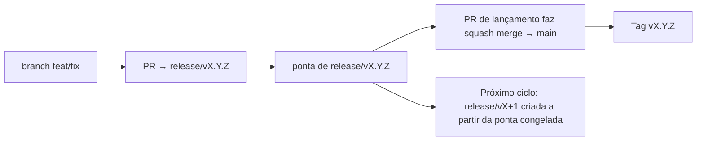

# Branching & Release Model (Português (Brasil))

🌐 **Languages:** 🇺🇸 [English](../../../../ops/BRANCHING_MODEL.md) · 🇪🇹 [am](../../../am/docs/ops/BRANCHING_MODEL.md) · 🇸🇦 [ar](../../../ar/docs/ops/BRANCHING_MODEL.md) · 🇦🇿 [az](../../../az/docs/ops/BRANCHING_MODEL.md) · 🇧🇬 [bg](../../../bg/docs/ops/BRANCHING_MODEL.md) · 🇧🇩 [bn](../../../bn/docs/ops/BRANCHING_MODEL.md) · 🇧🇦 [bs](../../../bs/docs/ops/BRANCHING_MODEL.md) · 🇨🇿 [cs](../../../cs/docs/ops/BRANCHING_MODEL.md) · 🇩🇰 [da](../../../da/docs/ops/BRANCHING_MODEL.md) · 🇩🇪 [de](../../../de/docs/ops/BRANCHING_MODEL.md) · 🇬🇷 [el](../../../el/docs/ops/BRANCHING_MODEL.md) · 🇪🇸 [es](../../../es/docs/ops/BRANCHING_MODEL.md) · 🇪🇪 [et](../../../et/docs/ops/BRANCHING_MODEL.md) · 🇮🇷 [fa](../../../fa/docs/ops/BRANCHING_MODEL.md) · 🇫🇮 [fi](../../../fi/docs/ops/BRANCHING_MODEL.md) · 🇫🇷 [fr](../../../fr/docs/ops/BRANCHING_MODEL.md) · 🇮🇪 [ga](../../../ga/docs/ops/BRANCHING_MODEL.md) · 🇮🇳 [gu](../../../gu/docs/ops/BRANCHING_MODEL.md) · 🇳🇬 [ha](../../../ha/docs/ops/BRANCHING_MODEL.md) · 🇮🇱 [he](../../../he/docs/ops/BRANCHING_MODEL.md) · 🇮🇳 [hi](../../../hi/docs/ops/BRANCHING_MODEL.md) · 🇭🇷 [hr](../../../hr/docs/ops/BRANCHING_MODEL.md) · 🇭🇺 [hu](../../../hu/docs/ops/BRANCHING_MODEL.md) · 🇦🇲 [hy](../../../hy/docs/ops/BRANCHING_MODEL.md) · 🇮🇩 [id](../../../id/docs/ops/BRANCHING_MODEL.md) · 🇳🇬 [ig](../../../ig/docs/ops/BRANCHING_MODEL.md) · 🇮🇹 [it](../../../it/docs/ops/BRANCHING_MODEL.md) · 🇯🇵 [ja](../../../ja/docs/ops/BRANCHING_MODEL.md) · 🇬🇪 [ka](../../../ka/docs/ops/BRANCHING_MODEL.md) · 🇰🇭 [km](../../../km/docs/ops/BRANCHING_MODEL.md) · 🇮🇳 [kn](../../../kn/docs/ops/BRANCHING_MODEL.md) · 🇰🇷 [ko](../../../ko/docs/ops/BRANCHING_MODEL.md) · 🇱🇹 [lt](../../../lt/docs/ops/BRANCHING_MODEL.md) · 🇱🇻 [lv](../../../lv/docs/ops/BRANCHING_MODEL.md) · 🇮🇳 [ml](../../../ml/docs/ops/BRANCHING_MODEL.md) · 🇮🇳 [mr](../../../mr/docs/ops/BRANCHING_MODEL.md) · 🇲🇾 [ms](../../../ms/docs/ops/BRANCHING_MODEL.md) · 🇲🇹 [mt](../../../mt/docs/ops/BRANCHING_MODEL.md) · 🇲🇲 [my](../../../my/docs/ops/BRANCHING_MODEL.md) · 🇳🇵 [ne](../../../ne/docs/ops/BRANCHING_MODEL.md) · 🇳🇱 [nl](../../../nl/docs/ops/BRANCHING_MODEL.md) · 🇳🇴 [no](../../../no/docs/ops/BRANCHING_MODEL.md) · 🇮🇳 [or](../../../or/docs/ops/BRANCHING_MODEL.md) · 🇮🇳 [pa](../../../pa/docs/ops/BRANCHING_MODEL.md) · 🇵🇭 [phi](../../../phi/docs/ops/BRANCHING_MODEL.md) · 🇵🇱 [pl](../../../pl/docs/ops/BRANCHING_MODEL.md) · 🇵🇹 [pt](../../../pt/docs/ops/BRANCHING_MODEL.md) · 🇷🇴 [ro](../../../ro/docs/ops/BRANCHING_MODEL.md) · 🇷🇺 [ru](../../../ru/docs/ops/BRANCHING_MODEL.md) · 🇱🇰 [si](../../../si/docs/ops/BRANCHING_MODEL.md) · 🇸🇰 [sk](../../../sk/docs/ops/BRANCHING_MODEL.md) · 🇸🇮 [sl](../../../sl/docs/ops/BRANCHING_MODEL.md) · 🇷🇸 [sr](../../../sr/docs/ops/BRANCHING_MODEL.md) · 🇸🇪 [sv](../../../sv/docs/ops/BRANCHING_MODEL.md) · 🇰🇪 [sw](../../../sw/docs/ops/BRANCHING_MODEL.md) · 🇮🇳 [ta](../../../ta/docs/ops/BRANCHING_MODEL.md) · 🇮🇳 [te](../../../te/docs/ops/BRANCHING_MODEL.md) · 🇹🇭 [th](../../../th/docs/ops/BRANCHING_MODEL.md) · 🇹🇷 [tr](../../../tr/docs/ops/BRANCHING_MODEL.md) · 🇺🇦 [uk-UA](../../../uk-UA/docs/ops/BRANCHING_MODEL.md) · 🇵🇰 [ur](../../../ur/docs/ops/BRANCHING_MODEL.md) · 🇺🇿 [uz](../../../uz/docs/ops/BRANCHING_MODEL.md) · 🇻🇳 [vi](../../../vi/docs/ops/BRANCHING_MODEL.md) · 🇳🇬 [yo](../../../yo/docs/ops/BRANCHING_MODEL.md) · 🇨🇳 [zh-CN](../../../zh-CN/docs/ops/BRANCHING_MODEL.md) · 🇹🇼 [zh-TW](../../../zh-TW/docs/ops/BRANCHING_MODEL.md)

---

O OmniRoute usa um modelo de lançamento de **ciclos paralelos**: uma branch dedicada `release/vX.Y.Z`
para o ciclo ativo, `main` para a linha publicada e uma tag imutável
`vX.Y.Z` quando esse ciclo é lançado. É esperado que commits sejam incorporados em `release/*` _e_ em
`main` — não se trata de um engano.

Os detalhes para mantenedores estão em `CLAUDE.md` (Regra Rígida nº 21) e em
[RELEASE_CHECKLIST.md](./RELEASE_CHECKLIST.md). Esta página é o resumo público
voltado para colaboradores.

## Visão geral

| Referência       | Função                                                                                                 |
| ---------------- | ------------------------------------------------------------------------------------------------------ |
| `release/vX.Y.Z` | **Ciclo ativo** — desenvolvimento cotidiano e merges de PRs para essa versão                           |
| `main`           | **Linha publicada** — recebe o ciclo por meio de squash merge quando a versão é lançada                |
| `vX.Y.Z` (tag)   | **Marcador de lançamento** — referência imutável do “que foi lançado”, criada no momento do lançamento |



## Qual deve ser o destino do meu PR?

**Use a branch ativa `release/vX.Y.Z` como destino — não `main`.**

1. Encontre a branch `release/v*` aberta com a versão mais alta (exemplo no momento da escrita:
   `release/v3.8.49`).
2. Crie sua branch a partir dessa ponta (`git fetch` + checkout / rebase sobre ela).
3. Abra o PR com **base = essa `release/vX.Y.Z`**.

`main` não é a branch de integração cotidiana. PRs abertos contra `main`
geralmente precisam ter o destino alterado antes do merge.

## Congelamento de lançamento (ciclos paralelos)

Quando um lançamento está sendo reconciliado, uma issue marcadora com o rótulo `release-freeze` é
aberta. Isso **não interrompe o desenvolvimento**:

- A `release/vX.Y.Z` congelada fica sob responsabilidade do capitão de lançamento dessa versão.
- A `release/vX+1` do próximo ciclo é criada a partir da ponta congelada para que os colaboradores continuem
  incorporando trabalho.
- PRs abertos que ainda tenham a branch congelada como destino devem ser **redirecionados** para a
  branch `release/v*` ativa (a mais alta).

Verifique se há um congelamento aberto antes de presumir que a branch desejada pode receber merges:

```bash
gh issue list --repo diegosouzapw/OmniRoute --label release-freeze --state open
```

A mecânica de merge (rótulo `queue` do proprietário → Mergify) está documentada em
[MERGE_TRAIN.md](./MERGE_TRAIN.md).

## Por que usar uma branch e uma tag?

| Artefato         | Duração            | Finalidade                                                              |
| ---------------- | ------------------ | ----------------------------------------------------------------------- |
| `release/vX.Y.Z` | Ciclo em andamento | Reúne PRs revisados, permanece com o CI verde e serve como base dos PRs |
| Tag `vX.Y.Z`     | Para sempre        | Marca os bits exatos que foram publicados no npm / GitHub Releases      |

A branch é a oficina; a tag é o pacote lacrado. Após o squash merge em
`main`, o próximo ciclo continua em `release/vX+1` sem esperar que o PR da versão
anterior seja concluído.

## Documentos relacionados

- [CONTRIBUTING.md](../../CONTRIBUTING.md) — configuração, testes e checklist de PR
- [RELEASE_CHECKLIST.md](./RELEASE_CHECKLIST.md) — validação antes do lançamento
- [MERGE_TRAIN.md](./MERGE_TRAIN.md) — fila de merge e fluxo alternativo
- [RELEASE_GREEN.md](./RELEASE_GREEN.md) — como manter verde a ponta da branch de lançamento
