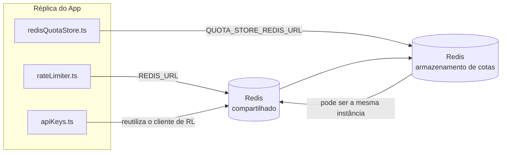

# Redis Production Configuration Guide (Português (Brasil))

🌐 **Languages:** 🇺🇸 [English](../../../../ops/REDIS_PRODUCTION_CONFIG.md) · 🇪🇹 [am](../../../am/docs/ops/REDIS_PRODUCTION_CONFIG.md) · 🇸🇦 [ar](../../../ar/docs/ops/REDIS_PRODUCTION_CONFIG.md) · 🇦🇿 [az](../../../az/docs/ops/REDIS_PRODUCTION_CONFIG.md) · 🇧🇬 [bg](../../../bg/docs/ops/REDIS_PRODUCTION_CONFIG.md) · 🇧🇩 [bn](../../../bn/docs/ops/REDIS_PRODUCTION_CONFIG.md) · 🇨🇿 [cs](../../../cs/docs/ops/REDIS_PRODUCTION_CONFIG.md) · 🇩🇰 [da](../../../da/docs/ops/REDIS_PRODUCTION_CONFIG.md) · 🇩🇪 [de](../../../de/docs/ops/REDIS_PRODUCTION_CONFIG.md) · 🇬🇷 [el](../../../el/docs/ops/REDIS_PRODUCTION_CONFIG.md) · 🇪🇸 [es](../../../es/docs/ops/REDIS_PRODUCTION_CONFIG.md) · 🇪🇪 [et](../../../et/docs/ops/REDIS_PRODUCTION_CONFIG.md) · 🇮🇷 [fa](../../../fa/docs/ops/REDIS_PRODUCTION_CONFIG.md) · 🇫🇮 [fi](../../../fi/docs/ops/REDIS_PRODUCTION_CONFIG.md) · 🇫🇷 [fr](../../../fr/docs/ops/REDIS_PRODUCTION_CONFIG.md) · 🇮🇪 [ga](../../../ga/docs/ops/REDIS_PRODUCTION_CONFIG.md) · 🇮🇳 [gu](../../../gu/docs/ops/REDIS_PRODUCTION_CONFIG.md) · 🇳🇬 [ha](../../../ha/docs/ops/REDIS_PRODUCTION_CONFIG.md) · 🇮🇱 [he](../../../he/docs/ops/REDIS_PRODUCTION_CONFIG.md) · 🇮🇳 [hi](../../../hi/docs/ops/REDIS_PRODUCTION_CONFIG.md) · 🇭🇷 [hr](../../../hr/docs/ops/REDIS_PRODUCTION_CONFIG.md) · 🇭🇺 [hu](../../../hu/docs/ops/REDIS_PRODUCTION_CONFIG.md) · 🇦🇲 [hy](../../../hy/docs/ops/REDIS_PRODUCTION_CONFIG.md) · 🇮🇩 [id](../../../id/docs/ops/REDIS_PRODUCTION_CONFIG.md) · 🇳🇬 [ig](../../../ig/docs/ops/REDIS_PRODUCTION_CONFIG.md) · 🇮🇹 [it](../../../it/docs/ops/REDIS_PRODUCTION_CONFIG.md) · 🇯🇵 [ja](../../../ja/docs/ops/REDIS_PRODUCTION_CONFIG.md) · 🇬🇪 [ka](../../../ka/docs/ops/REDIS_PRODUCTION_CONFIG.md) · 🇰🇭 [km](../../../km/docs/ops/REDIS_PRODUCTION_CONFIG.md) · 🇮🇳 [kn](../../../kn/docs/ops/REDIS_PRODUCTION_CONFIG.md) · 🇰🇷 [ko](../../../ko/docs/ops/REDIS_PRODUCTION_CONFIG.md) · 🇱🇹 [lt](../../../lt/docs/ops/REDIS_PRODUCTION_CONFIG.md) · 🇱🇻 [lv](../../../lv/docs/ops/REDIS_PRODUCTION_CONFIG.md) · 🇮🇳 [ml](../../../ml/docs/ops/REDIS_PRODUCTION_CONFIG.md) · 🇮🇳 [mr](../../../mr/docs/ops/REDIS_PRODUCTION_CONFIG.md) · 🇲🇾 [ms](../../../ms/docs/ops/REDIS_PRODUCTION_CONFIG.md) · 🇲🇹 [mt](../../../mt/docs/ops/REDIS_PRODUCTION_CONFIG.md) · 🇲🇲 [my](../../../my/docs/ops/REDIS_PRODUCTION_CONFIG.md) · 🇳🇵 [ne](../../../ne/docs/ops/REDIS_PRODUCTION_CONFIG.md) · 🇳🇱 [nl](../../../nl/docs/ops/REDIS_PRODUCTION_CONFIG.md) · 🇳🇴 [no](../../../no/docs/ops/REDIS_PRODUCTION_CONFIG.md) · 🇮🇳 [or](../../../or/docs/ops/REDIS_PRODUCTION_CONFIG.md) · 🇮🇳 [pa](../../../pa/docs/ops/REDIS_PRODUCTION_CONFIG.md) · 🇵🇭 [phi](../../../phi/docs/ops/REDIS_PRODUCTION_CONFIG.md) · 🇵🇱 [pl](../../../pl/docs/ops/REDIS_PRODUCTION_CONFIG.md) · 🇵🇹 [pt](../../../pt/docs/ops/REDIS_PRODUCTION_CONFIG.md) · 🇷🇴 [ro](../../../ro/docs/ops/REDIS_PRODUCTION_CONFIG.md) · 🇷🇺 [ru](../../../ru/docs/ops/REDIS_PRODUCTION_CONFIG.md) · 🇱🇰 [si](../../../si/docs/ops/REDIS_PRODUCTION_CONFIG.md) · 🇸🇰 [sk](../../../sk/docs/ops/REDIS_PRODUCTION_CONFIG.md) · 🇸🇮 [sl](../../../sl/docs/ops/REDIS_PRODUCTION_CONFIG.md) · 🇷🇸 [sr](../../../sr/docs/ops/REDIS_PRODUCTION_CONFIG.md) · 🇸🇪 [sv](../../../sv/docs/ops/REDIS_PRODUCTION_CONFIG.md) · 🇰🇪 [sw](../../../sw/docs/ops/REDIS_PRODUCTION_CONFIG.md) · 🇮🇳 [ta](../../../ta/docs/ops/REDIS_PRODUCTION_CONFIG.md) · 🇮🇳 [te](../../../te/docs/ops/REDIS_PRODUCTION_CONFIG.md) · 🇹🇭 [th](../../../th/docs/ops/REDIS_PRODUCTION_CONFIG.md) · 🇹🇷 [tr](../../../tr/docs/ops/REDIS_PRODUCTION_CONFIG.md) · 🇺🇦 [uk-UA](../../../uk-UA/docs/ops/REDIS_PRODUCTION_CONFIG.md) · 🇵🇰 [ur](../../../ur/docs/ops/REDIS_PRODUCTION_CONFIG.md) · 🇺🇿 [uz](../../../uz/docs/ops/REDIS_PRODUCTION_CONFIG.md) · 🇻🇳 [vi](../../../vi/docs/ops/REDIS_PRODUCTION_CONFIG.md) · 🇳🇬 [yo](../../../yo/docs/ops/REDIS_PRODUCTION_CONFIG.md) · 🇨🇳 [zh-CN](../../../zh-CN/docs/ops/REDIS_PRODUCTION_CONFIG.md) · 🇹🇼 [zh-TW](../../../zh-TW/docs/ops/REDIS_PRODUCTION_CONFIG.md)

---

## Visão geral

O Redis é uma **dependência opcional e não obrigatória** no OmniRoute — a aplicação continua funcionando de forma degradada (com fallbacks
em memória) quando o Redis está indisponível. Em produção, o ajuste do Redis reduz a latência de quatro cargas de trabalho
distintas:

| Carga de trabalho      | Componente                    | Fábrica do cliente                              | Padrão de chave                                          |
| ---------------------- | ----------------------------- | ----------------------------------------------- | -------------------------------------------------------- |
| Limitação de taxa      | `rateLimiter.ts`              | Singleton `ioredis` lazy via `getRedisClient()` | Janelas de limitação de taxa Lua‑atômicas `<prefix>rl:*` |
| Cache de autenticação  | `apiKeys.ts`                  | Reutiliza o cliente do `rateLimiter`            | `<prefix>auth:api_key:<sha256>` com TTL                  |
| Armazenamento de cotas | `redisQuotaStore.ts`          | Singleton separado via `getRedisClient(url)`    | `<prefix>quota:*` configurável por instância             |
| Disjuntor de warmup    | `redisCircuitBreakerStore.ts` | Cliente separado em `circuitBreakerFactory.ts`  | `<prefix>warmup:cb:<connectionId>`                       |

Todas as quatro cargas de trabalho compartilham um único prefixo de namespace para que o OmniRoute possa coexistir com outros aplicativos em uma
única instância do Redis (por exemplo, `127.0.0.1:6379`). Consulte [Namespace de chaves](#key-namespacing).

---

## Configuração atual (padrões do código)

| Configuração                                 | Valor                                                        | Local                                                                                 |
| -------------------------------------------- | ------------------------------------------------------------ | ------------------------------------------------------------------------------------- |
| Variável de ambiente `REDIS_URL`             | `redis://redis:6379` (compose), opcional                     | `rateLimiter.ts:5`, `.env.example`                                                    |
| Variável de ambiente `REDIS_KEY_PREFIX`      | `omniroute:` (padrão)                                        | `rateLimiter.ts`, `redisQuotaStore.ts`, `redisCircuitBreakerStore.ts`, `.env.example` |
| Variável de ambiente `QUOTA_STORE_REDIS_URL` | separada, pode ser diferente de `REDIS_URL`                  | `quota/storeFactory.ts`                                                               |
| `QUOTA_STORE_DRIVER`                         | `"sqlite"` (padrão), `"redis"` opcional                      | `quota/storeFactory.ts`                                                               |
| `maxRetriesPerRequest` do ioredis            | `3`                                                          | criação do cliente em `rateLimiter.ts`                                                |
| `enableReadyCheck`                           | não definido (padrão do ioredis: `true`)                     | —                                                                                     |
| `lazyConnect`                                | não definido (padrão do ioredis: `false`)                    | —                                                                                     |
| `retryStrategy`                              | não definido (padrão do ioredis: base de 200ms, exponencial) | —                                                                                     |
| TLS / senha / índice do banco de dados       | **não configurados**                                         | —                                                                                     |
| Sentinel / Cluster                           | **não configurados** — somente nó único standalone           | —                                                                                     |

---

## Namespace de chaves

O OmniRoute compartilha uma instância do Redis com qualquer outro serviço executado no host. Sem um namespace,
chaves como `auth:api_key:<sha256>` ou `rl:*` poderiam colidir com chaves de outras aplicações
que usam o mesmo Redis (esta instância executa o Redis em `127.0.0.1:6379` junto com outros serviços).

Defina `REDIS_KEY_PREFIX` como uma string não vazia para adicionar um prefixo a **todas** as chaves do OmniRoute:

```bash
# .env — todas as chaves do OmniRoute passam a ser omniroute:rl:*, omniroute:auth:*, omniroute:quota:*, omniroute:warmup:cb:*
REDIS_KEY_PREFIX=omniroute:
```

- **Padrão:** `omniroute:` (aplicado quando `REDIS_KEY_PREFIX` não está definido ou está em branco).
- **Aplicado a:** limitador de taxa + cache de autenticação (cliente `ioredis` compartilhado via `keyPrefix`), armazenamento
  de cotas (`KEY_PREFIX = "${REDIS_KEY_PREFIX}quota"`) e disjuntor de warmup
  (`KEY_PREFIX = "${REDIS_KEY_PREFIX}warmup:cb:"`).
- **Alterar o prefixo** quando já existem chaves no Redis deixa as chaves antigas órfãs (elas expiram
  via TTL / LRU). É seguro alterá-lo; nenhuma migração é necessária. A única exceção é uma chave do
  disjuntor de warmup para uma conexão marcada como proibida: ela é persistida sem TTL, portanto,
  liste as chaves restantes com `redis-cli --scan --pattern '<old-prefix>warmup:cb:*'` e exclua-as.
- O **`keyPrefix` do ioredis** adiciona automaticamente o prefixo nas gravações **e** o remove nas leituras,
  portanto, o código da aplicação nunca vê o prefixo.

---

## Ajustes Recomendados para Produção

### 1. Opções de Pool de Conexões / Cliente (construtor `Redis` do ioredis)

O código atual cria uma única instância de `new Redis(url)` sem opções personalizadas. Para implantações de produção com múltiplas réplicas, passe uma factory de cliente no código ou encapsule `getRedisClient()`:

```typescript
const redis = new Redis(REDIS_URL, {
  maxRetriesPerRequest: null, // sem limite de tentativas; deixe retryStrategy decidir
  enableReadyCheck: true, // verifica se o servidor está pronto antes de aceitar chamadas
  lazyConnect: true, // não conecta durante a construção; aguarda a primeira chamada
  retryStrategy: (times) => {
    if (times > 10) return null; // desiste após 10 tentativas → reconecta mais tarde
    return Math.min(times * 200, 5000); // 200ms, 400ms, …, limite de 5s
  },
  enableAutoPipelining: true, // combina comandos simultâneos em uma única gravação TCP
  keepAlive: 10000, // keep-alive TCP a cada 10s
});
```

**Principais compensações:**

- `maxRetriesPerRequest: null` + `retryStrategy` — preferível para produção, para que reinicializações
  transitórias do Redis não façam todas as solicitações falharem imediatamente. O fallback em memória
  de `checkRateLimit()` absorve o caminho de falha.
- `lazyConnect: true` — evita uma dependência de inicialização que exija que o Redis esteja disponível antes
  de o servidor começar a aceitar conexões.
- `enableAutoPipelining: true` — reduz as idas e voltas para verificações simultâneas de limite de taxa;
  benéfico acima de 50 RPS em uma única conexão.

### 2. Configuração do Servidor Redis (`redis.conf`)

```
# Memória
maxmemory 80%                        # deixa espaço para o cache de páginas do SO
maxmemory-policy allkeys-lru         # remove entradas obsoletas do cache de autenticação sob pressão

# Persistência (opcional — o OmniRoute é seguro contra falhas sem ela)
save 300 1                           # cria um snapshot pelo menos a cada 5 min se ≥1 chave tiver sido alterada
appendonly no                        # AOF não é necessário; os dados podem ser regenerados
appendfsync no                       # sem sobrecarga de fsync (RDB é suficiente)

# Rede
timeout 0                            # sem desconexão por inatividade
tcp-keepalive 300                    # keep-alive de 5 min
tcp-backlog 511                      # backlog de conexões para cargas em rajadas

# Desempenho
hz 10                                # padrão; 100 para casos sensíveis à latência
activedefrag yes                     # desfragmenta automaticamente quando a fragmentação for >10%
```

**Compensação de `maxmemory-policy allkeys-lru`:** As entradas do cache de autenticação podem ser removidas sob
pressão de memória. Isso é seguro — `setCachedApiKey` sempre repopula o cache em caso de ausência, e o
fallback para SQLite é a fonte autoritativa. O script Lua do limitador de taxa cria chaves pequenas que têm
vida curta por definição.

### 3. Configurações do Docker Compose

O compose de produção (`docker-compose.prod.yml`) usa `redis:8.6.2-alpine`. Adicione:

```yaml
redis:
  image: redis:8.6.2-alpine
  command:
    [
      "redis-server",
      "--maxmemory",
      "512mb",
      "--maxmemory-policy",
      "allkeys-lru",
      "--activedefrag",
      "yes",
      "--save",
      "300 1",
    ]
  healthcheck:
    test: ["CMD", "redis-cli", "ping"]
    interval: 10s
    timeout: 3s
    retries: 3
    start_period: 5s
```

### 4. Considerações sobre Múltiplas Instâncias / Escalabilidade

**Um único Redis para todas as réplicas** — o script Lua do limitador de taxa depende de um único
espaço de chaves autoritativo. Várias instâncias do Redis associadas às réplicas eliminariam a atomicidade
e duplicariam o orçamento. Use um único Redis (ou um cluster Redis Sentinel com failover) para
todas as réplicas da aplicação.

**Contagem de conexões:** Cada réplica da aplicação abre **2 conexões TCP** com o Redis
(cliente do limitador de taxa + cliente do armazenamento de cotas). Com 10 réplicas → 20 conexões, bem
abaixo do limite padrão de 10 mil conexões de uma instância do Redis.

### 5. Monitoramento

Exponha por meio do endpoint de verificação de integridade:

```typescript
// src/app/api/monitoring/health/route.ts já chama funções de rateLimiter
// Adicione verificações específicas do Redis:
//   1. Latência do PING por meio de .ping() do ioredis
//   2. Uso de memória por meio de INFO memory
//   3. Contagem de conexões por meio de INFO clients
//   4. Taxa de acertos de maxmemory-policy (evicted_keys / keyspace_hits)
```

Principais métricas a observar:

- **Chaves removidas/s** — se permanecerem continuamente acima de zero, aumente `maxmemory`
- **Clientes bloqueados** — um valor acima de zero sugere scripts Lua lentos ou alta contenção
- **Conexões rejeitadas** — o limite de conexões foi atingido; raro com 20 conexões

---

## Diagrama de Arquitetura



---

## Referências

| Arquivo                            | Finalidade                                                                    |
| ---------------------------------- | ----------------------------------------------------------------------------- |
| `src/shared/utils/rateLimiter.ts`  | Cliente Redis principal, script Lua de limitação de taxa, fallback em memória |
| `src/lib/db/apiKeys.ts`            | Cache de autenticação — fallback de Redis para SQLite                         |
| `src/lib/quota/redisQuotaStore.ts` | Cliente Redis separado para o armazenamento de cotas opcional                 |
| `src/lib/quota/storeFactory.ts`    | Alterna entre os drivers de cotas `sqlite` e `redis`                          |
| `docker-compose.prod.yml`          | Contêiner Redis de produção (imagem `redis:8.6.2-alpine`)                     |
| `.env.example`                     | Documentação das variáveis de ambiente do Redis                               |
| `src/app/api/local/redis/`         | Rotas de API para orquestração do contêiner de desenvolvimento                |
| `bin/cli/commands/redis.mjs`       | Comandos da CLI para orquestração do contêiner de desenvolvimento             |
