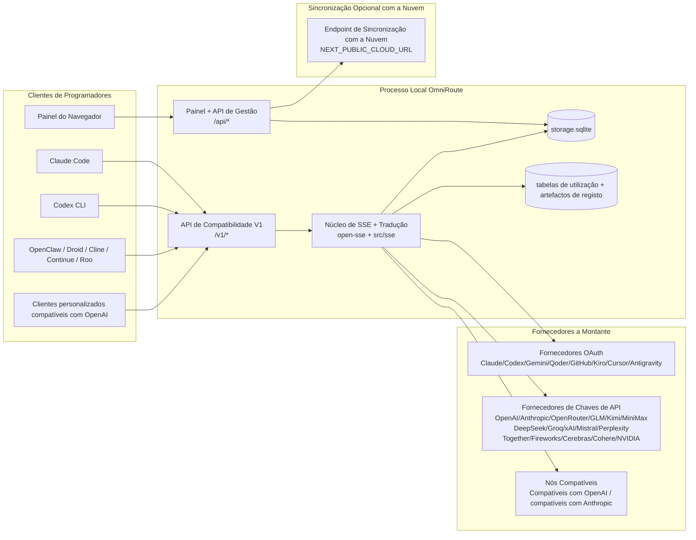
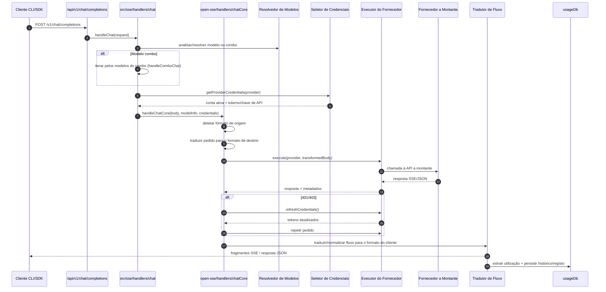
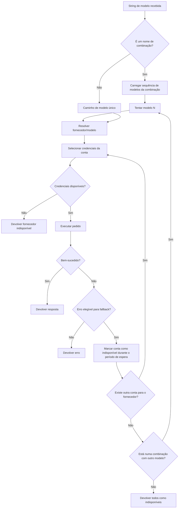
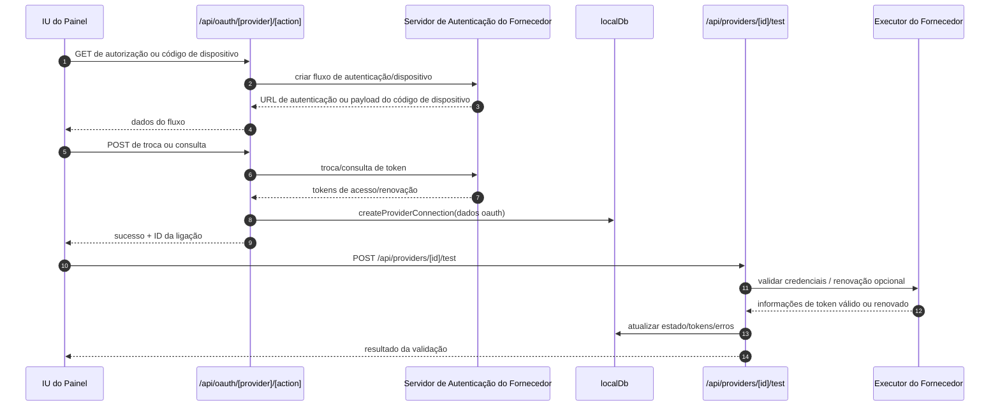
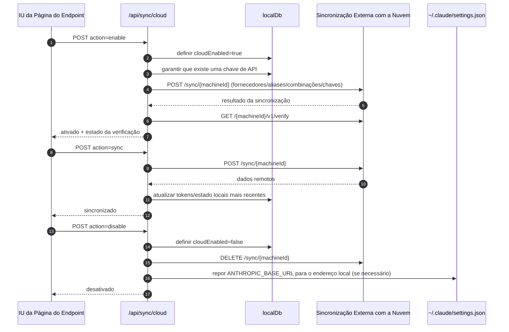
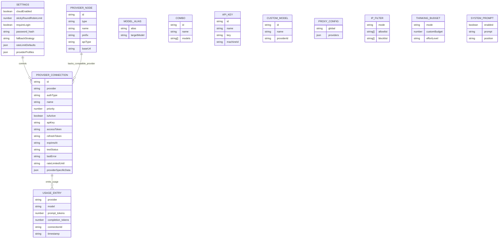
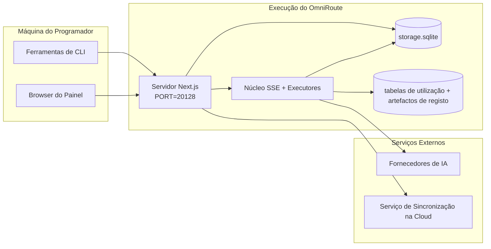

# OmniRoute Architecture (Português (Portugal))

🌐 **Languages:** 🇺🇸 [English](../../../../architecture/ARCHITECTURE.md) · 🇪🇹 [am](../../../am/docs/architecture/ARCHITECTURE.md) · 🇸🇦 [ar](../../../ar/docs/architecture/ARCHITECTURE.md) · 🇦🇿 [az](../../../az/docs/architecture/ARCHITECTURE.md) · 🇧🇬 [bg](../../../bg/docs/architecture/ARCHITECTURE.md) · 🇧🇩 [bn](../../../bn/docs/architecture/ARCHITECTURE.md) · 🇨🇿 [cs](../../../cs/docs/architecture/ARCHITECTURE.md) · 🇩🇰 [da](../../../da/docs/architecture/ARCHITECTURE.md) · 🇩🇪 [de](../../../de/docs/architecture/ARCHITECTURE.md) · 🇬🇷 [el](../../../el/docs/architecture/ARCHITECTURE.md) · 🇪🇸 [es](../../../es/docs/architecture/ARCHITECTURE.md) · 🇪🇪 [et](../../../et/docs/architecture/ARCHITECTURE.md) · 🇮🇷 [fa](../../../fa/docs/architecture/ARCHITECTURE.md) · 🇫🇮 [fi](../../../fi/docs/architecture/ARCHITECTURE.md) · 🇫🇷 [fr](../../../fr/docs/architecture/ARCHITECTURE.md) · 🇮🇪 [ga](../../../ga/docs/architecture/ARCHITECTURE.md) · 🇮🇳 [gu](../../../gu/docs/architecture/ARCHITECTURE.md) · 🇳🇬 [ha](../../../ha/docs/architecture/ARCHITECTURE.md) · 🇮🇱 [he](../../../he/docs/architecture/ARCHITECTURE.md) · 🇮🇳 [hi](../../../hi/docs/architecture/ARCHITECTURE.md) · 🇭🇷 [hr](../../../hr/docs/architecture/ARCHITECTURE.md) · 🇭🇺 [hu](../../../hu/docs/architecture/ARCHITECTURE.md) · 🇦🇲 [hy](../../../hy/docs/architecture/ARCHITECTURE.md) · 🇮🇩 [id](../../../id/docs/architecture/ARCHITECTURE.md) · 🇳🇬 [ig](../../../ig/docs/architecture/ARCHITECTURE.md) · 🇮🇹 [it](../../../it/docs/architecture/ARCHITECTURE.md) · 🇯🇵 [ja](../../../ja/docs/architecture/ARCHITECTURE.md) · 🇬🇪 [ka](../../../ka/docs/architecture/ARCHITECTURE.md) · 🇰🇭 [km](../../../km/docs/architecture/ARCHITECTURE.md) · 🇮🇳 [kn](../../../kn/docs/architecture/ARCHITECTURE.md) · 🇰🇷 [ko](../../../ko/docs/architecture/ARCHITECTURE.md) · 🇱🇹 [lt](../../../lt/docs/architecture/ARCHITECTURE.md) · 🇱🇻 [lv](../../../lv/docs/architecture/ARCHITECTURE.md) · 🇮🇳 [ml](../../../ml/docs/architecture/ARCHITECTURE.md) · 🇮🇳 [mr](../../../mr/docs/architecture/ARCHITECTURE.md) · 🇲🇾 [ms](../../../ms/docs/architecture/ARCHITECTURE.md) · 🇲🇹 [mt](../../../mt/docs/architecture/ARCHITECTURE.md) · 🇲🇲 [my](../../../my/docs/architecture/ARCHITECTURE.md) · 🇳🇵 [ne](../../../ne/docs/architecture/ARCHITECTURE.md) · 🇳🇱 [nl](../../../nl/docs/architecture/ARCHITECTURE.md) · 🇳🇴 [no](../../../no/docs/architecture/ARCHITECTURE.md) · 🇮🇳 [or](../../../or/docs/architecture/ARCHITECTURE.md) · 🇮🇳 [pa](../../../pa/docs/architecture/ARCHITECTURE.md) · 🇵🇭 [phi](../../../phi/docs/architecture/ARCHITECTURE.md) · 🇵🇱 [pl](../../../pl/docs/architecture/ARCHITECTURE.md) · 🇧🇷 [pt-BR](../../../pt-BR/docs/architecture/ARCHITECTURE.md) · 🇷🇴 [ro](../../../ro/docs/architecture/ARCHITECTURE.md) · 🇷🇺 [ru](../../../ru/docs/architecture/ARCHITECTURE.md) · 🇱🇰 [si](../../../si/docs/architecture/ARCHITECTURE.md) · 🇸🇰 [sk](../../../sk/docs/architecture/ARCHITECTURE.md) · 🇸🇮 [sl](../../../sl/docs/architecture/ARCHITECTURE.md) · 🇷🇸 [sr](../../../sr/docs/architecture/ARCHITECTURE.md) · 🇸🇪 [sv](../../../sv/docs/architecture/ARCHITECTURE.md) · 🇰🇪 [sw](../../../sw/docs/architecture/ARCHITECTURE.md) · 🇮🇳 [ta](../../../ta/docs/architecture/ARCHITECTURE.md) · 🇮🇳 [te](../../../te/docs/architecture/ARCHITECTURE.md) · 🇹🇭 [th](../../../th/docs/architecture/ARCHITECTURE.md) · 🇹🇷 [tr](../../../tr/docs/architecture/ARCHITECTURE.md) · 🇺🇦 [uk-UA](../../../uk-UA/docs/architecture/ARCHITECTURE.md) · 🇵🇰 [ur](../../../ur/docs/architecture/ARCHITECTURE.md) · 🇺🇿 [uz](../../../uz/docs/architecture/ARCHITECTURE.md) · 🇻🇳 [vi](../../../vi/docs/architecture/ARCHITECTURE.md) · 🇳🇬 [yo](../../../yo/docs/architecture/ARCHITECTURE.md) · 🇨🇳 [zh-CN](../../../zh-CN/docs/architecture/ARCHITECTURE.md) · 🇹🇼 [zh-TW](../../../zh-TW/docs/architecture/ARCHITECTURE.md)

---

🌐 **Languages:** 🇺🇸 [English](../../../../architecture/ARCHITECTURE.md) · 🇪🇹 [am](../../../am/docs/architecture/ARCHITECTURE.md) · 🇸🇦 [ar](../../../ar/docs/architecture/ARCHITECTURE.md) · 🇦🇿 [az](../../../az/docs/architecture/ARCHITECTURE.md) · 🇧🇬 [bg](../../../bg/docs/architecture/ARCHITECTURE.md) · 🇧🇩 [bn](../../../bn/docs/architecture/ARCHITECTURE.md) · 🇨🇿 [cs](../../../cs/docs/architecture/ARCHITECTURE.md) · 🇩🇰 [da](../../../da/docs/architecture/ARCHITECTURE.md) · 🇩🇪 [de](../../../de/docs/architecture/ARCHITECTURE.md) · 🇬🇷 [el](../../../el/docs/architecture/ARCHITECTURE.md) · 🇪🇸 [es](../../../es/docs/architecture/ARCHITECTURE.md) · 🇪🇪 [et](../../../et/docs/architecture/ARCHITECTURE.md) · 🇮🇷 [fa](../../../fa/docs/architecture/ARCHITECTURE.md) · 🇫🇮 [fi](../../../fi/docs/architecture/ARCHITECTURE.md) · 🇫🇷 [fr](../../../fr/docs/architecture/ARCHITECTURE.md) · 🇮🇪 [ga](../../../ga/docs/architecture/ARCHITECTURE.md) · 🇮🇳 [gu](../../../gu/docs/architecture/ARCHITECTURE.md) · 🇳🇬 [ha](../../../ha/docs/architecture/ARCHITECTURE.md) · 🇮🇱 [he](../../../he/docs/architecture/ARCHITECTURE.md) · 🇮🇳 [hi](../../../hi/docs/architecture/ARCHITECTURE.md) · 🇭🇷 [hr](../../../hr/docs/architecture/ARCHITECTURE.md) · 🇭🇺 [hu](../../../hu/docs/architecture/ARCHITECTURE.md) · 🇦🇲 [hy](../../../hy/docs/architecture/ARCHITECTURE.md) · 🇮🇩 [id](../../../id/docs/architecture/ARCHITECTURE.md) · 🇳🇬 [ig](../../../ig/docs/architecture/ARCHITECTURE.md) · 🇮🇹 [it](../../../it/docs/architecture/ARCHITECTURE.md) · 🇯🇵 [ja](../../../ja/docs/architecture/ARCHITECTURE.md) · 🇬🇪 [ka](../../../ka/docs/architecture/ARCHITECTURE.md) · 🇰🇭 [km](../../../km/docs/architecture/ARCHITECTURE.md) · 🇮🇳 [kn](../../../kn/docs/architecture/ARCHITECTURE.md) · 🇰🇷 [ko](../../../ko/docs/architecture/ARCHITECTURE.md) · 🇱🇹 [lt](../../../lt/docs/architecture/ARCHITECTURE.md) · 🇱🇻 [lv](../../../lv/docs/architecture/ARCHITECTURE.md) · 🇮🇳 [ml](../../../ml/docs/architecture/ARCHITECTURE.md) · 🇮🇳 [mr](../../../mr/docs/architecture/ARCHITECTURE.md) · 🇲🇾 [ms](../../../ms/docs/architecture/ARCHITECTURE.md) · 🇲🇹 [mt](../../../mt/docs/architecture/ARCHITECTURE.md) · 🇲🇲 [my](../../../my/docs/architecture/ARCHITECTURE.md) · 🇳🇵 [ne](../../../ne/docs/architecture/ARCHITECTURE.md) · 🇳🇱 [nl](../../../nl/docs/architecture/ARCHITECTURE.md) · 🇳🇴 [no](../../../no/docs/architecture/ARCHITECTURE.md) · 🇮🇳 [or](../../../or/docs/architecture/ARCHITECTURE.md) · 🇮🇳 [pa](../../../pa/docs/architecture/ARCHITECTURE.md) · 🇵🇭 [phi](../../../phi/docs/architecture/ARCHITECTURE.md) · 🇵🇱 [pl](../../../pl/docs/architecture/ARCHITECTURE.md) · 🇧🇷 [pt-BR](../../../pt-BR/docs/architecture/ARCHITECTURE.md) · 🇷🇴 [ro](../../../ro/docs/architecture/ARCHITECTURE.md) · 🇷🇺 [ru](../../../ru/docs/architecture/ARCHITECTURE.md) · 🇱🇰 [si](../../../si/docs/architecture/ARCHITECTURE.md) · 🇸🇰 [sk](../../../sk/docs/architecture/ARCHITECTURE.md) · 🇸🇮 [sl](../../../sl/docs/architecture/ARCHITECTURE.md) · 🇷🇸 [sr](../../../sr/docs/architecture/ARCHITECTURE.md) · 🇸🇪 [sv](../../../sv/docs/architecture/ARCHITECTURE.md) · 🇰🇪 [sw](../../../sw/docs/architecture/ARCHITECTURE.md) · 🇮🇳 [ta](../../../ta/docs/architecture/ARCHITECTURE.md) · 🇮🇳 [te](../../../te/docs/architecture/ARCHITECTURE.md) · 🇹🇭 [th](../../../th/docs/architecture/ARCHITECTURE.md) · 🇹🇷 [tr](../../../tr/docs/architecture/ARCHITECTURE.md) · 🇺🇦 [uk-UA](../../../uk-UA/docs/architecture/ARCHITECTURE.md) · 🇵🇰 [ur](../../../ur/docs/architecture/ARCHITECTURE.md) · 🇺🇿 [uz](../../../uz/docs/architecture/ARCHITECTURE.md) · 🇻🇳 [vi](../../../vi/docs/architecture/ARCHITECTURE.md) · 🇳🇬 [yo](../../../yo/docs/architecture/ARCHITECTURE.md) · 🇨🇳 [zh-CN](../../../zh-CN/docs/architecture/ARCHITECTURE.md) · 🇹🇼 [zh-TW](../../../zh-TW/docs/architecture/ARCHITECTURE.md)

_Última atualização: 2026-06-28_

## Resumo Executivo

O OmniRoute é um gateway local de encaminhamento de IA e um painel de controlo baseado em Next.js.
Disponibiliza um único endpoint compatível com OpenAI (`/v1/*`) e encaminha o tráfego entre vários fornecedores a montante, com tradução, recurso alternativo, atualização de tokens e monitorização da utilização.

Principais capacidades:

- Superfície de API compatível com OpenAI para CLI/ferramentas (355 fornecedores, 108 executores)
- Tradução de pedidos/respostas entre formatos de fornecedores
- Recurso alternativo por combinação de modelos (sequência de vários modelos)
- Passos de combinação estruturados (`provider + model + connection`) com ordenação em tempo de execução por `compositeTiers`
- Recurso alternativo ao nível da conta (várias contas por fornecedor)
- Verificação prévia de quota e seleção de contas P2C sensível à quota no fluxo principal de conversação
- Gestão de ligações a fornecedores através de OAuth + chave de API (22 módulos de fornecedores OAuth)
- Geração de embeddings através de `/v1/embeddings` (18 fornecedores)
- Geração de imagens através de `/v1/images/generations` (mais de 10 fornecedores, mais de 20 modelos)
- Transcrição de áudio através de `/v1/audio/transcriptions` (18 fornecedores)
- Conversão de texto em voz através de `/v1/audio/speech` (24 fornecedores incorporados)
- Geração de vídeo através de `/v1/videos/generations` (ComfyUI + SD WebUI)
- Geração de música através de `/v1/music/generations` (ComfyUI)
- Pesquisa na Web através de `/v1/search` (20 fornecedores)
- Moderação através de `/v1/moderations`
- Reordenação através de `/v1/rerank`
- Análise de etiquetas de raciocínio (`<think>...</think>`) para modelos de raciocínio
- Sanitização de respostas para compatibilidade rigorosa com o SDK da OpenAI
- Normalização de funções (developer→system, system→user) para compatibilidade entre fornecedores
- Conversão de saída estruturada (json_schema → Gemini responseSchema)
- Persistência local de fornecedores, chaves, aliases, combinações, definições e preços (122 módulos de BD)
- Monitorização da utilização/custos e registo de pedidos
- Sincronização opcional na nuvem para sincronização entre vários dispositivos/do estado
- Lista de permissões/bloqueios de IP para controlo de acesso à API
- Gestão do orçamento de raciocínio (passagem direta/automático/personalizado/adaptativo)
- Injeção global de instruções do sistema
- Monitorização e identificação de sessões
- Limitação avançada da taxa por conta, com perfis específicos do fornecedor
- Padrão de disjuntor para resiliência dos fornecedores
- Proteção contra efeito de manada com bloqueio por mutex
- Cache de eliminação de pedidos duplicados baseado em assinaturas
- Camada de domínio: regras de custos, política de recurso alternativo, política de bloqueio
- Context Relay: resumos de transferência de sessão para manter a continuidade durante a rotação de contas
- Persistência do estado do domínio (cache SQLite com escrita imediata para recursos alternativos, orçamentos, bloqueios e disjuntores)
- Motor de políticas para avaliação centralizada de pedidos (bloqueio → orçamento → recurso alternativo)
- Telemetria de pedidos com agregação de latência p50/p95/p99
- Telemetria de alvos de combinações e estado histórico dos alvos de combinações através de `combo_execution_key` / `combo_step_id`
- ID de correlação (X-Request-Id) para rastreio completo
- Registo de auditoria de conformidade com opção de desativação por chave de API
- Estrutura de avaliação para garantia da qualidade de LLM
- Painel de estado com estado em tempo real dos disjuntores dos fornecedores
- Servidor MCP (110 ferramentas) com 3 transportes (stdio/SSE/Streamable HTTP)
- Servidor A2A (JSON-RPC 2.0 + SSE) com capacidades e ciclo de vida de tarefas
- Sistema de memória (extração, injeção, recuperação, resumo)
- Sistema de capacidades (registo, executor, sandbox, capacidades incorporadas)
- Proxy MITM com gestão de certificados e processamento de DNS
- Middleware de proteção contra injeção de instruções
- Pipeline de compressão de instruções com Caveman, RTK, pipelines empilhados, combinações de compressão, pacotes de idiomas e análises
- Registo ACP (Agent Communication Protocol)
- Fornecedores OAuth modulares (22 módulos individuais em `src/lib/oauth/providers/`)
- Scripts de desinstalação/desinstalação completa
- Ação de reparação do ambiente OAuth
- Ponte WebSocket para clientes WS compatíveis com OpenAI (`/v1/ws`)
- Gestão de tokens de sincronização (emissão/revogação, transferência de pacotes de configuração versionados por ETag)
- GLM Thinking (`glmt`) como predefinição de fornecedor de primeira classe
- Contagem híbrida de tokens (`/messages/count_tokens` do lado do fornecedor, com recurso alternativo a estimativa)
- Preenchimento automático de aliases de modelos (mais de 30 normalizações de dialetos entre proxies no arranque)
- Obtenção externa segura com proteção contra SSRF, bloqueio de URLs privadas e novas tentativas configuráveis
- Novas tentativas de conversação sensíveis ao período de espera, com `requestRetry` e `maxRetryIntervalSec` configuráveis
- Validação do ambiente de execução com Zod no arranque
- Auditoria de conformidade v2 com paginação, eventos CRUD de fornecedores e registo de validações bloqueadas por SSRF

Modelo principal de execução:

- As rotas da aplicação Next.js em `src/app/api/*` implementam as APIs do painel de controlo e as APIs de compatibilidade
- Um núcleo partilhado de SSE/encaminhamento em `src/sse/*` + `open-sse/*` processa a execução dos fornecedores, a tradução, o streaming, o recurso alternativo e a utilização

## Diagramas de Referência

As fontes Mermaid canónicas, com controlo de versões, para a plataforma v3.8.0 encontram-se em
[`docs/diagrams/`](../diagrams/README.md). Duas são reproduzidas abaixo para orientação;
as restantes estão ligadas a partir dos respetivos guias específicos de domínio.


> Fonte: [diagrams/request-pipeline.mmd](../diagrams/request-pipeline.mmd)


> Fonte: [diagrams/resilience-3layers.mmd](../diagrams/resilience-3layers.mmd) — também ligado a partir de
> [RESILIENCE_GUIDE.md](./RESILIENCE_GUIDE.md) e da referência de resiliência em `CLAUDE.md`.

## Âmbito e Limites

### Incluído no Âmbito

- Runtime do gateway local
- APIs de gestão do dashboard
- Autenticação de fornecedores e renovação de tokens
- Tradução de pedidos e streaming SSE
- Estado local + persistência da utilização
- Orquestração opcional da sincronização com a cloud

### Fora do Âmbito

- Implementação do serviço cloud associado a `NEXT_PUBLIC_CLOUD_URL`
- SLA/plano de controlo do fornecedor fora do processo local
- Os próprios binários CLI externos (Claude CLI, Codex CLI, etc.)

## Superfície do Dashboard (Atual)

Páginas principais em `src/app/(dashboard)/dashboard/`:

- `/dashboard` — início rápido + visão geral dos fornecedores
- `/dashboard/endpoint` — proxy de endpoints + separadores MCP + A2A + endpoints de API
- `/dashboard/providers` — ligações e credenciais de fornecedores
- `/dashboard/combos` — estratégias de combos, modelos, construtor baseado em passos, regras de encaminhamento de modelos, ordenação manual persistente
- `/dashboard/auto-combo` — Motor de Combos Automáticos: ponderações de pontuação, conjuntos de modos, predefinições de fábricas virtuais, telemetria
- `/dashboard/costs` — agregação de custos e visibilidade de preços
- `/dashboard/analytics` — análise de utilização, avaliações, estado dos destinos dos combos
- `/dashboard/limits` — controlos de quotas/taxas
- `/dashboard/cli-tools` — integração inicial da CLI, deteção do runtime, geração de configuração
- `/dashboard/agents` — agentes ACP detetados + registo de agentes personalizados
- `/dashboard/cloud-agents` — tarefas de agentes alojados na cloud (Codex Cloud, Devin, Jules) e ciclo de vida das tarefas
- `/dashboard/skills` — registo de competências A2A, execução em sandbox, catálogo de competências integradas
- `/dashboard/memory` — inspeção e recuperação da memória conversacional persistente
- `/dashboard/webhooks` — subscrições de webhooks de saída, rotação de segredos, estatísticas de novas tentativas
- `/dashboard/batch` — submissão de tarefas em lote e progresso
- `/dashboard/cache` — estatísticas de cache de leitura e raciocínio, controlos de expulsão
- `/dashboard/playground` — playground de chat interativo para qualquer combo/modelo configurado
- `/dashboard/changelog` — visualizador do registo de alterações na aplicação (renderiza `CHANGELOG.md`)
- `/dashboard/system` — diagnóstico do runtime, informações da versão, superfície de validação do ambiente
- `/dashboard/onboarding` — assistente de configuração da primeira execução para novas instalações
- `/dashboard/media` — playground de imagens/vídeos/música
- `/dashboard/search-tools` — testes de fornecedores de pesquisa e histórico
- `/dashboard/health` — tempo de atividade, disjuntores, limites de taxa, sessões monitorizadas por quota
- `/dashboard/logs` — registos de pedidos/proxy/auditoria/consola
- `/dashboard/settings` — separadores de definições do sistema (gerais, encaminhamento, predefinições de combos, etc.)
- `/dashboard/context/caveman` — regras de compressão Caveman, pacotes linguísticos, pré-visualização e modo de saída
- `/dashboard/context/rtk` — filtros de saída de comandos RTK, pré-visualização e definições de segurança do runtime
- `/dashboard/context/combos` — pipelines de compressão com nome atribuídos a combos de encaminhamento
- `/dashboard/translator` — inspeção do tradutor e pré-visualização da conversão do formato de pedidos
- `/dashboard/audit` — navegador de registos de auditoria de conformidade com paginação e metadados estruturados
- `/dashboard/usage` — navegador da utilização por pedido associado a `usage_history`
- `/dashboard/compression` — análise de compressão, estatísticas e atribuição de pipelines
- `/dashboard/api-manager` — ciclo de vida das chaves de API e permissões de modelos

## Contexto de Alto Nível do Sistema



## Componentes Principais do Ambiente de Execução

## 1) Camada de API e Encaminhamento (Rotas de Aplicação Next.js)

Diretórios principais:

- `src/app/api/v1/*` e `src/app/api/v1beta/*` para APIs de compatibilidade
- `src/app/api/*` para APIs de gestão/configuração
- As reescritas do Next em `next.config.mjs` mapeiam `/v1/*` para `/api/v1/*`

Rotas de compatibilidade importantes:

- `src/app/api/v1/chat/completions/route.ts`
- `src/app/api/v1/messages/route.ts`
- `src/app/api/v1/responses/route.ts`
- `src/app/api/v1/models/route.ts` — inclui modelos personalizados com `custom: true`
- `src/app/api/v1/embeddings/route.ts` — geração de embeddings (6 fornecedores)
- `src/app/api/v1/images/generations/route.ts` — geração de imagens (mais de 4 fornecedores, incluindo Antigravity/Nebius)
- `src/app/api/v1/messages/count_tokens/route.ts`
- `src/app/api/v1/providers/[provider]/chat/completions/route.ts` — conversação dedicada por fornecedor
- `src/app/api/v1/providers/[provider]/embeddings/route.ts` — embeddings dedicados por fornecedor
- `src/app/api/v1/providers/[provider]/images/generations/route.ts` — imagens dedicadas por fornecedor
- `src/app/api/v1beta/models/route.ts`
- `src/app/api/v1beta/models/[...path]/route.ts`

Domínios de gestão:

- Autenticação/definições: `src/app/api/auth/*`, `src/app/api/settings/*`
- Fornecedores/ligações: `src/app/api/providers*`
- Nós de fornecedores: `src/app/api/provider-nodes*`
- Modelos personalizados: `src/app/api/provider-models` (GET/POST/DELETE)
- Catálogo de modelos: `src/app/api/models/route.ts` (GET)
- Configuração do proxy: `src/app/api/settings/proxy` (GET/PUT/DELETE) + `src/app/api/settings/proxy/test` (POST)
- OAuth: `src/app/api/oauth/*`
- Chaves/aliases/combinações/preços: `src/app/api/keys*`, `src/app/api/models/alias`, `src/app/api/combos*`, `src/app/api/pricing`
- Utilização: `src/app/api/usage/*`
- Sincronização/nuvem: `src/app/api/sync/*`, `src/app/api/cloud/*`
- Auxiliares para ferramentas CLI: `src/app/api/cli-tools/*`
- Filtro de IP: `src/app/api/settings/ip-filter` (GET/PUT)
- Orçamento de raciocínio: `src/app/api/settings/thinking-budget` (GET/PUT)
- Prompt do sistema: `src/app/api/settings/system-prompt` (GET/PUT)
- Compressão: `src/app/api/settings/compression`, `src/app/api/compression/*` e
  `src/app/api/context/*`
- Sessões: `src/app/api/sessions` (GET)
- Limites de taxa: `src/app/api/rate-limits` (GET)
- Resiliência: `src/app/api/resilience` (GET/PATCH) — configuração da fila de pedidos, período de recuperação da ligação, disjuntor do fornecedor e espera pelo período de recuperação
- Reposição da resiliência: `src/app/api/resilience/reset` (POST) — repõe os disjuntores dos fornecedores
- Estatísticas da cache: `src/app/api/cache/stats` (GET/DELETE)
- Telemetria: `src/app/api/telemetry/summary` (GET)
- Orçamento: `src/app/api/usage/budget` (GET/POST)
- Cadeias de recurso: `src/app/api/fallback/chains` (GET/POST/DELETE)
- Auditoria de conformidade: `src/app/api/compliance/audit-log` (GET, com paginação + metadados estruturados)
- Avaliações: `src/app/api/evals` (GET/POST), `src/app/api/evals/[suiteId]` (GET)
- Políticas: `src/app/api/policies` (GET/POST)
- Tokens de sincronização: `src/app/api/sync/tokens` (GET/POST), `src/app/api/sync/tokens/[id]` (GET/DELETE)
- Pacote de configuração: `src/app/api/sync/bundle` (GET, instantâneo de definições/fornecedores/combinações/chaves com controlo de versão por ETag)
- WebSocket: `src/app/api/v1/ws/route.ts` — processador de Upgrade para clientes WS compatíveis com OpenAI

## 2) SSE + Núcleo de Tradução

Módulos do fluxo principal:

- Entrada: `src/sse/handlers/chat.ts`
- Orquestração principal: `open-sse/handlers/chatCore.ts`
- Adaptadores de execução de fornecedores: `open-sse/executors/*`
- Deteção de formato/configuração de fornecedores: `open-sse/services/provider.ts`
- Análise/resolução de modelos: `src/sse/services/model.ts`, `open-sse/services/model.ts`
- Lógica de contingência de contas: `open-sse/services/accountFallback.ts`
- Registo de traduções: `open-sse/translator/index.ts`
- Transformações de fluxos: `open-sse/utils/stream.ts`, `open-sse/utils/streamHandler.ts`
- Extração/normalização da utilização: `open-sse/utils/usageTracking.ts`
- Analisador de etiquetas de raciocínio: `open-sse/utils/thinkTagParser.ts`
- Processador de incorporações: `open-sse/handlers/embeddings.ts`
- Registo de fornecedores de incorporações: `open-sse/config/embeddingRegistry.ts`
- Processador de geração de imagens: `open-sse/handlers/imageGeneration.ts`
- Registo de fornecedores de imagens: `open-sse/config/imageRegistry.ts`
- Sanitização de respostas: `open-sse/handlers/responseSanitizer.ts`
- Normalização de funções: `open-sse/services/roleNormalizer.ts`

Serviços (lógica de negócio):

- Seleção/pontuação de contas: `open-sse/services/accountSelector.ts`
- Gestão do ciclo de vida do contexto: `open-sse/services/contextManager.ts`
- Aplicação do filtro de IP: `open-sse/services/ipFilter.ts`
- Monitorização de sessões: `open-sse/services/sessionManager.ts`
- Eliminação de pedidos duplicados: `open-sse/services/signatureCache.ts`
- Injeção do pedido de sistema: `open-sse/services/systemPrompt.ts`
- Gestão do orçamento de raciocínio: `open-sse/services/thinkingBudget.ts`
- Encaminhamento de modelos com caracteres universais: `open-sse/services/wildcardRouter.ts`
- Gestão de limites de taxa: `open-sse/services/rateLimitManager.ts`
- Disjuntor: `src/shared/utils/circuitBreaker.ts`
- Transferência de contexto: `open-sse/services/contextHandoff.ts` — geração e injeção de resumos de transferência para a estratégia de retransmissão de contexto
- Compressão: `open-sse/services/compression/*` — compressão proativa antes da tradução do fornecedor;
  inclui regras Caveman, filtros RTK, pipelines empilhados, combinações de compressão, estatísticas e validação
- Obtenção da quota do Codex: `open-sse/services/codexQuotaFetcher.ts` — obtém a quota do Codex para decisões de transferência por retransmissão de contexto
- Repetição sensível ao período de espera: `src/sse/services/cooldownAwareRetry.ts` — repetições por modelo durante o período de espera, com `requestRetry` / `maxRetryIntervalSec` configuráveis
- Obtenção externa segura: `src/shared/network/safeOutboundFetch.ts` — obtenção protegida de fornecedores/modelos com proteção contra SSRF, bloqueio de URLs privados, repetição e tempo limite
- Proteção de URLs externos: `src/shared/network/outboundUrlGuard.ts` — valida os URLs dos fornecedores relativamente a intervalos CIDR privados/de localhost
- Predefinições dos pedidos aos fornecedores: `open-sse/services/providerRequestDefaults.ts` — valores predefinidos de `maxTokens`, `temperature`, `thinkingBudgetTokens` ao nível do fornecedor
- Constantes do fornecedor GLM: `open-sse/config/glmProvider.ts` — modelos GLM, URLs de quota e valores predefinidos/tempo limite de GLMT partilhados
- Serviço a montante Antigravity: `open-sse/config/antigravityUpstream.ts` — constantes do URL base e do caminho de descoberta
- Constantes do cliente Codex: `open-sse/config/codexClient.ts` — valores versionados do agente do utilizador e da versão do cliente
- Inicialização de aliases de modelos: `src/lib/modelAliasSeed.ts` — inicializa mais de 30 aliases de dialetos entre proxies no arranque

Módulos da camada de domínio:

- Regras/orçamentos de custos: `src/domain/costRules.ts`
- Política de contingência: `src/domain/fallbackPolicy.ts`
- Resolução de combinações: `src/domain/comboResolver.ts`
- Política de bloqueio: `src/domain/lockoutPolicy.ts`
- Motor de políticas: `src/domain/policyEngine.ts` — avaliação centralizada de bloqueio → orçamento → contingência
- Catálogo de códigos de erro: `src/shared/constants/errorCodes.ts`
- ID do pedido: `src/shared/utils/requestId.ts`
- Tempo limite da obtenção: `src/shared/utils/fetchTimeout.ts`
- Telemetria de pedidos: `src/shared/utils/requestTelemetry.ts`
- Conformidade/auditoria: `src/lib/compliance/index.ts`
- Executor de avaliações: `src/lib/evals/evalRunner.ts`
- Persistência do estado do domínio: `src/lib/db/domainState.ts` — operações CRUD em SQLite para cadeias de contingência, orçamentos, histórico de custos, estado de bloqueio e disjuntores

Módulos de fornecedores OAuth (22 ficheiros individuais em `src/lib/oauth/providers/`):

- Índice do registo: `src/lib/oauth/providers/index.ts`
- Fornecedores individuais: `agy.ts`, `antigravity.ts`, `claude.ts`, `cline.ts`, `codebuddy-cn.ts`, `codex.ts`, `cursor.ts`, `devin-desktop.ts`, `ghe-copilot.ts`, `github.ts`, `gitlab-duo.ts`, `grok-cli-oauth.ts`, `grok-cli.ts`, `kilocode.ts`, `kimi-coding.ts`, `kiro.ts`, `openference.ts`, `qoder.ts`, `trae.ts`, `xai-oauth.ts`, `zed-hosted.ts`, `zed.ts`
- Invólucro leve: `src/lib/oauth/providers.ts` — reexporta a partir dos módulos individuais

## 5) Serviços Incorporados (v3.8.4)

O OmniRoute pode instalar, supervisionar e encaminhar pedidos para processos de ferramentas de IA executados localmente, denominados **serviços incorporados**. São fornecidos cinco: 9Router, CLIProxyAPI, Bifrost, Mux e Dario.

Camadas da arquitetura:

- **IU** (`/dashboard/providers/services`) — página com dois separadores, com controlos do ciclo de vida,
  transmissão de registos em tempo real, gestão de chaves de API e (para o 9Router) uma IU nativa incorporada através
  de um proxy inverso interno.
- **API** (`/api/services/{name}/*`) — 11 endpoints para o 9Router, 10 para o CLIProxyAPI e 8 para cada um dos serviços Bifrost / Mux / Dario,
  todos classificados como **LOCAL_ONLY** (regra rígida n.º 17). Um endpoint SSE partilhado `GET /api/services/[name]/logs`
  serve ambos os serviços.
- **Supervisor** (`src/lib/services/`) — a classe genérica `ServiceSupervisor` envolve
  `child_process.spawn`, mantém um buffer circular de 5 MB para a transmissão de registos por SSE, um ciclo
  de sondagem de estado, um bloqueio de operações atómicas e um encerramento gradual SIGTERM→SIGKILL.
  `bootstrap.ts` liga todos os serviços configurados no arranque do processo.
- **Fornecedor/executor** (`open-sse/executors/ninerouter.ts`) — o 9Router é disponibilizado como
  um fornecedor real. Os modelos recebem o prefixo `9router/{sub}/{model}` e são sincronizados a cada 5 minutos
  a partir do endpoint `/v1/models` do 9Router.

Análise aprofundada: `docs/frameworks/EMBEDDED-SERVICES.md`

## Subsistemas Principais (v3.8.0)

### A. Motor Auto Combo

O Auto Combo pontua e seleciona dinamicamente os destinos de encaminhamento no momento do pedido, em vez de
depender de uma definição de combo estática. É a base da família de prefixos de modelos `auto/*`.

- Entrada do motor: `open-sse/services/autoCombo/` (`autoComboEngine.ts`,
  `scoringEngine.ts`, `virtualFactory.ts`, `modePacks.ts`)
- Resolvedor: `src/domain/comboResolver.ts` (deteção automática do prefixo `auto/`)
- Painel: `/dashboard/auto-combo`
- Telemetria: tabela SQLite `auto_combo_decisions`

Principais capacidades:

- **19 estratégias de encaminhamento** (prioridade, ponderação, preenchimento prioritário, round-robin, P2C, aleatório,
  menos utilizado, otimizado para custos, sensível a reposições, janela de reposição, margem disponível, aleatório estrito,
  **auto**, lkgp, otimizado para contexto, retransmissão de contexto, **fusion**, além de um caminho de contingência) —
  auto é a principal adição na v3.8.0; `fusion` (distribuição para um painel + síntese por um avaliador,
  `open-sse/services/fusion.ts`) é uma novidade da v3.8.36.
- **Pontuação baseada em 16 fatores**: quota, estado, custo inverso, latência inversa, adequação à tarefa e
  mais dez. A tabela canónica de fatores e respetivas ponderações predefinidas encontra-se em
  [`docs/routing/AUTO-COMBO.md`](../routing/AUTO-COMBO.md) — repeti-la aqui criaria
  um segundo local onde poderia ficar desatualizada.
- A **fábrica virtual** materializa combos efémeros quando não existe qualquer combo com nome correspondente,
  obtendo candidatos a partir de ligações ativas e saudáveis a fornecedores.
- **Prefixos automáticos**: `auto/coding`, `auto/cheap`, `auto/fast`, `auto/offline`,
  `auto/smart`, `auto/lkgp` — cada um suportado por um perfil de ponderações ajustado.
- **6 pacotes de modos**: `ship-fast`, `cost-saver`, `quality-first`, `offline-friendly`,
  `reliability-first` e `chaos-mode` — configurações predefinidas de ponderações que podem ser invocadas a partir
  do painel. (Não devem ser confundidos com os prefixos `auto/*` acima, que são
  variantes aplicadas no momento do pedido.)

Para obter detalhes completos sobre os algoritmos (fórmulas dos fatores e ajuste das ponderações), consulte
[`docs/routing/AUTO-COMBO.md`](../routing/AUTO-COMBO.md).

### B. Agentes na Cloud

O Cloud Agents encapsula plataformas alojadas de agentes de código de terceiros (Codex Cloud, Devin,
Jules) num ciclo de vida uniforme de tarefas, suportado por uma base de dados. Todos os endpoints de criação/inspeção
de tarefas exigem autenticação de gestão.

- Raiz do módulo: `src/lib/cloudAgent/` (`baseAgent.ts`, `registry.ts`, `api.ts`,
  `types.ts`, `db.ts`, além dos subdiretórios de cada agente em `agents/`)
- Implementações por agente: `agents/codex/`, `agents/devin/`, `agents/jules/`
- Endpoints públicos: `/api/v1/agents/tasks/*` (listar/criar/obter/cancelar)
- Endpoints de gestão: `/api/cloud/*` (aprovisionamento, estado, lote)
- Painel: `/dashboard/cloud-agents`
- Armazenamento: tabela `cloud_agent_tasks`

Para obter detalhes sobre o aprovisionamento e o OAuth de cada agente, consulte
[`docs/frameworks/CLOUD_AGENT.md`](../frameworks/CLOUD_AGENT.md).

### C. Salvaguardas

O módulo de salvaguardas é uma camada de middleware que suporta recarregamento dinâmico e inspeciona pedidos
e respostas para detetar PII, injeção de prompts e conteúdo visual inseguro. As violações
interrompem imediatamente o pedido com HTTP **503** e um código de erro estruturado, permitindo
que os chamadores a jusante voltem a tentar ou sigam um ramo alternativo.

- Raiz do módulo: `src/lib/guardrails/` (`base.ts`, `registry.ts`, `piiMasker.ts`,
  `promptInjection.ts`, `visionBridge.ts`, `visionBridgeHelpers.ts`)
- Recarregamento dinâmico: o registo monitoriza alterações à configuração e reconstrói a cadeia no local
- Pontos de integração: entrada do processador de conversação, processador de geração de imagens, sanitizador de respostas
- Contrato HTTP: as violações são apresentadas como `503` com `error.code = "GUARDRAIL_VIOLATION"`

Para obter informações sobre a criação de conjuntos de regras e o ajuste de limiares, consulte
[`docs/security/GUARDRAILS.md`](../security/GUARDRAILS.md).

### D. Camada de Domínio

O espaço de nomes `src/domain/` centraliza as decisões de políticas para que os processadores de rotas não
tenham de compor, por si próprios, a lógica de bloqueio/orçamento/contingência.

- Motor de políticas: `src/domain/policyEngine.ts` — ponto de entrada único para
  avaliação prévia à execução (ordenação: bloqueio → orçamento → contingência)
- Regras de custos: `src/domain/costRules.ts`
- Política de contingência: `src/domain/fallbackPolicy.ts`
- Política de bloqueio: `src/domain/lockoutPolicy.ts`
- Encaminhamento baseado em etiquetas: `src/domain/tagRouter.ts`
- Resolvedor de combos: `src/domain/comboResolver.ts` — resolve nomes de combos, prefixos auto/\*
  e destinos de modelos com caracteres universais em planos de execução concretos
- Agregador de regras de ligação/modelo: `src/domain/connectionModelRules.ts`
- Instantâneos da disponibilidade de modelos: `src/domain/modelAvailability.ts`
- Monitorização da expiração de fornecedores: `src/domain/providerExpiration.ts`
- Cache de quotas: `src/domain/quotaCache.ts`
- Estado de degradação: `src/domain/degradation.ts`
- Auditoria da configuração: `src/domain/configAudit.ts`
- Construtor de metadados de resposta do OmniRoute: `src/domain/omnirouteResponseMeta.ts`
- Subsistema de avaliação: `src/domain/assessment/` — tarefas de avaliação periódicas

### E. Pipeline de Autorização

A pipeline de autorização classifica cada pedido recebido e aplica a cadeia de
políticas adequada antes do encaminhamento.

- Entrada da pipeline: `src/server/authz/pipeline.ts`
- Classificador de pedidos: `src/server/authz/classify.ts` — distingue rotas públicas
  de compatibilidade das rotas de gestão
- Inventário de rotas públicas: `src/shared/constants/publicApiRoutes.ts`
- Políticas: `src/server/authz/policies/` — predicados componíveis
  (`requireApiKey`, `requireManagement`, `requireFreshAuth`, etc.)
- Utilitários de cabeçalhos: `src/server/authz/headers.ts`
- Auxiliar de asserção: `src/server/authz/assertAuth.ts`
- Contexto do pedido: `src/server/authz/context.ts`

As rotas públicas e de gestão estão separadas por um limite rígido: as APIs de
agente/cooldown e as mutações de fornecedores requerem autenticação de gestão
(HTTP 401 se estiver em falta).

Para consultar as regras completas de classificação de rotas, consulte
[`docs/architecture/AUTHZ_GUIDE.md`](./AUTHZ_GUIDE.md).

### F. FSM de Fluxo de Trabalho e Router Sensível a Tarefas

Um router orientado por uma máquina de estados finitos, disposto numa camada acima
da seleção de combos, para direcionar o tráfego com base na fase detetada do fluxo
de trabalho (planeamento, execução, revisão) e na afinidade com tarefas em segundo plano.

- FSM do fluxo de trabalho: `open-sse/services/workflowFSM.ts`
- Router sensível a tarefas: `open-sse/services/taskAwareRouter.ts`
- Detetor de tarefas em segundo plano: `open-sse/services/backgroundTaskDetector.ts`
- Classificador de intenções: `open-sse/services/intentClassifier.ts`

As transições da FSM alimentam a pontuação do Auto Combo, privilegiando modelos
mais económicos para tarefas em segundo plano/de automatização e modelos mais
capazes para interações de planeamento/revisão.

### G. Resiliência Específica de Fornecedores

Vários fornecedores incluem módulos dedicados de resiliência e discrição que se
apoiam nas camadas globais de circuit breaker / cooldown de ligação / bloqueio de modelos:

- Motor 429 do Antigravity: `open-sse/services/antigravity429Engine.ts` (faz a rotação
  da identidade, limpa os cabeçalhos de resposta e controla o acompanhamento de
  créditos/versões através de `antigravityCredits.ts`, `antigravityHeaderScrub.ts`,
  `antigravityHeaders.ts`, `antigravityIdentity.ts`, `antigravityVersion.ts`)
- Política de quotas do ModelScope: `open-sse/services/modelscopePolicy.ts`
- CCH (Compatibility Channel Handshake) do Claude Code: `open-sse/services/claudeCodeCCH.ts`,
  além de `claudeCodeCompatible.ts`, `claudeCodeConstraints.ts`, `claudeCodeExtraRemap.ts`,
  `claudeCodeToolRemapper.ts`
- Modelação da impressão digital do Claude Code: `open-sse/services/claudeCodeFingerprint.ts`
- Ofuscação do Claude Code: `open-sse/services/claudeCodeObfuscation.ts`

Para consultar o guia completo de técnicas de discrição e as orientações operacionais,
consulte `docs/security/STEALTH_GUIDE.md` (git; não compilado em `/docs`).

### H. Webhooks, Cache de Raciocínio, Cache de Leitura

- **Webhooks** — envio para o exterior de eventos de fornecedores/contas/tarefas.
  - Dispatcher: `src/lib/webhookDispatcher.ts`
  - Armazenamento: tabela SQLite `webhooks` (através de `src/lib/db/webhooks.ts`)
  - Painel: `/dashboard/webhooks` (subscrições, segredos, histórico de novas tentativas)
  - Para consultar a taxonomia de eventos e a semântica das novas tentativas, consulte [`docs/frameworks/WEBHOOKS.md`](../frameworks/WEBHOOKS.md).
- **Cache de Raciocínio** — blocos de raciocínio reproduzíveis para fornecedores que
  emitem tokens de pensamento (Claude, GLMT, etc.), para que interações consecutivas
  possam evitar repetir o raciocínio.
  - Camada de BD: `src/lib/db/reasoningCache.ts`
  - Camada de serviço: `open-sse/services/reasoningCache.ts`
  - Para consultar a semântica da reprodução, consulte [`docs/routing/REASONING_REPLAY.md`](../routing/REASONING_REPLAY.md).
- **Cache de Leitura** — cache de respostas de curta duração, indexada por assinatura
  e utilizada para agregar novas tentativas idênticas de SDKs a montante com falhas.
  - Camada de BD: `src/lib/db/readCache.ts`
  - Endpoint de estatísticas: `GET /api/cache/stats`, painel em `/dashboard/cache`

## 3) Camada de Persistência

BD de estado principal (SQLite):

- Infraestrutura principal: `src/lib/db/core.ts` (better-sqlite3, migrações, WAL)
- Acesso à BD: importe diretamente módulos `src/lib/db/*` específicos (o antigo barrel `localDb.ts` foi removido)
- ficheiro: `${DATA_DIR}/storage.sqlite` (ou `$XDG_CONFIG_HOME/omniroute/storage.sqlite` quando definido, caso contrário `~/.omniroute/storage.sqlite`)
- entidades (tabelas + namespaces KV): providerConnections, providerNodes, modelAliases, combos, apiKeys, settings, pricing, **customModels**, **proxyConfig**, **ipFilter**, **thinkingBudget**, **systemPrompt**

Persistência de utilização:

- fachada: `src/lib/usageDb.ts` (módulos decompostos em `src/lib/usage/*`)
- Tabelas SQLite em `storage.sqlite`: `usage_history`, `call_logs`, `proxy_logs`
- os artefactos de ficheiros opcionais são mantidos para compatibilidade/depuração (`${DATA_DIR}/log.txt`, `${DATA_DIR}/call_logs/`, `<repo>/logs/...`)
- os ficheiros JSON legados são migrados para SQLite pelas migrações de arranque, quando presentes

BD de Estado de Domínio (SQLite):

- `src/lib/db/domainState.ts` — operações CRUD para o estado de domínio
- Tabelas (criadas em `src/lib/db/core.ts`): `domain_fallback_chains`, `domain_budgets`, `domain_cost_history`, `domain_lockout_state`, `domain_circuit_breakers`
- Padrão de cache write-through: os Maps em memória são a fonte autoritativa durante a execução; as alterações são escritas sincronamente no SQLite; o estado é restaurado a partir da BD num arranque a frio

## 4) Superfícies de Autenticação + Segurança

- Autenticação por cookie do painel: `src/proxy.ts`, `src/app/api/auth/login/route.ts`
- Geração/verificação de chaves de API: `src/shared/utils/apiKey.ts`
- Segredos dos fornecedores persistidos nas entradas de `providerConnections`
- Suporte de proxy de saída através de `open-sse/utils/proxyFetch.ts` (variáveis de ambiente) e `open-sse/utils/networkProxy.ts` (configurável por fornecedor ou globalmente)
- Proteção contra SSRF / URLs de saída: `src/shared/network/outboundUrlGuard.ts` — bloqueia intervalos privados/loopback/link-local para todas as chamadas a fornecedores
- Validação de ambiente em tempo de execução: `src/lib/env/runtimeEnv.ts` — esquema Zod para todas as variáveis de ambiente, apresentado como erros/avisos de arranque
- Tokens de sincronização: `src/lib/db/syncTokens.ts` — tokens com âmbito definido para endpoints de transferência de pacotes de configuração; suportados pela tabela SQLite `sync_tokens` (migração `024_create_sync_tokens.sql`)
- Autenticação do handshake WebSocket: `src/lib/ws/handshake.ts` — valida pedidos de atualização para WS através de chave de API ou cookie de sessão

## 5) Sincronização com a Cloud

- Inicialização do agendador: `src/lib/initCloudSync.ts`, `src/shared/services/initializeCloudSync.ts`, `src/shared/services/modelSyncScheduler.ts`
- Tarefa periódica: `src/shared/services/cloudSyncScheduler.ts`
- Tarefa periódica: `src/shared/services/modelSyncScheduler.ts`
- Rota de controlo: `src/app/api/sync/cloud/route.ts`

## Ciclo de Vida do Pedido (`/v1/chat/completions`)



## Fluxo de Fallback de Combinação + Conta



As decisões de fallback são determinadas por `open-sse/services/accountFallback.ts`, utilizando códigos de estado e heurísticas baseadas nas mensagens de erro. O encaminhamento de combinações acrescenta uma proteção adicional: erros 400 específicos do fornecedor, como bloqueios de conteúdo a montante e falhas de validação de funções, são tratados como falhas locais do modelo, para que os alvos seguintes da combinação ainda possam ser executados.

## Ciclo de Vida da Integração OAuth e da Renovação de Tokens



A renovação durante o tráfego em tempo real é executada em `open-sse/handlers/chatCore.ts` através da função `refreshCredentials()` do executor.

## Ciclo de Vida da Sincronização com a Nuvem (Ativar / Sincronizar / Desativar)



A sincronização periódica é acionada por `CloudSyncScheduler` quando a sincronização com a nuvem está ativada.

## Modelo de Dados e Mapa de Armazenamento



Ficheiros de armazenamento físico:

- base de dados principal de execução: `${DATA_DIR}/storage.sqlite`
- linhas de registo de pedidos: `${DATA_DIR}/log.txt` (artefacto de compatibilidade/depuração)
- arquivos estruturados de payloads de chamadas: `${DATA_DIR}/call_logs/`
- sessões opcionais de depuração do tradutor/pedido: `<repo>/logs/...`

## Topologia de Implementação



## Mapeamento de Módulos (Crítico para Decisões)

### Módulos de Rotas e API

- `src/app/api/v1/*`, `src/app/api/v1beta/*`: APIs de compatibilidade
- `src/app/api/v1/providers/[provider]/*`: rotas dedicadas por fornecedor (chat, embeddings, imagens)
- `src/app/api/providers*`: CRUD, validação e testes de fornecedores
- `src/app/api/provider-nodes*`: gestão de nós personalizados compatíveis
- `src/app/api/provider-models`: gestão de modelos personalizados (CRUD)
- `src/app/api/models/route.ts`: API do catálogo de modelos (aliases + modelos personalizados)
- `src/app/api/oauth/*`: fluxos OAuth/código de dispositivo
- `src/app/api/keys*`: ciclo de vida das chaves de API locais
- `src/app/api/models/alias`: gestão de aliases
- `src/app/api/combos*`: gestão de combinações de fallback
- `src/app/api/pricing`: substituições de preços para cálculo de custos
- `src/app/api/settings/proxy`: configuração de proxy (GET/PUT/DELETE)
- `src/app/api/settings/proxy/test`: teste de conectividade do proxy de saída (POST)
- `src/app/api/usage/*`: APIs de utilização e registos
- `src/app/api/sync/*` + `src/app/api/cloud/*`: sincronização na cloud e utilitários orientados para a cloud
- `src/app/api/cli-tools/*`: escritores/verificadores locais de configuração da CLI
- `src/app/api/settings/ip-filter`: lista de permissões/bloqueios de IP (GET/PUT)
- `src/app/api/settings/thinking-budget`: configuração do orçamento de tokens de raciocínio (GET/PUT)
- `src/app/api/settings/system-prompt`: prompt de sistema global (GET/PUT)
- `src/app/api/settings/compression`: definições globais de compressão (GET/PUT)
- `src/app/api/compression/*`: pré-visualização da compressão, metadados de regras e pacotes de idiomas
- `src/app/api/context/caveman/config`: alias das definições do Caveman (GET/PUT)
- `src/app/api/context/rtk/*`: configuração do RTK, catálogo de filtros, endpoint de teste e recuperação da saída em bruto
- `src/app/api/context/combos*`: CRUD de combinações de compressão e atribuições de combinações de encaminhamento
- `src/app/api/context/analytics`: alias das análises de compressão
- `src/app/api/sessions`: listagem de sessões ativas (GET)
- `src/app/api/rate-limits`: estado dos limites de taxa por conta (GET)
- `src/app/api/sync/tokens`: CRUD de tokens de sincronização (GET/POST)
- `src/app/api/sync/tokens/[id]`: obtenção/eliminação de tokens de sincronização (GET/DELETE)
- `src/app/api/sync/bundle`: transferência do pacote de configuração (GET, controlo de versões com ETag)
- `src/app/api/v1/ws`: processador de atualização WebSocket para clientes WS compatíveis com OpenAI

### Núcleo de Encaminhamento e Execução

- `src/sse/handlers/chat.ts`: análise do pedido, processamento de combinações e ciclo de seleção de contas
- `open-sse/handlers/chatCore.ts`: tradução, despacho para executores, processamento de novas tentativas/renovação e configuração do stream
- `open-sse/executors/*`: comportamento de rede e de formato específico de cada fornecedor

### Registo de Tradução e Conversores de Formato

- `open-sse/translator/index.ts`: registo e orquestração de tradutores
- Tradutores de pedidos: `open-sse/translator/request/*` (9 módulos — `antigravity-to-openai`, `claude-to-gemini`, `claude-to-openai`, `gemini-to-openai`, `openai-responses`, `openai-to-claude`, `openai-to-cursor`, `openai-to-gemini`, `openai-to-kiro`)
- Tradutores de respostas: `open-sse/translator/response/*` (11 módulos — `claude-to-openai`, `cursor-to-openai`, `gemini-to-claude`, `gemini-to-openai`, `kiro-to-openai`, `openai-responses`, `openai-to-antigravity`, `openai-to-claude`, `openai-to-gemini`, `openai-to-gemini-sse`, `responsesToolItem`)
- Funções auxiliares: `open-sse/translator/helpers/*` (12 módulos — `claudeHelper`, `geminiHelper`, `geminiToolsSanitizer`, `jsonUtil`, `markdownBoundary`, `maxTokensHelper`, `openaiHelper`, `responsesApiHelper`, `schemaCoercion`, `strictSystemHoist`, `toolCallHelper`, `toolCallShim`)
- Constantes de formato: `open-sse/translator/formats.ts`
- Inicialização e registo: `open-sse/translator/bootstrap.ts`, `open-sse/translator/registry.ts`
- Funções auxiliares de formato de imagem: `open-sse/translator/image/`

### Persistência

- `src/lib/db/*`: configuração/estado persistentes e persistência do domínio em SQLite
- `src/lib/db/*`: importe diretamente módulos específicos — sem módulo agregador (a antiga camada de reexportação `localDb.ts` foi removida)
- `src/lib/usageDb.ts`: fachada do histórico de utilização/registos de chamadas sobre as tabelas SQLite

## Cobertura dos Executores de Fornecedores (Padrão Strategy)

Cada fornecedor tem um executor especializado que estende `BaseExecutor` (em `open-sse/executors/base.ts`), o qual disponibiliza a construção de URLs, a construção de cabeçalhos, novas tentativas com backoff exponencial, hooks de atualização de credenciais e o método de orquestração `execute()`.

| Executor                  | Fornecedor(es)                                                                                                                                              | Tratamento especial                                                                              |
| ------------------------- | ----------------------------------------------------------------------------------------------------------------------------------------------------------- | ------------------------------------------------------------------------------------------------ |
| `DefaultExecutor`         | OpenAI, Claude, Gemini, Qwen, OpenRouter, GLM, Kimi, MiniMax, DeepSeek, Groq, xAI, Mistral, Perplexity, Together, Fireworks, Cerebras, Cohere, NVIDIA, etc. | Configuração dinâmica de URL/cabeçalhos por fornecedor                                           |
| `AntigravityExecutor`     | Google Antigravity                                                                                                                                          | IDs de projeto/sessão personalizados, análise de Retry-After, ofuscação de 429                   |
| `AzureOpenAIExecutor`     | Azure OpenAI                                                                                                                                                | Encaminhamento baseado em implementações, aplicação da consulta api-version                      |
| `BlackboxWebExecutor`     | Blackbox AI (modo Web)                                                                                                                                      | Engenharia inversa de sessões Web com emulação de impressão digital TLS                          |
| `ClaudeIdentityExecutor`  | Claude.ai (caminho CCH)                                                                                                                                     | Pipelines de restrições + remapeamento de ferramentas, ajuste da impressão digital               |
| `CliProxyApiExecutor`     | Fornecedores compatíveis com CLIProxyAPI                                                                                                                    | Autenticação e processamento de protocolos personalizados                                        |
| `CloudflareAiExecutor`    | Cloudflare Workers AI                                                                                                                                       | Injeção do ID de conta, monitorização da utilização baseada em Neurons                           |
| `CodexExecutor`           | OpenAI Codex                                                                                                                                                | Injeta instruções de sistema, força o nível de esforço de raciocínio                             |
| `ChatGptWebCodexExecutor` | ChatGPT Web (Codex)                                                                                                                                         | Ponte da Responses API para sessões de navegador com fixação de threads/turnos                   |
| `CommandCodeExecutor`     | Command Code                                                                                                                                                | OAuth + rotação de cabeçalhos por sessão                                                         |
| `CursorExecutor`          | Cursor IDE                                                                                                                                                  | Protocolo ConnectRPC, codificação Protobuf, assinatura de pedidos através de soma de verificação |
| `DevinCliExecutor`        | Devin CLI                                                                                                                                                   | Ponte do ciclo de vida das tarefas Devin através do módulo de agente na nuvem                    |
| `GithubExecutor`          | GitHub Copilot                                                                                                                                              | Renovação do token Copilot, cabeçalhos que imitam o VSCode                                       |
| `GitlabExecutor`          | GitLab Duo                                                                                                                                                  | OAuth do GitLab + encaminhamento com âmbito de projeto                                           |
| `GlmExecutor`             | Z.AI GLM (incl. predefinição `glmt`)                                                                                                                        | Sensível ao orçamento de raciocínio, constantes da predefinição GLMT                             |
| `GrokWebExecutor`         | xAI Grok Web                                                                                                                                                | Engenharia inversa de sessões Web, seleção de modo (raciocínio/padrão)                           |
| `KieExecutor`             | KIE                                                                                                                                                         | Emissão de tokens personalizada com âncoras de sessão rotativas                                  |
| `KiroExecutor`            | AWS CodeWhisperer/Kiro                                                                                                                                      | Formato binário AWS EventStream → conversão para SSE                                             |
| `MuseSparkWebExecutor`    | Muse Spark (Web)                                                                                                                                            | Engenharia inversa de sessões Web com ponte para mensagens de imagem                             |
| `NlpCloudExecutor`        | NLP Cloud                                                                                                                                                   | Estrutura do corpo do pedido específica do fornecedor                                            |
| `OpenCodeExecutor`        | OpenCode                                                                                                                                                    | Configuração de fornecedor compatível com AI SDK                                                 |
| `PerplexityWebExecutor`   | Perplexity Web                                                                                                                                              | Engenharia inversa de sessões Web para continuação de conversas                                  |
| `PetalsExecutor`          | Inferência distribuída Petals                                                                                                                               | Encaminhamento descentralizado por enxame                                                        |
| `PollinationsExecutor`    | Pollinations AI                                                                                                                                             | Não requer chave de API, pedidos com limitação de frequência                                     |
| `QoderExecutor`           | Qoder AI                                                                                                                                                    | Suporte para PAT e OAuth, nível gratuito multimodelo                                             |
| `VertexExecutor`          | Google Vertex AI                                                                                                                                            | Autenticação por conta de serviço, endpoints baseados na região                                  |
| `DevinDesktopExecutor`    | Devin Desktop                                                                                                                                               | Chave de API importada + streaming de conversas Connect-protobuf                                 |

Todos os outros fornecedores (incluindo nós personalizados compatíveis) utilizam o `DefaultExecutor`.

## Matriz de Compatibilidade de Fornecedores

> **Nota:** A matriz abaixo é uma amostra representativa dos 351 fornecedores registados no
> OmniRoute v3.8.0. Para consultar a lista canónica e continuamente atualizada, consulte
> [`docs/reference/PROVIDER_REFERENCE.md`](../reference/PROVIDER_REFERENCE.md) (gerada automaticamente) ou a fonte
> oficial em `src/shared/constants/providers.ts` (validada pelo Zod durante o carregamento).

| Fornecedor          | Formato          | Autenticação                      | Streaming        | Sem streaming | Renovação de token | API de utilização         |
| ------------------- | ---------------- | --------------------------------- | ---------------- | ------------- | ------------------ | ------------------------- |
| Claude              | claude           | Chave API / OAuth                 | ✅               | ✅            | ✅                 | ⚠️ Apenas administradores |
| Gemini              | gemini           | Chave API / OAuth                 | ✅               | ✅            | ✅                 | ⚠️ Cloud Console          |
| Antigravity         | antigravity      | OAuth                             | ✅               | ✅            | ✅                 | ✅ API de quota completa  |
| OpenAI              | openai           | Chave API                         | ✅               | ✅            | ❌                 | ❌                        |
| Codex               | openai-responses | OAuth                             | ✅ obrigatório   | ❌            | ✅                 | ✅ Limites de utilização  |
| ChatGPT Web (Codex) | openai-responses | Sessão do browser                 | ✅ obrigatório   | ❌            | ❌                 | ❌                        |
| GitHub Copilot      | openai           | OAuth + token Copilot             | ✅               | ✅            | ✅                 | ✅ Instantâneos da quota  |
| Cursor              | cursor           | Soma de verificação personalizada | ✅               | ✅            | ❌                 | ❌                        |
| Kiro                | kiro             | AWS SSO OIDC                      | ✅ (EventStream) | ❌            | ✅                 | ✅ Limites de utilização  |
| Qoder               | openai           | OAuth / PAT                       | ✅               | ✅            | ✅                 | ⚠️ Por pedido             |
| Kilo Code           | openai           | OAuth                             | ✅               | ✅            | ✅                 | ❌                        |
| Cline               | openai           | OAuth                             | ✅               | ✅            | ✅                 | ❌                        |
| Kimi Coding         | openai           | OAuth                             | ✅               | ✅            | ✅                 | ❌                        |
| OpenRouter          | openai           | Chave API                         | ✅               | ✅            | ❌                 | ❌                        |
| GLM/Kimi/MiniMax    | claude           | Chave API                         | ✅               | ✅            | ❌                 | ❌                        |
| DeepSeek            | openai           | Chave API                         | ✅               | ✅            | ❌                 | ❌                        |
| Groq                | openai           | Chave API                         | ✅               | ✅            | ❌                 | ❌                        |
| xAI (Grok)          | openai           | Chave API                         | ✅               | ✅            | ❌                 | ❌                        |
| Mistral             | openai           | Chave API                         | ✅               | ✅            | ❌                 | ❌                        |
| Perplexity          | openai           | Chave API                         | ✅               | ✅            | ❌                 | ❌                        |
| Together AI         | openai           | Chave API                         | ✅               | ✅            | ❌                 | ❌                        |
| Fireworks AI        | openai           | Chave API                         | ✅               | ✅            | ❌                 | ❌                        |
| Cerebras            | openai           | Chave API                         | ✅               | ✅            | ❌                 | ❌                        |
| Cohere              | openai           | Chave API                         | ✅               | ✅            | ❌                 | ❌                        |
| NVIDIA NIM          | openai           | Chave API                         | ✅               | ✅            | ❌                 | ❌                        |
| Cloudflare AI       | openai           | Token API + ID da conta           | ✅               | ✅            | ❌                 | ❌                        |
| Pollinations        | openai           | Nenhuma (sem chave)               | ✅               | ✅            | ❌                 | ❌                        |
| Scaleway AI         | openai           | Chave API                         | ✅               | ✅            | ❌                 | ❌                        |
| LongCat             | openai           | Chave API                         | ✅               | ✅            | ❌                 | ❌                        |
| Ollama Cloud        | openai           | Chave API (opcional)              | ✅               | ✅            | ❌                 | ❌                        |
| HuggingFace         | openai           | Chave API                         | ✅               | ✅            | ❌                 | ❌                        |
| Nebius              | openai           | Chave API                         | ✅               | ✅            | ❌                 | ❌                        |
| SiliconFlow         | openai           | Chave API                         | ✅               | ✅            | ❌                 | ❌                        |
| Hyperbolic          | openai           | Chave API                         | ✅               | ✅            | ❌                 | ❌                        |
| Vertex AI           | gemini           | Conta de serviço                  | ✅               | ✅            | ✅                 | ⚠️ Cloud Console          |
| Command Code        | openai           | OAuth                             | ✅               | ✅            | ✅                 | ⚠️ Por pedido             |
| Z.AI / GLM          | openai           | Chave API / OAuth                 | ✅               | ✅            | ❌                 | ❌                        |
| GLMT (predefinição) | claude           | Chave API                         | ✅               | ✅            | ❌                 | ⚠️ Por pedido             |
| Kimi Coding         | openai           | OAuth / Chave API                 | ✅               | ✅            | ✅                 | ❌                        |
| KIE                 | openai           | Chave API                         | ✅               | ✅            | ❌                 | ❌                        |
| Devin Desktop       | openai           | Chave API importada               | ✅ (Connect→SSE) | ✅            | ❌                 | ⚠️ Por pedido             |
| GitLab Duo          | openai           | OAuth (GitLab)                    | ✅               | ✅            | ✅                 | ❌                        |
| Devin CLI           | openai           | Início de sessão local na CLI     | ✅               | ✅            | ❌                 | ✅ API de tarefas         |
| Codex Cloud         | openai-responses | OAuth                             | ✅               | ❌            | ✅                 | ✅ Limites de utilização  |
| Jules               | openai           | OAuth                             | ✅               | ✅            | ✅                 | ✅ API de tarefas         |
| AgentRouter         | openai           | Chave API                         | ✅               | ✅            | ❌                 | ❌                        |
| Grok-Web            | openai           | Cookie de sessão                  | ✅               | ✅            | ❌                 | ❌                        |
| Perplexity-Web      | openai           | Cookie de sessão                  | ✅               | ✅            | ❌                 | ❌                        |
| BlackBox-Web        | openai           | Cookie de sessão + TLS            | ✅               | ✅            | ❌                 | ❌                        |
| Muse-Spark-Web      | openai           | Cookie de sessão                  | ✅               | ✅            | ❌                 | ❌                        |
| ModelScope          | openai           | Chave API                         | ✅               | ✅            | ❌                 | ⚠️ Política de quotas     |
| BazaarLink          | openai           | Chave API                         | ✅               | ✅            | ❌                 | ❌                        |
| Petals              | openai           | Nenhuma                           | ✅               | ✅            | ❌                 | ❌                        |
| Qoder               | openai           | OAuth / PAT                       | ✅               | ✅            | ✅                 | ⚠️ Por pedido             |
| OpenCode (Go/Zen)   | openai           | OAuth                             | ✅               | ✅            | ✅                 | ❌                        |
| CLIProxyAPI         | openai           | Personalizada                     | ✅               | ✅            | ❌                 | ❌                        |

## Cobertura da Tradução de Formatos

Os formatos de origem detetados incluem:

- `openai`
- `openai-responses`
- `claude`
- `gemini`

Os formatos de destino incluem:

- Chat/Responses da OpenAI
- Claude
- Envelope Gemini/Antigravity
- Kiro
- Cursor

As traduções utilizam a **OpenAI como formato central** — todas as conversões passam pela OpenAI como formato intermédio:

```
Formato de Origem → OpenAI (central) → Formato de Destino
```

As traduções são selecionadas dinamicamente com base na estrutura do payload de origem e no formato de destino do fornecedor.

Camadas de processamento adicionais no pipeline de tradução:

- **Saneamento de respostas** — Remove campos não normalizados das respostas em formato OpenAI (tanto em streaming como sem streaming) para garantir a conformidade estrita com o SDK
- **Normalização de funções** — Converte `developer` → `system` para destinos que não sejam OpenAI; combina `system` → `user` para modelos que rejeitam a função de sistema (GLM, ERNIE)
- **Extração de etiquetas think** — Analisa blocos `<think>...</think>` do conteúdo e coloca-os no campo `reasoning_content`
- **Saída estruturada** — Converte `response_format.json_schema` da OpenAI em `responseMimeType` + `responseSchema` do Gemini

## Endpoints de API Suportados

| Endpoint                                           | Formato                    | Processador                                                                                   |
| -------------------------------------------------- | -------------------------- | --------------------------------------------------------------------------------------------- |
| `POST /v1/chat/completions`                        | Chat da OpenAI             | `src/sse/handlers/chat.ts`                                                                    |
| `POST /v1/messages`                                | Mensagens do Claude        | Mesmo processador (deteção automática)                                                        |
| `POST /v1/responses`                               | Responses da OpenAI        | `open-sse/handlers/responsesHandler.ts`                                                       |
| `POST /v1/embeddings`                              | Embeddings da OpenAI       | `open-sse/handlers/embeddings.ts`                                                             |
| `GET /v1/embeddings`                               | Listagem de modelos        | Rota da API                                                                                   |
| `POST /v1/images/generations`                      | Imagens da OpenAI          | `open-sse/handlers/imageGeneration.ts`                                                        |
| `GET /v1/images/generations`                       | Listagem de modelos        | Rota da API                                                                                   |
| `POST /v1/providers/{provider}/chat/completions`   | Chat da OpenAI             | Dedicado por fornecedor, com validação de modelos                                             |
| `POST /v1/providers/{provider}/embeddings`         | Embeddings da OpenAI       | Dedicado por fornecedor, com validação de modelos                                             |
| `POST /v1/providers/{provider}/images/generations` | Imagens da OpenAI          | Dedicado por fornecedor, com validação de modelos                                             |
| `POST /v1/messages/count_tokens`                   | Contagem de Tokens Claude  | Rota da API                                                                                   |
| `GET /v1/models`                                   | Lista de Modelos da OpenAI | Rota da API (modelos de chat + embeddings + imagens + personalizados)                         |
| `GET /api/models/catalog`                          | Catálogo                   | Todos os modelos agrupados por fornecedor + tipo                                              |
| `POST /v1beta/models/*:streamGenerateContent`      | Gemini nativo              | Rota da API                                                                                   |
| `GET/PUT/DELETE /api/settings/proxy`               | Configuração de Proxy      | Configuração do proxy de rede                                                                 |
| `POST /api/settings/proxy/test`                    | Conectividade do Proxy     | Endpoint de teste do estado/conectividade do proxy                                            |
| `GET/POST/DELETE /api/provider-models`             | Modelos do Fornecedor      | Metadados dos modelos do fornecedor que suportam modelos disponíveis personalizados e geridos |

## Processador de Bypass

O processador de bypass (`open-sse/utils/bypassHandler.ts`) interceta pedidos «descartáveis» conhecidos da CLI do Claude — pings de aquecimento, extrações de títulos e contagens de tokens — e devolve uma **resposta simulada** sem consumir tokens do fornecedor a montante. Isto só é acionado quando `User-Agent` contém `claude-cli`.

## Registo de Pedidos e Artefactos

O antigo registador de pedidos baseado em ficheiros (`open-sse/utils/requestLogger.ts`) é mantido apenas para
compatibilidade com sistemas legados. O contrato de execução atual utiliza:

- `APP_LOG_TO_FILE=true` para registos da aplicação e de auditoria escritos em `<repo>/logs/`
- registos de chamadas suportados por SQLite em `call_logs`
- artefactos em `${DATA_DIR}/call_logs/YYYY-MM-DD/...` quando o pipeline de registo de chamadas está ativado

## Modos de Falha e Resiliência

## 1) Disponibilidade da Conta/do Fornecedor

- período de espera da ligação em falhas a montante que permitem nova tentativa
- recurso a uma conta alternativa antes de fazer falhar o pedido
- recurso a um modelo combinado alternativo quando o caminho atual do modelo/fornecedor se esgota

## 2) Expiração do Token

- verificação prévia e atualização com nova tentativa para fornecedores que permitem atualização
- nova tentativa após tentativa de atualização em caso de 401/403 no caminho principal

## 3) Segurança do Fluxo

- controlador de fluxo sensível a interrupções de ligação
- fluxo de tradução com descarga no fim do fluxo e processamento de `[DONE]`
- recurso à estimativa de utilização quando os metadados de utilização do fornecedor estão em falta

## 4) Degradação da Sincronização com a Nuvem

- os erros de sincronização são apresentados, mas a execução local continua
- o agendador dispõe de lógica com suporte para novas tentativas, mas, por predefinição, a execução periódica chama atualmente a sincronização com uma única tentativa

## 5) Integridade dos Dados

- migrações do esquema SQLite e mecanismos de atualização automática no arranque
- caminho de compatibilidade para migração de JSON legado → SQLite

## 6) Proteção contra SSRF/URLs de Saída

- `src/shared/network/outboundUrlGuard.ts` bloqueia todos os URLs de destino privados, de loopback ou link-local antes de chegarem aos executores dos fornecedores
- As rotas de descoberta e validação de modelos dos fornecedores utilizam `src/shared/network/safeOutboundFetch.ts`, que aplica a proteção antes de cada pedido de saída
- Os erros da proteção são apresentados como `URL_GUARD_BLOCKED` com HTTP 422 e registados no histórico de auditoria de conformidade através de `providerAudit.ts`

## Observabilidade e Sinais Operacionais

Fontes de visibilidade da execução:

- registos da consola provenientes de `src/sse/utils/logger.ts`
- agregados de utilização por pedido no SQLite (`usage_history`, `call_logs`, `proxy_logs`)
- capturas detalhadas do payload em quatro fases no SQLite (`request_detail_logs`) quando `settings.detailed_logs_enabled=true`
- registo textual do estado dos pedidos em `log.txt` (opcional/compatibilidade)
- ficheiros de registo opcionais da aplicação em `logs/` quando `APP_LOG_TO_FILE=true`
- artefactos opcionais dos pedidos em `${DATA_DIR}/call_logs/` quando o pipeline de registo de chamadas está ativado
- endpoints de utilização do painel (`/api/usage/*`) para consumo pela IU

A captura detalhada dos payloads dos pedidos armazena até quatro fases de payloads JSON por chamada encaminhada:

- pedido não processado recebido do cliente
- pedido traduzido efetivamente enviado a montante
- resposta do fornecedor reconstruída como JSON; as respostas transmitidas em fluxo são condensadas no resumo final juntamente com os metadados do fluxo
- resposta final do cliente devolvida pelo OmniRoute; as respostas transmitidas em fluxo são armazenadas no mesmo formato de resumo condensado

## Limites Sensíveis à Segurança

- O segredo JWT (`JWT_SECRET`) protege a verificação/assinatura do cookie de sessão do painel
- A palavra-passe inicial de bootstrap (`INITIAL_PASSWORD`) deve ser configurada explicitamente para o aprovisionamento na primeira execução
- O segredo HMAC da chave de API (`API_KEY_SECRET`) protege o formato das chaves de API locais geradas
- Os segredos dos fornecedores (chaves de API/tokens) são guardados na base de dados local e devem ser protegidos ao nível do sistema de ficheiros
- Os endpoints de sincronização com a cloud dependem da autenticação por chave de API e da semântica do ID da máquina

## Matriz de Ambiente e Runtime

Variáveis de ambiente utilizadas ativamente pelo código:

- Aplicação/autenticação: `JWT_SECRET`, `INITIAL_PASSWORD`
- Armazenamento: `DATA_DIR`
- Substituição opcional da base de armazenamento (Linux/macOS quando `DATA_DIR` não está definida): `XDG_CONFIG_HOME`
- Hashing de segurança: `API_KEY_SECRET`, `MACHINE_ID_SALT`
- Registo: `APP_LOG_TO_FILE`, `APP_LOG_RETENTION_DAYS`, `CALL_LOG_RETENTION_DAYS`
- URLs de sincronização/cloud: `NEXT_PUBLIC_BASE_URL`, `NEXT_PUBLIC_CLOUD_URL`
- Proxy de saída: `HTTP_PROXY`, `HTTPS_PROXY`, `ALL_PROXY`, `NO_PROXY` e variantes em minúsculas
- Flags da funcionalidade SOCKS5: `ENABLE_SOCKS5_PROXY`, `NEXT_PUBLIC_ENABLE_SOCKS5_PROXY`
- Auxiliares de plataforma/runtime (não são configuração específica da aplicação): `APPDATA`, `NODE_ENV`, `PORT`, `HOSTNAME`

## Notas de Arquitetura Conhecidas

1. `usageDb` e `localDb` partilham a mesma política de diretório base (`DATA_DIR` -> `XDG_CONFIG_HOME/omniroute` -> `~/.omniroute`), com migração de ficheiros legados.
2. `/api/v1/route.ts` delega no mesmo construtor de catálogo unificado utilizado por `/api/v1/models` (`src/app/api/v1/models/catalog.ts`) para evitar divergências semânticas.
3. Quando ativado, o logger de pedidos escreve a totalidade dos cabeçalhos/corpo; trate o diretório de logs como sensível.
4. O comportamento da cloud depende da configuração correta de `NEXT_PUBLIC_BASE_URL` e da acessibilidade do endpoint da cloud.
5. O diretório `open-sse/` é publicado como o **pacote de workspace npm** `@omniroute/open-sse`. O código-fonte importa-o através de `@omniroute/open-sse/...` (resolvido por `transpilePackages` do Next.js). Os caminhos de ficheiros neste documento continuam a utilizar o nome do diretório `open-sse/` por uma questão de consistência.
6. Os gráficos no painel utilizam **Recharts** (baseado em SVG) para visualizações analíticas acessíveis e interativas (gráficos de barras de utilização de modelos, tabelas de repartição por fornecedor com taxas de sucesso).
7. Os testes E2E utilizam **Playwright** (`tests/e2e/`) e são executados através de `npm run test:e2e`. Os testes unitários utilizam o **executor de testes do Node.js** (`tests/unit/`) e são executados através de `npm run test:unit`. O código-fonte em `src/` está em **TypeScript** (`.ts`/`.tsx`); o workspace `open-sse/` permanece em JavaScript (`.js`).
8. A página de definições está organizada em 7 separadores: Geral, Aspeto, IA, Segurança, Encaminhamento, Resiliência e Avançado. A página Resiliência configura apenas a fila de pedidos, o período de espera da ligação, o disjuntor do fornecedor e o comportamento de espera pelo fim do período de espera; o estado do runtime do disjuntor em tempo real é apresentado na página Estado.
9. A estratégia **Context Relay** (`context-relay`) está dividida em duas camadas: `combo.ts` decide se deve ser gerada uma transferência, enquanto `chat.ts` injeta a transferência após a resolução da conta. Os dados de transferência residem na tabela SQLite `context_handoffs`. Esta divisão é intencional, pois apenas `chat.ts` sabe se a conta efetivamente utilizada foi alterada.
10. A **aplicação obrigatória do proxy** é agora abrangente: `tokenHealthCheck.ts` resolve o proxy por ligação, `/api/providers/validate` utiliza `runWithProxyContext` e `proxyFetch.ts` utiliza `undici.fetch()` para manter a compatibilidade com o dispatcher no Node 22.
11. **Deteção da política de runtime do Node.js**: `/api/settings/require-login` devolve os campos `nodeVersion` e `nodeCompatible`. A página de início de sessão apresenta uma faixa de aviso quando o runtime se encontra fora das linhas seguras suportadas do Node.js.

## Lista de Verificação Operacional

- Compilar a partir do código-fonte: `npm run build`
- Criar a imagem Docker: `docker build -t omniroute .`
- Iniciar o serviço e verificar:
- `GET /api/settings`
- `GET /api/v1/models`
- O URL base de destino da CLI deve ser `http://<host>:20128/v1` quando `PORT=20128`
