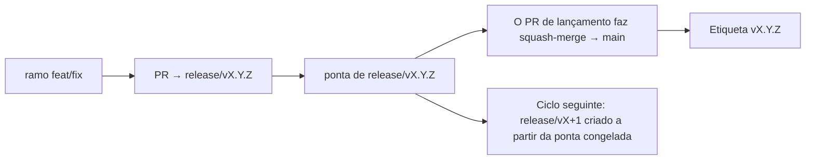

# Branching & Release Model (Português (Portugal))

🌐 **Languages:** 🇺🇸 [English](../../../../ops/BRANCHING_MODEL.md) · 🇪🇹 [am](../../../am/docs/ops/BRANCHING_MODEL.md) · 🇸🇦 [ar](../../../ar/docs/ops/BRANCHING_MODEL.md) · 🇦🇿 [az](../../../az/docs/ops/BRANCHING_MODEL.md) · 🇧🇬 [bg](../../../bg/docs/ops/BRANCHING_MODEL.md) · 🇧🇩 [bn](../../../bn/docs/ops/BRANCHING_MODEL.md) · 🇨🇿 [cs](../../../cs/docs/ops/BRANCHING_MODEL.md) · 🇩🇰 [da](../../../da/docs/ops/BRANCHING_MODEL.md) · 🇩🇪 [de](../../../de/docs/ops/BRANCHING_MODEL.md) · 🇬🇷 [el](../../../el/docs/ops/BRANCHING_MODEL.md) · 🇪🇸 [es](../../../es/docs/ops/BRANCHING_MODEL.md) · 🇪🇪 [et](../../../et/docs/ops/BRANCHING_MODEL.md) · 🇮🇷 [fa](../../../fa/docs/ops/BRANCHING_MODEL.md) · 🇫🇮 [fi](../../../fi/docs/ops/BRANCHING_MODEL.md) · 🇫🇷 [fr](../../../fr/docs/ops/BRANCHING_MODEL.md) · 🇮🇪 [ga](../../../ga/docs/ops/BRANCHING_MODEL.md) · 🇮🇳 [gu](../../../gu/docs/ops/BRANCHING_MODEL.md) · 🇳🇬 [ha](../../../ha/docs/ops/BRANCHING_MODEL.md) · 🇮🇱 [he](../../../he/docs/ops/BRANCHING_MODEL.md) · 🇮🇳 [hi](../../../hi/docs/ops/BRANCHING_MODEL.md) · 🇭🇷 [hr](../../../hr/docs/ops/BRANCHING_MODEL.md) · 🇭🇺 [hu](../../../hu/docs/ops/BRANCHING_MODEL.md) · 🇦🇲 [hy](../../../hy/docs/ops/BRANCHING_MODEL.md) · 🇮🇩 [id](../../../id/docs/ops/BRANCHING_MODEL.md) · 🇳🇬 [ig](../../../ig/docs/ops/BRANCHING_MODEL.md) · 🇮🇹 [it](../../../it/docs/ops/BRANCHING_MODEL.md) · 🇯🇵 [ja](../../../ja/docs/ops/BRANCHING_MODEL.md) · 🇬🇪 [ka](../../../ka/docs/ops/BRANCHING_MODEL.md) · 🇰🇭 [km](../../../km/docs/ops/BRANCHING_MODEL.md) · 🇮🇳 [kn](../../../kn/docs/ops/BRANCHING_MODEL.md) · 🇰🇷 [ko](../../../ko/docs/ops/BRANCHING_MODEL.md) · 🇱🇹 [lt](../../../lt/docs/ops/BRANCHING_MODEL.md) · 🇱🇻 [lv](../../../lv/docs/ops/BRANCHING_MODEL.md) · 🇮🇳 [ml](../../../ml/docs/ops/BRANCHING_MODEL.md) · 🇮🇳 [mr](../../../mr/docs/ops/BRANCHING_MODEL.md) · 🇲🇾 [ms](../../../ms/docs/ops/BRANCHING_MODEL.md) · 🇲🇹 [mt](../../../mt/docs/ops/BRANCHING_MODEL.md) · 🇲🇲 [my](../../../my/docs/ops/BRANCHING_MODEL.md) · 🇳🇵 [ne](../../../ne/docs/ops/BRANCHING_MODEL.md) · 🇳🇱 [nl](../../../nl/docs/ops/BRANCHING_MODEL.md) · 🇳🇴 [no](../../../no/docs/ops/BRANCHING_MODEL.md) · 🇮🇳 [or](../../../or/docs/ops/BRANCHING_MODEL.md) · 🇮🇳 [pa](../../../pa/docs/ops/BRANCHING_MODEL.md) · 🇵🇭 [phi](../../../phi/docs/ops/BRANCHING_MODEL.md) · 🇵🇱 [pl](../../../pl/docs/ops/BRANCHING_MODEL.md) · 🇧🇷 [pt-BR](../../../pt-BR/docs/ops/BRANCHING_MODEL.md) · 🇷🇴 [ro](../../../ro/docs/ops/BRANCHING_MODEL.md) · 🇷🇺 [ru](../../../ru/docs/ops/BRANCHING_MODEL.md) · 🇱🇰 [si](../../../si/docs/ops/BRANCHING_MODEL.md) · 🇸🇰 [sk](../../../sk/docs/ops/BRANCHING_MODEL.md) · 🇸🇮 [sl](../../../sl/docs/ops/BRANCHING_MODEL.md) · 🇷🇸 [sr](../../../sr/docs/ops/BRANCHING_MODEL.md) · 🇸🇪 [sv](../../../sv/docs/ops/BRANCHING_MODEL.md) · 🇰🇪 [sw](../../../sw/docs/ops/BRANCHING_MODEL.md) · 🇮🇳 [ta](../../../ta/docs/ops/BRANCHING_MODEL.md) · 🇮🇳 [te](../../../te/docs/ops/BRANCHING_MODEL.md) · 🇹🇭 [th](../../../th/docs/ops/BRANCHING_MODEL.md) · 🇹🇷 [tr](../../../tr/docs/ops/BRANCHING_MODEL.md) · 🇺🇦 [uk-UA](../../../uk-UA/docs/ops/BRANCHING_MODEL.md) · 🇵🇰 [ur](../../../ur/docs/ops/BRANCHING_MODEL.md) · 🇺🇿 [uz](../../../uz/docs/ops/BRANCHING_MODEL.md) · 🇻🇳 [vi](../../../vi/docs/ops/BRANCHING_MODEL.md) · 🇳🇬 [yo](../../../yo/docs/ops/BRANCHING_MODEL.md) · 🇨🇳 [zh-CN](../../../zh-CN/docs/ops/BRANCHING_MODEL.md) · 🇹🇼 [zh-TW](../../../zh-TW/docs/ops/BRANCHING_MODEL.md)

---

O OmniRoute utiliza um modelo de lançamento de **ciclos paralelos**: um ramo dedicado `release/vX.Y.Z`
para o ciclo ativo, `main` para a linha publicada e uma etiqueta imutável
`vX.Y.Z` quando esse ciclo é lançado. É normal ver commits a chegar a `release/*` _e_ a
`main` — não se trata de um engano.

Os detalhes para os responsáveis pela manutenção encontram-se em `CLAUDE.md` (Regra Rígida n.º 21) e
[RELEASE_CHECKLIST.md](./RELEASE_CHECKLIST.md). Esta página é o resumo público
destinado aos contribuidores.

## Visão geral

| Referência          | Função                                                                                                   |
| ------------------- | -------------------------------------------------------------------------------------------------------- |
| `release/vX.Y.Z`    | **Ciclo ativo** — desenvolvimento diário e integração de PRs para essa versão                            |
| `main`              | **Linha publicada** — recebe o ciclo através de squash-merge quando a versão é lançada                   |
| `vX.Y.Z` (etiqueta) | **Marcador de lançamento** — ponteiro imutável para «o que foi lançado», criado no momento do lançamento |



## Qual deve ser o destino do meu PR?

**Defina como destino o ramo ativo `release/vX.Y.Z` — não `main`.**

1. Encontre o ramo `release/v*` aberto com a versão mais elevada (exemplo no momento da redação:
   `release/v3.8.49`).
2. Crie um ramo a partir dessa ponta (`git fetch` + checkout / rebase sobre a mesma).
3. Abra o PR com **base = esse `release/vX.Y.Z`**.

`main` não é o ramo de integração diária. Os PRs abertos contra `main`
normalmente têm de ser redirecionados antes da integração.

## Congelamento do lançamento (ciclos paralelos)

Quando um lançamento está a ser reconciliado, é aberta uma issue marcadora com a etiqueta `release-freeze`.
Isto **não interrompe o desenvolvimento**:

- O `release/vX.Y.Z` congelado fica a cargo do responsável por esse lançamento.
- O `release/vX+1` do ciclo seguinte é criado a partir da ponta congelada, para que os contribuidores possam continuar
  a integrar trabalho.
- Os PRs abertos que ainda tenham como destino o ramo congelado devem ser **redirecionados** para o
  ramo `release/v*` ativo (com a versão mais elevada).

Verifique se existe um congelamento aberto antes de assumir que o ramo pretendido aceita integrações:

```bash
gh issue list --repo diegosouzapw/OmniRoute --label release-freeze --state open
```

A mecânica de integração (etiqueta `queue` do proprietário → Mergify) está documentada em
[MERGE_TRAIN.md](./MERGE_TRAIN.md).

## Porquê um ramo e uma etiqueta?

| Artefacto         | Duração        | Finalidade                                                            |
| ----------------- | -------------- | --------------------------------------------------------------------- |
| `release/vX.Y.Z`  | Ciclo em curso | Reúne PRs revistos, mantém o CI verde e serve de base para os PRs     |
| Etiqueta `vX.Y.Z` | Permanente     | Marca os elementos exatos que foram lançados no npm / GitHub Releases |

O ramo é a oficina; a etiqueta é o pacote selado. Após o squash-merge para
`main`, o ciclo seguinte prossegue em `release/vX+1` sem esperar que o PR do
lançamento anterior termine.

## Documentação relacionada

- [CONTRIBUTING.md](../../CONTRIBUTING.md) — configuração, testes e lista de verificação do PR
- [RELEASE_CHECKLIST.md](./RELEASE_CHECKLIST.md) — validação antes do lançamento
- [MERGE_TRAIN.md](./MERGE_TRAIN.md) — fila de integração e processo de contingência
- [RELEASE_GREEN.md](./RELEASE_GREEN.md) — manter verde a ponta do ramo de lançamento
