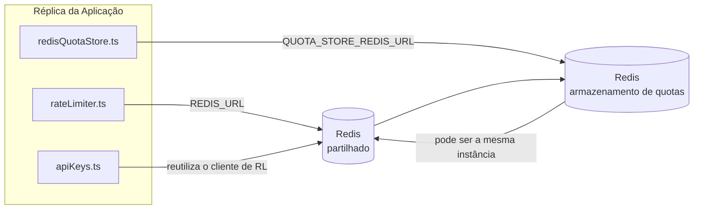

# Redis Production Configuration Guide (Português (Portugal))

🌐 **Languages:** 🇺🇸 [English](../../../../ops/REDIS_PRODUCTION_CONFIG.md) · 🇪🇹 [am](../../../am/docs/ops/REDIS_PRODUCTION_CONFIG.md) · 🇸🇦 [ar](../../../ar/docs/ops/REDIS_PRODUCTION_CONFIG.md) · 🇦🇿 [az](../../../az/docs/ops/REDIS_PRODUCTION_CONFIG.md) · 🇧🇬 [bg](../../../bg/docs/ops/REDIS_PRODUCTION_CONFIG.md) · 🇧🇩 [bn](../../../bn/docs/ops/REDIS_PRODUCTION_CONFIG.md) · 🇧🇦 [bs](../../../bs/docs/ops/REDIS_PRODUCTION_CONFIG.md) · 🇨🇿 [cs](../../../cs/docs/ops/REDIS_PRODUCTION_CONFIG.md) · 🇩🇰 [da](../../../da/docs/ops/REDIS_PRODUCTION_CONFIG.md) · 🇩🇪 [de](../../../de/docs/ops/REDIS_PRODUCTION_CONFIG.md) · 🇬🇷 [el](../../../el/docs/ops/REDIS_PRODUCTION_CONFIG.md) · 🇪🇸 [es](../../../es/docs/ops/REDIS_PRODUCTION_CONFIG.md) · 🇪🇪 [et](../../../et/docs/ops/REDIS_PRODUCTION_CONFIG.md) · 🇮🇷 [fa](../../../fa/docs/ops/REDIS_PRODUCTION_CONFIG.md) · 🇫🇮 [fi](../../../fi/docs/ops/REDIS_PRODUCTION_CONFIG.md) · 🇫🇷 [fr](../../../fr/docs/ops/REDIS_PRODUCTION_CONFIG.md) · 🇮🇪 [ga](../../../ga/docs/ops/REDIS_PRODUCTION_CONFIG.md) · 🇮🇳 [gu](../../../gu/docs/ops/REDIS_PRODUCTION_CONFIG.md) · 🇳🇬 [ha](../../../ha/docs/ops/REDIS_PRODUCTION_CONFIG.md) · 🇮🇱 [he](../../../he/docs/ops/REDIS_PRODUCTION_CONFIG.md) · 🇮🇳 [hi](../../../hi/docs/ops/REDIS_PRODUCTION_CONFIG.md) · 🇭🇷 [hr](../../../hr/docs/ops/REDIS_PRODUCTION_CONFIG.md) · 🇭🇺 [hu](../../../hu/docs/ops/REDIS_PRODUCTION_CONFIG.md) · 🇦🇲 [hy](../../../hy/docs/ops/REDIS_PRODUCTION_CONFIG.md) · 🇮🇩 [id](../../../id/docs/ops/REDIS_PRODUCTION_CONFIG.md) · 🇳🇬 [ig](../../../ig/docs/ops/REDIS_PRODUCTION_CONFIG.md) · 🇮🇹 [it](../../../it/docs/ops/REDIS_PRODUCTION_CONFIG.md) · 🇯🇵 [ja](../../../ja/docs/ops/REDIS_PRODUCTION_CONFIG.md) · 🇬🇪 [ka](../../../ka/docs/ops/REDIS_PRODUCTION_CONFIG.md) · 🇰🇭 [km](../../../km/docs/ops/REDIS_PRODUCTION_CONFIG.md) · 🇮🇳 [kn](../../../kn/docs/ops/REDIS_PRODUCTION_CONFIG.md) · 🇰🇷 [ko](../../../ko/docs/ops/REDIS_PRODUCTION_CONFIG.md) · 🇱🇹 [lt](../../../lt/docs/ops/REDIS_PRODUCTION_CONFIG.md) · 🇱🇻 [lv](../../../lv/docs/ops/REDIS_PRODUCTION_CONFIG.md) · 🇮🇳 [ml](../../../ml/docs/ops/REDIS_PRODUCTION_CONFIG.md) · 🇮🇳 [mr](../../../mr/docs/ops/REDIS_PRODUCTION_CONFIG.md) · 🇲🇾 [ms](../../../ms/docs/ops/REDIS_PRODUCTION_CONFIG.md) · 🇲🇹 [mt](../../../mt/docs/ops/REDIS_PRODUCTION_CONFIG.md) · 🇲🇲 [my](../../../my/docs/ops/REDIS_PRODUCTION_CONFIG.md) · 🇳🇵 [ne](../../../ne/docs/ops/REDIS_PRODUCTION_CONFIG.md) · 🇳🇱 [nl](../../../nl/docs/ops/REDIS_PRODUCTION_CONFIG.md) · 🇳🇴 [no](../../../no/docs/ops/REDIS_PRODUCTION_CONFIG.md) · 🇮🇳 [or](../../../or/docs/ops/REDIS_PRODUCTION_CONFIG.md) · 🇮🇳 [pa](../../../pa/docs/ops/REDIS_PRODUCTION_CONFIG.md) · 🇵🇭 [phi](../../../phi/docs/ops/REDIS_PRODUCTION_CONFIG.md) · 🇵🇱 [pl](../../../pl/docs/ops/REDIS_PRODUCTION_CONFIG.md) · 🇧🇷 [pt-BR](../../../pt-BR/docs/ops/REDIS_PRODUCTION_CONFIG.md) · 🇷🇴 [ro](../../../ro/docs/ops/REDIS_PRODUCTION_CONFIG.md) · 🇷🇺 [ru](../../../ru/docs/ops/REDIS_PRODUCTION_CONFIG.md) · 🇱🇰 [si](../../../si/docs/ops/REDIS_PRODUCTION_CONFIG.md) · 🇸🇰 [sk](../../../sk/docs/ops/REDIS_PRODUCTION_CONFIG.md) · 🇸🇮 [sl](../../../sl/docs/ops/REDIS_PRODUCTION_CONFIG.md) · 🇷🇸 [sr](../../../sr/docs/ops/REDIS_PRODUCTION_CONFIG.md) · 🇸🇪 [sv](../../../sv/docs/ops/REDIS_PRODUCTION_CONFIG.md) · 🇰🇪 [sw](../../../sw/docs/ops/REDIS_PRODUCTION_CONFIG.md) · 🇮🇳 [ta](../../../ta/docs/ops/REDIS_PRODUCTION_CONFIG.md) · 🇮🇳 [te](../../../te/docs/ops/REDIS_PRODUCTION_CONFIG.md) · 🇹🇭 [th](../../../th/docs/ops/REDIS_PRODUCTION_CONFIG.md) · 🇹🇷 [tr](../../../tr/docs/ops/REDIS_PRODUCTION_CONFIG.md) · 🇺🇦 [uk-UA](../../../uk-UA/docs/ops/REDIS_PRODUCTION_CONFIG.md) · 🇵🇰 [ur](../../../ur/docs/ops/REDIS_PRODUCTION_CONFIG.md) · 🇺🇿 [uz](../../../uz/docs/ops/REDIS_PRODUCTION_CONFIG.md) · 🇻🇳 [vi](../../../vi/docs/ops/REDIS_PRODUCTION_CONFIG.md) · 🇳🇬 [yo](../../../yo/docs/ops/REDIS_PRODUCTION_CONFIG.md) · 🇨🇳 [zh-CN](../../../zh-CN/docs/ops/REDIS_PRODUCTION_CONFIG.md) · 🇹🇼 [zh-TW](../../../zh-TW/docs/ops/REDIS_PRODUCTION_CONFIG.md)

---

## Visão geral

O Redis é uma **dependência opcional e não obrigatória** no OmniRoute — a aplicação reduz graciosamente as suas funcionalidades (recorrendo a alternativas
em memória) quando o Redis não está disponível. Em produção, o ajuste do Redis reduz a latência de quatro cargas de trabalho
distintas:

| Carga de trabalho        | Controlador                   | Fábrica de clientes                                                 | Padrão de chave                                          |
| ------------------------ | ----------------------------- | ------------------------------------------------------------------- | -------------------------------------------------------- |
| Limitação de taxa        | `rateLimiter.ts`              | `getRedisClient()` — singleton `ioredis` com inicialização diferida | Janelas de limitação de taxa Lua atómicas `<prefix>rl:*` |
| Cache de autenticação    | `apiKeys.ts`                  | Reutiliza o cliente de `rateLimiter`                                | `<prefix>auth:api_key:<sha256>` com TTL                  |
| Armazenamento de quotas  | `redisQuotaStore.ts`          | Singleton `getRedisClient(url)` separado                            | `<prefix>quota:*` configurável por instância             |
| Disjuntor de aquecimento | `redisCircuitBreakerStore.ts` | Cliente separado em `circuitBreakerFactory.ts`                      | `<prefix>warmup:cb:<connectionId>`                       |

As quatro cargas de trabalho partilham um único prefixo de espaço de nomes, para que o OmniRoute possa coexistir com outras aplicações numa
única instância do Redis (por exemplo, `127.0.0.1:6379`). Consulte [Espaços de nomes das chaves](#key-namespacing).

---

## Configuração atual (predefinições do código)

| Definição                                    | Valor                                                              | Localização                                                                           |
| -------------------------------------------- | ------------------------------------------------------------------ | ------------------------------------------------------------------------------------- |
| Variável de ambiente `REDIS_URL`             | `redis://redis:6379` (compose), opcional                           | `rateLimiter.ts:5`, `.env.example`                                                    |
| Variável de ambiente `REDIS_KEY_PREFIX`      | `omniroute:` (predefinição)                                        | `rateLimiter.ts`, `redisQuotaStore.ts`, `redisCircuitBreakerStore.ts`, `.env.example` |
| Variável de ambiente `QUOTA_STORE_REDIS_URL` | separada, pode ser diferente de `REDIS_URL`                        | `quota/storeFactory.ts`                                                               |
| `QUOTA_STORE_DRIVER`                         | `"sqlite"` (predefinição), `"redis"` opcional                      | `quota/storeFactory.ts`                                                               |
| `maxRetriesPerRequest` do ioredis            | `3`                                                                | criação do cliente em `rateLimiter.ts`                                                |
| `enableReadyCheck`                           | não definido (predefinição do ioredis: `true`)                     | —                                                                                     |
| `lazyConnect`                                | não definido (predefinição do ioredis: `false`)                    | —                                                                                     |
| `retryStrategy`                              | não definido (predefinição do ioredis: base de 200ms, exponencial) | —                                                                                     |
| TLS / palavra-passe / índice da BD           | **não configurados**                                               | —                                                                                     |
| Sentinel / Cluster                           | **não configurados** — apenas nó único autónomo                    | —                                                                                     |

---

## Espaços de nomes das chaves

O OmniRoute partilha uma instância do Redis com quaisquer outros serviços executados no anfitrião. Sem um espaço de nomes,
chaves como `auth:api_key:<sha256>` ou `rl:*` podem entrar em conflito com chaves de outras aplicações
que utilizem o mesmo Redis (esta instância executa o Redis em `127.0.0.1:6379` juntamente com outros serviços).

Defina `REDIS_KEY_PREFIX` como uma cadeia não vazia para adicionar um prefixo a **todas** as chaves do OmniRoute:

```bash
# .env — todas as chaves do OmniRoute passam a ser omniroute:rl:*, omniroute:auth:*, omniroute:quota:*, omniroute:warmup:cb:*
REDIS_KEY_PREFIX=omniroute:
```

- **Predefinição:** `omniroute:` (aplicada quando `REDIS_KEY_PREFIX` não está definida ou está vazia).
- **Aplicado a:** limitador de taxa + cache de autenticação (cliente `ioredis` partilhado através de `keyPrefix`), ao
  armazenamento de quotas (`KEY_PREFIX = "${REDIS_KEY_PREFIX}quota"`) e ao disjuntor de aquecimento
  (`KEY_PREFIX = "${REDIS_KEY_PREFIX}warmup:cb:"`).
- **Alterar o prefixo** quando já existem chaves no Redis torna as chaves antigas órfãs (expiram
  através de TTL / LRU). A alteração é segura; não é necessária qualquer migração. A única exceção é uma chave do
  disjuntor de aquecimento para uma ligação marcada como proibida: esta é persistida sem TTL, pelo que deve
  listar os resíduos com `redis-cli --scan --pattern '<old-prefix>warmup:cb:*'` e eliminá-los.
- O **`keyPrefix` do ioredis** adiciona automaticamente o prefixo nas escritas **e** remove-o nas leituras,
  pelo que o código da aplicação nunca vê o prefixo.

---

## Ajustes Recomendados para Produção

### 1. Opções do Pool de Ligações / Cliente (construtor `Redis` do ioredis)

O código atual cria uma única instância `new Redis(url)` sem opções personalizadas. Para implementações de produção com várias réplicas, passe uma factory de cliente no código ou encapsule `getRedisClient()`:

```typescript
const redis = new Redis(REDIS_URL, {
  maxRetriesPerRequest: null, // sem limite de tentativas; deixar retryStrategy decidir
  enableReadyCheck: true, // verificar se o servidor está pronto antes de aceitar chamadas
  lazyConnect: true, // não estabelecer ligação ao criar; aguardar a primeira chamada
  retryStrategy: (times) => {
    if (times > 10) return null; // desistir após 10 tentativas → voltar a ligar mais tarde
    return Math.min(times * 200, 5000); // 200 ms, 400 ms, …, limite de 5 s
  },
  enableAutoPipelining: true, // agregar comandos simultâneos numa única escrita TCP
  keepAlive: 10000, // keep-alive TCP a cada 10 s
});
```

**Principais compromissos:**

- `maxRetriesPerRequest: null` + `retryStrategy` — opção preferencial para produção, para que os reinícios transitórios do Redis não provoquem imediatamente a falha de todos os pedidos. O fallback em memória de `checkRateLimit()` absorve o percurso de falha.
- `lazyConnect: true` — evita que o arranque dependa de o Redis estar disponível antes de o servidor começar a aceitar ligações.
- `enableAutoPipelining: true` — reduz as viagens de ida e volta para verificações simultâneas de limites de pedidos; benéfico acima de 50 RPS numa única ligação.

### 2. Configuração do Servidor Redis (`redis.conf`)

```
# Memória
maxmemory 80%                        # deixar espaço para a cache de páginas do SO
maxmemory-policy allkeys-lru         # remover entradas antigas da cache de autenticação sob pressão

# Persistência (opcional — o OmniRoute é resistente a falhas sem esta opção)
save 300 1                           # criar um instantâneo pelo menos a cada 5 min se ≥1 chave tiver sido alterada
appendonly no                        # AOF desnecessário; os dados podem ser regenerados
appendfsync no                       # sem sobrecarga de fsync (RDB é suficiente)

# Rede
timeout 0                            # não desligar ligações inativas
tcp-keepalive 300                    # keep-alive de 5 min
tcp-backlog 511                      # fila de ligações para picos de carga

# Desempenho
hz 10                                # predefinição; 100 para casos sensíveis à latência
activedefrag yes                     # desfragmentar automaticamente quando a fragmentação for >10%
```

**Compromisso de `maxmemory-policy allkeys-lru`:** As entradas da cache de autenticação podem ser removidas sob pressão de memória. Isto é seguro — `setCachedApiKey` repõe sempre os dados quando estes não são encontrados, e o fallback para SQLite é a fonte autoritativa. O script Lua do limitador de pedidos cria chaves pequenas que, por definição, têm uma duração curta.

### 3. Definições do Docker Compose

O ficheiro Compose de produção (`docker-compose.prod.yml`) utiliza `redis:8.6.2-alpine`. Adicione:

```yaml
redis:
  image: redis:8.6.2-alpine
  command:
    [
      "redis-server",
      "--maxmemory",
      "512mb",
      "--maxmemory-policy",
      "allkeys-lru",
      "--activedefrag",
      "yes",
      "--save",
      "300 1",
    ]
  healthcheck:
    test: ["CMD", "redis-cli", "ping"]
    interval: 10s
    timeout: 3s
    retries: 3
    start_period: 5s
```

### 4. Considerações sobre Múltiplas Instâncias / Escalabilidade

**Um único Redis para todas as réplicas** — o script Lua do limitador de pedidos depende de um único espaço de chaves autoritativo. A utilização de várias instâncias Redis por trás das réplicas faria perder a atomicidade e duplicaria o orçamento. Utilize uma única instância Redis (ou um cluster Redis Sentinel com ativação pós-falha) para todas as réplicas da aplicação.

**Número de ligações:** Cada réplica da aplicação abre **2 ligações TCP** ao Redis (cliente do limitador de pedidos + cliente do armazenamento de quotas). Com 10 réplicas → 20 ligações, um valor muito abaixo do limite predefinido de 10 mil ligações de uma instância Redis.

### 5. Monitorização

Exponha através do endpoint de verificação de estado:

```typescript
// src/app/api/monitoring/health/route.ts já chama funções de rateLimiter
// Adicionar verificações específicas do Redis:
//   1. Latência de PING através de .ping() do ioredis
//   2. Utilização de memória através de INFO memory
//   3. Número de ligações através de INFO clients
//   4. Taxa de acertos de maxmemory-policy (evicted_keys / keyspace_hits)
```

Principais métricas a monitorizar:

- **Chaves removidas / s** — se o valor for persistentemente diferente de zero, aumente `maxmemory`
- **Clientes bloqueados** — um valor diferente de zero sugere scripts Lua lentos ou contenção elevada
- **Ligações rejeitadas** — o limite de ligações foi atingido; situação rara com 20 ligações

---

## Diagrama de Arquitetura



---

## Referências

| Ficheiro                           | Finalidade                                                                          |
| ---------------------------------- | ----------------------------------------------------------------------------------- |
| `src/shared/utils/rateLimiter.ts`  | Cliente Redis principal, script Lua de limitação de pedidos, alternativa em memória |
| `src/lib/db/apiKeys.ts`            | Cache de autenticação — alternativa Redis→SQLite                                    |
| `src/lib/quota/redisQuotaStore.ts` | Cliente Redis separado para o armazenamento de quotas opcional                      |
| `src/lib/quota/storeFactory.ts`    | Alterna entre os controladores de quotas `sqlite` e `redis`                         |
| `docker-compose.prod.yml`          | Contentor Redis de produção (imagem `redis:8.6.2-alpine`)                           |
| `.env.example`                     | Documentação das variáveis de ambiente do Redis                                     |
| `src/app/api/local/redis/`         | Rotas da API para orquestração do contentor de desenvolvimento                      |
| `bin/cli/commands/redis.mjs`       | Comandos da CLI para orquestração do contentor de desenvolvimento                   |
