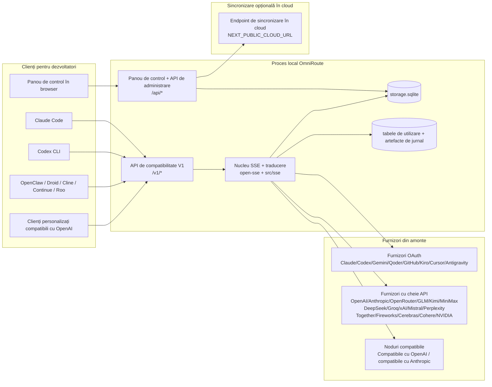
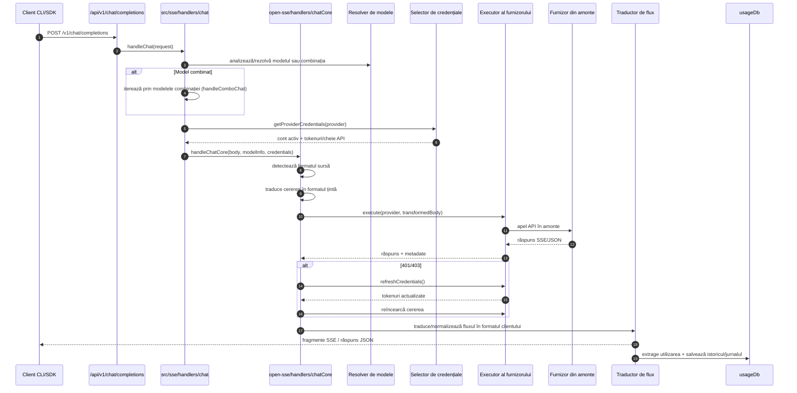
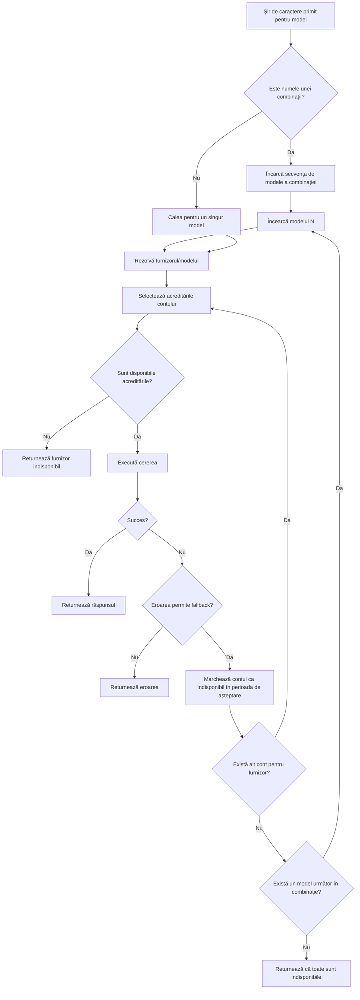
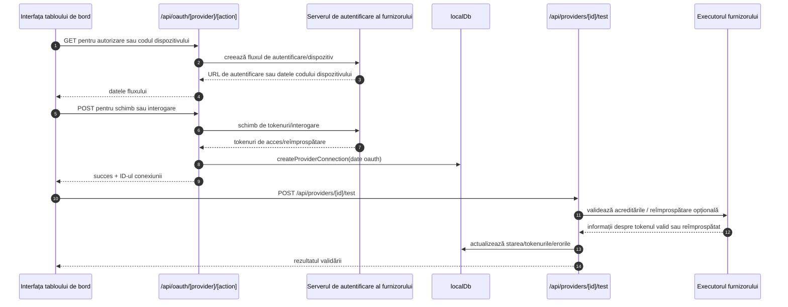
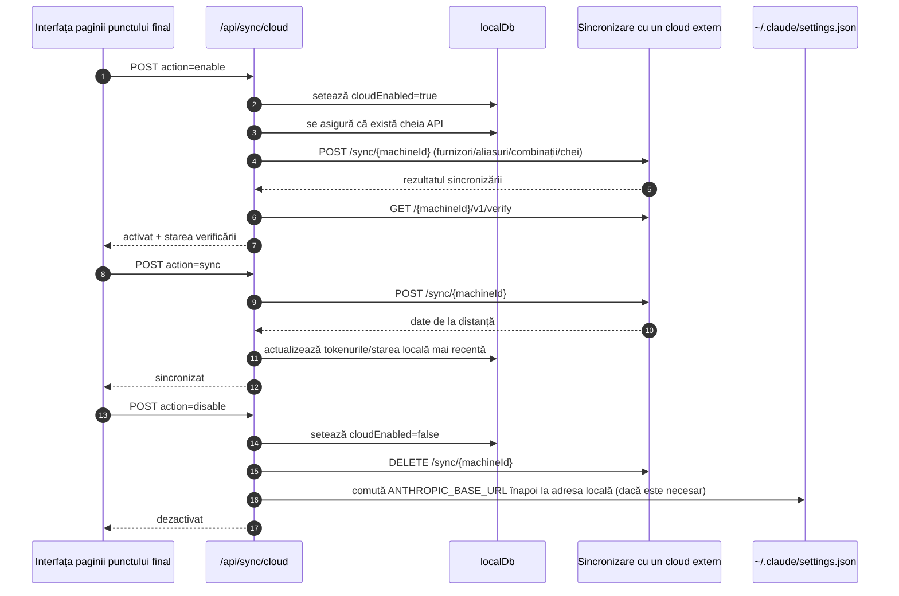
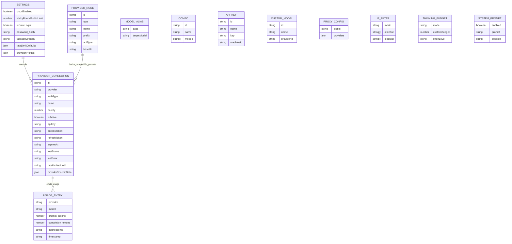
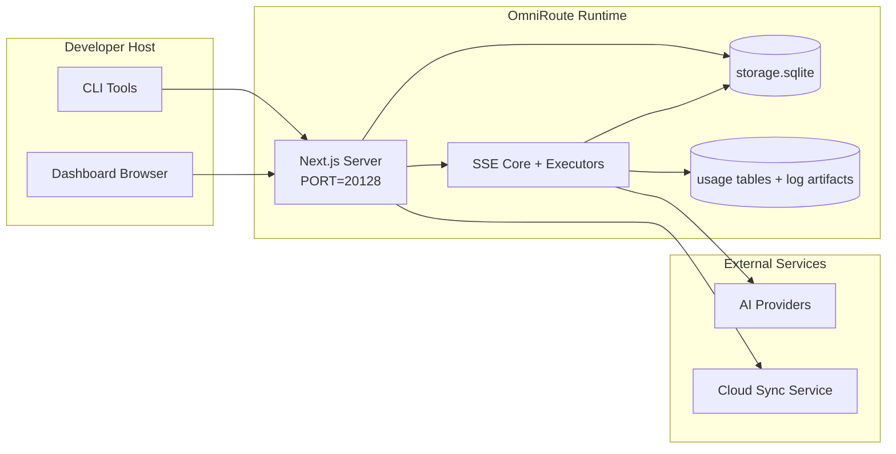

# OmniRoute Architecture (Română)

🌐 **Languages:** 🇺🇸 [English](../../../../architecture/ARCHITECTURE.md) · 🇪🇹 [am](../../../am/docs/architecture/ARCHITECTURE.md) · 🇸🇦 [ar](../../../ar/docs/architecture/ARCHITECTURE.md) · 🇦🇿 [az](../../../az/docs/architecture/ARCHITECTURE.md) · 🇧🇬 [bg](../../../bg/docs/architecture/ARCHITECTURE.md) · 🇧🇩 [bn](../../../bn/docs/architecture/ARCHITECTURE.md) · 🇨🇿 [cs](../../../cs/docs/architecture/ARCHITECTURE.md) · 🇩🇰 [da](../../../da/docs/architecture/ARCHITECTURE.md) · 🇩🇪 [de](../../../de/docs/architecture/ARCHITECTURE.md) · 🇬🇷 [el](../../../el/docs/architecture/ARCHITECTURE.md) · 🇪🇸 [es](../../../es/docs/architecture/ARCHITECTURE.md) · 🇪🇪 [et](../../../et/docs/architecture/ARCHITECTURE.md) · 🇮🇷 [fa](../../../fa/docs/architecture/ARCHITECTURE.md) · 🇫🇮 [fi](../../../fi/docs/architecture/ARCHITECTURE.md) · 🇫🇷 [fr](../../../fr/docs/architecture/ARCHITECTURE.md) · 🇮🇪 [ga](../../../ga/docs/architecture/ARCHITECTURE.md) · 🇮🇳 [gu](../../../gu/docs/architecture/ARCHITECTURE.md) · 🇳🇬 [ha](../../../ha/docs/architecture/ARCHITECTURE.md) · 🇮🇱 [he](../../../he/docs/architecture/ARCHITECTURE.md) · 🇮🇳 [hi](../../../hi/docs/architecture/ARCHITECTURE.md) · 🇭🇷 [hr](../../../hr/docs/architecture/ARCHITECTURE.md) · 🇭🇺 [hu](../../../hu/docs/architecture/ARCHITECTURE.md) · 🇦🇲 [hy](../../../hy/docs/architecture/ARCHITECTURE.md) · 🇮🇩 [id](../../../id/docs/architecture/ARCHITECTURE.md) · 🇳🇬 [ig](../../../ig/docs/architecture/ARCHITECTURE.md) · 🇮🇹 [it](../../../it/docs/architecture/ARCHITECTURE.md) · 🇯🇵 [ja](../../../ja/docs/architecture/ARCHITECTURE.md) · 🇬🇪 [ka](../../../ka/docs/architecture/ARCHITECTURE.md) · 🇰🇭 [km](../../../km/docs/architecture/ARCHITECTURE.md) · 🇮🇳 [kn](../../../kn/docs/architecture/ARCHITECTURE.md) · 🇰🇷 [ko](../../../ko/docs/architecture/ARCHITECTURE.md) · 🇱🇹 [lt](../../../lt/docs/architecture/ARCHITECTURE.md) · 🇱🇻 [lv](../../../lv/docs/architecture/ARCHITECTURE.md) · 🇮🇳 [ml](../../../ml/docs/architecture/ARCHITECTURE.md) · 🇮🇳 [mr](../../../mr/docs/architecture/ARCHITECTURE.md) · 🇲🇾 [ms](../../../ms/docs/architecture/ARCHITECTURE.md) · 🇲🇹 [mt](../../../mt/docs/architecture/ARCHITECTURE.md) · 🇲🇲 [my](../../../my/docs/architecture/ARCHITECTURE.md) · 🇳🇵 [ne](../../../ne/docs/architecture/ARCHITECTURE.md) · 🇳🇱 [nl](../../../nl/docs/architecture/ARCHITECTURE.md) · 🇳🇴 [no](../../../no/docs/architecture/ARCHITECTURE.md) · 🇮🇳 [or](../../../or/docs/architecture/ARCHITECTURE.md) · 🇮🇳 [pa](../../../pa/docs/architecture/ARCHITECTURE.md) · 🇵🇭 [phi](../../../phi/docs/architecture/ARCHITECTURE.md) · 🇵🇱 [pl](../../../pl/docs/architecture/ARCHITECTURE.md) · 🇵🇹 [pt](../../../pt/docs/architecture/ARCHITECTURE.md) · 🇧🇷 [pt-BR](../../../pt-BR/docs/architecture/ARCHITECTURE.md) · 🇷🇺 [ru](../../../ru/docs/architecture/ARCHITECTURE.md) · 🇱🇰 [si](../../../si/docs/architecture/ARCHITECTURE.md) · 🇸🇰 [sk](../../../sk/docs/architecture/ARCHITECTURE.md) · 🇸🇮 [sl](../../../sl/docs/architecture/ARCHITECTURE.md) · 🇷🇸 [sr](../../../sr/docs/architecture/ARCHITECTURE.md) · 🇸🇪 [sv](../../../sv/docs/architecture/ARCHITECTURE.md) · 🇰🇪 [sw](../../../sw/docs/architecture/ARCHITECTURE.md) · 🇮🇳 [ta](../../../ta/docs/architecture/ARCHITECTURE.md) · 🇮🇳 [te](../../../te/docs/architecture/ARCHITECTURE.md) · 🇹🇭 [th](../../../th/docs/architecture/ARCHITECTURE.md) · 🇹🇷 [tr](../../../tr/docs/architecture/ARCHITECTURE.md) · 🇺🇦 [uk-UA](../../../uk-UA/docs/architecture/ARCHITECTURE.md) · 🇵🇰 [ur](../../../ur/docs/architecture/ARCHITECTURE.md) · 🇺🇿 [uz](../../../uz/docs/architecture/ARCHITECTURE.md) · 🇻🇳 [vi](../../../vi/docs/architecture/ARCHITECTURE.md) · 🇳🇬 [yo](../../../yo/docs/architecture/ARCHITECTURE.md) · 🇨🇳 [zh-CN](../../../zh-CN/docs/architecture/ARCHITECTURE.md) · 🇹🇼 [zh-TW](../../../zh-TW/docs/architecture/ARCHITECTURE.md)

---

🌐 **Languages:** 🇺🇸 [English](../../../../architecture/ARCHITECTURE.md) · 🇪🇹 [am](../../../am/docs/architecture/ARCHITECTURE.md) · 🇸🇦 [ar](../../../ar/docs/architecture/ARCHITECTURE.md) · 🇦🇿 [az](../../../az/docs/architecture/ARCHITECTURE.md) · 🇧🇬 [bg](../../../bg/docs/architecture/ARCHITECTURE.md) · 🇧🇩 [bn](../../../bn/docs/architecture/ARCHITECTURE.md) · 🇨🇿 [cs](../../../cs/docs/architecture/ARCHITECTURE.md) · 🇩🇰 [da](../../../da/docs/architecture/ARCHITECTURE.md) · 🇩🇪 [de](../../../de/docs/architecture/ARCHITECTURE.md) · 🇬🇷 [el](../../../el/docs/architecture/ARCHITECTURE.md) · 🇪🇸 [es](../../../es/docs/architecture/ARCHITECTURE.md) · 🇪🇪 [et](../../../et/docs/architecture/ARCHITECTURE.md) · 🇮🇷 [fa](../../../fa/docs/architecture/ARCHITECTURE.md) · 🇫🇮 [fi](../../../fi/docs/architecture/ARCHITECTURE.md) · 🇫🇷 [fr](../../../fr/docs/architecture/ARCHITECTURE.md) · 🇮🇪 [ga](../../../ga/docs/architecture/ARCHITECTURE.md) · 🇮🇳 [gu](../../../gu/docs/architecture/ARCHITECTURE.md) · 🇳🇬 [ha](../../../ha/docs/architecture/ARCHITECTURE.md) · 🇮🇱 [he](../../../he/docs/architecture/ARCHITECTURE.md) · 🇮🇳 [hi](../../../hi/docs/architecture/ARCHITECTURE.md) · 🇭🇷 [hr](../../../hr/docs/architecture/ARCHITECTURE.md) · 🇭🇺 [hu](../../../hu/docs/architecture/ARCHITECTURE.md) · 🇦🇲 [hy](../../../hy/docs/architecture/ARCHITECTURE.md) · 🇮🇩 [id](../../../id/docs/architecture/ARCHITECTURE.md) · 🇳🇬 [ig](../../../ig/docs/architecture/ARCHITECTURE.md) · 🇮🇹 [it](../../../it/docs/architecture/ARCHITECTURE.md) · 🇯🇵 [ja](../../../ja/docs/architecture/ARCHITECTURE.md) · 🇬🇪 [ka](../../../ka/docs/architecture/ARCHITECTURE.md) · 🇰🇭 [km](../../../km/docs/architecture/ARCHITECTURE.md) · 🇮🇳 [kn](../../../kn/docs/architecture/ARCHITECTURE.md) · 🇰🇷 [ko](../../../ko/docs/architecture/ARCHITECTURE.md) · 🇱🇹 [lt](../../../lt/docs/architecture/ARCHITECTURE.md) · 🇱🇻 [lv](../../../lv/docs/architecture/ARCHITECTURE.md) · 🇮🇳 [ml](../../../ml/docs/architecture/ARCHITECTURE.md) · 🇮🇳 [mr](../../../mr/docs/architecture/ARCHITECTURE.md) · 🇲🇾 [ms](../../../ms/docs/architecture/ARCHITECTURE.md) · 🇲🇹 [mt](../../../mt/docs/architecture/ARCHITECTURE.md) · 🇲🇲 [my](../../../my/docs/architecture/ARCHITECTURE.md) · 🇳🇵 [ne](../../../ne/docs/architecture/ARCHITECTURE.md) · 🇳🇱 [nl](../../../nl/docs/architecture/ARCHITECTURE.md) · 🇳🇴 [no](../../../no/docs/architecture/ARCHITECTURE.md) · 🇮🇳 [or](../../../or/docs/architecture/ARCHITECTURE.md) · 🇮🇳 [pa](../../../pa/docs/architecture/ARCHITECTURE.md) · 🇵🇭 [phi](../../../phi/docs/architecture/ARCHITECTURE.md) · 🇵🇱 [pl](../../../pl/docs/architecture/ARCHITECTURE.md) · 🇵🇹 [pt](../../../pt/docs/architecture/ARCHITECTURE.md) · 🇧🇷 [pt-BR](../../../pt-BR/docs/architecture/ARCHITECTURE.md) · 🇷🇺 [ru](../../../ru/docs/architecture/ARCHITECTURE.md) · 🇱🇰 [si](../../../si/docs/architecture/ARCHITECTURE.md) · 🇸🇰 [sk](../../../sk/docs/architecture/ARCHITECTURE.md) · 🇸🇮 [sl](../../../sl/docs/architecture/ARCHITECTURE.md) · 🇷🇸 [sr](../../../sr/docs/architecture/ARCHITECTURE.md) · 🇸🇪 [sv](../../../sv/docs/architecture/ARCHITECTURE.md) · 🇰🇪 [sw](../../../sw/docs/architecture/ARCHITECTURE.md) · 🇮🇳 [ta](../../../ta/docs/architecture/ARCHITECTURE.md) · 🇮🇳 [te](../../../te/docs/architecture/ARCHITECTURE.md) · 🇹🇭 [th](../../../th/docs/architecture/ARCHITECTURE.md) · 🇹🇷 [tr](../../../tr/docs/architecture/ARCHITECTURE.md) · 🇺🇦 [uk-UA](../../../uk-UA/docs/architecture/ARCHITECTURE.md) · 🇵🇰 [ur](../../../ur/docs/architecture/ARCHITECTURE.md) · 🇺🇿 [uz](../../../uz/docs/architecture/ARCHITECTURE.md) · 🇻🇳 [vi](../../../vi/docs/architecture/ARCHITECTURE.md) · 🇳🇬 [yo](../../../yo/docs/architecture/ARCHITECTURE.md) · 🇨🇳 [zh-CN](../../../zh-CN/docs/architecture/ARCHITECTURE.md) · 🇹🇼 [zh-TW](../../../zh-TW/docs/architecture/ARCHITECTURE.md)

_Ultima actualizare: 2026-06-28_

## Rezumat executiv

OmniRoute este un gateway local de rutare AI și un tablou de bord construit pe Next.js.
Acesta oferă un singur endpoint compatibil cu OpenAI (`/v1/*`) și rutează traficul către mai mulți furnizori upstream, cu traducere, fallback, reîmprospătarea tokenurilor și monitorizarea utilizării.

Capabilități principale:

- Suprafață API compatibilă cu OpenAI pentru CLI/instrumente (355 de furnizori, 108 executori)
- Traducerea cererilor/răspunsurilor între formatele furnizorilor
- Fallback pentru combinații de modele (secvență cu mai multe modele)
- Pași structurați pentru combinații (`provider + model + connection`), cu ordonare la rulare pe baza `compositeTiers`
- Fallback la nivel de cont (mai multe conturi per furnizor)
- Verificare preliminară a cotei și selectarea conturilor P2C în funcție de cotă în fluxul principal de chat
- Gestionarea conexiunilor la furnizori prin OAuth și chei API (22 de module de furnizori OAuth)
- Generarea de embeddinguri prin `/v1/embeddings` (18 furnizori)
- Generarea de imagini prin `/v1/images/generations` (peste 10 furnizori, peste 20 de modele)
- Transcriere audio prin `/v1/audio/transcriptions` (18 furnizori)
- Conversie text în vorbire prin `/v1/audio/speech` (24 de furnizori integrați)
- Generarea de videoclipuri prin `/v1/videos/generations` (ComfyUI + SD WebUI)
- Generarea de muzică prin `/v1/music/generations` (ComfyUI)
- Căutare web prin `/v1/search` (20 de furnizori)
- Moderare prin `/v1/moderations`
- Reordonare după relevanță prin `/v1/rerank`
- Parsarea etichetelor de gândire (`<think>...</think>`) pentru modelele de raționament
- Igienizarea răspunsurilor pentru compatibilitate strictă cu SDK-ul OpenAI
- Normalizarea rolurilor (developer→system, system→user) pentru compatibilitate între furnizori
- Conversia ieșirilor structurate (json_schema → Gemini responseSchema)
- Persistență locală pentru furnizori, chei, aliasuri, combinații, setări și prețuri (122 de module DB)
- Monitorizarea utilizării/costurilor și jurnalizarea cererilor
- Sincronizare opțională în cloud pentru sincronizarea stării între mai multe dispozitive
- Listă de permisiuni/blocări IP pentru controlul accesului la API
- Gestionarea bugetului de gândire (passthrough/automat/personalizat/adaptiv)
- Injectarea globală a promptului de sistem
- Urmărirea sesiunilor și amprentare
- Limitare îmbunătățită a ratei per cont, cu profiluri specifice furnizorilor
- Model de întrerupător de circuit pentru reziliența furnizorilor
- Protecție împotriva efectului „thundering herd” prin blocare cu mutex
- Cache pentru deduplicarea cererilor pe baza semnăturii
- Strat de domeniu: reguli de cost, politică de fallback, politică de blocare
- Context Relay: rezumate de transfer al sesiunii pentru continuitate la rotația conturilor
- Persistența stării domeniului (cache SQLite cu scriere imediată pentru fallbackuri, bugete, blocări și întrerupătoare de circuit)
- Motor de politici pentru evaluarea centralizată a cererilor (blocare → buget → fallback)
- Telemetrie pentru cereri, cu agregarea latențelor p50/p95/p99
- Telemetrie pentru țintele combinațiilor și istoricul stării acestora prin `combo_execution_key` / `combo_step_id`
- ID de corelare (X-Request-Id) pentru urmărire de la un capăt la altul
- Jurnalizare de audit pentru conformitate, cu posibilitate de dezactivare per cheie API
- Cadru de evaluare pentru asigurarea calității LLM
- Tablou de bord pentru starea de sănătate, cu starea în timp real a întrerupătoarelor de circuit ale furnizorilor
- Server MCP (110 instrumente) cu 3 mecanisme de transport (stdio/SSE/Streamable HTTP)
- Server A2A (JSON-RPC 2.0 + SSE), cu abilități și ciclu de viață al sarcinilor
- Sistem de memorie (extragere, injectare, regăsire, rezumare)
- Sistem de abilități (registru, executor, sandbox, abilități integrate)
- Proxy MITM cu gestionarea certificatelor și DNS
- Middleware de protecție împotriva injectării de prompturi
- Flux de comprimare a prompturilor cu Caveman, RTK, fluxuri suprapuse, combinații de comprimare, pachete lingvistice și analize
- Registru ACP (Agent Communication Protocol)
- Furnizori OAuth modulari (22 de module individuale în `src/lib/oauth/providers/`)
- Scripturi de dezinstalare/dezinstalare completă
- Acțiune de reparare a mediului OAuth
- Punte WebSocket pentru clienți WS compatibili cu OpenAI (`/v1/ws`)
- Gestionarea tokenurilor de sincronizare (emitere/revocare, descărcarea pachetului de configurare versionat prin ETag)
- Presetare de furnizor de prim rang pentru GLM Thinking (`glmt`)
- Numărare hibridă a tokenurilor (`/messages/count_tokens` la furnizor, cu estimare ca fallback)
- Inițializarea automată a aliasurilor de modele (peste 30 de normalizări între dialectele proxy la pornire)
- Preluare outbound sigură, cu protecție SSRF, blocarea URL-urilor private și reîncercări configurabile
- Reîncercări pentru chat care țin cont de perioada de așteptare, cu `requestRetry` și `maxRetryIntervalSec` configurabile
- Validarea mediului de rulare cu Zod la pornire
- Audit de conformitate v2, cu paginare, evenimente CRUD pentru furnizori și jurnalizarea validărilor blocate de SSRF

Model principal de rulare:

- Rutele aplicației Next.js din `src/app/api/*` implementează atât API-urile tabloului de bord, cât și API-urile de compatibilitate
- Un nucleu SSE/de rutare partajat în `src/sse/*` + `open-sse/*` gestionează execuția furnizorilor, traducerea, streamingul, mecanismele de fallback și utilizarea

## Diagrame de referință

Sursele Mermaid canonice, cu versiuni controlate, pentru platforma v3.8.0 se află în
[`docs/diagrams/`](../diagrams/README.md). Două dintre acestea sunt reproduse mai jos pentru orientare;
celelalte sunt incluse ca linkuri în ghidurile specifice domeniilor lor.


> Sursă: [diagrams/request-pipeline.mmd](../diagrams/request-pipeline.mmd)


> Sursă: [diagrams/resilience-3layers.mmd](../diagrams/resilience-3layers.mmd) — inclus și ca link în
> [RESILIENCE_GUIDE.md](./RESILIENCE_GUIDE.md) și în referința privind reziliența din `CLAUDE.md`.

## Domeniu de aplicare și limite

### Inclus în domeniul de aplicare

- Mediul de execuție al gateway-ului local
- API-urile de administrare ale tabloului de bord
- Autentificarea la furnizori și reîmprospătarea tokenurilor
- Transpunerea cererilor și streamingul SSE
- Starea locală + persistența utilizării
- Orchestrarea opțională a sincronizării cu cloudul

### În afara domeniului de aplicare

- Implementarea serviciului cloud din spatele `NEXT_PUBLIC_CLOUD_URL`
- SLA-ul/planul de control al furnizorului din afara procesului local
- Binarele CLI externe propriu-zise (Claude CLI, Codex CLI etc.)

## Suprafețele tabloului de bord (actuale)

Pagini principale din `src/app/(dashboard)/dashboard/`:

- `/dashboard` — pornire rapidă + prezentare generală a furnizorilor
- `/dashboard/endpoint` — proxy pentru endpointuri + file pentru MCP + A2A + endpointuri API
- `/dashboard/providers` — conexiuni și credențiale pentru furnizori
- `/dashboard/combos` — strategii de combinații, șabloane, constructor bazat pe pași, reguli de rutare a modelelor, ordonare manuală persistentă
- `/dashboard/auto-combo` — Motorul Auto Combo: ponderi de evaluare, pachete de moduri, presetări pentru fabrica virtuală, telemetrie
- `/dashboard/costs` — agregarea costurilor și vizibilitatea prețurilor
- `/dashboard/analytics` — analiza utilizării, evaluări, starea țintelor combinațiilor
- `/dashboard/limits` — controale pentru cote/limite de rată
- `/dashboard/cli-tools` — integrarea CLI, detectarea mediului de execuție, generarea configurației
- `/dashboard/agents` — agenți ACP detectați + înregistrarea agenților personalizați
- `/dashboard/cloud-agents` — sarcini ale agenților găzduiți în cloud (Codex Cloud, Devin, Jules) și ciclul de viață al sarcinilor
- `/dashboard/skills` — registrul abilităților A2A, execuția în sandbox, catalogul de abilități integrate
- `/dashboard/memory` — inspectarea și recuperarea memoriei conversaționale persistente
- `/dashboard/webhooks` — abonamente webhook pentru ieșire, rotația secretelor, statistici privind reîncercările
- `/dashboard/batch` — trimiterea sarcinilor în lot și progresul acestora
- `/dashboard/cache` — statistici pentru memoria cache de tip read-through și pentru raționament, controale de evacuare
- `/dashboard/playground` — spațiu de testare interactiv pentru conversații cu orice combinație/model configurat
- `/dashboard/changelog` — vizualizator integrat al istoricului modificărilor (afișează `CHANGELOG.md`)
- `/dashboard/system` — diagnosticarea mediului de execuție, informații despre versiune, interfață pentru validarea mediului
- `/dashboard/onboarding` — expert de configurare la prima rulare pentru instalările noi
- `/dashboard/media` — spațiu de testare pentru imagini/video/muzică
- `/dashboard/search-tools` — testarea furnizorilor de căutare și istoricul căutărilor
- `/dashboard/health` — disponibilitate, întrerupătoare de circuit, limite de rată, sesiuni cu cote monitorizate
- `/dashboard/logs` — jurnale de cereri/proxy/audit/consolă
- `/dashboard/settings` — file pentru setările sistemului (generale, rutare, valori implicite pentru combinații etc.)
- `/dashboard/context/caveman` — reguli de compresie Caveman, pachete lingvistice, previzualizare și mod de ieșire
- `/dashboard/context/rtk` — filtre RTK pentru rezultatele comenzilor, previzualizare și setări de siguranță pentru mediul de execuție
- `/dashboard/context/combos` — fluxuri de compresie denumite, atribuite combinațiilor de rutare
- `/dashboard/translator` — inspectarea translatorului și previzualizarea conversiei formatului cererilor
- `/dashboard/audit` — browser pentru jurnalul de audit privind conformitatea, cu paginare și metadate structurate
- `/dashboard/usage` — browser pentru utilizarea per cerere, asociat cu `usage_history`
- `/dashboard/compression` — analiza compresiei, statistici și atribuirea fluxurilor de procesare
- `/dashboard/api-manager` — ciclul de viață al cheilor API și permisiunile modelelor

## Context de sistem la nivel înalt



## Componentele principale ale mediului de execuție

## 1) Stratul API și de rutare (rute de aplicație Next.js)

Directoare principale:

- `src/app/api/v1/*` și `src/app/api/v1beta/*` pentru API-uri de compatibilitate
- `src/app/api/*` pentru API-uri de administrare/configurare
- Rescrierile Next din `next.config.mjs` mapează `/v1/*` la `/api/v1/*`

Rute de compatibilitate importante:

- `src/app/api/v1/chat/completions/route.ts`
- `src/app/api/v1/messages/route.ts`
- `src/app/api/v1/responses/route.ts`
- `src/app/api/v1/models/route.ts` — include modele personalizate cu `custom: true`
- `src/app/api/v1/embeddings/route.ts` — generarea reprezentărilor vectoriale (6 furnizori)
- `src/app/api/v1/images/generations/route.ts` — generarea imaginilor (peste 4 furnizori, inclusiv Antigravity/Nebius)
- `src/app/api/v1/messages/count_tokens/route.ts`
- `src/app/api/v1/providers/[provider]/chat/completions/route.ts` — chat dedicat fiecărui furnizor
- `src/app/api/v1/providers/[provider]/embeddings/route.ts` — reprezentări vectoriale dedicate fiecărui furnizor
- `src/app/api/v1/providers/[provider]/images/generations/route.ts` — imagini dedicate fiecărui furnizor
- `src/app/api/v1beta/models/route.ts`
- `src/app/api/v1beta/models/[...path]/route.ts`

Domenii de administrare:

- Autentificare/setări: `src/app/api/auth/*`, `src/app/api/settings/*`
- Furnizori/conexiuni: `src/app/api/providers*`
- Noduri ale furnizorilor: `src/app/api/provider-nodes*`
- Modele personalizate: `src/app/api/provider-models` (GET/POST/DELETE)
- Catalog de modele: `src/app/api/models/route.ts` (GET)
- Configurare proxy: `src/app/api/settings/proxy` (GET/PUT/DELETE) + `src/app/api/settings/proxy/test` (POST)
- OAuth: `src/app/api/oauth/*`
- Chei/aliasuri/combinații/prețuri: `src/app/api/keys*`, `src/app/api/models/alias`, `src/app/api/combos*`, `src/app/api/pricing`
- Utilizare: `src/app/api/usage/*`
- Sincronizare/cloud: `src/app/api/sync/*`, `src/app/api/cloud/*`
- Utilitare pentru instrumente CLI: `src/app/api/cli-tools/*`
- Filtru IP: `src/app/api/settings/ip-filter` (GET/PUT)
- Buget de raționament: `src/app/api/settings/thinking-budget` (GET/PUT)
- Prompt de sistem: `src/app/api/settings/system-prompt` (GET/PUT)
- Compresie: `src/app/api/settings/compression`, `src/app/api/compression/*` și
  `src/app/api/context/*`
- Sesiuni: `src/app/api/sessions` (GET)
- Limite de rată: `src/app/api/rate-limits` (GET)
- Reziliență: `src/app/api/resilience` (GET/PATCH) — coada de solicitări, perioada de așteptare a conexiunii, întrerupătorul furnizorului, configurarea așteptării perioadei de răcire
- Resetarea rezilienței: `src/app/api/resilience/reset` (POST) — resetează întrerupătoarele furnizorilor
- Statistici cache: `src/app/api/cache/stats` (GET/DELETE)
- Telemetrie: `src/app/api/telemetry/summary` (GET)
- Buget: `src/app/api/usage/budget` (GET/POST)
- Lanțuri de rezervă: `src/app/api/fallback/chains` (GET/POST/DELETE)
- Audit de conformitate: `src/app/api/compliance/audit-log` (GET, cu paginare + metadate structurate)
- Evaluări: `src/app/api/evals` (GET/POST), `src/app/api/evals/[suiteId]` (GET)
- Politici: `src/app/api/policies` (GET/POST)
- Tokenuri de sincronizare: `src/app/api/sync/tokens` (GET/POST), `src/app/api/sync/tokens/[id]` (GET/DELETE)
- Pachet de configurare: `src/app/api/sync/bundle` (GET, instantaneu al setărilor/furnizorilor/combinațiilor/cheilor, versionat prin ETag)
- WebSocket: `src/app/api/v1/ws/route.ts` — handler Upgrade pentru clienți WS compatibili cu OpenAI

## 2) SSE + nucleul de traducere

Modulele fluxului principal:

- Punct de intrare: `src/sse/handlers/chat.ts`
- Orchestrarea nucleului: `open-sse/handlers/chatCore.ts`
- Adaptoare pentru execuția furnizorilor: `open-sse/executors/*`
- Detectarea formatului/configurarea furnizorului: `open-sse/services/provider.ts`
- Parsarea/rezolvarea modelului: `src/sse/services/model.ts`, `open-sse/services/model.ts`
- Logica de rezervă pentru conturi: `open-sse/services/accountFallback.ts`
- Registrul de traducere: `open-sse/translator/index.ts`
- Transformări ale fluxurilor: `open-sse/utils/stream.ts`, `open-sse/utils/streamHandler.ts`
- Extragerea/normalizarea utilizării: `open-sse/utils/usageTracking.ts`
- Parser pentru eticheta de raționament: `open-sse/utils/thinkTagParser.ts`
- Gestionarul pentru încorporări: `open-sse/handlers/embeddings.ts`
- Registrul furnizorilor de încorporări: `open-sse/config/embeddingRegistry.ts`
- Gestionarul pentru generarea imaginilor: `open-sse/handlers/imageGeneration.ts`
- Registrul furnizorilor de imagini: `open-sse/config/imageRegistry.ts`
- Igienizarea răspunsurilor: `open-sse/handlers/responseSanitizer.ts`
- Normalizarea rolurilor: `open-sse/services/roleNormalizer.ts`

Servicii (logică de business):

- Selectarea/evaluarea conturilor: `open-sse/services/accountSelector.ts`
- Gestionarea ciclului de viață al contextului: `open-sse/services/contextManager.ts`
- Aplicarea filtrului IP: `open-sse/services/ipFilter.ts`
- Urmărirea sesiunilor: `open-sse/services/sessionManager.ts`
- Deduplicarea cererilor: `open-sse/services/signatureCache.ts`
- Injectarea promptului de sistem: `open-sse/services/systemPrompt.ts`
- Gestionarea bugetului de raționament: `open-sse/services/thinkingBudget.ts`
- Rutarea modelelor cu metacaractere: `open-sse/services/wildcardRouter.ts`
- Gestionarea limitelor de rată: `open-sse/services/rateLimitManager.ts`
- Întrerupător de circuit: `src/shared/utils/circuitBreaker.ts`
- Transferul contextului: `open-sse/services/contextHandoff.ts` — generarea și injectarea rezumatului de transfer pentru strategia de retransmitere a contextului
- Compresie: `open-sse/services/compression/*` — compresie proactivă înainte de traducerea furnizorului;
  include reguli Caveman, filtre RTK, conducte suprapuse, combinații de compresie, statistici și validare
- Preluarea cotei Codex: `open-sse/services/codexQuotaFetcher.ts` — preia cota Codex pentru deciziile de transfer prin retransmiterea contextului
- Reîncercare care ține cont de perioada de așteptare: `src/sse/services/cooldownAwareRetry.ts` — reîncercări cu perioadă de așteptare per model, cu `requestRetry` / `maxRetryIntervalSec` configurabile
- Preluare externă sigură: `src/shared/network/safeOutboundFetch.ts` — preluare protejată a furnizorului/modelului, cu protecție SSRF, blocarea URL-urilor private, reîncercare și expirare
- Protecție pentru URL-uri externe: `src/shared/network/outboundUrlGuard.ts` — validează URL-urile furnizorilor în raport cu intervalele CIDR private/localhost
- Valori implicite pentru cererile furnizorului: `open-sse/services/providerRequestDefaults.ts` — valori implicite la nivel de furnizor pentru `maxTokens`, `temperature`, `thinkingBudgetTokens`
- Constante ale furnizorului GLM: `open-sse/config/glmProvider.ts` — modele GLM, URL-uri pentru cote și valori implicite/expirare GLMT partajate
- Sursa din amonte Antigravity: `open-sse/config/antigravityUpstream.ts` — constante pentru URL-ul de bază și calea de descoperire
- Constante ale clientului Codex: `open-sse/config/codexClient.ts` — valori cu versiune pentru agentul utilizator și versiunea clientului
- Inițializarea aliasurilor de modele: `src/lib/modelAliasSeed.ts` — inițializează peste 30 de aliasuri de dialecte între proxy-uri la pornire

Modulele stratului de domeniu:

- Reguli de cost/bugete: `src/domain/costRules.ts`
- Politica de rezervă: `src/domain/fallbackPolicy.ts`
- Rezolvarea combinațiilor: `src/domain/comboResolver.ts`
- Politica de blocare: `src/domain/lockoutPolicy.ts`
- Motorul de politici: `src/domain/policyEngine.ts` — evaluare centralizată blocare → buget → rezervă
- Catalogul codurilor de eroare: `src/shared/constants/errorCodes.ts`
- ID-ul cererii: `src/shared/utils/requestId.ts`
- Expirarea preluării: `src/shared/utils/fetchTimeout.ts`
- Telemetria cererilor: `src/shared/utils/requestTelemetry.ts`
- Conformitate/audit: `src/lib/compliance/index.ts`
- Rularea evaluărilor: `src/lib/evals/evalRunner.ts`
- Persistența stării domeniului: `src/lib/db/domainState.ts` — operații CRUD SQLite pentru lanțuri de rezervă, bugete, istoricul costurilor, starea blocărilor și întrerupătoare de circuit

Modulele furnizorilor OAuth (22 de fișiere individuale în `src/lib/oauth/providers/`):

- Indexul registrului: `src/lib/oauth/providers/index.ts`
- Furnizori individuali: `agy.ts`, `antigravity.ts`, `claude.ts`, `cline.ts`, `codebuddy-cn.ts`, `codex.ts`, `cursor.ts`, `devin-desktop.ts`, `ghe-copilot.ts`, `github.ts`, `gitlab-duo.ts`, `grok-cli-oauth.ts`, `grok-cli.ts`, `kilocode.ts`, `kimi-coding.ts`, `kiro.ts`, `openference.ts`, `qoder.ts`, `trae.ts`, `xai-oauth.ts`, `zed-hosted.ts`, `zed.ts`
- Înveliș minimal: `src/lib/oauth/providers.ts` — reexportă din modulele individuale

## 5) Servicii încorporate (v3.8.4)

OmniRoute poate instala, supraveghea și direcționa către procese locale ale instrumentelor AI,
denumite **servicii încorporate**. Sunt incluse cinci: 9Router, CLIProxyAPI, Bifrost, Mux și Dario.

Straturi arhitecturale:

- **Interfață** (`/dashboard/providers/services`) — pagină cu două file, cu controale pentru ciclul de viață,
  transmitere în timp real a jurnalelor, gestionarea cheilor API și (pentru 9Router) interfață nativă încorporată prin
  intermediul unui proxy invers intern.
- **API** (`/api/services/{name}/*`) — 11 endpointuri pentru 9Router, 10 pentru CLIProxyAPI, câte 8 pentru Bifrost / Mux / Dario,
  toate clasificate drept **LOCAL_ONLY** (regula strictă #17). Un endpoint SSE comun `GET /api/services/[name]/logs`
  deservește ambele servicii.
- **Supervizor** (`src/lib/services/`) — clasa generică `ServiceSupervisor` încapsulează
  `child_process.spawn`, menține un buffer circular de 5 MB pentru transmiterea jurnalelor prin SSE, o buclă de
  verificare a stării, un mecanism de blocare pentru operații atomice și o oprire controlată SIGTERM→SIGKILL.
  `bootstrap.ts` conectează toate serviciile configurate la pornirea procesului.
- **Furnizor/executor** (`open-sse/executors/ninerouter.ts`) — 9Router este expus ca
  un furnizor real. Modelele au prefixul `9router/{sub}/{model}` și sunt sincronizate la fiecare 5 minute
  din endpointul `/v1/models` al 9Router.

Analiză detaliată: `docs/frameworks/EMBEDDED-SERVICES.md`

## Subsisteme principale (v3.8.0)

### A. Motorul Auto Combo

Auto Combo evaluează dinamic și selectează țintele de rutare în momentul solicitării, în loc să
se bazeze pe o definiție statică a combinației. Acesta stă la baza familiei de prefixuri de model `auto/*`.

- Punctul de intrare al motorului: `open-sse/services/autoCombo/` (`autoComboEngine.ts`,
  `scoringEngine.ts`, `virtualFactory.ts`, `modePacks.ts`)
- Resolver: `src/domain/comboResolver.ts` (detectarea automată a prefixului `auto/`)
- Panou de control: `/dashboard/auto-combo`
- Telemetrie: tabelul SQLite `auto_combo_decisions`

Capabilități principale:

- **19 strategii de rutare** (prioritate, ponderată, umplere prioritară, round-robin, P2C, aleatorie,
  cea mai puțin utilizată, optimizată pentru cost, conștientă de resetare, fereastră de resetare, marjă disponibilă, strict aleatorie,
  **auto**, lkgp, optimizată pentru context, retransmitere contextuală, **fusion**, plus o cale de rezervă) —
  auto este principala noutate din v3.8.0; `fusion` (distribuire către un panel + sinteză realizată de un evaluator,
  `open-sse/services/fusion.ts`) este nouă în v3.8.36.
- **Evaluare pe baza a 16 factori**: cotă, stare, cost invers, latență inversă, adecvare la sarcină și
  încă zece. Tabelul canonic al factorilor și al ponderilor lor implicite se află în
  [`docs/routing/AUTO-COMBO.md`](../routing/AUTO-COMBO.md) — reluarea sa aici ar
  crea un al doilea loc în care ar putea deveni învechit.
- **Fabrica virtuală** materializează combinații efemere atunci când nu există nicio combinație denumită
  corespunzătoare, preluând candidați din conexiunile active și sănătoase ale furnizorilor.
- **Prefixuri auto**: `auto/coding`, `auto/cheap`, `auto/fast`, `auto/offline`,
  `auto/smart`, `auto/lkgp` — fiecare susținut de un profil de ponderare ajustat.
- **6 pachete de moduri**: `ship-fast`, `cost-saver`, `quality-first`, `offline-friendly`,
  `reliability-first` și `chaos-mode` — configurații prestabilite ale ponderilor, care pot fi apelate din
  panoul de control. (A nu se confunda cu prefixurile `auto/*` de mai sus, care sunt
  variante aplicate în momentul solicitării.)

Pentru detalii algoritmice complete (formulele factorilor, ajustarea ponderilor), consultați
[`docs/routing/AUTO-COMBO.md`](../routing/AUTO-COMBO.md).

### B. Agenți cloud

Cloud Agents încapsulează platforme terțe găzduite pentru agenți de cod (Codex Cloud, Devin,
Jules) într-un ciclu de viață uniform al sarcinilor, susținut de o bază de date. Toate endpointurile pentru crearea/inspectarea
sarcinilor necesită autentificare de administrare.

- Rădăcina modulului: `src/lib/cloudAgent/` (`baseAgent.ts`, `registry.ts`, `api.ts`,
  `types.ts`, `db.ts`, plus subdirectoare pentru fiecare agent în `agents/`)
- Implementări pentru fiecare agent: `agents/codex/`, `agents/devin/`, `agents/jules/`
- Endpointuri publice: `/api/v1/agents/tasks/*` (listare/creare/obținere/anulare)
- Endpointuri de administrare: `/api/cloud/*` (provizionare, stare, procesare în lot)
- Panou de control: `/dashboard/cloud-agents`
- Stocare: tabelul `cloud_agent_tasks`

Pentru detalii privind provizionarea fiecărui agent și particularitățile OAuth, consultați
[`docs/frameworks/CLOUD_AGENT.md`](../frameworks/CLOUD_AGENT.md).

### C. Mecanisme de protecție

Modulul de mecanisme de protecție este un strat middleware reîncărcabil la cald, care inspectează solicitările
și răspunsurile pentru date cu caracter personal, injecții de prompt și conținut vizual nesigur. Încălcările
întrerup imediat solicitarea cu HTTP **503** și un cod de eroare structurat, permițând
apelanților din aval să reîncerce sau să urmeze o altă ramură.

- Rădăcina modulului: `src/lib/guardrails/` (`base.ts`, `registry.ts`, `piiMasker.ts`,
  `promptInjection.ts`, `visionBridge.ts`, `visionBridgeHelpers.ts`)
- Reîncărcare la cald: registrul monitorizează modificările configurației și reconstruiește lanțul pe loc
- Puncte de integrare: intrarea gestionarului de chat, gestionarul pentru generarea imaginilor, modulul de igienizare a răspunsurilor
- Contract HTTP: încălcările sunt expuse ca `503` cu `error.code = "GUARDRAIL_VIOLATION"`

Pentru crearea seturilor de reguli și ajustarea pragurilor, consultați
[`docs/security/GUARDRAILS.md`](../security/GUARDRAILS.md).

### D. Stratul de domeniu

Spațiul de nume `src/domain/` centralizează deciziile de politică, astfel încât gestionarii de rute să nu
fie nevoiți să asambleze singuri logica de blocare/buget/rezervă.

- Motor de politici: `src/domain/policyEngine.ts` — punct unic de intrare pentru
  evaluarea prealabilă execuției (ordinea blocare → buget → rezervă)
- Reguli de cost: `src/domain/costRules.ts`
- Politică de rezervă: `src/domain/fallbackPolicy.ts`
- Politică de blocare: `src/domain/lockoutPolicy.ts`
- Rutare bazată pe etichete: `src/domain/tagRouter.ts`
- Resolver de combinații: `src/domain/comboResolver.ts` — rezolvă numele combinațiilor, prefixurile auto/\*
  și țintele de model cu metacaractere în planuri concrete de execuție
- Mecanism de asociere a regulilor de conexiune/model: `src/domain/connectionModelRules.ts`
- Instantanee ale disponibilității modelelor: `src/domain/modelAvailability.ts`
- Urmărirea expirării furnizorilor: `src/domain/providerExpiration.ts`
- Cache pentru cote: `src/domain/quotaCache.ts`
- Starea degradării: `src/domain/degradation.ts`
- Auditarea configurației: `src/domain/configAudit.ts`
- Constructor de metadate pentru răspunsurile OmniRoute: `src/domain/omnirouteResponseMeta.ts`
- Subsistem de evaluare: `src/domain/assessment/` — sarcini periodice de evaluare

### E. Fluxul de autorizare

Clasa pipeline-ului de autorizare clasifică fiecare cerere primită și aplică
lanțul de politici corespunzător înainte de rutare.

- Punct de intrare în pipeline: `src/server/authz/pipeline.ts`
- Clasificator de cereri: `src/server/authz/classify.ts` — diferențiază rutele publice
  de compatibilitate de rutele de administrare
- Inventarul rutelor publice: `src/shared/constants/publicApiRoutes.ts`
- Politici: `src/server/authz/policies/` — predicate compozabile
  (`requireApiKey`, `requireManagement`, `requireFreshAuth` etc.)
- Utilitare pentru antete: `src/server/authz/headers.ts`
- Funcție auxiliară pentru aserțiuni: `src/server/authz/assertAuth.ts`
- Contextul cererii: `src/server/authz/context.ts`

Rutele publice și cele de administrare sunt separate printr-o limită strictă: API-urile
pentru agenți/perioade de așteptare și mutațiile furnizorilor necesită autentificare
de administrare (HTTP 401 dacă lipsește).

Pentru regulile complete de clasificare a rutelor, consultați
[`docs/architecture/AUTHZ_GUIDE.md`](./AUTHZ_GUIDE.md).

### F. FSM pentru fluxuri de lucru și router conștient de sarcini

Un router bazat pe o mașină cu stări finite, amplasat deasupra selecției de combinații,
pentru a direcționa traficul pe baza etapei detectate a fluxului de lucru (planificare,
execuție, revizuire) și a afinității pentru sarcinile de fundal.

- FSM pentru fluxuri de lucru: `open-sse/services/workflowFSM.ts`
- Router conștient de sarcini: `open-sse/services/taskAwareRouter.ts`
- Detector de sarcini de fundal: `open-sse/services/backgroundTaskDetector.ts`
- Clasificator de intenții: `open-sse/services/intentClassifier.ts`

Tranzițiile FSM influențează evaluarea Auto Combo, favorizând modelele mai ieftine
pentru sarcinile de fundal/automatizare și modelele mai performante pentru etapele
interactive de planificare/revizuire.

### G. Reziliență specifică furnizorilor

Mai mulți furnizori includ module dedicate de reziliență și disimulare, care se
suprapun peste straturile globale de întrerupere a circuitului / perioadă de așteptare
a conexiunii / blocare a modelului:

- Motorul Antigravity 429: `open-sse/services/antigravity429Engine.ts` (rotește
  identitatea, elimină antetele răspunsului, gestionează urmărirea creditelor/versiunii prin
  `antigravityCredits.ts`, `antigravityHeaderScrub.ts`, `antigravityHeaders.ts`,
  `antigravityIdentity.ts`, `antigravityVersion.ts`)
- Politica de cote ModelScope: `open-sse/services/modelscopePolicy.ts`
- CCH (Compatibility Channel Handshake) pentru Claude Code: `open-sse/services/claudeCodeCCH.ts`,
  împreună cu `claudeCodeCompatible.ts`, `claudeCodeConstraints.ts`, `claudeCodeExtraRemap.ts`,
  `claudeCodeToolRemapper.ts`
- Modelarea amprentei Claude Code: `open-sse/services/claudeCodeFingerprint.ts`
- Ofuscarea Claude Code: `open-sse/services/claudeCodeObfuscation.ts`

Pentru ghidul complet de disimulare și îndrumările operaționale, consultați
`docs/security/STEALTH_GUIDE.md` (git; nu este compilat în `/docs`).

### H. Webhook-uri, cache pentru raționamente, cache de citire

- **Webhook-uri** — expediere externă pentru evenimente ale furnizorilor/conturilor/sarcinilor.
  - Dispecer: `src/lib/webhookDispatcher.ts`
  - Stocare: tabelul SQLite `webhooks` (prin `src/lib/db/webhooks.ts`)
  - Panou de control: `/dashboard/webhooks` (abonamente, secrete, istoricul reîncercărilor)
  - Pentru taxonomia evenimentelor și semantica reîncercărilor, consultați [`docs/frameworks/WEBHOOKS.md`](../frameworks/WEBHOOKS.md).
- **Cache pentru raționamente** — blocuri de raționament care pot fi redate pentru furnizorii ce emit
  tokenuri de gândire (Claude, GLMT etc.), astfel încât etapele consecutive să poată omite repetarea raționamentului.
  - Strat DB: `src/lib/db/reasoningCache.ts`
  - Strat de servicii: `open-sse/services/reasoningCache.ts`
  - Pentru semantica redării, consultați [`docs/routing/REASONING_REPLAY.md`](../routing/REASONING_REPLAY.md).
- **Cache de citire** — cache de scurtă durată pentru răspunsuri, indexat după semnătură și utilizat pentru a
  consolida reîncercările identice provenite de la SDK-uri din amonte defecte.
  - Strat DB: `src/lib/db/readCache.ts`
  - Endpoint pentru statistici: `GET /api/cache/stats`, panou de control la `/dashboard/cache`

## 3) Stratul de persistență

Baza de date principală pentru stare (SQLite):

- Infrastructură de bază: `src/lib/db/core.ts` (better-sqlite3, migrări, WAL)
- Acces la BD: importați direct modulele `src/lib/db/*` specifice (vechiul modul agregator `localDb.ts` a fost eliminat)
- fișier: `${DATA_DIR}/storage.sqlite` (sau `$XDG_CONFIG_HOME/omniroute/storage.sqlite` când este setat, altfel `~/.omniroute/storage.sqlite`)
- entități (tabele + spații de nume KV): providerConnections, providerNodes, modelAliases, combos, apiKeys, settings, pricing, **customModels**, **proxyConfig**, **ipFilter**, **thinkingBudget**, **systemPrompt**

Persistența utilizării:

- fațadă: `src/lib/usageDb.ts` (module descompuse în `src/lib/usage/*`)
- Tabele SQLite în `storage.sqlite`: `usage_history`, `call_logs`, `proxy_logs`
- artefactele opționale de tip fișier sunt păstrate pentru compatibilitate/depanare (`${DATA_DIR}/log.txt`, `${DATA_DIR}/call_logs/`, `<repo>/logs/...`)
- fișierele JSON vechi sunt migrate în SQLite, dacă sunt prezente, prin migrările efectuate la pornire

Baza de date pentru starea domeniului (SQLite):

- `src/lib/db/domainState.ts` — operațiuni CRUD pentru starea domeniului
- Tabele (create în `src/lib/db/core.ts`): `domain_fallback_chains`, `domain_budgets`, `domain_cost_history`, `domain_lockout_state`, `domain_circuit_breakers`
- Model de cache cu scriere directă: structurile Map din memorie reprezintă sursa autoritară în timpul execuției; modificările sunt scrise sincron în SQLite; starea este restaurată din BD la pornirea la rece

## 4) Suprafețe de autentificare + securitate

- Autentificarea cu cookie pentru panoul de control: `src/proxy.ts`, `src/app/api/auth/login/route.ts`
- Generarea/verificarea cheilor API: `src/shared/utils/apiKey.ts`
- Secretele furnizorilor sunt stocate persistent în intrările `providerConnections`
- Suport pentru proxy de ieșire prin `open-sse/utils/proxyFetch.ts` (variabile de mediu) și `open-sse/utils/networkProxy.ts` (configurabil per furnizor sau global)
- Protecție SSRF / pentru URL-urile de ieșire: `src/shared/network/outboundUrlGuard.ts` — blochează intervalele private/loopback/link-local pentru toate apelurile către furnizori
- Validarea mediului în timpul execuției: `src/lib/env/runtimeEnv.ts` — schemă Zod pentru toate variabilele de mediu, cu erori/avertismente afișate la pornire
- Tokenuri de sincronizare: `src/lib/db/syncTokens.ts` — tokenuri cu domeniu de aplicare limitat pentru endpointurile de descărcare a pachetelor de configurare; susținute de tabelul SQLite `sync_tokens` (migrarea `024_create_sync_tokens.sql`)
- Autentificarea negocierii WebSocket: `src/lib/ws/handshake.ts` — validează cererile de upgrade WS printr-o cheie API sau un cookie de sesiune

## 5) Sincronizare în cloud

- Inițializarea planificatorului: `src/lib/initCloudSync.ts`, `src/shared/services/initializeCloudSync.ts`, `src/shared/services/modelSyncScheduler.ts`
- Sarcină periodică: `src/shared/services/cloudSyncScheduler.ts`
- Sarcină periodică: `src/shared/services/modelSyncScheduler.ts`
- Rută de control: `src/app/api/sync/cloud/route.ts`

## Ciclul de viață al cererii (`/v1/chat/completions`)



## Fluxul de fallback pentru combinații + conturi



Deciziile de fallback sunt gestionate de `open-sse/services/accountFallback.ts` pe baza codurilor de stare și a euristicilor aplicate mesajelor de eroare. Rutarea combinațiilor adaugă o condiție suplimentară: erorile 400 limitate la un furnizor, precum blocarea conținutului în amonte și eșecurile de validare a rolurilor, sunt tratate drept eșecuri locale modelului, astfel încât țintele ulterioare din combinație să poată fi executate în continuare.

## Ciclul de integrare OAuth și de reîmprospătare a tokenurilor



Reîmprospătarea în timpul traficului activ este executată în `open-sse/handlers/chatCore.ts` prin metoda `refreshCredentials()` a executorului.

## Ciclul de sincronizare în cloud (Activare / Sincronizare / Dezactivare)



Sincronizarea periodică este declanșată de `CloudSyncScheduler` atunci când sincronizarea în cloud este activată.

## Modelul de date și harta stocării



Fișiere de stocare fizică:

- baza de date principală din timpul execuției: `${DATA_DIR}/storage.sqlite`
- liniile jurnalului de cereri: `${DATA_DIR}/log.txt` (artefact de compatibilitate/depanare)
- arhivele structurate ale sarcinilor utile ale apelurilor: `${DATA_DIR}/call_logs/`
- sesiunile opționale de depanare pentru traducător/cereri: `<repo>/logs/...`

## Topologia implementării



## Maparea modulelor (esențială pentru luarea deciziilor)

### Module pentru rute și API-uri

- `src/app/api/v1/*`, `src/app/api/v1beta/*`: API-uri de compatibilitate
- `src/app/api/v1/providers/[provider]/*`: rute dedicate fiecărui furnizor (chat, înglobări, imagini)
- `src/app/api/providers*`: operații CRUD, validare și testare pentru furnizori
- `src/app/api/provider-nodes*`: gestionarea nodurilor personalizate compatibile
- `src/app/api/provider-models`: gestionarea modelelor personalizate (CRUD)
- `src/app/api/models/route.ts`: API-ul catalogului de modele (aliasuri + modele personalizate)
- `src/app/api/oauth/*`: fluxuri OAuth/cod de dispozitiv
- `src/app/api/keys*`: ciclul de viață al cheilor API locale
- `src/app/api/models/alias`: gestionarea aliasurilor
- `src/app/api/combos*`: gestionarea combinațiilor de rezervă
- `src/app/api/pricing`: suprascrieri ale prețurilor pentru calcularea costurilor
- `src/app/api/settings/proxy`: configurarea proxy-ului (GET/PUT/DELETE)
- `src/app/api/settings/proxy/test`: test de conectivitate la ieșire prin proxy (POST)
- `src/app/api/usage/*`: API-uri pentru utilizare și jurnale
- `src/app/api/sync/*` + `src/app/api/cloud/*`: sincronizare în cloud și utilitare orientate spre cloud
- `src/app/api/cli-tools/*`: utilitare locale pentru scrierea/verificarea configurației CLI
- `src/app/api/settings/ip-filter`: lista de permisiuni/blocări IP (GET/PUT)
- `src/app/api/settings/thinking-budget`: configurarea bugetului de tokenuri pentru raționament (GET/PUT)
- `src/app/api/settings/system-prompt`: prompt de sistem global (GET/PUT)
- `src/app/api/settings/compression`: setări globale de compresie (GET/PUT)
- `src/app/api/compression/*`: previzualizarea compresiei, metadatele regulilor și pachetele lingvistice
- `src/app/api/context/caveman/config`: alias pentru setările Caveman (GET/PUT)
- `src/app/api/context/rtk/*`: configurarea RTK, catalogul de filtre, endpoint-ul de testare și recuperarea ieșirii brute
- `src/app/api/context/combos*`: operații CRUD pentru combinațiile de compresie și atribuirile combinațiilor de rutare
- `src/app/api/context/analytics`: alias pentru analizele de compresie
- `src/app/api/sessions`: listarea sesiunilor active (GET)
- `src/app/api/rate-limits`: starea limitelor de rată pentru fiecare cont (GET)
- `src/app/api/sync/tokens`: operații CRUD pentru tokenurile de sincronizare (GET/POST)
- `src/app/api/sync/tokens/[id]`: obținerea/ștergerea tokenului de sincronizare (GET/DELETE)
- `src/app/api/sync/bundle`: descărcarea pachetului de configurare (GET, versionare ETag)
- `src/app/api/v1/ws`: gestionar de actualizare WebSocket pentru clienții WS compatibili cu OpenAI

### Nucleul de rutare și execuție

- `src/sse/handlers/chat.ts`: analizarea cererii, gestionarea combinațiilor, bucla de selectare a contului
- `open-sse/handlers/chatCore.ts`: traducerea, distribuirea către executori, gestionarea reîncercărilor/reîmprospătării, configurarea fluxului
- `open-sse/executors/*`: comportamentul de rețea și de formatare specific furnizorului

### Registrul de traducere și convertoarele de format

- `open-sse/translator/index.ts`: registrul translatoarelor și orchestrarea
- Translatoare pentru cereri: `open-sse/translator/request/*` (9 module — `antigravity-to-openai`, `claude-to-gemini`, `claude-to-openai`, `gemini-to-openai`, `openai-responses`, `openai-to-claude`, `openai-to-cursor`, `openai-to-gemini`, `openai-to-kiro`)
- Translatoare pentru răspunsuri: `open-sse/translator/response/*` (11 module — `claude-to-openai`, `cursor-to-openai`, `gemini-to-claude`, `gemini-to-openai`, `kiro-to-openai`, `openai-responses`, `openai-to-antigravity`, `openai-to-claude`, `openai-to-gemini`, `openai-to-gemini-sse`, `responsesToolItem`)
- Funcții auxiliare: `open-sse/translator/helpers/*` (12 module — `claudeHelper`, `geminiHelper`, `geminiToolsSanitizer`, `jsonUtil`, `markdownBoundary`, `maxTokensHelper`, `openaiHelper`, `responsesApiHelper`, `schemaCoercion`, `strictSystemHoist`, `toolCallHelper`, `toolCallShim`)
- Constante de format: `open-sse/translator/formats.ts`
- Inițializare și registru: `open-sse/translator/bootstrap.ts`, `open-sse/translator/registry.ts`
- Funcții auxiliare pentru formatele de imagine: `open-sse/translator/image/`

### Persistență

- `src/lib/db/*`: configurare/stare persistentă și persistența domeniului în SQLite
- `src/lib/db/*`: importați direct modulele specifice — fără modul-baril (vechiul strat de reexportare `localDb.ts` a fost eliminat)
- `src/lib/usageDb.ts`: fațadă pentru istoricul utilizării/jurnalele apelurilor, construită peste tabelele SQLite

## Acoperirea executorilor furnizorilor (șablonul Strategy)

Fiecare furnizor are un executor specializat care extinde `BaseExecutor` (în `open-sse/executors/base.ts`), care asigură construirea URL-urilor, configurarea anteturilor, reîncercarea cu backoff exponențial, hook-uri pentru reîmprospătarea credențialelor și metoda de orchestrare `execute()`.

| Executor                  | Furnizor(i)                                                                                                                                                | Gestionare specială                                                                       |
| ------------------------- | ---------------------------------------------------------------------------------------------------------------------------------------------------------- | ----------------------------------------------------------------------------------------- |
| `DefaultExecutor`         | OpenAI, Claude, Gemini, Qwen, OpenRouter, GLM, Kimi, MiniMax, DeepSeek, Groq, xAI, Mistral, Perplexity, Together, Fireworks, Cerebras, Cohere, NVIDIA etc. | Configurare dinamică a URL-ului/antetului pentru fiecare furnizor                         |
| `AntigravityExecutor`     | Google Antigravity                                                                                                                                         | ID-uri personalizate de proiect/sesiune, analizarea Retry-After, disimularea erorilor 429 |
| `AzureOpenAIExecutor`     | Azure OpenAI                                                                                                                                               | Rutare bazată pe implementare, impunerea parametrului de interogare api-version           |
| `BlackboxWebExecutor`     | Blackbox AI (mod web)                                                                                                                                      | Inginerie inversă a sesiunii web cu emularea amprentei TLS                                |
| `ClaudeIdentityExecutor`  | Claude.ai (calea CCH)                                                                                                                                      | Fluxuri de constrângeri și remapare a instrumentelor, modelarea amprentei                 |
| `CliProxyApiExecutor`     | Furnizori compatibili cu CLIProxyAPI                                                                                                                       | Autentificare personalizată și gestionarea protocolului                                   |
| `CloudflareAiExecutor`    | Cloudflare Workers AI                                                                                                                                      | Injectarea ID-ului contului, urmărirea utilizării bazată pe Neurons                       |
| `CodexExecutor`           | OpenAI Codex                                                                                                                                               | Injectează instrucțiuni de sistem, impune nivelul de efort de raționament                 |
| `ChatGptWebCodexExecutor` | ChatGPT Web (Codex)                                                                                                                                        | Punte către Responses API bazată pe sesiunea browserului, cu fixarea firului/conversației |
| `CommandCodeExecutor`     | Command Code                                                                                                                                               | OAuth și rotația antetelor pentru fiecare sesiune                                         |
| `CursorExecutor`          | Cursor IDE                                                                                                                                                 | Protocol ConnectRPC, codificare Protobuf, semnarea cererilor prin sumă de control         |
| `DevinCliExecutor`        | Devin CLI                                                                                                                                                  | Interconectarea ciclului de viață al sarcinilor Devin prin modulul de agent cloud         |
| `GithubExecutor`          | GitHub Copilot                                                                                                                                             | Reîmprospătarea tokenului Copilot, antete care imită VSCode                               |
| `GitlabExecutor`          | GitLab Duo                                                                                                                                                 | OAuth GitLab și rutare la nivel de proiect                                                |
| `GlmExecutor`             | Z.AI GLM (inclusiv presetarea `glmt`)                                                                                                                      | Adaptat la bugetul de raționament, constante pentru presetarea GLMT                       |
| `GrokWebExecutor`         | xAI Grok web                                                                                                                                               | Inginerie inversă a sesiunii web, selectarea modului (raționament/standard)               |
| `KieExecutor`             | KIE                                                                                                                                                        | Emitere personalizată de tokenuri cu ancore de sesiune rotative                           |
| `KiroExecutor`            | AWS CodeWhisperer/Kiro                                                                                                                                     | Conversia formatului binar AWS EventStream → SSE                                          |
| `MuseSparkWebExecutor`    | Muse Spark (web)                                                                                                                                           | Inginerie inversă a sesiunii web cu interconectarea mesajelor cu imagini                  |
| `NlpCloudExecutor`        | NLP Cloud                                                                                                                                                  | Structură a corpului cererii specifică furnizorului                                       |
| `OpenCodeExecutor`        | OpenCode                                                                                                                                                   | Configurare a furnizorului compatibilă cu AI SDK                                          |
| `PerplexityWebExecutor`   | Perplexity web                                                                                                                                             | Inginerie inversă a sesiunii web pentru continuarea conversației                          |
| `PetalsExecutor`          | Inferență distribuită Petals                                                                                                                               | Rutare descentralizată în roi                                                             |
| `PollinationsExecutor`    | Pollinations AI                                                                                                                                            | Nu necesită cheie API, cereri cu limitare de frecvență                                    |
| `QoderExecutor`           | Qoder AI                                                                                                                                                   | Suport pentru PAT și OAuth, nivel gratuit cu mai multe modele                             |
| `VertexExecutor`          | Google Vertex AI                                                                                                                                           | Autentificare prin cont de serviciu, endpointuri bazate pe regiune                        |
| `DevinDesktopExecutor`    | Devin Desktop                                                                                                                                              | Cheie API importată și streaming de chat prin Connect-protobuf                            |

Toți ceilalți furnizori (inclusiv nodurile compatibile personalizate) utilizează `DefaultExecutor`.

## Matrice de compatibilitate a furnizorilor

> **Notă:** Matricea de mai jos reprezintă un eșantion reprezentativ al celor 351 de furnizori înregistrați în
> OmniRoute v3.8.0. Pentru lista canonică și actualizată continuu, consultați
> [`docs/reference/PROVIDER_REFERENCE.md`](../reference/PROVIDER_REFERENCE.md) (generată automat) sau sursa
> oficială din `src/shared/constants/providers.ts` (validată cu Zod la încărcare).

| Furnizor            | Format           | Autentificare                   | Streaming        | Fără streaming | Reînnoire token | API de utilizare           |
| ------------------- | ---------------- | ------------------------------- | ---------------- | -------------- | --------------- | -------------------------- |
| Claude              | claude           | Cheie API / OAuth               | ✅               | ✅             | ✅              | ⚠️ Doar administratori     |
| Gemini              | gemini           | Cheie API / OAuth               | ✅               | ✅             | ✅              | ⚠️ Consola cloud           |
| Antigravity         | antigravity      | OAuth                           | ✅               | ✅             | ✅              | ✅ API complet pentru cotă |
| OpenAI              | openai           | Cheie API                       | ✅               | ✅             | ❌              | ❌                         |
| Codex               | openai-responses | OAuth                           | ✅ obligatoriu   | ❌             | ✅              | ✅ Limite de rată          |
| ChatGPT Web (Codex) | openai-responses | Sesiune de browser              | ✅ obligatoriu   | ❌             | ❌              | ❌                         |
| GitHub Copilot      | openai           | OAuth + token Copilot           | ✅               | ✅             | ✅              | ✅ Instantanee ale cotei   |
| Cursor              | cursor           | Sumă de control personalizată   | ✅               | ✅             | ❌              | ❌                         |
| Kiro                | kiro             | AWS SSO OIDC                    | ✅ (EventStream) | ❌             | ✅              | ✅ Limite de utilizare     |
| Qoder               | openai           | OAuth / PAT                     | ✅               | ✅             | ✅              | ⚠️ Per solicitare          |
| Kilo Code           | openai           | OAuth                           | ✅               | ✅             | ✅              | ❌                         |
| Cline               | openai           | OAuth                           | ✅               | ✅             | ✅              | ❌                         |
| Kimi Coding         | openai           | OAuth                           | ✅               | ✅             | ✅              | ❌                         |
| OpenRouter          | openai           | Cheie API                       | ✅               | ✅             | ❌              | ❌                         |
| GLM/Kimi/MiniMax    | claude           | Cheie API                       | ✅               | ✅             | ❌              | ❌                         |
| DeepSeek            | openai           | Cheie API                       | ✅               | ✅             | ❌              | ❌                         |
| Groq                | openai           | Cheie API                       | ✅               | ✅             | ❌              | ❌                         |
| xAI (Grok)          | openai           | Cheie API                       | ✅               | ✅             | ❌              | ❌                         |
| Mistral             | openai           | Cheie API                       | ✅               | ✅             | ❌              | ❌                         |
| Perplexity          | openai           | Cheie API                       | ✅               | ✅             | ❌              | ❌                         |
| Together AI         | openai           | Cheie API                       | ✅               | ✅             | ❌              | ❌                         |
| Fireworks AI        | openai           | Cheie API                       | ✅               | ✅             | ❌              | ❌                         |
| Cerebras            | openai           | Cheie API                       | ✅               | ✅             | ❌              | ❌                         |
| Cohere              | openai           | Cheie API                       | ✅               | ✅             | ❌              | ❌                         |
| NVIDIA NIM          | openai           | Cheie API                       | ✅               | ✅             | ❌              | ❌                         |
| Cloudflare AI       | openai           | Token API + ID cont             | ✅               | ✅             | ❌              | ❌                         |
| Pollinations        | openai           | Fără autentificare (fără cheie) | ✅               | ✅             | ❌              | ❌                         |
| Scaleway AI         | openai           | Cheie API                       | ✅               | ✅             | ❌              | ❌                         |
| LongCat             | openai           | Cheie API                       | ✅               | ✅             | ❌              | ❌                         |
| Ollama Cloud        | openai           | Cheie API (opțională)           | ✅               | ✅             | ❌              | ❌                         |
| HuggingFace         | openai           | Cheie API                       | ✅               | ✅             | ❌              | ❌                         |
| Nebius              | openai           | Cheie API                       | ✅               | ✅             | ❌              | ❌                         |
| SiliconFlow         | openai           | Cheie API                       | ✅               | ✅             | ❌              | ❌                         |
| Hyperbolic          | openai           | Cheie API                       | ✅               | ✅             | ❌              | ❌                         |
| Vertex AI           | gemini           | Cont de serviciu                | ✅               | ✅             | ✅              | ⚠️ Consola cloud           |
| Command Code        | openai           | OAuth                           | ✅               | ✅             | ✅              | ⚠️ Per solicitare          |
| Z.AI / GLM          | openai           | Cheie API / OAuth               | ✅               | ✅             | ❌              | ❌                         |
| GLMT (presetare)    | claude           | Cheie API                       | ✅               | ✅             | ❌              | ⚠️ Per solicitare          |
| Kimi Coding         | openai           | OAuth / Cheie API               | ✅               | ✅             | ✅              | ❌                         |
| KIE                 | openai           | Cheie API                       | ✅               | ✅             | ❌              | ❌                         |
| Devin Desktop       | openai           | Cheie API importată             | ✅ (Connect→SSE) | ✅             | ❌              | ⚠️ Per solicitare          |
| GitLab Duo          | openai           | OAuth (GitLab)                  | ✅               | ✅             | ✅              | ❌                         |
| Devin CLI           | openai           | Autentificare CLI locală        | ✅               | ✅             | ❌              | ✅ API pentru sarcini      |
| Codex Cloud         | openai-responses | OAuth                           | ✅               | ❌             | ✅              | ✅ Limite de rată          |
| Jules               | openai           | OAuth                           | ✅               | ✅             | ✅              | ✅ API pentru sarcini      |
| AgentRouter         | openai           | Cheie API                       | ✅               | ✅             | ❌              | ❌                         |
| Grok-Web            | openai           | Cookie de sesiune               | ✅               | ✅             | ❌              | ❌                         |
| Perplexity-Web      | openai           | Cookie de sesiune               | ✅               | ✅             | ❌              | ❌                         |
| BlackBox-Web        | openai           | Cookie de sesiune + TLS         | ✅               | ✅             | ❌              | ❌                         |
| Muse-Spark-Web      | openai           | Cookie de sesiune               | ✅               | ✅             | ❌              | ❌                         |
| ModelScope          | openai           | Cheie API                       | ✅               | ✅             | ❌              | ⚠️ Politica privind cota   |
| BazaarLink          | openai           | Cheie API                       | ✅               | ✅             | ❌              | ❌                         |
| Petals              | openai           | Niciuna                         | ✅               | ✅             | ❌              | ❌                         |
| Qoder               | openai           | OAuth / PAT                     | ✅               | ✅             | ✅              | ⚠️ Per solicitare          |
| OpenCode (Go/Zen)   | openai           | OAuth                           | ✅               | ✅             | ✅              | ❌                         |
| CLIProxyAPI         | openai           | Personalizată                   | ✅               | ✅             | ❌              | ❌                         |

## Acoperirea traducerii formatelor

Formatele sursă detectate includ:

- `openai`
- `openai-responses`
- `claude`
- `gemini`

Formatele țintă includ:

- Chat/Responses OpenAI
- Claude
- Plic Gemini/Antigravity
- Kiro
- Cursor

Traducerile folosesc **OpenAI drept format central** — toate conversiile trec prin OpenAI ca format intermediar:

```
Format sursă → OpenAI (central) → Format țintă
```

Traducerile sunt selectate dinamic pe baza structurii sarcinii utile sursă și a formatului țintă al furnizorului.

Straturi suplimentare de procesare în fluxul de traducere:

- **Igienizarea răspunsurilor** — Elimină câmpurile nestandard din răspunsurile în format OpenAI (atât în flux, cât și în afara fluxului) pentru a asigura conformitatea strictă cu SDK-ul
- **Normalizarea rolurilor** — Convertește `developer` → `system` pentru țintele non-OpenAI; îmbină `system` → `user` pentru modelele care resping rolul de sistem (GLM, ERNIE)
- **Extragerea etichetelor de raționament** — Parsează blocurile `<think>...</think>` din conținut în câmpul `reasoning_content`
- **Ieșire structurată** — Convertește `response_format.json_schema` din OpenAI în `responseMimeType` + `responseSchema` din Gemini

## Endpoint-uri API acceptate

| Endpoint                                           | Format                   | Handler                                                                                                   |
| -------------------------------------------------- | ------------------------ | --------------------------------------------------------------------------------------------------------- |
| `POST /v1/chat/completions`                        | Chat OpenAI              | `src/sse/handlers/chat.ts`                                                                                |
| `POST /v1/messages`                                | Mesaje Claude            | Același handler (detectare automată)                                                                      |
| `POST /v1/responses`                               | Responses OpenAI         | `open-sse/handlers/responsesHandler.ts`                                                                   |
| `POST /v1/embeddings`                              | Embeddings OpenAI        | `open-sse/handlers/embeddings.ts`                                                                         |
| `GET /v1/embeddings`                               | Listare modele           | Rută API                                                                                                  |
| `POST /v1/images/generations`                      | Imagini OpenAI           | `open-sse/handlers/imageGeneration.ts`                                                                    |
| `GET /v1/images/generations`                       | Listare modele           | Rută API                                                                                                  |
| `POST /v1/providers/{provider}/chat/completions`   | Chat OpenAI              | Dedicat fiecărui furnizor, cu validarea modelului                                                         |
| `POST /v1/providers/{provider}/embeddings`         | Embeddings OpenAI        | Dedicat fiecărui furnizor, cu validarea modelului                                                         |
| `POST /v1/providers/{provider}/images/generations` | Imagini OpenAI           | Dedicat fiecărui furnizor, cu validarea modelului                                                         |
| `POST /v1/messages/count_tokens`                   | Numărare tokenuri Claude | Rută API                                                                                                  |
| `GET /v1/models`                                   | Listă de modele OpenAI   | Rută API (modele de chat + embeddings + imagini + personalizate)                                          |
| `GET /api/models/catalog`                          | Catalog                  | Toate modelele grupate după furnizor + tip                                                                |
| `POST /v1beta/models/*:streamGenerateContent`      | Gemini nativ             | Rută API                                                                                                  |
| `GET/PUT/DELETE /api/settings/proxy`               | Configurare proxy        | Configurarea proxy-ului de rețea                                                                          |
| `POST /api/settings/proxy/test`                    | Conectivitate proxy      | Endpoint pentru testarea stării/conectivității proxy-ului                                                 |
| `GET/POST/DELETE /api/provider-models`             | Modele ale furnizorilor  | Metadate despre modelele furnizorilor care stau la baza modelelor personalizate și gestionate disponibile |

## Gestionarul de ocolire

Gestionarul de ocolire (`open-sse/utils/bypassHandler.ts`) interceptează solicitările cunoscute „de unică folosință” de la Claude CLI — pinguri de încălzire, extrageri de titluri și numărări de tokenuri — și returnează un **răspuns fals** fără a consuma tokenuri de la furnizorul din amonte. Acesta este declanșat numai atunci când `User-Agent` conține `claude-cli`.

## Jurnalizarea solicitărilor și artefacte

Jurnalizatorul mai vechi al solicitărilor, bazat pe fișiere (`open-sse/utils/requestLogger.ts`), este păstrat numai pentru
compatibilitate cu sistemele vechi. Contractul curent al mediului de execuție utilizează:

- `APP_LOG_TO_FILE=true` pentru jurnalele aplicației și de audit scrise în `<repo>/logs/`
- înregistrări ale jurnalului de apeluri în `call_logs`, stocate în SQLite
- artefacte în `${DATA_DIR}/call_logs/YYYY-MM-DD/...` atunci când este activată conducta jurnalului de apeluri

## Moduri de eșec și reziliență

## 1) Disponibilitatea contului/furnizorului

- perioadă de așteptare a conexiunii în cazul erorilor din amonte care permit reîncercarea
- trecerea la un cont alternativ înainte ca solicitarea să eșueze
- trecerea la un model combinat alternativ atunci când calea curentă model/furnizor este epuizată

## 2) Expirarea tokenului

- verificare preliminară și reîmprospătare cu reîncercare pentru furnizorii care permit reîmprospătarea
- reîncercare la 401/403 după o tentativă de reîmprospătare în calea principală

## 3) Siguranța fluxului

- controler de flux care detectează deconectarea
- flux de traducere cu golire la finalul fluxului și gestionarea `[DONE]`
- estimarea alternativă a utilizării atunci când metadatele de utilizare ale furnizorului lipsesc

## 4) Degradarea sincronizării cu cloudul

- erorile de sincronizare sunt semnalate, dar mediul local de execuție continuă să funcționeze
- planificatorul are logică ce permite reîncercarea, dar execuția periodică apelează în prezent, în mod implicit, sincronizarea cu o singură tentativă

## 5) Integritatea datelor

- migrări ale schemei SQLite și mecanisme de actualizare automată la pornire
- cale de compatibilitate pentru migrarea din JSON moștenit → SQLite

## 6) Protecție SSRF / pentru URL-uri de ieșire

- `src/shared/network/outboundUrlGuard.ts` blochează toate URL-urile țintă private/loopback/link-local înainte ca acestea să ajungă la executorii furnizorilor
- Rutele de descoperire și validare a modelelor furnizorilor utilizează `src/shared/network/safeOutboundFetch.ts`, care aplică protecția înainte de fiecare solicitare de ieșire
- Erorile protecției sunt semnalate ca `URL_GUARD_BLOCKED` cu HTTP 422 și sunt înregistrate în jurnalul de audit pentru conformitate prin `providerAudit.ts`

## Observabilitate și semnale operaționale

Surse de vizibilitate asupra mediului de execuție:

- jurnale de consolă din `src/sse/utils/logger.ts`
- agregări ale utilizării pentru fiecare solicitare în SQLite (`usage_history`, `call_logs`, `proxy_logs`)
- capturi detaliate ale sarcinilor utile în patru etape, stocate în SQLite (`request_detail_logs`), atunci când `settings.detailed_logs_enabled=true`
- jurnal textual al stării solicitărilor în `log.txt` (opțional/compatibilitate)
- fișiere opționale de jurnal ale aplicației în `logs/` atunci când `APP_LOG_TO_FILE=true`
- artefacte opționale ale solicitărilor în `${DATA_DIR}/call_logs/` atunci când este activată conducta jurnalului de apeluri
- puncte finale pentru utilizare ale tabloului de bord (`/api/usage/*`), destinate interfeței cu utilizatorul

Capturarea detaliată a sarcinilor utile ale solicitărilor stochează până la patru etape ale sarcinii utile JSON pentru fiecare apel rutat:

- solicitarea brută primită de la client
- solicitarea tradusă trimisă efectiv în amonte
- răspunsul furnizorului reconstruit ca JSON; răspunsurile transmise în flux sunt compactate la rezumatul final împreună cu metadatele fluxului
- răspunsul final al clientului returnat de OmniRoute; răspunsurile transmise în flux sunt stocate în aceeași formă de rezumat compact

## Limite sensibile din punct de vedere al securității

- Secretul JWT (`JWT_SECRET`) securizează verificarea/semnarea cookie-ului de sesiune al panoului de control
- Parola inițială de bootstrap (`INITIAL_PASSWORD`) trebuie configurată explicit pentru aprovizionarea la prima rulare
- Secretul HMAC al cheii API (`API_KEY_SECRET`) securizează formatul cheilor API locale generate
- Secretele furnizorilor (chei/tokenuri API) sunt stocate în baza de date locală și trebuie protejate la nivelul sistemului de fișiere
- Endpointurile de sincronizare în cloud se bazează pe autentificarea cu cheie API și pe semantica identificatorului mașinii

## Matricea mediilor și a mediilor de execuție

Variabile de mediu utilizate în mod activ de cod:

- Aplicație/autentificare: `JWT_SECRET`, `INITIAL_PASSWORD`
- Stocare: `DATA_DIR`
- Suprascriere opțională a bazei de stocare (Linux/macOS când `DATA_DIR` nu este setată): `XDG_CONFIG_HOME`
- Hashing de securitate: `API_KEY_SECRET`, `MACHINE_ID_SALT`
- Jurnalizare: `APP_LOG_TO_FILE`, `APP_LOG_RETENTION_DAYS`, `CALL_LOG_RETENTION_DAYS`
- Adrese URL pentru sincronizare/cloud: `NEXT_PUBLIC_BASE_URL`, `NEXT_PUBLIC_CLOUD_URL`
- Proxy de ieșire: `HTTP_PROXY`, `HTTPS_PROXY`, `ALL_PROXY`, `NO_PROXY` și variantele scrise cu litere mici
- Indicatoare de funcționalitate SOCKS5: `ENABLE_SOCKS5_PROXY`, `NEXT_PUBLIC_ENABLE_SOCKS5_PROXY`
- Utilitare pentru platformă/mediul de execuție (nu configurații specifice aplicației): `APPDATA`, `NODE_ENV`, `PORT`, `HOSTNAME`

## Note arhitecturale cunoscute

1. `usageDb` și `localDb` utilizează aceeași politică pentru directorul de bază (`DATA_DIR` -> `XDG_CONFIG_HOME/omniroute` -> `~/.omniroute`), cu migrarea fișierelor vechi.
2. `/api/v1/route.ts` deleagă către același constructor de catalog unificat utilizat de `/api/v1/models` (`src/app/api/v1/models/catalog.ts`), pentru a evita divergențele semantice.
3. Când este activat, jurnalizatorul de cereri scrie antetele și corpul integral; tratați directorul de jurnale ca fiind sensibil.
4. Comportamentul în cloud depinde de valoarea corectă a `NEXT_PUBLIC_BASE_URL` și de accesibilitatea endpointului cloud.
5. Directorul `open-sse/` este publicat drept **pachetul de spațiu de lucru npm `@omniroute/open-sse`**. Codul sursă îl importă prin `@omniroute/open-sse/...` (rezolvat de `transpilePackages` din Next.js). Căile fișierelor din acest document continuă să utilizeze numele directorului `open-sse/` pentru consecvență.
6. Graficele din panoul de control utilizează **Recharts** (bazat pe SVG) pentru vizualizări analitice accesibile și interactive (grafice cu bare pentru utilizarea modelelor, tabele cu defalcarea pe furnizori și ratele de succes).
7. Testele E2E utilizează **Playwright** (`tests/e2e/`) și sunt rulate prin `npm run test:e2e`. Testele unitare utilizează **instrumentul de rulare a testelor Node.js** (`tests/unit/`) și sunt rulate prin `npm run test:unit`. Codul sursă din `src/` este **TypeScript** (`.ts`/`.tsx`); spațiul de lucru `open-sse/` rămâne JavaScript (`.js`).
8. Pagina de setări este organizată în 7 file: General, Aspect, IA, Securitate, Rutare, Reziliență, Avansat. Pagina Reziliență configurează numai coada de cereri, perioada de așteptare a conexiunii, disjunctorul furnizorului și comportamentul de așteptare a încheierii perioadei de răcire; starea de execuție în timp real a disjunctorului este afișată în pagina Stare de funcționare.
9. Strategia **Context Relay** (`context-relay`) este împărțită în două niveluri: `combo.ts` decide dacă trebuie generat un transfer, iar `chat.ts` injectează transferul după rezolvarea contului. Datele transferului se află în tabelul SQLite `context_handoffs`. Această separare este intenționată, deoarece numai `chat.ts` știe dacă s-a schimbat contul efectiv.
10. **Aplicarea proxy-ului** este acum completă: `tokenHealthCheck.ts` rezolvă proxy-ul pentru fiecare conexiune, `/api/providers/validate` utilizează `runWithProxyContext`, iar `proxyFetch.ts` utilizează `undici.fetch()` pentru a menține compatibilitatea cu dispecerul în Node 22.
11. **Detectarea politicii mediului de execuție Node.js**: `/api/settings/require-login` returnează câmpurile `nodeVersion` și `nodeCompatible`. Pagina de autentificare afișează un banner de avertizare atunci când mediul de execuție nu se încadrează în liniile Node.js securizate acceptate.

## Listă de verificare operațională

- Compilați din sursă: `npm run build`
- Construiți imaginea Docker: `docker build -t omniroute .`
- Porniți serviciul și verificați:
- `GET /api/settings`
- `GET /api/v1/models`
- URL-ul de bază țintă pentru CLI trebuie să fie `http://<host>:20128/v1` când `PORT=20128`
