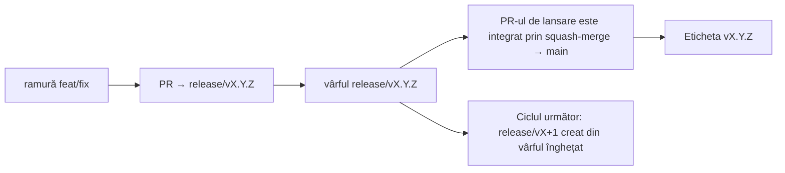

# Branching & Release Model (Română)

🌐 **Languages:** 🇺🇸 [English](../../../../ops/BRANCHING_MODEL.md) · 🇪🇹 [am](../../../am/docs/ops/BRANCHING_MODEL.md) · 🇸🇦 [ar](../../../ar/docs/ops/BRANCHING_MODEL.md) · 🇦🇿 [az](../../../az/docs/ops/BRANCHING_MODEL.md) · 🇧🇬 [bg](../../../bg/docs/ops/BRANCHING_MODEL.md) · 🇧🇩 [bn](../../../bn/docs/ops/BRANCHING_MODEL.md) · 🇧🇦 [bs](../../../bs/docs/ops/BRANCHING_MODEL.md) · 🇨🇿 [cs](../../../cs/docs/ops/BRANCHING_MODEL.md) · 🇩🇰 [da](../../../da/docs/ops/BRANCHING_MODEL.md) · 🇩🇪 [de](../../../de/docs/ops/BRANCHING_MODEL.md) · 🇬🇷 [el](../../../el/docs/ops/BRANCHING_MODEL.md) · 🇪🇸 [es](../../../es/docs/ops/BRANCHING_MODEL.md) · 🇪🇪 [et](../../../et/docs/ops/BRANCHING_MODEL.md) · 🇮🇷 [fa](../../../fa/docs/ops/BRANCHING_MODEL.md) · 🇫🇮 [fi](../../../fi/docs/ops/BRANCHING_MODEL.md) · 🇫🇷 [fr](../../../fr/docs/ops/BRANCHING_MODEL.md) · 🇮🇪 [ga](../../../ga/docs/ops/BRANCHING_MODEL.md) · 🇮🇳 [gu](../../../gu/docs/ops/BRANCHING_MODEL.md) · 🇳🇬 [ha](../../../ha/docs/ops/BRANCHING_MODEL.md) · 🇮🇱 [he](../../../he/docs/ops/BRANCHING_MODEL.md) · 🇮🇳 [hi](../../../hi/docs/ops/BRANCHING_MODEL.md) · 🇭🇷 [hr](../../../hr/docs/ops/BRANCHING_MODEL.md) · 🇭🇺 [hu](../../../hu/docs/ops/BRANCHING_MODEL.md) · 🇦🇲 [hy](../../../hy/docs/ops/BRANCHING_MODEL.md) · 🇮🇩 [id](../../../id/docs/ops/BRANCHING_MODEL.md) · 🇳🇬 [ig](../../../ig/docs/ops/BRANCHING_MODEL.md) · 🇮🇹 [it](../../../it/docs/ops/BRANCHING_MODEL.md) · 🇯🇵 [ja](../../../ja/docs/ops/BRANCHING_MODEL.md) · 🇬🇪 [ka](../../../ka/docs/ops/BRANCHING_MODEL.md) · 🇰🇭 [km](../../../km/docs/ops/BRANCHING_MODEL.md) · 🇮🇳 [kn](../../../kn/docs/ops/BRANCHING_MODEL.md) · 🇰🇷 [ko](../../../ko/docs/ops/BRANCHING_MODEL.md) · 🇱🇹 [lt](../../../lt/docs/ops/BRANCHING_MODEL.md) · 🇱🇻 [lv](../../../lv/docs/ops/BRANCHING_MODEL.md) · 🇮🇳 [ml](../../../ml/docs/ops/BRANCHING_MODEL.md) · 🇮🇳 [mr](../../../mr/docs/ops/BRANCHING_MODEL.md) · 🇲🇾 [ms](../../../ms/docs/ops/BRANCHING_MODEL.md) · 🇲🇹 [mt](../../../mt/docs/ops/BRANCHING_MODEL.md) · 🇲🇲 [my](../../../my/docs/ops/BRANCHING_MODEL.md) · 🇳🇵 [ne](../../../ne/docs/ops/BRANCHING_MODEL.md) · 🇳🇱 [nl](../../../nl/docs/ops/BRANCHING_MODEL.md) · 🇳🇴 [no](../../../no/docs/ops/BRANCHING_MODEL.md) · 🇮🇳 [or](../../../or/docs/ops/BRANCHING_MODEL.md) · 🇮🇳 [pa](../../../pa/docs/ops/BRANCHING_MODEL.md) · 🇵🇭 [phi](../../../phi/docs/ops/BRANCHING_MODEL.md) · 🇵🇱 [pl](../../../pl/docs/ops/BRANCHING_MODEL.md) · 🇵🇹 [pt](../../../pt/docs/ops/BRANCHING_MODEL.md) · 🇧🇷 [pt-BR](../../../pt-BR/docs/ops/BRANCHING_MODEL.md) · 🇷🇺 [ru](../../../ru/docs/ops/BRANCHING_MODEL.md) · 🇱🇰 [si](../../../si/docs/ops/BRANCHING_MODEL.md) · 🇸🇰 [sk](../../../sk/docs/ops/BRANCHING_MODEL.md) · 🇸🇮 [sl](../../../sl/docs/ops/BRANCHING_MODEL.md) · 🇷🇸 [sr](../../../sr/docs/ops/BRANCHING_MODEL.md) · 🇸🇪 [sv](../../../sv/docs/ops/BRANCHING_MODEL.md) · 🇰🇪 [sw](../../../sw/docs/ops/BRANCHING_MODEL.md) · 🇮🇳 [ta](../../../ta/docs/ops/BRANCHING_MODEL.md) · 🇮🇳 [te](../../../te/docs/ops/BRANCHING_MODEL.md) · 🇹🇭 [th](../../../th/docs/ops/BRANCHING_MODEL.md) · 🇹🇷 [tr](../../../tr/docs/ops/BRANCHING_MODEL.md) · 🇺🇦 [uk-UA](../../../uk-UA/docs/ops/BRANCHING_MODEL.md) · 🇵🇰 [ur](../../../ur/docs/ops/BRANCHING_MODEL.md) · 🇺🇿 [uz](../../../uz/docs/ops/BRANCHING_MODEL.md) · 🇻🇳 [vi](../../../vi/docs/ops/BRANCHING_MODEL.md) · 🇳🇬 [yo](../../../yo/docs/ops/BRANCHING_MODEL.md) · 🇨🇳 [zh-CN](../../../zh-CN/docs/ops/BRANCHING_MODEL.md) · 🇹🇼 [zh-TW](../../../zh-TW/docs/ops/BRANCHING_MODEL.md)

---

OmniRoute utilizează un model de lansare cu **cicluri paralele**: o ramură dedicată `release/vX.Y.Z`
pentru ciclul activ, `main` pentru linia publicată și o etichetă imuabilă
`vX.Y.Z` atunci când ciclul respectiv este lansat. Este normal ca unele commituri să ajungă atât în `release/*`, _cât și_ în
`main` — nu este o confuzie.

Detaliile pentru responsabilii de mentenanță se află în `CLAUDE.md` (Regula strictă nr. 21) și în
[RELEASE_CHECKLIST.md](./RELEASE_CHECKLIST.md). Această pagină este rezumatul public
destinat contributorilor.

## Pe scurt

| Referință           | Rol                                                                                             |
| ------------------- | ----------------------------------------------------------------------------------------------- |
| `release/vX.Y.Z`    | **Ciclul activ** — dezvoltarea de zi cu zi și îmbinarea PR-urilor pentru versiunea respectivă   |
| `main`              | **Linia publicată** — primește ciclul prin squash-merge atunci când versiunea este lansată      |
| `vX.Y.Z` (etichetă) | **Marcajul lansării** — indicator imuabil pentru „ce a fost lansat”, creat în momentul lansării |



## Ce ramură ar trebui să vizeze PR-ul meu?

**Vizați ramura activă `release/vX.Y.Z` — nu `main`.**

1. Găsiți cea mai mare ramură `release/v*` deschisă (exemplu la momentul redactării:
   `release/v3.8.49`).
2. Creați ramura pornind de la vârful acesteia (`git fetch` + checkout / rebase pe aceasta).
3. Deschideți PR-ul cu **base = ramura `release/vX.Y.Z` respectivă**.

`main` nu este ramura de integrare pentru activitatea de zi cu zi. PR-urile deschise către `main`
trebuie, de obicei, redirecționate înainte de îmbinare.

## Înghețarea lansării (cicluri paralele)

Atunci când o lansare este în curs de reconciliere, se deschide un tichet de marcaj cu eticheta `release-freeze`.
Acest lucru **nu oprește dezvoltarea**:

- Ramura înghețată `release/vX.Y.Z` îi aparține responsabilului de lansare pentru versiunea respectivă.
- Ramura `release/vX+1` a ciclului următor este creată din vârful înghețat, astfel încât contributorii să poată continua
  integrarea modificărilor.
- PR-urile deschise care încă vizează ramura înghețată ar trebui **redirecționate** către
  ramura `release/v*` activă (cea mai mare).

Verificați dacă există o înghețare activă înainte de a presupune că ramura dorită poate primi îmbinări:

```bash
gh issue list --repo diegosouzapw/OmniRoute --label release-freeze --state open
```

Mecanismele de îmbinare (eticheta `queue` aplicată de proprietar → Mergify) sunt documentate în
[MERGE_TRAIN.md](./MERGE_TRAIN.md).

## De ce sunt necesare atât o ramură, cât și o etichetă?

| Artefact          | Durată de viață       | Scop                                                                            |
| ----------------- | --------------------- | ------------------------------------------------------------------------------- |
| `release/vX.Y.Z`  | Ciclul în desfășurare | Colectează PR-urile revizuite, menține CI în stare verde și este baza PR-urilor |
| Eticheta `vX.Y.Z` | Permanent             | Marchează exact conținutul lansat pe npm / GitHub Releases                      |

Ramura este atelierul; eticheta este pachetul sigilat. După integrarea prin squash-merge în
`main`, ciclul următor continuă pe `release/vX+1` fără a aștepta finalizarea
PR-ului versiunii anterioare.

## Documentație conexă

- [CONTRIBUTING.md](../../CONTRIBUTING.md) — configurare, teste, lista de verificare pentru PR-uri
- [RELEASE_CHECKLIST.md](./RELEASE_CHECKLIST.md) — validarea înainte de lansare
- [MERGE_TRAIN.md](./MERGE_TRAIN.md) — coada de îmbinare și fluxul alternativ
- [RELEASE_GREEN.md](./RELEASE_GREEN.md) — menținerea vârfului ramurii de lansare în stare verde
