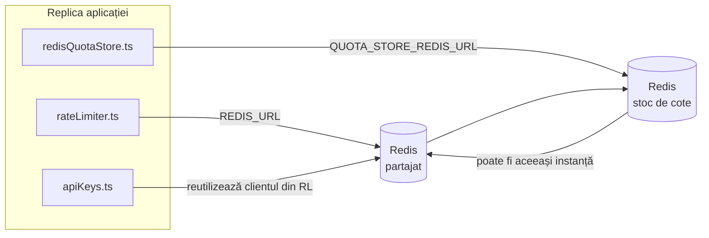

# Redis Production Configuration Guide (Română)

🌐 **Languages:** 🇺🇸 [English](../../../../ops/REDIS_PRODUCTION_CONFIG.md) · 🇪🇹 [am](../../../am/docs/ops/REDIS_PRODUCTION_CONFIG.md) · 🇸🇦 [ar](../../../ar/docs/ops/REDIS_PRODUCTION_CONFIG.md) · 🇦🇿 [az](../../../az/docs/ops/REDIS_PRODUCTION_CONFIG.md) · 🇧🇬 [bg](../../../bg/docs/ops/REDIS_PRODUCTION_CONFIG.md) · 🇧🇩 [bn](../../../bn/docs/ops/REDIS_PRODUCTION_CONFIG.md) · 🇧🇦 [bs](../../../bs/docs/ops/REDIS_PRODUCTION_CONFIG.md) · 🇨🇿 [cs](../../../cs/docs/ops/REDIS_PRODUCTION_CONFIG.md) · 🇩🇰 [da](../../../da/docs/ops/REDIS_PRODUCTION_CONFIG.md) · 🇩🇪 [de](../../../de/docs/ops/REDIS_PRODUCTION_CONFIG.md) · 🇬🇷 [el](../../../el/docs/ops/REDIS_PRODUCTION_CONFIG.md) · 🇪🇸 [es](../../../es/docs/ops/REDIS_PRODUCTION_CONFIG.md) · 🇪🇪 [et](../../../et/docs/ops/REDIS_PRODUCTION_CONFIG.md) · 🇮🇷 [fa](../../../fa/docs/ops/REDIS_PRODUCTION_CONFIG.md) · 🇫🇮 [fi](../../../fi/docs/ops/REDIS_PRODUCTION_CONFIG.md) · 🇫🇷 [fr](../../../fr/docs/ops/REDIS_PRODUCTION_CONFIG.md) · 🇮🇪 [ga](../../../ga/docs/ops/REDIS_PRODUCTION_CONFIG.md) · 🇮🇳 [gu](../../../gu/docs/ops/REDIS_PRODUCTION_CONFIG.md) · 🇳🇬 [ha](../../../ha/docs/ops/REDIS_PRODUCTION_CONFIG.md) · 🇮🇱 [he](../../../he/docs/ops/REDIS_PRODUCTION_CONFIG.md) · 🇮🇳 [hi](../../../hi/docs/ops/REDIS_PRODUCTION_CONFIG.md) · 🇭🇷 [hr](../../../hr/docs/ops/REDIS_PRODUCTION_CONFIG.md) · 🇭🇺 [hu](../../../hu/docs/ops/REDIS_PRODUCTION_CONFIG.md) · 🇦🇲 [hy](../../../hy/docs/ops/REDIS_PRODUCTION_CONFIG.md) · 🇮🇩 [id](../../../id/docs/ops/REDIS_PRODUCTION_CONFIG.md) · 🇳🇬 [ig](../../../ig/docs/ops/REDIS_PRODUCTION_CONFIG.md) · 🇮🇹 [it](../../../it/docs/ops/REDIS_PRODUCTION_CONFIG.md) · 🇯🇵 [ja](../../../ja/docs/ops/REDIS_PRODUCTION_CONFIG.md) · 🇬🇪 [ka](../../../ka/docs/ops/REDIS_PRODUCTION_CONFIG.md) · 🇰🇭 [km](../../../km/docs/ops/REDIS_PRODUCTION_CONFIG.md) · 🇮🇳 [kn](../../../kn/docs/ops/REDIS_PRODUCTION_CONFIG.md) · 🇰🇷 [ko](../../../ko/docs/ops/REDIS_PRODUCTION_CONFIG.md) · 🇱🇹 [lt](../../../lt/docs/ops/REDIS_PRODUCTION_CONFIG.md) · 🇱🇻 [lv](../../../lv/docs/ops/REDIS_PRODUCTION_CONFIG.md) · 🇮🇳 [ml](../../../ml/docs/ops/REDIS_PRODUCTION_CONFIG.md) · 🇮🇳 [mr](../../../mr/docs/ops/REDIS_PRODUCTION_CONFIG.md) · 🇲🇾 [ms](../../../ms/docs/ops/REDIS_PRODUCTION_CONFIG.md) · 🇲🇹 [mt](../../../mt/docs/ops/REDIS_PRODUCTION_CONFIG.md) · 🇲🇲 [my](../../../my/docs/ops/REDIS_PRODUCTION_CONFIG.md) · 🇳🇵 [ne](../../../ne/docs/ops/REDIS_PRODUCTION_CONFIG.md) · 🇳🇱 [nl](../../../nl/docs/ops/REDIS_PRODUCTION_CONFIG.md) · 🇳🇴 [no](../../../no/docs/ops/REDIS_PRODUCTION_CONFIG.md) · 🇮🇳 [or](../../../or/docs/ops/REDIS_PRODUCTION_CONFIG.md) · 🇮🇳 [pa](../../../pa/docs/ops/REDIS_PRODUCTION_CONFIG.md) · 🇵🇭 [phi](../../../phi/docs/ops/REDIS_PRODUCTION_CONFIG.md) · 🇵🇱 [pl](../../../pl/docs/ops/REDIS_PRODUCTION_CONFIG.md) · 🇵🇹 [pt](../../../pt/docs/ops/REDIS_PRODUCTION_CONFIG.md) · 🇧🇷 [pt-BR](../../../pt-BR/docs/ops/REDIS_PRODUCTION_CONFIG.md) · 🇷🇺 [ru](../../../ru/docs/ops/REDIS_PRODUCTION_CONFIG.md) · 🇱🇰 [si](../../../si/docs/ops/REDIS_PRODUCTION_CONFIG.md) · 🇸🇰 [sk](../../../sk/docs/ops/REDIS_PRODUCTION_CONFIG.md) · 🇸🇮 [sl](../../../sl/docs/ops/REDIS_PRODUCTION_CONFIG.md) · 🇷🇸 [sr](../../../sr/docs/ops/REDIS_PRODUCTION_CONFIG.md) · 🇸🇪 [sv](../../../sv/docs/ops/REDIS_PRODUCTION_CONFIG.md) · 🇰🇪 [sw](../../../sw/docs/ops/REDIS_PRODUCTION_CONFIG.md) · 🇮🇳 [ta](../../../ta/docs/ops/REDIS_PRODUCTION_CONFIG.md) · 🇮🇳 [te](../../../te/docs/ops/REDIS_PRODUCTION_CONFIG.md) · 🇹🇭 [th](../../../th/docs/ops/REDIS_PRODUCTION_CONFIG.md) · 🇹🇷 [tr](../../../tr/docs/ops/REDIS_PRODUCTION_CONFIG.md) · 🇺🇦 [uk-UA](../../../uk-UA/docs/ops/REDIS_PRODUCTION_CONFIG.md) · 🇵🇰 [ur](../../../ur/docs/ops/REDIS_PRODUCTION_CONFIG.md) · 🇺🇿 [uz](../../../uz/docs/ops/REDIS_PRODUCTION_CONFIG.md) · 🇻🇳 [vi](../../../vi/docs/ops/REDIS_PRODUCTION_CONFIG.md) · 🇳🇬 [yo](../../../yo/docs/ops/REDIS_PRODUCTION_CONFIG.md) · 🇨🇳 [zh-CN](../../../zh-CN/docs/ops/REDIS_PRODUCTION_CONFIG.md) · 🇹🇼 [zh-TW](../../../zh-TW/docs/ops/REDIS_PRODUCTION_CONFIG.md)

---

## Prezentare generală

Redis este o **dependență opțională, neesențială** în OmniRoute — aplicația își reduce funcționalitatea în mod controlat (folosind
mecanisme de rezervă în memorie) atunci când Redis nu este disponibil. În producție, optimizarea Redis reduce latența pentru patru
sarcini de lucru distincte:

| Sarcină de lucru                         | Implementare                  | Fabrică de clienți                                                       | Model de cheie                                          |
| ---------------------------------------- | ----------------------------- | ------------------------------------------------------------------------ | ------------------------------------------------------- |
| Limitarea ratei                          | `rateLimiter.ts`              | `getRedisClient()` — instanță singleton `ioredis` inițializată la cerere | Ferestre de limitare a ratei Lua atomice `<prefix>rl:*` |
| Cache de autentificare                   | `apiKeys.ts`                  | Reutilizează clientul din `rateLimiter`                                  | `<prefix>auth:api_key:<sha256>` cu TTL                  |
| Stocare pentru cote                      | `redisQuotaStore.ts`          | Instanță singleton `getRedisClient(url)` separată                        | `<prefix>quota:*`, configurabil per instanță            |
| Întrerupător de circuit pentru încălzire | `redisCircuitBreakerStore.ts` | Client separat în `circuitBreakerFactory.ts`                             | `<prefix>warmup:cb:<connectionId>`                      |

Toate cele patru sarcini de lucru folosesc același prefix de spațiu de nume, astfel încât OmniRoute să poată coexista cu alte aplicații pe o
singură instanță Redis (de exemplu, `127.0.0.1:6379`). Consultați [Spațiul de nume al cheilor](#key-namespacing).

---

## Configurația actuală (valorile implicite din cod)

| Setare                                     | Valoare                                                                   | Locație                                                                               |
| ------------------------------------------ | ------------------------------------------------------------------------- | ------------------------------------------------------------------------------------- |
| Variabila de mediu `REDIS_URL`             | `redis://redis:6379` (compose), opțională                                 | `rateLimiter.ts:5`, `.env.example`                                                    |
| Variabila de mediu `REDIS_KEY_PREFIX`      | `omniroute:` (implicit)                                                   | `rateLimiter.ts`, `redisQuotaStore.ts`, `redisCircuitBreakerStore.ts`, `.env.example` |
| Variabila de mediu `QUOTA_STORE_REDIS_URL` | separată, poate fi diferită de `REDIS_URL`                                | `quota/storeFactory.ts`                                                               |
| `QUOTA_STORE_DRIVER`                       | `"sqlite"` (implicit), `"redis"` opțional                                 | `quota/storeFactory.ts`                                                               |
| `maxRetriesPerRequest` pentru ioredis      | `3`                                                                       | crearea clientului în `rateLimiter.ts`                                                |
| `enableReadyCheck`                         | nesetat (valoare implicită ioredis: `true`)                               | —                                                                                     |
| `lazyConnect`                              | nesetat (valoare implicită ioredis: `false`)                              | —                                                                                     |
| `retryStrategy`                            | nesetat (valoare implicită ioredis: bază de 200ms, creștere exponențială) | —                                                                                     |
| TLS / parolă / index DB                    | **neconfigurate**                                                         | —                                                                                     |
| Sentinel / Cluster                         | **neconfigurate** — este acceptat doar un singur nod independent          | —                                                                                     |

---

## Spațiul de nume al cheilor

OmniRoute partajează o instanță Redis cu orice altceva rulează pe gazdă. Fără un spațiu de nume,
chei precum `auth:api_key:<sha256>` sau `rl:*` ar putea intra în conflict cu cheile altor aplicații
care utilizează aceeași instanță Redis (această instanță rulează Redis la `127.0.0.1:6379` alături de alte servicii).

Setați `REDIS_KEY_PREFIX` la un șir nevid pentru a adăuga un prefix la **fiecare** cheie OmniRoute:

```bash
# .env — toate cheile OmniRoute devin omniroute:rl:*, omniroute:auth:*, omniroute:quota:*, omniroute:warmup:cb:*
REDIS_KEY_PREFIX=omniroute:
```

- **Implicit:** `omniroute:` (se aplică atunci când `REDIS_KEY_PREFIX` este nesetat sau gol).
- **Se aplică pentru:** limitatorul de rată + cache-ul de autentificare (client `ioredis` partajat prin `keyPrefix`) și
  stocarea pentru cote (`KEY_PREFIX = "${REDIS_KEY_PREFIX}quota"`) și întrerupătorul de circuit pentru încălzire
  (`KEY_PREFIX = "${REDIS_KEY_PREFIX}warmup:cb:"`).
- **Schimbarea prefixului** atunci când există deja chei în Redis face ca vechile chei să rămână nereferențiate (acestea expiră
  prin TTL / LRU). Prefixul poate fi schimbat în siguranță; nu este necesară nicio migrare. Singura excepție este o cheie a
  întrerupătorului de circuit pentru încălzire aferentă unei conexiuni marcate ca interzisă: aceasta este stocată fără TTL, așadar
  listați cheile rămase folosind `redis-cli --scan --pattern '<old-prefix>warmup:cb:*'` și ștergeți-le.
- **`keyPrefix` din ioredis** adaugă automat prefixul la scriere **și** îl elimină la citire,
  astfel încât codul aplicației nu vede niciodată prefixul.

---

## Ajustări recomandate pentru producție

### 1. Opțiuni pentru pool-ul de conexiuni / client (constructorul ioredis `Redis`)

Codul actual creează o singură instanță `new Redis(url)`, fără opțiuni personalizate. Pentru implementări de producție
cu mai multe replici, transmiteți în cod o fabrică de clienți sau încapsulați `getRedisClient()`:

```typescript
const redis = new Redis(REDIS_URL, {
  maxRetriesPerRequest: null, // fără limită de reîncercări; retryStrategy va decide
  enableReadyCheck: true, // verifică dacă serverul este pregătit înainte de a accepta apeluri
  lazyConnect: true, // nu se conectează la inițializare; așteaptă primul apel
  retryStrategy: (times) => {
    if (times > 10) return null; // renunță după 10 reîncercări → se reconectează mai târziu
    return Math.min(times * 200, 5000); // 200ms, 400ms, …, limită de 5s
  },
  enableAutoPipelining: true, // combină comenzile concurente într-o singură scriere TCP
  keepAlive: 10000, // TCP keep-alive la fiecare 10s
});
```

**Compromisuri principale:**

- `maxRetriesPerRequest: null` + `retryStrategy` — opțiune preferată pentru producție, astfel încât repornirile
  temporare ale Redis să nu provoace imediat eșecul fiecărei cereri. Mecanismul de rezervă din memorie din
  `checkRateLimit()` preia gestionarea cazului de eșec.
- `lazyConnect: true` — evită dependența la pornire de disponibilitatea Redis înainte ca serverul
  să înceapă să accepte conexiuni.
- `enableAutoPipelining: true` — reduce numărul de călătorii dus-întors pentru verificările concurente ale limitei de rată;
  este benefic la >50 RPS pe o singură conexiune.

### 2. Configurarea serverului Redis (`redis.conf`)

```
# Memorie
maxmemory 80%                        # păstrează spațiu pentru cache-ul de pagini al sistemului de operare
maxmemory-policy allkeys-lru         # elimină intrările învechite din cache-ul de autentificare în condiții de presiune

# Persistență (opțională — OmniRoute este sigur în caz de oprire neașteptată și fără aceasta)
save 300 1                           # creează un instantaneu cel puțin la fiecare 5 min dacă s-a modificat ≥1 cheie
appendonly no                        # AOF nu este necesar; datele pot fi regenerate
appendfsync no                       # fără costul suplimentar al fsync (RDB este suficient)

# Rețea
timeout 0                            # fără deconectare în stare de inactivitate
tcp-keepalive 300                    # keep-alive la 5 min
tcp-backlog 511                      # coadă de conexiuni pentru sarcini în rafale

# Performanță
hz 10                                # valoare implicită; 100 pentru aplicații sensibile la latență
activedefrag yes                     # defragmentare automată când fragmentarea este >10%
```

**Compromis pentru `maxmemory-policy allkeys-lru`:** Intrările din cache-ul de autentificare pot fi eliminate în
condiții de presiune asupra memoriei. Acest lucru este sigur — `setCachedApiKey` repopulează întotdeauna cache-ul în cazul unei absențe, iar
mecanismul de rezervă SQLite reprezintă sursa autoritară. Scriptul Lua pentru limitarea ratei creează chei mici care sunt
proiectate să aibă o durată scurtă de viață.

### 3. Setări Docker Compose

Configurația Compose pentru producție (`docker-compose.prod.yml`) utilizează `redis:8.6.2-alpine`. Adăugați:

```yaml
redis:
  image: redis:8.6.2-alpine
  command:
    [
      "redis-server",
      "--maxmemory",
      "512mb",
      "--maxmemory-policy",
      "allkeys-lru",
      "--activedefrag",
      "yes",
      "--save",
      "300 1",
    ]
  healthcheck:
    test: ["CMD", "redis-cli", "ping"]
    interval: 10s
    timeout: 3s
    retries: 3
    start_period: 5s
```

### 4. Considerații privind instanțele multiple / scalarea

**Un singur Redis pentru toate replicile** — scriptul Lua pentru limitarea ratei depinde de un singur
spațiu autoritar de chei. Utilizarea mai multor instanțe Redis în spatele replicilor ar elimina atomicitatea
și ar dubla bugetul. Utilizați un singur Redis (sau un cluster Redis Sentinel cu failover) pentru
toate replicile aplicației.

**Numărul de conexiuni:** Fiecare replică a aplicației deschide **2 conexiuni TCP** către Redis
(clientul limitatorului de rată + clientul depozitului de cote). La 10 replici → 20 de conexiuni, valoare aflată
cu mult sub limita implicită de 10.000 de conexiuni a unei instanțe Redis.

### 5. Monitorizare

Expuneți prin intermediul endpointului de verificare a stării de funcționare:

```typescript
// src/app/api/monitoring/health/route.ts apelează deja funcțiile rateLimiter
// Adăugați verificări specifice Redis:
//   1. Latența PING prin ioredis .ping()
//   2. Utilizarea memoriei prin INFO memory
//   3. Numărul de conexiuni prin INFO clients
//   4. Rata de succes pentru maxmemory-policy (evicted_keys / keyspace_hits)
```

Metrici principale de urmărit:

- **Chei eliminate / sec** — dacă valoarea este persistent diferită de zero, măriți `maxmemory`
- **Clienți blocați** — o valoare diferită de zero sugerează scripturi Lua lente sau un nivel ridicat de concurență
- **Conexiuni respinse** — limita de conexiuni a fost atinsă; situație rară la 20 de conexiuni

---

## Diagrama arhitecturii



---

## Referințe

| Fișier                             | Scop                                                                                         |
| ---------------------------------- | -------------------------------------------------------------------------------------------- |
| `src/shared/utils/rateLimiter.ts`  | Clientul Redis principal, scriptul Lua pentru limitarea ratei, soluția de rezervă în memorie |
| `src/lib/db/apiKeys.ts`            | Cache de autentificare — soluție de rezervă Redis→SQLite                                     |
| `src/lib/quota/redisQuotaStore.ts` | Client Redis separat pentru stocul opțional de cote                                          |
| `src/lib/quota/storeFactory.ts`    | Comută între driverele de cote `sqlite` și `redis`                                           |
| `docker-compose.prod.yml`          | Containerul Redis pentru producție (imaginea `redis:8.6.2-alpine`)                           |
| `.env.example`                     | Documentația variabilelor de mediu Redis                                                     |
| `src/app/api/local/redis/`         | Rute API pentru orchestrarea containerului de dezvoltare                                     |
| `bin/cli/commands/redis.mjs`       | Comenzi CLI pentru orchestrarea containerului de dezvoltare                                  |
