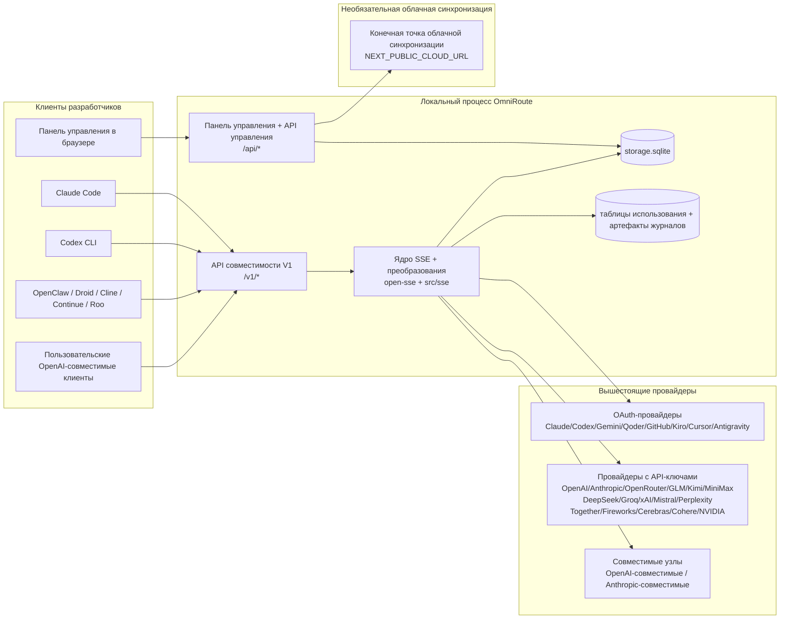
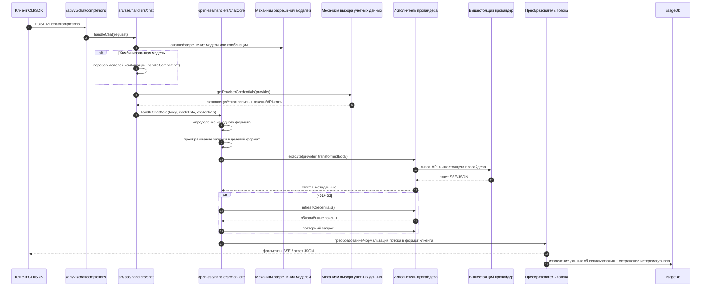
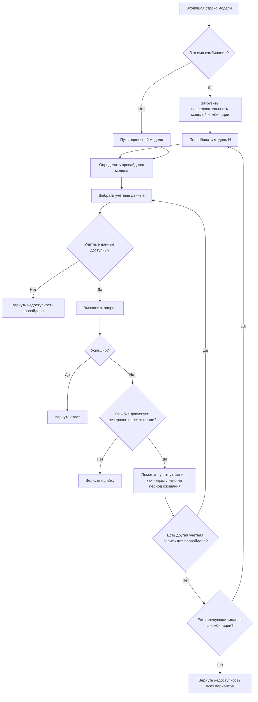
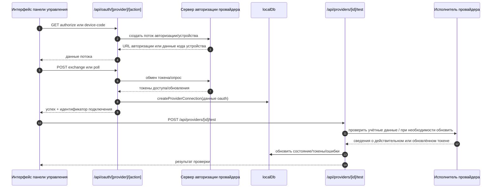
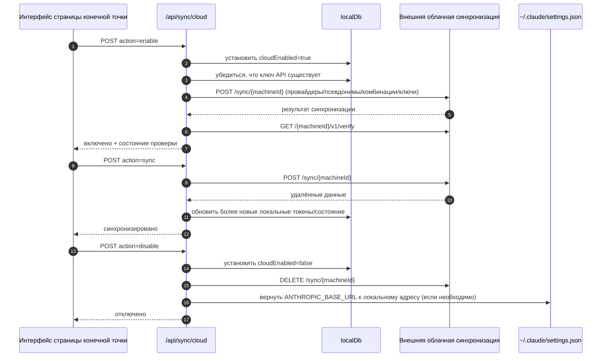
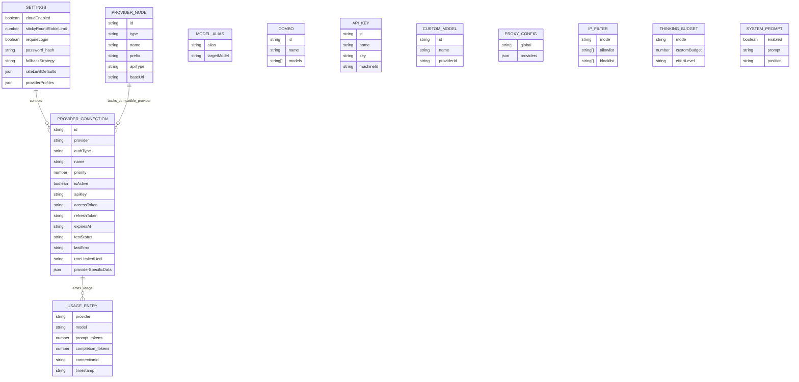
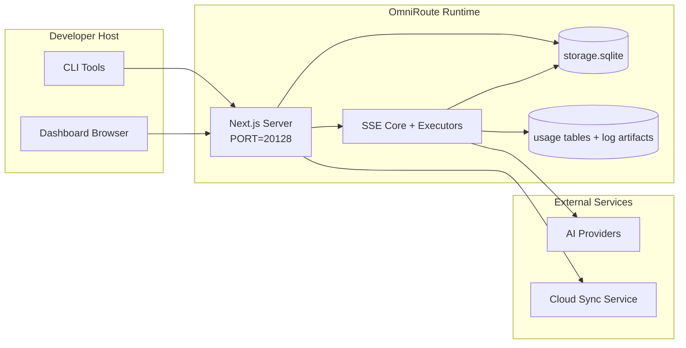

# OmniRoute Architecture (Русский)

🌐 **Languages:** 🇺🇸 [English](../../../../architecture/ARCHITECTURE.md) · 🇪🇹 [am](../../../am/docs/architecture/ARCHITECTURE.md) · 🇸🇦 [ar](../../../ar/docs/architecture/ARCHITECTURE.md) · 🇦🇿 [az](../../../az/docs/architecture/ARCHITECTURE.md) · 🇧🇬 [bg](../../../bg/docs/architecture/ARCHITECTURE.md) · 🇧🇩 [bn](../../../bn/docs/architecture/ARCHITECTURE.md) · 🇧🇦 [bs](../../../bs/docs/architecture/ARCHITECTURE.md) · 🇨🇿 [cs](../../../cs/docs/architecture/ARCHITECTURE.md) · 🇩🇰 [da](../../../da/docs/architecture/ARCHITECTURE.md) · 🇩🇪 [de](../../../de/docs/architecture/ARCHITECTURE.md) · 🇬🇷 [el](../../../el/docs/architecture/ARCHITECTURE.md) · 🇪🇸 [es](../../../es/docs/architecture/ARCHITECTURE.md) · 🇪🇪 [et](../../../et/docs/architecture/ARCHITECTURE.md) · 🇮🇷 [fa](../../../fa/docs/architecture/ARCHITECTURE.md) · 🇫🇮 [fi](../../../fi/docs/architecture/ARCHITECTURE.md) · 🇫🇷 [fr](../../../fr/docs/architecture/ARCHITECTURE.md) · 🇮🇪 [ga](../../../ga/docs/architecture/ARCHITECTURE.md) · 🇮🇳 [gu](../../../gu/docs/architecture/ARCHITECTURE.md) · 🇳🇬 [ha](../../../ha/docs/architecture/ARCHITECTURE.md) · 🇮🇱 [he](../../../he/docs/architecture/ARCHITECTURE.md) · 🇮🇳 [hi](../../../hi/docs/architecture/ARCHITECTURE.md) · 🇭🇷 [hr](../../../hr/docs/architecture/ARCHITECTURE.md) · 🇭🇺 [hu](../../../hu/docs/architecture/ARCHITECTURE.md) · 🇦🇲 [hy](../../../hy/docs/architecture/ARCHITECTURE.md) · 🇮🇩 [id](../../../id/docs/architecture/ARCHITECTURE.md) · 🇳🇬 [ig](../../../ig/docs/architecture/ARCHITECTURE.md) · 🇮🇹 [it](../../../it/docs/architecture/ARCHITECTURE.md) · 🇯🇵 [ja](../../../ja/docs/architecture/ARCHITECTURE.md) · 🇬🇪 [ka](../../../ka/docs/architecture/ARCHITECTURE.md) · 🇰🇭 [km](../../../km/docs/architecture/ARCHITECTURE.md) · 🇮🇳 [kn](../../../kn/docs/architecture/ARCHITECTURE.md) · 🇰🇷 [ko](../../../ko/docs/architecture/ARCHITECTURE.md) · 🇱🇹 [lt](../../../lt/docs/architecture/ARCHITECTURE.md) · 🇱🇻 [lv](../../../lv/docs/architecture/ARCHITECTURE.md) · 🇮🇳 [ml](../../../ml/docs/architecture/ARCHITECTURE.md) · 🇮🇳 [mr](../../../mr/docs/architecture/ARCHITECTURE.md) · 🇲🇾 [ms](../../../ms/docs/architecture/ARCHITECTURE.md) · 🇲🇹 [mt](../../../mt/docs/architecture/ARCHITECTURE.md) · 🇲🇲 [my](../../../my/docs/architecture/ARCHITECTURE.md) · 🇳🇵 [ne](../../../ne/docs/architecture/ARCHITECTURE.md) · 🇳🇱 [nl](../../../nl/docs/architecture/ARCHITECTURE.md) · 🇳🇴 [no](../../../no/docs/architecture/ARCHITECTURE.md) · 🇮🇳 [or](../../../or/docs/architecture/ARCHITECTURE.md) · 🇮🇳 [pa](../../../pa/docs/architecture/ARCHITECTURE.md) · 🇵🇭 [phi](../../../phi/docs/architecture/ARCHITECTURE.md) · 🇵🇱 [pl](../../../pl/docs/architecture/ARCHITECTURE.md) · 🇵🇹 [pt](../../../pt/docs/architecture/ARCHITECTURE.md) · 🇧🇷 [pt-BR](../../../pt-BR/docs/architecture/ARCHITECTURE.md) · 🇷🇴 [ro](../../../ro/docs/architecture/ARCHITECTURE.md) · 🇱🇰 [si](../../../si/docs/architecture/ARCHITECTURE.md) · 🇸🇰 [sk](../../../sk/docs/architecture/ARCHITECTURE.md) · 🇸🇮 [sl](../../../sl/docs/architecture/ARCHITECTURE.md) · 🇷🇸 [sr](../../../sr/docs/architecture/ARCHITECTURE.md) · 🇸🇪 [sv](../../../sv/docs/architecture/ARCHITECTURE.md) · 🇰🇪 [sw](../../../sw/docs/architecture/ARCHITECTURE.md) · 🇮🇳 [ta](../../../ta/docs/architecture/ARCHITECTURE.md) · 🇮🇳 [te](../../../te/docs/architecture/ARCHITECTURE.md) · 🇹🇭 [th](../../../th/docs/architecture/ARCHITECTURE.md) · 🇹🇷 [tr](../../../tr/docs/architecture/ARCHITECTURE.md) · 🇺🇦 [uk-UA](../../../uk-UA/docs/architecture/ARCHITECTURE.md) · 🇵🇰 [ur](../../../ur/docs/architecture/ARCHITECTURE.md) · 🇺🇿 [uz](../../../uz/docs/architecture/ARCHITECTURE.md) · 🇻🇳 [vi](../../../vi/docs/architecture/ARCHITECTURE.md) · 🇳🇬 [yo](../../../yo/docs/architecture/ARCHITECTURE.md) · 🇨🇳 [zh-CN](../../../zh-CN/docs/architecture/ARCHITECTURE.md) · 🇹🇼 [zh-TW](../../../zh-TW/docs/architecture/ARCHITECTURE.md)

---

🌐 **Languages:** 🇺🇸 [English](../../../../architecture/ARCHITECTURE.md) · 🇪🇹 [am](../../../am/docs/architecture/ARCHITECTURE.md) · 🇸🇦 [ar](../../../ar/docs/architecture/ARCHITECTURE.md) · 🇦🇿 [az](../../../az/docs/architecture/ARCHITECTURE.md) · 🇧🇬 [bg](../../../bg/docs/architecture/ARCHITECTURE.md) · 🇧🇩 [bn](../../../bn/docs/architecture/ARCHITECTURE.md) · 🇧🇦 [bs](../../../bs/docs/architecture/ARCHITECTURE.md) · 🇨🇿 [cs](../../../cs/docs/architecture/ARCHITECTURE.md) · 🇩🇰 [da](../../../da/docs/architecture/ARCHITECTURE.md) · 🇩🇪 [de](../../../de/docs/architecture/ARCHITECTURE.md) · 🇬🇷 [el](../../../el/docs/architecture/ARCHITECTURE.md) · 🇪🇸 [es](../../../es/docs/architecture/ARCHITECTURE.md) · 🇪🇪 [et](../../../et/docs/architecture/ARCHITECTURE.md) · 🇮🇷 [fa](../../../fa/docs/architecture/ARCHITECTURE.md) · 🇫🇮 [fi](../../../fi/docs/architecture/ARCHITECTURE.md) · 🇫🇷 [fr](../../../fr/docs/architecture/ARCHITECTURE.md) · 🇮🇪 [ga](../../../ga/docs/architecture/ARCHITECTURE.md) · 🇮🇳 [gu](../../../gu/docs/architecture/ARCHITECTURE.md) · 🇳🇬 [ha](../../../ha/docs/architecture/ARCHITECTURE.md) · 🇮🇱 [he](../../../he/docs/architecture/ARCHITECTURE.md) · 🇮🇳 [hi](../../../hi/docs/architecture/ARCHITECTURE.md) · 🇭🇷 [hr](../../../hr/docs/architecture/ARCHITECTURE.md) · 🇭🇺 [hu](../../../hu/docs/architecture/ARCHITECTURE.md) · 🇦🇲 [hy](../../../hy/docs/architecture/ARCHITECTURE.md) · 🇮🇩 [id](../../../id/docs/architecture/ARCHITECTURE.md) · 🇳🇬 [ig](../../../ig/docs/architecture/ARCHITECTURE.md) · 🇮🇹 [it](../../../it/docs/architecture/ARCHITECTURE.md) · 🇯🇵 [ja](../../../ja/docs/architecture/ARCHITECTURE.md) · 🇬🇪 [ka](../../../ka/docs/architecture/ARCHITECTURE.md) · 🇰🇭 [km](../../../km/docs/architecture/ARCHITECTURE.md) · 🇮🇳 [kn](../../../kn/docs/architecture/ARCHITECTURE.md) · 🇰🇷 [ko](../../../ko/docs/architecture/ARCHITECTURE.md) · 🇱🇹 [lt](../../../lt/docs/architecture/ARCHITECTURE.md) · 🇱🇻 [lv](../../../lv/docs/architecture/ARCHITECTURE.md) · 🇮🇳 [ml](../../../ml/docs/architecture/ARCHITECTURE.md) · 🇮🇳 [mr](../../../mr/docs/architecture/ARCHITECTURE.md) · 🇲🇾 [ms](../../../ms/docs/architecture/ARCHITECTURE.md) · 🇲🇹 [mt](../../../mt/docs/architecture/ARCHITECTURE.md) · 🇲🇲 [my](../../../my/docs/architecture/ARCHITECTURE.md) · 🇳🇵 [ne](../../../ne/docs/architecture/ARCHITECTURE.md) · 🇳🇱 [nl](../../../nl/docs/architecture/ARCHITECTURE.md) · 🇳🇴 [no](../../../no/docs/architecture/ARCHITECTURE.md) · 🇮🇳 [or](../../../or/docs/architecture/ARCHITECTURE.md) · 🇮🇳 [pa](../../../pa/docs/architecture/ARCHITECTURE.md) · 🇵🇭 [phi](../../../phi/docs/architecture/ARCHITECTURE.md) · 🇵🇱 [pl](../../../pl/docs/architecture/ARCHITECTURE.md) · 🇵🇹 [pt](../../../pt/docs/architecture/ARCHITECTURE.md) · 🇧🇷 [pt-BR](../../../pt-BR/docs/architecture/ARCHITECTURE.md) · 🇷🇴 [ro](../../../ro/docs/architecture/ARCHITECTURE.md) · 🇱🇰 [si](../../../si/docs/architecture/ARCHITECTURE.md) · 🇸🇰 [sk](../../../sk/docs/architecture/ARCHITECTURE.md) · 🇸🇮 [sl](../../../sl/docs/architecture/ARCHITECTURE.md) · 🇷🇸 [sr](../../../sr/docs/architecture/ARCHITECTURE.md) · 🇸🇪 [sv](../../../sv/docs/architecture/ARCHITECTURE.md) · 🇰🇪 [sw](../../../sw/docs/architecture/ARCHITECTURE.md) · 🇮🇳 [ta](../../../ta/docs/architecture/ARCHITECTURE.md) · 🇮🇳 [te](../../../te/docs/architecture/ARCHITECTURE.md) · 🇹🇭 [th](../../../th/docs/architecture/ARCHITECTURE.md) · 🇹🇷 [tr](../../../tr/docs/architecture/ARCHITECTURE.md) · 🇺🇦 [uk-UA](../../../uk-UA/docs/architecture/ARCHITECTURE.md) · 🇵🇰 [ur](../../../ur/docs/architecture/ARCHITECTURE.md) · 🇺🇿 [uz](../../../uz/docs/architecture/ARCHITECTURE.md) · 🇻🇳 [vi](../../../vi/docs/architecture/ARCHITECTURE.md) · 🇳🇬 [yo](../../../yo/docs/architecture/ARCHITECTURE.md) · 🇨🇳 [zh-CN](../../../zh-CN/docs/architecture/ARCHITECTURE.md) · 🇹🇼 [zh-TW](../../../zh-TW/docs/architecture/ARCHITECTURE.md)

_Последнее обновление: 2026-06-28_

## Краткое резюме

OmniRoute — это локальный шлюз маршрутизации запросов к ИИ и панель управления, созданные на базе Next.js.
Он предоставляет единую OpenAI-совместимую конечную точку (`/v1/*`) и маршрутизирует трафик между несколькими вышестоящими провайдерами, обеспечивая преобразование форматов, резервное переключение, обновление токенов и отслеживание использования.

Основные возможности:

- OpenAI-совместимый API для CLI/инструментов (355 провайдеров, 108 исполнителей)
- Преобразование запросов и ответов между форматами провайдеров
- Резервное переключение между комбинациями моделей (последовательность из нескольких моделей)
- Структурированные шаги комбинаций (`provider + model + connection`) с динамическим упорядочиванием по `compositeTiers`
- Резервное переключение на уровне учётных записей (несколько учётных записей для каждого провайдера)
- Предварительная проверка квоты и выбор учётной записи с учётом квоты по алгоритму P2C в основном потоке чата
- Управление подключениями к провайдерам через OAuth и API-ключи (22 модуля OAuth-провайдеров)
- Создание эмбеддингов через `/v1/embeddings` (18 провайдеров)
- Генерация изображений через `/v1/images/generations` (10+ провайдеров, 20+ моделей)
- Транскрибирование аудио через `/v1/audio/transcriptions` (18 провайдеров)
- Преобразование текста в речь через `/v1/audio/speech` (24 встроенных провайдера)
- Генерация видео через `/v1/videos/generations` (ComfyUI + SD WebUI)
- Генерация музыки через `/v1/music/generations` (ComfyUI)
- Веб-поиск через `/v1/search` (20 провайдеров)
- Модерация через `/v1/moderations`
- Переранжирование через `/v1/rerank`
- Разбор тегов размышлений (`<think>...</think>`) для моделей с рассуждением
- Очистка ответов для строгой совместимости с OpenAI SDK
- Нормализация ролей (developer→system, system→user) для совместимости между провайдерами
- Преобразование структурированного вывода (json_schema → Gemini responseSchema)
- Локальное хранение данных о провайдерах, ключах, псевдонимах, комбинациях, настройках и ценах (122 модуля БД)
- Отслеживание использования и стоимости, а также журналирование запросов
- Необязательная облачная синхронизация для синхронизации состояния между несколькими устройствами
- Списки разрешённых и заблокированных IP-адресов для управления доступом к API
- Управление бюджетом размышлений (сквозной/автоматический/пользовательский/адаптивный режимы)
- Глобальное внедрение системного промпта
- Отслеживание сессий и создание цифровых отпечатков
- Расширенное ограничение частоты запросов для отдельных учётных записей с профилями для конкретных провайдеров
- Шаблон автоматического выключателя для повышения отказоустойчивости провайдеров
- Защита от «лавинообразной нагрузки» с блокировкой через мьютексы
- Кэш дедупликации запросов на основе сигнатур
- Доменный слой: правила расчёта стоимости, политика резервного переключения, политика блокировки
- Context Relay: сводки для передачи контекста сессии и сохранения непрерывности при смене учётных записей
- Хранение состояния домена (сквозной кэш SQLite для резервных переключений, бюджетов, блокировок и автоматических выключателей)
- Механизм политик для централизованной оценки запросов (блокировка → бюджет → резервное переключение)
- Телеметрия запросов с агрегацией задержек p50/p95/p99
- Телеметрия целей комбинаций и исторические данные об их состоянии через `combo_execution_key` / `combo_step_id`
- Идентификатор корреляции (X-Request-Id) для сквозной трассировки
- Журналирование аудита соответствия требованиям с возможностью отключения для каждого API-ключа
- Среда оценки качества LLM
- Панель мониторинга состояния со статусом автоматических выключателей провайдеров в реальном времени
- Сервер MCP (110 инструментов) с 3 транспортами (stdio/SSE/Streamable HTTP)
- Сервер A2A (JSON-RPC 2.0 + SSE) с навыками и управлением жизненным циклом задач
- Система памяти (извлечение, внедрение, поиск, суммаризация)
- Система навыков (реестр, исполнитель, песочница, встроенные навыки)
- MITM-прокси с управлением сертификатами и обработкой DNS
- Промежуточное ПО для защиты от внедрения промптов
- Конвейер сжатия промптов с Caveman, RTK, составными конвейерами, комбинациями сжатия, языковыми пакетами и аналитикой
- Реестр ACP (Agent Communication Protocol)
- Модульные OAuth-провайдеры (22 отдельных модуля в `src/lib/oauth/providers/`)
- Скрипты удаления и полного удаления
- Действие восстановления окружения OAuth
- Мост WebSocket для OpenAI-совместимых WS-клиентов (`/v1/ws`)
- Управление токенами синхронизации (выдача/отзыв, загрузка версионированного посредством ETag пакета конфигурации)
- GLM Thinking (`glmt`) как полноценный предустановленный профиль провайдера
- Гибридный подсчёт токенов (через `/messages/count_tokens` на стороне провайдера с резервной оценкой)
- Автоматическое создание псевдонимов моделей (30+ нормализаций диалектов между прокси при запуске)
- Безопасные исходящие запросы с защитой от SSRF, блокировкой частных URL-адресов и настраиваемыми повторными попытками
- Повторные попытки запросов чата с учётом периода ожидания и настраиваемыми параметрами `requestRetry` и `maxRetryIntervalSec`
- Проверка окружения выполнения с помощью Zod при запуске
- Аудит соответствия требованиям v2 с пагинацией, событиями CRUD для провайдеров и журналированием проверок, заблокированных защитой от SSRF

Основная модель выполнения:

- Маршруты приложения Next.js в `src/app/api/*` реализуют как API панели управления, так и API совместимости
- Общее ядро SSE/маршрутизации в `src/sse/*` + `open-sse/*` обеспечивает выполнение запросов к провайдерам, преобразование форматов, потоковую передачу, резервное переключение и учёт использования

## Справочные диаграммы

Канонические источники Mermaid для платформы v3.8.0, находящиеся под управлением версий, расположены в
[`docs/diagrams/`](../diagrams/README.md). Две из них приведены ниже для ознакомления;
ссылки на остальные доступны в руководствах по соответствующим областям.


> Источник: [diagrams/request-pipeline.mmd](../diagrams/request-pipeline.mmd)


> Источник: [diagrams/resilience-3layers.mmd](../diagrams/resilience-3layers.mmd) — ссылка также приведена в
> [RESILIENCE_GUIDE.md](./RESILIENCE_GUIDE.md) и справочном разделе `CLAUDE.md` по отказоустойчивости.

## Область охвата и границы

### В области охвата

- Локальная среда выполнения шлюза
- API управления панелью мониторинга
- Аутентификация у провайдеров и обновление токенов
- Преобразование запросов и потоковая передача SSE
- Локальное состояние и сохранение данных об использовании
- Необязательная оркестрация облачной синхронизации

### Вне области охвата

- Реализация облачного сервиса, находящегося за `NEXT_PUBLIC_CLOUD_URL`
- SLA и плоскость управления провайдера за пределами локального процесса
- Сами внешние исполняемые файлы CLI (Claude CLI, Codex CLI и т. д.)

## Интерфейс панели мониторинга (текущий)

Основные страницы в `src/app/(dashboard)/dashboard/`:

- `/dashboard` — быстрый старт и обзор провайдеров
- `/dashboard/endpoint` — прокси конечной точки и вкладки конечных точек MCP, A2A и API
- `/dashboard/providers` — подключения к провайдерам и учётные данные
- `/dashboard/combos` — стратегии комбинаций, шаблоны, пошаговый конструктор, правила маршрутизации моделей и сохраняемый вручную порядок
- `/dashboard/auto-combo` — механизм Auto Combo: веса оценки, наборы режимов, предустановки виртуальной фабрики и телеметрия
- `/dashboard/costs` — агрегация затрат и отображение цен
- `/dashboard/analytics` — аналитика использования, оценки и состояние целевых объектов комбинаций
- `/dashboard/limits` — управление квотами и ограничениями частоты запросов
- `/dashboard/cli-tools` — первоначальная настройка CLI, обнаружение среды выполнения и создание конфигурации
- `/dashboard/agents` — обнаруженные агенты ACP и регистрация пользовательских агентов
- `/dashboard/cloud-agents` — задачи облачных агентов (Codex Cloud, Devin, Jules) и их жизненный цикл
- `/dashboard/skills` — реестр навыков A2A, выполнение в песочнице и каталог встроенных навыков
- `/dashboard/memory` — просмотр и извлечение постоянной памяти диалогов
- `/dashboard/webhooks` — подписки на исходящие вебхуки, ротация секретов и статистика повторных попыток
- `/dashboard/batch` — отправка пакетных заданий и ход их выполнения
- `/dashboard/cache` — статистика кэша сквозного чтения и кэша рассуждений, элементы управления вытеснением
- `/dashboard/playground` — интерактивная чат-площадка для любой настроенной комбинации или модели
- `/dashboard/changelog` — встроенный просмотр журнала изменений (отображает `CHANGELOG.md`)
- `/dashboard/system` — диагностика среды выполнения, сведения о версии и интерфейс проверки окружения
- `/dashboard/onboarding` — мастер первоначальной настройки для новых установок
- `/dashboard/media` — площадка для работы с изображениями, видео и музыкой
- `/dashboard/search-tools` — тестирование поисковых провайдеров и история
- `/dashboard/health` — время безотказной работы, автоматические выключатели, ограничения частоты запросов и сеансы с контролем квот
- `/dashboard/logs` — журналы запросов, прокси, аудита и консоли
- `/dashboard/settings` — вкладки системных настроек (общие, маршрутизация, значения комбинаций по умолчанию и т. д.)
- `/dashboard/context/caveman` — правила сжатия Caveman, языковые пакеты, предварительный просмотр и режим вывода
- `/dashboard/context/rtk` — фильтры вывода команд RTK, предварительный просмотр и настройки безопасности среды выполнения
- `/dashboard/context/combos` — именованные конвейеры сжатия, назначенные комбинациям маршрутизации
- `/dashboard/translator` — проверка преобразователя и предварительный просмотр конвертации формата запросов
- `/dashboard/audit` — просмотр журнала аудита соответствия требованиям с пагинацией и структурированными метаданными
- `/dashboard/usage` — просмотр использования по каждому запросу, связанный с `usage_history`
- `/dashboard/compression` — аналитика и статистика сжатия, а также назначение конвейеров
- `/dashboard/api-manager` — управление жизненным циклом ключей API и разрешениями моделей

## Высокоуровневый контекст системы



## Основные компоненты среды выполнения

## 1) Уровень API и маршрутизации (маршруты приложения Next.js)

Основные каталоги:

- `src/app/api/v1/*` и `src/app/api/v1beta/*` для API совместимости
- `src/app/api/*` для API управления и конфигурации
- Правила перезаписи Next в `next.config.mjs` сопоставляют `/v1/*` с `/api/v1/*`

Важные маршруты совместимости:

- `src/app/api/v1/chat/completions/route.ts`
- `src/app/api/v1/messages/route.ts`
- `src/app/api/v1/responses/route.ts`
- `src/app/api/v1/models/route.ts` — включает пользовательские модели с `custom: true`
- `src/app/api/v1/embeddings/route.ts` — создание эмбеддингов (6 провайдеров)
- `src/app/api/v1/images/generations/route.ts` — генерация изображений (4+ провайдера, включая Antigravity/Nebius)
- `src/app/api/v1/messages/count_tokens/route.ts`
- `src/app/api/v1/providers/[provider]/chat/completions/route.ts` — отдельный чат для каждого провайдера
- `src/app/api/v1/providers/[provider]/embeddings/route.ts` — отдельные эмбеддинги для каждого провайдера
- `src/app/api/v1/providers/[provider]/images/generations/route.ts` — отдельная генерация изображений для каждого провайдера
- `src/app/api/v1beta/models/route.ts`
- `src/app/api/v1beta/models/[...path]/route.ts`

Области управления:

- Аутентификация/настройки: `src/app/api/auth/*`, `src/app/api/settings/*`
- Провайдеры/подключения: `src/app/api/providers*`
- Узлы провайдеров: `src/app/api/provider-nodes*`
- Пользовательские модели: `src/app/api/provider-models` (GET/POST/DELETE)
- Каталог моделей: `src/app/api/models/route.ts` (GET)
- Конфигурация прокси: `src/app/api/settings/proxy` (GET/PUT/DELETE) + `src/app/api/settings/proxy/test` (POST)
- OAuth: `src/app/api/oauth/*`
- Ключи/псевдонимы/комбинации/цены: `src/app/api/keys*`, `src/app/api/models/alias`, `src/app/api/combos*`, `src/app/api/pricing`
- Использование: `src/app/api/usage/*`
- Синхронизация/облако: `src/app/api/sync/*`, `src/app/api/cloud/*`
- Вспомогательные средства для CLI: `src/app/api/cli-tools/*`
- IP-фильтр: `src/app/api/settings/ip-filter` (GET/PUT)
- Бюджет рассуждений: `src/app/api/settings/thinking-budget` (GET/PUT)
- Системная инструкция: `src/app/api/settings/system-prompt` (GET/PUT)
- Сжатие: `src/app/api/settings/compression`, `src/app/api/compression/*` и
  `src/app/api/context/*`
- Сеансы: `src/app/api/sessions` (GET)
- Ограничения частоты запросов: `src/app/api/rate-limits` (GET)
- Отказоустойчивость: `src/app/api/resilience` (GET/PATCH) — очередь запросов, период ожидания подключения, прерыватель провайдера, конфигурация ожидания завершения периода недоступности
- Сброс отказоустойчивости: `src/app/api/resilience/reset` (POST) — сброс прерывателей провайдеров
- Статистика кэша: `src/app/api/cache/stats` (GET/DELETE)
- Телеметрия: `src/app/api/telemetry/summary` (GET)
- Бюджет: `src/app/api/usage/budget` (GET/POST)
- Цепочки резервного переключения: `src/app/api/fallback/chains` (GET/POST/DELETE)
- Аудит соответствия: `src/app/api/compliance/audit-log` (GET, с пагинацией + структурированными метаданными)
- Оценки: `src/app/api/evals` (GET/POST), `src/app/api/evals/[suiteId]` (GET)
- Политики: `src/app/api/policies` (GET/POST)
- Токены синхронизации: `src/app/api/sync/tokens` (GET/POST), `src/app/api/sync/tokens/[id]` (GET/DELETE)
- Пакет конфигурации: `src/app/api/sync/bundle` (GET, версионированный с помощью ETag снимок настроек/провайдеров/комбинаций/ключей)
- WebSocket: `src/app/api/v1/ws/route.ts` — обработчик Upgrade для OpenAI-совместимых WS-клиентов

## 2) SSE + ядро трансляции

Основные модули потока:

- Точка входа: `src/sse/handlers/chat.ts`
- Основная оркестрация: `open-sse/handlers/chatCore.ts`
- Адаптеры выполнения провайдеров: `open-sse/executors/*`
- Определение формата и конфигурация провайдера: `open-sse/services/provider.ts`
- Разбор и разрешение модели: `src/sse/services/model.ts`, `open-sse/services/model.ts`
- Логика резервного переключения аккаунтов: `open-sse/services/accountFallback.ts`
- Реестр трансляции: `open-sse/translator/index.ts`
- Преобразования потоков: `open-sse/utils/stream.ts`, `open-sse/utils/streamHandler.ts`
- Извлечение и нормализация статистики использования: `open-sse/utils/usageTracking.ts`
- Парсер тегов размышлений: `open-sse/utils/thinkTagParser.ts`
- Обработчик эмбеддингов: `open-sse/handlers/embeddings.ts`
- Реестр провайдеров эмбеддингов: `open-sse/config/embeddingRegistry.ts`
- Обработчик генерации изображений: `open-sse/handlers/imageGeneration.ts`
- Реестр провайдеров изображений: `open-sse/config/imageRegistry.ts`
- Очистка ответов: `open-sse/handlers/responseSanitizer.ts`
- Нормализация ролей: `open-sse/services/roleNormalizer.ts`

Сервисы (бизнес-логика):

- Выбор и оценка аккаунтов: `open-sse/services/accountSelector.ts`
- Управление жизненным циклом контекста: `open-sse/services/contextManager.ts`
- Применение IP-фильтра: `open-sse/services/ipFilter.ts`
- Отслеживание сеансов: `open-sse/services/sessionManager.ts`
- Дедупликация запросов: `open-sse/services/signatureCache.ts`
- Внедрение системного промпта: `open-sse/services/systemPrompt.ts`
- Управление бюджетом размышлений: `open-sse/services/thinkingBudget.ts`
- Маршрутизация моделей по шаблонам: `open-sse/services/wildcardRouter.ts`
- Управление ограничениями частоты запросов: `open-sse/services/rateLimitManager.ts`
- Автоматический выключатель: `src/shared/utils/circuitBreaker.ts`
- Передача контекста: `open-sse/services/contextHandoff.ts` — генерация и внедрение сводки передачи для стратегии ретрансляции контекста
- Сжатие: `open-sse/services/compression/*` — упреждающее сжатие перед трансляцией для провайдера;
  включает правила Caveman, фильтры RTK, составные конвейеры, комбинации сжатия, статистику и валидацию
- Получение квоты Codex: `open-sse/services/codexQuotaFetcher.ts` — получает квоту Codex для принятия решений о передаче контекста
- Повторные попытки с учётом периода ожидания: `src/sse/services/cooldownAwareRetry.ts` — повторные попытки для каждой модели в течение периода ожидания с настраиваемыми `requestRetry` / `maxRetryIntervalSec`
- Безопасные исходящие запросы: `src/shared/network/safeOutboundFetch.ts` — защищённые запросы к провайдерам и моделям с защитой от SSRF, блокировкой частных URL-адресов, повторными попытками и тайм-аутом
- Защита исходящих URL-адресов: `src/shared/network/outboundUrlGuard.ts` — проверяет URL-адреса провайдеров на принадлежность к частным диапазонам CIDR и диапазонам localhost
- Значения запросов к провайдеру по умолчанию: `open-sse/services/providerRequestDefaults.ts` — значения `maxTokens`, `temperature`, `thinkingBudgetTokens` по умолчанию на уровне провайдера
- Константы провайдера GLM: `open-sse/config/glmProvider.ts` — общие модели GLM, URL-адреса квот, тайм-аут и значения GLMT по умолчанию
- Вышестоящий сервис Antigravity: `open-sse/config/antigravityUpstream.ts` — базовый URL-адрес и константы путей обнаружения
- Константы клиента Codex: `open-sse/config/codexClient.ts` — версионированные значения агента пользователя и версии клиента
- Начальные псевдонимы моделей: `src/lib/modelAliasSeed.ts` — инициализирует более 30 псевдонимов диалектов разных прокси при запуске

Модули доменного слоя:

- Правила стоимости и бюджеты: `src/domain/costRules.ts`
- Политика резервного переключения: `src/domain/fallbackPolicy.ts`
- Разрешение комбинаций: `src/domain/comboResolver.ts`
- Политика блокировки: `src/domain/lockoutPolicy.ts`
- Механизм политик: `src/domain/policyEngine.ts` — централизованная оценка в порядке «блокировка → бюджет → резервное переключение»
- Каталог кодов ошибок: `src/shared/constants/errorCodes.ts`
- Идентификатор запроса: `src/shared/utils/requestId.ts`
- Тайм-аут запроса: `src/shared/utils/fetchTimeout.ts`
- Телеметрия запросов: `src/shared/utils/requestTelemetry.ts`
- Соответствие требованиям и аудит: `src/lib/compliance/index.ts`
- Средство запуска оценок: `src/lib/evals/evalRunner.ts`
- Хранение состояния домена: `src/lib/db/domainState.ts` — CRUD-операции SQLite для цепочек резервного переключения, бюджетов, истории затрат, состояния блокировки и автоматических выключателей

Модули OAuth-провайдеров (22 отдельных файла в `src/lib/oauth/providers/`):

- Индекс реестра: `src/lib/oauth/providers/index.ts`
- Отдельные провайдеры: `agy.ts`, `antigravity.ts`, `claude.ts`, `cline.ts`, `codebuddy-cn.ts`, `codex.ts`, `cursor.ts`, `devin-desktop.ts`, `ghe-copilot.ts`, `github.ts`, `gitlab-duo.ts`, `grok-cli-oauth.ts`, `grok-cli.ts`, `kilocode.ts`, `kimi-coding.ts`, `kiro.ts`, `openference.ts`, `qoder.ts`, `trae.ts`, `xai-oauth.ts`, `zed-hosted.ts`, `zed.ts`
- Тонкая обёртка: `src/lib/oauth/providers.ts` — повторно экспортирует содержимое отдельных модулей

## 5) Встроенные сервисы (v3.8.4)

OmniRoute может устанавливать, контролировать и маршрутизировать запросы к локально запущенным процессам инструментов ИИ, называемым **встроенными сервисами**. В комплект входят пять сервисов: 9Router, CLIProxyAPI, Bifrost, Mux и Dario.

Уровни архитектуры:

- **Интерфейс** (`/dashboard/providers/services`) — страница с двумя вкладками, элементами управления жизненным циклом, потоковой передачей журналов в реальном времени, управлением API-ключами и (для 9Router) встроенным нативным интерфейсом через внутренний обратный прокси.
- **API** (`/api/services/{name}/*`) — 11 конечных точек для 9Router, 10 для CLIProxyAPI, по 8 для Bifrost / Mux / Dario; все они классифицированы как **LOCAL_ONLY** (жёсткое правило #17). Общая SSE-конечная точка `GET /api/services/[name]/logs` обслуживает оба сервиса.
- **Супервизор** (`src/lib/services/`) — универсальный класс `ServiceSupervisor` оборачивает `child_process.spawn`, содержит кольцевой буфер размером 5 МБ для потоковой передачи журналов через SSE, цикл проверки работоспособности, атомарную блокировку операций и механизм корректного завершения SIGTERM→SIGKILL. `bootstrap.ts` подключает все настроенные сервисы при запуске процесса.
- **Провайдер/исполнитель** (`open-sse/executors/ninerouter.ts`) — 9Router представлен как полноценный провайдер. Модели получают префикс `9router/{sub}/{model}` и синхронизируются каждые 5 минут из конечной точки `/v1/models` сервиса 9Router.

Подробное описание: `docs/frameworks/EMBEDDED-SERVICES.md`

## Основные подсистемы (v3.8.0)

### A. Движок Auto Combo

Auto Combo динамически оценивает и выбирает цели маршрутизации во время выполнения запроса вместо использования статического определения комбинации. Он обеспечивает работу семейства префиксов моделей `auto/*`.

- Точка входа движка: `open-sse/services/autoCombo/` (`autoComboEngine.ts`, `scoringEngine.ts`, `virtualFactory.ts`, `modePacks.ts`)
- Резолвер: `src/domain/comboResolver.ts` (автоматическое обнаружение префикса `auto/`)
- Панель управления: `/dashboard/auto-combo`
- Телеметрия: таблица SQLite `auto_combo_decisions`

Ключевые возможности:

- **19 стратегий маршрутизации** (приоритетная, взвешенная, с заполнением первого, циклическая, P2C, случайная, по наименьшему использованию, оптимизированная по стоимости, с учётом сброса, по окну сброса, по запасу ресурсов, строго случайная, **auto**, lkgp, оптимизированная по контексту, с ретрансляцией контекста, **fusion**, а также резервный путь) — auto является главным нововведением в v3.8.0; `fusion` (параллельная отправка панели + синтез результата судьёй, `open-sse/services/fusion.ts`) добавлена в v3.8.36.
- **Оценка по 16 факторам**: квота, работоспособность, обратная стоимость, обратная задержка, соответствие задаче и ещё десять факторов. Каноническая таблица факторов и их весов по умолчанию находится в [`docs/routing/AUTO-COMBO.md`](../routing/AUTO-COMBO.md) — её повторение здесь создало бы ещё одно место, где она может устареть.
- **Виртуальная фабрика** создаёт временные комбинации, когда подходящая именованная комбинация отсутствует, выбирая кандидатов из работоспособных активных подключений к провайдерам.
- **Автоматические префиксы**: `auto/coding`, `auto/cheap`, `auto/fast`, `auto/offline`, `auto/smart`, `auto/lkgp` — каждый основан на настроенном профиле весов.
- **6 наборов режимов**: `ship-fast`, `cost-saver`, `quality-first`, `offline-friendly`, `reliability-first` и `chaos-mode` — предустановленные конфигурации весов, доступные из панели управления. (Не следует путать их с указанными выше префиксами `auto/*`, которые представляют собой варианты, применяемые во время выполнения запроса.)

Полное описание алгоритмов (формулы факторов, настройка весов) см. в [`docs/routing/AUTO-COMBO.md`](../routing/AUTO-COMBO.md).

### B. Облачные агенты

Cloud Agents предоставляет единый жизненный цикл задач с хранением в БД для сторонних размещённых платформ программных агентов (Codex Cloud, Devin, Jules). Все конечные точки создания и просмотра задач требуют аутентификации управления.

- Корень модуля: `src/lib/cloudAgent/` (`baseAgent.ts`, `registry.ts`, `api.ts`, `types.ts`, `db.ts`, а также подкаталоги отдельных агентов в `agents/`)
- Реализации отдельных агентов: `agents/codex/`, `agents/devin/`, `agents/jules/`
- Публичные конечные точки: `/api/v1/agents/tasks/*` (получение списка/создание/получение/отмена)
- Конечные точки управления: `/api/cloud/*` (подготовка, состояние, пакетные операции)
- Панель управления: `/dashboard/cloud-agents`
- Хранилище: таблица `cloud_agent_tasks`

Подробности подготовки и OAuth для отдельных агентов см. в [`docs/frameworks/CLOUD_AGENT.md`](../frameworks/CLOUD_AGENT.md).

### C. Защитные механизмы

Модуль защитных механизмов представляет собой слой промежуточного ПО с горячей перезагрузкой, который проверяет запросы и ответы на наличие персональных данных, инъекций в промпты и небезопасного визуального содержимого. При нарушениях обработка запроса немедленно прекращается с HTTP **503** и структурированным кодом ошибки, что позволяет последующим вызывающим сторонам повторить запрос или выбрать другую ветвь обработки.

- Корень модуля: `src/lib/guardrails/` (`base.ts`, `registry.ts`, `piiMasker.ts`, `promptInjection.ts`, `visionBridge.ts`, `visionBridgeHelpers.ts`)
- Горячая перезагрузка: реестр отслеживает изменения конфигурации и перестраивает цепочку на месте
- Точки подключения: вход обработчика чата, обработчик генерации изображений, средство очистки ответов
- HTTP-контракт: нарушения возвращаются как `503` с `error.code = "GUARDRAIL_VIOLATION"`

Описание создания наборов правил и настройки пороговых значений см. в [`docs/security/GUARDRAILS.md`](../security/GUARDRAILS.md).

### D. Доменный слой

Пространство имён `src/domain/` централизует принятие решений на основе политик, чтобы обработчикам маршрутов не приходилось самостоятельно компоновать логику блокировок, бюджетов и резервных вариантов.

- Движок политик: `src/domain/policyEngine.ts` — единая точка входа для оценки перед выполнением (порядок: блокировка → бюджет → резервный вариант)
- Правила стоимости: `src/domain/costRules.ts`
- Политика резервных вариантов: `src/domain/fallbackPolicy.ts`
- Политика блокировки: `src/domain/lockoutPolicy.ts`
- Маршрутизация на основе тегов: `src/domain/tagRouter.ts`
- Резолвер комбинаций: `src/domain/comboResolver.ts` — преобразует имена комбинаций, префиксы auto/\* и цели моделей с подстановочными знаками в конкретные планы выполнения
- Объединитель правил подключений и моделей: `src/domain/connectionModelRules.ts`
- Снимки доступности моделей: `src/domain/modelAvailability.ts`
- Отслеживание срока действия провайдеров: `src/domain/providerExpiration.ts`
- Кеш квот: `src/domain/quotaCache.ts`
- Состояние деградации: `src/domain/degradation.ts`
- Аудит конфигурации: `src/domain/configAudit.ts`
- Построитель метаданных ответа OmniRoute: `src/domain/omnirouteResponseMeta.ts`
- Подсистема оценки: `src/domain/assessment/` — периодические задания оценки

### E. Конвейер авторизации

Класс конвейера авторизации классифицирует каждый входящий запрос и применяет
соответствующую цепочку политик перед диспетчеризацией.

- Точка входа конвейера: `src/server/authz/pipeline.ts`
- Классификатор запросов: `src/server/authz/classify.ts` — отличает публичные
  маршруты совместимости от маршрутов управления
- Перечень публичных маршрутов: `src/shared/constants/publicApiRoutes.ts`
- Политики: `src/server/authz/policies/` — компонуемые предикаты
  (`requireApiKey`, `requireManagement`, `requireFreshAuth` и т. д.)
- Утилиты для заголовков: `src/server/authz/headers.ts`
- Вспомогательная функция проверки: `src/server/authz/assertAuth.ts`
- Контекст запроса: `src/server/authz/context.ts`

Публичные маршруты и маршруты управления строго разграничены: API агентов/периодов
ожидания и изменения провайдеров требуют аутентификации управления (HTTP 401 при её отсутствии).

Полные правила классификации маршрутов см. в
[`docs/architecture/AUTHZ_GUIDE.md`](./AUTHZ_GUIDE.md).

### F. Конечный автомат рабочего процесса и маршрутизатор с учётом задач

Управляемый конечным автоматом маршрутизатор, расположенный над механизмом выбора
комбинации и направляющий трафик на основе обнаруженного этапа рабочего процесса
(планирование, выполнение, проверка) и привязки к фоновым задачам.

- Конечный автомат рабочего процесса: `open-sse/services/workflowFSM.ts`
- Маршрутизатор с учётом задач: `open-sse/services/taskAwareRouter.ts`
- Детектор фоновых задач: `open-sse/services/backgroundTaskDetector.ts`
- Классификатор намерений: `open-sse/services/intentClassifier.ts`

Переходы конечного автомата учитываются при оценке Auto Combo, смещая выбор в сторону
более дешёвых моделей для фоновых задач и автоматизации и в сторону более мощных
моделей для интерактивных этапов планирования и проверки.

### G. Отказоустойчивость для отдельных провайдеров

Некоторые провайдеры поставляются со специализированными модулями отказоустойчивости
и маскировки, которые работают поверх глобальных уровней автоматического
предохранителя, периода ожидания соединения и блокировки моделей:

- Механизм обработки Antigravity 429: `open-sse/services/antigravity429Engine.ts` (чередует
  идентификаторы, очищает заголовки ответов, управляет отслеживанием кредитов/версий через
  `antigravityCredits.ts`, `antigravityHeaderScrub.ts`, `antigravityHeaders.ts`,
  `antigravityIdentity.ts`, `antigravityVersion.ts`)
- Политика квот ModelScope: `open-sse/services/modelscopePolicy.ts`
- CCH Claude Code (рукопожатие канала совместимости): `open-sse/services/claudeCodeCCH.ts`,
  а также `claudeCodeCompatible.ts`, `claudeCodeConstraints.ts`, `claudeCodeExtraRemap.ts`,
  `claudeCodeToolRemapper.ts`
- Формирование цифрового отпечатка Claude Code: `open-sse/services/claudeCodeFingerprint.ts`
- Обфускация Claude Code: `open-sse/services/claudeCodeObfuscation.ts`

Полное руководство по маскировке и эксплуатации см. в
`docs/security/STEALTH_GUIDE.md` (git; не включается в скомпилированный каталог `/docs`).

### H. Вебхуки, кеш рассуждений, кеш чтения

- **Вебхуки** — исходящая диспетчеризация событий провайдеров, учётных записей и задач.
  - Диспетчер: `src/lib/webhookDispatcher.ts`
  - Хранилище: таблица SQLite `webhooks` (через `src/lib/db/webhooks.ts`)
  - Панель управления: `/dashboard/webhooks` (подписки, секреты, история повторных попыток)
  - Таксономию событий и семантику повторных попыток см. в [`docs/frameworks/WEBHOOKS.md`](../frameworks/WEBHOOKS.md).
- **Кеш рассуждений** — воспроизводимые блоки рассуждений для провайдеров, которые
  выдают токены размышлений (Claude, GLMT и т. д.), чтобы в последовательных обменах не повторять рассуждения.
  - Уровень БД: `src/lib/db/reasoningCache.ts`
  - Сервисный уровень: `open-sse/services/reasoningCache.ts`
  - Семантику воспроизведения см. в [`docs/routing/REASONING_REPLAY.md`](../routing/REASONING_REPLAY.md).
- **Кеш чтения** — кратковременный кеш ответов, индексируемый по сигнатуре и используемый
  для объединения идентичных повторных попыток от неисправных вышестоящих SDK.
  - Уровень БД: `src/lib/db/readCache.ts`
  - Конечная точка статистики: `GET /api/cache/stats`, панель управления: `/dashboard/cache`

## 3) Уровень персистентности

Основная БД состояния (SQLite):

- Базовая инфраструктура: `src/lib/db/core.ts` (better-sqlite3, миграции, WAL)
- Доступ к БД: импортируйте конкретные модули `src/lib/db/*` напрямую (старый реэкспортирующий модуль `localDb.ts` был удалён)
- файл: `${DATA_DIR}/storage.sqlite` (или `$XDG_CONFIG_HOME/omniroute/storage.sqlite`, если переменная задана, иначе `~/.omniroute/storage.sqlite`)
- сущности (таблицы + пространства имён KV): providerConnections, providerNodes, modelAliases, combos, apiKeys, settings, pricing, **customModels**, **proxyConfig**, **ipFilter**, **thinkingBudget**, **systemPrompt**

Хранение данных об использовании:

- фасад: `src/lib/usageDb.ts` (декомпозированные модули находятся в `src/lib/usage/*`)
- таблицы SQLite в `storage.sqlite`: `usage_history`, `call_logs`, `proxy_logs`
- необязательные файловые артефакты сохраняются для совместимости/отладки (`${DATA_DIR}/log.txt`, `${DATA_DIR}/call_logs/`, `<repo>/logs/...`)
- устаревшие JSON-файлы при наличии переносятся в SQLite стартовыми миграциями

БД состояния доменов (SQLite):

- `src/lib/db/domainState.ts` — CRUD-операции для состояния доменов
- Таблицы (создаются в `src/lib/db/core.ts`): `domain_fallback_chains`, `domain_budgets`, `domain_cost_history`, `domain_lockout_state`, `domain_circuit_breakers`
- Шаблон сквозного кэширования: находящиеся в памяти Maps являются авторитетным источником во время выполнения; изменения синхронно записываются в SQLite; при холодном запуске состояние восстанавливается из БД

## 4) Аутентификация и поверхности безопасности

- Аутентификация панели управления с помощью cookie: `src/proxy.ts`, `src/app/api/auth/login/route.ts`
- Генерация/проверка API-ключей: `src/shared/utils/apiKey.ts`
- Секреты провайдеров хранятся в записях `providerConnections`
- Поддержка исходящего прокси через `open-sse/utils/proxyFetch.ts` (переменные окружения) и `open-sse/utils/networkProxy.ts` (настраивается для отдельного провайдера или глобально)
- Защита от SSRF / проверка исходящих URL: `src/shared/network/outboundUrlGuard.ts` — блокирует частные, loopback- и link-local-диапазоны для всех вызовов провайдеров
- Проверка переменных окружения во время выполнения: `src/lib/env/runtimeEnv.ts` — схема Zod для всех переменных окружения, ошибки и предупреждения которой отображаются при запуске
- Токены синхронизации: `src/lib/db/syncTokens.ts` — токены с ограниченной областью действия для конечных точек скачивания пакетов конфигурации; хранятся в таблице SQLite `sync_tokens` (миграция `024_create_sync_tokens.sql`)
- Аутентификация при WebSocket-рукопожатии: `src/lib/ws/handshake.ts` — проверяет запросы на повышение соединения до WS с помощью API-ключа или cookie сеанса

## 5) Облачная синхронизация

- Инициализация планировщика: `src/lib/initCloudSync.ts`, `src/shared/services/initializeCloudSync.ts`, `src/shared/services/modelSyncScheduler.ts`
- Периодическая задача: `src/shared/services/cloudSyncScheduler.ts`
- Периодическая задача: `src/shared/services/modelSyncScheduler.ts`
- Управляющий маршрут: `src/app/api/sync/cloud/route.ts`

## Жизненный цикл запроса (`/v1/chat/completions`)



## Сценарий резервного переключения между комбинациями и учётными записями



Решения о резервном переключении принимаются в `open-sse/services/accountFallback.ts` на основе кодов состояния и эвристического анализа сообщений об ошибках. Маршрутизация комбинаций добавляет ещё одну проверку: ошибки 400, относящиеся к конкретному провайдеру, например блокировка контента вышестоящим сервисом и ошибки проверки ролей, считаются локальными ошибками модели, чтобы можно было перейти к следующим целевым моделям комбинации.

## Жизненный цикл подключения OAuth и обновления токенов



Обновление во время обработки рабочего трафика выполняется в `open-sse/handlers/chatCore.ts` с помощью метода исполнителя `refreshCredentials()`.

## Жизненный цикл облачной синхронизации (включение / синхронизация / отключение)



Периодическая синхронизация запускается компонентом `CloudSyncScheduler`, когда облачная синхронизация включена.

## Модель данных и карта хранилища



Файлы физического хранилища:

- основная рабочая БД: `${DATA_DIR}/storage.sqlite`
- строки журнала запросов: `${DATA_DIR}/log.txt` (артефакт для совместимости/отладки)
- архивы структурированных данных вызовов: `${DATA_DIR}/call_logs/`
- необязательные отладочные сессии транслятора/запросов: `<repo>/logs/...`

## Топология развертывания



## Сопоставление модулей (критически важно для принятия решений)

### Модули маршрутов и API

- `src/app/api/v1/*`, `src/app/api/v1beta/*`: API совместимости
- `src/app/api/v1/providers/[provider]/*`: отдельные маршруты для каждого провайдера (чат, эмбеддинги, изображения)
- `src/app/api/providers*`: CRUD, проверка и тестирование провайдеров
- `src/app/api/provider-nodes*`: управление пользовательскими совместимыми узлами
- `src/app/api/provider-models`: управление пользовательскими моделями (CRUD)
- `src/app/api/models/route.ts`: API каталога моделей (псевдонимы + пользовательские модели)
- `src/app/api/oauth/*`: потоки OAuth/кода устройства
- `src/app/api/keys*`: жизненный цикл локальных ключей API
- `src/app/api/models/alias`: управление псевдонимами
- `src/app/api/combos*`: управление комбинациями резервного переключения
- `src/app/api/pricing`: переопределения цен для расчета стоимости
- `src/app/api/settings/proxy`: конфигурация прокси-сервера (GET/PUT/DELETE)
- `src/app/api/settings/proxy/test`: проверка исходящего подключения через прокси-сервер (POST)
- `src/app/api/usage/*`: API использования и журналов
- `src/app/api/sync/*` + `src/app/api/cloud/*`: облачная синхронизация и вспомогательные средства для работы с облаком
- `src/app/api/cli-tools/*`: локальные средства записи/проверки конфигурации CLI
- `src/app/api/settings/ip-filter`: список разрешенных/заблокированных IP-адресов (GET/PUT)
- `src/app/api/settings/thinking-budget`: конфигурация бюджета токенов рассуждения (GET/PUT)
- `src/app/api/settings/system-prompt`: глобальный системный промпт (GET/PUT)
- `src/app/api/settings/compression`: глобальные настройки сжатия (GET/PUT)
- `src/app/api/compression/*`: предварительный просмотр сжатия, метаданные правил и языковые пакеты
- `src/app/api/context/caveman/config`: псевдоним настроек Caveman (GET/PUT)
- `src/app/api/context/rtk/*`: конфигурация RTK, каталог фильтров, тестовая конечная точка и восстановление необработанного вывода
- `src/app/api/context/combos*`: CRUD комбинаций сжатия и привязка комбинаций маршрутизации
- `src/app/api/context/analytics`: псевдоним аналитики сжатия
- `src/app/api/sessions`: список активных сессий (GET)
- `src/app/api/rate-limits`: статус ограничения частоты запросов для каждой учетной записи (GET)
- `src/app/api/sync/tokens`: CRUD токенов синхронизации (GET/POST)
- `src/app/api/sync/tokens/[id]`: получение/удаление токена синхронизации (GET/DELETE)
- `src/app/api/sync/bundle`: загрузка пакета конфигурации (GET, версионирование ETag)
- `src/app/api/v1/ws`: обработчик переключения протокола WebSocket для WS-клиентов, совместимых с OpenAI

### Ядро маршрутизации и выполнения

- `src/sse/handlers/chat.ts`: разбор запроса, обработка комбинаций, цикл выбора учетной записи
- `open-sse/handlers/chatCore.ts`: преобразование, диспетчеризация исполнителя, обработка повторных попыток/обновления, настройка потока
- `open-sse/executors/*`: специфичное для провайдера сетевое поведение и обработка форматов

### Реестр преобразований и конвертеры форматов

- `open-sse/translator/index.ts`: реестр трансляторов и оркестрация
- Трансляторы запросов: `open-sse/translator/request/*` (9 модулей — `antigravity-to-openai`, `claude-to-gemini`, `claude-to-openai`, `gemini-to-openai`, `openai-responses`, `openai-to-claude`, `openai-to-cursor`, `openai-to-gemini`, `openai-to-kiro`)
- Трансляторы ответов: `open-sse/translator/response/*` (11 модулей — `claude-to-openai`, `cursor-to-openai`, `gemini-to-claude`, `gemini-to-openai`, `kiro-to-openai`, `openai-responses`, `openai-to-antigravity`, `openai-to-claude`, `openai-to-gemini`, `openai-to-gemini-sse`, `responsesToolItem`)
- Вспомогательные средства: `open-sse/translator/helpers/*` (12 модулей — `claudeHelper`, `geminiHelper`, `geminiToolsSanitizer`, `jsonUtil`, `markdownBoundary`, `maxTokensHelper`, `openaiHelper`, `responsesApiHelper`, `schemaCoercion`, `strictSystemHoist`, `toolCallHelper`, `toolCallShim`)
- Константы форматов: `open-sse/translator/formats.ts`
- Инициализация и реестр: `open-sse/translator/bootstrap.ts`, `open-sse/translator/registry.ts`
- Вспомогательные средства для форматов изображений: `open-sse/translator/image/`

### Персистентность

- `src/lib/db/*`: персистентная конфигурация/состояние и хранение доменных данных в SQLite
- `src/lib/db/*`: импортируйте конкретные модули напрямую — без barrel-файла (старый слой реэкспорта `localDb.ts` был удалён)
- `src/lib/usageDb.ts`: фасад истории использования/журналов вызовов поверх таблиц SQLite

## Покрытие исполнителей провайдеров (паттерн «Стратегия»)

Каждый провайдер имеет специализированный исполнитель, расширяющий `BaseExecutor` (в `open-sse/executors/base.ts`), который обеспечивает формирование URL-адресов и заголовков, повторные попытки с экспоненциальной задержкой, хуки обновления учетных данных и метод оркестрации `execute()`.

| Исполнитель               | Провайдеры                                                                                                                                                  | Особая обработка                                                                                |
| ------------------------- | ----------------------------------------------------------------------------------------------------------------------------------------------------------- | ----------------------------------------------------------------------------------------------- |
| `DefaultExecutor`         | OpenAI, Claude, Gemini, Qwen, OpenRouter, GLM, Kimi, MiniMax, DeepSeek, Groq, xAI, Mistral, Perplexity, Together, Fireworks, Cerebras, Cohere, NVIDIA и др. | Динамическая настройка URL/заголовков для каждого провайдера                                    |
| `AntigravityExecutor`     | Google Antigravity                                                                                                                                          | Пользовательские идентификаторы проектов/сессий, обработка Retry-After, маскировка 429          |
| `AzureOpenAIExecutor`     | Azure OpenAI                                                                                                                                                | Маршрутизация на основе развёртываний, обязательное использование параметра запроса api-version |
| `BlackboxWebExecutor`     | Blackbox AI (веб-режим)                                                                                                                                     | Обратное проектирование веб-сессий с эмуляцией TLS-отпечатка                                    |
| `ClaudeIdentityExecutor`  | Claude.ai (путь CCH)                                                                                                                                        | Конвейеры ограничений и переназначения инструментов, формирование отпечатка                     |
| `CliProxyApiExecutor`     | Провайдеры, совместимые с CLIProxyAPI                                                                                                                       | Пользовательская аутентификация и обработка протокола                                           |
| `CloudflareAiExecutor`    | Cloudflare Workers AI                                                                                                                                       | Внедрение идентификатора учётной записи, отслеживание использования на основе Neurons           |
| `CodexExecutor`           | OpenAI Codex                                                                                                                                                | Внедряет системные инструкции, принудительно задаёт уровень рассуждений                         |
| `ChatGptWebCodexExecutor` | ChatGPT Web (Codex)                                                                                                                                         | Мост Responses API для браузерных сессий с закреплением потока/хода                             |
| `CommandCodeExecutor`     | Command Code                                                                                                                                                | OAuth и ротация заголовков для каждой сессии                                                    |
| `CursorExecutor`          | Cursor IDE                                                                                                                                                  | Протокол ConnectRPC, кодирование Protobuf, подпись запросов контрольной суммой                  |
| `DevinCliExecutor`        | Devin CLI                                                                                                                                                   | Связывание жизненного цикла задач Devin через модуль облачного агента                           |
| `GithubExecutor`          | GitHub Copilot                                                                                                                                              | Обновление токена Copilot, заголовки, имитирующие VSCode                                        |
| `GitlabExecutor`          | GitLab Duo                                                                                                                                                  | GitLab OAuth и маршрутизация в области проекта                                                  |
| `GlmExecutor`             | Z.AI GLM (включая предустановку `glmt`)                                                                                                                     | Учёт бюджета рассуждений, константы предустановки GLMT                                          |
| `GrokWebExecutor`         | Веб-версия xAI Grok                                                                                                                                         | Обратное проектирование веб-сессий, выбор режима (think/standard)                               |
| `KieExecutor`             | KIE                                                                                                                                                         | Пользовательская выдача токенов с ротируемыми привязками сессий                                 |
| `KiroExecutor`            | AWS CodeWhisperer/Kiro                                                                                                                                      | Преобразование двоичного формата AWS EventStream → SSE                                          |
| `MuseSparkWebExecutor`    | Muse Spark (веб-версия)                                                                                                                                     | Обратное проектирование веб-сессий с поддержкой сообщений с изображениями                       |
| `NlpCloudExecutor`        | NLP Cloud                                                                                                                                                   | Специфичная для провайдера структура тела запроса                                               |
| `OpenCodeExecutor`        | OpenCode                                                                                                                                                    | Настройка провайдера, совместимого с AI SDK                                                     |
| `PerplexityWebExecutor`   | Веб-версия Perplexity                                                                                                                                       | Обратное проектирование веб-сессий для продолжения чата                                         |
| `PetalsExecutor`          | Распределённый инференс Petals                                                                                                                              | Маршрутизация в децентрализованном рое                                                          |
| `PollinationsExecutor`    | Pollinations AI                                                                                                                                             | API-ключ не требуется, запросы с ограничением частоты                                           |
| `QoderExecutor`           | Qoder AI                                                                                                                                                    | Поддержка PAT и OAuth, бесплатный уровень с несколькими моделями                                |
| `VertexExecutor`          | Google Vertex AI                                                                                                                                            | Аутентификация с помощью сервисной учётной записи, региональные конечные точки                  |
| `DevinDesktopExecutor`    | Devin Desktop                                                                                                                                               | Импортированный API-ключ и потоковая передача чата через Connect-protobuf                       |

Все остальные провайдеры (включая пользовательские совместимые узлы) используют `DefaultExecutor`.

## Матрица совместимости провайдеров

> **Примечание:** Приведённая ниже матрица представляет собой репрезентативную выборку из 351 зарегистрированного провайдера в
> OmniRoute v3.8.0. Канонический и постоянно обновляемый список см. в
> [`docs/reference/PROVIDER_REFERENCE.md`](../reference/PROVIDER_REFERENCE.md) (генерируется автоматически) или в источнике
> достоверных данных `src/shared/constants/providers.ts` (проверяется с помощью Zod при загрузке).

| Провайдер            | Формат           | Аутентификация                     | Потоковый режим  | Непотоковый режим | Обновление токена | API использования            |
| -------------------- | ---------------- | ---------------------------------- | ---------------- | ----------------- | ----------------- | ---------------------------- |
| Claude               | claude           | API-ключ / OAuth                   | ✅               | ✅                | ✅                | ⚠️ Только для админов        |
| Gemini               | gemini           | API-ключ / OAuth                   | ✅               | ✅                | ✅                | ⚠️ Cloud Console             |
| Antigravity          | antigravity      | OAuth                              | ✅               | ✅                | ✅                | ✅ API полной квоты          |
| OpenAI               | openai           | API-ключ                           | ✅               | ✅                | ❌                | ❌                           |
| Codex                | openai-responses | OAuth                              | ✅ обязательно   | ❌                | ✅                | ✅ Ограничения запросов      |
| ChatGPT Web (Codex)  | openai-responses | Сеанс браузера                     | ✅ обязательно   | ❌                | ❌                | ❌                           |
| GitHub Copilot       | openai           | OAuth + токен Copilot              | ✅               | ✅                | ✅                | ✅ Снимки квоты              |
| Cursor               | cursor           | Пользовательская контрольная сумма | ✅               | ✅                | ❌                | ❌                           |
| Kiro                 | kiro             | AWS SSO OIDC                       | ✅ (EventStream) | ❌                | ✅                | ✅ Ограничения использования |
| Qoder                | openai           | OAuth / PAT                        | ✅               | ✅                | ✅                | ⚠️ Для каждого запроса       |
| Kilo Code            | openai           | OAuth                              | ✅               | ✅                | ✅                | ❌                           |
| Cline                | openai           | OAuth                              | ✅               | ✅                | ✅                | ❌                           |
| Kimi Coding          | openai           | OAuth                              | ✅               | ✅                | ✅                | ❌                           |
| OpenRouter           | openai           | API-ключ                           | ✅               | ✅                | ❌                | ❌                           |
| GLM/Kimi/MiniMax     | claude           | API-ключ                           | ✅               | ✅                | ❌                | ❌                           |
| DeepSeek             | openai           | API-ключ                           | ✅               | ✅                | ❌                | ❌                           |
| Groq                 | openai           | API-ключ                           | ✅               | ✅                | ❌                | ❌                           |
| xAI (Grok)           | openai           | API-ключ                           | ✅               | ✅                | ❌                | ❌                           |
| Mistral              | openai           | API-ключ                           | ✅               | ✅                | ❌                | ❌                           |
| Perplexity           | openai           | API-ключ                           | ✅               | ✅                | ❌                | ❌                           |
| Together AI          | openai           | API-ключ                           | ✅               | ✅                | ❌                | ❌                           |
| Fireworks AI         | openai           | API-ключ                           | ✅               | ✅                | ❌                | ❌                           |
| Cerebras             | openai           | API-ключ                           | ✅               | ✅                | ❌                | ❌                           |
| Cohere               | openai           | API-ключ                           | ✅               | ✅                | ❌                | ❌                           |
| NVIDIA NIM           | openai           | API-ключ                           | ✅               | ✅                | ❌                | ❌                           |
| Cloudflare AI        | openai           | API-токен + ID учётной записи      | ✅               | ✅                | ❌                | ❌                           |
| Pollinations         | openai           | Нет (без ключа)                    | ✅               | ✅                | ❌                | ❌                           |
| Scaleway AI          | openai           | API-ключ                           | ✅               | ✅                | ❌                | ❌                           |
| LongCat              | openai           | API-ключ                           | ✅               | ✅                | ❌                | ❌                           |
| Ollama Cloud         | openai           | API-ключ (необязательно)           | ✅               | ✅                | ❌                | ❌                           |
| HuggingFace          | openai           | API-ключ                           | ✅               | ✅                | ❌                | ❌                           |
| Nebius               | openai           | API-ключ                           | ✅               | ✅                | ❌                | ❌                           |
| SiliconFlow          | openai           | API-ключ                           | ✅               | ✅                | ❌                | ❌                           |
| Hyperbolic           | openai           | API-ключ                           | ✅               | ✅                | ❌                | ❌                           |
| Vertex AI            | gemini           | Сервисная учётная запись           | ✅               | ✅                | ✅                | ⚠️ Cloud Console             |
| Command Code         | openai           | OAuth                              | ✅               | ✅                | ✅                | ⚠️ Для каждого запроса       |
| Z.AI / GLM           | openai           | API-ключ / OAuth                   | ✅               | ✅                | ❌                | ❌                           |
| GLMT (предустановка) | claude           | API-ключ                           | ✅               | ✅                | ❌                | ⚠️ Для каждого запроса       |
| Kimi Coding          | openai           | OAuth / API-ключ                   | ✅               | ✅                | ✅                | ❌                           |
| KIE                  | openai           | API-ключ                           | ✅               | ✅                | ❌                | ❌                           |
| Devin Desktop        | openai           | Импортированный API-ключ           | ✅ (Connect→SSE) | ✅                | ❌                | ⚠️ Для каждого запроса       |
| GitLab Duo           | openai           | OAuth (GitLab)                     | ✅               | ✅                | ✅                | ❌                           |
| Devin CLI            | openai           | Локальный вход через CLI           | ✅               | ✅                | ❌                | ✅ API задач                 |
| Codex Cloud          | openai-responses | OAuth                              | ✅               | ❌                | ✅                | ✅ Ограничения запросов      |
| Jules                | openai           | OAuth                              | ✅               | ✅                | ✅                | ✅ API задач                 |
| AgentRouter          | openai           | API-ключ                           | ✅               | ✅                | ❌                | ❌                           |
| Grok-Web             | openai           | Cookie сеанса                      | ✅               | ✅                | ❌                | ❌                           |
| Perplexity-Web       | openai           | Cookie сеанса                      | ✅               | ✅                | ❌                | ❌                           |
| BlackBox-Web         | openai           | Cookie сеанса + TLS                | ✅               | ✅                | ❌                | ❌                           |
| Muse-Spark-Web       | openai           | Cookie сеанса                      | ✅               | ✅                | ❌                | ❌                           |
| ModelScope           | openai           | API-ключ                           | ✅               | ✅                | ❌                | ⚠️ Политика квот             |
| BazaarLink           | openai           | API-ключ                           | ✅               | ✅                | ❌                | ❌                           |
| Petals               | openai           | Нет                                | ✅               | ✅                | ❌                | ❌                           |
| Qoder                | openai           | OAuth / PAT                        | ✅               | ✅                | ✅                | ⚠️ Для каждого запроса       |
| OpenCode (Go/Zen)    | openai           | OAuth                              | ✅               | ✅                | ✅                | ❌                           |
| CLIProxyAPI          | openai           | Пользовательская                   | ✅               | ✅                | ❌                | ❌                           |

## Охват преобразования форматов

Поддерживаемые исходные форматы:

- `openai`
- `openai-responses`
- `claude`
- `gemini`

Поддерживаемые целевые форматы:

- чаты/Responses OpenAI
- Claude
- конверт Gemini/Antigravity
- Kiro
- Cursor

При преобразованиях **OpenAI используется как центральный формат** — все преобразования выполняются через OpenAI как промежуточный формат:

```
Исходный формат → OpenAI (центральный формат) → Целевой формат
```

Преобразования выбираются динамически на основе структуры исходной полезной нагрузки и целевого формата провайдера.

Дополнительные уровни обработки в конвейере преобразования:

- **Санитизация ответов** — удаляет нестандартные поля из ответов в формате OpenAI (как потоковых, так и непотоковых), обеспечивая строгое соответствие требованиям SDK
- **Нормализация ролей** — преобразует `developer` → `system` для целей, отличных от OpenAI; объединяет `system` → `user` для моделей, которые не поддерживают системную роль (GLM, ERNIE)
- **Извлечение тегов рассуждений** — извлекает блоки `<think>...</think>` из содержимого в поле `reasoning_content`
- **Структурированный вывод** — преобразует `response_format.json_schema` OpenAI в `responseMimeType` + `responseSchema` Gemini

## Поддерживаемые конечные точки API

| Конечная точка                                     | Формат                   | Обработчик                                                                         |
| -------------------------------------------------- | ------------------------ | ---------------------------------------------------------------------------------- |
| `POST /v1/chat/completions`                        | Чат OpenAI               | `src/sse/handlers/chat.ts`                                                         |
| `POST /v1/messages`                                | Сообщения Claude         | Тот же обработчик (автоматическое определение)                                     |
| `POST /v1/responses`                               | Responses OpenAI         | `open-sse/handlers/responsesHandler.ts`                                            |
| `POST /v1/embeddings`                              | Эмбеддинги OpenAI        | `open-sse/handlers/embeddings.ts`                                                  |
| `GET /v1/embeddings`                               | Список моделей           | Маршрут API                                                                        |
| `POST /v1/images/generations`                      | Изображения OpenAI       | `open-sse/handlers/imageGeneration.ts`                                             |
| `GET /v1/images/generations`                       | Список моделей           | Маршрут API                                                                        |
| `POST /v1/providers/{provider}/chat/completions`   | Чат OpenAI               | Выделенная конечная точка для каждого провайдера с проверкой модели                |
| `POST /v1/providers/{provider}/embeddings`         | Эмбеддинги OpenAI        | Выделенная конечная точка для каждого провайдера с проверкой модели                |
| `POST /v1/providers/{provider}/images/generations` | Изображения OpenAI       | Выделенная конечная точка для каждого провайдера с проверкой модели                |
| `POST /v1/messages/count_tokens`                   | Подсчёт токенов Claude   | Маршрут API                                                                        |
| `GET /v1/models`                                   | Список моделей OpenAI    | Маршрут API (чат + эмбеддинги + изображения + пользовательские модели)             |
| `GET /api/models/catalog`                          | Каталог                  | Все модели, сгруппированные по провайдеру и типу                                   |
| `POST /v1beta/models/*:streamGenerateContent`      | Нативный формат Gemini   | Маршрут API                                                                        |
| `GET/PUT/DELETE /api/settings/proxy`               | Конфигурация прокси      | Настройка сетевого прокси                                                          |
| `POST /api/settings/proxy/test`                    | Подключение через прокси | Конечная точка проверки работоспособности/подключения прокси                       |
| `GET/POST/DELETE /api/provider-models`             | Модели провайдера        | Метаданные моделей провайдера для пользовательских и управляемых доступных моделей |

## Обработчик обхода

Обработчик обхода (`open-sse/utils/bypassHandler.ts`) перехватывает известные «одноразовые» запросы от Claude CLI — запросы для прогрева, извлечения заголовков и подсчёта токенов — и возвращает **фиктивный ответ**, не расходуя токены вышестоящего провайдера. Этот механизм срабатывает, только если `User-Agent` содержит `claude-cli`.

## Журналирование запросов и артефакты

Прежний файловый журнал запросов (`open-sse/utils/requestLogger.ts`) сохранён только для
обратной совместимости. Текущий контракт среды выполнения использует:

- `APP_LOG_TO_FILE=true` для журналов приложения и аудита, записываемых в `<repo>/logs/`
- записи журнала вызовов в `call_logs` на базе SQLite
- артефакты в `${DATA_DIR}/call_logs/YYYY-MM-DD/...`, когда конвейер журналирования вызовов включён

## Режимы отказа и устойчивость

## 1) Доступность учётной записи/провайдера

- период ожидания перед повторным подключением при допускающих повторную попытку ошибках вышестоящего провайдера
- переключение на резервную учётную запись перед завершением запроса с ошибкой
- переключение на резервную комбинированную модель, когда текущая цепочка модели/провайдера исчерпана

## 2) Истечение срока действия токена

- предварительная проверка и обновление с повторной попыткой для провайдеров, поддерживающих обновление
- повторная попытка после обновления при ответах 401/403 в основном пути обработки

## 3) Безопасность потоковой передачи

- контроллер потока, учитывающий разрыв соединения
- поток преобразования с финальной отправкой данных при завершении потока и обработкой `[DONE]`
- резервная оценка использования, когда метаданные провайдера об использовании отсутствуют

## 4) Деградация облачной синхронизации

- ошибки синхронизации отображаются, но локальная среда выполнения продолжает работу
- планировщик содержит логику повторных попыток, однако по умолчанию периодическое выполнение запускает синхронизацию с одной попыткой

## 5) Целостность данных

- миграции схемы SQLite и хуки автоматического обновления при запуске
- путь совместимости для миграции из устаревшего формата JSON в SQLite

## 6) Защита от SSRF / проверка исходящих URL-адресов

- `src/shared/network/outboundUrlGuard.ts` блокирует все целевые URL-адреса из частных сетей, loopback-диапазонов и локальных сетевых сегментов до их передачи исполнителям запросов к провайдерам
- маршруты обнаружения и проверки моделей провайдера используют `src/shared/network/safeOutboundFetch.ts`, который применяет защиту перед каждым исходящим запросом
- ошибки защиты возвращаются как `URL_GUARD_BLOCKED` с HTTP 422 и записываются в журнал аудита соответствия требованиям через `providerAudit.ts`

## Наблюдаемость и эксплуатационные сигналы

Источники данных о работе среды выполнения:

- консольные журналы из `src/sse/utils/logger.ts`
- агрегированные данные об использовании для каждого запроса в SQLite (`usage_history`, `call_logs`, `proxy_logs`)
- подробные записи полезной нагрузки на четырёх этапах в SQLite (`request_detail_logs`), когда `settings.detailed_logs_enabled=true`
- текстовый журнал состояния запросов в `log.txt` (необязательно/для совместимости)
- необязательные файлы журналов приложения в `logs/`, когда `APP_LOG_TO_FILE=true`
- необязательные артефакты запросов в `${DATA_DIR}/call_logs/`, когда конвейер журналирования вызовов включён
- конечные точки панели мониторинга для данных об использовании (`/api/usage/*`), предназначенные для пользовательского интерфейса

Подробная фиксация полезной нагрузки запросов сохраняет до четырёх этапов JSON для каждого маршрутизированного вызова:

- необработанный запрос, полученный от клиента
- преобразованный запрос, фактически отправленный вышестоящему провайдеру
- ответ провайдера, восстановленный в виде JSON; потоковые ответы сворачиваются до итоговой сводки и метаданных потока
- итоговый клиентский ответ, возвращённый OmniRoute; потоковые ответы сохраняются в той же компактной форме сводки

## Границы, критичные для безопасности

- Секрет JWT (`JWT_SECRET`) обеспечивает безопасность проверки и подписания cookie-файла сессии панели управления
- Пароль начальной настройки (`INITIAL_PASSWORD`) следует явно задать для первичной подготовки при первом запуске
- Секрет HMAC API-ключа (`API_KEY_SECRET`) обеспечивает безопасность формата генерируемых локальных API-ключей
- Секреты провайдеров (API-ключи/токены) сохраняются в локальной БД и должны быть защищены на уровне файловой системы
- Конечные точки облачной синхронизации используют аутентификацию по API-ключу и семантику идентификатора машины

## Матрица окружения и среды выполнения

Переменные окружения, активно используемые кодом:

- Приложение/аутентификация: `JWT_SECRET`, `INITIAL_PASSWORD`
- Хранилище: `DATA_DIR`
- Необязательное переопределение базового каталога хранилища (Linux/macOS, если `DATA_DIR` не задана): `XDG_CONFIG_HOME`
- Защитное хеширование: `API_KEY_SECRET`, `MACHINE_ID_SALT`
- Ведение журналов: `APP_LOG_TO_FILE`, `APP_LOG_RETENTION_DAYS`, `CALL_LOG_RETENTION_DAYS`
- URL-адреса синхронизации/облака: `NEXT_PUBLIC_BASE_URL`, `NEXT_PUBLIC_CLOUD_URL`
- Исходящий прокси: `HTTP_PROXY`, `HTTPS_PROXY`, `ALL_PROXY`, `NO_PROXY` и варианты в нижнем регистре
- Флаги функций SOCKS5: `ENABLE_SOCKS5_PROXY`, `NEXT_PUBLIC_ENABLE_SOCKS5_PROXY`
- Вспомогательные параметры платформы/среды выполнения (не конфигурация приложения): `APPDATA`, `NODE_ENV`, `PORT`, `HOSTNAME`

## Известные архитектурные особенности

1. `usageDb` и `localDb` используют одну и ту же политику базового каталога (`DATA_DIR` -> `XDG_CONFIG_HOME/omniroute` -> `~/.omniroute`) с миграцией устаревших файлов.
2. `/api/v1/route.ts` делегирует работу тому же унифицированному построителю каталога, который используется `/api/v1/models` (`src/app/api/v1/models/catalog.ts`), чтобы избежать расхождений в семантике.
3. При включении журнал запросов записывает заголовки и тело целиком; каталог журналов следует считать содержащим конфиденциальные данные.
4. Работа с облаком зависит от правильной настройки `NEXT_PUBLIC_BASE_URL` и доступности конечной точки облака.
5. Каталог `open-sse/` публикуется как **пакет рабочего пространства npm** `@omniroute/open-sse`. Исходный код импортирует его через `@omniroute/open-sse/...` (разрешается Next.js `transpilePackages`). Для единообразия пути к файлам в этом документе по-прежнему используют имя каталога `open-sse/`.
6. Диаграммы на панели управления используют **Recharts** (на основе SVG) для доступной интерактивной визуализации аналитики (столбчатые диаграммы использования моделей, таблицы распределения по провайдерам с показателями успешности).
7. E2E-тесты используют **Playwright** (`tests/e2e/`) и запускаются через `npm run test:e2e`. Модульные тесты используют **средство запуска тестов Node.js** (`tests/unit/`) и запускаются через `npm run test:unit`. Исходный код в `src/` написан на **TypeScript** (`.ts`/`.tsx`); рабочее пространство `open-sse/` остаётся на JavaScript (`.js`).
8. Страница настроек организована в 7 вкладок: «Общие», «Оформление», «ИИ», «Безопасность», «Маршрутизация», «Отказоустойчивость», «Расширенные». Страница «Отказоустойчивость» настраивает только очередь запросов, период восстановления соединения, предохранитель провайдера и поведение ожидания окончания периода восстановления; текущее состояние предохранителя в реальном времени отображается на странице «Состояние».
9. Стратегия **Context Relay** (`context-relay`) разделена между двумя уровнями: `combo.ts` определяет, следует ли создавать передачу контекста, а `chat.ts` внедряет её после разрешения учётной записи. Данные передачи хранятся в таблице SQLite `context_handoffs`. Такое разделение сделано намеренно, поскольку только `chat.ts` знает, изменилась ли фактическая учётная запись.
10. **Принудительное применение прокси** теперь реализовано комплексно: `tokenHealthCheck.ts` определяет прокси для каждого соединения, `/api/providers/validate` использует `runWithProxyContext`, а `proxyFetch.ts` использует `undici.fetch()` для сохранения совместимости с диспетчером в Node 22.
11. **Определение политики среды выполнения Node.js**: `/api/settings/require-login` возвращает поля `nodeVersion` и `nodeCompatible`. Страница входа отображает предупреждающий баннер, если среда выполнения выходит за пределы поддерживаемых безопасных веток Node.js.

## Контрольный список эксплуатационной проверки

- Соберите из исходного кода: `npm run build`
- Соберите образ Docker: `docker build -t omniroute .`
- Запустите сервис и проверьте:
- `GET /api/settings`
- `GET /api/v1/models`
- Базовый URL целевого сервиса для CLI должен быть `http://<host>:20128/v1`, если `PORT=20128`
