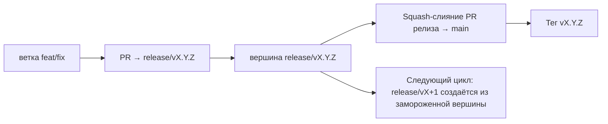

# Branching & Release Model (Русский)

🌐 **Languages:** 🇺🇸 [English](../../../../ops/BRANCHING_MODEL.md) · 🇪🇹 [am](../../../am/docs/ops/BRANCHING_MODEL.md) · 🇸🇦 [ar](../../../ar/docs/ops/BRANCHING_MODEL.md) · 🇦🇿 [az](../../../az/docs/ops/BRANCHING_MODEL.md) · 🇧🇬 [bg](../../../bg/docs/ops/BRANCHING_MODEL.md) · 🇧🇩 [bn](../../../bn/docs/ops/BRANCHING_MODEL.md) · 🇨🇿 [cs](../../../cs/docs/ops/BRANCHING_MODEL.md) · 🇩🇰 [da](../../../da/docs/ops/BRANCHING_MODEL.md) · 🇩🇪 [de](../../../de/docs/ops/BRANCHING_MODEL.md) · 🇬🇷 [el](../../../el/docs/ops/BRANCHING_MODEL.md) · 🇪🇸 [es](../../../es/docs/ops/BRANCHING_MODEL.md) · 🇪🇪 [et](../../../et/docs/ops/BRANCHING_MODEL.md) · 🇮🇷 [fa](../../../fa/docs/ops/BRANCHING_MODEL.md) · 🇫🇮 [fi](../../../fi/docs/ops/BRANCHING_MODEL.md) · 🇫🇷 [fr](../../../fr/docs/ops/BRANCHING_MODEL.md) · 🇮🇪 [ga](../../../ga/docs/ops/BRANCHING_MODEL.md) · 🇮🇳 [gu](../../../gu/docs/ops/BRANCHING_MODEL.md) · 🇳🇬 [ha](../../../ha/docs/ops/BRANCHING_MODEL.md) · 🇮🇱 [he](../../../he/docs/ops/BRANCHING_MODEL.md) · 🇮🇳 [hi](../../../hi/docs/ops/BRANCHING_MODEL.md) · 🇭🇷 [hr](../../../hr/docs/ops/BRANCHING_MODEL.md) · 🇭🇺 [hu](../../../hu/docs/ops/BRANCHING_MODEL.md) · 🇦🇲 [hy](../../../hy/docs/ops/BRANCHING_MODEL.md) · 🇮🇩 [id](../../../id/docs/ops/BRANCHING_MODEL.md) · 🇳🇬 [ig](../../../ig/docs/ops/BRANCHING_MODEL.md) · 🇮🇹 [it](../../../it/docs/ops/BRANCHING_MODEL.md) · 🇯🇵 [ja](../../../ja/docs/ops/BRANCHING_MODEL.md) · 🇬🇪 [ka](../../../ka/docs/ops/BRANCHING_MODEL.md) · 🇰🇭 [km](../../../km/docs/ops/BRANCHING_MODEL.md) · 🇮🇳 [kn](../../../kn/docs/ops/BRANCHING_MODEL.md) · 🇰🇷 [ko](../../../ko/docs/ops/BRANCHING_MODEL.md) · 🇱🇹 [lt](../../../lt/docs/ops/BRANCHING_MODEL.md) · 🇱🇻 [lv](../../../lv/docs/ops/BRANCHING_MODEL.md) · 🇮🇳 [ml](../../../ml/docs/ops/BRANCHING_MODEL.md) · 🇮🇳 [mr](../../../mr/docs/ops/BRANCHING_MODEL.md) · 🇲🇾 [ms](../../../ms/docs/ops/BRANCHING_MODEL.md) · 🇲🇹 [mt](../../../mt/docs/ops/BRANCHING_MODEL.md) · 🇲🇲 [my](../../../my/docs/ops/BRANCHING_MODEL.md) · 🇳🇵 [ne](../../../ne/docs/ops/BRANCHING_MODEL.md) · 🇳🇱 [nl](../../../nl/docs/ops/BRANCHING_MODEL.md) · 🇳🇴 [no](../../../no/docs/ops/BRANCHING_MODEL.md) · 🇮🇳 [or](../../../or/docs/ops/BRANCHING_MODEL.md) · 🇮🇳 [pa](../../../pa/docs/ops/BRANCHING_MODEL.md) · 🇵🇭 [phi](../../../phi/docs/ops/BRANCHING_MODEL.md) · 🇵🇱 [pl](../../../pl/docs/ops/BRANCHING_MODEL.md) · 🇵🇹 [pt](../../../pt/docs/ops/BRANCHING_MODEL.md) · 🇧🇷 [pt-BR](../../../pt-BR/docs/ops/BRANCHING_MODEL.md) · 🇷🇴 [ro](../../../ro/docs/ops/BRANCHING_MODEL.md) · 🇱🇰 [si](../../../si/docs/ops/BRANCHING_MODEL.md) · 🇸🇰 [sk](../../../sk/docs/ops/BRANCHING_MODEL.md) · 🇸🇮 [sl](../../../sl/docs/ops/BRANCHING_MODEL.md) · 🇷🇸 [sr](../../../sr/docs/ops/BRANCHING_MODEL.md) · 🇸🇪 [sv](../../../sv/docs/ops/BRANCHING_MODEL.md) · 🇰🇪 [sw](../../../sw/docs/ops/BRANCHING_MODEL.md) · 🇮🇳 [ta](../../../ta/docs/ops/BRANCHING_MODEL.md) · 🇮🇳 [te](../../../te/docs/ops/BRANCHING_MODEL.md) · 🇹🇭 [th](../../../th/docs/ops/BRANCHING_MODEL.md) · 🇹🇷 [tr](../../../tr/docs/ops/BRANCHING_MODEL.md) · 🇺🇦 [uk-UA](../../../uk-UA/docs/ops/BRANCHING_MODEL.md) · 🇵🇰 [ur](../../../ur/docs/ops/BRANCHING_MODEL.md) · 🇺🇿 [uz](../../../uz/docs/ops/BRANCHING_MODEL.md) · 🇻🇳 [vi](../../../vi/docs/ops/BRANCHING_MODEL.md) · 🇳🇬 [yo](../../../yo/docs/ops/BRANCHING_MODEL.md) · 🇨🇳 [zh-CN](../../../zh-CN/docs/ops/BRANCHING_MODEL.md) · 🇹🇼 [zh-TW](../../../zh-TW/docs/ops/BRANCHING_MODEL.md)

---

OmniRoute использует модель выпуска с **параллельными циклами**: отдельную ветку `release/vX.Y.Z`
для активного цикла, `main` для опубликованной линии и неизменяемый
тег `vX.Y.Z`, создаваемый при выпуске этого цикла. Коммиты, попадающие и в `release/*`, _и_ в
`main`, — это ожидаемое поведение, а не ошибка.

Подробная информация для сопровождающих находится в `CLAUDE.md` (жёсткое правило № 21) и
[RELEASE_CHECKLIST.md](./RELEASE_CHECKLIST.md). На этой странице приведена общедоступная
сводка для участников проекта.

## Краткий обзор

| Ссылка           | Роль                                                                                              |
| ---------------- | ------------------------------------------------------------------------------------------------- |
| `release/vX.Y.Z` | **Активный цикл** — повседневная разработка и слияние PR для этой версии                          |
| `main`           | **Опубликованная линия** — получает изменения цикла посредством squash-слияния при выпуске релиза |
| `vX.Y.Z` (тег)   | **Маркер выпуска** — неизменяемый указатель на выпущенное состояние, создаваемый в момент релиза  |



## На какую ветку должен быть направлен мой PR?

**Направляйте PR в активную ветку `release/vX.Y.Z`, а не в `main`.**

1. Найдите старшую открытую ветку `release/v*` (пример на момент написания:
   `release/v3.8.49`).
2. Создайте ветку от её вершины (`git fetch`, затем checkout / rebase на неё).
3. Откройте PR, указав **base = эту ветку `release/vX.Y.Z`**.

`main` не является веткой для повседневной интеграции. PR, открытые в `main`,
обычно необходимо перенаправить на другую ветку перед слиянием.

## Заморозка релиза (параллельные циклы)

Когда выполняется согласование релиза, создаётся задача-маркер с меткой `release-freeze`.
Это **не останавливает разработку**:

- Замороженная ветка `release/vX.Y.Z` передаётся в распоряжение ответственного за этот релиз.
- Ветка следующего цикла `release/vX+1` создаётся из замороженной вершины, чтобы участники могли
  продолжать добавлять изменения.
- Открытые PR, всё ещё направленные в замороженную ветку, следует **перенаправить** в
  активную (старшую) ветку `release/v*`.

Прежде чем считать нужную ветку доступной для слияния, проверьте наличие активной заморозки:

```bash
gh issue list --repo diegosouzapw/OmniRoute --label release-freeze --state open
```

Механика слияния (метка владельца `queue` → Mergify) описана в
[MERGE_TRAIN.md](./MERGE_TRAIN.md).

## Зачем нужны и ветка, и тег?

| Артефакт         | Срок существования | Назначение                                                                                |
| ---------------- | ------------------ | ----------------------------------------------------------------------------------------- |
| `release/vX.Y.Z` | Текущий цикл       | Собирает проверенные PR, сохраняет успешное прохождение CI и служит базовой веткой для PR |
| Тег `vX.Y.Z`     | Навсегда           | Отмечает точное состояние, выпущенное в npm / GitHub Releases                             |

Ветка — это мастерская, а тег — запечатанная упаковка. После squash-слияния в
`main` следующий цикл продолжается в `release/vX+1`, не дожидаясь завершения PR
предыдущего релиза.

## Связанная документация

- [CONTRIBUTING.md](../../CONTRIBUTING.md) — настройка, тесты, контрольный список PR
- [RELEASE_CHECKLIST.md](./RELEASE_CHECKLIST.md) — проверка перед выпуском
- [MERGE_TRAIN.md](./MERGE_TRAIN.md) — очередь слияния и резервный процесс последовательных слияний
- [RELEASE_GREEN.md](./RELEASE_GREEN.md) — поддержание успешного прохождения проверок вершиной релизной ветки
