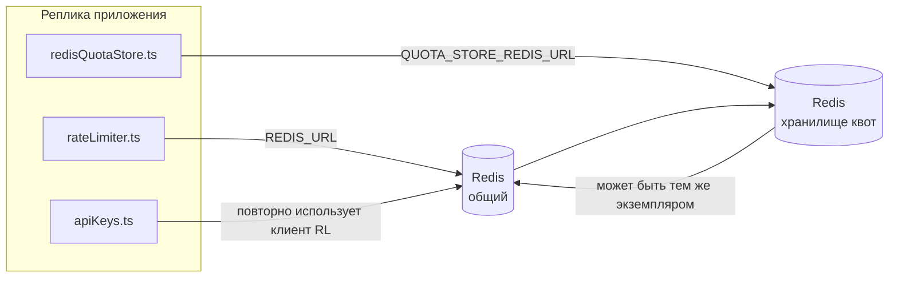

# Redis Production Configuration Guide (Русский)

🌐 **Languages:** 🇺🇸 [English](../../../../ops/REDIS_PRODUCTION_CONFIG.md) · 🇪🇹 [am](../../../am/docs/ops/REDIS_PRODUCTION_CONFIG.md) · 🇸🇦 [ar](../../../ar/docs/ops/REDIS_PRODUCTION_CONFIG.md) · 🇦🇿 [az](../../../az/docs/ops/REDIS_PRODUCTION_CONFIG.md) · 🇧🇬 [bg](../../../bg/docs/ops/REDIS_PRODUCTION_CONFIG.md) · 🇧🇩 [bn](../../../bn/docs/ops/REDIS_PRODUCTION_CONFIG.md) · 🇨🇿 [cs](../../../cs/docs/ops/REDIS_PRODUCTION_CONFIG.md) · 🇩🇰 [da](../../../da/docs/ops/REDIS_PRODUCTION_CONFIG.md) · 🇩🇪 [de](../../../de/docs/ops/REDIS_PRODUCTION_CONFIG.md) · 🇬🇷 [el](../../../el/docs/ops/REDIS_PRODUCTION_CONFIG.md) · 🇪🇸 [es](../../../es/docs/ops/REDIS_PRODUCTION_CONFIG.md) · 🇪🇪 [et](../../../et/docs/ops/REDIS_PRODUCTION_CONFIG.md) · 🇮🇷 [fa](../../../fa/docs/ops/REDIS_PRODUCTION_CONFIG.md) · 🇫🇮 [fi](../../../fi/docs/ops/REDIS_PRODUCTION_CONFIG.md) · 🇫🇷 [fr](../../../fr/docs/ops/REDIS_PRODUCTION_CONFIG.md) · 🇮🇪 [ga](../../../ga/docs/ops/REDIS_PRODUCTION_CONFIG.md) · 🇮🇳 [gu](../../../gu/docs/ops/REDIS_PRODUCTION_CONFIG.md) · 🇳🇬 [ha](../../../ha/docs/ops/REDIS_PRODUCTION_CONFIG.md) · 🇮🇱 [he](../../../he/docs/ops/REDIS_PRODUCTION_CONFIG.md) · 🇮🇳 [hi](../../../hi/docs/ops/REDIS_PRODUCTION_CONFIG.md) · 🇭🇷 [hr](../../../hr/docs/ops/REDIS_PRODUCTION_CONFIG.md) · 🇭🇺 [hu](../../../hu/docs/ops/REDIS_PRODUCTION_CONFIG.md) · 🇦🇲 [hy](../../../hy/docs/ops/REDIS_PRODUCTION_CONFIG.md) · 🇮🇩 [id](../../../id/docs/ops/REDIS_PRODUCTION_CONFIG.md) · 🇳🇬 [ig](../../../ig/docs/ops/REDIS_PRODUCTION_CONFIG.md) · 🇮🇹 [it](../../../it/docs/ops/REDIS_PRODUCTION_CONFIG.md) · 🇯🇵 [ja](../../../ja/docs/ops/REDIS_PRODUCTION_CONFIG.md) · 🇬🇪 [ka](../../../ka/docs/ops/REDIS_PRODUCTION_CONFIG.md) · 🇰🇭 [km](../../../km/docs/ops/REDIS_PRODUCTION_CONFIG.md) · 🇮🇳 [kn](../../../kn/docs/ops/REDIS_PRODUCTION_CONFIG.md) · 🇰🇷 [ko](../../../ko/docs/ops/REDIS_PRODUCTION_CONFIG.md) · 🇱🇹 [lt](../../../lt/docs/ops/REDIS_PRODUCTION_CONFIG.md) · 🇱🇻 [lv](../../../lv/docs/ops/REDIS_PRODUCTION_CONFIG.md) · 🇮🇳 [ml](../../../ml/docs/ops/REDIS_PRODUCTION_CONFIG.md) · 🇮🇳 [mr](../../../mr/docs/ops/REDIS_PRODUCTION_CONFIG.md) · 🇲🇾 [ms](../../../ms/docs/ops/REDIS_PRODUCTION_CONFIG.md) · 🇲🇹 [mt](../../../mt/docs/ops/REDIS_PRODUCTION_CONFIG.md) · 🇲🇲 [my](../../../my/docs/ops/REDIS_PRODUCTION_CONFIG.md) · 🇳🇵 [ne](../../../ne/docs/ops/REDIS_PRODUCTION_CONFIG.md) · 🇳🇱 [nl](../../../nl/docs/ops/REDIS_PRODUCTION_CONFIG.md) · 🇳🇴 [no](../../../no/docs/ops/REDIS_PRODUCTION_CONFIG.md) · 🇮🇳 [or](../../../or/docs/ops/REDIS_PRODUCTION_CONFIG.md) · 🇮🇳 [pa](../../../pa/docs/ops/REDIS_PRODUCTION_CONFIG.md) · 🇵🇭 [phi](../../../phi/docs/ops/REDIS_PRODUCTION_CONFIG.md) · 🇵🇱 [pl](../../../pl/docs/ops/REDIS_PRODUCTION_CONFIG.md) · 🇵🇹 [pt](../../../pt/docs/ops/REDIS_PRODUCTION_CONFIG.md) · 🇧🇷 [pt-BR](../../../pt-BR/docs/ops/REDIS_PRODUCTION_CONFIG.md) · 🇷🇴 [ro](../../../ro/docs/ops/REDIS_PRODUCTION_CONFIG.md) · 🇱🇰 [si](../../../si/docs/ops/REDIS_PRODUCTION_CONFIG.md) · 🇸🇰 [sk](../../../sk/docs/ops/REDIS_PRODUCTION_CONFIG.md) · 🇸🇮 [sl](../../../sl/docs/ops/REDIS_PRODUCTION_CONFIG.md) · 🇷🇸 [sr](../../../sr/docs/ops/REDIS_PRODUCTION_CONFIG.md) · 🇸🇪 [sv](../../../sv/docs/ops/REDIS_PRODUCTION_CONFIG.md) · 🇰🇪 [sw](../../../sw/docs/ops/REDIS_PRODUCTION_CONFIG.md) · 🇮🇳 [ta](../../../ta/docs/ops/REDIS_PRODUCTION_CONFIG.md) · 🇮🇳 [te](../../../te/docs/ops/REDIS_PRODUCTION_CONFIG.md) · 🇹🇭 [th](../../../th/docs/ops/REDIS_PRODUCTION_CONFIG.md) · 🇹🇷 [tr](../../../tr/docs/ops/REDIS_PRODUCTION_CONFIG.md) · 🇺🇦 [uk-UA](../../../uk-UA/docs/ops/REDIS_PRODUCTION_CONFIG.md) · 🇵🇰 [ur](../../../ur/docs/ops/REDIS_PRODUCTION_CONFIG.md) · 🇺🇿 [uz](../../../uz/docs/ops/REDIS_PRODUCTION_CONFIG.md) · 🇻🇳 [vi](../../../vi/docs/ops/REDIS_PRODUCTION_CONFIG.md) · 🇳🇬 [yo](../../../yo/docs/ops/REDIS_PRODUCTION_CONFIG.md) · 🇨🇳 [zh-CN](../../../zh-CN/docs/ops/REDIS_PRODUCTION_CONFIG.md) · 🇹🇼 [zh-TW](../../../zh-TW/docs/ops/REDIS_PRODUCTION_CONFIG.md)

---

## Обзор

Redis — это **необязательная, некритичная зависимость** в OmniRoute: при недоступности Redis приложение продолжает работать с пониженной функциональностью (используя
резервные механизмы в памяти). В рабочей среде настройка Redis снижает задержки для четырёх отдельных
типов нагрузки:

| Тип нагрузки                        | Модуль                        | Фабрика клиента                                                 | Шаблон ключа                                                             |
| ----------------------------------- | ----------------------------- | --------------------------------------------------------------- | ------------------------------------------------------------------------ |
| Ограничение частоты запросов        | `rateLimiter.ts`              | `getRedisClient()` — лениво инициализируемый синглтон `ioredis` | `<prefix>rl:*` атомарные окна ограничения частоты запросов на основе Lua |
| Кеш аутентификации                  | `apiKeys.ts`                  | Повторно использует клиент из `rateLimiter`                     | `<prefix>auth:api_key:<sha256>` с TTL                                    |
| Хранилище квот                      | `redisQuotaStore.ts`          | Отдельный синглтон `getRedisClient(url)`                        | `<prefix>quota:*`, настраиваемый для каждого экземпляра                  |
| Автоматический выключатель прогрева | `redisCircuitBreakerStore.ts` | Отдельный клиент в `circuitBreakerFactory.ts`                   | `<prefix>warmup:cb:<connectionId>`                                       |

Все четыре типа нагрузки используют общий префикс пространства имён, чтобы OmniRoute мог сосуществовать с другими приложениями в
одном экземпляре Redis (например, `127.0.0.1:6379`). См. раздел [Пространство имён ключей](#key-namespacing).

---

## Текущая конфигурация (значения по умолчанию в коде)

| Параметр                                     | Значение                                                                                       | Где                                                                                   |
| -------------------------------------------- | ---------------------------------------------------------------------------------------------- | ------------------------------------------------------------------------------------- |
| Переменная окружения `REDIS_URL`             | `redis://redis:6379` (compose), необязательная                                                 | `rateLimiter.ts:5`, `.env.example`                                                    |
| Переменная окружения `REDIS_KEY_PREFIX`      | `omniroute:` (по умолчанию)                                                                    | `rateLimiter.ts`, `redisQuotaStore.ts`, `redisCircuitBreakerStore.ts`, `.env.example` |
| Переменная окружения `QUOTA_STORE_REDIS_URL` | отдельная, может отличаться от `REDIS_URL`                                                     | `quota/storeFactory.ts`                                                               |
| `QUOTA_STORE_DRIVER`                         | `"sqlite"` (по умолчанию), `"redis"` опционально                                               | `quota/storeFactory.ts`                                                               |
| `maxRetriesPerRequest` в ioredis             | `3`                                                                                            | создание клиента в `rateLimiter.ts`                                                   |
| `enableReadyCheck`                           | не задано (значение ioredis по умолчанию: `true`)                                              | —                                                                                     |
| `lazyConnect`                                | не задано (значение ioredis по умолчанию: `false`)                                             | —                                                                                     |
| `retryStrategy`                              | не задано (значение ioredis по умолчанию: базовая задержка 200ms, экспоненциальное увеличение) | —                                                                                     |
| TLS / пароль / индекс БД                     | **не настроено**                                                                               | —                                                                                     |
| Sentinel / Cluster                           | **не настроено** — поддерживается только автономный одиночный узел                             | —                                                                                     |

---

## Пространство имён ключей

OmniRoute совместно использует экземпляр Redis со всеми остальными сервисами, работающими на хосте. Без пространства имён
такие ключи, как `auth:api_key:<sha256>` или `rl:*`, могут конфликтовать с ключами других приложений,
использующих тот же Redis (этот экземпляр Redis работает по адресу `127.0.0.1:6379` вместе с другими сервисами).

Задайте для `REDIS_KEY_PREFIX` непустую строку, чтобы добавить префикс к **каждому** ключу OmniRoute:

```bash
# .env — все ключи OmniRoute будут иметь вид omniroute:rl:*, omniroute:auth:*, omniroute:quota:*, omniroute:warmup:cb:*
REDIS_KEY_PREFIX=omniroute:
```

- **По умолчанию:** `omniroute:` (применяется, если `REDIS_KEY_PREFIX` не задан или пуст).
- **Применяется к:** ограничителю частоты запросов + кешу аутентификации (общий клиент `ioredis` через `keyPrefix`), а также
  хранилищу квот (`KEY_PREFIX = "${REDIS_KEY_PREFIX}quota"`) и автоматическому выключателю прогрева
  (`KEY_PREFIX = "${REDIS_KEY_PREFIX}warmup:cb:"`).
- **Изменение префикса** при наличии ключей в Redis делает старые ключи недоступными (они удаляются
  по TTL / LRU). Префикс можно безопасно изменить; миграция не требуется. Единственное исключение — ключ автоматического
  выключателя прогрева для подключения, помеченного как запрещённое: он сохраняется без TTL, поэтому
  найдите оставшиеся ключи с помощью `redis-cli --scan --pattern '<old-prefix>warmup:cb:*'` и удалите их.
- **`keyPrefix` в ioredis** автоматически добавляет префикс при записи **и** удаляет его при чтении,
  поэтому код приложения никогда не видит префикс.

---

## Рекомендуемая настройка для продакшена

### 1. Пул подключений / параметры клиента (конструктор ioredis `Redis`)

Текущий код создаёт один экземпляр `new Redis(url)` без пользовательских параметров. Для продакшен-развёртываний с несколькими репликами передайте фабрику клиентов в коде или оберните `getRedisClient()`:

```typescript
const redis = new Redis(REDIS_URL, {
  maxRetriesPerRequest: null, // без ограничения повторных попыток; решение принимает retryStrategy
  enableReadyCheck: true, // проверять готовность сервера перед приёмом вызовов
  lazyConnect: true, // не подключаться при создании; дождаться первого вызова
  retryStrategy: (times) => {
    if (times > 10) return null; // прекратить после 10 попыток → переподключиться позже
    return Math.min(times * 200, 5000); // 200 мс, 400 мс, …, максимум 5 с
  },
  enableAutoPipelining: true, // объединять параллельные команды в одну запись TCP
  keepAlive: 10000, // TCP keep-alive каждые 10 с
});
```

**Ключевые компромиссы:**

- `maxRetriesPerRequest: null` + `retryStrategy` — предпочтительный вариант для продакшена, чтобы временные
  перезапуски Redis не приводили к немедленному сбою каждого запроса. Резервный механизм в памяти в
  `checkRateLimit()` обрабатывает сценарий сбоя.
- `lazyConnect: true` — устраняет зависимость запуска от доступности Redis до того, как сервер
  начнёт принимать подключения.
- `enableAutoPipelining: true` — сокращает количество сетевых обменов при параллельных проверках ограничения частоты;
  полезно при >50 запросах в секунду через одно подключение.

### 2. Конфигурация сервера Redis (`redis.conf`)

```
# Память
maxmemory 80%                        # оставить место для страничного кеша ОС
maxmemory-policy allkeys-lru         # вытеснять устаревшие записи кеша авторизации при нехватке памяти

# Персистентность (необязательно — OmniRoute устойчив к сбоям и без неё)
save 300 1                           # создавать снимок не реже чем каждые 5 мин, если изменён ≥1 ключ
appendonly no                        # AOF не нужен; данные можно восстановить
appendfsync no                       # без накладных расходов на fsync (RDB достаточно)

# Сеть
timeout 0                            # не отключать неактивные подключения
tcp-keepalive 300                    # keep-alive каждые 5 мин
tcp-backlog 511                      # очередь подключений для всплесков нагрузки

# Производительность
hz 10                                # значение по умолчанию; 100 для систем, чувствительных к задержкам
activedefrag yes                     # автоматическая дефрагментация при фрагментации >10%
```

**Компромисс при использовании `maxmemory-policy allkeys-lru`:** записи кеша авторизации могут быть вытеснены при
нехватке памяти. Это безопасно — `setCachedApiKey` всегда повторно заполняет кеш при промахе, а
резервное хранилище SQLite является источником достоверных данных. Lua-скрипт ограничителя частоты создаёт небольшие ключи, которые
по своей природе имеют короткий срок жизни.

### 3. Настройки Docker Compose

Продакшен-конфигурация Compose (`docker-compose.prod.yml`) использует `redis:8.6.2-alpine`. Добавьте:

```yaml
redis:
  image: redis:8.6.2-alpine
  command:
    [
      "redis-server",
      "--maxmemory",
      "512mb",
      "--maxmemory-policy",
      "allkeys-lru",
      "--activedefrag",
      "yes",
      "--save",
      "300 1",
    ]
  healthcheck:
    test: ["CMD", "redis-cli", "ping"]
    interval: 10s
    timeout: 3s
    retries: 3
    start_period: 5s
```

### 4. Особенности работы с несколькими экземплярами / масштабирования

**Один Redis для всех реплик** — Lua-скрипт ограничителя частоты зависит от единого
авторитетного пространства ключей. Использование нескольких экземпляров Redis для разных реплик нарушит атомарность
и удвоит доступный лимит. Используйте один Redis (или кластер Redis Sentinel с переключением при сбое) для
всех реплик приложения.

**Количество подключений:** каждая реплика приложения открывает **2 TCP-подключения** к Redis
(клиент ограничителя частоты + клиент хранилища квот). При 10 репликах → 20 подключений, что значительно
ниже стандартного лимита экземпляра Redis в 10 тыс. подключений.

### 5. Мониторинг

Предоставьте через конечную точку проверки работоспособности:

```typescript
// src/app/api/monitoring/health/route.ts уже вызывает функции rateLimiter
// Добавьте проверки, относящиеся к Redis:
//   1. Задержка PING через ioredis .ping()
//   2. Использование памяти через INFO memory
//   3. Количество подключений через INFO clients
//   4. Доля попаданий для maxmemory-policy (evicted_keys / keyspace_hits)
```

Ключевые метрики для отслеживания:

- **Вытесненные ключи / с** — если значение постоянно не равно нулю, увеличьте `maxmemory`
- **Заблокированные клиенты** — ненулевое значение указывает на медленные Lua-скрипты или высокую конкуренцию
- **Отклонённые подключения** — достигнут лимит подключений; маловероятно при 20 подключениях

---

## Диаграмма архитектуры



---

## Справочные материалы

| Файл                               | Назначение                                                                                 |
| ---------------------------------- | ------------------------------------------------------------------------------------------ |
| `src/shared/utils/rateLimiter.ts`  | Основной клиент Redis, Lua-скрипт ограничения частоты запросов, резервный вариант в памяти |
| `src/lib/db/apiKeys.ts`            | Кеш аутентификации — резервный переход с Redis на SQLite                                   |
| `src/lib/quota/redisQuotaStore.ts` | Отдельный клиент Redis для опционального хранилища квот                                    |
| `src/lib/quota/storeFactory.ts`    | Переключает драйверы квот между `sqlite` и `redis`                                         |
| `docker-compose.prod.yml`          | Контейнер Redis для продакшена (образ `redis:8.6.2-alpine`)                                |
| `.env.example`                     | Документация по переменным окружения Redis                                                 |
| `src/app/api/local/redis/`         | Маршруты API для оркестрации контейнера разработки                                         |
| `bin/cli/commands/redis.mjs`       | Команды CLI для оркестрации контейнера разработки                                          |
