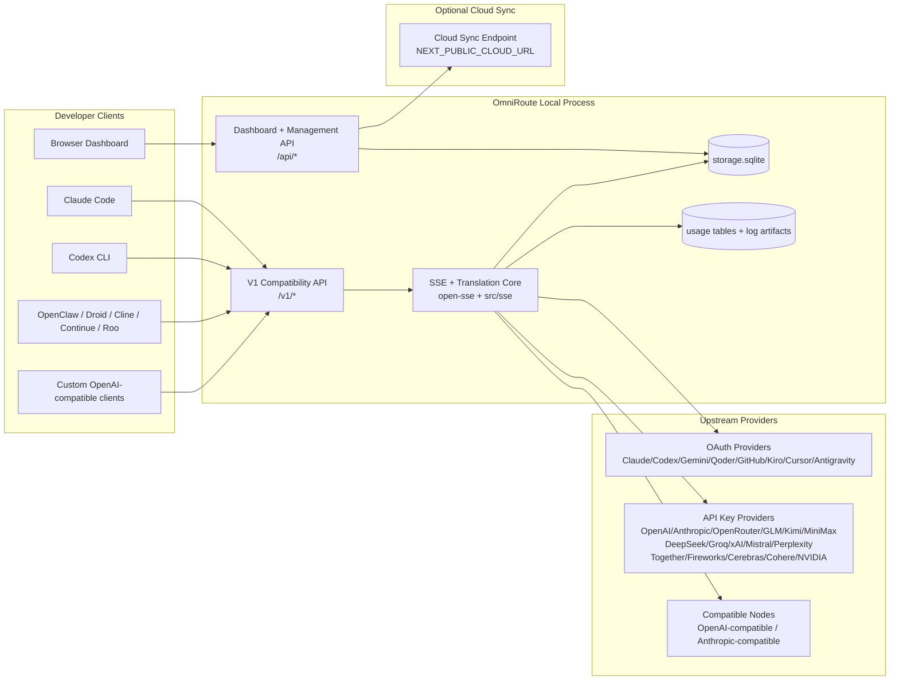
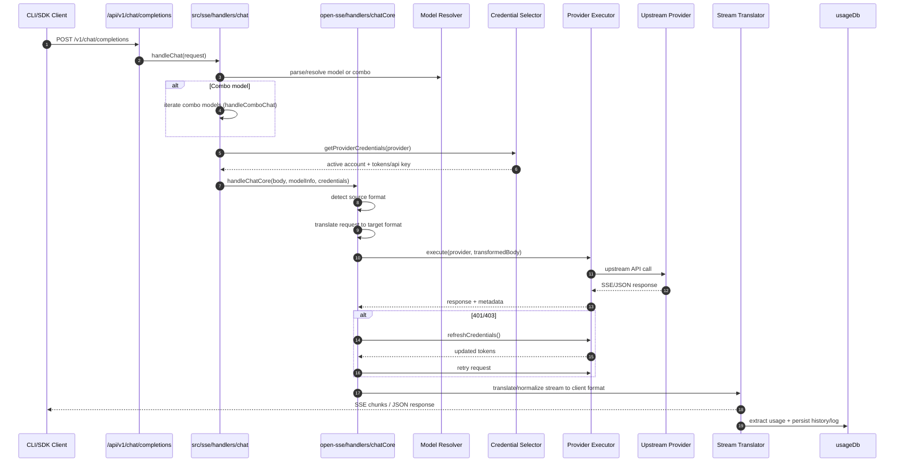
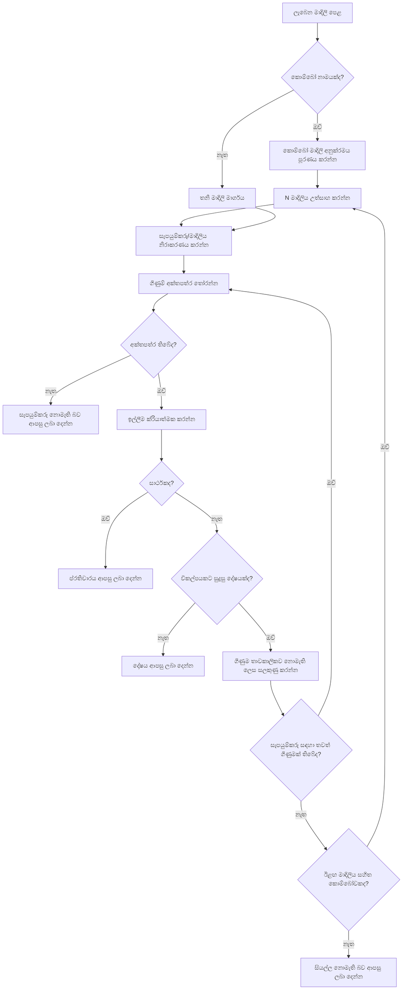
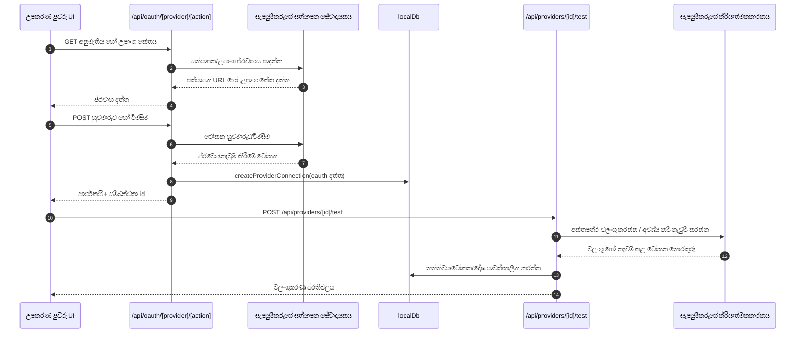
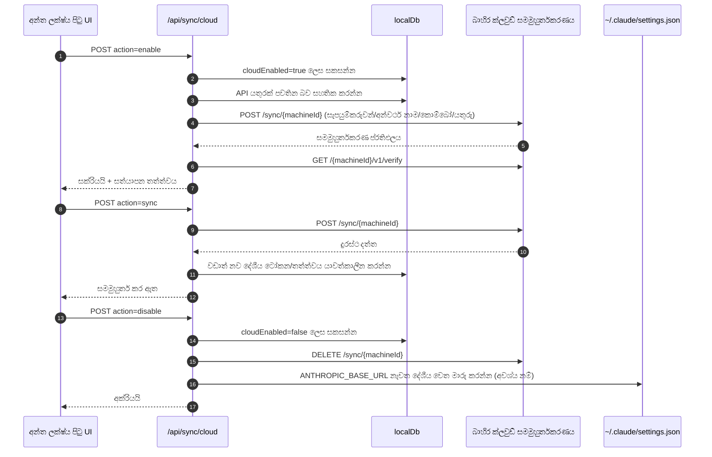
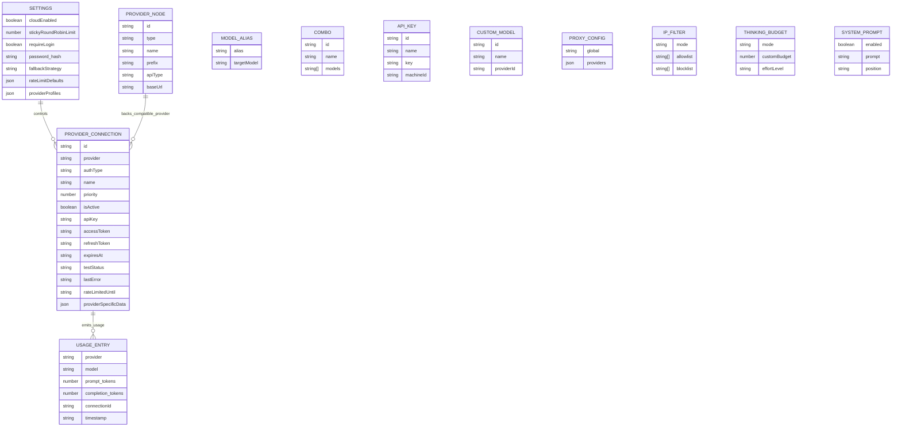
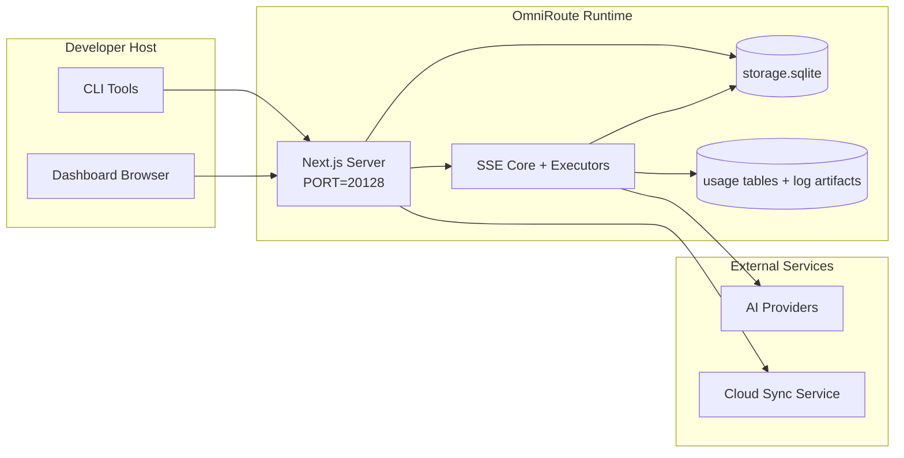

# OmniRoute Architecture (සිංහල)

🌐 **Languages:** 🇺🇸 [English](../../../../architecture/ARCHITECTURE.md) · 🇪🇹 [am](../../../am/docs/architecture/ARCHITECTURE.md) · 🇸🇦 [ar](../../../ar/docs/architecture/ARCHITECTURE.md) · 🇦🇿 [az](../../../az/docs/architecture/ARCHITECTURE.md) · 🇧🇬 [bg](../../../bg/docs/architecture/ARCHITECTURE.md) · 🇧🇩 [bn](../../../bn/docs/architecture/ARCHITECTURE.md) · 🇧🇦 [bs](../../../bs/docs/architecture/ARCHITECTURE.md) · 🇨🇿 [cs](../../../cs/docs/architecture/ARCHITECTURE.md) · 🇩🇰 [da](../../../da/docs/architecture/ARCHITECTURE.md) · 🇩🇪 [de](../../../de/docs/architecture/ARCHITECTURE.md) · 🇬🇷 [el](../../../el/docs/architecture/ARCHITECTURE.md) · 🇪🇸 [es](../../../es/docs/architecture/ARCHITECTURE.md) · 🇪🇪 [et](../../../et/docs/architecture/ARCHITECTURE.md) · 🇮🇷 [fa](../../../fa/docs/architecture/ARCHITECTURE.md) · 🇫🇮 [fi](../../../fi/docs/architecture/ARCHITECTURE.md) · 🇫🇷 [fr](../../../fr/docs/architecture/ARCHITECTURE.md) · 🇮🇪 [ga](../../../ga/docs/architecture/ARCHITECTURE.md) · 🇮🇳 [gu](../../../gu/docs/architecture/ARCHITECTURE.md) · 🇳🇬 [ha](../../../ha/docs/architecture/ARCHITECTURE.md) · 🇮🇱 [he](../../../he/docs/architecture/ARCHITECTURE.md) · 🇮🇳 [hi](../../../hi/docs/architecture/ARCHITECTURE.md) · 🇭🇷 [hr](../../../hr/docs/architecture/ARCHITECTURE.md) · 🇭🇺 [hu](../../../hu/docs/architecture/ARCHITECTURE.md) · 🇦🇲 [hy](../../../hy/docs/architecture/ARCHITECTURE.md) · 🇮🇩 [id](../../../id/docs/architecture/ARCHITECTURE.md) · 🇳🇬 [ig](../../../ig/docs/architecture/ARCHITECTURE.md) · 🇮🇹 [it](../../../it/docs/architecture/ARCHITECTURE.md) · 🇯🇵 [ja](../../../ja/docs/architecture/ARCHITECTURE.md) · 🇬🇪 [ka](../../../ka/docs/architecture/ARCHITECTURE.md) · 🇰🇭 [km](../../../km/docs/architecture/ARCHITECTURE.md) · 🇮🇳 [kn](../../../kn/docs/architecture/ARCHITECTURE.md) · 🇰🇷 [ko](../../../ko/docs/architecture/ARCHITECTURE.md) · 🇱🇹 [lt](../../../lt/docs/architecture/ARCHITECTURE.md) · 🇱🇻 [lv](../../../lv/docs/architecture/ARCHITECTURE.md) · 🇮🇳 [ml](../../../ml/docs/architecture/ARCHITECTURE.md) · 🇮🇳 [mr](../../../mr/docs/architecture/ARCHITECTURE.md) · 🇲🇾 [ms](../../../ms/docs/architecture/ARCHITECTURE.md) · 🇲🇹 [mt](../../../mt/docs/architecture/ARCHITECTURE.md) · 🇲🇲 [my](../../../my/docs/architecture/ARCHITECTURE.md) · 🇳🇵 [ne](../../../ne/docs/architecture/ARCHITECTURE.md) · 🇳🇱 [nl](../../../nl/docs/architecture/ARCHITECTURE.md) · 🇳🇴 [no](../../../no/docs/architecture/ARCHITECTURE.md) · 🇮🇳 [or](../../../or/docs/architecture/ARCHITECTURE.md) · 🇮🇳 [pa](../../../pa/docs/architecture/ARCHITECTURE.md) · 🇵🇭 [phi](../../../phi/docs/architecture/ARCHITECTURE.md) · 🇵🇱 [pl](../../../pl/docs/architecture/ARCHITECTURE.md) · 🇵🇹 [pt](../../../pt/docs/architecture/ARCHITECTURE.md) · 🇧🇷 [pt-BR](../../../pt-BR/docs/architecture/ARCHITECTURE.md) · 🇷🇴 [ro](../../../ro/docs/architecture/ARCHITECTURE.md) · 🇷🇺 [ru](../../../ru/docs/architecture/ARCHITECTURE.md) · 🇸🇰 [sk](../../../sk/docs/architecture/ARCHITECTURE.md) · 🇸🇮 [sl](../../../sl/docs/architecture/ARCHITECTURE.md) · 🇷🇸 [sr](../../../sr/docs/architecture/ARCHITECTURE.md) · 🇸🇪 [sv](../../../sv/docs/architecture/ARCHITECTURE.md) · 🇰🇪 [sw](../../../sw/docs/architecture/ARCHITECTURE.md) · 🇮🇳 [ta](../../../ta/docs/architecture/ARCHITECTURE.md) · 🇮🇳 [te](../../../te/docs/architecture/ARCHITECTURE.md) · 🇹🇭 [th](../../../th/docs/architecture/ARCHITECTURE.md) · 🇹🇷 [tr](../../../tr/docs/architecture/ARCHITECTURE.md) · 🇺🇦 [uk-UA](../../../uk-UA/docs/architecture/ARCHITECTURE.md) · 🇵🇰 [ur](../../../ur/docs/architecture/ARCHITECTURE.md) · 🇺🇿 [uz](../../../uz/docs/architecture/ARCHITECTURE.md) · 🇻🇳 [vi](../../../vi/docs/architecture/ARCHITECTURE.md) · 🇳🇬 [yo](../../../yo/docs/architecture/ARCHITECTURE.md) · 🇨🇳 [zh-CN](../../../zh-CN/docs/architecture/ARCHITECTURE.md) · 🇹🇼 [zh-TW](../../../zh-TW/docs/architecture/ARCHITECTURE.md)

---

🌐 **Languages:** 🇺🇸 [English](../../../../architecture/ARCHITECTURE.md) · 🇪🇹 [am](../../../am/docs/architecture/ARCHITECTURE.md) · 🇸🇦 [ar](../../../ar/docs/architecture/ARCHITECTURE.md) · 🇦🇿 [az](../../../az/docs/architecture/ARCHITECTURE.md) · 🇧🇬 [bg](../../../bg/docs/architecture/ARCHITECTURE.md) · 🇧🇩 [bn](../../../bn/docs/architecture/ARCHITECTURE.md) · 🇧🇦 [bs](../../../bs/docs/architecture/ARCHITECTURE.md) · 🇨🇿 [cs](../../../cs/docs/architecture/ARCHITECTURE.md) · 🇩🇰 [da](../../../da/docs/architecture/ARCHITECTURE.md) · 🇩🇪 [de](../../../de/docs/architecture/ARCHITECTURE.md) · 🇬🇷 [el](../../../el/docs/architecture/ARCHITECTURE.md) · 🇪🇸 [es](../../../es/docs/architecture/ARCHITECTURE.md) · 🇪🇪 [et](../../../et/docs/architecture/ARCHITECTURE.md) · 🇮🇷 [fa](../../../fa/docs/architecture/ARCHITECTURE.md) · 🇫🇮 [fi](../../../fi/docs/architecture/ARCHITECTURE.md) · 🇫🇷 [fr](../../../fr/docs/architecture/ARCHITECTURE.md) · 🇮🇪 [ga](../../../ga/docs/architecture/ARCHITECTURE.md) · 🇮🇳 [gu](../../../gu/docs/architecture/ARCHITECTURE.md) · 🇳🇬 [ha](../../../ha/docs/architecture/ARCHITECTURE.md) · 🇮🇱 [he](../../../he/docs/architecture/ARCHITECTURE.md) · 🇮🇳 [hi](../../../hi/docs/architecture/ARCHITECTURE.md) · 🇭🇷 [hr](../../../hr/docs/architecture/ARCHITECTURE.md) · 🇭🇺 [hu](../../../hu/docs/architecture/ARCHITECTURE.md) · 🇦🇲 [hy](../../../hy/docs/architecture/ARCHITECTURE.md) · 🇮🇩 [id](../../../id/docs/architecture/ARCHITECTURE.md) · 🇳🇬 [ig](../../../ig/docs/architecture/ARCHITECTURE.md) · 🇮🇹 [it](../../../it/docs/architecture/ARCHITECTURE.md) · 🇯🇵 [ja](../../../ja/docs/architecture/ARCHITECTURE.md) · 🇬🇪 [ka](../../../ka/docs/architecture/ARCHITECTURE.md) · 🇰🇭 [km](../../../km/docs/architecture/ARCHITECTURE.md) · 🇮🇳 [kn](../../../kn/docs/architecture/ARCHITECTURE.md) · 🇰🇷 [ko](../../../ko/docs/architecture/ARCHITECTURE.md) · 🇱🇹 [lt](../../../lt/docs/architecture/ARCHITECTURE.md) · 🇱🇻 [lv](../../../lv/docs/architecture/ARCHITECTURE.md) · 🇮🇳 [ml](../../../ml/docs/architecture/ARCHITECTURE.md) · 🇮🇳 [mr](../../../mr/docs/architecture/ARCHITECTURE.md) · 🇲🇾 [ms](../../../ms/docs/architecture/ARCHITECTURE.md) · 🇲🇹 [mt](../../../mt/docs/architecture/ARCHITECTURE.md) · 🇲🇲 [my](../../../my/docs/architecture/ARCHITECTURE.md) · 🇳🇵 [ne](../../../ne/docs/architecture/ARCHITECTURE.md) · 🇳🇱 [nl](../../../nl/docs/architecture/ARCHITECTURE.md) · 🇳🇴 [no](../../../no/docs/architecture/ARCHITECTURE.md) · 🇮🇳 [or](../../../or/docs/architecture/ARCHITECTURE.md) · 🇮🇳 [pa](../../../pa/docs/architecture/ARCHITECTURE.md) · 🇵🇭 [phi](../../../phi/docs/architecture/ARCHITECTURE.md) · 🇵🇱 [pl](../../../pl/docs/architecture/ARCHITECTURE.md) · 🇵🇹 [pt](../../../pt/docs/architecture/ARCHITECTURE.md) · 🇧🇷 [pt-BR](../../../pt-BR/docs/architecture/ARCHITECTURE.md) · 🇷🇴 [ro](../../../ro/docs/architecture/ARCHITECTURE.md) · 🇷🇺 [ru](../../../ru/docs/architecture/ARCHITECTURE.md) · 🇸🇰 [sk](../../../sk/docs/architecture/ARCHITECTURE.md) · 🇸🇮 [sl](../../../sl/docs/architecture/ARCHITECTURE.md) · 🇷🇸 [sr](../../../sr/docs/architecture/ARCHITECTURE.md) · 🇸🇪 [sv](../../../sv/docs/architecture/ARCHITECTURE.md) · 🇰🇪 [sw](../../../sw/docs/architecture/ARCHITECTURE.md) · 🇮🇳 [ta](../../../ta/docs/architecture/ARCHITECTURE.md) · 🇮🇳 [te](../../../te/docs/architecture/ARCHITECTURE.md) · 🇹🇭 [th](../../../th/docs/architecture/ARCHITECTURE.md) · 🇹🇷 [tr](../../../tr/docs/architecture/ARCHITECTURE.md) · 🇺🇦 [uk-UA](../../../uk-UA/docs/architecture/ARCHITECTURE.md) · 🇵🇰 [ur](../../../ur/docs/architecture/ARCHITECTURE.md) · 🇺🇿 [uz](../../../uz/docs/architecture/ARCHITECTURE.md) · 🇻🇳 [vi](../../../vi/docs/architecture/ARCHITECTURE.md) · 🇳🇬 [yo](../../../yo/docs/architecture/ARCHITECTURE.md) · 🇨🇳 [zh-CN](../../../zh-CN/docs/architecture/ARCHITECTURE.md) · 🇹🇼 [zh-TW](../../../zh-TW/docs/architecture/ARCHITECTURE.md)

_අවසන් වරට යාවත්කාලීන කළේ: 2026-06-28_

## විධායක සාරාංශය

OmniRoute යනු Next.js මත ගොඩනගා ඇති දේශීය AI මාර්ගගත කිරීමේ ද්වාරයක් සහ උපකරණ පුවරුවකි.
එය තනි OpenAI-අනුකූල අන්ත ලක්ෂ්යයක් (`/v1/*`) සපයන අතර, පරිවර්තනය, විකල්ප මාර්ගගත කිරීම, ටෝකන නැවුම් කිරීම සහ භාවිතය ලුහුබැඳීම සමඟ බහු upstream සපයන්නන් හරහා ගමනාගමනය මාර්ගගත කරයි.

ප්රධාන හැකියාවන්:

- CLI/මෙවලම් සඳහා OpenAI-අනුකූල API අතුරුමුහුණත (සපයන්නන් 355ක්, ක්රියාත්මක කරන්නන් 108ක්)
- සපයන්නන්ගේ ආකෘති අතර ඉල්ලීම්/ප්රතිචාර පරිවර්තනය
- ආකෘති සංයෝජන විකල්ප මාර්ගගත කිරීම (බහු-ආකෘති අනුපිළිවෙළ)
- `compositeTiers` අනුව ධාවන කාලයේදී අනුපිළිවෙළ සකසන ව්යුහගත සංයෝජන පියවර (`provider + model + connection`)
- ගිණුම්-මට්ටමේ විකල්ප මාර්ගගත කිරීම (එක් සපයන්නෙකුට බහු ගිණුම්)
- ප්රධාන කතාබස් මාර්ගයේ කෝටා පූර්ව පරීක්ෂාව සහ කෝටාව සැලකිල්ලට ගන්නා P2C ගිණුම් තේරීම
- OAuth + API-key සපයන්නන්ගේ සම්බන්ධතා කළමනාකරණය (OAuth සපයන්නා මොඩියුල 22ක්)
- `/v1/embeddings` හරහා embedding ජනනය (සපයන්නන් 18ක්)
- `/v1/images/generations` හරහා රූප ජනනය (සපයන්නන් 10කට වැඩි, ආකෘති 20කට වැඩි)
- `/v1/audio/transcriptions` හරහා ශ්රව්ය පිටපත්කරණය (සපයන්නන් 18ක්)
- `/v1/audio/speech` හරහා පෙළ-සිට-කථනය (අන්තර්ගත සපයන්නන් 24ක්)
- `/v1/videos/generations` හරහා වීඩියෝ ජනනය (ComfyUI + SD WebUI)
- `/v1/music/generations` හරහා සංගීත ජනනය (ComfyUI)
- `/v1/search` හරහා වෙබ් සෙවීම (සපයන්නන් 20ක්)
- `/v1/moderations` හරහා අන්තර්ගත පාලනය
- `/v1/rerank` හරහා යළි ශ්රේණිගත කිරීම
- තාර්කික ආකෘති සඳහා Think ටැග් විග්රහ කිරීම (`<think>...</think>`)
- දැඩි OpenAI SDK අනුකූලතාව සඳහා ප්රතිචාර පිරිසිදු කිරීම
- සපයන්නන් අතර අනුකූලතාව සඳහා භූමිකා සාමාන්යකරණය (developer→system, system→user)
- ව්යුහගත ප්රතිදාන පරිවර්තනය (json_schema → Gemini responseSchema)
- සපයන්නන්, යතුරු, අන්වර්ථ, සංයෝජන, සැකසුම් සහ මිලකරණය සඳහා දේශීය ස්ථායී ගබඩාකරණය (DB මොඩියුල 122ක්)
- භාවිතය/පිරිවැය ලුහුබැඳීම සහ ඉල්ලීම් ලොග් කිරීම
- බහු-උපාංග/තත්ත්ව සමමුහුර්තකරණය සඳහා විකල්ප වලාකුළු සමමුහුර්තකරණය
- API ප්රවේශ පාලනය සඳහා IP අවසර ලැයිස්තුව/අවහිර ලැයිස්තුව
- චින්තන අයවැය කළමනාකරණය (passthrough/auto/custom/adaptive)
- ගෝලීය පද්ධති prompt ඇතුළත් කිරීම
- සැසි ලුහුබැඳීම සහ ඇඟිලි සලකුණුකරණය
- සපයන්නා-විශේෂිත පැතිකඩ සහිත ගිණුමකට අදාළ වැඩිදියුණු කළ අනුපාත සීමාකරණය
- සපයන්නන්ගේ ප්රත්යාස්ථතාව සඳහා circuit breaker රටාව
- mutex අගුලු දැමීම සමඟ anti-thundering herd ආරක්ෂාව
- අත්සන-පදනම් වූ ඉල්ලීම් අනුපිටපත් ඉවත් කිරීමේ හැඹිලිය
- වසම් ස්තරය: පිරිවැය නීති, විකල්ප මාර්ගගත කිරීමේ ප්රතිපත්තිය, අගුලු දැමීමේ ප්රතිපත්තිය
- Context Relay: ගිණුම් මාරු කිරීමේ අඛණ්ඩතාව සඳහා සැසි භාරදීමේ සාරාංශ
- වසම් තත්ත්ව ස්ථායීකරණය (විකල්ප මාර්ගගත කිරීම්, අයවැය, අගුලු දැමීම් සහ circuit breakers සඳහා SQLite write-through හැඹිලිය)
- මධ්යගත ඉල්ලීම් ඇගයීම සඳහා ප්රතිපත්ති එන්ජිම (lockout → budget → fallback)
- p50/p95/p99 ප්රමාද සමූහනය සහිත ඉල්ලීම් ටෙලිමෙට්රිය
- `combo_execution_key` / `combo_step_id` හරහා සංයෝජන ඉලක්ක ටෙලිමෙට්රිය සහ ඓතිහාසික සංයෝජන ඉලක්ක සෞඛ්ය තත්ත්වය
- අන්තයේ සිට අන්තය දක්වා ලුහුබැඳීම සඳහා සහසම්බන්ධතා ID (X-Request-Id)
- එක් එක් API යතුර අනුව ඉවත් වීමේ විකල්පය සහිත අනුකූලතා විගණන ලොග් කිරීම
- LLM තත්ත්ව සහතිකය සඳහා Eval රාමුව
- තත්ය කාලීන සපයන්නන්ගේ circuit breaker තත්ත්වය සහිත සෞඛ්ය උපකරණ පුවරුව
- ප්රවාහන 3ක් (stdio/SSE/Streamable HTTP) සහිත MCP Server (මෙවලම් 110ක්)
- කුසලතා සහ කාර්ය ජීවන චක්රය සහිත A2A Server (JSON-RPC 2.0 + SSE)
- මතක පද්ධතිය (උකහා ගැනීම, ඇතුළත් කිරීම, නැවත ලබාගැනීම, සාරාංශකරණය)
- කුසලතා පද්ධතිය (ලේඛනය, ක්රියාත්මක කරන්නා, sandbox, අන්තර්ගත කුසලතා)
- සහතික කළමනාකරණය සහ DNS හැසිරවීම සහිත MITM proxy
- Prompt injection guard middleware
- Caveman, RTK, stacked pipelines, compression combos, භාෂා ඇසුරුම් සහ විශ්ලේෂණ සහිත prompt සම්පීඩන pipeline එක
- ACP (Agent Communication Protocol) ලේඛනය
- මොඩියුලර් OAuth සපයන්නන් (`src/lib/oauth/providers/` යටතේ තනි මොඩියුල 22ක්)
- අස්ථාපනය කිරීමේ/සම්පූර්ණයෙන් අස්ථාපනය කිරීමේ scripts
- OAuth පරිසර අලුත්වැඩියා ක්රියාව
- OpenAI-අනුකූල WS සේවාලාභීන් සඳහා WebSocket bridge (`/v1/ws`)
- සමමුහුර්තකරණ ටෝකන කළමනාකරණය (නිකුත් කිරීම/අවලංගු කිරීම, ETag-අනුවාදිත වින්යාස bundle බාගැනීම)
- GLM Thinking (`glmt`) පළමු පන්තියේ සපයන්නා preset එක
- දෙමුහුන් ටෝකන ගණනය කිරීම (ඇස්තමේන්තු විකල්පයක් සහිත සපයන්නා-පාර්ශ්වීය `/messages/count_tokens`)
- ආකෘති අන්වර්ථ ස්වයංක්රීයව මූලාරම්භ කිරීම (ආරම්භයේදී cross-proxy උපභාෂා සාමාන්යකරණ 30කට වැඩි)
- SSRF guard, පුද්ගලික URL අවහිර කිරීම සහ වින්යාස කළ හැකි නැවත උත්සාහ කිරීම සහිත ආරක්ෂිත outbound fetch
- වින්යාස කළ හැකි `requestRetry` සහ `maxRetryIntervalSec` සහිත cooldown-සැලකිල්ලට ගන්නා කතාබස් නැවත උත්සාහ
- ආරම්භයේදී Zod භාවිත කරන ධාවන කාල පරිසර වලංගුකරණය
- පිටුකරණය, සපයන්නන්ගේ CRUD සිදුවීම් සහ SSRF-අවහිර කළ වලංගුකරණ ලොග් කිරීම සහිත අනුකූලතා විගණන v2

ප්රාථමික ධාවන කාල ආකෘතිය:

- `src/app/api/*` යටතේ ඇති Next.js යෙදුම් මාර්ග උපකරණ පුවරු API සහ අනුකූලතා API යන දෙකම ක්රියාත්මක කරයි
- `src/sse/*` + `open-sse/*` තුළ ඇති හවුල් SSE/මාර්ගගත කිරීමේ හරය සපයන්නන් ක්රියාත්මක කිරීම, පරිවර්තනය, streaming, විකල්ප මාර්ගගත කිරීම සහ භාවිතය හසුරුවයි

## යොමු රූප සටහන්

v3.8.0 වේදිකාව සඳහා සම්මත, අනුවාද පාලිත Mermaid මූලාශ්ර
[`docs/diagrams/`](../diagrams/README.md) තුළ ඇත. දිශානතිය සඳහා ඒවායින් දෙකක් පහතින් නැවත දක්වා ඇත;
අනෙක් ඒවා ඒවාට අදාළ වසම්-විශේෂිත මාර්ගෝපදේශවලින් සබැඳි කර ඇත.


> මූලාශ්රය: [diagrams/request-pipeline.mmd](../diagrams/request-pipeline.mmd)


> මූලාශ්රය: [diagrams/resilience-3layers.mmd](../diagrams/resilience-3layers.mmd) — මෙය
> [RESILIENCE_GUIDE.md](./RESILIENCE_GUIDE.md) සහ `CLAUDE.md` ප්රත්යස්ථතා යොමුවෙන්ද සබැඳි කර ඇත.

## විෂය පථය සහ සීමා

### විෂය පථයට ඇතුළත්

- දේශීය ද්වාර ධාවන පරිසරය
- උපකරණ පුවරු කළමනාකරණ API
- සැපයුම්කරු සත්යාපනය සහ ටෝකන නැවුම් කිරීම
- ඉල්ලීම් පරිවර්තනය සහ SSE ප්රවාහනය
- දේශීය තත්ත්වය + භාවිත දත්ත සුරැකීම
- විකල්ප වලාකුළු සමමුහුර්තකරණ මෙහෙයවීම

### විෂය පථයෙන් බැහැර

- `NEXT_PUBLIC_CLOUD_URL` පසුපස ඇති වලාකුළු සේවා ක්රියාත්මක කිරීම
- දේශීය ක්රියාවලියෙන් පිටත සැපයුම්කරුගේ SLA/පාලන තලය
- බාහිර CLI ද්විමය ගොනුම (Claude CLI, Codex CLI, ආදිය)

## උපකරණ පුවරු අතුරුමුහුණත (වත්මන්)

`src/app/(dashboard)/dashboard/` යටතේ ඇති ප්රධාන පිටු:

- `/dashboard` — ඉක්මන් ආරම්භය + සැපයුම්කරුවන්ගේ දළ විශ්ලේෂණය
- `/dashboard/endpoint` — අන්ත ලක්ෂ්ය ප්රොක්සිය + MCP + A2A + API අන්ත ලක්ෂ්ය ටැබ්
- `/dashboard/providers` — සැපයුම්කරු සම්බන්ධතා සහ අක්තපත්ර
- `/dashboard/combos` — සංයෝජන උපායමාර්ග, සැකිලි, පියවර-පාදක නිර්මාණකය, ආකෘති මාර්ගගත කිරීමේ නීති, අතින් සුරැකෙන අනුපිළිවෙළ
- `/dashboard/auto-combo` — Auto Combo Engine: ලකුණුකරණ බර, මාදිලි ඇසුරුම්, අතථ්ය කර්මාන්තශාලා පෙරසැකසුම්, දුරමිතික දත්ත
- `/dashboard/costs` — පිරිවැය සමූහනය සහ මිල දෘශ්යතාව
- `/dashboard/analytics` — භාවිත විශ්ලේෂණ, ඇගයීම්, සංයෝජන ඉලක්ක සෞඛ්යය
- `/dashboard/limits` — කෝටා/අනුපාත පාලන
- `/dashboard/cli-tools` — CLI හඳුන්වාදීම, ධාවන පරිසර හඳුනාගැනීම, වින්යාස උත්පාදනය
- `/dashboard/agents` — හඳුනාගත් ACP නියෝජිතයන් + අභිරුචි නියෝජිත ලියාපදිංචිය
- `/dashboard/cloud-agents` — වලාකුළේ සත්කාරකත්වය ලබන නියෝජිත කාර්යයන් (Codex Cloud, Devin, Jules) සහ කාර්ය ජීවන චක්රය
- `/dashboard/skills` — A2A කුසලතා ලේඛනය, සෑන්ඩ්බොක්ස් ක්රියාත්මක කිරීම, අන්තර්නිර්මිත කුසලතා නාමාවලිය
- `/dashboard/memory` — ස්ථිර සංවාදාත්මක මතකය පරීක්ෂා කිරීම සහ ලබාගැනීම
- `/dashboard/webhooks` — පිටතට යන webhook දායකත්ව, රහස් භ්රමණය, නැවත උත්සාහ කිරීමේ සංඛ්යාලේඛන
- `/dashboard/batch` — කාණ්ඩ කාර්ය ඉදිරිපත් කිරීම සහ ප්රගතිය
- `/dashboard/cache` — read-through සහ තර්කන හැඹිලි සංඛ්යාලේඛන, ඉවත් කිරීමේ පාලන
- `/dashboard/playground` — වින්යාස කළ ඕනෑම සංයෝජනයක්/ආකෘතියක් සමඟ අන්තර්ක්රියාකාරී කතාබස් පරීක්ෂණ අවකාශය
- `/dashboard/changelog` — යෙදුම-තුළ වෙනස්කම් ලේඛන දසුන (`CHANGELOG.md` විදැහුම් කරයි)
- `/dashboard/system` — ධාවන පරිසර රෝග විනිශ්චය, අනුවාද තොරතුරු, පරිසර සත්යාපන අතුරුමුහුණත
- `/dashboard/onboarding` — නව ස්ථාපනයන් සඳහා පළමු ධාවන සැකසුම් විශාරදය
- `/dashboard/media` — රූප/වීඩියෝ/සංගීත පරීක්ෂණ අවකාශය
- `/dashboard/search-tools` — සෙවුම් සැපයුම්කරු පරීක්ෂාව සහ ඉතිහාසය
- `/dashboard/health` — ක්රියාකාරී කාලය, පරිපථ බිඳින්නන්, අනුපාත සීමා, කෝටා-අධීක්ෂිත සැසි
- `/dashboard/logs` — ඉල්ලීම්/ප්රොක්සි/විගණන/කොන්සෝල ලොග
- `/dashboard/settings` — පද්ධති සැකසුම් ටැබ් (සාමාන්ය, මාර්ගගත කිරීම, පෙරනිමි සංයෝජන, ආදිය)
- `/dashboard/context/caveman` — Caveman සම්පීඩන නීති, භාෂා ඇසුරුම්, පෙරදසුන සහ ප්රතිදාන මාදිලිය
- `/dashboard/context/rtk` — RTK විධාන-ප්රතිදාන පෙරහන්, පෙරදසුන සහ ධාවන පරිසර ආරක්ෂක සැකසුම්
- `/dashboard/context/combos` — මාර්ගගත කිරීමේ සංයෝජනවලට පැවරූ නම් කළ සම්පීඩන නල මාර්ග
- `/dashboard/translator` — පරිවර්තක පරීක්ෂාව සහ ඉල්ලීම් ආකෘති පරිවර්තන පෙරදසුන
- `/dashboard/audit` — පිටුකරණය සහ ව්යුහගත පාරදත්ත සහිත අනුකූලතා විගණන ලොග බ්රවුසරය
- `/dashboard/usage` — `usage_history` සමඟ සම්බන්ධ වූ එක් එක් ඉල්ලීම සඳහා භාවිත බ්රවුසරය
- `/dashboard/compression` — සම්පීඩන විශ්ලේෂණ, සංඛ්යාලේඛන සහ නල මාර්ග පැවරීම
- `/dashboard/api-manager` — API යතුරු ජීවන චක්රය සහ ආකෘති අවසර

## ඉහළ මට්ටමේ පද්ධති සන්දර්භය



## මූලික ධාවනකාල සංරචක

## 1) API සහ මාර්ගගත කිරීමේ ස්තරය (Next.js යෙදුම් මාර්ග)

ප්රධාන නාමාවලි:

- අනුකූලතා API සඳහා `src/app/api/v1/*` සහ `src/app/api/v1beta/*`
- කළමනාකරණ/වින්යාස API සඳහා `src/app/api/*`
- `next.config.mjs` තුළ ඇති Next නැවත ලිවීම් `/v1/*`, `/api/v1/*` වෙත සිතියම්ගත කරයි

වැදගත් අනුකූලතා මාර්ග:

- `src/app/api/v1/chat/completions/route.ts`
- `src/app/api/v1/messages/route.ts`
- `src/app/api/v1/responses/route.ts`
- `src/app/api/v1/models/route.ts` — `custom: true` සහිත අභිරුචි ආකෘති ඇතුළත් වේ
- `src/app/api/v1/embeddings/route.ts` — embedding ජනනය (සපයන්නන් 6ක්)
- `src/app/api/v1/images/generations/route.ts` — රූප ජනනය (Antigravity/Nebius ඇතුළුව සපයන්නන් 4කට වැඩි ගණනක්)
- `src/app/api/v1/messages/count_tokens/route.ts`
- `src/app/api/v1/providers/[provider]/chat/completions/route.ts` — එක් එක් සපයන්නා සඳහා වෙන්වූ සංවාදය
- `src/app/api/v1/providers/[provider]/embeddings/route.ts` — එක් එක් සපයන්නා සඳහා වෙන්වූ embeddings
- `src/app/api/v1/providers/[provider]/images/generations/route.ts` — එක් එක් සපයන්නා සඳහා වෙන්වූ රූප
- `src/app/api/v1beta/models/route.ts`
- `src/app/api/v1beta/models/[...path]/route.ts`

කළමනාකරණ වසම්:

- සත්යාපනය/සැකසුම්: `src/app/api/auth/*`, `src/app/api/settings/*`
- සපයන්නන්/සම්බන්ධතා: `src/app/api/providers*`
- සපයන්නාගේ nodes: `src/app/api/provider-nodes*`
- අභිරුචි ආකෘති: `src/app/api/provider-models` (GET/POST/DELETE)
- ආකෘති නාමාවලිය: `src/app/api/models/route.ts` (GET)
- Proxy වින්යාසය: `src/app/api/settings/proxy` (GET/PUT/DELETE) + `src/app/api/settings/proxy/test` (POST)
- OAuth: `src/app/api/oauth/*`
- යතුරු/අන්වර්ථ නාම/සංයෝජන/මිලකරණය: `src/app/api/keys*`, `src/app/api/models/alias`, `src/app/api/combos*`, `src/app/api/pricing`
- භාවිතය: `src/app/api/usage/*`
- සමමුහුර්තකරණය/cloud: `src/app/api/sync/*`, `src/app/api/cloud/*`
- CLI මෙවලම් සහායක: `src/app/api/cli-tools/*`
- IP පෙරහන: `src/app/api/settings/ip-filter` (GET/PUT)
- චින්තන අයවැය: `src/app/api/settings/thinking-budget` (GET/PUT)
- පද්ධති prompt: `src/app/api/settings/system-prompt` (GET/PUT)
- සම්පීඩනය: `src/app/api/settings/compression`, `src/app/api/compression/*`, සහ
  `src/app/api/context/*`
- සැසි: `src/app/api/sessions` (GET)
- අනුපාත සීමා: `src/app/api/rate-limits` (GET)
- ප්රත්යස්ථතාව: `src/app/api/resilience` (GET/PATCH) — ඉල්ලීම් පෝලිම, සම්බන්ධතා cooldown, සපයන්නාගේ breaker, cooldown සඳහා රැඳී සිටීමේ වින්යාසය
- ප්රත්යස්ථතාව යළි සැකසීම: `src/app/api/resilience/reset` (POST) — සපයන්නාගේ breakers යළි සකසයි
- Cache සංඛ්යාලේඛන: `src/app/api/cache/stats` (GET/DELETE)
- Telemetry: `src/app/api/telemetry/summary` (GET)
- අයවැය: `src/app/api/usage/budget` (GET/POST)
- Fallback දාම: `src/app/api/fallback/chains` (GET/POST/DELETE)
- අනුකූලතා විගණනය: `src/app/api/compliance/audit-log` (GET, පිටුකරණය + ව්යුහගත metadata සමඟ)
- ඇගයීම්: `src/app/api/evals` (GET/POST), `src/app/api/evals/[suiteId]` (GET)
- ප්රතිපත්ති: `src/app/api/policies` (GET/POST)
- සමමුහුර්තකරණ tokens: `src/app/api/sync/tokens` (GET/POST), `src/app/api/sync/tokens/[id]` (GET/DELETE)
- වින්යාස bundle: `src/app/api/sync/bundle` (GET, සැකසුම්/සපයන්නන්/සංයෝජන/යතුරු පිළිබඳ ETag අනුවාදගත snapshot එකක්)
- WebSocket: `src/app/api/v1/ws/route.ts` — OpenAI-අනුකූල WS clients සඳහා Upgrade handler එකක්

## 2) SSE + පරිවර්තන මූලිකාංගය

ප්රධාන ප්රවාහ මොඩියුල:

- ප්රවේශය: `src/sse/handlers/chat.ts`
- මූලික සම්බන්ධීකරණය: `open-sse/handlers/chatCore.ts`
- සපයන්නා ක්රියාත්මක කිරීමේ ඇඩැප්ටර: `open-sse/executors/*`
- ආකෘති හඳුනාගැනීම/සපයන්නාගේ වින්යාසය: `open-sse/services/provider.ts`
- මොඩලය විග්රහ කිරීම/නිරාකරණය කිරීම: `src/sse/services/model.ts`, `open-sse/services/model.ts`
- ගිණුම් විකල්ප භාවිත තර්කනය: `open-sse/services/accountFallback.ts`
- පරිවර්තන රෙජිස්ට්රිය: `open-sse/translator/index.ts`
- ප්රවාහ පරිවර්තන: `open-sse/utils/stream.ts`, `open-sse/utils/streamHandler.ts`
- භාවිත දත්ත උකහාගැනීම/ප්රමිතිකරණය: `open-sse/utils/usageTracking.ts`
- Think ටැග් විග්රාහකය: `open-sse/utils/thinkTagParser.ts`
- Embedding හසුරුවනය: `open-sse/handlers/embeddings.ts`
- Embedding සපයන්නන්ගේ රෙජිස්ට්රිය: `open-sse/config/embeddingRegistry.ts`
- රූප උත්පාදන හසුරුවනය: `open-sse/handlers/imageGeneration.ts`
- රූප සපයන්නන්ගේ රෙජිස්ට්රිය: `open-sse/config/imageRegistry.ts`
- ප්රතිචාර පිරිසිදු කිරීම: `open-sse/handlers/responseSanitizer.ts`
- භූමිකා ප්රමිතිකරණය: `open-sse/services/roleNormalizer.ts`

සේවා (ව්යාපාරික තර්කනය):

- ගිණුම් තේරීම/ලකුණු කිරීම: `open-sse/services/accountSelector.ts`
- සන්දර්භ ජීවන චක්ර කළමනාකරණය: `open-sse/services/contextManager.ts`
- IP පෙරහන් බලාත්මක කිරීම: `open-sse/services/ipFilter.ts`
- සැසි ලුහුබැඳීම: `open-sse/services/sessionManager.ts`
- ඉල්ලීම් අනුපිටපත් ඉවත් කිරීම: `open-sse/services/signatureCache.ts`
- පද්ධති ප්රේරක ඇතුළු කිරීම: `open-sse/services/systemPrompt.ts`
- චින්තන අයවැය කළමනාකරණය: `open-sse/services/thinkingBudget.ts`
- Wildcard මොඩල මාර්ගගත කිරීම: `open-sse/services/wildcardRouter.ts`
- ඉල්ලීම් අනුපාත සීමා කළමනාකරණය: `open-sse/services/rateLimitManager.ts`
- පරිපථ බිඳිනය: `src/shared/utils/circuitBreaker.ts`
- සන්දර්භ භාරදීම: `open-sse/services/contextHandoff.ts` — context-relay උපායමාර්ගය සඳහා භාරදීමේ සාරාංශ උත්පාදනය සහ ඇතුළු කිරීම
- සම්පීඩනය: `open-sse/services/compression/*` — සපයන්නාගේ පරිවර්තනයට පෙර සක්රිය සම්පීඩනය;
  Caveman රීති, RTK පෙරහන්, ස්තරගත නළමාර්ග, සම්පීඩන සංයෝජන, සංඛ්යාලේඛන සහ වලංගුකරණය ඇතුළත් වේ
- Codex කෝටා ලබාගැනීම: `open-sse/services/codexQuotaFetcher.ts` — context-relay භාරදීමේ තීරණ සඳහා Codex කෝටාව ලබාගනී
- Cooldown පිළිබඳ දැනුවත් නැවත උත්සාහ කිරීම: `src/sse/services/cooldownAwareRetry.ts` — වින්යාස කළ හැකි `requestRetry` / `maxRetryIntervalSec` සමඟ එක් එක් මොඩලයට අදාළ cooldown නැවත උත්සාහ කිරීම්
- ආරක්ෂිත පිටතට යන fetch: `src/shared/network/safeOutboundFetch.ts` — SSRF ආරක්ෂාව, පෞද්ගලික-URL අවහිර කිරීම, නැවත උත්සාහ කිරීම සහ කාලසීමාව සමඟ ආරක්ෂිත සපයන්නා/මොඩල fetch කිරීම
- පිටතට යන URL ආරක්ෂකය: `src/shared/network/outboundUrlGuard.ts` — පෞද්ගලික/localhost CIDR පරාසවලට එරෙහිව සපයන්නාගේ URL වලංගු කරයි
- සපයන්නාගේ ඉල්ලීම් පෙරනිමි: `open-sse/services/providerRequestDefaults.ts` — සපයන්නා මට්ටමේ `maxTokens`, `temperature`, `thinkingBudgetTokens` පෙරනිමි
- GLM සපයන්නාගේ නියතයන්: `open-sse/config/glmProvider.ts` — හවුල් GLM මොඩල, කෝටා URL, GLMT කාලසීමා/පෙරනිමි
- Antigravity upstream: `open-sse/config/antigravityUpstream.ts` — මූලික URL සහ සොයාගැනීමේ මාර්ග නියතයන්
- Codex සේවාලාභී නියතයන්: `open-sse/config/codexClient.ts` — අනුවාදගත user-agent සහ client-version අගයන්
- මොඩල අන්වර්ථ නාම මූලික දත්ත: `src/lib/modelAliasSeed.ts` — ආරම්භයේදී හරස්-ප්රොක්සි උපභාෂා අන්වර්ථ නාම 30කට වැඩි ගණනක් එක් කරයි

වසම් ස්තර මොඩියුල:

- පිරිවැය රීති/අයවැය: `src/domain/costRules.ts`
- විකල්ප භාවිත ප්රතිපත්තිය: `src/domain/fallbackPolicy.ts`
- සංයෝජන නිරාකරණය: `src/domain/comboResolver.ts`
- ප්රවේශ අවහිර කිරීමේ ප්රතිපත්තිය: `src/domain/lockoutPolicy.ts`
- ප්රතිපත්ති එන්ජිම: `src/domain/policyEngine.ts` — මධ්යගත ප්රවේශ අවහිර කිරීම → අයවැය → විකල්ප භාවිත ඇගයීම
- දෝෂ කේත නාමාවලිය: `src/shared/constants/errorCodes.ts`
- ඉල්ලීම් හැඳුනුම්කාරකය: `src/shared/utils/requestId.ts`
- Fetch කාලසීමාව: `src/shared/utils/fetchTimeout.ts`
- ඉල්ලීම් දුරමිතිය: `src/shared/utils/requestTelemetry.ts`
- අනුකූලතාව/විගණනය: `src/lib/compliance/index.ts`
- ඇගයීම් ධාවකය: `src/lib/evals/evalRunner.ts`
- වසම් තත්ත්ව ස්ථායිකරණය: `src/lib/db/domainState.ts` — විකල්ප දාම, අයවැය, පිරිවැය ඉතිහාසය, ප්රවේශ අවහිර කිරීමේ තත්ත්වය සහ පරිපථ බිඳිනයන් සඳහා SQLite CRUD

OAuth සපයන්නාගේ මොඩියුල (`src/lib/oauth/providers/` යටතේ තනි ගොනු 22ක්):

- රෙජිස්ට්රි දර්ශකය: `src/lib/oauth/providers/index.ts`
- තනි සපයන්නන්: `agy.ts`, `antigravity.ts`, `claude.ts`, `cline.ts`, `codebuddy-cn.ts`, `codex.ts`, `cursor.ts`, `devin-desktop.ts`, `ghe-copilot.ts`, `github.ts`, `gitlab-duo.ts`, `grok-cli-oauth.ts`, `grok-cli.ts`, `kilocode.ts`, `kimi-coding.ts`, `kiro.ts`, `openference.ts`, `qoder.ts`, `trae.ts`, `xai-oauth.ts`, `zed-hosted.ts`, `zed.ts`
- සැහැල්ලු wrapper එක: `src/lib/oauth/providers.ts` — තනි මොඩියුලවලින් නැවත export කරයි

## 5) කාවැද්දූ සේවා (v3.8.4)

OmniRoute හට දේශීයව ක්රියාත්මක වන, **කාවැද්දූ සේවා** ලෙස හැඳින්වෙන AI මෙවලම් ක්රියාවලි
ස්ථාපනය කිරීමට, අධීක්ෂණය කිරීමට සහ ඒවා වෙත මාර්ගගත කිරීමට හැකිය.
9Router, CLIProxyAPI, Bifrost, Mux සහ Dario යන සේවා පහ සපයනු ලැබේ.

ගෘහනිර්මාණ ස්තර:

- **UI** (`/dashboard/providers/services`) — ජීවන චක්ර පාලක,
  සජීවී ලොග් ප්රවාහය, API යතුරු කළමනාකරණය සහ (9Router සඳහා) අභ්යන්තර reverse proxy එකක් හරහා
  කාවැද්දූ ස්වදේශීය UI එකක් සහිත ටැබ් දෙකක පිටුවකි.
- **API** (`/api/services/{name}/*`) — 9Router සඳහා endpoints 11ක්, CLIProxyAPI සඳහා 10ක්, Bifrost / Mux / Dario සඳහා 8 බැගින් ඇති අතර,
  සියල්ල **LOCAL_ONLY** ලෙස වර්ගීකරණය කර ඇත (දෘඪ රීතිය #17). හවුල් `GET /api/services/[name]/logs`
  SSE endpoint එක සේවා දෙකටම සේවය සපයයි.
- **අධීක්ෂකය** (`src/lib/services/`) — සාමාන්ය `ServiceSupervisor` class එක
  `child_process.spawn` වටා ආවරණයක් සපයන අතර, SSE ලොග් ප්රවාහය සඳහා 5 MB ring buffer එකක්, සෞඛ්ය
  පරීක්ෂණ ලූපයක්, atomic මෙහෙයුම් අගුලක් සහ SIGTERM→SIGKILL ක්රමවත් වසා දැමීමක් පවත්වාගෙන යයි.
  `bootstrap.ts` ක්රියාවලිය ආරම්භයේදී වින්යාස කර ඇති සියලු සේවා සම්බන්ධ කරයි.
- **සැපයුම්කරු/ක්රියාත්මකකාරකය** (`open-sse/executors/ninerouter.ts`) — 9Router සැබෑ සැපයුම්කරුවෙකු ලෙස
  නිරාවරණය කර ඇත. ආකෘතිවලට `9router/{sub}/{model}` උපසර්ගය යොදන අතර 9Router හි `/v1/models` endpoint එකෙන්
  සෑම මිනිත්තු 5කට වරක් ඒවා සමමුහුර්ත කෙරේ.

ගැඹුරු විස්තරය: `docs/frameworks/EMBEDDED-SERVICES.md`

## ප්රධාන උපපද්ධති (v3.8.0)

### A. ස්වයංක්රීය Combo එන්ජිම

ස්ථිතික combo අර්ථදැක්වීමක් මත රඳා සිටීම වෙනුවට, Auto Combo ඉල්ලීම සිදු වන අවස්ථාවේදී
මාර්ගගත කිරීමේ ඉලක්ක ගතිකව ලකුණු කර තෝරා ගනී. එය `auto/*` ආකෘති උපසර්ග පවුල බලගන්වයි.

- එන්ජින් ප්රවේශය: `open-sse/services/autoCombo/` (`autoComboEngine.ts`,
  `scoringEngine.ts`, `virtualFactory.ts`, `modePacks.ts`)
- Resolver: `src/domain/comboResolver.ts` (`auto/` උපසර්ගය ස්වයංක්රීයව හඳුනා ගැනීම)
- උපකරණ පුවරුව: `/dashboard/auto-combo`
- දුරමිතිය: `auto_combo_decisions` SQLite වගුව

ප්රධාන හැකියාවන්:

- **මාර්ගගත කිරීමේ උපායමාර්ග 19ක්** (ප්රමුඛතාව, බරිත, පළමුව-පිරවීම, round-robin, P2C, අහඹු,
  අවම-භාවිත, පිරිවැය-ප්රශස්තකරණය කළ, යළි පිහිටුවීම-සැලකිල්ලට ගන්නා, යළි පිහිටුවීමේ-කවුළුව, headroom, දැඩි-අහඹු,
  **auto**, lkgp, සන්දර්භ-ප්රශස්තකරණය කළ, සන්දර්භ-relay, **fusion**, සහ අතිරේක fallback මාර්ගයක්) —
  auto යනු v3.8.0 හි ප්රධානතම එක් කිරීමයි; `fusion` (panel fan-out + judge synthesis,
  `open-sse/services/fusion.ts`) v3.8.36 හි අලුත්ය.
- **සාධක 16ක ලකුණුකරණය**: කෝටාව, සෞඛ්යය, ප්රතිලෝම පිරිවැය, ප්රතිලෝම ප්රමාදය, කාර්ය ගැළපීම සහ
  තවත් දහයක්. සාධක සහ ඒවායේ පෙරනිමි බර පිළිබඳ ප්රමිත වගුව
  [`docs/routing/AUTO-COMBO.md`](../routing/AUTO-COMBO.md) තුළ ඇත — එය මෙහි යළි සඳහන් කිරීමෙන්
  යල්පැනීමට ඉඩ ඇති දෙවන ස්ථානයක් නිර්මාණය වනු ඇත.
- ගැළපෙන නම් කළ combo එකක් නොමැති විට **අතථ්ය factory එක** තාවකාලික combos නිර්මාණය කරයි,
  සෞඛ්ය සම්පන්න සක්රිය සැපයුම්කරු සම්බන්ධතාවලින් අපේක්ෂකයන් ලබා ගනී.
- **ස්වයංක්රීය උපසර්ග**: `auto/coding`, `auto/cheap`, `auto/fast`, `auto/offline`,
  `auto/smart`, `auto/lkgp` — සෑම එකක්ම සුසර කළ බර පැතිකඩකින් සහාය ලබයි.
- **mode packs 6ක්**: `ship-fast`, `cost-saver`, `quality-first`, `offline-friendly`,
  `reliability-first` සහ `chaos-mode` — උපකරණ පුවරුවෙන් කැඳවිය හැකි පෙරසැකසූ බර වින්යාසයන්ය.
  (ඉහත `auto/*` උපසර්ග සමඟ මෙය පටලවා නොගන්න; ඒවා ඉල්ලීම්-වේලා ප්රභේද වේ.)

සම්පූර්ණ ඇල්ගොරිතමික විස්තර සඳහා (සාධක සූත්ර, බර සුසර කිරීම),
[`docs/routing/AUTO-COMBO.md`](../routing/AUTO-COMBO.md) බලන්න.

### B. Cloud Agents

Cloud Agents මඟින් තෙවන පාර්ශ්ව විසින් සත්කාරකත්වය සපයන code-agent වේදිකා (Codex Cloud, Devin,
Jules), ඒකාකාර DB-backed කාර්ය ජීවන චක්රයක් පිටුපස ආවරණය කරයි. සියලු කාර්ය නිර්මාණය/පරීක්ෂා කිරීමේ
endpoints සඳහා කළමනාකරණ සත්යාපනය අවශ්ය වේ.

- මොඩියුල මූලය: `src/lib/cloudAgent/` (`baseAgent.ts`, `registry.ts`, `api.ts`,
  `types.ts`, `db.ts`, සහ `agents/` යටතේ එක් එක් agent සඳහා වන උපනාමාවලි)
- එක් එක් agent සඳහා වන ක්රියාත්මක කිරීම්: `agents/codex/`, `agents/devin/`, `agents/jules/`
- පොදු endpoints: `/api/v1/agents/tasks/*` (ලැයිස්තුගත කිරීම/නිර්මාණය කිරීම/ලබා ගැනීම/අවලංගු කිරීම)
- කළමනාකරණ endpoints: `/api/cloud/*` (ප්රතිපාදනය, තත්ත්වය, කාණ්ඩ සැකසීම)
- උපකරණ පුවරුව: `/dashboard/cloud-agents`
- ගබඩාව: `cloud_agent_tasks` වගුව

එක් එක් agent සඳහා වන ප්රතිපාදන සහ OAuth විශේෂතා සඳහා,
[`docs/frameworks/CLOUD_AGENT.md`](../frameworks/CLOUD_AGENT.md) බලන්න.

### C. ආරක්ෂක සීමා

ආරක්ෂක සීමා මොඩියුලය යනු PII, prompt injection සහ අනාරක්ෂිත දෘශ්ය අන්තර්ගතය සඳහා ඉල්ලීම්
සහ ප්රතිචාර පරීක්ෂා කරන, ක්රියාත්මකව තිබියදීම යළි පූරණය කළ හැකි middleware ස්තරයකි. උල්ලංඝන
සිදු වූ විට, පහළ ප්රවාහයේ කැඳවුම්කරුවන්ට යළි උත්සාහ කිරීමට හෝ ශාඛාගත වීමට ඉඩ සලසමින්,
ව්යුහගත දෝෂ කේතයක් සමඟ HTTP **503** මඟින් ඉල්ලීම කෙටි කර අවසන් කරයි.

- මොඩියුල මූලය: `src/lib/guardrails/` (`base.ts`, `registry.ts`, `piiMasker.ts`,
  `promptInjection.ts`, `visionBridge.ts`, `visionBridgeHelpers.ts`)
- ක්රියාත්මකව තිබියදී යළි පූරණය: registry එක වින්යාස වෙනස්කම් නිරීක්ෂණය කර දාමය එම ස්ථානයේම යළි ගොඩනඟයි
- සම්බන්ධ කිරීමේ ස්ථාන: chat handler ප්රවේශය, රූප ජනන handler එක, ප්රතිචාර sanitizer එක
- HTTP ගිවිසුම: උල්ලංඝන `error.code = "GUARDRAIL_VIOLATION"` සමඟ `503` ලෙස නිරාවරණය වේ

නීති කට්ටල සැකසීම සහ සීමා අගයන් සුසර කිරීම සඳහා,
[`docs/security/GUARDRAILS.md`](../security/GUARDRAILS.md) බලන්න.

### D. වසම් ස්තරය

`src/domain/` namespace එක ප්රතිපත්ති තීරණ මධ්යගත කරයි; එබැවින් route handlers හට
lockout/අයවැය/fallback තර්ක තමන් විසින් එක්රැස් කිරීමට අවශ්ය නොවේ.

- ප්රතිපත්ති එන්ජිම: `src/domain/policyEngine.ts` — ක්රියාත්මක කිරීමට පෙර
  ඇගයීම සඳහා තනි ප්රවේශ ලක්ෂ්යය (lockout → අයවැය → fallback අනුපිළිවෙළ)
- පිරිවැය නීති: `src/domain/costRules.ts`
- Fallback ප්රතිපත්තිය: `src/domain/fallbackPolicy.ts`
- Lockout ප්රතිපත්තිය: `src/domain/lockoutPolicy.ts`
- ටැග්-පාදක මාර්ගගත කිරීම: `src/domain/tagRouter.ts`
- Combo resolver: `src/domain/comboResolver.ts` — combo නම්, auto/\*
  උපසර්ග සහ wildcard ආකෘති ඉලක්ක සංයුක්ත ක්රියාත්මක කිරීමේ සැලසුම් බවට විසඳයි
- සම්බන්ධතා/ආකෘති නීති joiner: `src/domain/connectionModelRules.ts`
- ආකෘති ලබාගත හැකි බවේ snapshots: `src/domain/modelAvailability.ts`
- සැපයුම්කරු කල් ඉකුත්වීම නිරීක්ෂණය: `src/domain/providerExpiration.ts`
- කෝටා cache එක: `src/domain/quotaCache.ts`
- පරිහානි තත්ත්වය: `src/domain/degradation.ts`
- වින්යාස විගණනය: `src/domain/configAudit.ts`
- OmniRoute ප්රතිචාර metadata builder: `src/domain/omnirouteResponseMeta.ts`
- ඇගයීම් උපපද්ධතිය: `src/domain/assessment/` — කාලානුරූප ඇගයීම් jobs

### E. අවසර දීමේ Pipeline එක

අවසර දීමේ නළ මාර්ගය පැමිණෙන සෑම ඉල්ලීමක්ම වර්ගීකරණය කර, යොමු කිරීමට පෙර
සුදුසු ප්රතිපත්ති දාමය යොදයි.

- නළ මාර්ග ප්රවේශය: `src/server/authz/pipeline.ts`
- ඉල්ලීම් වර්ගීකාරකය: `src/server/authz/classify.ts` — පොදු
  ගැළපුම් මාර්ග සහ කළමනාකරණ මාර්ග වෙන්කර හඳුනා ගනී
- පොදු මාර්ග ලැයිස්තුව: `src/shared/constants/publicApiRoutes.ts`
- ප්රතිපත්ති: `src/server/authz/policies/` — සංයෝජනය කළ හැකි පූර්වෝක්ති
  (`requireApiKey`, `requireManagement`, `requireFreshAuth`, ආදිය)
- ශීර්ෂක උපයෝගිතා: `src/server/authz/headers.ts`
- තහවුරු කිරීමේ සහායකය: `src/server/authz/assertAuth.ts`
- ඉල්ලීම් සන්දර්භය: `src/server/authz/context.ts`

පොදු සහ කළමනාකරණ මාර්ග අතර දැඩි සීමාවක් පවතී: agent/cooldown APIs සහ
සපයන්නාගේ වෙනස් කිරීම් සඳහා කළමනාකරණ සත්යාපනය අවශ්ය වේ (නොමැති නම් HTTP 401).

සම්පූර්ණ මාර්ග වර්ගීකරණ නීති සඳහා,
[`docs/architecture/AUTHZ_GUIDE.md`](./AUTHZ_GUIDE.md) බලන්න.

### F. කාර්ය ප්රවාහ FSM සහ කාර්ය-සංවේදී රවුටරය

හඳුනාගත් කාර්ය ප්රවාහ අදියර (සැලසුම්කරණය, ක්රියාත්මක කිරීම,
සමාලෝචනය) සහ පසුබිම් කාර්ය අනුබද්ධතාව මත පදනම්ව ගමනාගමනය යොමු කිරීමට,
combo තේරීමට ඉහළින් ස්ථරගත කළ සීමිත-තත්ත්ව-යන්ත්රයකින් මෙහෙයවෙන රවුටරයකි.

- කාර්ය ප්රවාහ FSM: `open-sse/services/workflowFSM.ts`
- කාර්ය-සංවේදී රවුටරය: `open-sse/services/taskAwareRouter.ts`
- පසුබිම් කාර්ය අනාවරකය: `open-sse/services/backgroundTaskDetector.ts`
- අභිප්රාය වර්ගීකාරකය: `open-sse/services/intentClassifier.ts`

FSM සංක්රාන්ති Auto Combo හි ලකුණුකරණයට ඇතුළත් වන අතර, පසුබිම්/ස්වයංක්රීයකරණ
කාර්ය සඳහා අඩු වියදම් ආකෘති වෙතත් අන්තර්ක්රියාකාරී සැලසුම්කරණ/සමාලෝචන
වාර සඳහා වඩා ප්රබල ආකෘති වෙතත් නැඹුරුවක් ඇති කරයි.

### G. සපයන්නාට-විශේෂිත ප්රත්යස්ථතාව

සපයන්නන් කිහිපදෙනෙකු සමස්ත circuit breaker / සම්බන්ධතා cooldown / ආකෘති lockout
ස්ථර මත අමතරව ක්රියා කරන කැපවූ ප්රත්යස්ථතා සහ රහස්යතා මොඩියුල සපයයි:

- Antigravity 429 එන්ජිම: `open-sse/services/antigravity429Engine.ts` (අනන්යතාව
  මාරු කරයි, ප්රතිචාර ශීර්ෂක පිරිසිදු කරයි, credits/version නිරීක්ෂණය
  `antigravityCredits.ts`, `antigravityHeaderScrub.ts`, `antigravityHeaders.ts`,
  `antigravityIdentity.ts`, `antigravityVersion.ts` හරහා මෙහෙයවයි)
- ModelScope කෝටා ප්රතිපත්තිය: `open-sse/services/modelscopePolicy.ts`
- Claude Code CCH (Compatibility Channel Handshake): `open-sse/services/claudeCodeCCH.ts`,
  සහ `claudeCodeCompatible.ts`, `claudeCodeConstraints.ts`, `claudeCodeExtraRemap.ts`,
  `claudeCodeToolRemapper.ts`
- Claude Code fingerprint හැඩගැස්වීම: `open-sse/services/claudeCodeFingerprint.ts`
- Claude Code අපැහැදිලි කිරීම: `open-sse/services/claudeCodeObfuscation.ts`

සම්පූර්ණ රහස්යතා ක්රියාමාර්ග සංග්රහය සහ මෙහෙයුම් මාර්ගෝපදේශ සඳහා,
[`docs/security/STEALTH_GUIDE.md`](../security/STEALTH_GUIDE.md) බලන්න.

### H. Webhooks, තර්කන හැඹිලිය, කියවීම් හැඹිලිය

- **Webhooks** — සපයන්නා/ගිණුම/කාර්ය සිදුවීම් සඳහා පිටතට යැවීම.
  - යවනය: `src/lib/webhookDispatcher.ts`
  - ගබඩාව: `webhooks` SQLite වගුව (`src/lib/db/webhooks.ts` හරහා)
  - උපකරණ පුවරුව: `/dashboard/webhooks` (දායකත්ව, රහස්, නැවත උත්සාහ ඉතිහාසය)
  - සිදුවීම් වර්ගීකරණය සහ නැවත උත්සාහ කිරීමේ අර්ථකථන සඳහා, [`docs/frameworks/WEBHOOKS.md`](../frameworks/WEBHOOKS.md) බලන්න.
- **තර්කන හැඹිලිය** — සිතීමේ tokens නිකුත් කරන සපයන්නන් සඳහා
  (Claude, GLMT, ආදිය) නැවත ධාවනය කළ හැකි තර්කන කොටස් වන අතර, එමඟින් අඛණ්ඩ වාරවලදී නැවත සිතීම මඟහැරිය හැක.
  - DB ස්තරය: `src/lib/db/reasoningCache.ts`
  - සේවා ස්තරය: `open-sse/services/reasoningCache.ts`
  - නැවත ධාවනය කිරීමේ අර්ථකථන සඳහා, [`docs/routing/REASONING_REPLAY.md`](../routing/REASONING_REPLAY.md) බලන්න.
- **කියවීම් හැඹිලිය** — අත්සන අනුව යතුරුගත කර ඇති සහ දෝෂ සහිත upstream SDKs වෙතින්
  ලැබෙන සමාන නැවත උත්සාහයන් ඒකාබද්ධ කිරීමට භාවිත කරන කෙටි කාලීන ප්රතිචාර හැඹිලියකි.
  - DB ස්තරය: `src/lib/db/readCache.ts`
  - සංඛ්යාලේඛන අන්ත ලක්ෂ්යය: `GET /api/cache/stats`, උපකරණ පුවරුව `/dashboard/cache` හි ඇත

## 3) ස්ථායීතා ස්තරය

ප්රාථමික තත්ත්ව DB (SQLite):

- මූලික යටිතල පහසුකම්: `src/lib/db/core.ts` (better-sqlite3, migrations, WAL)
- DB ප්රවේශය: නිශ්චිත `src/lib/db/*` මොඩියුල සෘජුවම import කරන්න (පැරණි `localDb.ts` barrel එක ඉවත් කර ඇත)
- ගොනුව: `${DATA_DIR}/storage.sqlite` (හෝ සකසා ඇති විට `$XDG_CONFIG_HOME/omniroute/storage.sqlite`, එසේ නොමැති නම් `~/.omniroute/storage.sqlite`)
- ඒකක (වගු + KV නාම අවකාශ): providerConnections, providerNodes, modelAliases, combos, apiKeys, settings, pricing, **customModels**, **proxyConfig**, **ipFilter**, **thinkingBudget**, **systemPrompt**

භාවිත ස්ථායීතාව:

- facade: `src/lib/usageDb.ts` (`src/lib/usage/*` තුළ කොටස්වලට වෙන් කළ මොඩියුල)
- `storage.sqlite` තුළ SQLite වගු: `usage_history`, `call_logs`, `proxy_logs`
- ගැළපුම/දෝෂ නිරාකරණය සඳහා විකල්ප ගොනු අංග තවමත් පවතී (`${DATA_DIR}/log.txt`, `${DATA_DIR}/call_logs/`, `<repo>/logs/...`)
- පැරණි JSON ගොනු පවතී නම්, ආරම්භක migrations මඟින් ඒවා SQLite වෙත සංක්රමණය කෙරේ

වසම් තත්ත්ව DB (SQLite):

- `src/lib/db/domainState.ts` — වසම් තත්ත්වය සඳහා CRUD මෙහෙයුම්
- වගු (`src/lib/db/core.ts` තුළ සාදනු ලැබේ): `domain_fallback_chains`, `domain_budgets`, `domain_cost_history`, `domain_lockout_state`, `domain_circuit_breakers`
- Write-through cache රටාව: ධාවන වේලාවේදී මතකයේ ඇති Maps ප්රාමාණික වේ; වෙනස්කම් SQLite වෙත සමකාලීනව ලියනු ලැබේ; cold start අවස්ථාවේදී තත්ත්වය DB වෙතින් ප්රතිසාධනය කෙරේ

## 4) සත්යාපනය + ආරක්ෂක මතුපිට

- උපකරණ පුවරුවේ cookie සත්යාපනය: `src/proxy.ts`, `src/app/api/auth/login/route.ts`
- API key ජනනය/සත්යාපනය: `src/shared/utils/apiKey.ts`
- සැපයුම්කරුගේ රහස් `providerConnections` ඇතුළත් කිරීම් තුළ ස්ථායීව ගබඩා කෙරේ
- `open-sse/utils/proxyFetch.ts` (env vars) හරහා සහ `open-sse/utils/networkProxy.ts` (එක් එක් සැපයුම්කරු සඳහා හෝ ගෝලීයව වින්යාස කළ හැකි) හරහා පිටතට යන proxy සහාය
- SSRF / පිටතට යන URL ආරක්ෂකය: `src/shared/network/outboundUrlGuard.ts` — සියලු සැපයුම්කරු ඇමතුම් සඳහා private/loopback/link-local පරාස අවහිර කරයි
- ධාවනකාල env වලංගුකරණය: `src/lib/env/runtimeEnv.ts` — සියලු environment variables සඳහා Zod schema එකක් වන අතර, ආරම්භක දෝෂ/අනතුරු ඇඟවීම් ලෙස පෙන්වයි
- සමමුහුර්ත කිරීමේ ටෝකන: `src/lib/db/syncTokens.ts` — config bundle බාගැනීමේ endpoints සඳහා විෂයපථයට සීමා කළ ටෝකන; `sync_tokens` SQLite වගුව මඟින් අනුබල සපයයි (migration `024_create_sync_tokens.sql`)
- WebSocket handshake සත්යාපනය: `src/lib/ws/handshake.ts` — API key එකක් හෝ session cookie එකක් හරහා WS upgrade ඉල්ලීම් වලංගු කරයි

## 5) Cloud සමමුහුර්තකරණය

- Scheduler ආරම්භනය: `src/lib/initCloudSync.ts`, `src/shared/services/initializeCloudSync.ts`, `src/shared/services/modelSyncScheduler.ts`
- ආවර්තික කාර්යය: `src/shared/services/cloudSyncScheduler.ts`
- ආවර්තික කාර්යය: `src/shared/services/modelSyncScheduler.ts`
- පාලන route එක: `src/app/api/sync/cloud/route.ts`

## ඉල්ලීම් ජීවන චක්රය (`/v1/chat/completions`)



## කොම්බෝ + ගිණුම් විකල්ප ප්රවාහය



විකල්ප තේරීම්, තත්ත්ව කේත සහ දෝෂ පණිවිඩ අනුමාන නීති භාවිත කරමින් `open-sse/services/accountFallback.ts` මඟින් මෙහෙයවනු ලැබේ. කොම්බෝ මාර්ගගත කිරීම එක් අමතර ආරක්ෂණයක් එක් කරයි: ඉහළ මට්ටමේ අන්තර්ගත අවහිර කිරීම් සහ භූමිකා වලංගුකරණ අසාර්ථකතා වැනි සැපයුම්කරුට සීමා වූ 400 දෝෂ, මාදිලියට පමණක් අදාළ අසාර්ථකතා ලෙස සලකනු ලබන බැවින් පසුකාලීන කොම්බෝ ඉලක්කවලට තවදුරටත් ක්රියාත්මක විය හැක.

## OAuth ආරම්භක සැකසුම සහ ටෝකන නැවුම් කිරීමේ ජීවන චක්රය



සජීවී ගමනාගමනය අතරතුර නැවුම් කිරීම, ක්රියාත්මකකාරකයේ `refreshCredentials()` හරහා `open-sse/handlers/chatCore.ts` තුළ ක්රියාත්මක කෙරේ.

## ක්ලවුඩ් සමමුහුර්තකරණ ජීවන චක්රය (සක්රිය කිරීම / සමමුහුර්ත කිරීම / අක්රිය කිරීම)



ක්ලවුඩ් සක්රිය කර ඇති විට `CloudSyncScheduler` මඟින් ආවර්තික සමමුහුර්තකරණය ආරම්භ කෙරේ.

## දත්ත ආකෘතිය සහ ගබඩා සිතියම



භෞතික ගබඩා ගොනු:

- ප්රධාන ධාවනකාල DB: `${DATA_DIR}/storage.sqlite`
- ඉල්ලීම් ලොග් පේළි: `${DATA_DIR}/log.txt` (ගැළපුම්/නිදොස්කරණ කෘතිම ගොනුව)
- ව්යුහගත ඇමතුම් දත්ත සංරක්ෂිත: `${DATA_DIR}/call_logs/`
- විකල්ප පරිවර්තක/ඉල්ලීම් නිදොස්කරණ සැසි: `<repo>/logs/...`

## යෙදවුම් ස්ථලකය



## මොඩියුල සිතියම්ගත කිරීම (තීරණ සඳහා තීරණාත්මක)

### මාර්ග සහ API මොඩියුල

- `src/app/api/v1/*`, `src/app/api/v1beta/*`: ගැළපුම් API
- `src/app/api/v1/providers/[provider]/*`: එක් එක් සැපයුම්කරු සඳහා වෙන්වූ මාර්ග (කතාබස්, කාවැද්දීම්, රූප)
- `src/app/api/providers*`: සැපයුම්කරු CRUD, වලංගුකරණය සහ පරීක්ෂාව
- `src/app/api/provider-nodes*`: අභිරුචි ගැළපෙන නෝඩ් කළමනාකරණය
- `src/app/api/provider-models`: අභිරුචි ආකෘති කළමනාකරණය (CRUD)
- `src/app/api/models/route.ts`: ආකෘති නාමාවලි API (අන්වර්ථ + අභිරුචි ආකෘති)
- `src/app/api/oauth/*`: OAuth/උපාංග-කේත ප්රවාහ
- `src/app/api/keys*`: දේශීය API යතුරු ජීවන චක්රය
- `src/app/api/models/alias`: අන්වර්ථ කළමනාකරණය
- `src/app/api/combos*`: පසුබැසීමේ සංයෝජන කළමනාකරණය
- `src/app/api/pricing`: පිරිවැය ගණනය සඳහා මිල ගණන් අතික්රමණ
- `src/app/api/settings/proxy`: ප්රොක්සි වින්යාසය (GET/PUT/DELETE)
- `src/app/api/settings/proxy/test`: පිටතට යන ප්රොක්සි සම්බන්ධතා පරීක්ෂාව (POST)
- `src/app/api/usage/*`: භාවිත සහ ලොග් API
- `src/app/api/sync/*` + `src/app/api/cloud/*`: ක්ලවුඩ් සමමුහුර්තකරණය සහ ක්ලවුඩ් වෙත මුහුණලා ඇති උපකාරක
- `src/app/api/cli-tools/*`: දේශීය CLI වින්යාස ලියන්නන්/පරීක්ෂකයන්
- `src/app/api/settings/ip-filter`: IP අවසර ලැයිස්තුව/අවහිර ලැයිස්තුව (GET/PUT)
- `src/app/api/settings/thinking-budget`: චින්තන ටෝකන අයවැය වින්යාසය (GET/PUT)
- `src/app/api/settings/system-prompt`: ගෝලීය පද්ධති ප්රේරකය (GET/PUT)
- `src/app/api/settings/compression`: ගෝලීය සම්පීඩන සැකසුම් (GET/PUT)
- `src/app/api/compression/*`: සම්පීඩන පෙරදසුන, රීති පාරදත්ත සහ භාෂා ඇසුරුම්
- `src/app/api/context/caveman/config`: Caveman සැකසුම් අන්වර්ථය (GET/PUT)
- `src/app/api/context/rtk/*`: RTK වින්යාසය, පෙරහන් නාමාවලිය, පරීක්ෂණ අන්ත ලක්ෂ්යය සහ අමු ප්රතිදාන ප්රතිසාධනය
- `src/app/api/context/combos*`: සම්පීඩන සංයෝජන CRUD සහ මාර්ගගත කිරීමේ සංයෝජන පැවරුම්
- `src/app/api/context/analytics`: සම්පීඩන විශ්ලේෂණ අන්වර්ථය
- `src/app/api/sessions`: සක්රිය සැසි ලැයිස්තුගත කිරීම (GET)
- `src/app/api/rate-limits`: එක් එක් ගිණුම සඳහා අනුපාත සීමා තත්ත්වය (GET)
- `src/app/api/sync/tokens`: සමමුහුර්ත ටෝකන CRUD (GET/POST)
- `src/app/api/sync/tokens/[id]`: සමමුහුර්ත ටෝකනය ලබාගැනීම/මකාදැමීම (GET/DELETE)
- `src/app/api/sync/bundle`: වින්යාස මිටිය බාගැනීම (GET, ETag අනුවාදකරණය)
- `src/app/api/v1/ws`: OpenAI-ගැළපෙන WS සේවාලාභීන් සඳහා WebSocket උත්ශ්රේණිගත කිරීමේ හසුරුවනය

### මාර්ගගත කිරීමේ සහ ක්රියාත්මක කිරීමේ හරය

- `src/sse/handlers/chat.ts`: ඉල්ලීම් විග්රහය, සංයෝජන හැසිරවීම, ගිණුම් තේරීමේ ලූපය
- `open-sse/handlers/chatCore.ts`: පරිවර්තනය, ක්රියාත්මක කරන්නා වෙත යොමු කිරීම, නැවත උත්සාහ/නැවුම් කිරීම හැසිරවීම සහ ප්රවාහ සැකසුම
- `open-sse/executors/*`: සැපයුම්කරුට විශේෂිත ජාල සහ ආකෘති හැසිරීම

### පරිවර්තන රෙජිස්ට්රිය සහ ආකෘති පරිවර්තකයන්

- `open-sse/translator/index.ts`: පරිවර්තක රෙජිස්ට්රිය සහ මෙහෙයවීම
- ඉල්ලීම් පරිවර්තක: `open-sse/translator/request/*` (මොඩියුල 9ක් — `antigravity-to-openai`, `claude-to-gemini`, `claude-to-openai`, `gemini-to-openai`, `openai-responses`, `openai-to-claude`, `openai-to-cursor`, `openai-to-gemini`, `openai-to-kiro`)
- ප්රතිචාර පරිවර්තක: `open-sse/translator/response/*` (මොඩියුල 11ක් — `claude-to-openai`, `cursor-to-openai`, `gemini-to-claude`, `gemini-to-openai`, `kiro-to-openai`, `openai-responses`, `openai-to-antigravity`, `openai-to-claude`, `openai-to-gemini`, `openai-to-gemini-sse`, `responsesToolItem`)
- උපකාරක: `open-sse/translator/helpers/*` (මොඩියුල 12ක් — `claudeHelper`, `geminiHelper`, `geminiToolsSanitizer`, `jsonUtil`, `markdownBoundary`, `maxTokensHelper`, `openaiHelper`, `responsesApiHelper`, `schemaCoercion`, `strictSystemHoist`, `toolCallHelper`, `toolCallShim`)
- ආකෘති නියතයන්: `open-sse/translator/formats.ts`
- ආරම්භනය සහ රෙජිස්ට්රිය: `open-sse/translator/bootstrap.ts`, `open-sse/translator/registry.ts`
- රූප-ආකෘති උපකාරක: `open-sse/translator/image/`

### ස්ථායී ගබඩාකරණය

- `src/lib/db/*`: SQLite මත ස්ථායී වින්යාස/තත්ත්ව සහ වසම් දත්ත ගබඩාකරණය
- `src/lib/db/*`: නිශ්චිත මොඩියුල සෘජුවම ආයාත කරන්න — barrel එකක් නොමැත (පැරණි `localDb.ts` නැවත-අපනයන ස්තරය ඉවත් කර ඇත)
- `src/lib/usageDb.ts`: SQLite වගු මත ඇති භාවිත ඉතිහාසය/ඇමතුම් ලොග් සඳහා facade එකක්

## සැපයුම්කරු ක්රියාත්මකකාරක ආවරණය (උපාය රටාව)

සෑම සැපයුම්කරුවෙකුටම `BaseExecutor` දිගු කරන විශේෂිත ක්රියාත්මකකාරකයක් ඇත (`open-sse/executors/base.ts` තුළ). එය URL ගොඩනැගීම, ශීර්ෂක සැකසීම, ඝාතීය ප්රමාදය සමඟ නැවත උත්සාහ කිරීම, අක්තපත්ර නැවුම් කිරීමේ හුක්, සහ `execute()` මෙහෙයවීමේ ක්රමය සපයයි.

| ක්රියාත්මකකය              | සැපයුම්කරු(වන්)                                                                                                                                             | විශේෂ හැසිරවීම                                                            |
| ------------------------- | ----------------------------------------------------------------------------------------------------------------------------------------------------------- | ------------------------------------------------------------------------- |
| `DefaultExecutor`         | OpenAI, Claude, Gemini, Qwen, OpenRouter, GLM, Kimi, MiniMax, DeepSeek, Groq, xAI, Mistral, Perplexity, Together, Fireworks, Cerebras, Cohere, NVIDIA, ආදිය | එක් එක් සැපයුම්කරු සඳහා ගතික URL/ශීර්ෂක වින්යාසය                          |
| `AntigravityExecutor`     | Google Antigravity                                                                                                                                          | අභිරුචි ව්යාපෘති/සැසි ID, Retry-After විග්රහ කිරීම, 429 අපැහැදිලි කිරීම   |
| `AzureOpenAIExecutor`     | Azure OpenAI                                                                                                                                                | යෙදවුම්-පාදක මාර්ගගත කිරීම, api-version විමසුම් බලාත්මක කිරීම             |
| `BlackboxWebExecutor`     | Blackbox AI (වෙබ්-ප්රකාරය)                                                                                                                                  | TLS ඇඟිලි සලකුණු අනුකරණය සමඟ වෙබ් සැසි ප්රතිවර්තනය                        |
| `ClaudeIdentityExecutor`  | Claude.ai (CCH මාර්ගය)                                                                                                                                      | සීමාකිරීම් + මෙවලම්-ප්රතිසිතියම් නළමාර්ග, ඇඟිලි සලකුණු හැඩගැන්වීම         |
| `CliProxyApiExecutor`     | CLIProxyAPI-අනුකූල සැපයුම්කරුවන්                                                                                                                            | අභිරුචි සත්යාපන සහ ප්රොටෝකෝල හැසිරවීම                                     |
| `CloudflareAiExecutor`    | Cloudflare Workers AI                                                                                                                                       | ගිණුම් ID ඇතුළත් කිරීම, Neurons-පාදක භාවිත ලුහුබැඳීම                      |
| `CodexExecutor`           | OpenAI Codex                                                                                                                                                | පද්ධති උපදෙස් ඇතුළත් කරයි, තර්කන ප්රයත්නය බලෙන් යොදවයි                    |
| `ChatGptWebCodexExecutor` | ChatGPT Web (Codex)                                                                                                                                         | ත්රෙඩ්/වාර ස්ථිරකිරීම සහිත බ්රවුසර-සැසි Responses API පාලම                |
| `CommandCodeExecutor`     | Command Code                                                                                                                                                | OAuth + එක් සැසියකට ශීර්ෂක භ්රමණය                                         |
| `CursorExecutor`          | Cursor IDE                                                                                                                                                  | ConnectRPC ප්රොටෝකෝලය, Protobuf කේතනය, checksum හරහා ඉල්ලීම් අත්සන් කිරීම |
| `DevinCliExecutor`        | Devin CLI                                                                                                                                                   | cloud agent මොඩියුලය හරහා Devin කාර්ය ජීවන චක්රය සම්බන්ධ කිරීම            |
| `GithubExecutor`          | GitHub Copilot                                                                                                                                              | Copilot ටෝකන නැවුම් කිරීම, VSCode අනුකරණය කරන ශීර්ෂක                      |
| `GitlabExecutor`          | GitLab Duo                                                                                                                                                  | GitLab OAuth + ව්යාපෘති-විෂයපථගත මාර්ගගත කිරීම                            |
| `GlmExecutor`             | Z.AI GLM (`glmt` පෙරසැකසුම ඇතුළුව)                                                                                                                          | චින්තන අයවැය පිළිබඳ දැනුවත්, GLMT පෙරසැකසුම් නියතයන්                      |
| `GrokWebExecutor`         | xAI Grok වෙබ්                                                                                                                                               | වෙබ් සැසි ප්රතිවර්තනය, ප්රකාර තේරීම (චින්තන/සම්මත)                        |
| `KieExecutor`             | KIE                                                                                                                                                         | භ්රමණය වන සැසි නැංගුරම් සහිත අභිරුචි ටෝකන නිකුත් කිරීම                    |
| `KiroExecutor`            | AWS CodeWhisperer/Kiro                                                                                                                                      | AWS EventStream ද්විමය ආකෘතිය → SSE පරිවර්තනය                             |
| `MuseSparkWebExecutor`    | Muse Spark (වෙබ්)                                                                                                                                           | රූප-පණිවිඩ සම්බන්ධ කිරීම සහිත වෙබ් සැසි ප්රතිවර්තනය                       |
| `NlpCloudExecutor`        | NLP Cloud                                                                                                                                                   | සැපයුම්කරුට-විශේෂිත ඉල්ලීම් බඳ හැඩය                                       |
| `OpenCodeExecutor`        | OpenCode                                                                                                                                                    | AI SDK අනුකූල සැපයුම්කරු සැකසුම                                           |
| `PerplexityWebExecutor`   | Perplexity වෙබ්                                                                                                                                             | සංවාදය අඛණ්ඩව කරගෙන යාම සඳහා වෙබ් සැසි ප්රතිවර්තනය                        |
| `PetalsExecutor`          | Petals බෙදාහැරුණු අනුමානය                                                                                                                                   | විමධ්යගත සමූහ මාර්ගගත කිරීම                                               |
| `PollinationsExecutor`    | Pollinations AI                                                                                                                                             | API යතුරක් අවශ්ය නොවේ, අනුපාත-සීමිත ඉල්ලීම්                               |
| `QoderExecutor`           | Qoder AI                                                                                                                                                    | PAT සහ OAuth සහාය, බහු-මාදිලි නොමිලේ ස්ථරය                                |
| `VertexExecutor`          | Google Vertex AI                                                                                                                                            | සේවා ගිණුම් සත්යාපනය, කලාප-පාදක අන්ත ලක්ෂ්ය                               |
| `DevinDesktopExecutor`    | Devin Desktop                                                                                                                                               | ආයාත කළ API යතුර + Connect-protobuf සංවාද ප්රවාහය                         |

අනෙකුත් සියලුම සපයන්නන් (අභිරුචි අනුකූල නෝඩ් ඇතුළුව) `DefaultExecutor` භාවිත කරයි.

## සැපයුම්කරු අනුකූලතා වගුව

> **සටහන:** පහත වගුව OmniRoute v3.8.0 හි ලියාපදිංචි සැපයුම්කරුවන් 351 දෙනාගෙන් නියෝජිත නියැදියකි.
> නිල සහ අඛණ්ඩව යාවත්කාලීන වන ලැයිස්තුව සඳහා,
> [`docs/reference/PROVIDER_REFERENCE.md`](../reference/PROVIDER_REFERENCE.md) (ස්වයංක්රීයව ජනනය කරන ලද) හෝ
> පූරණය කිරීමේදී Zod මඟින් වලංගු කරන ලද සත්ය මූලාශ්රය වන `src/shared/constants/providers.ts` බලන්න.

| සැපයුම්කරු          | ආකෘතිය           | සත්යාපනය                 | ප්රවාහය          | ප්රවාහ නොවන | ටෝකන නැවුම් කිරීම | භාවිත API            |
| ------------------- | ---------------- | ------------------------ | ---------------- | ----------- | ----------------- | -------------------- |
| Claude              | claude           | API යතුර / OAuth         | ✅               | ✅          | ✅                | ⚠️ පරිපාලකයින්ට පමණි |
| Gemini              | gemini           | API යතුර / OAuth         | ✅               | ✅          | ✅                | ⚠️ Cloud Console     |
| Antigravity         | antigravity      | OAuth                    | ✅               | ✅          | ✅                | ✅ සම්පූර්ණ කෝටා API |
| OpenAI              | openai           | API යතුර                 | ✅               | ✅          | ❌                | ❌                   |
| Codex               | openai-responses | OAuth                    | ✅ අනිවාර්යයි    | ❌          | ✅                | ✅ අනුපාත සීමා       |
| ChatGPT Web (Codex) | openai-responses | බ්රවුසර සැසිය            | ✅ අනිවාර්යයි    | ❌          | ❌                | ❌                   |
| GitHub Copilot      | openai           | OAuth + Copilot ටෝකනය    | ✅               | ✅          | ✅                | ✅ කෝටා සැණරූ        |
| Cursor              | cursor           | අභිරුචි checksum         | ✅               | ✅          | ❌                | ❌                   |
| Kiro                | kiro             | AWS SSO OIDC             | ✅ (EventStream) | ❌          | ✅                | ✅ භාවිත සීමා        |
| Qoder               | openai           | OAuth / PAT              | ✅               | ✅          | ✅                | ⚠️ එක් ඉල්ලීමකට      |
| Kilo Code           | openai           | OAuth                    | ✅               | ✅          | ✅                | ❌                   |
| Cline               | openai           | OAuth                    | ✅               | ✅          | ✅                | ❌                   |
| Kimi Coding         | openai           | OAuth                    | ✅               | ✅          | ✅                | ❌                   |
| OpenRouter          | openai           | API යතුර                 | ✅               | ✅          | ❌                | ❌                   |
| GLM/Kimi/MiniMax    | claude           | API යතුර                 | ✅               | ✅          | ❌                | ❌                   |
| DeepSeek            | openai           | API යතුර                 | ✅               | ✅          | ❌                | ❌                   |
| Groq                | openai           | API යතුර                 | ✅               | ✅          | ❌                | ❌                   |
| xAI (Grok)          | openai           | API යතුර                 | ✅               | ✅          | ❌                | ❌                   |
| Mistral             | openai           | API යතුර                 | ✅               | ✅          | ❌                | ❌                   |
| Perplexity          | openai           | API යතුර                 | ✅               | ✅          | ❌                | ❌                   |
| Together AI         | openai           | API යතුර                 | ✅               | ✅          | ❌                | ❌                   |
| Fireworks AI        | openai           | API යතුර                 | ✅               | ✅          | ❌                | ❌                   |
| Cerebras            | openai           | API යතුර                 | ✅               | ✅          | ❌                | ❌                   |
| Cohere              | openai           | API යතුර                 | ✅               | ✅          | ❌                | ❌                   |
| NVIDIA NIM          | openai           | API යතුර                 | ✅               | ✅          | ❌                | ❌                   |
| Cloudflare AI       | openai           | API ටෝකනය + ගිණුම් ID    | ✅               | ✅          | ❌                | ❌                   |
| Pollinations        | openai           | කිසිවක් නැත (යතුරක් නැත) | ✅               | ✅          | ❌                | ❌                   |
| Scaleway AI         | openai           | API යතුර                 | ✅               | ✅          | ❌                | ❌                   |
| LongCat             | openai           | API යතුර                 | ✅               | ✅          | ❌                | ❌                   |
| Ollama Cloud        | openai           | API යතුර (විකල්පීය)      | ✅               | ✅          | ❌                | ❌                   |
| HuggingFace         | openai           | API යතුර                 | ✅               | ✅          | ❌                | ❌                   |
| Nebius              | openai           | API යතුර                 | ✅               | ✅          | ❌                | ❌                   |
| SiliconFlow         | openai           | API යතුර                 | ✅               | ✅          | ❌                | ❌                   |
| Hyperbolic          | openai           | API යතුර                 | ✅               | ✅          | ❌                | ❌                   |
| Vertex AI           | gemini           | සේවා ගිණුම               | ✅               | ✅          | ✅                | ⚠️ Cloud Console     |
| Command Code        | openai           | OAuth                    | ✅               | ✅          | ✅                | ⚠️ එක් ඉල්ලීමකට      |
| Z.AI / GLM          | openai           | API යතුර / OAuth         | ✅               | ✅          | ❌                | ❌                   |
| GLMT (පෙරසැකසුම)    | claude           | API යතුර                 | ✅               | ✅          | ❌                | ⚠️ එක් ඉල්ලීමකට      |
| Kimi Coding         | openai           | OAuth / API යතුර         | ✅               | ✅          | ✅                | ❌                   |
| KIE                 | openai           | API යතුර                 | ✅               | ✅          | ❌                | ❌                   |
| Devin Desktop       | openai           | ආයාත කළ API යතුර         | ✅ (Connect→SSE) | ✅          | ❌                | ⚠️ එක් ඉල්ලීමකට      |
| GitLab Duo          | openai           | OAuth (GitLab)           | ✅               | ✅          | ✅                | ❌                   |
| Devin CLI           | openai           | දේශීය CLI පිවිසුම        | ✅               | ✅          | ❌                | ✅ කාර්ය API         |
| Codex Cloud         | openai-responses | OAuth                    | ✅               | ❌          | ✅                | ✅ අනුපාත සීමා       |
| Jules               | openai           | OAuth                    | ✅               | ✅          | ✅                | ✅ කාර්ය API         |
| AgentRouter         | openai           | API යතුර                 | ✅               | ✅          | ❌                | ❌                   |
| Grok-Web            | openai           | සැසි cookie              | ✅               | ✅          | ❌                | ❌                   |
| Perplexity-Web      | openai           | සැසි cookie              | ✅               | ✅          | ❌                | ❌                   |
| BlackBox-Web        | openai           | සැසි cookie + TLS        | ✅               | ✅          | ❌                | ❌                   |
| Muse-Spark-Web      | openai           | සැසි cookie              | ✅               | ✅          | ❌                | ❌                   |
| ModelScope          | openai           | API යතුර                 | ✅               | ✅          | ❌                | ⚠️ කෝටා ප්රතිපත්තිය  |
| BazaarLink          | openai           | API යතුර                 | ✅               | ✅          | ❌                | ❌                   |
| Petals              | openai           | කිසිවක් නැත              | ✅               | ✅          | ❌                | ❌                   |
| Qoder               | openai           | OAuth / PAT              | ✅               | ✅          | ✅                | ⚠️ එක් ඉල්ලීමකට      |
| OpenCode (Go/Zen)   | openai           | OAuth                    | ✅               | ✅          | ✅                | ❌                   |
| CLIProxyAPI         | openai           | අභිරුචි                  | ✅               | ✅          | ❌                | ❌                   |

## ආකෘති පරිවර්තන ආවරණය

හඳුනාගත් මූලාශ්ර ආකෘතිවලට පහත දෑ ඇතුළත් වේ:

- `openai`
- `openai-responses`
- `claude`
- `gemini`

ඉලක්ක ආකෘතිවලට පහත දෑ ඇතුළත් වේ:

- OpenAI chat/Responses
- Claude
- Gemini/Antigravity ආවරණය
- Kiro
- Cursor

පරිවර්තන සඳහා **OpenAI මධ්යස්ථ ආකෘතිය ලෙස** භාවිත කෙරේ — සියලු පරිවර්තන අතරමැදි පියවරක් ලෙස OpenAI හරහා සිදු වේ:

```
මූලාශ්ර ආකෘතිය → OpenAI (මධ්යස්ථ ආකෘතිය) → ඉලක්ක ආකෘතිය
```

මූලාශ්ර payload එකේ ව්යුහය සහ සැපයුම්කරුගේ ඉලක්ක ආකෘතිය මත පදනම්ව පරිවර්තන ගතිකව තෝරාගනු ලැබේ.

පරිවර්තන නළමාර්ගයේ අතිරේක සැකසුම් ස්තර:

- **ප්රතිචාර පිරිසිදු කිරීම** — දැඩි SDK අනුකූලතාව තහවුරු කිරීම සඳහා OpenAI-ආකෘතිගත ප්රතිචාරවලින් (streaming සහ non-streaming යන දෙකෙන්ම) සම්මත නොවන ක්ෂේත්ර ඉවත් කරයි
- **භූමිකා සාමාන්යකරණය** — OpenAI නොවන ඉලක්ක සඳහා `developer` → `system` ලෙස පරිවර්තනය කරයි; system භූමිකාව ප්රතික්ෂේප කරන ආකෘති (GLM, ERNIE) සඳහා `system` → `user` ලෙස ඒකාබද්ධ කරයි
- **Think tag නිස්සාරණය** — අන්තර්ගතයේ ඇති `<think>...</think>` කොටස් විග්රහ කර `reasoning_content` ක්ෂේත්රයට ඇතුළත් කරයි
- **ව්යුහගත ප්රතිදානය** — OpenAI `response_format.json_schema`, Gemini හි `responseMimeType` + `responseSchema` බවට පරිවර්තනය කරයි

## සහාය දක්වන API අන්ත ලක්ෂ්ය

| අන්ත ලක්ෂ්යය                                       | ආකෘතිය                 | හසුරුවනය                                                                        |
| -------------------------------------------------- | ---------------------- | ------------------------------------------------------------------------------- |
| `POST /v1/chat/completions`                        | OpenAI Chat            | `src/sse/handlers/chat.ts`                                                      |
| `POST /v1/messages`                                | Claude Messages        | එකම හසුරුවනය (ස්වයංක්රීයව හඳුනාගනු ලැබේ)                                        |
| `POST /v1/responses`                               | OpenAI Responses       | `open-sse/handlers/responsesHandler.ts`                                         |
| `POST /v1/embeddings`                              | OpenAI Embeddings      | `open-sse/handlers/embeddings.ts`                                               |
| `GET /v1/embeddings`                               | ආකෘති ලැයිස්තුගත කිරීම | API route                                                                       |
| `POST /v1/images/generations`                      | OpenAI Images          | `open-sse/handlers/imageGeneration.ts`                                          |
| `GET /v1/images/generations`                       | ආකෘති ලැයිස්තුගත කිරීම | API route                                                                       |
| `POST /v1/providers/{provider}/chat/completions`   | OpenAI Chat            | ආකෘති වලංගුකරණය සහිත සැපයුම්කරු-විශේෂිත කැපවූ අන්ත ලක්ෂ්යය                      |
| `POST /v1/providers/{provider}/embeddings`         | OpenAI Embeddings      | ආකෘති වලංගුකරණය සහිත සැපයුම්කරු-විශේෂිත කැපවූ අන්ත ලක්ෂ්යය                      |
| `POST /v1/providers/{provider}/images/generations` | OpenAI Images          | ආකෘති වලංගුකරණය සහිත සැපයුම්කරු-විශේෂිත කැපවූ අන්ත ලක්ෂ්යය                      |
| `POST /v1/messages/count_tokens`                   | Claude ටෝකන ගණන        | API route                                                                       |
| `GET /v1/models`                                   | OpenAI ආකෘති ලැයිස්තුව | API route (chat + embedding + image + අභිරුචි ආකෘති)                            |
| `GET /api/models/catalog`                          | නාමාවලිය               | සැපයුම්කරු + වර්ගය අනුව සමූහගත කළ සියලුම ආකෘති                                  |
| `POST /v1beta/models/*:streamGenerateContent`      | Gemini ස්වදේශීය        | API route                                                                       |
| `GET/PUT/DELETE /api/settings/proxy`               | Proxy වින්යාසය         | ජාල proxy වින්යාසය                                                              |
| `POST /api/settings/proxy/test`                    | Proxy සම්බන්ධතාව       | Proxy සෞඛ්ය/සම්බන්ධතා පරීක්ෂණ අන්ත ලක්ෂ්යය                                      |
| `GET/POST/DELETE /api/provider-models`             | සැපයුම්කරු ආකෘති       | අභිරුචි සහ කළමනාකරණය කළ ලබාගත හැකි ආකෘති සඳහා පදනම් වන සැපයුම්කරු ආකෘති පාරදත්ත |

## මඟහැරීම් හසුරුවනය

මඟහැරීම් හසුරුවනය (`open-sse/utils/bypassHandler.ts`) Claude CLI වෙතින් ලැබෙන දන්නා "ඉවත දැමිය හැකි" ඉල්ලීම් — warmup pings, මාතෘකා උකහාගැනීම් සහ token ගණන් කිරීම් — අතරමඟ අල්ලා, upstream provider tokens වැය නොකර **ව්යාජ ප්රතිචාරයක්** ලබා දෙයි. මෙය ක්රියාත්මක වන්නේ `User-Agent` තුළ `claude-cli` අඩංගු වූ විට පමණි.

## ඉල්ලීම් ලොග් කිරීම සහ කෘතික

පැරණි ගොනු-පාදක ඉල්ලීම් ලොග්කරණය (`open-sse/utils/requestLogger.ts`) රඳවා තබා ඇත්තේ පැරණි පද්ධති සමඟ ගැළපුම සඳහා පමණි. වත්මන් ධාවනකාල ගිවිසුම භාවිත කරන්නේ:

- `<repo>/logs/` යටතේ ලියන යෙදුම් සහ විගණන ලොග් සඳහා `APP_LOG_TO_FILE=true`
- `call_logs` තුළ SQLite-පාදක ඇමතුම් ලොග් වාර්තා
- ඇමතුම් ලොග් නළ මාර්ගය සක්රීය කර ඇති විට `${DATA_DIR}/call_logs/YYYY-MM-DD/...` කෘතික

## අසාර්ථකත්ව ආකාර සහ ප්රත්යාස්ථතාව

## 1) ගිණුම්/සපයන්නන් ලබාගත හැකි බව

- නැවත උත්සාහ කළ හැකි upstream අසාර්ථකත්ව සඳහා සම්බන්ධතා cooldown
- ඉල්ලීම අසාර්ථක කිරීමට පෙර විකල්ප ගිණුමකට මාරුවීම
- වත්මන් model/provider මාර්ගය අවසන් වූ විට combo model එකකට මාරුවීම

## 2) Token කල් ඉකුත්වීම

- refresh කළ හැකි providers සඳහා පෙර පරීක්ෂාව සහ නැවත උත්සාහයක් සමඟ refresh කිරීම
- මූලික මාර්ගය තුළ refresh උත්සාහයකින් පසු 401/403 සඳහා නැවත උත්සාහ කිරීම

## 3) Stream ආරක්ෂාව

- විසන්ධි වීම පිළිබඳ දැනුවත් stream controller
- stream අවසානයේ flush කිරීම සහ `[DONE]` හැසිරවීම සහිත පරිවර්තන stream එක
- provider usage metadata නොමැති විට usage ඇස්තමේන්තු fallback එක

## 4) Cloud Sync පිරිහීම

- sync දෝෂ පෙන්වනු ලබන නමුත් දේශීය ධාවනකාලය දිගටම ක්රියාත්මක වේ
- scheduler සතුව නැවත උත්සාහ කළ හැකි තර්කනයක් ඇත, නමුත් ආවර්තිත ක්රියාත්මක කිරීම දැනට පෙරනිමියෙන් එක්-උත්සාහ sync එකක් අමතයි

## 5) දත්ත අඛණ්ඩතාව

- ආරම්භයේදී SQLite schema migrations සහ ස්වයංක්රීය උත්ශ්රේණි hooks
- පැරණි JSON → SQLite migration ගැළපුම් මාර්ගය

## 6) SSRF / පිටතට යන URL ආරක්ෂකය

- `src/shared/network/outboundUrlGuard.ts` මඟින් සියලු private/loopback/link-local ඉලක්ක URL, provider executors වෙත ළඟා වීමට පෙර අවහිර කරයි
- Provider model සොයාගැනීමේ සහ තහවුරු කිරීමේ routes සෑම පිටතට යන ඉල්ලීමකටම පෙර ආරක්ෂකය යොදන `src/shared/network/safeOutboundFetch.ts` භාවිත කරයි
- ආරක්ෂක දෝෂ HTTP 422 සමඟ `URL_GUARD_BLOCKED` ලෙස පෙන්වන අතර `providerAudit.ts` හරහා අනුකූලතා විගණන සටහනට ලොග් කරනු ලැබේ

## නිරීක්ෂණ හැකියාව සහ මෙහෙයුම් සංඥා

ධාවනකාල දෘශ්යතා මූලාශ්ර:

- `src/sse/utils/logger.ts` වෙතින් console logs
- SQLite තුළ එක් එක් ඉල්ලීම සඳහා භාවිත සමස්තයන් (`usage_history`, `call_logs`, `proxy_logs`)
- `settings.detailed_logs_enabled=true` වූ විට SQLite තුළ අදියර හතරක සවිස්තර payload ග්රහණයන් (`request_detail_logs`)
- `log.txt` තුළ පෙළමය ඉල්ලීම් තත්ත්ව ලොගය (විකල්ප/ගැළපුම)
- `APP_LOG_TO_FILE=true` වූ විට `logs/` යටතේ විකල්ප යෙදුම් ලොග් ගොනු
- ඇමතුම් ලොග් නළ මාර්ගය සක්රීය කර ඇති විට `${DATA_DIR}/call_logs/` යටතේ විකල්ප ඉල්ලීම් කෘතික
- UI පරිභෝජනය සඳහා dashboard usage endpoints (`/api/usage/*`)

සවිස්තර ඉල්ලීම් payload ග්රහණය එක් එක් යොමු කළ ඇමතුමකට JSON payload අදියර හතරක් දක්වා ගබඩා කරයි:

- client වෙතින් ලැබුණු අමු ඉල්ලීම
- සැබවින්ම upstream වෙත යැවූ පරිවර්තිත ඉල්ලීම
- JSON ලෙස නැවත ගොඩනැඟූ provider ප්රතිචාරය; streamed ප්රතිචාර අවසාන සාරාංශය සහ stream metadata වෙත සංක්ෂිප්ත කරනු ලැබේ
- OmniRoute මඟින් ආපසු ලබා දුන් අවසාන client ප්රතිචාරය; streamed ප්රතිචාර එම සංක්ෂිප්ත සාරාංශ ආකෘතියෙන්ම ගබඩා කරනු ලැබේ

## ආරක්ෂාවට සංවේදී සීමා

- JWT රහස (`JWT_SECRET`) උපකරණ පුවරු සැසි cookie සත්යාපනය/අත්සන් කිරීම ආරක්ෂා කරයි
- ආරම්භක මුරපද bootstrap කිරීම (`INITIAL_PASSWORD`) පළමු ධාවනයේ ප්රතිපාදනය සඳහා පැහැදිලිව වින්යාස කළ යුතුය
- API යතුරු HMAC රහස (`API_KEY_SECRET`) ජනනය කරන ලද දේශීය API යතුරු ආකෘතිය ආරක්ෂා කරයි
- සැපයුම්කරු රහස් (API යතුරු/token) දේශීය DB තුළ සුරකින අතර ගොනු පද්ධති මට්ටමින් ආරක්ෂා කළ යුතුය
- Cloud sync අන්ත ලක්ෂ්ය API යතුරු සත්යාපනය + යන්ත්ර ID අර්ථකථනය මත රඳා පවතී

## පරිසර සහ ධාවනකාල අනුකූලතා වගුව

කේතය විසින් සක්රියව භාවිත කරන පරිසර විචල්ය:

- යෙදුම/සත්යාපනය: `JWT_SECRET`, `INITIAL_PASSWORD`
- ගබඩාව: `DATA_DIR`
- විකල්ප ගබඩා මූලික ස්ථාන අභිබවා යාම (`DATA_DIR` සකසා නොමැති විට Linux/macOS සඳහා): `XDG_CONFIG_HOME`
- ආරක්ෂක hashing: `API_KEY_SECRET`, `MACHINE_ID_SALT`
- ලොග් කිරීම: `APP_LOG_TO_FILE`, `APP_LOG_RETENTION_DAYS`, `CALL_LOG_RETENTION_DAYS`
- Sync/cloud URL සැකසීම: `NEXT_PUBLIC_BASE_URL`, `NEXT_PUBLIC_CLOUD_URL`
- පිටතට යන proxy: `HTTP_PROXY`, `HTTPS_PROXY`, `ALL_PROXY`, `NO_PROXY` සහ කුඩා අකුරු ප්රභේද
- SOCKS5 විශේෂාංග ධජ: `ENABLE_SOCKS5_PROXY`, `NEXT_PUBLIC_ENABLE_SOCKS5_PROXY`
- වේදිකා/ධාවනකාල උපකාරක (යෙදුමට විශේෂිත වින්යාස නොවේ): `APPDATA`, `NODE_ENV`, `PORT`, `HOSTNAME`

## දන්නා ගෘහනිර්මාණ සටහන්

1. `usageDb` සහ `localDb`, පැරණි ගොනු සංක්රමණය සමඟ එකම මූලික නාමාවලි ප්රතිපත්තිය (`DATA_DIR` -> `XDG_CONFIG_HOME/omniroute` -> `~/.omniroute`) බෙදා ගනී.
2. අර්ථකථනමය වෙනස්වීම් වළක්වා ගැනීම සඳහා `/api/v1/route.ts`, `/api/v1/models` විසින් භාවිත කරන ඒකාබද්ධ නාමාවලි සාදන්නාටම (`src/app/api/v1/models/catalog.ts`) කාර්යය පවරයි.
3. සබල කර ඇති විට ඉල්ලීම් logger මඟින් සම්පූර්ණ headers/body ලියයි; ලොග් නාමාවලිය සංවේදී ලෙස සලකන්න.
4. Cloud හැසිරීම නිවැරදි `NEXT_PUBLIC_BASE_URL` සහ cloud අන්ත ලක්ෂ්ය වෙත ළඟා වීමේ හැකියාව මත රඳා පවතී.
5. `open-sse/` නාමාවලිය `@omniroute/open-sse` **npm workspace පැකේජය** ලෙස ප්රකාශයට පත් කෙරේ. මූලාශ්ර කේතය එය `@omniroute/open-sse/...` හරහා ආයාත කරයි (Next.js `transpilePackages` මඟින් විසඳනු ලැබේ). අනුකූලතාව සඳහා මෙම ලේඛනයේ ගොනු මාර්ග තවමත් `open-sse/` නාමාවලි නාමය භාවිත කරයි.
6. උපකරණ පුවරුවේ ප්රස්ථාර, ප්රවේශ විය හැකි අන්තර්ක්රියාකාරී විශ්ලේෂණ දෘශ්යකරණ සඳහා (මාදිලි භාවිත තීරු ප්රස්ථාර, සාර්ථකත්ව අනුපාත සහිත සැපයුම්කරු විස්තරාත්මක වගු) **Recharts** (SVG-පාදක) භාවිත කරයි.
7. E2E පරීක්ෂණ **Playwright** (`tests/e2e/`) භාවිත කරන අතර `npm run test:e2e` හරහා ධාවනය කෙරේ. ඒකක පරීක්ෂණ **Node.js test runner** (`tests/unit/`) භාවිත කරන අතර `npm run test:unit` හරහා ධාවනය කෙරේ. `src/` යටතේ ඇති මූලාශ්ර කේතය **TypeScript** (`.ts`/`.tsx`) වේ; `open-sse/` workspace එක JavaScript (`.js`) ලෙසම පවතී.
8. සැකසුම් පිටුව පටිති 7කට සංවිධානය කර ඇත: සාමාන්ය, පෙනුම, AI, ආරක්ෂාව, මාර්ගගත කිරීම, ප්රතිරෝධීතාව සහ උසස්. ප්රතිරෝධීතා පිටුව ඉල්ලීම් පෝලිම, සම්බන්ධතා cooldown, සැපයුම්කරු breaker සහ cooldown අවසන් වන තෙක් රැඳී සිටීමේ හැසිරීම පමණක් වින්යාස කරයි; සජීවී breaker ධාවනකාල තත්ත්වය සෞඛ්ය පිටුවෙහි පෙන්වයි.
9. **Context Relay** උපායමාර්ගය (`context-relay`) ස්තර දෙකකට බෙදා ඇත: handoff එකක් ජනනය කළ යුතුද යන්න `combo.ts` තීරණය කරන අතර, ගිණුම විසඳීමෙන් පසු `chat.ts` විසින් handoff එක ඇතුළත් කරයි. Handoff දත්ත `context_handoffs` SQLite වගුවෙහි පවතී. මෙම බෙදීම චේතාන්විතය, මන්ද සැබෑ ගිණුම වෙනස් වූයේදැයි දන්නේ `chat.ts` පමණක් බැවිනි.
10. **Proxy බලාත්මක කිරීම** දැන් පරිපූර්ණය: `tokenHealthCheck.ts` සෑම සම්බන්ධතාවක් සඳහාම proxy විසඳයි, `/api/providers/validate` විසින් `runWithProxyContext` භාවිත කරයි, සහ Node 22 මත dispatcher අනුකූලතාව පවත්වා ගැනීමට `proxyFetch.ts` විසින් `undici.fetch()` භාවිත කරයි.
11. **Node.js ධාවනකාල ප්රතිපත්ති හඳුනාගැනීම**: `/api/settings/require-login` විසින් `nodeVersion` සහ `nodeCompatible` ක්ෂේත්ර ආපසු ලබා දෙයි. ධාවනකාලය සහාය දක්වන ආරක්ෂිත Node.js පෙළවලින් පිටත පවතින විට පිවිසුම් පිටුව අනතුරු ඇඟවීමේ බැනරයක් පෙන්වයි.

## මෙහෙයුම් සත්යාපන පිරික්සුම් ලැයිස්තුව

- මූලාශ්රයෙන් ගොඩනඟන්න: `npm run build`
- Docker ප්රතිරූපය ගොඩනඟන්න: `docker build -t omniroute .`
- සේවාව ආරම්භ කර පහත දෑ සත්යාපනය කරන්න:
- `GET /api/settings`
- `GET /api/v1/models`
- `PORT=20128` වන විට CLI ඉලක්ක මූලික URL එක `http://<host>:20128/v1` විය යුතුය
