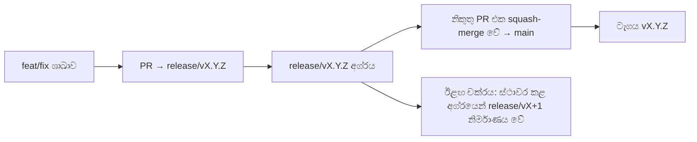

# Branching & Release Model (සිංහල)

🌐 **Languages:** 🇺🇸 [English](../../../../ops/BRANCHING_MODEL.md) · 🇪🇹 [am](../../../am/docs/ops/BRANCHING_MODEL.md) · 🇸🇦 [ar](../../../ar/docs/ops/BRANCHING_MODEL.md) · 🇦🇿 [az](../../../az/docs/ops/BRANCHING_MODEL.md) · 🇧🇬 [bg](../../../bg/docs/ops/BRANCHING_MODEL.md) · 🇧🇩 [bn](../../../bn/docs/ops/BRANCHING_MODEL.md) · 🇧🇦 [bs](../../../bs/docs/ops/BRANCHING_MODEL.md) · 🇨🇿 [cs](../../../cs/docs/ops/BRANCHING_MODEL.md) · 🇩🇰 [da](../../../da/docs/ops/BRANCHING_MODEL.md) · 🇩🇪 [de](../../../de/docs/ops/BRANCHING_MODEL.md) · 🇬🇷 [el](../../../el/docs/ops/BRANCHING_MODEL.md) · 🇪🇸 [es](../../../es/docs/ops/BRANCHING_MODEL.md) · 🇪🇪 [et](../../../et/docs/ops/BRANCHING_MODEL.md) · 🇮🇷 [fa](../../../fa/docs/ops/BRANCHING_MODEL.md) · 🇫🇮 [fi](../../../fi/docs/ops/BRANCHING_MODEL.md) · 🇫🇷 [fr](../../../fr/docs/ops/BRANCHING_MODEL.md) · 🇮🇪 [ga](../../../ga/docs/ops/BRANCHING_MODEL.md) · 🇮🇳 [gu](../../../gu/docs/ops/BRANCHING_MODEL.md) · 🇳🇬 [ha](../../../ha/docs/ops/BRANCHING_MODEL.md) · 🇮🇱 [he](../../../he/docs/ops/BRANCHING_MODEL.md) · 🇮🇳 [hi](../../../hi/docs/ops/BRANCHING_MODEL.md) · 🇭🇷 [hr](../../../hr/docs/ops/BRANCHING_MODEL.md) · 🇭🇺 [hu](../../../hu/docs/ops/BRANCHING_MODEL.md) · 🇦🇲 [hy](../../../hy/docs/ops/BRANCHING_MODEL.md) · 🇮🇩 [id](../../../id/docs/ops/BRANCHING_MODEL.md) · 🇳🇬 [ig](../../../ig/docs/ops/BRANCHING_MODEL.md) · 🇮🇹 [it](../../../it/docs/ops/BRANCHING_MODEL.md) · 🇯🇵 [ja](../../../ja/docs/ops/BRANCHING_MODEL.md) · 🇬🇪 [ka](../../../ka/docs/ops/BRANCHING_MODEL.md) · 🇰🇭 [km](../../../km/docs/ops/BRANCHING_MODEL.md) · 🇮🇳 [kn](../../../kn/docs/ops/BRANCHING_MODEL.md) · 🇰🇷 [ko](../../../ko/docs/ops/BRANCHING_MODEL.md) · 🇱🇹 [lt](../../../lt/docs/ops/BRANCHING_MODEL.md) · 🇱🇻 [lv](../../../lv/docs/ops/BRANCHING_MODEL.md) · 🇮🇳 [ml](../../../ml/docs/ops/BRANCHING_MODEL.md) · 🇮🇳 [mr](../../../mr/docs/ops/BRANCHING_MODEL.md) · 🇲🇾 [ms](../../../ms/docs/ops/BRANCHING_MODEL.md) · 🇲🇹 [mt](../../../mt/docs/ops/BRANCHING_MODEL.md) · 🇲🇲 [my](../../../my/docs/ops/BRANCHING_MODEL.md) · 🇳🇵 [ne](../../../ne/docs/ops/BRANCHING_MODEL.md) · 🇳🇱 [nl](../../../nl/docs/ops/BRANCHING_MODEL.md) · 🇳🇴 [no](../../../no/docs/ops/BRANCHING_MODEL.md) · 🇮🇳 [or](../../../or/docs/ops/BRANCHING_MODEL.md) · 🇮🇳 [pa](../../../pa/docs/ops/BRANCHING_MODEL.md) · 🇵🇭 [phi](../../../phi/docs/ops/BRANCHING_MODEL.md) · 🇵🇱 [pl](../../../pl/docs/ops/BRANCHING_MODEL.md) · 🇵🇹 [pt](../../../pt/docs/ops/BRANCHING_MODEL.md) · 🇧🇷 [pt-BR](../../../pt-BR/docs/ops/BRANCHING_MODEL.md) · 🇷🇴 [ro](../../../ro/docs/ops/BRANCHING_MODEL.md) · 🇷🇺 [ru](../../../ru/docs/ops/BRANCHING_MODEL.md) · 🇸🇰 [sk](../../../sk/docs/ops/BRANCHING_MODEL.md) · 🇸🇮 [sl](../../../sl/docs/ops/BRANCHING_MODEL.md) · 🇷🇸 [sr](../../../sr/docs/ops/BRANCHING_MODEL.md) · 🇸🇪 [sv](../../../sv/docs/ops/BRANCHING_MODEL.md) · 🇰🇪 [sw](../../../sw/docs/ops/BRANCHING_MODEL.md) · 🇮🇳 [ta](../../../ta/docs/ops/BRANCHING_MODEL.md) · 🇮🇳 [te](../../../te/docs/ops/BRANCHING_MODEL.md) · 🇹🇭 [th](../../../th/docs/ops/BRANCHING_MODEL.md) · 🇹🇷 [tr](../../../tr/docs/ops/BRANCHING_MODEL.md) · 🇺🇦 [uk-UA](../../../uk-UA/docs/ops/BRANCHING_MODEL.md) · 🇵🇰 [ur](../../../ur/docs/ops/BRANCHING_MODEL.md) · 🇺🇿 [uz](../../../uz/docs/ops/BRANCHING_MODEL.md) · 🇻🇳 [vi](../../../vi/docs/ops/BRANCHING_MODEL.md) · 🇳🇬 [yo](../../../yo/docs/ops/BRANCHING_MODEL.md) · 🇨🇳 [zh-CN](../../../zh-CN/docs/ops/BRANCHING_MODEL.md) · 🇹🇼 [zh-TW](../../../zh-TW/docs/ops/BRANCHING_MODEL.md)

---

OmniRoute **සමාන්තර-චක්ර** නිකුතු ආකෘතියක් භාවිත කරයි: සක්රිය චක්රය සඳහා වෙන් කළ `release/vX.Y.Z`
ශාඛාවක්, ප්රකාශිත පෙළ සඳහා `main`, සහ එම චක්රය නිකුත් කරන විට වෙනස් කළ නොහැකි
`vX.Y.Z` ටැගයක්. commit `release/*` මත _මෙන්ම_
`main` මත ද එක්වීම අපේක්ෂිත දෙයකි — එය පටලැවිල්ලක් නොවේ.

නඩත්තුකරුවන් සඳහා විස්තර `CLAUDE.md` (දැඩි නීතිය #21) සහ
[RELEASE_CHECKLIST.md](./RELEASE_CHECKLIST.md) තුළ ඇත. මෙම පිටුව දායකයන් සඳහා වන පොදු
සාරාංශයයි.

## බැලූ බැල්මට

| Ref              | භූමිකාව                                                                                         |
| ---------------- | ----------------------------------------------------------------------------------------------- |
| `release/vX.Y.Z` | **සක්රිය චක්රය** — එම අනුවාදය සඳහා දෛනික සංවර්ධනය සහ PR ඒකාබද්ධ කිරීම්                          |
| `main`           | **ප්රකාශිත පෙළ** — නිකුතුව සිදු කරන විට squash-merge හරහා චක්රය ලබා ගනී                         |
| `vX.Y.Z` (ටැගය)  | **නිකුතු සලකුණ** — නිකුත් කරන අවස්ථාවේ නිර්මාණය කරන, වෙනස් කළ නොහැකි “නිකුත් කළ දේ” දක්වන යොමුව |



## මගේ PR එක ඉලක්ක කළ යුත්තේ කොතැනටද?

**සක්රිය `release/vX.Y.Z` ශාඛාව ඉලක්ක කරන්න — `main` නොවේ.**

1. විවෘතව ඇති ඉහළම `release/v*` ශාඛාව සොයන්න (මෙය ලියන අවස්ථාවේ උදාහරණය:
   `release/v3.8.49`).
2. එම අග්රයෙන් ශාඛාවක් සාදන්න (`git fetch` + checkout / ඒ මතට rebase කරන්න).
3. **base = එම `release/vX.Y.Z`** ලෙස සකසා PR එක විවෘත කරන්න.

`main` යනු දෛනික ඒකාබද්ධ කිරීමේ ශාඛාව නොවේ. `main` වෙත ඉලක්ක කර විවෘත කරන PR
සාමාන්යයෙන් ඒකාබද්ධ කිරීමට පෙර නැවත ඉලක්ක කළ යුතුය.

## නිකුතු ස්ථාවර කිරීම (සමාන්තර චක්ර)

නිකුතුවක් සමථයකට පත් කරන විට, `release-freeze` ලේබලය සහිත සලකුණු issue එකක්
විවෘත කරනු ලැබේ. එය **සංවර්ධනය නවත්වන්නේ නැත**:

- ස්ථාවර කළ `release/vX.Y.Z` එක එම නිකුතුව සඳහා නිකුතු නායකයාට අයත් වේ.
- දායකයන්ට දිගටම තම කාර්යය එක් කිරීමට හැකි වන පරිදි, ඊළඟ චක්රයේ `release/vX+1` ස්ථාවර කළ අග්රයෙන්
  නිර්මාණය කරනු ලැබේ.
- තවමත් ස්ථාවර කළ ශාඛාව ඉලක්ක කරන විවෘත PR, සක්රිය (ඉහළම) `release/v*`
  ශාඛාව වෙත **නැවත ඉලක්ක කළ** යුතුය.

ඔබට අවශ්ය ශාඛාව ඒකාබද්ධ කළ හැකි යැයි උපකල්පනය කිරීමට පෙර විවෘත freeze එකක් තිබේදැයි පරීක්ෂා කරන්න:

```bash
gh issue list --repo diegosouzapw/OmniRoute --label release-freeze --state open
```

ඒකාබද්ධ කිරීමේ යාන්ත්රණය (හිමිකරුගේ `queue` ලේබලය → Mergify)
[MERGE_TRAIN.md](./MERGE_TRAIN.md) තුළ ලේඛනගත කර ඇත.

## ශාඛාවක් සහ ටැගයක් යන දෙකම ඇයි?

| කෘත්රිමය         | ආයු කාලය                      | අරමුණ                                                                     |
| ---------------- | ----------------------------- | ------------------------------------------------------------------------- |
| `release/vX.Y.Z` | ක්රියාත්මක වෙමින් පවතින චක්රය | සමාලෝචනය කළ PR රැස් කරයි, CI හරිතව තබා ගනී, සහ PR base එක ලෙස ක්රියා කරයි |
| ටැගය `vX.Y.Z`    | සදහටම                         | npm / GitHub Releases වෙත නිකුත් කළ නිශ්චිත දත්ත සලකුණු කරයි              |

ශාඛාව වැඩපොළයි; ටැගය මුද්රා තැබූ පැකේජයයි. `main` වෙත squash-merge කිරීමෙන් පසු,
පෙර නිකුතුවේ PR එක අවසන් වන තෙක් බලා නොසිට ඊළඟ චක්රය `release/vX+1` මත දිගටම සිදු වේ.

## අදාළ ලේඛන

- [CONTRIBUTING.md](../../CONTRIBUTING.md) — සැකසුම, පරීක්ෂණ, PR පිරික්සුම් ලැයිස්තුව
- [RELEASE_CHECKLIST.md](./RELEASE_CHECKLIST.md) — නිකුත් කිරීමට පෙර වලංගුකරණය
- [MERGE_TRAIN.md](./MERGE_TRAIN.md) — ඒකාබද්ධ කිරීමේ පෝලිම සහ විකල්ප train ක්රමය
- [RELEASE_GREEN.md](./RELEASE_GREEN.md) — නිකුතු අග්රය හරිතව තබා ගැනීම
