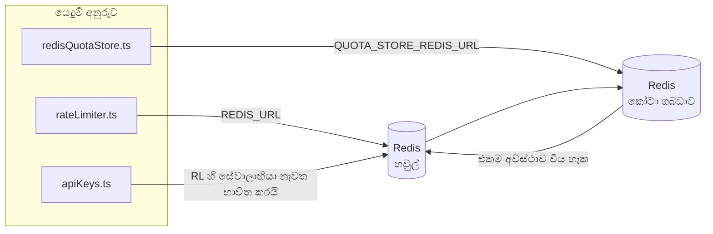

# Redis Production Configuration Guide (සිංහල)

🌐 **Languages:** 🇺🇸 [English](../../../../ops/REDIS_PRODUCTION_CONFIG.md) · 🇪🇹 [am](../../../am/docs/ops/REDIS_PRODUCTION_CONFIG.md) · 🇸🇦 [ar](../../../ar/docs/ops/REDIS_PRODUCTION_CONFIG.md) · 🇦🇿 [az](../../../az/docs/ops/REDIS_PRODUCTION_CONFIG.md) · 🇧🇬 [bg](../../../bg/docs/ops/REDIS_PRODUCTION_CONFIG.md) · 🇧🇩 [bn](../../../bn/docs/ops/REDIS_PRODUCTION_CONFIG.md) · 🇨🇿 [cs](../../../cs/docs/ops/REDIS_PRODUCTION_CONFIG.md) · 🇩🇰 [da](../../../da/docs/ops/REDIS_PRODUCTION_CONFIG.md) · 🇩🇪 [de](../../../de/docs/ops/REDIS_PRODUCTION_CONFIG.md) · 🇬🇷 [el](../../../el/docs/ops/REDIS_PRODUCTION_CONFIG.md) · 🇪🇸 [es](../../../es/docs/ops/REDIS_PRODUCTION_CONFIG.md) · 🇪🇪 [et](../../../et/docs/ops/REDIS_PRODUCTION_CONFIG.md) · 🇮🇷 [fa](../../../fa/docs/ops/REDIS_PRODUCTION_CONFIG.md) · 🇫🇮 [fi](../../../fi/docs/ops/REDIS_PRODUCTION_CONFIG.md) · 🇫🇷 [fr](../../../fr/docs/ops/REDIS_PRODUCTION_CONFIG.md) · 🇮🇪 [ga](../../../ga/docs/ops/REDIS_PRODUCTION_CONFIG.md) · 🇮🇳 [gu](../../../gu/docs/ops/REDIS_PRODUCTION_CONFIG.md) · 🇳🇬 [ha](../../../ha/docs/ops/REDIS_PRODUCTION_CONFIG.md) · 🇮🇱 [he](../../../he/docs/ops/REDIS_PRODUCTION_CONFIG.md) · 🇮🇳 [hi](../../../hi/docs/ops/REDIS_PRODUCTION_CONFIG.md) · 🇭🇷 [hr](../../../hr/docs/ops/REDIS_PRODUCTION_CONFIG.md) · 🇭🇺 [hu](../../../hu/docs/ops/REDIS_PRODUCTION_CONFIG.md) · 🇦🇲 [hy](../../../hy/docs/ops/REDIS_PRODUCTION_CONFIG.md) · 🇮🇩 [id](../../../id/docs/ops/REDIS_PRODUCTION_CONFIG.md) · 🇳🇬 [ig](../../../ig/docs/ops/REDIS_PRODUCTION_CONFIG.md) · 🇮🇹 [it](../../../it/docs/ops/REDIS_PRODUCTION_CONFIG.md) · 🇯🇵 [ja](../../../ja/docs/ops/REDIS_PRODUCTION_CONFIG.md) · 🇬🇪 [ka](../../../ka/docs/ops/REDIS_PRODUCTION_CONFIG.md) · 🇰🇭 [km](../../../km/docs/ops/REDIS_PRODUCTION_CONFIG.md) · 🇮🇳 [kn](../../../kn/docs/ops/REDIS_PRODUCTION_CONFIG.md) · 🇰🇷 [ko](../../../ko/docs/ops/REDIS_PRODUCTION_CONFIG.md) · 🇱🇹 [lt](../../../lt/docs/ops/REDIS_PRODUCTION_CONFIG.md) · 🇱🇻 [lv](../../../lv/docs/ops/REDIS_PRODUCTION_CONFIG.md) · 🇮🇳 [ml](../../../ml/docs/ops/REDIS_PRODUCTION_CONFIG.md) · 🇮🇳 [mr](../../../mr/docs/ops/REDIS_PRODUCTION_CONFIG.md) · 🇲🇾 [ms](../../../ms/docs/ops/REDIS_PRODUCTION_CONFIG.md) · 🇲🇹 [mt](../../../mt/docs/ops/REDIS_PRODUCTION_CONFIG.md) · 🇲🇲 [my](../../../my/docs/ops/REDIS_PRODUCTION_CONFIG.md) · 🇳🇵 [ne](../../../ne/docs/ops/REDIS_PRODUCTION_CONFIG.md) · 🇳🇱 [nl](../../../nl/docs/ops/REDIS_PRODUCTION_CONFIG.md) · 🇳🇴 [no](../../../no/docs/ops/REDIS_PRODUCTION_CONFIG.md) · 🇮🇳 [or](../../../or/docs/ops/REDIS_PRODUCTION_CONFIG.md) · 🇮🇳 [pa](../../../pa/docs/ops/REDIS_PRODUCTION_CONFIG.md) · 🇵🇭 [phi](../../../phi/docs/ops/REDIS_PRODUCTION_CONFIG.md) · 🇵🇱 [pl](../../../pl/docs/ops/REDIS_PRODUCTION_CONFIG.md) · 🇵🇹 [pt](../../../pt/docs/ops/REDIS_PRODUCTION_CONFIG.md) · 🇧🇷 [pt-BR](../../../pt-BR/docs/ops/REDIS_PRODUCTION_CONFIG.md) · 🇷🇴 [ro](../../../ro/docs/ops/REDIS_PRODUCTION_CONFIG.md) · 🇷🇺 [ru](../../../ru/docs/ops/REDIS_PRODUCTION_CONFIG.md) · 🇸🇰 [sk](../../../sk/docs/ops/REDIS_PRODUCTION_CONFIG.md) · 🇸🇮 [sl](../../../sl/docs/ops/REDIS_PRODUCTION_CONFIG.md) · 🇷🇸 [sr](../../../sr/docs/ops/REDIS_PRODUCTION_CONFIG.md) · 🇸🇪 [sv](../../../sv/docs/ops/REDIS_PRODUCTION_CONFIG.md) · 🇰🇪 [sw](../../../sw/docs/ops/REDIS_PRODUCTION_CONFIG.md) · 🇮🇳 [ta](../../../ta/docs/ops/REDIS_PRODUCTION_CONFIG.md) · 🇮🇳 [te](../../../te/docs/ops/REDIS_PRODUCTION_CONFIG.md) · 🇹🇭 [th](../../../th/docs/ops/REDIS_PRODUCTION_CONFIG.md) · 🇹🇷 [tr](../../../tr/docs/ops/REDIS_PRODUCTION_CONFIG.md) · 🇺🇦 [uk-UA](../../../uk-UA/docs/ops/REDIS_PRODUCTION_CONFIG.md) · 🇵🇰 [ur](../../../ur/docs/ops/REDIS_PRODUCTION_CONFIG.md) · 🇺🇿 [uz](../../../uz/docs/ops/REDIS_PRODUCTION_CONFIG.md) · 🇻🇳 [vi](../../../vi/docs/ops/REDIS_PRODUCTION_CONFIG.md) · 🇳🇬 [yo](../../../yo/docs/ops/REDIS_PRODUCTION_CONFIG.md) · 🇨🇳 [zh-CN](../../../zh-CN/docs/ops/REDIS_PRODUCTION_CONFIG.md) · 🇹🇼 [zh-TW](../../../zh-TW/docs/ops/REDIS_PRODUCTION_CONFIG.md)

---

## දළ විශ්ලේෂණය

Redis යනු OmniRoute හි **විකල්ප, මෘදු පරායත්තතාවකි** — Redis ලබාගත නොහැකි විට යෙදුම සුමටව ක්රියාකාරීත්වය අඩු කරමින් (මතකය තුළ ඇති
විකල්ප භාවිතයෙන්) ක්රියා කරයි. නිෂ්පාදන පරිසරයේදී, Redis සුසර කිරීමෙන් එකිනෙකට වෙනස්
කාර්ය භාර හතරක් සඳහා ප්රමාදය අඩු වේ:

| කාර්ය භාරය                      | ධාවකය                         | සේවාලාභී නිර්මාණකය                                                | යතුරු රටාව                                                 |
| ------------------------------- | ----------------------------- | ----------------------------------------------------------------- | ---------------------------------------------------------- |
| අනුපාත සීමා කිරීම               | `rateLimiter.ts`              | `getRedisClient()` — අවශ්ය විට නිර්මාණය වන `ioredis` singleton එක | `<prefix>rl:*` Lua‑පරමාණුක අනුපාත සීමා කාල කවුළු           |
| සත්යාපන හැඹිලිය                 | `apiKeys.ts`                  | `rateLimiter` හි සේවාලාභියා නැවත භාවිත කරයි                       | TTL සහිත `<prefix>auth:api_key:<sha256>`                   |
| කෝටා ගබඩාව                      | `redisQuotaStore.ts`          | වෙනම `getRedisClient(url)` singleton එක                           | එක් එක් instance එක අනුව වින්යාස කළ හැකි `<prefix>quota:*` |
| පෙර-උණුසුම් කිරීමේ පරිපථ බිඳිනය | `redisCircuitBreakerStore.ts` | `circuitBreakerFactory.ts` තුළ වෙනම සේවාලාභියෙක්                  | `<prefix>warmup:cb:<connectionId>`                         |

OmniRoute හට වෙනත් යෙදුම් සමඟ තනි Redis instance එකක (උදා. `127.0.0.1:6379`) සමගාමීව පැවතිය හැකි වන පරිදි කාර්ය භාර හතරම එකම namespace prefix එකක් බෙදා ගනී.
[යතුරු නාමාවකාශකරණය](#key-namespacing) බලන්න.

---

## වත්මන් වින්යාසය (කේතයේ පෙරනිමි)

| සැකසුම                                | අගය                                                | ස්ථානය                                                                                |
| ------------------------------------- | -------------------------------------------------- | ------------------------------------------------------------------------------------- |
| `REDIS_URL` පරිසර විචල්යය             | `redis://redis:6379` (compose), විකල්ප             | `rateLimiter.ts:5`, `.env.example`                                                    |
| `REDIS_KEY_PREFIX` පරිසර විචල්යය      | `omniroute:` (පෙරනිමි)                             | `rateLimiter.ts`, `redisQuotaStore.ts`, `redisCircuitBreakerStore.ts`, `.env.example` |
| `QUOTA_STORE_REDIS_URL` පරිසර විචල්යය | වෙනම එකක් වන අතර, `REDIS_URL` වෙතින් වෙනස් විය හැක | `quota/storeFactory.ts`                                                               |
| `QUOTA_STORE_DRIVER`                  | `"sqlite"` (පෙරනිමි), `"redis"` විකල්ප             | `quota/storeFactory.ts`                                                               |
| ioredis `maxRetriesPerRequest`        | `3`                                                | `rateLimiter.ts` සේවාලාභී නිර්මාණය                                                    |
| `enableReadyCheck`                    | සකසා නැත (ioredis පෙරනිමිය: `true`)                | —                                                                                     |
| `lazyConnect`                         | සකසා නැත (ioredis පෙරනිමිය: `false`)               | —                                                                                     |
| `retryStrategy`                       | සකසා නැත (ioredis පෙරනිමිය: 200ms මූලික, ඝාතීය)    | —                                                                                     |
| TLS / මුරපදය / DB දර්ශකය              | **වින්යාස කර නැත**                                 | —                                                                                     |
| Sentinel / Cluster                    | **වින්යාස කර නැත** — standalone තනි-node පමණි      | —                                                                                     |

---

## යතුරු නාමාවකාශකරණය

OmniRoute, ධාරකය මත ක්රියාත්මක වන අනෙකුත් ඕනෑම දෙයක් සමඟ Redis instance එකක් බෙදා ගනී. namespace එකක් නොමැතිව,
`auth:api_key:<sha256>` හෝ `rl:*` වැනි යතුරු, එම Redis භාවිත කරන වෙනත් යෙදුම්වල
යතුරු සමඟ ගැටිය හැක (මෙම instance එක වෙනත් සේවා සමඟ `127.0.0.1:6379` හි Redis ධාවනය කරයි).

**සෑම** OmniRoute යතුරකටම prefix එකක් එක් කිරීමට `REDIS_KEY_PREFIX` හිස් නොවන තන්තුවකට සකසන්න:

```bash
# .env — සියලුම OmniRoute යතුරු omniroute:rl:*, omniroute:auth:*, omniroute:quota:*, omniroute:warmup:cb:* බවට පත් වේ
REDIS_KEY_PREFIX=omniroute:
```

- **පෙරනිමිය:** `omniroute:` (`REDIS_KEY_PREFIX` සකසා නොමැති හෝ හිස් විට යොදනු ලැබේ).
- **යොදනු ලබන්නේ:** අනුපාත සීමාකාරකය + සත්යාපන හැඹිලිය (`keyPrefix` හරහා බෙදාගත් `ioredis` සේවාලාභියා) සහ
  කෝටා ගබඩාව (`KEY_PREFIX = "${REDIS_KEY_PREFIX}quota"`) සහ පෙර-උණුසුම් කිරීමේ පරිපථ බිඳිනය
  (`KEY_PREFIX = "${REDIS_KEY_PREFIX}warmup:cb:"`).
- Redis තුළ යතුරු දැනටමත් පවතින විට **prefix එක වෙනස් කිරීමෙන්** පැරණි යතුරු අනාථ වේ (ඒවා TTL / LRU හරහා
  කල් ඉකුත් වේ). වෙනස් කිරීම ආරක්ෂිතය; සංක්රමණයක් අවශ්ය නොවේ. එකම ව්යතිරේකය වන්නේ තහනම් ලෙස ලකුණු කළ සම්බන්ධතාවයක් සඳහා වන පෙර-උණුසුම් කිරීමේ
  පරිපථ-බිඳිනයේ යතුරකි: එය TTL එකක් නොමැතිව ස්ථිරව ගබඩා වන බැවින්,
  `redis-cli --scan --pattern '<old-prefix>warmup:cb:*'` මඟින් ඉතිරිව ඇති යතුරු ලැයිස්තුගත කර ඒවා මකා දමන්න.
- **ioredis `keyPrefix`** ලිවීම්වලදී prefix එක ස්වයංක්රීයව ඉදිරියට එක් කරන අතර කියවීම්වලදී එය ඉවත් කරයි,
  එබැවින් යෙදුම් කේතයට prefix එක කිසිවිටෙක නොපෙනේ.

---

## නිෂ්පාදන පරිසරය සඳහා නිර්දේශිත සුසර කිරීම්

### 1. සම්බන්ධතා සංචිතය / ක්ලයන්ට් විකල්ප (ioredis `Redis` constructor)

වත්මන් කේතය අභිරුචි විකල්ප කිසිවක් නොමැතිව තනි `new Redis(url)` එකක් නිර්මාණය කරයි. නිෂ්පාදන
බහු‑ප්රතිරූ යෙදවීම් සඳහා, කේතය තුළ ක්ලයන්ට් ෆැක්ටරියක් ලබා දෙන්න, නැතහොත් `getRedisClient()` ආවරණය කරන්න:

```typescript
const redis = new Redis(REDIS_URL, {
  maxRetriesPerRequest: null, // නැවත උත්සාහ කිරීමේ සීමාවක් නැත; retryStrategy වෙත තීරණය කිරීමට ඉඩ දෙන්න
  enableReadyCheck: true, // ඇමතුම් පිළිගැනීමට පෙර සේවාදායකය සූදානම් බව තහවුරු කරන්න
  lazyConnect: true, // නිර්මාණය කරන විට සම්බන්ධ නොවන්න; පළමු ඇමතුම තෙක් රැඳී සිටින්න
  retryStrategy: (times) => {
    if (times > 10) return null; // නැවත උත්සාහ කිරීම් 10කට පසු අත්හරින්න → පසුව නැවත සම්බන්ධ වන්න
    return Math.min(times * 200, 5000); // 200ms, 400ms, …, උපරිමය 5s
  },
  enableAutoPipelining: true, // සමගාමී විධාන එක් TCP ලිවීමකට ඒකාබද්ධ කරන්න
  keepAlive: 10000, // සෑම 10sකටම TCP keep‑alive
});
```

**ප්රධාන තුලන:**

- `maxRetriesPerRequest: null` + `retryStrategy` — තාවකාලික Redis නැවත ආරම්භවීම් නිසා සෑම ඉල්ලීමක්ම වහාම
  අසාර්ථක නොවන බැවින් නිෂ්පාදන පරිසරයට වඩාත් යෝග්ය වේ. `checkRateLimit()` තුළ ඇති මතකය-තුළ පසුබැසීම
  අසාර්ථකත්ව මාර්ගය හසුරුවයි.
- `lazyConnect: true` — සේවාදායකය සම්බන්ධතා පිළිගැනීම ආරම්භ කිරීමට පෙර Redis ක්රියාත්මකව තිබීම මත
  ආරම්භක රඳාපැවැත්මක් ඇතිවීම වළක්වයි.
- `enableAutoPipelining: true` — සමගාමී අනුපාත-සීමා පරීක්ෂණ සඳහා වට-ගමන් අඩු කරයි;
  තනි සම්බන්ධතාවක >50 RPS සඳහා ප්රයෝජනවත් වේ.

### 2. Redis සේවාදායක වින්යාසය (`redis.conf`)

```
# මතකය
maxmemory 80%                        # OS පිටු හැඹිලිය සඳහා ඉඩ තබන්න
maxmemory-policy allkeys-lru         # පීඩනය යටතේ පැරණි සත්යාපන හැඹිලි ඇතුළත් කිරීම් ඉවත් කරන්න

# ස්ථායී ගබඩාකරණය (විකල්පයි — එය නොමැතිවද OmniRoute බිඳවැටීම්වලින් ආරක්ෂිතයි)
save 300 1                           # ≥1 යතුරක් වෙනස් වී ඇත්නම් අවම වශයෙන් සෑම මිනිත්තු 5කට වරක් snapshot එකක් ගන්න
appendonly no                        # AOF අවශ්ය නොවේ; දත්ත නැවත ජනනය කළ හැක
appendfsync no                       # fsync අතිරේක පිරිවැයක් නැත (RDB ප්රමාණවත්ය)

# ජාලකරණය
timeout 0                            # අක්රිය සම්බන්ධතා විසන්ධි කිරීමක් නැත
tcp-keepalive 300                    # මිනිත්තු 5ක keep‑alive
tcp-backlog 511                      # හදිසි අධි භාරයක් සඳහා සම්බන්ධතා පසුපෙළ

# කාර්යසාධනය
hz 10                                # පෙරනිමිය; ප්රමාදයට සංවේදී අවස්ථා සඳහා 100
activedefrag yes                     # ඛණ්ඩනය >10% වූ විට ස්වයංක්රීයව ඛණ්ඩනය ඉවත් කරන්න
```

**`maxmemory-policy allkeys-lru` සඳහා තුලනය:** මතක පීඩනය යටතේ සත්යාපන හැඹිලි ඇතුළත් කිරීම්
ඉවත් විය හැක. මෙය ආරක්ෂිතයි — මඟහැරීමක් සිදු වූ විට `setCachedApiKey` සෑම විටම නැවත පුරවන අතර,
SQLite පසුබැසීම අධිකාරී මූලාශ්රය වේ. අනුපාත-සීමාකාරක Lua ස්ක්රිප්ටය සැලසුමෙන්ම කෙටි ආයු කාලයක්
ඇති කුඩා යතුරු නිර්මාණය කරයි.

### 3. Docker Compose සැකසුම්

නිෂ්පාදන compose ගොනුව (`docker-compose.prod.yml`) `redis:8.6.2-alpine` භාවිත කරයි. මෙය එක් කරන්න:

```yaml
redis:
  image: redis:8.6.2-alpine
  command:
    [
      "redis-server",
      "--maxmemory",
      "512mb",
      "--maxmemory-policy",
      "allkeys-lru",
      "--activedefrag",
      "yes",
      "--save",
      "300 1",
    ]
  healthcheck:
    test: ["CMD", "redis-cli", "ping"]
    interval: 10s
    timeout: 3s
    retries: 3
    start_period: 5s
```

### 4. බහු‑අවස්ථා / පරිමාණය කිරීමේ සලකා බැලීම්

**සියලු ප්රතිරූ සඳහා තනි Redis එකක්** — අනුපාත-සීමාකාරක Lua ස්ක්රිප්ටය තනි
අධිකාරී යතුරු අවකාශයක් මත රඳා පවතී. ප්රතිරූ පිටුපස Redis අවස්ථා කිහිපයක් භාවිත කළහොත් පරමාණුකතාව
නැති වී අයවැය දෙගුණ වේ. සියලු යෙදුම් ප්රතිරූ සඳහා තනි Redis එකක් (හෝ අසාර්ථකත්ව මාරුව සහිත Redis Sentinel පොකුරක්)
භාවිත කරන්න.

**සම්බන්ධතා ගණන:** සෑම යෙදුම් ප්රතිරූවක්ම Redis වෙත **TCP සම්බන්ධතා 2ක්** විවෘත කරයි
(අනුපාත-සීමාකාරක ක්ලයන්ට් + කෝටා ගබඩා ක්ලයන්ට්). ප්රතිරූ 10කදී → සම්බන්ධතා 20ක් වන අතර, එය
පෙරනිමි Redis අවස්ථාවක 10k සම්බන්ධතා උපරිමයට වඩා බොහෝ අඩුය.

### 5. අධීක්ෂණය

සෞඛ්ය-පරීක්ෂණ අන්ත ලක්ෂ්යය හරහා නිරාවරණය කරන්න:

```typescript
// src/app/api/monitoring/health/route.ts දැනටමත් rateLimiter ශ්රිත අමතයි
// Redis-විශේෂිත පරීක්ෂණ එක් කරන්න:
//   1. ioredis .ping() හරහා PING ප්රමාදය
//   2. INFO memory හරහා මතක භාවිතය
//   3. INFO clients හරහා සම්බන්ධතා ගණන
//   4. maxmemory-policy සඳහා පහර අනුපාතය (evicted_keys / keyspace_hits)
```

අධීක්ෂණය කළ යුතු ප්රධාන ප්රමිතික:

- **තත්පරයකට ඉවත් කළ යතුරු** — අඛණ්ඩව ශුන්ය නොවේ නම්, `maxmemory` වැඩි කරන්න
- **අවහිර කළ ක්ලයන්ට්** — ශුන්ය නොවන අගයක් මන්දගාමී Lua ස්ක්රිප්ට් හෝ ඉහළ තරගකාරීත්වයක් හඟවයි
- **ප්රතික්ෂේප කළ සම්බන්ධතා** — සම්බන්ධතා සීමාවට ළඟා වී ඇත; සම්බන්ධතා 20කදී මෙය දුර්ලභය

---

## නිර්මාණ සැලැස්මේ රූපසටහන



---

## යොමු

| ගොනුව                              | අරමුණ                                                                  |
| ---------------------------------- | ---------------------------------------------------------------------- |
| `src/shared/utils/rateLimiter.ts`  | ප්රධාන Redis සේවාලාභියා, Lua අනුපාත-සීමා ස්ක්රිප්ටය, මතකය-තුළ පසුබැසීම |
| `src/lib/db/apiKeys.ts`            | සත්යාපන හැඹිලිය — Redis→SQLite පසුබැසීම                                |
| `src/lib/quota/redisQuotaStore.ts` | විකල්ප කෝටා ගබඩාව සඳහා වෙනම Redis සේවාලාභියෙක්                         |
| `src/lib/quota/storeFactory.ts`    | `sqlite` සහ `redis` කෝටා ධාවක අතර මාරු කරයි                            |
| `docker-compose.prod.yml`          | නිෂ්පාදන Redis බහාලුම (`redis:8.6.2-alpine` රූපය)                      |
| `.env.example`                     | Redis පරිසර විචල්ය ප්රලේඛනය                                            |
| `src/app/api/local/redis/`         | සංවර්ධන බහාලුම් සංවිධානය සඳහා API මාර්ග                                |
| `bin/cli/commands/redis.mjs`       | සංවර්ධන බහාලුම් සංවිධානය සඳහා CLI විධාන                                |
