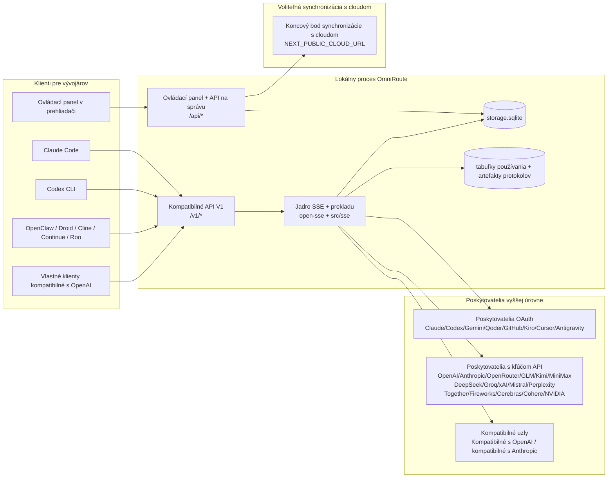
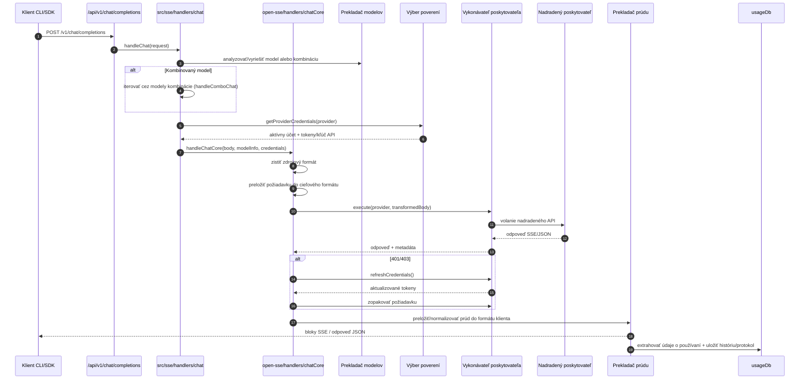
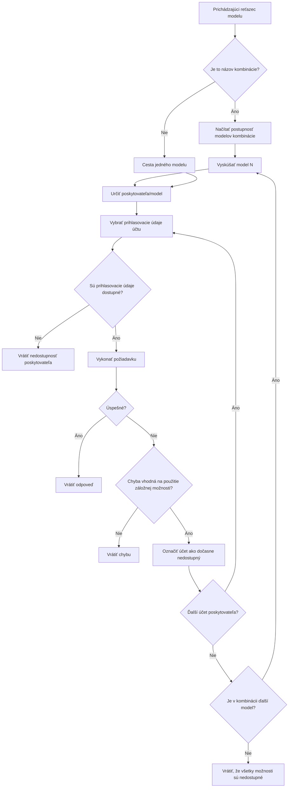
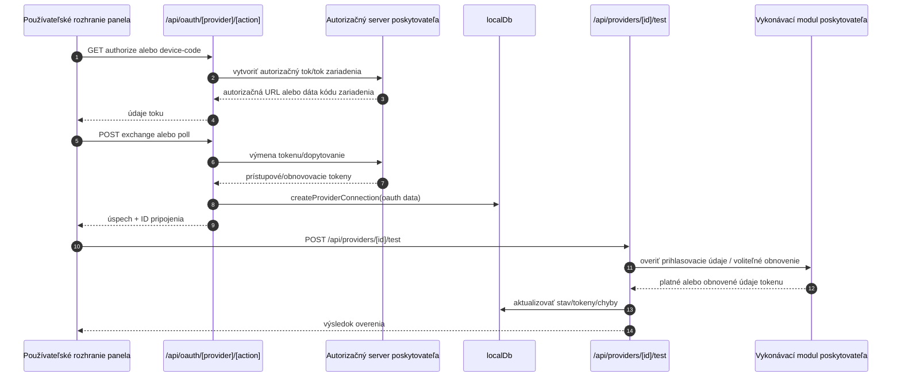
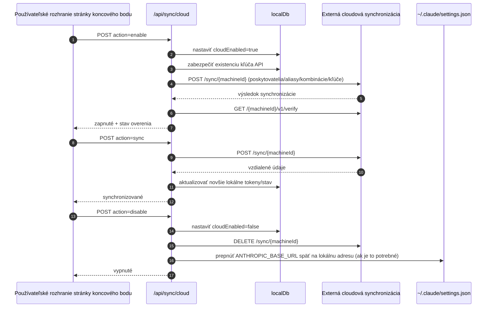
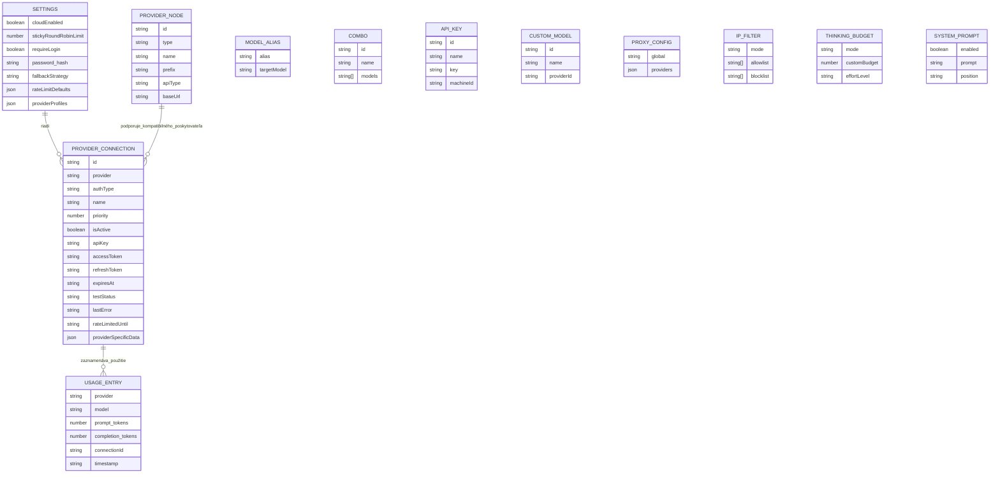
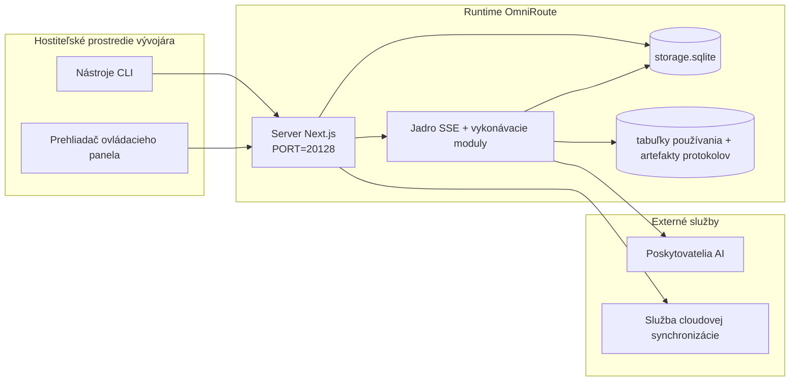

# OmniRoute Architecture (Slovenčina)

🌐 **Languages:** 🇺🇸 [English](../../../../architecture/ARCHITECTURE.md) · 🇪🇹 [am](../../../am/docs/architecture/ARCHITECTURE.md) · 🇸🇦 [ar](../../../ar/docs/architecture/ARCHITECTURE.md) · 🇦🇿 [az](../../../az/docs/architecture/ARCHITECTURE.md) · 🇧🇬 [bg](../../../bg/docs/architecture/ARCHITECTURE.md) · 🇧🇩 [bn](../../../bn/docs/architecture/ARCHITECTURE.md) · 🇧🇦 [bs](../../../bs/docs/architecture/ARCHITECTURE.md) · 🇨🇿 [cs](../../../cs/docs/architecture/ARCHITECTURE.md) · 🇩🇰 [da](../../../da/docs/architecture/ARCHITECTURE.md) · 🇩🇪 [de](../../../de/docs/architecture/ARCHITECTURE.md) · 🇬🇷 [el](../../../el/docs/architecture/ARCHITECTURE.md) · 🇪🇸 [es](../../../es/docs/architecture/ARCHITECTURE.md) · 🇪🇪 [et](../../../et/docs/architecture/ARCHITECTURE.md) · 🇮🇷 [fa](../../../fa/docs/architecture/ARCHITECTURE.md) · 🇫🇮 [fi](../../../fi/docs/architecture/ARCHITECTURE.md) · 🇫🇷 [fr](../../../fr/docs/architecture/ARCHITECTURE.md) · 🇮🇪 [ga](../../../ga/docs/architecture/ARCHITECTURE.md) · 🇮🇳 [gu](../../../gu/docs/architecture/ARCHITECTURE.md) · 🇳🇬 [ha](../../../ha/docs/architecture/ARCHITECTURE.md) · 🇮🇱 [he](../../../he/docs/architecture/ARCHITECTURE.md) · 🇮🇳 [hi](../../../hi/docs/architecture/ARCHITECTURE.md) · 🇭🇷 [hr](../../../hr/docs/architecture/ARCHITECTURE.md) · 🇭🇺 [hu](../../../hu/docs/architecture/ARCHITECTURE.md) · 🇦🇲 [hy](../../../hy/docs/architecture/ARCHITECTURE.md) · 🇮🇩 [id](../../../id/docs/architecture/ARCHITECTURE.md) · 🇳🇬 [ig](../../../ig/docs/architecture/ARCHITECTURE.md) · 🇮🇹 [it](../../../it/docs/architecture/ARCHITECTURE.md) · 🇯🇵 [ja](../../../ja/docs/architecture/ARCHITECTURE.md) · 🇬🇪 [ka](../../../ka/docs/architecture/ARCHITECTURE.md) · 🇰🇭 [km](../../../km/docs/architecture/ARCHITECTURE.md) · 🇮🇳 [kn](../../../kn/docs/architecture/ARCHITECTURE.md) · 🇰🇷 [ko](../../../ko/docs/architecture/ARCHITECTURE.md) · 🇱🇹 [lt](../../../lt/docs/architecture/ARCHITECTURE.md) · 🇱🇻 [lv](../../../lv/docs/architecture/ARCHITECTURE.md) · 🇮🇳 [ml](../../../ml/docs/architecture/ARCHITECTURE.md) · 🇮🇳 [mr](../../../mr/docs/architecture/ARCHITECTURE.md) · 🇲🇾 [ms](../../../ms/docs/architecture/ARCHITECTURE.md) · 🇲🇹 [mt](../../../mt/docs/architecture/ARCHITECTURE.md) · 🇲🇲 [my](../../../my/docs/architecture/ARCHITECTURE.md) · 🇳🇵 [ne](../../../ne/docs/architecture/ARCHITECTURE.md) · 🇳🇱 [nl](../../../nl/docs/architecture/ARCHITECTURE.md) · 🇳🇴 [no](../../../no/docs/architecture/ARCHITECTURE.md) · 🇮🇳 [or](../../../or/docs/architecture/ARCHITECTURE.md) · 🇮🇳 [pa](../../../pa/docs/architecture/ARCHITECTURE.md) · 🇵🇭 [phi](../../../phi/docs/architecture/ARCHITECTURE.md) · 🇵🇱 [pl](../../../pl/docs/architecture/ARCHITECTURE.md) · 🇵🇹 [pt](../../../pt/docs/architecture/ARCHITECTURE.md) · 🇧🇷 [pt-BR](../../../pt-BR/docs/architecture/ARCHITECTURE.md) · 🇷🇴 [ro](../../../ro/docs/architecture/ARCHITECTURE.md) · 🇷🇺 [ru](../../../ru/docs/architecture/ARCHITECTURE.md) · 🇱🇰 [si](../../../si/docs/architecture/ARCHITECTURE.md) · 🇸🇮 [sl](../../../sl/docs/architecture/ARCHITECTURE.md) · 🇷🇸 [sr](../../../sr/docs/architecture/ARCHITECTURE.md) · 🇸🇪 [sv](../../../sv/docs/architecture/ARCHITECTURE.md) · 🇰🇪 [sw](../../../sw/docs/architecture/ARCHITECTURE.md) · 🇮🇳 [ta](../../../ta/docs/architecture/ARCHITECTURE.md) · 🇮🇳 [te](../../../te/docs/architecture/ARCHITECTURE.md) · 🇹🇭 [th](../../../th/docs/architecture/ARCHITECTURE.md) · 🇹🇷 [tr](../../../tr/docs/architecture/ARCHITECTURE.md) · 🇺🇦 [uk-UA](../../../uk-UA/docs/architecture/ARCHITECTURE.md) · 🇵🇰 [ur](../../../ur/docs/architecture/ARCHITECTURE.md) · 🇺🇿 [uz](../../../uz/docs/architecture/ARCHITECTURE.md) · 🇻🇳 [vi](../../../vi/docs/architecture/ARCHITECTURE.md) · 🇳🇬 [yo](../../../yo/docs/architecture/ARCHITECTURE.md) · 🇨🇳 [zh-CN](../../../zh-CN/docs/architecture/ARCHITECTURE.md) · 🇹🇼 [zh-TW](../../../zh-TW/docs/architecture/ARCHITECTURE.md)

---

🌐 **Languages:** 🇺🇸 [English](../../../../architecture/ARCHITECTURE.md) · 🇪🇹 [am](../../../am/docs/architecture/ARCHITECTURE.md) · 🇸🇦 [ar](../../../ar/docs/architecture/ARCHITECTURE.md) · 🇦🇿 [az](../../../az/docs/architecture/ARCHITECTURE.md) · 🇧🇬 [bg](../../../bg/docs/architecture/ARCHITECTURE.md) · 🇧🇩 [bn](../../../bn/docs/architecture/ARCHITECTURE.md) · 🇧🇦 [bs](../../../bs/docs/architecture/ARCHITECTURE.md) · 🇨🇿 [cs](../../../cs/docs/architecture/ARCHITECTURE.md) · 🇩🇰 [da](../../../da/docs/architecture/ARCHITECTURE.md) · 🇩🇪 [de](../../../de/docs/architecture/ARCHITECTURE.md) · 🇬🇷 [el](../../../el/docs/architecture/ARCHITECTURE.md) · 🇪🇸 [es](../../../es/docs/architecture/ARCHITECTURE.md) · 🇪🇪 [et](../../../et/docs/architecture/ARCHITECTURE.md) · 🇮🇷 [fa](../../../fa/docs/architecture/ARCHITECTURE.md) · 🇫🇮 [fi](../../../fi/docs/architecture/ARCHITECTURE.md) · 🇫🇷 [fr](../../../fr/docs/architecture/ARCHITECTURE.md) · 🇮🇪 [ga](../../../ga/docs/architecture/ARCHITECTURE.md) · 🇮🇳 [gu](../../../gu/docs/architecture/ARCHITECTURE.md) · 🇳🇬 [ha](../../../ha/docs/architecture/ARCHITECTURE.md) · 🇮🇱 [he](../../../he/docs/architecture/ARCHITECTURE.md) · 🇮🇳 [hi](../../../hi/docs/architecture/ARCHITECTURE.md) · 🇭🇷 [hr](../../../hr/docs/architecture/ARCHITECTURE.md) · 🇭🇺 [hu](../../../hu/docs/architecture/ARCHITECTURE.md) · 🇦🇲 [hy](../../../hy/docs/architecture/ARCHITECTURE.md) · 🇮🇩 [id](../../../id/docs/architecture/ARCHITECTURE.md) · 🇳🇬 [ig](../../../ig/docs/architecture/ARCHITECTURE.md) · 🇮🇹 [it](../../../it/docs/architecture/ARCHITECTURE.md) · 🇯🇵 [ja](../../../ja/docs/architecture/ARCHITECTURE.md) · 🇬🇪 [ka](../../../ka/docs/architecture/ARCHITECTURE.md) · 🇰🇭 [km](../../../km/docs/architecture/ARCHITECTURE.md) · 🇮🇳 [kn](../../../kn/docs/architecture/ARCHITECTURE.md) · 🇰🇷 [ko](../../../ko/docs/architecture/ARCHITECTURE.md) · 🇱🇹 [lt](../../../lt/docs/architecture/ARCHITECTURE.md) · 🇱🇻 [lv](../../../lv/docs/architecture/ARCHITECTURE.md) · 🇮🇳 [ml](../../../ml/docs/architecture/ARCHITECTURE.md) · 🇮🇳 [mr](../../../mr/docs/architecture/ARCHITECTURE.md) · 🇲🇾 [ms](../../../ms/docs/architecture/ARCHITECTURE.md) · 🇲🇹 [mt](../../../mt/docs/architecture/ARCHITECTURE.md) · 🇲🇲 [my](../../../my/docs/architecture/ARCHITECTURE.md) · 🇳🇵 [ne](../../../ne/docs/architecture/ARCHITECTURE.md) · 🇳🇱 [nl](../../../nl/docs/architecture/ARCHITECTURE.md) · 🇳🇴 [no](../../../no/docs/architecture/ARCHITECTURE.md) · 🇮🇳 [or](../../../or/docs/architecture/ARCHITECTURE.md) · 🇮🇳 [pa](../../../pa/docs/architecture/ARCHITECTURE.md) · 🇵🇭 [phi](../../../phi/docs/architecture/ARCHITECTURE.md) · 🇵🇱 [pl](../../../pl/docs/architecture/ARCHITECTURE.md) · 🇵🇹 [pt](../../../pt/docs/architecture/ARCHITECTURE.md) · 🇧🇷 [pt-BR](../../../pt-BR/docs/architecture/ARCHITECTURE.md) · 🇷🇴 [ro](../../../ro/docs/architecture/ARCHITECTURE.md) · 🇷🇺 [ru](../../../ru/docs/architecture/ARCHITECTURE.md) · 🇱🇰 [si](../../../si/docs/architecture/ARCHITECTURE.md) · 🇸🇮 [sl](../../../sl/docs/architecture/ARCHITECTURE.md) · 🇷🇸 [sr](../../../sr/docs/architecture/ARCHITECTURE.md) · 🇸🇪 [sv](../../../sv/docs/architecture/ARCHITECTURE.md) · 🇰🇪 [sw](../../../sw/docs/architecture/ARCHITECTURE.md) · 🇮🇳 [ta](../../../ta/docs/architecture/ARCHITECTURE.md) · 🇮🇳 [te](../../../te/docs/architecture/ARCHITECTURE.md) · 🇹🇭 [th](../../../th/docs/architecture/ARCHITECTURE.md) · 🇹🇷 [tr](../../../tr/docs/architecture/ARCHITECTURE.md) · 🇺🇦 [uk-UA](../../../uk-UA/docs/architecture/ARCHITECTURE.md) · 🇵🇰 [ur](../../../ur/docs/architecture/ARCHITECTURE.md) · 🇺🇿 [uz](../../../uz/docs/architecture/ARCHITECTURE.md) · 🇻🇳 [vi](../../../vi/docs/architecture/ARCHITECTURE.md) · 🇳🇬 [yo](../../../yo/docs/architecture/ARCHITECTURE.md) · 🇨🇳 [zh-CN](../../../zh-CN/docs/architecture/ARCHITECTURE.md) · 🇹🇼 [zh-TW](../../../zh-TW/docs/architecture/ARCHITECTURE.md)

_Naposledy aktualizované: 2026-06-28_

## Súhrn

OmniRoute je lokálna smerovacia brána AI a ovládací panel vytvorený pomocou Next.js.
Poskytuje jeden koncový bod kompatibilný s OpenAI (`/v1/*`) a smeruje prevádzku medzi viacerými nadradenými poskytovateľmi s prekladom, záložným spracovaním, obnovovaním tokenov a sledovaním používania.

Kľúčové možnosti:

- Rozhranie API kompatibilné s OpenAI pre CLI/nástroje (355 poskytovateľov, 108 vykonávacích modulov)
- Preklad požiadaviek a odpovedí medzi formátmi poskytovateľov
- Záložné spracovanie pomocou kombinácie modelov (sekvencia viacerých modelov)
- Štruktúrované kroky kombinácie (`provider + model + connection`) s poradím za behu podľa `compositeTiers`
- Záložné spracovanie na úrovni účtov (viacero účtov pre každého poskytovateľa)
- Predbežná kontrola kvóty a výber účtu P2C s ohľadom na kvótu v hlavnej ceste konverzácie
- Správa pripojení poskytovateľov prostredníctvom OAuth a kľúčov API (22 modulov poskytovateľov OAuth)
- Generovanie vnorení prostredníctvom `/v1/embeddings` (18 poskytovateľov)
- Generovanie obrázkov prostredníctvom `/v1/images/generations` (viac ako 10 poskytovateľov, viac ako 20 modelov)
- Prepis zvuku prostredníctvom `/v1/audio/transcriptions` (18 poskytovateľov)
- Prevod textu na reč prostredníctvom `/v1/audio/speech` (24 vstavaných poskytovateľov)
- Generovanie videa prostredníctvom `/v1/videos/generations` (ComfyUI + SD WebUI)
- Generovanie hudby prostredníctvom `/v1/music/generations` (ComfyUI)
- Vyhľadávanie na webe prostredníctvom `/v1/search` (20 poskytovateľov)
- Moderovanie prostredníctvom `/v1/moderations`
- Zmena poradia výsledkov prostredníctvom `/v1/rerank`
- Spracovanie značiek premýšľania (`<think>...</think>`) pre modely uvažovania
- Čistenie odpovedí na zabezpečenie striktnej kompatibility so súpravou OpenAI SDK
- Normalizácia rolí (developer→system, system→user) na zabezpečenie kompatibility medzi poskytovateľmi
- Konverzia štruktúrovaného výstupu (json_schema → Gemini responseSchema)
- Lokálne uchovávanie poskytovateľov, kľúčov, aliasov, kombinácií, nastavení a cien (122 modulov databázy)
- Sledovanie používania a nákladov a zaznamenávanie požiadaviek
- Voliteľná cloudová synchronizácia na synchronizáciu medzi viacerými zariadeniami a synchronizáciu stavu
- Zoznam povolených/blokovaných IP adries na riadenie prístupu k API
- Správa rozpočtu na premýšľanie (priame odovzdanie/automatický/vlastný/adaptívny)
- Globálne vkladanie systémovej výzvy
- Sledovanie relácií a vytváranie odtlačkov
- Rozšírené obmedzovanie frekvencie požiadaviek pre jednotlivé účty s profilmi špecifickými pre poskytovateľov
- Vzor ističa na zvýšenie odolnosti voči zlyhaniam poskytovateľov
- Ochrana pred lavínou súbežných požiadaviek pomocou uzamykania mutexom
- Vyrovnávacia pamäť na deduplikáciu požiadaviek založená na podpisoch
- Doménová vrstva: pravidlá nákladov, politika záložného spracovania, politika uzamknutia
- Context Relay: súhrny odovzdania relácie na zachovanie kontinuity pri rotácii účtov
- Perzistencia stavu domény (vyrovnávacia pamäť SQLite s priebežným zápisom pre záložné spracovanie, rozpočty, uzamknutia a ističe)
- Modul politík na centralizované vyhodnocovanie požiadaviek (uzamknutie → rozpočet → záložné spracovanie)
- Telemetria požiadaviek s agregáciou latencie p50/p95/p99
- Telemetria cieľov kombinácií a historický stav cieľov kombinácií prostredníctvom `combo_execution_key` / `combo_step_id`
- ID korelácie (X-Request-Id) na komplexné trasovanie
- Protokolovanie auditu súladu s možnosťou odhlásenia pre jednotlivé kľúče API
- Rámec vyhodnocovania na zabezpečenie kvality LLM
- Panel stavu s informáciami o stave ističov poskytovateľov v reálnom čase
- Server MCP (110 nástrojov) s 3 prenosmi (stdio/SSE/Streamable HTTP)
- Server A2A (JSON-RPC 2.0 + SSE) so zručnosťami a životným cyklom úloh
- Pamäťový systém (extrakcia, vkladanie, získavanie, sumarizácia)
- Systém zručností (register, vykonávací modul, izolované prostredie, vstavané zručnosti)
- Proxy MITM so správou certifikátov a obsluhou DNS
- Middleware na ochranu pred vložením škodlivých inštrukcií do výziev
- Kanál kompresie výziev s Caveman, RTK, vrstvenými kanálmi, kombináciami kompresie, jazykovými balíkmi a analytikou
- Register ACP (Agent Communication Protocol)
- Modulárni poskytovatelia OAuth (22 samostatných modulov v `src/lib/oauth/providers/`)
- Skripty na odinštalovanie/úplné odinštalovanie
- Akcia na opravu prostredia OAuth
- Most WebSocket pre klientov WS kompatibilných s OpenAI (`/v1/ws`)
- Správa synchronizačných tokenov (vydanie/zrušenie, stiahnutie konfiguračného balíka s verziami ETag)
- GLM Thinking (`glmt`) ako plnohodnotná predvoľba poskytovateľa
- Hybridné počítanie tokenov (prostredníctvom `/messages/count_tokens` na strane poskytovateľa so záložným odhadom)
- Automatické počiatočné naplnenie aliasov modelov (viac ako 30 normalizácií dialektov medzi proxy servermi pri spustení)
- Bezpečné odchádzajúce načítanie s ochranou proti SSRF, blokovaním súkromných adries URL a konfigurovateľným opakovaním
- Opakované pokusy konverzácie zohľadňujúce čas čakania s konfigurovateľnými nastaveniami `requestRetry` a `maxRetryIntervalSec`
- Overovanie prostredia za behu pomocou Zod pri spustení
- Audit súladu v2 so stránkovaním, udalosťami CRUD poskytovateľov a protokolovaním overenia blokovaného mechanizmom SSRF

Primárny model behu:

- Trasy aplikácie Next.js v `src/app/api/*` implementujú rozhrania API ovládacieho panela aj rozhrania API kompatibility
- Zdieľané jadro SSE/smerovania v `src/sse/*` + `open-sse/*` zabezpečuje vykonávanie poskytovateľov, preklad, streamovanie, záložné spracovanie a používanie

## Referenčné diagramy

Kanonické, verzované zdroje Mermaid pre platformu v3.8.0 sa nachádzajú v
[`docs/diagrams/`](../diagrams/README.md). Dva z nich sú pre orientáciu uvedené nižšie;
ostatné sú prepojené z príručiek pre príslušné domény.


> Zdroj: [diagrams/request-pipeline.mmd](../diagrams/request-pipeline.mmd)


> Zdroj: [diagrams/resilience-3layers.mmd](../diagrams/resilience-3layers.mmd) — prepojené aj z
> [RESILIENCE_GUIDE.md](./RESILIENCE_GUIDE.md) a referencie odolnosti v `CLAUDE.md`.

## Rozsah a hranice

### Zahrnuté v rozsahu

- Lokálne spustenie brány
- API na správu ovládacieho panela
- Autentifikácia poskytovateľov a obnovenie tokenov
- Preklad požiadaviek a streamovanie SSE
- Lokálny stav + perzistencia údajov o používaní
- Voliteľná orchestrácia cloudovej synchronizácie

### Mimo rozsahu

- Implementácia cloudovej služby za `NEXT_PUBLIC_CLOUD_URL`
- SLA/riadiaca rovina poskytovateľa mimo lokálneho procesu
- Samotné externé binárne súbory CLI (Claude CLI, Codex CLI atď.)

## Rozhranie ovládacieho panela (aktuálne)

Hlavné stránky v `src/app/(dashboard)/dashboard/`:

- `/dashboard` — rýchly štart + prehľad poskytovateľov
- `/dashboard/endpoint` — proxy koncových bodov + MCP + A2A + karty koncových bodov API
- `/dashboard/providers` — pripojenia k poskytovateľom a prihlasovacie údaje
- `/dashboard/combos` — kombinované stratégie, šablóny, nástroj na zostavovanie založený na krokoch, pravidlá smerovania modelov, manuálne perzistentné poradie
- `/dashboard/auto-combo` — Auto Combo Engine: váhy hodnotenia, balíky režimov, predvoľby virtuálnej továrne, telemetria
- `/dashboard/costs` — agregácia nákladov a prehľad cien
- `/dashboard/analytics` — analytika používania, vyhodnotenia, stav cieľov kombinácií
- `/dashboard/limits` — ovládanie kvót/limitov frekvencie
- `/dashboard/cli-tools` — úvodné nastavenie CLI, detekcia prostredia spustenia, generovanie konfigurácie
- `/dashboard/agents` — detegovaní agenti ACP + registrácia vlastných agentov
- `/dashboard/cloud-agents` — úlohy agentov hosťovaných v cloude (Codex Cloud, Devin, Jules) a životný cyklus úloh
- `/dashboard/skills` — register zručností A2A, vykonávanie v sandboxe, katalóg vstavaných zručností
- `/dashboard/memory` — kontrola a načítavanie perzistentnej konverzačnej pamäte
- `/dashboard/webhooks` — odbery odchádzajúcich webhookov, rotácia tajných kľúčov, štatistiky opakovaných pokusov
- `/dashboard/batch` — odosielanie dávkových úloh a ich priebeh
- `/dashboard/cache` — štatistiky priebežnej vyrovnávacej pamäte a vyrovnávacej pamäte uvažovania, ovládanie vysúvania
- `/dashboard/playground` — interaktívne chatové testovacie prostredie pre ľubovoľnú nakonfigurovanú kombináciu/model
- `/dashboard/changelog` — prehliadač zoznamu zmien v aplikácii (vykresľuje `CHANGELOG.md`)
- `/dashboard/system` — diagnostika prostredia spustenia, informácie o verzii, rozhranie na overenie prostredia
- `/dashboard/onboarding` — sprievodca prvotným nastavením pre nové inštalácie
- `/dashboard/media` — testovacie prostredie pre obrázky/video/hudbu
- `/dashboard/search-tools` — testovanie poskytovateľov vyhľadávania a história
- `/dashboard/health` — dostupnosť, ističe, limity frekvencie, relácie s monitorovaním kvót
- `/dashboard/logs` — protokoly požiadaviek/proxy/auditu/konzoly
- `/dashboard/settings` — karty systémových nastavení (všeobecné, smerovanie, predvolené hodnoty kombinácií atď.)
- `/dashboard/context/caveman` — pravidlá kompresie Caveman, jazykové balíky, náhľad a výstupný režim
- `/dashboard/context/rtk` — filtre výstupu príkazov RTK, náhľad a bezpečnostné nastavenia prostredia spustenia
- `/dashboard/context/combos` — pomenované kompresné pipeline priradené ku kombináciám smerovania
- `/dashboard/translator` — kontrola prekladača a náhľad konverzie formátu požiadavky
- `/dashboard/audit` — prehliadač protokolov auditu súladu so stránkovaním a štruktúrovanými metadátami
- `/dashboard/usage` — prehliadač používania podľa jednotlivých požiadaviek prepojený s `usage_history`
- `/dashboard/compression` — analytika kompresie, štatistiky a priradenie pipeline
- `/dashboard/api-manager` — životný cyklus kľúčov API a oprávnenia modelov

## Kontext systému na vysokej úrovni



## Základné komponenty behu systému

## 1) Vrstva API a smerovania (aplikačné trasy Next.js)

Hlavné adresáre:

- `src/app/api/v1/*` a `src/app/api/v1beta/*` pre kompatibilné API
- `src/app/api/*` pre API na správu a konfiguráciu
- Prepisy Next v `next.config.mjs` mapujú `/v1/*` na `/api/v1/*`

Dôležité trasy kompatibility:

- `src/app/api/v1/chat/completions/route.ts`
- `src/app/api/v1/messages/route.ts`
- `src/app/api/v1/responses/route.ts`
- `src/app/api/v1/models/route.ts` — zahŕňa vlastné modely s `custom: true`
- `src/app/api/v1/embeddings/route.ts` — generovanie embeddingov (6 poskytovateľov)
- `src/app/api/v1/images/generations/route.ts` — generovanie obrázkov (viac než 4 poskytovatelia vrátane Antigravity/Nebius)
- `src/app/api/v1/messages/count_tokens/route.ts`
- `src/app/api/v1/providers/[provider]/chat/completions/route.ts` — vyhradený chat pre jednotlivých poskytovateľov
- `src/app/api/v1/providers/[provider]/embeddings/route.ts` — vyhradené embeddingy pre jednotlivých poskytovateľov
- `src/app/api/v1/providers/[provider]/images/generations/route.ts` — vyhradené obrázky pre jednotlivých poskytovateľov
- `src/app/api/v1beta/models/route.ts`
- `src/app/api/v1beta/models/[...path]/route.ts`

Oblasti správy:

- Overovanie/nastavenia: `src/app/api/auth/*`, `src/app/api/settings/*`
- Poskytovatelia/pripojenia: `src/app/api/providers*`
- Uzly poskytovateľov: `src/app/api/provider-nodes*`
- Vlastné modely: `src/app/api/provider-models` (GET/POST/DELETE)
- Katalóg modelov: `src/app/api/models/route.ts` (GET)
- Konfigurácia proxy: `src/app/api/settings/proxy` (GET/PUT/DELETE) + `src/app/api/settings/proxy/test` (POST)
- OAuth: `src/app/api/oauth/*`
- Kľúče/aliasy/kombinácie/ceny: `src/app/api/keys*`, `src/app/api/models/alias`, `src/app/api/combos*`, `src/app/api/pricing`
- Používanie: `src/app/api/usage/*`
- Synchronizácia/cloud: `src/app/api/sync/*`, `src/app/api/cloud/*`
- Pomocné nástroje CLI: `src/app/api/cli-tools/*`
- Filter IP: `src/app/api/settings/ip-filter` (GET/PUT)
- Rozpočet na uvažovanie: `src/app/api/settings/thinking-budget` (GET/PUT)
- Systémová výzva: `src/app/api/settings/system-prompt` (GET/PUT)
- Kompresia: `src/app/api/settings/compression`, `src/app/api/compression/*` a
  `src/app/api/context/*`
- Relácie: `src/app/api/sessions` (GET)
- Limity frekvencie: `src/app/api/rate-limits` (GET)
- Odolnosť: `src/app/api/resilience` (GET/PATCH) — front požiadaviek, obdobie čakania pripojenia, istič poskytovateľa, konfigurácia čakania na skončenie obdobia
- Resetovanie odolnosti: `src/app/api/resilience/reset` (POST) — resetovanie ističov poskytovateľov
- Štatistiky vyrovnávacej pamäte: `src/app/api/cache/stats` (GET/DELETE)
- Telemetria: `src/app/api/telemetry/summary` (GET)
- Rozpočet: `src/app/api/usage/budget` (GET/POST)
- Reťazce záložných možností: `src/app/api/fallback/chains` (GET/POST/DELETE)
- Audit súladu: `src/app/api/compliance/audit-log` (GET, so stránkovaním + štruktúrovanými metadátami)
- Vyhodnotenia: `src/app/api/evals` (GET/POST), `src/app/api/evals/[suiteId]` (GET)
- Zásady: `src/app/api/policies` (GET/POST)
- Synchronizačné tokeny: `src/app/api/sync/tokens` (GET/POST), `src/app/api/sync/tokens/[id]` (GET/DELETE)
- Konfiguračný balík: `src/app/api/sync/bundle` (GET, snímka nastavení/poskytovateľov/kombinácií/kľúčov s verziami ETag)
- WebSocket: `src/app/api/v1/ws/route.ts` — obslužná rutina Upgrade pre klientov WS kompatibilných s OpenAI

## 2) SSE + jadro prekladu

Hlavné moduly toku:

- Vstupný bod: `src/sse/handlers/chat.ts`
- Základná orchestrácia: `open-sse/handlers/chatCore.ts`
- Adaptéry vykonávania poskytovateľov: `open-sse/executors/*`
- Detekcia formátu/konfigurácia poskytovateľa: `open-sse/services/provider.ts`
- Analýza/vyhodnotenie modelu: `src/sse/services/model.ts`, `open-sse/services/model.ts`
- Logika záložného účtu: `open-sse/services/accountFallback.ts`
- Register prekladov: `open-sse/translator/index.ts`
- Transformácie streamov: `open-sse/utils/stream.ts`, `open-sse/utils/streamHandler.ts`
- Extrakcia/normalizácia využitia: `open-sse/utils/usageTracking.ts`
- Parser značiek na premýšľanie: `open-sse/utils/thinkTagParser.ts`
- Obsluha vnorení: `open-sse/handlers/embeddings.ts`
- Register poskytovateľov vnorení: `open-sse/config/embeddingRegistry.ts`
- Obsluha generovania obrázkov: `open-sse/handlers/imageGeneration.ts`
- Register poskytovateľov obrázkov: `open-sse/config/imageRegistry.ts`
- Sanitizácia odpovedí: `open-sse/handlers/responseSanitizer.ts`
- Normalizácia rolí: `open-sse/services/roleNormalizer.ts`

Služby (biznis logika):

- Výber/hodnotenie účtov: `open-sse/services/accountSelector.ts`
- Správa životného cyklu kontextu: `open-sse/services/contextManager.ts`
- Vynucovanie filtra IP adries: `open-sse/services/ipFilter.ts`
- Sledovanie relácií: `open-sse/services/sessionManager.ts`
- Deduplikácia požiadaviek: `open-sse/services/signatureCache.ts`
- Vkladanie systémovej výzvy: `open-sse/services/systemPrompt.ts`
- Správa rozpočtu na premýšľanie: `open-sse/services/thinkingBudget.ts`
- Smerovanie modelov pomocou zástupných znakov: `open-sse/services/wildcardRouter.ts`
- Správa limitov požiadaviek: `open-sse/services/rateLimitManager.ts`
- Istič: `src/shared/utils/circuitBreaker.ts`
- Odovzdanie kontextu: `open-sse/services/contextHandoff.ts` — generovanie a vkladanie súhrnu odovzdania pre stratégiu prenosu kontextu
- Kompresia: `open-sse/services/compression/*` — proaktívna kompresia pred prekladom pre poskytovateľa;
  zahŕňa pravidlá Caveman, filtre RTK, zreťazené kanály spracovania, kombinácie kompresie, štatistiky a validáciu
- Načítavanie kvóty Codex: `open-sse/services/codexQuotaFetcher.ts` — načítava kvótu Codex pre rozhodovanie o odovzdaní pri prenose kontextu
- Opakovanie zohľadňujúce dobu pozastavenia: `src/sse/services/cooldownAwareRetry.ts` — opakovania podľa jednotlivých modelov s konfigurovateľnými hodnotami `requestRetry` / `maxRetryIntervalSec`
- Bezpečné odchádzajúce načítavanie: `src/shared/network/safeOutboundFetch.ts` — chránené načítavanie poskytovateľa/modelu s ochranou proti SSRF, blokovaním súkromných URL adries, opakovaním a časovým limitom
- Ochrana odchádzajúcich URL adries: `src/shared/network/outboundUrlGuard.ts` — overuje URL adresy poskytovateľov voči rozsahom CIDR pre súkromné siete/localhost
- Predvolené hodnoty požiadaviek poskytovateľa: `open-sse/services/providerRequestDefaults.ts` — predvolené hodnoty `maxTokens`, `temperature`, `thinkingBudgetTokens` na úrovni poskytovateľa
- Konštanty poskytovateľa GLM: `open-sse/config/glmProvider.ts` — zdieľané modely GLM, URL adresy kvót a časové limity/predvolené hodnoty GLMT
- Nadradená služba Antigravity: `open-sse/config/antigravityUpstream.ts` — základná URL adresa a konštanty cesty zisťovania
- Konštanty klienta Codex: `open-sse/config/codexClient.ts` — verzované hodnoty používateľského agenta a verzie klienta
- Počiatočné aliasy modelov: `src/lib/modelAliasSeed.ts` — pri spustení vytvorí viac než 30 aliasov dialektov naprieč proxy servermi

Moduly doménovej vrstvy:

- Pravidlá nákladov/rozpočty: `src/domain/costRules.ts`
- Zásady záložného spracovania: `src/domain/fallbackPolicy.ts`
- Vyhodnocovanie kombinácií: `src/domain/comboResolver.ts`
- Zásady zablokovania: `src/domain/lockoutPolicy.ts`
- Nástroj na vyhodnocovanie zásad: `src/domain/policyEngine.ts` — centralizované vyhodnocovanie zablokovania → rozpočtu → záložného spracovania
- Katalóg chybových kódov: `src/shared/constants/errorCodes.ts`
- ID požiadavky: `src/shared/utils/requestId.ts`
- Časový limit načítavania: `src/shared/utils/fetchTimeout.ts`
- Telemetria požiadaviek: `src/shared/utils/requestTelemetry.ts`
- Súlad/audit: `src/lib/compliance/index.ts`
- Spúšťač vyhodnotení: `src/lib/evals/evalRunner.ts`
- Perzistencia stavu domény: `src/lib/db/domainState.ts` — operácie CRUD v SQLite pre reťazce záložného spracovania, rozpočty, históriu nákladov, stav zablokovania a ističe

Moduly poskytovateľov OAuth (22 samostatných súborov v priečinku `src/lib/oauth/providers/`):

- Index registra: `src/lib/oauth/providers/index.ts`
- Jednotliví poskytovatelia: `agy.ts`, `antigravity.ts`, `claude.ts`, `cline.ts`, `codebuddy-cn.ts`, `codex.ts`, `cursor.ts`, `devin-desktop.ts`, `ghe-copilot.ts`, `github.ts`, `gitlab-duo.ts`, `grok-cli-oauth.ts`, `grok-cli.ts`, `kilocode.ts`, `kimi-coding.ts`, `kiro.ts`, `openference.ts`, `qoder.ts`, `trae.ts`, `xai-oauth.ts`, `zed-hosted.ts`, `zed.ts`
- Tenký obal: `src/lib/oauth/providers.ts` — opätovne exportuje z jednotlivých modulov

## 5) Vstavané služby (v3.8.4)

OmniRoute dokáže inštalovať, riadiť a smerovať požiadavky na lokálne spustené procesy nástrojov AI,
ktoré sa nazývajú **vstavané služby**. Dodáva sa ich päť: 9Router, CLIProxyAPI, Bifrost, Mux a Dario.

Vrstvy architektúry:

- **UI** (`/dashboard/providers/services`) — stránka s dvoma kartami a ovládacími prvkami životného cyklu,
  živým streamovaním protokolov, správou kľúčov API a (pre 9Router) vstavaným natívnym používateľským rozhraním
  prostredníctvom interného reverzného proxy servera.
- **API** (`/api/services/{name}/*`) — 11 koncových bodov pre 9Router, 10 pre CLIProxyAPI a po 8 pre Bifrost / Mux / Dario,
  pričom všetky sú klasifikované ako **LOCAL_ONLY** (pevné pravidlo č. 17). Zdieľaný koncový bod SSE `GET /api/services/[name]/logs`
  slúži obom službám.
- **Supervízor** (`src/lib/services/`) — všeobecná trieda `ServiceSupervisor` obaľuje
  `child_process.spawn`, udržiava 5 MB kruhovú vyrovnávaciu pamäť na streamovanie protokolov cez SSE, slučku
  kontroly stavu, zámok atómovej operácie a korektné ukončenie SIGTERM→SIGKILL.
  `bootstrap.ts` prepája všetky nakonfigurované služby pri spustení procesu.
- **Poskytovateľ/exekútor** (`open-sse/executors/ninerouter.ts`) — 9Router je sprístupnený ako
  skutočný poskytovateľ. Modely majú predponu `9router/{sub}/{model}` a každých 5 minút sa synchronizujú
  z koncového bodu `/v1/models` služby 9Router.

Podrobný rozbor: `docs/frameworks/EMBEDDED-SERVICES.md`

## Hlavné subsystémy (v3.8.0)

### A. Mechanizmus Auto Combo

Auto Combo dynamicky boduje a vyberá ciele smerovania v čase požiadavky namiesto
spoliehania sa na statickú definíciu kombinácie. Tvorí základ rodiny predpôn modelov `auto/*`.

- Vstupný bod mechanizmu: `open-sse/services/autoCombo/` (`autoComboEngine.ts`,
  `scoringEngine.ts`, `virtualFactory.ts`, `modePacks.ts`)
- Riešiteľ: `src/domain/comboResolver.ts` (automatická detekcia predpony `auto/`)
- Ovládací panel: `/dashboard/auto-combo`
- Telemetria: tabuľka SQLite `auto_combo_decisions`

Kľúčové možnosti:

- **19 stratégií smerovania** (prioritná, vážená, najprv naplniť, round-robin, P2C, náhodná,
  najmenej používaná, optimalizovaná podľa nákladov, zohľadňujúca reset, okno resetu, voľná kapacita, striktne náhodná,
  **auto**, lkgp, optimalizovaná podľa kontextu, prenos kontextu, **fusion** a záložná cesta) —
  auto je hlavnou novinkou vo v3.8.0; `fusion` (distribúcia do panelu + syntéza posudzovateľom,
  `open-sse/services/fusion.ts`) je novinkou vo v3.8.36.
- **Bodovanie podľa 16 faktorov**: kvóta, stav, inverzné náklady, inverzná latencia, vhodnosť pre úlohu a
  desať ďalších. Kanonická tabuľka faktorov a ich predvolených váh sa nachádza v
  [`docs/routing/AUTO-COMBO.md`](../routing/AUTO-COMBO.md) — jej zopakovanie na tomto mieste by
  vytvorilo ďalšie miesto, kde by mohla zastarať.
- **Virtuálna továreň** vytvára dočasné kombinácie, keď neexistuje žiadna zodpovedajúca pomenovaná kombinácia,
  pričom kandidátov získava zo zdravých aktívnych pripojení poskytovateľov.
- **Automatické predpony**: `auto/coding`, `auto/cheap`, `auto/fast`, `auto/offline`,
  `auto/smart`, `auto/lkgp` — každá je založená na vyladenom profile váh.
- **6 balíkov režimov**: `ship-fast`, `cost-saver`, `quality-first`, `offline-friendly`,
  `reliability-first` a `chaos-mode` — prednastavené konfigurácie váh, ktoré možno vyvolať
  z ovládacieho panela. (Nezamieňajte si ich s predponami `auto/*` uvedenými vyššie, ktoré sú
  variantmi používanými v čase požiadavky.)

Úplné podrobnosti o algoritme (vzorce faktorov, ladenie váh) nájdete v
[`docs/routing/AUTO-COMBO.md`](../routing/AUTO-COMBO.md).

### B. Cloudoví agenti

Cloud Agents zastrešuje hostované platformy kódovacích agentov tretích strán (Codex Cloud, Devin,
Jules) jednotným životným cyklom úloh podporovaným databázou. Všetky koncové body na vytváranie a kontrolu úloh
vyžadujú overenie na správu.

- Koreň modulu: `src/lib/cloudAgent/` (`baseAgent.ts`, `registry.ts`, `api.ts`,
  `types.ts`, `db.ts` a podadresáre jednotlivých agentov v `agents/`)
- Implementácie jednotlivých agentov: `agents/codex/`, `agents/devin/`, `agents/jules/`
- Verejné koncové body: `/api/v1/agents/tasks/*` (zoznam/vytvorenie/získanie/zrušenie)
- Koncové body správy: `/api/cloud/*` (zriaďovanie, stav, dávkové operácie)
- Ovládací panel: `/dashboard/cloud-agents`
- Úložisko: tabuľka `cloud_agent_tasks`

Podrobnosti o zriaďovaní jednotlivých agentov a špecifikách OAuth nájdete v
[`docs/frameworks/CLOUD_AGENT.md`](../frameworks/CLOUD_AGENT.md).

### C. Ochranné mechanizmy

Modul ochranných mechanizmov je vrstva middlewaru s opätovným načítaním za chodu, ktorá kontroluje požiadavky
a odpovede na prítomnosť osobných identifikačných údajov (PII), vloženia škodlivých inštrukcií do promptu a nebezpečného vizuálneho obsahu. Porušenia
okamžite ukončia požiadavku so stavom HTTP **503** a štruktúrovaným chybovým kódom, čo
nadväzujúcim volajúcim umožňuje požiadavku zopakovať alebo zvoliť inú vetvu.

- Koreň modulu: `src/lib/guardrails/` (`base.ts`, `registry.ts`, `piiMasker.ts`,
  `promptInjection.ts`, `visionBridge.ts`, `visionBridgeHelpers.ts`)
- Opätovné načítanie za chodu: register sleduje zmeny konfigurácie a na mieste znovu zostavuje reťazec
- Body zapojenia: vstup obslužnej rutiny chatu, obslužná rutina generovania obrázkov, sanitizátor odpovedí
- Kontrakt HTTP: porušenia sa prejavia ako `503` s `error.code = "GUARDRAIL_VIOLATION"`

Informácie o tvorbe súborov pravidiel a ladení prahových hodnôt nájdete v
[`docs/security/GUARDRAILS.md`](../security/GUARDRAILS.md).

### D. Doménová vrstva

Menný priestor `src/domain/` centralizuje rozhodnutia týkajúce sa politík, aby obslužné rutiny trás nemuseli
samostatne zostavovať logiku blokovania, rozpočtu a záložných možností.

- Mechanizmus politík: `src/domain/policyEngine.ts` — jediný vstupný bod na
  vyhodnotenie pred vykonaním (poradie blokovanie → rozpočet → záložná možnosť)
- Pravidlá nákladov: `src/domain/costRules.ts`
- Politika záložných možností: `src/domain/fallbackPolicy.ts`
- Politika blokovania: `src/domain/lockoutPolicy.ts`
- Smerovanie založené na značkách: `src/domain/tagRouter.ts`
- Riešiteľ kombinácií: `src/domain/comboResolver.ts` — prekladá názvy kombinácií, predpony auto/\*
  a ciele modelov so zástupnými znakmi na konkrétne plány vykonania
- Prepájač pravidiel pripojení/modelov: `src/domain/connectionModelRules.ts`
- Snímky dostupnosti modelov: `src/domain/modelAvailability.ts`
- Sledovanie vypršania platnosti poskytovateľov: `src/domain/providerExpiration.ts`
- Vyrovnávacia pamäť kvót: `src/domain/quotaCache.ts`
- Stav degradácie: `src/domain/degradation.ts`
- Audit konfigurácie: `src/domain/configAudit.ts`
- Zostavovač metadát odpovede OmniRoute: `src/domain/omnirouteResponseMeta.ts`
- Subsystém hodnotenia: `src/domain/assessment/` — úlohy pravidelného vyhodnocovania

### E. Autorizačný proces

Pipeline autorizácie klasifikuje každú prichádzajúcu požiadavku a pred jej odoslaním aplikuje príslušný reťazec politík.

- Vstupný bod pipeline: `src/server/authz/pipeline.ts`
- Klasifikátor požiadaviek: `src/server/authz/classify.ts` — rozlišuje verejné trasy kompatibility od trás správy
- Zoznam verejných trás: `src/shared/constants/publicApiRoutes.ts`
- Politiky: `src/server/authz/policies/` — skladateľné predikáty
  (`requireApiKey`, `requireManagement`, `requireFreshAuth` atď.)
- Nástroje pre hlavičky: `src/server/authz/headers.ts`
- Pomocná funkcia pre asercie: `src/server/authz/assertAuth.ts`
- Kontext požiadavky: `src/server/authz/context.ts`

Verejné trasy a trasy správy sú striktne oddelené: rozhrania API agenta/cooldownu a
mutácie poskytovateľov vyžadujú autorizáciu správy (HTTP 401, ak chýba).

Úplné pravidlá klasifikácie trás nájdete v
[`docs/architecture/AUTHZ_GUIDE.md`](./AUTHZ_GUIDE.md).

### F. FSM pracovného postupu a smerovač zohľadňujúci úlohy

Smerovač riadený konečným stavovým automatom, umiestnený nad výberom kombinácie, ktorý smeruje
prevádzku na základe rozpoznanej fázy pracovného postupu (plánovanie, vykonávanie,
kontrola) a afinity k úlohám na pozadí.

- FSM pracovného postupu: `open-sse/services/workflowFSM.ts`
- Smerovač zohľadňujúci úlohy: `open-sse/services/taskAwareRouter.ts`
- Detektor úloh na pozadí: `open-sse/services/backgroundTaskDetector.ts`
- Klasifikátor zámeru: `open-sse/services/intentClassifier.ts`

Prechody FSM vstupujú do bodovania Auto Combo, pričom pri úlohách na
pozadí/automatizácii uprednostňujú lacnejšie modely a pri interaktívnych kolách
plánovania/kontroly výkonnejšie modely.

### G. Odolnosť špecifická pre poskytovateľov

Niekoľko poskytovateľov dodáva špecializované moduly odolnosti a maskovania, ktoré využívajú
globálne vrstvy ističa okruhu / cooldownu pripojenia / blokovania modelu:

- Mechanizmus Antigravity 429: `open-sse/services/antigravity429Engine.ts` (rotuje
  identitu, odstraňuje hlavičky odpovede, riadi sledovanie kreditov/verzie prostredníctvom
  `antigravityCredits.ts`, `antigravityHeaderScrub.ts`, `antigravityHeaders.ts`,
  `antigravityIdentity.ts`, `antigravityVersion.ts`)
- Politika kvót ModelScope: `open-sse/services/modelscopePolicy.ts`
- Claude Code CCH (handshake kanála kompatibility): `open-sse/services/claudeCodeCCH.ts`,
  plus `claudeCodeCompatible.ts`, `claudeCodeConstraints.ts`, `claudeCodeExtraRemap.ts`,
  `claudeCodeToolRemapper.ts`
- Tvarovanie odtlačku Claude Code: `open-sse/services/claudeCodeFingerprint.ts`
- Obfuskácia Claude Code: `open-sse/services/claudeCodeObfuscation.ts`

Úplný návod na maskovanie a prevádzkové pokyny nájdete v
`docs/security/STEALTH_GUIDE.md` (git; nekompiluje sa do `/docs`).

### H. Webhooky, vyrovnávacia pamäť uvažovania, vyrovnávacia pamäť čítania

- **Webhooky** — odchádzajúce odosielanie udalostí poskytovateľov/účtov/úloh.
  - Dispečer: `src/lib/webhookDispatcher.ts`
  - Úložisko: tabuľka SQLite `webhooks` (prostredníctvom `src/lib/db/webhooks.ts`)
  - Ovládací panel: `/dashboard/webhooks` (odbery, tajné kľúče, história opakovaných pokusov)
  - Taxonómiu udalostí a sémantiku opakovaných pokusov nájdete v [`docs/frameworks/WEBHOOKS.md`](../frameworks/WEBHOOKS.md).
- **Vyrovnávacia pamäť uvažovania** — opätovne prehrateľné bloky uvažovania pre poskytovateľov, ktorí generujú
  tokeny premýšľania (Claude, GLMT atď.), aby po sebe nasledujúce kolá mohli preskočiť opätovné premýšľanie.
  - Vrstva DB: `src/lib/db/reasoningCache.ts`
  - Vrstva služby: `open-sse/services/reasoningCache.ts`
  - Sémantiku opätovného prehrávania nájdete v [`docs/routing/REASONING_REPLAY.md`](../routing/REASONING_REPLAY.md).
- **Vyrovnávacia pamäť čítania** — krátkodobá vyrovnávacia pamäť odpovedí indexovaná podľa podpisu, ktorá sa používa na
  zlúčenie identických opakovaných pokusov z chybných nadradených SDK.
  - Vrstva DB: `src/lib/db/readCache.ts`
  - Koncový bod štatistík: `GET /api/cache/stats`, ovládací panel na `/dashboard/cache`

## 3) Vrstva perzistencie

Primárna databáza stavu (SQLite):

- Základná infraštruktúra: `src/lib/db/core.ts` (better-sqlite3, migrácie, WAL)
- Prístup k databáze: importujte priamo konkrétne moduly `src/lib/db/*` (pôvodný zlučovací modul `localDb.ts` bol odstránený)
- súbor: `${DATA_DIR}/storage.sqlite` (alebo `$XDG_CONFIG_HOME/omniroute/storage.sqlite`, ak je nastavená, inak `~/.omniroute/storage.sqlite`)
- entity (tabuľky + menné priestory KV): providerConnections, providerNodes, modelAliases, combos, apiKeys, settings, pricing, **customModels**, **proxyConfig**, **ipFilter**, **thinkingBudget**, **systemPrompt**

Perzistencia údajov o používaní:

- fasáda: `src/lib/usageDb.ts` (dekomponované moduly v `src/lib/usage/*`)
- Tabuľky SQLite v `storage.sqlite`: `usage_history`, `call_logs`, `proxy_logs`
- voliteľné súborové artefakty zostávajú zachované pre kompatibilitu a ladenie (`${DATA_DIR}/log.txt`, `${DATA_DIR}/call_logs/`, `<repo>/logs/...`)
- staršie súbory JSON sa pri spustení migrujú do SQLite, ak sú prítomné

Databáza stavu domén (SQLite):

- `src/lib/db/domainState.ts` — operácie CRUD pre stav domén
- Tabuľky (vytvorené v `src/lib/db/core.ts`): `domain_fallback_chains`, `domain_budgets`, `domain_cost_history`, `domain_lockout_state`, `domain_circuit_breakers`
- Vzor vyrovnávacej pamäte s priebežným zápisom: mapy v pamäti sú počas behu autoritatívne; zmeny sa zapisujú synchrónne do SQLite; stav sa pri studenom štarte obnoví z databázy

## 4) Rozhrania autentifikácie a zabezpečenia

- Autentifikácia ovládacieho panela pomocou súborov cookie: `src/proxy.ts`, `src/app/api/auth/login/route.ts`
- Generovanie/overovanie kľúčov API: `src/shared/utils/apiKey.ts`
- Tajné údaje poskytovateľov sa ukladajú v záznamoch `providerConnections`
- Podpora odchádzajúceho proxy prostredníctvom `open-sse/utils/proxyFetch.ts` (premenné prostredia) a `open-sse/utils/networkProxy.ts` (konfigurovateľné pre jednotlivých poskytovateľov alebo globálne)
- Ochrana proti SSRF a kontrola odchádzajúcich URL: `src/shared/network/outboundUrlGuard.ts` — blokuje privátne rozsahy, rozsahy spätnej slučky a lokálne rozsahy pre všetky volania poskytovateľov
- Overovanie prostredia za behu: `src/lib/env/runtimeEnv.ts` — schéma Zod pre všetky premenné prostredia, pričom problémy sa zobrazujú ako chyby alebo upozornenia pri spustení
- Synchronizačné tokeny: `src/lib/db/syncTokens.ts` — tokeny s obmedzeným rozsahom pre koncové body na sťahovanie konfiguračných balíkov; podporované tabuľkou SQLite `sync_tokens` (migrácia `024_create_sync_tokens.sql`)
- Autentifikácia nadviazania spojenia WebSocket: `src/lib/ws/handshake.ts` — overuje požiadavky na prechod na WS pomocou kľúča API alebo súboru cookie relácie

## 5) Cloudová synchronizácia

- Inicializácia plánovača: `src/lib/initCloudSync.ts`, `src/shared/services/initializeCloudSync.ts`, `src/shared/services/modelSyncScheduler.ts`
- Pravidelná úloha: `src/shared/services/cloudSyncScheduler.ts`
- Pravidelná úloha: `src/shared/services/modelSyncScheduler.ts`
- Riadiaca trasa: `src/app/api/sync/cloud/route.ts`

## Životný cyklus požiadavky (`/v1/chat/completions`)



## Tok kombinácie + záložného účtu



Rozhodnutia o použití záložnej možnosti riadi `open-sse/services/accountFallback.ts` pomocou stavových kódov a heuristiky chybových hlásení. Smerovanie kombinácií pridáva jednu dodatočnú kontrolu: chyby 400 viazané na poskytovateľa, ako sú blokovanie obsahu nadradenou službou a zlyhania overenia rolí, sa považujú za zlyhania konkrétneho modelu, takže sa môžu naďalej spúšťať ďalšie ciele kombinácie.

## Životný cyklus úvodného nastavenia OAuth a obnovenia tokenu



Obnovenie počas živej prevádzky sa vykonáva v `open-sse/handlers/chatCore.ts` prostredníctvom `refreshCredentials()` vykonávacieho modulu.

## Životný cyklus cloudovej synchronizácie (zapnutie / synchronizácia / vypnutie)



Pravidelnú synchronizáciu spúšťa `CloudSyncScheduler`, keď je cloud zapnutý.

## Dátový model a mapa úložiska



Súbory fyzického úložiska:

- primárna runtime databáza: `${DATA_DIR}/storage.sqlite`
- riadky protokolu požiadaviek: `${DATA_DIR}/log.txt` (artefakt kompatibility/ladenia)
- archívy štruktúrovaných dát volaní: `${DATA_DIR}/call_logs/`
- voliteľné ladiace relácie prekladača/požiadaviek: `<repo>/logs/...`

## Topológia nasadenia



## Mapovanie modulov (rozhodujúce pre rozhodovanie)

### Moduly trás a API

- `src/app/api/v1/*`, `src/app/api/v1beta/*`: API kompatibility
- `src/app/api/v1/providers/[provider]/*`: vyhradené trasy pre jednotlivých poskytovateľov (chat, embeddings, obrázky)
- `src/app/api/providers*`: CRUD poskytovateľov, validácia, testovanie
- `src/app/api/provider-nodes*`: správa vlastných kompatibilných uzlov
- `src/app/api/provider-models`: správa vlastných modelov (CRUD)
- `src/app/api/models/route.ts`: API katalógu modelov (aliasy + vlastné modely)
- `src/app/api/oauth/*`: toky OAuth/kódu zariadenia
- `src/app/api/keys*`: životný cyklus lokálnych kľúčov API
- `src/app/api/models/alias`: správa aliasov
- `src/app/api/combos*`: správa záložných kombinácií
- `src/app/api/pricing`: prepísania cien na výpočet nákladov
- `src/app/api/settings/proxy`: konfigurácia proxy (GET/PUT/DELETE)
- `src/app/api/settings/proxy/test`: test konektivity odchádzajúceho proxy (POST)
- `src/app/api/usage/*`: API používania a protokolov
- `src/app/api/sync/*` + `src/app/api/cloud/*`: cloudová synchronizácia a pomocné funkcie pre cloud
- `src/app/api/cli-tools/*`: lokálne zapisovače/kontrolné nástroje konfigurácie CLI
- `src/app/api/settings/ip-filter`: zoznam povolených/blokovaných IP adries (GET/PUT)
- `src/app/api/settings/thinking-budget`: konfigurácia rozpočtu tokenov na uvažovanie (GET/PUT)
- `src/app/api/settings/system-prompt`: globálna systémová výzva (GET/PUT)
- `src/app/api/settings/compression`: globálne nastavenia kompresie (GET/PUT)
- `src/app/api/compression/*`: náhľad kompresie, metadáta pravidiel a jazykové balíky
- `src/app/api/context/caveman/config`: alias nastavení Caveman (GET/PUT)
- `src/app/api/context/rtk/*`: konfigurácia RTK, katalóg filtrov, testovací koncový bod a obnova nespracovaného výstupu
- `src/app/api/context/combos*`: CRUD kombinácií kompresie a priradenia kombinácií smerovania
- `src/app/api/context/analytics`: alias analytiky kompresie
- `src/app/api/sessions`: výpis aktívnych relácií (GET)
- `src/app/api/rate-limits`: stav limitov požiadaviek pre jednotlivé účty (GET)
- `src/app/api/sync/tokens`: CRUD synchronizačných tokenov (GET/POST)
- `src/app/api/sync/tokens/[id]`: získanie/odstránenie synchronizačného tokenu (GET/DELETE)
- `src/app/api/sync/bundle`: stiahnutie balíka konfigurácie (GET, verzovanie pomocou ETag)
- `src/app/api/v1/ws`: obslužný modul upgradu WebSocket pre klientov WS kompatibilných s OpenAI

### Jadro smerovania a vykonávania

- `src/sse/handlers/chat.ts`: spracovanie požiadavky, obsluha kombinácií, cyklus výberu účtu
- `open-sse/handlers/chatCore.ts`: preklad, odovzdanie vykonávaciemu modulu, obsluha opakovaných pokusov/obnovenia, nastavenie streamu
- `open-sse/executors/*`: sieťové správanie a správanie formátu špecifické pre poskytovateľa

### Register prekladov a konvertory formátov

- `open-sse/translator/index.ts`: register a orchestrácia prekladačov
- Prekladače požiadaviek: `open-sse/translator/request/*` (9 modulov — `antigravity-to-openai`, `claude-to-gemini`, `claude-to-openai`, `gemini-to-openai`, `openai-responses`, `openai-to-claude`, `openai-to-cursor`, `openai-to-gemini`, `openai-to-kiro`)
- Prekladače odpovedí: `open-sse/translator/response/*` (11 modulov — `claude-to-openai`, `cursor-to-openai`, `gemini-to-claude`, `gemini-to-openai`, `kiro-to-openai`, `openai-responses`, `openai-to-antigravity`, `openai-to-claude`, `openai-to-gemini`, `openai-to-gemini-sse`, `responsesToolItem`)
- Pomocné nástroje: `open-sse/translator/helpers/*` (12 modulov — `claudeHelper`, `geminiHelper`, `geminiToolsSanitizer`, `jsonUtil`, `markdownBoundary`, `maxTokensHelper`, `openaiHelper`, `responsesApiHelper`, `schemaCoercion`, `strictSystemHoist`, `toolCallHelper`, `toolCallShim`)
- Konštanty formátov: `open-sse/translator/formats.ts`
- Inicializácia a register: `open-sse/translator/bootstrap.ts`, `open-sse/translator/registry.ts`
- Pomocné nástroje pre formáty obrázkov: `open-sse/translator/image/`

### Perzistencia

- `src/lib/db/*`: perzistentná konfigurácia/stav a doménová perzistencia v SQLite
- `src/lib/db/*`: importujte konkrétne moduly priamo — bez súhrnného exportu (stará vrstva opätovného exportu `localDb.ts` bola odstránená)
- `src/lib/usageDb.ts`: fasáda histórie používania/protokolov volaní nad tabuľkami SQLite

## Pokrytie vykonávačov poskytovateľov (návrhový vzor Strategy)

Každý poskytovateľ má špecializovaný vykonávač rozširujúci `BaseExecutor` (v súbore `open-sse/executors/base.ts`), ktorý poskytuje zostavovanie URL, vytváranie hlavičiek, opakovanie pokusov s exponenciálnym oneskorením, hooky na obnovenie prihlasovacích údajov a metódu orchestrácie `execute()`.

| Vykonávateľ               | Poskytovateľ(-ia)                                                                                                                                          | Špeciálne spracovanie                                                                       |
| ------------------------- | ---------------------------------------------------------------------------------------------------------------------------------------------------------- | ------------------------------------------------------------------------------------------- |
| `DefaultExecutor`         | OpenAI, Claude, Gemini, Qwen, OpenRouter, GLM, Kimi, MiniMax, DeepSeek, Groq, xAI, Mistral, Perplexity, Together, Fireworks, Cerebras, Cohere, NVIDIA atď. | Dynamická konfigurácia URL/hlavičiek pre jednotlivých poskytovateľov                        |
| `AntigravityExecutor`     | Google Antigravity                                                                                                                                         | Vlastné ID projektov/relácií, spracovanie Retry-After, maskovanie 429                       |
| `AzureOpenAIExecutor`     | Azure OpenAI                                                                                                                                               | Smerovanie podľa nasadenia, vynútenie parametra api-version v dotaze                        |
| `BlackboxWebExecutor`     | Blackbox AI (webový režim)                                                                                                                                 | Reverzné spracovanie webovej relácie s emuláciou odtlačku TLS                               |
| `ClaudeIdentityExecutor`  | Claude.ai (cesta CCH)                                                                                                                                      | Kanály obmedzení a premapovania nástrojov, tvarovanie odtlačku                              |
| `CliProxyApiExecutor`     | Poskytovatelia kompatibilní s CLIProxyAPI                                                                                                                  | Vlastné spracovanie autentifikácie a protokolu                                              |
| `CloudflareAiExecutor`    | Cloudflare Workers AI                                                                                                                                      | Vloženie ID účtu, sledovanie využitia založené na Neurons                                   |
| `CodexExecutor`           | OpenAI Codex                                                                                                                                               | Vkladá systémové pokyny, vynucuje mieru úsilia pri uvažovaní                                |
| `ChatGptWebCodexExecutor` | ChatGPT Web (Codex)                                                                                                                                        | Most rozhrania Responses API pre reláciu prehliadača s pripnutím vlákna/ťahu                |
| `CommandCodeExecutor`     | Command Code                                                                                                                                               | OAuth + rotácia hlavičiek pre každú reláciu                                                 |
| `CursorExecutor`          | Cursor IDE                                                                                                                                                 | Protokol ConnectRPC, kódovanie Protobuf, podpisovanie požiadaviek pomocou kontrolného súčtu |
| `DevinCliExecutor`        | Devin CLI                                                                                                                                                  | Premostenie životného cyklu úloh Devin prostredníctvom modulu cloudového agenta             |
| `GithubExecutor`          | GitHub Copilot                                                                                                                                             | Obnova tokenu Copilot, hlavičky napodobňujúce VSCode                                        |
| `GitlabExecutor`          | GitLab Duo                                                                                                                                                 | GitLab OAuth + smerovanie v rozsahu projektu                                                |
| `GlmExecutor`             | Z.AI GLM (vrátane predvoľby `glmt`)                                                                                                                        | Zohľadnenie rozpočtu na uvažovanie, konštanty predvoľby GLMT                                |
| `GrokWebExecutor`         | Web xAI Grok                                                                                                                                               | Reverzné spracovanie webovej relácie, výber režimu (uvažovanie/štandardný)                  |
| `KieExecutor`             | KIE                                                                                                                                                        | Vlastné vydávanie tokenov s rotujúcimi kotvami relácie                                      |
| `KiroExecutor`            | AWS CodeWhisperer/Kiro                                                                                                                                     | Binárny formát AWS EventStream → konverzia na SSE                                           |
| `MuseSparkWebExecutor`    | Muse Spark (web)                                                                                                                                           | Reverzné spracovanie webovej relácie s premostením obrazových správ                         |
| `NlpCloudExecutor`        | NLP Cloud                                                                                                                                                  | Tvar tela požiadavky špecifický pre poskytovateľa                                           |
| `OpenCodeExecutor`        | OpenCode                                                                                                                                                   | Nastavenie poskytovateľa kompatibilné s AI SDK                                              |
| `PerplexityWebExecutor`   | Web Perplexity                                                                                                                                             | Reverzné spracovanie webovej relácie na pokračovanie konverzácie                            |
| `PetalsExecutor`          | Distribuovaná inferencia Petals                                                                                                                            | Decentralizované smerovanie v roji                                                          |
| `PollinationsExecutor`    | Pollinations AI                                                                                                                                            | Nevyžaduje sa kľúč API, požiadavky s obmedzenou frekvenciou                                 |
| `QoderExecutor`           | Qoder AI                                                                                                                                                   | Podpora PAT a OAuth, bezplatná úroveň s viacerými modelmi                                   |
| `VertexExecutor`          | Google Vertex AI                                                                                                                                           | Autentifikácia servisného účtu, koncové body podľa regiónu                                  |
| `DevinDesktopExecutor`    | Devin Desktop                                                                                                                                              | Importovaný kľúč API + streamovanie chatu cez Connect-protobuf                              |

Všetci ostatní poskytovatelia (vrátane vlastných kompatibilných uzlov) používajú `DefaultExecutor`.

## Matica kompatibility poskytovateľov

> **Poznámka:** Nižšie uvedená matica predstavuje reprezentatívnu vzorku z 351 registrovaných poskytovateľov v
> OmniRoute v3.8.0. Kanonický a priebežne aktualizovaný zoznam nájdete v
> [`docs/reference/PROVIDER_REFERENCE.md`](../reference/PROVIDER_REFERENCE.md) (automaticky generovaný) alebo v zdroji
> pravdivých údajov `src/shared/constants/providers.ts` (validovanom pomocou Zod pri načítaní).

| Poskytovateľ        | Formát           | Autentifikácia             | Stream           | Bez streamu | Obnova tokenu | API používania        |
| ------------------- | ---------------- | -------------------------- | ---------------- | ----------- | ------------- | --------------------- |
| Claude              | claude           | Kľúč API / OAuth           | ✅               | ✅          | ✅            | ⚠️ Iba pre správcov   |
| Gemini              | gemini           | Kľúč API / OAuth           | ✅               | ✅          | ✅            | ⚠️ Cloud Console      |
| Antigravity         | antigravity      | OAuth                      | ✅               | ✅          | ✅            | ✅ Úplné API kvót     |
| OpenAI              | openai           | Kľúč API                   | ✅               | ✅          | ❌            | ❌                    |
| Codex               | openai-responses | OAuth                      | ✅ vynútený      | ❌          | ✅            | ✅ Limity požiadaviek |
| ChatGPT Web (Codex) | openai-responses | Relácia prehliadača        | ✅ vynútený      | ❌          | ❌            | ❌                    |
| GitHub Copilot      | openai           | OAuth + token Copilot      | ✅               | ✅          | ✅            | ✅ Snímky kvót        |
| Cursor              | cursor           | Vlastný kontrolný súčet    | ✅               | ✅          | ❌            | ❌                    |
| Kiro                | kiro             | AWS SSO OIDC               | ✅ (EventStream) | ❌          | ✅            | ✅ Limity používania  |
| Qoder               | openai           | OAuth / PAT                | ✅               | ✅          | ✅            | ⚠️ Na požiadavku      |
| Kilo Code           | openai           | OAuth                      | ✅               | ✅          | ✅            | ❌                    |
| Cline               | openai           | OAuth                      | ✅               | ✅          | ✅            | ❌                    |
| Kimi Coding         | openai           | OAuth                      | ✅               | ✅          | ✅            | ❌                    |
| OpenRouter          | openai           | Kľúč API                   | ✅               | ✅          | ❌            | ❌                    |
| GLM/Kimi/MiniMax    | claude           | Kľúč API                   | ✅               | ✅          | ❌            | ❌                    |
| DeepSeek            | openai           | Kľúč API                   | ✅               | ✅          | ❌            | ❌                    |
| Groq                | openai           | Kľúč API                   | ✅               | ✅          | ❌            | ❌                    |
| xAI (Grok)          | openai           | Kľúč API                   | ✅               | ✅          | ❌            | ❌                    |
| Mistral             | openai           | Kľúč API                   | ✅               | ✅          | ❌            | ❌                    |
| Perplexity          | openai           | Kľúč API                   | ✅               | ✅          | ❌            | ❌                    |
| Together AI         | openai           | Kľúč API                   | ✅               | ✅          | ❌            | ❌                    |
| Fireworks AI        | openai           | Kľúč API                   | ✅               | ✅          | ❌            | ❌                    |
| Cerebras            | openai           | Kľúč API                   | ✅               | ✅          | ❌            | ❌                    |
| Cohere              | openai           | Kľúč API                   | ✅               | ✅          | ❌            | ❌                    |
| NVIDIA NIM          | openai           | Kľúč API                   | ✅               | ✅          | ❌            | ❌                    |
| Cloudflare AI       | openai           | Token API + ID účtu        | ✅               | ✅          | ❌            | ❌                    |
| Pollinations        | openai           | Žiadna (bez kľúča)         | ✅               | ✅          | ❌            | ❌                    |
| Scaleway AI         | openai           | Kľúč API                   | ✅               | ✅          | ❌            | ❌                    |
| LongCat             | openai           | Kľúč API                   | ✅               | ✅          | ❌            | ❌                    |
| Ollama Cloud        | openai           | Kľúč API (voliteľný)       | ✅               | ✅          | ❌            | ❌                    |
| HuggingFace         | openai           | Kľúč API                   | ✅               | ✅          | ❌            | ❌                    |
| Nebius              | openai           | Kľúč API                   | ✅               | ✅          | ❌            | ❌                    |
| SiliconFlow         | openai           | Kľúč API                   | ✅               | ✅          | ❌            | ❌                    |
| Hyperbolic          | openai           | Kľúč API                   | ✅               | ✅          | ❌            | ❌                    |
| Vertex AI           | gemini           | Servisný účet              | ✅               | ✅          | ✅            | ⚠️ Cloud Console      |
| Command Code        | openai           | OAuth                      | ✅               | ✅          | ✅            | ⚠️ Na požiadavku      |
| Z.AI / GLM          | openai           | Kľúč API / OAuth           | ✅               | ✅          | ❌            | ❌                    |
| GLMT (predvoľba)    | claude           | Kľúč API                   | ✅               | ✅          | ❌            | ⚠️ Na požiadavku      |
| Kimi Coding         | openai           | OAuth / kľúč API           | ✅               | ✅          | ✅            | ❌                    |
| KIE                 | openai           | Kľúč API                   | ✅               | ✅          | ❌            | ❌                    |
| Devin Desktop       | openai           | Importovaný kľúč API       | ✅ (Connect→SSE) | ✅          | ❌            | ⚠️ Na požiadavku      |
| GitLab Duo          | openai           | OAuth (GitLab)             | ✅               | ✅          | ✅            | ❌                    |
| Devin CLI           | openai           | Lokálne prihlásenie CLI    | ✅               | ✅          | ❌            | ✅ API úloh           |
| Codex Cloud         | openai-responses | OAuth                      | ✅               | ❌          | ✅            | ✅ Limity požiadaviek |
| Jules               | openai           | OAuth                      | ✅               | ✅          | ✅            | ✅ API úloh           |
| AgentRouter         | openai           | Kľúč API                   | ✅               | ✅          | ❌            | ❌                    |
| Grok-Web            | openai           | Súbor cookie relácie       | ✅               | ✅          | ❌            | ❌                    |
| Perplexity-Web      | openai           | Súbor cookie relácie       | ✅               | ✅          | ❌            | ❌                    |
| BlackBox-Web        | openai           | Súbor cookie relácie + TLS | ✅               | ✅          | ❌            | ❌                    |
| Muse-Spark-Web      | openai           | Súbor cookie relácie       | ✅               | ✅          | ❌            | ❌                    |
| ModelScope          | openai           | Kľúč API                   | ✅               | ✅          | ❌            | ⚠️ Zásady kvót        |
| BazaarLink          | openai           | Kľúč API                   | ✅               | ✅          | ❌            | ❌                    |
| Petals              | openai           | Žiadna                     | ✅               | ✅          | ❌            | ❌                    |
| Qoder               | openai           | OAuth / PAT                | ✅               | ✅          | ✅            | ⚠️ Na požiadavku      |
| OpenCode (Go/Zen)   | openai           | OAuth                      | ✅               | ✅          | ✅            | ❌                    |
| CLIProxyAPI         | openai           | Vlastná                    | ✅               | ✅          | ❌            | ❌                    |

## Pokrytie prekladu formátov

Medzi zistené zdrojové formáty patria:

- `openai`
- `openai-responses`
- `claude`
- `gemini`

Medzi cieľové formáty patria:

- OpenAI chat/Responses
- Claude
- Obálka Gemini/Antigravity
- Kiro
- Cursor

Preklady používajú **OpenAI ako centrálny formát** — všetky konverzie prechádzajú cez OpenAI ako medziformát:

```
Zdrojový formát → OpenAI (centrálny formát) → Cieľový formát
```

Preklady sa vyberajú dynamicky na základe štruktúry zdrojového payloadu a cieľového formátu poskytovateľa.

Ďalšie vrstvy spracovania v procese prekladu:

- **Sanitizácia odpovede** — Odstraňuje neštandardné polia z odpovedí vo formáte OpenAI (streamovaných aj nestreamovaných), aby sa zabezpečila striktná kompatibilita so súpravou SDK
- **Normalizácia rolí** — Konvertuje `developer` → `system` pre ciele iné než OpenAI; zlučuje `system` → `user` pre modely, ktoré odmietajú systémovú rolu (GLM, ERNIE)
- **Extrakcia značiek premýšľania** — Analyzuje bloky `<think>...</think>` z obsahu do poľa `reasoning_content`
- **Štruktúrovaný výstup** — Konvertuje OpenAI `response_format.json_schema` na `responseMimeType` + `responseSchema` platformy Gemini

## Podporované koncové body API

| Koncový bod                                        | Formát                | Obslužná rutina                                                                  |
| -------------------------------------------------- | --------------------- | -------------------------------------------------------------------------------- |
| `POST /v1/chat/completions`                        | OpenAI Chat           | `src/sse/handlers/chat.ts`                                                       |
| `POST /v1/messages`                                | Claude Messages       | Rovnaká obslužná rutina (automaticky rozpoznané)                                 |
| `POST /v1/responses`                               | OpenAI Responses      | `open-sse/handlers/responsesHandler.ts`                                          |
| `POST /v1/embeddings`                              | OpenAI Embeddings     | `open-sse/handlers/embeddings.ts`                                                |
| `GET /v1/embeddings`                               | Zoznam modelov        | Trasa API                                                                        |
| `POST /v1/images/generations`                      | OpenAI Images         | `open-sse/handlers/imageGeneration.ts`                                           |
| `GET /v1/images/generations`                       | Zoznam modelov        | Trasa API                                                                        |
| `POST /v1/providers/{provider}/chat/completions`   | OpenAI Chat           | Vyhradený koncový bod pre každého poskytovateľa s overením modelu                |
| `POST /v1/providers/{provider}/embeddings`         | OpenAI Embeddings     | Vyhradený koncový bod pre každého poskytovateľa s overením modelu                |
| `POST /v1/providers/{provider}/images/generations` | OpenAI Images         | Vyhradený koncový bod pre každého poskytovateľa s overením modelu                |
| `POST /v1/messages/count_tokens`                   | Počet tokenov Claude  | Trasa API                                                                        |
| `GET /v1/models`                                   | Zoznam modelov OpenAI | Trasa API (chatovacie + embeddingové + obrazové + vlastné modely)                |
| `GET /api/models/catalog`                          | Katalóg               | Všetky modely zoskupené podľa poskytovateľa + typu                               |
| `POST /v1beta/models/*:streamGenerateContent`      | Natívny formát Gemini | Trasa API                                                                        |
| `GET/PUT/DELETE /api/settings/proxy`               | Konfigurácia proxy    | Konfigurácia sieťového proxy                                                     |
| `POST /api/settings/proxy/test`                    | Pripojiteľnosť proxy  | Koncový bod na test stavu/pripojiteľnosti proxy                                  |
| `GET/POST/DELETE /api/provider-models`             | Modely poskytovateľov | Metadáta modelov poskytovateľov podporujúce vlastné a spravované dostupné modely |

## Obsluha obchádzania

Obsluha obchádzania (`open-sse/utils/bypassHandler.ts`) zachytáva známe „jednorazové“ požiadavky z Claude CLI — zahrievacie pingy, extrakcie názvov a počty tokenov — a vracia **falošnú odpoveď** bez spotrebovania tokenov upstream poskytovateľa. Aktivuje sa iba vtedy, keď `User-Agent` obsahuje `claude-cli`.

## Protokolovanie požiadaviek a artefakty

Starší protokolovač požiadaviek založený na súboroch (`open-sse/utils/requestLogger.ts`) sa zachováva iba pre
kompatibilitu so staršími verziami. Aktuálny kontrakt runtime prostredia používa:

- `APP_LOG_TO_FILE=true` pre aplikačné a auditné protokoly zapisované do `<repo>/logs/`
- záznamy protokolu volaní v `call_logs` uložené v SQLite
- artefakty `${DATA_DIR}/call_logs/YYYY-MM-DD/...`, keď je zapnutý kanál protokolovania volaní

## Režimy zlyhania a odolnosť

## 1) Dostupnosť účtu/poskytovateľa

- čakacia lehota pripojenia pri opakovateľných zlyhaniach upstreamu
- prechod na záložný účet pred zlyhaním požiadavky
- prechod na záložný kombinovaný model po vyčerpaní aktuálnej cesty modelu/poskytovateľa

## 2) Vypršanie platnosti tokenu

- predbežná kontrola a obnovenie s opakovaním pri poskytovateľoch podporujúcich obnovenie
- opakovanie po pokuse o obnovenie pri stavoch 401/403 v hlavnej ceste

## 3) Bezpečnosť streamu

- ovládač streamu zohľadňujúci odpojenie
- transformačný stream s vyprázdnením na konci streamu a spracovaním `[DONE]`
- záložný odhad využitia, keď chýbajú metadáta poskytovateľa o využití

## 4) Zhoršenie cloudovej synchronizácie

- chyby synchronizácie sa zobrazia, ale lokálne runtime prostredie pokračuje
- plánovač obsahuje logiku podporujúcu opakovanie, ale pravidelné spúšťanie v predvolenom nastavení aktuálne vykonáva synchronizáciu iba na jeden pokus

## 5) Integrita údajov

- migrácie schémy SQLite a mechanizmy automatickej aktualizácie pri spustení
- cesta kompatibility migrácie zo staršieho formátu JSON → SQLite

## 6) Ochrana pred SSRF / odchádzajúcimi URL

- `src/shared/network/outboundUrlGuard.ts` blokuje všetky súkromné, loopbackové a link-local cieľové URL predtým, než sa dostanú k vykonávacím modulom poskytovateľov
- Trasy vyhľadávania a overovania modelov poskytovateľov používajú `src/shared/network/safeOutboundFetch.ts`, ktorý aplikuje ochranu pred každou odchádzajúcou požiadavkou
- Chyby ochrany sa zobrazujú ako `URL_GUARD_BLOCKED` so stavom HTTP 422 a zaznamenávajú sa do protokolu auditu súladu prostredníctvom `providerAudit.ts`

## Pozorovateľnosť a prevádzkové signály

Zdroje informácií o behu systému:

- konzolové protokoly zo `src/sse/utils/logger.ts`
- súhrny využitia pre jednotlivé požiadavky v SQLite (`usage_history`, `call_logs`, `proxy_logs`)
- podrobné zachytenia obsahu v štyroch fázach v SQLite (`request_detail_logs`), keď je `settings.detailed_logs_enabled=true`
- textový protokol stavu požiadaviek v `log.txt` (voliteľné/kompatibilita)
- voliteľné aplikačné protokolové súbory v `logs/`, keď je `APP_LOG_TO_FILE=true`
- voliteľné artefakty požiadaviek v `${DATA_DIR}/call_logs/`, keď je zapnutý kanál protokolovania volaní
- koncové body využitia prehľadu (`/api/usage/*`) určené na použitie v používateľskom rozhraní

Podrobné zachytávanie obsahu požiadaviek ukladá pre každé smerované volanie až štyri fázy obsahu JSON:

- nespracovanú požiadavku prijatú od klienta
- preloženú požiadavku skutočne odoslanú upstreamu
- odpoveď poskytovateľa rekonštruovanú vo formáte JSON; streamované odpovede sa zhusťujú na konečný súhrn spolu s metadátami streamu
- konečnú klientsku odpoveď vrátenú službou OmniRoute; streamované odpovede sa ukladajú v rovnakej zhusťenej forme súhrnu

## Hranice citlivé z hľadiska bezpečnosti

- Tajomstvo JWT (`JWT_SECRET`) zabezpečuje overovanie/podpisovanie súborov cookie relácie ovládacieho panela
- Počiatočné nastavenie hesla (`INITIAL_PASSWORD`) by malo byť explicitne nakonfigurované na prvotné sprevádzkovanie
- Tajomstvo HMAC pre kľúč API (`API_KEY_SECRET`) zabezpečuje formát generovaného lokálneho kľúča API
- Tajomstvá poskytovateľov (kľúče API/tokeny) sa uchovávajú v lokálnej databáze a mali by byť chránené na úrovni súborového systému
- Koncové body cloudovej synchronizácie sa spoliehajú na autentifikáciu pomocou kľúča API a sémantiku identifikátora zariadenia

## Matica prostredí a behového prostredia

Premenné prostredia aktívne používané kódom:

- Aplikácia/autentifikácia: `JWT_SECRET`, `INITIAL_PASSWORD`
- Úložisko: `DATA_DIR`
- Voliteľné prepísanie základného umiestnenia úložiska (Linux/macOS, keď `DATA_DIR` nie je nastavená): `XDG_CONFIG_HOME`
- Bezpečnostné hašovanie: `API_KEY_SECRET`, `MACHINE_ID_SALT`
- Protokolovanie: `APP_LOG_TO_FILE`, `APP_LOG_RETENTION_DAYS`, `CALL_LOG_RETENTION_DAYS`
- Adresy URL synchronizácie/cloudu: `NEXT_PUBLIC_BASE_URL`, `NEXT_PUBLIC_CLOUD_URL`
- Odchádzajúci proxy server: `HTTP_PROXY`, `HTTPS_PROXY`, `ALL_PROXY`, `NO_PROXY` a varianty s malými písmenami
- Príznaky funkcií SOCKS5: `ENABLE_SOCKS5_PROXY`, `NEXT_PUBLIC_ENABLE_SOCKS5_PROXY`
- Pomocné premenné platformy/behového prostredia (nie konfigurácia špecifická pre aplikáciu): `APPDATA`, `NODE_ENV`, `PORT`, `HOSTNAME`

## Známe poznámky k architektúre

1. `usageDb` a `localDb` zdieľajú rovnakú politiku základného adresára (`DATA_DIR` -> `XDG_CONFIG_HOME/omniroute` -> `~/.omniroute`) s migráciou starších súborov.
2. `/api/v1/route.ts` deleguje na rovnaký zjednotený nástroj na zostavenie katalógu, aký používa `/api/v1/models` (`src/app/api/v1/models/catalog.ts`), aby sa predišlo sémantickým rozdielom.
3. Záznamník požiadaviek zapisuje po povolení úplné hlavičky/telo; adresár protokolov považujte za citlivý.
4. Správanie cloudu závisí od správnej hodnoty `NEXT_PUBLIC_BASE_URL` a dostupnosti cloudového koncového bodu.
5. Adresár `open-sse/` je publikovaný ako **balík pracovného priestoru npm `@omniroute/open-sse`**. Zdrojový kód ho importuje prostredníctvom `@omniroute/open-sse/...` (rozpoznáva sa pomocou `transpilePackages` systému Next.js). Cesty k súborom v tomto dokumente naďalej používajú názov adresára `open-sse/`, aby sa zachovala konzistentnosť.
6. Grafy na ovládacom paneli používajú **Recharts** (založené na SVG) na prístupné interaktívne vizualizácie analytických údajov (stĺpcové grafy používania modelov, tabuľky rozdelenia podľa poskytovateľov s mierami úspešnosti).
7. Testy E2E používajú **Playwright** (`tests/e2e/`) a spúšťajú sa pomocou `npm run test:e2e`. Jednotkové testy používajú **testovací nástroj Node.js** (`tests/unit/`) a spúšťajú sa pomocou `npm run test:unit`. Zdrojový kód v `src/` je napísaný v jazyku **TypeScript** (`.ts`/`.tsx`); pracovný priestor `open-sse/` zostáva v jazyku JavaScript (`.js`).
8. Stránka nastavení je usporiadaná do 7 kariet: Všeobecné, Vzhľad, AI, Zabezpečenie, Smerovanie, Odolnosť, Rozšírené. Stránka Odolnosť konfiguruje iba front požiadaviek, čas na obnovenie pripojenia, istič poskytovateľa a správanie čakania na obnovenie; aktuálny stav ističa za behu sa zobrazuje na stránke Stav.
9. Stratégia **Context Relay** (`context-relay`) je rozdelená do dvoch vrstiev: `combo.ts` rozhoduje, či sa má vygenerovať odovzdanie kontextu, a `chat.ts` ho vloží po rozpoznaní účtu. Údaje odovzdania sa nachádzajú v tabuľke SQLite `context_handoffs`. Toto rozdelenie je zámerné, pretože iba `chat.ts` vie, či sa skutočný účet zmenil.
10. **Vynucovanie proxy servera** je teraz komplexné: `tokenHealthCheck.ts` určuje proxy server pre každé pripojenie, `/api/providers/validate` používa `runWithProxyContext` a `proxyFetch.ts` používa `undici.fetch()` na zachovanie kompatibility dispečera v Node 22.
11. **Detekcia zásad behového prostredia Node.js**: `/api/settings/require-login` vracia polia `nodeVersion` a `nodeCompatible`. Pri behu mimo podporovaných bezpečných verzií Node.js zobrazí prihlasovacia stránka varovný banner.

## Kontrolný zoznam prevádzkového overenia

- Zostavenie zo zdrojového kódu: `npm run build`
- Zostavenie obrazu Docker: `docker build -t omniroute .`
- Spustenie služby a overenie:
- `GET /api/settings`
- `GET /api/v1/models`
- Základná cieľová URL adresa CLI by mala byť `http://<host>:20128/v1`, keď `PORT=20128`
