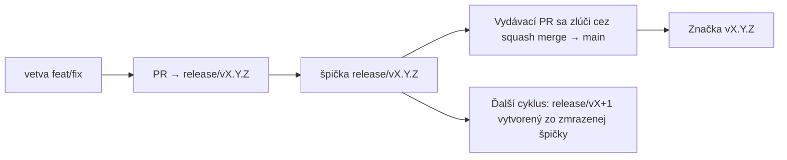

# Branching & Release Model (Slovenčina)

🌐 **Languages:** 🇺🇸 [English](../../../../ops/BRANCHING_MODEL.md) · 🇪🇹 [am](../../../am/docs/ops/BRANCHING_MODEL.md) · 🇸🇦 [ar](../../../ar/docs/ops/BRANCHING_MODEL.md) · 🇦🇿 [az](../../../az/docs/ops/BRANCHING_MODEL.md) · 🇧🇬 [bg](../../../bg/docs/ops/BRANCHING_MODEL.md) · 🇧🇩 [bn](../../../bn/docs/ops/BRANCHING_MODEL.md) · 🇧🇦 [bs](../../../bs/docs/ops/BRANCHING_MODEL.md) · 🇨🇿 [cs](../../../cs/docs/ops/BRANCHING_MODEL.md) · 🇩🇰 [da](../../../da/docs/ops/BRANCHING_MODEL.md) · 🇩🇪 [de](../../../de/docs/ops/BRANCHING_MODEL.md) · 🇬🇷 [el](../../../el/docs/ops/BRANCHING_MODEL.md) · 🇪🇸 [es](../../../es/docs/ops/BRANCHING_MODEL.md) · 🇪🇪 [et](../../../et/docs/ops/BRANCHING_MODEL.md) · 🇮🇷 [fa](../../../fa/docs/ops/BRANCHING_MODEL.md) · 🇫🇮 [fi](../../../fi/docs/ops/BRANCHING_MODEL.md) · 🇫🇷 [fr](../../../fr/docs/ops/BRANCHING_MODEL.md) · 🇮🇪 [ga](../../../ga/docs/ops/BRANCHING_MODEL.md) · 🇮🇳 [gu](../../../gu/docs/ops/BRANCHING_MODEL.md) · 🇳🇬 [ha](../../../ha/docs/ops/BRANCHING_MODEL.md) · 🇮🇱 [he](../../../he/docs/ops/BRANCHING_MODEL.md) · 🇮🇳 [hi](../../../hi/docs/ops/BRANCHING_MODEL.md) · 🇭🇷 [hr](../../../hr/docs/ops/BRANCHING_MODEL.md) · 🇭🇺 [hu](../../../hu/docs/ops/BRANCHING_MODEL.md) · 🇦🇲 [hy](../../../hy/docs/ops/BRANCHING_MODEL.md) · 🇮🇩 [id](../../../id/docs/ops/BRANCHING_MODEL.md) · 🇳🇬 [ig](../../../ig/docs/ops/BRANCHING_MODEL.md) · 🇮🇹 [it](../../../it/docs/ops/BRANCHING_MODEL.md) · 🇯🇵 [ja](../../../ja/docs/ops/BRANCHING_MODEL.md) · 🇬🇪 [ka](../../../ka/docs/ops/BRANCHING_MODEL.md) · 🇰🇭 [km](../../../km/docs/ops/BRANCHING_MODEL.md) · 🇮🇳 [kn](../../../kn/docs/ops/BRANCHING_MODEL.md) · 🇰🇷 [ko](../../../ko/docs/ops/BRANCHING_MODEL.md) · 🇱🇹 [lt](../../../lt/docs/ops/BRANCHING_MODEL.md) · 🇱🇻 [lv](../../../lv/docs/ops/BRANCHING_MODEL.md) · 🇮🇳 [ml](../../../ml/docs/ops/BRANCHING_MODEL.md) · 🇮🇳 [mr](../../../mr/docs/ops/BRANCHING_MODEL.md) · 🇲🇾 [ms](../../../ms/docs/ops/BRANCHING_MODEL.md) · 🇲🇹 [mt](../../../mt/docs/ops/BRANCHING_MODEL.md) · 🇲🇲 [my](../../../my/docs/ops/BRANCHING_MODEL.md) · 🇳🇵 [ne](../../../ne/docs/ops/BRANCHING_MODEL.md) · 🇳🇱 [nl](../../../nl/docs/ops/BRANCHING_MODEL.md) · 🇳🇴 [no](../../../no/docs/ops/BRANCHING_MODEL.md) · 🇮🇳 [or](../../../or/docs/ops/BRANCHING_MODEL.md) · 🇮🇳 [pa](../../../pa/docs/ops/BRANCHING_MODEL.md) · 🇵🇭 [phi](../../../phi/docs/ops/BRANCHING_MODEL.md) · 🇵🇱 [pl](../../../pl/docs/ops/BRANCHING_MODEL.md) · 🇵🇹 [pt](../../../pt/docs/ops/BRANCHING_MODEL.md) · 🇧🇷 [pt-BR](../../../pt-BR/docs/ops/BRANCHING_MODEL.md) · 🇷🇴 [ro](../../../ro/docs/ops/BRANCHING_MODEL.md) · 🇷🇺 [ru](../../../ru/docs/ops/BRANCHING_MODEL.md) · 🇱🇰 [si](../../../si/docs/ops/BRANCHING_MODEL.md) · 🇸🇮 [sl](../../../sl/docs/ops/BRANCHING_MODEL.md) · 🇷🇸 [sr](../../../sr/docs/ops/BRANCHING_MODEL.md) · 🇸🇪 [sv](../../../sv/docs/ops/BRANCHING_MODEL.md) · 🇰🇪 [sw](../../../sw/docs/ops/BRANCHING_MODEL.md) · 🇮🇳 [ta](../../../ta/docs/ops/BRANCHING_MODEL.md) · 🇮🇳 [te](../../../te/docs/ops/BRANCHING_MODEL.md) · 🇹🇭 [th](../../../th/docs/ops/BRANCHING_MODEL.md) · 🇹🇷 [tr](../../../tr/docs/ops/BRANCHING_MODEL.md) · 🇺🇦 [uk-UA](../../../uk-UA/docs/ops/BRANCHING_MODEL.md) · 🇵🇰 [ur](../../../ur/docs/ops/BRANCHING_MODEL.md) · 🇺🇿 [uz](../../../uz/docs/ops/BRANCHING_MODEL.md) · 🇻🇳 [vi](../../../vi/docs/ops/BRANCHING_MODEL.md) · 🇳🇬 [yo](../../../yo/docs/ops/BRANCHING_MODEL.md) · 🇨🇳 [zh-CN](../../../zh-CN/docs/ops/BRANCHING_MODEL.md) · 🇹🇼 [zh-TW](../../../zh-TW/docs/ops/BRANCHING_MODEL.md)

---

OmniRoute používa model vydávania s **paralelnými cyklami**: vyhradenú vetvu `release/vX.Y.Z`
pre aktívny cyklus, `main` pre publikovanú líniu a nemennú
značku `vX.Y.Z` pri vydaní daného cyklu. Je očakávané, že commity pribúdajú vo vetvách `release/*` _aj_
`main` — nejde o omyl.

Podrobnosti pre správcov sa nachádzajú v súbore `CLAUDE.md` (Prísne pravidlo č. 21) a
[RELEASE_CHECKLIST.md](./RELEASE_CHECKLIST.md). Táto stránka je verejné
zhrnutie určené pre prispievateľov.

## Stručný prehľad

| Ref               | Úloha                                                                                       |
| ----------------- | ------------------------------------------------------------------------------------------- |
| `release/vX.Y.Z`  | **Aktívny cyklus** — každodenný vývoj a zlučovanie PR pre danú verziu                       |
| `main`            | **Publikovaná línia** — prijme cyklus prostredníctvom squash merge pri vydaní               |
| `vX.Y.Z` (značka) | **Označenie vydania** — nemenný ukazovateľ „toho, čo bolo vydané“, vytvorený v čase vydania |



## Na ktorú vetvu má cieliť môj PR?

**Cieľte na aktívnu vetvu `release/vX.Y.Z` — nie na `main`.**

1. Nájdite najvyššiu otvorenú vetvu `release/v*` (príklad v čase písania:
   `release/v3.8.49`).
2. Vytvorte vetvu z jej špičky (`git fetch` + checkout / rebase na ňu).
3. Otvorte PR s nastavením **base = daná vetva `release/vX.Y.Z`**.

`main` nie je vetva na každodennú integráciu. PR otvorené voči `main`
zvyčajne treba pred zlúčením presmerovať.

## Zmrazenie vydania (paralelné cykly)

Keď prebieha zosúlaďovanie vydania, otvorí sa označovací issue so štítkom `release-freeze`.
To **nezastavuje vývoj**:

- Zmrazená vetva `release/vX.Y.Z` patrí počas daného vydania vedúcemu vydania.
- Vetva ďalšieho cyklu `release/vX+1` sa vytvorí zo zmrazenej špičky, aby prispievatelia mohli
  pokračovať v začleňovaní zmien.
- Otvorené PR, ktoré stále cielia na zmrazenú vetvu, treba **presmerovať** na
  aktívnu (najvyššiu) vetvu `release/v*`.

Predpoklad, že požadovanú vetvu možno zlučovať, si najskôr overte kontrolou otvoreného zmrazenia:

```bash
gh issue list --repo diegosouzapw/OmniRoute --label release-freeze --state open
```

Mechanizmus zlučovania (štítok vlastníka `queue` → Mergify) je zdokumentovaný v
[MERGE_TRAIN.md](./MERGE_TRAIN.md).

## Prečo vetva aj značka?

| Artefakt         | Životnosť           | Účel                                                                           |
| ---------------- | ------------------- | ------------------------------------------------------------------------------ |
| `release/vX.Y.Z` | Prebiehajúci cyklus | Zhromažďuje skontrolované PR, zostáva v zelenom stave CI a slúži ako základ PR |
| Značka `vX.Y.Z`  | Navždy              | Označuje presný obsah vydaný do npm / GitHub Releases                          |

Vetva je dielňa; značka je zapečatený balík. Po zlúčení do
`main` cez squash merge pokračuje ďalší cyklus vo vetve `release/vX+1` bez čakania na dokončenie predchádzajúceho
vydávacieho PR.

## Súvisiaca dokumentácia

- [CONTRIBUTING.md](../../CONTRIBUTING.md) — nastavenie, testy, kontrolný zoznam PR
- [RELEASE_CHECKLIST.md](./RELEASE_CHECKLIST.md) — overenie pred vydaním
- [MERGE_TRAIN.md](./MERGE_TRAIN.md) — front zlučovania a záložný zlučovací proces
- [RELEASE_GREEN.md](./RELEASE_GREEN.md) — udržiavanie špičky vydania v zelenom stave
