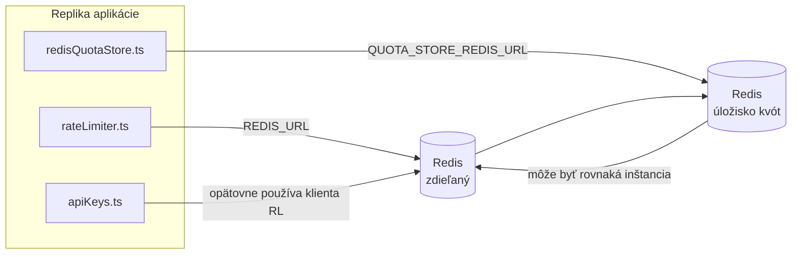

# Redis Production Configuration Guide (Slovenčina)

🌐 **Languages:** 🇺🇸 [English](../../../../ops/REDIS_PRODUCTION_CONFIG.md) · 🇪🇹 [am](../../../am/docs/ops/REDIS_PRODUCTION_CONFIG.md) · 🇸🇦 [ar](../../../ar/docs/ops/REDIS_PRODUCTION_CONFIG.md) · 🇦🇿 [az](../../../az/docs/ops/REDIS_PRODUCTION_CONFIG.md) · 🇧🇬 [bg](../../../bg/docs/ops/REDIS_PRODUCTION_CONFIG.md) · 🇧🇩 [bn](../../../bn/docs/ops/REDIS_PRODUCTION_CONFIG.md) · 🇨🇿 [cs](../../../cs/docs/ops/REDIS_PRODUCTION_CONFIG.md) · 🇩🇰 [da](../../../da/docs/ops/REDIS_PRODUCTION_CONFIG.md) · 🇩🇪 [de](../../../de/docs/ops/REDIS_PRODUCTION_CONFIG.md) · 🇬🇷 [el](../../../el/docs/ops/REDIS_PRODUCTION_CONFIG.md) · 🇪🇸 [es](../../../es/docs/ops/REDIS_PRODUCTION_CONFIG.md) · 🇪🇪 [et](../../../et/docs/ops/REDIS_PRODUCTION_CONFIG.md) · 🇮🇷 [fa](../../../fa/docs/ops/REDIS_PRODUCTION_CONFIG.md) · 🇫🇮 [fi](../../../fi/docs/ops/REDIS_PRODUCTION_CONFIG.md) · 🇫🇷 [fr](../../../fr/docs/ops/REDIS_PRODUCTION_CONFIG.md) · 🇮🇪 [ga](../../../ga/docs/ops/REDIS_PRODUCTION_CONFIG.md) · 🇮🇳 [gu](../../../gu/docs/ops/REDIS_PRODUCTION_CONFIG.md) · 🇳🇬 [ha](../../../ha/docs/ops/REDIS_PRODUCTION_CONFIG.md) · 🇮🇱 [he](../../../he/docs/ops/REDIS_PRODUCTION_CONFIG.md) · 🇮🇳 [hi](../../../hi/docs/ops/REDIS_PRODUCTION_CONFIG.md) · 🇭🇷 [hr](../../../hr/docs/ops/REDIS_PRODUCTION_CONFIG.md) · 🇭🇺 [hu](../../../hu/docs/ops/REDIS_PRODUCTION_CONFIG.md) · 🇦🇲 [hy](../../../hy/docs/ops/REDIS_PRODUCTION_CONFIG.md) · 🇮🇩 [id](../../../id/docs/ops/REDIS_PRODUCTION_CONFIG.md) · 🇳🇬 [ig](../../../ig/docs/ops/REDIS_PRODUCTION_CONFIG.md) · 🇮🇹 [it](../../../it/docs/ops/REDIS_PRODUCTION_CONFIG.md) · 🇯🇵 [ja](../../../ja/docs/ops/REDIS_PRODUCTION_CONFIG.md) · 🇬🇪 [ka](../../../ka/docs/ops/REDIS_PRODUCTION_CONFIG.md) · 🇰🇭 [km](../../../km/docs/ops/REDIS_PRODUCTION_CONFIG.md) · 🇮🇳 [kn](../../../kn/docs/ops/REDIS_PRODUCTION_CONFIG.md) · 🇰🇷 [ko](../../../ko/docs/ops/REDIS_PRODUCTION_CONFIG.md) · 🇱🇹 [lt](../../../lt/docs/ops/REDIS_PRODUCTION_CONFIG.md) · 🇱🇻 [lv](../../../lv/docs/ops/REDIS_PRODUCTION_CONFIG.md) · 🇮🇳 [ml](../../../ml/docs/ops/REDIS_PRODUCTION_CONFIG.md) · 🇮🇳 [mr](../../../mr/docs/ops/REDIS_PRODUCTION_CONFIG.md) · 🇲🇾 [ms](../../../ms/docs/ops/REDIS_PRODUCTION_CONFIG.md) · 🇲🇹 [mt](../../../mt/docs/ops/REDIS_PRODUCTION_CONFIG.md) · 🇲🇲 [my](../../../my/docs/ops/REDIS_PRODUCTION_CONFIG.md) · 🇳🇵 [ne](../../../ne/docs/ops/REDIS_PRODUCTION_CONFIG.md) · 🇳🇱 [nl](../../../nl/docs/ops/REDIS_PRODUCTION_CONFIG.md) · 🇳🇴 [no](../../../no/docs/ops/REDIS_PRODUCTION_CONFIG.md) · 🇮🇳 [or](../../../or/docs/ops/REDIS_PRODUCTION_CONFIG.md) · 🇮🇳 [pa](../../../pa/docs/ops/REDIS_PRODUCTION_CONFIG.md) · 🇵🇭 [phi](../../../phi/docs/ops/REDIS_PRODUCTION_CONFIG.md) · 🇵🇱 [pl](../../../pl/docs/ops/REDIS_PRODUCTION_CONFIG.md) · 🇵🇹 [pt](../../../pt/docs/ops/REDIS_PRODUCTION_CONFIG.md) · 🇧🇷 [pt-BR](../../../pt-BR/docs/ops/REDIS_PRODUCTION_CONFIG.md) · 🇷🇴 [ro](../../../ro/docs/ops/REDIS_PRODUCTION_CONFIG.md) · 🇷🇺 [ru](../../../ru/docs/ops/REDIS_PRODUCTION_CONFIG.md) · 🇱🇰 [si](../../../si/docs/ops/REDIS_PRODUCTION_CONFIG.md) · 🇸🇮 [sl](../../../sl/docs/ops/REDIS_PRODUCTION_CONFIG.md) · 🇷🇸 [sr](../../../sr/docs/ops/REDIS_PRODUCTION_CONFIG.md) · 🇸🇪 [sv](../../../sv/docs/ops/REDIS_PRODUCTION_CONFIG.md) · 🇰🇪 [sw](../../../sw/docs/ops/REDIS_PRODUCTION_CONFIG.md) · 🇮🇳 [ta](../../../ta/docs/ops/REDIS_PRODUCTION_CONFIG.md) · 🇮🇳 [te](../../../te/docs/ops/REDIS_PRODUCTION_CONFIG.md) · 🇹🇭 [th](../../../th/docs/ops/REDIS_PRODUCTION_CONFIG.md) · 🇹🇷 [tr](../../../tr/docs/ops/REDIS_PRODUCTION_CONFIG.md) · 🇺🇦 [uk-UA](../../../uk-UA/docs/ops/REDIS_PRODUCTION_CONFIG.md) · 🇵🇰 [ur](../../../ur/docs/ops/REDIS_PRODUCTION_CONFIG.md) · 🇺🇿 [uz](../../../uz/docs/ops/REDIS_PRODUCTION_CONFIG.md) · 🇻🇳 [vi](../../../vi/docs/ops/REDIS_PRODUCTION_CONFIG.md) · 🇳🇬 [yo](../../../yo/docs/ops/REDIS_PRODUCTION_CONFIG.md) · 🇨🇳 [zh-CN](../../../zh-CN/docs/ops/REDIS_PRODUCTION_CONFIG.md) · 🇹🇼 [zh-TW](../../../zh-TW/docs/ops/REDIS_PRODUCTION_CONFIG.md)

---

## Prehľad

Redis je v OmniRoute **voliteľná, nepovinná závislosť** — keď Redis nie je dostupný, aplikácia sa plynulo prepne na záložné riešenia v pamäti. V produkcii ladenie Redisu znižuje latenciu štyroch odlišných pracovných záťaží:

| Pracovná záťaž                      | Ovládač                       | Továreň klienta                                                       | Vzor kľúča                                              |
| ----------------------------------- | ----------------------------- | --------------------------------------------------------------------- | ------------------------------------------------------- |
| Obmedzovanie frekvencie požiadaviek | `rateLimiter.ts`              | `getRedisClient()` — lenivo inicializovaná jediná inštancia `ioredis` | `<prefix>rl:*` Lua-atómové okná obmedzovania frekvencie |
| Vyrovnávacia pamäť autentifikácie   | `apiKeys.ts`                  | Opätovne používa klienta z `rateLimiter`                              | `<prefix>auth:api_key:<sha256>` s TTL                   |
| Úložisko kvót                       | `redisQuotaStore.ts`          | Samostatná jediná inštancia `getRedisClient(url)`                     | `<prefix>quota:*` konfigurovateľné pre každú inštanciu  |
| Istič zahrievania                   | `redisCircuitBreakerStore.ts` | Samostatný klient v `circuitBreakerFactory.ts`                        | `<prefix>warmup:cb:<connectionId>`                      |

Všetky štyri pracovné záťaže zdieľajú jednu predponu menného priestoru, aby mohol OmniRoute koexistovať s inými aplikáciami v jednej inštancii Redis (napr. `127.0.0.1:6379`). Pozrite si časť [Menné priestory kľúčov](#key-namespacing).

---

## Aktuálna konfigurácia (predvolené hodnoty v kóde)

| Nastavenie                                  | Hodnota                                                                           | Kde                                                                                   |
| ------------------------------------------- | --------------------------------------------------------------------------------- | ------------------------------------------------------------------------------------- |
| Premenná prostredia `REDIS_URL`             | `redis://redis:6379` (compose), voliteľná                                         | `rateLimiter.ts:5`, `.env.example`                                                    |
| Premenná prostredia `REDIS_KEY_PREFIX`      | `omniroute:` (predvolená hodnota)                                                 | `rateLimiter.ts`, `redisQuotaStore.ts`, `redisCircuitBreakerStore.ts`, `.env.example` |
| Premenná prostredia `QUOTA_STORE_REDIS_URL` | samostatná, môže sa líšiť od `REDIS_URL`                                          | `quota/storeFactory.ts`                                                               |
| `QUOTA_STORE_DRIVER`                        | `"sqlite"` (predvolená hodnota), voliteľne `"redis"`                              | `quota/storeFactory.ts`                                                               |
| `maxRetriesPerRequest` v ioredis            | `3`                                                                               | vytvorenie klienta v `rateLimiter.ts`                                                 |
| `enableReadyCheck`                          | nenastavené (predvolená hodnota ioredis: `true`)                                  | —                                                                                     |
| `lazyConnect`                               | nenastavené (predvolená hodnota ioredis: `false`)                                 | —                                                                                     |
| `retryStrategy`                             | nenastavené (predvolená hodnota ioredis: základ 200 ms, exponenciálne zvyšovanie) | —                                                                                     |
| TLS / heslo / index databázy                | **nenakonfigurované**                                                             | —                                                                                     |
| Sentinel / Cluster                          | **nenakonfigurované** — podporovaný je iba samostatný jeden uzol                  | —                                                                                     |

---

## Menné priestory kľúčov

OmniRoute zdieľa inštanciu Redis so všetkým ostatným, čo je spustené na hostiteľovi. Bez menného priestoru by mohlo dôjsť ku kolízii kľúčov, ako sú `auth:api_key:<sha256>` alebo `rl:*`, s kľúčmi iných aplikácií používajúcich rovnaký Redis (táto inštancia používa Redis na adrese `127.0.0.1:6379` spolu s ďalšími službami).

Nastavte `REDIS_KEY_PREFIX` na neprázdny reťazec, ktorý sa pridá pred **každý** kľúč OmniRoute:

```bash
# .env — všetky kľúče OmniRoute budú mať podobu omniroute:rl:*, omniroute:auth:*, omniroute:quota:*, omniroute:warmup:cb:*
REDIS_KEY_PREFIX=omniroute:
```

- **Predvolená hodnota:** `omniroute:` (použije sa, keď `REDIS_KEY_PREFIX` nie je nastavená alebo je prázdna).
- **Používa sa pre:** obmedzovač frekvencie požiadaviek + vyrovnávaciu pamäť autentifikácie (zdieľaný klient `ioredis` prostredníctvom `keyPrefix`), úložisko kvót (`KEY_PREFIX = "${REDIS_KEY_PREFIX}quota"`) a istič zahrievania (`KEY_PREFIX = "${REDIS_KEY_PREFIX}warmup:cb:"`).
- **Zmena predpony**, keď už kľúče v Redis existujú, spôsobí, že staré kľúče zostanú nepoužívané (ich platnosť skončí prostredníctvom TTL / LRU). Zmena je bezpečná; migrácia nie je potrebná. Jedinou výnimkou je kľúč ističa zahrievania pre pripojenie označené ako zakázané: ukladá sa bez TTL, preto zostávajúce kľúče vypíšte pomocou `redis-cli --scan --pattern '<old-prefix>warmup:cb:*'` a odstráňte ich.
- **`keyPrefix` v ioredis** automaticky pridáva predponu pri zápise **a** odstraňuje ju pri čítaní, takže aplikačný kód predponu nikdy nevidí.

---

## Odporúčané nastavenie pre produkciu

### 1. Fond pripojení / možnosti klienta (konštruktor `Redis` z ioredis)

Aktuálny kód vytvára jedinú inštanciu `new Redis(url)` bez vlastných možností. Pri produkčných nasadeniach s viacerými replikami odovzdajte v kóde továreň klienta alebo obaľte `getRedisClient()`:

```typescript
const redis = new Redis(REDIS_URL, {
  maxRetriesPerRequest: null, // bez obmedzenia počtu opakovaní; rozhoduje retryStrategy
  enableReadyCheck: true, // pred prijatím volaní overí, či je server pripravený
  lazyConnect: true, // nepripája sa pri vytvorení; počká na prvé volanie
  retryStrategy: (times) => {
    if (times > 10) return null; // po 10 pokusoch to vzdá → neskôr sa znova pripojí
    return Math.min(times * 200, 5000); // 200 ms, 400 ms, …, maximum 5 s
  },
  enableAutoPipelining: true, // zlúči súbežné príkazy do jedného zápisu TCP
  keepAlive: 10000, // udržiavanie spojenia TCP každých 10 s
});
```

**Hlavné kompromisy:**

- `maxRetriesPerRequest: null` + `retryStrategy` — preferované pre produkciu, aby prechodné reštarty Redis nespôsobili okamžité zlyhanie každej požiadavky. Záložný mechanizmus v pamäti v `checkRateLimit()` pokrýva cestu pri zlyhaní.
- `lazyConnect: true` — zabraňuje tomu, aby spustenie záviselo od dostupnosti Redis ešte predtým, než server začne prijímať pripojenia.
- `enableAutoPipelining: true` — znižuje počet spiatočných ciest pri súbežných kontrolách obmedzenia rýchlosti; užitočné pri >50 RPS na jednom pripojení.

### 2. Konfigurácia servera Redis (`redis.conf`)

```
# Pamäť
maxmemory 80%                        # ponechá priestor pre vyrovnávaciu pamäť stránok OS
maxmemory-policy allkeys-lru         # pri nedostatku pamäte odstráni zastarané položky autentifikačnej vyrovnávacej pamäte

# Perzistencia (voliteľná — OmniRoute je bezpečný pri havárii aj bez nej)
save 300 1                           # snímka aspoň každých 5 min, ak sa zmenil ≥1 kľúč
appendonly no                        # AOF nie je potrebné; údaje možno znova vygenerovať
appendfsync no                       # bez réžie fsync (RDB postačuje)

# Sieť
timeout 0                            # neodpája neaktívne pripojenia
tcp-keepalive 300                    # udržiavanie spojenia každých 5 min
tcp-backlog 511                      # front pripojení pre nárazové zaťaženie

# Výkon
hz 10                                # predvolená hodnota; 100 pre systémy citlivé na latenciu
activedefrag yes                     # automatická defragmentácia pri fragmentácii >10 %
```

**Kompromis pri `maxmemory-policy allkeys-lru`:** Položky autentifikačnej vyrovnávacej pamäte môžu byť pri nedostatku pamäte odstránené. Je to bezpečné — `setCachedApiKey` ich pri nenájdení vždy znova naplní a záložné úložisko SQLite je autoritatívne. Skript Lua na obmedzenie rýchlosti vytvára malé kľúče, ktoré sú zámerne krátkodobé.

### 3. Nastavenia Docker Compose

Produkčný súbor Compose (`docker-compose.prod.yml`) používa `redis:8.6.2-alpine`. Pridajte:

```yaml
redis:
  image: redis:8.6.2-alpine
  command:
    [
      "redis-server",
      "--maxmemory",
      "512mb",
      "--maxmemory-policy",
      "allkeys-lru",
      "--activedefrag",
      "yes",
      "--save",
      "300 1",
    ]
  healthcheck:
    test: ["CMD", "redis-cli", "ping"]
    interval: 10s
    timeout: 3s
    retries: 3
    start_period: 5s
```

### 4. Aspekty viacerých inštancií / škálovania

**Jeden Redis pre všetky repliky** — skript Lua na obmedzenie rýchlosti závisí od jediného autoritatívneho priestoru kľúčov. Viaceré inštancie Redis za replikami by narušili atomicitu a zdvojnásobili limit. Pre všetky repliky aplikácie používajte jeden Redis (alebo klaster Redis Sentinel s prepnutím pri zlyhaní).

**Počet pripojení:** Každá replika aplikácie otvára **2 pripojenia TCP** k Redis (klient obmedzovača rýchlosti + klient úložiska kvót). Pri 10 replikách → 20 pripojení, čo je výrazne pod predvoleným limitom 10-tisíc pripojení inštancie Redis.

### 5. Monitorovanie

Sprístupnite prostredníctvom koncového bodu kontroly stavu:

```typescript
// src/app/api/monitoring/health/route.ts už volá funkcie rateLimiter
// Pridajte kontroly špecifické pre Redis:
//   1. Latencia PING prostredníctvom ioredis .ping()
//   2. Využitie pamäte prostredníctvom INFO memory
//   3. Počet pripojení prostredníctvom INFO clients
//   4. Miera zásahov pre maxmemory-policy (evicted_keys / keyspace_hits)
```

Kľúčové metriky, ktoré treba sledovať:

- **Odstránené kľúče/s** — ak je hodnota trvalo nenulová, zvýšte `maxmemory`
- **Blokovaní klienti** — nenulová hodnota naznačuje pomalé skripty Lua alebo vysoký súbeh
- **Odmietnuté pripojenia** — bol dosiahnutý limit pripojení; pri 20 pripojeniach je to zriedkavé

---

## Diagram architektúry



---

## Referencie

| Súbor                              | Účel                                                                                              |
| ---------------------------------- | ------------------------------------------------------------------------------------------------- |
| `src/shared/utils/rateLimiter.ts`  | Primárny klient Redis, Lua skript na obmedzenie frekvencie požiadaviek, záložné riešenie v pamäti |
| `src/lib/db/apiKeys.ts`            | Vyrovnávacia pamäť autentifikácie — záložný prechod z Redis na SQLite                             |
| `src/lib/quota/redisQuotaStore.ts` | Samostatný klient Redis pre voliteľné úložisko kvót                                               |
| `src/lib/quota/storeFactory.ts`    | Prepína medzi ovládačmi kvót `sqlite` a `redis`                                                   |
| `docker-compose.prod.yml`          | Produkčný kontajner Redis (obraz `redis:8.6.2-alpine`)                                            |
| `.env.example`                     | Dokumentácia premenných prostredia Redis                                                          |
| `src/app/api/local/redis/`         | Trasy API na orchestráciu vývojového kontajnera                                                   |
| `bin/cli/commands/redis.mjs`       | Príkazy CLI na orchestráciu vývojového kontajnera                                                 |
